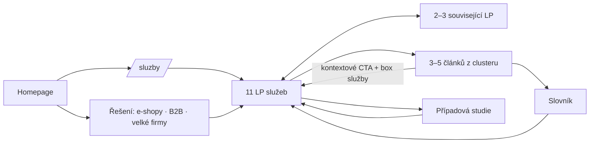

# Architektura webu, šablona landing page a sdílené komponenty

Tento dokument je **společný základ pro všechna zadání LP** v této složce (`01_…` až `15_…`). Každé zadání LP odkazuje na komponenty a pravidla definovaná zde.

Vstupy: `../01_konkurence/00_analyza-konkurence.md`, `../02_klicova-slova/00_analyza-klicovych-slov.md`, `../02_klicova-slova/data/kw_mapovani_na_stranky.tsv`, `../05_formulare/specifikace-formularu.md`.

---

## 1. Strom webu (sitemapa)

```
/                                         Homepage
├── /sluzby                               Rozcestník služeb (hub)
│   ├── Sběr dat
│   │   ├── /sluzby/implementace-ga4               01 Implementace GA4
│   │   ├── /sluzby/google-tag-manager             02 Google Tag Manager
│   │   ├── /sluzby/datova-vrstva                  03 Datová vrstva (dataLayer)
│   │   ├── /sluzby/server-side-tracking           04 Server-side tracking
│   │   ├── /sluzby/cookie-lista-consent-mode      05 Cookie lišta a Consent Mode v2
│   │   └── /sluzby/mereni-konverzi                06 Měření konverzí (Google Ads, Meta, Sklik, Heureka…)
│   ├── Data a reporting
│   │   ├── /sluzby/bigquery                       07 BigQuery a datový sklad pro marketing
│   │   └── /sluzby/dashboardy-a-reporting         08 Dashboardy a reporting (Data Studio, Power BI)
│   └── Audity a správa
│       ├── /sluzby/audit-mereni                   09 Audit měření
│       ├── /sluzby/technicky-audit-webu           10 Technický audit webu
│       └── /sluzby/sprava-webu-a-mereni           11 Správa webu a měření
├── /reseni
│   ├── /reseni/e-shopy                            12 Měření pro e-shopy
│   ├── /reseni/b2b-a-lead-generation              13 Měření pro B2B a lead generation
│   └── /reseni/velke-firmy                        14 Měření pro velké firmy
├── /jak-pracujeme                                 15 Jak pracujeme (proces, měřicí plán, validace)
├── /pripadove-studie                              Případové studie (+ /pripadove-studie/{slug})
├── /o-nas                                         O nás (Vít Novotný + tým, přístup, jak měříme vlastní web)
├── /kontakt                                       Kontakt (nativní formulář, telefon, e-mail)
├── /blog                                          Blog (+ /blog/{kategorie}, /blog/{slug})
│   └── /blog/autor/{slug}                         Stránka autora (např. /blog/autor/vit-novotny)
├── /slovnik                                       Slovník pojmů (+ /slovnik/{pojem})
├── /nastroje                                      Nástroje zdarma – každý na vlastní URL:
│   ├── /nastroje/utm-builder                      (utm builder 1 100 hledání/měs.)
│   ├── /nastroje/kontrola-consentu                (co web posílá před souhlasem)
│   ├── /nastroje/datalayer-validator
│   └── /nastroje/kalkulacka-ztraty-konverzi
├── /zpracovani-osobnich-udaju                     Zásady zpracování OÚ
├── /cookies                                       Zásady cookies + odkaz „změnit nastavení“
└── /dekujeme                                      Děkovací stránka (noindex) – fallback formuláře bez JS
```

**Proč tolik LP:** konkurence (Digitální architekti ~60 produktových stránek, khoder.cz samostatné LP pro GA4/GTM/consent/konverze) ukazuje, že Google v tomto oboru odměňuje **jednu stránku = jeden úkol**. Současných 6 služeb stagingu má 32–41 slov a pokrývá jen 6 témat.

**Fáze 2 (po 3–6 měsících podle dat):** platformní podstránky (`/reseni/e-shopy/shoptet`, `/upgates`, `/woocommerce`, `/shopify`), samostatné LP *Meta Conversions API*, *Seznam Event Measurement / Sklik*, *Google Tag Gateway*, firemní školení GA4/GTM (`/sluzby/firemni-skoleni-ga4-gtm`).

### 1.1 Přesměrování ze stagingu (301)
| Staré URL | Nové URL |
|---|---|
| `/sluzby/ga4` | `/sluzby/implementace-ga4` |
| `/sluzby/gtm` | `/sluzby/google-tag-manager` |
| `/sluzby/serverSide` | `/sluzby/server-side-tracking` |
| `/sluzby/dataLayer` | `/sluzby/datova-vrstva` |
| `/sluzby/datalayer` | `/sluzby/datova-vrstva` |
| `/sluzby/audit` | `/sluzby/audit-mereni` |
| `/sluzby/bigquery` | `/sluzby/bigquery` (beze změny) |
| `/privacy` | `/zpracovani-osobnich-udaju` |
| `/blog/server-side-gtm-uvod` | `/blog/server-side-tracking-pruvodce` (rozšířit, viz `06_clanky/`) |
| `/blog/ga4-bigquery-export` | `/blog/ga4-bigquery-export` (rozšířit) |
| všechny URL s velkými písmeny / koncovým lomítkem | lowercase bez lomítka |

---

## 2. Navigace

**Hlavní menu (desktop):** `Služby ▾` · `Řešení ▾` · `Případové studie` · `Blog` · `O nás` · CTA tlačítko `[ Konzultovat projekt ]` (→ kotva `#kontakt` na aktuální stránce; na stránkách bez bloku → `/kontakt`).

**Mega-menu „Služby“** – 3 sloupce podle architektury (Sběr dat / Data a reporting / Audity a správa). Každá položka = **vlastní piktogram** (viz kap. 5) + název + 1 řádek „co to řeší“ (max. 45 znaků), např.:
- Implementace GA4 – *čísla, která sedí s tržbami*
- Google Tag Manager – *pořádek v tazích a verzích*
- Datová vrstva – *zadání pro vývojáře, které funguje*
- Server-side tracking – *měření na vaší doméně*
- Cookie lišta a Consent Mode – *souhlas legálně a bez ztráty dat*
- Měření konverzí – *Ads, Meta, Sklik i Heureka vidí totéž*
- BigQuery – *surová data bez limitů GA4*
- Dashboardy a reporting – *Data Studio (dříve Looker Studio) i Power BI*
- Audit měření – *zjistíme, kde data utíkají*
- Technický audit webu – *rychlost, tagy a technické SEO*
- Správa webu a měření – *hlídáme, aby měření nepřestalo fungovat*

**Mega-menu „Řešení“:** E-shopy · B2B a lead generation · Velké firmy · (oddělovač) Jak pracujeme.

**Mobil:** akordeon se stejnou strukturou, sticky spodní lišta se 2 akcemi: `Zavolat` (`tel:`) a `Napsat` (kotva na formulář).

**Patička:** 4 sloupce – Služby (11 odkazů) · Řešení + Jak pracujeme · Obsah (Blog, Slovník, Nástroje, Případové studie) · Kontakt (telefon, e-mail `mailto:`, LinkedIn – klikací, IČO, fakturační údaje) · spodní řádek: Zpracování osobních údajů · Cookies · **Nastavení cookies** (otevře lištu).

---

## 3. Model interního prolinkování



Pravidla:
- Každá LP odkazuje na **2–3 související LP** (sekce „Navazující služby“) a **3–5 článků** (sekce „Do hloubky“). Anchor = přesný název služby/článku, ne „více“.
- Každý článek má **1 hlavní cílovou LP** (box služby uprostřed textu + zkrácený kontaktní blok na konci), viz `06_clanky/`.
- Slovníková hesla odkazují na LP a na hlavní článek tématu.
- Breadcrumbs na všech podstránkách (+ `BreadcrumbList`).

---

## 4. Šablona landing page služby (pořadí sekcí)

Každé zadání LP níže popisuje konkrétní obsah těchto sekcí. Pořadí lze u jednotlivých LP upravit (je to uvedeno v zadání).

| # | Sekce (komponenta) | Účel | Povinná |
|---|---|---|---|
| 1 | **Hero** (`HeroService`) | H1 s hlavním klíčovým slovem, podtitul s výsledkem pro klienta, **rychlá odpověď** (40–60 slov, pro AI přehled), 2 CTA, technický vizuál | ✅ |
| 2 | **Trust bar** (`TrustBar`) | 3–4 fakta (např. „X implementací“, „Google Cloud / sGTM“, „dokumentace ke každému projektu“), loga klientů *jen pokud se týkají měření* | ✅ |
| 3 | **Problém / symptomy** (`SymptomCards`) | 4–6 konkrétních symptomů, které klient pozná („Meta hlásí o 40 % méně nákupů než e-shop“) – každý s vlastním piktogramem | ✅ |
| 4 | **Řešení / co uděláme** (`SolutionSteps` nebo `FeatureList`) | konkrétní technické kroky v jazyce byznysu | ✅ |
| 5 | **Diagram** (`DataFlowDiagram`) | SVG schéma toku dat specifické pro službu (zadání v každé LP) | ✅ |
| 6 | **Co dostanete** (`Deliverables`) | seznam výstupů (dokumenty, kontejnery, dashboardy, školení) – nahrazuje cenu | ✅ |
| 7 | **Postup a délka** (`ProcessTimeline`) | 4–6 kroků s typickou délkou (dny/týdny) a tím, co potřebujeme od klienta | ✅ |
| 8 | **Srovnání / tabulka** (`ComparisonTable`) | např. client-side vs. server-side, basic vs. advanced consent, Data Studio vs. Power BI | dle LP |
| 9 | **Případová studie** (`MiniCase`) | Problém → Příčina → Oprava → Výsledek (číslo) | ✅ (placeholder do dodání) |
| 10 | **Pro koho / segmenty** (`SegmentTabs`) | E-shop · B2B · Velká firma – 2–3 věty, co je jinak | dle LP |
| 11 | **FAQ** (`FAQ` + `FAQPage` schema) | 6–12 otázek z PAA/Ahrefs a z obchodních hovorů | ✅ |
| 12 | **Do hloubky** (`RelatedArticles`) | 3–5 článků | ✅ |
| 13 | **Navazující služby** (`RelatedServices`) | 2–3 karty | ✅ |
| 14 | **Kontakt** (`ContactBlock`) | nativní formulář dle `05_formulare/`, s `form_id` a předvybraným tématem | ✅ |

**Rozsah textu:** 1 200–2 200 slov viditelného textu (konkurence: khoder.cz 4 300, DA 1 000–1 300, ostatní 200–500). Delší text jen tam, kde přidává hodnotu (FAQ, srovnání).

**Ceny:** neuvádět (rozhodnutí klienta). Nejistotu snižují sekce *Co dostanete*, *Postup a délka* (dny/týdny), *Co od vás potřebujeme* a FAQ „Jak se tvoří cena?“ (rozsah, počet platforem, stav webu, server-side náklady Google Cloud hradí klient napřímo).

---

## 5. Vizuální systém: piktogramy a diagramy (náhrada generických ikon)

**Problém stagingu:** Font Awesome ikony (`chart-line`, `cookie`, `database`, `tags`, `server`, `cogs`, `project-diagram`, `search-dollar`) jsou generické – stejné by mohla mít účetní firma i hosting. Navíc se načítá celý Font Awesome (výkon).

**Nový systém – „technické piktogramy“:**
- Vlastní SVG sada, **line style**, tah 1,5 px, mřížka 32×32, zaoblené konce, barva `#00ffff` (na tmavém) / `#00b0b0` (na světlém), výplň jen akcentem 10 % opacity.
- Každý piktogram zobrazuje **konkrétní objekt z práce analytika**, ne obecný symbol. Volitelně s malým monospace štítkem (Roboto Mono 10 px), který navazuje na „kódový“ hero (`dataLayer.push`).
- Inline SVG (žádná ikonová knihovna) → rychlost + kontrola.

| Služba / téma | ❌ dnes (generické) | ✅ nový piktogram (popis pro ilustrátora) | Mono štítek |
|---|---|---|---|
| GA4 | sloupcový graf | Okno reportu s křivkou, ve které je vyznačený **„zlom“** a vedle něj malý znak = (čísla sedí) | `ga4` |
| GTM | štítek (tag) | **Kontejner** (krabice) se třemi „zásuvkami“ – tag / trigger / variable; na boku verze `v42` | `gtm` |
| Datová vrstva | (neexistuje, „project-diagram“) | Složené závorky `{ }` s vrstvami uvnitř (3 vodorovné linky) a šipkou ven | `dataLayer` |
| Server-side | server | Dvě domény: prohlížeč → **štít s vaší doménou** (`sgtm.vasweb.cz`) → rozbočení do 3 šipek | `sgtm` |
| Consent | sušenka | Přepínač **ON/OFF** s fajfkou a malým zámkem; vedle 4 malé tečky (signály consent mode) | `consent` |
| Konverze | – | Nákupní košík, ze kterého vychází **jedna** šipka, která se rozdělí do 3 log-teček (Ads / Meta / Sklik) se shodným číslem | `conversion` |
| BigQuery | lupa s dolarem | Tabulka (mřížka) nad **řádkem SQL** (`SELECT`), zkosená do perspektivy „sklad“ | `bq` |
| Dashboardy | – | Obrazovka se 2 dlaždicemi: KPI číslo + spark-line; vpravo dole symbol „sdílet“ | `report` |
| Audit měření | ozubená kola | **Lupa nad tagem** s červeným křížkem a zeleným ✓ (nalezená vs. opravená chyba) | `audit` |
| Technický audit | – | Rychloměr (gauge) + `</>` | `perf` |
| Správa | – | Kalendář s ✓ a „pulse“ křivkou (monitoring) | `monitor` |
| E-shopy | – | Účtenka s položkami `item_id` | `purchase` |
| B2B / leady | – | Formulář → **trychtýř** → kartička „deal“ (CRM) | `lead` |
| Velké firmy | – | Organizační strom se zámkem (governance) | `gov` |

**Diagramy toku dat (`DataFlowDiagram`)** – sjednocený vizuální jazyk s hero animací (uzly = čtverce s glow, spojnice = přerušovaná čára s pohybem, popisky monospace). Každá LP má zadaný **vlastní** diagram. Diagramy dodávat jako inline SVG (animace CSS, respektovat `prefers-reduced-motion`), na mobilu svisle.

**Mockupy rozhraní** (vzor khoder.cz, nextanalytica.cz): stylizované (ne screenshoty) výřezy GTM Preview, GA4 DebugView, Meta Events Manager (Event Match Quality), BigQuery konzole, Data Studio – v HTML/SVG, s fiktivními daty, v brand barvách.

**Grafy:** jen tam, kde nesou sdělení (např. „zachycené konverze před/po“). Knihovna: lehký inline SVG nebo Chart.js načítaný jen na dané stránce.

---

## 6. Copywriting – pravidla

**Výjimka:** H1 homepage („Stavíme neprůstřelné datové základy pro váš růst.“) zůstává – klient hero schválil.

**Názvy nástrojů:** Google v dubnu 2026 přejmenoval Looker Studio zpět na **Data Studio** (release notes 16. 4. 2026). Na webu psát „Data Studio (dříve Looker Studio)“, v titulcích a meta popiscích ponechat i „Looker Studio“ (hledanost 1 400/měs.).

**Tón:** technický inženýr, který umí vysvětlit byznysu. Konkrétní, klidný, bez superlativů. Tykání ne, **vykání**. Krátké věty.

**Slovník – používat / nepoužívat:**
| ❌ Nepoužívat | ✅ Místo toho |
|---|---|
| neprůstřelné datové základy, funkcionální ekosystém | měření, kterému věříte; data, která sedí s tržbami |
| obcházení blokátorů / adblocků | odolnější first-party měření, vždy v souladu se souhlasem |
| 100 % dat, všechny konverze | výrazně vyšší podíl zachycených konverzí (konkrétní číslo z case study) |
| GDPR compliant zaručeně | nastavené podle ZEK a doporučení ÚOOÚ; právní posouzení zajišťuje váš právník / partnerská advokátní kancelář |
| machine learning, AI (bez kontextu) | konkrétní využití (predikce, modelování konverzí v Google Ads) |

**Struktura textu:** H2 jako otázka nebo výsledek („Co od vás budeme potřebovat“, „Jak poznáte, že měření funguje“). Každá sekce začíná 1–2větnou odpovědí.

**Právní opatrnost (consent, osobní údaje):** formulace typu „podle § 89 odst. 3 zákona č. 127/2005 Sb. je k ukládání nenezbytných cookies potřeba souhlas“ s odkazem na zdroj; disclaimer „nejsme advokátní kancelář“ na LP Consent a v souvisejících článcích.

---

## 7. SEO šablona

| Prvek | Pravidlo |
|---|---|
| Title | `{Hlavní KW} – {benefit} \| datalayer.cz` (50–60 znaků) |
| Meta description | 140–155 znaků: problém → co uděláme → CTA („Konzultace zdarma“) |
| H1 | 1×, obsahuje hlavní KW, max. 60 znaků |
| URL | česky, lowercase, pomlčky, bez diakritiky |
| Canonical | self-referencing |
| Open Graph | `og:title`, `og:description`, `og:image` (1200×630, piktogram služby + H1 na tmavém pozadí) |
| Strukturovaná data | `Service` (provider: `Organization` datalayer.cz, areaServed: CZ) + `BreadcrumbList` + `FAQPage` (pozn.: Google od 7. 5. 2026 FAQ rich results nezobrazuje – ověřeno 10/2026, https://developers.google.com/search/updates (záznamy 8. 5. 2026 a 15. 6. 2026); FAQPage generovat automaticky z FAQ komponenty, nepočítat s rozšířeným výsledkem); na homepage `Organization` + `WebSite`; u článků `BlogPosting` s `author` (`Person`) |
| Obrázky | SVG inline (piktogramy, diagramy), raster jen WebP/AVIF s `width/height`, `alt` popisuje obsah diagramu |
| Výkon | žádný HubSpot, žádný celý Font Awesome; fonty self-host (Inter 400/600/800, Roboto Mono 400) |

---

## 8. Měření na LP (dataLayer kontrakt pro web datalayer.cz)

| Událost | Kdy | Parametry |
|---|---|---|
| `cta_click` | klik na CTA v hero / sekci | `cta_id`, `cta_text`, `section` |
| `diagram_interaction` | najetí/klik na uzel diagramu (pokud interaktivní) | `diagram_id`, `node` |
| `faq_open` | rozbalení otázky | `question` |
| `scroll_depth` | 50 / 90 % | `percent` |
| `lead_form_start`, `lead_form_error`, `generate_lead` | formulář | viz `05_formulare/specifikace-formularu.md` (ne `form_start` – koliduje s automatickou událostí GA4) |
| `tab_select` | přepnutí záložky (segmenty, platformy) | `tab_group`, `tab` |
| `code_copy` | kopírování ukázky kódu | `snippet_id` |
| `gallery_open` | otevření ukázky dashboardu | `item` |
| `contact_click` | klik na `tel:` / `mailto:` | `channel` (`phone`/`email`), `section` |
| `tool_use` | použití nástroje (UTM builder, kalkulačka) | `tool`, `action` |

---

## 9. Přehled zadání LP v této složce

| # | Soubor | Stránka | Priorita |
|---|---|---|---|
| 01 | `01_implementace-ga4.md` | /sluzby/implementace-ga4 | A |
| 02 | `02_google-tag-manager.md` | /sluzby/google-tag-manager | B |
| 03 | `03_datova-vrstva.md` | /sluzby/datova-vrstva | A |
| 04 | `04_server-side-tracking.md` | /sluzby/server-side-tracking | A |
| 05 | `05_cookie-lista-consent-mode.md` | /sluzby/cookie-lista-consent-mode | A |
| 06 | `06_mereni-konverzi.md` | /sluzby/mereni-konverzi | A |
| 07 | `07_bigquery.md` | /sluzby/bigquery | B |
| 08 | `08_dashboardy-a-reporting.md` | /sluzby/dashboardy-a-reporting | B |
| 09 | `09_audit-mereni.md` | /sluzby/audit-mereni | A |
| 10 | `10_technicky-audit-webu.md` | /sluzby/technicky-audit-webu | B |
| 11 | `11_sprava-webu-a-mereni.md` | /sluzby/sprava-webu-a-mereni | C |
| 12 | `12_reseni-e-shopy.md` | /reseni/e-shopy | A |
| 13 | `13_reseni-b2b-lead-generation.md` | /reseni/b2b-a-lead-generation | A |
| 14 | `14_reseni-velke-firmy.md` | /reseni/velke-firmy | B |
| 15 | `15_jak-pracujeme-a-podpurne-stranky.md` | /jak-pracujeme, /sluzby (hub), /o-nas, /kontakt, /pripadove-studie, /slovnik, /nastroje | B |
