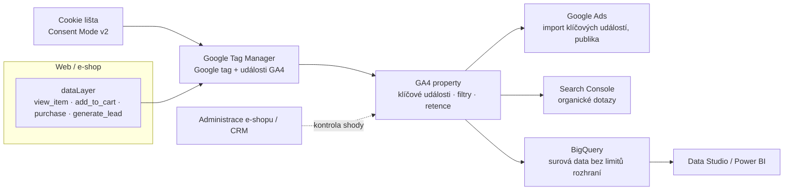
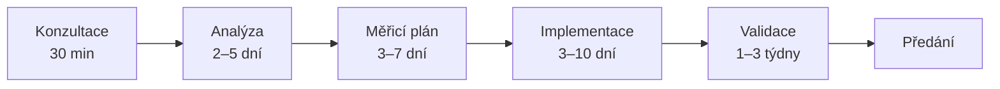

# LP 01: Implementace GA4 – zadání obsahu
> Stav: návrh v1 (8. 10. 2026) · Priorita: A · URL: `/sluzby/implementace-ga4` · Segmenty: e-shopy · B2B / lead-gen · velké firmy
> Navazuje na: `00_architektura-webu.md` (šablona LP, piktogramy, měření), `05_formulare/specifikace-formularu.md` (kontaktní blok), `06_clanky/00_obsahovy-plan.md` (články D1–D6, C5, F1)

---

## 0. Shrnutí

**Účel stránky:** Prodat implementaci GA4 jako *projekt s ověřeným výsledkem* (data sedí s administrací e-shopu nebo CRM), ne jako „vložení kódu“. Stránka pokrývá nové nastavení GA4 od nuly i opravu existující property a jako doplněk nabízí firemní školení GA4.

**Pro koho (persony):**
- **E-commerce manažer / majitel středního e-shopu** (Shoptet, Upgates, WooCommerce, vlastní řešení): GA4 ukazuje jiné tržby než administrace a nákupy se zdvojují. Hledá „nastavení ga4“, „google analytics e-shop“. Přesvědčí ho konkrétní seznam nastavení a porovnání s administrací.
- **Marketingový manažer B2B / lead-gen firmy:** měří jen „návštěvu děkovací stránky“. Hledá „nastavení google analytics“, „konverze v GA4“. Přesvědčí ho měření formulářů a napojení na CRM.
- **Head of digital / analytik ve velké firmě:** více domén a týmů, krátká retence, požadavek na BigQuery. Přesvědčí ho governance, měřicí plán a limity GA4 vs. 360.

**Hlavní konverze:** formulář `lp-ga4` · telefon. **Sekundární:** článek D1, UTM builder (`/nastroje`), přechod na LP Audit měření.

**Proč tahle stránka vyhraje nad konkurencí:**
1. **Digitální architekti** (č. 1 na „implementace ga4“): video LP o přechodu z Universal Analytics (kontext 2023), duplicitní HTML, bez FAQ. My: aktuální stav 10/2026 (klíčové události, filtr hostitelů, Consent Mode v2).
2. **marketingppc.cz** (~330 slov bez ukázek) a **Visibility** (šablonové texty): my ukážeme konkrétní seznam nastavení, testovací protokol a porovnání s administrací.
3. **khoder.cz, homoladigital.cz, rajtmajer.cz** cílí na malé e-shopy s pevnými cenami (3 200–18 000 Kč). Ceny neuvádíme, nejistotu snížíme rozsahem, délkou a výstupy. Navíc pokryjeme B2B a velké firmy (CRM, více domén, 360).
4. **Tabulka limitů GA4 (standard vs. 360)** a rozhodnutí „opravit, nebo začít znovu“ česká konkurence na LP nemá.

---

## 1. SEO a meta

| Prvek | Návrh |
|---|---|
| **Title** (60 zn.) | `Implementace GA4 a nastavení Google Analytics | datalayer.cz` |
| *alternativa pro A/B test* (56 zn.) | `Implementace a nastavení GA4 – čísla sedí | datalayer.cz` |
| **Meta description** (146 zn.) | `GA4 ukazuje jiná čísla než e-shop? Nastavíme Google Analytics 4 od nuly i opravíme stávající: e-commerce, leady, Ads, BigQuery. Konzultace zdarma.` |
| **H1** (45 zn.) | `Implementace GA4, která sedí s vašimi tržbami` |
| **URL** | `/sluzby/implementace-ga4` (301 ze stagingu `/sluzby/ga4`) |
| **Canonical** | `https://datalayer.cz/sluzby/implementace-ga4` |
| **Breadcrumbs** | Domů › Služby › Implementace GA4 |

### 1.1 Klíčová slova (Ahrefs CZ, průměrná měsíční hledanost)

| Typ | Klíčové slovo | Objem | Kde použít |
|---|---|---|---|
| Hlavní | implementace ga4 | 10* | H1, title, URL, první odstavec, alt hero mockupu |
| Hlavní | nastavení google analytics | 100 | title, H2 „Co v GA4 nastavíme“, meta |
| Hlavní | nastavení ga4 / ga4 nastavení / google analytics nastavení / nastavení google analytics 4 | 50 / 10 / 50 / 10 | rychlá odpověď, podtitul, H2 Postup, FAQ |
| Vedlejší | google analytics e-shop / ecommerce / e-commerce / ga4 ecommerce (events) | 70 / 40 / 30 / 20 (10) | H3 „E-commerce měření“, záložka E-shop |
| Vedlejší | přechod na ga4 / založení ga4 | 30 / 20 | záložka „Nové GA4 od nuly“ |
| Long-tail | nastavení cílů / konverzí v google analytics | 10 / 0 | FAQ „Co je klíčová událost“ (staré pojmy cíle → klíčové události) |
| Platformy | ga4 shopify / google analytics shopify / nastavení google analytics shoptet | 350 / 80 / 10 | FAQ „Měříte GA4 i na Shoptetu, Shopify…“, záložka E-shop (hlavní cíl pro tyto dotazy je článek D4 a LP E-shopy) |
| Školení | školení google analytics / google analytics školení / kurz google analytics / školení ga4 | 200 / 150 / 50 / 20 | H2 „Firemní školení GA4 pro váš tým“, FAQ 12 |
| Otázky | Co je to GA4? · How to setup GA4 with GTM · How to set up GA4 for ecommerce | PAA / Ahrefs | rychlá odpověď, FAQ, blok „Jak data tečou“ |

\* Ahrefs uvádí 10, ale v SERP 8. 10. 2026 na „implementace ga4“ inzerují 3 firmy (homoladigital.cz, seoconsult.cz, trkkn.cz) a na „nastavení ga4“ 4 → reálná komerční poptávka je vyšší.

### 1.2 Co na stránku NEpatří (kanibalizace)
| Dotaz / téma | Patří na | Na této LP |
|---|---|---|
| jak nastavit ga4, google analytics návod, co je ga4 | článek D1 `/blog/nastaveni-ga4-pruvodce`, slovník | rychlá odpověď + odkaz |
| proč nesedí data v GA4 | článek D2, LP Audit měření | symptom + FAQ 4 |
| shoptet google analytics, shoptet ga4, shopify gtm | LP `/reseni/e-shopy`, článek D4 | FAQ 7, záložka E-shop |
| ga4 bigquery, bigquery export | LP `/sluzby/bigquery`, článek F1 | blok Propojení, tabulka limitů |
| consent mode v2, cookie lišta | LP `/sluzby/cookie-lista-consent-mode` | blok Souhlas |
| google tag manager, nastavení gtm | LP GTM, článek C3 | zmínka „nasazujeme přes GTM“ |
| audit google analytics, ga4 audit | LP `/sluzby/audit-mereni` | odkaz ze záložky „GA4 máme, ale nevěříme mu“ |

### 1.3 Strukturovaná data (JSON-LD)
FAQPage generovat automaticky ze stejného zdroje jako viditelné FAQ (komponenta `FAQ`), aby se texty vždy shodovaly. Pozor: Google od 7. 5. 2026 **nezobrazuje FAQ rich results** (viz Zdroje). Značku `FAQPage` ponecháváme kvůli sémantice a čitelnosti pro AI vyhledávače. Rozbalovací úryvek ve výsledcích už ale nečekáme.

```json
{
  "@context": "https://schema.org",
  "@graph": [
    {
      "@type": "Service",
      "@id": "https://datalayer.cz/sluzby/implementace-ga4#service",
      "name": "Implementace GA4",
      "alternateName": "Nastavení Google Analytics 4",
      "serviceType": "Implementace a nastavení Google Analytics 4",
      "description": "Nastavení Google Analytics 4 od nuly i oprava existující property: měřicí plán, e-commerce a klíčové události, Consent Mode v2, propojení s Google Ads, Search Console a BigQuery, ověření proti administraci e-shopu nebo CRM.",
      "url": "https://datalayer.cz/sluzby/implementace-ga4",
      "provider": { "@id": "https://datalayer.cz/#organization" },
      "areaServed": { "@type": "Country", "name": "Česko" },
      "availableLanguage": "cs",
      "audience": { "@type": "BusinessAudience", "audienceType": "E-shopy, B2B a lead-gen firmy, velké firmy" },
      "isRelatedTo": [
        { "@type": "Service", "name": "Google Tag Manager", "url": "https://datalayer.cz/sluzby/google-tag-manager" },
        { "@type": "Service", "name": "Datová vrstva (dataLayer)", "url": "https://datalayer.cz/sluzby/datova-vrstva" }
      ]
    },
    {
      "@type": "BreadcrumbList",
      "itemListElement": [
        { "@type": "ListItem", "position": 1, "name": "Domů", "item": "https://datalayer.cz/" },
        { "@type": "ListItem", "position": 2, "name": "Služby", "item": "https://datalayer.cz/sluzby" },
        { "@type": "ListItem", "position": 3, "name": "Implementace GA4", "item": "https://datalayer.cz/sluzby/implementace-ga4" }
      ]
    },
    {
      "@type": "FAQPage",
      "mainEntity": [
        {
          "@type": "Question",
          "name": "Jak dlouho implementace GA4 trvá?",
          "acceptedAnswer": { "@type": "Answer", "text": "(text 1:1 z FAQ č. 2)" }
        },
        {
          "@type": "Question",
          "name": "Opravíte GA4, které už máme, nebo musíme začít znovu?",
          "acceptedAnswer": { "@type": "Answer", "text": "(text 1:1 z FAQ č. 3)" }
        }
        /* … zbývající otázky generovat z komponenty FAQ */
      ]
    }
  ]
}
```

### 1.4 OG obrázek
1200×630 px, pozadí `#020d1e`. Vlevo piktogram GA4 (okno reportu s křivkou, vyznačený „zlom“, vedle znak `=`), cyan `#00ffff`, 240 px. Vpravo H1 „Implementace GA4, která sedí s vašimi tržbami“ (Inter 800, `#e6edf3`). Pod H1 mono štítek `ga4 · purchase = 1 251 / 1 251` (Roboto Mono, `#00b0b0`). Vpravo dole logo datalayer.cz. Žádné logo Google (ochranná známka).

---

## 2. Wireframe (pořadí sekcí)

```
DESKTOP (1440)                                              MOBIL (390)
┌──────────────────────────────────────────────────────┐    ┌──────────────────────┐
│ Breadcrumbs: Domů › Služby › Implementace GA4        │    │ Breadcrumbs (1 ř.)   │
│ [ Sběr dat · GA4 ]                                   │    │ H1                   │
│ H1  Implementace GA4, která sedí s vašimi tržbami     │    │ Podtitul             │
│ Podtitul · Rychlá odpověď (box s levou cyan linkou)   │    │ Rychlá odpověď       │
│ [ Konzultovat nastavení GA4 ] [ Co přesně nastavíme ] │    │ CTA1 (plná šířka)    │
│ mikrocopy               │ MOCKUP: DebugView + shoda   │    │ CTA2 (textový odkaz) │
├──────────────────────────────────────────────────────┤    │ Mockup (3 události + │
│ TRUST BAR – 4 fakta v řadě                           │    │  karta shody)        │
├──────────────────────────────────────────────────────┤    │ Trust bar 2×2        │
│ SYMPTOMY – 6 karet (3×2) s piktogramy                │    │ Symptomy – 1 sloupec │
├──────────────────────────────────────────────────────┤    │ Řešení – akordeon    │
│ CO V GA4 NASTAVÍME – 6 bloků (2×3) #co-nastavime      │    │ Situace – záložky →  │
├──────────────────────────────────────────────────────┤    │  segmentový přepínač │
│ KDE JSTE TEĎ? – 3 záložky (nové / oprava / migrace)  │    │ Diagram svisle       │
├──────────────────────────────────────────────────────┤    │ Tabulky → karty      │
│ DIAGRAM toku dat (SVG, interaktivní uzly)            │    │ Deliverables 1 sl.   │
├──────────────────────────────────────────────────────┤    │ Timeline svisle      │
│ OPRAVIT, NEBO ZAČÍT ZNOVU? – tabulka                 │    │ Case                 │
│ LIMITY GA4 – tabulka standard vs. 360 (rozbalovací)  │    │ Segmenty – záložky   │
├──────────────────────────────────────────────────────┤    │ Školení              │
│ CO DOSTANETE – 8 položek (2 sloupce)                 │    │ FAQ akordeon         │
├──────────────────────────────────────────────────────┤    │ Do hloubky – swipe   │
│ POSTUP A DÉLKA – 6 kroků, časová osa                 │    │ Navazující – 1 sl.   │
├──────────────────────────────────────────────────────┤    │ Kontakt (pod sebou)  │
│ PŘÍPADOVÁ STUDIE (MiniCase)                          │    ├──────────────────────┤
├──────────────────────────────────────────────────────┤    │ STICKY: [Zavolat]    │
│ PRO KOHO – záložky E-shop / B2B / Velká firma        │    │         [Napsat]     │
├──────────────────────────────────────────────────────┤    └──────────────────────┘
│ FIREMNÍ ŠKOLENÍ GA4 – 3 karty  #skoleni               │
├──────────────────────────────────────────────────────┤
│ FAQ – 12 otázek (akordeon, 2 sloupce na ≥1200 px)    │
├──────────────────────────────────────────────────────┤
│ DO HLOUBKY – 5 článků · NAVAZUJÍCÍ SLUŽBY – 3 karty   │
├──────────────────────────────────────────────────────┤
│ KONTAKT (ContactBlock lp-ga4)  #kontakt               │
└──────────────────────────────────────────────────────┘
```
**Mobil:** sticky spodní lišta `Zavolat` / `Napsat` (architektura kap. 2). Mockup v hero se zjednoduší na 3 události (`view_item`, `add_to_cart`, `purchase`) a kartu shody. Tabulky se na šířce < 768 px převádějí na karty (1 řádek = 1 karta). Tabulka limitů je na mobilu sbalená (akordeon „Zobrazit limity GA4“). Žádný horizontální scroll (kontrola na 360 px).

---

## 3. Obsah sekcí

### 3.1 Hero
- **Účel:** Okamžitě říct, že nejde o „vložení kódu“, ale o ověřené měření. Dát AI přehledu citovatelnou definici.
- **Komponenta:** `HeroService`
- **Eyebrow (mono):** `[ Sběr dat · GA4 ]`
- **H1:** Implementace GA4, která sedí s vašimi tržbami
- **Podtitul:** Nastavíme Google Analytics 4 od nuly, nebo opravíme to, které už máte: e-commerce, leady, klíčové události a propojení s Google Ads, Search Console a BigQuery. Výsledek ověříme proti administraci e-shopu nebo CRM.
- **Rychlá odpověď (box, 55 slov):**
  > **Co obnáší implementace GA4?** Víc než vložit měřicí kód. Patří k ní měřicí plán, datová vrstva a nasazení přes Google Tag Manager, e-commerce a klíčové události, Consent Mode v2, filtry interní návštěvnosti, retence dat a propojení s Google Ads, Search Console a BigQuery. Hotové měření ověřujeme testovacími scénáři a porovnáním s tržbami v administraci.
- **CTA1 (primární, oranžové):** `[ Konzultovat nastavení GA4 ]` → `#kontakt`
- **CTA2 (sekundární, obrys cyan):** `[ Co přesně nastavíme ]` → `#co-nastavime`
- **Mikrocopy pod CTA:** Úvodní konzultace 30 min zdarma · účty i data zůstávají vaše · odpovíme do 1 pracovního dne
- **Vizuální prvek – mockup rozhraní (HTML/SVG, ne screenshot):**
  - *Levý panel „DebugView“* (karta `#0b1a30`, rámeček `#00b0b0` 40 %): časový pruh událostí v Roboto Mono: `10:41:02 page_view` · `10:41:09 view_item` · `10:41:31 add_to_cart` · `10:42:05 begin_checkout` · `10:43:40 purchase`. U `purchase` detail `transaction_id: "2026-104882"`, `value: 2490`, `currency: "CZK"`, `items: 3`, `customer_type: "returning"` (cyan glow).
  - *Pravá karta „Kontrola shody · září 2026“* (štítek „ukázková data“): `Objednávky v administraci 1 251` · `Nákupy v GA4 1 229` · `Rozdíl −1,8 %` · zelený odznak `✓ v dohodnuté toleranci` · drobně „Rozdíl vysvětlený: odmítnutý souhlas, storna.“
  - *Animace:* události naskakují po 300 ms. `prefers-reduced-motion` = statický stav. Čísla musí být v HTML, ne jen v JS (bez JS by čítače ukazovaly nuly jako u gameplan.cz).
  - *Alt/aria-label:* „Ukázka měření GA4: události od page_view po purchase a porovnání nákupů v GA4 s objednávkami v administraci e-shopu (ukázková data).“
- **Měření:** `cta_click` (`cta_id: ga4_hero_konzultace` / `ga4_hero_co_nastavime`, `section: hero`)

### 3.2 Trust bar
- **Komponenta:** `TrustBar` (4 položky, mono číslo + text)
  1. `[DOPLNIT: počet implementací GA4 / roky praxe]`
  2. **Ověření proti administraci** – čísla porovnáme s e-shopem nebo CRM *(potvrdit klientem)*
  3. **Měřicí plán a dokumentace** – jako dokument, ne jen nastavení
  4. **Vaše účty, vaše data** – property, kontejner i BigQuery na vašem účtu
- **Loga:** jen z měřicích projektů a se souhlasem `[DOPLNIT]`. **Vizuál:** mono `#00ffff`, text `#e6edf3`, bez obrázků.

### 3.3 Symptomy
- **Komponenta:** `SymptomCards` (6 karet, 3×2; mobil 1 sloupec)
- **H2:** Poznáváte se v některé z těchto situací?
- **Úvodní věta:** Když se GA4 jen „vloží“, čísla obvykle přestanou dávat smysl během prvních měsíců. Nejčastěji vidíme tohle:

| # | Nadpis karty (H3) | Text | Piktogram (styl architektury kap. 5) | Štítek |
|---|---|---|---|---|
| 1 | GA4 ukazuje jiné tržby než e-shop | Čísla se liší a nikdo neví, které platí. Vedení pak nevěří ani reportům z reklam. | Dvě účtenky s různým součtem, mezi nimi `≠` | `≠ revenue` |
| 2 | Nákup se započítá dvakrát | Po obnovení děkovací stránky nebo návratu z platební brány vznikne druhý `purchase`. | Dvě shodné účtenky přes sebe | `purchase ×2` |
| 3 | Návštěvy z reklam padají do (not set) | Zdroj se ztrácí na platební bráně nebo mezi doménami. Kampaně vypadají hůř, než jsou. | Rozcestník, třetí šipka s otazníkem | `(not set)` |
| 4 | Explorace končí po dvou měsících | Retence dat zůstala na 2 měsících, meziroční srovnání v explorativní analýze nejde. | Kalendář s odstřiženým okrajem | `retention` |
| 5 | Google Ads a GA4 počítají konverze jinak | Konverze jdou z GA4 i z tagu Google Ads zároveň, nebo s jiným oknem a hodnotou. | Dvě váhy s různou hodnotou | `key_event` |
| 6 | Poptávky jen jako „děkovací stránka“ | Nevíte, který formulář a která kampaň přinesly zakázku. Data končí v GA4, ne v CRM. | Formulář → trychtýř s otazníkem | `generate_lead` |

- **Vizuální prvek:** piktogramy 32×32, line 1,5 px, `#00ffff`, výplň 10 %, karty `#0b1a30`.
- **CTA pod kartami (textový odkaz):** „Nevíte, co z toho platí u vás? → [ Začněte auditem měření ]“ → `/sluzby/audit-mereni` (`cta_id: ga4_symptomy_audit`)

### 3.4 Řešení – Co v GA4 nastavíme
- **Účel:** Konkrétní a úplný seznam. Hlavní diferenciace proti konkurenci, která píše obecně.
- **Komponenta:** `FeatureList` (6 bloků 2×3, každý s piktogramem a odrážkami; mobil akordeon) · kotva `#co-nastavime`
- **H2:** Co v GA4 nastavíme
- **Úvod:** Každý projekt začíná měřicím plánem: jaké otázky mají data zodpovědět a jaké události k tomu potřebujeme. Pak nastavíme tohle:

**H3 Základ property – aby data byla čistá od prvního dne**
- Účet a property na vaši firmu, měna (CZK, další trhy), časové pásmo, retence na maximum (standardní GA4: 14 měsíců).
- Filtr interní a vývojářské návštěvnosti. Nejdřív v režimu *Testování*, aktivujeme po ověření, protože aktivní filtr mění data trvale.
- Filtr hostitelů (novinka GA4 2026): data jen z vašich domén, bez spamu a kopií webu.
- Nežádoucí referraly (platební brány GoPay, Comgate, ThePay, banky) a redakce e-mailů a parametrů URL, aby netekly osobní údaje.
- Seskupení kanálů pro české zdroje (Heureka, Zboží.cz, Sklik, e-mailing) a kontrola nového kanálu AI Assistant.

**H3 E-commerce měření – celý nákupní trychtýř**
- Doporučené události GA4 od zobrazení seznamu produktů po nákup: `view_item_list`, `select_item`, `view_item`, `add_to_cart`, `remove_from_cart`, `view_cart`, `begin_checkout`, `add_shipping_info`, `add_payment_info`, `purchase`, volitelně promo akce a seznam přání.
- Jednoznačné `transaction_id` proti zdvojení nákupů a parametr `customer_type` (nový / vracející se zákazník).
- Shoda hodnoty: dohodneme, jestli posílat tržby s DPH, nebo bez. Google doporučuje hodnotu bez dopravy a daně. Stejnou logiku pak nastavíme v Google Ads i Meta.
- Vratky a storna (`refund`) posíláme ze serveru, protože v prohlížeči se nedají spolehlivě zachytit.
- Detail: [GA4 e-commerce dataLayer: události od view_item po purchase](/blog/ga4-ecommerce-datalayer).

**H3 Klíčové události a leady – měříme to, co je pro vás obchod**
- 3–8 klíčových událostí místo „všechno je konverze“. Mikrokonverze (klik na telefon, e-mail, registrace, newsletter) zůstanou běžnými událostmi.
- Poptávkové formuláře jako `generate_lead` s identifikací formuláře a tématu. Pro B2B i události z CRM (kvalifikovaný lead, uzavřený obchod), aby kampaně šly hodnotit podle zakázek.
- Konzistentní názvy událostí a parametrů podle měřicího plánu (žádné `Klik_Tlacitko_2`).

**H3 Propojení – data tam, kde je potřebujete**
- **Google Ads:** import klíčových událostí, sdílení publik pro remarketing, automatické značkování. Ohlídáme, aby se konverze nezapočítávaly dvakrát (import z GA4 vs. vlastní tag Google Ads).
- **Search Console:** organické dotazy a vstupní stránky přímo v GA4.
- **BigQuery:** denní nebo streamovaný export surových událostí (bez limitů rozhraní GA4) → [BigQuery a datový sklad](/sluzby/bigquery).
- **Data Studio (dříve Looker Studio) / Power BI:** napojení pro reporting → [Dashboardy a reporting](/sluzby/dashboardy-a-reporting).

**H3 Identita a domény – jeden zákazník, ne tři uživatelé**
- Měření napříč doménami (e-shop + rezervační systém, více jazykových domén) přes nastavení domén v Google tagu.
- User-ID pro přihlášené uživatele: interní ID, nikdy e-mail ani jiný údaj, podle kterého by třetí strana poznala, o koho jde.
- Volba identity pro přehledy (blended / observed) podle toho, jak chcete data číst.

**H3 Souhlas – legálně a bez zbytečné ztráty dat**
- Consent Mode v2 se všemi čtyřmi signály (`ad_storage`, `analytics_storage`, `ad_user_data`, `ad_personalization`), napojený na vaši cookie lištu.
- Kontrola v GA4 v sekci Nastavení souhlasu (Admin). Volbu basic, nebo advanced režimu s vámi probereme.
- Lištu a právní stránku řeší samostatná služba: [Cookie lišta a Consent Mode v2](/sluzby/cookie-lista-consent-mode).

- **Vizuální prvek:** každý blok má vlastní piktogram (styl architektury): *Základ* = štít s filtrem (trychtýř uvnitř štítu); *E-commerce* = účtenka s řádky `item_id` (piktogram E-shopy z architektury); *Klíčové události* = terč se šipkou a štítkem `key`; *Propojení* = 4 uzly spojené čárou (Ads/GSC/BQ/BI); *Identita* = dvě domény spojené řetězem `_gl`; *Souhlas* = přepínač ON/OFF se 4 tečkami (piktogram Consent z architektury).
- **Interakce:** na desktopu všechny bloky otevřené, na mobilu akordeon (první blok otevřený).

### 3.5 Kde jste teď? (situace)
- **Účel:** Rozvětvit návštěvníky podle situace (vzor digitalniarchitekti.cz). **Komponenta:** `SegmentTabs` (3 záložky)
- **H2:** Kde s GA4 právě jste?

| Záložka | Text | CTA |
|---|---|---|
| **Začínáme od nuly** (nový web nebo e-shop) | Ideální chvíle. Datovou vrstvu zadáme vývojářům rovnou do vývoje, takže měření bude hotové se spuštěním webu, ne o tři měsíce později. | `[ Naplánovat nové GA4 ]` → `#kontakt` (`cta_id: ga4_situace_novy`) |
| **GA4 máme, ale nevěříme mu** | Nejdřív zjistíme, co je špatně. Většinou jde o kombinaci chyb (zdvojené nákupy, chybějící souhlas, ztracené zdroje). Opravujeme ve stávající property, aby zůstala historie. | `[ Nechat GA4 zkontrolovat ]` → `/sluzby/audit-mereni` (`cta_id: ga4_situace_oprava`) |
| **Měníme platformu, redesign nebo doménu** | Při migraci se měření ztrácí nejčastěji. Připravíme seznam událostí, který musí nový web splnit, otestujeme ho na stagingu a po spuštění porovnáme data se starým webem. | `[ Ohlídat měření při migraci ]` → `#kontakt` (`cta_id: ga4_situace_migrace`) |

- **Vizuální prvek:** bez obrázku, aktivní záložka se spodní linkou `#00ffff`, na mobilu segmented control.
- **Měření:** `tab_select` (`tab_group: ga4_situace`, `tab: novy|oprava|migrace`) – nová událost, doplnit do architektury kap. 8.

### 3.6 Diagram – Jak data tečou z webu do GA4 a dál
- **Účel:** Ukázat architekturu (a tím odbornost) ve vizuálním jazyce hero homepage.
- **Komponenta:** `DataFlowDiagram` (inline SVG, interaktivní uzly)
- **H2:** Jak data tečou z webu do GA4 a dál
- **Text (2 věty):** E-shop nebo web zapisuje události do datové vrstvy, Google Tag Manager je podle souhlasu návštěvníka pošle do GA4 a GA4 je sdílí s Google Ads, Search Console a BigQuery. Na konci vždy kontrolujeme, že čísla odpovídají administraci nebo CRM.
- **Mermaid náhled:**

- **Popis pro designéra:** uzly = čtverce (zaoblení 6 px, glow `#00ffff` 20 %), spojnice přerušované s pohybem (CSS `stroke-dashoffset`), popisky Roboto Mono 12 px. Spojnice „kontrola shody“ z administrace je oranžová `#ff7400` (náš rozdíl oproti „vložení kódu“). Desktop vodorovně, mobil svisle. Hover/klik na uzel = tooltip s 1 větou. `prefers-reduced-motion`: bez pohybu.
- **Alt text:** „Schéma: datová vrstva webu → Google Tag Manager se souhlasem → GA4 → Google Ads, Search Console a BigQuery → reporting; kontrola shody GA4 s administrací e-shopu.“
- **Měření:** `diagram_interaction` (`diagram_id: ga4_flow`, `node: datalayer|gtm|consent|ga4|ads|gsc|bigquery|bi|admin`)

### 3.7 Srovnání – Opravit stávající GA4, nebo začít znovu?
- **Účel:** Odpovědět na námitku „přijdeme o historii?“. **Komponenta:** `ComparisonTable`
- **H2:** Opravit stávající GA4, nebo založit novou property?
- **Úvodní věta:** Většinou opravujeme existující property, protože v ní zůstane historie. Novou zakládáme, jen když platí některý bod v pravém sloupci.

| Kritérium | Opravit stávající property | Založit novou property |
|---|---|---|
| Vlastnictví | Property je na vašem účtu, máte administrátorský přístup | Property patří agentuře nebo bývalému dodavateli a převod nejde |
| Historie | Historická data mají hodnotu (meziroční srovnání) | Historie je tak chybná, že by spíš škodila (např. tržby ×2 celý rok) |
| Struktura | Stačí přejmenovat nebo doplnit události, filtry a propojení | Jedna property míchá nesouvisející weby, testovací a produkční data |
| Velká firma | Stačí upravit oprávnění a dokumentaci | Je potřeba nová architektura (sub-property, roll-up v GA4 360) |
| Co uděláme | Opravy + poznámka v GA4 (anotace) s datem změny, aby bylo vidět, odkud jsou data spolehlivá | Paralelní běh staré a nové property 1–3 měsíce, pak přepnutí reportů |

- **Vizuální prvek:** tabulka v brand stylu (hlavička `#0b1a30`, text `#e6edf3`), mobil = 5 karet.

#### 3.7.1 Limity GA4, se kterými počítáme při návrhu (rozbalovací blok)
- **Účel:** Vysvětlit, proč navrhujeme BigQuery nebo 360. **Komponenta:** `ComparisonTable` v akordeonu „Zobrazit limity GA4 (standard vs. 360)“
- **H3:** Na jaké limity GA4 myslíme dopředu

| Limit (na property, není-li uvedeno jinak) | GA4 standard | GA4 360 | Co to znamená v praxi |
|---|---|---|---|
| Uchovávání dat pro explorace | 2 nebo 14 měsíců (Large/XL property jen 2) | až 50 měsíců (2/14/26/38/50; XL jen 2) | Delší historii na úrovni událostí řešíme BigQuery exportem. Standardní agregované přehledy retence neomezuje. |
| Parametry na jednu událost | 25 | 100 | Událost navrhujeme úsporně, zbytek patří do datové vrstvy a BigQuery |
| Vlastní dimenze s rozsahem události / uživatele / položky | 50 / 25 / 10 | 125 / 100* / 25 | Registrujeme jen dimenze, které se opravdu používají v reportech |
| Uživatelské vlastnosti | 25 | 100 | Typ zákazníka, segment B2B, přihlášení – ne osobní údaje |
| Klíčové události | 30 | 50 | Klíčové jsou jen obchodně důležité akce |
| Publika | 100 | 400 | Publika pro remarketing navrhujeme s Google Ads specialistou |
| Délka názvu události / parametru | 40 znaků | 40 znaků | Pojmenování podle měřicího plánu, `snake_case` |
| Délka hodnoty parametru | 100 znaků (`page_location` 1 000) | 500 znaků (`page_location` 1 000) | Dlouhé texty (např. názvy produktů) zkracujeme vědomě |
| Denní export do BigQuery | 1 mil. událostí/den | miliardy událostí | Velké e-shopy: streamovaný export nebo 360 |
| Vzorkování v exploracích | 10 mil. událostí na dotaz | 1 mld. událostí na dotaz | Přesná čísla pro velké weby počítáme v BigQuery |

\* U uživatelských vlastností na property uvádí nápověda pro 360 hodnotu 100. Před publikací ověřit aktuální čísla v nápovědě (viz Zdroje), Google limity občas mění.

- **Vizuální prvek:** sloupec 360 zvýrazněný `#00b0b0`, pod tabulkou „Zdroj: nápověda Google Analytics, ověřeno 10/2026“. **Měření:** rozbalení → `faq_open` (`question: limity_ga4`).

### 3.8 Co dostanete
- **Účel:** Nahradit cenu jasným rozsahem výstupů.
- **Komponenta:** `Deliverables` (8 položek ve 2 sloupcích, každá s mono ikonou souboru)
- **H2:** Co od nás dostanete
- **Text úvodu:** Na konci projektu nemáte jen „nastavené GA4“, ale dokumenty, podle kterých může měření převzít kdokoli jiný.

| # | Výstup | Popis | Mono štítek |
|---|---|---|---|
| 1 | Měřicí plán | Otázky → metriky → události → kde je v GA4 najdete. | `measurement-plan.xlsx` |
| 2 | Specifikace datové vrstvy | Zadání pro vývojáře s ukázkami kódu → [Datová vrstva](/sluzby/datova-vrstva). | `datalayer-spec.md` |
| 3 | GTM kontejner | Verze s popisem změn, jednotné názvy. | `GTM-XXXX v12` |
| 4 | GA4 property | Checklist konfigurace (retence, filtry, kanály, propojení). | `ga4-config.pdf` |
| 5 | Testovací protokol | Nákup kartou, převodem, s kupónem, návrat z brány, obnovení děkovací stránky. | `qa-protocol.pdf` |
| 6 | Porovnání s administrací / CRM | Po 7–14 dnech: GA4 vs. objednávky či poptávky, s vysvětlením rozdílů. | `reconciliation.xlsx` |
| 7 | Předání | 60–90 min „kde co najdete“ pro marketing a vedení. | `handover` |
| 8 | Volitelně | BigQuery export, dashboard v Data Studiu, školení GA4. | `+ optional` |

- **Vizuální prvek:** mono štítek jako „název souboru“ v rámečku. U bodu 5 volitelně náhled protokolu (4 řádky s ✓, fiktivní data, „ukázka“).
- **CTA:** `[ Chci vidět ukázku měřicího plánu ]` → `#kontakt` s předvyplněnou zprávou „Prosím o ukázku měřicího plánu“ (`cta_id: ga4_deliverables_ukazka`) – *[DOPLNIT: připraví klient anonymizovanou ukázku?]*

### 3.9 Postup a délka
- **Účel:** Snížit nejistotu: kolik to trvá a co budeme potřebovat.
- **Komponenta:** `ProcessTimeline` (6 kroků, vodorovně; mobil svisle)
- **H2:** Jak implementace probíhá a jak dlouho trvá
- **Úvod:** Typický projekt trvá 2–6 týdnů. Nejvíc času obvykle zabere úprava datové vrstvy na straně vývojářů, ne nastavení GA4. *[POTVRDIT klientem: typické délky]*

| Krok | Co děláme | Typická délka | Co potřebujeme od vás |
|---|---|---|---|
| 1. Úvodní konzultace | Projdeme cíle, web a současný stav měření | 30 min (zdarma) | URL webu, kdo rozhoduje o měření |
| 2. Analýza stavu | Kontrola GA4, GTM, souhlasu a reklamních účtů | 2–5 pracovních dnů | Přístupy pro čtení (GA4, GTM, Google Ads) |
| 3. Měřicí plán a specifikace | Události, parametry, klíčové události, zadání pro vývojáře | 3–7 pracovních dnů | Schválení KPI, kontakt na vývojáře |
| 4. Implementace | Nastavení GTM a GA4, propojení, filtry, consent | 3–10 pracovních dnů | Nasazení datové vrstvy vývojáři, testovací prostředí |
| 5. Validace a spuštění | Testovací scénáře, publikace, 7–14 dní sběru dat a porovnání | 1–3 týdny | Testovací objednávky (a jejich storno), export objednávek nebo leadů |
| 6. Předání | Dokumentace, schůzka, volitelně školení | 1 schůzka | Účast lidí, kteří budou s daty pracovat |

- **Vizuální prvek:** časová osa se 6 uzly a mono štítkem délky. Pod osou pruh „Co potřebujeme od vás“ (pozadí `#00b0b0` 15 %).
- **Mermaid náhled:**


### 3.10 Případová studie
- **Účel:** Důkaz s čísly ve formátu Problém → Příčina → Oprava → Výsledek.
- **Komponenta:** `MiniCase`
- **H2:** Z praxe: `[DOPLNIT: krátký výsledkový titulek, např. „GA4 se po opravě liší od administrace o méně než 3 %“]`
- **Obsah:** `[DOPLNIT: klient (obor, platforma, lze anonymizovat) · problém (např. GA4 hlásí o X % vyšší tržby) · příčina (např. purchase při každém načtení děkovací stránky) · oprava · výsledek před/po s obdobím · citace se souhlasem]`
- **Pravidlo:** bez reálných dat sekci **nezobrazovat**, nebo použít jasně označený „ukázkový příklad“. Nikdy Lorem ipsum (chyba konkurence).
- **Vizuální prvek:** jednoduchý sloupcový graf „GA4 vs. administrace“ před a po (2×2 sloupce), inline SVG, cyan = GA4, šedá = administrace.

### 3.11 Pro koho – segmenty
- **Komponenta:** `SegmentTabs` (E-shop · B2B a leady · Velká firma)
- **H2:** Co je jinak u e-shopu, B2B a velké firmy

| Záložka | Text (2–3 věty) | Odkaz |
|---|---|---|
| **E-shop** | Měříme celý nákupní trychtýř včetně vratek a typu zákazníka. Integrace platforem (Shoptet, Upgates, Shopify, WooCommerce) umí základ, ale často posílají jiné hodnoty nebo se bijí s kódem v GTM. Rozhodneme, kdy je použít a kdy nahradit vlastní datovou vrstvou. | [Měření pro e-shopy](/reseni/e-shopy) · [GA4 na Shoptetu, Upgates, WooCommerce a Shopify](/blog/ga4-pro-eshopove-platformy) |
| **B2B a leady** | Formulář není konec cesty. Každý formulář odlišíme (`form_id`), přidáme téma poptávky a připravíme návrat dat z CRM (kvalifikovaný lead, zakázka). Google Ads tak může optimalizovat na obchody, ne na vyplněné formuláře. | [Měření pro B2B a lead generation](/reseni/b2b-a-lead-generation) · [Měření formulářů a leadů](/blog/mereni-formularu-a-leadu) |
| **Velká firma** | Více domén, týmů a dodavatelů potřebuje pravidla: pojmenování, oprávnění podle rolí, dokumentaci, schvalování změn. Pomůžeme rozhodnout, zda dává smysl GA4 360 a jak napojit BigQuery. | [Měření pro velké firmy](/reseni/velke-firmy) |

- **Vizuální prvek:** v každé záložce piktogram segmentu z architektury (`purchase` / `lead` / `gov`).
- **Měření:** `tab_select` (`tab_group: ga4_segment`).

### 3.12 Firemní školení GA4 (doplňková služba)
- **Účel:** Zachytit „školení google analytics“ (200) a „google analytics školení“ (150). Samostatná LP školení je ve fázi 2. **Komponenta:** `FeatureList` – 3 karty · kotva `#skoleni`
- **H2:** Firemní školení GA4 pro váš tým
- **Úvod:** Školíme na vašich vlastních datech. Ukážeme, kde v GA4 najdete odpovědi na otázky, které řešíte každý týden, a co čísla znamenají.

| Karta | Text |
|---|---|
| **Předávací workshop** (součást implementace) | 60–90 min pro marketing: kde co v GA4 najdete, jak číst e-commerce a leady, co dělat, když čísla nesedí. |
| **Firemní školení GA4 na vašich datech** `[DOPLNIT: formát a délka, návrh 3–4 h]` | Pro marketing a PPC: přehledy vs. explorace, trychtýře, publika, atribuce, UTM. Online nebo u vás. |
| **GA4 pro vedení** `[DOPLNIT: nabízí klient?]` | 60 min: 5 čísel, která má vedení sledovat, a proč se liší od účetnictví. |

- **CTA:** `[ Poptat školení GA4 ]` → `#kontakt` s předvyplněnou zprávou (`ga4_skoleni`). **Vizuál:** piktogram „tabule s grafem a kurzorem“.

### 3.13 FAQ (12 otázek)
- **Komponenta:** `FAQ` + `FAQPage` schema · **H2:** Časté otázky k implementaci GA4
- **Měření:** `faq_open` (`question`: slug otázky, např. `cena`, `delka`)

**1. Kolik stojí implementace GA4 a z čeho se skládá cena?**
Cena se odvíjí od rozsahu, ne od balíčku. Rozhoduje hlavně: zda web už má datovou vrstvu, nebo ji musí vývojáři doplnit; kolik typů konverzí měříte (nákupy, formuláře, registrace); kolik domén a platforem měření propojuje; a zda chcete i BigQuery, dashboardy nebo školení. Po úvodní konzultaci a krátké analýze dostanete nabídku s pevným rozsahem a seznamem výstupů. GA4 i GTM jsou zdarma. Platí se jen BigQuery nad bezplatné limity, nebo licence GA4 360.

**2. Jak dlouho implementace GA4 trvá?**
Typicky 2–6 týdnů od konzultace po předání. Samotné nastavení GA4 a GTM zabere pár pracovních dnů. Nejvíc času obvykle zabere úprava datové vrstvy u vašich vývojářů a 7–14 dní sběru dat, kdy porovnáváme GA4 s administrací. Když web datovou vrstvu podle schématu GA4 už má, jde to rychleji. Velké firmy s více doménami a schvalováním změn spíš počítají s horní hranicí. *[POTVRDIT klientem]*

**3. Opravíte GA4, které už máme, nebo musíme začít znovu?**
Většinou opravujeme stávající property, protože v ní zůstanou historická data. Do GA4 přidáme anotaci s datem oprav, aby bylo jasné, od kdy čísla platí. Novou property doporučujeme, jen když stará nepatří vaší firmě a nejde převést, když míchá nesouvisející weby, nebo když jsou historická data tak chybná, že by škodila. Pak necháme obě běžet souběžně, dokud se nepřepnou reporty.

**4. Proč GA4 ukazuje jiná čísla než e-shop nebo Google Ads?**
Nějaký rozdíl je normální. GA4 nevidí návštěvníky, kteří odmítli souhlas nebo měření blokují, ani objednávky po telefonu a storna. Google Ads připisuje konverze k datu kliknutí a podle jiného atribučního modelu. Problém je rozdíl, který nikdo neumí vysvětlit nebo který se mění ze dne na den. Pak jde obvykle o zdvojené nákupy, chybějící souhlas, ztracené zdroje návštěv nebo jinou definici hodnoty. Více v článku [Proč nesedí čísla](/blog/proc-nesedi-data).

**5. Je GA4 v souladu s GDPR? Potřebujeme cookie lištu?**
GA4 ukládá do prohlížeče analytické cookies. Podle § 89 odst. 3 zákona č. 127/2005 Sb. je k ukládání údajů, které nejsou nezbytné pro poskytnutí služby, potřeba předchozí souhlas. Měření proto napojujeme na cookie lištu a Consent Mode v2 a do GA4 neposíláme osobní údaje (ani v URL). Nejsme advokátní kancelář: zásady a texty lišty by měl posoudit váš právník. Technickou část řeší [Cookie lišta a Consent Mode v2](/sluzby/cookie-lista-consent-mode).

**6. Jak dlouho GA4 uchovává data a co s tím?**
Ve standardní GA4 se data na úrovni událostí uchovávají 2, nebo 14 měsíců (velké property jen 2). Omezení platí pro explorace a trychtýře, standardní agregované přehledy neovlivňuje. Chcete-li data držet déle nebo je propojit s dalšími zdroji, doporučujeme denní export do BigQuery. Data pak leží ve vašem projektu Google Cloud bez časového limitu. GA4 360 umožňuje uchovávání až 50 měsíců.

**7. Měříte GA4 i na Shoptetu, Shopify nebo WooCommerce?**
Ano. Vestavěné integrace platforem stačí na základ, ale často posílají jinou hodnotu, než potřebujete (s DPH, bez dopravy), chybí jim parametry produktů nebo se zdvojují s kódem v GTM. Zkontrolujeme, co integrace posílá, a rozhodneme, zda ji použít, doplnit, nebo nahradit vlastní datovou vrstvou. Rozdíly popisuje článek [GA4 na e-shopových platformách](/blog/ga4-pro-eshopove-platformy).

**8. Co od nás budete potřebovat?**
Na začátku přístup pro čtení do GA4, Google Tag Manageru a Google Ads (případně Meta a Skliku) a kontakt na správce webu. Pro implementaci práva pro úpravy v GA4 a GTM, testovací prostředí a možnost udělat testovací objednávku nebo odeslat testovací formulář. Pro porovnání dat export objednávek či poptávek za stejné období. Od marketingu a vedení stačí jedna schůzka nad měřicím plánem.

**9. Komu budou patřit účty a data?**
Vám. Property GA4, kontejner GTM i projekt BigQuery zakládáme na vašich firemních účtech, my v nich máme jen přidělená oprávnění. Po skončení spolupráce je odeberete a nic se nemusí převádět. Pokud dnes účty patří agentuře nebo bývalému dodavateli, pomůžeme s převodem administrátorských práv, nebo s bezpečným přechodem na nové účty.

**10. Potřebujeme Google Analytics 360?**
Většina e-shopů a B2B firem vystačí se standardní GA4, pokud data dlouhodobě ukládá do BigQuery. GA4 360 dává smysl, když narazíte na limity: denní export nad 1 milion událostí, uchovávání v GA4 déle než 14 měsíců, víc než 30 klíčových událostí nebo 100 publik, sub-property pro značky či trhy nebo smluvní SLA. Rozhodnutí podložíme čísly z vaší property.

**11. Co je klíčová událost a čím se liší od konverze?**
Klíčová událost je v GA4 událost, kterou jste označili za důležitou pro byznys, třeba nákup nebo odeslání poptávky. Dřív se jí v GA4 říkalo konverze, v Universal Analytics „cíl“. Konverzemi dnes Google nazývá akce sdílené s Google Ads, podle kterých se optimalizují kampaně. Z klíčových událostí vybereme ty, které mají jít do Google Ads, a ohlídáme, aby se nepočítaly dvakrát.

**12. Nabízíte školení GA4 pro náš tým?**
Ano. Krátký předávací workshop je součástí každé implementace. Navíc nabízíme firemní školení GA4 na vašich datech: přehledy, explorace, trychtýře, publika, atribuce a UTM parametry. Obsah přizpůsobíme tomu, kdo s daty pracuje. Pro PPC specialisty bude jiný než pro vedení. *[DOPLNIT: formát, délka, online/osobně]*

### 3.14 Do hloubky (RelatedArticles)
- **H2:** Chcete se do GA4 ponořit sami?
| Článek | URL | Anchor text |
|---|---|---|
| D1 Nastavení GA4 krok za krokem: průvodce 2026 | `/blog/nastaveni-ga4-pruvodce` | Nastavení GA4 krok za krokem |
| C5 Měřicí plán (+ šablona) | `/blog/merici-plan` | Měřicí plán: jak naplánovat měření |
| D2 Proč nesedí čísla: GA4 vs. Google Ads vs. Meta vs. e-shop | `/blog/proc-nesedi-data` | Proč nesedí čísla v GA4 |
| D4 GA4 na Shoptetu, Upgates, WooCommerce a Shopify | `/blog/ga4-pro-eshopove-platformy` | GA4 na e-shopových platformách |
| F1 GA4 → BigQuery export | `/blog/ga4-bigquery-export` | GA4 → BigQuery export |
- **Vizuální prvek:** karty článků s piktogramem kategorie, datem revize a časem čtení.
- **Měření:** `cta_click` (`cta_id: ga4_deep_{slug}`, `section: do_hloubky`)

### 3.15 Navazující služby (RelatedServices)
- **H2:** S čím GA4 souvisí
| Karta | Text (1 věta) | URL |
|---|---|---|
| Datová vrstva (dataLayer) | Zadání pro vývojáře, aby GA4 dostávalo správná data i po redesignu. | `/sluzby/datova-vrstva` |
| Google Tag Manager | Pořádek v tazích, verzích a oprávněních. Přes GTM GA4 nasazujeme. | `/sluzby/google-tag-manager` |
| BigQuery a datový sklad | Surová data z GA4 bez limitů rozhraní a s neomezenou historií. | `/sluzby/bigquery` |
- **Měření:** `cta_click` (`cta_id: ga4_related_{slug}`, `section: navazujici`)

---

## 4. Kontaktní blok
| Prvek | Hodnota |
|---|---|
| `form_id` | `lp-ga4` |
| Předvybrané téma (`tema[]`) | `ga4` |
| Eyebrow | `[ Kontakt ]` |
| H2 | Nastavíme GA4 tak, aby čísla seděla s tržbami *(beze změny z tabulky 3.5)* |
| Lead (návrh úpravy) | „Napište nám, zavolejte, nebo vyplňte formulář. Na úvodní 30minutové konzultaci projdeme vaše GA4 a řekneme vám, co opravit jako první. Nezávazně a zdarma.“ |
| Placeholder zprávy | „Např. máme GA4, ale e-commerce data nesedí s administrací e-shopu…“ *(beze změny)* |
| Předvyplnění z CTA | „Poptat školení GA4“ → „Mám zájem o firemní školení GA4“; „Ukázka měřicího plánu“ → „Prosím o ukázku měřicího plánu“ (doplnit podporu do komponenty, tabulka 3.5 beze změny) |

---

## 5. Interní odkazy

**Odchozí (z této LP):** LP a články v sekcích 3.14 a 3.15. Navíc v textu:
- `/sluzby/audit-mereni` („Začněte auditem měření“, pod Symptomy a v záložce „GA4 máme, ale nevěříme mu“)
- `/sluzby/cookie-lista-consent-mode` (blok Souhlas, FAQ 5) · `/sluzby/dashboardy-a-reporting` (blok Propojení)
- `/reseni/e-shopy`, `/reseni/b2b-a-lead-generation`, `/reseni/velke-firmy` (Segmenty) · články C2 a E1 (řešení, segmenty)
- Slovník při prvním výskytu pojmu: `/slovnik/klicova-udalost`, `/slovnik/user-id`, `/slovnik/cross-domain-mereni`, `/slovnik/interni-navstevnost` *(slugy sjednotit se slovníkem)*

**Příchozí (kdo má odkazovat sem):**
| Zdroj | Anchor |
|---|---|
| Homepage (karta služby) | Implementace GA4 |
| `/sluzby` (hub) + mega-menu | Implementace GA4 – čísla, která sedí s tržbami |
| D1 Nastavení GA4 krok za krokem (box služby uprostřed + kontaktní blok) | implementace GA4 na klíč |
| D2 Proč nesedí čísla | nastavení GA4, které sedí s administrací |
| D4 GA4 na e-shopových platformách | implementace GA4 pro e-shop |
| D5 UTM parametry, C5 Měřicí plán | nastavení Google Analytics 4 |
| LP Datová vrstva, LP GTM, LP Audit, LP E-shopy, LP B2B | Implementace GA4 |
| Slovník: GA4, Klíčová událost, User-ID, Interní návštěvnost | implementace GA4 |

---

## 6. Co dodá klient
- [ ] Počet implementací GA4 / roky praxe (trust bar) a potvrzení procesních tvrzení („ověření proti administraci u každého projektu“, „dokumentace ke každému projektu“).
- [ ] Reálná případová studie (problém, příčina, oprava, čísla před/po, období) + souhlas klienta se jménem/logem, nebo souhlas s anonymizací.
- [ ] Citace klienta (jméno, funkce, firma).
- [ ] Anonymizovaná ukázka měřicího plánu a testovacího protokolu (pro CTA a náhled v Deliverables).
- [ ] Potvrzení typických délek kroků (tabulka 3.9) a formátu školení (3.12).
- [ ] Loga klientů z měřicích projektů (jen se souhlasem).
- [ ] Fotka a medailon Víta Novotného (kontaktní blok), telefon, LinkedIn.
- [ ] Rozhodnutí, zda nabízet GA4 360 (prodej licencí ne, jen konzultaci; potvrdit).

---

## 7. Měření stránky
| Událost | Parametry / hodnoty |
|---|---|
| `cta_click` | `cta_id`: `ga4_hero_konzultace`, `ga4_hero_co_nastavime`, `ga4_symptomy_audit`, `ga4_situace_novy`, `ga4_situace_oprava`, `ga4_situace_migrace`, `ga4_deliverables_ukazka`, `ga4_skoleni`, `ga4_deep_{slug}`, `ga4_related_{slug}` · `cta_text` · `section` (`hero`, `symptomy`, `situace`, `deliverables`, `skoleni`, `do_hloubky`, `navazujici`) |
| `tab_select` *(nová – doplnit do architektury kap. 8)* | `tab_group`: `ga4_situace` / `ga4_segment` · `tab` |
| `diagram_interaction` | `diagram_id: ga4_flow` · `node` (viz 3.6) |
| `faq_open` | `question`: `cena`, `delka`, `oprava_vs_nova`, `nesedi_cisla`, `gdpr`, `retence`, `platformy`, `pristupy`, `vlastnictvi`, `ga4_360`, `klicova_udalost`, `skoleni`, `limity_ga4` |
| `scroll_depth` | `percent: 50 / 90` |
| `lead_form_start`, `lead_form_error`, `generate_lead` | `form_id: lp-ga4`, `lead_topics` (viz specifikace formulářů) |
| `contact_click` | `channel: phone / email`, `section: kontakt / sticky` |

**Klíčové události v GA4 webu datalayer.cz:** `generate_lead` (primární), `contact_click` (sekundární, ne klíčová).
**Upozornění pro implementaci webu:** `form_start` a `form_submit` jsou ve GA4 **rezervované názvy událostí** (rozšířené měření). Doporučuji v GTM posílat do GA4 jako `lead_form_start` (případně vypnout rozšířené měření formulářů). Upravit v architektuře kap. 8 a ve specifikaci formulářů.

---

## 8. Akceptační checklist
- [ ] Title ≤ 60 zn., meta 140–155 zn., jediné H1, self-canonical, 301 z `/sluzby/ga4`.
- [ ] Rychlá odpověď jako text v HTML, do 60 slov, hned pod H1.
- [ ] JSON-LD validní (Schema Markup Validator), texty FAQ shodné s viditelnými.
- [ ] Mockup a diagram jako inline SVG/HTML s alt/aria, čísla v HTML, `prefers-reduced-motion`.
- [ ] Tabulka limitů GA4 znovu ověřená v nápovědě Google těsně před publikací.
- [ ] Žádné zakázané fráze (architektura kap. 6) ani superlativy.
- [ ] Případová studie s reálnými daty, nebo skrytá / označená jako ukázka.
- [ ] FAQ 5 s odkazem na zákon a větou „nejde o právní radu“.
- [ ] Interní odkazy bez přesměrování; nepublikované články skryté (feature flag).
- [ ] Mobil 360–390 px bez horizontálního scrollu, tabulky jako karty, sticky lišta nepřekrývá formulář.
- [ ] Kontrast ≥ 4,5 : 1, akordeony a záložky ovladatelné klávesnicí (`aria-expanded`).
- [ ] GTM Preview: všechny události z kap. 7 se správnými parametry a jen podle souhlasu.
- [ ] LCP < 2,5 s na mobilu, OG obrázek a `og:*` vyplněné (kontrola v LinkedIn Post Inspectoru).

---

## Zdroje
Ověřeno 10/2026, pokud není uvedeno jinak. Tvrzení o limitech a funkcích GA4 se mohou měnit. Před publikací znovu zkontrolovat.

| Tvrzení | Zdroj (vše ověřeno 10/2026) |
|---|---|
| Retence 2/14 měsíců (360: až 50), platí pro explorace, ne pro standardní přehledy; Large/XL jen 2 měsíce | https://support.google.com/analytics/answer/7667196 |
| Limity standard vs. 360 (parametry, dimenze, klíčové události, publika, export BigQuery, vzorkování) | https://support.google.com/analytics/answer/11202874 |
| Limity sběru (40 zn. názvy, 100 zn. hodnoty, page_location 1 000, User-ID 256 zn.) | https://support.google.com/analytics/answer/9267744 |
| Konfigurační limity standardní property | https://support.google.com/analytics/answer/12229528 |
| E-commerce události, `ecommerce: null`, ukázka `purchase` | https://developers.google.com/analytics/devguides/collection/ga4/ecommerce?client_type=gtm |
| `value` bez dopravy a daně, `customer_type` new/returning, `transaction_id` povinné | https://developers.google.com/analytics/devguides/collection/ga4/reference/events |
| Klíčové události vs. konverze | https://support.google.com/analytics/answer/13965727 |
| Propojení GA4–Google Ads (role, import, publika, automatické značkování) | https://support.google.com/analytics/answer/9379420 |
| Propojení Search Console (1 stream ↔ 1 vlastnost, 48 h, 16 měsíců) | https://support.google.com/analytics/answer/10737381 |
| Filtr interní návštěvnosti (stavy filtru, max. 10, trvalý efekt) | https://support.google.com/analytics/answer/10104470 |
| Měření napříč doménami (`_gl`) | https://support.google.com/analytics/answer/10071811 |
| User-ID (pravidla, identita pro přehledy) | https://support.google.com/analytics/answer/9213390 |
| Redakce dat (e-maily, parametry URL) a zákaz PII | https://support.google.com/analytics/answer/13544947 · https://support.google.com/analytics/answer/6366371 |
| BigQuery export (1M/den, streaming, sandbox) | https://support.google.com/analytics/answer/9823238 |
| Novinky GA4 2026 (filtr hostitelů, kanál AI Assistant, Data Manager API, dashboardy) | https://support.google.com/analytics/answer/9164320 |
| Nastavení souhlasu v GA4, signály pro EHP | https://support.google.com/analytics/answer/14275483 |
| Rezervované názvy událostí | https://support.google.com/analytics/answer/13316687 |
| § 89 odst. 3 zákona č. 127/2005 Sb. | https://www.zakonyprolidi.cz/cs/2005-127 |
| Konec FAQ rich results (7. 5. 2026) | https://developers.google.com/search/updates |
| **Ověřit před publikací:** výchozí retence nové property (nápověda ji výslovně neuvádí, LP proto „výchozí“ neříká); podpora `customer_type` v UI tagu GA4 v GTM | – |
