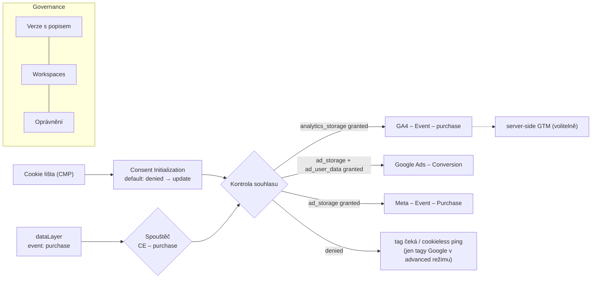

# LP 02: Google Tag Manager – zadání obsahu
> Stav: návrh v1 (8. 10. 2026) · Priorita: B · URL: `/sluzby/google-tag-manager` · Segmenty: e-shopy · B2B / lead-gen · velké firmy
> Navazuje na: `00_architektura-webu.md`, `05_formulare/specifikace-formularu.md`, články C3 (průvodce GTM), C4 (audit GTM), B4 (Google Tag Gateway)

---

## 0. Shrnutí

**Účel stránky:** Prodat tři služby kolem Google Tag Manageru: **nastavení nového kontejneru**, **audit a úklid existujícího** a **průběžnou správu**. Všechny tři stojí na pravidlech (governance): názvosloví, verze, workspaces, oprávnění, dokumentace, souhlas a výkon. Stránka *nevysvětluje, co je GTM*. To dělá článek C3.

**Pro koho:**
- **Marketingový / e-commerce manažer** s kontejnerem, do kterého roky přidávalo několik agentur. Nikdo neví, co který tag dělá, a bojí se cokoli smazat. Hledá „nastavení gtm“, „audit gtm“.
- **Head of digital / IT ve velké firmě:** více týmů a dodavatelů publikuje do jednoho kontejneru, chybí schvalování, bezpečnostní pravidla a dokumentace. Hledá „google tag manager“ + „správa“, „governance“.
- **Majitel e-shopu před redesignem**, který chce kódy z šablony přesunout do GTM.

**Hlavní konverze:** formulář `lp-gtm` · telefon. **Sekundární:** checklist C4 *Audit GTM kontejneru*, průvodce C3, přechod na LP Datová vrstva.

**Proč tahle stránka vyhraje:**
1. **Digitální architekti** mají správu GTM na dvou URL (390 a 850 slov) s referencemi, ale bez konkrétních pravidel a ukázek. **Visibility** („Smart Tagging“) používá šablonový text bez FAQ a diagramu. My ukážeme konvenci pojmenování, matici oprávnění a postup migrace s kompletním obsahem.
2. Na „gtm audit“ je 8. 10. 2026 **první článek magnas.cz bez CTA a formuláře**, druhý krátký checklist stepaneklukas.cz. Komerční LP s auditem GTM v SERP chybí.
3. **khoder.cz** a **homoladigital.cz** dělají GTM pro malé e-shopy s pevnou cenou. Governance pro více týmů, GTM 360, bezpečnostní politiky šablon a Google Tag Gateway (2025–2026) nikdo na českém trhu nepopisuje.

---

## 1. SEO a meta

| Prvek | Návrh |
|---|---|
| **Title** (60 zn.) | `Google Tag Manager – nastavení, audit, správa | datalayer.cz` |
| **Meta description** (150 zn.) | `Desítky tagů, které nikdo nezná? Nastavíme, zaudítujeme a spravujeme Google Tag Manager: názvosloví, verze, práva, consent i výkon. Konzultace zdarma.` |
| **H1** (45 zn.) | `Google Tag Manager: nastavení, audit a správa` |
| **URL** | `/sluzby/google-tag-manager` (301 ze stagingu `/sluzby/gtm`) |
| **Breadcrumbs** | Domů › Služby › Google Tag Manager |

### 1.1 Klíčová slova
| Typ | Klíčové slovo | Objem | Kde použít |
|---|---|---|---|
| Hlavní | google tag manager | 2 400 (KD 81) | title, H1, URL, rychlá odpověď |
| Hlavní | nastavení gtm / implementace gtm | 60 / 10 | H2 záložky „Nastavení nového kontejneru“, FAQ |
| Hlavní (komerční) | gtm audit · audit gtm · audit google tag manager · google tag manager audit · gtm audity | 10 každé | H2 záložky „Audit a úklid“ (kotva `#audit`), FAQ 3 |
| Vedlejší | tag manager / gtm | 500 / 900 | podtitul, alt textů, H2 governance. „gtm“ je nejednoznačné (go-to-market), necílit samostatně |
| Vedlejší | návrh google tag manager | 250 | H3 „Návrh kontejneru“ v záložce Nastavení *(záměr nejasný, ověřit SERP)* |
| Vedlejší | google analytics google tag manager / google analytics gtm | 150 / 90 | věta v diagramu „GA4 nasazujeme přes GTM“, odkaz na LP GA4 |
| Long-tail | google tag manager eshop / ecommerce / gtm datalayer ecommerce | 0–10 | segment E-shop, odkaz na LP Datová vrstva |
| Školení | školení google tag manager | 20 | FAQ 11 |
| Otázky (PAA) | Jak funguje Google Tag Manager? · Jak propojit e-shop s Google Tag Managerem? · Co je Google Tag Gateway? · Is Google Tag Manager a tracker? | – | rychlá odpověď, FAQ 1, 9, 10 |

### 1.2 Co na stránku NEpatří (kanibalizace)
| Dotaz / téma | Patří na | Na této LP |
|---|---|---|
| co je google tag manager, google tag manager návod, jak nastavit / založit GTM, jak funguje GTM | **C3** `/blog/google-tag-manager-pruvodce` (pilíř, 3 730 hledání v clusteru) | 1 odstavec rychlé odpovědi + FAQ 1 (2 věty) + odkaz „Průvodce GTM pro marketéry“ |
| checklist auditu GTM, nejčastější chyby v GTM | **C4** `/blog/audit-gtm-kontejneru` (informační) | LP má komerční záložku „Audit“ s výstupy a postupem, ne kompletní checklist |
| server side gtm, sGTM, stape, google tag gateway | LP `/sluzby/server-side-tracking`, článek B4 | jen 2 věty ve Výkonu + FAQ 10, odkazy |
| google tag manager consent mode v2, cookiebot gtm | LP `/sluzby/cookie-lista-consent-mode` | jen technická implementace v GTM (spouštěče, kontroly souhlasu) |
| gtm datalayer ecommerce | LP `/sluzby/datova-vrstva`, článek C2 | odkaz |
| facebook pixel gtm, shopify gtm | LP Měření konverzí, LP E-shopy | zmínka v segmentech |

**Pravidlo pro C3 a LP:** C3 odpovídá na „co to je a jak to funguje“ a odkazuje sem boxem „Chcete GTM nastavit nebo uklidit?“. LP odpovídá na „kdo mi to udělá a jak“. Title C3 nesmí obsahovat „nastavení / audit / správa“ jako hlavní frázi.

### 1.3 Strukturovaná data (JSON-LD)
FAQPage generovat z komponenty FAQ. FAQ rich results Google od 7. 5. 2026 nezobrazuje, značku necháváme kvůli sémantice.
```json
{
  "@context": "https://schema.org",
  "@graph": [
    {
      "@type": "Service",
      "@id": "https://datalayer.cz/sluzby/google-tag-manager#service",
      "name": "Google Tag Manager – nastavení, audit a správa",
      "serviceType": "Implementace, audit a správa Google Tag Manageru",
      "description": "Nastavení nového kontejneru GTM, audit a úklid existujícího a průběžná správa: názvosloví, verze, workspaces, oprávnění, dokumentace, Consent Mode v2 a výkon.",
      "url": "https://datalayer.cz/sluzby/google-tag-manager",
      "provider": { "@id": "https://datalayer.cz/#organization" },
      "areaServed": { "@type": "Country", "name": "Česko" },
      "availableLanguage": "cs",
      "hasOfferCatalog": {
        "@type": "OfferCatalog",
        "name": "Služby Google Tag Manager",
        "itemListElement": [
          { "@type": "Offer", "itemOffered": { "@type": "Service", "name": "Nastavení nového kontejneru GTM" } },
          { "@type": "Offer", "itemOffered": { "@type": "Service", "name": "Audit a úklid GTM kontejneru" } },
          { "@type": "Offer", "itemOffered": { "@type": "Service", "name": "Průběžná správa GTM" } }
        ]
      }
    },
    {
      "@type": "BreadcrumbList",
      "itemListElement": [
        { "@type": "ListItem", "position": 1, "name": "Domů", "item": "https://datalayer.cz/" },
        { "@type": "ListItem", "position": 2, "name": "Služby", "item": "https://datalayer.cz/sluzby" },
        { "@type": "ListItem", "position": 3, "name": "Google Tag Manager", "item": "https://datalayer.cz/sluzby/google-tag-manager" }
      ]
    },
    {
      "@type": "FAQPage",
      "mainEntity": [
        { "@type": "Question", "name": "Zpomalí Google Tag Manager web?", "acceptedAnswer": { "@type": "Answer", "text": "(text 1:1 z FAQ č. 4)" } }
        /* … ostatní otázky generovat z komponenty FAQ */
      ]
    }
  ]
}
```
*Offer bez ceny je validní schema.org. Pokud by validátor Google hlásil varování u `Offer`, použít místo `hasOfferCatalog` vlastnost `hasPart` se třemi `Service`.*

### 1.4 OG obrázek
1200×630, pozadí `#020d1e`. Vlevo piktogram GTM (kontejner se třemi zásuvkami tag / trigger / variable, na boku `v42`). Vpravo H1, pod ním mono `GTM-XXXX · v42 · „2026-10-08 – purchase dedup“`.

---

## 2. Wireframe

```
DESKTOP                                                   MOBIL
┌───────────────────────────────────────────────────┐    ┌──────────────────────┐
│ Breadcrumbs · [ Sběr dat · GTM ]                  │    │ H1, podtitul         │
│ H1 · podtitul · rychlá odpověď                    │    │ rychlá odpověď       │
│ [ Konzultovat GTM ] [ Chci audit kontejneru ]     │    │ CTA1 / CTA2          │
│                    │ MOCKUP: Tag Assistant +      │    │ mockup (zjednodušený)│
│                    │ consent + verze              │    │ trust 2×2            │
├───────────────────────────────────────────────────┤    │ symptomy 1 sl.       │
│ TRUST BAR (4)                                     │    │ 3 služby = akordeon  │
│ SYMPTOMY (6 karet)                                │    │ governance = akordeon│
│ 3 ZPŮSOBY SPOLUPRÁCE – záložky                    │    │ tabulky → karty      │
│   Nastavení │ Audit a úklid (#audit) │ Správa     │    │ diagram svisle       │
│ GOVERNANCE – 6 bloků + 2 tabulky                  │    │ …                    │
│ MIGRACE TAGŮ DO GTM – 5 kroků + tabulka           │    │ kontakt              │
│ CONSENT MODE V GTM – tabulka tag → souhlas        │    ├──────────────────────┤
│ VÝKON A GOOGLE TAG – 6 bodů                       │    │ sticky Zavolat/Napsat│
│ DIAGRAM (dataLayer → spouštěče → souhlas → tagy)  │    └──────────────────────┘
│ SROVNÁNÍ natvrdo / GTM / GTM + server-side        │
│ CO DOSTANETE · POSTUP A DÉLKA (podle služby)      │
│ CASE · SEGMENTY · FAQ (11) · DO HLOUBKY · SLUŽBY  │
│ KONTAKT lp-gtm                                    │
└───────────────────────────────────────────────────┘
```
**Mobil:** záložky 3 služeb → akordeon (otevřená první, při příchodu s kotvou `#audit` druhá). Tabulky názvosloví a oprávnění → karty. Mockup v hero zkrácen na seznam 3 tagů se stavem.

---

## 3. Obsah sekcí

### 3.1 Hero
- **Komponenta:** `HeroService` · **Eyebrow:** `[ Sběr dat · GTM ]`
- **H1:** Google Tag Manager: nastavení, audit a správa
- **Podtitul:** Nasadíme nový kontejner, zkontrolujeme a uklidíme ten stávající, nebo ho budeme dlouhodobě spravovat. S pravidly pro názvy, verze, oprávnění a souhlas návštěvníků, aby se v něm vyznal i další člověk.
- **Rychlá odpověď (52 slov):**
  > **Co je Google Tag Manager?** Bezplatný nástroj Googlu, přes který se na web nasazují měřicí a marketingové kódy (tagy) bez úprav zdrojového kódu. Spolehlivý je, když má datovou vrstvu, jednotné pojmenování, popsané verze, správně nastavená oprávnění a tagy napojené na souhlas návštěvníka přes Consent Mode v2.
- **CTA1:** `[ Konzultovat GTM ]` → `#kontakt` · **CTA2:** `[ Chci audit kontejneru ]` → `#audit`
- **Mikrocopy:** Kontejner zůstává na vašem účtu · každá změna jako popsaná verze · odpovíme do 1 pracovního dne
- **Vizuální prvek – mockup „Tag Assistant“ (HTML/SVG, fiktivní data):**
  - Levý sloupec (Roboto Mono): seznam událostí `Consent Initialization` · `Initialization` · `Container Loaded` · `view_item` · `add_to_cart` · **`purchase`** (vybraná, cyan rámeček).
  - Střed – „Tagy“: `GA4 – Event – purchase` ✓ *Fired* · `Google Ads – Conversion – Nákup` ✓ *Fired* · `Meta – Event – Purchase` ⏸ *Čeká na souhlas (ad_storage)* · `Sklik – SEM – purchase` ✓ *Fired*.
  - Pravý panel „Consent“: `ad_storage: denied → granted` · `analytics_storage: granted` · `ad_user_data: granted` · `ad_personalization: denied`.
  - Spodní lišta: `Verze 42 · „2026-10-08 – deduplikace purchase podle transaction_id“ · publikoval: analytik`.
  - Animace: po 1 s se stav Meta změní z ⏸ na ✓, protože přijde `consent update`. `prefers-reduced-motion`: statický stav.
  - Alt: „Ukázka ladění Google Tag Manageru: událost purchase, spuštěné tagy, stav souhlasu a popis verze kontejneru (fiktivní data).“
- **Měření:** `cta_click` (`gtm_hero_konzultace`, `gtm_hero_audit`)

### 3.2 Trust bar
1. `[DOPLNIT: počet nastavených / spravovaných kontejnerů GTM]`
2. **Každá změna = popsaná verze** (datum, co a proč) *(potvrdit klientem)*
3. **Kontejner na vašem účtu** – administrátor jste vy
4. **Consent Mode v2 v každém kontejneru**

Vizuál: mono čísla/klíčová slova `#00ffff`, bez log (loga jen u měřicích projektů se souhlasem `[DOPLNIT]`).

### 3.3 Symptomy
- **Komponenta:** `SymptomCards` · **H2:** Poznáváte svůj Tag Manager?

| # | Nadpis karty | Text | Piktogram | Štítek |
|---|---|---|---|---|
| 1 | Desítky tagů, které nikdo nezná | Agentury se střídaly, tagy zůstaly. Nikdo neví, které jsou potřeba, takže se nemaže nic. | Krabice přetékající štítky | `tags: 120` |
| 2 | Názvy „New Tag (3)“ | Z názvu nepoznáte platformu, událost ani účel. Hledání chyby trvá hodiny. | Štítek s otazníkem místo textu | `naming` |
| 3 | Publikuje každý, bez popisu | Verze 87 bez popisu, nikdo neví, co se změnilo, když spadly konverze. | Seznam verzí, poslední s vykřičníkem | `v87 ?` |
| 4 | Kódy na třech místech | Část v šabloně webu, část v pluginu, část v GTM. Konverze se počítají dvakrát. | Tři stejné značky v různých rámečcích | `duplicate` |
| 5 | Tagy běží před souhlasem | Reklamní pixely se spouští dřív, než návštěvník klikne na cookie lištu. | Přepínač OFF, ze kterého přesto vychází šipka | `consent` |
| 6 | Web zpomalil | V PageSpeed Insights vidíte `gtm.js` a desítky skriptů třetích stran. | Rychloměr v červené zóně | `perf` |

- **Vizuální prvek:** piktogramy 32×32 line 1,5 px `#00ffff`. Karty `#0b1a30`.
- **CTA pod kartami:** „Poznáváte 2 a více? → `[ Chci audit kontejneru ]`“ → `#audit` (`gtm_symptomy_audit`)

### 3.4 Tři způsoby spolupráce
- **Komponenta:** `SegmentTabs` (3 záložky; mobil akordeon). Každá záložka má vlastní kotvu: `#nastaveni`, `#audit`, `#sprava`.
- **H2:** Nastavení, audit, nebo správa?

**Záložka A – Nastavení nového kontejneru** (H3 „Návrh a nastavení kontejneru GTM“)
- *Kdy se hodí:* nový web, redesign, přechod z kódů natvrdo, nebo kontejner tak chaotický, že je levnější začít znovu.
- *Co uděláme:* návrh kontejneru podle měřicího plánu (které tagy, spouštěče a proměnné a proč); Google tag pro GA4 a Google Ads; CMP šablona a Consent Mode v2; tagy reklamních systémů (Google Ads, Meta, Sklik/Seznam Event Measurement, Heureka, TikTok, LinkedIn podle potřeby); složky a názvosloví; vývojové prostředí (environment) pro testy; dokumentace.
- *Výstup:* publikovaný kontejner, dokument „karta kontejneru“, testovací protokol.
- *CTA:* `[ Naplánovat nový kontejner ]` → `#kontakt` (`gtm_tab_nastaveni`)

**Záložka B – Audit a úklid existujícího kontejneru** (H3 „Audit GTM kontejneru“, kotva `#audit`)
- *Kdy se hodí:* převzetí od agentury, nesedící konverze, pomalý web, před redesignem, před nasazením server-side.
- *Co zkontrolujeme:* inventuru tagů, spouštěčů a proměnných (co se používá, co je duplicitní, co nikdy nespustí); názvosloví a složky; Custom HTML a šablony třetích stran (co smějí dělat); kontroly souhlasu u každého tagu; pořadí spouštění a závislosti; verze, workspaces a oprávnění (kdo má Publish); kódy mimo GTM (v šabloně, pluginech); dopad na rychlost.
- *Výstup:* report s nálezy A/B/C, export inventury (tabulka všech tagů s doporučením ponechat / upravit / smazat), plán úklidu. Úklid provedeme v samostatném workspace a publikujeme po dohodě.
- *Pozn.:* Audit samotného GTM je užší než [Audit měření](/sluzby/audit-mereni), který prověří i GA4, reklamní systémy a porovná data s e-shopem.
- *CTA:* `[ Objednat audit GTM ]` → `#kontakt` (`gtm_tab_audit`)

**Záložka C – Průběžná správa** (H3 „Správa GTM“)
- *Kdy se hodí:* marketing průběžně potřebuje nové tagy, kampaně a testy a nikdo interně GTM nespravuje. Nebo velká firma chce externí „strážce“ pravidel.
- *Co děláme:* nové tagy na požadavek (ticket → workspace → test → verze s popisem → publikace), měsíční kontrola, že se spouští klíčové tagy, revize oprávnění, aktualizace šablon a reakce na změny platforem (např. Seznam Event Measurement, změny Google tagu).
- *Výstup:* changelog, měsíční přehled změn, dostupnost podle dohody `[DOPLNIT: SLA / reakční doba]`.
- *Navazuje:* [Správa webu a měření](/sluzby/sprava-webu-a-mereni).
- *CTA:* `[ Probrat správu GTM ]` → `#kontakt` (`gtm_tab_sprava`)

### 3.5 Governance – pravidla, díky kterým GTM zůstane v pořádku
- **Účel:** Ukázat know-how, které konkurence nepopisuje, a dát velkým firmám argument.
- **Komponenta:** `FeatureList` (6 bloků) + 2× `ComparisonTable`
- **H2:** Pravidla, díky kterým GTM zůstane v pořádku i za rok
- **Úvod:** Kontejner se nerozbije najednou, ale postupně, s každou nezdokumentovanou změnou. Proto do každého kontejneru zavádíme šest pravidel:

| Oblast | Pravidlo | Proč |
|---|---|---|
| **Názvosloví** | Jednotný formát názvů tagů, spouštěčů a proměnných a složky podle platformy (viz tabulka níže) | Z názvu poznáte platformu, typ a událost bez otevírání tagu |
| **Verze** | Každá publikace má název `RRRR-MM-DD – co se mění` a popis „proč“. Před publikací test v náhledu a na testovacím prostředí | Při problému víte, co se změnilo, a vrátíte se o verzi zpět |
| **Workspaces** | Jeden workspace = jedna změna / projekt. Bezplatný GTM má 3 workspaces (výchozí + 2), GTM 360 neomezeně | Souběžné práce agentury a interního týmu se nepřepisují, konflikty se řeší před publikací |
| **Oprávnění** | Osobní účty, princip nejnižších práv, Publish jen 1–2 lidé, revize oprávnění každé čtvrtletí | Žádné sdílené loginy ani bývalí dodavatelé s právem publikovat |
| **Dokumentace** | „Karta kontejneru“: seznam tagů s účelem, vlastníkem, kategorií souhlasu a datem poslední kontroly + changelog | Nový člověk nebo agentura se zorientuje za hodinu, ne za týden |
| **Bezpečnost** | Šablony místo Custom HTML, kontrola oprávnění šablon třetích stran. U přísných prostředí blokace vlastních skriptů (`gtm.blocklist`) nebo politiky šablon | Kód třetích stran nemůže bez kontroly číst a odesílat data z webu |

**H3 Názvosloví – ukázka konvence** *(kompletní obsah tabulky)*
| Prvek | Formát | Příklady |
|---|---|---|
| Tag | `{Platforma} – {Typ} – {Událost / popis}` | `GA4 – Event – purchase` · `Google Ads – Conversion – Nákup` · `Meta – Event – Purchase` · `Sklik – SEM – purchase` · `Utility – cHTML – oprava referreru` |
| Spouštěč | `{Typ} – {Podmínka}` | `CE – purchase` · `CE – generate_lead` · `Click – Link – tel:` · `PV – Děkovací stránka` · `Consent Init – All Pages` |
| Proměnná | `{Typ} – {Název}` | `DLV – ecommerce.transaction_id` · `DLV – ecommerce.items` · `CJS – items pro Meta` · `Const – GA4 ID` · `RegEx – hostname → prostředí` |
| Složky | podle platformy | `01 GA4` · `02 Google Ads` · `03 Meta` · `04 Seznam` · `05 Heureka` · `90 Consent` · `99 Utility` |
| Verze | `RRRR-MM-DD – změna` | `2026-10-08 – deduplikace purchase podle transaction_id` |

*Zkratky:* CE = vlastní událost (custom event), PV = zobrazení stránky, DLV = proměnná datové vrstvy, CJS = vlastní JavaScript.

**H3 Oprávnění – doporučená matice** *(kompletní obsah tabulky)*
| Kdo | Účet GTM | Kontejner | Poznámka |
|---|---|---|---|
| Vlastník (firma, např. CMO nebo IT) | Administrátor | Publikovat | Minimálně 2 lidé z firmy, ne agentura |
| Interní marketingový analytik | Uživatel | Publikovat, nebo Schválit | Podle velikosti týmu |
| PPC / externí agentura | Uživatel | Upravit | Změny ve vlastním workspace, publikuje vlastník nebo správce |
| Vývojář webu | Uživatel | Číst | Kontrola datové vrstvy v náhledu |
| datalayer.cz (správa) | Uživatel | Publikovat *(jen při správě)* | Po skončení spolupráce odebrat |
| Dočasný dodavatel / audit | Uživatel | Číst | Odebrat po dokončení |

*Úrovně oprávnění odpovídají GTM:* účet (Administrátor / Uživatel), kontejner (Bez přístupu / Číst / Upravit / Schválit / Publikovat). Schvalovací workflow a zóny nabízí jen Tag Manager 360.

- **Vizuální prvek:** 6 bloků s piktogramy: *Názvosloví* = štítek s textem `GA4 – Event`; *Verze* = seznam se šipkou zpět (rollback); *Workspaces* = 3 překrývající se karty; *Oprávnění* = klíč se 4 zuby; *Dokumentace* = dokument se seznamem a ✓; *Bezpečnost* = štít s `</>`.
- **CTA:** `[ Chci šablonu názvosloví a matici oprávnění ]` → `#kontakt` (předvyplnit zprávu; `gtm_governance_sablona`). *[DOPLNIT: připraví klient PDF jako lead magnet? Doporučuji ano, bez registrace, jen ke stažení.]*

### 3.6 Migrace tagů do GTM
- **Účel:** Zachytit firmy, které mají kódy natvrdo v šabloně nebo v pluginech.
- **Komponenta:** `SolutionSteps` (5 kroků) + tabulka
- **H2:** Jak přesuneme kódy z webu do GTM, aniž by vypadla data
- **Kroky:**
  1. **Inventura** – projdeme zdrojový kód, pluginy, vestavěné integrace platformy a síťové požadavky. Výsledkem je seznam všech měřicích kódů.
  2. **Mapování** – ke každému kódu určíme náhradu v GTM: šablonu, spouštěč, proměnné z datové vrstvy a kategorii souhlasu.
  3. **Příprava v GTM** – vše nastavíme v samostatném workspace a otestujeme na testovacím prostředí.
  4. **Přepnutí v jednom kroku** – odstranění kódů z webu a publikace kontejneru proběhnou ve stejném nasazení. Žádné dny se zdvojenými konverzemi.
  5. **Kontrola** – 7–14 dní porovnáváme počty konverzí v GA4, Google Ads a dalších systémech s obdobím před migrací.

| Ukázka inventury (fiktivní) | Kde je dnes | Kam v GTM | Souhlas |
|---|---|---|---|
| Google Ads konverze | natvrdo na děkovací stránce | `Google Ads – Conversion – Nákup` + `CE – purchase` | `ad_storage`, `ad_user_data` |
| Meta Pixel | plugin e-shopu | šablona Meta + `CE – purchase` (+ CAPI přes server-side) | `ad_storage` |
| Sklik konverzní kód | šablona webu | Seznam Event Measurement (šablona GTM) | podle doporučení Seznamu a CMP |
| Heureka Ověřeno zákazníky | modul platformy | ponechat v modulu, nebo šablona v GTM *(rozhodnout)* | podle CMP |
| Hotjar / Clarity | natvrdo v hlavičce | šablona + spouštěč všech stránek | `analytics_storage` |

- **Vizuální prvek:** 5krokový horizontální stepper, krok 4 zvýrazněný oranžově („bez dvojitého počítání“).

### 3.7 Consent Mode v GTM
- **Účel:** Ukázat technickou část souhlasu v GTM. Právo a lištu řeší LP Consent.
- **Komponenta:** `FeatureList` + tabulka
- **H2:** Jak v GTM nastavujeme souhlas návštěvníka
- **Text:** Souhlas musí GTM znát dřív, než se spustí první tag. Postupujeme takto:
  - Šablona CMP (cookie lišty) běží na spouštěči **Consent Initialization – All Pages**, který se spouští před všemi ostatními. Nastaví výchozí stav: pro návštěvníky z EHP všechny čtyři signály `denied`.
  - Po volbě návštěvníka lišta pošle **update** souhlasu a tagy se chovají podle něj.
  - Tagy Google mají **vestavěné kontroly souhlasu**. U ostatních tagů (Meta, Hotjar, TikTok…) nastavujeme **dodatečné kontroly**: tag se spustí, jen když jsou požadované typy souhlasu udělené.
  - Zapínáme přehled **Consent Overview**, kde je u každého tagu vidět, jestli má souhlas nastavený.
  - Ověřujeme v Tag Assistantu: výchozí stav `denied`, po kliknutí na lištu `granted`.
- **Tabulka „tag → souhlas“ (ukázka standardního nastavení, finální mapování podle vaší CMP a právního posouzení):**

| Tag | Kontrola souhlasu | Typ souhlasu |
|---|---|---|
| Google tag / GA4 | vestavěná | `analytics_storage` (+ `ad_storage`, `ad_user_data` pro reklamní funkce) |
| Google Ads konverze, remarketing | vestavěná | `ad_storage`, `ad_user_data`, `ad_personalization` |
| Meta Pixel | dodatečná | `ad_storage` |
| Sklik / Seznam Event Measurement | dodatečná nebo podle šablony | podle dokumentace Seznamu a CMP *(ověřit)* |
| Hotjar / Microsoft Clarity | dodatečná | `analytics_storage` |
| Chat, A/B testy | dodatečná | `functionality_storage` / `personalization_storage` podle účelu |

- **Odkaz:** Lištu, texty a volbu basic vs. advanced řeší [Cookie lišta a Consent Mode v2](/sluzby/cookie-lista-consent-mode). Nejsme advokátní kancelář. Kategorie souhlasu by měl potvrdit váš právník.
- **Vizuální prvek:** malá „brána“ (piktogram Consent: přepínač + 4 tečky) mezi spouštěčem a tagy, napojená na diagram v 3.9.

### 3.8 Výkon a Google tag
- **Komponenta:** `FeatureList` (6 bodů) · **H2:** GTM, který web nezpomaluje
- **Body:**
  1. **Úklid:** nepoužívané tagy, spouštěče a proměnné pryč. Podobné tagy sjednotíme přes proměnné, dlouhé vyhledávací tabulky nahradíme RegEx tabulkami. Google doporučuje optimalizovat, když ukazatel velikosti kontejneru přesáhne 70 %.
  2. **Méně Custom HTML:** šablony jsou bezpečnější a snáz se udržují. Těžké skripty (chaty, heatmapy) jen tam, kde jsou potřeba, ne na všech stránkách.
  3. **Google tag:** GA4 a Google Ads sdílejí jeden Google tag. Od 10. 4. 2025 kontejnery s tagy Google Ads nebo Floodlight Google tag načítají automaticky. Kontrolujeme, aby nevznikaly duplicitní konfigurace.
  4. **Diagnostika značek:** sledujeme upozornění na chybějící nebo zdvojený Google tag a pokrytí stránek.
  5. **Server-side:** část tagů lze přesunout na server (méně skriptů v prohlížeči) → [Server-side tracking](/sluzby/server-side-tracking).
  6. **Google Tag Gateway:** načítání Google tagů z vaší domény přes CDN nebo load balancer (Cloudflare, Akamai, Fastly, Amazon CloudFront, Google Cloud). Kdy dává smysl a čím se liší od server-side GTM, vysvětluje článek [Google Tag Gateway](/blog/google-tag-gateway).
- **Vizuální prvek:** piktogram Technický audit (rychloměr + `</>`). Volitelně mini-graf „velikost kontejneru před/po úklidu“ `[DOPLNIT: reálná data, jinak vynechat]`.

### 3.9 Diagram – Jak GTM rozhoduje, který tag se spustí
- **Komponenta:** `DataFlowDiagram` (interaktivní uzly)
- **H2:** Co se děje uvnitř kontejneru
- **Text:** Web zapíše událost do datové vrstvy. Spouštěč rozhodne, kterých tagů se týká. Kontrola souhlasu rozhodne, jestli se smějí spustit. A verze s popisem zajistí, že se k nastavení dá kdykoli vrátit.

- **Popis pro designéra:** styl hero (čtverce s glow, přerušované animované spojnice, mono popisky). Uzel „Kontrola souhlasu“ jako kosočtverec s piktogramem přepínače. Blok Governance pod diagramem jako tenký pruh tří štítků. Hover na uzel = tooltip (např. Spouštěč: „Tag se spustí jen při události purchase z datové vrstvy, ne při každém načtení stránky.“). Mobil svisle.
- **Alt:** „Schéma GTM: událost z datové vrstvy → spouštěč → kontrola souhlasu z cookie lišty → tagy GA4, Google Ads a Meta; volitelně server-side GTM; verze, workspaces a oprávnění.“
- **Měření:** `diagram_interaction` (`diagram_id: gtm_flow`, `node`)

### 3.10 Srovnání – kódy natvrdo vs. GTM vs. GTM + server-side
- **Komponenta:** `ComparisonTable` · **H2:** Kde mají měřicí kódy žít?

| Kritérium | Kódy natvrdo v šabloně | Google Tag Manager | GTM + server-side GTM |
|---|---|---|---|
| Změna tagu | Vývojář + nasazení webu | Marketing / analytik, bez nasazení webu | Stejně jako GTM. Serverová část vyžaduje správu |
| Kontrola souhlasu | Ručně v kódu, často chybí | Centrálně (Consent Mode, kontroly souhlasu) | Centrálně. Souhlas platí i pro serverovou část |
| Historie změn | Git webu (pokud vůbec) | Verze kontejneru s popisem | Verze obou kontejnerů |
| Počet skriptů v prohlížeči | Tolik, kolik je kódů | Stejně, ale řízeně | Méně (část tagů běží na serveru) |
| Náklady na provoz | 0 | 0 (GTM 360 placený) | Hosting serveru (Google Cloud, Stape apod.) hradí klient napřímo |
| Kdy zvolit | Prakticky nikdy (výjimka: kritické skripty webu) | Výchozí volba pro většinu webů | E-shopy a firmy s reklamou ve větším rozsahu, požadavek na first-party měření |

- **Odkaz pod tabulkou:** Zvažujete třetí sloupec? → [Server-side tracking](/sluzby/server-side-tracking)

### 3.11 Co dostanete
- **Komponenta:** `Deliverables` · **H2:** Co od nás dostanete
| Výstup | Nastavení | Audit | Správa |
|---|---|---|---|
| Publikovaný kontejner s popsanými verzemi | ✓ | po úklidu ✓ | ✓ |
| Karta kontejneru (tagy, účel, vlastník, souhlas) | ✓ | ✓ | průběžně |
| Inventura tagů s doporučením ponechat / upravit / smazat | – | ✓ | čtvrtletně |
| Report nálezů s prioritou A/B/C | – | ✓ | – |
| Konvence názvosloví a matice oprávnění | ✓ | ✓ | ✓ |
| Testovací protokol (Tag Assistant, náhled) | ✓ | ✓ | u každé změny |
| Changelog a měsíční přehled | – | – | ✓ |
| Předání / zaškolení (60 min) | ✓ | prezentace nálezů | dle dohody |

### 3.12 Postup a délka
- **Komponenta:** `ProcessTimeline` (3 řádky podle služby) · **H2:** Jak dlouho to trvá a co potřebujeme
| Služba | Kroky | Typická délka *[POTVRDIT]* | Od vás |
|---|---|---|---|
| Nastavení | konzultace → návrh kontejneru → (datová vrstva vývojáři) → nastavení na testovacím prostředí → test → publikace → předání | 1–4 týdny, podle datové vrstvy | Admin práva k účtu GTM (nebo jeho založení), kontakt na vývojáře, testovací prostředí, přístup do CMP |
| Audit a úklid | přístup → inventura a kontrola → report → prezentace (60 min) → úklid ve workspace → publikace | audit 3–7 pracovních dnů, úklid podle rozsahu | Oprávnění Číst (audit), pak Upravit / Publikovat (úklid), seznam lidí a agentur s přístupem |
| Správa | nastavení pravidel → požadavky přes ticket / e-mail → měsíční kontrola | průběžně, `[DOPLNIT: reakční doba]` | Jedna kontaktní osoba, schvalovatel změn |

### 3.13 Případová studie
- **Komponenta:** `MiniCase` · **H2:** `[DOPLNIT: např. „Ze 140 tagů na 38 a konverze bez duplicit“]`
- **Obsah:** `[DOPLNIT: klient (lze anonymizovat) · problém · příčina · co jsme udělali (úklid, názvosloví, consent) · výsledek před/po (počet tagů, velikost kontejneru, rozdíl konverzí Ads vs. GA4)]`. Bez reálných dat sekci skrýt.
- **Vizuál:** dvojice čísel před/po v mono písmu (`tags 140 → 38`, `size 82 % → 41 %`).

### 3.14 Segmenty
- **Komponenta:** `SegmentTabs` · **H2:** Co je jinak u e-shopu, B2B a velké firmy
| Záložka | Text |
|---|---|
| **E-shop** | Nejvíc tagů (Google Ads, Meta, Sklik, Heureka, Zboží, srovnávače, retargeting) a nejvíc duplicit s moduly platformy. Hlídáme, aby se nákup počítal jednou a všechny systémy dostaly stejnou hodnotu → [Měření pro e-shopy](/reseni/e-shopy). |
| **B2B a leady** | Méně tagů, ale citlivější data: formuláře, telefon, e-mail. Rozlišujeme formuláře přes `form_id` a nikdy neposíláme osobní údaje v čitelné podobě → [Měření pro B2B](/reseni/b2b-a-lead-generation). |
| **Velká firma** | Více týmů a dodavatelů v jednom kontejneru: workspaces, schvalování, oprávnění, bezpečnostní politiky šablon, dokumentace pro IT a audit. Zvážíme GTM 360 (neomezené workspaces, schvalovací workflow, zóny) → [Měření pro velké firmy](/reseni/velke-firmy). |

### 3.15 FAQ (11 otázek)
- **Komponenta:** `FAQ` · **H2:** Časté otázky ke Google Tag Manageru

**1. Co je Google Tag Manager a jak funguje?**
Google Tag Manager je bezplatný nástroj, přes který se na web nasazují měřicí a marketingové kódy. Na web se jednou vloží kód kontejneru a všechny další tagy se pak spravují v rozhraní GTM. Tag se spustí podle pravidla (spouštěče), například při nákupu nebo odeslání formuláře. Podrobné vysvětlení s ukázkami najdete v [průvodci Google Tag Managerem](/blog/google-tag-manager-pruvodce).

**2. Kolik stojí nastavení nebo audit GTM?**
Cenu stanovujeme podle rozsahu. U nastavení rozhoduje počet platforem a událostí a to, zda web má datovou vrstvu. U auditu velikost kontejneru a počet webů. U správy objem změn a požadovaná reakční doba. Po úvodní konzultaci dostanete nabídku s pevným rozsahem. Samotný Google Tag Manager je zdarma. Placená je jen verze Tag Manager 360 a případný server pro server-side měření, který hradíte napřímo poskytovateli.

**3. Co obsahuje audit GTM a jak dlouho trvá?**
Projdeme všechny tagy, spouštěče a proměnné a zjistíme, co se používá, co je zdvojené a co se nikdy nespustí. Zkontrolujeme názvosloví, Custom HTML a šablony třetích stran, nastavení souhlasu u každého tagu, verze, workspaces a oprávnění. Dohledáme i kódy mimo GTM. Výstupem je report s nálezy seřazenými podle priority a tabulka všech tagů s doporučením. Samotný audit obvykle trvá 3–7 pracovních dnů od získání přístupu. *[POTVRDIT]*

**4. Zpomalí Google Tag Manager web?**
Samotný kontejner web výrazně nezpomalí. Zpomalují ho tagy, které v něm jsou, hlavně těžké skripty třetích stran (chaty, heatmapy, desítky pixelů) spouštěné na všech stránkách. Při nastavení a úklidu proto mažeme nepoužívané tagy, omezujeme Custom HTML, spouštíme skripty jen tam, kde jsou potřeba, a hlídáme ukazatel velikosti kontejneru. Část tagů lze přesunout na server.

**5. Komu patří kontejner a kdo k němu bude mít přístup?**
Kontejner zakládáme na účtu GTM vaší firmy a administrátorem jste vy, ideálně dva lidé z firmy. My i agentury dostáváme jen oprávnění, která potřebujeme: pro audit čtení, pro správu úpravy nebo publikaci. Doporučujeme osobní účty místo sdílených loginů a čtvrtletní revizi přístupů. Po skončení spolupráce nám oprávnění jednoduše odeberete.

**6. Musí do toho zasahovat náš vývojář?**
Většinou jen na začátku. Vývojář vloží kód kontejneru a doplní datovou vrstvu, tedy informace o produktech, objednávkách a formulářích, které GTM sám spolehlivě nezjistí. Specifikaci mu připravíme a jeho práci otestujeme. Další změny tagů už pak web nevyžadují. U e-shopových platforem (Shoptet, Shopify…) část datové vrstvy existuje a vývojář někdy není potřeba vůbec.

**7. Co se stane s daty při přesunu kódů do GTM?**
Pokud se migrace udělá najednou, data nevypadnou ani se nezdvojí. Odstranění starých kódů z webu a publikaci kontejneru proto plánujeme do stejného nasazení. Před přepnutím vše otestujeme na testovacím prostředí. Po přepnutí 7–14 dní porovnáváme počty konverzí v GA4 a reklamních systémech s obdobím před migrací. Historická data v GA4 ani v Google Ads se přesunem kódů nemění.

**8. Jak v GTM řešíte souhlas s cookies?**
Šablona cookie lišty běží na spouštěči Consent Initialization, takže GTM zná výchozí stav souhlasu dřív než jakýkoli tag. Tagy Google mají vestavěné kontroly souhlasu, ostatním (Meta, Hotjar…) nastavujeme dodatečné kontroly. Vše ověřujeme v Tag Assistantu. Volbu lišty, texty a basic, nebo advanced režim řeší služba [Cookie lišta a Consent Mode v2](/sluzby/cookie-lista-consent-mode). Kategorie souhlasu by měl potvrdit váš právník.

**9. Potřebujeme server-side GTM?**
Ne vždy. Server-side GTM přesouvá část zpracování z prohlížeče na váš server. Pomáhá s odolností měření vůči omezením prohlížečů, s kontrolou nad tím, co se posílá třetím stranám, a s rychlostí webu. Má ale provozní náklady a vyžaduje správu. Vyplatí se hlavně e-shopům a firmám s větším rozpočtem na reklamu. Souhlas návštěvníka platí i pro serverovou část. Rozhodování popisuje stránka [Server-side tracking](/sluzby/server-side-tracking).

**10. Co je Google Tag Gateway a máme ho nasadit?**
Google Tag Gateway (dříve „first-party mode“) načítá Google tagy z vaší vlastní domény přes CDN nebo load balancer, například Cloudflare, Akamai, Fastly, Amazon CloudFront nebo Google Cloud. Nevyžaduje server-side GTM, ale dá se s ním kombinovat. Je to rychlejší krok než plné server-side měření, ale řeší jen Google tagy. Kdy se vyplatí, vysvětluje článek [Google Tag Gateway](/blog/google-tag-gateway).

**11. Naučíte náš tým s GTM pracovat?**
Ano. Předání kontejneru zahrnuje 60minutové zaškolení: názvosloví, jak přidat tag ve workspace, jak testovat v náhledu a jak popsat verzi. Pro marketingové týmy připravujeme i delší školení GTM na vašem kontejneru. *[DOPLNIT: formát a délka školení GTM]*

### 3.16 Do hloubky
| Článek | URL | Anchor |
|---|---|---|
| C3 Google Tag Manager: průvodce pro marketéry | `/blog/google-tag-manager-pruvodce` | Průvodce Google Tag Managerem |
| C4 Audit GTM kontejneru: nejčastější chyby | `/blog/audit-gtm-kontejneru` | Checklist auditu GTM kontejneru |
| C1 Datová vrstva: jak napsat specifikaci | `/blog/datova-vrstva-specifikace` | Specifikace datové vrstvy |
| A1 Consent Mode v2: kompletní průvodce | `/blog/consent-mode-v2-pruvodce` | Consent Mode v2 v praxi |
| B4 Google Tag Gateway a first-party mode | `/blog/google-tag-gateway` | Google Tag Gateway vs. server-side GTM |

### 3.17 Navazující služby
| Karta | Text | URL |
|---|---|---|
| Datová vrstva | Bez datové vrstvy GTM jen „škrábe“ data ze stránky. Zadáme ji vývojářům. | `/sluzby/datova-vrstva` |
| Server-side tracking | Část tagů na vašem serveru: méně skriptů v prohlížeči, víc kontroly. | `/sluzby/server-side-tracking` |
| Cookie lišta a Consent Mode v2 | Souhlas, na který se GTM spoléhá: lišta, texty, signály. | `/sluzby/cookie-lista-consent-mode` |

---

## 4. Kontaktní blok
| Prvek | Hodnota |
|---|---|
| `form_id` | `lp-gtm` |
| `tema[]` | `gtm` |
| H2 | Uklidíme váš Tag Manager *(tabulka 3.5)*. **Návrh úpravy:** „Dáme váš Tag Manager do pořádku“ (pokrývá i nastavení a správu, ne jen úklid) – při přijetí aktualizovat tabulku 3.5 |
| Lead | „Napište nám, zavolejte, nebo vyplňte formulář. Na úvodní 30minutové konzultaci se podíváme na váš kontejner a řekneme, co řešit jako první.“ |
| Placeholder | „Např. v GTM máme 120 tagů a nikdo neví, co dělají…“ *(beze změny)* |
| Předvyplnění z CTA | `gtm_tab_audit` → „Mám zájem o audit GTM kontejneru“; `gtm_governance_sablona` → „Prosím o šablonu názvosloví a matici oprávnění“ |

---

## 5. Interní odkazy
**Odchozí:** LP a články z 3.16 a 3.17. Navíc v textu: `/sluzby/audit-mereni` (záložka Audit), `/sluzby/sprava-webu-a-mereni` (záložka Správa), `/sluzby/implementace-ga4` (diagram: „GA4 nasazujeme přes GTM“), `/reseni/*` (segmenty), slovník `/slovnik/kontejner-gtm`, `/slovnik/spoustec`, `/slovnik/tag`, `/slovnik/google-tag-gateway`.

**Příchozí:**
| Zdroj | Anchor |
|---|---|
| **C3 průvodce GTM** (box uprostřed + závěr) | nastavení a správa Google Tag Manageru |
| **C4 audit GTM** (box „Nechcete to dělat sami?“) | audit GTM kontejneru (odkaz na `#audit`) |
| C1, C2 (datová vrstva) | Google Tag Manager |
| B4 Google Tag Gateway | správa GTM a Google tagu |
| LP GA4, Datová vrstva, Server-side, Consent, Audit | Google Tag Manager |
| Homepage, `/sluzby`, mega-menu | Google Tag Manager – pořádek v tazích a verzích |
| Slovník: Tag, Spouštěč, Proměnná, Kontejner GTM | Google Tag Manager |

---

## 6. Co dodá klient
- [ ] Počet nastavených a spravovaných kontejnerů (trust bar) a potvrzení procesních tvrzení (verze s popisem, Consent Mode v2 v každém kontejneru).
- [ ] Případová studie úklidu kontejneru (čísla před/po) + souhlas.
- [ ] Rozhodnutí o lead magnetu „Šablona názvosloví a matice oprávnění“ (PDF / Google Sheet).
- [ ] Reakční doba / SLA u správy, formát školení GTM.
- [ ] Potvrzení délek kroků (3.12).
- [ ] Jestli klient pracuje s GTM 360 (konzultace, ne prodej licencí).

---

## 7. Měření stránky
| Událost | Parametry |
|---|---|
| `cta_click` | `cta_id`: `gtm_hero_konzultace`, `gtm_hero_audit`, `gtm_symptomy_audit`, `gtm_tab_nastaveni`, `gtm_tab_audit`, `gtm_tab_sprava`, `gtm_governance_sablona`, `gtm_deep_{slug}`, `gtm_related_{slug}` · `section` |
| `tab_select` *(nová, doplnit do architektury)* | `tab_group: gtm_sluzba / gtm_segment`, `tab` |
| `diagram_interaction` | `diagram_id: gtm_flow`, `node` |
| `faq_open` | `question`: `co_je_gtm`, `cena`, `audit`, `rychlost`, `vlastnictvi`, `vyvojar`, `migrace`, `consent`, `server_side`, `tag_gateway`, `skoleni` |
| `scroll_depth`, `contact_click`, `lead_form_start`/`lead_form_error`/`generate_lead` (`form_id: lp-gtm`) | dle architektury kap. 8 |
| `file_download` *(pokud vznikne PDF šablona)* | `file_name: gtm-naming-matrix.pdf` (GA4 to měří automaticky v rozšířeném měření) |

**Upozornění:** `form_start` je v GA4 rezervovaný název. Do GA4 posílat jako `lead_form_start` (viz LP 01, kap. 7).

---

## 8. Akceptační checklist
- [ ] Title, meta, jediné H1, canonical, 301 z `/sluzby/gtm`.
- [ ] Kotvy `#nastaveni`, `#audit`, `#sprava` fungují i z externích odkazů (článek C4 → `#audit` otevře správnou záložku).
- [ ] Rychlá odpověď do 60 slov. Stránka nevysvětluje základy GTM víc než C3 (kontrola kanibalizace: title C3 ≠ title LP).
- [ ] Tabulky názvosloví a oprávnění kompletní a na mobilu čitelné jako karty.
- [ ] Faktická tvrzení (3 workspaces / 360 neomezeně, Consent Initialization, 70 % velikosti, 10. 4. 2025 Google tag, Tag Gateway CDN) znovu ověřená před publikací.
- [ ] Právní věty u consentu s disclaimerem, žádné „zaručeně GDPR“.
- [ ] Mockup a diagram jako inline SVG/HTML s alt, `prefers-reduced-motion`, čísla v HTML.
- [ ] Případová studie reálná, nebo skrytá.
- [ ] JSON-LD validní, FAQ shodné.
- [ ] Mobil 360 px bez horizontálního scrollu, akordeony ovladatelné klávesnicí.
- [ ] Události z kap. 7 ověřené v GTM Preview, spouštějí se jen se souhlasem.

---

## Zdroje
| Tvrzení | Zdroj (ověřeno 10/2026) |
|---|---|
| Workspaces: bezplatný GTM 2 další (celkem 3), GTM 360 neomezeně; konflikty a aktualizace workspace | https://support.google.com/tagmanager/answer/7059647 |
| GTM vs. GTM 360 (3 vs. neomezeně workspaces, schvalovací workflow a zóny jen 360, SLA) | https://marketingplatform.google.com/about/tag-manager/compare/ |
| Oprávnění: účet Administrátor/Uživatel; kontejner Bez přístupu/Číst/Upravit/Schválit/Publikovat | https://support.google.com/tagmanager/answer/6107011 |
| Prostředí (environments) pro testování před publikací | https://support.google.com/tagmanager/answer/6311518 |
| Consent v GTM: Consent Initialization – All Pages se spouští před všemi tagy; vestavěné a dodatečné kontroly; Consent Overview | https://support.google.com/tagmanager/answer/10718549 |
| Consent API v GTM (`setDefaultConsentState`, `updateConsentState`), `wait_for_update`, `url_passthrough`, `ads_data_redaction` | https://developers.google.com/tag-platform/security/guides/consent |
| Typy souhlasu (`ad_storage`, `analytics_storage`, `ad_user_data`, `ad_personalization`, `functionality_storage`, `personalization_storage`, `security_storage`); basic vs. advanced, obsah cookieless pingů | https://developers.google.com/tag-platform/security/concepts/consent-mode |
| Optimalizace velikosti kontejneru (ukazatel > 70 %, RegEx tabulky, méně Custom HTML) | https://support.google.com/tagmanager/answer/2772488 |
| `gtm.allowlist` / `gtm.blocklist`, `customScripts`, doporučení politik šablon | https://developers.google.com/tag-platform/tag-manager/restrict |
| Google tag v GTM; automatické načtení Google tagu u kontejnerů s Google Ads/Floodlight | https://support.google.com/tagmanager/answer/12002338 |
| Release notes GTM 2025–2026: auto Google tag od 10. 4. 2025; first-party mode → Google Tag Gateway (8. 5. 2025); Tag Gateway pro Akamai, Fastly (5/2026), CloudFront (6/2026), Google Cloud GA (1. 6. 2026); diagnostika značek; AI návrh názvu verze (9/2026); vestavěné proměnné Client ID / Session ID (12/2025) | https://support.google.com/tagmanager/answer/4620708 |
| Google Tag Gateway – princip (vlastní doména, CDN/load balancer, kombinace se server-side) | https://developers.google.com/tag-platform/tag-manager/gateway |
| Seznam Event Measurement (spuštění 6/2026, šablona GTM, budoucí povinný přechod) | https://blog.seznam.cz/en/2026/06/introducing-seznam-event-measurement-the-new-standard-for-measuring-your-campaigns/ |
| Rezervované názvy událostí GA4 (`form_start`) | https://support.google.com/analytics/answer/13316687 |
| Konec FAQ rich results (7. 5. 2026) | https://developers.google.com/search/updates |
| **Ověřit před publikací:** typ souhlasu pro Seznam Event Measurement v GTM šabloně; aktuální seznam CDN pro Tag Gateway | – |
