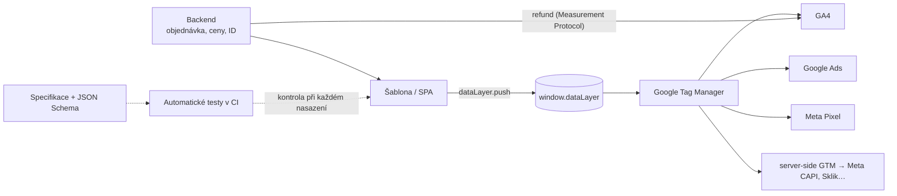

# LP 03: Datová vrstva (dataLayer) – zadání obsahu
> Stav: návrh v1 (8. 10. 2026) · Priorita: A · URL: `/sluzby/datova-vrstva` · Segmenty: e-shopy · B2B / lead-gen · velké firmy
> Navazuje na: `00_architektura-webu.md`, `05_formulare/specifikace-formularu.md` (dataLayer kontrakt formuláře), články C1, C2, C5, E1

---

## 0. Shrnutí

**Účel stránky:** Prodat **návrh a specifikaci datové vrstvy** jako dokument pro vývojáře: události a parametry podle schématu GA4, ukázky kódu, akceptační kritéria a automatické testy. K tomu podporu vývojářů během implementace. Stránka je zároveň „vizitka“ značky: firma se jmenuje datalayer.cz, takže tady musí být znalost datové vrstvy vidět nejvíc ze všech stránek webu.

**Pro koho:**
- **E-commerce / IT manažer před vývojem nového e-shopu nebo redesignem** (vlastní řešení, headless, WooCommerce, PrestaShop): potřebuje zadání, které vývojáři pochopí a dodavatel nemůže „odbýt“.
- **Vedoucí vývoje / CTO** vlastního e-shopu nebo aplikace: chce přesnou specifikaci, JSON Schema a testy do CI, ne „marketingové přání“.
- **Marketing B2B firmy** s formuláři v aplikaci nebo CRM: potřebuje leady měřené až do zakázky.

**Hlavní konverze:** formulář `lp-datalayer` · telefon. **Sekundární:** článek C1 *Datová vrstva: jak napsat specifikaci (+ šablona)*, nástroj *dataLayer validátor* (`/nastroje`), C2.

**Proč tahle stránka vyhraje:**
1. SERP „datová vrstva datalayer“ (8. 10. 2026) obsahuje jen **slovníková hesla a krátké články** (nezzazvoni.cz, opinest.com, nazakladedat.cz, zatkovic.cz, ehub.cz, marketingppc.cz). Komerční stránka, která ukazuje specifikaci a kód, chybí.
2. Jediná konkurenční produktová LP, **digitalniarchitekti.cz/produkty/datova-vrstva**, ukazuje zastaralé příklady ve stylu Universal Analytics (`addToCart`, Enhanced Ecommerce) a jejich placená šablona zadání je „vyprodaná“. My: aktuální schéma GA4, `ecommerce: null`, `customer_type`, leady, hashování.
3. Nikdo na českém trhu nenabízí **automatické testy datové vrstvy** (JSON Schema + E2E testy v CI + monitoring). Pro vývojáře a velké firmy je to rozhodující argument.

---

## 1. SEO a meta

| Prvek | Návrh |
|---|---|
| **Title** (60 zn.) | `Datová vrstva dataLayer – zadání pro vývojáře | datalayer.cz` |
| **Meta description** (152 zn.) | `Navrhneme datovou vrstvu (dataLayer) podle schématu GA4 pro e-shop i leady: specifikace, ukázky kódu, automatické testy a podpora IT. Konzultace zdarma.` |
| **H1** (48 zn.) | `Datová vrstva (dataLayer), které rozumí vývojáři` |
| **URL** | `/sluzby/datova-vrstva` (301 z `/sluzby/dataLayer` i `/sluzby/datalayer`) |
| **Breadcrumbs** | Domů › Služby › Datová vrstva |

### 1.1 Klíčová slova
| Typ | Klíčové slovo | Objem | Kde použít |
|---|---|---|---|
| Hlavní | datalayer / data layer | 30 / 20 | H1 (v závorce), title, rychlá odpověď, alt mockupu |
| Hlavní | datová vrstva | (nízký, strategický) | H1, URL, H2 |
| Vedlejší | datalayer push / google-tag-manager datalayer | 10 / 10 | H2 „Ukázka kódu“, popisky kódu |
| Vedlejší | ecommerce ga4 datalayer · ga4 enhanced ecommerce datalayer · datalayer for ga4 · google analytics 4 datalayer push | 0 (long-tail EN) | H3 „E-commerce podle schématu GA4“, komentáře v kódu |
| Vedlejší | unified data layer | 10 | odstavec „Jedna datová vrstva pro všechny nástroje“ |
| Nástroj | datalayer checker / datalayer viewer | 10 / 0 | CTA na `/nastroje` (dataLayer validátor), FAQ 8 |
| Otázky (Ahrefs) | what is datalayer · how to check datalayer in console · datalayer example · ga4 datalayer example · how to create data layer · how to test gtm datalayer | 0 (EN) | rychlá odpověď, FAQ 1 a 8, ukázky kódu |

*Pozor na brand:* „datalayer“ je zároveň název značky. Až web získá autoritu, část hledání „datalayer“ bude navigační (hledají firmu). LP proto drží v H1 i český termín „Datová vrstva“.

### 1.2 Co na stránku NEpatří (kanibalizace)
| Dotaz / téma | Patří na | Na této LP |
|---|---|---|
| co je datalayer, what is data layer, jak napsat specifikaci (šablona ke stažení) | **C1** `/blog/datova-vrstva-specifikace` | rychlá odpověď + FAQ 1, odkaz „Šablona specifikace“ |
| kompletní kód všech e-commerce událostí, `view_item` … `refund` | **C2** `/blog/ga4-ecommerce-datalayer` | jen 2–3 ukázky (purchase, generate_lead, kontext stránky) |
| how to check datalayer in console, datalayer checker | slovník + nástroj `/nastroje` | FAQ 8 + CTA na nástroj |
| nastavení GTM, proměnné datové vrstvy v GTM | LP `/sluzby/google-tag-manager`, C3 | odkaz |
| měření formulářů a leadů do CRM | článek E1, LP B2B | ukázka `generate_lead` + odkaz |

### 1.3 Strukturovaná data
```json
{
  "@context": "https://schema.org",
  "@graph": [
    {
      "@type": "Service",
      "@id": "https://datalayer.cz/sluzby/datova-vrstva#service",
      "name": "Datová vrstva (dataLayer)",
      "serviceType": "Návrh a specifikace datové vrstvy pro vývojáře",
      "description": "Návrh datové vrstvy podle schématu GA4 pro e-commerce, leady a uživatelské atributy: specifikace s ukázkami kódu, akceptační kritéria, JSON Schema, automatické testy a podpora vývojářů.",
      "url": "https://datalayer.cz/sluzby/datova-vrstva",
      "provider": { "@id": "https://datalayer.cz/#organization" },
      "areaServed": { "@type": "Country", "name": "Česko" },
      "availableLanguage": "cs",
      "audience": { "@type": "BusinessAudience", "audienceType": "E-shopy, vývojové týmy, B2B firmy" }
    },
    {
      "@type": "BreadcrumbList",
      "itemListElement": [
        { "@type": "ListItem", "position": 1, "name": "Domů", "item": "https://datalayer.cz/" },
        { "@type": "ListItem", "position": 2, "name": "Služby", "item": "https://datalayer.cz/sluzby" },
        { "@type": "ListItem", "position": 3, "name": "Datová vrstva", "item": "https://datalayer.cz/sluzby/datova-vrstva" }
      ]
    },
    {
      "@type": "FAQPage",
      "mainEntity": [
        { "@type": "Question", "name": "Co je datová vrstva a k čemu slouží?", "acceptedAnswer": { "@type": "Answer", "text": "(text 1:1 z FAQ č. 1)" } }
        /* … ostatní otázky generovat z komponenty FAQ */
      ]
    }
  ]
}
```
FAQ rich results Google od 7. 5. 2026 nezobrazuje. Značku ponecháváme kvůli sémantice. Ukázky kódu označit `<pre><code class="language-js">`. Highlight.js nebo Prism načítat jen na stránkách s kódem (audit stagingu, kap. 3.4).

### 1.4 OG obrázek
Pozadí `#020d1e`. Vlevo piktogram Datová vrstva (složené závorky `{ }` se 3 vrstvami a šipkou ven). Vpravo H1. Pod ním mono řádek `dataLayer.push({ event: 'purchase' })` s cyan zvýrazněním `purchase`. Navazuje na hero homepage.

---

## 2. Wireframe

```
DESKTOP                                                  MOBIL
┌──────────────────────────────────────────────────┐    ┌───────────────────────┐
│ Breadcrumbs · [ Sběr dat · dataLayer ]           │    │ H1, podtitul, odpověď │
│ H1 · podtitul · rychlá odpověď                   │    │ CTA1 / CTA2           │
│ [ Konzultovat datovou vrstvu ] [ Ukázka spec. ]  │    │ mockup: kód (zalomený)│
│                  │ MOCKUP: editor + validátor    │    │  + 3 kontroly         │
├──────────────────────────────────────────────────┤    │ trust 2×2             │
│ TRUST BAR                                        │    │ symptomy 1 sl.        │
│ SYMPTOMY (6)                                     │    │ obsah spec. akordeon  │
│ CO VE SPECIFIKACI NAVRHNEME (6 bloků)            │    │ tabulka událostí →    │
│ UKÁZKA SPECIFIKACE (#ukazka) – tabulka událostí   │    │  karty (1 událost =   │
│   + tabulka parametrů položky                    │    │  1 karta)             │
│ UKÁZKA KÓDU – 3 záložky (kontext / purchase /     │    │ kód: horizontální     │
│   generate_lead) + tlačítko Kopírovat            │    │  scroll JEN uvnitř    │
│ VALIDACE – 3 úrovně + ukázka testu               │    │  bloku kódu           │
│ SPOLUPRÁCE S IT – proces + akceptační kritéria    │    │ …                     │
│ DIAGRAM                                          │    │ kontakt               │
│ SROVNÁNÍ scraping / platforma / vlastní vrstva    │    ├───────────────────────┤
│ PLATFORMY A TECHNOLOGIE                          │    │ sticky Zavolat/Napsat │
│ CO DOSTANETE · POSTUP · CASE · SEGMENTY          │    └───────────────────────┘
│ FAQ (12) · DO HLOUBKY · NAVAZUJÍCÍ               │
│ KONTAKT lp-datalayer                             │
└──────────────────────────────────────────────────┘
```
**Mobil:** bloky kódu mají vlastní horizontální scroll, stránka jako celek nesmí přetékat. Velikost písma kódu 13 px, `white-space: pre`, tlačítko „Kopírovat“ vpravo nahoře, min. 44×44 px.

---

## 3. Obsah sekcí

### 3.1 Hero
- **Komponenta:** `HeroService` · **Eyebrow:** `[ Sběr dat · dataLayer ]`
- **H1:** Datová vrstva (dataLayer), které rozumí vývojáři
- **Podtitul:** Navrhneme, co přesně má web posílat do datové vrstvy, napíšeme specifikaci s ukázkami kódu a hotovou implementaci ověříme automatickými testy. Pro e-shopy podle schématu GA4, pro leady i přihlášené uživatele.
- **Rychlá odpověď (54 slov):**
  > **Co je datová vrstva?** JavaScriptové pole `window.dataLayer`, do kterého web zapisuje strukturované informace o stránce, produktech, objednávkách a akcích návštěvníka. Google Tag Manager z něj bere data pro GA4, Google Ads, Meta i další nástroje. Dobrá specifikace říká vývojářům přesně, kdy, co a v jakém formátu poslat.
- **CTA1:** `[ Konzultovat datovou vrstvu ]` → `#kontakt` · **CTA2:** `[ Ukázka specifikace ]` → `#ukazka`
- **Mikrocopy:** Specifikace patří vám · píšeme ji pro vývojáře, ne pro marketing · odpovíme do 1 pracovního dne
- **Vizuální prvek – mockup „editor + validátor“ (HTML/SVG):**
  - Vlevo okno editoru (tmavé `#0b1a30`, číslování řádků, zvýraznění syntaxe cyan/oranžová/šedá): zkrácený `dataLayer.push({ event: 'purchase', ecommerce: { transaction_id: '2026-104882', value: 2058.67, currency: 'CZK', items: [ … ] } })`.
  - Vpravo panel „Validace podle specifikace“ (mono): `✓ event: purchase` · `✓ transaction_id je unikátní` · `✓ value = Σ price × quantity` · `✓ currency: ISO 4217` · `✕ items[1].item_id chybí` (červeně, s řádkem kódu podtrženým vlnovkou).
  - Animace: kód se „dopisuje“ (typewriter 2 s), pak naskakují kontroly. Poslední kontrola selže a po 1 s se opraví na ✓. `prefers-reduced-motion`: statický stav se všemi ✓ kromě jedné ✕.
  - Alt: „Ukázka kódu dataLayer.push pro událost purchase a automatická kontrola podle specifikace (fiktivní data).“
- **Měření:** `cta_click` (`dl_hero_konzultace`, `dl_hero_ukazka`)

### 3.2 Trust bar
1. `[DOPLNIT: počet napsaných specifikací / webů s datovou vrstvou]`
2. **Podle oficiálního schématu GA4** – žádné vlastní „dialekty“
3. **Testy běží u vás** – v CI vašeho projektu *(potvrdit klientem, že tuto službu nabízí)*
4. **Specifikace patří vám** – Markdown, Google Sheets nebo Confluence + JSON Schema

### 3.3 Symptomy
- **Komponenta:** `SymptomCards` · **H2:** Proč měření často nefunguje, i když je „nasazené“

| # | Nadpis | Text | Piktogram | Štítek |
|---|---|---|---|---|
| 1 | Vývojáři nevědí, co nasadit | Zadání „přidejte GA4 e-commerce“ nestačí. Každý si ho vyloží jinak. | Ticket s otazníkem | `?spec` |
| 2 | GTM „škrábe“ data ze stránky | Cena a název produktu se čtou z HTML. Po změně šablony měření tiše přestane fungovat. | Lupa nad HTML značkou `<span>` | `querySelector` |
| 3 | Po redesignu spadly konverze | Nový web prošel testy vývojářů, měření nikdo netestoval. | Graf s propadem a ikonou rakety (release) | `release` |
| 4 | Každý pixel má vlastní kód | Google Ads, Meta, Sklik a Heureka dostávají jinak strukturovaná data z různých míst. | Šest různých konektorů | `×6` |
| 5 | Hodnota objednávky se liší | Jednou s DPH, jednou bez, jednou s dopravou. Nástroje se pak nedají porovnat. | Dvě účtenky s různým součtem | `value ≠` |
| 6 | Nikdo nehlídá, že to pořád funguje | Datová vrstva se rozbije s novou verzí webu a zjistí se to po měsíci. | Kalendář s vykřičníkem | `no tests` |

- **CTA pod kartami:** „Máte vlastní kód a chcete ho zkontrolovat? → `[ Zkusit dataLayer validátor ]`“ → `/nastroje` (`tool_use` po použití; `cta_id: dl_symptomy_validator`). *[DOPLNIT: termín spuštění nástroje; do té doby odkaz skrýt]*

### 3.4 Co ve specifikaci navrhneme
- **Komponenta:** `FeatureList` (6 bloků) · **H2:** Co ve specifikaci navrhneme
- **Úvod:** Specifikace vychází z měřicího plánu: nejdřív víme, na co se budete ptát, pak navrhujeme data. Obsahuje šest částí:

1. **Kontext stránky** – typ stránky, jazyk, měna, prostředí (produkce / test), stav přihlášení. Zapisuje se *před* kódem GTM, aby ho měly k dispozici všechny tagy hned od začátku.
2. **E-commerce podle schématu GA4** – doporučené události od výpisu produktů po nákup, parametry položek, pravidla pro hodnotu (s DPH, nebo bez, bez dopravy), unikátní `transaction_id`, `customer_type` a vyčištění předchozího objektu `ecommerce` před každým novým pushem. Vratky posíláme ze serveru.
3. **Leady a formuláře** – `generate_lead` až po úspěšné odpovědi serveru (ne po kliknutí), s identifikací formuláře, tématem a `lead_id` ze serveru. Ten slouží k deduplikaci s Meta CAPI a k importu výsledků z CRM.
4. **Uživatelské atributy** – interní ID přihlášeného uživatele, typ zákazníka (B2B / B2C, nový / vracející se), segment. Nikdy e-mail, jméno nebo telefon v čitelné podobě.
5. **Interakce a stavy** – vyhledávání (`search`), přihlášení a registrace (`login`, `sign_up`), chyby formulářů, změny stránky v SPA aplikacích, změna souhlasu (`cookie_consent_update`).
6. **Pravidla zápisu** – `snake_case`, doporučené názvy GA4 všude, kde existují, žádné rezervované názvy (např. `form_start` – ten GA4 používá pro rozšířené měření), max. 40 znaků, čísla jako `number`, měna podle ISO 4217.

- **Vizuální prvek:** 6 piktogramů v line stylu: *Kontext* = stránka se štítkem `page_type`; *E-commerce* = účtenka s `item_id`; *Leady* = formulář → trychtýř → kartička; *Uživatel* = silueta se štítkem `id` (bez tváře); *Interakce* = kurzor s vlnkou; *Pravidla* = pravítko se `{ }`.

### 3.5 Ukázka specifikace (kotva `#ukazka`)
- **Účel:** Nejsilnější důkaz odbornosti. Vývojář i manažer vidí, co dostanou.
- **Komponenta:** `ComparisonTable` (tabulka událostí) + druhá tabulka (parametry položky). Nad tabulkou štítek **„Ukázka – zkrácená verze specifikace e-shopu“**. Pod tabulkou odkaz „Kompletní šablona ke stažení v článku [Datová vrstva: jak napsat specifikaci](/blog/datova-vrstva-specifikace)“.
- **H2:** Jak vypadá specifikace datové vrstvy
- **H3 Události** *(kompletní obsah tabulky)*

| Událost | Kdy se odesílá | Klíčové parametry | Zdroj dat | Kam data jdou |
|---|---|---|---|---|
| *(kontext, bez `event`)* | na každé stránce, nad kódem GTM | `page.type`, `page.language`, `page.environment`, `user.login_state`, `user.customer_type`, `user.user_id`* | backend → šablona | všechny tagy (podmínky spouštěčů) |
| `view_item_list` | zobrazení výpisu (kategorie, vyhledávání, doporučené) | `item_list_id`, `item_list_name`, `items[]` | šablona výpisu | GA4 |
| `select_item` | klik na produkt ve výpisu | `item_list_id`, `items[1]` | frontend | GA4 |
| `view_item` | zobrazení detailu produktu | `currency`, `value`, `items[1]` | šablona detailu | GA4, Google Ads (dynamický remarketing), Meta `ViewContent`, Sklik |
| `add_to_cart` | úspěšné přidání do košíku (i z výpisu, i navýšení množství) | `currency`, `value`, `items[]` (jen přidané kusy) | frontend po odpovědi API košíku | GA4, Meta `AddToCart` |
| `remove_from_cart` | odebrání z košíku | `currency`, `value`, `items[]` | frontend | GA4 |
| `view_cart` | zobrazení košíku | `currency`, `value`, `items[]` | šablona košíku | GA4 |
| `begin_checkout` | vstup do pokladny | `currency`, `value`, `coupon`, `items[]` | šablona pokladny | GA4, Meta `InitiateCheckout` |
| `add_shipping_info` | potvrzení dopravy | `shipping_tier`, `currency`, `value`, `items[]` | frontend | GA4 |
| `add_payment_info` | potvrzení platby | `payment_type`, `currency`, `value`, `items[]` | frontend | GA4 |
| `purchase` | **jednou** po vytvoření objednávky (ne při obnovení děkovací stránky) | `transaction_id`, `value`, `tax`, `shipping`, `currency`, `coupon`, `customer_type`, `items[]` | backend → děkovací stránka | GA4, Google Ads, Meta, Sklik, Heureka, Zboží |
| `refund` | storno nebo vratka v administraci | `transaction_id`, `value`, `currency`, `items[]` (u částečné vratky) | **server** (Measurement Protocol / Data Manager API) | GA4 |
| `generate_lead` | po úspěšné odpovědi serveru na odeslání formuláře | `form_id`, `lead_topics`, `lead_id`, `user_data.sha256_*` | frontend + server (`lead_id`) | GA4, Google Ads (rozšířené konverze), Meta `Lead` (CAPI, `event_id` = `lead_id`), LinkedIn |
| `login` / `sign_up` | úspěšné přihlášení / registrace | `method` | frontend | GA4 |
| `search` | zobrazení výsledků vyhledávání | `search_term` | šablona výsledků | GA4 |
| `cookie_consent_update` | změna volby v cookie liště | stav kategorií souhlasu | CMP | GTM (spouštěče) |

\* `user_id` = interní, nevratně odvozený identifikátor, nikdy e-mail. Pravidla viz FAQ 9.

- **H3 Parametry položky (`items[]`)**

| Parametr | Typ | Povinné | Pravidlo / příklad |
|---|---|---|---|
| `item_id` | string | ano* | SKU z administrace, shodné s feedem pro Merchant Center a srovnávače: `SKU-1042` |
| `item_name` | string | ano* | název bez varianty: `Trekové boty Alpina` |
| `item_brand` | string | doporučené | `Alpina` |
| `item_category` … `item_category5` | string | doporučené | strom kategorií, max. 5 úrovní: `Obuv` › `Trekové` |
| `item_variant` | string | volitelné | `42` / `černá` |
| `price` | number | doporučené | jednotková cena **po slevě**, s DPH, nebo bez podle dohody, tečka jako oddělovač: `1652.89` |
| `quantity` | integer | doporučené | `1` (bez uvedení GA4 bere 1) |
| `discount` | number | volitelné | sleva na kus: `183.65` |
| `coupon` | string | volitelné | kupón na úrovni položky |
| `index` | integer | volitelné | pozice ve výpisu: `0`, `1`, … |
| `item_list_id` / `item_list_name` | string | volitelné | odkud produkt přišel: `kategorie-obuv` |
| vlastní parametry | – | – | až 27 na položku (např. `stock_status`). **Marži do prohlížeče neposílat** – je vidět v kódu stránky. Patří do BigQuery přes import z ERP. |

\* stačí jeden z `item_id` / `item_name`. Doporučujeme oba.

- **Vizuální prvek:** tabulky v mono písmu pro názvy (`purchase`), text Inter. Na mobilu karta pro každou událost (název + „kdy“ + parametry jako štítky).
- **CTA pod tabulkou:** `[ Chci takovou specifikaci pro náš web ]` → `#kontakt` (`dl_ukazka_cta`)

### 3.6 Ukázka kódu
- **Komponenta:** `CodeTabs` *(nová komponenta: záložky + zvýraznění syntaxe + tlačítko Kopírovat; doplnit do architektury)* · **H2:** Ukázka `dataLayer.push` pro vývojáře
- **Úvod:** Takhle vypadají ukázky ve specifikaci. Každá je doplněná akceptačními kritérii (viz Spolupráce s IT).

**Záložka 1 – Kontext stránky (nad kódem GTM)**
```html
<script>
  window.dataLayer = window.dataLayer || [];   // nikdy nepřepisovat: dataLayer = []
  window.dataLayer.push({
    page: { type: 'product', language: 'cs', environment: 'production' },
    user: { login_state: 'logged_in', customer_type: 'returning', user_id: 'u_83f2a1' }
  });
</script>
<!-- Google Tag Manager (kód kontejneru) následuje až pod tímto blokem -->
```

**Záložka 2 – Nákup (`purchase`)**
```js
window.dataLayer.push({ ecommerce: null });   // vyčistí předchozí ecommerce objekt
window.dataLayer.push({
  event: 'purchase',
  ecommerce: {
    transaction_id: '2026-104882',             // číslo objednávky z administrace
    value: 2058.67,                            // Σ price × quantity, bez dopravy (dohoda: bez DPH)
    tax: 432.32,
    shipping: 99.00,
    currency: 'CZK',
    coupon: 'PODZIM10',
    customer_type: 'returning',                // 'new' | 'returning' | neuvádět, když nevíme
    items: [
      { item_id: 'SKU-1042', item_name: 'Trekové boty Alpina', item_brand: 'Alpina',
        item_category: 'Obuv', item_category2: 'Trekové', item_variant: '42',
        price: 1652.89, discount: 183.65, quantity: 1 },
      { item_id: 'SKU-2210', item_name: 'Merino ponožky', item_brand: 'Alpina',
        item_category: 'Doplňky', price: 202.89, quantity: 2 }
    ]
  }
});
```

**Záložka 3 – Poptávka (`generate_lead`)**
```js
// odeslat až po úspěšné odpovědi serveru, ne po kliknutí na tlačítko
window.dataLayer.push({
  event: 'generate_lead',
  form_id: 'poptavka-b2b',
  lead_topics: 'server-side,konverze',
  lead_id: 'L-mg3k2-4f9a',          // ze serveru: deduplikace (Meta event_id) a import z CRM
  user_data: {                      // jen SHA-256 po normalizaci, nikdy čitelný e-mail
    sha256_email_address: '<64 hex znaků>',
    sha256_phone_number: '<64 hex znaků>'
  }
});
```
- **Poznámky pod kódem (malým písmem):** Hashované údaje se do Google Ads a Meta posílají jen se souhlasem návštěvníka (u Googlu signál `ad_user_data`, u Mety marketingová kategorie v cookie liště). Do GA4 se `user_data` neposílá. Vzor normalizace (malá písmena, ořez mezer, telefon ve formátu E.164) podle dokumentace Google. Stejný kontrakt používá formulář na tomto webu (viz `05_formulare/`).
- **Interakce:** tlačítko „Kopírovat“ (ikona schránky, po kliknutí „Zkopírováno ✓“ na 2 s).
- **Měření:** `code_copy` *(nová událost, doplnit do architektury)*: `snippet: page_context | purchase | generate_lead | test`

### 3.7 Validace – automatické testy
- **Komponenta:** `SolutionSteps` (3 úrovně) + blok kódu + tabulka · **H2:** Jak ověříme, že datová vrstva funguje (a bude fungovat)
- **Úvod:** Ruční kontrola v náhledu GTM ukáže stav v jednom okamžiku. Datová vrstva se ale rozbíjí s každou novou verzí webu. Proto ji testujeme na třech úrovních:

| Úroveň | Co děláme | Kdy běží | Kdo to vidí |
|---|---|---|---|
| **1. Schéma** | Pro každou událost JSON Schema: povinné parametry, typy (`number` vs. `string`), povolené hodnoty, formát měny a ID | při každém testu (úroveň 2) i v nástroji pro ruční kontrolu | vývojáři |
| **2. Testy scénářů** | Automatické testy prohlížeče (Playwright nebo Cypress) projdou nákup, košík, formulář a přihlášení, zachytí `window.dataLayer` a porovnají ho se schématem | v CI při každém nasazení na testovací prostředí | vývojáři, my |
| **3. Monitoring provozu** | Denní kontrola dat v BigQuery nebo v server-side GTM: nákupy bez `transaction_id`, duplicitní `transaction_id`, nulová hodnota, propad počtu událostí. Upozornění e-mailem nebo do Slacku | denně | marketing, my |

```js
// tests/datalayer/purchase.spec.ts – zkrácená ukázka (Playwright)
test('purchase odpovídá specifikaci', async ({ page }) => {
  await dokoncitTestovaciObjednavku(page);                 // pomocná funkce projektu
  await page.reload();                                     // obnovení děkovací stránky
  const purchases = await page.evaluate(() =>
    window.dataLayer.filter(e => e.event === 'purchase'));
  expect(purchases).toHaveLength(1);                       // žádné zdvojení po reloadu
  expect(validate('purchase', purchases[0])).toEqual([]);  // JSON Schema bez chyb
});
```
*Pozn. pro vývoj:* `dataLayer` se po přenačtení stránky vytvoří znovu. Test zdvojení proto musí hlídat i serverovou logiku („už odesláno“) nebo kontrolovat odchozí požadavky. Ukázka je zjednodušená.

- **Vizuální prvek:** 3 vrstvy jako „patra“ (piktogram `{ }` se 3 linkami). U každé úrovně malý stavový odznak `✓ passing` / `✕ failing` v mono písmu.

### 3.8 Spolupráce s IT
- **Komponenta:** `ProcessTimeline` + box „Ukázka akceptačních kritérií“ · **H2:** Jak spolupracujeme s vašimi vývojáři
- **Text:** Specifikaci nepředáme a nezmizíme. S vývojáři (interními i externím dodavatelem) pracujeme až do akceptace:
  1. **Workshop (60–90 min):** projdeme měřicí plán, architekturu webu a omezení platformy.
  2. **Specifikace:** dokument + JSON Schema ve formátu, který používáte (Markdown v repozitáři, Confluence, Google Sheets).
  3. **Tickety:** pro každou událost user story s akceptačními kritérii, připravené do Jiry, YouTracku nebo GitLabu.
  4. **Dotazy během vývoje:** sdílený kanál (Slack / Teams / e-mail), odpověď do 1 pracovního dne *[POTVRDIT]*.
  5. **Kontrola na testovacím prostředí:** protokol s nálezy a ukázkou správného výstupu.
  6. **Akceptace a spuštění:** kontrola v produkci, nastavení GTM, předání testů do vašeho CI.
- **Box „Ukázka akceptačních kritérií – `purchase`“:**
  - [ ] odešle se právě jednou na objednávku, i po obnovení děkovací stránky nebo návratu z platební brány
  - [ ] `transaction_id` = číslo objednávky v administraci (string)
  - [ ] `value` = Σ `price` × `quantity`, bez dopravy, s DPH, nebo bez podle dohody
  - [ ] všechna čísla jsou `number` s tečkou, ne text s čárkou
  - [ ] před pushem proběhne `dataLayer.push({ ecommerce: null })`
  - [ ] `item_id` odpovídá ID ve feedu (Merchant Center, Heureka, Zboží)
  - [ ] u platby převodem nebo na dobírku se odešle také (po vytvoření objednávky, ne po zaplacení)

### 3.9 Diagram
- **Komponenta:** `DataFlowDiagram` · **H2:** Kde datová vrstva v měření sedí
- **Text:** Datová vrstva je smlouva mezi webem a měřením. Web zapisuje data jednou, v jednom formátu, a GTM je překládá pro jednotlivé nástroje. Specifikace a testy hlídají, že smlouva platí i po dalším nasazení.

- **Popis pro designéra:** vizuál navazuje na hero homepage (stejný uzel `dataLayer.push`). Uzel `window.dataLayer` je středobod (větší, cyan glow). Větev „Specifikace → Testy“ je oranžová přerušovaná čára (náš přínos). Mobil svisle. Hover na uzel = tooltip.
- **Alt:** „Schéma: backend a šablona webu zapisují do datové vrstvy, Google Tag Manager data předává do GA4, Google Ads, Meta a server-side GTM; specifikace a automatické testy kontrolují web při každém nasazení.“
- **Měření:** `diagram_interaction` (`diagram_id: dl_flow`)

### 3.10 Srovnání – odkud mají tagy brát data
- **Komponenta:** `ComparisonTable` · **H2:** Scraping, integrace platformy, nebo vlastní datová vrstva?

| Kritérium | Čtení ze stránky (scraping v GTM) | Datová vrstva platformy (Shoptet, Shopify, pluginy) | Vlastní datová vrstva podle specifikace |
|---|---|---|---|
| Spolehlivost | Nízká, rozbije ji změna šablony | Dobrá pro standardní události | Vysoká, kryje ji specifikace a testy |
| Pokrytí | Jen to, co je vidět na stránce | Co platforma posílá. Často chybí parametry nebo B2B události | Vše z měřicího plánu, včetně leadů a uživatelských atributů |
| Shoda hodnot | Obtížná (formátování cen, DPH) | Podle logiky platformy, často jiné než administrace | Definovaná pravidly (DPH, doprava, slevy) |
| Práce vývojářů | Žádná | Žádná nebo malá | Jednorázová implementace + údržba testů |
| Kdy zvolit | Jen dočasně | Menší e-shop na hotové platformě, kde stačí doplnit mapování v GTM | Vlastní řešení, headless, B2B aplikace, velké firmy, redesign |

### 3.11 Platformy a technologie
- **Komponenta:** `FeatureList` (krátké karty) · **H2:** Na čem je váš web?
| Platforma | Jak postupujeme |
|---|---|
| **Shoptet, Upgates** | Vycházíme z datové vrstvy platformy a v GTM ji mapujeme na schéma GA4. Co platforma neumí, doplníme. |
| **Shopify** | Pokladnu a měření ovlivňují pravidla platformy pro pixely (customer events). Navrhneme řešení podle vašeho tarifu a verze pokladny. *[OVĚŘIT před publikací aktuální stav Shopify]* |
| **WooCommerce, PrestaShop, Magento** | Posoudíme plugin. Často je rychlejší napsat čistou datovou vrstvu do šablony než opravovat plugin. |
| **Vlastní řešení / headless (React, Vue, Next.js, Nuxt)** | Řešíme časování pushů, virtuální zobrazení stránek v SPA, hydrataci a události, které vznikají až po odpovědi API. |
| **B2B aplikace, portály, kalkulačky** | Události procesu (krok kalkulačky, odeslání poptávky, přihlášení zákazníka) a návaznost na CRM. |
- Odkaz: [GA4 na Shoptetu, Upgates, WooCommerce a Shopify](/blog/ga4-pro-eshopove-platformy)

### 3.12 Co dostanete
- **Komponenta:** `Deliverables` · **H2:** Co od nás dostanete
| Výstup | Popis | Mono štítek |
|---|---|---|
| Měřicí plán | Proč měříme to, co měříme | `measurement-plan.xlsx` |
| Specifikace datové vrstvy | Události, parametry, pravidla, ukázky kódu | `datalayer-spec.md` |
| JSON Schema | Strojově čitelná pravidla pro každou událost | `schema/*.json` |
| Tickety s akceptačními kritérii | Připravené pro váš backlog | `JIRA-xxx` |
| Šablona testů | Testy scénářů pro Playwright / Cypress | `tests/datalayer/` |
| Protokol z kontroly | Nálezy z testovacího prostředí a produkce | `qa-protocol.pdf` |
| Nastavení GTM | Proměnné datové vrstvy a tagy *(pokud je součástí zakázky)* | `GTM-XXXX` |
| Volitelně monitoring | Denní kontrola v BigQuery s upozorněním | `monitor` |

### 3.13 Postup a délka
- **Komponenta:** `ProcessTimeline` · **H2:** Jak dlouho to trvá
| Krok | Délka *[POTVRDIT]* | Od vás |
|---|---|---|
| Úvodní konzultace | 30 min, zdarma | URL, platforma, plán vývoje |
| Měřicí plán + workshop s vývojáři | 1–2 týdny | Účast marketingu a vývoje |
| Specifikace + JSON Schema + tickety | 3–10 pracovních dnů podle rozsahu | Přístup k testovacímu prostředí, struktura dat (kategorie, ID) |
| Implementace (vaši vývojáři) | podle vašeho sprintu | Kapacita vývoje |
| Kontrola a opravy | 2–5 pracovních dnů na kolo | Nasazení oprav |
| Spuštění, GTM, předání testů | 1 týden | Release do produkce |

Typicky 3–8 týdnů včetně vývoje, specifikace samotná 1–3 týdny.

### 3.14 Případová studie
- **Komponenta:** `MiniCase` · **H2:** `[DOPLNIT: např. „Nový e-shop spuštěný s funkčním měřením od prvního dne“]`
- **Obsah:** `[DOPLNIT: platforma/technologie · problém (např. po redesignu chybělo X % nákupů) · co obsahovala specifikace · jak se testovalo · výsledek (rozdíl GA4 vs. administrace, počet nalezených chyb před spuštěním)]`. Bez reálných dat skrýt.

### 3.15 Segmenty
- **Komponenta:** `SegmentTabs` · **H2:** Co je jinak u e-shopu, B2B a velké firmy
| Záložka | Text |
|---|---|
| **E-shop** | Celý nákupní trychtýř, jednotná ID produktů s feedy pro Merchant Center, Heureku a Zboží, pravidla pro DPH a slevy, vratky ze serveru. |
| **B2B a leady** | Formuláře, kalkulačky a zákaznické portály. `lead_id` propojí web s CRM, takže se do Google Ads a Meta vrátí informace o kvalifikovaných leadech a zakázkách → [Měření formulářů a leadů](/blog/mereni-formularu-a-leadu). |
| **Velká firma** | Jedna specifikace pro více webů a týmů, verzování v Gitu, JSON Schema jako kontrakt mezi dodavateli, testy v CI a monitoring. Specifikace přežije výměnu agentury i dodavatele webu. |

### 3.16 FAQ (12 otázek)
- **Komponenta:** `FAQ` · **H2:** Časté otázky k datové vrstvě

**1. Co je datová vrstva a k čemu slouží?**
Datová vrstva (dataLayer) je JavaScriptové pole na webu, do kterého web zapisuje strukturované informace: typ stránky, zobrazené produkty, obsah košíku, objednávku nebo odeslaný formulář. Google Tag Manager z ní data čte a posílá je do GA4, Google Ads, Meta a dalších nástrojů. Výhoda: web data zapíše jednou a správně a měření nezávisí na vzhledu stránky. Podrobněji v článku [Datová vrstva: jak napsat specifikaci](/blog/datova-vrstva-specifikace).

**2. Proč nestačí Google Tag Manager bez datové vrstvy?**
GTM bez datové vrstvy čte data přímo ze stránky, například cenu z HTML prvku. Funguje to, dokud se nezmění šablona. Pak měření tiše přestane fungovat nebo začne posílat nesmysly. Navíc některá data na stránce vůbec nejsou: číslo objednávky, typ zákazníka, ID produktu shodné s feedem, výsledek odeslání formuláře. Ty zná jen backend a do měření je dostane právě datová vrstva.

**3. Kdo datovou vrstvu naprogramuje?**
Obvykle vaši vývojáři nebo dodavatel e-shopu, protože data pochází z backendu a šablon. My připravíme specifikaci, tickety a testy, odpovídáme na dotazy a hotovou implementaci zkontrolujeme. Pokud nemáte vlastní vývoj a máte přístup ke kódu šablon, můžeme po dohodě datovou vrstvu nasadit i sami. *[POTVRDIT klientem]*

**4. Kolik stojí návrh datové vrstvy a z čeho se skládá cena?**
Cena se odvíjí od počtu typů stránek a událostí (e-shop, formuláře, přihlášení, kalkulačky), počtu webů a jazyků, technologie (hotová platforma vs. vlastní řešení nebo SPA) a od toho, jestli chcete i JSON Schema, testy a monitoring. Po konzultaci dostanete nabídku s pevným rozsahem. Práci vašich vývojářů na implementaci si odhadnete z ticketů. Specifikace je píše tak, aby se daly naplánovat.

**5. Jak dlouho to trvá?**
Samotná specifikace s ukázkami kódu typicky 1–3 týdny včetně workshopu s vývojáři. Celý projekt včetně implementace, kontroly a spuštění obvykle 3–8 týdnů, podle kapacity vašeho vývoje. Nejrychlejší je zadat datovou vrstvu na začátku vývoje nového webu. Dodatečné úpravy hotového webu trvají déle. *[POTVRDIT]*

**6. Funguje to na Shoptetu, Shopify nebo WooCommerce?**
Ano, ale postup se liší. Shoptet a Upgates mají vlastní datovou vrstvu, kterou v GTM mapujeme na schéma GA4 a doplníme, co chybí. U Shopify ovlivňují měření v pokladně pravidla platformy pro pixely. U WooCommerce a PrestaShopu posoudíme plugin, nebo napíšeme čistou datovou vrstvu do šablony. U vlastních řešení navrhujeme vše od začátku.

**7. Máme web v Reactu nebo Next.js. Jde to?**
Ano. U aplikací, které nenačítají celou stránku znovu (SPA), řešíme virtuální zobrazení stránek, správné časování pushů (až po načtení dat z API) a to, aby se události neodeslaly dvakrát při překreslení komponenty. Ve specifikaci to popíšeme konkrétně pro váš framework a ověříme testy scénářů.

**8. Jak poznáme, že datová vrstva funguje?**
Rychlá kontrola: v konzoli prohlížeče napište `window.dataLayer` a uvidíte všechny zapsané objekty. Nebo použijte náhled Google Tag Manageru. Spolehlivě to ale ukážou až automatické testy: projdou nákup nebo formulář a porovnají data se specifikací při každém nasazení. Pro rychlou ruční kontrolu chystáme [dataLayer validátor](/nastroje). *[DOPLNIT: dostupnost nástroje]*

**9. Neposílá datová vrstva osobní údaje?**
Nesmí. Do datové vrstvy a GA4 nepatří e-mail, jméno, telefon ani adresa v čitelné podobě. Uživatele identifikujeme interním ID. Pro rozšířené konverze v Google Ads a Meta posíláme jen hash SHA-256 po normalizaci, a to až po souhlasu návštěvníka. Marže a nákupní ceny do prohlížeče neposíláme vůbec, protože jsou vidět ve zdrojovém kódu. Právní posouzení zpracování by měl udělat váš právník.

**10. Proč podle schématu GA4, když používáme i Meta a Sklik?**
Schéma GA4 je nejpodrobnější a nejrozšířenější standard e-commerce dat. Většina šablon v GTM pro další platformy s ním počítá nebo ho umí převést. Web tak zapisuje data jednou a GTM je překládá: `purchase` na Meta `Purchase`, položky na formát Skliku nebo Heureky. Jedna datová vrstva pro všechny nástroje znamená méně kódu a stejná čísla napříč systémy.

**11. Co se stane při redesignu nebo změně platformy?**
Specifikace funguje jako smlouva: nový web musí posílat stejné události ve stejném formátu. Dodavatel ji dostane do zadání a testy z CI ověří, že ji splnil, dřív než web půjde do produkce. Měření tak po spuštění funguje hned a data jsou srovnatelná se starým webem.

**12. Komu patří specifikace?**
Vám. Specifikace, JSON Schema i testy předáváme ve formátu, který si zvolíte, a můžete je dát jakémukoli dalšímu dodavateli. Doporučujeme je verzovat v repozitáři webu, aby změny měření procházely stejným schvalováním jako změny kódu.

### 3.17 Do hloubky
| Článek | URL | Anchor |
|---|---|---|
| C1 Datová vrstva: co to je a jak napsat specifikaci (+ šablona) | `/blog/datova-vrstva-specifikace` | Šablona specifikace datové vrstvy |
| C2 GA4 e-commerce dataLayer: od view_item po purchase | `/blog/ga4-ecommerce-datalayer` | Všechny e-commerce události s kódem |
| C5 Měřicí plán (+ šablona) | `/blog/merici-plan` | Měřicí plán |
| E1 Měření formulářů a leadů až do CRM | `/blog/mereni-formularu-a-leadu` | Měření formulářů a leadů |
| D4 GA4 na e-shopových platformách | `/blog/ga4-pro-eshopove-platformy` | GA4 na Shoptetu a dalších platformách |

### 3.18 Navazující služby
| Karta | Text | URL |
|---|---|---|
| Google Tag Manager | Datovou vrstvu převedeme v GTM na tagy pro všechny nástroje. | `/sluzby/google-tag-manager` |
| Implementace GA4 | E-commerce a klíčové události, které sedí s administrací. | `/sluzby/implementace-ga4` |
| Server-side tracking | Stejná data, odeslaná z vaší domény a serveru. | `/sluzby/server-side-tracking` |

---

## 4. Kontaktní blok
| Prvek | Hodnota |
|---|---|
| `form_id` | `lp-datalayer` |
| `tema[]` | `gtm`, `ga4` (tabulka 3.5). **Návrh:** přidat do chips nové téma **„Datová vrstva“** (`datalayer`) a předvybrat jen ten. Dnes datová vrstva v seznamu témat chybí. Aktualizovat 3.3 a 3.5 ve `specifikace-formularu.md` |
| H2 | Připravíme zadání datové vrstvy pro vaše vývojáře *(beze změny)* |
| Lead | „Napište nám, zavolejte, nebo vyplňte formulář. Na úvodní konzultaci zjistíme, co váš web posílá dnes a co bude potřeba doplnit.“ |
| Placeholder | „Např. vyvíjíme nový e-shop a potřebujeme specifikaci dataLayer…“ *(beze změny)* |
| Doplňkové pole (volitelně) | Ne. Technologii (platforma, framework) se zeptáme na konzultaci. Formulář nerozšiřovat (3 povinná pole) |

---

## 5. Interní odkazy
**Odchozí:** viz 3.17 a 3.18. Navíc: `/nastroje` (validátor), `/reseni/e-shopy`, `/reseni/b2b-a-lead-generation` (segmenty), slovník `/slovnik/datova-vrstva`, `/slovnik/udalost`, `/slovnik/measurement-protocol`.

**Příchozí:**
| Zdroj | Anchor |
|---|---|
| **C1** (box služby uprostřed + kontakt) | návrh datové vrstvy na míru |
| **C2** | specifikace datové vrstvy pro váš e-shop |
| C5 Měřicí plán, E1 Formuláře, D4 Platformy | datová vrstva |
| LP GA4 (Deliverables, segmenty), LP GTM, LP Server-side, LP E-shopy, LP B2B | Datová vrstva |
| Homepage hero (uzel `dataLayer.push` v animaci → odkaz na tuto LP) | Datová vrstva |
| Slovník: Datová vrstva, Událost | služba Datová vrstva |

---

## 6. Co dodá klient
- [ ] Počet specifikací / projektů (trust bar), potvrzení, že nabízí testy v CI a monitoring (případně je vynechat).
- [ ] Anonymizovaná reálná specifikace jako ukázka (nebo souhlas, že ukázka v 3.5 je fiktivní).
- [ ] Případová studie s čísly.
- [ ] Termín spuštění nástroje dataLayer validátor (do té doby skrýt odkazy).
- [ ] Rozhodnutí, zda datovou vrstvu nasazuje i sám (FAQ 3).
- [ ] Potvrzení délek (3.13) a reakční doby na dotazy vývojářů.

---

## 7. Měření stránky
| Událost | Parametry |
|---|---|
| `cta_click` | `cta_id`: `dl_hero_konzultace`, `dl_hero_ukazka`, `dl_symptomy_validator`, `dl_ukazka_cta`, `dl_deep_{slug}`, `dl_related_{slug}` · `section` |
| `code_copy` *(nová)* | `snippet: page_context / purchase / generate_lead / test` |
| `tool_use` | `tool: datalayer_validator`, `action: open` (při kliknutí na nástroj) |
| `tab_select` *(nová)* | `tab_group: dl_code / dl_segment`, `tab` |
| `diagram_interaction` | `diagram_id: dl_flow`, `node` |
| `faq_open` | `question`: `co_je`, `bez_dl`, `kdo_programuje`, `cena`, `delka`, `platformy`, `spa`, `jak_overit`, `osobni_udaje`, `proc_ga4`, `redesign`, `vlastnictvi` |
| `scroll_depth`, `contact_click`, formulář (`form_id: lp-datalayer`) | dle architektury |

**Doporučená mikrokonverze pro tuto LP:** `code_copy`. Kdo kopíruje kód, je pravděpodobně vývojář → v GA4 publikum „vývojáři“ pro vyhodnocení, zda LP oslovuje správné lidi. **Upozornění:** `form_start` je v GA4 rezervovaný název (viz LP 01, kap. 7).

---

## 8. Akceptační checklist
- [ ] Title, meta, jediné H1, canonical, 301 z `/sluzby/dataLayer` a `/sluzby/datalayer`.
- [ ] Všechny ukázky kódu syntakticky správné (zkontrolovat v konzoli), čísla v `purchase` sedí (Σ price × quantity = `value`).
- [ ] Kód v `<pre><code>`, zvýraznění syntaxe načtené jen na této stránce, kopírování funguje i na mobilu.
- [ ] Tabulky specifikace kompletní, na mobilu čitelné jako karty, kód má vlastní horizontální scroll.
- [ ] Žádná ukázka neobsahuje čitelné osobní údaje. Hash je naznačený zástupným textem.
- [ ] Rezervované názvy a limity (40 zn., 25 parametrů, 27 vlastních parametrů položky) ověřené v dokumentaci před publikací.
- [ ] Odkazy na `/nastroje` a nepublikované články skryté, dokud cíl neexistuje.
- [ ] JSON-LD validní, FAQ shodné, OG obrázek.
- [ ] Měření: `code_copy`, `tool_use`, `faq_open` v GTM Preview, jen se souhlasem.
- [ ] Přístupnost: bloky kódu mají `aria-label`, tlačítko Kopírovat má textový popisek, kontrast zvýraznění syntaxe ≥ 4,5 : 1.
- [ ] Výkon: LCP < 2,5 s, highlight knihovna < 30 kB nebo zvýraznění předem vygenerované při buildu.

---

## Zdroje
| Tvrzení | Zdroj (ověřeno 10/2026) |
|---|---|
| Inicializace `window.dataLayer = window.dataLayer || []`, push nad kódem kontejneru, nepřepisovat pole, klíč `event`, citlivost na velikost písmen, jedna datová vrstva na stránku | https://developers.google.com/tag-platform/tag-manager/datalayer |
| E-commerce události GA4, `dataLayer.push({ ecommerce: null })`, ukázka `purchase` | https://developers.google.com/analytics/devguides/collection/ga4/ecommerce?client_type=gtm |
| `value` = Σ price × quantity bez dopravy a daně; `customer_type` new/returning; `transaction_id` povinné; `item_id` nebo `item_name` povinné; `quantity` výchozí 1; až 27 vlastních parametrů položky | https://developers.google.com/analytics/devguides/collection/ga4/reference/events |
| Doporučené události pro leady (`generate_lead`, `qualify_lead`, `close_convert_lead` …) | https://support.google.com/analytics/answer/9267735 |
| Pravidla názvů událostí, rezervované názvy (`form_start`, `form_submit` …) a prefixy parametrů | https://support.google.com/analytics/answer/13316687 |
| Limity sběru (40 zn., 25 parametrů, 100 zn. hodnoty) | https://support.google.com/analytics/answer/9267744 |
| `user_data` klíče (`sha256_email_address`, `sha256_phone_number`), normalizace a E.164 | https://support.google.com/google-ads/answer/13258081 |
| Normalizace a hashování SHA-256 (malá písmena, ořez, gmail tečky, hex výstup) | https://developers.google.com/google-ads/api/docs/conversions/enhanced-conversions/web |
| Data Manager API pro serverové události GA4 (alternativa k Measurement Protocol, 5/2026) | https://support.google.com/analytics/answer/9164320 |
| Zákaz PII v GA4 | https://support.google.com/analytics/answer/6366371 |
| Konec FAQ rich results (7. 5. 2026) | https://developers.google.com/search/updates |
| **Ověřit před publikací:** aktuální pravidla Shopify pro pixely v pokladně; parametr `lead_source` / další parametry `generate_lead` v referenci GA4 (stránka reference se nepodařilo načíst celou) | – |
