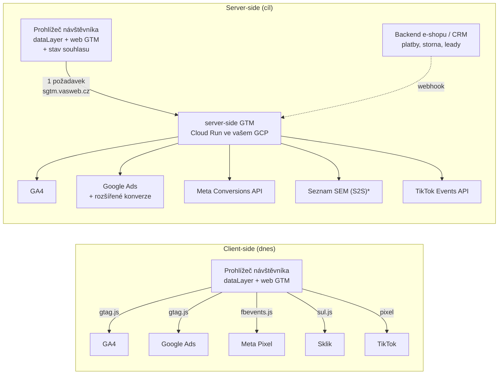
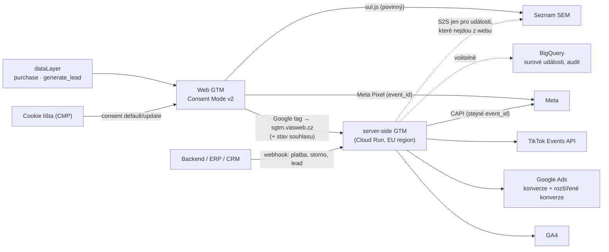

# LP 04: Server-side tracking – zadání obsahu
> Stav: návrh v1 (8. 10. 2026) · Priorita: A · URL: `/sluzby/server-side-tracking` · Segmenty: velké firmy (primárně) · e-shopy se středním a vyšším rozpočtem na reklamu · B2B / lead-gen

---

## 0. Shrnutí

**Účel stránky.** Prodat implementaci server-side Google Tag Manageru (sGTM) jako **standardní, auditovatelnou architekturu na doméně a infrastruktuře klienta** – ne jako „krabici“, která slibuje „o 35 % víc dat“. Stránka má vysvětlit, co server-side dělá a co nedělá, kde poběží, kolik stojí provoz a kdy se nevyplatí.

**Pro koho (persony):**
| Persona | Situace | Co hledá | Co ji přesvědčí |
|---|---|---|---|
| **Head of Digital / marketingový ředitel** (velká firma, e-shop s vlastním IT) | Měsíčně utrácí statisíce až miliony v Google Ads a Meta, reklamní systémy ukazují jiná čísla než ERP; IT a bezpečnost blokují další skripty | Partnera, který postaví měření „po firemním“: vlastní účty, dokumentace, schvalovací proces | Architektura ve vlastním Google Cloudu, matice souhlasu, runbook, žádný lock-in |
| **IT architekt / security / DPO** (spoluschvalovatel) | Dostal na stůl návrh „server-side měření“ a má posoudit rizika | Co přesně odchází komu, kde běží server, kdo má přístup, jak se řeší souhlas | Tabulka toků dat, IAM, logy, region EU, „server-side nemění povinnost souhlasu“ |
| **E-commerce manager středního e-shopu** | Porovnává SaaS (Stape, DataNostro, DataPlus, OneTag) s implementací na míru | Jestli se mu to vyplatí a kolik stojí provoz | Poctivá tabulka „kdy server-side nedává smysl“, rozpad nákladů na provoz, srovnání hostingu |

**Hlavní konverze:** kontaktní formulář (`form_id: lp-server-side`) – konzultace architektury; telefon (`contact_click`).
**Sekundární konverze:** přechod na článek *Server-side tracking: průvodce* (`/blog/server-side-tracking-pruvodce`) nebo *Google Tag Gateway* (`/blog/google-tag-gateway`); rozbalení tabulky nákladů (`cta_click`, `section: costs`).

**Proč tahle stránka vyhraje nad konkurencí:**
1. **Jediná česká LP, která prodává server-side na infrastruktuře klienta.** NextAnalytica (Azure, tarify od 1 390 Kč/měs.), DataPlus od Advisia („změříte až 99 % dat“, „jeden řádek kódu“), Gameplan OneTag a Datimo prodávají vlastní hostovaný produkt – pro velké firmy černou skříňku. DataNostro je hosting bez referencí. datalayer.cz nabídne **standardní sGTM ve vašem Google Cloudu** s dokumentací a exit plánem.
2. **Poctivost jako diferenciace.** Konkurence slibuje „+30 % dat“, „cookies ho nezastaví“ (OneTag), FAQ DataPlus zmiňuje identifikaci bez souhlasu podle parametrů zařízení. My jasně řekneme: server-side **nemění povinnost souhlasu** a **neobchází** blokátory ani ochranu prohlížečů. Pro DPO a právní oddělení velkých firem je to argument pro, ne proti.
3. **Aktuální technická hloubka:** Google Tag Gateway vs. sGTM, Seznam Event Measurement S2S (a jeho omezení), Safari ITP a „IP cloaking“, změny Consent Mode od 15. 6. 2026. Digitální architekti mají na SST texty s kontextem z roku 2021, Advisio „v roce 2024 nebude fungovat“.
4. **Tabulka „kdy server-side nedává smysl“ + rozpad provozních nákladů** – khoder.cz má 3 věty, nikdo nemá kompletní rozhodovací tabulku ani náklady Cloud Run podle dokumentace Google.

---

## 1. SEO a meta

| Prvek | Návrh |
|---|---|
| **Title** (59 znaků) | `Server-side tracking – měření na vaší doméně \| datalayer.cz` |
| **Meta description** (147 znaků) | `Server-side GTM na vaší doméně a ve vašem Google Cloudu. Meta CAPI, Google Ads, GA4 i Sklik přes server, v souladu se souhlasem. Konzultace zdarma.` |
| **H1** (50 znaků) | `Server-side tracking na vaší doméně a vašem cloudu` |
| **URL** | `/sluzby/server-side-tracking` (301 ze `/sluzby/serverSide`) |
| **Breadcrumbs** | Úvod › Služby › Server-side tracking |
| **Canonical** | self |

### 1.1 Klíčová slova

Objemy = měsíční hledanost CZ (Ahrefs, `lp_keyword_inputs.json`, `kw_mapovani_na_stranky.tsv`). Celkový objem clusteru LP: 450.

| Typ | Klíčové slovo | Objem | Kde použít |
|---|---|---|---|
| **Hlavní** | server side tracking / server-side tracking | 50 / 10 | title, H1 (varianta „server-side tracking“), rychlá odpověď, URL |
| Vedlejší | server side gtm / gtm server side / server side tagging | 30 / 10 / 10 | H2 „Jak funguje server-side GTM“, alt diagramu, FAQ 1 |
| Vedlejší | server side měření | 20 | podtitul hero, H2 srovnání („client-side vs. server-side měření“) |
| Vedlejší | google tag manager server side tracking / server side tracking gtm / gtm server side tracking | 10 / 10 / 10 | text sekce Řešení, FAQ |
| Vedlejší | ga4 server side / server side ga4 | 10 / 10 | tabulka platforem (řádek GA4) |
| Vedlejší | server side events | 20 | tabulka platforem (Meta CAPI, TikTok Events API) |
| Vedlejší | google tag gateway / google tag gateway cloudflare | 80 / 10 | H2 „Google Tag Gateway, nebo server-side GTM?“, FAQ 8 – **hlavní cíl dotazu je článek B4** (viz kanibalizace) |
| Vedlejší | stape / stape io | 80 / 10 | tabulka hostingu (řádek Stape), FAQ 5 – dotaz je převážně navigační |
| Long-tail | implementace server side tracking (cena) | – (SERP sledovaný) | FAQ 7 „Z čeho se skládá cena“, sekce náklady |
| Long-tail | server side tracking gdpr / je server side tracking legální | – (PAA) | box „Co server-side nemění“, FAQ 2 |
| Long-tail | propojení client side a server side | – (SERP sledovaný) | H2 hybridní architektura, odkaz na článek B2 |
| Otázky (PAA) | What does server-side tracking do? · Is server-side tracking legal? · What is server-side tracking in Google Tag Manager? · How to setup server-side GTM? · Co je Google Tag Gateway? | – | FAQ 1, 2, 6, 8 |

### 1.2 Co na stránku NEpatří (kanibalizace)
| Dotaz | Patří na | Na LP jen |
|---|---|---|
| co je google tag gateway, google tag gateway cloudflare návod | článek B4 `/blog/google-tag-gateway` | srovnávací tabulka + odkaz |
| stape pricing, stape vs google cloud, kolik stojí server-side tracking | článek B3 `/blog/hosting-server-side-gtm` | souhrnná tabulka hostingu + odkaz |
| server side vs client side (obecně, i programování) | článek B1 / B2 | srovnávací diagram |
| first party data, first-party data strategy | článek E4 `/blog/first-party-data` (cíl LP BigQuery) | 1 věta v segmentu „velká firma“ |
| meta conversions api nastavení, event match quality | LP 06 Měření konverzí + článek B5 | řádek v tabulce platforem |
| seznam event measurement | LP 06 + článek B6 | řádek v tabulce platforem |
| cookies třetích stran konec, ITP | článek A7 `/blog/cookies-tretich-stran-2026` | 2 věty v symptomu + FAQ 3 |
| Programátorské „server side“ dotazy (Next.js, Node, SSR…) | nikam – ignorovat | – |

### 1.3 Strukturovaná data (JSON-LD)

`FAQPage` generovat z CMS ze **stejného zdroje jako viditelné FAQ** (1:1 texty). Rich snippety FAQ Google od 2023 zobrazuje jen omezeně, schéma ale pomáhá strojovému porozumění a AI přehledům.

```json
{
  "@context": "https://schema.org",
  "@graph": [
    {
      "@type": "Service",
      "@id": "https://datalayer.cz/sluzby/server-side-tracking#service",
      "name": "Server-side tracking (server-side Google Tag Manager)",
      "serviceType": "Server-side tagging a měření konverzí",
      "description": "Návrh a nasazení server-side Google Tag Manageru na doméně a v Google Cloudu klienta: GA4, Google Ads, Meta Conversions API, Seznam Event Measurement a TikTok Events API přes server, deduplikace, monitoring a dokumentace. Vždy v souladu se souhlasem návštěvníka.",
      "url": "https://datalayer.cz/sluzby/server-side-tracking",
      "provider": { "@type": "Organization", "@id": "https://datalayer.cz/#organization", "name": "datalayer.cz", "url": "https://datalayer.cz" },
      "areaServed": { "@type": "Country", "name": "Česká republika" },
      "availableLanguage": "cs",
      "audience": { "@type": "BusinessAudience", "audienceType": "E-shopy, B2B firmy a velké firmy" },
      "isRelatedTo": [
        { "@type": "Service", "name": "Měření konverzí", "url": "https://datalayer.cz/sluzby/mereni-konverzi" },
        { "@type": "Service", "name": "Cookie lišta a Consent Mode v2", "url": "https://datalayer.cz/sluzby/cookie-lista-consent-mode" }
      ]
    },
    {
      "@type": "BreadcrumbList",
      "itemListElement": [
        { "@type": "ListItem", "position": 1, "name": "Úvod", "item": "https://datalayer.cz/" },
        { "@type": "ListItem", "position": 2, "name": "Služby", "item": "https://datalayer.cz/sluzby" },
        { "@type": "ListItem", "position": 3, "name": "Server-side tracking", "item": "https://datalayer.cz/sluzby/server-side-tracking" }
      ]
    },
    {
      "@type": "FAQPage",
      "mainEntity": [
        {
          "@type": "Question",
          "name": "Je server-side tracking legální? Potřebuju pořád cookie lištu?",
          "acceptedAnswer": { "@type": "Answer", "text": "(text 1:1 z FAQ 2)" }
        },
        {
          "@type": "Question",
          "name": "Kolik stojí provoz serveru a kdo ho platí?",
          "acceptedAnswer": { "@type": "Answer", "text": "(text 1:1 z FAQ 4)" }
        }
        /* … všech 10 otázek generovat z CMS */
      ]
    }
  ]
}
```

### 1.4 OG obrázek
1200×630, tmavé pozadí `#020d1e`. Vlevo piktogram server-side (štít s nápisem `sgtm.vasweb.cz`, ze kterého vycházejí 3 šipky), vpravo H1 ve dvou řádcích (Inter 800, `#e6edf3`), pod ním mono štítek `[ server-side GTM · Google Cloud · consent-first ]` v `#00ffff`. Bez log třetích stran.

---

## 2. Wireframe

```
┌───────────────────────────────────────────────────────────────────────┐
│ Breadcrumbs: Úvod › Služby › Server-side tracking                     │
├───────────────────────────────────┬───────────────────────────────────┤
│ [ server-side GTM ] (eyebrow mono)│  HERO VIZUÁL: dataLayer.push →    │
│ H1                                │  štít sgtm.vasweb.cz → 5 výstupů  │
│ Podtitul                          │  + přepínač „Souhlas: přijat /    │
│ Rychlá odpověď (box, 55 slov)     │    odmítnut“                      │
│ [ Konzultovat architekturu ] [ Jak to funguje ]                       │
│ mikrocopy                         │                                   │
├───────────────────────────────────┴───────────────────────────────────┤
│ TRUST BAR: 4 fakta (1 řádek)                                          │
├───────────────────────────────────────────────────────────────────────┤
│ SYMPTOMY: „Poznáváte se?“ 6 karet (3×2)                               │
├───────────────────────────────────────────────────────────────────────┤
│ CO SERVER-SIDE DĚLÁ A CO NE: 2 sloupce + právní box                   │
├───────────────────────────────────────────────────────────────────────┤
│ DIAGRAM #diagram: client-side vs. server-side (2 sloupce) + tabulka   │
├───────────────────────────────────────────────────────────────────────┤
│ HYBRIDNÍ ARCHITEKTURA: diagram + tabulka platforem (GA4…LinkedIn)     │
├───────────────────────────────────────────────────────────────────────┤
│ KDE SERVER POBĚŽÍ: srovnání hostingu (tabulka, 4 sloupce)             │
├───────────────────────────────────────────────────────────────────────┤
│ NÁKLADY NA PROVOZ: rozpad položek + ukázkový příklad (rozbalovací)    │
├───────────────────────────────────────────────────────────────────────┤
│ GOOGLE TAG GATEWAY vs. sGTM: tabulka                                  │
├───────────────────────────────────────────────────────────────────────┤
│ KDY SERVER-SIDE NEDÁVÁ SMYSL: tabulka 8 řádků + CTA                   │
├───────────────────────────────────────────────────────────────────────┤
│ CO DOSTANETE: 9 výstupů (karty s mono štítky)                         │
├───────────────────────────────────────────────────────────────────────┤
│ POSTUP A DÉLKA: timeline 6 kroků                                      │
├───────────────────────────────────────────────────────────────────────┤
│ MONITORING A PROVOZ: mockup dashboardu + seznam alertů                │
├───────────────────────────────────────────────────────────────────────┤
│ PŘÍPADOVÁ STUDIE (MiniCase) – placeholder                             │
├───────────────────────────────────────────────────────────────────────┤
│ PRO KOHO: záložky E-shop · B2B · Velká firma                          │
├───────────────────────────────────────────────────────────────────────┤
│ FAQ (10)                                                              │
├───────────────────────────────────────────────────────────────────────┤
│ DO HLOUBKY (5 článků) · NAVAZUJÍCÍ SLUŽBY (3 karty)                   │
├───────────────────────────────────────────────────────────────────────┤
│ KONTAKT #kontakt (2 sloupce, form_id lp-server-side)                  │
└───────────────────────────────────────────────────────────────────────┘
```

**Mobil (360–390 px):**
- Hero: vizuál pod textem, zjednodušený (svislý tok, 3 výstupy + „+2“), přepínač souhlasu zůstává.
- Symptomy: 1 sloupec, karty s piktogramem vlevo.
- Srovnávací diagram: dva sloupce se složí pod sebe, nahoře přepínač `[ Client-side | Server-side ]` (segmentový ovladač) místo zobrazení obou najednou.
- Tabulky (platformy, hosting, Gateway, „kdy ne“): na mobilu jako **karty** (každý řádek = karta s popisky polí), ne horizontální scroll.
- Sticky spodní lišta (globální): `Zavolat` · `Napsat`.
- Náklady: rozbalovací sekce zavřená ve výchozím stavu.

---

## 3. Obsah sekcí

### 3.1 Hero (`HeroService`)
**Účel:** během 5 sekund říct, co služba je, čím se liší (vaše doména, váš cloud, souhlas) a nabídnout dvě cesty (konzultace / vysvětlení).

- **Eyebrow (mono):** `[ server-side GTM ]`
- **H1:** Server-side tracking na vaší doméně a vašem cloudu
- **Podtitul:** Nasadíme server-side Google Tag Manager na subdoménu vašeho webu a do Google Cloudu, který patří vám. Data do GA4, Google Ads, Meta, Skliku a TikToku pak odcházejí přes server pod vaší kontrolou – vždy podle souhlasu návštěvníka.
- **Rychlá odpověď** (box s rámečkem `#00b0b0`, nadpis „Rychlá odpověď“, 55 slov):
  > Server-side tracking přesouvá odesílání měřicích dat z prohlížeče na server na vaší doméně. Prohlížeč pošle událost jednou – do vašeho server-side GTM – a ten ji podle pravidel a souhlasu návštěvníka předá do GA4, Google Ads, Meta Conversions API nebo Skliku. Získáte kontrolu nad tím, co a komu odchází. Povinnost souhlasu se tím nemění.
- **CTA1 (oranžové):** `[ Konzultovat architekturu ]` → `#kontakt` · `cta_id: hero_konzultace`
- **CTA2 (outline cyan):** `[ Jak to funguje ]` → `#diagram` · `cta_id: hero_jak_funguje`
- **Mikrocopy pod CTA:** „Úvodní konzultace je zdarma. Provoz serveru platíte napřímo Googlu nebo hostingu – bez naší přirážky.“ *[OVĚŘIT s klientem: „bez přirážky“ – pokud klient hosting přefakturovává, větu upravit.]*

**Vizuální prvek – animovaný diagram (inline SVG), navazuje na hero homepage:**
- Vlevo kódový blok (Roboto Mono 13 px, pozadí `#0b1a30`):
  ```
  dataLayer.push({
    event: 'purchase',
    transaction_id: 'OBJ-2026-10815',
    value: 2490, currency: 'CZK'
  })
  ```
- Uprostřed uzel ve tvaru **štítu** s popiskem `sgtm.vasweb.cz` a pod ním drobně `Cloud Run · europe-west3 · projekt: vas-projekt` (glow `#00ffff`).
- Vpravo 5 uzlů (čtverce s glow): `GA4`, `Google Ads`, `Meta CAPI`, `Sklik SEM`, `TikTok`. Spojnice přerušované, „paket“ (malý čtverec) putuje kód → štít → výstupy, cyklus 4 s.
- Nad štítem **přepínač** `Souhlas: [ přijat | odmítnut ]` (výchozí: přijat). Při „odmítnut“: linky do `Meta CAPI`, `Sklik SEM`, `TikTok`, `Google Ads` zešednou a u štítu se objeví štítek `consent: denied → reklamní tagy neodcházejí`; do `GA4` a `Google Ads` vede tenká tečkovaná linka se štítkem `cookieless ping (advanced consent mode)`. *Pozn. pro autora: rozlišení musí odpovídat realitě – v advanced consent mode Google značky posílají pingy bez cookies, ostatní platformy nic.*
- `prefers-reduced-motion`: statický stav bez putujícího paketu.
- Mobil: svisle (kód → štít → 3 výstupy + štítek `+2`).
- Alt text: „Schéma: událost purchase z datové vrstvy webu jde na server-side GTM na doméně sgtm.vasweb.cz a odtud podle souhlasu do GA4, Google Ads, Meta Conversions API, Skliku a TikToku.“

**Měření:** `cta_click` (`hero_konzultace`, `hero_jak_funguje`, `section: hero`); `diagram_interaction` (`diagram_id: hero_sst`, `node: consent_toggle_denied | consent_toggle_granted`).

---

### 3.2 Trust bar (`TrustBar`)
**Účel:** rychlé důkazy, že jde o specialisty, ne o přeprodejce SaaS.

4 položky v řádku (mono číslo/štítek + krátký text):
1. `[DOPLNIT: počet]` server-side implementací v produkci *(pokud je číslo malé, použít místo toho „Server-side GTM od roku [DOPLNIT]“)*
2. `GCP` – „Server běží ve vašem Google Cloudu, faktury chodí od Googlu“
3. `0 lock-in` – „Kontejnery, dokumentace i přístupy zůstávají vaše“
4. `sgtm.datalayer.cz` – „Vlastní web měříme stejně – ověříte si to v DevTools“ *[DOPLNIT: platí až po nasazení sGTM na datalayer.cz – audit stagingu uvádí, že web zatím nemá GTM ani lištu. Do té doby položku nahradit „Certifikace: [DOPLNIT]“ nebo vynechat.]*

Loga klientů: **jen** pokud jde o projekty měření/server-side `[DOPLNIT: loga + souhlas klienta se zveřejněním]`. Bez log raději nic.

**Vizuál:** bez ikon, jen mono štítky v `#00ffff` a text `#e6edf3`. Na mobilu 2×2.

---

### 3.3 Symptomy (`SymptomCards`)
**H2:** Poznáváte se v některé z těchto situací?
**Úvodní věta:** Server-side tracking dává smysl, když měření už funguje, ale narazilo na limity prohlížeče, rychlosti nebo kontroly nad daty. Typicky to vypadá takhle:

| # | Karta (nadpis) | Text | Piktogram (popis pro ilustrátora) |
|---|---|---|---|
| 1 | Meta vidí méně nákupů než váš e-shop | Pixel sám v prohlížeči zachytí jen část objednávek. Bez Conversions API a správné deduplikace optimalizuje Meta na neúplná data. | Dva sloupce `admin` a `meta` různé výšky, mezi nimi šipka s otazníkem |
| 2 | Návštěvníci ze Safari se „rozpadají“ | Safari zkracuje platnost cookies vytvořených JavaScriptem na 7 dní a po prokliku z odkazu s identifikátorem prokliku (typicky z reklamy) i na 24 hodin. Vracející se zákazník pak vypadá jako nový a atribuce se ztrácí. | Kompas Safari s přesýpacími hodinami a štítkem `7d` |
| 3 | IT tlačí na rychlost a bezpečnost webu | Na webu běží desítka marketingových skriptů z cizích domén. Každý zpomaluje stránku a komplikuje bezpečnostní politiku (CSP). | Rychloměr se skripty `<script>` jako závažím |
| 4 | Bezpečnost nebo DPO chtějí vědět, co komu odchází | Při měření v prohlížeči posílá každý skript data přímo svému provozovateli. Bez prostředníka nemáte jak doložit ani omezit obsah. | Obálka s lupou a štítkem `PII?` |
| 5 | Server-side už máte – jako černou skříňku | Dodavatel provozuje server u sebe, kontejner nevidíte a odchod znamená začít znovu. | Zamčená krabice s klíčem mimo dosah |
| 6 | Konverze mimo prohlížeč se do reklam nedostanou | Platba schválená až po návratu z brány, storno, vratka nebo schválení v CRM – to prohlížeč nevidí. | Účtenka se šipkou ze `server` do `ads` |

*Pozn. k faktu v kartě 2:* ověřeno na webkit.org/tracking-prevention (7denní limit pro úložiště vytvořené skriptem, 24 h při detekci dekorace odkazu). Nepsat „Safari maže cookies“ obecně.

**Vizuál:** karty `#0b1a30`, piktogramy line style 32×32 dle systému v architektuře kap. 5, mono štítek u každého (`meta`, `itp`, `perf`, `pii`, `lock-in`, `s2s`).
**CTA pod kartami:** text „Nevíte, která situace je vaše? Projdeme to spolu na konzultaci.“ + `[ Probrat můj případ ]` → `#kontakt` · `cta_id: symptoms_cta`.

---

### 3.4 Co server-side dělá a co ne (`FeatureList` 2 sloupce + právní box)
**H2:** Co server-side tracking vyřeší – a co ne
**Úvod:** Server-side GTM je prostředník mezi vaším webem a reklamními systémy. Je to silný nástroj, ale ne zázrak. Tohle je poctivý přehled:

| ✅ Co server-side přinese | ❌ Co server-side neudělá |
|---|---|
| **Kontrolu nad daty** – před odesláním můžete odstranit nebo zahashovat osobní údaje a posílat jen to, co platforma potřebuje. | **Nenahradí souhlas.** Kdo cookies odmítne, nesmí být měřen jinou cestou. |
| **Méně skriptů v prohlížeči** – jedna knihovna místo několika, rychlejší stránka a jednodušší CSP. | **Neobchází blokátory ani ochranu prohlížečů.** Pokud se návštěvník rozhodl měření omezit, respektujeme to. |
| **First-party kontext** – měřicí endpoint běží na vaší doméně a cookies nastavuje server vaší domény podle pravidel prohlížeče. | **Neopraví špatnou datovou vrstvu.** Chyba v `dataLayer` se přes server jen přenese dál. |
| **Spolehlivější konverze do reklam** – Meta Conversions API, rozšířené konverze Google Ads a serverové události z backendu (platby, storna). | **Nezaručí „100 % dat“.** Rozdíly mezi systémy zůstanou (atribuce, okna, modelování). |
| **Jeden proud událostí** pro všechny platformy – stejné ID objednávky, stejná hodnota. | **Nebude bez údržby.** Server je infrastruktura: potřebuje monitoring, aktualizace a vlastníka. |
| **Auditovatelnost** – verze kontejneru, logy, přístupová práva ve vašem účtu. | **Nesníží náklady na nulu.** Provoz serveru stojí měsíčně peníze (viz níže). |

**Právní box (komponenta `Callout`, levý okraj `#ff7400`):**
> **Server-side nemění nic na povinnosti souhlasu.** Podle § 89 odst. 3 zákona č. 127/2005 Sb., o elektronických komunikacích, je k ukládání údajů do zařízení návštěvníka nebo k přístupu k nim potřeba předem prokazatelný souhlas – s výjimkou technicky nezbytného ukládání. Evropský sbor pro ochranu osobních údajů v pokynech 2/2023 výslovně řadí pod stejné pravidlo i měřicí pixely, sledování přes URL nebo unikátní identifikátory. Proto v našich implementacích server dostává stav souhlasu s každou událostí a podle něj rozhoduje, kam smí data odejít. *Nejsme advokátní kancelář – právní posouzení vašeho zpracování patří vašemu právníkovi nebo pověřenci.*

**Vizuál:** dvousloupcová tabulka, v levém sloupci ✓ v `#00ffff`, v pravém ✕ v `#8b98a5` (ne červená – nejde o chybu, ale o hranici služby).
**Měření:** žádné specifické.

---

### 3.5 Diagram: client-side vs. server-side (`DataFlowDiagram` + `ComparisonTable`) – kotva `#diagram`
**H2:** Jak funguje server-side GTM: client-side vs. server-side měření
**Úvod:** Rozdíl je v tom, kdo posílá data reklamním systémům. Při client-side měření je to prohlížeč návštěvníka – každý skript zvlášť. Při server-side měření posílá prohlížeč událost jednou na váš server a teprve ten ji rozdělí dál.

**Diagram (povinný) – dva sloupce vedle sebe, stejné měřítko:**


\* Seznam Event Measurement vyžaduje i v S2S režimu skript `sul.js` v prohlížeči a stejnou událost nesmíte poslat z prohlížeče i ze serveru zároveň – detail v tabulce platforem.

**Zadání pro designéra:**
- Inline SVG, vizuální jazyk hero (uzly = čtverce s glow, přerušované spojnice s pohybem, popisky mono).
- Levý sloupec: z prohlížeče vychází **5 samostatných šipek** do 5 cizích domén (popisky domén drobně mono: `google-analytics.com`, `googleadservices.com`, `facebook.com`, `seznam.cz`, `tiktok.com`). Šipky v `#8b98a5`.
- Pravý sloupec: z prohlížeče **1 silná šipka** v `#00ffff` na štít `sgtm.vasweb.cz`, ze štítu 5 šipek. Pod štítem drobný štítek `consent state ✓`. Z boku přichází čárkovaná šipka z uzlu `backend` (webhook).
- Pod diagramem 3 „rozdílové“ štítky: `1 požadavek místo 5` · `vaše doména` · `rozhodnutí podle souhlasu na serveru`.
- Interakce: najetí/klik na uzel zobrazí tooltip (1 věta, co tam teče) → `diagram_interaction` (`diagram_id: cs_vs_ss`, `node: browser|sgtm|ga4|ads|meta|sklik|tiktok|backend`).
- Mobil: segmentový přepínač `[ Client-side | Server-side ]`, zobrazen jeden sloupec svisle.
- Alt: „Srovnání: v client-side měření posílá prohlížeč data přímo pěti platformám, v server-side měření posílá jednu událost na server-side GTM na vaší doméně, který data podle souhlasu rozděluje platformám a přijímá i události z backendu.“

**Srovnávací tabulka pod diagramem (kompletní obsah):**

| Kritérium | Client-side měření | Server-side měření (sGTM) |
|---|---|---|
| Kdo posílá data platformám | Prohlížeč návštěvníka, každý skript zvlášť | Váš server; prohlížeč posílá událost jednou |
| Skripty třetích stran na webu | Jeden na každou platformu | Méně – část platforem jde jen přes server (Meta pixel, `sul.js` a Heureka zůstávají) |
| Kontrola obsahu (osobní údaje, parametry URL) | Omezená – co skript sebere, to odešle | Plná – data můžete před odesláním upravit, zahashovat nebo vyřadit |
| Cookies | Nastavuje JavaScript (v Safari platnost max. 7 dní) | Může je nastavit server vaší domény (HTTP cookies) – v rámci pravidel prohlížeče |
| Souhlas návštěvníka | **Nutný** | **Stejně nutný** – server jen vynucuje rozhodnutí |
| Události mimo prohlížeč (platba, storno, CRM) | Nejdou | Jdou přes webhook / API do stejného kontejneru |
| Provozní náklady | Žádné navíc | Hosting serveru (desítky až stovky USD měsíčně podle objemu) |
| Složitost a údržba | Nižší | Vyšší – infrastruktura, monitoring, aktualizace |
| Auditovatelnost | Rozptýlená v prohlížeči | Centrálně: verze kontejneru, logy, IAM |

**CTA:** žádné (pokračuje se na hybridní architekturu).

---

### 3.6 Hybridní architektura a platformy (`DataFlowDiagram` + `ComparisonTable`)
**H2:** Hybridní architektura: co jde přes server a co zůstává v prohlížeči
**Úvod:** V praxi stavíme kombinaci. Prohlížeč dál sbírá události z datové vrstvy a stav souhlasu, server je zpracuje a předá platformám. Některé skripty v prohlížeči zůstat musí – buď to vyžaduje platforma, nebo to doporučuje kvůli deduplikaci.

**Diagram (Mermaid náhled; finál v SVG stejného stylu):**



**Tabulka platforem (kompletní obsah):**

| Platforma | Co jde přes server | Co zůstává v prohlížeči | Deduplikace | Na co si dát pozor |
|---|---|---|---|---|
| **GA4** | Událost přes GA4 klienta v sGTM, dál do GA4 | Google tag (jedna knihovna, posílá na vaši doménu) | – | Souhlas `analytics_storage`; volitelně serverem spravovaný identifikátor klienta |
| **Google Ads** | Konverzní značka, rozšířené konverze (hashované údaje), remarketing | Google tag; zachycení `gclid` | `transaction_id` u konverze | Od dubna 2026 jedno nastavení rozšířených konverzí pro web i leady; signál `ad_user_data` |
| **Meta** | Conversions API (`Purchase`, `Lead`…) s hashovaným e-mailem/telefonem, `fbp`, `fbc`, IP, user agent | Meta Pixel – Meta doporučuje pixel a CAPI souběžně | Stejné `event_name` + `event_id`, okno 48 hodin | Kvalita shody (Event Match Quality, škála 0–10) |
| **Seznam (Sklik, Seznam Nákupy)** | Seznam Event Measurement server-to-server na `sem.seznam.cz` | Skript `sul.js` je **povinný** (vytváří cookies `sid`, `udid` – až po souhlasu `ad_storage`) | Plná deduplikace je podle Seznamu „v přípravě“ – stejnou událost neposílat z webu i serveru | SEM je v betě; přepnutí účtu je nevratné, testovat v sandboxu |
| **TikTok** | Events API | TikTok Pixel | Stejný event + `event_id`, okno 48 hodin | Konzistentní názvy událostí |
| **LinkedIn** (B2B) | Conversions API | Insight Tag | Stejné `eventId`; při shodě LinkedIn počítá událost z Insight Tagu | Pro každý zdroj vlastní konverzní pravidlo |
| **Microsoft Ads** | Podle aktuální nabídky Microsoftu *[OVĚŘIT před publikací – dostupnost serverového API]* | UET tag | – | Od 5. 5. 2025 vyžaduje Microsoft v EHP, UK a CH signál souhlasu (`ad_storage`) |
| **BigQuery** (volitelně) | Kopie surových událostí ze sGTM do vaší tabulky | – | – | Pro audit a srovnání s backendem; náklady BigQuery zvlášť |

*Heureka (měřicí skripty v šabloně, Ověřeno zákazníky z backendu) do server-side architektury nepatří – řešíme ji na LP [Měření konverzí](/sluzby/mereni-konverzi).*

**Text pod tabulkou (jedna věta + odkaz):** Podrobně o napojení client-side a server-side kontejneru, předávání `event_id` a stavu souhlasu píšeme v článku [Propojení client-side a server-side trackingu](/blog/propojeni-client-side-a-server-side).

**Vizuál:** tabulka na desktopu se sticky prvním sloupcem; loga platforem **nepoužívat** (ochranné známky) – jen textové štítky v mono. Mobil: karty.
**Měření:** `diagram_interaction` (`diagram_id: hybrid`, `node`).

---

### 3.7 Kde server poběží (`ComparisonTable`)
**H2:** Kde server poběží: váš Google Cloud, nebo spravovaný hosting?
**Úvod:** Server-side kontejner potřebuje hosting. Pro velké firmy doporučujeme Google Cloud Run ve vašem vlastním projektu. Pro menší e-shopy může dávat větší smysl spravovaný hosting. Implementaci uděláme na kterékoli variantě – rozhoduje, kdo bude server vlastnit a spravovat.

| | **Google Cloud Run ve vašem projektu** | **Stape** (spravovaný hosting) | **DataNostro** (český spravovaný hosting) | **Vlastní infrastruktura** (Kubernetes, VM) |
|---|---|---|---|---|
| Kdo vlastní účet a fakturaci | Vy – faktury od Googlu | Vy (účet u Stape) nebo agentura | Vy nebo agentura | Vy |
| Kde běží data | Region podle vaší volby (např. Frankfurt, Varšava) | Podle zvoleného plánu a regionu | EU (Německo) | Vaše datacentrum / cloud |
| Provozní náklady | Platíte výpočetní výkon, logy, síť (viz náklady) | Měsíční plán podle počtu požadavků | Měsíční plán podle počtu požadavků, fakturace v Kč | Vaše interní náklady |
| Škálování a aktualizace | Automatické škálování Cloud Run; aktualizace image řešíme my nebo váš tým | Řeší poskytovatel | Řeší poskytovatel | Váš tým |
| Doplňky (vlastní loader, prodloužení cookies, bot filtr…) | Vlastní konfigurace v kontejneru | Hotové doplňky poskytovatele | Hotové doplňky poskytovatele | Vlastní konfigurace |
| Audit, logy, přístupová práva | Plně ve vašem IAM a Cloud Logging | V rozhraní poskytovatele | V rozhraní poskytovatele | Plně ve vaší správě |
| Odchod k jinému dodavateli | Nic se nestěhuje | Export kontejneru, změna DNS | Export kontejneru, změna DNS | Nic se nestěhuje |
| Kdy volíme | Velké firmy, regulované obory, požadavky IT/security, víc domén | Rychlý start, menší rozpočet, bez vlastního cloud týmu | Malé a střední české e-shopy, česká fakturace a podpora | Firmy s vlastním platform týmem a přísnými pravidly |

**Poznámka pod tabulkou:** Nejsme vázaní na žádného poskytovatele a neprodáváme vlastní hosting. *[DOPLNIT: pokud má klient partnerství / provizi u Stape nebo DataNostro, uvést to transparentně – „Jsme partnerem X; provize nemá vliv na doporučení“.]*
**Odkaz:** Podrobné srovnání cen a migrace: [Kde provozovat server-side GTM](/blog/hosting-server-side-gtm).
**Vizuál:** tabulka, první sloupec zvýrazněný jemným rámečkem `#00b0b0` a štítkem `doporučujeme pro velké firmy`. Mobil: karty, výchozí rozbalená první.

---

### 3.8 Náklady na provoz (`FeatureList` + rozbalovací `Accordion`)
**H2:** Kolik stojí provoz serveru (bez naší práce)
**Úvod:** Cenu naší implementace skládáme podle rozsahu (viz FAQ). Provoz serveru je ale samostatná položka, kterou platíte poskytovateli. Tady je, z čeho se skládá – ať vás nic nepřekvapí.

**Tabulka položek:**
| Položka | Google Cloud Run (váš projekt) | Spravovaný hosting | Poznámka |
|---|---|---|---|
| Servery (instance) | Google uvádí orientačně **~45 USD měsíčně za server** (1 vCPU, 0,5 GB) a pro produkci doporučuje **minimálně 2 servery** | V ceně plánu | Při vyšší návštěvnosti se servery automaticky přidávají; horní limit nastavujeme |
| Preview (ladicí) server | 1 malá instance, obvykle zanedbatelné náklady | V ceně | Potřeba pro náhled a testování kontejneru |
| Logování | Google upozorňuje, že logy nad ~1 milion požadavků měsíčně mohou výrazně zvýšit náklady – doporučuje je omezit | Podle plánu (retence logů) | Nastavíme rozumnou úroveň logů |
| Load balancer / CDN | Jen pokud chcete měřicí endpoint na stejné doméně (např. `/metrics`) nebo víc regionů | Některé plány řeší | Viz FAQ 3 (Safari) |
| Síť (odchozí přenos) | Podle objemu, u běžných webů malá položka | V ceně | – |
| BigQuery (volitelně) | Úložiště a dotazy podle objemu | – | Jen pokud chcete surová data |
| Spravovaný hosting – plán | – | Stape: veřejný ceník od 17 USD/měs. (500 tis. požadavků, roční platba); DataNostro: od 349 Kč/měs. (500 tis. požadavků) | **Ceny třetích stran k 10/2026 – před publikací ověřit, případně uvádět jen odkazem** |

**Rozbalovací box „Ukázkový příklad“** (výchozí zavřený, `cta_click` s `cta_id: costs_example_open`, `section: costs`):
> *Ukázkový příklad, ne nabídka:* minimální produkční konfigurace na Cloud Run podle dokumentace Google = 2 instance × ~45–50 USD ≈ **90–100 USD měsíčně**; s load balancerem (~18 USD) a logy realisticky **cca 110–150 USD měsíčně** (ceník Google Cloud, ověřeno 10/2026). Region `europe-west3` (Frankfurt) patří do dražšího cenového pásma Tier 2. E-shop s výraznými sezónními špičkami (Black Friday) může krátkodobě potřebovat víc instancí. Před spuštěním vám spočítáme odhad v kalkulačce Google Cloud a nastavíme upozornění na rozpočet, aby se náklady nedaly přehlédnout.

**Mikrocopy:** „Náklady na provoz hradíte přímo poskytovateli. My nastavíme rozpočtový alert a jednou měsíčně / čtvrtletně je s vámi zkontrolujeme v rámci správy.“ *[OVĚŘIT s klientem, zda je kontrola nákladů součástí správy.]*
**Vizuál:** tabulka + jednoduchý horizontální „stacked bar“ (inline SVG) s ukázkovým rozpadem: servery 2×45, preview ~5, logy ~0–20 (šrafovaně „záleží na nastavení“), LB 0–20 (šrafovaně „volitelné“). Popisky v USD, poznámka „ukázkový příklad“. Barvy: servery `#00b0b0`, ostatní odstíny `#0b1a30`/`#1c3352` s cyan obrysem.
**CTA:** `[ Spočítat provoz pro můj web ]` → `#kontakt` (předvyplní do zprávy „Chci odhad provozních nákladů server-side“) · `cta_id: costs_cta`.

---

### 3.9 Google Tag Gateway, nebo server-side GTM? (`ComparisonTable`)
**H2:** Google Tag Gateway, nebo server-side GTM?
**Úvod:** Google v květnu 2025 spustil Google tag gateway for advertisers (Google ji dřív nazýval „first-party mode“). Načítá Google značku z vaší domény přes CDN nebo load balancer a část měřicích požadavků posílá Googlu přes vaši doménu. Je to jednodušší, ale užší řešení než server-side GTM. Oba přístupy lze i kombinovat.

| | **Google Tag Gateway** | **Server-side GTM** |
|---|---|---|
| Co to je | Proxy: Google značka a její požadavky jdou přes vaši doménu | Plnohodnotný kontejner na serveru, který data zpracuje a rozdělí |
| Pro které platformy | Jen Google značky (GA4, Google Ads, Floodlight) | Google, Meta, TikTok, LinkedIn, Seznam, vlastní API, BigQuery |
| Úprava dat před odesláním | Ne | Ano – odstranění osobních údajů, obohacení (marže, stav objednávky) |
| Události z backendu (platby, CRM) | Ne | Ano |
| Infrastruktura | Vaše CDN nebo load balancer (Cloudflare, Akamai, Fastly, Google Cloud) | Hosting kontejneru (Cloud Run, Stape…) + doména |
| Provozní náklady | Obvykle nízké (v rámci CDN) | Hosting serveru (viz výše) |
| Náročnost nasazení | Nízká – bez změny značek na webu | Střední až vyšší |
| Souhlas | Consent Mode platí stejně | Consent Mode platí stejně + pravidla pro ostatní platformy |
| Kdy zvolit | Používáte hlavně Google, chcete rychlé zlepšení bez provozu serveru | Více platforem, potřeba kontroly dat, backendové události, požadavky IT |

**Text pod tabulkou:** Podle Googlu měli inzerenti s nastavenou gateway o 11 % víc signálů (měřeno načtením Google tagu, medián za 9.–16. 4. 2025). Pro menší weby, které inzerují převážně v Google Ads, proto často doporučíme začít gateway – a server-side GTM zvážit později. Podrobně: [Google Tag Gateway a first-party mode](/blog/google-tag-gateway).
**Vizuál:** tabulka se dvěma sloupci, mini-piktogramy v záhlaví (gateway = šipka procházející štítem bez „ozubeného kola“; sGTM = štít s ozubeným kolem a 3 výstupy).
**Měření:** `cta_click` na odkaz článku (`cta_id: gateway_article`, `section: gateway`).

---

### 3.10 Kdy server-side nedává smysl (`ComparisonTable`) – povinná sekce
**H2:** Kdy vám server-side doporučíme nenasazovat
**Úvod:** Server-side tracking není první krok a nehodí se každému. V těchto situacích vám řekneme rovnou, že peníze dáte jinam s lepším efektem:

| Situace | Proč server-side nepomůže | Co doporučíme místo toho |
|---|---|---|
| Datová vrstva nebo základní měření nesedí | Server přenese chybná data dál – jen dráž | [Audit měření](/sluzby/audit-mereni) a oprava [datové vrstvy](/sluzby/datova-vrstva) |
| Nemáte funkční cookie lištu a Consent Mode | Server nesmí obcházet souhlas; nejdřív musí být jasné, co smí odejít | [Cookie lišta a Consent Mode v2](/sluzby/cookie-lista-consent-mode) |
| Malý rozpočet na reklamu a malá návštěvnost | Provoz serveru a údržba se nevrátí v lepší optimalizaci kampaní | Čisté client-side měření, rozšířené konverze Google Ads, případně Google Tag Gateway |
| Inzerujete jen v Google Ads | Většinu přínosu dá Google Tag Gateway a rozšířené konverze s menší složitostí | Google Tag Gateway + [měření konverzí](/sluzby/mereni-konverzi) |
| Nikdo nebude server vlastnit a hlídat | Výpadek serveru znamená výpadek měření všech platforem najednou | Spravovaný hosting + [správa měření](/sluzby/sprava-webu-a-mereni), nebo počkat |
| Hlavní problém je atribuce nebo kvalita leadů | Server-side nezmění, jak systémy přiřazují konverze, ani kvalitu poptávek | Offline konverze z CRM, [měření pro B2B](/reseni/b2b-a-lead-generation) |
| Očekáváte „100 % dat“ nebo měření bez souhlasu | To server-side neumí a dělat by to neměl | Realistické cíle: lepší kvalita signálu u souhlasících, modelování v Google |
| Web nedovolí vlastní subdoménu ani úpravu DNS | Bez vaší domény přicházíte o hlavní výhodu first-party kontextu | Řešení s platformou / provozovatelem webu; jinak odložit |

**CTA pod tabulkou:** „Nejste si jistí? Na konzultaci vám řekneme, jestli se vám to vyplatí – i když odpověď bude ne.“ `[ Ověřit, jestli se mi to vyplatí ]` → `#kontakt` · `cta_id: notfit_cta`.
**Vizuál:** tabulka, první sloupec s piktogramem „stop“ (osmiúhelník line style v `#8b98a5`). Mobil: karty.

---

### 3.11 Co dostanete (`Deliverables`)
**H2:** Co od nás dostanete
**Úvod:** Výstupem není „zapnutý server“, ale zdokumentovaná architektura, kterou váš tým nebo jakýkoli jiný dodavatel dokáže převzít.

| # | Výstup | Popis | Mono štítek |
|---|---|---|---|
| 1 | Návrh architektury | Dokument a diagram: co jde přes server, co zůstává v prohlížeči, kde se rozhoduje o souhlasu, jaká data odcházejí které platformě | `architecture.pdf` |
| 2 | Infrastruktura ve vašem účtu | Projekt v Google Cloudu, Cloud Run (min. 2 servery), preview server, doména nebo cesta na vašem webu, certifikát, přístupová práva, rozpočtový alert | `gcp` |
| 3 | Webový a serverový kontejner GTM | Verzované kontejnery s popisem každé verze a jmennou konvencí | `gtm-web` `gtm-server` |
| 4 | Mapa událostí | Tabulka: událost z datové vrstvy → parametry → platformy; specifikace `event_id` pro deduplikaci | `events.csv` |
| 5 | Matice souhlasu | Který tag (webový i serverový) smí běžet při jakém stavu souhlasu | `consent-matrix` |
| 6 | Testovací protokol | Scénáře (souhlas přijat / odmítnut / změněn, nákup, storno, Safari a iOS), výsledky a srovnání s backendem | `test-report` |
| 7 | Monitoring | Alerty (výpadek, chybovost, pokles událostí) a dashboard s denním srovnáním objednávek backend × server × GA4 × Meta | `monitor` |
| 8 | Provozní příručka | Co dělat při výpadku, jak aktualizovat server, kdo má přístupy, jak dodavatele vyměnit (exit plán) | `runbook.md` |
| 9 | Předání a zaškolení | Schůzka pro marketing a IT, záznam, otázky do 30 dní po spuštění *[OVĚŘIT délku podpory po spuštění s klientem]* | `handover` |

*[DOPLNIT: nabízí klient infrastrukturu jako kód (Terraform)? Pokud ano, přidat k výstupu 2 – pro velké firmy silný argument.]*
**Vizuál:** karty 3×3, každá s mono štítkem nahoře (styl „název souboru“), na mobilu 1 sloupec. Volitelně u výstupu 1 a 6 náhled anonymizované stránky dokumentu `[DOPLNIT: anonymizovaná ukázka]`.

---

### 3.12 Postup a délka (`ProcessTimeline`)
**H2:** Jak nasazení probíhá a jak dlouho trvá
**Úvod:** Typický projekt trvá 4–8 týdnů včetně souběžného běhu. U velkých firem prodlužuje harmonogram hlavně schvalování přístupů a bezpečnostní revize – s tím počítáme od začátku. *[OVĚŘIT délky s klientem.]*

| Krok | Co děláme | Typická délka | Co potřebujeme od vás |
|---|---|---|---|
| 1. Audit a návrh | Projdeme stávající měření, datovou vrstvu, souhlas a reklamní účty; navrhneme architekturu | 3–5 pracovních dní | Přístup (čtení) do GTM, GA4, Ads, Meta Business, Skliku; kontakt na vývojáře |
| 2. Infrastruktura | Projekt v Google Cloudu, Cloud Run, doména, certifikát, přístupy, rozpočtový alert | 2–4 pracovní dny | Fakturační účet Google Cloud, úprava DNS (váš admin), schválení IT |
| 3. Napojení webu | Google tag posílá na váš server, GA4 přes server, předávání stavu souhlasu | 3–5 pracovních dní | Případné úpravy datové vrstvy (vývojář) |
| 4. Reklamní platformy | Meta CAPI, Google Ads + rozšířené konverze, TikTok, Seznam SEM, deduplikace `event_id`, volitelně backendové webhooky | 5–10 pracovních dní | Přístupy do reklamních účtů (role, ne hesla), tokeny API |
| 5. Souběžný běh a validace | Starý i nový způsob měření běží vedle sebe, denně porovnáváme s backendem | 2–4 týdny | Export objednávek / leadů pro srovnání |
| 6. Přepnutí a předání | Vypnutí duplicit, dokumentace, monitoring, zaškolení | 2–3 pracovní dny | Účast na předávací schůzce |

**Vizuál:** horizontální timeline (desktop) s mono čísly `01–06`, u každého kroku štítek délky; mobil svisle. Kroky 5 zvýraznit (nejdelší, ale nejdůležitější).

---

### 3.13 Monitoring a provoz (`FeatureList` + mockup)
**H2:** Jak poznáte, že server-side funguje (a že nevypadl)
**Úvod:** Server je infrastruktura. Když vypadne, nevypadne jedna značka, ale měření všech platforem najednou. Proto je monitoring součástí každého nasazení, ne příplatek.

**Co hlídáme (seznam s mono štítky):**
- `uptime` – dostupnost měřicího endpointu, upozornění do e-mailu nebo Slacku *[DOPLNIT: kanál]*
- `5xx / 4xx` – chybovost serveru a odmítnuté požadavky
- `volume` – počet událostí proti obvyklému průběhu dne (pokles o víc než nastavený práh)
- `purchase diff` – denní srovnání objednávek: backend × server × GA4 × Meta
- `dedup` – podíl deduplikovaných událostí v Meta Events Manageru
- `emq` – vývoj kvality shody událostí v Meta
- `consent` – změna podílu souhlasů (náhlý skok = podezření na chybu lišty)
- `cost` – rozpočtový alert v Google Cloudu
- `versions` – kdo a kdy publikoval verzi kontejneru

**Mockup (stylizovaný, ne screenshot):** dashboard v brand barvách se 4 dlaždicemi a jednou tabulkou – *fiktivní data, popisek „ilustrační ukázka“*:
- Dlaždice: `Dostupnost 30 dní: 99,97 %` · `Událostí za 24 h: 184 220` · `Chybovost: 0,04 %` · `Objednávky včera: backend 412 · server 409 · GA4 371 · Meta 388`
- Graf (sparkline 14 dní): počet událostí za hodinu s vyznačeným „oknem“ výpadku (červená svislá oblast) a štítkem `alert odeslán 03:12`.
- Tabulka „Poslední publikace kontejneru“: `v57 · 2. 10. 2026 · Meta CAPI – doplněn external_id · autor: datalayer.cz`.
Mobil: dlaždice 2×2, graf pod nimi, tabulka skrytá za „Zobrazit verze“.

**CTA:** `[ Chci měření pod dohledem ]` → [Správa webu a měření](/sluzby/sprava-webu-a-mereni) · `cta_id: monitoring_sprava`.

---

### 3.14 Případová studie (`MiniCase`)
**H2:** Z praxe: [DOPLNIT: krátký název, např. „Meta konečně vidí storna“]
**Formát:** Problém → Příčina → Oprava → Výsledek (číslo).
```
Klient:     [DOPLNIT: obor, velikost – např. „e-shop s elektronikou, 3 země“; jméno jen se souhlasem]
Problém:    [DOPLNIT: měřitelný symptom – např. rozdíl objednávek Meta vs. backend v %]
Příčina:    [DOPLNIT: technická příčina – např. pixel bez CAPI, chybějící event_id, cookies ze Safari]
Oprava:     [DOPLNIT: co přesně jsme udělali – sGTM na Cloud Run, CAPI s deduplikací, webhook storen]
Výsledek:   [DOPLNIT: číslo před/po + jak bylo měřeno a za jaké období]
Citace:     [DOPLNIT: 1 věta klienta se jménem a funkcí]
```
**Pravidla:** čísla jen ověřitelná (s obdobím a metodou), žádné „+35 % dat“ bez kontextu. Dokud studie není, sekci **nezobrazovat** – nenahrazovat ukázkou.
**Vizuál:** karta se 4 kroky v řádku (mono `01–04`), u výsledku velké číslo v `#00ffff`. `cta_id: case_cta` → `/pripadove-studie/{slug}`.

---

### 3.15 Pro koho (`SegmentTabs`)
**H2:** Co je jinak u e-shopu, B2B a velké firmy

| Záložka | Text |
|---|---|
| **E-shop** | U e-shopu jde hlavně o nákupy v Meta a Google Ads: Conversions API s deduplikací, rozšířené konverze, stejné ID objednávky ve všech systémech. Přes server umíme poslat i události, které prohlížeč nevidí – zaplacení po návratu z platební brány nebo storno. Pro české e-shopy řešíme také Seznam Event Measurement a Heureku. Platformy Shoptet, Upgates, WooCommerce i vlastní řešení. |
| **B2B / lead-gen** | U poptávek je hodnota až v CRM. Server-side GTM slouží jako jedno místo, kam formulář pošle lead s hashovaným e-mailem, a kam později CRM pošle informaci, že z leadu je zakázka. Odtud jdou konverze do Google Ads, Meta i LinkedIn. Navazuje na [měření pro B2B a lead generation](/reseni/b2b-a-lead-generation). |
| **Velká firma** | U velkých firem rozhoduje vlastnictví a kontrola: server ve vašem Google Cloudu, přístupy přes vaše IAM, region v EU, logy, verzování, matice souhlasu pro DPO a dokumentace pro interní audit. Umíme pracovat s více doménami a zeměmi, s vaším platform týmem i s bezpečnostní revizí. Surová data mohou téct rovnou do vašeho BigQuery. |

**Vizuál:** záložky s piktogramy z architektury (`purchase`, `lead`, `gov`); výchozí záložka „Velká firma“ (primární segment LP). `cta_click` na přepnutí záložky není potřeba; volitelně `diagram_interaction` s `diagram_id: segments`, `node: eshop|b2b|enterprise`.

---

### 3.16 FAQ (`FAQ` + `FAQPage`)
**H2:** Časté otázky k server-side trackingu

**1. Co je server-side tracking a jak se liší od běžného měření?**
Při běžném (client-side) měření posílá data reklamním systémům prohlížeč návštěvníka – každý skript zvlášť a přímo. Při server-side trackingu pošle prohlížeč událost jednou na server, který běží na vaší doméně (typicky server-side Google Tag Manager). Server ji zpracuje a podle pravidel a souhlasu předá do GA4, Google Ads, Meta Conversions API a dalších platforem. Výhodou je kontrola nad obsahem dat, méně skriptů na webu a možnost posílat i události z backendu. Nevýhodou je provozní náklad a nutnost server hlídat.

**2. Je server-side tracking legální? Potřebuju pořád cookie lištu?**
Ano, cookie lištu potřebujete dál. Server-side je jen jiná technická cesta, právní pravidla se nemění. Podle § 89 odst. 3 zákona o elektronických komunikacích je k ukládání a čtení netechnických údajů v zařízení návštěvníka potřeba jeho předchozí souhlas a Evropský sbor pro ochranu osobních údajů do tohoto pravidla řadí i pixely a sledování přes URL. Server-side proto nastavujeme tak, aby s každou událostí dostal stav souhlasu a podle něj data poslal, nebo neposlal. Nejsme advokátní kancelář – právní posouzení zajistí váš právník.

**3. Pomůže server-side proti adblockům a Safari ITP?**
Není to cíl ani slib. Pokud návštěvník měření odmítne – souhlasem nebo nástrojem v prohlížeči – respektujeme to. Server-side ale pomůže tam, kde limity prohlížeče dopadají i na souhlasící návštěvníky: cookies nastavené serverem vaší domény nejsou omezené stejně jako cookies z JavaScriptu. Safari přitom zkracuje i serverové cookies na 7 dní, pokud měřicí server vyhodnotí jako skrytou třetí stranu (jiná IP adresa nebo CNAME). Proto u velkých webů zvažujeme provoz na stejné doméně přes CDN nebo load balancer, jak doporučuje i Google. A „konec cookies třetích stran“? Chrome je podle Googlu (duben 2025) ponechává a volbu nechává na uživateli – server-side tedy není reakce na jejich zánik.

**4. Kolik stojí provoz serveru a kdo ho platí?**
Provoz platíte přímo poskytovateli – Googlu u Cloud Run, případně spravovanému hostingu. Google pro Cloud Run uvádí orientačně 45–50 USD měsíčně za instanci a do produkce doporučuje aspoň dvě, takže minimální konfigurace vychází zhruba na 90–100 USD měsíčně; s load balancerem (~18 USD) a logy realisticky cca 110–150 USD měsíčně (ceník Google Cloud, ověřeno 10/2026). Navíc může přibýt BigQuery. Spravované hostingy mají měsíční plány podle počtu požadavků. Před spuštěním vám spočítáme odhad pro vaši návštěvnost a nastavíme rozpočtový alert.

**5. Stape, DataNostro, nebo vlastní Google Cloud – co vybrat?**
Záleží na tom, kdo má server vlastnit a spravovat. Velkým firmám a regulovaným oborům doporučujeme Google Cloud Run ve vlastním projektu: přístupy, logy i fakturace zůstávají u vás a odchod k jinému dodavateli nic nestojí. Pro menší e-shopy bez vlastního cloudového týmu bývá výhodnější spravovaný hosting (Stape, DataNostro) – rychlejší start, hotové doplňky a správa serveru v ceně plánu. Implementaci uděláme na kterékoli variantě a vlastní hosting neprodáváme.

**6. Jak dlouho trvá nasazení a co od vás potřebujeme?**
Typicky 4–8 týdnů včetně 2–4 týdnů souběžného běhu, kdy porovnáváme nové měření s backendem. Potřebujeme přístupy do GTM, GA4 a reklamních účtů (role, ne hesla), fakturační účet Google Cloud, někoho, kdo upraví DNS, a vývojáře pro případné úpravy datové vrstvy. U velkých firem počítáme s bezpečnostní revizí a schvalováním přístupů – harmonogram s vámi naplánujeme hned v prvním kroku. *[OVĚŘIT délky s klientem]*

**7. Z čeho se skládá cena implementace?**
Cenu neuvádíme paušálně, protože se liší hlavně podle rozsahu: kolik platforem napojujeme (GA4, Google Ads, Meta, TikTok, Seznam, LinkedIn), kolik domén a zemí měříme, v jakém stavu je datová vrstva, jestli posíláme i události z backendu nebo CRM a jaké požadavky má vaše IT (bezpečnostní revize, infrastruktura jako kód). Provoz serveru platíte zvlášť přímo poskytovateli. Po úvodní konzultaci dostanete nabídku s rozpadem na kroky a výstupy.

**8. Co je Google Tag Gateway a nahradí server-side GTM?**
Google Tag Gateway načítá Google značku z vaší domény přes CDN nebo load balancer a část požadavků posílá Googlu přes vaši doménu. Je jednodušší a levnější, ale týká se jen Google značek a data neumí upravovat ani přijímat události z backendu. Pokud inzerujete hlavně v Google Ads, může být dobrým prvním krokem. Pokud potřebujete Meta, TikTok, Seznam, kontrolu nad osobními údaji nebo serverové události, potřebujete server-side GTM. Obojí lze kombinovat.

**9. Jak zajistíte, že se konverze nezapočítají dvakrát?**
Každá událost dostane v datové vrstvě unikátní `event_id`, které posíláme z prohlížeče i ze serveru. Meta podle shody názvu události a `event_id` duplicitu do 48 hodin zahodí, podobně TikTok a LinkedIn. U Google Ads hlídáme `transaction_id`. U Seznamu je plná deduplikace teprve v přípravě, proto tam stejnou událost neposíláme z webu i serveru zároveň. Deduplikaci ověřujeme v testovacím protokolu i v monitoringu.

**10. Komu patří data, účty a kontejnery? Co když spolupráci ukončíme?**
Vám. Server běží ve vašem Google Cloudu, kontejnery GTM jsou ve vašem účtu, reklamní účty zůstávají vaše a my dostáváme jen role s potřebnými oprávněními. Při ukončení spolupráce odebereme své přístupy podle provozní příručky – měření běží dál beze změny a převezme ho váš tým nebo jiný dodavatel. Na webu přitom stačí málo změn: subdoména nebo cesta, kterou směrujeme na server, a funkční datová vrstva.

**Interakce:** akordeon, první otázka otevřená. **Měření:** `faq_open` (`question` = text otázky). Pod FAQ CTA `[ Mám jinou otázku ]` → `#kontakt` · `cta_id: faq_cta`.

---

### 3.17 Do hloubky (`RelatedArticles`)
**H2:** Do hloubky
5 karet (obrázek = mini-diagram článku, název, 1 věta, čas čtení):
1. [Server-side tracking: průvodce pro e-shopy i firmy](/blog/server-side-tracking-pruvodce)
2. [Propojení client-side a server-side trackingu: hybridní architektura krok za krokem](/blog/propojeni-client-side-a-server-side)
3. [Kde provozovat server-side GTM: Stape, Google Cloud Run, nebo český hosting?](/blog/hosting-server-side-gtm)
4. [Google Tag Gateway a first-party mode: co to je a čím se liší od server-side GTM](/blog/google-tag-gateway)
5. [Je server-side tracking legální? Server-side a souhlas uživatele](/blog/server-side-tracking-a-souhlas)

Volitelně 6.: [Cookies třetích stran, Chrome a Safari ITP v roce 2026](/blog/cookies-tretich-stran-2026).
**Měření:** `cta_click` (`cta_id: article_{id}` – `article_b1`, `article_b2`, `article_b3`, `article_b4`, `article_a5`, `article_a7`; `section: related_articles`).

### 3.18 Navazující služby (`RelatedServices`)
**H2:** Navazující služby
3 karty s piktogramem:
1. **Měření konverzí** – *Ads, Meta, Sklik i Heureka vidí totéž* → `/sluzby/mereni-konverzi` (`cta_id: related_konverze`)
2. **Cookie lišta a Consent Mode v2** – *souhlas legálně a bez zbytečné ztráty dat* → `/sluzby/cookie-lista-consent-mode` (`cta_id: related_consent`)
3. **BigQuery a datový sklad** – *surová data ze serveru ve vašem skladu* → `/sluzby/bigquery` (`cta_id: related_bigquery`)

---

## 4. Kontaktní blok (`ContactBlock`)

| Prvek | Obsah |
|---|---|
| `form_id` | `lp-server-side` |
| Předvybraná témata (`tema[]`) | `server-side`, `konverze` |
| Kotva | `#kontakt` |
| Eyebrow | `[ Kontakt ]` |
| **H2** (návrh nového textu) | **Probereme, jestli se vám server-side vyplatí** |
| Lead | „Napište nám, zavolejte, nebo vyplňte formulář. Na úvodní konzultaci projdeme vaše současné měření a řekneme, jestli server-side dává smysl – a pokud ano, v jaké variantě a s jakými provozními náklady. Nezávazně a zdarma.“ |
| Placeholder zprávy | „Např. Meta hlásí o třetinu méně nákupů než e-shop, IT nechce další skripty a zvažujeme server-side ve vlastním Google Cloudu…“ |

> **Pozn.:** v `05_formulare/specifikace-formularu.md`, tabulce 3.5, je H2 „Zjistěte, kolik konverzí vám chybí“. Navrhuji nahradit textem výše (méně slibuje, víc odpovídá poctivému tónu stránky a sekci „kdy nedává smysl“) → **aktualizovat tabulku 3.5**. Placeholder rovněž aktualizovat.

Karta osoby vlevo: Vít Novotný, role `[DOPLNIT]`, fotka `[DOPLNIT]`, LinkedIn `[DOPLNIT]`, telefon `[DOPLNIT]`.

---

## 5. Interní odkazy

**Odchozí – související LP:**
| Cíl | Anchor text | Umístění |
|---|---|---|
| `/sluzby/mereni-konverzi` | měření konverzí | tabulka „kdy ne“, navazující služby |
| `/sluzby/cookie-lista-consent-mode` | Cookie lišta a Consent Mode v2 | tabulka „kdy ne“, navazující služby |
| `/sluzby/bigquery` | BigQuery a datový sklad | navazující služby |
| `/sluzby/datova-vrstva` | datové vrstvy | tabulka „kdy ne“ |
| `/sluzby/audit-mereni` | Audit měření | tabulka „kdy ne“ |
| `/sluzby/sprava-webu-a-mereni` | správa měření / Správa webu a měření | tabulka „kdy ne“, monitoring CTA |
| `/reseni/b2b-a-lead-generation` | měření pro B2B a lead generation | tabulka „kdy ne“, záložka B2B |
| `/reseni/velke-firmy` | měření pro velké firmy | záložka Velká firma (doplnit odkaz do textu: „Více o [měření pro velké firmy](/reseni/velke-firmy)“) |

**Odchozí – články:** B1, B2, B3, B4, A5 (+ A7) dle 3.17; B2 navíc v textu tabulky platforem, B3 pod tabulkou hostingu, B4 pod tabulkou Gateway.
**Odchozí – slovník:** první výskyt pojmů v textu prolinkovat na `/slovnik/server-side-tagging`, `/slovnik/first-party-cookie`, `/slovnik/itp`, `/slovnik/conversions-api`, `/slovnik/deduplikace`, `/slovnik/google-tag-gateway` (slugy potvrdit při tvorbě slovníku).

**Příchozí:**
| Zdroj | Anchor | Kde |
|---|---|---|
| Homepage | Server-side tracking – měření na vaší doméně | sekce služeb |
| `/sluzby` (hub) + mega-menu | Server-side tracking | karta |
| `/reseni/velke-firmy` | server-side GTM ve vašem Google Cloudu | sekce architektura |
| `/reseni/e-shopy` | server-side tracking | sekce Meta/Ads |
| `/sluzby/mereni-konverzi` | server-side tracking | tabulka platforem, navazující služby |
| `/sluzby/cookie-lista-consent-mode` | server-side a souhlas | FAQ „Pomůže server-side…“ |
| `/sluzby/google-tag-manager`, `/sluzby/datova-vrstva` | server-side GTM | navazující služby |
| Články B1–B5, A5, A7 | implementace server-side trackingu | CTA box uprostřed článku |
| Slovník: server-side tagging, first-party cookie, ITP, Google Tag Gateway | služba Server-side tracking | odkaz pod heslem |

---

## 6. Co dodá klient
- [ ] Počet server-side implementací v produkci / rok začátku (trust bar 1)
- [ ] Loga klientů, kde šlo o server-side, + souhlas se zveřejněním
- [ ] Případová studie (Problém → Příčina → Oprava → Výsledek, čísla s obdobím a metodou, citace se jménem)
- [ ] Potvrzení: provoz bez přirážky? (mikrocopy hero) · délka podpory po spuštění · kontrola nákladů v rámci správy
- [ ] Potvrzení typických délek kroků (timeline)
- [ ] Nabízíte infrastrukturu jako kód (Terraform)? Pracujete i s AWS/Azure, nebo jen Google Cloud?
- [ ] Partnerství / provize u Stape, DataNostro či jiného hostingu (transparentní zmínka)
- [ ] Anonymizovaná ukázka dokumentace (architektura, testovací protokol) pro náhledy v „Co dostanete“
- [ ] Nasazení sGTM na `datalayer.cz` (trust bar 4) – jinak položku vypustit
- [ ] Kanál pro alerty (e-mail, Slack, Teams), který nabízíte
- [ ] Fotka, telefon, LinkedIn pro kontaktní blok

---

## 7. Měření stránky

| Událost | Parametry / hodnoty |
|---|---|
| `cta_click` | `cta_id`: `hero_konzultace`, `hero_jak_funguje`, `symptoms_cta`, `costs_example_open`, `costs_cta`, `gateway_article`, `notfit_cta`, `monitoring_sprava`, `case_cta`, `faq_cta`, `article_b1`, `article_b2`, `article_b3`, `article_b4`, `article_a5`, `article_a7`, `related_konverze`, `related_consent`, `related_bigquery` · `cta_text` · `section`: `hero`, `symptoms`, `costs`, `gateway`, `not_fit`, `monitoring`, `case`, `faq`, `related_articles`, `related_services` |
| `diagram_interaction` | `diagram_id`: `hero_sst`, `cs_vs_ss`, `hybrid`, `segments` · `node` (viz sekce) |
| `faq_open` | `question` |
| `scroll_depth` | `percent`: 50, 90 |
| `lead_form_start` / `lead_form_error` / `generate_lead` | `form_id: lp-server-side`, `form_location: /sluzby/server-side-tracking`, `lead_topics` |
| `contact_click` | `channel`: `phone` / `email`, `section`: `contact`, `sticky_bar` |

Klíčová událost v GA4: `generate_lead`. Mikro-konverze pro remarketing (jen se souhlasem): `cta_click` s `cta_id` = `notfit_cta` nebo `costs_cta`.

---

## 8. Akceptační checklist
1. [ ] Title 50–60 znaků, meta description 140–155 znaků, H1 jen jednou, obsahuje „server-side tracking“.
2. [ ] Rychlá odpověď je v HTML (ne jen JS), 40–60 slov, hned pod H1.
3. [ ] JSON-LD `Service` + `BreadcrumbList` + `FAQPage` validní (Rich Results Test, Schema Markup Validator), FAQ ve schématu = viditelné FAQ 1:1.
4. [ ] Na stránce **není** žádná z formulací: „obcházení blokátorů“, „100 % dat“, „cookies nás nezastaví“, „bez cookie lišty“, „zaručeně GDPR“.
5. [ ] Právní box obsahuje odkaz na § 89 odst. 3 ZEK a disclaimer „Nejsme advokátní kancelář“.
6. [ ] Srovnávací diagram client-side vs. server-side je inline SVG, má alt text, funguje na mobilu (přepínač), respektuje `prefers-reduced-motion`.
7. [ ] Tabulka „kdy server-side nedává smysl“ má všech 8 řádků a odkazy na LP fungují.
8. [ ] Ceny třetích stran (Stape, DataNostro) a náklady Cloud Run ověřené k datu publikace, s datem „stav k …“.
9. [ ] Všechny tabulky jsou na šířce 360 px čitelné jako karty, bez horizontálního scrollu stránky.
10. [ ] Placeholdery `[DOPLNIT]` jsou nahrazené nebo dané sekce skryté (zejména případová studie a trust bar).
11. [ ] Kontaktní blok má `form_id: lp-server-side`, předvybraná témata `server-side` + `konverze`, H2 a placeholder podle sekce 4; tabulka 3.5 ve specifikaci formulářů aktualizovaná.
12. [ ] V GTM Preview se odesílají `cta_click`, `diagram_interaction`, `faq_open`, `generate_lead` se správnými parametry a jen podle souhlasu.
13. [ ] LCP < 2,5 s na mobilu; hero animace nezpůsobuje CLS; žádný Font Awesome.
14. [ ] Interní odkazy: 3 navazující LP + 5 článků; články, které ještě nevyšly, mají odkaz skrytý (ne 404).
15. [ ] Datum „Aktualizováno: …“ v patičce obsahu a revize stránky naplánovaná za 6 měsíců (Consent Mode, SEM, Gateway se mění).

---

## Zdroje
| Tvrzení | Zdroj | Stav |
|---|---|---|
| § 89 odst. 3 ZEK – předchozí prokazatelný souhlas s ukládáním/přístupem k údajům v koncovém zařízení, výjimka pro technicky nezbytné | https://www.zakonyprolidi.cz/cs/2005-127 (aktuální znění, verze 52) | ověřeno 10/2026 |
| Novela 374/2021 Sb., účinnost 1. 1. 2022 | https://www.zakonyprolidi.cz/cs/2021-374 ; https://uoou.gov.cz/novinky/vse/cookies-od-zacatku-roku-2022-pouze-se-souhlasem | ověřeno 10/2026 |
| ÚOOÚ: podmínky platí i pro technologie podobné cookies a fingerprinting | https://uoou.gov.cz/verejnost/qa-otazky-a-odpovedi/cookies | ověřeno 10/2026 |
| EDPB Guidelines 2/2023 k technickému rozsahu čl. 5 odst. 3 ePrivacy (pixely, URL tracking, unikátní identifikátory), verze 2.0 přijata 7. 10. 2024 | https://edpb.europa.eu/system/files/2024-10/edpb_guidelines_202302_technical_scope_art_53_eprivacydirective_v2_en_0.pdf | ověřeno 10/2026 |
| Server-side tagging: plná kontrola nad daty pro třetí strany, odstranění PII, méně kódu v prohlížeči, CSP | https://support.google.com/tagmanager/answer/13387731 | ověřeno 10/2026 |
| Cloud Run: min. 2 instance, ~45 USD/server/měsíc, 1 vCPU / 0,5 GB, preview server, náklady na logování nad ~1M požadavků | https://developers.google.com/tag-platform/tag-manager/server-side/cloud-run-setup-guide (aktualizováno 12. 5. 2026) | ověřeno 10/2026 |
| Vlastní doména pro sGTM: same-origin jako best practice, subdoména, výchozí doména jen JS cookies | https://developers.google.com/tag-platform/tag-manager/server-side/custom-domain | ověřeno 10/2026 |
| Safari ITP: 7 dní pro úložiště vytvořené skriptem, 24 h při dekoraci odkazu, 7 dní pro cookies z odpovědí při CNAME/IP cloakingu, blokace cookies třetích stran | https://webkit.org/tracking-prevention/ ; https://webkit.org/blog/11338/cname-cloaking-and-bounce-tracking-defense/ | ověřeno 10/2026 |
| Chrome ponechává volbu cookies třetích stran, bez nové výzvy (22. 4. 2025); ukončení většiny technologií Privacy Sandbox (17. 10. 2025: Topics, Protected Audience, Attribution Reporting, IP Protection aj.) | https://privacysandbox.google.com/blog/privacy-sandbox-next-steps ; https://privacysandbox.google.com/blog/update-on-plans-for-privacy-sandbox-technologies | ověřeno 10/2026 |
| Google tag gateway for advertisers: značka z vlastní domény přes CDN/LB; Cloudflare, Akamai, Fastly, Google Cloud; oznámení 2. 5. 2025; „11 % uplift in signals“ | https://developers.google.com/tag-platform/tag-manager/gateway/setup-guide ; https://support.google.com/google-ads/answer/16214371 | ověřeno 10/2026 |
| Gateway dříve „first-party mode“ | https://support.google.com/tagmanager/answer/4620708 (release notes GTM, 8. 5. 2025: „previously first-party mode“) | ověřeno 10/2026 |
| Meta: deduplikace `event_name` + `event_id`, okno 48 h, doporučení pixel + CAPI | https://developers.facebook.com/docs/marketing-api/conversions-api/deduplicate-pixel-and-server-events/ | ověřeno 10/2026 |
| Meta: Event Match Quality 0–10, parametry zákazníka | https://developers.facebook.com/documentation/ads-commerce/conversions-api/best-practices | ověřeno 10/2026 |
| Seznam SEM S2S: endpoint `sem.seznam.cz/rtgconv`, povinný `sul.js`, cookies `sid`/`udid` až po `ad_storage: granted`, SHA-256, neposílat současně frontend i S2S, deduplikace „v přípravě“ | https://napoveda.sklik.cz/merici-skripty/seznam-event-measurement/implementace-sem/server-to-server-s2s-mereni/ | ověřeno 10/2026 |
| SEM: beta, přepnutí účtu nevratné, sandbox; Seznam ukončí podporu původních kódů v průběhu roku 2027, přesný termín oznámí s předstihem | https://napoveda.sklik.cz/merici-skripty/seznam-event-measurement/zaciname-se-sem/caste-dotazy/ ; https://o-seznam.cz/reklama/en/seznam-event-measurement/ ; https://blog.seznam.cz/2026/05/predstavujeme-seznam-event-measurement-novy-standard-mereni-vasich-kampani/ | ověřeno 10/2026 |
| TikTok: deduplikace event + `event_id`, 48 h | https://ads.tiktok.com/help/article/event-deduplication | ověřeno 10/2026 |
| LinkedIn: deduplikace `eventId`, započítá se Insight Tag | https://learn.microsoft.com/en-us/linkedin/marketing/conversions/deduplication | ověřeno 10/2026 |
| Microsoft Ads: signály souhlasu v EHP, UK, CH od 5. 5. 2025 | https://about.ads.microsoft.com/en/blog/post/march-2025/providing-user-consent-signals-on-your-microsoft-campaigns-by-may-5-2025 | ověřeno 10/2026; serverové API Microsoftu **neověřeno** |
| Google Ads: jednotné nastavení rozšířených konverzí od 4/2026 | https://support.google.com/google-ads/answer/15713840 | ověřeno 10/2026 |
| Stape ceník (Pro 17 USD/měs. při roční platbě, 500k požadavků; Business 83 USD; Enterprise 167 USD) | https://stape.io/price | ověřeno 10/2026 – **ceny se mění** |
| DataNostro ceník (STARTER 349 Kč, PRO 1 690 Kč, BUSINESS 3 490 Kč) | https://datanostro.com/cs/pricing/ (crawl 10/2026, profil konkurence) | ověřit před publikací |
