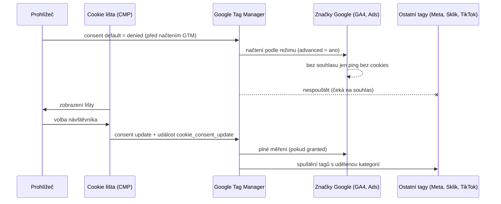

# LP 05: Cookie lišta a Consent Mode v2 – zadání obsahu
> Stav: návrh v1 (8. 10. 2026) · Priorita: A · URL: `/sluzby/cookie-lista-consent-mode` · Segmenty: e-shopy · B2B / lead-gen · velké firmy

---

## 0. Shrnutí

**Účel stránky.** Prodat **výběr a nastavení cookie lišty (CMP), Consent Mode v2 a napojení na GTM** a samostatně **audit souladu** („co váš web opravdu posílá před souhlasem“). Stránka má vysvětlit rozdíl mezi „lištou, která se zobrazuje“ a „souhlasem, který tagy skutečně respektují“, a ukázat dopad souhlasu na data – věcně, s odkazy na zákon, ÚOOÚ a Google.

**Pro koho (persony):**
| Persona | Situace | Co hledá | Co ji přesvědčí |
|---|---|---|---|
| **Marketingový manažer e-shopu** | Po nasazení lišty spadly konverze v Google Ads, nebo přišel e-mail od Googlu k zásadám pro souhlas uživatele z EU | Rychlou diagnózu a opravu bez strašení | Kategorie problémů, testovací protokol, vysvětlení modelování |
| **Majitel / marketér B2B webu** | Lištu si nainstaloval sám (Cookiebot, Consentio, Cookies správně, lišta z platformy) a neví, jestli funguje | Ověření a doporučení, co změnit | „Co web posílá před souhlasem“ – konkrétní důkaz v síťových požadavcích |
| **DPO / právník / IT ve velké firmě** | Potřebuje k právnímu posouzení technický audit a dokumentaci | Nezávislé technické zjištění, matici tagů × souhlasů, záznamy | Protokol s důkazy (HAR, screenshoty), citace zdrojů, disclaimer „nejsme advokátní kancelář“ |

**Hlavní konverze:** formulář `form_id: lp-consent` (audit nebo nastavení), telefon.
**Sekundární konverze:** nástroj zdarma *Kontrola consentu* (`/nastroje/kontrola-consentu`, `tool_use`) – *URL potvrdit v LP 15*; článek *Consent Mode v2: kompletní průvodce* (`/blog/consent-mode-v2-pruvodce`).

**Proč tahle stránka vyhraje nad konkurencí:**
1. **marketingppc.cz** má nejlépe konvertující consent LP (varování „Google to ví“, data z 250+ auditů, kategorie A/B/C, sloty na hovor) – ale je to PPC agentura, staví hlavně na strachu z auditu Googlu a nepokrývá server-side, Sklik/SEM ani modelování do hloubky. Převezmeme **strukturu** (námitka → statistiky z auditů → kategorie → FAQ → formulář), ne tón strachu.
2. **CMP (cookies-spravne.cz, consentio.cz)** končí nasazením lišty. Consentio navíc šíří nepodložená tvrzení („až 70 % dat“, „automaticky bez GTM“). Naše hodnota začíná tam, kde jejich končí: **ověření, že tagy souhlas respektují**, ne-Google tagy, Sklik, server-side, modelování.
3. **khoder.cz** (6 500 Kč) a **Digitální architekti** (340 slov) nemají testovací protokol ani CMP-agnostické srovnání včetně **vlastní lišty**.
4. **Ověřené právo + technika na jedné stránce:** § 89 odst. 3 ZEK, Q&A ÚOOÚ (12 / 6 měsíců, fingerprinting), pravidla Googlu (personalizace reklam v 1. vrstvě, změna 15. 6. 2026) – s datem ověření a disclaimerem.

---

## 1. SEO a meta

| Prvek | Návrh |
|---|---|
| **Title** (57 znaků) | `Cookie lišta a Consent Mode v2 – nastavení \| datalayer.cz` |
| **Meta description** (143 znaků) | `Vybereme a nastavíme cookie lištu, Consent Mode v2 a GTM. Ověříme, co web posílá před souhlasem, a vysvětlíme dopad na data. Konzultace zdarma.` |
| **H1** (50 znaků) | `Cookie lišta a Consent Mode v2 nastavené a ověřené` |
| **URL** | `/sluzby/cookie-lista-consent-mode` |
| **Breadcrumbs** | Úvod › Služby › Cookie lišta a Consent Mode v2 |

### 1.1 Klíčová slova (Ahrefs CZ; součet LP 1 380)

| Typ | Klíčové slovo | Objem | Kde použít |
|---|---|---|---|
| **Hlavní** | cookie lišta / cookies lišta / lišta cookies | 200 / 150 / 10 | title, H1, rychlá odpověď, H2 „Jakou cookie lištu zvolit“ |
| **Hlavní** | consent mode v2 / google consent mode v2 | 80 / 80 | title, H1, H2 basic vs. advanced, FAQ 2–3 |
| Vedlejší | google consent mode / consent mode / consent mode 2 | 30 / 30 / 10 | text sekce signálů |
| Vedlejší | cookie banner / cookies banner / cookie consent banner | 40 / 20 / 10 | alt hero vizuálu, sekce CMP |
| Vedlejší | cookiebot / cookiebot google tag manager / cookiebot tag manager | 450 / 10 / 10 | tabulka CMP (řádek Cookiebot), FAQ 6 – dotaz „cookiebot“ je navigační, LP cílí na „cookiebot + GTM / implementace“ |
| Vedlejší | shoptet cookie lišta / cookie lišta shoptet / shoptet consent mode v2 / shoptet cookies lišta | 40 / 20 / 20 / 10 | FAQ 7, záložka E-shop |
| Vedlejší | google tag manager consent mode v2 / consent mode v2 gtm | 10 / 0 | H2 „Napojení na Google Tag Manager“ |
| Vedlejší | cmp cookies / souhlas s cookies / gdpr cookies lišta | 10 / 10 / 10 | sekce CMP, právní box |
| Long-tail | cookie lišta 2022 / cookies lišta 2022 | 40 / 20 | **nepoužívat rok 2022** v textu; pokrýt formulací „pravidla platná od 1. 1. 2022“ v právním boxu |
| Long-tail | how to check consent mode v2 / jak nastavit consent mode | 0 (Ahrefs otázky) | H2 „Co váš web posílá před souhlasem“, FAQ 4 |
| Otázky (PAA) | Is Google consent mode V2 mandatory? · Co se stane, když odmítnu cookies? · Jsou cookies povinné? · Musím informovat o cookies? · Jsou cookies považovány za osobní údaje? · How do I enable consent mode in Google Ads? | – | FAQ 1, 2, 5, 9 |

### 1.2 Co na stránku NEpatří (kanibalizace)
| Dotaz | Patří na | Na LP jen |
|---|---|---|
| cookie lišta zdarma, cookiebot pricing, cookiebot vs complianz | článek A4 `/blog/jak-vybrat-cookie-listu` | tabulka CMP bez cen + odkaz |
| zákon o cookies, cookies zákon, § 89 výklad | článek A2 `/blog/cookies-zakon-gdpr-uoou` | právní box + odkaz |
| google analytics gdpr, osobní údaje v GA4 | článek A3 `/blog/osobni-udaje-v-analytice` | FAQ 9 krátce |
| co se stane, když odmítnu cookies (pohled uživatele i dopad na data) | článek A6 `/blog/odmitnuti-cookies-dopad-na-data` | FAQ 5 + sekce dopad na data |
| consent mode v2 návod krok za krokem | článek A1 `/blog/consent-mode-v2-pruvodce` | sekce GTM bez detailního návodu |
| server-side a souhlas | článek A5 + LP 04 | 1 FAQ |
| jak se zbavit cookies, kde jsou uložené cookies (spotřebitelské) | nikam / slovník | – |

### 1.3 Strukturovaná data (JSON-LD)
```json
{
  "@context": "https://schema.org",
  "@graph": [
    {
      "@type": "Service",
      "@id": "https://datalayer.cz/sluzby/cookie-lista-consent-mode#service",
      "name": "Cookie lišta a Google Consent Mode v2",
      "serviceType": "Nastavení a audit cookie lišty (CMP), Consent Mode v2 a Google Tag Manageru",
      "description": "Výběr a nastavení cookie lišty, Google Consent Mode v2 (basic nebo advanced) a napojení všech tagů v GTM na souhlas. Audit, co web posílá před souhlasem, testovací protokol a vysvětlení dopadu na data. Technické nastavení podle § 89 odst. 3 zákona č. 127/2005 Sb. a doporučení ÚOOÚ; právní posouzení zajišťuje právník klienta.",
      "url": "https://datalayer.cz/sluzby/cookie-lista-consent-mode",
      "provider": { "@type": "Organization", "@id": "https://datalayer.cz/#organization", "name": "datalayer.cz", "url": "https://datalayer.cz" },
      "areaServed": { "@type": "Country", "name": "Česká republika" },
      "availableLanguage": "cs"
    },
    {
      "@type": "BreadcrumbList",
      "itemListElement": [
        { "@type": "ListItem", "position": 1, "name": "Úvod", "item": "https://datalayer.cz/" },
        { "@type": "ListItem", "position": 2, "name": "Služby", "item": "https://datalayer.cz/sluzby" },
        { "@type": "ListItem", "position": 3, "name": "Cookie lišta a Consent Mode v2", "item": "https://datalayer.cz/sluzby/cookie-lista-consent-mode" }
      ]
    },
    {
      "@type": "FAQPage",
      "mainEntity": [
        { "@type": "Question", "name": "Je Google Consent Mode v2 povinný?", "acceptedAnswer": { "@type": "Answer", "text": "(text 1:1 z FAQ 2)" } }
        /* … všech 11 otázek generovat z CMS 1:1 s viditelným FAQ */
      ]
    }
  ]
}
```

### 1.4 OG obrázek
Tmavé pozadí, vlevo piktogram consent (přepínač ON/OFF se zámkem + 4 tečky signálů), vpravo H1, pod ním mono `[ ad_storage · analytics_storage · ad_user_data · ad_personalization ]` v `#00ffff`.

---

## 2. Wireframe

```
┌───────────────────────────────────────────────────────────────────────┐
│ Breadcrumbs                                                           │
├──────────────────────────────────┬────────────────────────────────────┤
│ [ consent ]                      │ VIZUÁL: mockup lišty + „síťový log“ │
│ H1 · podtitul · rychlá odpověď   │ přepínač [ Před souhlasem | Po ]    │
│ [ Zkontrolovat můj web ]         │                                    │
│ [ Co web posílá před souhlasem ] │                                    │
├──────────────────────────────────┴────────────────────────────────────┤
│ TRUST BAR (4)                                                         │
├───────────────────────────────────────────────────────────────────────┤
│ NÁMITKA „Lištu přece máme“ + STATISTIKY Z AUDITŮ (3 čísla [DOPLNIT])  │
├───────────────────────────────────────────────────────────────────────┤
│ KATEGORIE PROBLÉMŮ A–E (karty/tabulka) + CTA                          │
├───────────────────────────────────────────────────────────────────────┤
│ CO UDĚLÁME (8 kroků)                                                  │
├───────────────────────────────────────────────────────────────────────┤
│ DIAGRAM toku souhlasu (sekvence)                                      │
├───────────────────────────────────────────────────────────────────────┤
│ BASIC vs. ADVANCED (tabulka) · SIGNÁLY (tabulka)                      │
├───────────────────────────────────────────────────────────────────────┤
│ JAKOU LIŠTU ZVOLIT (tabulka 4 varianty vč. vlastní lišty)             │
├───────────────────────────────────────────────────────────────────────┤
│ NAPOJENÍ NA GTM (seznam + krátká ukázka kódu)                         │
├───────────────────────────────────────────────────────────────────────┤
│ #overeni CO WEB POSÍLÁ PŘED SOUHLASEM: testovací scénáře + mockup     │
│ + CTA nástroj Kontrola consentu                                       │
├───────────────────────────────────────────────────────────────────────┤
│ DOPAD NA DATA A MODELOVÁNÍ (schéma + prahy)                           │
├───────────────────────────────────────────────────────────────────────┤
│ SKLIK / SEZNAM A SOUHLAS                                              │
├───────────────────────────────────────────────────────────────────────┤
│ PRÁVNÍ RÁMEC (tabulka požadavků + disclaimer)                         │
├───────────────────────────────────────────────────────────────────────┤
│ CO DOSTANETE: Audit × Nastavení na klíč (2 sloupce)                   │
├───────────────────────────────────────────────────────────────────────┤
│ POSTUP A DÉLKA · PŘÍPADOVÁ STUDIE · PRO KOHO                          │
├───────────────────────────────────────────────────────────────────────┤
│ FAQ (11) · DO HLOUBKY · NAVAZUJÍCÍ SLUŽBY · KONTAKT #kontakt          │
└───────────────────────────────────────────────────────────────────────┘
```
**Mobil:** hero vizuál pod CTA, přepínač „Před / Po“ zůstává; kategorie A–E jako akordeon (otevřená B – nejčastější); tabulky jako karty; ukázka kódu ve vodorovně posuvném bloku (jen blok, ne stránka); sticky lišta `Zavolat · Napsat`.

---

## 3. Obsah sekcí

### 3.1 Hero (`HeroService`)
- **Eyebrow:** `[ consent ]`
- **H1:** Cookie lišta a Consent Mode v2 nastavené a ověřené
- **Podtitul:** Vybereme a nastavíme cookie lištu, propojíme ji s Google Consent Mode v2 a se všemi tagy v Google Tag Manageru. Pak ověříme, co váš web opravdu posílá před souhlasem a po něm – a vysvětlíme, co to znamená pro vaše data.
- **Rychlá odpověď** (52 slov):
  > Cookie lišta sbírá souhlas návštěvníka, Consent Mode v2 ho předává značkám Googlu a Google Tag Manager podle něj spouští ostatní tagy (Meta, Sklik, TikTok). Nestačí, aby se lišta zobrazovala – tagy musí souhlas skutečně respektovat od prvního načtení stránky. Správně nastavený advanced režim navíc umožní Googlu část chybějících konverzí modelovat.
- **CTA1:** `[ Zkontrolovat můj web ]` → `#kontakt` · `cta_id: hero_audit`
- **CTA2:** `[ Co web posílá před souhlasem ]` → `#overeni` · `cta_id: hero_overeni`
- **Mikrocopy:** „Nejsme advokátní kancelář – řešíme technické nastavení a jeho ověření. S vaším právníkem rádi spolupracujeme.“

**Vizuál (mockup, HTML/SVG, fiktivní data):**
- Vlevo dole **mockup lišty** v brand stylu (karta `#0b1a30`): text „Používáme cookies pro analytiku a personalizaci reklam…“, tři **stejně velká** tlačítka `Odmítnout vše` · `Nastavení` · `Přijmout vše` (vizuálně rovnocenná – viz právní rámec).
- Vpravo panel „síťový log“ (mono 12 px, styl DevTools, bez loga Chrome). Přepínač nad ním `[ Před souhlasem | Po souhlasu ]` (výchozí: Před).
  - *Před souhlasem:* 
    `✓ www.vasweb.cz/  200`
    `✓ googletagmanager.com/gtm.js  200`
    `◐ …/g/collect?en=page_view&gcs=G100  ping bez cookies`
    `✕ connect.facebook.net/…/fbevents.js  nespuštěno`
    `✕ c.seznam.cz/js/sul.js  nespuštěno` *(pozn.: přesnou doménu skriptu SEM ověřit v nápovědě Skliku; pokud se liší, použít obecný štítek „sklik sul.js“)*
    `✕ analytics.tiktok.com  nespuštěno`
  - *Po souhlasu:* stejné řádky, `gcs=G111`, ostatní ✓ 200.
  - Štítek pod panelem: „Ilustrační ukázka – v auditu dostanete skutečný záznam z vašeho webu.“
- Animace: přepnutí po 4 s (auto, pauza při najetí); `prefers-reduced-motion` = bez auto-přepínání.
- Mobil: lišta přes spodní část panelu, panel zkrácen na 4 řádky.
- Alt: „Ukázka cookie lišty a záznamu síťových požadavků: před souhlasem odchází jen ping Google bez cookies, skripty Meta, Sklik a TikTok se nespouštějí; po souhlasu se spustí všechny.“

**Měření:** `cta_click` (`hero_audit`, `hero_overeni`); `diagram_interaction` (`diagram_id: hero_consent_log`, `node: before|after`).

---

### 3.2 Trust bar
1. `[DOPLNIT: N]` auditů cookie lišt a Consent Mode *(+ od roku [DOPLNIT])*
2. `§ 89 ZEK` – „Nastavení podle zákona o elektronických komunikacích a Q&A ÚOOÚ“
3. `CMP-agnostic` – „Cookiebot, CookieYes, české CMP i vlastní lišta“
4. `HAR` – „Výstupem je záznam, co web posílá – ne jen ‚máte to dobře‘“

---

### 3.3 Námitka + statistiky z auditů (`FeatureList` + čísla)
**H2:** „Cookie lištu přece máme.“ Proč to nestačí
**Text:** Zobrazená lišta ještě neznamená, že tagy souhlas respektují. V auditech nejčastěji nacházíme weby, kde se lišta ukáže správně, ale Meta pixel, Sklik nebo chatovací widget se načtou ještě před kliknutím – nebo naopak po přijetí čekají až na další stránku. Google navíc ve svých zásadách výslovně uvádí, že ani certifikovaná platforma pro správu souhlasů sama o sobě soulad nezaručuje; rozhoduje, jak je nasazená.

**3 statistické dlaždice (velké číslo `#00ffff` + popisek):** *zveřejnit jen s reálnými daty klienta*
- `[DOPLNIT] %` auditovaných webů spouštělo aspoň jeden marketingový tag před souhlasem
- `[DOPLNIT] %` mělo Consent Mode v2 nastavený pozdě nebo bez signálů `ad_user_data` / `ad_personalization`
- `[DOPLNIT] %` naopak zbytečně přicházelo o data (tagy čekaly na znovunačtení stránky, basic režim bez důvodu)
- Poznámka pod čísly (malým písmem): „Z [DOPLNIT: N] auditů provedených v letech [DOPLNIT]. Metodika: [DOPLNIT: např. ruční test první návštěvy v Chrome s čistým profilem + HAR].“

*Pozn. pro autora:* marketingppc.cz uvádí 250+ auditů / 42 % / 39 % – **necitovat** jejich čísla jako naše; pokud klient vlastní data nemá, dlaždice nahradit 3 kvalitativními tvrzeními bez čísel („Nejčastější nález: …“).

---

### 3.4 Kategorie problémů (`SymptomCards` / akordeon) 
**H2:** Do které kategorie patří váš web?
**Úvod:** Problémy s consentem se opakují. Rozdělujeme je do pěti kategorií – každá má jiné riziko a jinou opravu.

| Kat. | Název | Jak to poznáte | Riziko | Co uděláme |
|---|---|---|---|---|
| **A** | Lišta chybí nebo jen informuje | Žádná volba, nebo jen „Rozumím“ / „OK“ | Netechnické cookies bez souhlasu (§ 89 odst. 3 ZEK); Google může omezit remarketing a měření konverzí | Výběr CMP nebo vlastní lišta, kategorie, Consent Mode v2, napojení tagů |
| **B** | Lišta je, tagy běží bez ohledu na ni | Po odmítnutí se v síti objeví požadavky na Meta, Sklik, TikTok, Hotjar… | Stejné jako A, jen méně viditelné; falešný pocit bezpečí | Inventura tagů včetně kódů mimo GTM, podmínění souhlasem, test |
| **C** | Consent Mode je, ale špatně načasovaný | Výchozí stav se nastavuje až po načtení GTM; chybí `ad_user_data` a `ad_personalization`; v GA4 roste „Unassigned“ | Značky Google se chovají, jako by consent neexistoval; ztráta zdroje návštěvy | Výchozí stav před GTM, `wait_for_update`, správné signály, kontrola v Tag Assistantu |
| **D** | Příliš přísně – data mizí zbytečně | Tagy se spustí až na další stránce; basic režim bez rozhodnutí; po přijetí se nic neodešle | Chybějící konverze a remarketingová publika u lidí, kteří souhlasili | Spouštění na událost aktualizace souhlasu, posouzení advanced režimu, `url_passthrough` |
| **E** | Vzhled a texty v rozporu s doporučením ÚOOÚ | Chybí „Odmítnout“ v první vrstvě, nerovnocenná tlačítka, předzaškrtnuté kategorie, chybí změna volby v patičce | Neplatný souhlas, riziko sankce | Úprava lišty a textů (texty schvaluje váš právník), odkaz „Nastavení cookies“ |

**Vizuál:** desktop = 5 karet v řádku/2 řadách s velkým písmenem kategorie (mono, `#00ffff`), barevný proužek rizika (A, B = `#ff7400`; C, E = `#00b0b0`; D = `#8b98a5`). Mobil = akordeon, otevřená B.
**CTA:** „Nevíte, kam patříte? Zjistíme to a pošleme vám záznam.“ `[ Chci audit lišty ]` → `#kontakt` · `cta_id: categories_cta`.

---

### 3.5 Co uděláme (`SolutionSteps`)
**H2:** Co pro vás uděláme
1. **Inventura** – projdeme všechny cookies, tagy a skripty, i ty vložené mimo GTM (šablona, pluginy, platforma, iframe, chat, video).
2. **Výběr nebo kontrola lišty** – doporučíme CMP, nebo navrhneme vlastní lištu ve vašem designu; u existující lišty zkontrolujeme nastavení.
3. **Kategorie a texty** – přiřadíme cookies ke kategoriím (nezbytné, analytické, marketingové, případně preferenční) a připravíme technické podklady pro texty; finální znění schvaluje váš právník.
4. **Consent Mode v2** – výchozí stav před načtením značek, aktualizace po volbě, všechny 4 signály, rozhodnutí basic / advanced.
5. **Napojení všech tagů v GTM** – značky Googlu přes vestavěné kontroly souhlasu, ostatní (Meta, Sklik, TikTok, Hotjar, Clarity, LinkedIn) přes podmínky souhlasu a spouštění hned po volbě.
6. **Server-side a backend** – pokud máte server-side GTM nebo posíláte konverze z backendu, předáme stav souhlasu i tam.
7. **Ověření** – testovací protokol (8 scénářů), záznam síťových požadavků, kontrola v Tag Assistantu a diagnostice platforem.
8. **Dokumentace a hlídání** – matice tagů × souhlasů, popis verzí GTM, volitelně pravidelná kontrola v rámci [správy měření](/sluzby/sprava-webu-a-mereni).

**Vizuál:** číslovaný seznam s mono čísly `01–08`, každý krok s mini-piktogramem (lupa, přepínač, štítky, 4 tečky, kontejner GTM, štít serveru, checklist, kalendář). Mobil: 1 sloupec.

---

### 3.6 Diagram toku souhlasu (`DataFlowDiagram`)
**H2:** Jak souhlas putuje od lišty k tagům
**Úvod:** Pořadí je klíčové. Výchozí stav souhlasu musí být nastavený dřív, než se načte jakákoli značka – jinak se značky Googlu chovají, jako by Consent Mode neexistoval.


**Zadání pro designéra:** svislá „časová osa“ (inline SVG) se 4 drahami (Prohlížeč, Lišta, GTM, Platformy); kroky číslované mono `t0–t5`; u kroku `t0` štítek `PŘED GTM`. Barvy: denied = `#8b98a5`, granted = `#00ffff`. Interakce: přepínač „Návštěvník: přijme / odmítne“ změní poslední dva kroky (při odmítnutí ostatní tagy zůstanou šedé a GT posílá jen pingy v advanced režimu, v basic nic). `diagram_interaction` (`diagram_id: consent_flow`, `node: accept|reject`). Mobil: svislý seznam kroků.

---

### 3.7 Basic vs. advanced a signály (`ComparisonTable`)
**H2:** Consent Mode v2: basic, nebo advanced?
**Úvod:** Consent Mode má dva režimy implementace. Liší se tím, co se stane, než návštěvník klikne – a tím, jak dobře pak Google umí chybějící konverze modelovat.

| | **Basic** | **Advanced** |
|---|---|---|
| Načtení značek Google před volbou | Ne – značky čekají na souhlas | Ano – s výchozím stavem „denied“ |
| Co odchází při odmítnutí | Nic, ani informace o odmítnutí | Pingy bez cookies: časové razítko, user agent, referrer, informace, zda URL obsahovala proklik z reklamy (např. GCLID), stav souhlasu, náhodné číslo stránky, identifikátor CMP |
| Cookies bez souhlasu | Ne | Ne |
| Modelování konverzí v Google Ads | Obecný model | Model specifický pro inzerenta |
| Modelování chování v GA4 | Ne | Ano, při splnění prahů (viz dopad na data) |
| Náročnost | Nižší | Vyšší – pořadí, testování |
| Právní posouzení | Konzervativní varianta | I pingy bez cookies jsou přenos údajů z prohlížeče – rozhodnutí doporučujeme udělat s právníkem / DPO |
| Kdy zvolit | Přísný právní výklad, regulované obory, malá návštěvnost (modelování by se stejně nespustilo) | Inzerujete v Google Ads, máte dost návštěvnosti a právník souhlasí s přenosem pingů |

**Text pod tabulkou:** Doporučení vám dáme technické; rozhodnutí basic vs. advanced je i právní otázka. Evropský sbor pro ochranu osobních údajů v pokynech 2/2023 řadí pod pravidlo souhlasu i některé techniky bez cookies, a proto ho nepodceňujeme.

**H3:** Signály Consent Mode v2 a jak je mapujeme na lištu
| Signál | Co řídí (podle Googlu) | Kategorie v liště | Výchozí stav (web v ČR) |
|---|---|---|---|
| `ad_storage` | Ukládání reklamních cookies a identifikátorů | Marketingové | denied |
| `ad_user_data` | Odesílání údajů o uživateli Googlu pro reklamu (např. rozšířené konverze) | Marketingové | denied |
| `ad_personalization` | Personalizovanou reklamu (remarketing) | Marketingové | denied |
| `analytics_storage` | Analytické cookies (např. délka návštěvy) | Analytické | denied |
| `functionality_storage` | Úložiště pro funkce webu (např. jazyk) | Nezbytné / preferenční | granted jen pokud je skutečně nezbytné |
| `personalization_storage` | Personalizaci obsahu (např. doporučení) | Preferenční | denied |
| `security_storage` | Bezpečnost, autentizace, prevence podvodů | Nezbytné | granted |

**Box „Co se změnilo v roce 2026“ (`Callout`):** Od 15. 6. 2026 používá Google Analytics u propojených účtů Google Ads jako jediné řízení reklamních dat Consent Mode (v Google Ads) – nastavení Google Signals už reklamní data neřídí. Signál `ad_personalization` má později v roce 2026 výhradně řídit využití propojených dat GA4 pro personalizaci reklam (přesné datum Google zatím neoznámil). Pro vás to znamená: správně nastavené signály v liště jsou ještě důležitější. *(ověřeno 10/2026, support.google.com/analytics/answer/17016975)*

**Vizuál:** tabulky; v tabulce signálů 4 „v2“ signály označené mono štítkem `v2 core`. Mobil: karty.

---

### 3.8 Jakou lištu zvolit (`ComparisonTable`)
**H2:** Jakou cookie lištu zvolit: Cookiebot, česká CMP, nebo vlastní lišta?
**Úvod:** Neprodáváme žádnou CMP a nastavíme kteroukoli. Vybíráme podle toho, kolik máte domén a jazyků, jestli zobrazujete reklamu třetích stran a kdo bude lištu spravovat.

| | **Zahraniční CMP** (Cookiebot, CookieYes, Usercentrics…) | **Česká CMP** (Cookies správně, Consentio…) | **Vlastní lišta** (na míru, jako na annanovotna.cz) | **Lišta e-shopové platformy** (Shoptet aj.) |
|---|---|---|---|---|
| Náklady | Licence podle počtu stránek/domén | Nižší licence, fakturace v Kč | Jednorázový vývoj, bez licence | V ceně platformy |
| Automatický sken cookies | Ano | Ano | Ne – inventuru děláme ručně a hlídáme ve správě | Omezeně |
| Záznam souhlasů (doložitelnost) | Ano | Ano | Musíme doplnit (např. serverový záznam volby bez osobních údajů) | Podle platformy |
| IAB TCF / certifikace Google | Obvykle ano | Podle poskytovatele (ověřit) | Ne | Podle platformy |
| Consent Mode v2 | Ano, šablona GTM | Ano, šablona GTM | Ano, napíšeme | Často ano – ověřujeme tagy mimo platformu |
| Design a rychlost | Omezené přizpůsobení, skript třetí strany | Lepší přizpůsobení | Plně ve vašem designu, minimum kódu | Podle šablony |
| Jazyky, více domén | Silné | Dobré | Podle rozsahu vývoje | Podle platformy |
| Kdy volíme | Velké firmy, více zemí a domén, vydavatelé s reklamou Googlu (AdSense / Ad Manager vyžadují certifikovanou CMP s TCF) | Malé a střední české weby a e-shopy | Firmy s vlastním vývojem, důraz na design a výkon, bez reklamy třetích stran | E-shop na platformě bez vlastních úprav |

**Text pod tabulkou:** Vlastní lištu nasazujeme podle stejného vzoru, jaký používáme na webu [annanovotna.cz](https://annanovotna.cz) *[DOPLNIT: souhlas majitelky webu se zmínkou; jinak odkaz vypustit]* a na vlastním webu datalayer.cz *[DOPLNIT po nasazení]*: výchozí stav „denied“ před načtením GTM, čekání 500 ms na aktualizaci, přečtení uložené volby ještě před GTM (vracející se návštěvník je měřen hned), událost do datové vrstvy, odkaz „Nastavení cookies“ v patičce a rovnocenná tlačítka. Podrobné srovnání CMP: [Jak vybrat cookie lištu](/blog/jak-vybrat-cookie-listu).

*Pozn. pro autora:* na annanovotna.cz je tlačítko „Přijmout vše“ vizuálně výraznější (primary) než „Odmítnout vše“ (ghost). Na LP i na datalayer.cz ukazovat **rovnocenná** tlačítka (Q&A ÚOOÚ) – na tuto drobnost klienta upozornit.

**Fakt k ověření:** povinnost certifikované CMP s TCF platí podle Googlu pro **vydavatele** (AdSense, Ad Manager, AdMob – EHP a UK od 16. 1. 2024, Švýcarsko od 31. 7. 2024), ne pro inzerenty v Google Ads.

---

### 3.9 Napojení na Google Tag Manager (`FeatureList` + kód)
**H2:** Napojení na Google Tag Manager: aby každý tag věděl, co smí
**Text (body):**
- Výchozí stav souhlasu nastavujeme **před** načtením GTM (nebo spouštěčem *Consent Initialization – All Pages*, který se spouští před všemi ostatními tagy).
- Značky Googlu mají vestavěné kontroly souhlasu – podle signálů samy upraví chování.
- Ostatní tagy (Meta, Sklik, TikTok, LinkedIn, Hotjar, Clarity) Consent Mode samy nečtou. Nastavujeme jim *dodatečný požadavek na souhlas* a spouštění na událost aktualizace souhlasu, aby se po kliknutí na „Přijmout“ spustily hned, ne až na další stránce.
- V kontejneru zapínáme přehled souhlasů (Consent Overview), aby bylo u každého tagu vidět, na čem závisí.
- Pokud používáte více kontejnerů nebo server-side GTM, souhlas inicializujeme v každém z nich.

**Ukázka kódu** (blok s nadpisem „Výchozí stav – musí být před GTM“; mono, zvýraznění syntaxe v brand barvách):
```html
<script>
  window.dataLayer = window.dataLayer || [];
  function gtag(){ dataLayer.push(arguments); }
  gtag('consent', 'default', {
    ad_storage: 'denied',
    ad_user_data: 'denied',
    ad_personalization: 'denied',
    analytics_storage: 'denied',
    personalization_storage: 'denied',
    functionality_storage: 'granted',  // jen pokud je skutečně nezbytné
    security_storage: 'granted',
    wait_for_update: 500
  });
  gtag('set', 'ads_data_redaction', true);
  gtag('set', 'url_passthrough', true); // posoudit s právníkem
</script>
<!-- až teď Google Tag Manager -->
```
**Popisek pod kódem:** `wait_for_update` dává liště čas poslat uloženou volbu dřív, než značky odešlou data. `ads_data_redaction` při odmítnutí reklamních cookies redukuje identifikátory prokliku v požadavcích. `url_passthrough` přenáší informace o prokliku v URL, když jsou cookies odmítnuté – i to je rozhodnutí, které doporučujeme probrat s právníkem.
**Odkaz:** krok za krokem v článku [Consent Mode v2: kompletní průvodce](/blog/consent-mode-v2-pruvodce).

---

### 3.10 Co web posílá před souhlasem (`ProcessTimeline` jako testovací protokol + mockup) – kotva `#overeni`
**H2:** Co váš web posílá před souhlasem (a jak to ověřujeme)
**Úvod:** Ověření je jádro naší práce. Každé nastavení projdeme podle stejného protokolu a výsledek dostanete jako záznam síťových požadavků (HAR) a screenshoty – ne jen jako „máte to dobře“.

| # | Scénář | Co kontrolujeme | Nástroj | Očekávaný výsledek |
|---|---|---|---|---|
| 1 | První návštěva, bez kliknutí | Cookies a požadavky před volbou | DevTools (Síť, Aplikace), čistý profil | Jen technické cookies; Google max. pingy bez cookies (advanced); ostatní nic |
| 2 | Odmítnout vše | Že se nic nespustí ani po přechodu na další stránku | DevTools, GTM Preview | Stav denied zůstává, marketingové tagy se nespustí |
| 3 | Přijmout vše | Že se tagy spustí **hned** po kliknutí | GTM Preview, Tag Assistant (záložka Consent) | Update na granted, tagy na stejné stránce |
| 4 | Jen analytické | Oddělení kategorií | Tag Assistant, Meta Pixel Helper | GA4 měří, reklamní tagy ne |
| 5 | Změna volby v patičce | Odvolání je stejně snadné, tagy přestanou | DevTools | Po odvolání žádné nové marketingové požadavky |
| 6 | Návrat druhý den | Uložená volba se načte před značkami | DevTools | Žádné „blikání“ lišty, měření od první stránky |
| 7 | Příchod z reklamy (`gclid`, `fbclid`, `utm_*`) | Zachování zdroje návštěvy, žádné „Unassigned“ | GA4 DebugView, Tag Assistant | Zdroj zachycený po souhlasu |
| 8 | Mobil a Safari, podstránky mimo šablonu (košík, blog, platební brána) | Konzistence napříč webem | Reálné zařízení, vzdálené ladění | Stejné chování všude |

**Technická poznámka (malým písmem):** v požadavcích Google se stav souhlasu zobrazuje v parametru `gcs` (např. `G100` = reklamní i analytické úložiště odmítnuto, `G111` = povoleno). Google tento parametr oficiálně nedokumentuje, proto výsledek vždy potvrzujeme v Tag Assistantu.

**Vizuál:** tabulka + mockup „protokolu“ (karta s hlavičkou `consent-test · vasweb.cz · 8. 10. 2026` a 8 řádky se stavem `PASS` / `FAIL` / `WARN` – fiktivní data, štítek „ukázka výstupu“). Mobil: karty.

**Sekundární CTA (`Callout` se dvěma tlačítky):**
- „Chcete si to nejdřív zkusit sami?“ `[ Zkontrolovat zdarma ]` → `/nastroje/kontrola-consentu` · `cta_id: tool_consent_check` (na stránce nástroje `tool_use`, `tool: consent_check`) *[nástroj ve vývoji – do spuštění tlačítko skrýt]*
- `[ Chci protokol pro svůj web ]` → `#kontakt` · `cta_id: overeni_cta`

---

### 3.11 Dopad na data a modelování
**H2:** Co souhlas udělá s vašimi daty
**Úvod:** Po nasazení správné lišty uvidíte v nástrojích méně dat než předtím – protože dřív se měřili i lidé, kteří souhlas nedali. Důležité je vědět, kolik chybí a co z toho Google umí dopočítat.

**Odstavce:**
- **GA4:** při odmítnutí neukládá cookies. V advanced režimu může GA4 chování nesouhlasících návštěvníků modelovat, pokud web splní prahy: zhruba 1 000 událostí denně s odmítnutým `analytics_storage` po dobu aspoň 7 dní a zhruba 1 000 uživatelů denně se souhlasem aspoň 7 dní z posledních 28. Ani splnění prahů modelování nezaručuje.
- **Google Ads:** modelované konverze se zobrazují přímo ve sloupci Konverze. Podmínkou je mimo jiné 700 prokliků z reklam za 7 dní v rámci země a skupiny domén. Basic režim používá obecný model, advanced model specifický pro váš účet.
- **Meta, Sklik, TikTok, LinkedIn:** bez souhlasu neměří a žádné modelování srovnatelné s Googlem na webu nenahradí chybějící data. Proto u nich záleží hlavně na kvalitě měření u lidí, kteří souhlasili (Conversions API, Seznam Event Measurement, správné parametry).
- **Podíl souhlasů:** sledujeme ho ze statistik CMP (agregovaně). Náhlá změna je často znak chyby lišty, ne změny chování lidí.

**Vizuál – schéma (ne graf s daty):** vodorovný pruh „100 % konverzí na webu“ rozdělený na 3 části: `pozorované (souhlas)` (`#00ffff`), `modelované Googlem (jen Google Ads / GA4, advanced, po splnění prahů)` (šrafovaně `#00b0b0`), `neměřené` (`#1c3352`). Bez čísel, popisek „schéma, poměry se liší web od webu“. Druhý řádek pro „Meta / Sklik“: jen `pozorované` + `neměřené`.
**Odkaz:** [Co se stane s daty, když návštěvník odmítne cookies](/blog/odmitnuti-cookies-dopad-na-data).

**H3:** Proč po nasazení lišty spadly konverze v Google Ads
Krátký seznam (každý bod 1 věta): nízký podíl souhlasů na mobilu · basic režim bez modelování · tagy se spouštějí až po znovunačtení stránky · výchozí stav po GTM (ztráta `gclid` a zdroje) · chybějící `ad_user_data` blokuje rozšířené konverze · Sklik nebo Meta bez spouštění po aktualizaci souhlasu. CTA `[ Najít příčinu ]` → `#kontakt` · `cta_id: drop_cta`.

---

### 3.12 Sklik / Seznam a souhlas
**H2:** Sklik a Seznam: jak předat souhlas
**Text:**
Seznam přechází na **Seznam Event Measurement (SEM)** – jeden skript nahrazuje dřívější retargetingový a konverzní kód Skliku a měření pro Seznam Nákupy (dříve Zboží.cz). SEM je zatím v betě. Seznam ukončí podporu původních kódů v průběhu roku 2027; přesný termín oznámí s předstihem.
- SEM přednostně čte souhlas z rámce **IAB TCF**, pokud ho vaše lišta podporuje.
- Bez TCF se souhlas předává ve formátu **Google Consent Mode** voláním `SEM('updateConsent', …)` – při načtení stránky i po volbě v liště. Výchozí stav nastavujeme ještě před zobrazením lišty.
- Cookies `sid` a `udid`, na kterých stojí měření, vznikají **až po souhlasu `ad_storage`**. Hashované identifikátory závisí na `ad_user_data`, retargeting na `ad_personalization`.
- Seznam doporučuje pořadí: souhlas → uživatelská data → `PageView`.
- U starých kódů Skliku hlídáme parametr souhlasu přímo v požadavku (DevTools, filtr „conv“).
- Heureka u nového měřicího skriptu uvádí, že si souhlas hlídá sám – v auditu to ověřujeme v síťových požadavcích.

**Odkaz:** [Seznam Event Measurement: konverze Skliku po novu](/blog/seznam-event-measurement-sklik) a LP [Měření konverzí](/sluzby/mereni-konverzi).
**Vizuál:** malý diagram 3 kroků (lišta → `SEM('updateConsent')` → `sul.js` vytvoří `sid/udid`), mono štítky. Piktogram „Seznam“ bez loga.

---

### 3.13 Právní rámec (`ComparisonTable` + disclaimer)
**H2:** Co říká zákon, ÚOOÚ a Google
**Úvod:** Technické nastavení stavíme na těchto pravidlech. Nejde o právní radu – odkazujeme na zdroje, ať si je může váš právník ověřit.

| Požadavek | Zdroj |
|---|---|
| K ukládání údajů do zařízení návštěvníka a k přístupu k nim je potřeba **předem prokazatelný souhlas**; výjimkou je technicky nezbytné ukládání (přenos zprávy, služba výslovně vyžádaná uživatelem). Platí od 1. 1. 2022 (novela č. 374/2021 Sb.). | § 89 odst. 3 zákona č. 127/2005 Sb. |
| Netechnické cookies (měření návštěvnosti, preference, marketing) jen se souhlasem; souhlas podle ZEK je třeba odlišit od právního titulu podle GDPR pro následné zpracování. | Q&A ÚOOÚ – Cookies |
| Možnost **odmítnout v první vrstvě**, tlačítka **stejně viditelná**, žádná předzaškrtnutá políčka, žádná cookie wall. | Q&A ÚOOÚ |
| Zavření lišty ani nastavení prohlížeče **není souhlas**; odvolání musí být stejně snadné jako udělení. | Q&A ÚOOÚ |
| Přiměřená platnost souhlasu **12 měsíců**; po odmítnutí se znovu ptát nejdřív za **6 měsíců** (kratší jen při významné změně). | Q&A ÚOOÚ |
| Správce musí souhlas umět **prokázat**. | Q&A ÚOOÚ, čl. 7 GDPR |
| Pravidla platí i pro technologie podobné cookies (místní úložiště) a **fingerprinting**. | Q&A ÚOOÚ |
| Pro Google: platný souhlas s cookies a s personalizací reklam pro uživatele z EHP, UK a Švýcarska; uchovávat záznamy; zmínka o **personalizaci reklam v první vrstvě**; odkaz na stránku Googlu o odpovědnosti za data firem. | Zásady Google pro souhlas uživatele z EU |
| Ani certifikovaná CMP sama o sobě nezaručuje soulad se zásadami Googlu; při nesouladu může Google pozastavit publika, personalizaci reklam a měření konverzí. | Nápověda k zásadám Google |

**Box „Sankce“:** ÚOOÚ od roku 2022 nejdřív vyzýval k nápravě; v roce 2023 oznámil pokuty za cookies v celkové výši 4 443 000 Kč, z toho 1 640 000 Kč pravomocně *(tisková zpráva ÚOOÚ z 2. 8. 2023)*.
**Disclaimer (povinný, viditelný, ne v patičce):**
> **Nejsme advokátní kancelář.** Technické nastavení děláme podle zákona o elektronických komunikacích, doporučení ÚOOÚ a pravidel Googlu. Právní posouzení – texty lišty, zásady cookies, právní titul pro další zpracování – patří vašemu právníkovi nebo pověřenci. Rádi s ním spolupracujeme a dodáme mu technické podklady. *[DOPLNIT: pokud má klient partnerskou advokátní kancelář, uvést ji.]*

**Odkaz:** [Cookies a zákon v ČR: § 89 ZEK, GDPR a doporučení ÚOOÚ v praxi](/blog/cookies-zakon-gdpr-uoou).

---

### 3.14 Co dostanete (`Deliverables`, 2 sloupce)
**H2:** Co od nás dostanete
**Úvod:** Službu nabízíme ve dvou variantách. Audit se hodí, když lištu máte; nastavení na klíč, když ji teprve zavádíte nebo ji chcete vyměnit.

| **Audit souhlasu** | **Nastavení na klíč** |
|---|---|
| Inventura cookies, tagů a skriptů (vč. kódů mimo GTM) | Vše z auditu |
| Testovací protokol 8 scénářů se záznamem HAR a screenshoty | Výběr CMP nebo návrh vlastní lišty ve vašem designu |
| Zařazení nálezů do kategorií A–E s prioritou | Kategorie, technické podklady pro texty a zásady cookies |
| Kontrola Consent Mode v2 (pořadí, signály, režim) | Consent Mode v2 (basic / advanced podle rozhodnutí s právníkem) |
| Kontrola Skliku/SEM, Meta, TikTok, Heureky a dalších | Napojení všech tagů v GTM, spouštění po aktualizaci souhlasu |
| Seznam oprav pro vývojáře / správce GTM | Předání souhlasu do server-side GTM a backendu (pokud je máte) |
| Odhad dopadu na data | Matice tagů × souhlasů, popis verzí GTM |
| 30min prezentace výsledků | Opakovaný test po nasazení + předání |

*[OVĚŘIT s klientem: délka prezentace, zda je opakovaný test součástí auditu.]*
**Vizuál:** dvě karty vedle sebe, první s mono štítkem `audit`, druhá `setup`; pod nimi CTA `[ Chci audit ]` (`cta_id: deliverables_audit`) a `[ Chci nastavení ]` (`cta_id: deliverables_setup`) – obě na `#kontakt` s předvyplněnou zprávou.

---

### 3.15 Postup a délka (`ProcessTimeline`)
**H2:** Jak to probíhá a jak dlouho to trvá *[OVĚŘIT délky s klientem]*
| Krok | Co děláme | Délka | Co potřebujeme od vás |
|---|---|---|---|
| 1. Úvodní hovor | Projdeme web, platformy, reklamní kanály, stávající lištu | 30 minut | Adresa webu, seznam nástrojů, které používáte |
| 2. Audit | Inventura a testovací protokol | 2–4 pracovní dny | Přístup (čtení) do GTM a CMP |
| 3. Rozhodnutí | Basic / advanced, výběr CMP, texty – s vaším právníkem | podle vás | Kontakt na právníka / DPO |
| 4. Nastavení | Lišta, Consent Mode, tagy v GTM, Sklik/SEM, server-side | 3–10 pracovních dní | Přístupy (úpravy) do GTM, CMP, případně vývojář |
| 5. Ověření a předání | Opakovaný protokol, dokumentace, předání | 1–2 pracovní dny | Účast na předání |

---

### 3.16 Případová studie (`MiniCase`)
**H2:** Z praxe: [DOPLNIT]
```
Klient:    [DOPLNIT: obor a velikost, jméno jen se souhlasem]
Problém:   [DOPLNIT: např. po nasazení lišty pokles konverzí v Google Ads o X % za období]
Příčina:   [DOPLNIT: např. výchozí stav po GTM, tagy až po reloadu, chybějící ad_user_data]
Oprava:    [DOPLNIT]
Výsledek:  [DOPLNIT: číslo před/po, období, metoda; + 0 marketingových požadavků před souhlasem]
```
Bez reálných dat sekci nezobrazovat. *(Vzor formátu: khoder.cz uvádí u podobné opravy „0 požadavků bez souhlasu“ – takové měřitelné tvrzení je pro tuto LP ideální.)*

---

### 3.17 Pro koho (`SegmentTabs`)
| Záložka | Text |
|---|---|
| **E-shop** | U e-shopu rozhoduje hlavně Google Ads, Meta, Sklik a Heureka. Hlídáme, aby se po souhlasu tagy spustily hned na stránce, kde návštěvník klikl, a aby zdroj návštěvy z reklamy nezmizel do „Unassigned“. Shoptet, Upgates i další platformy mají vlastní lišty nebo doplňky – ověříme, jak spolupracují s vaším GTM a skripty mimo platformu. |
| **B2B / lead-gen** | U B2B webů bývá méně návštěv, takže modelování Google často nemá dost dat. O to důležitější je čisté měření u lidí, kteří souhlasí, a správné napojení formulářů, LinkedIn Insight Tagu a chatovacích nástrojů, které se často spouštějí bez souhlasu. |
| **Velká firma** | Velké firmy potřebují souhlas konzistentně na více doménách a v několika jazycích, s doložitelností a dokumentací pro DPO. Pomůžeme vybrat CMP (často s TCF), nastavit stejná pravidla všude a dodat technický audit jako podklad k právnímu posouzení. |

---

### 3.18 FAQ
**H2:** Časté otázky ke cookie liště a Consent Mode

**1. Je cookie lišta povinná?**
Pokud web používá jen technické cookies nezbytné pro provoz (košík, přihlášení, uložení volby), lištu se souhlasem nepotřebuje – informační povinnost o zpracování ale trvá. Jakmile používáte analytiku, reklamní pixely, remarketing nebo podobné nástroje, potřebujete podle § 89 odst. 3 zákona o elektronických komunikacích předchozí prokazatelný souhlas, a tedy lištu, která ho umí získat i odmítnout. Výjimka pro malé weby neexistuje.

**2. Je Google Consent Mode v2 povinný?**
Zákon Consent Mode nevyžaduje – vyžaduje souhlas. Consent Mode v2 je způsob, jak souhlas předat značkám Googlu, a Google ho fakticky vyžaduje po inzerentech, kteří chtějí pro uživatele z EHP využívat měření konverzí a personalizaci reklam. Od března 2024 bez signálů souhlasu přicházíte o remarketingová publika z EHP a při nesouladu se zásadami může Google omezit i měření konverzí. Pokud Google Ads nepoužíváte, je Consent Mode méně kritický, ale pro GA4 ho doporučujeme také.

**3. Jaký je rozdíl mezi basic a advanced consent mode?**
V basic režimu se značky Googlu načtou až po souhlasu a do té doby neodchází nic. V advanced režimu se načtou hned s výchozím stavem „odmítnuto“ a bez souhlasu posílají pingy bez cookies – s časovým razítkem, user agentem, referrerem, informací o prokliku z reklamy a stavem souhlasu. Advanced umožňuje přesnější modelování konverzí, ale jde o přenos údajů i bez souhlasu, proto volbu doporučujeme udělat s vaším právníkem.

**4. Jak zkontroluji, co web posílá před souhlasem?**
Otevřete web v anonymním okně, v nástrojích pro vývojáře (F12) přejděte na záložku Síť a nic neklikejte. Projděte požadavky: neměly by tam být požadavky na Meta, TikTok, Sklik ani analytické nástroje třetích stran; od Googlu nanejvýš pingy bez cookies (v advanced režimu). Pak zkontrolujte záložku Aplikace → Cookies. Spolehlivější je Tag Assistant se záložkou Consent. V auditu to děláme v 8 scénářích a výsledek dostanete jako záznam.

**5. Co se stane s daty, když návštěvník cookies odmítne?**
Analytické a reklamní nástroje ho nesmí měřit s použitím cookies. Google v advanced režimu dostane pingy bez cookies a část konverzí a chování může modelovat – pokud web splní prahy (např. u GA4 zhruba 1 000 událostí denně s odmítnutím a 1 000 uživatelů se souhlasem). Meta, Sklik nebo TikTok nesouhlasícího návštěvníka neuvidí vůbec. V přehledech proto uvidíte méně dat než bez lišty – to je očekávaný stav, ne chyba.

**6. Cookiebot, česká CMP, nebo vlastní lišta?**
Cookiebot a podobné zahraniční CMP se hodí pro velké weby s více doménami a jazyky a pro vydavatele, kteří zobrazují reklamu Googlu a potřebují certifikovanou CMP s TCF. České CMP jsou levnější a mají českou podporu. Vlastní lišta dává smysl, když máte vývojáře, záleží vám na designu a rychlosti a nepotřebujete TCF – doložitelnost souhlasů pak musíme vyřešit sami. Neprodáváme žádnou CMP, doporučení stavíme na vašich potřebách.

**7. Máme e-shop na Shoptetu. Stačí lišta z administrace?**
Pro skripty, které řídí Shoptet, je to dobrý základ – vestavěná lišta má podle Shoptetu implementovaný Consent Mode v2 (`ad_user_data` a `ad_personalization` pod souhlasem s profilováním) a Shoptet umožňuje i externí CMP, například Cookiebot. Problémy vznikají jinde: v kódech vložených mimo platformu, v GTM, v doplňcích a v tazích, které na souhlas nečekají – ty je potřeba na souhlas napojit zvlášť. Ověříme, jak lišta platformy spolupracuje s vaším GTM, Skliku, Meta a Heurekou, a co je potřeba upravit.

**8. Jak lištu napojit na Sklik a Seznam Event Measurement?**
Nové měření Seznamu (SEM) čte souhlas z IAB TCF, nebo ho dostane ve formátu Google Consent Mode přes `SEM('updateConsent', …)`. Cookies `sid` a `udid` vytvoří až po souhlasu s `ad_storage`; retargeting závisí na `ad_personalization`. Výchozí stav proto nastavujeme ještě před zobrazením lišty a aktualizaci posíláme hned po volbě. U starých kódů Skliku kontrolujeme parametr souhlasu přímo v požadavku.

**9. Potřebuju souhlas i pro Google Analytics 4?**
Ano. GA4 ukládá analytické cookies, a ty podle zákona o elektronických komunikacích a výkladu ÚOOÚ vyžadují souhlas. ÚOOÚ sice uvádí analytiku první strany jako příklad oprávněného zájmu – ale pro následné zpracování dat, ne pro samotné uložení cookies. Bez souhlasu tedy GA4 cookies ukládat nesmí; v advanced režimu odejdou jen pingy bez cookies. Co do GA4 posílat nesmíte vůbec, rozebíráme v článku o osobních údajích v analytice.

**10. Kolik to stojí a jak dlouho to trvá?**
Cenu skládáme podle rozsahu: počet domén a jazyků, počet tagů a nástrojů, zda lištu vybíráme, nebo vyvíjíme, zda máte server-side GTM a kolik je kódů mimo GTM. Licenci CMP platíte poskytovateli. Audit typicky trvá 2–4 pracovní dny, nastavení na klíč 1–3 týdny včetně ověření – nejvíc času obvykle zabere rozhodnutí o textech a režimu s právníkem. *[OVĚŘIT délky]*

**11. Jste právníci? Kdo odpovídá za texty lišty?**
Nejsme advokátní kancelář. Odpovídáme za technické nastavení – aby lišta a tagy fungovaly podle rozhodnutí, které uděláte s právníkem, a aby to šlo doložit. Připravíme technické podklady (seznam cookies, účely, poskytovatele, dobu uložení), ze kterých váš právník sestaví texty lišty a zásady cookies. *[DOPLNIT: partnerská advokátní kancelář, pokud existuje.]*

**Měření:** `faq_open`. CTA pod FAQ `[ Mám jinou otázku ]` → `#kontakt` · `cta_id: faq_cta`.

---

### 3.19 Do hloubky (`RelatedArticles`)
1. [Consent Mode v2: kompletní průvodce (basic vs. advanced, co se posílá před souhlasem)](/blog/consent-mode-v2-pruvodce)
2. [Cookies a zákon v ČR: § 89 ZEK, GDPR a doporučení ÚOOÚ v praxi](/blog/cookies-zakon-gdpr-uoou)
3. [Jak vybrat cookie lištu: Cookiebot, české CMP, nebo vlastní řešení?](/blog/jak-vybrat-cookie-listu)
4. [Co se stane s daty, když návštěvník odmítne cookies](/blog/odmitnuti-cookies-dopad-na-data)
5. [Osobní údaje v analytice: co smíte poslat do GA4, Google Ads a Meta](/blog/osobni-udaje-v-analytice)

`cta_id`: `article_a1`, `article_a2`, `article_a4`, `article_a6`, `article_a3`.

### 3.20 Navazující služby (`RelatedServices`)
1. **Měření konverzí** – *aby po souhlasu nic neutíkalo* → `/sluzby/mereni-konverzi` (`related_konverze`)
2. **Server-side tracking** – *souhlas vynucený i na serveru* → `/sluzby/server-side-tracking` (`related_sst`)
3. **Audit měření** – *celé měření, nejen lišta* → `/sluzby/audit-mereni` (`related_audit`)

---

## 4. Kontaktní blok

| Prvek | Obsah |
|---|---|
| `form_id` | `lp-consent` |
| Předvybraná témata | `consent` |
| **H2** (návrh) | **Nastavíme souhlas podle pravidel – a bez zbytečné ztráty dat** |
| Lead | „Napište nám, zavolejte, nebo vyplňte formulář. Na úvodní konzultaci se podíváme, co váš web posílá před souhlasem, a řekneme, jestli stačí oprava, nebo je potřeba nové nastavení. Nezávazně a zdarma.“ |
| Placeholder | „Např. po nasazení cookie lišty nám spadly konverze v Google Ads a nevíme, jestli je lišta nastavená správně…“ (beze změny) |
| Volitelné pole | „Kdy vám vyhovuje hovor?“ (Út/Čt dopoledne/odpoledne) – vzor marketingppc.cz; *jen pokud klient chce sloty – jinak vynechat* |

> **Pozn.:** tabulka 3.5 ve specifikaci formulářů má H2 „Nastavíme souhlas tak, aby byl legální a data nezmizela“. Slovo „legální“ zní jako záruka a „data nezmizela“ slibuje nemožné (odmítnutí = méně dat). Navrhuji text výše → **aktualizovat tabulku 3.5**.

---

## 5. Interní odkazy

**Odchozí – LP:** `/sluzby/mereni-konverzi` (navazující služby, sekce Sklik), `/sluzby/server-side-tracking` (navazující, krok 6), `/sluzby/audit-mereni` (navazující), `/sluzby/sprava-webu-a-mereni` (krok 8), `/sluzby/google-tag-manager` (anchor „Google Tag Manager“ v H2 sekce GTM – přidat odkaz v úvodu sekce).
**Odchozí – články:** A1, A2, A3, A4, A6 (sekce Do hloubky + kontextově: A1 v sekci GTM, A4 pod tabulkou CMP, A6 v sekci dopad, A2 v právním rámci, B6 v sekci Sklik).
**Odchozí – nástroj:** `/nastroje/kontrola-consentu`.
**Odchozí – slovník:** `/slovnik/consent-mode`, `/slovnik/cmp`, `/slovnik/cookieless-ping`, `/slovnik/first-party-cookie`, `/slovnik/third-party-cookie`.
**Externí (rel="noopener", ne nofollow):** zákon (zakonyprolidi.cz), Q&A ÚOOÚ, zásady Google – v právním rámci.

**Příchozí:**
| Zdroj | Anchor |
|---|---|
| Homepage, `/sluzby`, mega-menu | Cookie lišta a Consent Mode |
| `/sluzby/implementace-ga4`, `/sluzby/google-tag-manager` | nastavení Consent Mode v2 |
| `/sluzby/server-side-tracking` | Cookie lišta a Consent Mode v2 |
| `/sluzby/mereni-konverzi` | souhlas a Consent Mode |
| `/sluzby/audit-mereni` | audit cookie lišty |
| `/reseni/e-shopy`, `/reseni/velke-firmy` | cookie lišta a Consent Mode v2 |
| Články A1–A7 | nastavení cookie lišty a Consent Mode (CTA box) |
| `/cookies` (zásady cookies webu datalayer.cz) | „Takhle to nastavujeme i klientům“ |

---

## 6. Co dodá klient
- [ ] Počet auditů lišt a vlastní statistiky (3 dlaždice) + metodika; jinak kvalitativní tvrzení
- [ ] Případová studie s měřitelným výsledkem
- [ ] Partnerská advokátní kancelář (pokud existuje) – jméno, souhlas se zmínkou
- [ ] Souhlas majitelky annanovotna.cz se zmínkou jako referenční implementace; nasazení lišty na datalayer.cz
- [ ] Potvrzení délek kroků a rozsahu auditu (prezentace, opakovaný test)
- [ ] Rozhodnutí o slotech na hovor ve formuláři
- [ ] Partnerství s CMP (agenturní slevy Cookies správně apod.) – transparentní zmínka
- [ ] Spuštění nástroje „Kontrola consentu“ (jinak skrýt CTA)

---

## 7. Měření stránky
| Událost | Parametry |
|---|---|
| `cta_click` | `cta_id`: `hero_audit`, `hero_overeni`, `categories_cta`, `overeni_cta`, `tool_consent_check`, `drop_cta`, `deliverables_audit`, `deliverables_setup`, `faq_cta`, `article_a1`…`article_a6`, `related_konverze`, `related_sst`, `related_audit` · `section` |
| `diagram_interaction` | `diagram_id`: `hero_consent_log` (`before`/`after`), `consent_flow` (`accept`/`reject`) |
| `faq_open` | `question` |
| `tool_use` | na stránce nástroje: `tool: consent_check`, `action: start|result` |
| `form_*`, `generate_lead` | `form_id: lp-consent`, `lead_topics` |
| `contact_click`, `scroll_depth` | dle architektury |

**Specifikum:** stránka sama musí mít bezchybnou lištu (návštěvníci si ji budou zkoumat v DevTools). Před spuštěním projít na LP vlastní testovací protokol (8 scénářů).

---

## 8. Akceptační checklist
1. [ ] Title, meta description, H1 podle sekce 1; v textu není „cookie lišta 2022“ ani jiný zastaralý rok.
2. [ ] Rychlá odpověď v HTML pod H1, 40–60 slov.
3. [ ] Disclaimer „Nejsme advokátní kancelář“ je viditelný v hero mikrocopy a v právním rámci.
4. [ ] Právní tvrzení mají zdroj (zákon, Q&A ÚOOÚ, zásady Google) s datem ověření; žádné „zaručeně GDPR compliant“, „bez právníka“, „až 70 % dat“.
5. [ ] Statistiky z auditů jsou reálná data klienta s metodikou – nebo jsou dlaždice nahrazené kvalitativními tvrzeními.
6. [ ] Ukázka kódu odpovídá aktuální dokumentaci Google (pořadí default → GTM, `wait_for_update`).
7. [ ] Tabulky basic/advanced, signály, CMP, testovací protokol, právní rámec – kompletní, na mobilu jako karty.
8. [ ] Mockupy (lišta, síťový log, protokol) mají štítek „ilustrační ukázka“; tlačítka lišty v mockupu jsou rovnocenná.
9. [ ] Vlastní lišta datalayer.cz na této stránce projde všemi 8 scénáři protokolu (žádné marketingové požadavky před souhlasem).
10. [ ] JSON-LD validní, FAQ ve schématu 1:1 s viditelným FAQ.
11. [ ] Kontaktní blok `form_id: lp-consent`, téma `consent`; tabulka 3.5 aktualizovaná.
12. [ ] Události `cta_click`, `diagram_interaction`, `faq_open`, `generate_lead` v GTM Preview – a jen podle souhlasu.
13. [ ] Box „Co se změnilo v roce 2026“ znovu ověřen k datu publikace (Google mohl oznámit datum pro `ad_personalization`).
14. [ ] Informace o SEM (beta, termín ukončení starých kódů) ověřeny k datu publikace.
15. [ ] Revize obsahu naplánována za 6 měsíců.

---

## Zdroje
| Tvrzení | Zdroj | Stav |
|---|---|---|
| § 89 odst. 3 ZEK – znění („předem prokazatelný souhlas s rozsahem a účelem“, výjimka pro technické ukládání) | https://www.zakonyprolidi.cz/cs/2005-127 | ověřeno 10/2026 |
| Novela 374/2021 Sb., platnost 18. 10. 2021, účinnost 1. 1. 2022 | https://www.zakonyprolidi.cz/cs/2021-374 | ověřeno 10/2026 |
| ÚOOÚ: opt-in od 1. 1. 2022, analytické cookies vyžadují souhlas, technické ne | https://uoou.gov.cz/novinky/vse/cookies-od-zacatku-roku-2022-pouze-se-souhlasem (25. 11. 2021) | ověřeno 10/2026 |
| ÚOOÚ Q&A: odmítnutí v 1. vrstvě, rovnocenná tlačítka, předzaškrtnutí, zavření lišty, nastavení prohlížeče, odvolání, 12/6 měsíců, prokazatelnost, fingerprinting, oprávněný zájem pro analytiku první strany (následné zpracování) | https://uoou.gov.cz/verejnost/qa-otazky-a-odpovedi/cookies | ověřeno 10/2026 |
| ÚOOÚ: nejčastější nedostatky lišt (1. pol. 2022) | https://uoou.gov.cz/cookies-listy-vykazuji-radu-nedostatku (30. 6. 2022) | ověřeno 10/2026 |
| ÚOOÚ: pokuty za cookies 2023 – 4 443 000 Kč, z toho 1 640 000 Kč pravomocně | https://uoou.gov.cz/udeleny-pokuty-ve-vysi-temer-45-mil-kc (2. 8. 2023) | ověřeno 10/2026 |
| EDPB Guidelines 2/2023 (čl. 5 odst. 3 ePrivacy – pixely, URL tracking, identifikátory), verze 2.0 přijata 7. 10. 2024 | https://edpb.europa.eu/system/files/2024-10/edpb_guidelines_202302_technical_scope_art_53_eprivacydirective_v2_en_0.pdf | ověřeno 10/2026 |
| Consent Mode: typy souhlasu, basic vs. advanced, obsah pingů bez cookies, `ads_data_redaction` | https://developers.google.com/tag-platform/security/concepts/consent-mode (akt. 30. 7. 2026) | ověřeno 10/2026 |
| Pořadí default před měřením, `wait_for_update`, `url_passthrough`, regionální výchozí stavy | https://developers.google.com/tag-platform/security/guides/consent (akt. 30. 7. 2026) | ověřeno 10/2026 |
| Consent mode v Google Ads: basic/advanced, pingy, ID CMP | https://support.google.com/google-ads/answer/10000067 | ověřeno 10/2026 |
| EHP: `ad_user_data` pro měření, `ad_personalization` pro personalizaci, publika jen mimo EHP od začátku března 2024 bez souhlasu | https://support.google.com/analytics/answer/14275483 | ověřeno 10/2026 |
| Změna 15. 6. 2026: Consent Mode jako jediné řízení reklamních dat GA4, Google Signals jen pro reporting; `ad_personalization` později v 2026 | https://support.google.com/analytics/answer/17016975 | ověřeno 10/2026 |
| Prahy modelování GA4 (1 000 událostí/den denied 7 dní, 1 000 uživatelů/den granted 7 z 28 dní; jen advanced) | https://support.google.com/analytics/answer/11161109 | ověřeno 10/2026 |
| Prahy modelování Google Ads (700 prokliků za 7 dní na zemi a skupinu domén), modelované konverze ve sloupci Konverze | https://support.google.com/google-ads/answer/10548233 | ověřeno 10/2026 |
| Zásady Google pro souhlas uživatele z EU (EHP, UK, CH; záznamy, odvolání, identifikace stran) | https://www.google.com/about/company/user-consent-policy/ | ověřeno 10/2026 |
| Certifikovaná CMP soulad nezaručuje; pozastavení publik / personalizace / měření; zmínka o personalizaci reklam v 1. vrstvě; odkaz na Business Data Responsibility | https://www.google.com/about/company/user-consent-policy-help/ | ověřeno 10/2026 |
| Certifikovaná CMP s TCF povinná pro vydavatele (AdSense, Ad Manager, AdMob) – EHP+UK od 16. 1. 2024, CH od 31. 7. 2024 | https://support.google.com/adsense/answer/13554116 | ověřeno 10/2026 |
| Vynucování od 21. 7. 2025 (vypínání měření konverzí u nevyhovujících účtů) | ppc.land (sekundární, e-mail Googlu sdílený na LinkedIn) | **neověřeno v primárním zdroji – na LP nepoužívat datum** |
| GTM: Consent Initialization – All Pages, vestavěné a dodatečné kontroly souhlasu, Consent Overview | https://support.google.com/tagmanager/answer/10718549 | ověřeno 10/2026 |
| GTM: u více kontejnerů inicializovat souhlas v každém | https://support.google.com/tagmanager/answer/13387731 | ověřeno 10/2026 |
| Parametr `gcs` (G100/G111) | neoficiální, Google nedokumentuje (např. docs.cookiehub.com) | **označeno jako neoficiální** |
| SEM: nahrazuje retargetingový a konverzní kód Skliku, Seznam Nákupy; beta; souhlas z TCF nebo Google Consent Mode | https://napoveda.sklik.cz/merici-skripty/seznam-event-measurement/ | ověřeno 10/2026 |
| SEM consent: TCF přednost, `SEM('updateConsent')`, `ad_storage` pro `sid`/`udid`, `ad_user_data`, `ad_personalization`, pořadí | https://napoveda.sklik.cz/merici-skripty/seznam-event-measurement/konfigurace-sem/consent-a-sprava-souhlasu/ | ověřeno 10/2026 |
| SEM: Seznam ukončí podporu původních kódů v průběhu roku 2027, přesný termín oznámí s předstihem; nevratné přepnutí, zdarma | https://o-seznam.cz/reklama/en/seznam-event-measurement/ ; https://napoveda.sklik.cz/merici-skripty/seznam-event-measurement/zaciname-se-sem/caste-dotazy/ | ověřeno 10/2026 |
| Seznam Nákupy (dříve Zboží.cz) | https://napoveda.sklik.cz/inzerce-nakupy/merici-a-konverzni-kod-zbozi-cz/ | ověřeno 10/2026 |
| Konverzní kód Skliku – parametr consent, kontrola v DevTools (filtr „conv“) | https://napoveda.sklik.cz/pokrocila-prace-s-daty/consent-a-jak-kontrolovat-souhlas-v-devtools/consent-konverzni-kod/ | ověřeno 10/2026 |
| Heureka: nový měřicí skript si souhlas hlídá sám (GTM: „No additional consent required“) | https://sluzby.heureka.cz/napoveda/mereni-konverzi/ | ověřeno 10/2026 (tvrzení Heureky, v auditu ověřovat) |
| Referenční vlastní lišta (default denied, `wait_for_update: 500`, `ads_data_redaction`, `url_passthrough`, čtení uložené volby před GTM) | https://annanovotna.cz (zdrojový kód, 8. 10. 2026) | ověřeno 10/2026 |
| Shoptet: Consent Mode v2 ve vestavěné liště (`ad_user_data`, `ad_personalization` pod souhlasem s profilováním), externí CMP možná, vlastní tagy v GTM napojit na souhlas zvlášť | https://blog.shoptet.cz/google-consent-mode-v2/ (akt. 6. 10. 2025) | ověřeno 10/2026 (rešerše k článku A4) |
