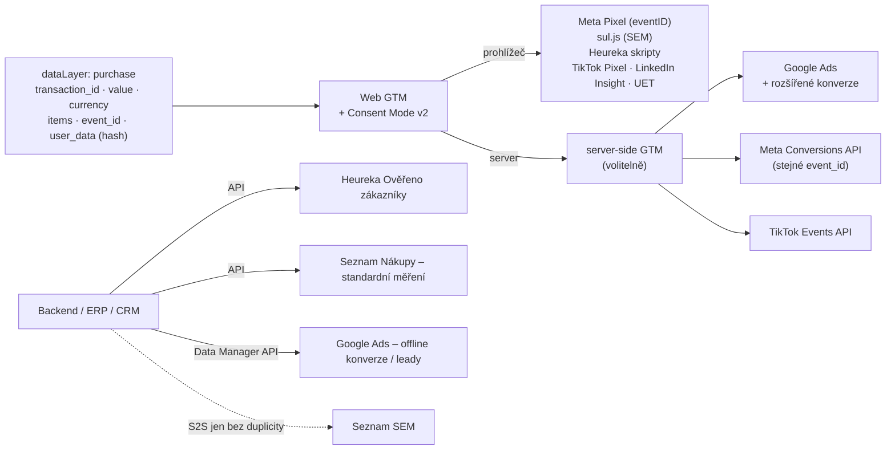

# LP 06: Měření konverzí (Google Ads, Meta, Sklik, Heureka…) – zadání obsahu
> Stav: návrh v1 (8. 10. 2026) · Priorita: A · URL: `/sluzby/mereni-konverzi` · Segmenty: e-shopy (primárně) · B2B / lead-gen · velké firmy

---

## 0. Shrnutí

**Účel stránky.** Prodat nastavení a sjednocení měření konverzí napříč reklamními systémy – Google Ads (vč. rozšířených konverzí), Meta Pixel + Conversions API, Sklik / Seznam Event Measurement, Seznam Nákupy (dříve Zboží.cz), Heureka (měření konverzí i Ověřeno zákazníky), TikTok, LinkedIn a Microsoft Ads – **z jedné datové vrstvy, se stejným ID a hodnotou objednávky a bez dvojího počítání**. Stránka zároveň poctivě vysvětlí, proč se čísla mezi systémy liší i po správném nastavení.

**Pro koho (persony):**
| Persona | Situace | Co hledá | Co ji přesvědčí |
|---|---|---|---|
| **E-commerce / PPC manažer e-shopu** | Meta, Google Ads, Sklik, Heureka a administrace ukazují pět různých čísel; Seznam tlačí na přechod na SEM | Někoho, kdo konverze nastaví jednou správně pro všechny systémy | Tabulka platforem, sjednocení hodnot, deduplikace, „proč se čísla liší“, mockup EMQ |
| **Marketingový manažer B2B** | Google Ads a LinkedIn optimalizují na odeslaný formulář, obchod říká, že leady jsou slabé | Konverze podle kvality leadu, napojení CRM | Rozšířené konverze pro leady, offline konverze (Data Manager API), LinkedIn CAPI |
| **Head of Performance velké firmy** | Více značek a zemí, agentury na různých kanálech, každý si měří po svém | Jednotná pravidla (co je konverze, jaká hodnota), dokumentace, vlastnictví účtů | Konverzní mapa, pravidla hodnot, odsouhlasení s backendem, přístupy přes role |

**Hlavní konverze:** formulář `form_id: lp-konverze`, telefon.
**Sekundární:** článek *Proč nesedí čísla* (`/blog/proc-nesedi-data`), *Meta Conversions API* (`/blog/meta-conversions-api`).

**Proč tahle stránka vyhraje nad konkurencí:**
1. **SERP „měření konverzí“ ovládají nápovědy** (Heureka, Sklik, Google) a obecné články (foxy, vceliste). Žádná česká služba nemá LP, která pokryje **Ads + Meta + Sklik + Heureka + Seznam Nákupy** dohromady.
2. **khoder.cz** (`/mereni-konverzi`, ~1 900 slov) je freelancer zaměřený na Shoptet; **NextAnalytica** a **DataNostro** prodávají SST/hosting a SEM jako produkt. My nabídneme vendor-neutrální nastavení s **pravidly hodnot, deduplikací a odsouhlasením s backendem**.
3. **Aktuální česká specifika ověřená ke 10/2026:** SEM v betě a jeho omezení (S2S deduplikace „v přípravě“), Seznam Nákupy místo Zboží.cz, Heureka nedoporučuje GTM, **hodnotící dotazníky v kontrolním plánu ÚOOÚ 2026** (Ověřeno zákazníky), Google Ads: rozšířené konverze (od dubna 2026 přijímá uživatelská data z tagu, Data Manageru i API současně, od června 2026 je pro web i leady jeden přepínač) a offline importy přes Data Manager API od 15. 6. 2026.
4. **Vizuální důkaz kvality** – mockup Meta Events Manageru s Event Match Quality (vzor nextanalytica.cz, ale s vysvětlením, co skóre znamená a jak ho zvednout v souladu se souhlasem).

---

## 1. SEO a meta

| Prvek | Návrh |
|---|---|
| **Title** (57 znaků) | `Měření konverzí: Ads, Meta, Sklik, Heureka \| datalayer.cz` |
| **Meta description** (150 znaků) | `Nastavíme měření konverzí pro Google Ads, Meta (Pixel + CAPI), Sklik, Heureku i TikTok z jedné datové vrstvy, bez dvojího počítání. Konzultace zdarma.` |
| **H1** (53 znaků) | `Měření konverzí pro Google Ads, Meta, Sklik i Heureku` |
| **URL** | `/sluzby/mereni-konverzi` |
| **Breadcrumbs** | Úvod › Služby › Měření konverzí |

### 1.1 Klíčová slova (Ahrefs CZ; součet LP 1 260)

| Typ | Klíčové slovo | Objem | Kde použít |
|---|---|---|---|
| **Hlavní** | měření konverzí | 150 | title, H1, rychlá odpověď, URL |
| Vedlejší | facebook pixel / meta pixel | 250 / 100 | H3 „Meta Pixel a Conversions API“, alt diagramu, FAQ 3 |
| Vedlejší | facebook pixel e-shop / shoptet facebook pixel | 60 / 40 | text H3 Meta, záložka E-shop |
| Vedlejší | heureka ověřeno zákazníky / … implementace | 90 / 10 | H3 „Heureka: měření konverzí a Ověřeno zákazníky“, FAQ 8 |
| Vedlejší | heureka měření konverzí woocommerce | 20 | text H3 Heureka („WooCommerce, Shoptet i vlastní e-shop“) |
| Vedlejší | google ads konverze / google ads conversion tracking | 30 / 10 | H3 „Google Ads“, tabulka platforem |
| Vedlejší | sklik konverze / sklik konverzní kód / seznam event measurement | 20 / 10 / 20 | H3 „Sklik a Seznam Event Measurement“, FAQ 7 |
| Vedlejší | conversion api / meta conversions api / facebook conversion api / fb conversion api | 20 / 10 / 10 / 10 | H3 Meta, FAQ 3–4 |
| Vedlejší | meta pixel helper / facebook pixel helper | 60 / 30 | sekce Testování (nástroje) |
| Vedlejší | enhanced conversions / enhanced conversions for leads | 10 / 10 | H3 Google Ads („rozšířené konverze“), FAQ 6 |
| Vedlejší | cookieless conversion tracking | 30 | FAQ 9 (bez slibu měření bez souhlasu) |
| Vedlejší | offline conversion tracking | 10 | záložka B2B, FAQ 10 |
| Otázky | Is Meta conversion API free? · Is conversion API worth it? · Can I run ads without Meta pixel? · What are enhanced conversions for leads? · jak nastavit měření konverzí | 0–10 | FAQ 3, 4, 6, 10 |

### 1.2 Co na stránku NEpatří
| Dotaz | Patří na | Na LP jen |
|---|---|---|
| co je facebook pixel, facebook pixel co to je, jak nastavit facebook pixel | slovník + článek B5 `/blog/meta-conversions-api` | 1 věta + odkaz |
| co je konverze, konverzní poměr, konverze význam | slovník `/slovnik/klicova-udalost` | – |
| proč se liší data ga4 a google ads (návod) | článek D2 `/blog/proc-nesedi-data` | souhrnná tabulka + odkaz |
| rozšířené konverze – návod | článek E2 `/blog/rozsirene-konverze` | H3 + odkaz |
| offline konverze z CRM – návod | článek E3 + `/reseni/b2b-a-lead-generation` | záložka B2B |
| seznam event measurement – návod | článek B6 `/blog/seznam-event-measurement-sklik` | H3 + odkaz |
| server-side tracking, hosting sGTM | LP 04 | odkaz z tabulky |
| cookie lišta, consent mode | LP 05 | odkaz z FAQ 9 |

### 1.3 Strukturovaná data (JSON-LD)
```json
{
  "@context": "https://schema.org",
  "@graph": [
    {
      "@type": "Service",
      "@id": "https://datalayer.cz/sluzby/mereni-konverzi#service",
      "name": "Měření konverzí pro Google Ads, Meta, Sklik a Heureku",
      "serviceType": "Nastavení a sjednocení měření konverzí v reklamních systémech",
      "description": "Nastavení konverzí pro Google Ads (včetně rozšířených konverzí), Meta Pixel a Conversions API, Seznam Event Measurement (Sklik, Seznam Nákupy), Heureku (měření konverzí, Ověřeno zákazníky), TikTok, LinkedIn a Microsoft Ads z jedné datové vrstvy. Sjednocení hodnot, deduplikace, testovací objednávky a odsouhlasení s backendem.",
      "url": "https://datalayer.cz/sluzby/mereni-konverzi",
      "provider": { "@type": "Organization", "@id": "https://datalayer.cz/#organization", "name": "datalayer.cz", "url": "https://datalayer.cz" },
      "areaServed": { "@type": "Country", "name": "Česká republika" },
      "availableLanguage": "cs",
      "hasOfferCatalog": {
        "@type": "OfferCatalog",
        "name": "Platformy",
        "itemListElement": [
          { "@type": "Offer", "itemOffered": { "@type": "Service", "name": "Konverze Google Ads a rozšířené konverze" } },
          { "@type": "Offer", "itemOffered": { "@type": "Service", "name": "Meta Pixel a Conversions API" } },
          { "@type": "Offer", "itemOffered": { "@type": "Service", "name": "Seznam Event Measurement (Sklik, Seznam Nákupy)" } },
          { "@type": "Offer", "itemOffered": { "@type": "Service", "name": "Heureka měření konverzí a Ověřeno zákazníky" } },
          { "@type": "Offer", "itemOffered": { "@type": "Service", "name": "TikTok, LinkedIn a Microsoft Ads" } }
        ]
      }
    },
    {
      "@type": "BreadcrumbList",
      "itemListElement": [
        { "@type": "ListItem", "position": 1, "name": "Úvod", "item": "https://datalayer.cz/" },
        { "@type": "ListItem", "position": 2, "name": "Služby", "item": "https://datalayer.cz/sluzby" },
        { "@type": "ListItem", "position": 3, "name": "Měření konverzí", "item": "https://datalayer.cz/sluzby/mereni-konverzi" }
      ]
    },
    {
      "@type": "FAQPage",
      "mainEntity": [
        { "@type": "Question", "name": "Proč se konverze v Google Ads, Meta a GA4 liší?", "acceptedAnswer": { "@type": "Answer", "text": "(text 1:1 z FAQ 2)" } }
        /* … všech 12 otázek generovat z CMS 1:1 s viditelným FAQ */
      ]
    }
  ]
}
```
*Pozn.:* `Offer` bez ceny je v pořádku (ceny se neuvádějí); pokud by validátor hlásil varování, `hasOfferCatalog` vynechat.

### 1.4 OG obrázek
Piktogram konverze (košík → jedna šipka → 3 tečky se stejným číslem `2 490 Kč`), H1, mono štítek `[ purchase · event_id · value · currency ]`.

---

## 2. Wireframe

```
┌───────────────────────────────────────────────────────────────────────┐
│ Breadcrumbs                                                           │
├──────────────────────────────────┬────────────────────────────────────┤
│ [ conversion ]                   │ VIZUÁL: 1 objednávka → 6 systémů,  │
│ H1 · podtitul · rychlá odpověď   │ všude „OBJ-10815 · 2 490 Kč“ + ✓   │
│ [ Zkontrolovat moje konverze ]   │ deduplikace                        │
│ [ Proč se čísla liší ]           │                                    │
├──────────────────────────────────┴────────────────────────────────────┤
│ TRUST BAR (4)                                                         │
├───────────────────────────────────────────────────────────────────────┤
│ SYMPTOMY (6 karet)                                                    │
├───────────────────────────────────────────────────────────────────────┤
│ DIAGRAM: jedna datová vrstva → prohlížeč / server / backend → systémy │
├───────────────────────────────────────────────────────────────────────┤
│ PLATFORMY: přehledová tabulka + 7 bloků H3 (Ads, Meta, Seznam SEM,    │
│ Seznam Nákupy, Heureka, TikTok/LinkedIn/Microsoft)                    │
├───────────────────────────────────────────────────────────────────────┤
│ MOCKUP Meta Events Manager + EMQ                                      │
├───────────────────────────────────────────────────────────────────────┤
│ SJEDNOCENÍ HODNOT A DEDUPLIKACE (2 tabulky)                           │
├───────────────────────────────────────────────────────────────────────┤
│ #proc-se-lisi PROČ SE ČÍSLA LIŠÍ (tabulka 9 důvodů + ukázka odsouhl.) │
├───────────────────────────────────────────────────────────────────────┤
│ JAK OVĚŘUJEME (testovací objednávka, nástroje)                        │
├───────────────────────────────────────────────────────────────────────┤
│ CO DOSTANETE · POSTUP A DÉLKA · PŘÍPADOVÁ STUDIE · PRO KOHO           │
├───────────────────────────────────────────────────────────────────────┤
│ FAQ (12) · DO HLOUBKY · NAVAZUJÍCÍ SLUŽBY · KONTAKT #kontakt          │
└───────────────────────────────────────────────────────────────────────┘
```
**Mobil:** hero vizuál zjednodušený na 3 systémy + „+3“; bloky platforem jako akordeon (výchozí otevřený Meta – nejvyšší objem hledání); mockup EMQ jako karta „Purchase“ s gaugem a rozbalitelným seznamem parametrů; tabulky jako karty; sticky lišta `Zavolat · Napsat`.

---

## 3. Obsah sekcí

### 3.1 Hero (`HeroService`)
- **Eyebrow:** `[ conversion ]`
- **H1:** Měření konverzí pro Google Ads, Meta, Sklik i Heureku
- **Podtitul:** Nastavíme konverze tak, aby každá objednávka nebo poptávka dorazila do všech reklamních systémů jednou, se stejným ID a hodnotou – a jen podle souhlasu návštěvníka. Ať reklamy optimalizují na čísla, která sedí s vaší administrací.
- **Rychlá odpověď** (55 slov):
  > Měření konverzí předává reklamním systémům informaci, že návštěvník z reklamy nakoupil nebo poslal poptávku. Stavíme ho z jedné datové vrstvy: v prohlížeči přes Google Tag Manager a tam, kde to platforma umožní, i přes server (Meta Conversions API, rozšířené konverze Google Ads, Seznam Event Measurement). Každá konverze má jedno ID, jednu hodnotu a započítá se jednou.
- **CTA1:** `[ Zkontrolovat moje konverze ]` → `#kontakt` · `cta_id: hero_konzultace`
- **CTA2:** `[ Proč se čísla liší ]` → `#proc-se-lisi` · `cta_id: hero_proc_lisi`
- **Mikrocopy:** „Úvodní konzultace zdarma. Účty a data zůstávají vaše – pracujeme přes role, ne přes vaše hesla.“

**Vizuál (animovaný SVG, navazuje na hero homepage):**
- Vlevo účtenka (piktogram `purchase`) s řádkem `OBJ-10815 · 2 490 Kč · CZK` a pod ní `event_id: 7f3c-…-a91`.
- Z účtenky **jedna** šipka do uzlu `dataLayer` → rozdělení do 6 uzlů: `Google Ads`, `Meta`, `Sklik`, `Seznam Nákupy`, `Heureka`, `TikTok`. Ve všech uzlech se postupně „vypíše“ stejný štítek `OBJ-10815 · 2 490 Kč` (mono, `#00ffff`).
- U `Meta` dva přívody (prohlížeč + server) slévající se do jednoho se štítkem `dedup ✓ 1×`.
- Animace 5 s, `prefers-reduced-motion`: statický stav.
- Alt: „Jedna objednávka OBJ-10815 v hodnotě 2 490 Kč se z datové vrstvy předá do Google Ads, Meta, Skliku, Seznam Nákupů, Heureky a TikToku se stejným ID a hodnotou; Meta dostane událost z prohlížeče i serveru a započítá ji jednou.“

---

### 3.2 Trust bar
1. `[DOPLNIT: N]` nastavených konverzních účtů / e-shopů
2. `7 platforem` – „Google Ads · Meta · Sklik · Seznam Nákupy · Heureka · TikTok · LinkedIn“ *(+ Microsoft Ads)*
3. `1 ID` – „Stejné ID objednávky a hodnota ve všech systémech“
4. `test order` – „Každé nastavení ověříme testovací objednávkou a odsouhlasením s backendem“

---

### 3.3 Symptomy (`SymptomCards`)
**H2:** Které z toho znáte?
| # | Karta | Text | Piktogram |
|---|---|---|---|
| 1 | Každý systém hlásí jiné číslo | Administrace 412 objednávek, GA4 371, Meta 388, Google Ads 398. Část rozdílu je přirozená, část je chyba – a nevíte, která je která. | Pět sloupců různé výšky s otazníkem |
| 2 | Nákup se počítá dvakrát | Pixel i Conversions API bez stejného `event_id`, znovunačtení děkovací stránky nebo GA4 import vedle konverzní značky Google Ads. Kampaně pak „vypadají“ lépe, než jsou. | Účtenka se štítkem `×2` |
| 3 | Hodnota nesedí | Jeden systém dostává cenu s DPH, druhý bez, třetí včetně dopravy. Návratnost reklamy se pak nedá porovnat. | Váhy s `s DPH` / `bez DPH` |
| 4 | Sklik měří jen část | Starý konverzní kód bez souhlasu, retargeting zvlášť, a Seznam mezitím spouští nové měření SEM. | Tečka Sklik s šipkou `rc.js → sul.js` |
| 5 | Heureka neposílá dotazníky, nebo je posílá bez možnosti odmítnutí | Ověřeno zákazníky volané z prohlížeče, chybějící ID produktů – nebo chybí možnost dotazník odmítnout. | Hvězdička hodnocení se zámkem |
| 6 | Google Ads optimalizuje na formuláře, ne na zakázky | V B2B se počítá každý odeslaný formulář. Obchod mezitím ví, které leady jsou dobré – reklama ne. | Formulář → trychtýř → otazník |

**CTA:** `[ Najít příčinu u mě ]` → `#kontakt` · `cta_id: symptoms_cta`.

---

### 3.4 Diagram: jedna datová vrstva → všechny systémy (`DataFlowDiagram`)
**H2:** Jedna objednávka, jeden zdroj, všechny systémy
**Úvod:** Základem je datová vrstva, kterou e-shop nebo web naplní při nákupu či odeslání formuláře. Z ní se konverze rozdělí třemi cestami: v prohlížeči (GTM), přes server (server-side GTM) a z backendu (API). Která cesta se pro kterou platformu hodí, záleží na tom, co platforma podporuje.


**Zadání pro designéra:** tři horizontální „dráhy“ odlišené popiskem vlevo (mono): `browser`, `server`, `backend`. Uzly platforem vpravo stejné velikosti, u každého malý štítek, kterou drahou data chodí (`B`, `S`, `API`). Klik na uzel otevře tooltip „co tam posíláme“ (1 věta) → `diagram_interaction` (`diagram_id: conversions_flow`, `node: ads|meta|sem|nakupy|heureka|tiktok|linkedin|microsoft`). Mobil: svisle, dráhy jako nadpisy skupin. Pod diagramem odkaz „Kdy dává smysl server-side → [Server-side tracking](/sluzby/server-side-tracking)“.

---

### 3.5 Platformy (`ComparisonTable` + bloky H3)
**H2:** Co nastavíme v jednotlivých systémech

**Přehledová tabulka (kompletní):**
| Platforma | Prohlížeč | Server / API | Deduplikace | Souhlas | Česká specifika / pozor |
|---|---|---|---|---|---|
| **Google Ads** | Konverzní značka přes Google tag v GTM | sGTM; offline konverze a leady přes Data Manager API | `transaction_id` | Consent Mode v2 (`ad_storage`, `ad_user_data`) | Rozšířené konverze: od 4/2026 data z tagu, Data Manageru i API současně, od 6/2026 jeden přepínač pro web i leady |
| **Meta** | Meta Pixel (`eventID`) | Conversions API (sGTM nebo backend) | `event_name` + `event_id`, 48 h | Marketingový souhlas; ne-Google tag → podmínka v GTM | Event Match Quality 0–10 |
| **Sklik (SEM)** | `sul.js` (povinný) | S2S na `sem.seznam.cz` | Plná deduplikace „v přípravě“ – neposílat stejnou událost z webu i serveru | IAB TCF nebo formát Google Consent Mode; `sid`/`udid` až po `ad_storage` | Beta, přepnutí účtu nevratné, sandbox |
| **Seznam Nákupy** (dříve Zboží.cz) | Frontendový kód na děkovací stránce | Backendový kód s tajným klíčem (standardní měření) | – | Podmínky měření + zpracovatelská smlouva | Standardní měření doporučuje Seznam (blokátory); SEM ho sjednocuje |
| **Heureka – měření konverzí** | 2 skripty: detail produktu + děkovací stránka | – | `set_order_id` | Skript si podle Heureky hlídá souhlas sám (ověřujeme) | Heureka nedoporučuje vkládat přes GTM; atribuce 30 dní po prokliku |
| **Heureka – Ověřeno zákazníky** | – | Volání z backendu (e-mail, ID objednávky, ID produktů) s tajným klíčem | – | Dotazník = obchodní sdělení → možnost odmítnout | Klíč jen na serveru; ID produktů z XML feedu |
| **TikTok** | TikTok Pixel | Events API | event + `event_id`, 48 h | Marketingový souhlas | – |
| **LinkedIn** | Insight Tag | Conversions API | `eventId` (při shodě se počítá Insight Tag) | Marketingový souhlas | Vlastní konverzní pravidlo pro každý zdroj |
| **Microsoft Ads** | UET tag | *[OVĚŘIT dostupnost serverového API]* | – | Od 5. 5. 2025 v EHP, UK a CH povinné signály souhlasu (`ad_storage`) | – |

**Bloky H3 (text na stránce, každý 70–110 slov + 3–5 odrážek „co nastavíme“):**

#### Google Ads: konverze a rozšířené konverze
Pro nákupy nastavujeme konverzní akci přímo přes Google tag v GTM s ID objednávky, hodnotou a měnou. Rozšířené konverze doplní hashovaný e-mail nebo telefon zákazníka (SHA-256, po normalizaci), aby Google dokázal přiřadit víc konverzí – jen se souhlasem `ad_user_data`. Od dubna 2026 Google Ads přijímá uživatelská data z tagu, Data Manageru i API současně, od června 2026 je pro web i leady jeden přepínač. Hlídáme, aby se nákup nepočítal dvakrát (konverzní značka vedle importu z GA4 jako primární akce).
- konverzní akce, primární vs. sekundární, hodnoty a `transaction_id`
- rozšířené konverze z datové vrstvy (`user_data`)
- propojovač konverzí, Consent Mode v2
- pro B2B: konverze z CRM přes Data Manager API (od 15. 6. 2026 nahrazuje nahrávání přes Google Ads API)

#### Meta Pixel a Conversions API
Meta Pixel v prohlížeči doplníme o Conversions API ze serveru – Meta sama doporučuje oba zdroje souběžně. Aby se nákup nepočítal dvakrát, posílají oba stejný název události a stejné `event_id`; Meta pak duplicitu přijatou do 48 hodin zahodí. Kvalitu párování ukazuje Event Match Quality: čím víc kvalitních parametrů zákazníka (hashovaný e-mail a telefon, `external_id`, `fbp`, `fbc`, IP, user agent), tím víc konverzí Meta přiřadí ke kampaním. Pixel pro e-shop (Shoptet, WooCommerce, Upgates, vlastní řešení) i pro poptávky.
- standardní události `ViewContent` → `Purchase` / `Lead` s hodnotou a `content_ids`
- Conversions API přes server-side GTM nebo z backendu
- deduplikace, test v nástroji Test Events a v Meta Pixel Helperu
- podmínění marketingovým souhlasem

#### Sklik a Seznam Event Measurement (SEM)
Seznam přechází na Seznam Event Measurement: jeden skript `sul.js` nahrazuje retargetingový a konverzní kód Skliku i měření pro Seznam Nákupy a podporuje víc typů událostí. SEM je zatím v betě, přepnutí účtu je nevratné a Seznam ukončí podporu původních kódů v průběhu roku 2027; přesný termín oznámí s předstihem. Nasazujeme ho nejdřív souběžně se starým měřením, otestujeme v sandboxu a teprve pak přepínáme. Server-to-server (S2S) je doplněk, ne náhrada: `sul.js` musí běžet v prohlížeči a stejnou událost zatím neposíláme z webu i serveru, protože deduplikace je podle Seznamu teprve v přípravě.
- SEM ID, události a parametry podle reference Seznamu
- souhlas přes IAB TCF nebo `SEM('updateConsent')`
- souběžný běh, sandbox, diagnostika měření
- S2S jen pro události mimo web (offline konverze, aplikace)

#### Seznam Nákupy (dříve Zboží.cz)
Pro srovnávač Seznamu doporučujeme standardní měření – frontendový kód na děkovací stránce plus backendový kód s tajným klíčem z Centra prodejce. Omezené měření jen v prohlížeči je citlivější na blokátory a neumožní hodnocení od ověřených zákazníků ani API. S nástupem SEM se měření sjednocuje; postup volíme podle stavu vašeho účtu a platformy.

#### Heureka: měření konverzí a Ověřeno zákazníky
**Měření konverzí** má dnes dva skripty – na detailu produktu (uloží informaci o příchodu z Heureky) a na děkovací stránce (ID objednávky, produkty s cenou za kus včetně DPH, celková hodnota, měna). Heureka počítá konverze do 30 dní po prokliku a vložení přes GTM nedoporučuje kvůli blokátorům – proto skripty nasazujeme přímo do šablony nebo přes modul platformy (Shoptet, WooCommerce, Upgates). **Ověřeno zákazníky** voláme z backendu: e-mail zákazníka, ID objednávky a ID produktů z XML feedu, s tajným klíčem, který nesmí být v prohlížeči. ÚOOÚ považuje hodnotící dotazníky za obchodní sdělení a má je v kontrolním plánu na rok 2026 – zákazník musí mít možnost zaslání předem odmítnout (typicky zaškrtávátko v objednávce) a odmítnout ho i v samotném dotazníku. *Nejde o právní radu – nastavení textů konzultujte s právníkem.*

#### TikTok, LinkedIn a Microsoft Ads
**TikTok:** Pixel + Events API, deduplikace stejnou událostí a `event_id` (48 h). **LinkedIn** (hlavně B2B): Insight Tag + Conversions API se společným `eventId`; pro každý zdroj vlastní konverzní pravidlo, při shodě LinkedIn započítá událost z Insight Tagu. **Microsoft Ads:** UET tag s Consent Mode – Microsoft od 5. 5. 2025 vyžaduje pro návštěvy z EHP, UK a Švýcarska signály souhlasu.

**Vizuál bloků:** akordeon nebo „karty se záložkami“; v záhlaví každého bloku mono štítek platformy (bez log). Měření: `diagram_interaction` (`diagram_id: platforms`, `node: ads|meta|sem|nakupy|heureka|other`) při otevření bloku.

---

### 3.6 Mockup Meta Events Manageru s Event Match Quality (`MockupUI`) – povinný
**H2:** Jak vypadá dobře nastavená Meta: prohlížeč + server, deduplikace, kvalita shody
**Úvod:** Tohle je typický stav po nasazení Conversions API, který kontrolujeme při předání. *(Ilustrační ukázka rozhraní – fiktivní data.)*

**Zadání pro designéra – stylizovaný výřez (HTML/SVG, ne screenshot, bez loga Meta):**
- **Hlavička karty:** `Datový zdroj: vas-eshop.cz` · přepínač období `Posledních 7 dní` · štítek `Prohlížeč + Server`.
- **Tabulka událostí:**

| Událost | Integrace | Přijato (7 dní) | Deduplikace | Kvalita shody událostí | Poslední přijatá |
|---|---|---|---|---|---|
| Purchase | Prohlížeč · Server | 2 846 | ✓ shodné `event_id` | **8,4 / 10** | před 4 min |
| InitiateCheckout | Prohlížeč · Server | 4 330 | ✓ | **7,2 / 10** | před 2 min |
| AddToCart | Prohlížeč · Server | 9 120 | ✓ | **6,9 / 10** | před 1 min |
| ViewContent | Prohlížeč | 61 450 | – | **5,1 / 10** | před 1 min |

- **Detailní panel vpravo (po kliknutí na Purchase):** kruhový ukazatel `8,4 / 10` (oblouk `#00ffff`), pod ním „Podíl událostí s parametrem zákazníka“ – vodorovné pruhy:
  `E-mail (hash) 94 %` · `External ID 94 %` · `IP adresa 100 %` · `User agent 100 %` · `fbp 89 %` · `Telefon (hash) 71 %` · `fbc 31 %`
  a box „Doporučení“: „Doplňte telefon do datové vrstvy na děkovací stránce (pouze se souhlasem).“
- **Spodní řádek:** `Deduplikováno: 2 761 z 2 846 serverových událostí (97 %)` + vysvětlivka mono `event_id: obj-10815-purchase`.
- Barvy: pozadí `#0b1a30`, text `#e6edf3`, zvýraznění `#00ffff`, ne-aktivní `#8b98a5`. Popisek pod mockupem: „Ilustrační ukázka, fiktivní data. Skutečné rozhraní Meta vypadá jinak a mění se.“
- Mobil: jen karta Purchase s ukazatelem a rozbalitelným seznamem parametrů; tabulka událostí jako seznam.
- Interakce: klik na řádek přepne detail (`diagram_interaction`, `diagram_id: emq_mockup`, `node: purchase|checkout|cart|view`).

**Text pod mockupem (3 odstavce):**
- **Co je Event Match Quality:** skóre 0–10, které Meta přiřazuje serverovým událostem z webu a které říká, jak dobře se podle zaslaných údajů dají spárovat s účty na Facebooku a Instagramu. Vyšší skóre obvykle znamená víc přiřazených konverzí a lepší optimalizaci.
- **Jak ho zvedáme:** posíláme víc kvalitních parametrů – hashovaný e-mail a telefon, `external_id`, aktuální `fbp` a `fbc`, IP adresu a user agent – a události posíláme hned, ne dávkově po hodinách.
- **Kde je hranice:** parametry posíláme jen u návštěvníků s marketingovým souhlasem a nikdy v čitelné podobě. Konkrétní „cílové“ skóre neslibujeme – záleží na tom, jaká data o zákaznících na webu máte (host vs. přihlášený zákazník).

---

### 3.7 Sjednocení hodnot a deduplikace (`ComparisonTable` ×2)
**H2:** Stejné ID, stejná hodnota, započítáno jednou
**Úvod:** Než napíšeme první tag, dohodneme se s vámi na pravidlech: co je konverze, jaká je její hodnota a podle čeho se pozná duplicita. Pravidla zapíšeme do konverzní mapy, aby platila i pro agentury a budoucí dodavatele.

**Tabulka A – jedna objednávka, stejná data všude** (ukázka mapování; konkrétní názvy parametrů podle dokumentace platforem):
| Údaj | Datová vrstva (GA4 e-commerce) | Google Ads | Meta | Heureka | Pravidlo, které s vámi dohodneme |
|---|---|---|---|---|---|
| ID objednávky | `transaction_id` | `transaction_id` | v `custom_data` + součást `event_id` | `set_order_id` | Jedno ID z backendu, nikdy generované v prohlížeči |
| Hodnota | `value` | `value` | `value` | `set_total_vat` | Např. bez DPH a bez dopravy pro reklamní systémy; Heureka podle nastavení ve statistikách |
| Měna | `currency` | `currency` | `currency` | měna (ISO 4217) | `CZK` / `EUR` podle trhu |
| Produkty | `items[].item_id` | (pro nákupní kampaně) | `content_ids` | ID produktu, cena za kus vč. DPH | ID shodná s produktovými feedy |
| Identita (hash) | `user_data` (SHA-256) | rozšířené konverze | `em`, `ph`, `external_id` | – (Ověřeno zákazníky jde z backendu) | Jen se souhlasem, normalizace před hashem |
| Deduplikační klíč | `event_id` | `transaction_id` | `event_id` | `set_order_id` | Stejné pro prohlížeč i server |

**Tabulka B – jak deduplikují jednotlivé systémy:**
| Systém | Mechanismus | Okno | Co testujeme |
|---|---|---|---|
| Meta | shodný `event_name` + `event_id` (alternativně `fbp` / `external_id`) | 48 h | Podíl deduplikovaných událostí v Events Manageru |
| TikTok | shodný event + `event_id` | 48 h | Test events |
| LinkedIn | shodné `eventId` | neuvedeno | Insight Tag má vyšší počet, CAPI se odečte |
| Google Ads | `transaction_id` u konverzní akce | – | Znovunačtení děkovací stránky = 1 konverze |
| Seznam SEM | deduplikace „v přípravě“ | – | Stejná událost jen jednou cestou |
| Heureka | ID objednávky | – | Opakované zobrazení děkovací stránky |

**Vizuál:** dvě tabulky; v tabulce A mono buňky s parametry v `#00ffff`. Mobil: karty po řádcích.

---

### 3.8 Proč se čísla liší (`ComparisonTable`) – kotva `#proc-se-lisi`
**H2:** Proč se čísla mezi systémy liší – i když je vše nastavené správně
**Úvod:** Cílem není, aby všechny systémy ukazovaly stejné číslo. Každý počítá jinak. Cílem je, aby rozdíly byly **vysvětlitelné a stabilní** – a aby náhlá změna rozdílu spustila kontrolu.

| # | Důvod | Příklad | Co s tím uděláme |
|---|---|---|---|
| 1 | **Atribuce** – každý systém si připisuje konverze, na kterých se podílel | Zákazník klikne na reklamu v Meta i v Google Ads → obě si nákup započítají; Heureka počítá konverze do 30 dní po prokliku; Meta má výchozí okno typicky 7 dní po kliknutí a 1 den po zobrazení | Reportujeme vedle sebe „co si systém připisuje“ a „co ukazuje GA4 / backend“ |
| 2 | **Datum připsání** | Standardní sloupec Konverze v Google Ads připisuje konverzi ke dni prokliku, GA4 ke dni nákupu | Pro srovnání používáme sloupce „podle času konverze“ |
| 3 | **Souhlas a modelování** | Google Ads může ve sloupci Konverze ukazovat i modelované konverze; Meta a Sklik vidí jen souhlasící | Sledujeme podíl souhlasů a modelovaných konverzí zvlášť |
| 4 | **Duplicity** | Pixel + CAPI bez `event_id`, GA4 import i konverzní značka jako primární akce, znovunačtení děkovací stránky | Deduplikace dle tabulky výše |
| 5 | **Hodnota** | S DPH vs. bez DPH, doprava, slevové kódy, měna | Jedno pravidlo hodnoty v konverzní mapě |
| 6 | **Storna a vratky** | Backend storno odečte, reklamní systém ne | Storna posíláme jako úpravy tam, kde to platforma umí; v reportu odlišujeme |
| 7 | **Prohlížeč a platby** | Návrat z platební brány neproběhne, Safari zkracuje platnost cookies z JavaScriptu na 7 dní (24 h po prokliku z odkazu s identifikátorem prokliku), blokátory | Serverové události z backendu (se stavem souhlasu), first-party nastavení |
| 8 | **Časová pásma a filtry** | Účty v různých časových pásmech, testovací a interní objednávky | Sjednotit pásmo, testovací objednávky označit a vyřadit |
| 9 | **Více zařízení** | Reklamní systémy párují přihlášené uživatele napříč zařízeními, GA4 bez User-ID ne | Vysvětlujeme v reportu; v GA4 případně User-ID |

**Ukázka odsouhlasení (`MockupUI`, fiktivní data, štítek „ukázkový příklad“)** – tabulka, kterou dostanete 14 dní po spuštění:
| Systém | Objednávky (1.–14. 10.) | Rozdíl vůči backendu | Vysvětlení | Stav |
|---|---|---|---|---|
| Backend e-shopu | 412 | – | zdroj pravdy (bez storen) | – |
| GA4 | 371 | −9,9 % | souhlas, blokátory; stabilní | ✓ |
| Google Ads (podle času konverze) | 398 | — | vlastní atribuce + modelované | ✓ |
| Meta | 388 | — | vlastní atribuce (7d klik / 1d zobrazení) | ✓ |
| Sklik (SEM) | 96 | — | jen konverze přiřazené Skliku | ✓ |
| Heureka | 41 | — | prokliky z Heureky do 30 dní | ✓ |

*Pozn. pro designéra/autora:* u reklamních systémů nepočítat „rozdíl“ – nejsou srovnatelné s backendem 1:1; to je hlavní sdělení tabulky. Popisek: „Ukázkový příklad, fiktivní čísla.“
**Odkaz:** [Proč nesedí čísla: GA4 vs. Google Ads vs. Meta vs. administrace e-shopu](/blog/proc-nesedi-data) · `cta_id: article_d2`.
**Fakt k ověření:** výchozí atribuční okno Meta (7 dní klik / 1 den zobrazení) – ověřeno jen v sekundárním zdroji, před publikací ověřit v nápovědě Meta.

---

### 3.9 Jak ověřujeme (`ProcessTimeline` / checklist)
**H2:** Jak poznáte, že konverze měří správně
**Úvod:** Každé nastavení ověřujeme testovacími objednávkami (nebo poptávkami) a pak dva týdny porovnáváme s backendem.
- **Testovací objednávka** v produkci (označená a pak vyřazená) – sledujeme ji od datové vrstvy po každý systém.
- **Nástroje:** GTM Preview, Tag Assistant, GA4 DebugView, Test Events v Meta Events Manageru a Meta Pixel Helper, diagnostika a sandbox SEM, statistiky měření konverzí Heureky, TikTok Pixel Helper.
- **Kontrolní body:** stejné ID a hodnota všude · jedna konverze po znovunačtení děkovací stránky · deduplikace Meta/TikTok · chování při odmítnutí souhlasu · rozšířené konverze diagnostikované v Google Ads.
- **Odsouhlasení po 14 dnech** – tabulka podle ukázky výše s vysvětlením rozdílů.
**Vizuál:** checklist s ✓ v `#00ffff`; vedle mini-mockup „testovací objednávka TEST-0001“ procházející 6 systémy se stavem `received`.

---

### 3.10 Co dostanete (`Deliverables`)
**H2:** Co od nás dostanete
| # | Výstup | Popis | Štítek |
|---|---|---|---|
| 1 | Konverzní mapa | Které akce jsou konverze, primární/sekundární, hodnoty, ID, okna – pro každý systém | `conversion-map` |
| 2 | Zadání datové vrstvy | Pokud chybí nebo je neúplná – specifikace pro vývojáře (`purchase`, `generate_lead`, `user_data`) | `dataLayer.md` |
| 3 | Nastavený GTM | Tagy, spouštěče, podmínky souhlasu, verze s popisem | `gtm-web` |
| 4 | Serverová část (volitelně) | Conversions API, rozšířené konverze, Events API přes server-side GTM | `gtm-server` |
| 5 | Backendové napojení | Zadání pro vývojáře: Ověřeno zákazníky, Seznam Nákupy, offline konverze (Data Manager API) | `api-spec` |
| 6 | Testovací protokol | Testovací objednávky, výsledky po systémech, deduplikace, souhlas | `test-report` |
| 7 | Odsouhlasení po 14 dnech | Tabulka backend × systémy s vysvětlením rozdílů | `reconciliation` |
| 8 | Přehled přístupů | Kdo má jakou roli v jakém účtu; nic na našich osobních účtech | `access-list` |
| 9 | Předání | Krátké zaškolení pro marketing a agentury, jak konverze číst | `handover` |

---

### 3.11 Postup a délka (`ProcessTimeline`) *[OVĚŘIT délky s klientem]*
| Krok | Co děláme | Délka | Co potřebujeme od vás |
|---|---|---|---|
| 1. Audit konverzí | Projdeme účty, GTM, datovou vrstvu, souhlas; najdeme duplicity a chyby | 2–4 pracovní dny | Přístupy (čtení) do Ads, Meta Business, Skliku, Heureky, GTM, GA4 |
| 2. Konverzní mapa | Dohodneme pravidla (co, hodnota, ID, okna) | 1–2 schůzky | Rozhodnutí marketingu / obchodu |
| 3. Datová vrstva | Zadání pro vývojáře nebo úprava na platformě | podle vývojáře | Vývojář / přístup do administrace |
| 4. Nastavení | GTM, Conversions API, rozšířené konverze, SEM, Heureka, ostatní | 3–10 pracovních dní | Přístupy (úpravy), tokeny API |
| 5. Test a souběžný běh | Testovací objednávky, 14 dní srovnání | 2 týdny | Export objednávek / leadů |
| 6. Předání | Dokumentace, zaškolení, vypnutí starých kódů | 1 den | Účast agentur / marketingu |

---

### 3.12 Případová studie (`MiniCase`)
**H2:** Z praxe: [DOPLNIT]
```
Klient:    [DOPLNIT]
Problém:   [DOPLNIT: např. Meta hlásila o X % více nákupů než backend (duplicity) / o X % méně]
Příčina:   [DOPLNIT: např. chybějící event_id, GA4 import jako primární akce]
Oprava:    [DOPLNIT]
Výsledek:  [DOPLNIT: rozdíl vůči backendu před/po, EMQ před/po, období]
```
Bez reálných dat nezobrazovat.

---

### 3.13 Pro koho (`SegmentTabs`)
| Záložka | Text |
|---|---|
| **E-shop** | Nákupy do Google Ads, Meta, Skliku, Seznam Nákupů, Heureky a TikToku se stejným ID objednávky a hodnotou. Řešíme přechod na Seznam Event Measurement, Ověřeno zákazníky z backendu i Conversions API. Pracujeme se Shoptetem, Upgates, WooCommerce, Shopify i vlastními e-shopy – u platforem ověříme, co jejich vestavěné napojení skutečně posílá. |
| **B2B / lead-gen** | Odeslaný formulář je jen začátek. Lead posíláme s hashovaným e-mailem (rozšířené konverze pro leady, Meta, LinkedIn) a později z CRM informaci, že z něj je kvalifikovaný lead nebo zakázka – do Google Ads přes Data Manager API, do Meta a LinkedIn přes Conversions API. Navazuje na [měření pro B2B a lead generation](/reseni/b2b-a-lead-generation). |
| **Velká firma** | Jedna konverzní mapa pro všechny značky, země a agentury: stejné definice, hodnoty a ID. Přístupy přes role ve vašich účtech, dokumentace pro interní audit a odsouhlasení s ERP. Pro více domén a vysoké objemy doporučujeme serverovou část ve vašem Google Cloudu. |

---

### 3.14 FAQ
**H2:** Časté otázky k měření konverzí

**1. Co všechno se dá jako konverze měřit?**
Konverze je akce, kterou chcete z reklamy získat: nákup, odeslaná poptávka, registrace, telefonát, rezervace, stažení ceníku. Pro e-shop je hlavní nákup s hodnotou, pro B2B poptávka – a ideálně i to, co se z ní stalo v CRM. Doplňkové akce (přidání do košíku, zahájení pokladny) měříme jako mikro-konverze pro optimalizaci a remarketing. V GA4 se konverze nově jmenují klíčové události. Na začátku vždy určíme, které akce jsou pro jednotlivé systémy primární.

**2. Proč se konverze v Google Ads, Meta a GA4 liší?**
Protože každý systém počítá jinak. Google Ads i Meta si připisují konverze, na kterých se jejich reklama podílela, takže součet za kanály je vyšší než počet objednávek. Google Ads navíc standardně připisuje konverzi ke dni prokliku a může zahrnovat modelované konverze. GA4 přiřazuje konverzi jednomu zdroji. K tomu přistupují souhlas, blokátory, storna a rozdíly v DPH. Cílem je vysvětlitelný a stabilní rozdíl – a ten vám doložíme v odsouhlasení.

**3. Potřebuju Meta Pixel, když mám Conversions API?**
Meta doporučuje používat oba zdroje souběžně: pixel zachytí události v prohlížeči, Conversions API je doplní ze serveru – i tam, kde prohlížeč selže. Aby se nákup nepočítal dvakrát, posílají oba stejný název události a stejné `event_id`. Samotné Conversions API bez pixelu je možné (např. pro offline konverze), ale pro běžný e-shop doporučujeme kombinaci.

**4. Je Meta Conversions API zdarma?**
Meta za používání Conversions API neúčtuje poplatek. Náklady jsou na straně implementace a provozu: buď server-side GTM (hosting serveru v Google Cloudu nebo u spravovaného poskytovatele), nebo napojení z backendu e-shopu. Některé platformy nabízejí vestavěnou integraci – ověříme, co skutečně posílá (parametry zákazníka, `event_id`), protože od toho se odvíjí kvalita párování.

**5. Co je Event Match Quality a jakou hodnotu chceme?**
Event Match Quality je skóre 0–10 v Meta Events Manageru. Říká, jak dobře se dají serverové události z webu podle zaslaných údajů spárovat s uživateli Facebooku a Instagramu. Zvedá ho hashovaný e-mail a telefon, `external_id`, `fbp`, `fbc`, IP adresa a user agent – u návštěvníků se souhlasem. Konkrétní cílové číslo neslibujeme; záleží na tom, kolik údajů o zákaznících máte. Sledujeme hlavně, aby u nákupu nekleslo a rostlo po každé úpravě.

**6. Co jsou rozšířené konverze Google Ads a potřebuju je?**
Rozšířené konverze doplní ke konverzi hashovaný e-mail nebo telefon zákazníka (SHA-256), aby Google dokázal přiřadit konverze i tam, kde chybí cookies. Pro e-shopy i B2B weby je doporučujeme – od dubna 2026 Google Ads přijímá uživatelská data z tagu, Data Manageru i API současně a od června 2026 je pro web i leady jeden přepínač. Podmínkou je souhlas s `ad_user_data` a správná normalizace údajů před hashováním. U leadů navazuje nahrání konverzí z CRM, které Google od 15. 6. 2026 přijímá přes Data Manager API.

**7. Co je Seznam Event Measurement a musím přejít?**
Seznam Event Measurement (SEM) je nové měření Seznamu: jeden skript `sul.js` nahrazuje retargetingový a konverzní kód Skliku i měření pro Seznam Nákupy. Seznam uvádí, že přechod budou potřebovat všechny účty a podporu původních kódů ukončí v průběhu roku 2027; přesný termín oznámí s předstihem. SEM je zatím v betě a přepnutí účtu je nevratné, proto ho nasazujeme souběžně, testujeme v sandboxu a přepínáme až po ověření. *(stav k 10/2026)*

**8. Jak správně nasadit Heureka Ověřeno zákazníky?**
Ověřeno zákazníky voláme z backendu po dokončení objednávky: e-mail zákazníka, ID objednávky a ID produktů z XML feedu, s tajným klíčem, který nesmí být v kódu stránky. Měření konverzí Heureky je samostatná služba se dvěma skripty v šabloně. Pozor na souhlas: ÚOOÚ považuje hodnotící dotazníky za obchodní sdělení a v roce 2026 je kontroluje – zákazník musí mít možnost zaslání předem odmítnout a odmítnout ho i v dotazníku. Texty doporučujeme konzultovat s právníkem.

**9. Dá se měřit konverze bez souhlasu („cookieless“)?**
Ne v tom smyslu, že bychom souhlas obešli. Bez souhlasu se nesmí ukládat ani číst netechnické údaje v zařízení návštěvníka. Google v advanced režimu Consent Mode dostává pingy bez cookies a část konverzí modeluje – ty se pak objeví ve sloupci Konverze. Ostatní systémy nesouhlasícího návštěvníka nevidí. Naše práce je, aby u souhlasících návštěvníků konverze dorazily úplně a správně. Víc v LP [Cookie lišta a Consent Mode v2](/sluzby/cookie-lista-consent-mode).

**10. Měříte i poptávky a konverze z CRM (B2B)?**
Ano. Formulář posílá do datové vrstvy událost `generate_lead` s ID leadu a hashovaným e-mailem; z toho vznikají konverze v Google Ads (rozšířené konverze pro leady), Meta a LinkedIn. Když obchod v CRM lead kvalifikuje nebo uzavře, pošleme tuto informaci zpět jako offline konverzi – do Google Ads přes Data Manager API, do Meta a LinkedIn přes Conversions API. Reklama se pak učí na kvalitních poptávkách, ne na počtu formulářů.

**11. Komu patří účty a jaké přístupy potřebujete?**
Všechny účty (Google Ads, Meta Business, Sklik, Heureka, GTM) zůstávají vaše. Potřebujeme role s oprávněním k úpravám konverzí a značek – nikdy vaše hesla. Nic nezakládáme na našich osobních účtech; pokud je potřeba nový token nebo datový zdroj, vznikne ve vašem účtu. Seznam přístupů dostanete při předání, abyste je mohli kdykoli odebrat.

**12. Z čeho se skládá cena a jak dlouho to trvá?**
Cena se odvíjí od počtu systémů (Ads, Meta, Sklik, Heureka, TikTok, LinkedIn), stavu datové vrstvy, platformy e-shopu, toho, zda zapojujeme server-side GTM nebo backend a CRM, a od počtu domén a zemí. Typické nastavení trvá 1–3 týdny plus 14 dní souběžného běhu a odsouhlasení. Provoz serveru (pokud ho využijete) platíte přímo poskytovateli. *[OVĚŘIT délky]*

**Měření:** `faq_open`; CTA `[ Mám jinou otázku ]` → `#kontakt` · `cta_id: faq_cta`.

---

### 3.15 Do hloubky (`RelatedArticles`)
1. [Meta Conversions API: nastavení, deduplikace event_id a Event Match Quality](/blog/meta-conversions-api) – `article_b5`
2. [Seznam Event Measurement: konverze Skliku po novu](/blog/seznam-event-measurement-sklik) – `article_b6`
3. [Rozšířené konverze (enhanced conversions) pro web i leady](/blog/rozsirene-konverze) – `article_e2`
4. [Offline konverze z CRM do Google Ads a Meta](/blog/offline-konverze-z-crm) – `article_e3`
5. [Proč nesedí čísla: GA4 vs. Google Ads vs. Meta vs. administrace e-shopu](/blog/proc-nesedi-data) – `article_d2`

### 3.16 Navazující služby (`RelatedServices`)
1. **Server-side tracking** – *Conversions API a rozšířené konverze přes váš server* → `/sluzby/server-side-tracking` (`related_sst`)
2. **Cookie lišta a Consent Mode v2** – *aby konverze dorazily od všech, kdo souhlasí* → `/sluzby/cookie-lista-consent-mode` (`related_consent`)
3. **Datová vrstva** – *zadání pro vývojáře, ze kterého konverze vznikají* → `/sluzby/datova-vrstva` (`related_datalayer`)

---

## 4. Kontaktní blok

| Prvek | Obsah |
|---|---|
| `form_id` | `lp-konverze` |
| Předvybraná témata | `konverze` |
| **H2** (návrh) | **Ať reklamní systémy vidí stejné konverze jako vy** |
| Lead | „Napište nám, zavolejte, nebo vyplňte formulář. Na úvodní konzultaci projdeme, jak se vaše objednávky nebo poptávky dostávají do Google Ads, Meta, Skliku a Heureky, a řekneme, kde se počítají dvakrát nebo vůbec. Nezávazně a zdarma.“ |
| Placeholder | „Např. Sklik a Heureka ukazují jiné konverze než GA4 a Meta hlásí víc nákupů, než jich máme v administraci…“ |

> **Pozn.:** tabulka 3.5 ve specifikaci formulářů má H2 „Ať reklamní systémy vidí všechny konverze“ – „všechny“ nelze slíbit (souhlas). Navrhuji text výše → **aktualizovat tabulku 3.5**; placeholder rozšířen o duplicitní nákupy.

---

## 5. Interní odkazy

**Odchozí – LP:** `/sluzby/server-side-tracking` (diagram, navazující služby, záložka Velká firma), `/sluzby/cookie-lista-consent-mode` (FAQ 9, navazující), `/sluzby/datova-vrstva` (navazující, výstup 2), `/reseni/b2b-a-lead-generation` (záložka B2B), `/reseni/e-shopy` (záložka E-shop – doplnit odkaz „Více o [měření pro e-shopy](/reseni/e-shopy)“), `/sluzby/audit-mereni` (krok 1 – anchor „audit konverzí“).
**Odchozí – články:** B5, B6, E2, E3, D2 (+ kontextově: B5 v H3 Meta, B6 v H3 SEM, E2 v H3 Google Ads, D2 v sekci „Proč se liší“).
**Odchozí – slovník:** `/slovnik/conversions-api`, `/slovnik/event-match-quality`, `/slovnik/deduplikace`, `/slovnik/rozsirene-konverze`, `/slovnik/offline-konverze`, `/slovnik/seznam-event-measurement`, `/slovnik/klicova-udalost`.

**Příchozí:**
| Zdroj | Anchor |
|---|---|
| Homepage, `/sluzby`, mega-menu | Měření konverzí – Ads, Meta, Sklik i Heureka vidí totéž |
| `/reseni/e-shopy` | měření konverzí pro Google Ads, Meta, Sklik a Heureku |
| `/reseni/b2b-a-lead-generation` | konverze z formulářů a CRM |
| `/sluzby/server-side-tracking` | měření konverzí |
| `/sluzby/cookie-lista-consent-mode` | Měření konverzí |
| `/sluzby/implementace-ga4`, `/sluzby/datova-vrstva`, `/sluzby/audit-mereni` | nastavení konverzí v reklamních systémech |
| Články B5, B6, E1, E2, E3, D2 | nastavení měření konverzí (CTA box) |
| Slovník (CAPI, EMQ, deduplikace, SEM, rozšířené konverze) | služba Měření konverzí |

---

## 6. Co dodá klient
- [ ] Počet nastavených konverzních účtů / e-shopů (trust bar)
- [ ] Případová studie s čísly (rozdíl vůči backendu před/po, EMQ před/po)
- [ ] Potvrzení, které platformy e-shopů reálně podporujete (Shoptet, Upgates, WooCommerce, Shopify, vlastní)
- [ ] Zkušenost se SEM (nasazeno v produkci? sandbox?) – pro důvěryhodnost bloku SEM
- [ ] Potvrzení délek kroků
- [ ] Anonymizovaná ukázka konverzní mapy a odsouhlasení (náhled v „Co dostanete“)
- [ ] Rozhodnutí: nabízíte i backendové napojení (Ověřeno zákazníky, Seznam Nákupy) sami, nebo jen zadání pro vývojáře?

---

## 7. Měření stránky
| Událost | Parametry |
|---|---|
| `cta_click` | `cta_id`: `hero_konzultace`, `hero_proc_lisi`, `symptoms_cta`, `faq_cta`, `article_b5`, `article_b6`, `article_e2`, `article_e3`, `article_d2`, `related_sst`, `related_consent`, `related_datalayer` · `section` |
| `diagram_interaction` | `diagram_id`: `conversions_flow`, `platforms`, `emq_mockup` · `node` |
| `faq_open` | `question` |
| `form_*`, `generate_lead` | `form_id: lp-konverze`, `lead_topics` |
| `contact_click`, `scroll_depth` | dle architektury |

**Dobrá praxe pro vlastní web:** LP sama musí posílat `generate_lead` s hashovaným e-mailem do Google Ads (rozšířené konverze) a Meta CAPI s `event_id = lead_id` (viz specifikace formulářů kap. 4) – je to živá ukázka toho, co prodáváme.

---

## 8. Akceptační checklist
1. [ ] Title 57 znaků, meta description 150 znaků, H1 jednou; „měření konverzí“ v title, H1, rychlé odpovědi a URL.
2. [ ] Rychlá odpověď v HTML pod H1, 40–60 slov.
3. [ ] Žádné sliby „všechny konverze“, „100 % dat“, „měření bez souhlasu“, „obejdeme iOS/adblock“.
4. [ ] Mockup Meta Events Manageru: stylizovaný, bez loga Meta, štítek „ilustrační ukázka, fiktivní data“, funguje na mobilu.
5. [ ] Údaje o SEM (beta, nevratné přepnutí, deduplikace S2S, termín konce starých kódů) a seznam podporovaných platforem ověřeny k datu publikace.
6. [ ] Údaje Google Ads (rozšířené konverze: data z více zdrojů od 4/2026, jeden přepínač od 6/2026; Data Manager API od 15. 6. 2026) ověřeny k datu publikace.
7. [ ] Blok Heureka obsahuje upozornění na ÚOOÚ a disclaimer „nejde o právní radu“; výchozí atribuční okno Meta ověřeno v nápovědě Meta.
8. [ ] Tabulky platforem, sjednocení, deduplikace a „proč se liší“ kompletní a na mobilu čitelné jako karty.
9. [ ] Ukázka odsouhlasení neuvádí „rozdíl“ u reklamních systémů (nejsou srovnatelné 1:1).
10. [ ] JSON-LD validní (Service, BreadcrumbList, FAQPage 1:1).
11. [ ] Kontaktní blok `form_id: lp-konverze`, téma `konverze`; tabulka 3.5 aktualizovaná.
12. [ ] Vlastní měření LP: `generate_lead` → GA4 klíčová událost, Google Ads s rozšířenými konverzemi, Meta CAPI s `event_id` – vše podle souhlasu.
13. [ ] Interní odkazy (3 LP + 5 článků) funkční; nevydané články skryté.
14. [ ] LCP < 2,5 s, animace hero bez CLS, `prefers-reduced-motion` respektováno.
15. [ ] Revize stránky za 6 měsíců (SEM, Google Ads, Meta se rychle mění).

---

## Zdroje
| Tvrzení | Zdroj | Stav |
|---|---|---|
| Meta: deduplikace `event_name` + `event_id` (příp. `fbp` / `external_id`), okno 48 h, doporučení pixel + CAPI | https://developers.facebook.com/docs/marketing-api/conversions-api/deduplicate-pixel-and-server-events/ | ověřeno 10/2026 |
| Meta: EMQ 0–10, jen webové události; parametry `em`, `ph`, `external_id`, `fbp`, `fbc`, IP, user agent; sdílení v reálném čase | https://developers.facebook.com/documentation/ads-commerce/conversions-api/best-practices | ověřeno 10/2026 |
| Meta: výchozí atribuce 7 dní klik / 1 den zobrazení | jonloomer.com (sekundární) | **ověřit v nápovědě Meta** |
| Meta CAPI bez poplatku za API | – | obecně známé, **ověřit formulaci** |
| Google Ads rozšířené konverze: SHA-256, normalizace (trim, lowercase, E.164, gmail bez teček), web vs. leady | https://support.google.com/google-ads/answer/9888656 | ověřeno 10/2026 |
| Rozšířené konverze: od 4/2026 uživatelská data z tagu, Data Manageru i API současně, od 6/2026 jeden přepínač pro web i leady; od 15. 6. 2026 offline konverze a leady přes Data Manager API (blokace v Google Ads API) | https://support.google.com/google-ads/answer/16884284 ; https://support.google.com/google-ads/answer/15713840 | ověřeno 10/2026 |
| Google Ads: sloupec Konverze k datu interakce, sloupce „podle času konverze“ | https://support.google.com/google-ads/answer/9549009 | ověřeno 10/2026 |
| Google Ads: modelované konverze ve sloupci Konverze, prahy | https://support.google.com/google-ads/answer/10548233 | ověřeno 10/2026 |
| Consent Mode v2 – `ad_user_data` pro měření v EHP | https://support.google.com/analytics/answer/14275483 | ověřeno 10/2026 |
| SEM: nahrazuje retargetingový a konverzní kód Skliku i Seznam Nákupy; S2S plně podporováno (endpoint `sem.seznam.cz`); souhlas z TCF / Google Consent Mode; beta | https://napoveda.sklik.cz/merici-skripty/seznam-event-measurement/ | ověřeno 10/2026 |
| SEM S2S: povinný `sul.js`, `sid`/`udid` po `ad_storage`, SHA-256, neposílat současně s frontendem, deduplikace „v přípravě“ | https://napoveda.sklik.cz/merici-skripty/seznam-event-measurement/implementace-sem/server-to-server-s2s-mereni/ | ověřeno 10/2026 |
| SEM: nevratné přepnutí, sandbox, zdarma, konec starých kódů s předstihem, podporované platformy (BSShop, eshoprychle, Fastcentrik, Shop5, Sunlight, Webareal…; ve vývoji Shoptet, Upgates, Shopify…) | https://o-seznam.cz/reklama/en/seznam-event-measurement/ | ověřeno 10/2026 |
| SEM: blog Seznamu 18. 5. 2026, přechod účtů od června 2026, v budoucnu povinný pro všechny | https://blog.seznam.cz/2026/05/predstavujeme-seznam-event-measurement-novy-standard-mereni-vasich-kampani/ | ověřeno 10/2026 |
| Seznam Nákupy (dříve Zboží.cz): standardní (frontend + backend s tajným klíčem) vs. omezené měření | https://napoveda.sklik.cz/inzerce-nakupy/merici-a-konverzni-kod-zbozi-cz/ | ověřeno 10/2026 |
| Podpora původních kódů skončí v průběhu roku 2027, termín Seznam oznámí s předstihem | https://napoveda.sklik.cz/merici-skripty/seznam-event-measurement/zaciname-se-sem/caste-dotazy/ | ověřeno 10/2026 |
| Heureka měření konverzí: 2 skripty, `set_order_id`, cena za kus vč. DPH, `set_total_vat`, ISO 4217, cookie `hg_ocm_id`, GTM nedoporučeno, skript hlídá souhlas | https://sluzby.heureka.cz/napoveda/mereni-konverzi/ | ověřeno 10/2026 |
| Heureka: atribuce 30 dní po prokliku, zdarma | https://heureka.group/cs/pro-eshopy/mereni-konverzi | ověřeno 10/2026 |
| Ověřeno zákazníky: serverová knihovna, e-mail, ID objednávky, ITEM_ID z feedu, tajný API klíč | https://packagist.org/packages/heureka/overeno-zakazniky | ověřeno 10/2026 |
| ÚOOÚ kontrolní plán 2026: hodnotící dotazníky = obchodní sdělení, zákaznická výjimka § 7 odst. 3 zák. 480/2004 Sb., možnost odmítnout předem i v dotazníku | https://uoou.gov.cz/media/clanky/dokumenty/kontrolni-plan-2026.pdf | ověřeno 10/2026 |
| TikTok: deduplikace event + `event_id`, 48 h | https://ads.tiktok.com/help/article/event-deduplication | ověřeno 10/2026 |
| LinkedIn: `eventId`, konverzní pravidlo pro každý zdroj, započítá se Insight Tag | https://learn.microsoft.com/en-us/linkedin/marketing/conversions/deduplication | ověřeno 10/2026 |
| Microsoft Ads: signály souhlasu (UET Consent Mode, `ad_storage`) pro EHP, UK, CH od 5. 5. 2025 | https://about.ads.microsoft.com/en/blog/post/march-2025/providing-user-consent-signals-on-your-microsoft-campaigns-by-may-5-2025 | ověřeno 10/2026 |
| Safari ITP: 7 dní pro cookies z JavaScriptu, 24 h po dekoraci odkazu | https://webkit.org/tracking-prevention/ | ověřeno 10/2026 |
| GA4: důležité akce se nově jmenují klíčové události (key events), „konverze“ = pojem pro reklamní kampaně | https://support.google.com/analytics/answer/13965727 | ověřeno 10/2026 |
| § 89 odst. 3 ZEK (souhlas) | https://www.zakonyprolidi.cz/cs/2005-127 | ověřeno 10/2026 |
