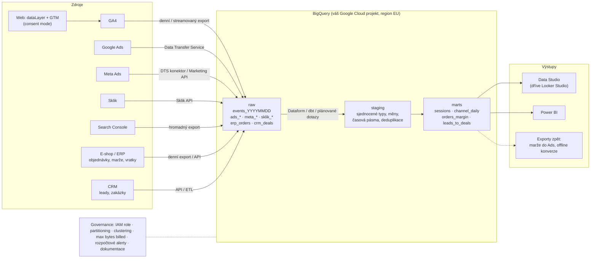

# LP 07: BigQuery a datový sklad pro marketing – zadání obsahu
> Stav: návrh v1 (8. 10. 2026) · Priorita: B · URL: `/sluzby/bigquery` · Segmenty: velké firmy · e-shopy (sekundárně B2B / lead-gen)

---

## 0. Shrnutí

**Účel stránky.** Přesvědčit firmu, která už měří v GA4 a platí za reklamu ve více systémech, že potřebuje **vlastní surová data v BigQuery spojená s náklady a s daty e-shopu, CRM nebo ERP** – a že datalayer.cz postaví celý řetězec od exportu po dashboard, s kontrolou nákladů, s dokumentací a ve Google Cloud projektu klienta.

**Komu je určena (persony):**
| Persona | Situace | Co hledá / co ho přesvědčí |
|---|---|---|
| **Head of e-commerce / CMO** středního až velkého e-shopu (3+ reklamní kanály, tisíce objednávek měsíčně) | GA4 neukáže marži ani vratky, náklady z Ads/Meta/Skliku někdo každé pondělí ručně kopíruje do Excelu, meziroční srovnání v Průzkumech GA4 končí na 14 měsících | „bigquery“, „ga4 bigquery export“, „datový sklad“; přesvědčí ho diagram toku dat, ukázka výstupu (POAS, marže po kanálech) a srozumitelné náklady |
| **Head of BI / IT** ve velké firmě | Má datový sklad (Azure, Snowflake, Keboola) nebo plánuje BigQuery, ale webová data v něm nejsou v použitelné podobě; řeší přístupy, umístění dat, náklady a auditovatelnost | Technického partnera pro „webovou vrstvu“ dat; přesvědčí ho SQL ukázka, vrstvy modelu, governance (IAM, partitioning, limity), dokumentace |
| *(sekundárně)* **Marketing / sales lead v B2B** | Lead z webu nelze spojit se zakázkou v CRM | Odkaz na řešení B2B; zde jen segmentová záložka |

**Hlavní konverze:** kontaktní formulář `form_id: lp-bigquery` (téma předvybrané „BigQuery & dashboardy“), telefon. **Sekundární:** článek F1 *GA4 → BigQuery export* (`/blog/ga4-bigquery-export`), článek F5 *Kolik stojí BigQuery* (`/blog/bigquery-cena`).

**Proč tahle stránka vyhraje nad konkurencí:**
1. **End-to-end řetězec, který nikdo nemá na jedné LP.** BI firmy (revolt.bi, datamind.cz) staví datové sklady, ale sběr dat z webu nedělají (revolt.bi webovou analytiku nenabízí vůbec, datamind.cz má k webové analytice LP o ~200 slovech vlastního textu). Analytické agentury mají BigQuery jen jako článek nebo krátkou stránku (digitalniarchitekti.cz – „Tvorba a správa datových skladů“, ~420 slov). Analýza konkurence kap. 1 bod 8: kombinace „sběr → BigQuery → dashboard“ nemá vlastní LP nikdo.
2. **Technická hloubka místo šablony.** datimo.ai prodává BigQuery jako modul pro menší e-shopy (krátká LP „Datové sklady“ bez diagramu a bez technického detailu, „řešení na individuální dohodě“). My ukážeme diagram vrstev, krátké SQL, náklady Googlu s ověřenými cenami a governance.
3. **Prázdný český SERP.** Na „ga4 bigquery“ a „bigquery export google analytics“ rankuje 8. 10. 2026 dokumentace Googlu, ga4bigquery.com, reddit a jediný český článek (digitalniarchitekti.cz). Česká komerční stránka s konkrétní ukázkou nemá konkurenci.
4. **Transparentnost nákladů bez ceníku služby.** Konkurence o provozních nákladech BigQuery mlčí; my vysvětlíme, co platí klient Googlu (free tier, cena za TiB, streaming) – a tím snížíme nejistotu, i když cenu vlastní práce neuvádíme.

---

## 1. SEO a meta

| Prvek | Návrh | Délka |
|---|---|---|
| **Title** | `BigQuery a datový sklad pro marketing \| datalayer.cz` | 52 znaků |
| **Meta description** | `GA4 v BigQuery spojíme s náklady z Ads, Meta a Skliku i s daty e-shopu a CRM. Datový model, hlídané náklady a dashboard nad čísly, které věříte.` | 144 znaků |
| **H1** | `BigQuery a datový sklad pro marketing` | 37 znaků |
| **URL** | `/sluzby/bigquery` (beze změny oproti stagingu, viz architektura 1.1) | |
| **Breadcrumbs** | Domů › Služby › BigQuery a datový sklad | |
| **Canonical** | `https://datalayer.cz/sluzby/bigquery` | |

### 1.1 Klíčová slova

Objemy = průměrná měsíční hledanost CZ (Ahrefs, `lp_keyword_inputs.json`, 8. 10. 2026). U dotazů typu „ga4 bigquery“ uvádí Ahrefs 0–10, Google ale pro ně vrací plný SERP – poptávka existuje, jen je malá a anglicko-česká.

| Typ | Klíčové slovo | Objem | Kde použít |
|---|---|---|---|
| Hlavní | bigquery | 150 | H1, title, rychlá odpověď, alt diagramu, H2 „Co je BigQuery…“ (FAQ) |
| Hlavní | datový sklad | 150 | H1, title, podtitul, H2 „Datový model…“ |
| Vedlejší | big query | 70 | FAQ (přirozená varianta v textu odpovědi), alt mockupu konzole |
| Vedlejší | google bigquery | 20 | rychlá odpověď („datový sklad Googlu“), Service `description` |
| Vedlejší | ga4 bigquery / bigquery export google analytics / ga4 to bigquery export | 0–10 (SERP existuje) | H2 sekce řešení „Export GA4 do BigQuery…“, krok 2 postupu, anchor na F1 |
| Vedlejší | bigquery pricing / kolik stojí bigquery | 20 | H2 „Kolik stojí provoz BigQuery“, FAQ |
| Vedlejší | bigquery sandbox | 10 | FAQ „Je BigQuery zdarma?“, tabulka nákladů |
| Long-tail | centrální datový sklad | 20 | text sekce „Velké firmy“ |
| Long-tail | enterprise data warehouse | 30 | jen v textu segmentu velké firmy (EN termín v závorce) |
| Long-tail | řešení pro datový sklad · datový sklad architektura | 10 · 10 | H2 diagramu „Architektura: …“, text |
| Long-tail | search console bigquery | 10 | tabulka zdrojů dat (Search Console bulk export) |
| Long-tail | pipedrive to bigquery | 10 | segment B2B („CRM – např. Pipedrive, HubSpot, Raynet“) |
| Long-tail | ga4 bigquery sessions · ga4 bigquery session id | 0 | komentář k ukázce SQL (sessionizace přes `ga_session_id`) |
| Otázka | Is Google BigQuery free? / Can I use BigQuery for free? (PAA) | – | FAQ „Je BigQuery zdarma a kolik stojí?“ |
| Otázka | What is BigQuery used for? (PAA) | – | FAQ „K čemu je BigQuery v marketingu?“ |
| Otázka | Is BigQuery SQL? (PAA) | – | FAQ „Musíme umět SQL?“ |
| Otázka | co je datový sklad / data warehouse co to je | 0 | jednou větou v rychlé odpovědi; plná definice ve slovníku |

### 1.2 Co na stránku NEpatří (kanibalizace)
| Dotaz / téma | Kam patří | Na LP jen |
|---|---|---|
| Návod „ga4 bigquery export jak na to“, schéma tabulek, nastavení krok za krokem | článek F1 `/blog/ga4-bigquery-export` | 1 odstavec + odkaz |
| SQL dotazy pro GA4 (12 dotazů), sessionizace do detailu | článek F2 `/blog/ga4-bigquery-sql` | 1 krátká ukázka |
| Detailní výpočet ceny BigQuery, kalkulačka | článek F5 `/blog/bigquery-cena` | tabulka cen Googlu + modelový příklad |
| „what is a data warehouse“ (100), „data lake vs data warehouse“ (40), „datový sklad definice“ | slovník `/slovnik/datovy-sklad`, článek F3 | 1 věta |
| looker studio / data studio / power bi | LP 08 `/sluzby/dashboardy-a-reporting` | zmínka v kroku „Napojení dashboardů“ |
| Governance měření ve velkých firmách obecně | LP 14 `/reseni/velke-firmy` | segmentová záložka |
| „datový sklad plzeňského kraje“ (30), „bigquery logo“ (20) | nic (navigační / nerelevantní) | – |
| „data warehouse design“ (700) | nic – převážně EN vzdělávací dotaz, mimo cílovku | – |

### 1.3 Strukturovaná data (JSON-LD)

> **Pozor – změna u Googlu:** podle changelogu Search Central se rozšířený výsledek FAQ **od 7. 5. 2026 ve Vyhledávání Google nezobrazuje** a dokumentace k němu byla v červnu 2026 odstraněna. `FAQPage` proto doporučuji ponechat jen tehdy, když ho CMS generuje automaticky z FAQ komponenty (nulové náklady, validní schema.org pro jiné systémy). Hodnota FAQ je dnes hlavně v **obsahu** (odpovědi pro uživatele a pro AI přehledy), ne ve schématu. Doporučuji tuto poznámku propsat do architektury (kap. 7).

```json
{
  "@context": "https://schema.org",
  "@graph": [
    {
      "@type": "Service",
      "@id": "https://datalayer.cz/sluzby/bigquery#service",
      "name": "BigQuery a datový sklad pro marketing",
      "serviceType": "Implementace BigQuery a datového skladu pro marketingová a e-commerce data",
      "description": "Export GA4 do BigQuery, napojení nákladů z Google Ads, Meta a Skliku a dat z e-shopu, CRM a ERP, datový model pro marketing (relace, atribuce, marže, vratky), kontrola nákladů a napojení dashboardů.",
      "url": "https://datalayer.cz/sluzby/bigquery",
      "provider": {
        "@type": "Organization",
        "@id": "https://datalayer.cz/#organization",
        "name": "datalayer.cz",
        "url": "https://datalayer.cz"
      },
      "areaServed": { "@type": "Country", "name": "CZ" },
      "availableLanguage": "cs",
      "audience": { "@type": "BusinessAudience", "audienceType": "E-shopy, velké firmy, B2B firmy" },
      "isRelatedTo": [
        { "@type": "Service", "@id": "https://datalayer.cz/sluzby/dashboardy-a-reporting#service" },
        { "@type": "Service", "@id": "https://datalayer.cz/sluzby/audit-mereni#service" }
      ]
    },
    {
      "@type": "BreadcrumbList",
      "itemListElement": [
        { "@type": "ListItem", "position": 1, "name": "Domů", "item": "https://datalayer.cz/" },
        { "@type": "ListItem", "position": 2, "name": "Služby", "item": "https://datalayer.cz/sluzby" },
        { "@type": "ListItem", "position": 3, "name": "BigQuery a datový sklad", "item": "https://datalayer.cz/sluzby/bigquery" }
      ]
    },
    {
      "@type": "FAQPage",
      "mainEntity": [
        {
          "@type": "Question",
          "name": "Je BigQuery zdarma a kolik stojí?",
          "acceptedAnswer": { "@type": "Answer", "text": "(text odpovědi 1:1 ze sekce FAQ)" }
        },
        {
          "@type": "Question",
          "name": "Získáme i historická data z GA4, nebo jen od zapnutí exportu?",
          "acceptedAnswer": { "@type": "Answer", "text": "(text odpovědi 1:1 ze sekce FAQ)" }
        }
      ]
    }
  ]
}
```
*Pro vývojáře:* `FAQPage.mainEntity` generovat z FAQ komponenty (všechny otázky, text shodný s viditelným). `@id` služeb sjednotit napříč LP.

### 1.4 OG obrázek
1200 × 630 px, pozadí `#020d1e`. Vlevo piktogram `bq` (tabulka nad řádkem `SELECT` v perspektivě „skladu“, cyan `#00ffff`, tah 1,5 px) zvětšený na 220 px, pod ním mono štítek `[ bq ]`. Vpravo H1 „BigQuery a datový sklad pro marketing“ (Inter 800, 54 px, `#e6edf3`) a pod ním mono řádek `GA4 + Ads + Meta + Sklik + ERP → 1 model` (Roboto Mono, `#00b0b0`). Dole tenká přerušovaná linka s 4 uzly (GA4 → BigQuery → model → dashboard). Logo datalayer.cz vpravo dole.

---

## 2. Wireframe (pořadí sekcí)

```
┌──────────────────────────────────────────────────────────────────────┐
│ Breadcrumbs: Domů › Služby › BigQuery a datový sklad                 │
├───────────────────────────────┬──────────────────────────────────────┤
│ [ bq ] eyebrow                 │  ANIMOVANÝ MINI-DIAGRAM              │
│ H1 BigQuery a datový sklad…    │  dataLayer.push(purchase) → GA4 →    │
│ Podtitul                       │  BigQuery events_2026… → model →     │
│ Rychlá odpověď (box, 55 slov)  │  dlaždice „POAS 2,4“                 │
│ [ Konzultovat BigQuery ] [Ukázka]                                     │
│ mikrocopy                      │                                      │
├───────────────────────────────┴──────────────────────────────────────┤
│ TRUST BAR – 4 fakta (vaše data · EU region · limity nákladů · docs)  │
├──────────────────────────────────────────────────────────────────────┤
│ SYMPTOMY – „Poznáváte se?“ 6 karet (3×2)                             │
├──────────────────────────────────────────────────────────────────────┤
│ ŘEŠENÍ – „Co postavíme“ 6 kroků (číslovaný seznam, vlevo text,       │
│ vpravo sticky mini-náhled vrstvy, která se právě popisuje)           │
├──────────────────────────────────────────────────────────────────────┤
│ DIAGRAM – Architektura: zdroje → raw → staging → marts → dashboardy  │
│ (interaktivní uzly s popiskem)                                       │
├──────────────────────────────────────────────────────────────────────┤
│ UKÁZKA SQL + MOCKUP KONZOLE BigQuery („Tento dotaz zpracuje …“)       │
├──────────────────────────────────────────────────────────────────────┤
│ SROVNÁNÍ 1: GA4 rozhraní vs. GA4 + BigQuery (tabulka)                │
│ SROVNÁNÍ 2: plánované dotazy vs. Dataform vs. dbt (tabulka)          │
├──────────────────────────────────────────────────────────────────────┤
│ NÁKLADY – „Kolik stojí provoz BigQuery“ tabulka cen Googlu + příklad │
├──────────────────────────────────────────────────────────────────────┤
│ CO DOSTANETE – 8 výstupů (karty 4×2)                                 │
├──────────────────────────────────────────────────────────────────────┤
│ POSTUP A DÉLKA – timeline 6 kroků + „co od vás potřebujeme“          │
├──────────────────────────────────────────────────────────────────────┤
│ PŘÍPADOVÁ STUDIE – MiniCase (placeholder)                            │
├──────────────────────────────────────────────────────────────────────┤
│ PRO KOHO – SegmentTabs: E-shop · Velká firma · B2B                   │
│ + box „Kdy BigQuery zatím nepotřebujete“                             │
├──────────────────────────────────────────────────────────────────────┤
│ FAQ – 11 otázek (akordeon)                                           │
├──────────────────────────────────────────────────────────────────────┤
│ DO HLOUBKY – 5 článků · NAVAZUJÍCÍ SLUŽBY – 3 karty                  │
├──────────────────────────────────────────────────────────────────────┤
│ KONTAKT – ContactBlock form_id=lp-bigquery                           │
└──────────────────────────────────────────────────────────────────────┘
```

**Mobil (≤ 768 px):**
- Hero: diagram se mění na statický svislý řetězec 4 uzlů pod CTA (bez animace psaní kódu); rychlá odpověď nad CTA.
- Trust bar: horizontální scroll s „peek“ efektem (2,2 karty viditelné), bez horizontálního scrollu stránky.
- Řešení: sticky náhled vrstvy se skrývá; každý krok má ikonu vrstvy inline.
- Diagram: svisle shora dolů, uzly na klepnutí rozbalují popisek (stejná data jako tooltip na desktopu).
- SQL: blok kódu s horizontálním scrollem uvnitř bloku (`overflow-x: auto`), font 13 px; mockup konzole pod ním zjednodušený (jen řádek s odhadem zpracovaných dat + 3 řádky výsledku).
- Tabulky srovnání: na mobilu jako karty (každý řádek = karta se 2 sloupci hodnot).
- Sticky spodní lišta (globální): `Zavolat` · `Napsat`.

---

## 3. Obsah sekcí (detailně)

### 3.1 Hero (`HeroService`)
- **Účel:** během 5 sekund říct, co služba je (GA4 + náklady + data firmy v BigQuery), pro koho, a že data zůstanou klientovi.
- **Eyebrow (mono):** `[ bq ] Data a reporting`
- **H1:** BigQuery a datový sklad pro marketing
- **Podtitul:** Surová data z GA4 spojíme s náklady z Google Ads, Mety a Skliku a s objednávkami, maržemi a vratkami z e-shopu, CRM nebo ERP. Ve vašem Google Cloudu, s hlídanými náklady a s dashboardem, kterému věří i finanční ředitel.
- **Rychlá odpověď (box s levým cyan okrajem, 56 slov):**
  > **BigQuery** je datový sklad Googlu, do kterého GA4 umí každý den nebo průběžně exportovat všechny události bez vzorkování. Pro marketing z něj stavíme jedno místo pravdy: chování na webu, náklady kampaní a data e-shopu či CRM v jednom modelu. Googlu platíte jen za uložená a zpracovaná data – první 1 TiB dotazů a 10 GiB úložiště měsíčně je zdarma.
- **CTA1 (primární, oranžové):** `[ Konzultovat BigQuery ]` → kotva `#kontakt`
- **CTA2 (sekundární, outline cyan):** `[ Ukázka datového modelu ]` → kotva `#architektura`
- **Mikrocopy pod CTA:** „Úvodní konzultace 30 min zdarma · Data i účty zůstávají ve vašem Google Cloud projektu“
- **Vizuální prvek:** animovaný mini-diagram (varianta hero animace z homepage, stejný vizuální jazyk: uzly = čtverce s glow, spojnice = přerušovaná čára s pohybem, popisky Roboto Mono 12 px):
  1. uzel `dataLayer.push({'event':'purchase'})` (kód se „dopíše“ během 1,2 s),
  2. uzel `GA4`,
  3. uzel `BigQuery` se štítkem `events_20261007` (tabulka z denního exportu),
  4. uzel `marts.orders_margin` (malá tabulka 3 řádky: `google / cpc · 182 400 Kč · marže 31 %`, `meta / paid · 96 100 Kč · 27 %`, `sklik / cpc · 41 900 Kč · 29 %`),
  5. dlaždice dashboardu `POAS 2,4` s mini spark-line.
  Barvy: uzly `#0b1a30`, okraj `#00b0b0`, aktivní uzel glow `#00ffff` 30 %. Animace jednou při načtení, pak klid; `prefers-reduced-motion` → statický stav. Všechna data **ukázková** (malý štítek „ukázková data“ pod dlaždicí).
- **Měření:** `cta_click` (`cta_id: bq_hero_konzultace` / `bq_hero_ukazka`, `section: hero`).

### 3.2 Trust bar (`TrustBar`)
- **Účel:** fakta o přístupu, ne loga; adresuje obavy IT (vlastnictví, EU, náklady).
- **Obsah (4 položky, každá: mono štítek + 1 řádek):**
  1. `[ vaše data ]` Projekt v Google Cloudu na vašem účtu – data, přístupy i fakturace jsou vaše
  2. `[ eu ]` Umístění dat volíte vy (např. region EU) už při propojení GA4
  3. `[ cost ]` Limity dotazů a rozpočtové alerty nastavené od prvního dne
  4. `[ docs ]` Dokumentace datového modelu a slovník metrik ke každému projektu
- **Volitelně 5. položka:** `[DOPLNIT: počet realizovaných BigQuery projektů nebo certifikace Google Cloud (např. Professional Data Engineer), pokud ji klient má]`. Bez ověřeného čísla nepoužít.
- **Vizuál:** bez piktogramů, jen mono štítky v cyan + text `#e6edf3`; oddělovače svislá linka `#0b1a30`.

### 3.3 Symptomy (`SymptomCards`)
- **H2:** Poznáváte se v některé z těchto situací?
- **Úvodní věta:** GA4 je dobrý nástroj na sběr dat, ale na řízení marketingu podle peněz mu chybí data, která má vaše firma jinde.
- **Karty (piktogram + nadpis + 1–2 věty):**

| # | Piktogram (popis pro ilustrátora) | Nadpis karty | Text |
|---|---|---|---|
| 1 | Kalendář s posuvníkem, za 14. měsícem přerušená čára | Meziroční srovnání končí na 14 měsících | V Průzkumech GA4 standard vidíte událostní data nejvýš 14 měsíců zpět. Sezónnost, kohorty a dlouhé nákupní cykly se tak porovnávají špatně. |
| 2 | Tabulka, poslední řádek šedý s textem `(other)` | V reportu se objevuje „(other)“ | U detailních reportů GA4 slučuje méně časté hodnoty do řádku „(other)“ a část dat skrývá kvůli prahování. V BigQuery exportu tyto řádky nejsou. |
| 3 | Účtenka s položkou přeškrtnutou červeně (vratka) | ROAS počítáte z obratu, ne z marže | GA4 nezná nákupní ceny, storna ani vratky. Kampaň, která „vydělává“, může po odečtení vratek prodělávat. |
| 4 | Tři sloupce log-teček (Ads / Meta / Sklik) → šipka do tabulky Excelu | Náklady sčítá někdo ručně | Každé pondělí kdosi stahuje náklady z Google Ads, Meta a Skliku do Excelu. Chyba v jednom řádku a porada řeší špatná čísla. |
| 5 | Teploměr s ryskou `1M` a šipkou nad ní | Blížíte se limitu exportu | Standardní GA4 property má limit denního exportu 1 milion událostí. Při výrazném překročení může Google denní export pozastavit. |
| 6 | Formulář → trychtýř → přerušená čára → kartička „deal“ | Lead z webu nikdo nespojí se zakázkou | Marketing vykazuje leady, obchod zakázky v CRM. Kolik tržeb přinesla která kampaň, neví nikdo. |

- **Vizuál:** karty `#0b1a30`, piktogramy line-style 32×32 dle architektury kap. 5 (nové v témže stylu), mono štítek pod piktogramem (`retention`, `(other)`, `margin`, `costs`, `1M/day`, `crm`).
- **Interakce:** žádná. **CTA pod kartami:** textový odkaz „Nevíte, jestli to máte i vy? → [ Napište nám, co řešíte ]“ (`cta_id: bq_symptomy_kontakt`, kotva `#kontakt`).

### 3.4 Řešení (`SolutionSteps`)
- **H2:** Co postavíme: od exportu GA4 po model, kterému věří finance
- **Úvod:** Nejdřív se domluvíme, jaká rozhodnutí mají data podpořit. Teprve pak stavíme tabulky. Každý krok má výstup, který zůstává u vás.
- **Kroky (H3 + text):**
  1. **Měřicí plán pro data.** Sepíšeme otázky, na které má sklad odpovídat (např. „marže podle kanálu po odečtení vratek“, „kolik zakázek přinesla kampaň X“), a k nim zdroje, klíče pro propojení (ID objednávky, `transaction_id`, ID leadu, GCLID) a vlastníka každé metriky.
  2. **Export GA4 do BigQuery.** Propojíme GA4 s vaším Google Cloud projektem, zvolíme umístění dat (např. EU), denní a podle potřeby průběžný (streamovaný) export a vyloučíme zbytečné události, aby se standardní property vešla do limitu. Ověříme, že export odpovídá datové vrstvě – když nesedí sběr, nesedí ani sklad.
  3. **Náklady a data firmy.** Načteme náklady a výkon z Google Ads (konektor BigQuery Data Transfer Service), z Meta Ads (konektor Data Transfer Service nebo Marketing API), ze Skliku (Sklik API) a podle potřeby data ze Search Console (hromadný export). Napojíme objednávky, marže a vratky z e-shopu nebo ERP a leady a zakázky z CRM.
  4. **Datový model pro marketing.** Ze surových událostí postavíme relace (sessionizace přes `user_pseudo_id` a `ga_session_id`), přiřadíme zdroje návštěv, napojíme objednávky na marže a vratky a náklady na kampaně. Výsledkem jsou přehledné reportovací tabulky (např. `orders_margin`, `channel_daily`, `leads_to_deals`).
  5. **Automatizace a governance.** Transformace poběží v Dataformu, v dbt (pokud ho používá váš tým), nebo jako plánované dotazy. Tabulky budou rozdělené podle data (partitioning) a seřazené podle často filtrovaných sloupců (clustering), dotazy budou mít limit zpracovaných bajtů, projekt rozpočtové alerty a každý přístup přidělenou roli.
  6. **Napojení dashboardů a předání.** Model napojíme na Data Studio (dříve Looker Studio) nebo Power BI, sepíšeme dokumentaci a slovník metrik a projdeme je s vaším týmem. Detail dashboardů: [Dashboardy a reporting](/sluzby/dashboardy-a-reporting).
- **Vizuál:** vlevo číslované kroky, vpravo **sticky mini-náhled** (desktop) – stylizovaná „vrstva“ skladu, která se zvýrazní podle kroku ve viewportu: `plan` (dokument), `raw` (tabulka `events_*`), `sources` (3 konektory), `marts` (tabulka `orders_margin`), `guard` (štít + `max_bytes_billed`), `report` (dlaždice). Přechod opacity 200 ms; `prefers-reduced-motion` → bez animace.
- **CTA:** `[ Probrat váš případ ]` → `#kontakt` (`cta_id: bq_reseni_konzultace`).

### 3.5 Diagram architektury (`DataFlowDiagram`, kotva `#architektura`)
- **H2:** Architektura: jak data tečou z webu a firemních systémů do reportu
- **Text nad diagramem (2 věty):** Data držíme ve třech vrstvách: surová (beze změn, jak je pošlou zdroje), očištěná (sjednocené názvy, měny, časová pásma) a reportovací (tabulky pro konkrétní otázky). Díky tomu jde každé číslo v dashboardu dohledat až ke zdrojové události.
- **Mermaid náhled:**



- **Zadání pro designéra (SVG):**
  - Tři sloupce na desktopu (Zdroje → BigQuery → Výstupy), BigQuery jako velký panel `#051125` s okrajem `#00b0b0` a třemi vodorovnými „patry“ (raw / staging / marts) – vizuálně jako sklad s regály.
  - Zdroje jako uzly 140×48 px s mono popiskem; spojnice přerušované s pohybem teček (animace CSS, 4 s smyčka, `prefers-reduced-motion` → statické).
  - Pod BigQuery panelem pruh „Governance“ (štít + 5 mono štítků).
  - Přerušovaná šipka „Exporty zpět“ odlišit oranžovou `#ff7400` (akce do reklamních systémů).
  - **Interakce:** hover/klik na uzel → tooltip 1–2 věty (texty níže); `diagram_interaction` (`diagram_id: bq-architektura`, `node: {id uzlu}`).
  - **Mobil:** svislé pořadí Zdroje (mřížka 2×4) → BigQuery (3 patra pod sebou) → Výstupy; tooltipy jako rozbalovací řádky.
  - **Alt / textový popis pod diagramem (pro čtečky a AI):** „Schéma: data z webu přes GA4, náklady z Google Ads, Meta a Skliku, Search Console a data e-shopu a CRM se ukládají do BigQuery ve třech vrstvách (raw, staging, marts) a z reportovacích tabulek se napojují dashboardy v Data Studiu nebo Power BI.“
- **Texty tooltipů:**
  | Uzel | Tooltip |
  |---|---|
  | GA4 | Denní export obsahuje všechny události za předchozí den; průběžný (streamovaný) export plní tabulku `events_intraday` během dne. |
  | Google Ads | Konektor BigQuery Data Transfer Service pro Google Ads je podle ceníku Googlu bez poplatku za přenos. |
  | Meta Ads | Konektor Data Transfer Service má pevnou sadu tabulek a minimální interval 24 h; alternativou je Marketing API. |
  | Sklik | Náklady a statistiky přes Sklik API (Drak / Fénix). |
  | Search Console | Hromadný export plní denně tabulky `searchdata_site_impression` a `searchdata_url_impression` – historii před zapnutím neobsahuje. |
  | E-shop / ERP | Zdroj pravdy pro tržby, marže, storna a vratky. Klíčem je ID objednávky = `transaction_id` v GA4. |
  | CRM | Leady a zakázky; klíčem je ID leadu z formuláře nebo GCLID. |
  | raw | Data beze změn – kdykoli můžeme model přepočítat. |
  | staging | Sjednocené typy, měny, DPH, časová pásma, odstranění duplicit. |
  | marts | Tabulky pro konkrétní otázky; nad nimi běží dashboardy. |
  | Governance | Kdo co vidí, kolik smí dotaz stát, kdy se staré oddíly mažou. |

### 3.6 Ukázka práce s daty (SQL + mockup konzole)
- **H2:** Jak vypadá práce s daty v BigQuery
- **Text:** BigQuery se ovládá jazykem SQL. Nemusíte ho umět – reportovací tabulky připravíme tak, aby se s nimi pracovalo v dashboardu. Pro představu: takhle vypadá dotaz, který z exportu GA4 spočítá relace a tržby podle zdroje za posledních 7 dní. Filtr na `_TABLE_SUFFIX` zajistí, že BigQuery přečte jen 7 denních tabulek, ne celou historii – to je jeden ze způsobů, jak držíme náklady na uzdě.
- **Kód (blok s mono fontem, zvýraznění syntaxe jen na této stránce):**

```sql
-- Relace a tržby podle zdroje za posledních 7 dní (GA4 export)
SELECT
  session_traffic_source_last_click.cross_channel_campaign.source AS zdroj,
  session_traffic_source_last_click.cross_channel_campaign.medium AS medium,
  COUNT(DISTINCT CONCAT(user_pseudo_id, '.',
    CAST((SELECT value.int_value FROM UNNEST(event_params)
          WHERE key = 'ga_session_id') AS STRING))) AS relace,
  ROUND(SUM(IF(event_name = 'purchase', ecommerce.purchase_revenue, 0)), 0) AS trzby
FROM `vas-projekt.analytics_123456789.events_*`
WHERE _TABLE_SUFFIX BETWEEN
      FORMAT_DATE('%Y%m%d', DATE_SUB(CURRENT_DATE('Europe/Prague'), INTERVAL 7 DAY))
  AND FORMAT_DATE('%Y%m%d', DATE_SUB(CURRENT_DATE('Europe/Prague'), INTERVAL 1 DAY))
GROUP BY zdroj, medium
ORDER BY trzby DESC;
```
- **Poznámka pod kódem (malým písmem):** Ukázka pracuje s poli `session_traffic_source_last_click`, `event_params.ga_session_id`, `user_pseudo_id` a `ecommerce.purchase_revenue` podle schématu exportu GA4. Čísla z dotazu se mohou mírně lišit od rozhraní GA4 – rozhraní uživatele a relace odhaduje, používá modelování a vlastní atribuci (podrobně v [článku o exportu](/blog/ga4-bigquery-export)).
- **Mockup konzole BigQuery (HTML/SVG, ne screenshot):**
  - Horní lišta: `vas-projekt` › `analytics_123456789` › `events_*`; vpravo zelená fajfka a text „Tento dotaz po spuštění zpracuje 186 MB.“ *(ukázková hodnota)*
  - Spodní panel „Výsledky“: tabulka 5 řádků (ukázková data):
    | zdroj | medium | relace | trzby |
    |---|---|---|---|
    | google | cpc | 18 412 | 1 284 300 |
    | (direct) | (none) | 9 870 | 812 600 |
    | facebook | paid | 11 205 | 534 900 |
    | seznam | cpc | 4 318 | 296 400 |
    | google | organic | 12 944 | 288 100 |
  - Pod tabulkou štítek „ukázková data“. Barvy: panel `#0b1a30`, záhlaví tabulky `#051125`, čísla Roboto Mono, zvýraznění řádku při hoveru `#00ffff` 8 %.
  - **Mobil:** jen řádek s odhadem zpracovaných dat + 3 řádky tabulky.
- **CTA (textový odkaz):** „12 dalších dotazů pro marketéra najdete v článku [SQL pro GA4 v BigQuery](/blog/ga4-bigquery-sql)“.

### 3.7 Srovnání (`ComparisonTable`)
- **H2:** Co vám dá BigQuery navíc oproti rozhraní GA4
- **Tabulka 1 – GA4 rozhraní vs. GA4 + BigQuery (kompletní obsah):**

| Oblast | Rozhraní GA4 (standard) | GA4 + BigQuery (s modelem od nás) |
|---|---|---|
| Jak daleko do historie | Událostní data v Průzkumech a trychtýřích 2 nebo 14 měsíců (standardní agregované reporty retence neomezuje) | Tak dlouho, jak data necháte uložená (vy určujete expiraci oddílů) |
| Úplnost řádků | U vysoké kardinality řádek „(other)“, u některých reportů prahování dat | Surové události bez „(other)“; data skrytá prahováním v exportu obvykle chybí také |
| Počty uživatelů a relací | Odhad (HyperLogLog++), u relací Google uvádí přesnost cca ±1,63 % | Přesný výpočet z událostí |
| Modelovaná data (consent mode) | Mohou být součástí reportů | V exportu nejsou – vidíte jen skutečně naměřené události |
| Marže, vratky, storna | Ne (jen to, co pošlete v události) | Ano – z e-shopu / ERP, napojené přes ID objednávky |
| Náklady z Meta a Skliku | Ne (import nákladů jen omezeně a ručně) | Ano – automatické načítání denně |
| Spojení s CRM (lead → zakázka) | Ne | Ano – přes ID leadu nebo GCLID |
| Vlastní atribuce, kohorty, LTV | Omezeně, předdefinované modely | Libovolně, na vašich pravidlech |
| Kdo data vlastní | Google Analytics účet | Váš Google Cloud projekt |
| Náklady | Zdarma (standard) | Platíte Googlu úložiště a dotazy nad free tier + naši práci |

- **H3:** Čím budeme data transformovat
- **Tabulka 2 – plánované dotazy vs. Dataform vs. dbt:**

| Kritérium | Plánované dotazy (scheduled queries) | Dataform | dbt |
|---|---|---|---|
| Kde běží | Přímo v BigQuery | Služba Google Cloudu nad BigQuery | Vlastní běhové prostředí nebo dbt Cloud |
| Cena nástroje | Platíte jen zpracování dotazů | Podle Googlu služba zdarma; platíte BigQuery dotazy a logování | dbt Core je open source; provoz a případné licence podle zvolené varianty (ověřit u dodavatele) |
| Verzování v Gitu, testy, závislosti | Ne / ručně | Ano | Ano |
| Dokumentace modelu | Ručně | Ano (popisy, graf závislostí) | Ano (popisy, graf závislostí) |
| Kdy volíme | Malý model, 3–5 tabulek, žádný datový tým | Výchozí volba pro marketingový sklad v BigQuery | Váš datový tým už dbt používá, nebo sklad není jen v BigQuery |

- **Vizuál:** tabulky v komponentě `ComparisonTable`, první sloupec mono; v tabulce 1 sloupec „GA4 + BigQuery“ zvýrazněn jemným cyan pozadím 6 %. Mobil = karty.

### 3.8 Náklady (`FeatureList` + tabulka)
- **H2:** Kolik stojí provoz BigQuery (platíte Googlu, ne nám)
- **Text:** Cenu naší práce na webu neuvádíme, ale provozní náklady BigQuery jsou veřejné. Fakturu za ně dostáváte přímo od Googlu na svůj účet. Platí se za dvě věci: kolik dat je uloženo a kolik dat dotazy přečtou.
- **Tabulka (ceny dle ceníku Google Cloud, ověřeno 10/2026, USD bez DPH):**

| Položka | Cena / limit | Poznámka |
|---|---|---|
| Dotazy (on-demand) | 6,25 USD za 1 TiB přečtených dat | Prvních 1 TiB měsíčně zdarma; minimum 10 MB na dotaz a tabulku |
| Úložiště – aktivní | řádově 0,02 USD za GiB měsíčně (sazba podle regionu) | Prvních 10 GiB měsíčně zdarma |
| Úložiště – dlouhodobé | cca o 50 % levnější | Oddíl, který se 90 dní nezměnil |
| Streamovaný export GA4 | 0,05 USD za GB (Google uvádí cca 600 000 událostí na 1 GB) | Denní (dávkový) export je bez poplatku za načtení |
| Konektory Google Ads a GA4 (Data Transfer Service) | bez poplatku za přenos | Platíte jen uložená data a dotazy |
| Konektor Meta Ads (Data Transfer Service) | podle spotřeby (slot-hodiny) | Ověřit v aktuálním ceníku |
| BigQuery sandbox | zdarma, bez platební karty | 10 GiB úložiště, 1 TiB dotazů/měs., tabulky expirují po 60 dnech, bez streamování a bez Data Transfer Service |

- **Modelový příklad (box „ukázkový výpočet“):**
  > E-shop s cca 100 000 událostmi v GA4 denně (≈ 3 mil. měsíčně) vygeneruje podle odhadu Googlu přibližně 5 GB exportu měsíčně. Za rok je to kolem 60 GB, tedy po odečtení 10 GiB zdarma desítky GB placeného úložiště – v řádu jednotek USD měsíčně. Streamovaný export by stál kolem 0,25 USD měsíčně. Dotazy dashboardů, které čtou malé reportovací tabulky místo surových dat, se obvykle vejdou do 1 TiB zdarma. **Skutečná čísla záleží na velikosti událostí a na tom, jak se dotazuje – proto je na začátku spočítáme pro vás a nastavíme limity.**
- **Pod boxem:** odkaz „Podrobný výpočet a kalkulačka: [Kolik stojí BigQuery pro marketing](/blog/bigquery-cena)“. Disclaimer malým písmem: „Ceny Google Cloud se mění; vždy platí aktuální ceník Googlu. Výpočet je orientační.“
- **Vizuál:** tabulka + box s ikonou kalkulačky (line style). Žádný graf. **Měření:** klik na odkaz F5 = `cta_click` (`cta_id: bq_naklady_clanek`).

### 3.9 Co dostanete (`Deliverables`)
- **H2:** Co dostanete
- **Úvod:** Výstupy jsou vaše a zůstávají u vás i po skončení spolupráce.
- **Karty (8):**
  1. **Měřicí plán pro data** – otázky, metriky, zdroje, klíče pro propojení, vlastníci (dokument).
  2. **Funkční export GA4 → BigQuery** – v projektu na vašem účtu, s ověřením proti datové vrstvě a s nastaveným filtrem událostí.
  3. **Načtené zdroje** – náklady (Google Ads, Meta, Sklik), Search Console, e-shop/ERP, CRM podle rozsahu.
  4. **Datový model ve třech vrstvách** – zdrojový kód transformací v Gitu (Dataform / dbt / plánované dotazy).
  5. **Slovník metrik** – jak počítáme relaci, tržbu, marži, POAS, CPL; co je zdroj pravdy pro které číslo.
  6. **Kontrolu nákladů** – partitioning, clustering, limity zpracovaných bajtů, denní kvóty, rozpočtové alerty.
  7. **Přístupy a role** – kdo smí číst, kdo upravovat; servisní účty pro konektory; seznam v předávacím protokolu.
  8. **Napojení na dashboard a předání** – připojení Data Studia nebo Power BI, 60–90min školení, záznam a dokumentace.
- **Vizuál:** karty 4×2 s malými line piktogramy (dokument, tabulka, konektor, vrstvy, kniha, štít, klíč, obrazovka).

### 3.10 Postup a délka (`ProcessTimeline`)
- **H2:** Jak postupujeme a jak dlouho to trvá
- **Úvod:** Typický projekt (GA4 + 2–3 reklamní systémy + e-shop) trvá 4–8 týdnů. Export GA4 zapneme hned v prvním týdnu, protože se nedá pustit zpětně – každý den navíc je den dat navíc. *(Délky jsou návrh – `[DOPLNIT: klient potvrdí typické délky podle svých projektů]`.)*

| # | Krok | Typická délka | Výstup | Co potřebujeme od vás |
|---|---|---|---|---|
| 1 | Úvodní workshop a měřicí plán | 1 týden | Měřicí plán pro data, seznam zdrojů | 1–2 hodiny s marketingem a někým z financí/IT; seznam systémů |
| 2 | Google Cloud projekt a export GA4 | 1–3 dny (běží paralelně) | Propojený export, region, filtr událostí | Vytvoření nebo zpřístupnění projektu, platební účet, role Editor v GA4 |
| 3 | Napojení nákladů a dat firmy | 1–2 týdny | Načtená surová data ze zdrojů | Přístupy (čtení) do Ads, Meta, Skliku; export nebo API k e-shopu/ERP/CRM; kontakt na vývojáře |
| 4 | Datový model a kontrola čísel | 2–3 týdny | Reportovací tabulky, porovnání s účetnictvím | Kontrolní čísla (tržby, počet objednávek za vybraný měsíc) |
| 5 | Governance a náklady | 2–3 dny | Limity, alerty, role, expirace | Schválení rozpočtového limitu a seznamu uživatelů |
| 6 | Dashboard, dokumentace, školení | 1 týden | Napojený dashboard, slovník metrik, záznam školení | Účastníci školení, zpětná vazba k prototypu |

- **Vizuál:** horizontální timeline (desktop) se 6 uzly a „pruhem“ délky; krok 2 graficky překrývá krok 1 (paralelně). Mobil: svisle.
- **Pod tabulkou:** „Po předání můžeme model dál udržovat a rozšiřovat – viz [Správa webu a měření](/sluzby/sprava-webu-a-mereni).“

### 3.11 Případová studie (`MiniCase`)
- **H2:** Z praxe: [DOPLNIT: název projektu / typ klienta]
- **Formát:** Problém → Příčina → Oprava → Výsledek (číslo). **Do dodání reálné studie sekci nezveřejňovat** nebo nahradit ukázkou jasně označenou „ukázkový příklad“.
- **Placeholder struktura:**
  - **Problém:** [DOPLNIT: např. „Vedení nevěřilo ROAS z Google Ads, tržby v GA4 se lišily od ERP o X %.“]
  - **Příčina:** [DOPLNIT: např. vratky, B2B objednávky po telefonu, chybějící náklady Skliku]
  - **Oprava:** [DOPLNIT: export GA4, napojení ERP přes ID objednávky, model marže, dashboard]
  - **Výsledek:** [DOPLNIT: číslo – např. „rozdíl mezi dashboardem a účetnictvím pod 1 %“, „ušetřené hodiny ruční práce týdně“, „přesun rozpočtu z kampaně s POAS < 1“]
  - **Citace klienta:** [DOPLNIT: jméno, funkce, firma – se souhlasem]
- **Ukázkový příklad (jen pokud chybí reálná studie, označit štítkem `ukázkový příklad`):** „E-shop s nábytkem: ROAS kampaní ve výkonu Max vypadal na 6,1. Po napojení marží a vratek z ERP vyšel POAS 1,3 – kampaň s nejvyšším obratem měla nejvyšší podíl vratek. Rozpočet se přesunul do kategorií s vyšší marží.“
- **Vizuál:** karta se 4 řádky (ikony: ⚠ problém, 🔍 příčina – jako line piktogramy, ne emoji), vpravo velké číslo výsledku (Inter 800, cyan).

### 3.12 Pro koho (`SegmentTabs`)
- **H2:** Co je jinak u e-shopu, velké firmy a B2B
- **Záložka „E-shop“:** Řídíte se podle marže, ne obratu. Napojíme nákupní ceny, storna a vratky z e-shopu nebo ERP, spočítáme POAS po kanálech a kategoriích, kohorty zákazníků a hodnotu zákazníka v čase (LTV). Na Shoptetu, Upgates či WooCommerce řešíme hlavně export objednávek; na vlastním řešení napojíme databázi nebo API. Klíč je vždy stejný: ID objednávky v e-shopu musí odpovídat `transaction_id` v GA4.
- **Záložka „Velká firma“:** Sklad musí zapadnout do pravidel IT. Pracujeme v projektu a organizaci Google Cloud, kterou spravujete vy, s rolemi podle principu nejnižších oprávnění, s volbou regionu a s expirací dat podle vašich pravidel. Když už máte centrální datový sklad (Azure, Snowflake, Keboola), připravíme webovou vrstvu dat jako čistý vstup pro váš BI tým – nebo s vaší BI agenturou spolupracujeme. Odkaz: [Měření pro velké firmy](/reseni/velke-firmy).
- **Záložka „B2B a leady“:** Spojíme lead z formuláře (ID leadu, GCLID) se stavem v CRM – Pipedrive, HubSpot, Raynet nebo jiný systém s API. Uvidíte cenu za kvalifikovaný lead a za zakázku podle kampaně a můžete posílat offline konverze zpět do Google Ads. Odkaz: [Měření pro B2B a lead generation](/reseni/b2b-a-lead-generation).
- **Box pod záložkami – „Kdy BigQuery zatím nepotřebujete“ (upřímnost buduje důvěru):**
  - Máte jednotky až nízké desítky objednávek nebo leadů týdně a 1–2 kampaně → stačí GA4 a dashboard nad přímými konektory.
  - Nemáte zatím spolehlivý sběr dat (GA4 nesedí s e-shopem o desítky procent) → nejdřív [audit měření](/sluzby/audit-mereni), sklad nad děravými daty nepomůže.
  - Nikdo ve firmě nebude podle dat rozhodovat → začněme jedním reportem pro vedení.
- **Měření:** přepnutí záložky `cta_click` (`cta_id: bq_segment_{eshop|velka-firma|b2b}`, `section: segmenty`).

### 3.13 FAQ (`FAQ`, 11 otázek)
- **H2:** Časté otázky k BigQuery

**1. K čemu je BigQuery v marketingu?**
BigQuery je datový sklad v Google Cloudu, ve kterém lze rychle dotazovat i miliardy řádků. V marketingu slouží jako místo, kde se potkají data, která jinak žijí odděleně: události z GA4, náklady z reklamních systémů, objednávky, marže a vratky z e-shopu nebo ERP a leady a zakázky z CRM. Nad nimi pak počítáte věci, které GA4 sám neumí – marži podle kanálu, POAS, cenu za zakázku, kohorty nebo vlastní atribuci. Výsledky se zobrazují v dashboardu (Data Studio, Power BI) nebo se posílají zpět do reklamních systémů.

**2. Je BigQuery zdarma a kolik stojí?**
Částečně. Google dává každý měsíc zdarma 1 TiB zpracovaných dotazů a 10 GiB úložiště; nad tento limit stojí dotazy 6,25 USD za TiB a aktivní úložiště řádově 0,02 USD za GiB měsíčně (ceník Google Cloud, 10/2026). Na vyzkoušení je BigQuery sandbox bez platební karty – má ale limit 10 GiB úložiště, tabulky v něm expirují po 60 dnech a nepodporuje streamování ani konektory Data Transfer Service. Pro trvalý provoz proto doporučujeme projekt s fakturací. V našem modelovém výpočtu pro e-shop se 100 000 událostmi denně vycházejí provozní náklady v řádu jednotek USD měsíčně; rozhoduje hlavně způsob dotazování, proto je na začátku spočítáme pro vás.

**3. Získáme i historická data z GA4, nebo jen od zapnutí exportu?**
Surová data na úrovni událostí začnou do BigQuery proudit až po propojení GA4 s projektem – zpětně je export nedoplní. Proto ho zapínáme hned na začátku projektu, i když model stavíme později. Starší agregovaná data (reporty podle dimenzí a metrik) lze dodatečně načíst konektorem BigQuery Data Transfer Service pro GA4, a to tak daleko do minulosti, jak to dovolí nastavení uchovávání dat ve vaší GA4 property. Pro meziroční srovnání to obvykle stačí; pro analýzy jednotlivých relací ne.

**4. Proč se čísla v BigQuery liší od rozhraní GA4?**
Protože rozhraní GA4 a export počítají jinak. Rozhraní odhaduje počty uživatelů a relací (algoritmem HyperLogLog++), může obsahovat modelovaná data z consent mode, používá Google signály a vlastní atribuci a u velkých reportů slučuje řádky do „(other)“. Export obsahuje jen skutečně naměřené události a denní tabulky se mohou ještě až 72 hodin doplňovat. Rozdíly v jednotkách procent jsou proto normální. Důležité je, aby byly vysvětlené a stabilní – součástí projektu je srovnávací tabulka, ve které je každý rozdíl popsaný.

**5. Co když máme víc než 1 milion událostí denně?**
Standardní GA4 property má limit denního exportu 1 milion událostí; při jeho výrazném překročení může Google denní export pozastavit a pozastavené dny už znovu neexportuje. Řešení jsou tři: vyřadit z exportu události, které nepotřebujete (např. technické nebo duplicitní), přejít na průběžný (streamovaný) export, který limit nemá a stojí 0,05 USD za GB, nebo zvážit Analytics 360 s limitem až 20 miliard událostí denně. Nejčastěji kombinujeme první dvě možnosti – a zároveň zkontrolujeme, proč událostí vzniká tolik.

**6. Musíme umět SQL?**
Ne. BigQuery se sice ovládá jazykem SQL, ale pro běžnou práci připravíme reportovací tabulky a dashboard, ve kterém se filtruje a třídí klikáním. SQL se hodí analytikovi, který chce jít do detailu – i pro něj připravíme dokumentaci tabulek a příklady dotazů. Pokud chcete, aby váš tým se skladem pracoval samostatně, přidáme školení na vašich datech. Do budoucna lze nad daty využít i konverzační analýzu v Data Studiu, ta ale stojí na kvalitním a dobře popsaném modelu.

**7. Potřebujeme Dataform, dbt, nebo stačí plánované dotazy?**
Záleží na velikosti modelu a na tom, kdo ho bude spravovat. Pro 3–5 tabulek bez datového týmu stačí plánované dotazy přímo v BigQuery. Pro marketingový sklad s desítkami tabulek doporučujeme Dataform – podle Googlu je to služba zdarma (platíte jen dotazy v BigQuery), má verzování v Gitu, testy a dokumentaci. Pokud váš datový tým už používá dbt, stavíme v dbt, aby měl jeden způsob práce. Volbu vždy zdůvodníme v měřicím plánu.

**8. Komu budou patřit data a účty?**
Vám. Export i model stavíme v Google Cloud projektu, který je na vaší organizaci a vašem platebním účtu. My dostaneme role potřebné pro práci (ideálně časově omezené nebo přes skupinu, kterou spravujete) a po předání je můžete kdykoli odebrat. Zdrojový kód transformací předáme v repozitáři, ke kterému máte přístup. Žádná data neukládáme na vlastní infrastruktuře a nic nefakturujeme za „pronájem“ skladu.

**9. Jak je to s GDPR a osobními údaji v BigQuery?**
Do skladu neposíláme přímé identifikátory v čitelné podobě (e-mail, telefon, jméno). Pseudonymní identifikátory jako `user_pseudo_id` nebo `user_id` ale mohou být osobními údaji, proto volíme umístění dat v EU, omezujeme přístupy rolemi a nastavujeme expiraci starých dat. Doporučíme, co doplnit do záznamů o zpracování a do smluv s Googlem. Nejsme advokátní kancelář – právní posouzení zajišťuje váš právník nebo pověřenec pro ochranu osobních údajů.

**10. Jak dlouho to trvá a co od nás budete potřebovat?**
Typický projekt trvá 4–8 týdnů podle počtu zdrojů. Od vás potřebujeme: Google Cloud projekt s platebním účtem (nebo souhlas ho založit), roli Editor v GA4, přístupy pro čtení do reklamních systémů, export nebo API k e-shopu, ERP či CRM a kontakt na vývojáře nebo IT. Na začátku 1–2 hodiny na workshop, v průběhu kontrolní čísla z účetnictví (tržby a počet objednávek za vybraný měsíc) a na konci zpětnou vazbu k dashboardu.

**11. Jak se tvoří cena?**
Cenu stanovíme po úvodní konzultaci jako pevnou částku za projekt. Rozhoduje počet a typ zdrojů (GA4 a Google Ads jsou rychlé, vlastní ERP bez API pracnější), rozsah modelu (kolik otázek má sklad zodpovědět), stav měření (když nesedí sběr, začínáme auditem), počet dashboardů a to, jestli chcete model dál udržovat. Provozní náklady BigQuery platíte přímo Googlu – na začátku je odhadneme a nastavíme limity, aby vás faktura nepřekvapila.

- **Interakce:** akordeon, první otázka otevřená; `faq_open` (`question`: text otázky).

### 3.14 Do hloubky (`RelatedArticles`)
- **H2:** Do hloubky
- **Karty (5):**
  1. [GA4 → BigQuery export: nastavení, struktura tabulek, limity a cena](/blog/ga4-bigquery-export) – *pilíř clusteru F*
  2. [SQL pro GA4 v BigQuery: 12 dotazů pro marketéra](/blog/ga4-bigquery-sql)
  3. [Zpracování dat v BigQuery: od surových eventů k reportovacím tabulkám](/blog/zpracovani-dat-v-bigquery)
  4. [Propojení dat z e-shopu a CRM s GA4 (marže, vratky, LTV)](/blog/propojeni-dat-eshop-crm-ga4)
  5. [Kolik stojí BigQuery pro marketing](/blog/bigquery-cena)
- Pod kartami řádek slovníku: [BigQuery](/slovnik/bigquery) · [Datový sklad](/slovnik/datovy-sklad) · [Data Studio (Looker Studio)](/slovnik/looker-studio)

### 3.15 Navazující služby (`RelatedServices`)
- **H2:** Co na BigQuery navazuje
  1. **[Dashboardy a reporting](/sluzby/dashboardy-a-reporting)** – *report, kterému věří vedení.* Dashboard nad modelem v Data Studiu nebo Power BI.
  2. **[Audit měření](/sluzby/audit-mereni)** – *zjistíme, kde data utíkají.* Než postavíme sklad, ověříme, že sběr dat sedí s e-shopem.
  3. **[Měření konverzí](/sluzby/mereni-konverzi)** – *Ads, Meta, Sklik i Heureka vidí totéž.* Data ze skladu (marže, offline konverze) pošleme zpět do reklamních systémů.

### 3.16 Kontakt (`ContactBlock`) – viz kap. 4

---

## 4. Kontaktní blok

| Prvek | Hodnota |
|---|---|
| `form_id` | `lp-bigquery` |
| Předvybrané téma (`tema`) | `bigquery` (chip „BigQuery & dashboardy“) |
| Eyebrow | `[ Kontakt ]` |
| H2 | **Pojďme spojit vaše data do jednoho místa** *(návrh místo „Propojíme data do jednoho dashboardu“ z tabulky 3.5 – ten text lépe sedí na LP Dashboardy; tabulku 3.5 je potřeba aktualizovat)* |
| Lead text | Napište nám, zavolejte, nebo vyplňte formulář. Na úvodní 30minutové konzultaci projdeme vaše zdroje dat a řekneme vám, jestli BigQuery potřebujete už teď – a kolik by vás provoz stál u Googlu. |
| Placeholder zprávy | Např. chceme spojit GA4, náklady z Google Ads, Mety a Skliku a marže z ERP. Máme cca 3 000 objednávek měsíčně… |
| Poznámka pod tlačítkem | Ozveme se do 1 pracovního dne. |

---

## 5. Interní odkazy

### 5.1 Odchozí
| Cíl | Anchor text | Umístění |
|---|---|---|
| `/sluzby/dashboardy-a-reporting` | Dashboardy a reporting | Řešení krok 6; Navazující služby |
| `/sluzby/audit-mereni` | audit měření | Box „Kdy BigQuery zatím nepotřebujete“; Navazující služby |
| `/sluzby/mereni-konverzi` | Měření konverzí | Navazující služby |
| `/sluzby/sprava-webu-a-mereni` | Správa webu a měření | Pod tabulkou postupu |
| `/reseni/velke-firmy` | Měření pro velké firmy | Záložka Velká firma |
| `/reseni/b2b-a-lead-generation` | Měření pro B2B a lead generation | Záložka B2B |
| `/blog/ga4-bigquery-export` | článku o exportu / GA4 → BigQuery export | Poznámka pod SQL; Do hloubky |
| `/blog/ga4-bigquery-sql` | SQL pro GA4 v BigQuery | Pod SQL ukázkou; Do hloubky |
| `/blog/zpracovani-dat-v-bigquery` | Zpracování dat v BigQuery | Do hloubky |
| `/blog/propojeni-dat-eshop-crm-ga4` | Propojení dat z e-shopu a CRM s GA4 | Do hloubky |
| `/blog/bigquery-cena` | Kolik stojí BigQuery pro marketing | Sekce náklady; Do hloubky |
| `/slovnik/bigquery`, `/slovnik/datovy-sklad` | BigQuery, Datový sklad | Řádek slovníku |

### 5.2 Příchozí (kdo má odkazovat sem)
| Zdroj | Anchor text | Kde |
|---|---|---|
| Homepage – mega-menu a sekce služeb | BigQuery – *surová data bez limitů GA4* | Karta služby |
| `/sluzby` (hub) | BigQuery a datový sklad pro marketing | Sloupec „Data a reporting“ |
| `/sluzby/dashboardy-a-reporting` | BigQuery a datový sklad | Sekce „Přímé konektory, nebo BigQuery?“ + Navazující služby |
| `/sluzby/audit-mereni` | napojení dat do BigQuery | Navazující služby |
| `/reseni/e-shopy` | marže a vratky v BigQuery | Sekce reportingu |
| `/reseni/velke-firmy` | datový sklad v BigQuery | Sekce governance |
| Články F1–F5, E4 (first-party data), D6 (atribuce) | BigQuery pro marketing na klíč / datový sklad pro marketing | CTA box uprostřed článku (hlavní cílová LP clusteru F) |
| Slovník `/slovnik/bigquery`, `/slovnik/datovy-sklad` | implementace BigQuery pro marketing | Konec hesla |

---

## 6. Co dodá klient
- [DOPLNIT] Reálná případová studie (problém → příčina → oprava → výsledek s číslem) + souhlas klienta s uvedením + citace (jméno, funkce).
- [DOPLNIT] Počet realizovaných BigQuery projektů / let praxe s BigQuery (pro trust bar) – jen pravdivé číslo.
- [DOPLNIT] Certifikace Google Cloud (pokud existuje; např. Professional Data Engineer) – badge + odkaz na ověření.
- [DOPLNIT] Potvrzení typických délek kroků (tabulka 3.10) a typického rozsahu projektu.
- [DOPLNIT] Preferovaný nástroj transformací (Dataform jako výchozí? dbt?) a zda klient nabízí následnou údržbu modelu.
- [DOPLNIT] Seznam platforem e-shopů / ERP / CRM, se kterými má klient zkušenost (Shoptet, Upgates, WooCommerce, Pohoda, Money S3, ABRA, Pipedrive, HubSpot, Raynet…) – použít jen ověřené.
- [DOPLNIT] Volitelně anonymizovaný screenshot vlastního datového modelu (graf závislostí v Dataformu) – jako důkaz praxe místo stylizovaného mockupu.

---

## 7. Měření stránky

| Událost | Parametry | Hodnoty na této LP |
|---|---|---|
| `cta_click` | `cta_id`, `cta_text`, `section` | `bq_hero_konzultace` (hero), `bq_hero_ukazka` (hero), `bq_symptomy_kontakt` (symptomy), `bq_reseni_konzultace` (reseni), `bq_naklady_clanek` (naklady), `bq_segment_eshop` / `bq_segment_velka-firma` / `bq_segment_b2b` (segmenty), `bq_related_{slug}` (navazujici-sluzby), `bq_article_{slug}` (do-hloubky) |
| `diagram_interaction` | `diagram_id`, `node` | `diagram_id: bq-architektura`; `node`: `ga4`, `ads`, `meta`, `sklik`, `gsc`, `erp`, `crm`, `raw`, `staging`, `marts`, `governance`, `datastudio`, `powerbi`, `exporty` |
| `faq_open` | `question` | text otázky (11 otázek) |
| `scroll_depth` | `percent` | 50, 90 |
| `lead_form_start` / `lead_form_error` / `generate_lead` | dle `05_formulare/` | `form_id: lp-bigquery`, `form_location: /sluzby/bigquery`, `lead_topics` (např. `bigquery`) |
| `contact_click` | `channel`, `section` | `phone` / `email`, `section: kontakt` nebo `sticky-bar` |
| *(nový, volitelný)* `code_copy` | `snippet_id` | `bq-sql-zdroje` – kopírování SQL ukázky (signál technického publika). Doplnit do architektury kap. 8, pokud se schválí. |

**Klíčová událost v GA4:** `generate_lead`. Mikrokonverze pro vyhodnocení obsahu: `diagram_interaction`, `code_copy`, klik na F1/F5.

---

## 8. Akceptační checklist
- [ ] Title 50–60 znaků, meta description 140–155 znaků, jeden H1 s „BigQuery“ a „datový sklad“.
- [ ] Self-referencing canonical; breadcrumbs viditelné + `BreadcrumbList`; `Service` validní v Rich Results Test / Schema Markup Validator; `FAQPage` (pokud se ponechá) generovaný z viditelného FAQ 1:1.
- [ ] Rychlá odpověď 40–60 slov hned pod H1, v HTML (ne vykreslená JS).
- [ ] Všechny ceny Googlu v tabulce nákladů znovu ověřené v den publikace v ceníku Google Cloud + disclaimer o změnách cen.
- [ ] Žádné vymyšlené číslo o klientovi; všechny `[DOPLNIT]` vyřešené nebo sekce skryté; ukázková data označená štítkem „ukázková data“ / „ukázkový příklad“.
- [ ] Diagram jako inline SVG s textovým popisem pod ním; animace respektují `prefers-reduced-motion`; tooltipy ovladatelné klávesnicí (`button` + `aria-expanded`).
- [ ] SQL blok: správné zvýraznění, horizontální scroll jen uvnitř bloku, na mobilu 360 px bez horizontálního scrollu stránky.
- [ ] Tabulky srovnání se na mobilu zobrazují jako karty; v HTML zůstávají sémantické `<table>` (nebo `role` atributy).
- [ ] Kontrast textu min. 4,5 : 1 (tlumený cyan `#00b0b0` jen pro velký text / dekorace).
- [ ] Výkon: LCP < 2,5 s, CLS < 0,1, INP < 200 ms (laboratorně na mobilním profilu); knihovna pro zvýraznění syntaxe se načítá jen na této stránce.
- [ ] Měření: v GTM Preview ověřené `cta_click` (všechna `cta_id`), `diagram_interaction`, `faq_open`, `lead_form_start` → `generate_lead` s `form_id: lp-bigquery`; nic se neodesílá před souhlasem (consent mode).
- [ ] Formulář: téma „BigQuery & dashboardy“ předvybrané, placeholder dle kap. 4, chybové stavy dle `05_formulare/`.
- [ ] Interní odkazy: 3 LP + 5 článků + 2 slovníková hesla funkční (články, které ještě nejsou publikované, dočasně skrýt – žádné 404).
- [ ] Právní věta v FAQ 9 obsahuje disclaimer „nejsme advokátní kancelář“.
- [ ] 301 ze stagingu není potřeba (URL beze změny); stará krátká verze (62 slov) nahrazena.

---

## Zdroje
| Tvrzení | Zdroj | Ověřeno |
|---|---|---|
| Dotazy on-demand 6,25 USD/TiB, prvních 1 TiB měsíčně zdarma, minimum 10 MB na dotaz a tabulku; úložiště prvních 10 GiB zdarma, dlouhodobé úložiště po 90 dnech cca o 50 % levnější; Storage Write API, streaming inserts; konektory Google Ads a GA4 v Data Transfer Service bez poplatku, Facebook Ads podle spotřeby | https://cloud.google.com/bigquery/pricing | 10/2026 (aktivní logické úložiště je v ceníku uvedeno v USD za GiB-hodinu; „řádově 0,02 USD/GiB měsíčně“ = přepočet, sazbu podle regionu ověřit před publikací) |
| Sandbox: 10 GiB úložiště (limit za celou dobu, smazáním se neobnoví), 1 TiB dotazů měsíčně, expirace 60 dní, bez streamování, DML a Data Transfer Service | https://docs.cloud.google.com/bigquery/docs/sandbox | 10/2026 |
| Typy exportu GA4 (denní, Fresh Daily jen 360, streamovaný), limit 1 mil. událostí denně u standardu, 360 až 20 mld., streamování 0,05 USD/GB a cca 600 000 událostí/GB, bez limitu objemu, best-effort; tabulky `events_intraday` | https://support.google.com/analytics/answer/9358801 | 10/2026 |
| Při překročení limitu se denní export pozastaví a zpětně se nezpracuje; výběr umístění dat při propojení; vyloučení událostí; data začnou proudit do 24 h po propojení | https://support.google.com/analytics/answer/9823238 | 10/2026 |
| Pole `session_traffic_source_last_click`, `cross_channel_campaign.source/medium`, `ecommerce.purchase_revenue`, `user_pseudo_id`, `collected_traffic_source` | https://support.google.com/analytics/answer/7029846 | 10/2026 |
| Parametr `ga_session_id` v `event_params` (ukázkové dotazy Googlu) | https://developers.google.com/analytics/bigquery/basic-queries | 10/2026 |
| Rozdíly UI vs. export: HyperLogLog++ (±1,63 % relace), prahování, modelovaná data v exportu nejsou, Google signály, atribuce, doplňování až 72 h, „(other)“ jen v UI/API | https://developers.google.com/analytics/blog/2023/bigquery-vs-ui | 10/2026 |
| Uchovávání dat GA4: standard 2 nebo 14 měsíců, 360 až 50 měsíců; neovlivňuje standardní agregované reporty, jen Průzkumy a trychtýře | https://support.google.com/analytics/answer/7667196 | 10/2026 |
| Konektor Data Transfer Service pro GA4: reportovací data z Data API v1, denní přenos, backfill v rozsahu retence GA4 | https://docs.cloud.google.com/bigquery/docs/google-analytics-4-transfer | 10/2026 |
| Konektor Google Ads (Data Transfer Service) – denní přenosy, refresh window až 30 dní | https://docs.cloud.google.com/bigquery/docs/google-ads-transfer | 10/2026 |
| Konektor Facebook Ads – pevná sada tabulek, minimální interval 24 h, max. 6 h běhu | https://docs.cloud.google.com/bigquery/docs/facebook-ads-transfer | 10/2026 |
| Search Console hromadný export: denně, tabulky `searchdata_site_impression`, `searchdata_url_impression`, `ExportLog`, bez historie před nastavením, bez anonymizovaných dotazů | https://support.google.com/webmasters/answer/12917675 · https://support.google.com/webmasters/answer/12917991 | 10/2026 |
| Sklik API (Drak, Fénix) | https://api.sklik.cz/drak/ | 10/2026 |
| Dataform je služba zdarma, platí se BigQuery dotazy a Cloud Logging | https://cloud.google.com/dataform/pricing | 10/2026 |
| Partitioning a clustering snižují počet čtených bajtů a náklady | https://docs.cloud.google.com/bigquery/docs/partitioned-tables · https://docs.cloud.google.com/bigquery/docs/clustered-tables | 10/2026 |
| Kontrola nákladů: maximum bytes billed, vlastní denní kvóty, dry run, rozpočty a alerty | https://docs.cloud.google.com/bigquery/docs/best-practices-costs | 10/2026 |
| Looker Studio přejmenováno na Data Studio (duben 2026) | https://docs.cloud.google.com/data-studio/welcome | 10/2026 |
| Rozšířený výsledek FAQ se ve Vyhledávání Google nezobrazuje od 7. 5. 2026 | https://developers.google.com/search/updates | 10/2026 |
| dbt Core open source, ceny dbt Cloud | – | **neověřeno – ověřit před publikací** (na LP formulováno obecně) |
