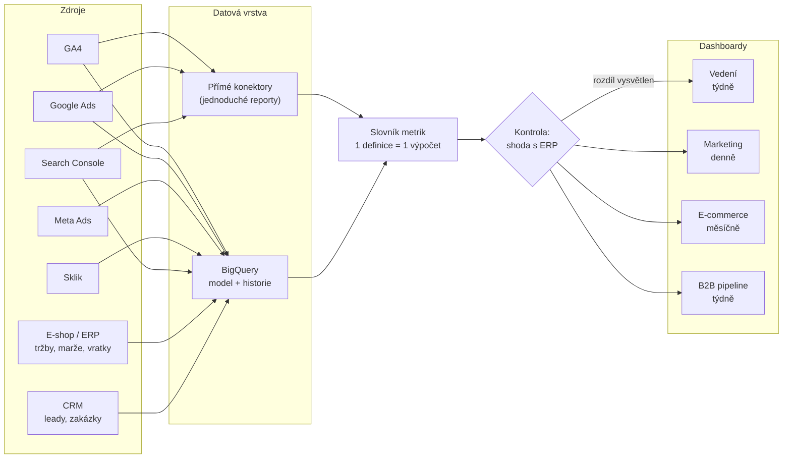

# LP 08: Dashboardy a reporting – zadání obsahu
> Stav: návrh v1 (8. 10. 2026) · Priorita: B · URL: `/sluzby/dashboardy-a-reporting` · Segmenty: e-shopy · B2B / lead-gen · velké firmy

> **Důležitá změna názvu nástroje:** Google v dubnu 2026 přejmenoval **Looker Studio zpět na Data Studio** (nová adresa `datastudio.google.com`, stará se přesměrovává, reporty fungují dál). Lidé ale v datech Ahrefs (průměr 12 měsíců) stále hledají hlavně „looker studio“ (1 400/měs.). Na LP proto používáme **„Data Studio (dříve Looker Studio)“** – v H2, FAQ, alt textech a meta description. Doporučuji stejně upravit architekturu (kap. 1, 2 – popisek „Dashboardy a reporting (Looker Studio, Power BI)“), slovníkové heslo `/slovnik/looker-studio` a titulky článků G1/G2 (URL ponechat).

---

## 0. Shrnutí

**Účel stránky.** Získat poptávky na dashboardy a reporting na míru od firem, které mají data rozházená v GA4, reklamních systémech, e-shopu a CRM a nevěří reportům. Stránka staví na tom, co šablonové reporty nemají: **definované KPI, slovník metrik, sladění s účetnictvím a hlídanou kvalitu dat**. Nástroj (Data Studio, nebo Power BI) volíme podle ekosystému klienta.

**Komu je určena (persony):**
| Persona | Situace | Co hledá / co ho přesvědčí |
|---|---|---|
| **CMO / Head of marketing e-shopu** | Každé pondělí ruční Excel z GA4, Ads, Mety, Skliku a administrace; tři systémy ukazují tři různá čísla | „marketingový dashboard“, „looker studio dashboard na míru“, „ppc reporting“; přesvědčí ho galerie ukázek a sekce „report, který sedí s účetnictvím“ |
| **CEO / CFO** | Chce jednu obrazovku, které může věřit; nezajímá ho kliknutí, ale marže a návratnost | Rekonciliace s ERP, PNO/POAS, týdenní e-mail s přehledem |
| **Obchodní / marketingový ředitel v B2B** | Marketing vykazuje leady, obchod zakázky v CRM, nikdo je nespojí | Ukázka B2B pipeline dashboardu (lead → zakázka, cena za zakázku) |
| **Head of BI ve velké firmě** | Firemní standard je Power BI, marketingová data v něm chybí nebo jsou nespolehlivá | Napojení na BigQuery/Power BI, slovník metrik, řízení přístupů |

**Hlavní konverze:** formulář `form_id: lp-dashboardy` (téma „BigQuery & dashboardy“), telefon. **Sekundární:** prohlížení galerie ukázek, články G2 *Looker Studio vs. Power BI* a G3 *Marketingový dashboard: jaké KPI sledovat*.

**Proč tahle stránka vyhraje nad konkurencí:**
1. **SERP „looker studio dashboard na míru“ obsadili freelanceři a návody** (grou.cz, digikurz.cz, mariemullerova.cz, pavelszabo.cz – heslo slovníku, wemarket.cz), žádná datová agentura (analýza konkurence kap. 3.3). Na „marketingový dashboard“ rankují obecné články (clickup.com, pavelszabo.cz, observix.ai) a z agentur jen revolt.bi na 7. místě.
2. **BI firmy ukazují galerie, ale ne sběr dat.** revolt.bi má silnou galerii typových reportů, ale enterprise cenovou hladinu a webovou analytiku nedělá; datamind.cz má LP „Reporting a Power BI“ bez ukázek a bez FAQ; nextanalytica.cz prodává reporty jako předplatné svého produktu. My ukážeme galerii **a** to, odkud se čísla berou a proč sedí.
3. **„Report, který sedí s účetnictvím“ jako konkrétní metoda**, ne slogan: rekonciliační tabulka, zdroj pravdy pro každé číslo, dlaždice „shoda s ERP“. datanimals.com problém pojmenovává („report nesedí s účetnictvím“), ale postup neukazuje.
4. **Aktuálnost:** většina konkurence píše „Looker Studio“ nebo dokonce „Google Data Studio“ jako v roce 2022 (rajtmajer.cz). Stránka, která vysvětlí přejmenování z dubna 2026 a ceny obou nástrojů k 10/2026, bude pro AI přehledy i lidi důvěryhodnější.

---

## 1. SEO a meta

| Prvek | Návrh | Délka |
|---|---|---|
| **Title** | `Marketingový dashboard a reporting na míru \| datalayer.cz` | 57 znaků |
| **Meta description** | `Marketingový dashboard v Data Studiu (dříve Looker Studio) nebo Power BI, který sedí s účetnictvím. Data z GA4, Ads, Meta, Skliku i ERP. Konzultace zdarma.` | 155 znaků |
| **H1** | `Marketingové dashboardy a reporting na míru` | 43 znaků |
| **URL** | `/sluzby/dashboardy-a-reporting` | |
| **Breadcrumbs** | Domů › Služby › Dashboardy a reporting | |
| **Canonical** | `https://datalayer.cz/sluzby/dashboardy-a-reporting` | |

### 1.1 Klíčová slova
Zásada: **„power bi“ (8 900) a „looker studio“ (1 400) jsou převážně navigační dotazy** (lidé hledají přihlášení nebo stažení nástroje) – LP na ně necílí jako na hlavní KW. Cílíme na **kombinace se službou** a na problémové dotazy. Objemy: Ahrefs CZ, 8. 10. 2026.

| Typ | Klíčové slovo | Objem | Kde použít |
|---|---|---|---|
| Hlavní | marketingový dashboard (+ dashboard marketing, marketing dashboard) | 10–20 (SERP ověřen) | H1, title, rychlá odpověď, H2 galerie |
| Hlavní | looker studio dashboard na míru / looker studio dashboard | 20 (SERP ověřen) | podtitul („Data Studio, dříve Looker Studio“), H2 srovnání, alt mockupů |
| Hlavní | reporting (ppc reporting 80 · reporting ppc kampaní 70 · power bi reporting 90) | 240 | H1 („reporting“), H2 automatizace, segment e-shop |
| Vedlejší | power bi dashboard · power bi report | 100 · 100 (KD 82 / 9) | H2 srovnání, FAQ 3–4, galerie (filtr „Power BI“) |
| Vedlejší | kpi dashboard · kpi reporting · co je kpi report | 50 · 20 · 10 | Řešení krok 1 („KPI strom“), typy dashboardů |
| Vedlejší | google analytics dashboard · dashboard google analytics | 50 · 20 | Galerie (ukázka A), FAQ 6 |
| Vedlejší | sklik data studio | 100 | FAQ 9 („Sklik v Data Studiu“) |
| Vedlejší | data studio · google data studio · google looker studio | 150 · 200 · 500 | FAQ 1–2 (název a cena), srovnávací tabulka |
| Long-tail | automatický reporting · firemní reporting · obchodní reporting · ecommerce reporting | 10 každé | Sekce automatizace, typy dashboardů |
| Long-tail | power bi dashboard examples · dashboard template | 20 · 20 | Galerie („ukázky dashboardů“) – bez slibu šablon ke stažení |
| Long-tail | looker studio pricing · looker studio pro · looker studio free | 10 každé | FAQ 2 |
| Otázky (PAA) | Is Google Looker Studio free? · How much does Looker Studio cost? · Is Looker Studio now called Data Studio? | – | FAQ 1–2 |
| Otázky (PAA) | Kolik stojí Power BI? · Je Power BI zdarma? · Na co je Power BI? | – | FAQ 3 |
| Otázky | What are the limitations of Data Studio? · why is looker studio so slow · how to make looker studio faster | – | FAQ 8 |

### 1.2 Co na stránku NEpatří (kanibalizace)
| Dotaz / téma | Kam patří | Na LP jen |
|---|---|---|
| power bi (8 900), microsoft power bi, power bi desktop (350), power bi app/online/mac | nikam (navigační) | – |
| power bi kurz / školení (200 / 150) | nikam – školení klient nenabízí (případně fáze 2) | – |
| looker studio vs data studio (2 100), google looker studio vs data studio (900) | článek G1 `/blog/looker-studio-pruvodce` (sekce o přejmenování) | FAQ 1 (3 věty) |
| Looker Studio vs. Power BI do detailu | článek G2 `/blog/looker-studio-vs-power-bi` | srovnávací tabulka + odkaz |
| dashboard co to je (200), co je dashboard (150) | slovník + článek G3 | 1 věta v rychlé odpovědi |
| jaké KPI sledovat v e-shopu a B2B | článek G3 `/blog/marketingovy-dashboard` | typy dashboardů + odkaz |
| seo reporting (150), data studio seo report | SEO agentury; my jen ukázka F v galerii | – |
| azure data studio (150) | jiný produkt (Microsoft) – necílit | – |
| collabim data studio (100) | navigační (konektor Collabim) | – |
| oee kpi dashboard (80), power bi ve výrobě (60) | mimo cílové segmenty | – |
| BigQuery, datový sklad | LP 07 `/sluzby/bigquery` | sekce „Přímé konektory, nebo BigQuery?“ |

### 1.3 Strukturovaná data (JSON-LD)
> Rozšířený výsledek FAQ se ve Vyhledávání Google od 7. 5. 2026 nezobrazuje (changelog Search Central). `FAQPage` ponechat jen jako automaticky generovaný z FAQ komponenty. `ItemList` pro galerii **nedoporučuji** – ukázky nejsou produkty ani samostatné stránky.

```json
{
  "@context": "https://schema.org",
  "@graph": [
    {
      "@type": "Service",
      "@id": "https://datalayer.cz/sluzby/dashboardy-a-reporting#service",
      "name": "Dashboardy a reporting na míru",
      "serviceType": "Návrh a tvorba marketingových dashboardů a automatizovaného reportingu (Data Studio, Power BI)",
      "description": "Marketingové, manažerské, e-commerce a B2B dashboardy v Data Studiu (dříve Looker Studio) nebo Power BI napojené na GA4, Google Ads, Meta, Sklik a data e-shopu, CRM a ERP, sladěné s účetnictvím a s automatickou aktualizací.",
      "url": "https://datalayer.cz/sluzby/dashboardy-a-reporting",
      "provider": { "@type": "Organization", "@id": "https://datalayer.cz/#organization", "name": "datalayer.cz", "url": "https://datalayer.cz" },
      "areaServed": { "@type": "Country", "name": "CZ" },
      "availableLanguage": "cs",
      "audience": { "@type": "BusinessAudience", "audienceType": "E-shopy, B2B firmy, velké firmy" },
      "isRelatedTo": [
        { "@type": "Service", "@id": "https://datalayer.cz/sluzby/bigquery#service" },
        { "@type": "Service", "@id": "https://datalayer.cz/sluzby/audit-mereni#service" }
      ]
    },
    {
      "@type": "BreadcrumbList",
      "itemListElement": [
        { "@type": "ListItem", "position": 1, "name": "Domů", "item": "https://datalayer.cz/" },
        { "@type": "ListItem", "position": 2, "name": "Služby", "item": "https://datalayer.cz/sluzby" },
        { "@type": "ListItem", "position": 3, "name": "Dashboardy a reporting", "item": "https://datalayer.cz/sluzby/dashboardy-a-reporting" }
      ]
    },
    {
      "@type": "FAQPage",
      "mainEntity": [
        { "@type": "Question", "name": "Je Looker Studio totéž co Data Studio?", "acceptedAnswer": { "@type": "Answer", "text": "(text 1:1 ze sekce FAQ)" } },
        { "@type": "Question", "name": "Kolik stojí Power BI a je zdarma?", "acceptedAnswer": { "@type": "Answer", "text": "(text 1:1 ze sekce FAQ)" } }
      ]
    }
  ]
}
```

### 1.4 OG obrázek
1200 × 630 px, pozadí `#020d1e`. Vlevo stylizovaná obrazovka (piktogram `report`: 2 dlaždice – KPI číslo a spark-line, vpravo dole symbol sdílení) zvětšená na 260 px. Vpravo H1 „Marketingové dashboardy a reporting na míru“ (Inter 800, 52 px) a mono řádek `Data Studio · Power BI · sedí s ERP ✓` (`#00b0b0`). Dole 3 mini dlaždice s ukázkovými čísly (`PNO 18,1 %`, `POAS 2,3`, `shoda s ERP 99,6 %`).

---

## 2. Wireframe (pořadí sekcí)

```
┌──────────────────────────────────────────────────────────────────────┐
│ Breadcrumbs: Domů › Služby › Dashboardy a reporting                  │
├───────────────────────────────┬──────────────────────────────────────┤
│ [ report ] eyebrow             │ MOCKUP DASHBOARDU „Týdenní přehled“  │
│ H1 Marketingové dashboardy…    │ 4 KPI dlaždice + graf + tabulka      │
│ Podtitul                       │ kanálů + odznak „Sedí s ERP ✓ 0,4 %“ │
│ Rychlá odpověď                 │ štítek „ukázková data“               │
│ [ Konzultovat dashboard ] [ Prohlédnout ukázky ]                     │
├───────────────────────────────┴──────────────────────────────────────┤
│ TRUST BAR – 4 fakta                                                  │
├──────────────────────────────────────────────────────────────────────┤
│ SYMPTOMY – 6 karet                                                   │
├──────────────────────────────────────────────────────────────────────┤
│ GALERIE UKÁZEK (#ukazky) – 6 karet s náhledem, filtr: Vše / E-shop / │
│ B2B / Vedení / Kvalita dat; klik = lightbox s větším mockupem         │
├──────────────────────────────────────────────────────────────────────┤
│ ŘEŠENÍ – 6 kroků „Jak stavíme dashboard, kterému věří vedení“         │
├──────────────────────────────────────────────────────────────────────┤
│ DIAGRAM – zdroje → datová vrstva → slovník metrik → 4 dashboardy     │
├──────────────────────────────────────────────────────────────────────┤
│ REPORT, KTERÝ SEDÍ S ÚČETNICTVÍM – principy + rekonciliační tabulka   │
│ + můstkový graf (waterfall)                                          │
├──────────────────────────────────────────────────────────────────────┤
│ TYPY DASHBOARDŮ – tabulka 4 typů (management/marketing/e-com/B2B)    │
├──────────────────────────────────────────────────────────────────────┤
│ SROVNÁNÍ – Data Studio vs. Power BI (tabulka) + „Přímé konektory,    │
│ nebo BigQuery?“                                                      │
├──────────────────────────────────────────────────────────────────────┤
│ AUTOMATIZACE – 4 bloky (aktualizace, doručení, upozornění, kvalita)  │
├──────────────────────────────────────────────────────────────────────┤
│ CO DOSTANETE · POSTUP A DÉLKA                                        │
├──────────────────────────────────────────────────────────────────────┤
│ PŘÍPADOVÁ STUDIE · PRO KOHO (SegmentTabs)                            │
├──────────────────────────────────────────────────────────────────────┤
│ FAQ (12) · DO HLOUBKY · NAVAZUJÍCÍ SLUŽBY · KONTAKT                  │
└──────────────────────────────────────────────────────────────────────┘
```
**Proč galerie tak vysoko:** u dashboardů je ukázka nejsilnější argument (revolt.bi, datimo.ai, nextanalytica.cz – galerie/mockupy jsou jejich nejsilnější prvek). Návštěvník si nejdřív potřebuje „představit výstup“, teprve potom čte o postupu.

**Mobil (≤ 768 px):** hero mockup se zjednoduší na 2 KPI dlaždice + odznak „Sedí s ERP“ (graf a tabulka skryté); galerie = horizontální karusel s „peek“ efektem a tečkovou navigací (ovladatelný i tlačítky ← →); lightbox na celou obrazovku s tlačítkem Zavřít nahoře; tabulky srovnání jako karty; waterfall graf se otočí na svislé pruhy shora dolů; sticky lišta `Zavolat` · `Napsat`.

---

## 3. Obsah sekcí (detailně)

### 3.1 Hero (`HeroService`)
- **Eyebrow (mono):** `[ report ] Data a reporting`
- **H1:** Marketingové dashboardy a reporting na míru
- **Podtitul:** V Data Studiu (dříve Looker Studio) nebo v Power BI. Napojené na GA4, Google Ads, Metu, Sklik a na data e-shopu, CRM nebo ERP – s čísly, která sedí s účetnictvím a aktualizují se sama.
- **Rychlá odpověď (box, 55 slov):**
  > **Marketingový dashboard** je jedna obrazovka, na které vedení i marketing vidí tržby, náklady a výkon kanálů ze všech systémů najednou. Stavíme ho podle rozhodnutí, která má podpořit: definujeme KPI, napojíme zdroje, sladíme čísla s účetnictvím a nastavíme automatickou aktualizaci. Data Studio, nebo Power BI volíme podle toho, kde už vaše firma pracuje.
- **CTA1:** `[ Konzultovat dashboard ]` → `#kontakt`
- **CTA2:** `[ Prohlédnout ukázky ]` → `#ukazky`
- **Mikrocopy:** „Úvodní konzultace 30 min zdarma · Reporty i data zůstávají na vašich účtech“
- **Vizuální prvek – mockup dashboardu (HTML/SVG, ne screenshot, ukázková data):**
  - Záhlaví: „Týdenní přehled · 39. týden 2026“ + přepínač „Týden / Měsíc / Rok“ (jen vizuálně).
  - 4 KPI dlaždice: **Čisté tržby (ERP, bez DPH)** 1 184 600 Kč `▲ 6,2 % t/t` · **Marketingové náklady** 214 300 Kč · **PNO** 18,1 % · **POAS** 2,30.
  - Graf: 13 týdnů – sloupce = tržby (cyan `#00b0b0`), čára = náklady (oranžová `#ff7400`, tenká).
  - Mini tabulka kanálů (5 řádků, viz ukázka A v galerii).
  - **Odznak vpravo nahoře:** `✓ Sedí s ERP · rozdíl 0,4 %` (zelený akcent je jediná výjimka z palety – nebo cyan s fajfkou; designér rozhodne podle kontrastu).
  - Štítek `ukázková data` vpravo dole.
  - Animace: dlaždice se „naplní“ čísly (count-up 600 ms) jednou při načtení; `prefers-reduced-motion` → statické.
- **Měření:** `cta_click` (`dash_hero_konzultace`, `dash_hero_ukazky`).

### 3.2 Trust bar (`TrustBar`)
1. `[ zdroj pravdy ]` Tržby z účetnictví, rozdělení podle kanálů z GA4 a reklam – každé číslo má určený zdroj
2. `[ vaše účty ]` Reporty, datové zdroje i BigQuery na vašich účtech, ne na našich
3. `[ 2 nástroje ]` Data Studio i Power BI – doporučíme podle vašeho ekosystému
4. `[ slovník ]` Slovník metrik: jak přesně se počítá každé KPI
- *Volitelně:* `[DOPLNIT: počet dodaných dashboardů / klientů s reportingem]` – jen ověřené číslo.

### 3.3 Symptomy (`SymptomCards`)
- **H2:** Kdy je čas na nový reporting
- **Úvod:** Problém obvykle není v grafech, ale v datech pod nimi a v tom, že nikdo neví, které číslo platí.

| # | Piktogram | Nadpis | Text |
|---|---|---|---|
| 1 | Tabulka Excelu s hodinami nad ní | Pondělní Excel | Každý týden někdo hodiny kopíruje čísla z GA4, Ads, Mety a administrace do tabulky. Když onemocní, report nevyjde. |
| 2 | Tři displeje s různými čísly `412 · 289 · 356` | Tři systémy, tři čísla | Google Ads hlásí 412 konverzí, GA4 289 a e-shop 356 objednávek. Porada řeší, kdo má pravdu, místo toho, co dál. |
| 3 | Účtenka, na které je škrtnutý obrat a podtržená marže | Vedení vidí obrat, ne zisk | ROAS a PNO bez vratek, storen a nákupních cen. Kampaň s nejvyšším obratem může mít nejnižší marži. |
| 4 | Přesýpací hodiny nad grafem s ikonou ⚠ | Dashboard, který se načítá minutu | Report napojený přímo na GA4 zpomaluje a občas hlásí chybu. Konektor GA4 v Data Studiu podléhá kvótám Google Analytics Data API. |
| 5 | Trychtýř přerušený mezi „lead“ a „deal“ | Leady bez zakázek | Marketing vykazuje počet leadů, obchod zakázky v CRM. Kolik zakázek přinesla která kampaň, neukazuje nikdo. |
| 6 | Složka se 14 listy, na posledním „?“ | Report, který nikdo nečte | 14 stran a 60 grafů, ale žádné rozhodnutí. Dobrý dashboard odpoví na 3–5 otázek na první obrazovce. |

*Čísla v kartě 2 jsou ilustrativní – na webu ponechat bez štítku, je to modelová situace (ve stylu architektury kap. 4: „Meta hlásí o 40 % méně nákupů…“).*

### 3.4 Galerie ukázek (`DashboardGallery` – nová komponenta, kotva `#ukazky`)
- **H2:** Ukázky dashboardů: co uvidíte na obrazovce
- **Úvod:** Šest typických dashboardů, které stavíme. Data jsou **smyšlená**, struktura a metriky odpovídají reálným projektům. Klikněte na náhled pro detail.
- **Filtr (chips):** Vše · E-shop · B2B · Vedení · Kvalita dat · SEO (filtr skrývá karty, nemění URL; výchozí „Vše“).
- **Karta v mřížce:** náhled (mockup 16:10), název, 1 řádek „Pro koho“, mono štítky nástrojů (`data studio` / `power bi`), štítek `ukázková data`.
- **Lightbox po kliknutí:** větší mockup (max. šířka 1100 px), vpravo panel: Pro koho · Na jaké otázky odpovídá · KPI · Zdroje dat · Aktualizace · Interaktivita. Zavření Esc / tlačítko / klik mimo; fokus se vrací na kartu (přístupnost).
- **Mockupy:** vlastní HTML/SVG v brand barvách (tmavé pozadí `#051125`, dlaždice `#0b1a30`, čísla Inter 600, popisky Roboto Mono 11 px, grafy cyan + oranžová jako druhá řada). **Ne screenshoty** reálných klientů. Volitelně jedna ukázka ve „světlém“ režimu, aby bylo vidět, že dashboard může mít firemní barvy klienta.

**Ukázka A – Týdenní přehled pro vedení (e-shop)** · filtr: E-shop, Vedení · nástroj: Data Studio
- *Pro koho:* majitel, CEO, CFO; čte se v pondělí ráno (e-mailem jako PDF + odkaz).
- *Otázky:* Rosteme? Vyplácí se marketing po odečtení nákladů a marže? Sedí čísla s účetnictvím?
- *KPI (39. týden 2026, ukázková data):* Čisté tržby 1 184 600 Kč (▲ 6,2 % t/t, ▲ 11,8 % r/r) · Hrubý zisk 492 900 Kč (marže 41,6 %) · Marketingové náklady 214 300 Kč · PNO 18,1 % · POAS 2,30 · Objednávky 1 412 · Průměrná objednávka 839 Kč · Shoda s ERP 99,6 %.
- *Tabulka kanálů (alokované tržby):*

| Kanál | Tržby | Náklady | PNO |
|---|---|---|---|
| Google Ads | 512 300 Kč | 98 400 Kč | 19,2 % |
| Meta | 241 800 Kč | 61 200 Kč | 25,3 % |
| Sklik | 118 500 Kč | 22 900 Kč | 19,3 % |
| Srovnávače (Heureka, Zboží.cz) | 96 400 Kč | 31 800 Kč | 33,0 % |
| Organika a přímé návštěvy | 215 600 Kč | – | – |
| **Celkem** | **1 184 600 Kč** | **214 300 Kč** | **18,1 %** |

- *Layout:* nahoře 4 dlaždice, pod nimi graf 13 týdnů (tržby vs. náklady), dole tabulka kanálů s podmíněným formátováním PNO (nad cílovým PNO 25 % = oranžově).
- *Zdroje:* ERP (tržby, marže), GA4 (podíly kanálů), Google Ads, Meta, Sklik, srovnávače (náklady).

**Ukázka B – Náklady a výnosy kampaní napříč systémy** · filtr: E-shop · nástroj: Data Studio / Power BI
- *Pro koho:* PPC specialisté, marketingový manažer; denně / týdně.
- *Otázky:* Které typy kampaní vydělávají po marži? Jak čerpáme měsíční rozpočet?
- *Data (září 2026, ukázková):*

| Kampaň / kanál | Náklady | Tržby (alok.) | Hrubý zisk | ROAS | POAS |
|---|---|---|---|---|---|
| Google Ads – Search | 182 400 Kč | 1 094 000 Kč | 448 500 Kč | 6,0 | 2,46 |
| Google Ads – Performance Max | 236 100 Kč | 1 180 500 Kč | 413 200 Kč | 5,0 | 1,75 |
| Meta – akvizice | 148 900 Kč | 521 200 Kč | 203 300 Kč | 3,5 | 1,37 |
| Meta – remarketing | 41 200 Kč | 288 400 Kč | 118 200 Kč | 7,0 | 2,87 |
| Sklik – Vyhledávání | 64 800 Kč | 401 800 Kč | 168 800 Kč | 6,2 | 2,60 |

- *Doplňkový prvek:* „Čerpání rozpočtu“ – progress bar 78 % vyčerpáno k 23. dni (plán 77 %).
- *Callout v mockupu (ukázkový insight):* „Performance Max má po odečtení marže nižší návratnost než vyhledávání.“
- *Zdroje:* Google Ads, Meta, Sklik (přes BigQuery), ERP marže, GA4.

**Ukázka C – Produkty, marže a vratky** · filtr: E-shop · nástroj: Power BI / Data Studio
- *Pro koho:* category manažer, nákup, e-commerce manažer; měsíčně.
- *Otázky:* Které kategorie táhnou zisk a které ho „vracejí“?
- *Data (září 2026, ukázková):*

| Kategorie | Tržby | Marže | Podíl vratek |
|---|---|---|---|
| Sedačky | 1 840 200 Kč | 34 % | 9,8 % |
| Postele | 1 212 600 Kč | 38 % | 4,1 % |
| Osvětlení | 352 900 Kč | 45 % | 6,5 % |
| Doplňky | 486 300 Kč | 52 % | 2,2 % |

- *Vizuál v mockupu:* bublinový graf (osa X marže, osa Y podíl vratek, velikost bubliny = tržby) + tabulka top 10 produktů s „čistou marží po vratkách“.
- *Zdroje:* ERP / e-shop (nákupní ceny, vratky), GA4 (zobrazení produktu → nákup).

**Ukázka D – B2B pipeline: od leadu k zakázce** · filtr: B2B, Vedení · nástroj: Power BI / Data Studio
- *Pro koho:* obchodní ředitel, marketing; týdně.
- *Otázky:* Kolik stojí zakázka z jednotlivých kanálů? Kde se leady ztrácejí?
- *Data (Q3 2026, ukázková):* trychtýř **1 240 leadů → 410 kvalifikovaných (33,1 %) → 96 nabídek → 31 zakázek**; cena za lead 1 190 Kč; cena za zakázku 47 600 Kč; medián doby od leadu k zakázce 38 dní; hodnota zakázek 9 860 000 Kč.

| Zdroj | Leady | Zakázky |
|---|---|---|
| Google Ads | 520 | 14 |
| LinkedIn | 310 | 6 |
| Organika | 280 | 8 |
| Sklik | 130 | 3 |
| **Celkem** | **1 240** | **31** |

- *Zdroje:* formulář na webu (`generate_lead` s `lead_id`), CRM (stav leadu, hodnota zakázky), Google Ads, LinkedIn, Sklik (náklady).

**Ukázka E – Zdraví měření (kvalita dat)** · filtr: Kvalita dat · nástroj: Data Studio
- *Pro koho:* marketing ops, analytik, vývojáři; denně automaticky, člověk jen při alertu.
- *Otázky:* Měří web správně? Nerozbil poslední release nákupy nebo souhlas?
- *Ukázkové hodnoty:* Shoda objednávek GA4 vs. e-shop 86,2 % (cíl ≥ 85 %, stabilní 30 dní) · Podíl relací se souhlasem s analytikou 71 % · `purchase` bez `transaction_id` 0 · Duplicitní `transaction_id` 0 · `add_to_cart` bez `item_id` 0,4 % · Poslední publikovaná verze GTM: v147 (2. 10. 2026).
- *Graf:* počet událostí `purchase` za den proti 28dennímu průměru, 1 den označený `release v2.31 – pokles o 94 %, opraveno za 3 h` (ukázkový incident).
- *Navazuje na:* [Správa webu a měření](/sluzby/sprava-webu-a-mereni).

**Ukázka F – Organické vyhledávání a tržby** · filtr: SEO · nástroj: Data Studio
- *Pro koho:* marketing, SEO agentura klienta; měsíčně.
- *Otázky:* Rosteme mimo brand? Které stránky z organiky přinášejí tržby, ne jen kliky?
- *Ukázková data (září 2026):* 48 300 kliků (brandové 61 %, nebrandové 39 %) · 1,92 mil. zobrazení · CTR 2,5 % · tabulka top 10 vstupních stránek s tržbami z GA4.
- *Zdroje:* Search Console (hromadný export do BigQuery), GA4.
- *Poznámka:* rozdělení brand / nebrand počítáme vlastním pravidlem v BigQuery (seznam značek klienta), aby bylo stejné v čase.

- **Měření galerie:** nový event `gallery_open` (`item: a|b|c|d|e|f`, `filter`) – doplnit do architektury kap. 8; pokud se nepřidá, použít `diagram_interaction` s `diagram_id: dash-galerie`, `node: {item}`.

### 3.5 Řešení (`SolutionSteps`)
- **H2:** Jak stavíme dashboard, kterému věří vedení
- **Úvod:** Grafy jsou poslední krok. Nejdřív se domluvíme, co má dashboard rozhodovat a které číslo platí.
  1. **Od rozhodnutí ke KPI.** Na workshopu sepíšeme, kdo dashboard čte, jak často a jaké rozhodnutí podle něj dělá. Z toho vznikne strom KPI: nahoře 3–5 čísel pro vedení, pod nimi metriky pro marketing a obchod.
  2. **Slovník metrik a zdroj pravdy.** Ke každému číslu napíšeme definici, výpočet, zdroj a vlastníka. Tržby bereme z ERP nebo účetnictví, rozdělení podle kanálů z GA4 a reklamních systémů, leady a zakázky z CRM.
  3. **Datová vrstva.** U jednoduchých reportů stačí přímé konektory. Jakmile spojujete více zdrojů, potřebujete marži nebo historii delší než 14 měsíců, stavíme reporting nad [BigQuery](/sluzby/bigquery) – je rychlejší, levnější na kvóty a čísla se počítají jednou, na jednom místě.
  4. **Prototyp na vašich datech.** Nejdřív drátěný model obrazovek, pak klikací prototyp s reálnými daty. Dvě kola připomínek jsou součástí projektu.
  5. **Sladění s účetnictvím.** Vybraný měsíc porovnáme s účetnictvím řádek po řádku. Každý rozdíl vysvětlíme a necháme ho viditelný jako dlaždici „shoda s ERP“.
  6. **Automatizace a předání.** Nastavíme aktualizaci dat, rozesílání e-mailem, upozornění na anomálie a přístupová práva. Předáme dokumentaci a proškolíme lidi, kteří s dashboardem budou pracovat.
- **CTA:** `[ Probrat váš reporting ]` → `#kontakt` (`dash_reseni_konzultace`).

### 3.6 Diagram (`DataFlowDiagram`)
- **H2:** Odkud se čísla v dashboardu berou
- **Mermaid náhled:**


- **Zadání pro designéra:** zleva doprava 4 sloupce (Zdroje → Datová vrstva → Slovník metrik + kontrola → Dashboardy). Uzel „Kontrola: shoda s ERP“ jako kosočtverec s fajfkou; spojnice z něj na dashboardy cyan, z přímých konektorů tenčí šedé (naznačení „jen pro jednoduché reporty“). Dashboardy jako mini obrazovky s ikonou frekvence (kalendář: týdně / denně / měsíčně). Animace teček po spojnicích (CSS, reduced-motion = statické). Interaktivní uzly → tooltip; `diagram_interaction` (`diagram_id: dash-tok-dat`). Mobil: svisle.
- **Textový popis pod diagramem:** „Data z GA4, reklamních systémů, Search Console, e-shopu a CRM tečou buď přímými konektory, nebo přes BigQuery. Každá metrika má jednu definici ve slovníku metrik a před zobrazením v dashboardu se kontroluje proti účetnictví.“

### 3.7 Report, který sedí s účetnictvím (`ReconciliationBlock` – nová komponenta)
- **H2:** Report, který sedí s účetnictvím: jak to děláme
- **Úvodní odstavec:** GA4 nikdy neuvidí všechny objednávky – část lidí odmítne cookies, část používá blokátory a některé objednávky vzniknou po telefonu. Proto peníze v dashboardu nebereme z GA4. Bereme je z účetnictví nebo ERP a GA4 s reklamními systémy používáme k tomu, k čemu jsou dobré: rozdělit tržby podle kanálů a kampaní.
- **5 pravidel (číslovaný seznam s mono štítky):**
  1. `[ peníze ]` **Tržby z ERP, rozdělení z marketingu.** Absolutní čísla z účetnictví; podíly kanálů z GA4 a reklam. Předpoklad, že nezměřené objednávky se dělí podobně jako změřené, v dokumentaci výslovně uvedeme.
  2. `[ definice ]` **Jedna definice tržby.** Bez DPH, po stornech, s dopravou nebo bez – jak to má účetnictví. Totéž v GA4 (parametr `value`) a v reklamních systémech.
  3. `[ datum ]` **Stejné datum a časové pásmo.** Datum objednávky, ne fakturace (nebo naopak – podle účetnictví); časové pásmo Europe/Prague ve všech zdrojích.
  4. `[ vratky ]` **Vratky a storna tam, kam patří.** Přehled „podle data objednávky“ (výkon kampaně) i „podle data vratky“ (cash flow).
  5. `[ rozdíl ]` **Rozdíl je číslo, ne tajemství.** Dlaždice „shoda s ERP“ je přímo v dashboardu. Když se náhle změní, víte, že se rozbilo měření – ne že marketing přestal fungovat.
- **Rekonciliační tabulka (ukázkový příklad, září 2026, Kč bez DPH):**

| Řádek | Částka | Zdroj |
|---|---|---|
| Objednávky vytvořené na webu | 5 132 600 Kč | administrace e-shopu |
| − storna a nezaplacené objednávky | −178 900 Kč | e-shop |
| − vratky | −141 400 Kč | ERP |
| **= Čisté tržby (sedí s účetnictvím)** | **4 812 300 Kč** | ERP / účetnictví |
| Objednávky změřené v GA4 | 4 386 200 Kč | GA4 / BigQuery |
| Podíl změřených objednávek z webu | 85,5 % | výpočet 4 386 200 / 5 132 600 |

- **Vizuál – můstkový graf (waterfall), zadání pro designéra:** 4 sloupce zleva: „Objednávky na webu 5 132 600“ (plný cyan) → „Storna −178 900“ (oranžový, visící) → „Vratky −141 400“ (oranžový) → „Čisté tržby 4 812 300“ (plný cyan, tučně, štítek „= účetnictví“). Vedle samostatný sloupec „Změřeno v GA4 4 386 200“ (cyan obrys, šrafovaný) s popiskem „85,5 % objednávek z webu“. Osa Y v mil. Kč, mřížka `#0b1a30`. Inline SVG; na mobilu vodorovné pruhy pod sebou. Štítek „ukázkový příklad“.
- **Text pod grafem:** Jak velký rozdíl je normální, záleží na webu, liště souhlasu a zákaznících. Důležité je, aby byl stabilní a vysvětlený. Když nevíte, proč GA4 vidí o 30 % méně než e-shop, začněte [auditem měření](/sluzby/audit-mereni) – podrobnosti v článku [Proč nesedí čísla](/blog/proc-nesedi-data).

### 3.8 Typy dashboardů (`FeatureList` / tabulka)
- **H2:** Čtyři typy dashboardů, které stavíme nejčastěji

| Typ | Pro koho | Na co odpovídá | Klíčové KPI | Frekvence | Zdroje |
|---|---|---|---|---|---|
| **Manažerský přehled** | majitel, CEO, CFO | Rosteme? Vyplácí se marketing? Sedí čísla? | čisté tržby, hrubý zisk, marketingové náklady, PNO, POAS / cena za zakázku, shoda s ERP | týdně + měsíčně | ERP, GA4, reklamní systémy |
| **Marketingový dashboard** | marketing, PPC tým, agentura | Který kanál a kampaň vydělává po marži? Jak čerpáme rozpočet? | náklady, alokované tržby, ROAS, POAS, CPA, podíl nových zákazníků, čerpání rozpočtu | denně / týdně | Google Ads, Meta, Sklik, srovnávače, GA4, ERP |
| **E-commerce dashboard** | e-commerce a category manažer | Které produkty a kategorie táhnou zisk? Kde lidé odpadají? | konverzní poměr, košík → objednávka, průměrná objednávka, marže a vratky po kategoriích, kohorty | týdně / měsíčně | GA4 (e-commerce události), e-shop / ERP |
| **B2B pipeline** | obchodní ředitel, marketing | Kolik stojí zakázka? Kde se leady ztrácejí? | leady, kvalifikované leady, nabídky, zakázky, cena za lead / zakázku, doba do uzavření | týdně | formuláře (GA4), CRM, reklamní systémy |

- **Pod tabulkou:** Jaké KPI vybrat pro váš typ byznysu, rozebíráme v článku [Marketingový dashboard: jaké KPI sledovat v e-shopu a v B2B](/blog/marketingovy-dashboard).

### 3.9 Srovnání (`ComparisonTable`)
- **H2:** Data Studio (dříve Looker Studio), nebo Power BI?
- **Úvod:** Oba nástroje jsou dobré. Rozhoduje, kde už vaše firma pracuje, kdo bude dashboard číst a jak složité výpočty potřebujete.

| Kritérium | Data Studio (dříve Looker Studio) | Power BI |
|---|---|---|
| Cena nástroje | Zdarma; Data Studio Pro 9 USD za uživatele a projekt měsíčně | Power BI Desktop zdarma; Pro 14 USD za uživatele měsíčně, Premium Per User 24 USD (při roční platbě); kapacita Fabric podle velikosti |
| Sdílení s kolegy | Odkazem nebo pozvánkou na Google účet, plánované e-maily | Autor i čtenáři potřebují Pro / PPU, nebo musí být obsah v pracovním prostoru na kapacitě Fabric F64 a vyšší (pak stačí i licence Free) |
| Komu reporty patří | Ve verzi zdarma jednotlivým uživatelům (riziko při odchodu zaměstnance); v Pro organizaci a Google Cloud projektu | Pracovním prostorům ve vašem tenantovi Microsoft |
| GA4, Google Ads, Search Console | Nativní konektory Googlu (GA4 podléhá kvótám Data API) | GA4 přes konektor Google Analytics (Data API, v Desktopu „Implementation 2.0“); Google Ads a Search Console typicky přes BigQuery nebo konektor třetí strany |
| Meta, Sklik, Heureka | Partnerské (placené) konektory nebo přes BigQuery | Konektory třetích stran nebo přes BigQuery |
| BigQuery | Nativně, volitelně zrychlení BI Engine | Konektor Google BigQuery (Import i DirectQuery) |
| Výpočty a datový model | Vypočtená pole a spojování zdrojů – na složitou logiku je lepší BigQuery | Silný datový model (relace, jazyk DAX) |
| Řízení přístupu k řádkům | Filtr podle e-mailu čtenáře (row-level security) u podporovaných zdrojů | Row-Level Security |
| Ekosystém | Google Workspace, Google Sheets | Microsoft 365, Excel, Teams |
| Aktualizace dat | GA4 konektor: obnova cache po 1, 4 nebo 12 h; BigQuery od minut | Plánovaná obnova: 8× denně na sdílené kapacitě, až 48× denně na Premium / PPU / Fabric |
| **Kdy volíme** | Marketingový tým v Google ekosystému, sdílení s agenturou a vedením bez licencí, data hlavně z Googlu a BigQuery | Firma už má Power BI jako standard, finance a obchod pracují v Microsoftu, potřebujete složitý datový model |

- **Poznámka pod tabulkou:** Ceny podle webů Googlu a Microsoftu k 10/2026, bez DPH; Microsoft uvádí, že ceny na webu jsou orientační. Detailní srovnání: [Looker Studio vs. Power BI](/blog/looker-studio-vs-power-bi).
- **H3 pod tabulkou: Přímé konektory, nebo BigQuery?**
  - *Přímé konektory stačí,* když report čte 1–2 zdroje Googlu, stačí vám 14 měsíců historie a čte ho pár lidí.
  - *BigQuery doporučujeme,* když spojujete víc než 3 zdroje, potřebujete marži, vratky nebo CRM, report čte hodně lidí (kvóty GA4 Data API) nebo chcete stejná čísla v Data Studiu i Power BI. → [BigQuery a datový sklad pro marketing](/sluzby/bigquery)

### 3.10 Automatizace (`FeatureList`, 4 bloky)
- **H2:** Reporting, který běží sám
  1. **Aktualizace dat.** Nastavíme, jak čerstvá data potřebujete. U konektoru GA4 v Data Studiu se cache obnovuje po 1, 4 nebo 12 hodinách, u BigQuery i po minutách; v Power BI plánujeme obnovu podle licence (8× nebo až 48× denně). Na dashboardu je vždy vidět datum poslední aktualizace.
  2. **Doručení e-mailem.** Týdenní přehled přijde vedení v pondělí ráno jako PDF s odkazem. Data Studio Pro umí až 200 plánů doručení na report a doručení do Google Chatu; v Power BI používáme odběry (subscriptions).
  3. **Upozornění.** Když metrika překročí hranici (např. PNO nad cílem, pokles objednávek), přijde upozornění. Podle nástroje přes funkce Data Studio Pro, Power BI nebo vlastní kontrolu v BigQuery s odesláním do e-mailu či Slacku.
  4. **Hlídání kvality dat.** Dlaždice „shoda s ERP“ a „zdraví měření“ (ukázka E) odhalí rozbité měření dřív, než podle špatných čísel někdo rozhodne. Dlouhodobé hlídání: [Správa webu a měření](/sluzby/sprava-webu-a-mereni).
- **Vizuál:** 4 karty s line piktogramy (kalendář s šipkou obnovy, obálka, zvonek, štít s pulzní křivkou).

### 3.11 Co dostanete (`Deliverables`)
- **H2:** Co dostanete
  1. **Strom KPI a slovník metrik** – definice, výpočet, zdroj a vlastník každého čísla.
  2. **Dashboardy** v Data Studiu nebo Power BI (počet a typ podle zadání), ve firemních barvách, desktop i mobilní rozvržení.
  3. **Napojené zdroje** – přímé konektory nebo model v BigQuery (viz LP BigQuery).
  4. **Rekonciliační protokol** – porovnání vybraného měsíce s účetnictvím a vysvětlení rozdílů.
  5. **Automatizace** – aktualizace, e-mailové doručení, upozornění, přístupová práva.
  6. **Dokumentace** – jak dashboard číst, jak přidat uživatele, co dělat, když číslo nesedí.
  7. **Školení** – 60–90 minut pro uživatele, záznam ke sdílení.
  8. **Kontrola po 30 dnech** – krátká schůzka: co se používá, co upravit.

### 3.12 Postup a délka (`ProcessTimeline`)
- **H2:** Jak postupujeme a jak dlouho to trvá
- **Úvod:** Jeden až dva dashboardy nad přímými konektory trvají obvykle 2–4 týdny, reporting nad BigQuery s napojením ERP nebo CRM 4–8 týdnů. *(`[DOPLNIT: klient potvrdí typické délky]`)*

| # | Krok | Typická délka | Výstup | Co potřebujeme od vás |
|---|---|---|---|---|
| 1 | Workshop: rozhodnutí a KPI | 1–2 dny + 1 schůzka | Strom KPI, seznam čtenářů | 90 minut se zadavatelem a budoucími uživateli |
| 2 | Zdroje a slovník metrik | 3–5 dní | Slovník metrik, mapa zdrojů | Přístupy pro čtení (GA4, reklamní systémy), export z ERP/CRM nebo kontakt na IT |
| 3 | Drátěný model a prototyp | 1–2 týdny | Klikací prototyp na vašich datech | 2 kola připomínek |
| 4 | Napojení a sladění s účetnictvím | 1–2 týdny | Rekonciliační protokol | Kontrolní čísla z účetnictví za vybraný měsíc |
| 5 | Automatizace a předání | 2–3 dny | Aktualizace, doručení, práva, dokumentace | Seznam uživatelů a příjemců e-mailů |
| 6 | Kontrola po 30 dnech | 1 schůzka | Seznam úprav | Zpětnou vazbu uživatelů |

### 3.13 Případová studie (`MiniCase`)
- **H2:** Z praxe: [DOPLNIT]
- **Struktura:** Problém → Příčina → Oprava → Výsledek (číslo) + citace. Do dodání reálných dat sekci skrýt, nebo použít ukázku se štítkem `ukázkový příklad`:
  - *Ukázkový příklad:* „B2B výrobce: marketing vykazoval 400 leadů měsíčně, obchod si stěžoval na kvalitu. Po napojení CRM se ukázalo, že kampaň s nejlevnějším leadem nepřinesla za čtvrtletí žádnou zakázku. Rozpočet se přesunul a cena za zakázku klesla.“ (bez konkrétního % do doby, než klient dodá skutečnou studii)
- **Placeholdery:** [DOPLNIT: typ klienta] · [DOPLNIT: výchozí stav – kolik hodin týdně reporting, jaký rozdíl proti ERP] · [DOPLNIT: co jsme postavili] · [DOPLNIT: výsledek číslem – např. ušetřené hodiny, rozdíl s ERP pod X %, změna rozpočtu] · [DOPLNIT: citace]

### 3.14 Pro koho (`SegmentTabs`)
- **H2:** Co je jinak u e-shopu, B2B a velké firmy
- **E-shop:** Řídíte se podle marže a vratek, ne podle obratu. Typicky stavíme týdenní přehled pro vedení, marketingový dashboard s POAS a e-commerce dashboard s kategoriemi. Náklady srovnávačů (Heureka, Zboží.cz) a Skliku napojíme stejně jako Google Ads a Metu. → [Měření pro e-shopy](/reseni/e-shopy)
- **B2B a leady:** Lead není výsledek. Dashboard spojí formulář na webu se stavem v CRM a ukáže cenu za kvalifikovaný lead a za zakázku podle kanálu – včetně dlouhých obchodních cyklů. → [Měření pro B2B a lead generation](/reseni/b2b-a-lead-generation)
- **Velká firma:** Dashboard musí zapadnout do firemního standardu (často Power BI), do řízení přístupů a do pravidel IT. Připravíme marketingová data jako čistý a zdokumentovaný model, se kterým může pracovat váš BI tým. → [Měření pro velké firmy](/reseni/velke-firmy)
- **Měření:** `cta_click` (`dash_segment_{eshop|b2b|velka-firma}`).

### 3.15 FAQ (12 otázek)
- **H2:** Časté otázky k dashboardům a reportingu

**1. Je Looker Studio totéž co Data Studio?**
Ano. Google v dubnu 2026 vrátil nástroji jeho původní název Data Studio. Původně se jmenoval Google Data Studio, v roce 2022 byl přejmenován na Looker Studio a teď je opět Data Studio s adresou datastudio.google.com. Stará adresa se automaticky přesměrovává a existující reporty fungují bez úprav. Jen pokud vaše firma omezuje přístup na externí weby přes proxy, musí IT povolit novou doménu. Na funkcích a cenách se přejmenováním nic nezměnilo.

**2. Je Data Studio zdarma? Kolik stojí Data Studio Pro?**
Data Studio je pro tvůrce i čtenáře reportů zdarma. Placená verze Data Studio Pro stojí podle Googlu 9 USD za uživatele a projekt měsíčně (10/2026). Přidává hlavně věci pro firmy: obsah patří organizaci místo jednotlivým uživatelům, týmové pracovní prostory, až 200 plánů doručení na report, upozornění, podporu Google Cloud a bezpečnostní funkce (vlastní šifrovací klíče, umístění dat). Pro většinu marketingových týmů stačí verze zdarma; Pro doporučujeme, když reporty spravuje víc lidí a vadí vám, že patří konkrétním osobám.

**3. Kolik stojí Power BI a je zdarma?**
Power BI Desktop pro tvorbu reportů je zdarma. Pro sdílení ale potřebujete licence: Power BI Pro stojí podle Microsoftu 14 USD za uživatele měsíčně a Premium Per User 24 USD (při roční platbě, 10/2026). Uživatelé s licencí Free mohou sdílený obsah číst jen tehdy, když je v pracovním prostoru na kapacitě Microsoft Fabric F64 nebo vyšší. Pokud už máte Microsoft 365 s Power BI, náklady na nástroj často odpadají. Microsoft upozorňuje, že ceny na webu jsou orientační – rozhoduje cena při nákupu.

**4. Data Studio, nebo Power BI – co pro nás bude lepší?**
Když pracujete hlavně v Google ekosystému (GA4, Google Ads, Workspace) a chcete sdílet reporty s vedením a agenturou bez licencí, vychází lépe Data Studio. Když je ve firmě standardem Microsoft, finance už mají reporty v Power BI nebo potřebujete složitý datový model s mnoha vazbami, volíme Power BI. Nad modelem v BigQuery fungují oba nástroje, takže volba není definitivní – stejná čísla mohou být v obou. Doporučení vždy zdůvodníme na úvodní konzultaci.

**5. Proč se čísla v dashboardu liší od GA4 nebo Google Ads?**
Každý systém počítá jinak. Google Ads připisuje konverzi ke dni kliknutí a vlastní atribucí, GA4 vidí jen návštěvníky se souhlasem a bez blokátorů a jeho rozhraní některá čísla odhaduje nebo modeluje, e-shop zná i objednávky po telefonu. Proto v dashboardu bereme tržby z účetnictví nebo ERP a ze systémů jen podíly kanálů. Rozdíly sepíšeme v rekonciliačním protokolu a necháme je viditelné. Když je rozdíl velký nebo nestabilní, je to signál pro [audit měření](/sluzby/audit-mereni).

**6. Potřebujeme BigQuery, nebo stačí přímé konektory?**
Pro jednoduchý report nad GA4 a Google Ads stačí přímé konektory. BigQuery doporučujeme, když spojujete víc zdrojů (Meta, Sklik, ERP, CRM), potřebujete marži a vratky, delší historii, než dovolí GA4, nebo report otevírá hodně lidí – konektor GA4 v Data Studiu podléhá kvótám Google Analytics Data API (standardní property má např. 200 000 tokenů denně) a při velkém provozu hlásí chyby. V BigQuery se čísla počítají jednou a dashboard jen zobrazuje hotové tabulky.

**7. Jak často se data v dashboardu aktualizují?**
Podle zdroje a nástroje. V Data Studiu se data z GA4 obnovují v intervalu 1, 4 nebo 12 hodin, data z ostatních reklamních a měřicích produktů Googlu po 12 hodinách a data z BigQuery i po minutách. V Power BI se plánuje obnova až 8× denně na sdílené kapacitě a až 48× denně na Premium, PPU nebo Fabric kapacitě. Pro většinu manažerských přehledů stačí denní aktualizace; častější má smysl jen tam, kde podle dat někdo během dne opravdu jedná.

**8. Proč se náš dashboard v Data Studiu načítá pomalu nebo hlásí chybu?**
Nejčastěji ze tří důvodů: report má desítky grafů napojených přímo na GA4 a vyčerpává kvóty Data API; spojuje (blenduje) velké zdroje přímo v prohlížeči; nebo čte surová data místo připravených tabulek. Řešením je přesunout výpočty do BigQuery, použít extrahovaný zdroj dat (snímek až 100 MB), zjednodušit úvodní stránku a nastavit rozumnou čerstvost dat. U BigQuery lze reporty zrychlit službou BI Engine. Před přestavbou uděláme rychlou diagnostiku, co přesně report zpomaluje.

**9. Umíte napojit Sklik, Heureku, Shoptet nebo naše CRM?**
Ano, pokud mají API nebo export. Pro Sklik Google žádný vlastní konektor nenabízí, proto náklady stahujeme přes Sklik API do BigQuery (konektory třetích stran bývají placené – jejich dostupnost a spolehlivost ověříme). Heureku a Zboží.cz napojujeme přes exporty nebo rozhraní, které váš účet nabízí, e-shopové platformy (Shoptet, Upgates, WooCommerce, Shopify) přes export objednávek nebo API a CRM (Pipedrive, HubSpot, Raynet a další) přes API. Konkrétní zdroje ověříme na úvodní konzultaci. `[DOPLNIT: klient potvrdí platformy, se kterými má zkušenost]`

**10. Komu bude dashboard patřit a kdo ho může upravovat?**
Vám. Reporty zakládáme na vašich firemních účtech (Google Workspace nebo Microsoft 365) a datové zdroje na vašem projektu v Google Cloudu. V bezplatném Data Studiu reporty vlastní konkrétní uživatel – proto je zakládáme pod firemním účtem, ne pod osobním účtem zaměstnance ani pod naším. Práva upravovat dostanou lidé, které určíte; my si necháme přístup jen po dobu spolupráce. Součástí předání je seznam všech přístupů.

**11. Jak dlouho to trvá a co od nás potřebujete?**
Jeden až dva dashboardy nad přímými konektory obvykle 2–4 týdny, reporting nad BigQuery s napojením ERP nebo CRM 4–8 týdnů. Potřebujeme 90 minut na úvodní workshop s lidmi, kteří budou dashboard číst, přístupy pro čtení do GA4 a reklamních systémů, export nebo API k e-shopu, ERP či CRM, kontrolní čísla z účetnictví za jeden měsíc a dvě kola připomínek k prototypu.

**12. Jak se tvoří cena?**
Cenu stanovíme po úvodní konzultaci jako pevnou částku. Rozhoduje počet dashboardů a obrazovek, počet a typ zdrojů (Google zdroje jsou rychlé, ERP bez API pracnější), jestli potřebujete BigQuery a sladění s účetnictvím, zvolený nástroj a rozsah automatizace. Licence nástrojů (Data Studio Pro, Power BI) a provoz BigQuery platíte přímo Googlu nebo Microsoftu. Následnou údržbu a úpravy můžeme dělat průběžně.

- **Interakce:** akordeon, `faq_open`.

### 3.16 Do hloubky (`RelatedArticles`)
1. [Looker Studio pro marketing](/blog/looker-studio-pruvodce) *(doporučeno upravit titulek na „Data Studio (dříve Looker Studio) pro marketing“)*
2. [Looker Studio vs. Power BI](/blog/looker-studio-vs-power-bi)
3. [Marketingový dashboard: jaké KPI sledovat v e-shopu a v B2B](/blog/marketingovy-dashboard)
4. [Proč nesedí čísla: GA4 vs. Google Ads vs. Meta vs. administrace e-shopu](/blog/proc-nesedi-data)
5. [Atribuce v GA4 a reklamních systémech](/blog/atribuce-ga4)
- Slovník: [Data Studio (Looker Studio)](/slovnik/looker-studio) · [Power BI](/slovnik/power-bi) · [Atribuční model](/slovnik/atribucni-model)

### 3.17 Navazující služby (`RelatedServices`)
1. **[BigQuery a datový sklad](/sluzby/bigquery)** – *surová data bez limitů GA4.* Model, na kterém dashboard stojí.
2. **[Audit měření](/sluzby/audit-mereni)** – *zjistíme, kde data utíkají.* Když rozdíl proti e-shopu není vysvětlitelný.
3. **[Správa webu a měření](/sluzby/sprava-webu-a-mereni)** – *hlídáme, aby měření nepřestalo fungovat.* Aby dashboard ukazoval pravdu i po dalším releasu.

---

## 4. Kontaktní blok

| Prvek | Hodnota |
|---|---|
| `form_id` | `lp-dashboardy` *(nové ID – v tabulce 3.5 je zatím společné `lp-bigquery`; doporučuji rozdělit kvůli vyhodnocení LP)* |
| Předvybrané téma (`tema`) | `bigquery` (chip „BigQuery & dashboardy“) |
| Eyebrow | `[ Kontakt ]` |
| H2 | **Propojíme data do jednoho dashboardu** (z tabulky 3.5 – ponechat) |
| Lead text | Napište nám, zavolejte, nebo vyplňte formulář. Na úvodní 30minutové konzultaci projdeme, co dnes reportujete a z jakých zdrojů, a doporučíme nástroj i rozsah – nezávazně a zdarma. |
| Placeholder zprávy | Např. chceme spojit GA4, Google Ads, Metu a data z ERP v Data Studiu (Looker Studiu). Report dnes děláme ručně v Excelu… *(upravená verze textu z tabulky 3.5 – aktualizovat tabulku)* |
| Poznámka pod tlačítkem | Ozveme se do 1 pracovního dne. |

---

## 5. Interní odkazy

### 5.1 Odchozí
| Cíl | Anchor | Umístění |
|---|---|---|
| `/sluzby/bigquery` | BigQuery / BigQuery a datový sklad pro marketing | Řešení krok 3; „Přímé konektory, nebo BigQuery?“; Navazující služby |
| `/sluzby/audit-mereni` | auditem měření / audit měření | Sekce účetnictví; FAQ 5; Navazující služby |
| `/sluzby/sprava-webu-a-mereni` | Správa webu a měření | Galerie E; Automatizace; Navazující služby |
| `/reseni/e-shopy`, `/reseni/b2b-a-lead-generation`, `/reseni/velke-firmy` | Měření pro e-shopy / B2B a lead generation / velké firmy | SegmentTabs |
| `/blog/looker-studio-pruvodce` | Looker Studio pro marketing | Do hloubky |
| `/blog/looker-studio-vs-power-bi` | Looker Studio vs. Power BI | Pod srovnávací tabulkou; Do hloubky |
| `/blog/marketingovy-dashboard` | Marketingový dashboard: jaké KPI sledovat | Pod typy dashboardů; Do hloubky |
| `/blog/proc-nesedi-data` | Proč nesedí čísla | Sekce účetnictví; Do hloubky |
| `/blog/atribuce-ga4` | Atribuce v GA4 a reklamních systémech | Do hloubky |

### 5.2 Příchozí
| Zdroj | Anchor | Kde |
|---|---|---|
| Homepage, mega-menu | Dashboardy a reporting – *report, kterému věří vedení* | Karta služby |
| `/sluzby` (hub) | Marketingové dashboardy a reporting na míru | Sloupec „Data a reporting“ |
| `/sluzby/bigquery` | Dashboardy a reporting | Řešení krok 6; Navazující služby |
| `/reseni/e-shopy` | dashboard s marží a POAS | Sekce reportingu |
| `/reseni/b2b-a-lead-generation` | B2B dashboard od leadu k zakázce | Sekce CRM |
| `/sluzby/audit-mereni` | dashboard, který sedí s účetnictvím | Navazující služby |
| Články G1, G2, G3, D6 | marketingový dashboard na míru / dashboard v Data Studiu na míru | CTA box uprostřed článku (cílová LP clusteru G) |
| Slovník `/slovnik/looker-studio`, `/slovnik/power-bi` | dashboardy a reporting na míru | Konec hesla |

---

## 6. Co dodá klient
- [DOPLNIT] Reálná případová studie reportingu (výchozí stav, řešení, výsledek číslem, citace se souhlasem).
- [DOPLNIT] Volitelně 1–2 anonymizované screenshoty skutečných dashboardů (se souhlasem klienta, po rozmazání čísel) – mohou doplnit stylizované mockupy.
- [DOPLNIT] Potvrzení, zda klient staví i v Power BI (nebo jen Data Studio) – podle toho upravit srovnávací tabulku a texty „volíme podle ekosystému“.
- [DOPLNIT] Seznam platforem a CRM, se kterými má zkušenost (FAQ 9).
- [DOPLNIT] Typické délky projektů (tabulka 3.12).
- [DOPLNIT] Zda nabízí následnou údržbu a úpravy dashboardů (FAQ 12, sekce Automatizace).
- [DOPLNIT] Počet dodaných dashboardů / klientů (trust bar) – jen pravdivé číslo.

---

## 7. Měření stránky

| Událost | Parametry | Hodnoty |
|---|---|---|
| `cta_click` | `cta_id`, `cta_text`, `section` | `dash_hero_konzultace`, `dash_hero_ukazky` (hero) · `dash_reseni_konzultace` (reseni) · `dash_segment_eshop` / `_b2b` / `_velka-firma` (segmenty) · `dash_related_{slug}` · `dash_article_{slug}` |
| `gallery_open` *(nový)* | `item`, `filter` | `item`: `a-vedeni`, `b-kampane`, `c-marze`, `d-b2b`, `e-kvalita-dat`, `f-seo`; `filter`: `vse`, `eshop`, `b2b`, `vedeni`, `kvalita`, `seo` |
| `diagram_interaction` | `diagram_id`, `node` | `dash-tok-dat` (uzly zdrojů, `bigquery`, `konektory`, `slovnik`, `kontrola-erp`, dashboardy); `dash-waterfall` (hover na sloupec) |
| `faq_open` | `question` | 12 otázek |
| `scroll_depth` | `percent` | 50, 90 |
| `lead_form_start` / `lead_form_error` / `generate_lead` | dle `05_formulare/` | `form_id: lp-dashboardy`, `form_location: /sluzby/dashboardy-a-reporting` |
| `contact_click` | `channel`, `section` | `phone` / `email` |

**Vyhodnocení:** podíl návštěv s `gallery_open` a jejich konverzní poměr na `generate_lead` (hypotéza: galerie zvyšuje konverzi); nejotevíranější ukázky → priorita pro případové studie.

---

## 8. Akceptační checklist
- [ ] Title 57 znaků, meta description 155 znaků, H1 obsahuje „dashboardy“ a „reporting“.
- [ ] Všude, kde se zmiňuje nástroj Googlu, je „Data Studio (dříve Looker Studio)“ – alespoň v podtitulu, H2 srovnání a FAQ 1; žádné „Google Data Studio“ jako aktuální název bez kontextu.
- [ ] Ceny Data Studio Pro a Power BI znovu ověřené v den publikace (cloud.google.com/data-studio, microsoft.com/power-platform/products/power-bi/pricing) + poznámka o orientačních cenách.
- [ ] Všechny mockupy jsou HTML/SVG se štítkem „ukázková data“; žádná data reálných klientů bez souhlasu.
- [ ] Čísla v ukázkách jsou vnitřně konzistentní (součty tabulek, PNO = náklady / tržby, POAS = hrubý zisk / náklady) – zkontrolovat po případných úpravách.
- [ ] Galerie: ovladatelná klávesnicí, lightbox s `role="dialog"`, `aria-modal`, návrat fokusu, zavření Esc; na mobilu bez horizontálního scrollu stránky.
- [ ] Waterfall graf a diagram jako inline SVG s textovým popisem; `prefers-reduced-motion`.
- [ ] Self-referencing canonical, `BreadcrumbList`, `Service` validní; `FAQPage` jen generovaný z FAQ.
- [ ] Měření: `gallery_open` (nebo náhradní `diagram_interaction`), všechna `cta_id`, `faq_open`, formulář s `form_id: lp-dashboardy` ověřené v GTM Preview; nic před souhlasem.
- [ ] Formulář: téma „BigQuery & dashboardy“ předvybrané; tabulka 3.5 ve `05_formulare/` aktualizovaná (nové `form_id`, placeholder s Data Studiem).
- [ ] Výkon: mockupy bez externích knihoven grafů (inline SVG); LCP < 2,5 s, CLS < 0,1 (rezervované rozměry mockupů), INP < 200 ms (lightbox bez těžkého JS).
- [ ] Interní odkazy na 3 LP, 5 článků a slovník funkční (nepublikované články skrýt).
- [ ] Architektura (kap. 1, 2) a slovník aktualizované o přejmenování na Data Studio.

---

## Zdroje
| Tvrzení | Zdroj | Ověřeno |
|---|---|---|
| Looker Studio přejmenováno v dubnu 2026 na Data Studio, URL datastudio.google.com, přesměrování, reporty není nutné upravovat, nutné povolit doménu v proxy | https://docs.cloud.google.com/data-studio/welcome · https://docs.cloud.google.com/data-studio/release-notes (16. 4. 2026) | 10/2026 |
| Data Studio zdarma pro tvůrce i čtenáře; Data Studio Pro 9 USD za uživatele a projekt měsíčně | https://cloud.google.com/data-studio | 10/2026 |
| Funkce Data Studio Pro: obsah organizace, týmové prostory, až 200 plánů doručení, Google Chat, upozornění, CMEK, data residency, 30denní zkušební verze | https://docs.cloud.google.com/data-studio/about-pro | 10/2026 |
| V Data Studiu (zdarma) vlastní reporty jednotliví uživatelé | https://docs.cloud.google.com/data-studio/link-pro-to-a-google-cloud-project-mau-version | 10/2026 |
| Konektor GA4 v Data Studiu podléhá kvótám GA4 Data API, bez segmentů a porovnání | https://docs.cloud.google.com/data-studio/connect-to-google-analytics | 10/2026 |
| Kvóty GA4 Data API: standard 200 000 tokenů/den, 40 000/h; 360: 2 000 000/den | https://developers.google.com/analytics/devguides/reporting/data/v1/quotas | 10/2026 |
| Čerstvost dat: GA4 1/4/12 h, ostatní reklamní a měřicí produkty Googlu 12 h, BigQuery od 1 minuty | https://docs.cloud.google.com/data-studio/manage-data-freshness | 10/2026 |
| Extrahovaný zdroj dat do 100 MB, BI Engine pro BigQuery, tipy na výkon | https://docs.cloud.google.com/data-studio/improve-performance | 10/2026 |
| Filtr podle e-mailu čtenáře (row-level data security) v Data Studiu | https://docs.cloud.google.com/data-studio/filter-by-email-address | 10/2026 |
| Power BI: Free / Desktop zdarma, Pro 14 USD, Premium Per User 24 USD (uživatel/měsíc, roční platba), Fabric kapacita variabilní; ceny orientační | https://www.microsoft.com/en-us/power-platform/products/power-bi/pricing | 10/2026 |
| Uživatelé Free mohou číst sdílený obsah jen v prostoru na Premium nebo Fabric F64+ kapacitě | https://learn.microsoft.com/en-us/power-bi/fundamentals/service-features-license-type | 10/2026 |
| Plánovaná obnova Power BI: 8× denně (sdílená kapacita), až 48× (Premium, PPU, Fabric) | https://learn.microsoft.com/en-us/power-bi/connect-data/refresh-data | 10/2026 |
| Power BI konektor Google Analytics podporuje GA4 přes Data API (Implementation 2.0) | https://learn.microsoft.com/en-us/power-query/connectors/google-analytics | 10/2026 |
| Power BI konektor Google BigQuery – GA, Import i DirectQuery | https://learn.microsoft.com/en-us/power-query/connectors/google-bigquery | 10/2026 |
| Sklik API (Drak, Fénix) | https://api.sklik.cz/drak/ | 10/2026 |
| Search Console hromadný export do BigQuery | https://support.google.com/webmasters/answer/12917675 | 10/2026 |
| Rozšířený výsledek FAQ se ve Vyhledávání Google nezobrazuje od 7. 5. 2026 | https://developers.google.com/search/updates | 10/2026 |
| Odběry (subscriptions) a upozornění v Power BI, nativní Google Ads konektor v Power BI | – | **neověřeno do detailu – na LP formulováno obecně; ověřit před publikací** |
| Přejmenování Google Data Studio → Looker Studio v roce 2022 (FAQ 1) | – | **obecně známé, primární zdroj v této analýze nedohledán – ověřit (historické release notes Data Studia) nebo větu zkrátit** |
