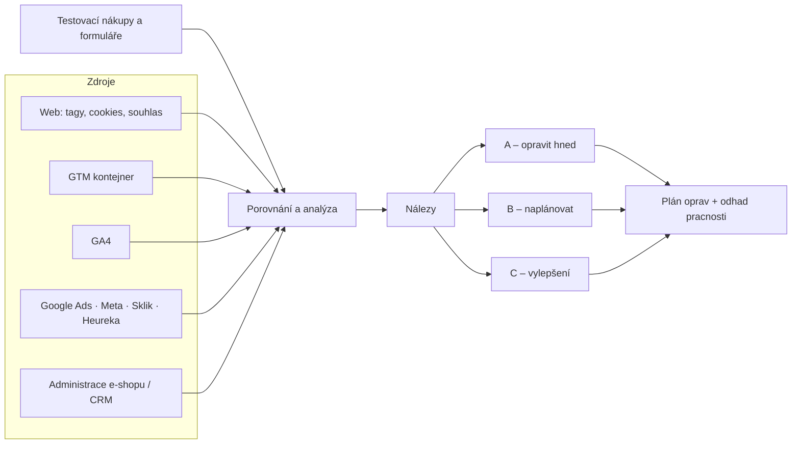

# LP 09: Audit měření – zadání obsahu
> Stav: návrh v1 (8. 10. 2026) · Priorita: A · URL: `/sluzby/audit-mereni` · Segmenty: e-shopy · B2B / lead-gen · velké firmy
> Navazuje na: `00_architektura-webu.md`, `05_formulare/specifikace-formularu.md`, články H2, D2, D3, C4, A6

---

## 0. Shrnutí

**Účel stránky:** Audit měření je **vstupní produkt** webu. Nezávislá kontrola GA4, GTM, souhlasu a konverzí v reklamních systémech, porovnaná s administrací e-shopu nebo CRM. Výstupem je report s nálezy A/B/C a plán oprav. Z auditu přirozeně navazují implementace (GA4, GTM, consent, server-side) a správa. Nízkoprahový první krok je **rychlá kontrola zdarma**.

**Pro koho:**
- **E-commerce / marketingový manažer**, který nevěří číslům: GA4, Google Ads, Meta a administrace ukazují každý něco jiného. Hledá „audit google analytics“, „audit webové analytiky“, „proč nesedí data“.
- **Marketingový ředitel při změně agentury, po nasazení nové cookie lišty nebo před redesignem:** chce vědět, v jakém stavu měření přebírá.
- **Vedení / finance / investor:** potřebuje nezávislé potvrzení, že rozpočty na reklamu stojí na platných datech (due diligence).

**Hlavní konverze:** formulář `lp-audit` (objednávka auditu). **Vstupní konverze:** rychlá kontrola zdarma (stejný formulář, režim `quick_check`). **Sekundární:** článek H2 *Co má obsahovat audit měření*, checklist D3.

**Rozhodnutí „rychlá kontrola zdarma“ – doporučuji ANO, s pravidly:**
| Pro | Proti | Jak riziko řídit |
|---|---|---|
| Konkurence nízkoprahový vstup má a funguje jim (marketingppc.cz: bezplatný consent audit přes Calendly; homoladigital.cz: analýza zdarma; gameplan.cz: placený, ale odečitatelný plán) | Čas specialisty na nekvalifikované poptávky | Omezit na kontrolu **zvenku bez přístupů** (20–30 min), pevný rozsah 3–5 nálezů, kapacita `[DOPLNIT: X kontrol měsíčně]` |
| Okamžitě ukáže odbornost: první nález je obvykle viditelný hned (tagy před souhlasem, zdvojený Google tag) | Riziko „audit zdarma = práce zdarma“ | Jasně říct, co kontrola **neobsahuje** (nákup, účty, porovnání dat) |
| Snižuje bariéru, když ceny na webu nejsou | – | Do budoucna poloautomatizovat nástrojem „kontrola consentu“ (`/nastroje`) |

**Proč tahle stránka vyhraje:**
1. Na „audit google analytics“ je 8. 10. 2026 č. 1 **visibility.cz** (na „ga4 audit“ č. 3 za zahraničními nástroji): šablonová LP s tvrzením „až 80 % firem má chyby“, bez ceny, bez ukázky reportu a bez FAQ. **rajtmajer.cz** má 350 slov bez vizuálů. Zbytek SERP tvoří **zahraniční automatické nástroje** (ga4auditor.com, vidi-corp.com), které neumí porovnat data s administrací ani otestovat nákup.
2. **digitalniarchitekti.cz** (analytický audit, 780 slov) nemá ukázku výstupu ani FAQ. **marketingppc.cz** audituje jen consent. **magnas.cz** má článek o auditu GTM bez CTA. My ukážeme **celý rozsah, strukturu reportu, prioritizaci A/B/C, seznam přístupů a délku**.
3. Na „audit měření webu“ Google vrací **SEO audity** (strafelda.cz, feo.cz…). Specializovaná LP s jasným názvem má šanci rychle obsadit pozice.

---

## 1. SEO a meta

| Prvek | Návrh |
|---|---|
| **Title** (58 zn.) | `Audit měření – GA4, GTM, consent a konverze | datalayer.cz` |
| **Meta description** (153 zn.) | `Nevěříte číslům v GA4? Audit měření prověří GA4, GTM, souhlas i konverze v Ads a Meta a porovná je s e-shopem. Nálezy s prioritou A/B/C. Kontrola zdarma.` |
| **H1** (42 zn.) | `Audit měření: GA4, GTM, consent a konverze` |
| **URL** | `/sluzby/audit-mereni` (301 z `/sluzby/audit`) |
| **Breadcrumbs** | Domů › Služby › Audit měření |

### 1.1 Klíčová slova
| Typ | Klíčové slovo | Objem | Kde použít |
|---|---|---|---|
| Hlavní | audit webové analytiky | 70 | H2 „Co v auditu kontrolujeme“, rychlá odpověď, meta (varianta) |
| Hlavní | audit měření (+ audit měření webu) | strategické | H1, title, URL |
| Hlavní | audit google analytics / google analytics audit | 10 / 10 | H3 „GA4“, FAQ 1, alt mockupu |
| Vedlejší | ga4 audit / audit google analytics 4 / ga4 tracking audit | SERP / 0 / 0 | H3 v oblasti GA4, title varianta pro A/B test |
| Vedlejší | free google analytics audit | 0 | sekce „Rychlá kontrola zdarma“ |
| Problémové | proč nesedí data v google analytics · ga4 nesedí tržby e-shop | 10 / SERP | symptom 1, FAQ 9, odkaz na D2 |
| Otázky | Does Google do audits? · How to create a GA4 report? (PAA – nízká relevance) · „Co obsahuje audit měření?“ | – | FAQ 1, odkaz na H2 |

### 1.2 Co na stránku NEpatří (kanibalizace)
| Dotaz / téma | Patří na | Na této LP |
|---|---|---|
| audit webu, seo audit, analýza webu, audit webu zdarma, audit rychlosti webu | LP `/sluzby/technicky-audit-webu` | jen věta ve FAQ 1 („rozdíl oproti SEO auditu“) + odkaz |
| gtm audit, audit google tag manager | LP GTM `#audit` + článek C4 | oblast B „GTM“ + odkaz („samostatný audit GTM“) |
| kontrola cookie lišty, consent audit | LP `/sluzby/cookie-lista-consent-mode` | oblast C „Souhlas“ (technická kontrola) + odkaz |
| proč nesedí data (vysvětlení příčin) | článek D2 `/blog/proc-nesedi-data` | symptom + FAQ 9 |
| co má obsahovat audit (obecně, ukázka) | článek H2 `/blog/co-obsahuje-audit-mereni` | LP ukazuje *náš* report. H2 je obecný průvodce a odkazuje sem |
| checklist kvality dat (25 kontrol) | článek D3 | odkaz „Chcete si to zkontrolovat sami?“ |

### 1.3 Strukturovaná data
```json
{
  "@context": "https://schema.org",
  "@graph": [
    {
      "@type": "Service",
      "@id": "https://datalayer.cz/sluzby/audit-mereni#service",
      "name": "Audit měření",
      "alternateName": ["Audit webové analytiky", "Audit Google Analytics 4"],
      "serviceType": "Audit webové analytiky a měření konverzí",
      "description": "Nezávislá kontrola GA4, Google Tag Manageru, souhlasu návštěvníků (Consent Mode v2) a konverzí v Google Ads, Meta a Skliku, porovnaná s administrací e-shopu nebo CRM. Report s nálezy seřazenými podle priority A/B/C a plán oprav.",
      "url": "https://datalayer.cz/sluzby/audit-mereni",
      "provider": { "@id": "https://datalayer.cz/#organization" },
      "areaServed": { "@type": "Country", "name": "Česko" },
      "availableLanguage": "cs",
      "hasOfferCatalog": {
        "@type": "OfferCatalog",
        "name": "Audit měření",
        "itemListElement": [
          { "@type": "Offer", "itemOffered": { "@type": "Service", "name": "Rychlá kontrola měření" } },
          { "@type": "Offer", "itemOffered": { "@type": "Service", "name": "Audit měření (GA4, GTM, consent, konverze, porovnání s e-shopem)" } }
        ]
      }
    },
    {
      "@type": "BreadcrumbList",
      "itemListElement": [
        { "@type": "ListItem", "position": 1, "name": "Domů", "item": "https://datalayer.cz/" },
        { "@type": "ListItem", "position": 2, "name": "Služby", "item": "https://datalayer.cz/sluzby" },
        { "@type": "ListItem", "position": 3, "name": "Audit měření", "item": "https://datalayer.cz/sluzby/audit-mereni" }
      ]
    },
    {
      "@type": "FAQPage",
      "mainEntity": [
        { "@type": "Question", "name": "Jaké přístupy k auditu potřebujete a je to bezpečné?", "acceptedAnswer": { "@type": "Answer", "text": "(text 1:1 z FAQ č. 4)" } }
        /* … ostatní otázky generovat z komponenty FAQ */
      ]
    }
  ]
}
```
Ceny ani `price: 0` do schématu nedávat (rozhodnutí klienta neuvádět ceny). FAQ rich results Google od 7. 5. 2026 nezobrazuje.

### 1.4 OG obrázek
Pozadí `#020d1e`. Vlevo piktogram Audit (lupa nad tagem s červeným ✕ a zeleným ✓). Vpravo H1 a pod ním tři štítky priorit `A 3` `B 5` `C 7` (A oranžová `#ff7400`, B cyan `#00ffff`, C šedá).

---

## 2. Wireframe

```
DESKTOP                                                   MOBIL
┌───────────────────────────────────────────────────┐    ┌──────────────────────┐
│ Breadcrumbs · [ Audity · audit měření ]           │    │ H1, podtitul, odpověď│
│ H1 · podtitul · rychlá odpověď                    │    │ CTA1 (plná šířka)    │
│ [ Objednat audit měření ] [ Rychlá kontrola zdarma]│    │ CTA2 (obrys)         │
│                  │ MOCKUP: strana reportu         │    │ mockup: 6 oblastí    │
│                  │ (semafor 6 oblastí + top 3 A)  │    │  jako řádky          │
├───────────────────────────────────────────────────┤    │ trust 2×2            │
│ TRUST BAR                                         │    │ kdy audit – 1 sl.    │
│ KDY SI AUDIT OBJEDNAT (6 karet)                   │    │ 6 oblastí – akordeon │
│ CO KONTROLUJEME – 6 oblastí (akordeon 2 sloupce)  │    │ diagram svisle       │
│   + testovací scénáře                             │    │ ukázka reportu:      │
│ DIAGRAM průběhu auditu                            │    │  karty nálezů        │
│ UKÁZKA VÝSTUPU (#ukazka-reportu)                  │    │ rychlá kontrola      │
│   struktura reportu · tabulka nálezů · A/B/C ·    │    │ …                    │
│   porovnání s administrací                        │    │ kontakt (režim podle │
│ RYCHLÁ KONTROLA ZDARMA vs. AUDIT (#rychla-kontrola)│    │  CTA)                │
│ CO DOSTANETE · POSTUP A DÉLKA · CO POTŘEBUJEME    │    ├──────────────────────┤
│ CASE · SEGMENTY · FAQ (12) · DO HLOUBKY · SLUŽBY  │    │ sticky Zavolat/Napsat│
│ KONTAKT lp-audit (přepínač: audit / kontrola)     │    └──────────────────────┘
└───────────────────────────────────────────────────┘
```

---

## 3. Obsah sekcí

### 3.1 Hero
- **Komponenta:** `HeroService` · **Eyebrow:** `[ Audity · audit měření ]`
- **H1:** Audit měření: GA4, GTM, consent a konverze
- **Podtitul:** Prověříme GA4, Google Tag Manager, souhlas návštěvníků a konverze v Google Ads, Meta a Skliku a porovnáme je s objednávkami v administraci nebo leady v CRM. Dostanete seznam nálezů seřazený podle dopadu a plán oprav.
- **Rychlá odpověď (55 slov):**
  > **Co je audit měření?** Nezávislá kontrola, zda analytická a reklamní data odpovídají skutečnosti. Prověřuje nastavení GA4 a Google Tag Manageru, chování tagů před souhlasem a po něm, konverze v reklamních systémech a jejich shodu s administrací e-shopu nebo CRM. Výstupem je report s nálezy seřazenými podle priority a plán oprav.
- **CTA1:** `[ Objednat audit měření ]` → `#kontakt` (režim audit) · **CTA2:** `[ Rychlá kontrola zdarma ]` → `#rychla-kontrola`
- **Mikrocopy:** Přístupy jen pro čtení · NDA na požádání · report vlastníte vy
- **Vizuální prvek – mockup strany reportu (HTML/SVG, fiktivní data, štítek „ukázka“):**
  - Hlavička: `Audit měření · vas-eshop.cz · září 2026` (mono).
  - **Semafor 6 oblastí** (řádky s barevnou tečkou a krátkým stavem): `GA4 ● oranžová – 2 nálezy A` · `GTM ● cyan – 4 nálezy B` · `Souhlas ● oranžová – 1 nález A` · `Reklamní systémy ● oranžová – 1 nález A` · `Shoda s administrací ● oranžová – rozdíl −10,4 %` · `Datová vrstva ● zelená – OK`.
  - **Top 3 nálezy** (karty s odznakem A): „Nákup se po návratu z platební brány neměří (−16 % plateb kartou)“ · „Meta Pixel se spouští před souhlasem“ · „Google Ads počítá nákup dvakrát (import z GA4 + tag Ads)“.
  - Animace: tečky semaforu se „rozsvěcují“ postupně, `prefers-reduced-motion` = statické.
  - Alt: „Ukázka první strany reportu auditu měření: stav šesti oblastí a tři nejzávažnější nálezy s prioritou A (fiktivní data).“
- **Měření:** `cta_click` (`audit_hero_objednat`, `audit_hero_kontrola`)

### 3.2 Trust bar
1. `[DOPLNIT: počet provedených auditů]`. Až bude ≥ 20–30 auditů, nahradit **agregovanou statistikou z vlastních auditů** (např. „X % auditovaných webů spouštělo reklamní tagy před souhlasem“). Jen reálná čísla, nikdy odhad.
2. **Testovací nákupy a formuláře** – ne jen kontrola nastavení
3. **Porovnání s administrací nebo CRM** – čísla proti realitě
4. **Přístupy jen pro čtení** – a po auditu je odeberete

### 3.3 Kdy si audit objednat
- **Komponenta:** `SymptomCards` · **H2:** Kdy se audit měření vyplatí

| # | Nadpis | Text | Piktogram | Štítek |
|---|---|---|---|---|
| 1 | Čísla nesedí | GA4, Google Ads, Meta a administrace ukazují čtyři různá čísla a nikdo neumí vysvětlit proč. | Čtyři sloupce různé výšky s `≠` | `≠` |
| 2 | Po nové cookie liště spadly konverze | Propad o desítky procent hned po nasazení lišty nebo po změně jejího nastavení. | Přepínač ON/OFF a graf s propadem | `consent` |
| 3 | Měníte agenturu nebo přebíráte web | Potřebujete vědět, co přebíráte: kdo má přístupy, co je nastavené, co nefunguje. | Dvě ruce předávající si klíč | `handover` |
| 4 | Chystáte redesign, migraci nebo server-side | Než se postaví nové měření, je dobré vědět, které chyby nepřenést. | Šipka mezi dvěma okny prohlížeče | `migration` |
| 5 | Vedení chce vědět, jestli data platí | Rozhodujete o rozpočtech na reklamu, investicích nebo akvizici podle dat z GA4 a reklamních systémů. | Graf s pečetí ✓ | `due diligence` |
| 6 | Kampaně se optimalizují na „divné“ konverze | Konverzí je víc než objednávek, nebo se do nich počítají mikrokonverze či stornované nákupy. | Terč se dvěma zásahy na stejném místě | `bidding` |

- **CTA:** „Nevíte, jestli potřebujete celý audit? → `[ Začněte rychlou kontrolou zdarma ]`“ → `#rychla-kontrola` (`audit_kdy_kontrola`)

### 3.4 Co v auditu kontrolujeme
- **Komponenta:** `FeatureList` jako akordeon (6 oblastí, 2 sloupce; mobil 1 sloupec, první otevřená) · **H2:** Co v auditu webové analytiky kontrolujeme
- **Úvod:** Audit nekončí u nastavení. Ověřujeme, co měření dělá v reálném provozu: projdeme web jako zákazník, uděláme testovací nákup nebo poptávku a výsledek porovnáme se všemi systémy.

**H3 A. GA4 (audit Google Analytics 4)**
- vlastnictví účtu a property, role a přístupy (kdo je administrátor)
- datové streamy, měna, časové pásmo, retence dat, redakce dat
- filtry interní návštěvnosti, filtr hostitelů, nežádoucí referraly (platební brány)
- klíčové události: co je klíčové, duplicity, správnost hodnot
- e-commerce: úplnost trychtýře, `transaction_id`, hodnota a měna, parametry položek
- podíl návštěv `(not set)` / Unassigned, kanálové seskupení, UTM
- měření napříč doménami, User-ID, osobní údaje v URL a událostech
- propojení s Google Ads, Search Console, BigQuery; nastavení souhlasu v Admin

**H3 B. Google Tag Manager a další kódy**
- inventura tagů, spouštěčů a proměnných, duplicity, nepoužívané položky
- kódy mimo GTM (šablona webu, pluginy, integrace platformy)
- Custom HTML a šablony třetích stran, verze, workspaces, oprávnění Publish
- dopad tagů na rychlost webu
- *Potřebujete jen GTM?* → [Audit GTM kontejneru](/sluzby/google-tag-manager#audit)

**H3 C. Souhlas a cookies (technická kontrola)**
- co se načte a jaké cookies vzniknou **před** souhlasem (síťové požadavky na Google, Meta, Seznam a další)
- Consent Mode v2: výchozí stav a aktualizace všech čtyř signálů, basic vs. advanced
- respektování odmítnutí, změny volby a odvolání souhlasu
- stav consent mode v diagnostice Google Ads a v nastavení souhlasu GA4
- *Nejde o právní posouzení.* Lištu a texty by měl posoudit váš právník. Technickou nápravu řeší [Cookie lišta a Consent Mode v2](/sluzby/cookie-lista-consent-mode).

**H3 D. Konverze v reklamních systémech**
- **Google Ads:** zdroj konverzí (tag Ads vs. import z GA4), primární a sekundární akce, hodnoty a měna, duplicity, rozšířené konverze, stav consent mode
- **Meta:** Pixel + Conversions API, deduplikace přes `event_id`, kvalita párování (Event Match Quality)
- **Sklik / Seznam:** konverzní a retargetingový kód vs. nový Seznam Event Measurement
- **Heureka, Zboží.cz:** konverzní kódy, Ověřeno zákazníky
- **TikTok, LinkedIn** a další podle toho, co používáte

**H3 E. Porovnání s administrací e-shopu nebo CRM**
- počet objednávek a tržby po dnech: GA4 vs. administrace za 30–90 dní
- rozpad podle platební metody, zařízení, prohlížeče a země (tam se chyby ukážou)
- u B2B: odeslané formuláře v GA4 vs. poptávky v CRM, předávání `gclid` / ID leadu
- vysvětlení rozdílu: kolik je očekávané (souhlas, blokace, storna) a kolik je chyba

**H3 F. Datová vrstva a technika**
- struktura datové vrstvy vs. schéma GA4, časování pushů, SPA
- server-side GTM (pokud je): odesílání, deduplikace, first-party cookies, Google Tag Gateway
- **testovací scénáře:** nákup kartou s návratem z brány · převodem · na dobírku · s kupónem · obnovení děkovací stránky · odeslání každého typu formuláře · přihlášení · odmítnutí a udělení souhlasu

- **Vizuální prvek:** každá oblast má piktogram a mono štítek (`ga4`, `gtm`, `consent`, `ads`, `reconcile`, `dataLayer`). Celkový počet kontrol uvést jen pokud ho klient potvrdí `[DOPLNIT: např. „62 kontrol“]`.
- **Odkaz pro „kutily“:** „Chcete si základ zkontrolovat sami? → [Checklist kvality dat v GA4: 25 kontrol](/blog/ga4-checklist-kvality-dat)“

### 3.5 Diagram – jak audit probíhá
- **Komponenta:** `DataFlowDiagram` · **H2:** Jak audit probíhá
- **Text:** Data ze všech systémů sbíháme do jednoho porovnání. Každý rozdíl buď vysvětlíme, nebo z něj je nález. Nálezy seřadíme podle dopadu a pracnosti.

- **Popis pro designéra:** zdroje vlevo jako sloupec 5 uzlů, uprostřed uzel „Porovnání“ (piktogram Audit), vpravo tři štítky priorit (A oranžová, B cyan, C šedá) a cílový uzel „Plán oprav“. Uzel „Testovací nákupy“ přichází shora (oranžová přerušovaná čára, náš rozdíl oproti automatickým nástrojům). Mobil svisle.
- **Alt:** „Schéma auditu: data z webu, GTM, GA4, reklamních systémů a administrace se spolu s testovacími nákupy porovnají, nálezy se seřadí do priorit A, B, C a vznikne plán oprav.“
- **Měření:** `diagram_interaction` (`diagram_id: audit_flow`)

### 3.6 Ukázka výstupu (kotva `#ukazka-reportu`)
- **Účel:** Nahradit cenu konkrétní představou o výstupu. Konkurence ukázku reportu na LP nemá.
- **Komponenta:** `Deliverables` (struktura) + 3× `ComparisonTable` + mockup · **H2:** Jak vypadá report z auditu
- **Štítek nad sekcí:** „Ukázka – fiktivní data“

**H3 Struktura reportu**
1. **Manažerské shrnutí** (1 strana): stav šesti oblastí, 5 nejdůležitějších nálezů, odhad dopadu na rozhodování
2. **Rozsah a metodika:** co jsme kontrolovali, období dat, testovací scénáře
3. **Nálezy podle oblastí:** u každého popis, důkaz (screenshot, síťový požadavek), dopad, doporučení, priorita, pracnost, kdo opraví
4. **Porovnání čísel:** GA4 vs. administrace / CRM vs. reklamní systémy, s vysvětlením rozdílů
5. **Plán oprav:** pořadí A → B → C, odhad pracnosti, závislosti (např. „nejdřív datová vrstva, pak tagy“)
6. **Přílohy:** inventura GTM, seznam cookies a požadavků před a po souhlasu, protokol testovacích scénářů

**H3 Ukázka tabulky nálezů** *(kompletní obsah, fiktivní data)*
| ID | Oblast | Nález | Dopad | Priorita | Pracnost | Kdo |
|---|---|---|---|---|---|---|
| A1 | Datová vrstva / GA4 | Nákup se neodešle po návratu z platební brány (karta) | GA4 nevidí 16 % plateb kartou, kampaně vypadají hůř | **A** | S | vývojář + my |
| A2 | Souhlas | Meta Pixel se spouští před volbou v cookie liště | Rozpor s § 89 odst. 3 ZEK (k posouzení právníkem), data bez souhlasu | **A** | S | my (GTM) |
| A3 | Google Ads | Nákup se počítá dvakrát: import z GA4 i tag Google Ads jako primární akce | Nadhodnocené konverze, chybná optimalizace nabídek | **A** | S | PPC + my |
| B1 | GA4 | Retence dat 2 měsíce | Meziroční explorace nejdou | **B** | S | my |
| B2 | GA4 | Platební brány jako referral | Zdroj nákupu se přepíše na bránu | **B** | S | my |
| B3 | Souhlas | Chybí signály `ad_user_data` a `ad_personalization` | Omezení publik a personalizace pro EHP | **B** | S | my |
| B4 | Sklik | Starý konverzní kód, Seznam Event Measurement nenasazen | Bez dopadu dnes, plánovaný přechod | **B** | M | my |
| C1 | GTM | 37 nepoužívaných tagů, bez názvosloví | Pomalejší správa, riziko chyb | **C** | M | my |
| C2 | GA4 | Chybí export do BigQuery | Bez historie nad 14 měsíců | **C** | S | my |

*Pracnost:* S = do 1 dne, M = 1–3 dny, L = více než 3 dny *(potvrdit klientem)*.

**H3 Co znamenají priority A, B, C**
| Priorita | Definice | Doporučený termín |
|---|---|---|
| **A – kritické** | Data jsou chybná tak, že vedou ke špatným rozhodnutím nebo optimalizaci kampaní. Nebo hrozí právní či smluvní riziko (souhlas, osobní údaje, pravidla Google). | opravit do 2 týdnů |
| **B – důležité** | Data jsou neúplná nebo zkreslená a omezují analýzu, ale hlavní čísla jsou použitelná. | do 1–2 měsíců |
| **C – doporučení** | Údržba, přehlednost, rozvoj (názvosloví, BigQuery, dokumentace). | podle kapacity |

**H3 Ukázka porovnání s administrací** *(fiktivní data, 1.–30. 9. 2026)*
| Platební metoda | Objednávky v administraci | Nákupy v GA4 | Rozdíl | Vysvětlení |
|---|---|---|---|---|
| Karta (platební brána) | 712 | 598 | −16,0 % | **nález A1** – návrat z brány |
| Bankovní převod | 389 | 377 | −3,1 % | očekávané (odmítnutý souhlas) |
| Dobírka | 150 | 146 | −2,7 % | očekávané |
| **Celkem** | **1 251** | **1 121** | **−10,4 %** | po opravě A1 odhad −3 % |

- **Vizuální prvek:** vedle tabulek mockup dvou stran reportu (shrnutí + detail nálezu se screenshotem síťového požadavku, rozmazaná data). Odznaky priorit A oranžová, B cyan, C šedá. Na mobilu karty nálezů.
- **CTA:** `[ Chci ukázkový report ]` → `#kontakt` s předvyplněnou zprávou (`audit_ukazka_report`) *[DOPLNIT: připraví klient anonymizovaný PDF report?]*

### 3.7 Rychlá kontrola zdarma vs. audit (kotva `#rychla-kontrola`)
- **Komponenta:** `ComparisonTable` + karta s CTA · **H2:** Rychlá kontrola zdarma, nebo celý audit?
- **Úvod:** Nevíte, jestli audit potřebujete? Začněte rychlou kontrolou. Podíváme se na váš web zvenku, bez přístupů, a pošleme vám 3–5 nejvýraznějších nálezů.

| | Rychlá kontrola zdarma | Audit měření |
|---|---|---|
| Rozsah | Web zvenku, bez přístupů | GA4, GTM, souhlas, reklamní systémy, administrace / CRM |
| Co kontrolujeme | Tagy a cookies před souhlasem, výchozí a aktualizovaný stav Consent Mode, GTM a Google tag (duplicity), e-commerce události na produktu a v košíku, reklamní pixely, hrubý dopad na rychlost | Vše z oblastí A–F + testovací nákupy a formuláře |
| Co nekontrolujeme | Nákup, nastavení účtů, porovnání s administrací | – |
| Výstup | E-mail nebo 20min hovor, 3–5 nálezů | Report s prioritami A/B/C, plán oprav, prezentace |
| Přístupy | Žádné, stačí URL | Jen pro čtení (viz níže) |
| Termín | `[DOPLNIT: do X pracovních dnů]` | 1–3 týdny |
| Kapacita | `[DOPLNIT: X kontrol měsíčně]` | podle domluvy |

- **CTA (karta vpravo):** `[ Chci rychlou kontrolu zdarma ]` → `#kontakt` v režimu `quick_check` (předvyplněná zpráva „Rychlá kontrola měření“, pole Web povinné). Mikrocopy: „Stačí adresa webu. Žádné přístupy, žádný závazek.“
- **Vizuální prvek:** dva sloupce, u kontroly zdarma piktogram lupy bez tagu (jen „zvenku“), u auditu plný piktogram Audit.
- **Měření:** `cta_click` (`audit_kontrola_cta`), `generate_lead` s `lead_type: quick_check`.

### 3.8 Co dostanete
- **Komponenta:** `Deliverables` · **H2:** Co od nás dostanete
| Výstup | Popis | Štítek |
|---|---|---|
| Report z auditu | Shrnutí, nálezy s důkazy, priorita, pracnost | `audit-report.pdf` |
| Plán oprav | Pořadí, závislosti, kdo co opraví | `remediation-plan.xlsx` |
| Porovnání čísel | GA4 vs. administrace / CRM vs. reklamní systémy | `reconciliation.xlsx` |
| Inventura GTM | Všechny tagy s doporučením ponechat / upravit / smazat | `gtm-inventory.xlsx` |
| Protokol testů | Scénáře, výsledky, screenshoty | `qa-protocol.pdf` |
| Prezentace (60 min) | Projdeme nálezy s marketingem, vývojem a vedením | `meeting` |
| Volitelně: opravy | Nálezy opravíme sami, nebo připravíme zadání pro vaše vývojáře | `+ fix` |

### 3.9 Postup, délka a co od vás potřebujeme
- **Komponenta:** `ProcessTimeline` + tabulka přístupů · **H2:** Jak audit probíhá a co od vás potřebujeme
| Krok | Co se děje | Typická délka *[POTVRDIT]* |
|---|---|---|
| 1. Úvodní hovor | Cíle, systémy, známé problémy, období dat | 30–45 min |
| 2. Přístupy a podklady | Pozvánky pro čtení, export objednávek / leadů, testovací objednávka | podle vás (obvykle 1–3 dny) |
| 3. Analýza a testy | Kontrola oblastí A–F, testovací scénáře, porovnání čísel | 5–10 pracovních dnů |
| 4. Report | Sepsání nálezů, priorit a plánu oprav | v ceně kroku 3 |
| 5. Prezentace | 60 min online s vaším týmem | 1 schůzka |
| 6. Volitelně opravy | Implementace nebo zadání pro vývojáře | podle rozsahu |

**H3 Přístupy a podklady** *(kompletní tabulka)*
| Systém | Co potřebujeme | Proč |
|---|---|---|
| GA4 | role **Čtenář** (Viewer) na úrovni property | nastavení a data. Bez omezení metrik tržeb, potřebujeme je k porovnání |
| Google Tag Manager | oprávnění **Číst** ke kontejneru (nebo export kontejneru) | inventura tagů |
| Google Ads | přístup **Jen pro čtení** | konverzní akce, diagnostika consent mode |
| Meta Business | přístup k datové sadě (pixelu) v Events Manageru pro zobrazení *[ověřit aktuální název role]* | deduplikace, kvalita párování |
| Sklik / Seznam | přístup pro čtení k účtu *[ověřit název role]* | konverze, Seznam Event Measurement |
| Search Console | omezený uživatel | kontrola propojení s GA4 |
| Cookie lišta (CMP) | přístup pro čtení do administrace (Cookiebot apod.), pokud existuje | nastavení kategorií a signálů |
| Administrace e-shopu | **export objednávek bez osobních údajů**: číslo, datum a čas, hodnota s a bez DPH, doprava, platební metoda, stav | porovnání čísel |
| CRM (B2B) | export leadů bez osobních údajů: ID, datum, zdroj, stav | porovnání formulářů a leadů |
| Testovací nákup | slevový kód na celou částku objednávky nebo testovací platební metoda + možnost storna | testovací scénáře |

*Po auditu doporučujeme přístupy odebrat. NDA podepíšeme na požádání. Osobní údaje zákazníků k auditu nepotřebujeme.*

### 3.10 Případová studie
- **Komponenta:** `MiniCase` · **H2:** `[DOPLNIT: např. „Audit našel 16 % chybějících nákupů kartou“]`
- **Obsah:** `[DOPLNIT: klient (lze anonymizovat) · proč audit objednal · 3 nejzávažnější nálezy · co se opravilo · výsledek (rozdíl GA4 vs. administrace před/po, změna v Google Ads)]`. Bez reálných dat sekci skrýt. Nikdy nepublikovat čísla, která klient neschválil.

### 3.11 Segmenty
- **Komponenta:** `SegmentTabs` · **H2:** Na co se zaměříme u e-shopu, B2B a velké firmy
| Záložka | Text |
|---|---|
| **E-shop** | Nákupní trychtýř, platební brány, hodnota s DPH, nebo bez, srovnávače (Heureka, Zboží), Meta CAPI a deduplikace. Porovnání s administrací po platebních metodách → [Měření pro e-shopy](/reseni/e-shopy). |
| **B2B a leady** | Formuláře, telefonáty, e-maily, předávání ID leadu a `gclid` do CRM, offline konverze. Porovnání GA4 s poptávkami v CRM → [Měření pro B2B](/reseni/b2b-a-lead-generation). |
| **Velká firma** | Více domén a property, oprávnění a bývalí dodavatelé s přístupem, dokumentace, souhlas napříč weby, BigQuery. Audit jako podklad pro výběrové řízení nebo převzetí od agentury → [Měření pro velké firmy](/reseni/velke-firmy). |

### 3.12 FAQ (12 otázek)
- **Komponenta:** `FAQ` · **H2:** Časté otázky k auditu měření

**1. Co je audit měření a čím se liší od SEO auditu?**
Audit měření kontroluje, zda data v GA4 a reklamních systémech odpovídají realitě: jestli se nákupy a poptávky měří jednou a správně, jestli tagy respektují souhlas návštěvníka a jestli čísla sedí s administrací. SEO audit řeší, jak web vidí vyhledávače (indexace, obsah, rychlost). Technický stav webu řeší náš [Technický audit webu](/sluzby/technicky-audit-webu).

**2. Kolik audit měření stojí a z čeho se skládá cena?**
Cena se odvíjí od počtu systémů (GA4, GTM, Google Ads, Meta, Sklik, srovnávače), počtu webů a domén, typu webu (e-shop, B2B, aplikace) a od toho, zda chcete i porovnání s CRM. Po úvodním hovoru dostanete nabídku s pevným rozsahem. Rychlá kontrola zvenku je zdarma. Pokud po auditu objednáte opravy, `[DOPLNIT: rozhodnutí klienta – např. odečet části ceny auditu]`.

**3. Jak dlouho audit trvá?**
Od získání přístupů obvykle 5–10 pracovních dnů analýzy a testů, pak 60minutová prezentace. Celkem počítejte s 1–3 týdny, podle toho, jak rychle se podaří zajistít přístupy, export objednávek a testovací nákup. U velkých firem s více weby a schvalováním přístupů spíš s horní hranicí. *[POTVRDIT]*

**4. Jaké přístupy potřebujete a je to bezpečné?**
Stačí přístupy pro čtení: role Čtenář v GA4, oprávnění Číst v Google Tag Manageru, přístup Jen pro čtení v Google Ads a obdobně v Meta a Skliku. Nic neměníme. Od e-shopu potřebujeme export objednávek **bez osobních údajů zákazníků**. Na požádání podepíšeme NDA. Po auditu vám doporučíme přístupy odebrat. Kompletní seznam je v sekci „Co od vás potřebujeme“.

**5. Co obsahuje rychlá kontrola zdarma a proč je zdarma?**
Podíváme se na váš web zvenku, bez přístupů: co se načte před souhlasem, jak je nastavený Consent Mode, jestli nejsou zdvojené Google tagy nebo kontejnery, jak se měří produkt a košík a jaké reklamní pixely běží. Pošleme 3–5 nejvýraznějších nálezů. Je zdarma, protože netestujeme nákup ani účty. Ukazuje, jestli má smysl jít do hloubky. Kapacita je omezená. *[DOPLNIT: X měsíčně]*

**6. Opravíte nalezené chyby?**
Ano, pokud chcete. Report je napsaný tak, aby podle něj mohl opravy udělat kdokoli: váš vývojář, agentura nebo my. Většinu nálezů v GTM, GA4 a consentu opravujeme sami. Úpravy datové vrstvy připravíme jako zadání pro vývojáře a jejich práci zkontrolujeme. Po opravách doporučujeme krátké ověření, že čísla sedí.

**7. Posoudíte i právní stránku cookie lišty?**
Ne. Nejsme advokátní kancelář. Ověřujeme technickou stránku: co se na webu spustí před souhlasem a po něm a jestli tagy respektují volbu návštěvníka. Pro orientaci: § 89 odst. 3 zákona č. 127/2005 Sb. vyžaduje k ukládání údajů, které nejsou nezbytné pro poskytnutí služby, předchozí souhlas. Texty lišty a zásady by měl posoudit váš právník.

**8. Co když nemáme GTM nebo máme jen integraci Shoptetu?**
Nevadí. Audit pokryje měření v jakékoli podobě: kódy v šabloně, pluginy, integrace platformy i GTM. U platforem jako Shoptet nebo Upgates zkontrolujeme, co integrace skutečně posílá, a jestli se nebije s dalším kódem. V reportu pak doporučíme, zda zůstat u integrace, nebo přejít na GTM s vlastní datovou vrstvou.

**9. Jak velký rozdíl mezi GA4 a e-shopem je normální?**
Pevné číslo neexistuje. Záleží na podílu návštěvníků, kteří odmítnou souhlas, na blokování měření v prohlížečích a na stornech. Důležitější než velikost rozdílu je, zda je stabilní a vysvětlitelný. Když se liší podle platební metody nebo prohlížeče, jde téměř jistě o chybu. Proto v auditu porovnáváme čísla rozpadnutá podle těchto dimenzí. Více v článku [Proč nesedí čísla](/blog/proc-nesedi-data).

**10. Jak často audit opakovat?**
Doporučujeme po každé větší změně: redesign, nová platforma, nová cookie lišta, změna agentury, nasazení server-side. Bez změn jednou ročně, protože se mění i platformy (Google, Meta, Seznam). Průběžnou kontrolu bez opakovaných auditů řeší [Správa webu a měření](/sluzby/sprava-webu-a-mereni) s monitoringem klíčových událostí.

**11. Uděláte audit jako nezávislé ověření dodavatele?**
Ano. Audit často slouží jako nezávislý pohled na práci agentury nebo dodavatele webu, při předávání zakázky nebo jako podklad pro výběrové řízení. Report píšeme věcně: nález, důkaz, dopad, doporučení. Je použitelný pro jednání s dodavatelem. Pokud chcete, výsledky s dodavatelem rovnou projdeme.

**12. Čím se audit měření liší od auditu GTM?**
Audit GTM se zaměřuje jen na kontejner: tagy, spouštěče, názvosloví, verze, oprávnění a výkon. Audit měření je širší. Kromě GTM prověří GA4, souhlas, konverze v reklamních systémech a hlavně porovná data s administrací nebo CRM. Pokud víte, že problém je jen v kontejneru, stačí [audit GTM](/sluzby/google-tag-manager#audit).

### 3.13 Do hloubky
| Článek | URL | Anchor |
|---|---|---|
| H2 Co má obsahovat audit měření (ukázka výstupu) | `/blog/co-obsahuje-audit-mereni` | Co má obsahovat audit měření |
| D2 Proč nesedí čísla | `/blog/proc-nesedi-data` | Proč nesedí čísla v GA4, Ads a e-shopu |
| D3 Checklist kvality dat v GA4 | `/blog/ga4-checklist-kvality-dat` | Checklist kvality dat: 25 kontrol |
| A6 Co se stane s daty po odmítnutí cookies | `/blog/odmitnuti-cookies-dopad-na-data` | Odmítnutí cookies a dopad na data |
| H1 Jak vybrat dodavatele měření | `/blog/jak-vybrat-dodavatele-mereni` | Jak vybrat dodavatele měření |

### 3.14 Navazující služby
| Karta | Text | URL |
|---|---|---|
| Implementace GA4 | Opravíme nálezy v GA4 a ověříme shodu s administrací. | `/sluzby/implementace-ga4` |
| Měření konverzí | Google Ads, Meta, Sklik i Heureka uvidí stejné nákupy. | `/sluzby/mereni-konverzi` |
| Správa webu a měření | Hlídáme, aby měření po opravě nepřestalo fungovat. | `/sluzby/sprava-webu-a-mereni` |

---

## 4. Kontaktní blok
| Prvek | Hodnota |
|---|---|
| `form_id` | `lp-audit` |
| `tema[]` | `audit` |
| H2 | „Objednejte si audit měření“ *(tabulka 3.5)*. **Návrh:** „Zjistěte, kde vám utíkají data“ (osloví i ty, kdo chtějí jen kontrolu zdarma). Při přijetí aktualizovat tabulku 3.5 |
| Lead | „Napište nám, zavolejte, nebo vyplňte formulář. Pošlete adresu webu a krátce popište, co nesedí. Ozveme se s návrhem rozsahu, nebo rovnou s výsledkem rychlé kontroly.“ |
| Placeholder | „Např. nevěříme číslům v GA4 a chceme vědět, kde je chyba…“ *(beze změny)* |
| **Režim `quick_check`** *(nové, doplnit do specifikace formulářů)* | Spouští ho CTA „Rychlá kontrola zdarma“: skryté pole `request_type=quick_check`, pole **Web** se stane povinným, zpráva se předvyplní „Rychlá kontrola měření“. Nad formulářem štítek „Rychlá kontrola zdarma · stačí adresa webu“ s odkazem „přepnout na audit“. Výchozí režim `request_type=audit`. Hodnota se přenese do e-mailu i do `generate_lead` jako `lead_type`. |

---

## 5. Interní odkazy
**Odchozí:** viz 3.13 a 3.14. Navíc v textu: `/sluzby/google-tag-manager#audit` (oblast B, FAQ 12), `/sluzby/cookie-lista-consent-mode` (oblast C), `/sluzby/technicky-audit-webu` (FAQ 1), `/reseni/*` (segmenty), `/nastroje` (budoucí „kontrola consentu“), slovník `/slovnik/interni-navstevnost`, `/slovnik/deduplikace`, `/slovnik/consent-mode`.

**Příchozí:**
| Zdroj | Anchor |
|---|---|
| **H2 Co obsahuje audit měření** (box + kontakt) | audit měření s ukázkou reportu |
| **D2 Proč nesedí čísla** | audit měření |
| **D3 Checklist kvality dat** | nechte si měření zkontrolovat |
| A6, C4, H1 | audit webové analytiky |
| LP GA4 (symptomy, záložka „GA4 máme, ale nevěříme mu“), LP GTM, LP Consent, LP Konverze, LP E-shopy, LP B2B | Audit měření |
| Homepage (hlavní sekundární CTA „Nevíte, kde začít?“), `/sluzby`, mega-menu | Audit měření – zjistíme, kde data utíkají |
| `/jak-pracujeme` (krok 1) | audit měření |

---

## 6. Co dodá klient
- [ ] Rozhodnutí o rychlé kontrole zdarma (ano/ne, kapacita měsíčně, termín odpovědi, pro koho).
- [ ] Počet provedených auditů. Později agregované statistiky z auditů (jen reálná data).
- [ ] Anonymizovaný ukázkový report (PDF) pro CTA „Chci ukázkový report“ a mockup.
- [ ] Případová studie s čísly a souhlasem.
- [ ] Potvrzení délek (3.9), definice pracnosti S/M/L, počet kontrol (3.4).
- [ ] Rozhodnutí o odečtu ceny auditu při objednání oprav (FAQ 2).
- [ ] Vzor NDA (pokud ho chce nabízet).
- [ ] Ověření přesných názvů rolí v Meta Business a Skliku (tabulka přístupů).

---

## 7. Měření stránky
| Událost | Parametry |
|---|---|
| `cta_click` | `cta_id`: `audit_hero_objednat`, `audit_hero_kontrola`, `audit_kdy_kontrola`, `audit_ukazka_report`, `audit_kontrola_cta`, `audit_deep_{slug}`, `audit_related_{slug}` · `section` |
| `generate_lead` | `form_id: lp-audit`, `lead_topics`, **`lead_type: audit / quick_check`** *(nový parametr, doplnit do specifikace formulářů a jako vlastní dimenzi v GA4)* |
| `diagram_interaction` | `diagram_id: audit_flow`, `node` |
| `tab_select` *(nová)* | `tab_group: audit_oblast / audit_segment` |
| `faq_open` | `question`: `co_je`, `cena`, `delka`, `pristupy`, `kontrola_zdarma`, `opravy`, `pravo`, `bez_gtm`, `normalni_rozdil`, `opakovani`, `nezavisle_overeni`, `vs_audit_gtm` |
| `scroll_depth`, `contact_click` | dle architektury |

**Klíčové události:** `generate_lead` s `lead_type = audit` (hlavní) a `quick_check` (vstupní). V Google Ads importovat jako dvě konverzní akce s rozdílnou hodnotou `[DOPLNIT: hodnoty podle konverzního poměru z kontroly na audit]`. **Upozornění:** `form_start` je v GA4 rezervovaný název (viz LP 01, kap. 7).

---

## 8. Akceptační checklist
- [ ] Title, meta, jediné H1, canonical, 301 z `/sluzby/audit`.
- [ ] Rychlá odpověď do 60 slov, v HTML.
- [ ] Ukázka reportu a tabulky jasně označené „fiktivní data“. Čísla v porovnání sedí (součty, procenta).
- [ ] Žádná neověřená statistika („až 80 % webů…“). Trust bar jen s reálnými čísly.
- [ ] Právní věty (A2, FAQ 7) s odkazem na zákon a disclaimerem. Nález A2 formulovaný jako „k posouzení právníkem“, ne jako závěr o porušení zákona.
- [ ] Režim formuláře `quick_check` funguje (CTA přepne režim, pole Web povinné, `lead_type` v `generate_lead`). Bez JS funguje fallback (skryté pole v URL).
- [ ] Tabulka přístupů ověřená (názvy rolí GA4, GTM, Google Ads, Meta, Sklik).
- [ ] Kotvy `#rychla-kontrola` a `#ukazka-reportu` fungují. Odkaz `/sluzby/google-tag-manager#audit` otevře správnou záložku.
- [ ] JSON-LD validní, bez cen, FAQ shodné.
- [ ] Mobil: tabulky nálezů jako karty, bez horizontálního scrollu.
- [ ] Události z kap. 7 v GTM Preview, jen se souhlasem.
- [ ] OG obrázek a `og:*` vyplněné.

---

## Zdroje
| Tvrzení | Zdroj (ověřeno 10/2026) |
|---|---|
| Role v GA4 (Administrátor, Editor, Marketér, Analytik, Čtenář) a omezení dat (bez metrik nákladů / tržeb) | https://support.google.com/analytics/answer/9305587 |
| Úrovně přístupu Google Ads (Admin, Standard, Jen pro čtení, Fakturace, Jen e-mail) | https://support.google.com/google-ads/answer/9978556 |
| Oprávnění v GTM (Číst, Upravit, Schválit, Publikovat) | https://support.google.com/tagmanager/answer/6107011 |
| Diagnostika consent mode v Google Ads (stavy „implemented“ / „modeling active“, 48 h až 2 týdny, kontrola v Tag Assistantu) | https://support.google.com/google-ads/answer/14218557 |
| Nastavení souhlasu v GA4, dopad chybějících `ad_user_data` / `ad_personalization` pro EHP (od 3/2024) | https://support.google.com/analytics/answer/14275483 |
| Basic vs. advanced consent mode, obsah cookieless pingů | https://developers.google.com/tag-platform/security/concepts/consent-mode |
| § 89 odst. 3 zákona č. 127/2005 Sb. (předchozí souhlas s ukládáním údajů v koncovém zařízení) | https://www.zakonyprolidi.cz/cs/2005-127 |
| Retence dat GA4 2/14 měsíců (explorace) | https://support.google.com/analytics/answer/7667196 |
| Filtry dat (interní návštěvnost), filtr hostitelů (2026) | https://support.google.com/analytics/answer/10104470 · https://support.google.com/analytics/answer/9164320 |
| Zákaz PII v Google Analytics | https://support.google.com/analytics/answer/6366371 |
| Deduplikace Meta Pixel + Conversions API (`event_id` + `event_name`, okno 48 h) | https://developers.facebook.com/docs/marketing-api/conversions-api/deduplicate-pixel-and-server-events/ |
| Seznam Event Measurement (spuštění 6/2026, budoucí povinný přechod, šablona GTM) | https://blog.seznam.cz/en/2026/06/introducing-seznam-event-measurement-the-new-standard-for-measuring-your-campaigns/ |
| Konec FAQ rich results (7. 5. 2026) | https://developers.google.com/search/updates |
| SERP Google.cz 8. 10. 2026 („ga4 audit“, „audit google analytics“, „audit měření webu“) | `../data/serp/google_serp_organic.tsv` |
| **Ověřit před publikací:** názvy rolí v Meta Business Suite a Skliku; termín povinného přechodu na Seznam Event Measurement (zatím neoznámen) | – |
