# LP 10: Technický audit webu – zadání obsahu
> Stav: návrh v1 (8. 10. 2026) · Priorita: B · URL: `/sluzby/technicky-audit-webu` · Segmenty: e-shopy · B2B / lead-gen · velké firmy

---

## 0. Shrnutí

**Účel stránky.** Prodat technický audit webu se zaměřením, které konkurence nemá: **výkon a Core Web Vitals včetně dopadu měřicích a reklamních skriptů**, technické SEO (indexace, canonical, sitemap, strukturovaná data), bezpečnostní hlavičky, přístupnost formulářů a kontrola měření. Stránka musí jasně říct, že **datalayer.cz není SEO agentura**: neděláme klíčová slova, obsah ani odkazy – auditujeme techniku a výstup předáváme vývojářům (a případně vaší SEO agentuře) jako konkrétní úkoly.

**Komu je určena (persony):**
| Persona | Situace | Co hledá / co ho přesvědčí |
|---|---|---|
| **E-commerce / marketingový manažer** | Search Console hlásí špatné Core Web Vitals, po přidání chatu, heatmap a dalšího pixelu web zpomalil; kampaně vedou na pomalé stránky | „analýza webu“, „audit webu“, „audit rychlosti webu“; přesvědčí ho inventura tagů s cenou v milisekundách a ukázka úkolu pro vývojáře |
| **CTO / vedoucí vývoje / product owner** | Chce nezávislý technický pohled před redesignem, migrací nebo po ní; řeší i bezpečnostní hlavičky a CSP, které „rozbíjejí“ tagy | „technický audit webu“, „technický seo audit“; přesvědčí ho přesnost (reprodukce, akceptační kritéria), znalost GTM a CSP |
| **Marketing v B2B** | Formuláře nekonvertují, leady se ztrácejí, nikdo neví, jestli je formulář přístupný a správně měřený | Kontrola formulářů (přístupnost + měření) |
| **Klient, který má SEO agenturu** | Agentura doporučuje „opravit technické SEO“, ale vývojáři potřebují přesné zadání | Jasné vymezení „my technika, agentura obsah“ |

**Hlavní konverze:** formulář `form_id: lp-tech-audit` (nový chip „Technický audit webu“), telefon. **Sekundární:** článek H3 *Měřicí skripty a rychlost webu* (`/blog/tagy-a-rychlost-webu`), bezplatný nástroj *Kontrola consentu* (`/nastroje`).

**Proč tahle stránka vyhraje nad konkurencí:**
1. **SERP „technický audit webu“ (8. 10. 2026) je SEO a WordPress:** wp-admin.cz, janpospisil.cz (checklist technického SEO), per4mens.cz, czechia.com (SEO audit), softweb.cz (WordPress), thewild.cz, studioshark.cz, webklient.cz, tamtomy.cz. Nikdo neřeší **dopad měřicích skriptů na rychlost** ani bezpečnostní hlavičky v kontextu tagů.
2. **Nejbližší konkurenti mají audit jako vedlejší produkt:** homoladigital.cz („Zrychlení webu a technické SEO“, ~500 slov, kalkulačka ztráty, bez inventury tagů), pavelszabo.cz (audit zdarma jako lead magnet – rychlost, dohledatelnost, technický stav, přístupnost, PDF „do několika dní“), janpospisil.cz (SEO audit s prioritami, 6 oblastí, bez měření), digitalniarchitekti.cz (analytický audit s „mini UX“ a PageSpeed jako doplněk). rajtmajer.cz má „Audit technického SEO“ v sitemapě, ale stránka vrací 404.
3. **Výstup pro vývojáře, ne PDF z nástroje:** ukážeme vzorový úkol (ticket) s reprodukcí a akceptačním kritériem a slíbíme ověření po opravě – včetně kontroly, že optimalizace nerozbila měření. To je přesně místo, kde se SEO audit a měření potkávají a kde nikdo z konkurence nehraje.
4. **Aktuálnost:** INP místo FID (od 12. 3. 2024), konec rozšířených výsledků FAQ (7. 5. 2026), přehledy generativní AI v Search Console (pro všechny weby od 31. 8. 2026), zákon o přístupnosti pro e-commerce (účinnost 28. 6. 2025). Řada konkurenčních textů tyto změny nezná.

---

## 1. SEO a meta

| Prvek | Návrh | Délka |
|---|---|---|
| **Title** | `Technický audit webu – rychlost, tagy, SEO \| datalayer.cz` | 57 znaků |
| **Meta description** | `Technický audit a analýza webu: Core Web Vitals, dopad tagů na rychlost, indexace, strukturovaná data, hlavičky, formuláře a měření. S prioritami oprav.` | 152 znaků |
| **H1** | `Technický audit webu: rychlost, tagy a technické SEO` | 52 znaků |
| **URL** | `/sluzby/technicky-audit-webu` | |
| **Breadcrumbs** | Domů › Služby › Technický audit webu | |
| **Canonical** | `https://datalayer.cz/sluzby/technicky-audit-webu` | |

### 1.1 Klíčová slova
| Typ | Klíčové slovo | Objem | Kde použít |
|---|---|---|---|
| Hlavní | technický audit webu (+ technicky audit webu) | 20 + 10 | H1, title, URL, rychlá odpověď |
| Hlavní | analýza webu | 500 | meta description, rychlá odpověď („technická analýza webu“), H2 „Analýza webu zdarma…“ |
| Hlavní | audit webu | 90 | podtitul, H2 oblastí, FAQ 1 |
| Vedlejší | audit rychlosti webu | 30 | H3 „Výkon a Core Web Vitals“, symptomy |
| Vedlejší | technický seo audit · technical seo audit | 20 · 20 | H3 „Technické SEO“, srovnávací tabulka |
| Vedlejší | podrobná analýza webu | 150 | text sekce „Co dostanete“ („podrobná technická analýza“) |
| Vedlejší (jen okrajově) | seo audit (KD 82) · seo audit webu · seo analýza webu | 500 · 150 · 200 | jen v srovnání „SEO audit vs. technický audit“ a FAQ 1 – **ne v H1/title** |
| Vedlejší | google search console seo audit | 20 | H3 technické SEO („data ze Search Console“) |
| Informační | analýza webu zdarma · audit webu zdarma · seo audit zdarma | 350 · 70 · 30 | H2 „Analýza webu zdarma: co si zkontrolujete sami“ + FAQ 2 |
| Otázky | kdy potřebujete audit webu · co je seo audit · what is a technical seo audit | 0 | symptomy, FAQ 1 |
| Otázky (PAA) | Co je to audit? · Jaké jsou druhy auditu? | – | srovnávací tabulka „SEO audit vs. technický audit vs. audit měření“ |
| Long-tail | gtm pagespeed · google tag manager core web vitals · facebook pixel page speed · cookiebot pagespeed | 0–10 | H3 „Měřicí skripty a tagy“ |

### 1.2 Co na stránku NEpatří (kanibalizace a pozice)
| Dotaz / téma | Kam patří | Na LP jen |
|---|---|---|
| seo audit, seo analýza webu, online seo audit, onpage seo audit | SEO agentury – **necílíme jako hlavní** | vymezení v srovnání |
| obsahová analýza webu (90), obsahový audit webu (30) | nikam (mimo nabídku) | „co neděláme“ |
| ux audit webu (60), ux audit checklist (100) | nikam (UX výzkum nenabízíme) | jen přístupnost formulářů |
| analýza webu brno (70) a další lokální | nikam – zmínka „pracujeme online po celé ČR“ | – |
| audit GA4, audit GTM, audit měření do hloubky | LP 09 `/sluzby/audit-mereni`, článek C4 | oblast 6 (rychlá kontrola) + odkaz |
| právní posouzení cookie lišty | LP 05 `/sluzby/cookie-lista-consent-mode` | kontrola cookies před souhlasem + odkaz |
| detail „tagy a rychlost“ (návod) | článek H3 `/blog/tagy-a-rychlost-webu` | 1 sekce + odkaz |
| core web vitals search console (návod k reportu) | článek H3 / slovník | 1 věta |

### 1.3 Strukturovaná data (JSON-LD)
> Rozšířený výsledek FAQ se ve Vyhledávání Google od 7. 5. 2026 nezobrazuje – `FAQPage` jen jako automaticky generovaný z FAQ komponenty. Pro web, který prodává technický audit, je ironie chybného schématu nepřípustná: vše validovat v Schema Markup Validatoru.

```json
{
  "@context": "https://schema.org",
  "@graph": [
    {
      "@type": "Service",
      "@id": "https://datalayer.cz/sluzby/technicky-audit-webu#service",
      "name": "Technický audit webu",
      "serviceType": "Technický audit webu: výkon a Core Web Vitals, dopad měřicích skriptů, technické SEO, bezpečnostní hlavičky, přístupnost formulářů a kontrola měření",
      "description": "Technická analýza webu s výstupem v podobě úkolů pro vývojáře seřazených podle dopadu a s ověřením po opravách.",
      "url": "https://datalayer.cz/sluzby/technicky-audit-webu",
      "provider": { "@type": "Organization", "@id": "https://datalayer.cz/#organization", "name": "datalayer.cz", "url": "https://datalayer.cz" },
      "areaServed": { "@type": "Country", "name": "CZ" },
      "availableLanguage": "cs",
      "audience": { "@type": "BusinessAudience", "audienceType": "E-shopy, B2B firmy, velké firmy" },
      "isRelatedTo": [
        { "@type": "Service", "@id": "https://datalayer.cz/sluzby/audit-mereni#service" },
        { "@type": "Service", "@id": "https://datalayer.cz/sluzby/sprava-webu-a-mereni#service" }
      ]
    },
    {
      "@type": "BreadcrumbList",
      "itemListElement": [
        { "@type": "ListItem", "position": 1, "name": "Domů", "item": "https://datalayer.cz/" },
        { "@type": "ListItem", "position": 2, "name": "Služby", "item": "https://datalayer.cz/sluzby" },
        { "@type": "ListItem", "position": 3, "name": "Technický audit webu", "item": "https://datalayer.cz/sluzby/technicky-audit-webu" }
      ]
    },
    {
      "@type": "FAQPage",
      "mainEntity": [
        { "@type": "Question", "name": "Čím se technický audit liší od SEO auditu?", "acceptedAnswer": { "@type": "Answer", "text": "(text 1:1 ze sekce FAQ)" } },
        { "@type": "Question", "name": "Zpomalují měřicí kódy web? Musíme se jich vzdát?", "acceptedAnswer": { "@type": "Answer", "text": "(text 1:1 ze sekce FAQ)" } }
      ]
    }
  ]
}
```

### 1.4 OG obrázek
1200 × 630 px, `#020d1e`. Vlevo piktogram `perf` (rychloměr + `</>`) 220 px. Vpravo H1 „Technický audit webu: rychlost, tagy a technické SEO“ (Inter 800, 50 px) a mono řádek `LCP · INP · CLS · tags · headers · forms` (`#00b0b0`). Dole 3 „odznaky“: `LCP 2,1 s ✓`, `INP 140 ms ✓`, `CLS 0,04 ✓` (ukázkové hodnoty, malý štítek).

---

## 2. Wireframe (pořadí sekcí)

```
┌──────────────────────────────────────────────────────────────────────┐
│ Breadcrumbs                                                          │
├───────────────────────────────┬──────────────────────────────────────┤
│ [ perf ] eyebrow               │ MOCKUP: 3 metriky CWV (před → po)    │
│ H1 Technický audit webu: …     │ + mini waterfall načtení stránky,    │
│ Podtitul + rychlá odpověď      │ tagy zvýrazněné oranžově              │
│ [ Objednat audit ] [ Co kontrolujeme ]                                │
│ mikrocopy „Nejsme SEO agentura…“                                     │
├───────────────────────────────┴──────────────────────────────────────┤
│ TRUST BAR (4 fakta)                                                  │
├──────────────────────────────────────────────────────────────────────┤
│ SYMPTOMY „Kdy dává technický audit smysl“ (6 karet)                  │
├──────────────────────────────────────────────────────────────────────┤
│ VYMEZENÍ „Technický audit, ne SEO kampaň“ – 2 sloupce Děláme/Neděláme│
├──────────────────────────────────────────────────────────────────────┤
│ OBLASTI AUDITU (#oblasti) – 6 modulů (akordeon / záložky)            │
├──────────────────────────────────────────────────────────────────────┤
│ DIAGRAM – waterfall „kde se potkává rychlost a měření“               │
├──────────────────────────────────────────────────────────────────────┤
│ UKÁZKA INVENTURY TAGŮ (tabulka) + UKÁZKA ÚKOLU PRO VÝVOJÁŘE (ticket)  │
├──────────────────────────────────────────────────────────────────────┤
│ SROVNÁNÍ – SEO audit vs. technický audit vs. audit měření            │
├──────────────────────────────────────────────────────────────────────┤
│ CO DOSTANETE · POSTUP A DÉLKA                                        │
├──────────────────────────────────────────────────────────────────────┤
│ ANALÝZA WEBU ZDARMA – co si zkontrolujete sami (5 kroků + nástroje)  │
├──────────────────────────────────────────────────────────────────────┤
│ PŘÍPADOVÁ STUDIE · PRO KOHO                                          │
├──────────────────────────────────────────────────────────────────────┤
│ FAQ (11) · DO HLOUBKY · NAVAZUJÍCÍ SLUŽBY · KONTAKT                  │
└──────────────────────────────────────────────────────────────────────┘
```
**Mobil:** hero mockup = jen 3 metriky (před → po), waterfall skrytý (je níže v sekci diagramu); oblasti auditu jako akordeon (první otevřený); tabulka inventury tagů horizontálně scrollovatelná uvnitř kontejneru se stínem na okraji (indikace scrollu); ticket jako karta s monospace písmem 13 px; srovnání jako karty; sticky lišta `Zavolat` · `Napsat`.

---

## 3. Obsah sekcí (detailně)

### 3.1 Hero (`HeroService`)
- **Eyebrow:** `[ perf ] Audity a správa`
- **H1:** Technický audit webu: rychlost, tagy a technické SEO
- **Podtitul:** Zjistíme, co web zpomaluje, co brání indexaci a kde se ztrácejí data – včetně toho, kolik rychlosti stojí měřicí a reklamní skripty. Dostanete seznam oprav seřazený podle dopadu, připravený pro vaše vývojáře.
- **Rychlá odpověď (box, 55 slov):**
  > **Technický audit webu** je kontrola toho, jak web funguje pod kapotou: rychlost a Core Web Vitals (LCP, INP, CLS), dopad měřicích a reklamních skriptů, indexace a strukturovaná data, bezpečnostní hlavičky, přístupnost formulářů a funkčnost měření. Výstupem nejsou obecná doporučení, ale konkrétní úkoly pro vývojáře s prioritou – a ověření, že po opravě web opravdu zrychlil.
- **CTA1:** `[ Objednat technický audit ]` → `#kontakt`
- **CTA2:** `[ Co audit kontroluje ]` → `#oblasti`
- **Mikrocopy:** „Nejsme SEO agentura: auditujeme techniku, ne obsah a odkazy · Úvodní konzultace 30 min zdarma“
- **Vizuál – mockup (HTML/SVG, ukázková data):**
  - Horní řada 3 metriky s přechodem „před → po“: `LCP 3,8 s → 2,1 s`, `INP 340 ms → 140 ms`, `CLS 0,24 → 0,04`; barvy stavů podle prahů Core Web Vitals (špatné = oranžová `#ff7400`, dobré = cyan s fajfkou; žádná červená/zelená mimo brand, aby to nepůsobilo jako kopie PageSpeed Insights).
  - Pod tím mini waterfall: řádky `document`, `styles.css`, `hero.webp (LCP)`, `gtm.js`, `gtag/js`, `fbevents.js`, `rc.js (Sklik)`, `hotjar.js`, `chat-widget.js`; řádky tagů oranžově, štítek „tagy třetích stran: 41 % času hlavního vlákna“.
  - Štítek „ukázková data“. Animace: přepnutí „před → po“ jednou po 1,5 s; `prefers-reduced-motion` → zobrazit rovnou „před → po“ staticky.
- **Měření:** `cta_click` (`ta_hero_objednat`, `ta_hero_oblasti`).

### 3.2 Trust bar
1. `[ tickety ]` Výstup jako úkoly pro vývojáře, ne PDF s 200 chybami z nástroje
2. `[ field data ]` Vycházíme z dat reálných návštěvníků (Search Console, Chrome UX Report), ne jen z laboratorního testu
3. `[ tagy ]` Každý měřicí skript změříme: velikost, čas hlavního vlákna, vazba na souhlas
4. `[ re-test ]` Po opravách ověříme, že web zrychlil a měření pořád funguje
- *Volitelně:* `[DOPLNIT: počet provedených auditů / platformy]`.

### 3.3 Symptomy (`SymptomCards`)
- **H2:** Kdy dává technický audit smysl
| # | Piktogram | Nadpis | Text |
|---|---|---|---|
| 1 | Rychloměr v oranžové zóně | Search Console hlásí špatné Core Web Vitals | Přehled Core Web Vitals ukazuje u mobilu skupiny URL „Je třeba zlepšit“ nebo „Špatné“ a nikdo neví, co přesně je zpomaluje. |
| 2 | Kontejner GTM, ze kterého „přetékají“ štítky | Každý nový pixel web zpomalí | Chat, heatmapy, A/B test, další reklamní pixel. Každý přidal pár set milisekund a nikdo neví, kolik dohromady. |
| 3 | Lupa nad stránkou s přeškrtnutým indexem | Stránky nejsou v indexu | Search Console ukazuje stovky URL, které Google prošel, ale nezaindexoval, nebo duplicity z filtrů a parametrů e-shopu. |
| 4 | Kurzor nad pomalu se načítající landing page, cenovka | Drahé kliky na pomalé stránky | Kampaně vedou na landing pages, které se na mobilu vykreslují sekundy. Za kliky platíte, i když člověk odejde dřív, než stránku uvidí. |
| 5 | Formulář s červeným polem a klávesnicí | Formulář, který odrazuje | Chybová hláška není u pole, formulář nejde vyplnit klávesnicí, odeslání se neměří. Leady se ztrácejí a nevíte kde. |
| 6 | Dva weby se šipkou (starý → nový) | Před redesignem nebo migrací | Chcete vědět, co nesmí zmizet: přesměrování, strukturovaná data, měření, souhlas. Nebo po spuštění zjistit, co se rozbilo. |

### 3.4 Vymezení: technický audit, ne SEO kampaň (`FeatureList`, 2 sloupce)
- **H2:** Technický audit, ne SEO kampaň: co děláme a co ne
- **Úvod:** Jsme technici měření a webu, ne SEO agentura. Díváme se na to, jak web funguje v prohlížeči a pro roboty – rychlost, kód, tagy, hlavičky, indexace. Obsahovou a odkazovou strategii nechte specialistům; náš výstup jim (i vašim vývojářům) dá pevný technický základ.
- **Sloupec „Co uděláme“ (✓ cyan):** změříme rychlost na reálných datech i v laboratoři po typech stránek · najdeme skripty, které web brzdí, a navrhneme, jak je načítat · zkontrolujeme indexaci, canonical, přesměrování, sitemapu a strukturovaná data · projdeme bezpečnostní hlavičky a to, co web posílá třetím stranám · otestujeme formuláře (přístupnost i měření) · ověříme, že měření a souhlas fungují · připravíme úkoly pro vývojáře a po opravě je zkontrolujeme.
- **Sloupec „Co neděláme (a komu to předáme)“ (– šedě):** analýzu klíčových slov a obsahovou strategii · psaní a úpravy textů · linkbuilding · dlouhodobou správu SEO · UX výzkum s uživateli · penetrační testy (bezpečnostní hlavičky ano, hledání zranitelností ne). → „Máte SEO agenturu? Výstup jí rádi předáme a s jejími doporučeními ho sladíme. Nemáte? `[DOPLNIT: doporučený partner, pokud klient chce]`“
- **Vizuál:** dvě karty vedle sebe, levá s cyan okrajem, pravá s tlumeným šedým; na mobilu pod sebou.

### 3.5 Oblasti auditu (`FeatureList` jako akordeon / záložky, kotva `#oblasti`)
- **H2:** Co audit kontroluje: šest oblastí
- **Úvod:** Každou oblast lze objednat i samostatně, ale největší přínos má jejich kombinace – například zrychlení, které nerozbije měření.

**H3 1 · Výkon a Core Web Vitals** `[ perf ]`
- *Co kontrolujeme:* tři metriky Core Web Vitals na 75. percentilu návštěv – **LCP** (načtení hlavního obsahu, dobré do 2,5 s), **INP** (odezva na interakci, dobré do 200 ms; nahradil FID v březnu 2024) a **CLS** (vizuální stabilita, dobré do 0,1). Data reálných návštěvníků ze Search Console a Chrome UX Reportu porovnáme s laboratorním měřením (Lighthouse, PageSpeed Insights) po typech stránek: úvod, kategorie, produkt, košík a pokladna, landing pages kampaní, formuláře.
- *Typické příčiny:* pomalá odezva serveru, blokující CSS a fonty, nevhodné formáty a velikosti obrázků, chybějící rozměry obrázků, dlouhé úlohy JavaScriptu, cookie lišta nebo bannery vkládané dodatečně.
- *Ukázkový nález:* „Cookie lišta vkládaná přes GTM posouvá obsah produktové stránky na mobilu (CLS 0,24 v laboratorním testu).“

**H3 2 · Měřicí skripty a tagy** `[ tags ]` *(oblast, kterou SEO audity obvykle vynechávají)*
- *Co kontrolujeme:* inventuru všech skriptů třetích stran (GTM, Google tag, Meta Pixel, Sklik, Heureka, Hotjar / Clarity, chat, A/B testy), jejich velikost, čas hlavního vlákna a okamžik spuštění; duplicity (např. GA4 načtené zároveň přes gtag a GTM); tagy typu Custom HTML; pozastavené a mrtvé tagy v kontejneru; zda se marketingové tagy nespouštějí před souhlasem; jak a kdy se načítá samotný GTM.
- *Na co se odvoláváme:* doporučení Googlu na web.dev – nejlehčí jsou pixely, nepodstatné tagy spouštět až po načtení stránky, nepoužívané tagy mazat, ne jen blokovat výjimkami, a cookie lištu ani hlavní obsah nenačítat přes tag manager.
- *Výstup navíc:* tabulka „inventura tagů“ s doporučením ponechat / odložit / sloučit / odstranit / přesunout na server (viz ukázka v 3.7).
- *Ukázkový nález:* „Chatovací widget se načítá na všech stránkách ihned a zabírá 380 ms hlavního vlákna; stačí ho načíst po interakci.“

**H3 3 · Technické SEO** `[ index ]`
- *Co kontrolujeme:* přehled indexování stránek a kontrolu URL v Search Console, `robots.txt` a meta robots, canonical, přesměrování a jejich řetězce, stavové kódy 4xx/5xx, sitemapu (jen kanonické URL se stavem 200), duplicity z parametrů a filtrů e-shopu, vykreslování JavaScriptu, interní odkazovou strukturu (hloubka, osiřelé stránky), `hreflang` u vícejazyčných webů a strukturovaná data (Organization, BreadcrumbList, Product / Offer, Article) včetně validace. Podíváme se i na nové přehledy výkonu ve funkcích generativní AI v Search Console.
- *Co víme k 10/2026:* rozšířený výsledek FAQ Google od 7. 5. 2026 nezobrazuje; soubor `llms.txt` Google Search pro vyhledávání nepotřebuje. Takové věci vám nebudeme prodávat jako „SEO zlepšení“.
- *Ukázkový nález:* „Filtry kategorií vytvářejí 12 000 indexovatelných kombinací URL bez canonical; sitemap obsahuje 1 800 přesměrovaných adres.“

**H3 4 · Bezpečnostní hlavičky a soukromí** `[ headers ]`
- *Co kontrolujeme:* HTTPS a `Strict-Transport-Security`, `Content-Security-Policy` (včetně toho, zda povoluje jen potřebné domény GTM, sGTM a reklamních systémů – a naopak zda neblokuje měření), `X-Content-Type-Options: nosniff`, `Referrer-Policy` (co web prozrazuje třetím stranám), `Permissions-Policy`, ochranu proti vložení do rámu (`frame-ancestors` / `X-Frame-Options`), smíšený obsah, které cookies a požadavky na třetí strany odcházejí **před** udělením souhlasu.
- *Vymezení:* nejde o penetrační test ani bezpečnostní audit aplikace. Hlavičky navrhneme podle doporučení OWASP a otestujeme je nejdřív v režimu „report-only“, aby nerozbily tagy.
- *Ukázkový nález:* „Web nemá žádnou z doporučených bezpečnostních hlaviček; Meta Pixel nastavuje cookie `_fbp` ještě před volbou v cookie liště.“

**H3 5 · Přístupnost formulářů** `[ forms ]`
- *Co kontrolujeme:* popisky polí (ne jen placeholder), označení povinných polí, chybové hlášky navázané na pole a čitelné čtečkou obrazovky, ovládání klávesnicí a viditelný fokus, kontrast, atributy `autocomplete`, velikost dotykových ploch, CAPTCHA a její alternativy, potvrzení odeslání. Vycházíme z WCAG 2.2 (úroveň AA).
- *Proč na tom záleží i právně:* zákon č. 424/2023 Sb. o požadavcích na přístupnost některých výrobků a služeb (účinnost od 28. 6. 2025) se mimo jiné vztahuje na služby elektronického obchodování poskytované spotřebitelům; mikropodniky poskytující služby jsou vyňaty. Posoudíme technickou stránku formulářů – zda se na vás zákon vztahuje a v jakém rozsahu, posoudí váš právník. *Nejde o právní radu.*
- *A měření formuláře:* ověříme, že web posílá `lead_form_start`, chyby validace a úspěšné odeslání (`generate_lead`) a že se nic neposílá s osobními údaji v čitelné podobě.
- *Ukázkový nález:* „Chybové hlášky se zobrazují jen barvou pole; čtečka obrazovky je nepřečte a měření nezaznamená, na kterém poli lidé odpadají.“

**H3 6 · Kontrola měření** `[ audit ]`
- *Co kontrolujeme (rychle):* načtení GA4 a GTM, výchozí stav a aktualizaci Consent Mode (`ad_storage`, `analytics_storage`, `ad_user_data`, `ad_personalization`), odpalování klíčových událostí (nákup, lead) bez duplicit, přítomnost datové vrstvy.
- *Kdy jít hlouběji:* když GA4 nesedí s e-shopem nebo CRM o desítky procent, doporučíme [audit měření](/sluzby/audit-mereni) – technický audit ho nenahrazuje.

- **Vizuál:** na desktopu záložky 1–6 vlevo, obsah vpravo; každá záložka s piktogramem (rychloměr, kontejner GTM, lupa s indexem, štít s hlavičkou `HTTP`, formulář s klávesnicí, lupa nad tagem). Mobil: akordeon.
- **Měření:** otevření záložky/akordeonu = `cta_click` (`ta_oblast_{1-6}`, `section: oblasti`).

### 3.6 Diagram (`DataFlowDiagram` – waterfall načtení stránky)
- **H2:** Kde se na stránce potkává rychlost a měření
- **Text:** Stránka se načítá v pořadí. Když se měřicí skripty spustí příliš brzy, soupeří s hlavním obsahem o síť i procesor – a zhorší LCP i odezvu na první kliknutí (INP). Když se spustí příliš pozdě nebo jen po interakci, část dat se neměří. Audit hledá správné místo pro každý tag.
- **Mermaid náhled (ukázková data, ms od začátku načtení):**

```mermaid
gantt
  title Ukázkové načtení produktové stránky na mobilu (ukázková data)
  dateFormat x
  axisFormat %S.%L s
  section Dokument
  HTML (odezva serveru)        :done, d1, 0, 420
  CSS a fonty                  :done, d2, 420, 1100
  Hlavní obrázek = LCP 3,8 s   :crit, d3, 1100, 3800
  section Měření (před souhlasem)
  GTM kontejner                :t1, 900, 1500
  Cookie lišta přes GTM (CLS)  :crit, t2, 1500, 2300
  Google tag a Consent Mode    :t3, 1500, 2000
  section Tagy třetích stran
  Meta Pixel                   :t4, 2300, 2900
  Sklik retargeting            :t5, 2300, 2700
  Heatmapy                     :t6, 2600, 3500
  Chat widget                  :crit, t7, 2700, 4200
```



- **Zadání pro designéra (SVG, ne Mermaid):** vodorovná časová osa 0–4,5 s; řádky jako ve waterfallu DevTools (barvy: dokument cyan `#00b0b0`, měření fialově-šedá `#6b7a99` – nová neutrální barva, tagy třetích stran oranžová `#ff7400`). Svislá přerušovaná čára „LCP 3,8 s“ (oranžová) a po kliknutí na přepínač **„Po optimalizaci“** se řádky přeskupí: cookie lišta v HTML (bez CLS), heatmapy a chat po načtení stránky / po interakci, LCP čára se posune na 2,1 s (cyan). Přepínač = `button` s `aria-pressed`; `diagram_interaction` (`diagram_id: ta-waterfall`, `node: pred|po`). Mobil: osa svisle zkrácená, popisky řádků nad pruhy. Pod diagramem textový popis pro čtečky.

### 3.7 Ukázka výstupu: inventura tagů a úkol pro vývojáře
- **H2:** Jak vypadá výstup auditu
- **H3 Inventura tagů (výřez, ukázková data):**

| Skript | Dodavatel | Přeneseno | Hlavní vlákno | Spouštění | Souhlas | Doporučení |
|---|---|---|---|---|---|---|
| `gtm.js` | Google | 98 kB | 120 ms | při načtení | – (consent default denied) | ponechat; vyčistit 23 nepoužívaných tagů |
| `gtag/js` (GA4) | Google | 142 kB | 160 ms | při načtení, **2× (gtag + GTM)** | analytické | odstranit duplicitní vložení v šabloně |
| `fbevents.js` | Meta | 96 kB | 110 ms | při načtení | marketingové | ponechat přes GTM; zvážit Conversions API přes server |
| `rc.js` | Seznam / Sklik | 18 kB | 30 ms | při načtení | marketingové | ponechat |
| `hotjar-*.js` | Hotjar | 210 kB | 290 ms | při načtení | analytické | spouštět jen na vybraných šablonách a po načtení stránky |
| `chat-widget.js` | dodavatel chatu | 340 kB | 380 ms | při načtení | nezbytné? | načítat až po kliknutí na ikonu chatu |
| Custom HTML „starý remarketing“ | neznámý | 12 kB | 40 ms | při načtení | žádná vazba | **odstranit** (nefunkční od 2023) |

- **H3 Vzorový úkol pro vývojáře (mockup „ticketu“, Roboto Mono 13 px na kartě `#0b1a30`):**

```
[PERF-07] Cookie lišta způsobuje posun obsahu (CLS) na mobilu
Šablony: produkt, kategorie · Priorita: vysoká · Náročnost: S (do 1 dne)

Jak reprodukovat:
  Chrome DevTools → Performance, profil mobil, první návštěva bez souhlasu.
Zjištění:
  Lišta se vkládá přes GTM až po načtení a posune obsah o 180 px
  (CLS 0,24 v laboratorním testu).
Doporučení:
  Vykreslit lištu přímo v HTML šablony jako překryv s rezervovaným
  místem, ne přes GTM. Logiku souhlasu (Consent Mode default/update)
  ponechat beze změny.
Akceptační kritérium:
  CLS < 0,1 v laboratorním testu na obou šablonách; po nasbírání dat
  z reálných návštěv skupina URL „Dobré“ v přehledu Core Web Vitals.
Kontrola měření po opravě:
  V GTM Preview ověřit událost cookie_consent_update a stav consentu
  před a po volbě; GA4 a reklamní tagy se spouštějí jen po souhlasu.
```
- **Text pod ukázkou:** Úkoly dodáme ve formátu vašeho nástroje (Jira, GitHub, GitLab, Trello nebo tabulka) a seřadíme je podle dopadu a náročnosti, takže je jasné, co udělat tento sprint a co počká.
- **Měření:** `code_copy` (pokud se schválí z LP 07) při kopírování ticketu, `snippet_id: ta-ticket`.

### 3.8 Srovnání (`ComparisonTable`)
- **H2:** SEO audit, technický audit, nebo audit měření?
- **Úvod:** Tři služby se překrývají, ale každá odpovídá na jinou otázku. Popisujeme, co typicky obsahují – konkrétní nabídky se liší dodavatel od dodavatele.

| Oblast | Typický SEO audit (SEO agentura) | Technický audit webu (datalayer.cz) | [Audit měření](/sluzby/audit-mereni) (datalayer.cz) |
|---|---|---|---|
| Otázka | Proč nemám víc návštěv z vyhledávání? | Co web zpomaluje a co mu technicky brání? | Proč nesedí data a kde se ztrácejí konverze? |
| Klíčová slova, obsah, konkurence | ✓ jádro | – (předáme agentuře) | – |
| Zpětné odkazy | ✓ | – | – |
| Indexace, canonical, sitemap, přesměrování | ✓ | ✓ | – |
| Strukturovaná data | ✓ | ✓ (validace a implementace) | – |
| Core Web Vitals | obvykle přehled z nástroje | ✓ příčiny po šablonách a skriptech | – |
| Dopad měřicích skriptů na rychlost | zřídka | ✓ inventura tagů | částečně (pořádek v GTM) |
| Bezpečnostní hlavičky, požadavky před souhlasem | zřídka | ✓ | ✓ (souhlas a consent mode) |
| Přístupnost a měření formulářů | zřídka | ✓ | ✓ (měření) |
| GA4, GTM, datová vrstva, konverze v Ads / Meta / Skliku | – | rychlá kontrola | ✓ do hloubky |
| Typický výstup | report s doporučeními | úkoly pro vývojáře + ověření po opravě | nálezy, opravený kontejner, měřicí plán |

- **Vizuál:** sloupec „Technický audit“ zvýrazněný; ✓ jako cyan fajfka, – šedě. Mobil: přepínač „Porovnat: SEO audit ↔ Technický audit ↔ Audit měření“ (3 záložky).

### 3.9 Co dostanete (`Deliverables`)
- **H2:** Co dostanete
  1. **Shrnutí pro vedení** – 1 strana: stav, 5 nejdůležitějších nálezů, odhad přínosu a náročnosti.
  2. **Podrobná technická analýza** – nálezy po oblastech a šablonách stránek s důkazy (měření, snímky, záznamy z DevTools).
  3. **Seznam úkolů pro vývojáře** – priorita (dopad × náročnost), reprodukce, doporučení, akceptační kritérium.
  4. **Inventura tagů** – tabulka všech skriptů třetích stran s doporučením.
  5. **Návrh výkonnostního rozpočtu** – limity pro LCP, INP, CLS a velikost JavaScriptu na šablonu, aby web znovu nezpomalil.
  6. **Návrh bezpečnostních hlaviček** – konfigurace pro váš server nebo CDN, nejdřív v režimu „report-only“.
  7. **Checklist přístupnosti formulářů** – co opravit a jak to otestovat.
  8. **Prezentace s vývojáři** (60–90 min) a **ověření po opravách** s krátkým závěrečným reportem.

### 3.10 Postup a délka (`ProcessTimeline`)
- **H2:** Jak audit probíhá a jak dlouho trvá
- **Úvod:** Běžný audit webu se 4–8 typy stránek trvá 2–3 týdny od získání přístupů. *(`[DOPLNIT: klient potvrdí]`)*

| # | Krok | Typická délka | Co se děje | Co potřebujeme od vás |
|---|---|---|---|---|
| 1 | Úvodní hovor a rozsah | 1 den | Vybereme šablony a klíčové cesty (nákup, formulář), domluvíme priority | 30–45 minut, seznam hlavních typů stránek |
| 2 | Přístupy a sběr dat | 2–3 dny | Data reálných návštěv (Search Console, Chrome UX Report), procházení webu, export GTM | Přístup do Search Console (stačí omezený), GA4 a GTM pro čtení, adresa testovacího prostředí |
| 3 | Měření a analýza | 1–2 týdny | Laboratorní testy po šablonách, inventura tagů, hlavičky, formuláře, měření | Kontakt na vývojáře pro dotazy k architektuře |
| 4 | Report a úkoly | 2–3 dny | Shrnutí, nálezy, úkoly s prioritou | – |
| 5 | Prezentace s vývojáři | 1 schůzka | Projdeme nálezy, odhadneme náročnost, domluvíme pořadí | Účast vývojářů a vlastníka webu |
| 6 | Ověření po opravách | podle vašeho vývoje (typicky do 4–8 týdnů) | Re-test laboratorně + kontrola měření; data reálných návštěv dobíhají několik týdnů | Informace o nasazení oprav |

### 3.11 Analýza webu zdarma: co si zkontrolujete sami
- **H2:** Analýza webu zdarma: co si zkontrolujete sami
- **Úvod:** Na první orientaci nemusíte nikoho platit. Těchto pět kontrol zvládnete za půl hodiny – a když v nich najdete problém, budete přesně vědět, na co se ptát.
  1. **PageSpeed Insights** – zadejte adresu nejdůležitější stránky. Horní část ukazuje data reálných návštěvníků (pokud jich je dost), spodní laboratorní test s konkrétními doporučeními.
  2. **Search Console → Core Web Vitals** – které skupiny stránek jsou na mobilu „Špatné“ nebo „Je třeba zlepšit“ a podle které metriky.
  3. **Search Console → Indexování stránek** – kolik URL není v indexu a z jakého důvodu; u e-shopu se dívejte hlavně na duplicity a „prošlé, ale neindexované“ stránky.
  4. **Test strukturovaných dat** (Rich Results Test) – zda produktové stránky mají validní data o produktu a ceně.
  5. **Naše kontrola consentu** – co web posílá Googlu a dalším ještě před volbou v cookie liště. → [Nástroje zdarma](/nastroje)
- **Box „Kdy to nestačí“:** Nástroje řeknou, *že* je problém, ale ne vždy *proč* a *kterou změnou v kódu* ho opravit – zvlášť když je příčinou kombinace tagů, cookie lišty a šablony. Na úvodní konzultaci projdeme vaše výsledky zdarma. `[ Probrat výsledky ]` → `#kontakt`
- **Měření:** klik na `/nastroje` = `cta_click` (`ta_zdarma_nastroje`); na tlačítko = `ta_zdarma_konzultace`.

### 3.12 Případová studie (`MiniCase`)
- **H2:** Z praxe: [DOPLNIT]
- **Struktura:** Problém → Příčina → Oprava → Výsledek (číslo: např. LCP z X s na Y s na mobilu, podíl URL „Dobré“ v Search Console, odstraněné tagy, růst konverzního poměru landing pages – jen pokud ho klient doloží).
- **Ukázkový příklad (štítek `ukázkový příklad`, jen do dodání reálné studie):** „E-shop na vlastním řešení: kategorie se na mobilu vykreslovaly přes 4 s. Příčinou nebyly obrázky, ale 9 skriptů třetích stran spouštěných ihned, z toho dva duplicitní a jeden nefunkční. Po úklidu GTM a odložení chatu a heatmap se LCP dostal pod 2,5 s – a měření nákupů zůstalo beze změny.“
- **Placeholdery:** [DOPLNIT: klient, platforma, čísla před/po, citace].

### 3.13 Pro koho (`SegmentTabs`)
- **H2:** Co je jinak u e-shopu, B2B a velké firmy
- **E-shop:** Nejvíc se řeší kategorie s filtry (duplicity, indexace), produktové stránky (LCP obrázku, strukturovaná data Product) a pokladna (tagy a skripty platebních bran). Na SaaS platformách (Shoptet, Upgates, Shopify) nejde změnit všechno – v auditu oddělíme, co opravíte v administraci, co v šabloně a co vůbec. → [Měření pro e-shopy](/reseni/e-shopy)
- **B2B a leady:** Klíčové jsou landing pages kampaní a formuláře: rychlost na mobilu, přístupnost, měření odeslání až do CRM. Často najdeme formulář, který se „odešle“, ale lead nedorazí nebo se neměří. → [Měření pro B2B a lead generation](/reseni/b2b-a-lead-generation)
- **Velká firma:** Více domén a jazykových verzí, CDN, přísnější bezpečnostní pravidla (CSP) a release proces. Audit sladíme s vaším IT a bezpečností – navrhneme hlavičky, které nerozbijí měření, a pravidla pro přidávání nových tagů. → [Měření pro velké firmy](/reseni/velke-firmy)

### 3.14 FAQ (11 otázek)
- **H2:** Časté otázky k technickému auditu webu

**1. Čím se technický audit liší od SEO auditu?**
SEO audit odpovídá na otázku, proč web nemá víc návštěv z vyhledávání – řeší klíčová slova, obsah, konkurenci a odkazy a technika je v něm jednou z oblastí. Technický audit se dívá na to, jak web funguje v prohlížeči a pro roboty: rychlost, skripty, indexace, strukturovaná data, hlavičky, formuláře a měření. My SEO agentura nejsme – obsah a odkazy neřešíme. Proto jsou naše výstupy dobrým podkladem pro vaši SEO agenturu i pro vývojáře, kteří mají technické nálezy opravit.

**2. Děláte analýzu webu zdarma?**
Úvodní 30minutovou konzultaci ano: projdeme s vámi výsledky z PageSpeed Insights a Search Console a řekneme, co z nich vyplývá a jestli má smysl jít hlouběji. Samotný audit je placený, protože zahrnuje ruční měření na typech stránek, inventuru tagů a přípravu úkolů pro vývojáře. Pět kontrol, které zvládnete sami a zdarma, najdete výše na této stránce, a co web posílá před souhlasem, ověříte v našem nástroji na kontrolu consentu.

**3. Jaké metriky Core Web Vitals sledujete a jaké hodnoty jsou dobré?**
Tři metriky, které Google označuje jako Core Web Vitals: LCP (jak rychle se zobrazí hlavní obsah, dobré do 2,5 s), INP (jak rychle stránka reaguje na kliknutí nebo klepnutí, dobré do 200 ms) a CLS (jak moc obsah poskakuje, dobré do 0,1). Hodnotí se 75. percentil návštěv zvlášť na mobilu a desktopu. INP v březnu 2024 nahradil starší metriku FID – pokud vám někdo ještě reportuje FID, pracuje se zastaralými údaji.

**4. Zpomalují měřicí kódy web? Musíme se jich vzdát?**
Každý skript třetí strany stojí síť a čas procesoru; kolik, záleží na jeho velikosti, počtu a okamžiku spuštění. Vzdávat se měření ale obvykle nemusíte. Většinu zpomalení způsobují duplicitní vložení, staré nefunkční tagy, těžké skripty spouštěné na všech stránkách ihned (chat, heatmapy) a cookie lišta vkládaná přes tag manager. V auditu každý skript změříme a navrhneme, zda ho ponechat, odložit, sloučit, odstranit nebo přesunout na server.

**5. Zrychlí web server-side tracking?**
Může, ale není to automatické. Server-side měření přesune část zpracování z prohlížeče na váš server – to pomůže, když díky němu odstraníte z webu několik reklamních knihoven. Pokud ale v prohlížeči zůstanou všechny původní pixely a k nim přibude další, web nezrychlí. V auditu spočítáme, které skripty by šlo nahradit a jaký by to mělo dopad. Více o tom, kdy server-side dává smysl, na stránce [Server-side tracking](/sluzby/server-side-tracking).

**6. Může optimalizace rychlosti rozbít měření?**
Ano, a stává se to často. Typické případy: GTM se „odloží“ tak pozdě, že nestihne zachytit nákup; skript se načte až po interakci, kterou někteří uživatelé neudělají; minifikace nebo slučování skriptů rozbije datovou vrstvu; nová bezpečnostní hlavička zablokuje domény měření. Proto každé doporučení v auditu obsahuje i kontrolu měření po opravě a re-test ověří obojí – že web zrychlil a že data tečou dál.

**7. Opravíte nalezené chyby i sami?**
Úpravy v Google Tag Manageru, nastavení měření, consent mode a strukturovaná data vkládaná přes tagy můžeme udělat sami. Změny v kódu šablon, serveru nebo CDN obvykle dělají vaši vývojáři – my jim dodáme přesné zadání, odpovíme na dotazy a po nasazení vše ověříme. `[DOPLNIT: klient potvrdí, zda nabízí i přímé úpravy kódu webu (např. React, WordPress) – podle toho upravit odpověď]`

**8. Musí být náš web přístupný?**
Záleží na tom, co a komu nabízíte. Zákon č. 424/2023 Sb. se od 28. 6. 2025 vztahuje mimo jiné na služby elektronického obchodování poskytované spotřebitelům, tedy typicky na e-shopy; mikropodniky poskytující služby jsou z něj vyňaty. Pro veřejný sektor platí samostatná úprava. My zkontrolujeme technickou přístupnost formulářů podle WCAG 2.2 a navrhneme opravy. Zda a v jakém rozsahu se na vás zákon vztahuje, posoudí váš právník – nejde o právní radu.

**9. Vyplatí se ještě strukturovaná data, třeba FAQ?**
Strukturovaná data mají dál smysl tam, kde je Google podporuje: produkty a ceny, drobečková navigace, organizace, články nebo recenze. Rozšířený výsledek FAQ ale Google od 7. 5. 2026 ve vyhledávání nezobrazuje, takže kvůli němu nemá smysl nic přidávat. Podobně soubor `llms.txt` Google Search podle své dokumentace nepotřebuje. V auditu zkontrolujeme, že vaše značky jsou validní, odpovídají viditelnému obsahu a že neplýtváte vývojem na prvky bez efektu.

**10. Jak dlouho audit trvá a co od nás potřebujete?**
Obvykle 2–3 týdny od získání přístupů, u velkých webů s více doménami déle. Potřebujeme přístup do Search Console (stačí omezený uživatel), čtení v GA4 a GTM, seznam hlavních typů stránek a klíčových cest (nákup, formulář), adresu testovacího prostředí, pokud ho máte, a kontakt na vývojáře pro dotazy. Na konci si dáme 60–90 minut na prezentaci s vývojáři.

**11. Jak se tvoří cena?**
Cenu stanovíme předem jako pevnou částku. Rozhoduje počet typů stránek a domén, platforma (SaaS e-shop vs. vlastní řešení), počet tagů v kontejneru, zda chcete všech šest oblastí, nebo jen některé (např. jen výkon a tagy), a zda chcete ověření po opravách a pomoc s implementací. Nejdřív se domluvíme na rozsahu – nechceme vám prodat audit oblastí, které neřešíte.

### 3.15 Do hloubky (`RelatedArticles`)
1. [Měřicí skripty a rychlost webu](/blog/tagy-a-rychlost-webu) – *hlavní článek k této LP*
2. [Audit GTM kontejneru: nejčastější chyby a jak udržet pořádek](/blog/audit-gtm-kontejneru)
3. [Co má obsahovat audit měření (ukázka výstupu)](/blog/co-obsahuje-audit-mereni)
4. [Server-side tracking: průvodce pro e-shopy i firmy](/blog/server-side-tracking-pruvodce)
5. [Jak vybrat cookie lištu: Cookiebot, české CMP, nebo vlastní řešení?](/blog/jak-vybrat-cookie-listu)

### 3.16 Navazující služby (`RelatedServices`)
1. **[Audit měření](/sluzby/audit-mereni)** – *zjistíme, kde data utíkají.* Když technický audit odhalí, že měření nesedí.
2. **[Správa webu a měření](/sluzby/sprava-webu-a-mereni)** – *hlídáme, aby měření nepřestalo fungovat.* Aby web po opravách znovu nezpomalil a další release nic nerozbil.
3. **[Server-side tracking](/sluzby/server-side-tracking)** – *měření na vaší doméně.* Když chcete z prohlížeče ubrat reklamní knihovny.

---

## 4. Kontaktní blok

| Prvek | Hodnota |
|---|---|
| `form_id` | `lp-tech-audit` |
| Předvybrané téma | **nový chip `tech-audit` – „Technický audit webu“** *(v seznamu témat ve `05_formulare/` zatím chybí – doplnit; alternativně předvybrat `audit`)* |
| H2 | **Zjistěte, co brzdí váš web** |
| Lead text | Napište nám, zavolejte, nebo vyplňte formulář. Pošlete adresu webu a jednou větou, co vás trápí – na úvodní konzultaci zdarma projdeme výsledky z PageSpeed Insights a Search Console a navrhneme rozsah auditu. |
| Placeholder zprávy | Např. Search Console hlásí špatné Core Web Vitals na mobilu a po přidání chatu a heatmap web zpomalil… |
| Pole „Web“ | u této LP vizuálně zvýraznit (nepovinné, ale s nápovědou „pomůže nám připravit se na konzultaci“) |
| Poznámka pod tlačítkem | Ozveme se do 1 pracovního dne. |

*Tabulku 3.5 ve `05_formulare/specifikace-formularu.md` doplnit o řádek „Technický audit webu“.*

---

## 5. Interní odkazy

### 5.1 Odchozí
| Cíl | Anchor | Umístění |
|---|---|---|
| `/sluzby/audit-mereni` | audit měření | Oblast 6; srovnání; Navazující služby |
| `/sluzby/sprava-webu-a-mereni` | Správa webu a měření | Navazující služby |
| `/sluzby/server-side-tracking` | Server-side tracking | FAQ 5; Navazující služby |
| `/sluzby/cookie-lista-consent-mode` | Cookie lišta a Consent Mode | Oblast 4 (text „posouzení lišty“) |
| `/reseni/e-shopy`, `/reseni/b2b-a-lead-generation`, `/reseni/velke-firmy` | Měření pro … | SegmentTabs |
| `/nastroje` | Nástroje zdarma / kontrola consentu | Sekce „Analýza webu zdarma“ |
| `/blog/tagy-a-rychlost-webu` | Měřicí skripty a rychlost webu | Oblast 2; Do hloubky |
| `/blog/audit-gtm-kontejneru` | Audit GTM kontejneru | Do hloubky |
| `/blog/co-obsahuje-audit-mereni` | Co má obsahovat audit měření | Do hloubky |
| `/blog/server-side-tracking-pruvodce` | Server-side tracking: průvodce | Do hloubky |
| `/blog/jak-vybrat-cookie-listu` | Jak vybrat cookie lištu | Do hloubky |

### 5.2 Příchozí
| Zdroj | Anchor | Kde |
|---|---|---|
| Homepage, mega-menu | Technický audit webu – *rychlost, tagy a technické SEO* | Karta služby |
| `/sluzby` (hub) | Technický audit webu | Sloupec „Audity a správa“ |
| `/sluzby/audit-mereni` | technický audit webu (rychlost, tagy, hlavičky) | Navazující služby + srovnání |
| `/sluzby/google-tag-manager` | dopad tagů na rychlost webu | Sekce o úklidu kontejneru |
| `/sluzby/server-side-tracking` | technický audit rychlosti a tagů | FAQ o rychlosti |
| `/sluzby/sprava-webu-a-mereni` | technický audit webu | Postup (krok 1 – vstupní audit) |
| Články H3, C4, A4, B1 | technický audit webu | CTA box (H3 = hlavní zdroj) |
| Slovník (Core Web Vitals, INP, Tag, Kontejner GTM) | technický audit webu | Konec hesla |

---

## 6. Co dodá klient
- [DOPLNIT] Případová studie s čísly před/po (LCP/INP/CLS, podíl URL „Dobré“, odstraněné tagy) + souhlas a citace.
- [DOPLNIT] Potvrzení rozsahu: dělá klient i přímé úpravy kódu webu (React Router / WordPress / jiné), nebo jen zadání pro vývojáře? (FAQ 7)
- [DOPLNIT] Typická délka auditu a re-testu (tabulka 3.10).
- [DOPLNIT] Platformy, na kterých má zkušenost (Shoptet, Upgates, WooCommerce, Shopify, vlastní řešení).
- [DOPLNIT] Doporučený SEO partner (pokud chce klient někoho doporučovat v sekci „Co neděláme“) – nebo větu vypustit.
- [DOPLNIT] Volitelně anonymizovaný výřez skutečného reportu / inventury tagů (náhrada mockupu).
- [DOPLNIT] Rozhodnutí: lze oblasti objednat samostatně (např. jen „výkon a tagy“)? Podle toho upravit úvod 3.5 a FAQ 11.

---

## 7. Měření stránky

| Událost | Parametry | Hodnoty |
|---|---|---|
| `cta_click` | `cta_id`, `cta_text`, `section` | `ta_hero_objednat`, `ta_hero_oblasti` (hero) · `ta_oblast_1` … `ta_oblast_6` (oblasti) · `ta_zdarma_nastroje`, `ta_zdarma_konzultace` (zdarma) · `ta_segment_{eshop|b2b|velka-firma}` · `ta_related_{slug}` · `ta_article_{slug}` |
| `diagram_interaction` | `diagram_id`, `node` | `ta-waterfall` / `pred`, `po` |
| `code_copy` *(volitelně, nový)* | `snippet_id` | `ta-ticket` |
| `faq_open` | `question` | 11 otázek |
| `scroll_depth` | `percent` | 50, 90 |
| `lead_form_start` / `lead_form_error` / `generate_lead` | dle `05_formulare/` | `form_id: lp-tech-audit`, `form_location: /sluzby/technicky-audit-webu`, `lead_topics: tech-audit` |
| `contact_click` | `channel`, `section` | `phone` / `email` |

**Specifické KPI stránky:** podíl leadů s vyplněným polem „Web“ (kvalita leadu), přechody na `/nastroje` (sekundární konverze pro informační návštěvníky „analýza webu zdarma“).

---

## 8. Akceptační checklist
- [ ] **Stránka sama splňuje, co prodává:** LCP < 2,5 s, INP < 200 ms, CLS < 0,1 na mobilu (laboratorně i po spuštění v datech reálných návštěv); žádné zbytečné skripty třetích stran; bezpečnostní hlavičky nasazené na celém webu (HSTS, CSP, nosniff, Referrer-Policy, Permissions-Policy, frame-ancestors).
- [ ] Title 57 znaků, meta 152 znaků, H1 s „technický audit webu“; „seo audit“ není v title ani H1.
- [ ] Sekce „Co neděláme“ jasně říká, že datalayer.cz není SEO agentura; žádné sliby pozic ve vyhledávání.
- [ ] Prahy Core Web Vitals (2,5 s / 200 ms / 0,1, 75. percentil) a INP místo FID ověřené k datu publikace na web.dev.
- [ ] Tvrzení o FAQ rich results (7. 5. 2026) a `llms.txt` ověřená v changelogu Search Central k datu publikace.
- [ ] Právní věta k zákonu 424/2023 Sb. s disclaimerem „nejde o právní radu“; znění ověřené v e-Sbírce.
- [ ] Ukázková data (mockupy, inventura tagů, ticket, waterfall) označená štítkem; žádné vymyšlené reference.
- [ ] Waterfall: inline SVG, přepínač „před/po“ ovladatelný klávesnicí, textová alternativa; `prefers-reduced-motion`.
- [ ] Tabulka inventury tagů na mobilu scrolluje jen uvnitř kontejneru (žádný horizontální scroll stránky).
- [ ] `Service` + `BreadcrumbList` validní; `FAQPage` jen generovaný; canonical self.
- [ ] Měření: `cta_click` (všechna `cta_id`), `diagram_interaction`, `faq_open`, formulář `lp-tech-audit` ověřené v GTM Preview; nic se neposílá před souhlasem.
- [ ] Formulář: nový chip „Technický audit webu“ doplněný do komponenty i do `05_formulare/` (tabulka 3.5).
- [ ] Interní odkazy funkční; nepublikované články skryté.
- [ ] Formulář na této stránce sám splňuje kontrolní body oblasti 5 (popisky, chyby u polí, klávesnice, kontrast, `autocomplete`).

---

## Zdroje
| Tvrzení | Zdroj | Ověřeno |
|---|---|---|
| Core Web Vitals: LCP ≤ 2,5 s, INP ≤ 200 ms, CLS ≤ 0,1; 75. percentil, zvlášť mobil a desktop | https://web.dev/articles/vitals | 10/2026 |
| INP se stal Core Web Vital a nahradil FID (článek aktualizovaný 12. 3. 2024); PageSpeed Insights používá INP | https://web.dev/blog/inp-cwv-launch | 10/2026 |
| Doporučení k tagům: pixely nejvýkonnější, nepodstatné tagy po Window Loaded, mazat nepoužívané tagy, cookie lišty a hlavní obsah nenačítat přes tag manager, limit velikosti kontejneru | https://web.dev/articles/tag-best-practices | 10/2026 |
| Přehled Core Web Vitals v Search Console vychází z dat reálného používání (CrUX), metriky LCP, INP, CLS | https://support.google.com/webmasters/answer/9205520 | 10/2026 |
| Přehled indexování stránek, nástroj Kontrola URL | https://support.google.com/webmasters/answer/7440203 · https://support.google.com/webmasters/answer/9012289 | 10/2026 |
| CrUX: data jen pro veřejně dohledatelné a dostatečně navštěvované stránky | https://developer.chrome.com/docs/crux/methodology | 10/2026 |
| Rozšířený výsledek FAQ se nezobrazuje od 7. 5. 2026; dokumentace odstraněna 6/2026; `llms.txt` není pro Google Search potřeba | https://developers.google.com/search/updates | 10/2026 |
| Přehledy výkonu ve funkcích generativní AI v Search Console, pro všechny weby od 31. 8. 2026 | https://developers.google.com/search/blog/2026/06/gen-ai-performance-reports | 10/2026 |
| Konec podpory vybraných typů strukturovaných dat (Course Info, Claim Review, Estimated Salary…) | https://developers.google.com/search/blog/2025/06/simplifying-search-results | 10/2026 |
| Doporučené hodnoty bezpečnostních hlaviček (HSTS, nosniff, Referrer-Policy strict-origin-when-cross-origin, Permissions-Policy, frame-ancestors, X-XSS-Protection nenastavovat / 0) | https://cheatsheetseries.owasp.org/cheatsheets/HTTP_Headers_Cheat_Sheet.html | 10/2026 |
| Zákon č. 424/2023 Sb.: účinnost 28. 6. 2025, § 1 odst. 2 písm. d) služby elektronického obchodování, § 1 odst. 3 písm. a) výjimka mikropodniků | https://www.zakonyprolidi.cz/cs/2023-424 (primárně e-Sbírka: https://e-sbirka.gov.cz/sb/2023/424) | 10/2026 |
| Veřejný sektor: zákon č. 99/2019 Sb. o přístupnosti internetových stránek a mobilních aplikací | https://www.zakonyprolidi.cz/cs/2019-99 | 10/2026 |
| WCAG 2.2 (specifikace W3C) | https://www.w3.org/TR/WCAG22/ | 10/2026 (stránka dostupná; obsah kritérií ověřit při tvorbě checklistu) |
| Typy souhlasu Consent Mode (ad_storage, analytics_storage, ad_user_data, ad_personalization…), basic vs. advanced | https://developers.google.com/tag-platform/security/concepts/consent-mode | 10/2026 |
