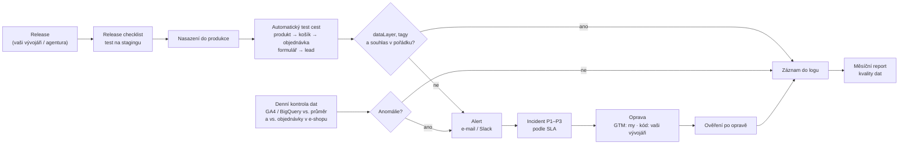

# LP 11: Správa webu a měření – zadání obsahu
> Stav: návrh v1 (8. 10. 2026) · Priorita: C · URL: `/sluzby/sprava-webu-a-mereni` · Segmenty: e-shopy · B2B / lead-gen · velké firmy

> **Návrh služby k potvrzení klientem.** Klient v zadání zmiňuje „nastavení webu, správu webu“. Navrhuji ji jako **průběžnou technickou správu webu s důrazem na měření** ve třech modulech (A – hlídání měření, B – technická správa webu, C – release partner) se SLA a měsíčním reportem kvality dat. Rozsah modulu B (které platformy, zálohy, hosting) a hodnoty SLA jsou označené `[DOPLNIT]` – bez potvrzení klientem je nepublikovat.

---

## 0. Shrnutí

**Účel stránky.** Prodat **měsíční (opakovanou) službu**, která drží web technicky zdravý a hlavně hlídá, aby měření po každém releasu, aktualizaci nebo změně cookie lišty dál fungovalo. Stránka zároveň slouží jako „pokračování“ pro klienty po implementaci (GA4, GTM, server-side, consent) – udržuje vztah a opakovaný příjem.

**Komu je určena (persony):**
| Persona | Situace | Co hledá / co ho přesvědčí |
|---|---|---|
| **Marketingový / e-commerce manažer** | Web vyvíjí externí agentura nebo interní vývojáři; po releasech se opakovaně rozbije měření nákupů nebo formulářů a přijde se na to za týdny | „správa webu“, „pravidelná správa webu“; přesvědčí ho ukázka alertu, release checklist a měsíční report |
| **Head of digital / IT ve velké firmě** | Časté releasy, více týmů publikuje v GTM, audit souladu (consent) – chybí vlastník měření a SLA | „technická správa webu“, „smlouva správa webu“; přesvědčí ho SLA, governance GTM, auditní stopa |
| **Stávající klient datalayer.cz po implementaci** | Má nové měření a nechce, aby se rozpadlo | Modul A jako logické pokračování (odkazy ze všech LP služeb) |
| *(nechtěná persona)* Majitel malého webu, který hledá někoho na úpravy textů a WordPress pluginy | Hledá lokální studio a ceník | Stránka mu poctivě řekne, že obsah a grafiku neděláme – nechceme ho konvertovat |

**Hlavní konverze:** formulář `form_id: lp-sprava` (nový chip „Správa webu a měření“), telefon. **Sekundární:** [Audit měření](/sluzby/audit-mereni) jako vstupní krok, článek D3 *Checklist kvality dat v GA4*.

**Proč tahle stránka vyhraje nad konkurencí:**
1. **SERP „správa webu“ (8. 10. 2026) patří lokálním webovým studiím a správě WordPressu**: websusmevem.cz, oxystudio.cz, dejtonaweb.cz, firmy.cz (katalog „Správce webu Praha“), softmedia.cz (správa WordPress a WooCommerce s ceníkem), tomas-shejbal.cz (aktualizace, zálohy, bezpečnost), luciepelisek.cz. **Nikdo z nich nehlídá měření, souhlas ani datovou vrstvu.** Nesoutěžíme s nimi cenou ani lokalitou, ale jiným obsahem služby.
2. **Analytická konkurence má jen dílčí části:** digitalniarchitekti.cz – „Nastavení a dlouhodobá správa GTM“ (~850 slov), datanostro.com – „Care“ k server-side trackingu, nextanalytica.cz – 24/7 monitoring vlastní SST infrastruktury, datimo.ai – modul „alerting“. Kombinace **release partner + monitoring tagů a dataLayeru + kontrola consentu + report kvality dat + SLA** jako jedna služba na trhu chybí.
3. **Konkrétnost místo „bez starostí“:** ukážeme alert, release checklist s 12 body, strukturu měsíčního reportu a tabulku SLA. Webová studia slibují klid, my ukážeme, jak ho zajistíme.
4. **Upřímné vymezení** („grafiku a texty neděláme“) odfiltruje nevhodné poptávky a zvýší důvěru u firem s vlastním vývojem.

**Realistické očekávání SEO:** obecné „správa webu“ (200) a „správa webových stránek“ (100) mají jiný záměr (lokální studia, WordPress, ceník) – top 3 tam nečekejme. Cílíme na **„technická správa webu“, „správa webu a měření“, „pravidelná / měsíční správa webu“, „údržba webu“** a na konverze z interního prolinkování (všechny LP služeb → modul A).

---

## 1. SEO a meta

| Prvek | Návrh | Délka |
|---|---|---|
| **Title** | `Správa webu a měření – tagy, consent, SLA \| datalayer.cz` | 56 znaků |
| **Meta description** | `Správa webu, která hlídá i měření: monitoring tagů a dataLayeru po každém releasu, kontrola consentu, aktualizace, měsíční report kvality dat a SLA.` | 148 znaků |
| **H1** | `Technická správa webu, která hlídá i měření` | 43 znaků |
| **URL** | `/sluzby/sprava-webu-a-mereni` | |
| **Breadcrumbs** | Domů › Služby › Správa webu a měření | |
| **Canonical** | `https://datalayer.cz/sluzby/sprava-webu-a-mereni` | |

### 1.1 Klíčová slova
| Typ | Klíčové slovo | Objem | Kde použít |
|---|---|---|---|
| Hlavní | správa webu | 200 | H1 („technická správa webu“), title, rychlá odpověď, H2 srovnání |
| Hlavní | technická správa webu · správa webu a měření | 0 (strategické) | H1, podtitul, Service `name` |
| Vedlejší | správa webových stránek | 100 | podtitul nebo úvod srovnání („správa webových stránek a e-shopů“) |
| Vedlejší | pravidelná správa webu · měsíční správa webu | 10 · 0 | sekce „Co dostáváte každý měsíc“ |
| Vedlejší | údržba webu (+ údržba webu cena, kolik stojí údržba webu) | 10 · 0 · 0 | modul B (H3 „Aktualizace a údržba webu“), FAQ 2 |
| Vedlejší | správa webu ceník · správa webu cena · správa webových stránek cena · ceník | 90 · 70 · 70 · 40 | H2 „Z čeho se skládá cena správy webu“, FAQ 2 – **bez ceníku**, ale s komponentami ceny |
| Vedlejší | správa webových stránek a e-shopů | 10 | segment e-shop |
| Long-tail | smlouva správa webu · správa webu in house · správa webu bez starostí | 0 | FAQ 8 (smlouva), segment velká firma (in-house tým), text („bez starostí“ jen v negaci: „ne slib, ale postup“) |
| Otázka (PAA) | Co dělá správce webu? · co je správa webu | – / 0 | FAQ 1 |
| Necílit | seo správa webu (150) | 150 | – (SEO agentury) |
| Necílit | tvorba a správa webových stránek (60), vývoj a správa webu, návrh a správa | 60 | – (tvorbu webů nenabízíme) |
| Necílit | lokální varianty (Brno, Ostrava, Praha, Plzeň, Jičín…) | 10–30 | jen věta „pracujeme online po celé ČR“ |
| Necílit | správa webu wix (20), správa webových stránek kurz (20) | – | – |

### 1.2 Co na stránku NEpatří (kanibalizace)
| Téma | Kam patří | Na LP jen |
|---|---|---|
| Jednorázový audit měření | LP 09 `/sluzby/audit-mereni` | vstupní krok (onboarding) + odkaz |
| Jednorázový technický audit (rychlost, hlavičky) | LP 10 `/sluzby/technicky-audit-webu` | modul B zmiňuje průběžné hlídání, detail tam |
| Nastavení a úklid GTM | LP 02 `/sluzby/google-tag-manager` | GTM governance jako součást modulu A |
| Nastavení cookie lišty a Consent Mode | LP 05 `/sluzby/cookie-lista-consent-mode` | průběžná kontrola, ne nastavení |
| Návod „checklist kvality dat“ | článek D3 | odkaz |

### 1.3 Strukturovaná data (JSON-LD)
> Rozšířený výsledek FAQ se ve Vyhledávání Google od 7. 5. 2026 nezobrazuje – `FAQPage` jen generovaný z FAQ komponenty. U opakované služby **nepoužívat `Offer` s cenou** (ceny se neuvádějí).

```json
{
  "@context": "https://schema.org",
  "@graph": [
    {
      "@type": "Service",
      "@id": "https://datalayer.cz/sluzby/sprava-webu-a-mereni#service",
      "name": "Správa webu a měření",
      "alternateName": "Technická správa webu s hlídáním měření",
      "serviceType": "Průběžná technická správa webu a monitoring měření (tagy, dataLayer, consent) se SLA",
      "description": "Monitoring tagů a datové vrstvy po každém releasu, kontrola souhlasu a Consent Mode, aktualizace a technická údržba webu, release checklist, měsíční report kvality dat a SLA.",
      "url": "https://datalayer.cz/sluzby/sprava-webu-a-mereni",
      "provider": { "@type": "Organization", "@id": "https://datalayer.cz/#organization", "name": "datalayer.cz", "url": "https://datalayer.cz" },
      "areaServed": { "@type": "Country", "name": "CZ" },
      "availableLanguage": "cs",
      "audience": { "@type": "BusinessAudience", "audienceType": "E-shopy, B2B firmy, velké firmy s vlastním nebo externím vývojem" },
      "isRelatedTo": [
        { "@type": "Service", "@id": "https://datalayer.cz/sluzby/audit-mereni#service" },
        { "@type": "Service", "@id": "https://datalayer.cz/sluzby/technicky-audit-webu#service" }
      ]
    },
    {
      "@type": "BreadcrumbList",
      "itemListElement": [
        { "@type": "ListItem", "position": 1, "name": "Domů", "item": "https://datalayer.cz/" },
        { "@type": "ListItem", "position": 2, "name": "Služby", "item": "https://datalayer.cz/sluzby" },
        { "@type": "ListItem", "position": 3, "name": "Správa webu a měření", "item": "https://datalayer.cz/sluzby/sprava-webu-a-mereni" }
      ]
    },
    {
      "@type": "FAQPage",
      "mainEntity": [
        { "@type": "Question", "name": "Co dělá správce webu?", "acceptedAnswer": { "@type": "Answer", "text": "(text 1:1 ze sekce FAQ)" } },
        { "@type": "Question", "name": "Jak poznáte, že se rozbilo měření?", "acceptedAnswer": { "@type": "Answer", "text": "(text 1:1 ze sekce FAQ)" } }
      ]
    }
  ]
}
```

### 1.4 OG obrázek
1200 × 630 px, `#020d1e`. Vlevo piktogram `monitor` (kalendář s ✓ a „pulse“ křivkou) 220 px. Vpravo H1 „Technická správa webu, která hlídá i měření“ (Inter 800, 52 px) a mono řádek `release → test → alert → fix` (`#00b0b0`). Dole stavová lišta: `✓ GTM v148` · `✓ consent` · `✓ dataLayer` · `⚠ 1 alert vyřešen` (ukázka).

---

## 2. Wireframe (pořadí sekcí)

```
┌──────────────────────────────────────────────────────────────────────┐
│ Breadcrumbs                                                          │
├───────────────────────────────┬──────────────────────────────────────┤
│ [ monitor ] eyebrow            │ MOCKUP „Stav měření · dnes 14:20“    │
│ H1 Technická správa webu, …    │ 6 stavových řádků + karta alertu     │
│ Podtitul + rychlá odpověď      │ „purchase −94 % po releasu v2.31“    │
│ [ Domluvit správu ] [ Co hlídáme ]                                    │
│ mikrocopy (online po celé ČR · nejsme webové studio)                  │
├───────────────────────────────┴──────────────────────────────────────┤
│ TRUST BAR (4 fakta)                                                  │
├──────────────────────────────────────────────────────────────────────┤
│ SYMPTOMY – 6 karet                                                   │
├──────────────────────────────────────────────────────────────────────┤
│ ČÍM SE LIŠÍME OD BĚŽNÉ SPRÁVY WEBU – srovnávací tabulka               │
├──────────────────────────────────────────────────────────────────────┤
│ CO HLÍDÁME (#co-hlidame) – 3 moduly A / B / C (karty s výčtem)       │
├──────────────────────────────────────────────────────────────────────┤
│ DIAGRAM – smyčka release → test → alert → oprava → report            │
├──────────────────────────────────────────────────────────────────────┤
│ RELEASE CHECKLIST – tabulka 12 bodů (před / po nasazení)             │
├──────────────────────────────────────────────────────────────────────┤
│ MĚSÍČNÍ REPORT KVALITY DAT – mockup + struktura                      │
├──────────────────────────────────────────────────────────────────────┤
│ SLA – tabulka priorit (P1–P3)                                        │
├──────────────────────────────────────────────────────────────────────┤
│ CO DOSTÁVÁTE · JAK ZAČÍNÁME (onboarding) · Z ČEHO SE SKLÁDÁ CENA     │
├──────────────────────────────────────────────────────────────────────┤
│ PŘÍPADOVÁ STUDIE · PRO KOHO                                          │
├──────────────────────────────────────────────────────────────────────┤
│ FAQ (11) · DO HLOUBKY · NAVAZUJÍCÍ SLUŽBY · KONTAKT                  │
└──────────────────────────────────────────────────────────────────────┘
```
**Mobil:** hero mockup zúžit na kartu alertu + 3 stavové řádky; srovnávací tabulka jako přepínač „Běžná správa ↔ Správa webu a měření“; moduly A/B/C jako akordeon; release checklist jako dvě záložky „Před nasazením / Po nasazení“; mockup reportu = 4 dlaždice pod sebou; SLA tabulka jako 3 karty (P1, P2, P3); sticky lišta `Zavolat` · `Napsat`.

---

## 3. Obsah sekcí (detailně)

### 3.1 Hero (`HeroService`)
- **Eyebrow:** `[ monitor ] Audity a správa`
- **H1:** Technická správa webu, která hlídá i měření
- **Podtitul:** Aktualizace, zálohy a dostupnost webu – a k tomu hlídání tagů, datové vrstvy a souhlasu po každém releasu. Když se měření rozbije, dozvíte se to týž den, ne za měsíc z propadu v reportu.
- **Rychlá odpověď (box, 57 slov):**
  > **Správa webu a měření** je průběžná technická péče o web, která kromě aktualizací, záloh a dostupnosti hlídá i to, co běžná správa webu neřeší: že po každém nasazení dál fungují tagy, datová vrstva a souhlas s cookies. Rozbité měření zachytíme automatickými testy a kontrolou dat, opravíme ho podle SLA a jednou měsíčně dostanete report kvality dat.
- **CTA1:** `[ Domluvit správu webu ]` → `#kontakt`
- **CTA2:** `[ Co hlídáme ]` → `#co-hlidame`
- **Mikrocopy:** „Pracujeme online po celé ČR · Nejsme webové studio – grafiku a texty neděláme · Úvodní konzultace zdarma“
- **Vizuál – mockup „Stav měření“ (HTML/SVG, ukázková data):**
  - Záhlaví: `Stav měření · vas-eshop.cz · dnes 14:20`
  - Řádky (ikona + text + čas):
    - `✓` Web dostupný – 99,98 % za 30 dní
    - `✓` Certifikát HTTPS platný do 12. 1. 2027
    - `✓` GTM: verze 148 publikována 13:58 (autor: externí agentura)
    - `✓` Consent Mode: výchozí stav „denied“, po souhlasu „granted“
    - `✓` Datová vrstva: `purchase` obsahuje 23 z 23 povinných polí
    - `⚠` **`purchase` v GA4: −94 % proti průměru posledních 28 dní (od 14:05)**
  - Pod tím karta alertu (oranžový levý okraj `#ff7400`): „⚠ Pokles nákupů po releasu v2.31 · priorita P1 · test pokladny: událost `purchase` se neodeslala (chybí `transaction_id`) · [ Otevřít incident ]“.
  - Animace: poslední řádek se přepne z ✓ na ⚠ po 2 s a objeví se karta alertu; `prefers-reduced-motion` → rovnou finální stav. Štítek „ukázková data“.
- **Měření:** `cta_click` (`sp_hero_domluvit`, `sp_hero_co-hlidame`).

### 3.2 Trust bar
1. `[ po releasu ]` Automatický test měření po každém nasazení webu
2. `[ sla ]` Reakční doby podle priority, sepsané ve smlouvě
3. `[ report ]` Měsíční report kvality dat – čísla, ne dojmy
4. `[ vaše účty ]` Všechny účty, přístupy a data zůstávají vaše
- *Volitelně:* `[DOPLNIT: počet spravovaných webů / dlouhodobých klientů]`.

### 3.3 Symptomy (`SymptomCards`)
- **H2:** Znáte to?
| # | Piktogram | Nadpis | Text |
|---|---|---|---|
| 1 | Graf s propadem a kalendář „+21 dní“ | Měření se rozbilo a nikdo si nevšiml | Po releasu přestaly do GA4 chodit nákupy. Přišlo se na to za tři týdny – kampaně se mezitím optimalizovaly naslepo. |
| 2 | Přepínač souhlasu s vykřičníkem | Cookie lišta po aktualizaci přestala fungovat | Nová verze lišty nebo šablony a najednou se tagy spouštějí před souhlasem – nebo naopak vůbec. |
| 3 | Kontejner GTM s mnoha rukama | V GTM publikuje kdokoli | Agentura, PPC specialista i vývojář. Nikdo neví, co se v které verzi změnilo, a staré tagy se hromadí. |
| 4 | Formulář s přeškrtnutou obálkou | Aktualizace rozbila formulář | Aktualizace pluginu nebo knihovny a formulář se „odešle“, ale lead nedorazí ani se neměří. |
| 5 | Dvě kancelářské postavy, mezi nimi otazník | Web dělá agentura, za data neodpovídá nikdo | Vývojáři řeší funkce, marketing kampaně. Měření je „mezi“ a padá pokaždé, když se něco mění. |
| 6 | Report s propadem, lupa ukazuje na „tag“ | Porada řeší propad, který neexistuje | Report ukazuje pokles tržeb z kampaní. Po týdnu se ukáže, že šlo o chybu měření, ne o kampaně. |

### 3.4 Čím se lišíme od běžné správy webu (`ComparisonTable`)
- **H2:** Čím se lišíme od běžné správy webových stránek
- **Úvod:** Běžná správa webu se stará o to, aby web běžel a byl aktuální. My k tomu přidáváme to, co webová studia obvykle neřeší: aby web dál správně měřil. Pokud máte správu u svého studia, můžete si od nás vzít jen hlídání měření.

| Oblast | Typická správa webu (webové studio) | Správa webu a měření (datalayer.cz) |
|---|---|---|
| Aktualizace systému a pluginů / závislostí | ✓ | ✓ s testem na stagingu a kontrolou měření po aktualizaci `[DOPLNIT: platformy]` |
| Zálohy | ✓ | ✓ včetně zkušební obnovy `[DOPLNIT: potvrdit]` |
| Monitoring dostupnosti a certifikátu | obvykle ✓ | ✓ |
| Úpravy textů, obrázků, nových stránek | ✓ | – neděláme (váš marketing nebo studio) |
| Grafika a vývoj nových funkcí | ✓ | – (spolupracujeme s vaším vývojem: zadání datové vrstvy pro nové funkce) |
| Kontrola tagů a datové vrstvy po každém releasu | – | ✓ automaticky |
| Kontrola souhlasu a Consent Mode | zřídka | ✓ měsíčně a po každé změně lišty |
| Pořádek v Google Tag Manageru (verze, práva, úklid) | – | ✓ |
| Hlídání anomálií v datech (GA4 / BigQuery) | – | ✓ |
| Release checklist pro vaše vývojáře | – | ✓ |
| Měsíční report | výkaz hodin | report kvality dat + doporučení |
| Kde | často místní studio | online po celé ČR |

- **Vizuál:** sloupec datalayer.cz zvýrazněn; ✓ cyan, – šedě. Pod tabulkou poznámka malým písmem: „Popisujeme typickou nabídku; konkrétní studia se liší.“

### 3.5 Co hlídáme – moduly (`FeatureList`, kotva `#co-hlidame`)
- **H2:** Co hlídáme: tři moduly, které lze kombinovat
- **Úvod:** Základem je modul A. Moduly B a C přidáme podle toho, kdo web vyvíjí a jak často se mění.

**Modul A – Hlídání měření** `[ data ]` *(základ)*
- **Automatické testy klíčových cest** – headless prohlížeč (např. Playwright) projde po každém nasazení a jednou denně cesty, na kterých stojí byznys: zobrazení produktu → košík → objednávka v testovacím režimu, odeslání formuláře. Ověří, že se načte GTM, že datová vrstva obsahuje očekávané události a parametry (`purchase`, `transaction_id`, `value`, `items`…) a že se tagy spouštějí jen po souhlasu.
- **Hlídání dat** – denně porovnáváme počty klíčových událostí s průměrem posledních týdnů a poměr objednávek v GA4 k objednávkám v e-shopu. Jako levnou první vrstvu nastavíme i vlastní statistiky v GA4 (custom insights) s e-mailovým upozorněním – Google jich dovoluje až 50 na property.
- **Kontrola souhlasu** – měsíčně a po každé změně cookie lišty: výchozí stav Consent Mode, aktualizace po volbě (`ad_storage`, `analytics_storage`, `ad_user_data`, `ad_personalization`), nové cookies a nové domény třetích stran.
- **Pořádek v GTM** – zapnuté e-mailové notifikace o publikování verzí, pravidla pojmenování, práva podle rolí, pravidelný úklid nepoužívaných tagů.
- **Měsíční report kvality dat** (viz 3.8).
- **Drobné úpravy měření** – nové události, parametry a konverze v rozsahu hodin dohodnutých ve smlouvě.

**Modul B – Technická správa webu** `[ web ]` `[DOPLNIT: klient potvrdí rozsah a platformy]`
- **Aktualizace a údržba webu** – jádro systému, pluginy, knihovny a závislosti; nejdřív na testovacím prostředí, pak v produkci, vždy s kontrolou měření po nasazení.
- **Zálohy a obnova** – pravidelné zálohy a jednou za čtvrtletí zkušební obnova (záloha, kterou nikdo neobnovil, není záloha).
- **Dostupnost a certifikát** – monitoring dostupnosti, platnosti HTTPS certifikátu a domény s upozorněním.
- **Bezpečnostní hlavičky** – udržování konfigurace (HSTS, CSP, Referrer-Policy…) v souladu s tím, jaké tagy web používá.
- **Rychlost** – měsíční přehled Core Web Vitals a hlídání výkonnostního rozpočtu, aby web s každým novým skriptem nezpomaloval.

**Modul C – Release partner** `[ release ]` *(pro firmy s vlastním nebo externím vývojem)*
- **Release checklist** pro vaše vývojáře (viz 3.7) a kontrola na testovacím prostředí před nasazením.
- **Regresní test měření** po každém nasazení (automaticky + ručně u velkých změn).
- **Zadání datové vrstvy pro nové funkce** – když vzniká nový košík, formulář nebo sekce, dodáme specifikaci událostí dřív, než se začne programovat.
- **Konzultace pro vývojáře** v dohodnutém rozsahu.

- **Vizuál:** 3 karty vedle sebe (A zvýrazněná štítkem „základ“), každá s piktogramem (A: lupa nad tagem s ✓; B: ozubené kolo s štítem; C: raketa/šipka nasazení s checklistem) a 5–6 odrážkami. Mobil: akordeon, A otevřená.
- **Měření:** `cta_click` (`sp_modul_a|b|c`) při rozbalení.

### 3.6 Diagram (`DataFlowDiagram`)
- **H2:** Jak hlídání funguje: od releasu po report
- **Text:** Hlídání má dvě vrstvy. Testy prohlížečem zachytí chybu hned po nasazení – ještě než se projeví v datech. Kontrola dat odhalí to, co testy nepokryjí: chybu jen na některém zařízení, v jiné jazykové verzi nebo u části zákazníků.
- **Mermaid náhled:**


- **Zadání pro designéra:** smyčka (kruhový tok) místo lineárního řetězce: horní oblouk „Release → checklist → nasazení → test“, pravá strana rozhodnutí (kosočtverec), dolní oblouk „alert → incident → oprava → ověření“, uprostřed „Log“ a výstup do „Měsíční report“. Druhý vstup zleva dole „Denní kontrola dat“. Barvy: běžný tok cyan, větev „ne / anomálie“ oranžová `#ff7400`. Interaktivní uzly s tooltipem (1 věta), `diagram_interaction` (`diagram_id: sp-smycka`). Animace tečky po smyčce (8 s), reduced-motion = statické. Mobil: svislý seznam kroků s odbočkou „pokud ne → alert“.

### 3.7 Release checklist (`ComparisonTable` / checklist)
- **H2:** Release checklist: 12 kontrol, které chrání vaše data
- **Úvod:** Tento seznam dostanou vaši vývojáři. Prvních šest bodů se kontroluje před nasazením na testovacím prostředí, dalších šest po nasazení v produkci (většinu z nich automaticky).

| # | Kdy | Kontrola | Kdo | Automaticky |
|---|---|---|---|---|
| 1 | Před | Mění release šablony, kde se odesílá `purchase`, `generate_lead` nebo jiná klíčová událost? Pokud ano, informovat nás předem | vývoj | – |
| 2 | Před | Datová vrstva na testovacím prostředí odpovídá specifikaci (názvy událostí, povinné parametry, datové typy) | my | ✓ |
| 3 | Před | GTM kontejner se načítá a nedochází k chybám JavaScriptu v konzoli | my | ✓ |
| 4 | Před | Cookie lišta: výchozí stav souhlasu „denied“, po volbě aktualizace; žádné marketingové tagy před souhlasem | my | ✓ |
| 5 | Před | Formuláře: validace, odeslání, událost `generate_lead` bez osobních údajů v čitelné podobě | my | ✓ |
| 6 | Před | Nové skripty třetích stran prošly schválením (výkon, souhlas, bezpečnostní hlavičky) | vývoj + my | – |
| 7 | Po | Testovací nákup / formulář v produkci: událost dorazila do GA4 (DebugView / realtime) | my | ✓ |
| 8 | Po | Reklamní systémy (Google Ads, Meta, Sklik) přijímají konverze; u server-side kontrola deduplikace `event_id` | my | částečně |
| 9 | Po | Přesměrování a canonical u změněných URL; sitemap aktualizovaná | vývoj | částečně |
| 10 | Po | Core Web Vitals šablon v laboratorním testu v rámci výkonnostního rozpočtu | my | ✓ |
| 11 | Po | Počty klíčových událostí první hodiny / den po releasu v normálu proti průměru | my | ✓ |
| 12 | Po | Záznam v release logu: verze webu, verze GTM, kdo, co se změnilo | vývoj + my | – |

- **Pod tabulkou:** „Checklist upravíme na míru vaší platformě a release procesu a dostanete ho jako šablonu (Markdown / Confluence / Jira).“ + tlačítko `[ Chci checklist pro náš web ]` → `#kontakt` (`sp_checklist_kontakt`).
- **Volitelný lead magnet (návrh):** stáhnout checklist jako PDF výměnou za e-mail – **zatím ne** (formulář je bez newsletteru, viz `05_formulare/`); místo toho checklist zveřejnit celý v článku C4 nebo D3 a odkázat sem.

### 3.8 Měsíční report kvality dat (`Deliverables` + mockup)
- **H2:** Co najdete v měsíčním reportu kvality dat
- **Text:** Report není výkaz odpracovaných hodin. Odpovídá na otázku, jestli se můžete na svá data spolehnout – a co je potřeba udělat příští měsíc.
- **Struktura reportu (6 bloků):**
  1. **Shrnutí** – stav měření jednou větou a 3 nejdůležitější body.
  2. **Incidenty** – co se stalo, kdy, jak rychle jsme reagovali, příčina, oprava, prevence.
  3. **Shoda dat** – poměr objednávek / leadů v GA4 k e-shopu nebo CRM v čase; reklamní systémy vs. GA4.
  4. **Souhlas** – podíl relací se souhlasem, změny cookie lišty, nové cookies a domény.
  5. **Změny** – verze webu a GTM za měsíc, kdo co publikoval, uklizené tagy.
  6. **Rychlost a dostupnost** – Core Web Vitals po šablonách, dostupnost, doporučení na příští měsíc.
- **Mockup (ukázková data, září 2026):**
  - Dlaždice: **Incidenty** 2 (1× P1 vyřešen za 2 h 40 min, 1× P3) · **Shoda objednávek GA4 / e-shop** 86,4 % (cíl ≥ 85 %, stabilní) · **Podíl relací se souhlasem** 71 % (−2 p. b. po změně lišty 15. 9.) · **Verze GTM** 6 publikovaných, 14 tagů odstraněno · **LCP mobil (75. percentil)** 2,3 s · **Dostupnost** 99,98 %.
  - Graf: denní počet `purchase` v GA4 vs. objednávky v e-shopu (dvě čáry), 1 propad označený „release v2.31 – opraveno“.
  - Blok „Doporučení na říjen“: 3 odrážky (např. „Sjednotit názvy událostí formulářů“, „Odložit načítání chatu“, „Doplnit `item_category` do `view_item_list`“).
  - Štítek „ukázková data“.
- **Vizuál:** stylizovaný „PDF / online report“ v náhledu (stránka A4 na tmavém pozadí s lehkým stínem), na desktopu vedle seznamu struktury. Mobil: 4 dlaždice pod sebou.

### 3.9 SLA (`ComparisonTable`)
- **H2:** SLA: jak rychle reagujeme
- **Úvod:** Ve smlouvě si dohodneme priority a reakční doby. Pracovní doba Po–Pá 9–17. *(Hodnoty níže jsou **návrh** – `[DOPLNIT: klient potvrdí, co reálně garantuje; případně varianty „Standard“ a „Rozšířené“ s pohotovostí mimo pracovní dobu]`.)*

| Priorita | Příklad | Reakce (návrh) | Cíl řešení (návrh) |
|---|---|---|---|
| **P1 – kritická** | Neměří se nákupy nebo leady; tagy se spouštějí bez souhlasu; web nedostupný (modul B) | do 4 pracovních hodin | dočasné řešení do 1 pracovního dne |
| **P2 – závažná** | Výpadek jednoho reklamního systému, chybějící parametry, chyby v části formulářů | do 1 pracovního dne | do 3 pracovních dnů |
| **P3 – běžná** | Nová událost, úprava konverze, drobné nesrovnalosti v datech | do 3 pracovních dnů | podle domluvy / v rámci měsíčních hodin |

- **Pod tabulkou:** „U chyb v kódu webu závisí oprava na vašich vývojářích – my dodáme diagnostiku, přesné zadání a po nasazení ověření. V reportu měříme čas reakce i vyřešení.“

### 3.10 Co dostáváte (`Deliverables`)
- **H2:** Co dostáváte každý měsíc
  1. Automatické testy měření po každém releasu a denně.
  2. Upozornění na anomálie v datech a jejich prověření.
  3. Kontrolu souhlasu a Consent Mode (měsíčně a po změnách lišty).
  4. Pořádek v GTM: verze, práva, úklid.
  5. Opravy incidentů podle SLA.
  6. Dohodnutý počet hodin na drobné úpravy měření.
  7. Měsíční report kvality dat a 30minutový hovor nad ním.
  8. *(Modul B)* aktualizace, zálohy, monitoring dostupnosti a rychlosti. *(Modul C)* release checklist, regresní testy, zadání datové vrstvy pro nové funkce.

### 3.11 Jak začínáme (`ProcessTimeline`)
- **H2:** Jak začínáme
- **Úvod:** Hlídat má smysl jen funkční měření. Proto začínáme vstupní kontrolou – zjistíme výchozí stav a podle něj nastavíme testy a hranice pro upozornění. *(`[DOPLNIT: klient potvrdí délky]`)*

| # | Krok | Typická délka | Výstup | Co potřebujeme od vás |
|---|---|---|---|---|
| 1 | Vstupní kontrola měření a webu | 1–2 týdny | Seznam chyb k opravě, výchozí hodnoty (shoda dat, souhlas, CWV) | Přístupy do GA4, GTM, Search Console, reklamních systémů; testovací prostředí |
| 2 | Opravy z vstupní kontroly | podle rozsahu | Funkční výchozí stav | Součinnost vývojářů u změn v kódu |
| 3 | Nastavení hlídání | 1 týden | Automatické testy, alerty, custom insights v GA4, notifikace GTM | Testovací účet / testovací režim objednávky, kanál pro alerty (e-mail, Slack, Teams) |
| 4 | Release proces a SLA | 1 schůzka | Release checklist, kontakty, priority | Kontakt na vývoj a release manažera |
| 5 | Běžný provoz | měsíčně | Report kvality dat, opravy, úpravy | 30 minut měsíčně nad reportem |
| 6 | Čtvrtletní revize | 1× za čtvrtletí | Úprava testů a hranic, plán na další čtvrtletí | – |

- **Pod tabulkou:** „Pokud jsme vám měření nasazovali my, vstupní kontrola je kratší – výchozí stav známe.“ + odkaz na [Audit měření](/sluzby/audit-mereni) pro firmy, které chtějí nejdřív jen jednorázovou kontrolu.

### 3.12 Z čeho se skládá cena správy webu
- **H2:** Z čeho se skládá cena správy webu
- **Text:** Ceník na webu neuvádíme, protože weby se liší víc než ceníkové balíčky. Po vstupní kontrole dostanete **pevnou měsíční částku** a víte předem, co je v ní a co se platí zvlášť. Cenu ovlivňuje:
  - **počet webů, domén a jazykových verzí,**
  - **platforma** (SaaS e-shop, WordPress, vlastní řešení, headless),
  - **počet hlídaných cest a konverzí** (nákup, formuláře, registrace, B2B portál),
  - **frekvence releasů** (jednou měsíčně vs. několikrát týdně),
  - **zvolené moduly** (A, A + B, A + C, vše),
  - **úroveň SLA** (pracovní doba vs. rozšířená pohotovost),
  - **počet hodin na úpravy měření** zahrnutých v měsíční částce.
- **Box:** „Co platíte zvlášť: nástroje a infrastrukturu na vašich účtech (např. hosting, Google Cloud pro server-side nebo BigQuery, placené nástroje pro monitoring, pokud je chcete) – vždy po dohodě a na vaše jméno.“
- **Vizuál:** seznam s mono štítky, bez tabulky cen.

### 3.13 Případová studie (`MiniCase`)
- **H2:** Z praxe: [DOPLNIT]
- **Struktura:** Problém → Příčina → Oprava → Výsledek (číslo: např. „čas od rozbití měření do opravy z 3 týdnů na 3 hodiny“, „počet incidentů za čtvrtletí“, „shoda GA4 s e-shopem stabilní nad X %“).
- **Ukázkový příklad (štítek `ukázkový příklad`):** „E-shop s externí vývojovou agenturou a releasem každý týden: měření nákupů se během půl roku rozbilo čtyřikrát, pokaždé se na to přišlo až v měsíčním reportu. Po zavedení release checklistu a automatického testu pokladny přišlo upozornění vždy do hodiny po nasazení a oprava byla hotová týž den.“

### 3.14 Pro koho (`SegmentTabs`)
- **H2:** Co je jinak u e-shopu, B2B a velké firmy
- **E-shop:** Hlídáme hlavně pokladnu: `purchase`, `transaction_id`, hodnotu a položky, napojení na Google Ads, Metu, Sklik a srovnávače. Na SaaS platformách (Shoptet, Upgates, Shopify) hlídáme i změny, které přinese aktualizace platformy nebo šablony – tu neovlivníte, ale můžete o ní vědět. → [Měření pro e-shopy](/reseni/e-shopy)
- **B2B a leady:** Hlídáme formuláře, chatovací a rezervační widgety a tok leadů do CRM. Lead, který se odešle, ale nedorazí, je nejdražší chyba. → [Měření pro B2B a lead generation](/reseni/b2b-a-lead-generation)
- **Velká firma:** Více týmů a agentur v jednom GTM, časté releasy a požadavky na auditní stopu. Nastavíme práva podle rolí, pravidla publikace, release log a SLA, které zapadne do vašeho ITSM procesu. Spolupracujeme s vaším interním týmem – nenahrazujeme ho. → [Měření pro velké firmy](/reseni/velke-firmy)

### 3.15 FAQ (11 otázek)
- **H2:** Časté otázky ke správě webu a měření

**1. Co dělá správce webu?**
Správce webu se stará o to, aby web technicky fungoval: aktualizuje systém a doplňky, zálohuje, hlídá dostupnost a bezpečnost a řeší chyby. Často k tomu patří i úpravy obsahu. Naše správa je zaměřená jinak: obsah a grafiku neděláme, zato hlídáme to, co běžný správce obvykle neřeší – že po každé změně webu dál fungují měřicí kódy, datová vrstva a souhlas s cookies a že čísla v GA4 a reklamních systémech odpovídají skutečnosti.

**2. Kolik stojí správa webu?**
Ceník neuvádíme, protože rozsah se liší web od webu. Po vstupní kontrole dostanete pevnou měsíční částku. Rozhoduje počet webů a domén, platforma, počet hlídaných cest a konverzí, jak často vydáváte nové verze, zvolené moduly (hlídání měření, technická správa, release partner), úroveň SLA a počet hodin na úpravy zahrnutých v ceně. Nástroje a infrastruktura (hosting, Google Cloud) běží na vašich účtech a platíte je přímo dodavatelům.

**3. Upravujete i texty, obrázky a nové stránky?**
Ne. Nejsme webové studio – obsah, grafiku a vývoj nových funkcí nechte svému marketingu, studiu nebo vývojářům. My se postaráme, aby nové stránky a funkce správně měřily: dodáme zadání datové vrstvy, zkontrolujeme je před nasazením a ohlídáme po něm. Pokud chcete jednoho dodavatele na všechno, doporučíme vám ověřené studio a budeme s ním spolupracovat. `[DOPLNIT: partnerské studio, pokud klient chce]`

**4. Jak poznáte, že se rozbilo měření?**
Dvěma způsoby. Automatický test v prohlížeči projde po každém nasazení a jednou denně klíčové cesty – například produkt, košík a objednávku v testovacím režimu nebo odeslání formuláře – a zkontroluje, že se odeslaly správné události s povinnými parametry a jen po souhlasu. Druhá vrstva hlídá data: porovnává počty klíčových událostí s průměrem a s objednávkami v e-shopu. Když něco nesedí, přijde upozornění do e-mailu nebo Slacku a incident řešíme podle SLA.

**5. Web nám vyvíjí jiná agentura. Jak spolupráce funguje?**
To je nejčastější situace a služba je na ni stavěná. Vaše agentura dál vyvíjí; my jí dodáme release checklist, zadání datové vrstvy pro nové funkce a po každém nasazení zkontrolujeme měření. Když najdeme chybu v kódu, pošleme přesný popis s reprodukcí a po opravě ji ověříme. V GTM nastavíme pravidla, kdo smí publikovat, aby se práce nepřekrývala. Funguje to nejlépe, když se s vývojáři na začátku potkáme.

**6. Na jakých platformách správu děláte?**
Hlídání měření (modul A) funguje na jakékoli platformě, protože testujeme výsledný web v prohlížeči a data v GA4. Technickou správu webu (modul B) nabízíme pro `[DOPLNIT: platformy – např. WordPress / WooCommerce, React / Node.js na Google Cloudu]`. U SaaS e-shopů (Shoptet, Upgates, Shopify) aktualizace řeší provozovatel platformy – my hlídáme jejich dopad na měření.

**7. Co je SLA a co v něm garantujete?**
SLA je dohoda o úrovni služeb: jak rychle zareagujeme a do kdy se pokusíme problém vyřešit podle jeho závažnosti. Typicky rozlišujeme kritické chyby (neměří se nákupy či leady, tagy běží bez souhlasu, web je nedostupný), závažné a běžné. Reakční doby a pracovní dobu sepíšeme ve smlouvě a v měsíčním reportu je vyhodnocujeme. Opravy v kódu webu závisejí na vašich vývojářích – garantujeme diagnostiku, zadání a ověření. `[DOPLNIT: konkrétní hodnoty SLA]`

**8. Na jak dlouho se zavazujeme?**
`[DOPLNIT: minimální délka spolupráce a výpovědní lhůta – návrh: bez minimální doby po vstupní kontrole, výpovědní lhůta 1 měsíc]`. Na konci spolupráce předáme dokumentaci, testy, release checklist a seznam přístupů, aby mohl hlídání převzít váš tým nebo jiný dodavatel.

**9. Hlídáte i cookie lištu a souhlas?**
Ano, technicky. Měsíčně a po každé změně lišty kontrolujeme, že Consent Mode má správný výchozí stav, že se po volbě návštěvníka aktualizuje, že se marketingové tagy nespouštějí před souhlasem a jestli se neobjevily nové cookies nebo domény třetích stran. Nejsme ale advokátní kancelář – soulad textů lišty a zásad s právem posoudí váš právník. Nastavení nebo výměnu lišty řešíme v samostatné službě [Cookie lišta a Consent Mode](/sluzby/cookie-lista-consent-mode).

**10. Potřebujeme mít BigQuery?**
Ne. Základní hlídání funguje nad GA4 (vlastní statistiky s upozorněním) a automatickými testy v prohlížeči. BigQuery ale hlídání výrazně zpřesní: můžeme denně porovnávat přesné počty událostí s objednávkami v e-shopu, hlídat jednotlivé parametry a uchovávat historii incidentů. Pokud export GA4 do BigQuery už máte, využijeme ho; pokud ne, doporučíme, kdy se vyplatí – viz [BigQuery a datový sklad](/sluzby/bigquery).

**11. Kdo má přístupy a co se stane po ukončení spolupráce?**
Všechny účty – GA4, GTM, Search Console, reklamní systémy, Google Cloud – zůstávají vaše. My dostaneme uživatelské přístupy s rolí, kterou potřebujeme, a vedeme jejich seznam. Testy a skripty pro hlídání běží na vaší infrastruktuře nebo je při ukončení předáme. Po skončení spolupráce si přístupy odeberete a dostanete předávací balíček: dokumentaci, release checklist, nastavení upozornění a poslední report.

### 3.16 Do hloubky (`RelatedArticles`)
1. [Checklist kvality dat v GA4: 25 kontrol](/blog/ga4-checklist-kvality-dat)
2. [Audit GTM kontejneru: nejčastější chyby a jak udržet pořádek](/blog/audit-gtm-kontejneru)
3. [Měřicí plán: jak naplánovat měření dřív, než se napíše první tag](/blog/merici-plan)
4. [Consent Mode v2: kompletní průvodce](/blog/consent-mode-v2-pruvodce)
5. [Proč nesedí čísla: GA4 vs. Google Ads vs. Meta vs. administrace e-shopu](/blog/proc-nesedi-data)

### 3.17 Navazující služby (`RelatedServices`)
1. **[Audit měření](/sluzby/audit-mereni)** – *zjistíme, kde data utíkají.* Jednorázová kontrola, kterou začíná každá správa.
2. **[Technický audit webu](/sluzby/technicky-audit-webu)** – *rychlost, tagy a technické SEO.* Když chcete nejdřív opravit výkon a hlavičky.
3. **[Google Tag Manager](/sluzby/google-tag-manager)** – *pořádek v tazích a verzích.* Úklid kontejneru před tím, než ho začneme hlídat.

---

## 4. Kontaktní blok

| Prvek | Hodnota |
|---|---|
| `form_id` | `lp-sprava` |
| Předvybrané téma | **nový chip `sprava` – „Správa webu a měření“** *(doplnit do seznamu témat ve `05_formulare/`)* |
| H2 | **Ať vaše měření nepřestane fungovat** |
| Lead text | Napište nám, zavolejte, nebo vyplňte formulář. Na úvodní 30minutové konzultaci zjistíme, kdo vám web vyvíjí, jak často vydáváte nové verze a co je potřeba hlídat – a navrhneme rozsah správy. |
| Placeholder zprávy | Např. web nám vyvíjí externí agentura, release je každý týden a měření nákupů se nám už několikrát rozbilo… |
| Poznámka pod tlačítkem | Ozveme se do 1 pracovního dne. |

*Tabulku 3.5 ve `05_formulare/specifikace-formularu.md` doplnit o řádek „Správa webu a měření“.*

---

## 5. Interní odkazy

### 5.1 Odchozí
| Cíl | Anchor | Umístění |
|---|---|---|
| `/sluzby/audit-mereni` | Audit měření | Jak začínáme; Navazující služby |
| `/sluzby/technicky-audit-webu` | Technický audit webu | Navazující služby |
| `/sluzby/google-tag-manager` | Google Tag Manager | Navazující služby |
| `/sluzby/cookie-lista-consent-mode` | Cookie lišta a Consent Mode | FAQ 9 |
| `/sluzby/bigquery` | BigQuery a datový sklad | FAQ 10 |
| `/reseni/e-shopy`, `/reseni/b2b-a-lead-generation`, `/reseni/velke-firmy` | Měření pro … | SegmentTabs |
| `/blog/ga4-checklist-kvality-dat` | Checklist kvality dat v GA4 | Do hloubky |
| `/blog/audit-gtm-kontejneru` | Audit GTM kontejneru | Do hloubky |
| `/blog/merici-plan` | Měřicí plán | Do hloubky |
| `/blog/consent-mode-v2-pruvodce` | Consent Mode v2: kompletní průvodce | Do hloubky |
| `/blog/proc-nesedi-data` | Proč nesedí čísla | Do hloubky |

### 5.2 Příchozí
| Zdroj | Anchor | Kde |
|---|---|---|
| **Všechny LP služeb (01–10)** | Správa webu a měření – *hlídáme, aby měření nepřestalo fungovat* | Pod tabulkou postupu („Po předání…“) nebo v Navazujících službách – nejdůležitější zdroj leadů této LP |
| Homepage, mega-menu | Správa webu a měření | Karta služby |
| `/sluzby` (hub) | Technická správa webu, která hlídá i měření | Sloupec „Audity a správa“ |
| `/reseni/velke-firmy` | SLA a hlídání měření | Sekce governance |
| `/sluzby/dashboardy-a-reporting` | Správa webu a měření | Galerie (ukázka E – zdraví měření), Automatizace |
| `/jak-pracujeme` | dlouhodobá správa a hlídání měření | Poslední krok procesu |
| Články D3, C4, C5, A1, D2 | hlídání měření po releasu / správa webu a měření | CTA box |
| Slovník (Kontejner GTM, Consent Mode, Datová vrstva) | průběžné hlídání měření | Konec hesla |

---

## 6. Co dodá klient
- [DOPLNIT] **Potvrzení služby a rozsahu**: nabízí klient modul B (technická správa webu)? Pro které platformy (WordPress, WooCommerce, React / Node.js, jiné)? Dělá zálohy, hosting, aktualizace?
- [DOPLNIT] **SLA**: reakční doby P1–P3, pracovní doba, případná pohotovost mimo pracovní dobu, kanály pro alerty (e-mail, Slack, Teams).
- [DOPLNIT] **Smluvní podmínky**: minimální délka spolupráce, výpovědní lhůta, zda jsou hodiny na úpravy součástí paušálu a co se s nevyčerpanými děje.
- [DOPLNIT] **Technologie hlídání**: čím klient testuje (Playwright / Puppeteer / jiný nástroj), kde testy běží (Google Cloud klienta, vlastní infrastruktura), jak se doručují alerty. Ovlivní text modulu A a FAQ 11.
- [DOPLNIT] Případová studie s čísly (čas detekce a opravy, počet incidentů) + citace.
- [DOPLNIT] Počet spravovaných webů / dlouhodobých klientů (trust bar) – jen pravdivé číslo.
- [DOPLNIT] Partnerské webové studio pro obsah a grafiku (FAQ 3) – nebo větu vypustit.
- [DOPLNIT] Ukázka skutečného (anonymizovaného) měsíčního reportu – náhrada mockupu.

---

## 7. Měření stránky

| Událost | Parametry | Hodnoty |
|---|---|---|
| `cta_click` | `cta_id`, `cta_text`, `section` | `sp_hero_domluvit`, `sp_hero_co-hlidame` (hero) · `sp_modul_a`, `sp_modul_b`, `sp_modul_c` (moduly) · `sp_checklist_kontakt` (checklist) · `sp_segment_{eshop|b2b|velka-firma}` · `sp_related_{slug}` · `sp_article_{slug}` |
| `diagram_interaction` | `diagram_id`, `node` | `sp-smycka` / `release`, `checklist`, `nasazeni`, `test`, `kontrola-dat`, `alert`, `incident`, `oprava`, `overeni`, `report` |
| `faq_open` | `question` | 11 otázek |
| `scroll_depth` | `percent` | 50, 90 |
| `lead_form_start` / `lead_form_error` / `generate_lead` | dle `05_formulare/` | `form_id: lp-sprava`, `form_location: /sluzby/sprava-webu-a-mereni`, `lead_topics: sprava` |
| `contact_click` | `channel`, `section` | `phone` / `email` |

**Specifické vyhodnocení:** podíl leadů, které přišly z interních odkazů z jiných LP (referrer / `page_referrer` v GA4) – potvrzení, že stránka funguje jako „pokračování“ po implementaci; podíl nevhodných poptávek (úpravy obsahu, tvorba webu) – pokud je vysoký, posílit vymezení v hero.

---

## 8. Akceptační checklist
- [ ] **Služba potvrzená klientem** (moduly, platformy, SLA, smluvní podmínky) – bez toho stránku nepublikovat; všechny `[DOPLNIT]` vyřešené.
- [ ] Title 56 znaků, meta 148 znaků, H1 obsahuje „správa webu“; v textu žádné lokální varianty kromě „online po celé ČR“.
- [ ] Hero a sekce srovnání jasně říkají „nejsme webové studio, obsah a grafiku neděláme“.
- [ ] SLA tabulka obsahuje jen hodnoty, které klient potvrdil; u oprav v kódu je uvedena závislost na vývojářích klienta.
- [ ] Ukázková data (mockup stavu, alert, report) označená štítkem; čísla vnitřně konzistentní.
- [ ] Release checklist je čitelný na mobilu (záložky Před / Po), tabulka sémantická.
- [ ] Tvrzení o GA4 custom insights (max. 50, e-mail), GTM notifikacích a typech souhlasu Consent Mode ověřená v den publikace.
- [ ] FAQ 9 obsahuje disclaimer „nejsme advokátní kancelář“.
- [ ] `Service` + `BreadcrumbList` validní, bez `Offer`/ceny; `FAQPage` jen generovaný; canonical self.
- [ ] Diagram smyčky jako inline SVG s textovým popisem; `prefers-reduced-motion`.
- [ ] Měření: všechna `cta_id`, `diagram_interaction`, `faq_open`, formulář `lp-sprava` ověřené v GTM Preview; nic před souhlasem.
- [ ] Formulář: nový chip „Správa webu a měření“ v komponentě i ve `05_formulare/` (tabulka 3.5).
- [ ] Všechny LP 01–10 obsahují odkaz na tuto stránku (sekce postup / navazující služby) – zkontrolovat po dokončení jejich zadání.
- [ ] Výkon: LCP < 2,5 s, CLS < 0,1, INP < 200 ms; animace mockupu bez knihoven.

---

## Zdroje
| Tvrzení | Zdroj | Ověřeno |
|---|---|---|
| GA4 vlastní statistiky (custom insights): podmínky, volitelná e-mailová upozornění, až 50 na property, podmínka „Has anomaly“ | https://support.google.com/analytics/answer/9443595 | 10/2026 |
| GTM: e-mailové notifikace o klíčových akcích v kontejneru (verzování, publikování, žádosti o schválení) | https://support.google.com/tagmanager/answer/9713667 | 10/2026 |
| Typy souhlasu Consent Mode (`ad_storage`, `analytics_storage`, `ad_user_data`, `ad_personalization`…), basic vs. advanced | https://developers.google.com/tag-platform/security/concepts/consent-mode | 10/2026 |
| Core Web Vitals – prahy a 75. percentil (pro report a výkonnostní rozpočet) | https://web.dev/articles/vitals | 10/2026 |
| Doporučení k tagům a governance (testovat před nasazením, schvalování změn, pravidelné audity, „tagy se přidávají, ale málokdy odebírají“) | https://web.dev/articles/tag-best-practices | 10/2026 |
| Doporučené bezpečnostní hlavičky (OWASP) | https://cheatsheetseries.owasp.org/cheatsheets/HTTP_Headers_Cheat_Sheet.html | 10/2026 |
| Rozdíly GA4 UI vs. BigQuery, doplňování denních tabulek až 72 h (pro nastavení hranic alertů) | https://developers.google.com/analytics/blog/2023/bigquery-vs-ui | 10/2026 |
| Rozšířený výsledek FAQ se nezobrazuje od 7. 5. 2026 | https://developers.google.com/search/updates | 10/2026 |
| SERP „správa webu“ (lokální studia, WordPress správa) | `../data/serp/google_serp_organic.tsv` (Google.cz, 8. 10. 2026) | 10/2026 |
| Playwright jako nástroj pro automatické testy v prohlížeči | – | obecně známé; konkrétní nástroj potvrdí klient |
