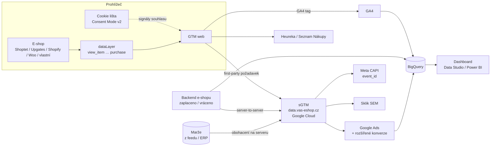

# LP 12: Řešení pro e-shopy – zadání obsahu
> Stav: návrh v1 (8. 10. 2026) · Priorita: A · URL: `/reseni/e-shopy` · Segmenty: e-shopy (od prvních kampaní po e-shopy s vlastním vývojem a více trhy)

Navazuje na: `00_architektura-webu.md` (šablona LP, piktogramy, měření), `../05_formulare/specifikace-formularu.md`, `../02_klicova-slova/data/lp_keyword_inputs.json` (`lp-eshopy`), `../01_konkurence/` (khoder, gameplan, nextanalytica, advisio, datanimals, digitalniarchitekti, homoladigital).

---

## 0. Shrnutí

**Účel stránky.** Řešení, ne jedna služba: ukázat e-shopu **celý měřicí stack** (datová vrstva → GA4 e-commerce → consent → server-side → Google Ads / Meta / Sklik / Heureka / Seznam Nákupy (dříve Zboží.cz) → marže → BigQuery → dashboard), přeložit ho do **úrovní podle vyspělosti e-shopu** a do **platformní tabulky „co platforma změří sama a co je potřeba doplnit“**. Stránka zároveň sbírá platformní dotazy (*shopify gtm*, *shoptet google analytics*, *ga4 shopify*), které dnes v ČR nikdo nepokrývá komerční stránkou.

**Persony**
| Persona | Situace | Co hledá |
|---|---|---|
| Majitel / e-commerce manažer e-shopu na Shoptetu nebo Upgates | GA4 ukazuje méně objednávek než administrace, PPC agentura tlačí na „server-side“, nikdo neumí vysvětlit rozdíl | Někoho, kdo měření dá do pořádku, vysvětlí rozdíly a nebude prodávat krabici |
| Head of performance / marketing e-shopu na Shopify nebo WooCommerce | Po změně checkoutu (Shopify Checkout Extensibility, nový platební modul) zmizely nákupy z GTM; Meta a Ads hlásí jiná čísla | Technické řešení (GTM jako custom pixel, server-side, deduplikace), konkrétní postup |
| CTO / vedoucí vývoje vlastního e-shopu | Vyvíjí nový e-shop nebo migruje, marketing chce „dataLayer“, nikdo nenapsal zadání | Specifikaci datové vrstvy, testovací scénáře, partnera, který mluví s vývojáři |
| Finanční ředitel / majitel většího e-shopu | Reklama se řídí obratem (ROAS, PNO), ne ziskem; reporty se liší podle toho, kdo je dělal | Marže v reklamních systémech, BigQuery, jeden report, kterému věří |

**Konverze.** Hlavní: formulář `lp-eshopy` (kotva `#kontakt`). Druhá: telefon (`contact_click`). Sekundární: kalkulačka nezachycených konverzí (`/nastroje/kalkulacka-ztraty-konverzi`, viz soubor 15), článek D4 *GA4 na Shoptetu, Upgates, WooCommerce a Shopify*, checklist „Jak poznáte, že měření funguje“.

**Proč tahle stránka vyhraje nad konkurencí**
1. **Poctivá platformní tabulka.** Khoder.cz cílí hlavně na Shoptet a menší e-shopy, Gameplan prodává měření jen jako proprietární OneTag v balíčku pro e-shopy 20 mil.+, NEXT analytica a DataPlus (Advisio) prodávají server-side jako krabici bez GA4, GTM, consentu a datové vrstvy. Nikdo neukazuje, **co platforma změří sama a kde končí** – my ano, s odkazy na dokumentaci platforem.
2. **Úrovně místo ceníku.** Klient ceny neuvádí; úrovně (Základ → Výkon → Zisk → Datový sklad) s výstupy a délkou dávají jistotu, kterou konkurence řeší ceníkem (khoder, homola, NEXT).
3. **Aktuálnost 2026.** Shopify: konec script tagů na děkovací stránce u všech plánů (26. 8. 2026), Seznam Event Measurement, Google Ads offline/Data Manager, Consent Mode v2 na Shoptetu. Digitální architekti mají obsah o GA4 na Shoptetu z roku 2024, Advisio texty o „konci cookies 2024“.
4. **Zisk, ne obrat – technicky správně.** Datanimals a NEXT mluví o POAS, ale nevysvětlují, že **marže nesmí do prohlížeče**. My ukážeme obohacení hodnot na serveru (sGTM) a cart data s náklady na zboží v Google Ads.

---

## 1. SEO a meta

| Prvek | Návrh |
|---|---|
| **Title** (59 znaků) | `Měření e-shopu: GA4, GTM, consent a konverze \| datalayer.cz` |
| **Meta description** (152 znaků) | `Měření e-shopu na Shoptetu, Shopify, WooCommerce i vlastním řešení: GA4 e-commerce, consent, server-side, Ads, Meta, Sklik a Heureka. Konzultace zdarma.` |
| **H1** (50 znaků) | `Měření e-shopu od datové vrstvy po marži v reportu` |
| **URL** | `/reseni/e-shopy` (canonical self) |
| **Breadcrumbs** | Domů › Řešení › E-shopy |
| **Eyebrow nad H1** (mono) | `[ Řešení pro e-shopy ]` |

### 1.1 Klíčová slova

Objemy = měsíční hledanost CZ (Ahrefs, `lp_keyword_inputs.json`, `kw_mapovani_na_stranky.tsv`). Dotazy bez objemu pocházejí z vlastního sběru SERP Google.cz (8. 10. 2026).

| Typ | Klíčové slovo | Objem | Kde použít |
|---|---|---|---|
| Hlavní | měření e-shopu | – (SERP dotaz „měření e-shopu analytika“) | H1, title, rychlá odpověď, alt diagramu |
| Hlavní (platforma) | shopify gtm | 350 | H3 v platformní sekci „GTM na Shopify po konci checkout.liquid“, FAQ 3 |
| Hlavní (platforma) | shoptet google analytics | 150 | H3 „Shoptet a Google Analytics 4“, řádek tabulky, FAQ 1 |
| Vedlejší | ga4 shopify | 350 | H3 Shopify (text „GA4 na Shopify“), FAQ 3 – *viz kanibalizace* |
| Vedlejší | google analytics shopify | 80 | text Shopify záložky |
| Vedlejší | google analytics e-shop | 70 | podtitul / sekce stacku („Google Analytics pro e-shop“) |
| Vedlejší | ecommerce marketing analytics | 30 | sekce Úrovně (anglický termín v textu jednou) |
| Vedlejší | shoptet ga4 | 20 | tabulka platforem |
| Vedlejší | ga4 ecommerce / ga4 e-commerce měření | 20 / SERP | H2 stacku „GA4 e-commerce měření“ |
| Long-tail | woocommerce google analytics, woocommerce ga4 | 10 / 0 | záložka WooCommerce |
| Long-tail | google tag manager shopify, shopify google tag manager | 10 / 10 | záložka Shopify |
| Long-tail | nastavení google analytics shoptet | 10 | záložka Shoptet |
| Long-tail | reporting a analytika e-shop | 10 | sekce Dashboard |
| Long-tail | enhanced ecommerce gtm, google-tag-manager ecommerce tracking | 10 / 10 | sekce Datová vrstva (zmínka „dříve enhanced ecommerce“) |
| Long-tail | prestashop 1.7 google tag manager, magento google tag-manager | 0 | záložka PrestaShop / vlastní řešení |
| Otázka | Jak propojit e-shop s Google Analytics 4? | 10 | FAQ 1 |
| Otázka (PAA) | Jak propojit e-shop s Google Tag Managerem? | PAA | FAQ 3 (obecná část) |
| Otázka (Ahrefs, EN) | does shopify support google analytics 4 / how to add gtm to shopify | 0 | FAQ 3 |

### 1.2 Co na stránku NEpatří (kanibalizace)
- **„ga4 shopify“ (350), „google analytics shopify“ (80)** jsou v mapování přiřazené LP 01 (Implementace GA4). Doporučení: záměr je platformní → **cílit zde** (záložka Shopify s kotvou `#shopify`), LP 01 jen zmíní a odkáže anchor „GA4 na Shopify“. Po spuštění fáze 2 (`/reseni/e-shopy/shopify`) přesunout na podstránku. *Upravit mapování v `kw_mapovani_na_stranky.tsv`.*
- **„shoptet google analytics“ (150)** sdílí s článkem D4 `/blog/ga4-pro-eshopove-platformy`. Rozdělení: LP = komerční varianta (co Shoptet změří sám, co doplníme, CTA), D4 = návod krok za krokem se screenshoty. Pokud Google ve výsledcích upřednostní článek, nevadí – D4 má box služby vedoucí sem.
- *shoptet cookie lišta* (40), *shoptet consent mode v2* (20) → LP 05 Cookie lišta a Consent Mode (zde jen 1 věta + odkaz).
- *shoptet facebook pixel* (40), *heureka ověřeno zákazníky* (90), *facebook pixel e-shop* (60) → LP 06 Měření konverzí.
- *ga4 nesedí tržby e-shop* (problémový dotaz) → článek D2 + LP 09 Audit měření (zde jako symptom s odkazem).
- *ecommerce dashboard / ecommerce reporting* → LP 08 Dashboardy; *ecommerce data layer* → LP 03 a článek C2.

### 1.3 Strukturovaná data (JSON-LD)

```json
{
  "@context": "https://schema.org",
  "@graph": [
    {
      "@type": "Service",
      "@id": "https://datalayer.cz/reseni/e-shopy#service",
      "name": "Měření pro e-shopy",
      "serviceType": "Implementace měření e-shopu (GA4, Google Tag Manager, Consent Mode v2, server-side, konverze)",
      "description": "Kompletní měření e-shopu: datová vrstva, GA4 e-commerce, cookie lišta s Consent Mode v2, server-side měření, konverze pro Google Ads, Meta, Sklik, Heureku a Seznam Nákupy, marže, BigQuery a dashboard.",
      "provider": { "@type": "Organization", "@id": "https://datalayer.cz/#organization", "name": "datalayer.cz" },
      "areaServed": { "@type": "Country", "name": "CZ" },
      "audience": { "@type": "BusinessAudience", "audienceType": "E-shopy" },
      "url": "https://datalayer.cz/reseni/e-shopy",
      "hasOfferCatalog": {
        "@type": "OfferCatalog",
        "name": "Úrovně měření e-shopu",
        "itemListElement": [
          { "@type": "Offer", "itemOffered": { "@type": "Service", "name": "Úroveň 1 – Spolehlivý základ" } },
          { "@type": "Offer", "itemOffered": { "@type": "Service", "name": "Úroveň 2 – Výkon a přesnost (server-side)" } },
          { "@type": "Offer", "itemOffered": { "@type": "Service", "name": "Úroveň 3 – Zisk místo obratu (marže, POAS)" } },
          { "@type": "Offer", "itemOffered": { "@type": "Service", "name": "Úroveň 4 – Datový sklad a reporting (BigQuery)" } }
        ]
      }
    },
    {
      "@type": "ItemList",
      "name": "Podporované e-shopové platformy",
      "itemListElement": [
        { "@type": "ListItem", "position": 1, "name": "Shoptet", "url": "https://datalayer.cz/reseni/e-shopy#shoptet" },
        { "@type": "ListItem", "position": 2, "name": "Upgates", "url": "https://datalayer.cz/reseni/e-shopy#upgates" },
        { "@type": "ListItem", "position": 3, "name": "Shopify", "url": "https://datalayer.cz/reseni/e-shopy#shopify" },
        { "@type": "ListItem", "position": 4, "name": "WooCommerce", "url": "https://datalayer.cz/reseni/e-shopy#woocommerce" },
        { "@type": "ListItem", "position": 5, "name": "PrestaShop", "url": "https://datalayer.cz/reseni/e-shopy#prestashop" },
        { "@type": "ListItem", "position": 6, "name": "Vlastní řešení", "url": "https://datalayer.cz/reseni/e-shopy#vlastni-reseni" }
      ]
    },
    {
      "@type": "BreadcrumbList",
      "itemListElement": [
        { "@type": "ListItem", "position": 1, "name": "Domů", "item": "https://datalayer.cz/" },
        { "@type": "ListItem", "position": 2, "name": "Řešení", "item": "https://datalayer.cz/reseni" },
        { "@type": "ListItem", "position": 3, "name": "E-shopy", "item": "https://datalayer.cz/reseni/e-shopy" }
      ]
    },
    {
      "@type": "FAQPage",
      "mainEntity": [
        {
          "@type": "Question",
          "name": "Nestačí nativní integrace GA4, kterou má Shoptet, Upgates nebo Shopify?",
          "acceptedAnswer": { "@type": "Answer", "text": "{{text FAQ 1 – generovat z komponenty FAQ}}" }
        }
      ]
    }
  ]
}
```
- `FAQPage` **generovat ze stejného zdroje dat jako viditelné FAQ** (CMS / JSON), aby se text nikdy nerozešel. Pozn.: Google od 7. 5. 2026 **nezobrazuje FAQ rich results** (viz Zdroje) – schema ponechat kvůli konzistenci s architekturou a strojové čitelnosti, ale nepočítat s rozšířeným výsledkem. *Doporučuji aktualizovat kap. 7 architektury.*
- `/reseni` (rozcestník řešení) zatím jako stránka neexistuje – v breadcrumbs buď vytvořit krátký hub, nebo položku „Řešení“ nelinkovat (`item` vynechat).

### 1.4 OG obrázek
1200×630, pozadí `#020d1e`. Vlevo piktogram **účtenka s položkami `item_id`** (cyan line, 120 px) se štítkem `purchase`. Vpravo H1 „Měření e-shopu od datové vrstvy po marži v reportu“ (Inter 800, `#e6edf3`) a pod ním mono řádek `Shoptet · Upgates · Shopify · WooCommerce · PrestaShop · vlastní řešení` (`#00b0b0`). Dole vpravo logo datalayer.cz.

---

## 2. Wireframe (desktop shora dolů)

```
┌──────────────────────────────────────────────────────────────────────┐
│ NAV  Služby ▾  Řešení ▾  Případové studie  Blog  O nás  [Konzultovat]│
├──────────────────────────────────────────────────────────────────────┤
│ Domů › Řešení › E-shopy                                              │
│ [ Řešení pro e-shopy ]                                               │
│ H1 Měření e-shopu od datové vrstvy     │  HERO DIAGRAM:              │
│    po marži v reportu                  │  Administrace 1 248 obj. →  │
│ Podtitul                               │  dataLayer.push(purchase) → │
│ Rychlá odpověď (box, mono rámeček)     │  GTM → sGTM → GA4/Ads/Meta/ │
│ [Konzultovat měření e-shopu] [Spočítat]│  Sklik/Heureka/BigQuery     │
│ mikrocopy                              │  „Rozdíl 17 obj. vysvětlen“ │
├──────────────────────────────────────────────────────────────────────┤
│ TRUST BAR: 4 fakta  (+ loga e-shopů – jen měření)                    │
├──────────────────────────────────────────────────────────────────────┤
│ H2 Poznáváte se? – 6 karet symptomů (3×2) s piktogramy               │
├──────────────────────────────────────────────────────────────────────┤
│ H2 Kde jste teď? – 4 záložky situací → doporučený první krok + CTA   │
├──────────────────────────────────────────────────────────────────────┤
│ H2 Z čeho se skládá kompletní měření e-shopu – 8 vrstev (stack)       │
│    vlevo svislý „stack“ diagram, vpravo karta aktivní vrstvy          │
├──────────────────────────────────────────────────────────────────────┤
│ DIAGRAM toku dat e-shopu (SVG, interaktivní uzly)                     │
├──────────────────────────────────────────────────────────────────────┤
│ H2 Čtyři úrovně podle vyspělosti e-shopu – tabulka 4 sloupce          │
├──────────────────────────────────────────────────────────────────────┤
│ H2 Co vaše platforma změří sama – tabulka 6 platforem                 │
│    + záložky detailu (Shoptet | Upgates | Shopify | Woo | Presta | …) │
├──────────────────────────────────────────────────────────────────────┤
│ H2 Nativní integrace, GTM, nebo server-side? – srovnávací tabulka     │
├──────────────────────────────────────────────────────────────────────┤
│ BOX: Proč marži neposíláme do prohlížeče (mono, s mini-diagramem)     │
├──────────────────────────────────────────────────────────────────────┤
│ H2 Co dostanete – 8 výstupů (2 sloupce)                               │
├──────────────────────────────────────────────────────────────────────┤
│ H2 Postup a délka – timeline 6 kroků + „Co potřebujeme od vás“        │
├──────────────────────────────────────────────────────────────────────┤
│ H2 Jak poznáte, že měření funguje – interaktivní checklist 10 bodů    │
├──────────────────────────────────────────────────────────────────────┤
│ MINI CASE (placeholder)                                               │
├──────────────────────────────────────────────────────────────────────┤
│ FAQ 12                                                                │
├──────────────────────────────────────────────────────────────────────┤
│ Do hloubky – 5 článků │ Navazující služby – 3 karty                   │
├──────────────────────────────────────────────────────────────────────┤
│ KONTAKT (ContactBlock, form_id lp-eshopy)                             │
└──────────────────────────────────────────────────────────────────────┘
```

**Mobil (360–390 px)**
- Hero: H1 → podtitul → rychlá odpověď → CTA pod sebou (plná šířka) → diagram se zjednoduší na svislý „řetěz“ 5 uzlů (administrace → dataLayer → GTM/sGTM → 3 cíle → „rozdíl vysvětlen“), bez animace čar při `prefers-reduced-motion`.
- Symptomy 1 sloupec; „Kde jste teď?“ jako akordeon; stack jako akordeon 8 položek.
- Tabulka úrovní: horizontální swipe **karet** (1 karta = 1 úroveň), ne široká tabulka (žádný horizontální scroll stránky).
- Platformní tabulka: na mobilu **výběr platformy (select / chips)** → zobrazí se jen karta zvolené platformy se 4 řádky (Sama změří / Pozor / Doplníme / Ověřeno).
- Srovnávací tabulka: 3 karty pod sebou.
- Sticky spodní lišta (globální): `Zavolat` · `Napsat`.

---

## 3. Obsah sekcí

### 3.1 Hero
- **Účel:** v 5 sekundách říct, že řešíme celý řetězec měření e-shopu na konkrétních platformách a že čísla budou sedět (a rozdíl vysvětlený).
- **Komponenta:** `HeroService` (varianta „řešení“ – vizuál vpravo).
- **Eyebrow:** `[ Řešení pro e-shopy ]`
- **H1:** Měření e-shopu od datové vrstvy po marži v reportu
- **Podtitul:** Nastavíme GA4, Tag Manager, cookie lištu, server-side a konverze pro Google Ads, Meta, Sklik i Heureku tak, aby objednávky v reportech odpovídaly administraci e-shopu. A rozdíl, který zbude, vám umíme vysvětlit.
- **Rychlá odpověď (55 slov, box s mono rámečkem `// rychlá odpověď`):**
  > Kompletní měření e-shopu tvoří datová vrstva s údaji o produktech a objednávkách, GA4 s e-commerce událostmi, cookie lišta s Consent Mode v2 a konverze pro reklamní systémy. Podle velikosti e-shopu přidáváme server-side měření, marže a BigQuery. Na Shoptetu, Upgates, Shopify, WooCommerce i vlastním řešení navážeme na to, co platforma změří sama, a doplníme zbytek.
- **CTA1 (oranžové):** `[ Konzultovat měření e-shopu ]` → `#kontakt` (`cta_id: eshop_hero_konzultace`)
- **CTA2 (outline cyan):** `[ Spočítat, kolik objednávek chybí ]` → `/nastroje/kalkulacka-ztraty-konverzi` (`cta_id: eshop_hero_kalkulacka`)
- **Mikrocopy pod CTA:** „30 minut zdarma · stačí adresa e-shopu · odpovídáme do 1 pracovního dne“
- **Vizuální prvek – animovaný diagram (varianta hero animace homepage):**
  - Vlevo karta **„Administrace e-shopu · září“**: `Objednávky 1 248` · `Tržby bez DPH 2 914 300 Kč` (Roboto Mono, `#e6edf3`). Nad kartou malý štítek „ukázková data“.
  - Uprostřed kódový blok (Roboto Mono 13 px, pozadí `#0b1a30`, cyan klíče):
    ```js
    dataLayer.push({
      event: 'purchase',
      ecommerce: { transaction_id: '2026-10458', value: 2337, currency: 'CZK',
        items: [{ item_id: 'BTL-0420', item_name: 'Termoska 0,5 l', price: 489, quantity: 2 },
                { item_id: 'BAT-1180', item_name: 'Batoh 28 l', price: 1359, quantity: 1 }] }
    });
    ```
  - Šipky (přerušovaná čára s pohybem) → uzel `GTM` → uzel `sGTM · data.vas-eshop.cz` → rozbočení do 6 cílů (malé čtverce s glow): `GA4 1 231` · `Google Ads` · `Meta CAPI` · `Sklik SEM` · `Heureka` · `BigQuery`.
  - Pod cíli „účetní“ řádek v mono: `rozdíl 17 obj. = 11 bez souhlasu · 4 testovací · 2 storno` se zeleným ✓ „vysvětleno“.
  - Animace: čára se „vykreslí“ zleva doprava (1,2 s), čísla v cílech naskočí. `prefers-reduced-motion` → statický stav. Mobil: svislé uspořádání, bez kódového bloku (místo něj jeden řádek `dataLayer.push({event:'purchase'})`).
  - `alt` (pro SVG `aria-label`): „Schéma měření e-shopu: objednávka z administrace se přes dataLayer, Google Tag Manager a server-side GTM posílá do GA4, Google Ads, Meta, Skliku, Heureky a BigQuery; rozdíl 17 objednávek je vysvětlený.“
- **Měření:** `cta_click` (`cta_id`, `cta_text`, `section: hero`).

### 3.2 Trust bar
- **Účel:** rychlé, ověřitelné důkazy; žádná loga bez vazby na měření.
- **Komponenta:** `TrustBar` (4 položky, mono číslo + krátký text).
- **Obsah:**
  1. `[DOPLNIT: počet e-shopů, kterým jsme nastavovali nebo auditovali měření]` e-shopů s měřením od nás
  2. `6 platforem` – Shoptet · Upgates · Shopify · WooCommerce · PrestaShop · vlastní řešení
  3. `Validace` – každou implementaci ověřujeme proti administraci e-shopu *(záměrně bez „100 %“, aby se formulace nepletla s „100 % dat“)*
  4. `Vaše účty` – kontejnery, účty i data zůstávají ve vlastnictví e-shopu
- **Loga:** jen e-shopy, kde datalayer.cz dělal měření `[DOPLNIT: loga + souhlas klientů s použitím]`. Šedá, 4–6 kusů; bez souhlasu sekci log vynechat.
- **Vizuál:** bez piktogramů, jen mono čísla v cyan, oddělovače `·`.

### 3.3 Symptomy – „Poznáváte se?“
- **Účel:** e-shop se pozná v konkrétním problému; každý symptom vede na řešení dál na stránce.
- **Komponenta:** `SymptomCards` (3×2 desktop, 1 sloupec mobil). Karta: piktogram 32×32, nadpis (H3), 1–2 věty, odkaz „Jak to řešíme ↓“ (kotva).
- **H2:** Poznáváte se v některém z těchto problémů?
- **Úvodní věta:** Většina e-shopů, které k nám přijdou, nemá „rozbité“ měření. Má měření, kterému nikdo nevěří – a rozhoduje se podle něj o statisících v reklamě.

| # | Nadpis (H3) | Text | Piktogram (popis pro ilustrátora) | Kotva |
|---|---|---|---|---|
| 1 | GA4 ukazuje méně objednávek než administrace | Rozdíl se mění měsíc od měsíce a nikdo neumí říct, kolik z něj je souhlas, kolik platební brána a kolik chyba v měření. | Dvě účtenky vedle sebe, pravá kratší; mezi nimi `≠` | `#stack` |
| 2 | Nákup se počítá dvakrát | Refresh děkovací stránky, nativní integrace platformy a k tomu vlastní tag v GTM. Výsledek: nafouknuté tržby a kampaně, které vypadají lépe, než jsou. | Košík se dvěma stejnými šipkami `×2` | `#platformy` |
| 3 | Po nasazení cookie lišty spadly konverze v Ads a Skliku | Lišta je nastavená, ale Consent Mode neposílá správné signály – nebo je posílá pozdě. | Přepínač ON/OFF s klesající křivkou | `#stack` |
| 4 | Meta hlásí jiný počet nákupů než e-shop | Pixel bez Conversions API, chybějící deduplikace přes `event_id` nebo nízká kvalita párování. | Logo-tečka Meta se dvěma různými čísly | `#urovne` |
| 5 | Optimalizujete na obrat, ne na zisk | ROAS a PNO vypadají dobře, ale po odečtení marže, dopravy a vratek některé kampaně prodělávají. | Účtenka s řádkem `margin` přeškrtnutým | `#marze` |
| 6 | Po redesignu nebo změně checkoutu měření tiše přestalo fungovat | Nikdo si toho nevšiml tři týdny. Na Shopify se to stalo mnoha e-shopům po konci skriptů na děkovací stránce. | Kalendář s „pulse“ křivkou, která se přeruší | `#platformy` |

- **Měření:** klik na odkaz karty = `cta_click` (`cta_id: eshop_symptom_{1–6}`, `section: symptomy`).

### 3.4 „Kde jste teď?“ – segmentace podle situace
- **Účel:** poslat návštěvníka na správný první krok (vzor DA – „do které situace spadáte“), snížit nejistotu „nevím, co si objednat“.
- **Komponenta:** `SegmentTabs` (4 záložky desktop / akordeon mobil). Každá záložka: 2–3 věty, „Doporučený první krok“, výstup, CTA.
- **H2:** Kde je váš e-shop teď?

| Záložka | Text | Doporučený první krok | CTA |
|---|---|---|---|
| **E-shop běží, měření „nějak funguje“** | Máte GA4, nějaký Tag Manager a pixely od několika agentur. Než cokoliv přidáme, potřebujete vědět, co z toho platí. | **Audit měření** – seznam chyb seřazený podle dopadu na peníze a návrh oprav. Typicky 3–5 pracovních dnů. | `[ Chci audit měření ]` → `/sluzby/audit-mereni` (`eshop_situace_audit`) |
| **Chystáte migraci platformy nebo redesign** | Teď je nejlevnější chvíle, jak měření udělat správně. Po spuštění se do něj už nikomu nebude chtít sahat. | **Měřicí plán a specifikace datové vrstvy** jako součást zadání pro vývojáře nebo agenturu, která web dělá. | `[ Probrat migraci ]` → `#kontakt` (`eshop_situace_migrace`, předvyplní zprávu „Chystáme migraci z … na …“) |
| **Stavíte nový e-shop nebo vlastní řešení** | Vlastní vývoj bez zadání znamená, že každý vývojář pojmenuje události po svém. | **Specifikace dataLayer + testovací scénáře** ještě před vývojem. | `[ Chci specifikaci dataLayer ]` → `/sluzby/datova-vrstva` (`eshop_situace_novy`) |
| **Měření je v pořádku, chcete víc** | Data sedí, ale reklama se řídí obratem a reporty se skládají ručně v Excelu. | **Úroveň 3–4:** marže v reklamních systémech, BigQuery a dashboard. | `[ Chci řídit podle zisku ]` → `#urovne` (`eshop_situace_zisk`) |

- **Vizuál:** bez piktogramů; aktivní záložka podtržená cyan linkou 2 px, karta `#0b1a30`.
- **Měření:** přepnutí záložky – nová událost `tab_select` (`tab_group: eshop_situace`, `tab`) *(doplnit do architektury kap. 8)*; CTA = `cta_click`.

### 3.5 Stack – „Z čeho se skládá kompletní měření e-shopu“ (`#stack`)
- **Účel:** hlavní obsahová sekce; vysvětlit 8 vrstev v jazyce byznysu, každou propojit s LP služby.
- **Komponenta:** `FeatureList` ve variantě „stack“: vlevo svislý sloupec 8 vrstev (jako vrstvy v `{ }` piktogramu datové vrstvy, zespodu nahoru), vpravo karta aktivní vrstvy. Mobil: akordeon.
- **H2:** Z čeho se skládá kompletní měření e-shopu
- **Úvod:** Měření e-shopu není jeden kód. Je to osm vrstev, které na sebe navazují – a chyba ve spodní vrstvě se propíše do všech nad ní. Proto začínáme vždy odspodu.

| # | Vrstva (H3) | Text karty | Mono štítek | Odkaz |
|---|---|---|---|---|
| 1 | **Datová vrstva (dataLayer)** | Zdroj pravdy o tom, co se na e-shopu stalo: zobrazení produktu, přidání do košíku, kroky pokladny, nákup. Každá událost nese ID produktu, cenu, množství a měnu ve stejném formátu. Platforma ji buď poskytuje (Shoptet, Upgates), nebo ji napíšeme jako zadání pro vývojáře. | `dataLayer` | Datová vrstva → `/sluzby/datova-vrstva` |
| 2 | **GA4 e-commerce měření** | Doporučené události Google Analytics 4 od `view_item_list` po `purchase` a `refund`, klíčové události, vlastní dimenze (doprava, platba, nový zákazník), filtr interní návštěvnosti a uchování dat 14 měsíců. Kontrola, že tržby v GA4 odpovídají administraci bez DPH a dopravy – nebo s nimi, ale konzistentně. | `ga4` | Implementace GA4 → `/sluzby/implementace-ga4` |
| 3 | **Cookie lišta a Consent Mode v2** | Lišta s rovnocenným odmítnutím, výchozí stav „zamítnuto“ a čtyři signály Consent Mode v2 (`ad_storage`, `analytics_storage`, `ad_user_data`, `ad_personalization`) odeslané dřív, než se spustí první tag. Bez toho Google Ads v EHP nesmí použít data pro remarketing ani rozšířené konverze. | `consent` | Cookie lišta a Consent Mode → `/sluzby/cookie-lista-consent-mode` |
| 4 | **Server-side měření na vaší doméně** | Server-side Google Tag Manager na subdoméně e-shopu (např. `data.vas-eshop.cz`) a na vašem Google Cloudu. Odolnější first-party měření, deduplikace událostí, kontrola nad tím, co odchází do Mety a Googlu – vždy v souladu se souhlasem návštěvníka. | `sgtm` | Server-side tracking → `/sluzby/server-side-tracking` |
| 5 | **Konverze pro reklamní systémy** | Google Ads (konverze, rozšířené konverze, data o košíku), Meta (Pixel + Conversions API s `event_id`), Sklik přes Seznam Event Measurement, Heureka (měření konverzí, Ověřeno zákazníky), Seznam Nákupy (dříve Zboží.cz), podle potřeby TikTok a Pinterest. Všechny systémy vidí stejný nákup se stejnou hodnotou. | `conversion` | Měření konverzí → `/sluzby/mereni-konverzi` |
| 6 | **Marže a zisk (POAS)** (`#marze`) | Hodnota konverze podle marže místo obratu – doplněná na serveru, ne v prohlížeči. V Google Ads navíc data o košíku s náklady na zboží z Merchant Center, aby reporty ukazovaly hrubý zisk. | `margin` | (box níže) |
| 7 | **BigQuery** | Export GA4 do BigQuery, spojení s objednávkami, vratkami a náklady z reklam. Surová data bez vzorkování a bez limitů rozhraní GA4. | `bq` | BigQuery → `/sluzby/bigquery` |
| 8 | **Dashboard** | Jeden report pro vedení: tržby, marže, náklady, PNO a POAS podle kanálů, noví vs. vracející se zákazníci. Data Studio (dříve Looker Studio), nebo Power BI, pokud ho firma používá. | `report` | Dashboardy a reporting → `/sluzby/dashboardy-a-reporting` |

- **Vizuál:** svislý stack – 8 obdélníků (výška 44 px, rámeček 1,5 px cyan 40 %, aktivní vrstva plná cyan 10 % + glow), u každého mono štítek vpravo. Při hoveru/kliknutí se vrstva „vysune“ o 8 px doprava. Spodní 3 vrstvy (dataLayer, GA4, consent) označené malým štítkem `základ`.
- **Měření:** `diagram_interaction` (`diagram_id: eshop_stack`, `node: datalayer|ga4|consent|sgtm|konverze|marze|bigquery|dashboard`).

### 3.6 Diagram toku dat e-shopu
- **Účel:** ukázat architekturu jedním obrázkem; navázat na hero animaci homepage.
- **Komponenta:** `DataFlowDiagram` (inline SVG, interaktivní uzly s tooltipem).
- **H2:** Jak data tečou z e-shopu do reportu
- **Text pod H2:** Každý nákup vzniká jednou – v datové vrstvě. Odtud ho Tag Manager posílá do GA4 a přes server na vaší doméně do reklamních systémů. Marži doplní server, souhlas návštěvníka kontroluje každý krok. Na konci jsou všechna data v BigQuery a v jednom dashboardu.



- **Popis pro designéra:** uzly = čtverce se zaoblením 6 px, glow `#00ffff` 20 %, popisky Roboto Mono 12 px. Skupina „Prohlížeč“ = tečkovaný rámeček s mono nadpisem `browser`. Server-side uzel zvýraznit štítem s doménou (piktogram server-side z architektury). Přerušovaná čára souhlasu v oranžové `#ff7400` 60 % (jediný oranžový prvek mimo CTA – signalizuje „kontrolu“). Marže = válec s mono štítkem `margin` a zámkem (data nejdou do prohlížeče).
- **Tooltip uzlů (klik/hover):** `dataLayer` – „Události v doporučeném formátu GA4, i když platforma používá vlastní“; `sGTM` – „Běží na vašem Google Cloudu; Google doporučuje min. 2 instance“; `Marže` – „Nákupní ceny zůstávají na serveru, do prohlížeče se nikdy nedostanou“; `Backend` – „Zaplacené a vrácené objednávky posílá server, i když zákazník zavře prohlížeč“.
- **Mobil:** svislý tok, skupina Prohlížeč nahoře, cíle ve 2 sloupcích.
- **Měření:** `diagram_interaction` (`diagram_id: eshop_flow`, `node`).

### 3.7 Úrovně podle vyspělosti e-shopu (`#urovne`)
- **Účel:** nahradit ceník – návštěvník se zařadí, vidí výstupy, délku a co bude potřeba. Žádné ceny.
- **Komponenta:** `ComparisonTable` ve variantě „úrovně“ (4 sloupce, zvýrazněná úroveň 2 štítkem „nejčastější start“ – *jen pokud to klient potvrdí z praxe* `[DOPLNIT: která úroveň je nejčastější]`).
- **H2:** Čtyři úrovně měření podle toho, kde je váš e-shop
- **Úvod:** Ne každý e-shop potřebuje BigQuery. Každý ale potřebuje, aby základ seděl. Úrovně na sebe navazují – vyšší úroveň bez nižší nedává smysl, ale můžete skončit u kterékoliv.

| | **1 · Spolehlivý základ** | **2 · Výkon a přesnost** | **3 · Zisk místo obratu** | **4 · Datový sklad a reporting** |
|---|---|---|---|---|
| **Pro koho** | E-shop, který spoléhá na nativní integrace platformy nebo začíná s placenou reklamou | E-shop, pro který jsou Google Ads a Meta hlavní zdroj objednávek a každá chybějící konverze zhoršuje optimalizaci | E-shop s rozdílnými maržemi napříč sortimentem, kde ROAS/PNO zkresluje ziskovost | E-shop, který potřebuje spojit web, objednávky, vratky a náklady do jednoho reportu |
| **Orientačně** *(ne podmínka)* | reklama v řádu desítek tisíc Kč měsíčně | reklama ve statisících Kč měsíčně, více kanálů | více kategorií s rozdílnou marží, vlastní feed/ERP | více trhů nebo kanálů, ruční reporting v Excelu |
| **Co obsahuje** | Audit stávajícího stavu · datová vrstva (napojení na platformní nebo specifikace) · GA4 e-commerce · cookie lišta + Consent Mode v2 · Google Ads + rozšířené konverze · Meta Pixel · Sklik (SEM) · Heureka a Seznam Nákupy | Vše z úrovně 1 · server-side GTM na vaší doméně a Google Cloudu · Meta Conversions API s deduplikací · nákup ze serveru (zaplacená objednávka) · monitoring událostí | Vše z úrovně 2 · hodnota konverzí podle marže doplněná na serveru · data o košíku a náklady na zboží v Google Ads · vratky a storna · nový vs. vracející se zákazník | GA4 → BigQuery · napojení objednávek z e-shopu/ERP · náklady z Google Ads, Meta, Skliku · datový model · dashboard (Data Studio / Power BI) |
| **Hlavní výstup** | Čísla v GA4 a reklamních systémech odpovídají administraci, rozdíl je vysvětlený | Vyšší podíl zachycených konverzí v reklamních systémech, vyšší kvalita párování v Metě | Reklamní systémy optimalizují na hrubý zisk | Jeden report, kterému věří marketing i finance |
| **Typická délka** *(orientačně)* | 2–4 týdny vč. validace | +2–4 týdny | +2–3 týdny | +3–6 týdnů |
| **Co budeme potřebovat** | Přístupy do administrace, GTM, GA4, Ads, Meta, Sklik, Heureka | Přístup do Google Cloudu (nebo založíme projekt na vás), DNS záznam pro subdoménu | Zdroj marží (feed, ERP, export), pravidla pro vratky | Přístup k datům objednávek (API, export, databáze) |
| **Navazuje na** | – | Úroveň 1 | Úroveň 2 (marže se doplňuje na serveru) | Úroveň 1 (lépe 2–3) |

- **Text pod tabulkou (FAQ-like, 2 věty):** Cenu neuvádíme v ceníku, protože ji určuje hlavně platforma, stav současného měření a počet reklamních systémů. Po úvodní konzultaci dostanete nabídku s pevným rozsahem a výstupy.
- **Vizuál:** tabulka s mono záhlavím úrovní (`L1`–`L4`), mezi sloupci tenká cyan šipka „navazuje“. Mobil = swipe karet.
- **Interakce:** volitelně přepínač „Zobrazit jen, co je navíc oproti předchozí úrovni“ (default zapnuto).
- **CTA pod tabulkou:** `[ Nevím, kterou úroveň potřebuji ]` → `#kontakt` (`cta_id: eshop_urovne_poradit`).

### 3.8 Platformy – „Co vaše platforma změří sama“ (`#platformy`)
- **Účel:** SEO jádro stránky (Shopify GTM, Shoptet GA, WooCommerce GA4) a důkaz expertízy; poctivě říct, co platforma umí.
- **Komponenta:** `ComparisonTable` (desktop) + `PlatformTabs` (detail pod tabulkou, kotvy `#shoptet`, `#upgates`, `#shopify`, `#woocommerce`, `#prestashop`, `#vlastni-reseni`).
- **H2:** Co vaše platforma změří sama – a co je potřeba doplnit
- **Úvod:** Většina e-shopových platforem dnes umí základní napojení na GA4 a reklamní systémy. Umí ho ale jen v rozsahu, který si určila platforma – a když k nativní integraci přidáte vlastní tagy, snadno vznikne dvojité měření. Tady je přehled podle dokumentace platforem (stav k 10/2026).

| Platforma | Co změří sama (nativně) | Na co si dát pozor | Co doplníme |
|---|---|---|---|
| **Shoptet** | GA4 (gtag) s e-commerce událostmi od `view_item_list` přes kroky pokladny (doprava, platba) po `purchase` vč. typu B2B/B2C · vlastní dataLayer (typ stránky, produkt, košík, objednávka) · cookie lišta s Consent Mode v2 (`ad_user_data`, `ad_personalization` pod souhlasem „Profilace“) · Meta Pixel + Conversions API (token v administraci) · rozšířené konverze Google Ads (zaškrtávací pole) · Sklik konverze a retargeting (ID v administraci) · vložení GTM *(umístění v administraci ověřit)* | Události nativní GA4 integrace (gtag) se objevují i v dataLayeru se stejnými názvy, jaké byste použili v GTM → riziko dvojího nákupu · původní dataLayer Shoptetu (objekty `product`, `cart`, `order`) nemá formát GA4 `items` · nové parametry nativní integrace nejsou v dataLayeru · nativní integraci nelze rozšířit o marži nebo vlastní parametry · u CAPI není v dokumentaci popsána deduplikace | Rozhodnutí, co poběží nativně a co přes GTM (nikdy obojí pro tutéž událost) · mapování dataLayeru na GA4 a reklamní systémy · kontrola, že GTM respektuje souhlas z lišty Shoptetu · server-side s deduplikací · Heureka, Seznam Nákupy, Seznam Event Measurement · marže |
| **Upgates** | GA4 přes doplněk Google Site Tag (část e-commerce událostí) · GTM přes doplněk Google se systémovým dataLayerem (detail produktu, přidání/odebrání z košíku, dokončená objednávka), ID lze nastavit pro každou jazykovou verzi · cookie lišta v aktuálních šablonách s volbou kategorií · vlastní konverzní kódy s dynamickými zástupci pro cookies | Souběh GTM a Google Site Tag může zdvojit konverze · systémový dataLayer pokrývá jen hlavní kroky · podle nápovědy Upgates systémově neumožňuje serverové měření (jen doplňky třetích stran) · vlastní skripty mohou kolidovat se systémovými | Chybějící události (`view_item_list`, `begin_checkout`, `add_shipping_info`…) · Consent Mode v2 napojený na lištu (podporu v2 ověříme na vaší šabloně) · server-side · SEM, Heureka, Seznam Nákupy · marže |
| **Shopify** | Aplikace Google & YouTube (propojení GA4, konverze Google Ads, rozšířené konverze) · vestavěná cookie lišta a nastavení soukromí zákazníků s Consent Mode v2 · standardní události Web Pixels od `product_viewed` po `checkout_completed` · Meta přes aplikaci Facebook & Instagram | GTM v pokladně jen jako vlastní pixel (custom pixel) v sandboxu – Shopify ho nepodporuje, údržba je na vás · u vlastních pixelů je nutné Consent Mode v2 doplnit ručně · checkout.liquid a skripty na děkovací stránce skončily (Plus 28. 8. 2025, ostatní plány 26. 8. 2026) · aplikace Google & YouTube propojí přímo jen 1 účet Google Ads · standardní události nejdou rozšířit o vlastní data | GTM jako custom pixel s mapováním událostí Shopify na GA4 a reklamní systémy · consent pro vlastní pixely · deduplikace s nativními aplikacemi · server-side · Sklik (SEM), Heureka, Seznam Nákupy · marže |
| **WooCommerce** | Sám WooCommerce nic. Oficiální rozšíření Google Analytics for WooCommerce: nákup, košík, zobrazení a kliknutí v seznamech, detail produktu, začátek pokladny; Consent Mode přes WP Consent API (vlastní lištu nemá) · Meta for WooCommerce (Pixel, katalog) | Nákup se změří jen při návratu z platební brány na děkovací stránku · více pluginů = stejné události vícekrát · konflikty s cache a optimalizačními pluginy · rozsah CAPI v pluginu Meta ověřit | DataLayer z hooků WooCommerce (vlastní lehký plugin nebo ověřený plugin) · nákup ze serveru při zaplacení objednávky · consent přes WP Consent API · server-side · české služby (Heureka, Seznam Nákupy, SEM) |
| **PrestaShop** | Oficiální modul Google Analytics s GA4 a e-commerce měřením · GTM a consent jen přes moduly třetích stran | Rozdíly mezi verzemi (1.7 vs. 8.x a novější) · kvalita modulů se liší · moduly „one-page checkout“ mění kroky pokladny | DataLayer přes hooky modulu · GTM · Consent Mode v2 · server-side · české služby · marže |
| **Vlastní řešení** (i Magento/Adobe Commerce, Shopsys a další) | Nic – měření je přesně takové, jak ho naprogramujete | Bez specifikace pojmenuje každý vývojář události po svém; ceny s DPH vs. bez DPH; měření se rozbije při releasu a nikdo to nezjistí | Měřicí plán · specifikace dataLayer ve formátu GA4 · testovací scénáře pro QA · nákup ze serveru (Measurement Protocol, Meta CAPI, SEM server-to-server) · automatický test datové vrstvy v CI |

- **Poznámka pod tabulkou (malým písmem):** Přehled vychází z veřejné dokumentace platforem (odkazy ve zdrojích na konci stránky), stav k říjnu 2026. Platformy své integrace mění – při auditu vždy ověřujeme aktuální stav na vašem e-shopu.
- **Vizuál:** tabulka s logem/monogramem platformy v prvním sloupci (jen textové monogramy, ne loga – licenční riziko; *nebo loga, pokud klient ověří podmínky použití*). Buňka „Co doplníme“ s cyan levým okrajem. Na mobilu výběr platformy (chips) → karta.

#### Detail platforem (`PlatformTabs`, každá záložka = H3 + 80–150 slov + CTA)

**H3 `#shoptet`: Shoptet a Google Analytics 4: co změří Shoptet sám**
Shoptet má integrované měření do GA4, které posílá e-commerce události včetně dopravy, platby a rozlišení B2B a B2C nákupu. Pro většinu menších e-shopů je to rozumný základ. Potíž nastává, když chcete víc: vlastní parametry, marži nebo napojení dalších systémů přes Google Tag Manager. Shoptet zároveň plní vlastní dataLayer, jehož struktura neodpovídá formátu GA4, a nativní události mají stejné názvy jako ty, které byste posílali z GTM – bez pečlivého nastavení se nákup změří dvakrát. Rozhodneme, co nechat na Shoptetu a co převzít do GTM, přemapujeme data a ověříme, že Tag Manager respektuje souhlas z cookie lišty Shoptetu. Návod krok za krokem najdete v článku *GA4 na Shoptetu, Upgates, WooCommerce a Shopify*.
CTA: `[ Probrat měření na Shoptetu ]` (`cta_id: eshop_platforma_shoptet`) · odkaz na D4.

**H3 `#upgates`: Upgates: GTM s datovou vrstvou a co v ní chybí**
Upgates umí vložit Google Tag Manager i GA4 přes doplňky a k GTM přidává systémovou datovou vrstvu s detailem produktu, košíkem a dokončenou objednávkou. Pro měření celého nákupního procesu ale chybí události ze seznamů produktů a z jednotlivých kroků pokladny. Pozor na souběh GTM a Google Site Tag – podle nápovědy Upgates může vést ke dvojím konverzím. Serverové měření Upgates systémově nenabízí; řeší se doplňkem třetí strany nebo vlastním server-side GTM. Doplníme chybějící události, napojíme Consent Mode v2 na lištu vaší šablony a nastavíme server-side tak, aby data i kontejner zůstaly vaše.
CTA: `[ Probrat měření na Upgates ]` (`eshop_platforma_upgates`).

**H3 `#shopify`: GA4 a GTM na Shopify po konci checkout.liquid**
Na Shopify je nejrychlejší cesta k GA4 a Google Ads aplikace Google & YouTube – propojí GA4, nastaví konverze a zapne rozšířené konverze. Pokud ale potřebujete Google Tag Manager (Meta CAPI přes server, Sklik, Heureku, vlastní parametry), v pokladně funguje jen jako **vlastní pixel (custom pixel)** v izolovaném sandboxu. Shopify ukončilo checkout.liquid a skripty na děkovací stránce – u Shopify Plus k 28. 8. 2025, u ostatních plánů script tags k 26. 8. 2026. Řada e-shopů tak během léta 2026 přišla o nákupy v GTM, aniž by si toho všimla. Postavíme custom pixel, který převede standardní události Shopify (`checkout_completed` → `purchase`) do datové vrstvy, doplníme Consent Mode v2, napojíme server-side a ohlídáme, aby se nákup nepočítal zároveň z aplikace i z pixelu.
CTA: `[ Opravit GTM na Shopify ]` (`eshop_platforma_shopify`).

**H3 `#woocommerce`: WooCommerce a Google Analytics: pluginy vs. vlastní datová vrstva**
WooCommerce sám neměří nic; vše obstarávají pluginy. Oficiální rozšíření Google Analytics for WooCommerce pokrývá hlavní e-commerce události a Consent Mode přes WP Consent API, ale nákup změří jen tehdy, když se zákazník z platební brány vrátí na děkovací stránku. Na většině webů navíc běží několik pluginů najednou, které posílají stejné události. Navrhneme datovou vrstvu napojenou na hooky WooCommerce, nákup odešleme ze serveru ve chvíli, kdy je objednávka zaplacená, a uklidíme pluginy tak, aby každou událost posílal jen jeden zdroj.
CTA: `[ Probrat měření na WooCommerce ]` (`eshop_platforma_woo`).

**H3 `#prestashop`: PrestaShop: oficiální modul a moduly třetích stran**
Oficiální modul Google Analytics pro PrestaShop podporuje GA4 a e-commerce měření. Tag Manager, Consent Mode a české služby se řeší moduly třetích stran, jejichž kvalita a kompatibilita s verzí PrestaShopu se liší. Projdeme, které moduly máte, co posílají a jestli se nepřekrývají, a navrhneme datovou vrstvu, která přežije aktualizaci.
CTA: `[ Probrat měření na PrestaShopu ]` (`eshop_platforma_presta`).

**H3 `#vlastni-reseni`: Vlastní e-shop: specifikace pro vývojáře a testy**
U vlastního řešení je měření přesně tak dobré, jak dobré bylo zadání. Dodáme měřicí plán a specifikaci datové vrstvy ve formátu GA4 e-commerce (události, parametry, příklady JSON, akceptační kritéria), testovací scénáře pro QA a nákup odeslaný přímo z backendu do GA4, Mety a Skliku. Pro vývojový tým připravíme automatický test, který při každém releasu ověří, že datová vrstva posílá to, co má. Stejně postupujeme u Magenta/Adobe Commerce, Shopsysu a dalších platforem.
CTA: `[ Chci specifikaci pro vývojáře ]` (`eshop_platforma_vlastni`) · odkaz na LP 03.

- **Měření záložek:** `tab_select` (`tab_group: eshop_platforma`, `tab: shoptet|upgates|shopify|woocommerce|prestashop|vlastni`). Kotvy z URL (`#shopify`) otevřou příslušnou záložku a posunou na ni (kvůli odkazům z LP 01 a článků).

### 3.9 Srovnání – „Nativní integrace, GTM, nebo server-side?“
- **Účel:** odpovědět na nejčastější rozhodovací otázku; ukázat, kdy je nativní řešení OK (buduje důvěru, vzor khoder „kdy to nedává smysl“).
- **Komponenta:** `ComparisonTable` (3 sloupce).
- **H2:** Nativní integrace, Tag Manager, nebo server-side?

| | **Nativní integrace platformy** | **Datová vrstva + GTM (v prohlížeči)** | **Datová vrstva + GTM + server-side** |
|---|---|---|---|
| Rychlost nasazení | hodiny (vyplnit ID) | dny až týdny | týdny |
| Kontrola nad daty | nízká – rozsah určuje platforma | vysoká | nejvyšší – víte, co přesně odchází komu |
| Vlastní parametry, marže | ne | ano (bez nákupních cen) | ano, včetně marže doplněné na serveru |
| Napojení Skliku, Heureky, Seznam Nákupy | podle platformy | ano | ano |
| Meta Conversions API | některé platformy (Shoptet) | ne | ano, s deduplikací |
| Odolnost vůči ztrátě dat v prohlížeči (ITP, blokování skriptů) | nízká | nízká | vyšší – first-party požadavky na vaší doméně; souhlas platí vždy |
| Náklady na provoz | žádné | žádné | Google Cloud (Google uvádí cca 45 USD/měsíc za server, doporučuje min. 2) – hradíte napřímo |
| Údržba | platforma | vy / my | vy / my |
| **Kdy dává smysl** | malý e-shop, jeden reklamní kanál | e-shop s více kanály a vlastními požadavky | e-shop, kde reklama tvoří velkou část objednávek, a e-shopy s maržovou optimalizací |

- **Text pod tabulkou:** Nativní integraci nezavrhujeme. U malého e-shopu s jedním reklamním kanálem je často rozumnou volbou – jen ji nesmíte kombinovat s vlastními tagy pro stejné události.
- **Vizuál:** tabulka, poslední řádek zvýrazněný; ikona ✓ / – v buňkách jen tam, kde jde o ano/ne.

### 3.10 Box – „Proč marži neposíláme do prohlížeče“
- **Účel:** technická diferenciace (úroveň 3), argument pro server-side u větších e-shopů.
- **Komponenta:** `InfoBox` (mono rámeček, mini-diagram).
- **Nadpis (H3):** Proč marži nikdy neposíláme do prohlížeče
- **Text:** Co je v datové vrstvě, vidí každý, kdo otevře nástroje pro vývojáře – včetně konkurence. Proto do prohlížeče posíláme jen prodejní cenu. Marži doplní server-side Tag Manager z vašeho feedu nebo ERP těsně předtím, než odešle konverzi do Google Ads nebo Mety. Reklamní systémy pak optimalizují na hrubý zisk a nákupní ceny zůstanou u vás. V Google Ads lze navíc využít data o košíku: s náklady na zboží z Merchant Center ukáže hrubý zisk po kampaních.
- **Mini-diagram:** `prohlížeč: value 2 337 Kč` → `sGTM + 🔒 margin table` → `Google Ads: value 811 Kč (marže)`. Ukázková čísla, štítek „ukázkový příklad“.
- **CTA (textový odkaz):** „Chci řídit reklamu podle zisku →“ `#kontakt` (`eshop_marze`).

### 3.11 Co dostanete
- **Účel:** nahradit cenu konkrétními výstupy.
- **Komponenta:** `Deliverables` (2 sloupce, každá položka = mono štítek souboru + popis).
- **H2:** Co od nás dostanete

| Výstup | Popis |
|---|---|
| `merici-plan.xlsx` | Měřicí plán e-shopu: byznysové cíle, události, parametry, klíčové události, kam která událost odchází |
| `datalayer-spec.md` | Specifikace datové vrstvy pro vývojáře (u vlastních řešení a migrací) – události, parametry, příklady JSON, akceptační kritéria |
| GTM kontejnery (web + server) | Pojmenované podle konvence, s poznámkami a verzemi; nic „na zkoušku“ |
| GA4 property | Klíčové události, vlastní definice, filtr interní návštěvnosti, uchování 14 měsíců, propojení s Google Ads, Merchant Center a BigQuery |
| Consent Mode v2 | Konfigurace a testovací protokol: co se posílá před souhlasem, po souhlasu a po odmítnutí |
| Reklamní systémy | Google Ads (+ rozšířené konverze, data o košíku), Meta Pixel + CAPI s deduplikací, Sklik SEM, Heureka, Seznam Nákupy |
| `validace-YYYY-MM.pdf` | Protokol validace: testovací objednávky, porovnání s administrací za 14 dní, vysvětlení rozdílu |
| Předání | Dokumentace, 60–90min předávací call se záznamem, seznam přístupů a vlastníků účtů |
| *(úroveň 3–4)* | Maržová tabulka na serveru, BigQuery dataset, dashboard |

### 3.12 Postup a délka
- **Komponenta:** `ProcessTimeline` (6 kroků, vodorovně desktop / svisle mobil).
- **H2:** Jak postupujeme a jak dlouho to trvá
- **Odkaz:** „Podrobně o našem procesu → Jak pracujeme“ (`/jak-pracujeme`).

| # | Krok | Co se děje | Délka (orientačně) | Co potřebujeme od vás |
|---|---|---|---|---|
| 1 | Úvodní konzultace | Projdeme e-shop, platformu, reklamní kanály a největší bolest | 30 min, zdarma | Adresa e-shopu, kdo má na starost marketing a vývoj |
| 2 | Audit současného stavu | Projdeme GTM, GA4, lištu, pixely a porovnáme s administrací | 3–5 pracovních dnů | Přístupy pro čtení (seznam pošleme) |
| 3 | Měřicí plán | Události, parametry, cíle, úroveň 1–4 | 2–5 pracovních dnů | 1 schůzka (60 min) se schválením |
| 4 | Implementace | Datová vrstva / mapování, GTM, GA4, consent, reklamní systémy, případně server-side | 1–3 týdny | Úpravy šablony nebo kód od vývojářů (pokud je potřeba), DNS záznam pro server-side |
| 5 | Validace | Testovací objednávky, 7–14 dní běhu, porovnání s administrací | 1–2 týdny | Testovací objednávka a platba, export objednávek |
| 6 | Předání a podpora | Dokumentace, předávací call, 30 dní dohled | 1 týden + 30 dní | Kdo bude měření vlastnit |

- **Box „Co potřebujeme od vás“ (pod timeline):** přístup do administrace e-shopu (role s nastavením marketingu) · Google Tag Manager (admin) · GA4 (editor) · Google Ads a Merchant Center · Meta Business (Events Manager) · Sklik · Heureka/Seznam Nákupy · kontakt na vývojáře nebo podporu platformy · pro úroveň 3 zdroj marží. „Pošleme vám návod, jak přístupy udělit, a po skončení projektu je můžete odebrat.“

### 3.13 Checklist – „Jak poznáte, že měření e-shopu funguje“
- **Účel:** lead magnet bez formuláře; sebehodnocení vede na audit (vzor homoladigital).
- **Komponenta:** `InteractiveChecklist` (10 checkboxů, průběžné skóre).
- **H2:** Jak poznáte, že měření e-shopu funguje

1. Každá objednávka se v GA4 objeví právě jednou (i po obnovení děkovací stránky).
2. Tržby v GA4 počítáte stejně jako v administraci (s DPH / bez DPH, doprava ano/ne) a víte, která varianta platí.
3. Měna je u všech událostí `CZK` (nebo správná měna trhu), ne prázdná.
4. Rozdíl objednávek GA4 vs. administrace je stabilní a umíte ho vysvětlit (souhlas, testy, storna).
5. Před souhlasem se nespustí žádný marketingový tag; po odmítnutí také ne.
6. Consent Mode v2 posílá všechny čtyři signály ve výchozím stavu i po volbě návštěvníka.
7. Google Ads, Meta a Sklik dostávají stejný nákup se stejnou hodnotou.
8. Meta deduplikuje události z prohlížeče a serveru (stejné `event_id`).
9. Interní návštěvnost a testovací objednávky jsou odfiltrované.
10. Když měření přestane fungovat, dozvíte se to do 24 hodin, ne za měsíc.

- **Výsledek:** 10/10 „Vaše měření je v dobré kondici. Chcete jít dál k marži nebo BigQuery?“ · 7–9 „Základ máte, ale pár věcí stojí peníze.“ · 0–6 „Doporučujeme začít auditem.“ + CTA `[ Chci audit měření ]` (`eshop_checklist_audit`).
- **Měření:** `tool_use` (`tool: eshop_checklist`, `action: complete`, `score`) *(parametr `score` doplnit do architektury)*. Stav checklistu jen v `localStorage` (try/catch), žádné odesílání.

### 3.14 Případová studie (MiniCase)
- **Komponenta:** `MiniCase` (Problém → Příčina → Oprava → Výsledek, 1 velké číslo).
- **H2:** Z praxe: `[DOPLNIT: krátký titulek, např. „Shoptet e-shop: rozdíl objednávek z 18 % na 3 %“]`
- **Struktura (placeholder):**
  - **Problém:** `[DOPLNIT: symptom, jak se projevoval, kolik peněz/rozhodnutí na něm viselo]`
  - **Příčina:** `[DOPLNIT: technická příčina – např. souběh nativní integrace a GTM, chybný consent]`
  - **Oprava:** `[DOPLNIT: co jsme udělali, za jak dlouho]`
  - **Výsledek:** `[DOPLNIT: číslo před/po, období měření, zdroj dat]`
- **Pravidla:** čísla jen ověřená, s obdobím a zdrojem; bez souhlasu klienta anonymizovat („e-shop s outdoorovým vybavením, Shoptet“). Do dodání sekci skrýt (ne Lorem ipsum).
- **CTA:** „Další případové studie →“ `/pripadove-studie?segment=e-shopy`.

### 3.15 FAQ
- **Komponenta:** `FAQ` (akordeon, první otázka otevřená) + `FAQPage`.
- **H2:** Časté otázky k měření e-shopu

**1. Nestačí nativní integrace GA4, kterou má Shoptet, Upgates nebo Shopify?**
Pro menší e-shop s jedním reklamním kanálem často stačí. Nativní integrace posílá hlavní e-commerce události a nastavíte ji vyplněním ID. Limity se ukážou, když potřebujete vlastní parametry, marži, server-side, napojení Skliku nebo Heureky přes Tag Manager, nebo když se nativní integrace potká s tagy z GTM a nákup se změří dvakrát. Při auditu proto nejdřív zjistíme, co platforma skutečně posílá, a teprve pak navrhneme, co nechat nativně a co převzít do GTM.

**2. Proč GA4 nikdy neukáže všechny objednávky z administrace? Jaký rozdíl je normální?**
GA4 měří chování v prohlížeči, administrace účtuje objednávky. Část návštěvníků odmítne analytické cookies, část má blokované skripty, někdo zaplatí a z platební brány se už nevrátí, a v administraci jsou i telefonické nebo testovací objednávky. Univerzální „normální“ procento neexistuje – záleží na podílu souhlasů, platebních metodách a platformě. Důležité je, aby rozdíl byl stabilní a vysvětlený. Pokud kolísá nebo ho nikdo neumí rozložit na příčiny, je v měření chyba.

**3. Jak nastavit Google Tag Manager na Shopify po konci checkout.liquid?**
V pokladně Shopify dnes GTM běží jen jako vlastní pixel (custom pixel) v sandboxu. Pixel se přihlásí k odběru standardních událostí Shopify, jako jsou `product_viewed` nebo `checkout_completed`, převede je do datové vrstvy a GTM z nich spustí tagy pro GA4 a reklamní systémy. Consent Mode v2 je u vlastního pixelu potřeba doplnit ručně a nástroj Tag Assistant s ním nefunguje, takže testujeme přes Shopify Pixel Helper a DebugView. Skripty na děkovací stránce Shopify ukončilo u Plus v srpnu 2025 a u ostatních plánů 26. 8. 2026.

**4. Potřebuje můj e-shop server-side tracking?**
Ne každý. Server-side dává smysl, když reklama tvoří velkou část objednávek, když chcete Meta Conversions API s deduplikací, marži v reklamních systémech nebo nákup odeslaný přímo ze serveru po zaplacení. Server-side neobchází souhlas: když návštěvník marketingové cookies odmítne, server marketingová data neodešle. Pomáhá s technickou ztrátou dat a s kontrolou nad tím, co komu posíláte. Provoz na Google Cloudu hradíte napřímo; Google uvádí orientačně 45 USD měsíčně za server a doporučuje alespoň dva.

**5. Jde optimalizovat reklamu na zisk, aniž by konkurence viděla naše marže?**
Ano. Do prohlížeče posíláme jen prodejní cenu, marži doplní server-side Tag Manager z vašeho feedu nebo ERP až na serveru a do Google Ads nebo Mety odejde konverze s hodnotou marže. V Google Ads lze navíc využít data o košíku: když v Merchant Center doplníte náklady na zboží, Google Ads ukáže hrubý zisk podle kampaní. Potřebujeme od vás zdroj marží a pravidlo, jak zacházet s dopravou, slevami a vratkami.

**6. Kolik měření e-shopu stojí a z čeho se cena skládá?**
Ceník neuvádíme, protože dva e-shopy na stejné platformě mohou potřebovat úplně jiný rozsah. Cenu určuje hlavně platforma (nativní dataLayer vs. vlastní vývoj), stav současného měření, počet reklamních systémů a trhů, úroveň 1–4 a to, zda měření nastavujeme jednorázově, nebo ho dlouhodobě spravujeme. Provoz server-side na Google Cloudu platíte napřímo Googlu. Po úvodní konzultaci a krátkém auditu dostanete nabídku s pevným rozsahem, výstupy a termínem.

**7. Jak dlouho implementace trvá a musí do ní zasahovat náš vývojář?**
Spolehlivý základ (úroveň 1) trvá typicky 2–4 týdny včetně validace, server-side přidá další 2–4 týdny. Na Shoptetu, Upgates a Shopify se většinou obejdeme bez vývojáře – stačí přístupy do administrace. U WooCommerce, PrestaShopu a vlastních řešení obvykle potřebujeme úpravu šablony nebo kód; dodáme vývojářům přesnou specifikaci a výsledek otestujeme. Nejdelší bývá validace – měření necháváme běžet 7–14 dní, abychom ho porovnali s administrací.

**8. Co od nás budete potřebovat?**
Přístupy: administraci e-shopu (role s nastavením marketingu), Google Tag Manager, GA4, Google Ads a Merchant Center, Meta Business Manager, Sklik, Heureku a Seznam Nákupy. Dále kontakt na vývojáře nebo podporu platformy, možnost udělat testovací objednávku a export objednávek za zvolené období pro porovnání. U server-side přístup do Google Cloudu nebo souhlas, že projekt založíme na vaši firmu, a DNS záznam pro subdoménu. Pošleme návod, jak přístupy udělit a po projektu odebrat.

**9. Komu budou patřit účty, kontejnery a data?**
Vám. GA4, Google Tag Manager, Google Cloud projekt, BigQuery i reklamní účty zakládáme na vaši firmu, nebo pracujeme ve vašich stávajících. My v nich máme jen uživatelský přístup, který můžete kdykoliv odebrat. Kontejnery předáváme pojmenované a zdokumentované, aby v nich mohl pokračovat kdokoliv jiný. Žádný proprietární skript ani server, bez kterého by měření přestalo fungovat.

**10. Je měření v souladu s GDPR a pravidly pro cookies?**
Měření nastavujeme konzervativně: marketingové a analytické tagy se spustí až po souhlasu, odmítnutí je rovnocenné přijetí a Consent Mode v2 posílá Googlu správné signály. Vycházíme z § 89 odst. 3 zákona o elektronických komunikacích a doporučení ÚOOÚ. Do GA4 neposíláme e-maily ani jiné osobní údaje v čitelné podobě. Nejsme advokátní kancelář – texty zásad a právní posouzení by měl schválit váš právník; rádi mu dodáme technický popis toho, co se kam posílá.

**11. Měříte i Sklik, Heureku a Seznam Nákupy?**
Ano, česká specifika jsou běžnou součástí měření e-shopu. Sklik přechází na Seznam Event Measurement – nový způsob měření konverzí a retargetingu přes kód, šablonu v GTM, plugin platformy nebo server-to-server. Přechod je zatím dobrovolný, ale Seznam avizuje, že ho budou muset udělat všechny účty. Nastavíme ho souběžně se starým měřením a ověříme data. U Heureky nastavujeme měření konverzí a Ověřeno zákazníky, pro Seznam Nákupy měření konverzí – vždy s ohledem na souhlas návštěvníka.

**12. Měníme platformu nebo děláme redesign. Kdy se máme ozvat?**
Ideálně ve chvíli, kdy vzniká zadání. Měření je nejlevnější udělat správně jako součást vývoje: dodáme specifikaci datové vrstvy, vývojáři ji implementují a my ji před spuštěním otestujeme. Pohlídáme také přenos historických dat, nové ID kontejnerů, cookie lištu a přesměrování, aby se po spuštění nepřerušilo měření kampaní. Pokud už je web spuštěný, začneme auditem a opravíme, co při migraci vypadlo.

- **Měření:** `faq_open` (`question`).

### 3.16 Do hloubky (RelatedArticles)
- **H2:** Do hloubky
- Karty (5): 
  1. *GA4 na Shoptetu, Upgates, WooCommerce a Shopify* → `/blog/ga4-pro-eshopove-platformy`
  2. *GA4 e-commerce dataLayer: události od view_item po purchase s ukázkami kódu* → `/blog/ga4-ecommerce-datalayer`
  3. *Proč nesedí čísla: GA4 vs. Google Ads vs. Meta vs. administrace e-shopu* → `/blog/proc-nesedi-data`
  4. *Meta Conversions API: nastavení, deduplikace event_id a Event Match Quality* → `/blog/meta-conversions-api`
  5. *Propojení dat z e-shopu a CRM s GA4 (marže, vratky, LTV)* → `/blog/propojeni-dat-eshop-crm-ga4`
- Rezerva (pokud je článek publikovaný dřív): *Seznam Event Measurement: konverze Skliku po novu* → `/blog/seznam-event-measurement-sklik`; *Checklist kvality dat v GA4: 25 kontrol* → `/blog/ga4-checklist-kvality-dat`.

### 3.17 Navazující služby (RelatedServices)
- **H2:** Služby, ze kterých se řešení skládá
- 3 karty s piktogramy: **Server-side tracking** (*měření na vaší doméně*) → `/sluzby/server-side-tracking` · **Měření konverzí** (*Ads, Meta, Sklik i Heureka vidí totéž*) → `/sluzby/mereni-konverzi` · **Audit měření** (*zjistíme, kde data utíkají*) → `/sluzby/audit-mereni`.
- Pod kartami textové odkazy: Implementace GA4 · Datová vrstva · Cookie lišta a Consent Mode · BigQuery · Dashboardy a reporting.

---

## 4. Kontaktní blok

| Pole | Hodnota |
|---|---|
| `form_id` | `lp-eshopy` |
| Předvybraná témata (`tema`) | `ga4`, `konverze` |
| Eyebrow | `[ Kontakt ]` |
| H2 | Ukažte nám svůj e-shop. Řekneme, kde utíkají objednávky |
| Lead | Napište nám, zavolejte, nebo vyplňte formulář. Na úvodní 30minutové konzultaci projdeme vaše měření, platformu a reklamní kanály a řekneme, co opravit jako první – nezávazně a zdarma. |
| Placeholder zprávy | Např. jsme na Shoptetu, GA4 ukazuje o 15 % méně objednávek než administrace a Meta hlásí ještě méně… |
| Placeholder pole Web | `www.vas-eshop.cz` |

**Aktualizovat tabulku 3.5 v `05_formulare/specifikace-formularu.md`** – řádek pro `lp-eshopy` chybí. Navrhuji také doplnit do chipů téma **„Marže & BigQuery“** nebo ponechat stávající „BigQuery & dashboardy“.

---

## 5. Interní odkazy

**Odchozí**
| Cíl | Anchor | Umístění |
|---|---|---|
| `/sluzby/server-side-tracking` | Server-side tracking | Stack vrstva 4, Navazující služby |
| `/sluzby/mereni-konverzi` | Měření konverzí | Stack vrstva 5, Navazující služby |
| `/sluzby/implementace-ga4` | Implementace GA4 | Stack vrstva 2 |
| `/sluzby/datova-vrstva` | specifikace datové vrstvy | Situace „nový e-shop“, záložka Vlastní řešení |
| `/sluzby/cookie-lista-consent-mode` | Cookie lišta a Consent Mode | Stack vrstva 3, FAQ 10 |
| `/sluzby/audit-mereni` | audit měření | Situace „běží“, checklist, Navazující služby |
| `/sluzby/bigquery`, `/sluzby/dashboardy-a-reporting` | BigQuery · Dashboardy a reporting | Stack vrstvy 7–8 |
| `/blog/ga4-pro-eshopove-platformy` | GA4 na Shoptetu, Upgates, WooCommerce a Shopify | záložka Shoptet, Do hloubky |
| `/blog/ga4-ecommerce-datalayer`, `/blog/proc-nesedi-data`, `/blog/meta-conversions-api`, `/blog/propojeni-dat-eshop-crm-ga4` | přesné názvy článků | Do hloubky, FAQ 2 (D2), FAQ 5 (F4) |
| `/nastroje/kalkulacka-ztraty-konverzi` | Spočítat, kolik objednávek chybí | Hero CTA2 |
| `/jak-pracujeme` | Podrobně o našem procesu | Postup |

**Příchozí (kdo má odkazovat sem)**
| Zdroj | Anchor |
|---|---|
| Homepage – sekce segmentů | Měření pro e-shopy |
| LP 01 Implementace GA4 – segment E-shop + zmínka Shopify | GA4 na Shopify / měření e-shopu |
| LP 03, 04, 05, 06, 07, 08 – sekce „Pro koho“ (záložka E-shop) | řešení pro e-shopy |
| Článek D4 (box služby) | Měření e-shopu na míru |
| Články C2, D2, B5, B6, F4, G3, A4 | měření e-shopu / řešení pro e-shopy |
| Slovník: Datová vrstva, Konverze, Seznam Event Measurement | měření e-shopu |
| `/sluzby` (rozcestník), mega-menu Řešení | E-shopy |

---

## 6. Co dodá klient
- `[DOPLNIT]` počet e-shopů, kterým datalayer.cz nastavoval / auditoval měření (trust bar).
- `[DOPLNIT]` loga e-shopů (jen projekty měření) + písemný souhlas s použitím.
- `[DOPLNIT]` 1 případová studie e-shopu s čísly před/po (období, zdroj dat), ideálně Shoptet nebo Shopify.
- `[DOPLNIT]` potvrzení, se kterými platformami má tým praktickou zkušenost (pokud např. PrestaShop ne, záložku ponechat, ale formulovat „postupujeme jako u vlastního řešení“).
- `[DOPLNIT]` potvrzení orientačních délek kroků a úrovní (tabulky 3.7 a 3.12).
- `[DOPLNIT]` která úroveň je nejčastější start (štítek v tabulce).
- `[DOPLNIT]` souhlas s použitím monogramů/log platforem (nebo jen textové názvy).
- Volitelně: anonymizovaný screenshot validačního protokolu (pro sekci Co dostanete).

---

## 7. Měření stránky

| Událost | Parametry / hodnoty |
|---|---|
| `cta_click` | `cta_id`: `eshop_hero_konzultace`, `eshop_hero_kalkulacka`, `eshop_symptom_1`…`6`, `eshop_situace_audit`, `eshop_situace_migrace`, `eshop_situace_novy`, `eshop_situace_zisk`, `eshop_urovne_poradit`, `eshop_platforma_shoptet`, `…_upgates`, `…_shopify`, `…_woo`, `…_presta`, `…_vlastni`, `eshop_marze`, `eshop_checklist_audit`; `section`: `hero`, `symptomy`, `situace`, `urovne`, `platformy`, `marze`, `checklist` |
| `tab_select` *(nová)* | `tab_group`: `eshop_situace`, `eshop_platforma`; `tab` |
| `diagram_interaction` | `diagram_id`: `eshop_stack`, `eshop_flow`; `node` |
| `tool_use` | `tool: eshop_checklist`, `action: check/complete`, `score` |
| `faq_open` | `question` (text otázky, max. 100 znaků) |
| `scroll_depth` | 50 / 90 |
| `lead_form_start`, `lead_form_error`, `generate_lead` | `form_id: lp-eshopy`, `lead_topics` |
| `contact_click` | `channel`, `section: kontakt` |

Klíčová událost v GA4: `generate_lead`. Sekundární: `cta_click` s `cta_id` začínajícím `eshop_platforma_` (zájem o konkrétní platformu – vstup pro rozhodnutí o fázi 2 podstránek).

---

## 8. Akceptační checklist
1. Title 50–60 znaků, description 140–155, H1 1× a obsahuje „měření e-shopu“.
2. Kotvy `#shoptet`, `#upgates`, `#shopify`, `#woocommerce`, `#prestashop`, `#vlastni-reseni`, `#urovne`, `#stack`, `#marze`, `#platformy` fungují i z externího odkazu (otevřou správnou záložku).
3. Platformní tabulka znovu ověřena proti dokumentaci platforem v týdnu publikace (data v Zdrojích); poznámka „stav k 10/2026“ aktualizovaná.
4. Žádné ceny; žádné formulace „100 % dat“, „obejdeme blokátory“; u server-side vždy zmínka o souhlasu.
5. Případová studie buď s ověřenými čísly, nebo skrytá (žádný Lorem ipsum).
6. JSON-LD validní (Rich Results Test / Schema.org validator), FAQ schema generované ze stejného zdroje jako viditelné FAQ.
7. Diagramy inline SVG, `aria-label`, `prefers-reduced-motion` respektováno, mobil bez horizontálního scrollu (360 px).
8. Tabulky na mobilu jako karty / výběr platformy; text čitelný (min. 15 px, kontrast AA).
9. Všechny CTA mají `cta_id`, události ověřeny v GTM Preview a GA4 DebugView.
10. Formulář `lp-eshopy` s předvybranými tématy; `generate_lead` s `form_id`.
11. Odkazy na 5 článků – pokud článek ještě neexistuje, karta se nezobrazí (žádné 404).
12. Disclaimer „nejsme advokátní kancelář“ ve FAQ 10.
13. LCP < 2,5 s na mobilu; hero SVG < 30 kB; žádné externí ikonové knihovny.
14. Breadcrumbs + `BreadcrumbList`; položka „Řešení“ buď vede na existující hub, nebo není odkaz.
15. Názvy platforem (Shopify, Shoptet…) jsou uvedeny věcně, bez naznačení partnerství, pokud ho klient nemá.

---

## Zdroje
Všechna fakta ověřena 10/2026 (8. 10. 2026), pokud není uvedeno jinak.

| Tvrzení | Zdroj |
|---|---|
| Shoptet: integrované měření GA4 posílá `view_item_list`, `view_item`, `add_to_cart`, `view_cart`, `begin_checkout`, `checkout_progress`, `add_shipping_info`, `add_payment_info`, `purchase` (vč. `transaction_type` B2B/B2C), `sign_up`, `login`, `generate_lead` (doplněk Newsletter); nové parametry nejsou v dataLayeru | https://blog.shoptet.cz/google-analytics-4/ (článek 30. 11. 2023, aktualizace 6. 10. 2025) – ověřeno 10/2026 |
| Shoptet: nativní gtag události a původní dataLayer mají stejné názvy → riziko dvojího spuštění; Shoptet cookie lišta posílá default + update consentu | https://digitalniarchitekti.cz/clanek/mereni-ga4-na-shoptetu-v-roce-2024/ (sekundární zdroj, 7/2024) – ověřeno 10/2026, **před publikací ověřit aktuální stav u Shoptetu** |
| Shoptet: struktura dataLayeru (`pageType`, `product`, `cart`, `order`, událost `ShoptetDataLayerUpdated`), není ve formátu GA4 items | https://developers.shoptet.cz/data-layer/ – ověřeno 10/2026 |
| Shoptet: Consent Mode v2 – `ad_user_data` a `ad_personalization` pod souhlasem „Profilace“, informace se předávají i do GTM | https://blog.shoptet.cz/google-consent-mode-v2/ (2/2024) – ověřeno 10/2026 |
| Shoptet: Meta Pixel + Conversions API přes token v administraci (Propojení → Sociální sítě → Facebook) | https://blog.shoptet.cz/facebook-conversion-api/ (aktualizace 18. 8. 2025) – ověřeno 10/2026 |
| Shoptet: rozšířené konverze Google Ads – zaškrtávací pole v Propojení → Google | https://blog.shoptet.cz/co-prinasi-rozsirene-konverze-v-google-ads/ (aktualizace 16. 5. 2025) – ověřeno 10/2026 |
| Shoptet: Sklik konverze (ID pro objednávky a registrace), retargeting, volitelné šifrované odesílání e-mailu; měření jen se souhlasem s marketingovými cookies | https://podpora.shoptet.cz/sklik/ – ověřeno 10/2026 |
| Shoptet: vložení GTM, nativní Heureka/Zboží, podpora Seznam Event Measurement | **neověřeno v primárním zdroji – ověřit před publikací** (podpora.shoptet.cz) |
| Upgates: GTM přes Doplňky → Google, systémový dataLayer (detail produktu, košík, objednávka), ID podle jazykové verze, riziko duplicit při souběhu s Google Site Tag | https://www.upgates.cz/a/propojeni-s-google-tag-managerem (23. 4. 2025) – ověřeno 10/2026 |
| Upgates: GA4 přes doplněk Google Site Tag | https://www.upgates.cz/a/jak-propojit-e-shop-s-google-analytics-a-jaka-zakladni-data-v-nem-sledovat (4. 6. 2024) – ověřeno 10/2026 |
| Upgates: systémové kódy nelze upravit; serverové měření „prozatím neumožňuje“; lišta s volbou kategorií cookies v aktuálních šablonách | https://www.upgates.cz/a/princip-konverznich-kodu – ověřeno 10/2026 |
| Upgates: podpora Consent Mode v2 v cookie liště | **neuvedeno v nápovědě – ověřit** |
| Shopify: GTM v pokladně jen jako custom pixel v sandboxu, Shopify custom pixely nepodporuje; standardní události; Tag Assistant „Troubleshoot tag“ nefunguje; Consent Mode v2 v ukázce pixelu | https://help.shopify.com/en/manual/promoting-marketing/pixels/custom-pixels/gtm-tutorial – ověřeno 10/2026 |
| Shopify: vestavěná cookie lišta, u vlastních pixelů nutné ručně doplnit Consent Mode v2 | https://help.shopify.com/en/manual/privacy-and-security/privacy/consent – ověřeno 10/2026 |
| Shopify: konec checkout.liquid a additional scripts (28. 8. 2025), script tags na Thank you/Order status – Plus 28. 8. 2025, ostatní 26. 8. 2026 | https://shopify.dev/docs/storefronts/themes/architecture/layouts/checkout-liquid – ověřeno 10/2026 |
| Shopify: aplikace Google & YouTube – konverze Google Ads, rozšířené konverze, propojení GA4, přímo jen 1 účet Google Ads | https://support.google.com/google-ads/answer/13494537 – ověřeno 10/2026 |
| Shopify: rozsah Meta CAPI v aplikaci Facebook & Instagram | **neověřeno – ověřit** |
| WooCommerce: Google Analytics for WooCommerce – sledované akce, nákup vyžaduje návrat na děkovací stránku, Consent Mode přes WP Consent API, bez vlastní lišty | https://woocommerce.com/document/google-analytics-integration/ – ověřeno 10/2026 |
| WooCommerce: Meta for WooCommerce (Meta), v3.7.6, 7/2026, Pixel a katalog | https://wordpress.org/plugins/facebook-for-woocommerce/ – ověřeno 10/2026; rozsah CAPI **ověřit** |
| PrestaShop: oficiální modul ps_googleanalytics s GA4 | https://github.com/PrestaShop/ps_googleanalytics – ověřeno 10/2026; consent mode **neuvedeno** |
| Seznam Event Measurement: nový standard měření Skliku; implementace kódem, šablonou GTM, pluginem platformy nebo server-to-server; přechod zatím dobrovolný, do budoucna povinný (datum neuvedeno) | https://blog.seznam.cz/en/2026/06/introducing-seznam-event-measurement-the-new-standard-for-measuring-your-campaigns/ (19. 6. 2026); https://napoveda.sklik.cz/en/tracking-scripts/seznam-event-measurement-sem/getting-started/deployment-migration-to-sem/ – ověřeno 10/2026 |
| Heureka: měření konverzí kódem z administrace, konverze do 30 dní po prokliku, data o PNO | https://heureka.group/cs/pro-eshopy/mereni-konverzi – ověřeno 10/2026 |
| Consent Mode: 4 signály; `ad_user_data` zamítnuto = vypnuté rozšířené konverze; basic vs. advanced | https://developers.google.com/tag-platform/security/concepts/consent-mode – ověřeno 10/2026 |
| sGTM na Cloud Run: doporučení min. 2 instance, 1 vCPU / 0,5 GB, cca 45 USD/měsíc za server | https://developers.google.com/tag-platform/tag-manager/server-side/cloud-run-setup-guide – ověřeno 10/2026 |
| Google Ads: data o košíku (conversions with cart data) + náklady na zboží z Merchant Center → metriky hrubého zisku | https://support.google.com/google-ads/answer/9028254 – ověřeno 10/2026 |
| Meta: deduplikace Pixel ↔ CAPI přes shodné `event_id` a `event_name`, okno 48 h | https://developers.facebook.com/docs/marketing-api/conversions-api/deduplicate-pixel-and-server-events – ověřeno 10/2026 |
| GA4: uchování dat standard až 14 měsíců | https://support.google.com/analytics/answer/11202874 – ověřeno 10/2026 |
| FAQ rich results Google od 7. 5. 2026 nezobrazuje | https://developers.google.com/search/updates (záznamy 8. 5. 2026 a 15. 6. 2026) – ověřeno 10/2026 |
| ZEK § 89 odst. 3 (souhlas s ukládáním informací v koncovém zařízení) | https://www.zakonyprolidi.cz/cs/2005-127#p89 – znění ověřit (při ověřování stránka nedostupná, 403) |
