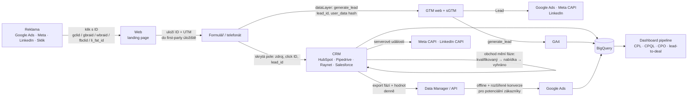

# LP 13: Řešení pro B2B a lead generation – zadání obsahu
> Stav: návrh v1 (8. 10. 2026) · Priorita: A · URL: `/reseni/b2b-a-lead-generation` · Segmenty: B2B, lead-gen (služby, výroba, stavebnictví, reality, finance, SaaS), velké firmy s obchodním týmem

Navazuje na: `00_architektura-webu.md`, `../05_formulare/specifikace-formularu.md` (kap. 4 – `generate_lead`, `lead_id`, hash), `../02_klicova-slova/data/lp_keyword_inputs.json` (`lp-b2b`), `../01_konkurence/` (nextanalytica – leadgen reporting, digitalniarchitekti – B2B reporty, datanimals, gameplan), `../06_clanky/` (cluster E).

---

## 0. Shrnutí

**Účel stránky.** Prodat **měření leadů až do zakázky**: formuláře a telefonáty → CRM → kvalita leadu → zpět do Google Ads, Mety a LinkedInu → reporting pipeline (CPL, CPQL, CPO, lead-to-deal). Stránka je pro datalayer.cz **diferenciátor**: v analýze konkurence ji jako službu implementace nemá nikdo (viz níže).

**Persony**
| Persona | Situace | Co hledá |
|---|---|---|
| Marketingový ředitel / Head of Growth B2B firmy | Kampaně přinášejí „hodně leadů“, obchod říká, že jsou špatné. Google Ads optimalizuje na odeslaný formulář. | Důkaz, které kanály přinášejí zakázky; reklamu, která se učí z obchodu |
| Obchodní ředitel / CEO menší B2B firmy | Platí agentuře, CRM vyplňuje obchod, nikdo nespojil data | Jedno číslo: kolik stojí zakázka z každého kanálu |
| PPC specialista / agentura klienta | Ví, že potřebuje offline konverze a rozšířené konverze pro leady, ale nemá přístup k CRM ani vývojáře | Technického partnera, který napojí web a CRM a pošle data zpět |
| CRM admin / IT | Má HubSpot/Pipedrive/Raynet/Salesforce, marketing chce „nějaká pole a export“ | Jasnou specifikaci polí, automatizace, bezpečnost dat |

**Konverze.** Hlavní: formulář `lp-b2b`. Druhá: telefon. Sekundární: článek E1 *Měření formulářů a leadů*, E3 *Offline konverze z CRM*, kalkulačka nákladů na zakázku (interaktivní mini-kalkulačka na stránce, viz 3.9).

**Proč tahle stránka vyhraje nad konkurencí**
1. **Nikdo to nedělá jako implementační službu.** NEXT analytica má *lead-gen reporting* (dashboard nad CRM), ale ne implementaci offline konverzí a rozšířených konverzí pro leady; Digitální architekti mají „B2B a SaaS reporty“ (~520 slov, bez offline konverzí); Khoder, Gameplan, Homola, Advisio, Visibility B2B/CRM neřeší vůbec. V SERP na „offline konverze google ads crm“ vedou nápověda Google a 2 slovenské/české blogy – žádná služba.
2. **Celý okruh, ne jen report.** Konkurence buď měří formulář, nebo reportuje z CRM. My spojíme obojí a vrátíme výsledek do reklamních systémů, aby se bidding učil z obchodu.
3. **Aktuálnost 2026:** Google Ads přesunul nahrávání offline konverzí do Data Manager API (od 15. 6. 2026), od dubna 2026 přijímá uživatelská data z tagu, Data Manageru i API současně a od června 2026 je pro web i leady jeden přepínač rozšířených konverzí; Meta starší Offline Conversions API už nepodporuje a offline události se posílají přes Conversions API. Konkurenční obsah to nereflektuje.
4. **Bezpečně s osobními údaji:** hashování, `ad_user_data`, žádné e-maily v GA4 – téma, kterého se velké B2B firmy bojí a konkurence ho nevysvětluje.

---

## 1. SEO a meta

| Prvek | Návrh |
|---|---|
| **Title** (52 znaků) | `Měření leadů a offline konverze z CRM \| datalayer.cz` |
| **Meta description** (152 znaků) | `Měříme leady od formuláře po zakázku v CRM a vracíme je do Google Ads a Meta: offline a rozšířené konverze, call tracking, CPL a CPO. Konzultace zdarma.` |
| **H1** (45 znaků) | `Měření leadů od formuláře až po zakázku v CRM` |
| **URL** | `/reseni/b2b-a-lead-generation` |
| **Breadcrumbs** | Domů › Řešení › B2B a lead generation |
| **Eyebrow** | `[ Řešení pro B2B a lead generation ]` |

### 1.1 Klíčová slova
Komerční objemy jsou malé (Σ ~100/měs., `lp_keyword_inputs.json`), hodnota zakázky vysoká. Stránka bude žít hlavně z interních odkazů z clusteru E, LinkedInu a PPC – SEO je důležité pro AI přehledy a dotazy typu „offline konverze“.

| Typ | Klíčové slovo | Objem | Kde použít |
|---|---|---|---|
| Hlavní | měření leadů | – (strategické) | H1, title, rychlá odpověď |
| Hlavní | offline konverze google ads crm | – (SERP dotaz, B2B mezera) | H3 „Offline konverze v Google Ads“, FAQ 2 |
| Vedlejší | crm integrace | 50 | H3 „CRM integrace: zdroj a click ID v každém kontaktu“ |
| Vedlejší | enhanced conversions for leads / rozšířené konverze pro potenciální zákazníky | 10 | H3 v řešení, FAQ 1 |
| Vedlejší | offline conversion tracking | 10 | text sekce řešení |
| Vedlejší | b2b web analytics / webová analytika pro B2B | 10 | podtitul, sekce „Pro koho“ |
| Vedlejší | crm analytics, crm analytics tool(s) | 10 / 10 | sekce Reporting |
| Vedlejší | power bi crm integration | 10 | sekce Reporting („Power BI napojený na CRM“) |
| Long-tail | hubspot marketing attribution, sales reporting hubspot | 10 / 10 | tabulka CRM (HubSpot) |
| Long-tail | pipedrive to bigquery | 10 | tabulka CRM (Pipedrive) |
| Long-tail | call tracking, google call tracking, how does call tracking work | 0 (EN long-tail) | H2 „Call tracking“ |
| Long-tail | měření formulářů ga4 | – (SERP) | H3 „Měření formulářů v GA4“ |
| Otázka (PAA) | What are enhanced conversions for leads? / Why might an advertiser use enhanced conversions for leads? | PAA | FAQ 1 |
| Otázka (PAA) | What is a good conversion rate for leads? | PAA | FAQ 8 |

### 1.2 Co na stránku NEpatří
- *rozšířené konverze google ads* (obecně, web/e-shop) → LP 06 Měření konverzí + článek E2. Zde jen varianta pro leady.
- *jak nastavit formulář jako cíl v google analytics* (20), *jak měřit formuláře v google tag manager* → článek E1 (návod). Zde jen „co měříme“, bez návodu.
- *offline konverze* informační varianta (jak na to krok za krokem) → článek E3.
- *looker studio dashboard*, *power bi* obecně → LP 08; *pipedrive to bigquery* jako technický návod → LP 07 / F4.
- *call tracking software* (výběr nástroje) → článek E5.

### 1.3 Strukturovaná data
```json
{
  "@context": "https://schema.org",
  "@graph": [
    {
      "@type": "Service",
      "@id": "https://datalayer.cz/reseni/b2b-a-lead-generation#service",
      "name": "Měření leadů a offline konverze pro B2B",
      "serviceType": "Měření formulářů, napojení CRM, offline a rozšířené konverze pro leady, call tracking, reporting pipeline",
      "description": "Měření leadů od formuláře po zakázku v CRM a jejich návrat do Google Ads, Meta a LinkedIn: offline konverze, rozšířené konverze pro potenciální zákazníky, call tracking a reporting CPL, CPO a lead-to-deal.",
      "provider": { "@type": "Organization", "@id": "https://datalayer.cz/#organization", "name": "datalayer.cz" },
      "areaServed": { "@type": "Country", "name": "CZ" },
      "audience": { "@type": "BusinessAudience", "audienceType": "B2B a lead generation firmy" },
      "url": "https://datalayer.cz/reseni/b2b-a-lead-generation"
    },
    {
      "@type": "BreadcrumbList",
      "itemListElement": [
        { "@type": "ListItem", "position": 1, "name": "Domů", "item": "https://datalayer.cz/" },
        { "@type": "ListItem", "position": 2, "name": "Řešení", "item": "https://datalayer.cz/reseni" },
        { "@type": "ListItem", "position": 3, "name": "B2B a lead generation", "item": "https://datalayer.cz/reseni/b2b-a-lead-generation" }
      ]
    },
    {
      "@type": "FAQPage",
      "mainEntity": [
        { "@type": "Question", "name": "Co jsou rozšířené konverze pro potenciální zákazníky a proč je používat?",
          "acceptedAnswer": { "@type": "Answer", "text": "{{FAQ 1 – generovat z komponenty FAQ}}" } }
      ]
    }
  ]
}
```
FAQ schema generovat ze zdroje FAQ komponenty (stejně jako LP 12). FAQ rich results Google od 7. 5. 2026 nezobrazuje – schema ponecháváme kvůli konzistenci.

### 1.4 OG obrázek
Piktogram **formulář → trychtýř → kartička „deal“** (štítek `lead`) vlevo; vpravo H1 a mono řádek `formulář → CRM → Google Ads · Meta · LinkedIn`. Tmavé pozadí, cyan linky, jedna oranžová šipka zpět (návrat konverze).

---

## 2. Wireframe

```
┌──────────────────────────────────────────────────────────────────────┐
│ Domů › Řešení › B2B a lead generation                                │
│ [ Řešení pro B2B a lead generation ]                                 │
│ H1 Měření leadů od formuláře          │ HERO MOCKUP „cesta leadu“:   │
│    až po zakázku v CRM                │ kampaň → formulář (gclid) →  │
│ Podtitul + rychlá odpověď             │ CRM „Vyhráno 480 000 Kč“ →   │
│ [Probrat měření leadů] [Jak to funguje]│ ↩ Google Ads „Zakázka“      │
├──────────────────────────────────────────────────────────────────────┤
│ TRUST BAR + věta „Většina agentur měří formulář. My i to, co následuje“│
├──────────────────────────────────────────────────────────────────────┤
│ H2 Poznáváte se? – 6 symptomů                                        │
├──────────────────────────────────────────────────────────────────────┤
│ H2 Jak to funguje – DIAGRAM web → formulář → CRM → zpět do reklam    │
│    (interaktivní, 6 kroků s popisem pod diagramem)                    │
├──────────────────────────────────────────────────────────────────────┤
│ H2 Co přesně nastavíme – 7 stavebních bloků (FeatureList)            │
├──────────────────────────────────────────────────────────────────────┤
│ H2 Mapa fází leadu – tabulka CRM fáze → GA4 → Google Ads → Meta      │
├──────────────────────────────────────────────────────────────────────┤
│ H2 Dlouhý obchodní cyklus – 4 pravidla                                │
├──────────────────────────────────────────────────────────────────────┤
│ H2 Reporting pipeline – mockup dashboardu + mini-kalkulačka CPO       │
├──────────────────────────────────────────────────────────────────────┤
│ H2 S jakým CRM pracujeme – tabulka 6 řádků                            │
├──────────────────────────────────────────────────────────────────────┤
│ H2 Call tracking – 4 úrovně                                           │
├──────────────────────────────────────────────────────────────────────┤
│ BOX Osobní údaje: co posíláme a co nikdy                              │
├──────────────────────────────────────────────────────────────────────┤
│ H2 Běžné měření leadů vs. měření až do CRM – srovnání                 │
├──────────────────────────────────────────────────────────────────────┤
│ H2 Co dostanete │ H2 Postup a délka                                   │
├──────────────────────────────────────────────────────────────────────┤
│ MINI CASE · FAQ 12 · Do hloubky · Navazující služby · KONTAKT         │
└──────────────────────────────────────────────────────────────────────┘
```
**Mobil:** hero mockup jako svislá „timeline“ 4 karet; diagram svisle se 6 číslovanými kroky; mapa fází jako akordeon (1 fáze = 1 karta); dashboard mockup zúžený na 4 KPI dlaždice + 1 tabulku kanálů se swipe; CRM tabulka jako karty. Sticky lišta `Zavolat` · `Napsat`.

---

## 3. Obsah sekcí

### 3.1 Hero
- **Komponenta:** `HeroService`.
- **H1:** Měření leadů od formuláře až po zakázku v CRM
- **Podtitul:** Propojíme formuláře, telefonáty a CRM s Google Ads, Metou a LinkedInem. Reklama se pak neučí z počtu vyplněných formulářů, ale z toho, které poptávky obchod opravdu uzavřel.
- **Rychlá odpověď (58 slov):**
  > Měření leadů pro B2B spojuje tři místa: web, kde lead vznikne, CRM, kde obchod zjistí jeho kvalitu a hodnotu, a reklamní systémy, které z výsledku optimalizují. Formulář uloží zdroj a ID kliknutí do CRM, fáze obchodu se posílají zpět jako offline a rozšířené konverze a report ukáže cenu leadu i cenu zakázky.
- **CTA1:** `[ Probrat měření leadů ]` → `#kontakt` (`b2b_hero_konzultace`)
- **CTA2:** `[ Ukázat, jak to funguje ]` → `#jak-to-funguje` (`b2b_hero_diagram`)
- **Mikrocopy:** „30 minut zdarma · pracujeme s HubSpotem, Pipedrive, Raynetem, Salesforce i vlastním CRM · odpověď do 1 pracovního dne“ *(výčet CRM jen ty, které klient potvrdí – `[DOPLNIT]`)*
- **Vizuál – mockup „cesta jednoho leadu“** (4 karty spojené přerušovanou čarou, ukázková data):
  1. Karta `Google Ads · Search` – „kampaň: Průmyslové podlahy – B2B“, mono `gclid=Cj0KCQjw…`
  2. Karta `Formulář · /poptavka` – pole Firma „ACME Stavby s.r.o.“, mono `event: generate_lead · lead_id: L-26-0912`
  3. Karta `CRM · deal` – „ACME Stavby · Fáze: Vyhráno · 480 000 Kč · 41 dní“ (zelený štítek „won“)
  4. Oranžová šipka zpět na kartu 1: `↩ Google Ads: konverze „Zakázka“ · 480 000 Kč`
  - Animace: karty se postupně rozsvítí (0,4 s krok), zpětná šipka jako poslední. `prefers-reduced-motion` = statické. Štítek „ukázková data“.
  - `aria-label`: „Cesta leadu: klik na reklamu v Google Ads, odeslaný formulář s ID kliknutí, obchodní případ v CRM ve fázi Vyhráno za 480 000 Kč a zpětné odeslání konverze do Google Ads.“

### 3.2 Trust bar
- **Komponenta:** `TrustBar`.
- Položky: `[DOPLNIT: počet B2B / lead-gen projektů]` · `Google Ads · Meta · LinkedIn · Sklik` · `HubSpot · Pipedrive · Raynet · Salesforce · vlastní CRM` `[DOPLNIT/ověřit, se kterými má tým zkušenost]` · `Osobní údaje jen hashované a se souhlasem`.
- **Věta pod trust barem (mono, cyan, 16 px):** `// Většina agentur měří odeslaný formulář. My měříme i to, co se s poptávkou stalo potom.`

### 3.3 Symptomy
- **Komponenta:** `SymptomCards` (3×2).
- **H2:** Poznáváte se v některém z těchto problémů?

| # | Nadpis (H3) | Text | Piktogram |
|---|---|---|---|
| 1 | Hodně leadů, málo zakázek | Kampaně hlásí rekordní počet poptávek, obchod tvrdí, že polovina jsou studenti, konkurence a spam. Kdo má pravdu, nikdo neví. | Trychtýř široký nahoře, s kapkou dole |
| 2 | Google Ads optimalizuje na formulář | Chytré nabídky se učí, že dobrý lead je jakýkoliv lead. Proto přivádějí víc levných a horších. | Terč, šipka trefuje okraj |
| 3 | V CRM chybí zdroj | Obchodník vidí jméno a telefon, ale ne kampaň, klíčové slovo ani to, že zákazník přišel z LinkedInu. | Kartička kontaktu s prázdným řádkem `source: —` |
| 4 | Telefonáty nikdo neměří | Polovina poptávek přijde telefonem, v reportech neexistují. | Telefon s otazníkem |
| 5 | Obchodní cyklus trvá měsíce | Zakázka se uzavře za 3 měsíce a reklamní systém se ji nikdy nedozví. | Kalendář s dlouhou šipkou přes 3 měsíce |
| 6 | Report pro vedení se skládá ručně | Náklady z Ads, leady z GA4, zakázky z CRM – každý měsíc jiný Excel a jiná čísla. | Tři tabulky se šipkami do jedné |

- **Měření:** `cta_click` (`b2b_symptom_1`…`6`) – každá karta má odkaz na relevantní kotvu.

### 3.4 Diagram – „Jak to funguje“ (`#jak-to-funguje`)
- **Účel:** hlavní vizuál stránky (zadání klienta: „web → formulář → CRM → zpět do reklam“).
- **Komponenta:** `DataFlowDiagram` (interaktivní – klik na uzel zvýrazní krok v seznamu pod diagramem).
- **H2:** Jak to funguje: od kliknutí na reklamu po zakázku a zpět



**Popis 6 kroků pod diagramem (číslované, krátké):**
1. **Klik na reklamu.** Reklamní systém přidá do URL identifikátor kliknutí (`gclid`, u iOS `gbraid`/`wbraid`, `fbclid`, `li_fat_id`). Web ho uloží spolu s UTM parametry – jen pokud to souhlas návštěvníka dovoluje.
2. **Odeslání formuláře.** Do datové vrstvy odejde `generate_lead` s ID leadu a hashovaným e-mailem a telefonem; GA4 a reklamní systémy dostanou lead okamžitě.
3. **Zápis do CRM.** Skrytá pole formuláře předají do CRM zdroj, kampaň, identifikátory kliknutí a stejné `lead_id`. Obchodník vidí, odkud poptávka přišla.
4. **Práce obchodu.** Obchod lead kvalifikuje, pošle nabídku, uzavře nebo ztratí. Každá změna fáze je datový bod.
5. **Návrat do reklam.** Jednou denně se fáze a hodnoty posílají zpět: do Google Ads jako offline konverze a rozšířené konverze pro potenciální zákazníky, do Mety a LinkedInu přes Conversions API.
6. **Report.** BigQuery spojí náklady, leady a zakázky; dashboard ukáže cenu leadu, cenu kvalifikovaného leadu a cenu zakázky po kanálech.

- **Designér:** uzly ve stylu hero; zpětné šipky (krok 5) **oranžové** `#ff7400` – vizuálně „návrat“. CRM uzel větší, s ikonou kartičky „deal“. Mobil: svislý řetěz, zpětná šipka jako oranžový pruh vpravo podél celé výšky.
- **Měření:** `diagram_interaction` (`diagram_id: b2b_flow`, `node`).

### 3.5 Co přesně nastavíme – 7 stavebních bloků
- **Komponenta:** `FeatureList` (číslované karty, 2 sloupce). Každá karta: H3, 50–90 slov, mono štítek, odkaz.
- **H2:** Co přesně nastavíme

**1. Měření formulářů v GA4 a GTM** `form`
Měříme celý formulář, ne jen „děkujeme“ stránku: začátek vyplňování (`lead_form_start`), chyby validace (`lead_form_error`) a úspěšné odeslání jako doporučenou událost GA4 `generate_lead` s ID formuláře a tématem. Uvidíte, na kterém poli lidé odcházejí a které landing page přivádějí poptávky. U formulářů třetích stran (HubSpot, Typeform, iframe) zvolíme spolehlivý způsob zachycení, nebo doporučíme nativní formulář. → *Měření formulářů a leadů* (E1)

**2. CRM integrace: zdroj a click ID v každém kontaktu** `crm`
Do CRM přidáme pole pro zdroj, médium, kampaň, vstupní stránku, identifikátory kliknutí a `lead_id`, a formulář je bude vyplňovat automaticky. Obchodník tak u každé poptávky vidí, odkud přišla, a data lze později poslat zpět do reklam. Specifikaci polí a automatizací připravíme pro vašeho CRM admina, nebo je nastavíme sami.

**3. Kvalita leadů: fáze, které dávají smysl** `quality`
S obchodem nastavíme jednoduchou mapu fází (nový → kontaktovaný → kvalifikovaný → nabídka → vyhráno/prohráno) a pravidla, kdy se fáze mění. Fáze propisujeme do GA4 jako doporučené události pro lead generation (`qualify_lead`, `close_convert_lead`…). Bez disciplíny v CRM nefunguje žádné měření – proto je součástí krátké zaškolení obchodu.

**4. Offline konverze v Google Ads a rozšířené konverze pro potenciální zákazníky** `ads`
Vyhrané zakázky a kvalifikované leady posíláme do Google Ads s hodnotou. Kombinujeme identifikátor kliknutí s hashovaným e-mailem a telefonem z formuláře (rozšířené konverze pro potenciální zákazníky), což Google pro nové implementace doporučuje. Od června 2026 se nahrávání řeší přes Google Ads Data Manager / Data Manager API – nastavíme pravidelný import z CRM, BigQuery nebo tabulky. → *Offline konverze z CRM do Google Ads a Meta* (E3)

**5. Meta a LinkedIn: serverové události z CRM** `capi`
Lead z webu posíláme do Mety přes Pixel i Conversions API se stejným `event_id` (deduplikace) a další fáze z CRM jako serverové události. Pro kampaně s formuláři přímo v Metě (Lead Ads) nastavíme Conversions API pro CRM, které umožní optimalizaci na kvalitu leadu. Pro B2B kampaně na LinkedInu napojíme LinkedIn Conversions API.

**6. Call tracking** `call`
Telefonáty měříme podle toho, jak velkou část poptávek tvoří: od kliku na číslo, přes volání z reklam Google Ads, po dynamická čísla na webu s napojením na CRM. Detail níže.

**7. Reporting pipeline** `report`
Náklady z reklamních systémů, leady z GA4 a fáze z CRM spojíme v BigQuery a postavíme dashboard v Data Studiu (dříve Looker Studio) nebo Power BI: cena leadu, cena kvalifikovaného leadu, cena zakázky a podíl uzavřených obchodů podle kanálů a kampaní. → *Dashboardy a reporting*

- **Měření:** `cta_click` u odkazů (`b2b_blok_{1–7}`).

### 3.6 Mapa fází leadu
- **Účel:** konkrétní „artefakt“, který klient dostane; vysvětlení vazby CRM ↔ GA4 ↔ reklamy.
- **Komponenta:** `ComparisonTable` (6 sloupců; mobil = akordeon).
- **H2:** Mapa fází leadu: co se kam posílá
- **Úvod:** Každá firma má fáze pojmenované jinak. Princip je ale stejný: rané fáze slouží reklamním systémům k rychlému učení, pozdní fáze k ověření, že reklama vydělává. Tady je ukázka, jak mapu navrhujeme.

| Fáze v CRM (ukázka) | Událost GA4 (doporučená) | Konverzní akce v Google Ads | Meta / LinkedIn | Hodnota | Kdy se posílá |
|---|---|---|---|---|---|
| Odeslaný formulář / hovor | `generate_lead` | „Lead – formulář“ (sekundární) | `Lead` (Pixel + CAPI, `event_id`) / Lead | odhad (např. průměrná hodnota × pravděpodobnost uzavření) | okamžitě z webu |
| Kontaktovaný | `working_lead` | – | – | – | z CRM, denně |
| Kvalifikovaný (SQL) | `qualify_lead` | „Kvalifikovaný lead“ (**primární** při dlouhém cyklu) | vlastní událost „QualifiedLead“ (CAPI) | hodnota podle segmentu | z CRM, denně |
| Diskvalifikovaný | `disqualify_lead` | – (neposílat jako konverzi) | – | – | z CRM (jen GA4/BigQuery) |
| Nabídka odeslána | vlastní `proposal_sent` | „Nabídka“ (sekundární) | volitelně | hodnota nabídky | z CRM, denně |
| Vyhráno | `close_convert_lead` | „Zakázka“ (**primární** při krátkém cyklu) | `Purchase` / vlastní „Won“ (CAPI) | skutečná hodnota zakázky (bez DPH) | z CRM, denně |
| Prohráno | `close_unconvert_lead` | – | – | – | z CRM (jen GA4/BigQuery) |

- **Text pod tabulkou:** Primární konverzi, na kterou se učí chytré nabízení, volíme podle délky cyklu a počtu konverzí: čím delší cyklus a čím méně zakázek, tím dřívější fázi. Ostatní fáze sledujeme jako sekundární, aby report ukazoval celý trychtýř.
- **Vizuál:** tabulka, sloupec „Fáze v CRM“ s barevnými štítky (šedá → cyan → zelená / červená). Ikona ↩ u řádků, které se vracejí do reklamních systémů.
- **Poznámka pro vývoj:** `action_source` u serverových událostí Meta zvolit podle zdroje (např. `system_generated`) – ověřit při implementaci v aktuální dokumentaci Meta.

### 3.7 Dlouhý obchodní cyklus
- **Komponenta:** `FeatureList` (4 body s mono čísly `01`–`04`).
- **H2:** Co když obchod trvá týdny nebo měsíce?
- **Úvod:** V B2B se zakázka často uzavře až za několik týdnů nebo měsíců. Reklamní systémy ale potřebují zpětnou vazbu rychle a mají časová okna. S tím počítáme od začátku.

**01 · Uložíme identifikátory hned při vzniku leadu.** ID kliknutí a hashované kontaktní údaje se zapíšou do CRM ve chvíli odeslání formuláře. Později už je nikdo nedohledá.

**02 · Hlídáme časová okna.** Google Ads přiřadí offline konverzi jen v rámci konverzního okna konverzní akce (nejdéle 90 dní od kliknutí). Když obchod trvá déle, optimalizujeme na dřívější fázi (kvalifikovaný lead) a zakázky sledujeme v reportu.

**03 · Hodnota místo počtu.** Raným fázím přiřadíme očekávanou hodnotu (průměrná zakázka × pravděpodobnost uzavření v dané fázi). Chytré nabízení pak upřednostní leady, které mají větší šanci na velkou zakázku.

**04 · Kupní skupina, ne jeden člověk.** V B2B se rozhoduje víc lidí z jedné firmy. V CRM párujeme kontakty na firmu a obchodní případ, aby se jedna zakázka nezapočítala třikrát a aby report ukazoval i nepřímý vliv kampaní.

### 3.8 Reporting pipeline
- **Účel:** ukázat konkrétní výstup pro vedení (vzor NEXT leadgen reporting, ale s vlastními daty a širší tabulkou kanálů).
- **Komponenta:** `DashboardMockup` (HTML/SVG stylizovaný Data Studio) + `MiniCalculator`.
- **H2:** Reporting pipeline: cena leadu, cena zakázky a co mezi tím
- **Text:** Report odpovídá na tři otázky: kolik stojí zakázka z každého kanálu, kde se trychtýř láme a kolik peněz je rozpracovaných v obchodě. Data se obnovují automaticky, žádný ruční Excel.

**Mockup (ukázková data – štítek „ukázkový příklad“), období Q3:**

KPI dlaždice: `Náklady 186 000 Kč` · `Leady 412 · CPL 451 Kč` · `Kvalifikované 158 · CPQL 1 177 Kč` · `Zakázky 14 · CPO 13 286 Kč` · `Lead-to-deal 3,4 %` · `Hodnota zakázek 2,94 mil. Kč`

Trychtýř (horizontální pruhy): Leady 412 → Kvalifikované 158 (38 %) → Nabídky 47 (11 %) → Zakázky 14 (3,4 %).

Tabulka kanálů:
| Kanál | Náklady | Leady | CPL | Kvalifikované | CPQL | Zakázky | CPO |
|---|---|---|---|---|---|---|---|
| Google Ads – Search | 92 000 Kč | 180 | 511 Kč | 82 | 1 122 Kč | 8 | 11 500 Kč |
| Meta | 48 000 Kč | 168 | 286 Kč | 34 | 1 412 Kč | 1 | 48 000 Kč |
| LinkedIn | 36 000 Kč | 38 | 947 Kč | 27 | 1 333 Kč | 4 | 9 000 Kč |
| Sklik | 10 000 Kč | 26 | 385 Kč | 15 | 667 Kč | 1 | 10 000 Kč |
| **Celkem** | **186 000 Kč** | **412** | **451 Kč** | **158** | **1 177 Kč** | **14** | **13 286 Kč** |

- **Popisek pod mockupem (pointa):** Meta má nejlevnější lead, ale nejdražší zakázku. LinkedIn má nejdražší lead, ale nejlevnější zakázku. Bez propojení s CRM byste rozpočet přesouvali opačným směrem.
- **Mini-kalkulačka „Kolik vás stojí zakázka?“** (pod mockupem): vstupy *Měsíční náklady na reklamu (Kč)*, *Počet leadů za měsíc*, *Kolik % leadů se stane zakázkou* → výstupy *CPL*, *CPO*, věta „Když se díky lepší optimalizaci zvýší podíl uzavřených leadů o 1 procentní bod, cena zakázky klesne na X Kč.“ Výpočet v prohlížeči, nic se neodesílá. CTA `[ Chci tenhle report na svých datech ]` (`b2b_report_kalkulacka`).
- **Měření:** `tool_use` (`tool: b2b_cpo_calc`, `action: calculate`); `cta_click`.
- **Designér:** mockup v brand barvách (tmavé karty, cyan čísla, zelená/oranžová jen pro odchylky). Na mobilu KPI 2×3, tabulka kanálů se 4 sloupci (Kanál, Leady, Zakázky, CPO) + „zobrazit vše“.

### 3.9 S jakým CRM pracujeme
- **Komponenta:** `ComparisonTable`.
- **H2:** S jakým CRM pracujeme
- **Úvod:** Na konkrétním CRM záleží méně, než se zdá. Rozhoduje, jestli do něj dostaneme zdroj leadu a jestli z něj umíme pravidelně vyexportovat fáze. Tady je, jak to řešíme u nejčastějších systémů.

| CRM | Zdroj a click ID do CRM | Návrat do Google Ads | Návrat do Mety / LinkedInu | Reporting |
|---|---|---|---|---|
| **HubSpot** | Skrytá pole / vlastnosti kontaktu a dealu, nativní nebo vlastní formulář | Nativní propojení v Google Ads Data Manager (podmínky podle fáze životního cyklu) | Přes CAPI (sGTM nebo integrace) – ověříme podle tarifu HubSpotu | Data Studio / Power BI, HubSpot reporty, BigQuery |
| **Salesforce** | Pole na Lead/Opportunity, Web-to-Lead nebo API | Nativní propojení v Google Ads Data Manager | CAPI (Meta má pro Salesforce samostatného průvodce) | BigQuery, Power BI |
| **Pipedrive** | Vlastní pole na dealu/osobě přes API nebo webhook | Export přes API do BigQuery / Google Sheets → Data Manager | CAPI ze sGTM nebo z exportu | BigQuery („pipedrive to BigQuery“), Data Studio |
| **Raynet** | Vlastní pole přes API | Export → BigQuery / Sheets → Data Manager *(dostupnost API a webhooků ověříme na vašem tarifu)* | CAPI ze sGTM nebo z exportu | BigQuery, Power BI |
| **Microsoft Dynamics 365** | Pole na Lead/Opportunity | Export do BigQuery / SFTP / HTTP → Data Manager | CAPI | Power BI |
| **Vlastní CRM / ERP / tabulka** | Podle možností systému (API, databáze, export) | BigQuery, MySQL/PostgreSQL, SFTP nebo Google Sheets → Data Manager | CAPI ze serveru | BigQuery + dashboard |

- **Pozn. pod tabulkou:** Google Ads Data Manager umí načítat data mimo jiné z Google Sheets, BigQuery, Cloud Storage, SFTP, HTTP, MySQL, PostgreSQL, Snowflake, Redshift a z HubSpotu a Salesforce. Pro ostatní CRM používáme mezikrok přes BigQuery nebo tabulku.
- **Vizuál:** textové monogramy CRM, bez log (licence). `[DOPLNIT: potvrdit, se kterými CRM má tým praktickou zkušenost; ostatní řádky formulovat „umíme napojit přes API“]`.

### 3.10 Call tracking
- **Komponenta:** `FeatureList` – 4 úrovně jako schody (vizuálně stoupající karty).
- **H2:** Call tracking: měření telefonátů, které vedou k zakázkám
- **Úvod:** V řadě B2B oborů přijde velká část poptávek telefonem. Měřit je jde na čtyřech úrovních – podle toho, kolik hovorů máte a jak přesná data potřebujete.

| Úroveň | Co měří | Jak | Pro koho |
|---|---|---|---|
| **1 · Klik na číslo** | Kolik lidí klikne na telefon na webu (mobil) | Událost `contact_click` v GA4, sekundární konverze v Ads | Každý web – základ |
| **2 · Volání z reklam Google Ads** | Hovory z rozšíření s voláním a z reklam jen s voláním | Google forwarding number (v ČR dostupné), konverze podle minimální délky hovoru | Firmy s reklamou ve vyhledávání |
| **3 · Dynamická čísla na webu** | Který kanál, kampaň a stránka vedly k hovoru | Poskytovatel call trackingu přidělí každé návštěvě číslo z poolu; hovor se spáruje se zdrojem a pošle do GA4 a CRM | Firmy, kde telefon tvoří významnou část poptávek |
| **4 · Hovor jako lead v CRM** | Kvalita a výsledek hovoru | Ústředna nebo call tracking zapíše hovor do CRM jako lead se zdrojem; dál pokračuje stejně jako formulář (fáze → offline konverze) | B2B s obchodním týmem |

- **Text pod tabulkou:** U úrovně 3 a 4 je potřeba informovat volající, pokud se hovory nahrávají, a vybrat poskytovatele s daty zpracovávanými v EU. Konkrétního poskytovatele doporučíme podle ústředny a CRM, které používáte. → *Měření telefonátů a call tracking v ČR* (E5)
- `[DOPLNIT: případně partnerský poskytovatel call trackingu, pokud ho klient má]`

### 3.11 Box – „Osobní údaje: co posíláme a co nikdy“
- **Komponenta:** `InfoBox` (dva sloupce ✓ / ✕, mono).
- **H3:** Osobní údaje: co posíláme a co nikdy
- ✓ **Posíláme:** e-mail a telefon jen jako SHA-256 hash po normalizaci (malá písmena, bez mezer, telefon ve formátu +420…), jen do Google Ads, Mety a LinkedInu, jen když návštěvník udělil souhlas `ad_user_data` (Consent Mode v2) · ID kliknutí a ID leadu · hodnotu a fázi obchodu.
- ✕ **Nikdy:** e-mail, jméno ani telefon v čitelné podobě do GA4 (podmínky Google Analytics to zakazují) · obsah zprávy z formuláře · citlivé údaje (zdraví, finance jednotlivce) · data bez souhlasu tam, kde je souhlas potřeba.
- **Text:** Rozšířené konverze Google patří mezi služby, kde Google vystupuje jako zpracovatel podle podmínek Google Ads Data Processing Terms. Vy jste správce údajů z CRM, my zpracovatel – uzavíráme zpracovatelskou smlouvu. Právní titul pro předání údajů reklamním systémům a texty zásad by měl posoudit váš právník; nejsme advokátní kancelář.
- **Odkaz:** *Osobní údaje v analytice: co smíte poslat do GA4, Google Ads a Meta* → `/blog/osobni-udaje-v-analytice`.

### 3.12 Srovnání – „Běžné měření leadů vs. měření až do CRM“
- **Komponenta:** `ComparisonTable` (2 sloupce).
- **H2:** Běžné měření leadů vs. měření až do CRM

| | **Běžné měření leadů** | **Měření až do CRM (datalayer.cz)** |
|---|---|---|
| Co je konverze | Odeslaný formulář / „děkujeme“ stránka | Formulář, kvalifikovaný lead, nabídka, zakázka – každá s hodnotou |
| Na co se učí Google Ads a Meta | Na počet formulářů | Na leady, ze kterých jsou zakázky |
| Zdroj leadu v CRM | Chybí, nebo ho obchodník dopisuje ručně | Automaticky: kampaň, klíčové slovo, click ID |
| Telefonáty | Neměří se | Podle zvolené úrovně call trackingu |
| Report | Cena za lead | Cena za lead, za kvalifikovaný lead i za zakázku, po kanálech |
| Osobní údaje | Často e-mail v URL nebo v GA4 | Jen hash, se souhlasem, ve smluvním rámci |
| Kdo to dnes nabízí | Většina PPC agentur jako součást správy kampaní | Samostatné řešení s mapou fází, implementací a dokumentací |

### 3.13 Co dostanete
- **Komponenta:** `Deliverables`.
- **H2:** Co od nás dostanete

| Výstup | Popis |
|---|---|
| `mapa-fazi-leadu.pdf` | Fáze leadu, pravidla jejich změny, vazba na GA4, Google Ads, Metu a LinkedIn, hodnoty |
| `merici-plan.xlsx` | Formuláře, telefonáty, události, parametry, konverzní akce (primární/sekundární) |
| Specifikace formulářů | `dataLayer` kontrakt (`lead_form_start`, `lead_form_error`, `generate_lead` s `lead_id` a hashem), skrytá pole, uložení click ID |
| Úprava CRM | Seznam polí, automatizace, export – nastavené nebo připravené pro vašeho admina |
| Napojení reklamních systémů | Google Ads (offline konverze + rozšířené konverze pro leady přes Data Manager), Meta CAPI, LinkedIn CAPI, Sklik dle potřeby |
| Call tracking | Nastavení zvolené úrovně |
| Dashboard pipeline | Data Studio nebo Power BI nad BigQuery |
| Dokumentace + zaškolení obchodu | Jak vyplňovat fáze, aby data dávala smysl (30–45 min) |

### 3.14 Postup a délka
- **Komponenta:** `ProcessTimeline`.
- **H2:** Jak postupujeme a jak dlouho to trvá

| # | Krok | Co se děje | Délka (orientačně) | Co potřebujeme od vás |
|---|---|---|---|---|
| 1 | Úvodní konzultace | Formuláře, CRM, kanály, délka obchodního cyklu | 30 min, zdarma | Kdo vlastní marketing, obchod a CRM |
| 2 | Audit | Formuláře, GTM, GA4, konverzní akce, pole v CRM, kvalita dat | 3–5 pracovních dnů | Přístupy pro čtení (web, GTM, GA4, Ads, Meta, CRM) |
| 3 | Workshop s obchodem | Mapa fází leadu, hodnoty, pravidla | 1–2 h | Obchodní ředitel nebo zkušený obchodník |
| 4 | Implementace web + CRM | Formuláře, click ID, dataLayer, pole a automatizace v CRM | 1–3 týdny | CRM admin, případně vývojář webu |
| 5 | Napojení reklam | Data Manager, CAPI, call tracking | 1–2 týdny | Admin přístup do reklamních účtů |
| 6 | Validace | Testovací leady, první offline konverze, kontrola párování | 2–4 týdny (podle délky cyklu) | Obchod, který fáze opravdu mění |
| 7 | Report a předání | Dashboard, dokumentace, zaškolení | 1–2 týdny | – |

- **Pozn.:** První zakázky se v reklamních systémech objeví až po uzavření prvních obchodů; chytré nabízení potřebuje další týdny, než se přizpůsobí. Počítejte s tím, že plný efekt se ukáže až za jeden až dva obchodní cykly.

### 3.15 Případová studie
- **Komponenta:** `MiniCase`.
- **H2:** Z praxe: `[DOPLNIT: např. „Výrobní firma: z ceny za lead na cenu za zakázku“]`
- Problém `[DOPLNIT]` · Příčina `[DOPLNIT]` · Řešení `[DOPLNIT]` · Výsledek `[DOPLNIT: např. změna CPO / podílu kvalifikovaných leadů, období, zdroj dat]`.
- Do dodání skrýt. U B2B počítat s anonymizací („B2B firma z oboru stavebních materiálů“).

### 3.16 FAQ
- **H2:** Časté otázky k měření leadů

**1. Co jsou rozšířené konverze pro potenciální zákazníky a proč je používat?**
Je to vylepšená forma importu offline konverzí v Google Ads. Formulář na webu uloží e-mail nebo telefon zájemce jako hash a když obchod lead uzavře, pošlete do Google Ads stejný hash s výsledkem. Google ho spáruje s přihlášeným účtem, který klikl na reklamu – i když se ID kliknutí ztratilo. Google ji pro nové implementace doporučuje před samotným importem přes GCLID a rozšířené konverze pro web a pro leady dnes zapínáte jedním nastavením. Funguje jen tam, kde návštěvník udělil souhlas `ad_user_data`.

**2. Jak dostat zakázky z CRM zpět do Google Ads?**
Potřebujete tři věci: zapnuté automatické značkování v Google Ads, uložené ID kliknutí nebo hash kontaktu u každého leadu v CRM a pravidelný export fází s hodnotou. Export nastavíme přes Google Ads Data Manager – přímo z HubSpotu či Salesforce, nebo přes BigQuery, Google Sheets nebo SFTP. Od 15. 6. 2026 Google omezil nahrávání offline konverzí přes Google Ads API a směruje ho do Data Manager API, takže starší skripty je potřeba převést. Novou konverzní akci je dobré založit dřív, než začnete ID sbírat.

**3. Funguje to i s Pipedrive, Raynetem nebo naším vlastním CRM?**
Ano. Nativní konektory v Google Ads Data Manager existují pro HubSpot a Salesforce; pro ostatní CRM data vyexportujeme přes API nebo webhook do BigQuery či tabulky a odtud je Data Manager načte. Podmínkou je, aby CRM umělo uložit vlastní pole (zdroj, ID kliknutí, ID leadu) a aby šlo fáze obchodu pravidelně exportovat. U Raynetu a dalších systémů ověříme dostupnost API na vašem tarifu ještě před nabídkou.

**4. Co když náš obchodní cyklus trvá déle než 90 dní?**
Google Ads přiřadí offline konverzi jen v rámci konverzního okna, které je nejvýše 90 dní od kliknutí. U delších cyklů proto jako primární konverzi pro chytré nabízení použijeme dřívější fázi – typicky kvalifikovaný lead s očekávanou hodnotou – a vyhrané zakázky sledujeme v reportu nad BigQuery. Tak se reklama učí rychle a vy přesto vidíte, kolik stojí skutečná zakázka.

**5. Jak to funguje s Metou (Facebook a Instagram)?**
Leady z webového formuláře posíláme do Mety přes Pixel i Conversions API se stejným `event_id`, aby se nezapočítaly dvakrát. Další fáze z CRM posíláme jako serverové události s hashovaným e-mailem a telefonem. Pokud používáte formuláře přímo v Metě (Lead Ads), nastavíme Conversions API pro CRM, které umí optimalizovat na kvalitu leadu – Meta pro něj vyžaduje mimo jiné alespoň 200 leadů měsíčně a denní nahrávání dat. Starší Offline Conversions API Meta už nepodporuje (od Graph API v17.0 nepřijímá offline události, dokumentace ji vede jako legacy); offline a CRM události se posílají přes Conversions API.

**6. Je posílání dat z CRM do Googlu a Mety v souladu s GDPR?**
Technicky to nastavujeme konzervativně: kontaktní údaje jen jako hash, jen se souhlasem `ad_user_data`, žádné osobní údaje v GA4 a jen nezbytná pole. Google u rozšířených konverzí vystupuje jako zpracovatel podle Google Ads Data Processing Terms, my jako váš zpracovatel na základě zpracovatelské smlouvy. Zda máte pro předání údajů reklamním systémům právní titul a jak o něm informujete, by měl posoudit váš právník – nejsme advokátní kancelář, ale dodáme mu přesný popis datových toků.

**7. Jak měřit telefonáty?**
Záleží na tom, kolik poptávek přichází telefonem. Základ je měření kliků na telefonní číslo. Pro reklamu ve vyhledávání lze použít přesměrovací čísla Google, která jsou v ČR dostupná a počítají hovory delší než zvolený limit jako konverze. Pokud telefon tvoří velkou část poptávek, doporučíme dynamická čísla od poskytovatele call trackingu: každý hovor se spáruje s kanálem a kampaní a zapíše se do CRM jako lead.

**8. Jaký je dobrý konverzní poměr leadů a kolik jich potřebujeme?**
Univerzální číslo neexistuje – podíl leadů, ze kterých je zakázka, se liší podle oboru, ceny a kanálu, a mezi kanály se často liší několikanásobně. Proto ho měříme pro každý kanál zvlášť. Pro reklamní systémy platí, že čím méně konverzí dané fáze měsíčně máte, tím dřívější fázi je lepší použít pro optimalizaci. U Meta Lead Ads s optimalizací na kvalitu Meta požaduje alespoň 200 leadů měsíčně.

**9. Kolik to stojí a z čeho se cena skládá?**
Cenu určuje počet formulářů a vstupních kanálů (web, telefon, Lead Ads), CRM a jeho možnosti exportu, počet reklamních systémů, úroveň call trackingu a to, jestli chcete dashboard. Ceník neuvádíme; po úvodní konzultaci a krátkém auditu dostanete nabídku s pevným rozsahem, výstupy a termínem. Poplatky za call tracking nebo licence CRM platíte přímo poskytovatelům.

**10. Co od nás budete potřebovat?**
Přístupy do webu nebo GTM, GA4, Google Ads, Meta Business Manageru, případně LinkedIn Campaign Manageru, a administrátora CRM (nebo dočasný přístup pro nás). Hlavně ale potřebujeme 1–2 hodiny s obchodem: bez dohody, co znamená „kvalifikovaný lead“ a kdy se mění fáze, žádné měření fungovat nebude. Po spuštění je důležité, aby obchodníci fáze v CRM opravdu vyplňovali.

**11. Za jak dlouho uvidíme výsledky?**
Měření formulářů a zdroje v CRM funguje hned po implementaci, typicky do 2–4 týdnů. Offline konverze se v reklamních systémech objeví, až obchod uzavře první obchody z nově měřených leadů – podle délky vašeho cyklu za týdny až měsíce. Chytré nabízení se pak přizpůsobuje další týdny. Plný efekt počítejte po jednom až dvou obchodních cyklech.

**12. Měříte i LinkedIn?**
Ano. Pro B2B kampaně nastavíme LinkedIn Insight Tag (se souhlasem) a LinkedIn Conversions API, přes které lze posílat online i offline konverze ze serveru. Do reportu přidáme náklady z LinkedIn Campaign Manageru, aby bylo vidět, kolik stojí zakázka z LinkedInu ve srovnání s Google Ads a Metou.

### 3.17 Do hloubky
- **H2:** Do hloubky
1. *Měření formulářů a leadů: od formuláře po zakázku v CRM* → `/blog/mereni-formularu-a-leadu`
2. *Offline konverze z CRM do Google Ads a Meta* → `/blog/offline-konverze-z-crm`
3. *Rozšířené konverze (enhanced conversions) pro web i leady* → `/blog/rozsirene-konverze`
4. *Měření telefonátů a call tracking v ČR* → `/blog/mereni-telefonatu`
5. *Marketingový dashboard: jaké KPI sledovat v e-shopu a v B2B* → `/blog/marketingovy-dashboard`
- Rezerva: *Osobní údaje v analytice* → `/blog/osobni-udaje-v-analytice`; *Atribuce v GA4 a reklamních systémech* → `/blog/atribuce-ga4`.

### 3.18 Navazující služby
- 3 karty: **Měření konverzí** (*Ads, Meta, Sklik i Heureka vidí totéž*) → `/sluzby/mereni-konverzi` · **BigQuery** (*surová data bez limitů GA4*) → `/sluzby/bigquery` · **Dashboardy a reporting** (*report, kterému věří vedení*) → `/sluzby/dashboardy-a-reporting`.
- Textové odkazy: Server-side tracking · Cookie lišta a Consent Mode · Audit měření.

---

## 4. Kontaktní blok

| Pole | Hodnota |
|---|---|
| `form_id` | `lp-b2b` |
| Předvybraná témata | `konverze` + **nové téma `leady-crm`** (chip „Leady & CRM“) |
| H2 | Pojďme zjistit, kolik vás stojí zakázka, ne lead |
| Lead | Napište nám, zavolejte, nebo vyplňte formulář. Na úvodní 30minutové konzultaci projdeme vaše formuláře, CRM a kampaně a řekneme, co propojit jako první – nezávazně a zdarma. |
| Placeholder zprávy | Např. máme HubSpot, leady z Google Ads a LinkedInu, obchod říká, že polovina je nekvalitních, a chceme posílat zakázky zpět do reklam… |
| Placeholder Web | `www.vase-firma.cz` |

**Aktualizovat `05_formulare/specifikace-formularu.md`:** přidat do chipů téma *Leady & CRM* (`leady-crm`) a řádek tabulky 3.5 pro `lp-b2b`.

---

## 5. Interní odkazy
**Odchozí**
| Cíl | Anchor | Umístění |
|---|---|---|
| `/sluzby/mereni-konverzi` | Měření konverzí | Blok 4–5, Navazující služby |
| `/sluzby/bigquery` | BigQuery | Blok 7, Navazující |
| `/sluzby/dashboardy-a-reporting` | Dashboardy a reporting | Blok 7, reporting |
| `/sluzby/server-side-tracking` | server-side tracking | Blok 5 (CAPI), text |
| `/sluzby/cookie-lista-consent-mode` | Consent Mode v2 | Box osobní údaje |
| `/blog/mereni-formularu-a-leadu`, `/blog/offline-konverze-z-crm`, `/blog/rozsirene-konverze`, `/blog/mereni-telefonatu`, `/blog/marketingovy-dashboard`, `/blog/osobni-udaje-v-analytice` | přesné názvy článků | bloky, call tracking, box, Do hloubky |
| `/jak-pracujeme` | jak pracujeme | Postup |

**Příchozí**
| Zdroj | Anchor |
|---|---|
| Homepage – segmenty | Měření pro B2B a lead generation |
| Články E1, E2, E3, E5 (box služby) | Měření leadů až do CRM |
| Články A3, D6, F4, G3 | měření leadů pro B2B |
| LP 06 Měření konverzí (segment B2B, text o offline konverzích) | offline konverze z CRM |
| LP 07, 08 (segment B2B) | reporting pipeline z CRM |
| LP 14 Velké firmy | měření leadů a CRM |
| Slovník: Offline konverze, Rozšířené konverze, GCLID / gbraid / wbraid | měření leadů až do CRM |

---

## 6. Co dodá klient
- `[DOPLNIT]` počet B2B / lead-gen projektů; seznam CRM, se kterými má tým praktickou zkušenost.
- `[DOPLNIT]` případová studie B2B (CPO nebo podíl kvalifikovaných leadů před/po, období, zdroj).
- `[DOPLNIT]` volitelně citace obchodního ředitele klienta.
- `[DOPLNIT]` případný partnerský poskytovatel call trackingu.
- `[DOPLNIT]` potvrzení orientačních délek (3.14).
- `[DOPLNIT]` souhlas s uváděním názvů CRM (bez log, nebo s logy podle jejich brand pravidel).

---

## 7. Měření stránky
| Událost | Parametry / hodnoty |
|---|---|
| `cta_click` | `b2b_hero_konzultace`, `b2b_hero_diagram`, `b2b_symptom_1…6`, `b2b_blok_1…7`, `b2b_report_kalkulacka`, `b2b_crm_{hubspot/salesforce/pipedrive/raynet/dynamics/vlastni}` (klik na řádek tabulky → kotva kontakt s předvyplněnou zprávou „Máme CRM …“) |
| `diagram_interaction` | `diagram_id: b2b_flow`, `node` |
| `tool_use` | `tool: b2b_cpo_calc`, `action: calculate` |
| `faq_open` | `question` |
| `lead_form_start`, `lead_form_error`, `generate_lead` | `form_id: lp-b2b`, `lead_topics` |
| `contact_click` | `channel`, `section` |

Vlastní web datalayer.cz je zároveň **referenční implementací** této stránky – formulář posílá `generate_lead` s `lead_id` a hashem (viz `05_formulare/`); doporučuji na stránce krátce zmínit „Takhle měříme i náš vlastní formulář“ s odkazem na `/jak-pracujeme#jak-merime-vlastni-web`.

---

## 8. Akceptační checklist
1. Title/description/H1 podle kap. 1, H1 obsahuje „měření leadů“.
2. Diagram web → formulář → CRM → zpět do reklam je inline SVG, čitelný na 360 px, s `aria-label`.
3. Všechna data v mockupech označena „ukázkový příklad“; čísla v tabulce kanálů matematicky sedí (součty, CPL, CPO).
4. Tvrzení o Google Ads (Data Manager, 15. 6. 2026, 90 dní, rozšířené konverze) a Meta (CAPI pro CRM – Lead Ads, 200 leadů, Offline Conversions API ukončeno) znovu ověřena v týdnu publikace.
5. Žádné osobní údaje v příkladech (jen fiktivní firmy, žádná skutečná jména).
6. Box o osobních údajích s disclaimerem a odkazem na článek A3.
7. Mini-kalkulačka počítá v prohlížeči, nic neodesílá, validuje vstupy (nezáporná čísla, procenta 0–100).
8. Tabulka CRM obsahuje jen systémy, které klient potvrdil, nebo formulaci „napojíme přes API“.
9. FAQ 12 otázek, `FAQPage` generované ze stejného zdroje.
10. Formulář `lp-b2b` s chipem „Leady & CRM“; `generate_lead` v GTM Preview.
11. Odkazy na články se zobrazí jen u publikovaných článků.
12. Mobil: žádný horizontální scroll, tabulky jako karty, sticky lišta.
13. LCP < 2,5 s; mockup dashboardu jako HTML/SVG, ne obrázek.

---

## Zdroje
Ověřeno 10/2026 (8. 10. 2026), pokud není uvedeno jinak.

| Tvrzení | Zdroj |
|---|---|
| Google Ads: import offline konverzí přes GCLID vyžaduje automatické značkování, skryté pole a uložení GCLID (rozlišuje velikost písmen), po založení konverzní akce čekat 4–6 h; zdroje Data Manager (Cloud Storage, S3, HTTP, SFTP, Google Sheets, BigQuery, Redshift, Snowflake, MySQL, PostgreSQL, Salesforce, HubSpot, Zapier); okno 14 nebo 90 dní podle zdroje; pro nové uživatele doporučeny rozšířené konverze pro leady | https://support.google.com/google-ads/answer/7012522 – ověřeno 10/2026 |
| Google Ads: rozšířené konverze pro leady = vylepšený import offline konverzí s uživatelskými daty; web a leady jedno nastavení; od 15. 6. 2026 migrace nahrávání do Data Manager API | https://support.google.com/google-ads/answer/15713840 – ověřeno 10/2026 |
| Google Ads API: od 15. 6. 2026 omezení `UploadClickConversions` pro tokeny bez aktivity 17. 12. 2025 – 15. 6. 2026, migrace na Data Manager API; session attributes / IP pro nové uživatele od 2. 2. 2026 jen přes Data Manager API | https://developers.google.com/google-ads/api/docs/deprecations – ověřeno 10/2026 |
| Data Manager API: identifikátory `gclid`, `gbraid` (iOS app), `wbraid` (iOS web) aj., pole `consent`, `userData` | https://developers.google.com/data-manager/api/reference/rest/v1/events/ingest – ověřeno 10/2026 |
| O importu offline konverzí; GCLID a uživatelská data jako klíče v Data Manageru; souhlas podle EU user consent policy | https://support.google.com/google-ads/answer/2998031 – ověřeno 10/2026 |
| Rozšířené konverze: SHA-256, normalizace (E.164, gmail tečky), web vs. leady | https://support.google.com/google-ads/answer/9888656 – ověřeno 10/2026 |
| Consent Mode: `ad_user_data` zamítnuto = vypnutý sběr osobních údajů pro reklamu vč. rozšířených konverzí | https://developers.google.com/tag-platform/security/concepts/consent-mode – ověřeno 10/2026 |
| Konverzní okno Google Ads max. 90 dní (u importu) | https://support.google.com/google-ads/answer/7012522 (cyklus „less than 14 days or 90 days“) – ověřeno 10/2026; **obecné nastavení okna konverzní akce ověřit v nápovědě „About conversion windows“** |
| Google Analytics: zákaz posílání údajů, které Google může rozpoznat jako PII (e-mail, telefon) | https://support.google.com/analytics/answer/6366371 – ověřeno 10/2026 |
| GA4 doporučené události pro lead generation (`generate_lead`, `qualify_lead`, `disqualify_lead`, `working_lead`, `close_convert_lead`, `close_unconvert_lead`) | https://support.google.com/analytics/answer/9267735 – ověřeno 10/2026 |
| Google Ads Data Processing Terms: Google Analytics, Enhanced Conversions, Customer Match = služby zpracovatele | https://business.safety.google/adsservices/ – ověřeno 10/2026 |
| Google forwarding numbers dostupné v ČR; hovory dané délky jako konverze | https://support.google.com/google-ads/answer/2454052 – ověřeno 10/2026 |
| HubSpot v Google Ads Data Manager: podmínky importu přes pole Lifecycle Stage | https://support.google.com/google-ads/answer/10324795 – ověřeno 10/2026 |
| Meta: starší Offline Conversions API od Graph API v17.0 nepřijímá offline události (dokumentace ji vede jako legacy); offline a CRM události se posílají přes Conversions API | https://developers.facebook.com/docs/graph-api/changelog/version17.0/ ; https://developers.facebook.com/docs/marketing-api/conversions-api/offline-events – ověřeno 10/2026 |
| Meta: Conversions API pro CRM – jen Lead Ads (Instant Forms), Lead ID, fáze do 28 dní, konverzní poměr 1–40 %, nahrávání min. 1× denně, min. 200 leadů/měsíc | https://developers.facebook.com/documentation/ads-commerce/conversions-api/conversion-leads-integration – ověřeno 10/2026 |
| Meta: deduplikace přes `event_id` + `event_name`, 48 h | https://developers.facebook.com/docs/marketing-api/conversions-api/deduplicate-pixel-and-server-events – ověřeno 10/2026 |
| Meta: průvodce Salesforce webhooks pro CAPI | https://developers.facebook.com/documentation/ads-commerce/conversions-api/guides/salesforce-webhooks – nalezeno ve vyhledávání 10/2026, obsah **neověřen** |
| LinkedIn Conversions API: server-to-server, online i offline konverze, token z Campaign Manageru | https://learn.microsoft.com/en-us/linkedin/marketing/conversions/conversions-overview – ověřeno 10/2026 |
| Konkurence: NEXT analytica – lead-gen reporting (produkt), DA – B2B a SaaS reporty (~520 slov) | `../01_konkurence/profily/nextanalytica.cz.md`, `digitalniarchitekti.cz.md`, `../data/raw/konkurence/` (stav 8. 10. 2026) |
| Raynet / Pipedrive / Dynamics – dostupnost API a webhooků na konkrétním tarifu | **neověřeno – ověřit u konkrétního klienta** |
