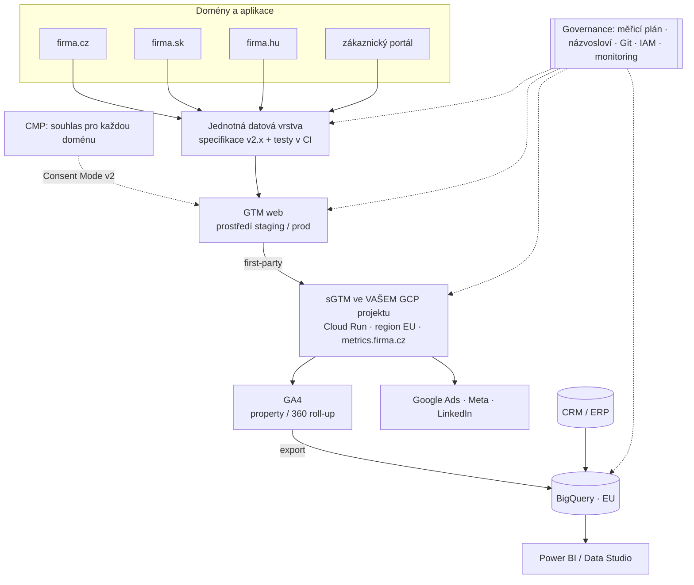

# LP 14: Řešení pro velké firmy – zadání obsahu
> Stav: návrh v1 (8. 10. 2026) · Priorita: B · URL: `/reseni/velke-firmy` · Segmenty: velké firmy a korporace (více domén a trhů, interní IT, DPO, více agentur), regulované obory

Navazuje na: `00_architektura-webu.md`, `../05_formulare/specifikace-formularu.md`, `../01_konkurence/` (taste, trkkn, revolt.bi, datamind, visibility, digitalniarchitekti, nextanalytica, advisio), `../02_klicova-slova/00_analyza-klicovych-slov.md` (velké firmy: hledanost < 50/měs.).

---

## 0. Shrnutí

**Účel stránky.** Hlavně **nástroj pro obchod, LinkedIn a PPC** (hledanost je malá), ale se SEO základem. Stránka musí obstát před třemi publiky najednou – marketingem, IT/bezpečností a DPO/právním – a dát jim podklady pro interní schválení: governance měření, server-side v **Google Cloudu klienta**, BigQuery v EU, smluvní rámec, release proces, SLA, školení a rozhodnutí o GA4 360.

**Persony**
| Persona | Situace | Co hledá |
|---|---|---|
| Head of Digital / Marketing Director (firma 250+ zaměstnanců, 2+ trhy) | Každý trh a agentura měří jinak, reporty si odporují, GTM je „černá skříňka“ | Partnera, který zavede pravidla, sjednotí data a předá to interním týmům |
| IT manažer / architekt / CISO | Marketing chce server-side a nové tagy, IT neví, kam data tečou a kdo má přístupy | Architekturu, IAM, region, logy, release proces, testy – ve vlastní infrastruktuře |
| DPO / právní oddělení | Musí schválit datové toky, smlouvy, předávání do třetích zemí | Inventář datových toků, zpracovatelskou smlouvu, odkazy na podmínky Googlu a Mety |
| Nákup / procurement | Výběrové řízení, srovnání dodavatelů | Rozsah, výstupy, SLA, reference, bezpečnostní přehled |

**Konverze.** Hlavní: formulář `lp-velke-firmy` (úvodní schůzka). Druhá: stažení **„Přehled pro IT a bezpečnost“** (PDF, 2 strany, bez registrace – `file_download`). Třetí: telefon / LinkedIn Víta Novotného.

**Proč tahle stránka vyhraje nad konkurencí**
1. **Enterprise hráči jsou ve vyhledávání neviditelní nebo zastaralí.** TRKKN Czech (Omnicom) má celý web `noindex`; Taste má GA4 stránku stále o přechodu z UA, služby GTM/BI bez URL a GA 360 jen jako 220slovou stránku reselleru. Na dotazy typu „governance měření“, „server-side v Google Cloudu“, „GA4 360 implementace“ česky nikdo nemá stránku.
2. **BI firmy nedělají sběr dat.** Revolt BI a Data Mind staví enterprise BI, ale implementaci GA4, GTM, consentu ani server-side nenabízejí – jejich data jsou jen tak dobrá jako sběr pod nimi.
3. **Produktizovaný server-side je pro velké firmy problém.** NEXT analytica (Azure), DataPlus (Advisio), Gameplan OneTag provozují měření na **své** infrastruktuře. My stavíme na **vašem** Google Cloud projektu – vlastnictví, audit, IAM, region.
4. **Konkrétní governance artefakty.** Konkurence o governance mluví obecně (Revolt u BI). My ukážeme release log, RACI, mapu rolí a test v CI – věci, které IT pozná na první pohled.

---

## 1. SEO a meta

| Prvek | Návrh |
|---|---|
| **Title** (60 znaků) | `Měření pro velké firmy: governance a BigQuery \| datalayer.cz` |
| **Meta description** (154 znaků) | `Governance měření pro velké firmy: měřicí plán, verzování GTM, práva, server-side na vašem Google Cloudu, BigQuery v EU, DPA a SLA. Úvodní schůzka zdarma.` |
| **H1** (51 znaků) | `Měření pro velké firmy: řízené, auditovatelné, vaše` |
| **URL** | `/reseni/velke-firmy` |
| **Breadcrumbs** | Domů › Řešení › Velké firmy |
| **Eyebrow** | `[ Řešení pro velké firmy ]` |

### 1.1 Klíčová slova
| Typ | Klíčové slovo | Objem | Kde použít |
|---|---|---|---|
| Hlavní | měření pro velké firmy / enterprise analytika | – (nízká hledanost) | H1, title, rychlá odpověď |
| Hlavní | governance měření | – | H2 „Governance měření“, meta description |
| Vedlejší | google analytics 360 / GA4 360 | 20 | H2 „Potřebujete GA4 360?“, FAQ 4 |
| Vedlejší | server-side tracking google cloud | – | H2 „Server-side na vašem Google Cloudu“ |
| Vedlejší | cross-domain tracking / měření více domén | 10 | H2 „Více domén a trhů“ |
| Vedlejší | měřicí plán / tracking plan | – (strategické) | pilíř Governance 1 (odkaz na C5) |
| Vedlejší | data residency / data v EU | – | H2 „Bezpečnost a soulad“ |
| Vedlejší | školení google analytics, google analytics školení, školení ga4, školení google tag manager | 200 / 150 / 20 / 20 | H2 „Školení týmů“ (sekundárně – viz kanibalizace) |
| Long-tail | data warehouse governance best practices, enterprise data layer | 0 | text pilířů governance |
| Otázka | Potřebujeme GA4 360? Kde jsou uložena data GA4? Může sGTM běžet v našem cloudu? | – (obchodní otázky) | FAQ |

### 1.2 Co na stránku NEpatří
- *školení google analytics* (200) a varianty mají jasný komerční záměr, ale vlastní LP školení zatím není (`02_klicova-slova`, kap. 3 doporučuje „firemní workshop GA4/GTM“ jako fázi 2). Zde jen sekce s kotvou `#skoleni`; až vznikne `/sluzby/firemni-skoleni-ga4-gtm`, přesunout klíčová slova tam.
- *enterprise data warehouse* (30) → LP 07 BigQuery; zde jen zmínka.
- *server side tracking* obecně → LP 04; zde výhradně varianta „na infrastruktuře klienta“.
- *audit gtm* → LP 09 / článek C4.

### 1.3 Plán pro PPC a LinkedIn (stránka je primárně cíl kampaní)
**Google Ads (Search, frázová/přesná shoda, malý rozpočet, vysoká hodnota leadu):**
| Reklamní sestava | Klíčová slova (návrh) | Nadpis reklamy (návrh) |
|---|---|---|
| GA4 360 | „google analytics 360“, „ga4 360“, „analytics 360 implementace“ | Implementace GA4 360 – rozhodneme, zda ji potřebujete |
| Server-side v cloudu | „server side tracking google cloud“, „sgtm cloud run“, „server side gtm vlastní server“ | Server-side GTM na vašem Google Cloudu |
| Governance | „měřicí plán“, „audit gtm kontejneru“, „governance analytiky“ | Měřicí plán, verze GTM, práva – pořádek v měření |
| Remarketing (RLSA) | návštěvníci `/sluzby/*` s 2+ stránkami | Měření pro firmy s více trhy a vlastním IT |
- Rozšíření: sitelinky na `#bezpecnost`, `#ga4-360`, `#skoleni`, `/jak-pracujeme`. Negativní slova: „zdarma“, „kurz“, „certifikace zkouška“, „přihlášení“, „login“.

**LinkedIn Ads:**
- Cílení: pracovní funkce Marketing, IT, Legal; seniorita Manager+; tituly *Head of Digital, Marketing Director, CMO, E-commerce Director, CDO, IT Manager, Data Protection Officer*; velikost firmy 200+ (test 500+); obory retail, finance, výroba, energetika, telco.
- Formáty: **Document Ad** s „Přehledem pro IT a bezpečnost“ (PDF 2 strany) – bez lead gen formuláře (nebo s ním, pokud klient chce leady přímo v LinkedInu; pak napojit přes LinkedIn API do CRM, ne HubSpot); Single Image s release logem z hero; Thought leadership posty Víta Novotného.
- UTM konvence: `utm_source=linkedin&utm_medium=paid_social&utm_campaign=velke-firmy_{format}_{yyyymm}`; Google Ads s automatickým značkováním.

### 1.4 Strukturovaná data
```json
{
  "@context": "https://schema.org",
  "@graph": [
    {
      "@type": "Service",
      "@id": "https://datalayer.cz/reseni/velke-firmy#service",
      "name": "Měření pro velké firmy",
      "serviceType": "Governance měření, server-side tagging na Google Cloudu klienta, BigQuery, SLA a školení",
      "description": "Governance webové analytiky pro velké firmy: měřicí plán, názvosloví, verzování a release proces Google Tag Manageru, přístupová práva, dokumentace, server-side měření a BigQuery v Google Cloud projektu klienta s daty v EU.",
      "provider": { "@type": "Organization", "@id": "https://datalayer.cz/#organization", "name": "datalayer.cz" },
      "areaServed": { "@type": "Country", "name": "CZ" },
      "audience": { "@type": "BusinessAudience", "audienceType": "Velké firmy a korporace" },
      "url": "https://datalayer.cz/reseni/velke-firmy"
    },
    {
      "@type": "BreadcrumbList",
      "itemListElement": [
        { "@type": "ListItem", "position": 1, "name": "Domů", "item": "https://datalayer.cz/" },
        { "@type": "ListItem", "position": 2, "name": "Řešení", "item": "https://datalayer.cz/reseni" },
        { "@type": "ListItem", "position": 3, "name": "Velké firmy", "item": "https://datalayer.cz/reseni/velke-firmy" }
      ]
    },
    {
      "@type": "FAQPage",
      "mainEntity": [
        { "@type": "Question", "name": "Může server-side GTM běžet v našem vlastním cloudu?",
          "acceptedAnswer": { "@type": "Answer", "text": "{{FAQ 1 – generovat z komponenty FAQ}}" } }
      ]
    }
  ]
}
```

### 1.5 OG obrázek
Piktogram **organizační strom se zámkem** (`gov`) vlevo; vpravo H1 a mono řádek `governance · sGTM v GCP · BigQuery EU · SLA`. Varianta pro LinkedIn (1200×627) s výřezem release logu z hero.

---

## 2. Wireframe

```
┌──────────────────────────────────────────────────────────────────────┐
│ Domů › Řešení › Velké firmy                                          │
│ [ Řešení pro velké firmy ]                                           │
│ H1 Měření pro velké firmy:           │ HERO MOCKUP „release log“      │
│    řízené, auditovatelné, vaše       │ tabulka kontejnerů, verze,     │
│ Podtitul + rychlá odpověď            │ schválení, výsledky testů      │
│ [Domluvit úvodní schůzku] [Stáhnout přehled pro IT]                   │
├──────────────────────────────────────────────────────────────────────┤
│ TRUST BAR (4 fakta)                                                  │
├──────────────────────────────────────────────────────────────────────┤
│ H2 Poznáváte se? – 6 symptomů                                        │
├──────────────────────────────────────────────────────────────────────┤
│ H2 Governance měření – 6 pilířů (karty s artefaktem)                  │
├──────────────────────────────────────────────────────────────────────┤
│ DIAGRAM architektura více trhů + governance vrstva                    │
├──────────────────────────────────────────────────────────────────────┤
│ H2 Více domén a trhů – tabulka rozhodnutí                             │
├──────────────────────────────────────────────────────────────────────┤
│ H2 Server-side na vašem Google Cloudu │ H2 BigQuery a data v EU        │
├──────────────────────────────────────────────────────────────────────┤
│ H2 Bezpečnost a soulad – tabulka dokumentů + box „jak přistupujeme“   │
├──────────────────────────────────────────────────────────────────────┤
│ H2 Spolupráce s IT – RACI + release proces + ukázka testu             │
├──────────────────────────────────────────────────────────────────────┤
│ H2 SLA a podpora – tabulka priorit + úrovně                           │
├──────────────────────────────────────────────────────────────────────┤
│ H2 Školení týmů (#skoleni) │ H2 Potřebujete GA4 360? (#ga4-360)       │
├──────────────────────────────────────────────────────────────────────┤
│ Co dostanete · Postup (discovery → pilot → rollout → provoz)          │
├──────────────────────────────────────────────────────────────────────┤
│ MINI CASE · FAQ 12 · Do hloubky · Navazující služby · KONTAKT         │
└──────────────────────────────────────────────────────────────────────┘
```
**Mobil:** release log v hero zkrácený na 3 řádky a 3 sloupce (kontejner, verze, testy); tabulky jako karty; RACI jako akordeon po činnostech („Kdo co dělá při změně měření“); sticky lišta `Zavolat` · `Napsat`.

---

## 3. Obsah sekcí

### 3.1 Hero
- **H1:** Měření pro velké firmy: řízené, auditovatelné, vaše
- **Podtitul:** Měření, které projde bezpečnostním review, přežije release webu a dá stejná čísla na všech trzích. Navrhneme pravidla, nasadíme server-side ve vašem Google Cloudu a předáme dokumentaci, se kterou může pracovat váš tým i další agentury.
- **Rychlá odpověď (56 slov):**
  > Měření pro velkou firmu stojí na governance: jednotném měřicím plánu a názvosloví, verzování a release procesu Tag Manageru, řízených přístupech a dokumentaci. Technicky na server-side měření a BigQuery ve vašem Google Cloud projektu s daty v EU. Vše smluvně ošetřené zpracovatelskou smlouvou a s podporou podle dohodnutého SLA.
- **CTA1:** `[ Domluvit úvodní schůzku ]` → `#kontakt` (`enterprise_hero_schuzka`)
- **CTA2:** `[ Stáhnout přehled pro IT a bezpečnost ]` → `/files/datalayer-prehled-it-bezpecnost.pdf` (`enterprise_hero_pdf`; GA4 `file_download`)
- **Mikrocopy:** „Rádi přizveme vaše IT i DPO · NDA před první schůzkou na požádání“
- **Vizuál – mockup „release log“** (stylizovaná tabulka, Roboto Mono 12 px, tmavá karta, ukázková data):
  ```
  container      env    version  published    approved by   tests
  GTM-WEB-CZ     prod   v128     2026-10-06   m.dvorak      ✓ 42/42
  GTM-WEB-SK     prod   v94      2026-10-06   m.dvorak      ✓ 42/42
  sGTM-EU        prod   v31      2026-09-30   it-platform   ✓ 18/18
  GTM-WEB-HU     stage  v57      —            —             ✕ 2 failed
  ```
  - Poslední řádek zvýrazněný oranžově s tooltipem „Publikace zablokována: chybí `currency` v `purchase` (test DL-07)“. Nad tabulkou mono nadpis `// measurement release log`. Animace: řádky naskočí postupně, poslední „bliká“ 1× (bez smyčky). `prefers-reduced-motion` = statické.
  - `aria-label`: „Ukázkový přehled verzí Tag Manageru pro tři trhy a server-side kontejner, se schválením a výsledky automatických testů; publikace maďarské verze je zablokována kvůli chybějícímu parametru měny.“

### 3.2 Trust bar
- `[DOPLNIT: počet projektů pro firmy 250+ zaměstnanců / největší měsíční objem událostí]`
- `Váš Google Cloud` – server-side a BigQuery ve vašem projektu, ne u nás
- `Data v EU` – region BigQuery a Cloud Run podle vašich pravidel
- `Zpracovatelská smlouva a NDA` – standardně, před přístupem k datům
- Loga `[DOPLNIT: jen enterprise klienti měření se souhlasem]`; certifikace jednotlivců `[DOPLNIT: např. Google Analytics certifikace, Google Cloud – pouze pokud existují]`.

### 3.3 Symptomy
- **H2:** Poznáváte se?

| # | Nadpis | Text | Piktogram |
|---|---|---|---|
| 1 | Každý trh měří jinak | Česko posílá `purchase`, Slovensko `nakup`, Maďarsko nemá měnu. Čísla za skupinu nejdou sečíst. | Tři vlajkové štítky s různými `{ }` |
| 2 | V GTM má admin přístup kdekdo | Pět agentur, dva bývalí zaměstnanci a jeden neznámý e-mail. Nikdo neví, kdo co publikoval. | Kontejner s otevřeným zámkem |
| 3 | Release webu rozbije měření | Vývoj přejmenuje třídu tlačítka a konverze zmizí. Zjistí se to při měsíčním reportu. | Graf se zlomem a štítkem `deploy` |
| 4 | IT a DPO blokují změny | Nikdo jim neumí říct, kam data tečou, na jakém serveru a v jakém regionu. Server-side projekt stojí půl roku. | Štít s otazníkem |
| 5 | Report pro vedení podle toho, kdo ho dělal | GA4, BI tým a mediální agentura mají tři různá čísla tržeb. | Tři dlaždice KPI s různými čísly |
| 6 | Narážíte na limity GA4 | Denní export do BigQuery se zastaví na milionu událostí, data starší 14 měsíců chybí, explorace se vzorkují. | Trubka se zúžením |

### 3.4 Governance měření – 6 pilířů
- **Komponenta:** `FeatureList` (3×2 karty). Každá karta: H3, 60–90 slov, řádek „**Artefakt:**“ (mono), odkaz.
- **H2:** Governance měření: pravidla, která přežijí změny týmů i agentur
- **Úvod:** Ve velké firmě se měření nerozbije jednou velkou chybou, ale stovkou drobných změn od různých lidí. Governance jsou jednoduchá pravidla, kdo co smí měnit, jak se to pojmenuje, otestuje a zdokumentuje.

**1. Měřicí plán** · Artefakt: `tracking-plan.xlsx` (verzovaný)
Jeden plán pro všechny domény a trhy: byznysové otázky → KPI → události → parametry → kam která událost odchází. Každá událost má vlastníka a verzi. Nové požadavky marketingu jdou přes plán, ne rovnou do GTM. → *Měřicí plán* (C5)

**2. Názvosloví a datový slovník** · Artefakt: `naming-convention.md`, `data-dictionary.xlsx`
Pravidla pro názvy událostí a parametrů (doporučené události GA4 přednostně, `snake_case`, bez diakritiky), pro tagy, spouštěče a proměnné v GTM (např. `GA4 – event – purchase`), pro UTM parametry a pro tabulky v BigQuery. Slovník říká, co který parametr znamená a v jaké jednotce je.

**3. Verzování a release proces** · Artefakt: `release-process.md`, export kontejnerů v Gitu
Změny v GTM vznikají v pracovních prostorech, testují se v prostředí *staging*, publikuje je jen určená role a každá verze má popis a odkaz na požadavek (Jira, ServiceNow). Exporty kontejnerů ukládáme do vašeho repozitáře, aby šlo dohledat, co se kdy změnilo.

**4. Přístupová práva** · Artefakt: `access-matrix.xlsx`
Princip nejnižších oprávnění: v GA4 role od Viewer po Administrator a omezení „bez nákladů / bez tržeb“ pro externí partnery, v GTM publikace jen pro 1–2 lidi, v Google Cloudu IAM podle skupin. Agentury dostávají přístup přes skupiny, ne osobní e-maily. Jednou za čtvrtletí kontrola a odebrání neaktivních účtů.

**5. Dokumentace** · Artefakt: `architecture.pdf`, `data-flow-inventory.xlsx`, `runbook.md`
Schéma architektury, inventář datových toků (co se kam posílá, kategorie údajů, podmínka souhlasu), postupy pro incidenty a předání. Dokumentace patří vám a je psaná tak, aby v ní mohl pokračovat kdokoliv jiný.

**6. Monitoring a kontrola kvality** · Artefakt: automatické testy + alerty
Automatický test datové vrstvy při každém releasu, denní kontroly v BigQuery (počet nákupů, podíl prázdné měny, podíl `(not set)`), upozornění při propadu. O problému víte do 24 hodin, ne při měsíčním reportu. → *Správa webu a měření*

- **Měření:** `diagram_interaction` (`diagram_id: enterprise_governance`, `node: plan|naming|release|access|docs|monitoring`).

### 3.5 Diagram – architektura pro více trhů
- **Komponenta:** `DataFlowDiagram`.
- **H2:** Jak vypadá architektura měření pro více trhů


- **Designér:** horní pás 4 domén jako „karty prohlížeče“ s monogramem trhu; jednotná datová vrstva jako široký pruh `{ }` přes celou šířku; GCP projekt klienta jako rámeček s mono nadpisem `gcp-project: firma-analytics-prod · europe-west3`; governance jako svislý tečkovaný pruh vlevo, který se dotýká 4 uzlů (zámek v piktogramu). Mobil: svislý tok, governance jako štítek u každého uzlu.
- **Text pod diagramem:** Všechny domény posílají data ve stejném formátu. Souhlas se řeší pro každou doménu zvlášť. Server-side kontejner běží ve vašem Google Cloud projektu na vaší subdoméně, data končí v BigQuery v EU a nad nimi stojí BI, které už používáte.

### 3.6 Více domén a trhů
- **Komponenta:** `ComparisonTable` (rozhodnutí × možnosti × doporučení).
- **H2:** Více domén a trhů: rozhodnutí, která děláme na začátku
- **Úvod:** Většina problémů skupinových reportů vznikne v prvním týdnu projektu, když se tato rozhodnutí neudělají vědomě.

| Rozhodnutí | Možnosti | Na čem záleží / naše doporučení |
|---|---|---|
| Kolik GA4 properties | jedna pro všechny trhy · jedna na trh · (GA4 360) roll-up + sub-properties | Jedna property zjednoduší skupinový report, oddělené properties oddělí práva a limity. U 360 lze kombinovat přes roll-up. |
| Cross-domain měření | zapnout pro domény, mezi kterými lidé přecházejí (e-shop ↔ platební brána ↔ portál) | V GA4 se nastavuje v datovém streamu („Configure your domains“, až 100 podmínek); stejné ID značky na všech doménách. |
| Souhlas napříč doménami | samostatná lišta na každé doméně · sdílení souhlasu přes CMP | Souhlas platí pro doménu, kde ho návštěvník udělil; sdílení řešit jen tam, kde to CMP a právní posouzení umožní. |
| Měna | jedna měna property · měna podle trhu | Každá událost nese `currency`; GA4 přepočte na měnu property. Pro účetní report počítat v BigQuery s vlastním kurzem. |
| Časové pásmo | podle centrály · podle trhu | Jedno pásmo pro skupinu, jinak se dny v reportech posunou. |
| Interní provoz a testy | filtr IP, cookie pro zaměstnance, testovací prostředí | Pravidla stejná pro všechny trhy. |
| Nežádoucí odkazující zdroje | platební brány, SSO, rezervační systémy | Seznam udržovat centrálně. |
| Kontejnery GTM | jeden pro všechny domény · jeden na trh | Jeden kontejner = jednotnost, víc kontejnerů = autonomie trhů. Často kombinace: společný kontejner + trhové pracovní prostory. |

### 3.7 Server-side na vašem Google Cloudu
- **Komponenta:** `FeatureList` + `InfoBox` s parametry.
- **H2:** Server-side na vašem Google Cloudu, ne na našem
- **Text:** Server-side Tag Manager nasadíme do Google Cloud projektu, který patří vám. Billing jde přímo z vašeho účtu, přístupy řídí vaše IAM, auditní logy vidí vaše bezpečnost a region si vyberete. Nepotřebujete náš server a nejste na nás závislí – kontejner i infrastruktura zůstanou, i kdybychom spolupráci ukončili. Pokud vaše IT provozuje jiný cloud, server-side GTM lze spustit v jakémkoliv prostředí s Dockerem.
- **Box „Parametry provozu (podle doporučení Googlu)“:**
  - Cloud Run, minimálně **2 instance** kvůli dostupnosti; každý server 1 vCPU a 0,5 GB paměti.
  - Orientační náklady podle Googlu **cca 45 USD měsíčně za server**; autoscaling 2–10 serverů zvládne zhruba 35–350 požadavků za sekundu.
  - Samostatný **preview server** pro ladění.
  - Vlastní **subdoména** (např. `metrics.firma.cz`) – first-party požadavky.
  - Pro globální provoz nasazení do více regionů.
  - Volitelně infrastruktura jako kód (Terraform) podle standardů vašeho IT.
- **Pod boxem:** Server-side neobchází souhlas: tagy na serveru respektují signály Consent Mode a volby z vaší CMP. Měníte tím, kam a v jaké podobě data odcházejí – ne to, jestli se ptáte. → *Kde provozovat server-side GTM* (B3) · Server-side tracking (LP 04)

### 3.8 BigQuery a data v EU
- **H2:** BigQuery a data residency: kde vaše data leží
- **Text a fakta (odrážky, každá 1–2 věty):**
  - **Region volíte při propojení GA4 s BigQuery.** Multiregion `EU` ukládá data v Belgii nebo Nizozemsku; můžete zvolit i jeden region, např. Frankfurt (`europe-west3`) nebo Varšavu (`europe-central2`). Pozdější změna znamená přesun datasetu a riziko mezery v datech – proto ji řešíme hned na začátku.
  - **Limity exportu:** standardní GA4 má denní export do BigQuery omezený na 1 milion událostí; průběžný (streaming) export limit objemu nemá, je ale „best effort“ bez garance úplnosti a stojí 0,05 USD za GB. GA4 360 má denní export v řádu miliard událostí a navíc „Fresh Daily“ export.
  - **GA4 a EU:** Google Analytics sbírá data z EU zařízení přes servery v EU a IP adresy uživatelů z EU neukládá. Kde se data dál zpracovávají, Google v této dokumentaci neuvádí; pro předávání do USA se uplatní rámec EU–US Data Privacy Framework. Ten Tribunál EU 3. 9. 2025 potvrdil a proti rozsudku bylo podáno odvolání k Soudnímu dvoru – vaše DPO by mělo vývoj sledovat.
  - **Granulární data o lokalitě a zařízení** lze v GA4 pro vybrané regiony vypnout (za cenu méně přesného modelování konverzí).
- **Odkaz:** *GA4 → BigQuery export* (F1), *Zpracování dat v BigQuery* (F3), BigQuery (LP 07).

### 3.9 Bezpečnost a soulad (`#bezpecnost`)
- **Komponenta:** `ComparisonTable` (dokumenty) + `InfoBox` (jak přistupujeme k datům).
- **H2:** Bezpečnost a soulad: smlouvy a odpovědnosti
- **Úvod:** Ve velkém projektu je víc smluvních vztahů, než se zdá. Pomůžeme je zmapovat, aby DPO a právní oddělení vědělo, co schvaluje.

| Dokument | Mezi kým | Co řeší |
|---|---|---|
| **Zpracovatelská smlouva (DPA)** podle čl. 28 GDPR | vy (správce) ↔ datalayer.cz (zpracovatel) | Předmět a doba zpracování, kategorie údajů, technická a organizační opatření, subzpracovatelé, součinnost, audit, výmaz po skončení |
| **NDA** | vy ↔ datalayer.cz | Důvěrnost obchodních informací, podle potřeby i před první schůzkou |
| **Google Ads Data Processing Terms** | vy ↔ Google | Google Analytics, rozšířené konverze a Customer Match – Google jako zpracovatel |
| **Google Cloud Data Processing Addendum** | vy ↔ Google Cloud | Server-side GTM a BigQuery; Google jako zpracovatel, certifikace ISO 27001 a SOC 2/3, oznámení nového subzpracovatele 30 dní předem |
| **Podmínky Mety, LinkedInu a dalších platforem** | vy ↔ platforma | Conversions API a pixely |
| **Záznamy o činnostech zpracování, případně DPIA** | vy (DPO) | My dodáme technický popis datových toků (`data-flow-inventory.xlsx`) |

- **Box „Jak přistupujeme k vašim datům“ (✓ seznam):** pracujeme ve vašich účtech na jmenovitých uživatelských účtech s dvoufázovým ověřením · nestahujeme kopie dat na vlastní zařízení, pokud to projekt nevyžaduje a nedohodneme se · přístupy odebíráme hned po skončení · subzpracovatele uvádíme ve smlouvě `[DOPLNIT: seznam]` · pojištění odpovědnosti `[DOPLNIT]`.
- **Disclaimer (malým písmem):** Nejsme advokátní kancelář. Popisujeme technické a smluvní souvislosti; právní posouzení zajišťuje vaše právní oddělení nebo DPO.

### 3.10 Spolupráce s IT
- **Komponenta:** `ComparisonTable` (RACI) + `ProcessTimeline` (release) + `CodeSample`.
- **H2:** Spolupráce s IT: měření jako součást vývoje, ne záplata po něm
- **Úvod:** Měření se ve velké firmě nejčastěji rozbije při releasu, protože datová vrstva není součástí zadání a nikdo ji netestuje. Navrhneme, aby se stala součástí vaší definice hotového („Definition of Done“).

**RACI – kdo co dělá při změně měření** (R = dělá, A = schvaluje, C = konzultuje, I = informován):

| Činnost | Marketing | IT / vývoj | datalayer.cz | DPO / právní | Agentury |
|---|---|---|---|---|---|
| Požadavek na nové měření | R | I | C | I | C |
| Úprava měřicího plánu | A | C | R | C | I |
| Specifikace datové vrstvy | I | A | R | – | I |
| Implementace datové vrstvy | I | R | C | – | – |
| Změny v GTM | C | I | R/A | – | R (v pracovním prostoru) |
| Publikace GTM | I | C | R | – | – |
| Server-side infrastruktura | – | A | R | I | – |
| Consent a CMP | C | R | R | A | I |
| Testy a validace | I | R (QA) | R | – | I |
| Monitoring a incidenty | I | C | R | I | I |

**Release proces (7 kroků):** 1) změna ve specifikaci a měřicím plánu → 2) implementace na stagingu → 3) automatický test datové vrstvy v CI → 4) úpravy GTM v pracovním prostoru a náhled na stagingu → 5) schválení → 6) publikace verze s popisem a odkazem na požadavek → 7) zvýšený monitoring 48 hodin.

**Ukázka testu (Playwright, zjednodušeně) – pro designéra jako `CodeSample` s mono písmem:**
```js
test('purchase má měnu, hodnotu a položky', async ({ page }) => {
  await page.goto(process.env.STAGING_URL + '/test-checkout?order=QA-1');
  const purchase = await page.evaluate(() =>
    window.dataLayer.find(e => e.event === 'purchase'));
  expect(purchase.ecommerce.currency).toMatch(/^(CZK|EUR|HUF)$/);
  expect(purchase.ecommerce.value).toBeGreaterThan(0);
  expect(purchase.ecommerce.items.length).toBeGreaterThan(0);
});
```
- **Text pod ukázkou:** Test běží při každém buildu. Když vývojář omylem odstraní měnu, build neprojde – a nikdo se nedozví o chybě až z reportu.

### 3.11 SLA a podpora
- **Komponenta:** `ComparisonTable` (priority) + 3 karty úrovní (bez cen).
- **H2:** SLA a podpora po spuštění
- **Text:** Rozsah podpory a reakční doby dohodneme ve smlouvě podle toho, jak kritické jsou pro vás data. Vždy ale definujeme, co je kritická chyba.

| Priorita | Příklad | Reakce | Řešení |
|---|---|---|---|
| **P1 – kritická** | Neměří se nákupy nebo leady; tagy se spouštějí před souhlasem | `[DOPLNIT: např. do 4 pracovních hodin]` | `[DOPLNIT]` |
| **P2 – vysoká** | Chybí parametr v části událostí, výpadek jednoho reklamního systému | `[DOPLNIT: např. do 1 pracovního dne]` | `[DOPLNIT]` |
| **P3 – běžná** | Nový požadavek na měření, úprava reportu | `[DOPLNIT: např. do 3 pracovních dnů]` | podle plánu |

Úrovně (karty): **Konzultace** – pevný počet hodin měsíčně, revize požadavků, účast na plánování · **Provoz** – monitoring, alerty, řešení incidentů P1–P3, měsíční report kvality dat · **Provoz + release** – navíc asistence u každého releasu, správa pracovních prostorů agentur, čtvrtletní audit přístupů. → Správa webu a měření (LP 11)

### 3.12 Školení týmů (`#skoleni`)
- **Komponenta:** 3 karty.
- **H2:** Firemní školení GA4, Tag Manageru a BigQuery
- **Text:** Governance funguje, jen když jí rozumí lidé, kteří s měřením pracují. Školíme na vašich datech a vašem nastavení, ne na demo účtu.

| Pro koho | Obsah | Formát |
|---|---|---|
| **Marketing a e-commerce** | Reporty a explorace v GA4, UTM konvence, jak číst rozdíly mezi GA4 a reklamními systémy | Workshop 2–4 h, vaše property |
| **Vývojáři a QA** | Datová vrstva, specifikace, testy, release proces, ladění v GTM Preview | Workshop 2–3 h + ukázkový repozitář testů |
| **Analytici a BI** | Struktura GA4 exportu v BigQuery, SQL dotazy, datový model pro Power BI / Data Studio (dříve Looker Studio) | Workshop 3–4 h, vaše data |

- CTA: `[ Poptat školení pro tým ]` → `#kontakt` (`enterprise_skoleni`, předvyplní téma).
- `[DOPLNIT: potvrdit, že klient školení nabízí; jinak sekci zkrátit na „Předání a zaškolení týmů“]`

### 3.13 Potřebujete GA4 360? (`#ga4-360`)
- **Komponenta:** `ComparisonTable` + 2 sloupce „Dává smysl / Nedává smysl“.
- **H2:** Potřebujete Google Analytics 360?
- **Text:** GA4 360 je placená verze s vyššími limity a smluvní úrovní služeb. Pro řadu velkých firem je správná volba, pro jiné stačí standardní GA4 s BigQuery. Rozhodnutí děláme podle dat, ne podle velikosti firmy.

| Limit / funkce | GA4 (standard) | GA4 360 |
|---|---|---|
| Uchování dat (explorace) | až 14 měsíců | až 50 měsíců |
| Parametry na událost | 25 | 100 |
| Klíčové události | 30 | 50 |
| Publika | 100 | 400 |
| Vzorkování v exploracích | 10 mil. událostí na dotaz | 1 mld. událostí na dotaz |
| Nevzorkované explorace | ne | ano (20 tis. tokenů denně) |
| Denní export do BigQuery | 1 mil. událostí | miliardy událostí (+ Fresh Daily) |
| Kvóta API | 200 000 tokenů denně | 2 mil. tokenů denně |
| Import dat | 10 GB na property | 1 TB na property |
| Roll-up a sub-properties | ne | ano |
| SLA | ne | ano (smlouva GA 360) |

- **Dává smysl, když:** denně posíláte víc než 1 milion událostí a potřebujete kompletní denní export · potřebujete skupinový pohled přes více značek nebo trhů (roll-up) a zároveň oddělená práva (sub-properties) · potřebujete delší historii v rozhraní nebo nevzorkované explorace · smluvní SLA je požadavek vašeho IT.
- **Nedává smysl, když:** většinu analýz stejně děláte v BigQuery a stačí vám streaming export · limity standardní verze reálně nepřekračujete.
- **Text pod tabulkou:** Licenci GA4 360 prodává Google a jeho certifikovaní partneři; cena se odvíjí od objemu dat. `[DOPLNIT/ověřit: datalayer.cz není reseller – formulace: „Implementaci a governance zajistíme bez ohledu na to, od koho licenci máte.“]`

### 3.14 Co dostanete
- **H2:** Co od nás dostanete

| Výstup | Popis |
|---|---|
| `discovery-report.pdf` | Stav měření na všech doménách, kontejnerech a účtech; rozhovory se stakeholdery; rizika a priority |
| `tracking-plan.xlsx` | Skupinový měřicí plán s vlastníky a verzemi |
| `naming-convention.md` + datový slovník | Názvosloví událostí, parametrů, GTM, UTM a BigQuery |
| `access-matrix.xlsx` | Role a oprávnění v GA4, GTM, Google Cloudu a reklamních účtech |
| `release-process.md` + testy | Release proces, RACI, automatické testy datové vrstvy |
| Architektura a infrastruktura | sGTM v GCP projektu klienta (volitelně Terraform), BigQuery dataset v EU |
| `data-flow-inventory.xlsx` | Inventář datových toků pro DPO |
| Monitoring | Denní kontroly a alerty |
| Školení a předání | Workshopy podle rolí, dokumentace, runbook |

### 3.15 Postup a délka
- **H2:** Jak postupujeme u velkého projektu

| # | Fáze | Co se děje | Délka (orientačně) | Co potřebujeme od vás |
|---|---|---|---|---|
| 1 | Úvodní schůzka (+ NDA) | Cíle, rozsah, stakeholdeři, omezení | 60 min | Marketing, ideálně i IT |
| 2 | Discovery a audit | Audit všech domén, kontejnerů a účtů; rozhovory s marketingem, IT, DPO, agenturami | 2–4 týdny | Přístupy pro čtení, 4–6 rozhovorů po 45 min |
| 3 | Návrh governance | Měřicí plán, názvosloví, role, release proces, architektura | 2–3 týdny | Schvalovací schůzka s vlastníky |
| 4 | Pilot | Jeden trh nebo doména end-to-end vč. server-side a testů | 4–8 týdnů | Vývojový tým, GCP projekt, DNS |
| 5 | Rollout | Další trhy a domény podle pilotu | podle počtu trhů | Kapacita vývoje |
| 6 | Provoz a SLA | Monitoring, release asistence, čtvrtletní revize | průběžně | Kontaktní osoba |

- **Box „Pro výběrové řízení dodáme“:** popis týmu a rolí `[DOPLNIT]` · referenční projekty `[DOPLNIT]` · vzor zpracovatelské smlouvy `[DOPLNIT]` · přehled pro IT a bezpečnost · harmonogram a rozsah po fázích · návrh SLA.

### 3.16 Případová studie
- `MiniCase` – `[DOPLNIT: enterprise projekt – např. sjednocení měření 3 trhů, přesun sGTM do GCP klienta; čísla: počet kontejnerů před/po, podíl událostí bez měny, doba odhalení chyby]`. Bez souhlasu anonymizovat („retailová skupina, 3 trhy“). Do dodání skrýt.

### 3.17 FAQ
- **H2:** Časté otázky velkých firem

**1. Může server-side GTM běžet v našem vlastním cloudu?**
Ano. Preferujeme Google Cloud Run ve vašem Google Cloud projektu, protože ho Google podporuje přímo a snadno se napojí na BigQuery. Server-side GTM je ale kontejner Dockeru a lze ho provozovat v jakémkoliv prostředí, které Docker podporuje, včetně vaší infrastruktury v jiném cloudu. Potřebuje cluster tagovacích serverů a jeden samostatný preview server. Architekturu doladíme s vaším IT tak, aby odpovídala vašim bezpečnostním standardům.

**2. Kde budou naše data uložena?**
Server-side GTM a BigQuery nasazujeme do regionu, který zvolíte – typicky multiregion EU (Belgie a Nizozemsko) nebo konkrétní region jako Frankfurt či Varšava. Region BigQuery se volí při propojení s GA4 a pozdější změna je pracná. Samotné GA4 sbírá data z EU zařízení přes servery v EU a IP adresy neukládá; další zpracování se řídí podmínkami Googlu a pro předání do USA rámcem EU–US Data Privacy Framework. Posouzení nechte na vašem DPO.

**3. Podepíšete zpracovatelskou smlouvu a NDA?**
Ano, standardně. NDA můžeme podepsat i před první schůzkou. Zpracovatelskou smlouvu podle čl. 28 GDPR uzavíráme před tím, než získáme přístup k datům, a rádi vyjdeme z vaší šablony. Uvádíme v ní subzpracovatele, technická a organizační opatření a postup po skončení spolupráce. Pracujeme ve vašich účtech na jmenovitých přístupech a po skončení je odebíráme.

**4. Potřebujeme GA4 360?**
Záleží na objemu a na tom, jak data používáte. GA4 360 dává smysl, když denně posíláte víc než milion událostí a potřebujete kompletní denní export do BigQuery, když chcete roll-up přes více značek nebo trhů, delší historii, nevzorkované explorace nebo smluvní SLA. Pokud většinu analýz děláte v BigQuery a limity standardní verze nepřekračujete, často stačí standardní GA4 se streamingem do BigQuery. Na discovery to spočítáme z vašich dat.

**5. Jak spolupracujete s našimi agenturami?**
Agentury dál dělají kampaně, my zajišťujeme, aby měření bylo jednotné. Každá agentura dostane vlastní pracovní prostor v GTM a přístup přes skupinu, změny procházejí měřicím plánem a publikaci schvaluje určená role. Agentury tak nemusí čekat na nás a zároveň nemohou nechtěně rozbít měření ostatním. Dokumentace a názvosloví jsou pro všechny stejné.

**6. Jak zapadnete do našeho release procesu?**
Přizpůsobíme se vašemu nástroji (Jira, Azure DevOps, ServiceNow) i cyklu releasů. Datová vrstva se stane součástí zadání a definice hotového, automatický test běží ve vaší CI a změny v GTM publikujeme v návaznosti na release webu. Exporty kontejnerů ukládáme do vašeho repozitáře, takže každá změna má historii a odkaz na požadavek.

**7. Co když spolupráci ukončíme?**
Nic se nevypne. Účty, kontejnery, Google Cloud projekt i data patří vám, dokumentace je psaná pro předání a nepoužíváme žádný vlastní skript ani server, bez kterého by měření nefungovalo. Při ukončení předáme aktuální stav, odebereme naše přístupy a podle smlouvy smažeme případné pracovní kopie.

**8. Jaké SLA nabízíte?**
Reakční doby a rozsah dohodneme ve smlouvě podle toho, jak kritická jsou data pro váš byznys. Vždy definujeme priority: P1 je například výpadek měření nákupů nebo leadů nebo spouštění tagů před souhlasem, P2 částečný výpadek a P3 běžné požadavky. Součástí podpory je monitoring a měsíční report kvality dat. Konkrétní parametry vám navrhneme po discovery.

**9. Jak se u velkého projektu tvoří cena?**
Discovery a audit nabízíme jako samostatnou fázi s pevným rozsahem. Z jejích výstupů vznikne návrh dalších fází – pilot, rollout a provoz – s rozsahem, výstupy a termíny pro každou z nich. Cenu ovlivňuje hlavně počet domén a trhů, počet agentur a kontejnerů, server-side a BigQuery a požadovaná úroveň SLA. Náklady na Google Cloud a případné licence (GA4 360) platíte přímo poskytovatelům.

**10. Zúčastníte se výběrového řízení?**
Ano. Dodáme popis týmu a rolí, referenční projekty, harmonogram, rozsah po fázích, návrh SLA, vzor zpracovatelské smlouvy a přehled pro IT a bezpečnost. Pokud zadávací dokumentace vyžaduje konkrétní formát nebo kvalifikační předpoklady, napište nám je předem – řekneme, co z toho splňujeme.

**11. Školíte i naše týmy?**
Ano, školení je součástí předání a lze ho objednat i samostatně. Marketing učíme práci s reporty a exploracemi GA4 a UTM konvencím, vývojáře datovou vrstvu a testy, analytiky export GA4 v BigQuery a stavbu datového modelu pro Power BI nebo Data Studio. Školíme na vašich datech a vašem nastavení.

**12. Jak zajistíte, že měření nepřestane fungovat po releasu?**
Kombinací tří věcí: automatického testu datové vrstvy v CI, který zastaví build, když chybí klíčové údaje; release procesu, ve kterém se změny v GTM publikují až po ověření na stagingu; a denních kontrol v BigQuery s upozorněním při propadu. O problému tak víte do 24 hodin, často dřív, než se dostane na produkci.

### 3.18 Do hloubky
1. *Měřicí plán: jak naplánovat měření dřív, než se napíše první tag* → `/blog/merici-plan`
2. *Audit GTM kontejneru: nejčastější chyby a jak udržet pořádek* → `/blog/audit-gtm-kontejneru`
3. *Kde provozovat server-side GTM: Stape, Google Cloud Run, nebo český hosting?* → `/blog/hosting-server-side-gtm`
4. *GA4 → BigQuery export: nastavení, struktura tabulek, limity a cena* → `/blog/ga4-bigquery-export`
5. *Jak vybrat dodavatele měření* → `/blog/jak-vybrat-dodavatele-mereni`
- Rezerva: *Osobní údaje v analytice* → `/blog/osobni-udaje-v-analytice`; *Zpracování dat v BigQuery* → `/blog/zpracovani-dat-v-bigquery`.

### 3.19 Navazující služby
- 3 karty: **Server-side tracking** → `/sluzby/server-side-tracking` · **BigQuery** → `/sluzby/bigquery` · **Správa webu a měření** (*hlídáme, aby měření nepřestalo fungovat*) → `/sluzby/sprava-webu-a-mereni`.
- Textové odkazy: Audit měření · Datová vrstva · Dashboardy a reporting · Měření leadů a CRM (`/reseni/b2b-a-lead-generation`).

---

## 4. Kontaktní blok

| Pole | Hodnota |
|---|---|
| `form_id` | `lp-velke-firmy` |
| Předvybraná témata | `server-side`, `bigquery` (+ návrh nového chipu **„Governance / velký projekt“** – `governance`) |
| H2 | Domluvme si úvodní schůzku s vaším marketingem i IT |
| Lead | Napište nám, zavolejte, nebo vyplňte formulář. Na úvodní hodinové schůzce projdeme vaše domény, trhy, agentury a omezení IT a navrhneme, jak by mohl vypadat discovery. NDA vám rádi pošleme předem. |
| Placeholder zprávy | Např. máme 4 trhy, 3 agentury v GTM a chceme sjednotit měření a přesunout server-side do našeho Google Cloudu… |
| Placeholder Web | `www.firma.cz` |
| Doplněk pod formulářem | Odkaz „Stáhnout přehled pro IT a bezpečnost (PDF)“ |

**Aktualizovat `05_formulare/specifikace-formularu.md`:** řádek pro `lp-velke-firmy`, nový chip `governance`; u B2B/enterprise zvážit volitelné pole „Firma“ (velké firmy ho očekávají, nepovinné).

---

## 5. Interní odkazy
**Odchozí**
| Cíl | Anchor | Umístění |
|---|---|---|
| `/sluzby/server-side-tracking` | Server-side tracking | 3.7, Navazující |
| `/sluzby/bigquery` | BigQuery | 3.8, Navazující |
| `/sluzby/sprava-webu-a-mereni` | Správa webu a měření | pilíř 6, SLA, Navazující |
| `/sluzby/audit-mereni`, `/sluzby/datova-vrstva`, `/sluzby/dashboardy-a-reporting` | názvy služeb | text, Navazující |
| `/reseni/b2b-a-lead-generation` | Měření leadů a CRM | Navazující |
| `/blog/merici-plan`, `/blog/audit-gtm-kontejneru`, `/blog/hosting-server-side-gtm`, `/blog/ga4-bigquery-export`, `/blog/jak-vybrat-dodavatele-mereni`, `/blog/zpracovani-dat-v-bigquery`, `/blog/osobni-udaje-v-analytice` | názvy článků | pilíře, 3.7, 3.8, Do hloubky |
| `/jak-pracujeme` | Jak pracujeme | Postup |

**Příchozí**
| Zdroj | Anchor |
|---|---|
| Homepage – segmenty | Měření pro velké firmy |
| LP 04 Server-side (segment Velká firma) | server-side na vašem Google Cloudu |
| LP 07 BigQuery, LP 08 Dashboardy, LP 09 Audit, LP 11 Správa (segment Velká firma) | řešení pro velké firmy |
| Články C4, C5, B3, F1, H1 | governance měření / měření pro velké firmy |
| `/o-nas`, `/jak-pracujeme` | práce pro velké firmy |
| LinkedIn a PPC kampaně | (UTM) |

---

## 6. Co dodá klient
- `[DOPLNIT]` počet a typ enterprise projektů, největší objemy (trust bar).
- `[DOPLNIT]` enterprise případová studie (anonymizovaně), citace IT nebo marketingového ředitele.
- `[DOPLNIT]` **Přehled pro IT a bezpečnost (PDF, 2 strany)**: architektura, region, IAM, přístupy, subzpracovatelé, kontakty – podklad připravíme podle této LP.
- `[DOPLNIT]` vzor zpracovatelské smlouvy, seznam subzpracovatelů datalayer.cz, pojištění odpovědnosti.
- `[DOPLNIT]` parametry SLA (reakční doby P1–P3), pracovní doba podpory.
- `[DOPLNIT]` certifikace jednotlivců (Google Analytics, Google Cloud) – jen existující.
- `[DOPLNIT]` potvrzení nabídky školení a formátů.
- `[DOPLNIT]` vztah ke GA4 360 (reseller ano/ne) a Terraform (ano/ne).
- `[DOPLNIT]` loga enterprise klientů se souhlasem.

---

## 7. Měření stránky
| Událost | Parametry / hodnoty |
|---|---|
| `cta_click` | `enterprise_hero_schuzka`, `enterprise_hero_pdf`, `enterprise_skoleni`, `enterprise_ga4_360`, `enterprise_vyberove_rizeni` |
| `file_download` | GA4 enhanced measurement (`file_name: datalayer-prehled-it-bezpecnost.pdf`) – označit jako sekundární klíčovou událost |
| `diagram_interaction` | `diagram_id: enterprise_governance`, `enterprise_architecture` |
| `faq_open`, `scroll_depth` | standard |
| `lead_form_start`, `lead_form_error`, `generate_lead` | `form_id: lp-velke-firmy` |
| `contact_click` | `channel: phone/email/linkedin` *(LinkedIn přidat jako hodnotu)* |

V GA4 a Google Ads vytvořit **publikum „enterprise zájem“** (návštěva této LP + `file_download` nebo 2+ minuty) pro RLSA a LinkedIn retargeting (se souhlasem).

---

## 8. Akceptační checklist
1. Title, description, H1 podle kap. 1; stránka indexovatelná (na rozdíl od TRKKN) a v sitemapě.
2. Mockup release logu je HTML/SVG s ukázkovými daty, `aria-label`, bez smyčkové animace.
3. Tabulka GA4 vs. GA4 360 a čísla o exportu/Cloud Run znovu ověřena v týdnu publikace.
4. Právní formulace (DPF, DPA, podmínky Googlu) s disclaimerem; DPO-relevantní tvrzení mají zdroj.
5. PDF „Přehled pro IT a bezpečnost“ existuje, má datum a verzi; odkaz funguje, měří se `file_download`.
6. SLA tabulka bez prázdných `[DOPLNIT]` – buď vyplněná, nebo s textem „podle dohody“.
7. Sekce školení odpovídá skutečné nabídce klienta.
8. RACI a release proces čitelné na mobilu (akordeon).
9. PPC/LinkedIn kampaně mají UTM podle konvence, LP má fungující kotvy `#bezpecnost`, `#ga4-360`, `#skoleni`.
10. Formulář `lp-velke-firmy` s předvybranými tématy; volitelné pole Firma (pokud schváleno).
11. Žádná loga ani reference bez souhlasu; žádné nepodložené certifikace.
12. LCP < 2,5 s, žádný horizontální scroll na 360 px.

---

## Zdroje
Ověřeno 10/2026 (8. 10. 2026), pokud není uvedeno jinak.

| Tvrzení | Zdroj |
|---|---|
| GA4 vs. GA4 360: uchování 14 vs. 50 měsíců, parametry 25 vs. 100, klíčové události 30 vs. 50, publika 100 vs. 400, explorace 10M vs. 1B událostí, nevzorkované explorace (20K tokenů/den), API 200K vs. 2M tokenů, BigQuery denní export 1M vs. miliardy, import dat 10 GB vs. 1 TB, SLA, roll-up a sub-properties | https://support.google.com/analytics/answer/11202874 – ověřeno 10/2026 |
| BigQuery export: standard 1M událostí denně, 360 až 20 mld.; streaming bez limitu, best effort, 0,05 USD/GB; Fresh Daily jen 360 | https://support.google.com/analytics/answer/9358801 – ověřeno 10/2026 |
| Volba lokace datasetu při propojení GA4–BigQuery; změna = přesun datasetu, možná mezera v datech | https://support.google.com/analytics/answer/9823238 – ověřeno 10/2026 |
| BigQuery: multiregion EU = Belgie (`europe-west1`) nebo Nizozemsko (`europe-west4`); regiony Frankfurt `europe-west3`, Varšava `europe-central2` aj. | https://docs.cloud.google.com/bigquery/docs/locations – ověřeno 10/2026 |
| GA4 a EU: sběr přes servery v EU, IP adresy z EU se neukládají; granulární lokalita a zařízení lze vypnout per region | https://support.google.com/analytics/answer/12017362 – ověřeno 10/2026 |
| sGTM Cloud Run: min. 2 instance, 1 vCPU / 0,5 GB, cca 45 USD/měsíc za server, 2–10 serverů ≈ 35–350 req/s, preview server, vlastní doména, více regionů | https://developers.google.com/tag-platform/tag-manager/server-side/cloud-run-setup-guide – ověřeno 10/2026 |
| sGTM v libovolném prostředí s Dockerem; cluster + právě 1 preview server; max. 1 vCPU na server | https://developers.google.com/tag-platform/tag-manager/server-side/manual-setup-guide – ověřeno 10/2026 |
| Google Cloud Data Processing Addendum: Google = zpracovatel; ISO 27001, SOC 2/3; oznámení nového subzpracovatele 30 dní předem | https://cloud.google.com/terms/data-processing-addendum – ověřeno 10/2026 |
| Google Ads Data Processing Terms: Google Analytics, Enhanced Conversions, Customer Match = služby zpracovatele | https://business.safety.google/adsservices/ – ověřeno 10/2026 |
| EU–US DPF: Tribunál EU zamítl žalobu Latombe 3. 9. 2025, odvolání k SDEU podáno 31. 10. 2025 | https://www.wilmerhale.com/en/insights/blogs/wilmerhale-privacy-and-cybersecurity-law/20251201-european-court-of-justice-to-review-challenge-to-eu-us-data-privacy-framework (sekundární zdroj) – ověřeno 10/2026; **stav odvolání ověřit před publikací (curia.europa.eu)** |
| GA4 role (Administrator, Editor, Marketer, Analyst, Viewer, None) a omezení „No Cost Metrics“, „No Revenue Metrics“ | https://support.google.com/analytics/answer/9305587 – ověřeno 10/2026 |
| GA4 cross-domain: nastavení v datovém streamu „Configure your domains“, stejné ID značky, až 100 podmínek | https://support.google.com/analytics/answer/10071811 – ověřeno 10/2026 |
| GDPR čl. 28 (zpracovatel) | https://eur-lex.europa.eu/legal-content/CS/TXT/?uri=CELEX:32016R0679 – obecně známé, znění článku **ověřit při tvorbě vzorové DPA** |
| GTM: počet pracovních prostorů ve standardní verzi a schvalovací workflow v Tag Manager 360 | **neověřeno (nápověda nedostupná při ověřování) – ověřit před publikací**; v textu LP proto bez konkrétních čísel |
| Konkurence: TRKKN `noindex`, Taste GA 360 reseller / zastaralá GA4 LP, Revolt a Data Mind bez sběru dat z webu, NEXT na Azure | `../01_konkurence/profily/` (stav 8. 10. 2026) |
