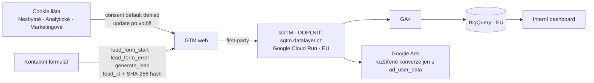
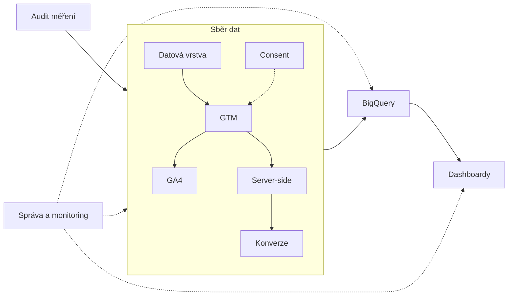

# 15: Jak pracujeme a podpůrné stránky – zadání obsahu
> Stav: návrh v1 (8. 10. 2026) · Priorita: B (Kontakt a Jak pracujeme A – jsou cílem CTA z celého webu) · Segmenty: všechny

Soubor obsahuje zadání 7 podpůrných stránek. Každá kapitola má stejnou strukturu jako LP (Shrnutí → SEO a meta → Wireframe → Obsah sekcí → Kontaktní blok → Interní odkazy → Co dodá klient → Měření → Akceptační checklist), zkráceně tam, kde stránka nepotřebuje vše. Společné zdroje jsou na konci souboru.

Navazuje na: `00_architektura-webu.md` (kap. 1 strom webu, 2 navigace, 5 piktogramy, 6 copywriting, 8 měření), `../05_formulare/specifikace-formularu.md`, `../06_clanky/00_obsahovy-plan.md` (kap. 4 slovník), `../07_audit-webu-klienta/audit-stagingu.md` (kap. 3.6 vlastní měření), `../01_konkurence/` (vzory: khoder proces, gameplan „předání přístupů“, DA segmentace, taste maturity model, revolt galerie, datamind případovky).

## Přehled stránek

| Kap. | Stránka | URL | Title (znaky) | H1 | `form_id` | Schema | Priorita |
|---|---|---|---|---|---|---|---|
| A | Jak pracujeme | `/jak-pracujeme` | `Jak pracujeme: od auditu po předání měření \| datalayer.cz` (57) | Jak pracujeme: od konzultace po předané měření | `jak-pracujeme` | `WebPage` + `ItemList` (kroky) + `BreadcrumbList` | A |
| B | Služby (rozcestník) | `/sluzby` | `Služby webové analytiky: GA4, GTM, BigQuery \| datalayer.cz` (58) | Služby webové analytiky a měření | `sluzby` | `CollectionPage` + `ItemList` (11 služeb) + `BreadcrumbList` | A |
| C | O nás | `/o-nas` | `O nás: Vít Novotný a tým datalayer.cz` (37) | Kdo stojí za datalayer.cz a jak pracujeme s daty | `o-nas` | `AboutPage` + `Organization` + `Person` | B |
| D | Kontakt | `/kontakt` | `Kontakt: konzultace měření zdarma \| datalayer.cz` (48) | Kontakt: napište nám, nebo rovnou zavolejte | `kontakt` | `ContactPage` + `Organization.contactPoint` | A |
| E | Případové studie | `/pripadove-studie` + `/pripadove-studie/{slug}` | výpis: `Případové studie: měření v praxi \| datalayer.cz` (47) | Případové studie: měření v praxi | `case-study` | výpis `CollectionPage`; detail `Article` | B (aktivovat s 1. studií) |
| F | Slovník | `/slovnik` + `/slovnik/{pojem}` | výpis: `Slovník webové analytiky: GA4, GTM, consent \| datalayer.cz` (58) | Slovník webové analytiky | – (CTA na LP) | `DefinedTermSet` / `DefinedTerm` | B |
| G | Nástroje | `/nastroje` + 3 podstránky | výpis: `Nástroje zdarma: UTM builder a kontroly \| datalayer.cz` (54) | Nástroje zdarma pro měření | `tool-consent` (jen u kontroly) | `CollectionPage`; nástroje `WebApplication` | B (UTM builder A) |

**Pozn. k architektuře:** navrhuji, aby nástroje měly **vlastní URL** (`/nastroje/utm-builder`, `/nastroje/kontrola-consentu`, `/nastroje/kalkulacka-ztraty-konverzi`) – „utm builder“ má 1 100 hledání měsíčně a samostatná stránka nástroje má výrazně vyšší šanci rankovat než sekce rozcestníku. *Upravit strom webu v architektuře kap. 1.*

**Pozn. k FAQ schema:** Google od 7. 5. 2026 nezobrazuje FAQ rich results. `FAQPage` ponecháváme jen tam, kde je viditelné FAQ, a generujeme ho ze stejného zdroje dat.

**Nové `form_id` a texty pro tabulku 3.5** v `05_formulare/specifikace-formularu.md`: `jak-pracujeme`, `sluzby`, `o-nas`, `case-study`, `tool-consent` – texty jsou v kapitolách níže.

---

# A. `/jak-pracujeme`

## A0. Shrnutí
- **Účel:** odstranit nejistotu „co se stane, když se ozvu“ a „za co platím“ (ceny se neuvádějí). Ukázat proces v 8 krocích, **co klient dostane v každém kroku** (konkrétní artefakty) a co od něj budeme potřebovat. Navíc **„Jak měříme vlastní web“** – důkaz, který si technicky zdatný návštěvník ověří v DevTools.
- **Komu:** každý, kdo zvažuje spolupráci (marketing, IT, majitel); obchodní podklad pro sdílení uvnitř firmy („pošlu to šéfovi“).
- **Konverze:** formulář `jak-pracujeme`; sekundárně přechod na LP řešení.
- **Proč vyhraje:** Khoder má 5krokový proces s časovou osou, Visibility a DA mají kroky bez výstupů, Gameplan stránku „předání přístupů“. Nikdo nekombinuje **kroky + artefakty + co potřebujeme + délku + předání přístupů + veřejně ověřitelnou referenční implementaci**. Staging dnes má CTA „[ Jak pracujeme ]“, které vede na formulář – stránka chybí úplně.

## A1. SEO a meta
| Prvek | Návrh |
|---|---|
| Title (57) | `Jak pracujeme: od auditu po předání měření \| datalayer.cz` |
| Meta description (140) | `Jak probíhá implementace měření: konzultace, audit, měřicí plán, specifikace dataLayer, validace a dokumentace. Co dostanete v každém kroku.` |
| H1 (46) | `Jak pracujeme: od konzultace po předané měření` |
| URL / breadcrumbs | `/jak-pracujeme` · Domů › Jak pracujeme |

**Klíčová slova:** hledanost je minimální (proces není hledaný dotaz). Přirozeně použít: *implementace měření*, *jak probíhá implementace GA4*, *měřicí plán* (vlastník = článek C5 a LP 01 – zde jen jako krok s odkazem), *specifikace dataLayer* (vlastník = LP 03), *validace měření*, *předání přístupů do GA4/GTM*.

**JSON-LD (zkráceně):**
```json
{
  "@context": "https://schema.org",
  "@graph": [
    { "@type": "WebPage", "@id": "https://datalayer.cz/jak-pracujeme#webpage", "name": "Jak pracujeme",
      "about": { "@id": "https://datalayer.cz/#organization" },
      "mainEntity": { "@type": "ItemList", "name": "Postup spolupráce", "itemListElement": [
        { "@type": "ListItem", "position": 1, "name": "Úvodní konzultace" },
        { "@type": "ListItem", "position": 2, "name": "Audit současného stavu" },
        { "@type": "ListItem", "position": 3, "name": "Měřicí plán" },
        { "@type": "ListItem", "position": 4, "name": "Specifikace datové vrstvy" },
        { "@type": "ListItem", "position": 5, "name": "Implementace" },
        { "@type": "ListItem", "position": 6, "name": "Validace a testy" },
        { "@type": "ListItem", "position": 7, "name": "Předání a dokumentace" },
        { "@type": "ListItem", "position": 8, "name": "Podpora" } ] } },
    { "@type": "BreadcrumbList", "itemListElement": [
        { "@type": "ListItem", "position": 1, "name": "Domů", "item": "https://datalayer.cz/" },
        { "@type": "ListItem", "position": 2, "name": "Jak pracujeme", "item": "https://datalayer.cz/jak-pracujeme" } ] }
  ]
}
```
`HowTo` nepoužívat (stránka popisuje službu, ne návod; rich result se nezobrazuje).

**OG obrázek:** vodorovná časová osa 8 teček s mono štítky `01 konzultace … 08 podpora`, nad ní H1.

## A2. Wireframe
```
HERO: H1 · podtitul · rychlá odpověď · [Konzultovat projekt] [Jak měříme vlastní web ↓]
PRINCIPY: 5 krátkých karet v řadě
PROCES: svislá časová osa 8 kroků (desktop: vlevo číslo+název+délka, vpravo karta
        „Co děláme / Co dostanete / Co potřebujeme od vás“ + mono štítek artefaktu)
UKÁZKY VÝSTUPŮ: 4 záložky (Měřicí plán | Specifikace dataLayer | Protokol validace | Dokumentace)
PŘEDÁNÍ PŘÍSTUPŮ (#pristupy): tabulka nástroj → role → kde ji udělit
JAK MĚŘÍME VLASTNÍ WEB (#jak-merime-vlastni-web): schéma + 7 bodů + „ověřte si to sami“ (4 kroky)
FAQ (8) · KONTAKT
```
Mobil: časová osa svisle, karta kroku jako akordeon (otevřený jen aktuální krok), ukázky výstupů jako swipe, tabulka přístupů jako karty.

## A3. Obsah sekcí

### A3.1 Hero
- **H1:** Jak pracujeme: od konzultace po předané měření
- **Podtitul:** Každý projekt má stejnou kostru: nejdřív zjistíme, co se dnes měří, pak se dohodneme, co se měřit má, a teprve potom píšeme tagy. Na konci dostanete funkční měření, důkaz, že funguje, a dokumentaci, se kterou si poradí kdokoliv.
- **Rychlá odpověď (52 slov):** Spolupráce má osm kroků: úvodní konzultace, audit současného stavu, měřicí plán, specifikace datové vrstvy, implementace, validace a testy, předání s dokumentací a podpora. Ke každému kroku dostanete konkrétní výstup. Typický projekt trvá 3–8 týdnů; účty, kontejnery i data zůstávají ve vašem vlastnictví.
- **CTA1:** `[ Konzultovat projekt ]` → `#kontakt` (`proces_hero_konzultace`) · **CTA2:** `[ Jak měříme vlastní web ]` → `#jak-merime-vlastni-web` (`proces_hero_vlastni_web`)
- **Vizuál:** animovaná časová osa (8 teček spojených linkou, tečky se postupně rozsvítí cyan); u posledního bodu malý piktogram „kalendář s ✓ a pulse“. Bez mockupu – hero má být klidný, informace jsou níže.

### A3.2 Principy (5 karet)
- **Komponenta:** `FeatureList` (5 malých karet, mono nadpisy).
- **H2:** Pět pravidel, podle kterých pracujeme

| Mono nadpis | Text |
|---|---|
| `// plan_first` | Nejdřív měřicí plán, pak tagy. Měříme jen to, co někdo použije k rozhodnutí. |
| `// your_accounts` | Pracujeme ve vašich účtech. GA4, GTM, Google Cloud i data patří vám. |
| `// consent_by_default` | Souhlas není překážka, ale vstupní podmínka. Bez souhlasu se marketingová data neposílají. |
| `// verify_before_handover` | Nic nepředáme bez validace proti administraci, CRM nebo testovacím scénářům. |
| `// docs_are_output` | Dokumentace je výstup projektu, ne bonus. Kdokoliv po nás musí umět pokračovat. |

### A3.3 Proces – 8 kroků
- **Komponenta:** `ProcessTimeline` (svislá, rozšířená varianta s kartami).
- **H2:** Osm kroků od prvního hovoru po funkční měření
- **Úvod:** Délky jsou orientační pro středně velký projekt (jeden web, 3–5 reklamních systémů). U malých projektů se kroky 3 a 4 spojí do jednoho, u velkých firem přibude discovery s rozhovory a pilot (viz Měření pro velké firmy).

| # | Krok | Co děláme | Co dostanete | Co potřebujeme od vás | Délka | Kdo |
|---|---|---|---|---|---|---|
| 01 | **Úvodní konzultace** | Projdeme web, cíle, nástroje a největší problém. Řekneme, co bychom opravili jako první. | Shrnutí hovoru e-mailem + doporučený první krok | Adresa webu, 30 minut, ideálně člověk, který má na starost marketing | 30 min, zdarma | Vít Novotný |
| 02 | **Audit současného stavu** | Projdeme GTM, GA4, cookie lištu, reklamní systémy, datovou vrstvu a porovnáme čísla s administrací nebo CRM. | `audit-report.pdf` – nálezy seřazené podle dopadu, doporučení, odhad rozsahu oprav | Přístupy pro čtení (viz [Předání přístupů](#pristupy)) | 3–5 pracovních dnů | analytik |
| 03 | **Měřicí plán** | Převedeme byznysové otázky na KPI, události a parametry; rozhodneme, co kam odchází. | `merici-plan.xlsx` – schválený seznam událostí, parametrů, konverzí a cílových systémů | 1 schůzka (60 min), schválení | 2–5 pracovních dnů | analytik + vy |
| 04 | **Specifikace datové vrstvy** | Napíšeme zadání pro vývojáře: události, parametry, příklady JSON, akceptační kritéria. U platforem s vlastním dataLayerem mapování. | `datalayer-spec.md` + testovací scénáře | Kontakt na vývojáře nebo podporu platformy | 2–5 pracovních dnů | tracking engineer |
| 05 | **Implementace** | GTM (web, případně server), GA4, Consent Mode v2, reklamní systémy, BigQuery. Vývojáři mezitím implementují datovou vrstvu. | Kontejnery s pojmenováním a verzemi, nastavené účty | Implementace dataLayeru vaším vývojem, DNS záznam (server-side), přístupy pro úpravy | 1–3 týdny | tracking engineer |
| 06 | **Validace a testy** | Testovací scénáře v GTM Preview a GA4 DebugView, test souhlasu (přijmout / odmítnout / nic), testovací objednávky nebo leady, 7–14 dní běhu a porovnání s administrací/CRM. | `validace-protokol.pdf` – co jsme testovali, výsledky, vysvětlení rozdílů | Testovací objednávka/lead, export z administrace nebo CRM | 1–2 týdny | analytik |
| 07 | **Předání a dokumentace** | Předávací call se záznamem, dokumentace architektury a datových toků, seznam přístupů a vlastníků. | `dokumentace.pdf`, záznam callu, `access-list.xlsx` | 60–90 minut lidí, kteří budou měření používat | 1 týden | celý tým projektu |
| 08 | **Podpora** | 30 dní dohled zdarma po spuštění; dál podle dohody správa a monitoring. | Upozornění při výpadku, měsíční report kvality dat (u správy) | Kontaktní osoba | 30 dní + dle dohody | analytik |

- **Text pod tabulkou (box):** „Kolik to bude stát?“ – Cenu stanovíme po kroku 01, nejpozději po auditu (krok 02). Dostanete nabídku s pevným rozsahem, výstupy a termíny. Audit lze objednat samostatně; pokud pokračujeme implementací, `[DOPLNIT: zda se cena auditu započítává]`.
- **Vizuál:** každý krok má mono štítek artefaktu (`merici-plan.xlsx`), který při hoveru ukáže miniaturu výstupu (viz A3.4).
- **Měření:** `diagram_interaction` (`diagram_id: proces`, `node: 01…08`).

### A3.4 Ukázky výstupů
- **Komponenta:** `Tabs` se 4 stylizovanými náhledy (HTML, fiktivní data, štítek „ukázka“). Pod každým CTA „Chci vidět celou ukázku“ → kontakt (ukázku pošleme po hovoru – ne ke stažení, chrání to know-how).
- **H2:** Jak vypadají výstupy, které dostanete

**Záložka „Měřicí plán“** – výřez tabulky:
| Byznysová otázka | KPI | Událost | Parametry | Cílové systémy | Souhlas |
|---|---|---|---|---|---|
| Které kampaně přinášejí ziskové objednávky? | hrubý zisk z kampaně | `purchase` | `transaction_id`, `value`, `currency`, `items[]`, `shipping`, `coupon` | GA4, Google Ads, Meta CAPI, Sklik | analytics / marketing |
| Kde lidé opouštějí pokladnu? | míra dokončení pokladny | `begin_checkout`, `add_shipping_info`, `add_payment_info` | `items[]`, `shipping_tier`, `payment_type` | GA4 | analytics |
| Které formuláře přinášejí kvalitní poptávky? | podíl kvalifikovaných leadů | `generate_lead` | `form_id`, `lead_id`, `lead_topics` | GA4, Google Ads (EC for leads), CRM | analytics / marketing |

**Záložka „Specifikace dataLayer“** – výřez:
```markdown
### purchase
Kdy: po potvrzení objednávky na děkovací stránce, právě jednou pro dané transaction_id.
Povinné: transaction_id (string), value (number, bez DPH, bez dopravy), currency (ISO 4217), items[] (≥1)
Akceptační kritérium: obnovení stránky neodešle událost znovu.
```
```js
dataLayer.push({ ecommerce: null });
dataLayer.push({
  event: 'purchase',
  ecommerce: {
    transaction_id: '2026-10458', value: 808.26, currency: 'CZK', shipping: 73.55, tax: 169.73,
    items: [{ item_id: 'BTL-0420', item_name: 'Termoska 0,5 l', item_category: 'Outdoor', price: 404.13, quantity: 2 }]
  }
});
```

**Záložka „Protokol validace“** – výřez:
| Test | Scénář | Očekávání | Výsledek |
|---|---|---|---|
| CNS-01 | Návštěva bez interakce s lištou | Žádný marketingový požadavek, consent default `denied` | ✓ |
| CNS-02 | „Odmítnout vše“ | Žádné cookies `_ga`, `_fbp`; Meta CAPI neodesláno | ✓ |
| ECM-05 | Obnovení děkovací stránky | `purchase` jen 1× | ✓ |
| CMP-12 | GA4 vs. administrace, 14 dní | rozdíl vysvětlený (souhlas, testy, storna) | 3,1 % ✓ (ukázka) |

**Záložka „Dokumentace“** – obsah dokumentu (TOC): 1. Architektura (schéma) · 2. Inventář datových toků · 3. GTM: konvence, přehled tagů · 4. GA4: nastavení, vlastní definice, klíčové události · 5. Consent: konfigurace, testy · 6. Reklamní systémy · 7. Server-side: infrastruktura, náklady · 8. Přístupy a vlastníci · 9. Postup při výpadku · 10. Historie změn.

### A3.5 Předání přístupů (`#pristupy`)
- **Komponenta:** `ComparisonTable` + krátký úvod (vzor Gameplan „předání přístupů“).
- **H2:** Jak nám dát přístupy (a jak je po projektu odebrat)
- **Úvod:** Nepotřebujeme vaše hesla. Přístupy udělíte na náš pracovní e-mail `[DOPLNIT: např. access@datalayer.cz]` a po skončení je jedním kliknutím odeberete. Pro audit stačí čtení, pro implementaci úpravy.

| Nástroj | Audit (čtení) | Implementace | Kde udělit |
|---|---|---|---|
| Google Tag Manager | Čtení (kontejner) | Publikace (kontejner), u účtu Uživatel | Správce → Správa uživatelů |
| Google Analytics 4 | Viewer | Editor (property) | Správce → Správa přístupu k property |
| Google Ads | Jen čtení | Standardní | Správce → Přístup a zabezpečení |
| Merchant Center | Standardní | Admin (jen pokud řešíme feed/cart data) | Nastavení → Lidé a přístup |
| Meta Business | Events Manager – zobrazit | Events Manager – spravovat | Firemní nastavení → Zdroje dat → Datové sady |
| Sklik / Seznam | Čtení | Úpravy | Nastavení účtu → Přístupy |
| Google Cloud | `roles/viewer` na projekt | podle úkolu (Cloud Run Admin, BigQuery Admin) | IAM a správa → IAM |
| Administrace e-shopu / CMS | uživatel s nastavením marketingu | totéž | podle platformy |
| CRM | čtení pipeline | admin pro pole a automatizace (nebo spolupráce s vaším adminem) | podle CRM |

- **Pod tabulkou:** NDA podepíšeme před udělením přístupů, pokud o to stojíte. Zpracovatelskou smlouvu uzavíráme vždy, když budeme pracovat s osobními údaji (např. CRM). *(Názvy menu v nástrojích ověřit při publikaci – rozhraní se mění.)*

### A3.6 Jak měříme vlastní web (`#jak-merime-vlastni-web`)
- **Účel:** nejsilnější důkaz důvěryhodnosti (doporučení auditu stagingu kap. 3.6 a analýzy konkurence kap. 8.1 bod 6). Web analytické firmy je referenční implementace.
- **Komponenta:** `DataFlowDiagram` (malý) + `FeatureList` (7 bodů) + `Steps` „Ověřte si to sami“.
- **H2:** Jak měříme vlastní web – a jak si to můžete ověřit
- **Úvod:** Doporučujeme jen to, co sami používáme. Na tomhle webu běží stejná architektura, jakou nasazujeme klientům, a můžete si ji prohlédnout v nástrojích pro vývojáře vašeho prohlížeče.

**Diagram:**


**7 bodů (každý 1–2 věty, mono štítek):**
1. `cmp` – **Vlastní cookie lišta** ve vizuálu webu: Nezbytné / Analytické / Marketingové, „Odmítnout vše“ je stejně výrazné jako „Přijmout vše“, volbu změníte v patičce odkazem *Nastavení cookies*.
2. `consent` – **Consent Mode v2:** výchozí stav `denied` se nastaví dřív, než se načte Tag Manager; po volbě se pošle `update` a událost `cookie_consent_update`. Režim: `[DOPLNIT: basic / advanced – podle finálního nastavení]`.
   - *Text pro variantu basic:* „Dokud nesouhlasíte, Google tagy se vůbec nespustí – neposílají ani anonymní pingy.“
   - *Text pro variantu advanced:* „Dokud nesouhlasíte, Google tagy posílají jen pingy bez cookies a bez identifikátorů, které Google používá k modelování. Žádné cookies se neukládají.“
3. `gtm` – **Google Tag Manager** s konvencí pojmenování, kterou používáme u klientů; každá verze má popis.
4. `sgtm` – **Server-side GTM** na subdoméně `[DOPLNIT]` v Google Cloudu (Cloud Run, region `[DOPLNIT: europe-west3]`), minimálně 2 instance.
5. `form` – **Formulář** posílá `lead_form_start`, `lead_form_error` a `generate_lead` s ID leadu. E-mail a telefon se do Google Ads posílají jen jako SHA-256 hash a jen se souhlasem `ad_user_data`; do GA4 nikdy.
6. `bq` – **GA4 → BigQuery** export v EU a interní dashboard poptávek.
7. `monitor` – **Monitoring:** denní kontrola, že `generate_lead` a souhlasy chodí.

**„Ověřte si to sami“ (4 kroky, mono, se snímky obrazovky z DevTools `[DOPLNIT: screenshoty z produkce]`):**
1. Otevřete web v anonymním okně, stiskněte F12 a v záložce **Network** zadejte filtr `collect`. Dokud na liště nic nezvolíte, `[basic: neuvidíte žádný požadavek | advanced: uvidíte jen požadavky s parametrem stavu souhlasu, např. gcs=G100]`. *(Hodnotu parametru ověřit na produkci.)*
2. V záložce **Application → Cookies** zkontrolujte, že před souhlasem nevznikla cookie `_ga` ani `_fbp`.
3. V záložce **Console** napište `dataLayer` a stiskněte Enter. První záznam je výchozí stav souhlasu, teprve pak se načte Tag Manager.
4. Vyplňte kontaktní formulář s testovacím e-mailem a v `dataLayer` najděte `generate_lead`. E-mail v něm uvidíte jen jako hash (64 znaků), nikdy v čitelné podobě.

- **CTA pod sekcí:** `[ Chci to stejné na svém webu ]` → `#kontakt` (`proces_vlastni_web`).
- **Pravidlo:** text sekce musí 1:1 odpovídat produkci. Při změně nastavení webu aktualizovat (odpovědnost: Vít Novotný, revize při každé změně GTM).

### A3.7 FAQ (8)
**1. Jak dlouho trvá typický projekt?** Implementace měření pro jeden web se 3–5 reklamními systémy trvá obvykle 3–8 týdnů včetně validace. Nejvíc času nezabere naše práce, ale čekání na implementaci datové vrstvy vývojáři a 7–14 dní běhu měření, abychom ho mohli porovnat s administrací nebo CRM. Samotný audit trvá 3–5 pracovních dnů.

**2. Pracujete na dálku, nebo i osobně?** Většina projektů probíhá na dálku – sdílené obrazovky, nahrávané předávací cally, komunikace e-mailem nebo ve vašem nástroji (Slack, Teams, Jira). Úvodní schůzku nebo workshop s týmem rádi uděláme osobně `[DOPLNIT: kde – Praha / dle dohody]`.

**3. Kdo bude na projektu pracovat?** `[DOPLNIT: složení – např. Vít Novotný jako hlavní kontakt a tracking engineer, analytik pro audit a validaci]`. Na začátku projektu víte jménem, kdo dělá co, a s kým mluvíte. Projekty nepředáváme dalším subdodavatelům bez vašeho souhlasu.

**4. Co když nemáme vlastního vývojáře?** Na Shoptetu, Upgates, Shopify a většině WordPress webů zvládneme většinu práce přes administraci a Tag Manager. U vlastních řešení potřebujeme někoho, kdo do webu doplní datovou vrstvu – dodáme mu přesné zadání a výsledek otestujeme. Pokud vývojáře nemáte vůbec, doporučíme ověřeného partnera `[DOPLNIT]`.

**5. Spolupracujete s naší PPC nebo marketingovou agenturou?** Ano, je to běžné. Agentura dál spravuje kampaně, my zajistíme, aby měla správná data. Domluvíme se, kdo smí v GTM co měnit, a agentura dostane dokumentaci a přístup podle potřeby. Nekonkurujeme jí ve správě kampaní.

**6. Jak probíhá fakturace?** `[DOPLNIT: např. audit jednorázově po předání; implementace po etapách nebo 50/50; správa měsíčně]`. Ceny nejsou na webu, protože rozsah projektů se výrazně liší; nabídka má vždy pevný rozsah a výstupy. Provoz Google Cloudu nebo licence platíte přímo poskytovatelům.

**7. Co když se měření po předání rozbije?** Prvních 30 dní po spuštění měření hlídáme zdarma a chyby způsobené námi opravíme vždy. Pokud se měření rozbije kvůli změně webu později, pomůžeme v rámci správy, nebo jednorázově. Doporučujeme monitoring, který na výpadek upozorní do 24 hodin.

**8. Podepíšete NDA a zpracovatelskou smlouvu?** Ano. NDA i před první schůzkou, zpracovatelskou smlouvu vždy, když pracujeme s osobními údaji (CRM, zákaznická data v BigQuery).

## A4. Kontaktní blok
| Pole | Hodnota |
|---|---|
| `form_id` | `jak-pracujeme` |
| Témata | – (žádné předvybrané) |
| H2 | Začněme 30minutovou konzultací |
| Lead | Napište nám, zavolejte, nebo vyplňte formulář. Na konzultaci projdeme váš web a řekneme, kterým krokem začít – nezávazně a zdarma. |
| Placeholder | Např. chceme nově nastavit měření pro web na poptávky a nevíme, jestli začít auditem… |

## A5. Interní odkazy
- **Odchozí:** `/reseni/e-shopy`, `/reseni/b2b-a-lead-generation`, `/reseni/velke-firmy` (pod procesem: „Jak se proces liší podle typu firmy“); `/sluzby/audit-mereni` (krok 02), `/blog/merici-plan` (krok 03), `/sluzby/datova-vrstva` a `/blog/datova-vrstva-specifikace` (krok 04), `/sluzby/sprava-webu-a-mereni` (krok 08), `/sluzby/cookie-lista-consent-mode` (vlastní web).
- **Příchozí:** hlavní menu Řešení (oddělovač „Jak pracujeme“), CTA „[ Jak pracujeme ]“ na homepage (oprava stagingu – dnes vede na formulář), sekce Postup na všech LP („Podrobně o našem procesu“), `/o-nas`, `/kontakt` („Co se stane po odeslání“), LP 13 (formulář jako referenční implementace).

## A6. Co dodá klient
`[DOPLNIT]` složení týmu a role · pravidla fakturace · započtení auditu · pracovní e-mail pro přístupy · finální nastavení vlastního webu (basic/advanced, subdoména sGTM, region) · screenshoty z DevTools z produkce · reálné (anonymizované) ukázky výstupů nebo souhlas s fiktivními.

## A7. Měření
`cta_click` (`proces_hero_konzultace`, `proces_hero_vlastni_web`, `proces_ukazka_{plan|spec|validace|docs}`, `proces_vlastni_web`) · `diagram_interaction` (`proces`, `vlastni_web`) · `tab_select` (`tab_group: proces_ukazky`) · `faq_open` · formulářové události s `form_id: jak-pracujeme`.

## A8. Akceptační checklist
1. Sekce „Jak měříme vlastní web“ odpovídá produkci (ověřit v DevTools v den publikace). 2. Kroky „Ověřte si to sami“ fungují v Chrome i Firefoxu. 3. Ukázky výstupů označené „ukázka“, fiktivní data. 4. Délky kroků potvrzené klientem. 5. Kotvy `#pristupy`, `#jak-merime-vlastni-web` fungují. 6. Tabulka přístupů ověřená proti aktuálním rozhraním nástrojů. 7. Homepage CTA „[ Jak pracujeme ]“ vede sem. 8. Mobil bez horizontálního scrollu, časová osa čitelná. 9. Žádné ceny.

---

# B. `/sluzby` – rozcestník služeb

## B0. Shrnutí
- **Účel:** hub pro 11 LP služeb ve 3 skupinách + **rozhodovací pomůcka „Nevíte, co potřebujete?“**. Stránka distribuuje autoritu na LP a zachytí návštěvníky, kteří nevědí, jak se jejich problém jmenuje.
- **Komu:** návštěvník z homepage/menu, který zná problém, ne službu; obchodní partner, který chce přehled.
- **Konverze:** klik na LP služby; výsledek pomůcky → LP nebo formulář `sluzby`.
- **Proč vyhraje:** Visibility má rozcestník s dlaždicemi, DA „katalog produktů“ s ~60 položkami bez vodítka, Taste služby formulované jako potřeby („Chci měřit a pracovat s daty“). Kombinace **jasné 3 skupiny + one-liner „co to řeší“ + interaktivní doporučení** na trhu není. Staging dnes: 88 slov, 6 karet bez benefitů.

## B1. SEO a meta
| Prvek | Návrh |
|---|---|
| Title (58) | `Služby webové analytiky: GA4, GTM, BigQuery \| datalayer.cz` |
| Description (151) | `Přehled 11 služeb webové analytiky: sběr dat, data a reporting, audity a správa. Nevíte, co potřebujete? Odpovězte na 4 otázky a doporučíme první krok.` |
| H1 | `Služby webové analytiky a měření` |
| URL | `/sluzby` (301 z `/sluzby/` a `/SLUZBY`) |

**KW:** *služby webové analytiky* (–), *webová analytika* (90) a *analytika webu* (70) patří homepage – zde jen v textu, ne v H1 (kanibalizace). Rozcestník se neoptimalizuje na konkrétní služby; jeho úkolem je interní prolinkování.

**JSON-LD:** `CollectionPage` s `mainEntity` `ItemList` (11 položek `Service` s `url`) + `BreadcrumbList`. Ukázka položky:
```json
{ "@type": "ListItem", "position": 4, "item": { "@type": "Service", "name": "Server-side tracking",
  "url": "https://datalayer.cz/sluzby/server-side-tracking", "description": "Měření na vaší doméně a vašem Google Cloudu." } }
```

## B2. Wireframe
```
HERO: H1 · 2 věty · [Pomozte mi vybrat ↓] [Konzultovat projekt]
SKUPINA 1 „Sběr dat“ – 6 karet (3×2)
SKUPINA 2 „Data a reporting“ – 2 karty
SKUPINA 3 „Audity a správa“ – 3 karty
JAK SLUŽBY NAVAZUJÍ – malý diagram (sběr → data → reporting, kolem audit + správa)
ŘEŠENÍ PODLE TYPU FIRMY – 3 karty (E-shopy · B2B · Velké firmy)
NEVÍTE, CO POTŘEBUJETE? – rozhodovací pomůcka (4 otázky → doporučení)
NEJČASTĚJŠÍ SITUACE – statická tabulka (fallback bez JS)
FAQ (5) · KONTAKT
```
Mobil: karty 1 sloupec, skupiny jako sekce s mono nadpisem; pomůcka krok za krokem (1 otázka na obrazovku).

## B3. Obsah sekcí

### B3.1 Hero
- **H1:** Služby webové analytiky a měření
- **Text:** Jedenáct služeb ve třech skupinách – od sběru dat na webu přes BigQuery a reporting po audity a dlouhodobou správu. Můžete začít kteroukoliv z nich, nebo nám popsat problém a doporučíme, čím začít.
- **CTA1:** `[ Pomozte mi vybrat ]` → `#pomucka` (`sluzby_hero_pomucka`) · **CTA2:** `[ Konzultovat projekt ]` → `#kontakt`.

### B3.2 Karty služeb
- **Komponenta:** `ServiceCard` (piktogram z architektury kap. 5, název = odkaz, one-liner ≤ 45 znaků, věta „Kdy to potřebujete“, mono štítek, šipka).
- Nadpisy skupin (H2) s mono eyebrow: `[ 01 sběr dat ]`, `[ 02 data a reporting ]`, `[ 03 audity a správa ]`.

| Skupina | Služba (H3, odkaz) | One-liner (z architektury) | Kdy to potřebujete | Štítek |
|---|---|---|---|---|
| **Sběr dat** | Implementace GA4 → `/sluzby/implementace-ga4` | čísla, která sedí s tržbami | GA4 nemáte, nebo mu nevěříte | `ga4` |
| | Google Tag Manager → `/sluzby/google-tag-manager` | pořádek v tazích a verzích | V GTM jsou desítky tagů a nikdo neví, co dělají | `gtm` |
| | Datová vrstva → `/sluzby/datova-vrstva` | zadání pro vývojáře, které funguje | Vyvíjíte nový web nebo e-shop | `dataLayer` |
| | Server-side tracking → `/sluzby/server-side-tracking` | měření na vaší doméně | Reklamní systémy vidí méně konverzí, než máte | `sgtm` |
| | Cookie lišta a Consent Mode → `/sluzby/cookie-lista-consent-mode` | souhlas legálně a bez ztráty dat | Po nasazení lišty spadly konverze, nebo lištu nemáte | `consent` |
| | Měření konverzí → `/sluzby/mereni-konverzi` | Ads, Meta, Sklik i Heureka vidí totéž | Každý systém hlásí jiné číslo | `conversion` |
| **Data a reporting** | BigQuery → `/sluzby/bigquery` | surová data bez limitů GA4 | Narážíte na limity GA4, chcete spojit data z více zdrojů | `bq` |
| | Dashboardy a reporting → `/sluzby/dashboardy-a-reporting` | report, kterému věří vedení | Report se každý měsíc skládá ručně | `report` |
| **Audity a správa** | Audit měření → `/sluzby/audit-mereni` | zjistíme, kde data utíkají | Nevíte, jestli měření funguje | `audit` |
| | Technický audit webu → `/sluzby/technicky-audit-webu` | rychlost, tagy a technické SEO | Web je pomalý, tagy ho zatěžují | `perf` |
| | Správa webu a měření → `/sluzby/sprava-webu-a-mereni` | hlídáme, aby měření nepřestalo fungovat | Nemáte interního analytika | `monitor` |

- **Měření:** `cta_click` (`cta_id: sluzby_karta_{slug}`, `section: skupina_{1|2|3}`).

### B3.3 Jak služby navazují
- **H2:** Jak služby navazují
- **Text:** Služby nejsou izolované. Data se sbírají na webu, ukládají v BigQuery a končí v reportu. Audit na začátku řekne, kde je problém, správa na konci hlídá, aby se znovu neobjevil.

- **Vizuál:** jednoduchý, statický, uzly = piktogramy služeb (24 px) s názvem; klik na uzel = odkaz na LP (`diagram_interaction`, `diagram_id: sluzby_vazby`).

### B3.4 Řešení podle typu firmy
- 3 karty s piktogramy (`purchase`, `lead`, `gov`): **E-shopy** – „Od datové vrstvy po marži v reportu“ → `/reseni/e-shopy`; **B2B a lead generation** – „Od formuláře po zakázku v CRM“ → `/reseni/b2b-a-lead-generation`; **Velké firmy** – „Governance, server-side ve vašem cloudu, SLA“ → `/reseni/velke-firmy`.

### B3.5 Rozhodovací pomůcka „Nevíte, co potřebujete?“ (`#pomucka`)
- **Účel:** převést problém na službu; zároveň kvalifikovat lead (výsledek se předá do formuláře jako předvyplněná zpráva a témata).
- **Komponenta:** `DecisionHelper` (4 otázky, 1 obrazovka = 1 otázka, progress `1/4`, tlačítko Zpět, výsledek). Funguje bez odesílání dat; stav jen v paměti stránky.
- **H2:** Nevíte, co potřebujete? Odpovězte na 4 otázky

**Otázky a odpovědi:**
| # | Otázka | Odpovědi (kód) |
|---|---|---|
| Q1 | Jaký máte web? | E-shop (`eshop`) · Web na poptávky / B2B (`b2b`) · Více webů nebo trhů (`multi`) · Aplikace nebo zákaznický portál (`app`) |
| Q2 | Co vás nejvíc trápí? (jedna odpověď) | Čísla nesedí s tržbami / CRM (`nesedi`) · Reklamní systémy nevidí všechny konverze (`konverze`) · Cookie lišta a souhlas (`consent`) · Nevím, co se vlastně měří (`nevim`) · Reporty se skládají ručně (`report`) · Chystáme nový web nebo migraci (`novy`) · Web je pomalý (`rychlost`) |
| Q3 | Jak je na tom měření dnes? | Nemáme téměř nic (`nic`) · Máme GA4 a GTM, ale nevíme, jestli správně (`nejiste`) · Fungovalo, ale po změně webu se rozbilo (`rozbite`) · Funguje, chceme víc (`funguje`) |
| Q4 | Kdo bude výsledek používat nejvíc? | Marketing (`mkt`) · Vedení a finance (`vedeni`) · Vývojáři (`dev`) · IT a bezpečnost (`it`) |

**Pravidla doporučení (vyhodnocují se shora, první shoda vyhrává; výsledek = 1 hlavní služba + 1–2 navazující + řešení podle Q1):**
| # | Podmínka | Hlavní doporučení | Navazující | Text výsledku (začátek) |
|---|---|---|---|---|
| R1 | Q2 = `novy` | Datová vrstva | Implementace GA4, Cookie lišta | „Nejlevnější chvíle, jak udělat měření správně, je teď – jako součást zadání.“ |
| R2 | Q2 = `rychlost` | Technický audit webu | Google Tag Manager | „Začněte technickým auditem: změříme, kolik zpomalení způsobují skripty a tagy.“ |
| R3 | Q2 = `consent` | Cookie lišta a Consent Mode | Audit měření | „Nejdřív souhlas: bez správného Consent Mode přicházíte o data i o funkce Google Ads.“ |
| R4 | Q3 = `nic` | Implementace GA4 | Google Tag Manager, Cookie lišta | „Postavíme základ: GA4 přes Tag Manager s cookie lištou.“ |
| R5 | Q2 = `nesedi` a Q3 ∈ {`nejiste`, `rozbite`} | Audit měření | Implementace GA4, Měření konverzí | „Nejdřív zjistíme, proč čísla nesedí. Audit ukáže chyby seřazené podle dopadu.“ |
| R6 | Q2 = `konverze` a Q1 = `eshop` | Server-side tracking | Měření konverzí | „Reklamní systémy potřebují vidět víc nákupů – server-side a správně nastavené konverze.“ |
| R7 | Q2 = `konverze` a Q1 = `b2b` | Měření konverzí | (řešení B2B: offline konverze z CRM) | „U poptávek je klíčové poslat reklamním systémům i to, co se stalo v CRM.“ |
| R8 | Q2 = `report` | Dashboardy a reporting | BigQuery | „Spojíme data z GA4, reklam a e-shopu/CRM do jednoho automatického reportu.“ |
| R9 | Q3 = `funguje` | BigQuery | Dashboardy, Server-side | „Základ máte. Dalším krokem jsou surová data a report podle zisku.“ |
| R10 | Q1 = `multi` nebo Q4 = `it` | Audit měření | Správa webu a měření (+ řešení Velké firmy) | „U více webů začínáme auditem a pravidly – kdo co měří a jak se to jmenuje.“ |
| R11 | Q2 = `nevim` | Audit měření | Google Tag Manager | „Audit vám řekne, co se dnes měří, co chybí a co je navíc.“ |
| R12 | jinak | Audit měření | – | „Nejbezpečnější první krok je audit – nic nerozbije a ukáže, kde začít.“ |

**Doplněk podle Q4:** `vedeni` → přidat do výsledku větu o Dashboardech; `dev` → odkaz na Datovou vrstvu; `it` → odkaz na Velké firmy (`#bezpecnost`).

**Výsledková karta:** piktogram hlavní služby, H3 „Doporučujeme začít: {služba}“, text výsledku (2–3 věty), odkazy na navazující služby a řešení, CTA `[ Probrat doporučení ]` → `#kontakt` s předvyplněnou zprávou „Pomůcka doporučila: {služba}. Náš web: {Q1}, problém: {Q2}, stav: {Q3}.“ a předvybranými tématy. Druhé CTA `Zobrazit službu →` na LP.
- **Měření:** `tool_use` (`tool: sluzby_pomucka`, `action: start|answer|result`, `result: {slug služby}`) – bez textových odpovědí, jen kódy.
- **Bez JS:** zobrazí se jen statická tabulka B3.6.

### B3.6 Nejčastější situace (statická tabulka – fallback a SEO text)
- **H2:** Nejčastější situace a čím začít
| Situace | Začněte | Proč |
|---|---|---|
| GA4 ukazuje jiné tržby než e-shop | Audit měření | Rozdíl má víc příčin; nejdřív je potřeba je oddělit |
| Po nasazení cookie lišty spadly konverze | Cookie lišta a Consent Mode | Lišta je často nastavená, ale signály souhlasu chybí nebo jdou pozdě |
| Meta hlásí méně nákupů než e-shop | Server-side tracking + Měření konverzí | Conversions API s deduplikací a lepším párováním |
| Stavíme nový e-shop | Datová vrstva | Zadání pro vývojáře před vývojem je nejlevnější |
| Report pro vedení dělá někdo ručně | Dashboardy a reporting | Automatický report nad ověřenými daty |
| Chceme spojit GA4 s daty z CRM nebo ERP | BigQuery | Surová data a vlastní datový model |
| Máme leady, ale nevíme, které jsou dobré | Řešení B2B a lead generation | Měření až do CRM a zpět do reklam |
| Nemáme analytika a měření se rozbíjí | Správa webu a měření | Monitoring a pravidelná péče |

### B3.7 FAQ (5)
1. **Můžu si objednat jen jednu službu?** Ano. Každá služba má samostatný rozsah a výstupy. Pokud ale zjistíme, že problém je jinde (např. chcete server-side, ale chyba je v datové vrstvě), řekneme vám to dřív, než začneme.
2. **Čím začít, když nevím, co je špatně?** Auditem měření. Trvá 3–5 pracovních dnů, nic na webu nemění a výsledkem je seznam chyb seřazený podle dopadu a doporučení, co opravit.
3. **Proč nejsou na webu ceny?** Rozsah se mezi projekty liší víc, než by ceník dokázal popsat. U každé služby proto popisujeme výstupy, postup a délku; nabídku s pevným rozsahem dostanete po úvodní konzultaci.
4. **Pracujete s malými weby?** `[DOPLNIT: rozhodnutí klienta – např. „Ano, pokud měření řídí rozpočet v reklamě; u úplně malých webů doporučíme jednodušší řešení.“]`
5. **Děláte i správu kampaní?** Ne. Měření je naše jediná práce a s PPC agenturami spolupracujeme. `[DOPLNIT: potvrdit]`

## B4. Kontaktní blok
`form_id: sluzby` · témata dle pomůcky (jinak žádná) · H2 „Popište problém, služby vybereme spolu“ · placeholder „Např. nevíme, jestli potřebujeme server-side, nebo jen opravit GA4…“

## B5. Interní odkazy
Odchozí: všech 11 LP, 3 řešení, `/jak-pracujeme`. Příchozí: hlavní menu (Služby ▾ – položka „Všechny služby“ v mega-menu), patička (sloupec Služby – nadpis odkazem), homepage sekce služeb („Všechny služby →“), breadcrumbs všech LP služeb (Domů › Služby › …).

## B6. Co dodá klient
`[DOPLNIT]` rozhodnutí o malých webech a správě kampaní (FAQ 4–5); potvrzení pravidel pomůcky (zejména R6–R10 podle obchodní praxe).

## B7. Měření
`cta_click` (`sluzby_hero_pomucka`, `sluzby_karta_{slug}`, `sluzby_reseni_{eshopy|b2b|velke}`), `tool_use` (pomůcka), `diagram_interaction` (`sluzby_vazby`), formulář `form_id: sluzby`.

## B8. Akceptační checklist
1. 11 karet = 11 funkčních URL, one-linery ≤ 45 znaků. 2. Pomůcka funguje klávesnicí (focus, Enter, Zpět), má `aria-live` pro výsledek. 3. Bez JS se zobrazí statická tabulka. 4. Výsledek pomůcky předvyplní formulář. 5. `ItemList` validní. 6. H1 neobsahuje „webová analytika“ samostatně (homepage). 7. Piktogramy z jedné sady, inline SVG.

---

# C. `/o-nas`

## C0. Shrnutí
- **Účel:** dát firmě tvář (E-E-A-T), vysvětlit přístup a principy práce s daty a říct, co od klienta potřebujeme. Konkurence staví důvěru na osobě (Khoder, Homola) nebo na týmu s fotkami (Data Mind 11 lidí, NEXT 9). Staging „O nás“ odkazuje na homepage.
- **Komu:** rozhodovatel, který si před kontaktem ověřuje „kdo to je“ (často po návštěvě LinkedInu); IT a nákup u velkých firem.
- **Konverze:** formulář `o-nas`, LinkedIn Víta (`contact_click` `channel: linkedin`).

## C1. SEO a meta
| Prvek | Návrh |
|---|---|
| Title (37) | `O nás: Vít Novotný a tým datalayer.cz` *(značka je v textu, bez opakování „\| datalayer.cz“)* |
| Description (147) | `Kdo stojí za datalayer.cz, jak pracujeme s daty klientů a co od vás budeme potřebovat. Technický tým pro GA4, GTM, server-side, consent a BigQuery.` |
| H1 | `Kdo stojí za datalayer.cz a jak pracujeme s daty` |
| URL | `/o-nas` |
**KW:** brand („datalayer.cz“, „Vít Novotný“), *webový analytik* (150) jen v bio jako profese – stránka ho necílí (homepage).

**JSON-LD:**
```json
{
  "@context": "https://schema.org",
  "@graph": [
    { "@type": "AboutPage", "@id": "https://datalayer.cz/o-nas#webpage", "about": { "@id": "https://datalayer.cz/#organization" } },
    { "@type": "Organization", "@id": "https://datalayer.cz/#organization", "name": "datalayer.cz",
      "url": "https://datalayer.cz/", "logo": "https://datalayer.cz/logo.svg",
      "founder": { "@id": "https://datalayer.cz/o-nas#vit-novotny" },
      "email": "one@datalayer.cz", "telephone": "[DOPLNIT]",
      "vatID": "[DOPLNIT]", "address": { "@type": "PostalAddress", "addressCountry": "CZ", "addressLocality": "[DOPLNIT]" },
      "sameAs": ["[DOPLNIT: LinkedIn firmy]"] },
    { "@type": "Person", "@id": "https://datalayer.cz/o-nas#vit-novotny", "name": "Vít Novotný",
      "jobTitle": "Tracking & data engineer, zakladatel", "worksFor": { "@id": "https://datalayer.cz/#organization" },
      "image": "https://datalayer.cz/img/vit-novotny.webp",
      "sameAs": ["[DOPLNIT: https://www.linkedin.com/in/…]"],
      "knowsAbout": ["Google Analytics 4", "Google Tag Manager", "Server-side tagging", "Consent Mode", "BigQuery", "Datová vrstva"] }
  ]
}
```
`Person` se stejným `@id` používat jako `author` u článků (`BlogPosting`).

## C2. Wireframe
```
HERO: foto Víta (vpravo) · H1 · 2 věty · [LinkedIn] [Napsat]
PROČ DATALAYER.CZ – krátký příběh (3 odstavce)
VÍT NOVOTNÝ – bio karta (fakta v mono řádcích) + citace
TÝM – karty lidí/rolí (nebo „s kým spolupracujeme“)
PRINCIPY PRÁCE S DATY – 6 karet
CO OD VÁS BUDEME POTŘEBOVAT – 5 bodů
JAK MĚŘÍME VLASTNÍ WEB – teaser → /jak-pracujeme#…
FIREMNÍ ÚDAJE · KONTAKT
```

## C3. Obsah sekcí

### C3.1 Hero
- **H1:** Kdo stojí za datalayer.cz a jak pracujeme s daty
- **Text:** Jsme technický tým, který se věnuje jen měření: datové vrstvě, Tag Manageru, GA4, souhlasům, server-side a BigQuery. Nespravujeme kampaně a neprodáváme vlastní krabicové nástroje – stavíme měření ve vašich účtech a předáváme ho s dokumentací.
- **Vizuál:** fotografie Víta Novotného `[DOPLNIT]` (pracovní, ne studiová póza; tmavé pozadí ladící s webem, 4:5), vedle mono štítek `// founder · tracking & data engineer`.
- **CTA:** `[ Napsat Vítovi ]` → `#kontakt` · odkaz „LinkedIn ↗“ (`contact_click`, `channel: linkedin`).

### C3.2 Proč datalayer.cz (příběh)
- **H2:** Proč jsme datalayer.cz založili
- **Text (návrh, klient upraví podle skutečnosti `[DOPLNIT: osobní motivace, rok založení, z čeho firma vyrostla]`):** Za léta práce s měřením jsme viděli stejný vzorec: firmy platí za reklamu statisíce, ale rozhodují se podle dat, kterým nikdo nevěří. Problém většinou není v nástroji, ale ve spodní vrstvě – v tom, jak se data na webu sbírají, jestli se respektuje souhlas a jestli někdo ověřil, že čísla sedí. Proto se jmenujeme podle datové vrstvy. Začínáme tam, kde ostatní končí s „nasazením kódu“, a končíme až ve chvíli, kdy čísla sedí s tržbami nebo s CRM.

### C3.3 Vít Novotný (bio)
- **Komponenta:** `PersonCard` (foto, jméno, role, 4–6 mono řádků faktů, citace, odkazy).
- **H2:** Vít Novotný
- **Fakta (`[DOPLNIT]` – nic nevymýšlet):**
  - `role:` zakladatel, tracking & data engineer
  - `praxe:` `[DOPLNIT: roky v oboru, předchozí role/firmy]`
  - `specializace:` datová vrstva, server-side GTM, Consent Mode, BigQuery `[ověřit]`
  - `certifikace:` `[DOPLNIT: jen existující]`
  - `přednášky / články:` `[DOPLNIT]`
  - `linkedin:` `[DOPLNIT]`
- **Citace (návrh k úpravě):** „Měření je hotové, až když umím vysvětlit každý rozdíl mezi GA4 a administrací. Do té doby je to jen nasazený kód.“

### C3.4 Tým
- **H2:** Tým
- **Varianty podle reality `[DOPLNIT: rozhodnutí klienta]`:**
  - *A – tým s fotkami:* karty (foto, jméno, role, 1 věta „na čem pracuje“, LinkedIn).
  - *B – malý tým / síť specialistů:* „Na projektech spolupracujeme s ověřenými specialisty na vývoj a BI. Vždy víte jménem, kdo na vašem projektu pracuje.“ + role (analytik, vývojář, BI) bez fotek.
- **Pravidlo:** neuvádět fiktivní lidi ani „25 expertů“ (chyba NEXT – nekonzistentní čísla).

### C3.5 Principy práce s daty
- **Komponenta:** `FeatureList` (6 karet, mono čísla).
- **H2:** Jak zacházíme s daty – vašimi i vašich zákazníků

| # | Princip | Text |
|---|---|---|
| 01 | **Data patří vám** | Účty, kontejnery, Google Cloud projekty a data zakládáme na vaši firmu. My máme jen přístup, který můžete kdykoliv odebrat. |
| 02 | **Souhlas je podmínka, ne překážka** | Měření nastavujeme podle § 89 ZEK a doporučení ÚOOÚ: marketingové a analytické nástroje až po souhlasu, odmítnutí stejně snadné jako přijetí. Žádné „obcházení“. |
| 03 | **Jen data, která někdo použije** | Měříme to, co je v měřicím plánu a slouží k rozhodnutí. Méně dat = menší riziko i rychlejší web. |
| 04 | **Osobní údaje nikdy v čitelné podobě** | Do GA4 neposíláme e-maily ani telefony. Do reklamních systémů jen jako hash a jen se souhlasem. |
| 05 | **Ověřit před předáním** | Každou implementaci validujeme proti administraci, CRM nebo testovacím scénářům a výsledek vám dáme písemně. |
| 06 | **Žádné černé skříňky** | Používáme standardní nástroje (GTM, sGTM, GA4, BigQuery), ne proprietární skripty. Kdokoliv po nás může pokračovat. |

- Pod principy disclaimer malým písmem: „Nejsme advokátní kancelář; právní posouzení zajišťuje váš právník.“

### C3.6 Co od vás budeme potřebovat
- **H2:** Co od vás budeme potřebovat
1. **Jednoho člověka, který rozhoduje** – schválí měřicí plán a priority.
2. **Přístupy** do nástrojů (návod v [Předání přístupů](/jak-pracujeme#pristupy)).
3. **Vývojáře nebo podporu platformy**, pokud je potřeba upravit web.
4. **Data pro ověření** – export objednávek nebo leadů za zvolené období.
5. **Čas na předání** – 60–90 minut lidí, kteří budou měření používat.

### C3.7 Jak měříme vlastní web (teaser)
Krátký box: „Náš web je referenční implementace: vlastní cookie lišta, Consent Mode v2, server-side GTM a formulář s rozšířenými konverzemi. Podívejte se, jak to funguje, a ověřte si to v prohlížeči.“ → `[ Jak měříme vlastní web ]` `/jak-pracujeme#jak-merime-vlastni-web`.

### C3.8 Firemní údaje
Tabulka: Obchodní firma `[DOPLNIT]` · IČO `[DOPLNIT]` · DIČ `[DOPLNIT]` · Sídlo `[DOPLNIT]` · Zápis v rejstříku `[DOPLNIT]` · Bankovní spojení (volitelně) · Odkazy: Zpracování osobních údajů, Cookies.

## C4. Kontaktní blok
`form_id: o-nas` · H2 „Chcete se nejdřív potkat? Napište Vítovi“ · lead „Napište nám, zavolejte, nebo vyplňte formulář. Odpovídá přímo Vít Novotný.“ · placeholder „Krátce napište, co řešíte…“

## C5. Interní odkazy
Odchozí: `/jak-pracujeme` (2×), `/sluzby`, 3 řešení, `/pripadove-studie`, `/blog` (autor – výpis článků Víta, pokud existuje `/blog/autor/vit-novotny`). Příchozí: hlavní menu „O nás“, patička, autorský box všech článků („O autorovi →“), LP velké firmy (tým), `/kontakt`.

## C6. Co dodá klient
Fotografie Víta (min. 1200 px, WebP), bio fakta, certifikace, přednášky, rok založení, příběh, rozhodnutí o týmu (varianta A/B), fotky týmu, firemní údaje, LinkedIn URL.

## C7. Měření
`contact_click` (`linkedin`, `phone`, `email`; `section: o-nas_hero|bio`), `cta_click` (`onas_vlastni_web`), formulář `form_id: o-nas`.

## C8. Akceptační checklist
1. Žádné nevyplněné `[DOPLNIT]` ani vymyšlená fakta. 2. `Person` schema s `sameAs` LinkedIn, stejné `@id` v autorských boxech článků. 3. Foto s `alt="Vít Novotný, zakladatel datalayer.cz"`, `width/height`. 4. Principy konzistentní s LP Consent (žádné „obcházení“). 5. Firemní údaje shodné s patičkou a zásadami.

---

# D. `/kontakt`

## D0. Shrnutí
- **Účel:** nejjednodušší cesta ke kontaktu – nativní formulář (bez HubSpotu) + telefon, e-mail, LinkedIn; říct, co se stane po odeslání. Cíl CTA na stránkách bez kontaktního bloku.
- **Konverze:** `generate_lead` (`form_id: kontakt`), `contact_click`.
- **Proč vyhraje:** staging má HubSpot s povinnou firmou a předvolbou +1; konkurence buď formulář bez alternativ (Visibility HubSpot), nebo bez očekávání odpovědi. Vzor annanovotna.cz + transparentní „co bude dál“.

## D1. SEO a meta
| Prvek | Návrh |
|---|---|
| Title (48) | `Kontakt: konzultace měření zdarma \| datalayer.cz` |
| Description (151) | `Napište nám, zavolejte, nebo vyplňte formulář. Na úvodní 30minutové konzultaci projdeme vaše měření a řekneme, co opravit jako první. Odpověď do 1 dne.` |
| H1 | `Kontakt: napište nám, nebo rovnou zavolejte` |
| URL | `/kontakt` |
**JSON-LD:** `ContactPage` + `Organization` s `contactPoint` (`contactType: "sales"`, `telephone`, `email`, `areaServed: "CZ"`, `availableLanguage: ["cs","en"]` – angličtinu jen pokud ji klient nabízí) + `BreadcrumbList`.

## D2. Wireframe
```
H1 · 1 věta
CONTACT BLOCK (2 sloupce dle 05_formulare): vlevo výzva + telefon/e-mail/LinkedIn + karta osoby,
   vpravo formulář (jméno*, e-mail*, telefon, web, témata, zpráva*)
CO SE STANE PO ODESLÁNÍ – 3 kroky
JAK SE PŘIPRAVIT NA KONZULTACI – checklist 5 bodů
FIREMNÍ ÚDAJE · MINI FAQ (3)
```
Mobil: formulář nad kanály? **Ne** – nejdřív kanály v kompaktní podobě (3 klikací řádky), pak formulář; sticky lišta na této stránce skrýt (duplicitní).

## D3. Obsah sekcí
- **H1:** Kontakt: napište nám, nebo rovnou zavolejte
- **Úvod:** Na úvodní 30minutové konzultaci projdeme vaše měření a řekneme, co opravit jako první – nezávazně a zdarma.
- **ContactBlock** – texty podle tabulky 3.5 (`kontakt`): H2 v bloku vypustit (H1 je nad ním), placeholder „Krátce napište, co řešíte…“, žádná předvybraná témata. Karta osoby: „Odpovídá Vít Novotný – tracking & data engineer · odpověď do 1 pracovního dne“.
- **Co se stane po odeslání (H2, 3 kroky s mono čísly):**
  1. `01` **Do 1 pracovního dne se ozveme** e-mailem nebo telefonem a navrhneme termín 30minutové konzultace.
  2. `02` **Na konzultaci** projdeme web, cíle a problém. Pokud nám předem pošlete adresu webu, podíváme se na měření už před hovorem.
  3. `03` **Do 2 pracovních dnů po konzultaci** dostanete shrnutí a návrh dalšího kroku – nejčastěji audit nebo nabídku s pevným rozsahem.
  - Pod kroky odkaz „Celý postup spolupráce →“ `/jak-pracujeme`.
- **Jak se připravit na konzultaci (H2, checklist):** adresa webu a platforma · které reklamní systémy používáte · hlavní problém jednou větou („GA4 ukazuje o 20 % méně objednávek“) · kdo má na starost web a vývoj · případně screenshot nebo export, který vás znepokojil.
- **Firemní údaje:** stejné jako na `/o-nas` (komponenta sdílená).
- **Mini FAQ (3):** *Je konzultace opravdu zdarma?* Ano, 30 minut, bez závazku. *Musím mít připravené zadání?* Ne, stačí popsat problém. *Podepíšete NDA před hovorem?* Ano, napište to do zprávy.
- **Stav úspěchu a chyby** – podle `05_formulare` kap. 3.4; fallback bez JS → `/dekujeme` (noindex).

## D4. Kontaktní blok
`form_id: kontakt` – viz výše.

## D5. Interní odkazy
Odchozí: `/jak-pracujeme`, `/o-nas`, zásady zpracování OÚ. Příchozí: hlavní CTA na stránkách bez bloku, patička, `/o-nas`, `/dekujeme` (odkaz zpět), e-mailové podpisy, LinkedIn profil.

## D6. Co dodá klient
Telefon (+ pracovní doba), LinkedIn URL, foto do karty osoby, firemní údaje, rozhodnutí o osobních schůzkách a angličtině.

## D7. Měření
`lead_form_start`, `lead_form_error`, `generate_lead` (`form_id: kontakt`), `contact_click` (`phone|email|linkedin`, `section: kontakt`). `generate_lead` = klíčová událost GA4 a konverze Google Ads (rozšířené konverze se souhlasem `ad_user_data`).

## D8. Akceptační checklist
1. Žádný HubSpot skript ani iframe. 2. `tel:` a `mailto:` klikací. 3. Validace a stavy podle `05_formulare` 3.4. 4. Turnstile + honeypot. 5. Bez JS POST → 303 `/dekujeme`. 6. `generate_lead` jen po úspěšné odpovědi serveru. 7. Čtečka obrazovky: chyby s `aria-describedby`, úspěch s `aria-live`. 8. Mobil 360 px bez horizontálního scrollu.

---

# E. `/pripadove-studie` a šablona detailu

## E0. Shrnutí
- **Účel:** důkaz výsledků. Analýza konkurence: důvěra v oboru stojí na číslech „před/po“ (DataPlus 30 % → 99 %, datanimals DovezuAuto), Visibility a datanimals mají případovky s Lorem ipsum, DA většinou bez čísel. Naše pravidlo: **méně studií, ale každá s ověřitelným číslem, obdobím a zdrojem**.
- **Konverze:** formulář `case-study` (pod každou studií), přechod na LP služby.
- **Spuštění:** stránku publikovat až s první hotovou studií; do té doby odkazy z LP skrýt (žádná prázdná stránka).

## E1. SEO a meta
**Výpis:** Title `Případové studie: měření v praxi | datalayer.cz` (47) · Description (150) `Případové studie z měření e-shopů, B2B a velkých firem: co nefungovalo, proč, jak jsme to opravili a jak se změnila čísla. Bez marketingových zkratek.` · H1 `Případové studie: měření v praxi`.

**Detail:** Title `{Segment/platforma}: {výsledek s číslem} | datalayer.cz` (≤ 60), např. `Shoptet: rozdíl objednávek z 18 % na 3 % | datalayer.cz` (55) *(ukázkový příklad, čísla nejsou reálná)* · Description: problém → co jsme udělali → výsledek · H1 = title bez značky · URL `/pripadove-studie/{segment}-{problém}` nebo `/{klient}` se souhlasem (např. `/pripadove-studie/shoptet-rozdil-objednavek`).

**JSON-LD detailu:**
```json
{
  "@context": "https://schema.org",
  "@type": "Article",
  "headline": "{H1}",
  "datePublished": "{YYYY-MM-DD}", "dateModified": "{YYYY-MM-DD}",
  "author": { "@id": "https://datalayer.cz/o-nas#vit-novotny" },
  "publisher": { "@id": "https://datalayer.cz/#organization" },
  "about": [ { "@type": "Service", "name": "Server-side tracking", "url": "https://datalayer.cz/sluzby/server-side-tracking" } ],
  "image": "https://datalayer.cz/img/cs/{slug}.webp"
}
```
`Review`/`AggregateRating` nepoužívat (citace klienta není recenze; riziko porušení pravidel Google pro self-serving reviews).

## E2. Wireframe
**Výpis:**
```
H1 · 1 věta · filtry (chips): Segment [E-shop | B2B | Velká firma] · Služba [GA4 | Server-side | Consent | Konverze | BigQuery | Audit …] · Platforma
MŘÍŽKA KARET (2 sloupce desktop / 1 mobil)
  karta: mono štítky (segment · platforma · služby) · VELKÉ ČÍSLO výsledku · H2 titulek · 1 věta problému · „Číst studii →“
CTA BLOK „Řešíte podobný problém?“ · KONTAKT (zkrácený)
```
**Detail:**
```
Breadcrumbs · mono štítky · H1
SHRNUTÍ V ČÍSLECH: 3 KPI dlaždice (před → po, období)
FAKTA O PROJEKTU: tabulka (segment, platforma, služby, délka projektu, období měření výsledku)
1 PROBLÉM · 2 PŘÍČINA (+ diagram / screenshot) · 3 ŘEŠENÍ (kroky, technologie) · 4 VÝSLEDEK (graf před/po, metodika)
CITACE KLIENTA · CO SI Z TOHO VZÍT (3 body) · POUŽITÉ SLUŽBY (karty) · DALŠÍ STUDIE · KONTAKT
```

## E3. Obsah – šablona detailu (povinná pole)

| # | Sekce | Obsah a pravidla | Rozsah |
|---|---|---|---|
| 0 | **H1** | Segment/platforma + výsledek s číslem. Bez superlativů. | ≤ 70 znaků |
| 1 | **Shrnutí v číslech** | 3 dlaždice: metrika · hodnota před → po · období. Např. „Rozdíl objednávek GA4 vs. administrace · 18 % → 3 % · září 2026“ *(ukázka)*. Aspoň 1 dlaždice musí být byznysová (Kč, objednávky, leady), ne jen technická. | 3 dlaždice |
| 2 | **Fakta o projektu** | Segment · velikost (slovně, ne obrat, pokud ho klient nechce) · platforma · použité služby · délka projektu · období, za které je výsledek měřen · zdroj dat. | tabulka 6–8 řádků |
| 3 | **Problém** | Jak se problém projevoval (symptom), co kvůli němu klient nemohl rozhodnout, odhad dopadu. Formulovat z pohledu klienta. | 80–150 slov |
| 4 | **Příčina** | Technická příčina srozumitelně + 1 vizuál (diagram „před“, anonymizovaný screenshot GTM/GA4/Events Manageru). Tady je vidět expertíza. | 80–200 slov |
| 5 | **Řešení** | Číslované kroky, technologie, délka, co dělal klient a co my. | 100–250 slov |
| 6 | **Výsledek** | Čísla před/po + **metodika**: srovnávané období (stejně dlouhé, ideálně meziročně kvůli sezónnosti), zdroj (GA4, administrace, CRM, Google Ads), co dalšího se v období změnilo (kampaně, ceny). Graf před/po (sloupce nebo čára, brand barvy). Absolutní i relativní hodnoty. | 80–200 slov + graf |
| 7 | **Citace klienta** | Jméno, funkce, firma (se souhlasem) nebo „marketingový ředitel e-shopu“. Max. 40 slov, skutečná. | 1 citace |
| 8 | **Co si z toho vzít** | 3 obecně použitelné poučky pro čtenáře (např. „Nikdy nekombinujte nativní integraci a GTM pro stejnou událost“). Odkazy na články. | 3 body |
| 9 | **Použité služby** | 1–3 karty LP. | – |

**Pravidla pro čísla (závazná):**
1. Každé číslo má **období, zdroj a metodu**. Bez toho se nepublikuje.
2. Žádné „100 % dat“, „všechny konverze“. Pokud výsledek zní příliš dobře, vysvětlit proč (např. „zahrnuje i obnovení dříve nezachycených nákupů z platební brány“).
3. Rozlišovat **zlepšení měření** (víc zachycených konverzí) a **zlepšení byznysu** (víc tržeb). Druhé tvrdit jen tam, kde to klient potvrdí a kde jde vyloučit jiné vlivy.
4. Podklady (exporty, screenshoty) archivovat interně u každé studie.
5. Text schvaluje klient písemně (e-mail stačí); anonymizovaná verze se schvaluje taky.

**Anonymizace:** obor + velikost slovně + platforma („e-shop s outdoorovým vybavením na Shoptetu, desítky tisíc objednávek ročně“); screenshoty s rozmazanými názvy kampaní, ID účtů a doménami; čísla lze uvádět relativně (%), pokud absolutní hodnoty klient nechce.

**Ukázková kostra (do CMS jako šablona, s `[DOPLNIT]`):**
```markdown
# [DOPLNIT segment/platforma]: [DOPLNIT výsledek s číslem]
Shrnutí: [metrika 1: před → po, období] · [metrika 2] · [metrika 3]
Fakta: Segment [ ] · Platforma [ ] · Služby [ ] · Délka projektu [ ] · Měřeno [od–do] · Zdroj [ ]
## Problém
[DOPLNIT]
## Příčina
[DOPLNIT] + [diagram/screenshot]
## Řešení
1. [ ] 2. [ ] 3. [ ]
## Výsledek
[DOPLNIT čísla] — Metodika: [období, zdroj, co dalšího se změnilo]
> „[citace]“ — [jméno, funkce, firma]
## Co si z toho vzít
- [ ] - [ ] - [ ]
```

**Odvozená komponenta `MiniCase` pro LP:** z detailu se automaticky přebírá H1 (zkrácený), 1 hlavní dlaždice čísla, 1 věta Problém / Příčina / Oprava / Výsledek a odkaz. Jedna studie může být na více LP (podle tagů služeb).

**Plán prvních studií (doporučení, `[DOPLNIT]` od klienta):** 1× e-shop (rozdíl GA4 vs. administrace nebo server-side + Meta CAPI), 1× B2B (offline konverze / cena zakázky), 1× consent (propad konverzí po liště a oprava) – pokrývají 3 nejsilnější LP.

## E4. Kontaktní blok
`form_id: case-study` · témata podle tagů studie · H2 „Řešíte podobný problém?“ · placeholder „Např. máme podobnou situaci jako v této studii, jen na Shopify…“ · skrytý parametr `case_slug` do `generate_lead` (`lead_topics` + nový parametr `case_slug` – doplnit do specifikace).

## E5. Interní odkazy
Odchozí: LP služeb (karty), související články (sekce „Co si z toho vzít“), další studie. Příchozí: `MiniCase` na LP, homepage (sekce důkazů), řešení (e-shopy, B2B, velké firmy), `/o-nas`, patička (Obsah).

## E6. Co dodá klient
Projekty se souhlasem, data před/po s obdobím a zdrojem, citace se souhlasem, screenshoty, loga (jen se souhlasem), schválení textů.

## E7. Měření
`cta_click` (`cs_karta_{slug}`, `cs_filtr_{hodnota}` – jako `tab_select` s `tab_group: cs_filtr`), `scroll_depth`, formulář `case-study`.

## E8. Akceptační checklist
1. Žádná studie bez období, zdroje a metodiky. 2. Písemný souhlas klienta archivovaný. 3. Žádný Lorem ipsum, žádná prázdná výpisová stránka. 4. Filtry fungují bez reloadu a mají URL parametry (`?segment=e-shopy`) pro odkazy z LP. 5. Grafy jako SVG s textovou alternativou (tabulka hodnot). 6. `Article` schema bez `Review`.

---

# F. `/slovnik` a šablona hesla

## F0. Shrnutí
- **Účel:** krátké, citovatelné definice (AI přehledy, featured snippets) a interní prolinkování na LP a články. Konkurence: Anycoders slovník 209 pojmů, Revolt glosář na jedné stránce, DA definice v článcích. Naše odlišení: **každé heslo má mini-diagram nebo příklad kódu, odkaz na primární zdroj a datum revize**.
- **Konverze:** nepřímá – přechod na LP/článek.
- **Rozsah 1. vlny:** 42 hesel (40 z obsahového plánu kap. 4 + Konverze a First-party data).

## F1. SEO a meta
**Index:** Title `Slovník webové analytiky: GA4, GTM, consent | datalayer.cz` (58) · Description (150) `Slovník pojmů webové analytiky a měření: GA4, GTM, datová vrstva, consent mode, server-side, konverze, BigQuery. Krátké definice, schémata a příklady.` · H1 `Slovník webové analytiky`.

**Heslo:** Title `{Pojem}: co to je a jak funguje | datalayer.cz` (≤ 60; u dlouhých pojmů bez „a jak funguje“) · Description: definice zkrácená na 140–155 znaků · H1 `Co je {pojem}` nebo `{Pojem}` (podle hledaného tvaru – u „co je konverze“ (200/měs.) H1 „Co je konverze“) · URL `/slovnik/{pojem-bez-diakritiky}`.

**Kanibalizace:** heslo ≠ článek. Heslo = definice + princip (300–500 slov), článek = návod/průvodce. Heslo vždy odkazuje na hlavní článek tématu a LP; pokud heslo začne rankovat lépe než článek na návodový dotaz, zkrátit heslo, ne článek.

**JSON-LD hesla:**
```json
{
  "@context": "https://schema.org",
  "@type": "DefinedTerm",
  "@id": "https://datalayer.cz/slovnik/gclid-gbraid-wbraid#term",
  "name": "GCLID, gbraid a wbraid",
  "description": "{definice do 50 slov}",
  "inDefinedTermSet": { "@type": "DefinedTermSet", "@id": "https://datalayer.cz/slovnik#set", "name": "Slovník webové analytiky" },
  "url": "https://datalayer.cz/slovnik/gclid-gbraid-wbraid"
}
```
Index: `DefinedTermSet` s `hasDefinedTerm` (seznam) + `BreadcrumbList`.

## F2. Wireframe
**Index:** H1 · 1 věta · vyhledávací pole (filtr na klientu) · A–Z lišta (sticky na desktopu) · filtry kategorií (chips: Sběr dat · Consent a právo · Reklamní systémy · Data a reporting) · seznam hesel po písmenech (pojem tučně + 1řádková definice) · CTA box „Nenašli jste pojem? Napište nám“ (mailto).
**Heslo:** breadcrumbs · H1 · definice v boxu (`// definice`) · Jak to funguje · mini-diagram / kód · Na co si dát pozor · Související pojmy (chips) · box „Kde se tím zabýváme“ (LP + článek) · Zdroje · autor + datum revize.

## F3. Šablona hesla (povinné části)

| # | Část | Pravidla | Rozsah |
|---|---|---|---|
| 1 | **Definice** | 1–2 věty, samostatně srozumitelné (bez „jak bylo řečeno“), první věta = „{Pojem} je …“. | ≤ 50 slov |
| 2 | **Jak to funguje** | Mechanismus v jazyce byznysu, 1 konkrétní příklad. | 100–200 slov |
| 3 | **Mini-diagram nebo příklad** | SVG (max. 4 uzly) nebo krátký kód (`dataLayer.push`, URL s parametrem, SQL). | 1 prvek |
| 4 | **Na co si dát pozor** | 2–3 časté chyby nebo mýty. | 3 odrážky |
| 5 | **Související pojmy** | 3–6 odkazů na hesla. | – |
| 6 | **Kde se tím zabýváme** | 1 LP + 1 článek (přesné URL). | – |
| 7 | **Zdroje** | 1–3 primární zdroje (Google, Meta, Seznam, ÚOOÚ) s datem ověření. | – |
| 8 | **Autor a revize** | Vít Novotný, „Revidováno {datum}“; revize 1× za 6 měsíců. | – |

## F4. Prioritní hesla (1. vlna – 42 hesel)
Objemy z `kw_mapovani_na_stranky.tsv` (CZ, měsíčně). Hesla s vyšší hledaností zpracovat jako první.

| Pořadí | Heslo | URL | Hledaný tvar (objem) | Kategorie | LP | Článek |
|---|---|---|---|---|---|---|
| 1 | Konverze | `/slovnik/konverze` | co je konverze (200), co je to konverze (70), co znamená konverze (50) | Reklamní systémy | Měření konverzí | D2 |
| 2 | Google Tag Manager | `/slovnik/google-tag-manager` | co je google tag manager (150), co je gtm (30) | Sběr dat | GTM | C3 |
| 3 | Meta Pixel | `/slovnik/meta-pixel` | meta pixel (100) *(navigační – heslo jen definice)* | Reklamní systémy | Měření konverzí | B5 |
| 4 | Consent Mode | `/slovnik/consent-mode` | consent mode (30), google consent mode (30) | Consent a právo | Cookie lišta | A1 |
| 5 | Datová vrstva (dataLayer) | `/slovnik/datova-vrstva` | datalayer (30), data layer (20) | Sběr dat | Datová vrstva | C1 |
| 6 | UTM parametry | `/slovnik/utm-parametry` | co je utm (20) | Data a reporting | Implementace GA4 | D5 + nástroj |
| 7 | Seznam Event Measurement | `/slovnik/seznam-event-measurement` | (20) | Reklamní systémy | Měření konverzí | B6 |
| 8 | Data-driven atribuce | `/slovnik/data-driven-atribuce` | data driven atribuce (20) | Data a reporting | Dashboardy | D6 |
| 9 | Server-side tagging (sGTM) | `/slovnik/server-side-tagging` | server side tagging (10) | Sběr dat | Server-side | B1 |
| 10 | Conversions API (CAPI) | `/slovnik/conversions-api` | conversions api (10) | Reklamní systémy | Měření konverzí | B5 |
| 11 | Third-party cookie | `/slovnik/third-party-cookie` | cookies třetích stran (10) | Consent a právo | Server-side | A7 |
| 12 | Google Tag Gateway | `/slovnik/google-tag-gateway` | (článek B4 vlastní 80) – heslo jen definice | Sběr dat | Server-side | B4 |
| 13 | GA4 (Google Analytics 4) | `/slovnik/ga4` | – | Sběr dat | Implementace GA4 | D1 |
| 14 | Tag | `/slovnik/tag` | – | Sběr dat | GTM | C3 |
| 15 | Spouštěč (trigger) | `/slovnik/spoustec` | – | Sběr dat | GTM | C3 |
| 16 | Proměnná | `/slovnik/promenna` | – | Sběr dat | GTM | C3 |
| 17 | Kontejner GTM | `/slovnik/kontejner-gtm` | – | Sběr dat | GTM | C4 |
| 18 | Událost (event) | `/slovnik/udalost` | – | Sběr dat | Datová vrstva | C1 |
| 19 | Klíčová událost (konverze) | `/slovnik/klicova-udalost` | – | Sběr dat | Implementace GA4 | D1 |
| 20 | First-party cookie | `/slovnik/first-party-cookie` | – | Consent a právo | Server-side | A7 |
| 21 | ITP (Intelligent Tracking Prevention) | `/slovnik/itp` | – | Consent a právo | Server-side | A7 |
| 22 | Cookieless ping | `/slovnik/cookieless-ping` | – | Consent a právo | Cookie lišta | A1 |
| 23 | CMP (consent management platform) | `/slovnik/cmp` | – | Consent a právo | Cookie lišta | A4 |
| 24 | Event Match Quality | `/slovnik/event-match-quality` | – | Reklamní systémy | Měření konverzí | B5 |
| 25 | Deduplikace (event_id) | `/slovnik/deduplikace` | – | Reklamní systémy | Měření konverzí | B2 |
| 26 | Rozšířené konverze | `/slovnik/rozsirene-konverze` | – | Reklamní systémy | Měření konverzí | E2 |
| 27 | Offline konverze | `/slovnik/offline-konverze` | – | Reklamní systémy | B2B a lead generation | E3 |
| 28 | **GCLID, gbraid a wbraid** (ukázka v F5) | `/slovnik/gclid-gbraid-wbraid` | – | Reklamní systémy | B2B a lead generation | E3 |
| 29 | Atribuční model | `/slovnik/atribucni-model` | – | Data a reporting | Dashboardy | D6 |
| 30 | Modelování konverzí | `/slovnik/modelovani-konverzi` | – | Data a reporting | Cookie lišta | A1 |
| 31 | BigQuery | `/slovnik/bigquery` | – | Data a reporting | BigQuery | F1 |
| 32 | Datový sklad | `/slovnik/datovy-sklad` | – | Data a reporting | BigQuery | F4 |
| 33 | Data Studio (dříve Looker Studio) | `/slovnik/looker-studio` | – | Data a reporting | Dashboardy | G1 |
| 34 | Power BI | `/slovnik/power-bi` | – | Data a reporting | Dashboardy | G2 |
| 35 | Measurement Protocol | `/slovnik/measurement-protocol` | – | Sběr dat | Datová vrstva | B2 |
| 36 | User-ID | `/slovnik/user-id` | – | Sběr dat | Implementace GA4 | E4 |
| 37 | Client ID | `/slovnik/client-id` | – | Sběr dat | Implementace GA4 | D1 |
| 38 | Cross-domain měření | `/slovnik/cross-domain-mereni` | – | Sběr dat | Implementace GA4 | D1 |
| 39 | Thresholding (prahování dat) | `/slovnik/thresholding` | – | Data a reporting | Implementace GA4 | D2 |
| 40 | (not set) / Unassigned | `/slovnik/not-set-unassigned` | – | Data a reporting | Audit měření | D2 |
| 41 | Interní návštěvnost | `/slovnik/interni-navstevnost` | – | Data a reporting | Implementace GA4 | D3 |
| 42 | First-party data | `/slovnik/first-party-data` | – | Data a reporting | BigQuery | E4 |

*(Hesla 13–42: hledanost převážně 0–10 / EN, proto bez objemu. Slugy v tabulce jsou závazné – odkazy v LP a článcích používají jen tyto tvary. U „BigQuery“, „Data Studio“ a „Power BI“ heslo jen jako definice s odkazem – hlavní dotazy mají vlastní LP/články. Heslo „Data Studio (dříve Looker Studio)“ ponechává slug `/slovnik/looker-studio` kvůli hledanosti, stejně jako články G1 a G2.)*

## F5. Ukázkové heslo (kompletní text) – `/slovnik/gclid-gbraid-wbraid`
- **H1:** GCLID, gbraid a wbraid
- **Definice (`// definice`):** GCLID je identifikátor kliknutí, který Google Ads přidá do adresy stránky, když někdo klikne na reklamu. Gbraid a wbraid jsou jeho varianty pro kliknutí z iOS zařízení. Slouží k přiřazení konverze ke konkrétnímu kliknutí – i když konverze proběhne později mimo web, třeba v CRM.
- **Jak to funguje:** Když máte v Google Ads zapnuté automatické značkování, přidá se ke každému kliknutí do URL parametr, například `?gclid=Cj0KCQjw…`. Google tag ho uloží do first-party cookie a použije ho, když na webu proběhne konverze. U formulářů na poptávky ho ukládáme i do skrytého pole, odkud putuje do CRM. Když obchod lead za tři týdny uzavře, pošlete do Google Ads zpět identifikátor kliknutí, název konverze, čas a hodnotu – a Google ví, která kampaň a klíčové slovo zakázku přinesly. Pro kliknutí z iOS se místo GCLID mohou objevit parametry `gbraid` (kliknutí spojená s událostmi v aplikaci) a `wbraid` (kliknutí spojená s událostmi na webu); Data Manager API přijímá všechny tři.
- **Příklad:**
  ```text
  https://www.vas-web.cz/poptavka?gclid=Cj0KCQjw-ukázka
          ↓ skryté pole formuláře
  CRM: deal #912 · gclid = Cj0KCQjw-ukázka · fáze: Vyhráno · 480 000 Kč
          ↓ denní import (Data Manager)
  Google Ads: konverze „Zakázka“ · 480 000 Kč
  ```
- **Na co si dát pozor:**
  - GCLID rozlišuje velká a malá písmena – při ukládání ani exportu se nesmí změnit.
  - Ukládání identifikátorů do cookies a jejich použití pro reklamu podléhá souhlasu návštěvníka.
  - Offline konverzi lze přiřadit jen v rámci konverzního okna (nejvýše 90 dní od kliknutí); u delších obchodních cyklů optimalizujte na dřívější fázi.
- **Související pojmy:** Offline konverze · Rozšířené konverze · UTM parametry · First-party cookie · Consent Mode
- **Kde se tím zabýváme:** Měření pro B2B a lead generation → `/reseni/b2b-a-lead-generation` · Offline konverze z CRM do Google Ads a Meta → `/blog/offline-konverze-z-crm`
- **Zdroje:** support.google.com/google-ads/answer/7012522 · developers.google.com/data-manager/api/reference/rest/v1/events/ingest (ověřeno 10/2026)
- **Autor:** Vít Novotný · Revidováno 10/2026

## F6. Měření
`cta_click` (`slovnik_lp_{slug}`, `slovnik_clanek_{slug}`), `tool_use` (`tool: slovnik_hledani`, `action: search` – bez hledaného textu, jen počet výsledků `results: 0|1-5|6+`), `scroll_depth`.

## F7. Akceptační checklist
1. Každé heslo má všech 8 částí. 2. Definice ≤ 50 slov, začíná „{Pojem} je“. 3. Odkazy jen na existující URL. 4. `DefinedTerm` validní, `inDefinedTermSet` stejné `@id`. 5. A–Z navigace funguje klávesnicí. 6. Zdroje s datem ověření. 7. Index se generuje automaticky z hesel (žádný ruční seznam).

---

# G. `/nastroje` a 3 nástroje

## G0. Shrnutí
- **Účel:** lead magnety bez registrace a zdroj odkazů. Tři nástroje odpovídají třem nejčastějším vstupům do zakázky: **UTM builder** (návštěvnost – „utm builder“ 1 100/měs.), **kontrola cookie lišty a dataLayeru** (problém → audit), **kalkulačka nezachycených konverzí** (peníze → server-side/audit). Konkurence: DA má UTM builder a skript na kontrolu importu konverzí, Advisio statický „modelový výpočet“, Homola kalkulačku ztráty z pomalého webu, Anycoders 27 kalkulaček. Nikdo nemá **interaktivní kontrolu souhlasu + datové vrstvy** ani kalkulačku, která **odliší ztrátu kvůli souhlasu od chyby v měření**.
- **Principy všech nástrojů:** bez registrace · výpočty v prohlížeči, kde to jde · do analytiky neposíláme obsah, který uživatel zadá (URL, čísla) – jen typ akce · poctivě popsané limity · CTA na relevantní službu.

## G1. SEO a meta

| Stránka | URL | Title (znaky) | Description | H1 | Hlavní KW (objem) |
|---|---|---|---|---|---|
| Rozcestník | `/nastroje` | `Nástroje zdarma: UTM builder a kontroly \| datalayer.cz` (54) | `Nástroje zdarma pro marketéry a analytiky: UTM builder, kontrola cookie lišty a dataLayeru a kalkulačka nezachycených konverzí. Bez registrace.` (143) | Nástroje zdarma pro měření | – |
| UTM builder | `/nastroje/utm-builder` | `UTM builder: generátor UTM parametrů zdarma \| datalayer.cz` (58) | `UTM builder zdarma: vytvořte odkaz s UTM parametry pro Google Analytics 4, hlídejte jednotné názvy kampaní a exportujte do CSV. Bez registrace, česky.` (150) | UTM builder: generátor odkazů s UTM parametry | utm builder (1 100), utm generator (100), google utm builder (30), utm tag builder / maker / creator / link (20) |
| Kontrola consentu | `/nastroje/kontrola-consentu` | `Kontrola cookie lišty a dataLayeru zdarma \| datalayer.cz` (56) | `Zkontrolujte, co web posílá před souhlasem, jestli funguje Consent Mode v2 a co je v dataLayeru. Automatická kontrola jedné stránky zdarma.` (139) | Kontrola cookie lišty, Consent Mode a dataLayeru | datalayer checker (10), cookie lišta kontrola (–) |
| Kalkulačka | `/nastroje/kalkulacka-ztraty-konverzi` | `Kalkulačka: kolik konverzí vám chybí \| datalayer.cz` (51) | `Spočítejte rozdíl mezi objednávkami v administraci a v GA4, kolik z něj vysvětlí odmítnutý souhlas a kolik je pravděpodobně chyba v měření.` (139) | Kalkulačka: kolik objednávek vám v GA4 chybí | (strategické, cíl odkazů z LP a LinkedInu) |

**Kanibalizace:** „utm parametry“ (150) → článek D5 (návod); nástroj → „utm builder/generator“. Článek D5 nástroj **vkládá** (embed komponenty) a odkazuje na plnou verzi; nástroj odkazuje na D5 („Jak UTM pojmenovat“).

**JSON-LD nástroje (např. UTM builder):**
```json
{
  "@context": "https://schema.org",
  "@type": "WebApplication",
  "name": "UTM builder",
  "url": "https://datalayer.cz/nastroje/utm-builder",
  "applicationCategory": "BusinessApplication",
  "operatingSystem": "Web",
  "inLanguage": "cs",
  "isAccessibleForFree": true,
  "offers": { "@type": "Offer", "price": "0", "priceCurrency": "CZK" },
  "provider": { "@id": "https://datalayer.cz/#organization" }
}
```

## G2. Rozcestník `/nastroje`
- **Wireframe:** H1 · 1 věta („Nástroje, které sami používáme při auditech. Zdarma, bez registrace.“) · 3 velké karty (piktogram, název, 2 věty, „Otevřít nástroj →“) · box „Jak s nástroji zacházíme s daty“ (3 odrážky z principů) · odkaz na články D5, A1, D2.
- **Karty:**
  1. **UTM builder** (`utm`) – „Vytvořte odkaz s UTM parametry, zkontrolujte, do kterého kanálu GA4 spadne, a exportujte celou kampaň do CSV.“
  2. **Kontrola cookie lišty a dataLayeru** (`consent`) – „Zjistěte, co web posílá dřív, než návštěvník klikne na lištu, a jestli Consent Mode v2 nastavuje výchozí stav.“
  3. **Kalkulačka nezachycených konverzí** (`calc`) – „Kolik objednávek GA4 nevidí – a kolik z toho vysvětlí odmítnuté cookies.“

## G3. Nástroj 1 – UTM builder (`/nastroje/utm-builder`)

**Funkce (MVP):**
| Funkce | Popis | Validace / chování |
|---|---|---|
| Cílová URL* | URL stránky | Musí začínat `https://`; zachovat existující parametry a `#fragment` (UTM vložit před fragment) |
| `utm_source`* | zdroj (seznam, facebook, newsletter) | našeptávač z předvoleb + historie |
| `utm_medium`* | médium (cpc, email, paid_social, referral…) | **kontrola výchozího seskupení kanálů GA4**: zobrazit, do kterého kanálu kombinace zdroj/médium spadne („Paid Search“, „Email“, „Unassigned“); při „Unassigned“ varování |
| `utm_campaign`* | název kampaně | konvence (viz níže) |
| `utm_content`, `utm_term`, `utm_id` | volitelné | – |
| Pokročilé parametry GA4 | `utm_source_platform`, `utm_creative_format`, `utm_marketing_tactic` | sbalené v „Pokročilé“ *(podporu v GA4 ověřit před vývojem)* |
| Konvence pojmenování | přepínač: malá písmena (výchozí zapnuto) · bez diakritiky (přepis á→a) · oddělovač `-` / `_` · zakázat mezery | automatické úpravy s viditelnou poznámkou „upraveno: Říjen Sleva → rijen-sleva“ |
| Kontrola osobních údajů | detekce `@`, telefonních čísel a e-mailů v hodnotách | blokující chyba „Do UTM nepatří osobní údaje“ |
| Předvolby | Meta (dynamické parametry `{{campaign.name}}`), Sklik, newsletter (Ecomail/Mailchimp), LinkedIn, QR kód / tisk, Google Ads | u Google Ads upozornění: „Google Ads používá automatické značkování (gclid); ruční UTM používejte jen se zapnutým automatickým značkováním a s rozmyslem“ |
| Výstup | finální URL, tlačítko Kopírovat, QR kód (PNG/SVG, generovaný v prohlížeči) | žádné zkracování přes externí službu |
| Hromadný režim | vložení více řádků / CSV (URL + parametry) → tabulka → export CSV | max. 500 řádků, vše v prohlížeči |
| Historie a šablony | posledních 20 odkazů + uložené konvence v `localStorage` | try/catch; tlačítko „Smazat historii“ |
| Sdílení nastavení | odkaz s konfigurací konvencí (ne s URL) | – |

**UX:** 2 sloupce (formulář vlevo, živý náhled URL + kanál GA4 + QR vpravo); mobil 1 sloupec, náhled sticky dole. Chyby inline, `aria-live` pro výsledek. Pod nástrojem:
- **Krátký obsah (SEO, 300–500 slov):** co jsou UTM parametry (tabulka 5 parametrů s příkladem), 5 pravidel pojmenování, „Proč odkaz skončil v Unassigned“, odkaz na článek D5 a slovník.
- **FAQ (4, podle PAA):** *Co je UTM builder?* · *Je UTM builder zdarma?* (ano, bez registrace; nic neukládáme na server) · *Co znamená UTM?* (Urchin Tracking Module – historický název podle Urchinu, předchůdce Google Analytics) · *Mám UTM používat i v Google Ads?* (zpravidla ne – automatické značkování).
- **CTA:** box „Kampaně máte označené, ale data v GA4 přesto nesedí?“ → Audit měření.

**Měření:** `tool_use` (`tool: utm_builder`, `action: generate|copy|qr|export_csv|preset_{nazev}|bulk`), bez hodnot parametrů. Implementace výchozích kanálů podle dokumentace GA4 „Default channel group“ – *pravidla převzít 1:1 z aktuální nápovědy Google a revidovat 2× ročně*.

## G4. Nástroj 2 – Kontrola cookie lišty, Consent Mode a dataLayeru (`/nastroje/kontrola-consentu`)

**Princip a omezení (musí být na stránce):** Prohlížeč z bezpečnostních důvodů nedovolí jedné stránce číst cizí web. Kontrolu proto dělá **náš server**: v izolovaném prohlížeči otevře zadanou stránku jako nový návštěvník a zaznamená, co se děje. Je to automatická kontrola **jedné stránky v jednom okamžiku** – ne audit a ne právní posouzení.

**Dva režimy:**
| Režim | Jak funguje | Co zjistí | Pro koho |
|---|---|---|---|
| **A – Online kontrola URL** | Serverová služba (headless Chromium – Playwright – na Cloud Run v EU) načte URL v čistém profilu, 10 s bez interakce, pak (pokud najde) klikne na „Odmítnout“ a znovu 10 s | 1) požadavky na třetí strany **před interakcí** s lištou (domény + rozpoznané nástroje: GA4, Google Ads, Meta, Sklik/Seznam, Heureka, TikTok, LinkedIn, Hotjar/Clarity…), 2) cookies vytvořené před interakcí, 3) přítomnost CMP (rozpoznání běžných lišt), 4) výchozí stav Consent Mode (z volání `gtag('consent','default',…)` v `dataLayer` – zda je nastaven před načtením GTM a zda obsahuje všechny 4 signály), 5) chování po „Odmítnout“ (nové požadavky / cookies), 6) snímek `dataLayer` (události a klíče, bez hodnot osobních údajů) | marketéři, majitelé webů |
| **B – Kontrola dataLayeru ve vašem prohlížeči** | Kód (snippet) vložený do konzole nebo záložka v prohlížeči („bookmarklet“), který běží přímo na vaší stránce – i v košíku a pokladně | Validace GA4 e-commerce událostí: `items[]` existuje, `item_id`/`item_name` vyplněné, `value` je číslo, `currency` ISO 4217, `transaction_id` u `purchase`, duplicitní `purchase`, `ecommerce: null` před pushem | vývojáři, analytici |

**Výstup (režim A) – report se semaforem:**
| Kontrola | Zelená | Oranžová | Červená |
|---|---|---|---|
| Marketingové požadavky před souhlasem | žádné | jen požadavky Google s nastaveným consent stavem „denied“ (advanced režim) – s vysvětlením | GA4/Ads/Meta/Sklik s cookies nebo identifikátory před souhlasem |
| Cookies před souhlasem | jen nezbytné | neznámé cookies | `_ga`, `_fbp`, `_gcl_au` a podobné |
| Consent Mode v2 výchozí stav | nastaven před GTM, 4 signály | chybí `ad_user_data`/`ad_personalization` | nenalezen |
| Po „Odmítnout“ | nic nového | – | marketingové požadavky nebo cookies |
| dataLayer | standardní události | nestandardní názvy | chybí |

Každý řádek má vysvětlení „Co to znamená“ (2 věty) a „Co s tím“ (odkaz na článek A1/A6 nebo LP Consent). Nahoře souhrn „3 v pořádku · 1 k pozornosti · 1 problém“. **Disclaimer:** „Automatická kontrola nenahrazuje audit ani právní posouzení. Výsledek se může lišit podle zařízení, země a stavu lišty. Nejsme advokátní kancelář.“

**Ochrana a provoz (pro vývoj):** Cloudflare Turnstile · limit 5 kontrol / IP / hodinu · jen veřejné `https` URL, blokace interních adres (SSRF – `localhost`, privátní IP rozsahy, metadata endpointy cloudu) · timeout 45 s · bez přihlašování a vyplňování formulářů · výsledky se neukládají `[DOPLNIT: nebo 24 h kvůli sdílení odkazu]` · User-Agent s označením `datalayer.cz-consent-check` · checkbox „Kontroluji web, který spravuji, nebo k tomu mám svolení“ (povinný).

**Volitelný lead:** po výsledku „Chcete report v PDF a doporučení, co opravit?“ → mini formulář (e-mail*, jméno, web předvyplněný) `form_id: tool-consent`, téma `consent`. Text: „Pošleme report a ozveme se s doporučením. Údaje použijeme jen k odpovědi.“ (stejná informace jako u hlavního formuláře).

**UX:** pole URL + tlačítko `[ Zkontrolovat ]` · průběh ve 4 krocích s mono logem (`loading page…`, `waiting 10 s without interaction…`, `clicking reject…`, `reading dataLayer…`) · výsledek · záložka „Kontrola dataLayeru ve vašem prohlížeči“ s kódem ke zkopírování a návodem (3 kroky se screenshoty).

**Měření:** `tool_use` (`tool: consent_check`, `action: run|complete|error|copy_snippet`, `result: pass|warn|fail` – souhrn, bez URL), formulář `tool-consent`.

## G5. Nástroj 3 – Kalkulačka nezachycených konverzí (`/nastroje/kalkulacka-ztraty-konverzi`)

**Cíl:** ukázat rozdíl mezi administrací a GA4 a **rozdělit ho** na část vysvětlitelnou souhlasem a část, která pravděpodobně značí chybu měření. Žádná cena služby.

**Vstupy:**
| Pole | Povinné | Poznámka |
|---|---|---|
| Období | ano | výběr (poslední měsíc / vlastní); jen popisek |
| Objednávky (nebo leady) v administraci / CRM | ano | bez storen a testů – nápověda |
| Tytéž objednávky v GA4 (`purchase` / `generate_lead`) | ano | nápověda, kde číslo najít |
| Průměrná hodnota objednávky (Kč) | ne | pro přepočet na Kč |
| Podíl souhlasů s analytickými cookies (%) | ne | když ho neznáte, posuvník s výchozí hodnotou a poznámkou „odhad – skutečný podíl zjistíte z CMP“ `[DOPLNIT: výchozí hodnota podle praxe klienta]` |
| Používáte advanced Consent Mode s modelováním? | ne | ano/ne – ovlivní jen vysvětlující text (modelovaná data GA4 se v exportu do BigQuery a v některých reportech neprojeví) |

**Výpočet (zobrazit v rozbalovacím „Jak počítáme“):**
- Rozdíl = administrace − GA4 (ks, %).
- Očekávané GA4 při daném souhlasu ≈ administrace × podíl souhlasů.
- Vysvětlitelná ztráta (souhlas) = administrace − očekávané GA4.
- **Nevysvětlený rozdíl** = očekávané GA4 − GA4 (pokud je záporný, GA4 hlásí víc, než by mělo → podezření na duplicitní nákupy).
- Hodnota v Kč = počty × průměrná hodnota.
- *Zjednodušení uvést na stránce:* model předpokládá, že lidé se souhlasem nakupují stejně často jako bez souhlasu; nepočítá s blokováním skriptů, platebními branami ani modelováním. Proto je výsledek orientační.

**Výstupy:** 3 velké čísla (rozdíl celkem · z toho souhlas · nevysvětlený rozdíl) + horizontální skládaný pruh (administrace = 100 %: GA4 | souhlas | nevysvětleno) + interpretace:
| Pásmo nevysvětleného rozdílu | Text | CTA |
|---|---|---|
| ≤ `[DOPLNIT: např. 5 %]` | „Rozdíl odpovídá hlavně souhlasu. Měření vypadá v pořádku – zkontrolujte ještě duplicity a interní provoz.“ | Checklist kvality dat (D3) |
| `[DOPLNIT: 5–15 %]` | „Část rozdílu souhlas nevysvětlí. Typicky jde o platební brány, blokované skripty nebo chybu v pokladně.“ | `[ Chci audit měření ]` |
| > `[DOPLNIT: 15 %]` nebo záporný | „Rozdíl je větší, než by souhlas vysvětlil (nebo GA4 hlásí víc objednávek než administrace). Pravděpodobně je v měření chyba.“ | `[ Chci audit měření ]` + Server-side |
*(Hranice pásem jsou orientační a musí je potvrdit klient z praxe; nejde o oborový standard.)*

**UX:** vše v prohlížeči, okamžitý přepočet, nic se neodesílá; tlačítko „Zkopírovat výsledek“ (text pro e-mail kolegovi); „Vynulovat“. Mobil: vstupy pod sebou, výsledek sticky po prvním výpočtu. Pod kalkulačkou krátký text „Proč GA4 nikdy neukáže všechny objednávky“ (5 příčin, odkaz na D2) a CTA box.

**Měření:** `tool_use` (`tool: loss_calculator`, `action: calculate|copy|reset`, `result_band: ok|audit|error`) – bez zadaných čísel.

## G6. Interní odkazy (nástroje)
- UTM builder ↔ článek D5 (embed + odkaz), slovník „UTM parametry“, LP Implementace GA4.
- Kontrola consentu ↔ LP Cookie lišta a Consent Mode, články A1, A2, A6; LP Audit měření.
- Kalkulačka ↔ LP Řešení e-shopy (hero CTA2), LP Server-side, LP Audit, článek D2.
- Rozcestník: patička (Obsah → Nástroje), blog sidebar.

## G7. Co dodá klient
Rozhodnutí o ukládání výsledků kontroly (0 / 24 h) · výchozí podíl souhlasů a hranice pásem kalkulačky · kapacita na provoz serverové kontroly (Cloud Run, náklady) · e-mail pro reporty · souhlas s textem disclaimeru (ideálně kontrola právníkem).

## G8. Akceptační checklist (nástroje)
1. UTM builder funguje bez serveru; export CSV správně kóduje diakritiku (UTF-8 s BOM pro Excel). 2. Pravidla kanálů GA4 odpovídají aktuální nápovědě (datum revize v kódu). 3. Kontrola consentu: SSRF ochrana otestována (interní IP, redirect na interní adresu), rate limit, Turnstile. 4. Disclaimery na stránce kontroly i kalkulačky. 5. `tool_use` neposílá zadané URL ani čísla. 6. Klávesnicová obsluha, `aria-live` u výsledků, kontrast AA. 7. `WebApplication` schema validní. 8. Bez JS: UTM builder a kalkulačka zobrazí zprávu „Nástroj potřebuje JavaScript“ a odkaz na článek. 9. Výkon: nástroje načítají JS jen na své stránce.

---

## Zdroje (společné pro kapitoly A–G)
Ověřeno 10/2026 (8. 10. 2026), pokud není uvedeno jinak.

| Tvrzení | Zdroj |
|---|---|
| Google od 7. 5. 2026 nezobrazuje FAQ rich results; dokumentace odstraněna 15. 6. 2026 | https://developers.google.com/search/updates (záznamy 8. 5. 2026 a 15. 6. 2026) – ověřeno 10/2026 |
| Consent Mode – 4 signály, basic vs. advanced, chování při zamítnutí (pingy bez cookies v advanced režimu) | https://developers.google.com/tag-platform/security/concepts/consent-mode – ověřeno 10/2026 |
| sGTM Cloud Run: min. 2 instance, cca 45 USD/měsíc za server | https://developers.google.com/tag-platform/tag-manager/server-side/cloud-run-setup-guide – ověřeno 10/2026 |
| Google Analytics: zákaz posílání PII (e-mail, telefon) | https://support.google.com/analytics/answer/6366371 – ověřeno 10/2026 |
| GA4 role a omezení dat (pro tabulku přístupů) | https://support.google.com/analytics/answer/9305587 – ověřeno 10/2026 |
| GCLID: automatické značkování, uložení, rozlišení velikosti písmen, konverzní okno 14/90 dní podle zdroje | https://support.google.com/google-ads/answer/7012522 – ověřeno 10/2026 |
| gbraid (iOS, aplikace) a wbraid (iOS, web) v Data Manager API | https://developers.google.com/data-manager/api/reference/rest/v1/events/ingest – ověřeno 10/2026 |
| GA4 doporučené události (lead generation, e-commerce) pro ukázky výstupů | https://support.google.com/analytics/answer/9267735 – ověřeno 10/2026 |
| Podpora parametrů `utm_source_platform`, `utm_creative_format`, `utm_marketing_tactic` v GA4 a pravidla výchozího seskupení kanálů | **neověřeno v této vlně (limit vyhledávání) – před vývojem UTM builderu ověřit v nápovědě GA4 („[GA4] URL builders“, „[GA4] Default channel group“)** |
| Parametr `gcs` / `gcd` v požadavcích Google tagu (stav souhlasu) pro sekci „Ověřte si to sami“ | **neověřeno v primární dokumentaci – ověřit na produkci a formulovat obecně, pokud Google parametr nedokumentuje** |
| Názvy menu pro udělení přístupů (GTM, Google Ads, Merchant Center, Meta, Sklik, Google Cloud) | **ověřit v rozhraních těsně před publikací** – rozhraní se mění |
| Objemy klíčových slov (utm builder 1 100, co je konverze 200, co je google tag manager 150 aj.) | `../02_klicova-slova/data/kw_mapovani_na_stranky.tsv` (Ahrefs CZ, stav 10/2026) |
| Vzory konkurence (Gameplan předání přístupů, DA katalog a UTM builder, Visibility rozcestník, Taste maturity model, Revolt galerie, Data Mind případovky, Advisio modelový výpočet, Homola kalkulačka) | `../01_konkurence/profily/*.md` (stav 8. 10. 2026) |
| Specifikace formuláře, `dataLayer` kontrakt, hashování | `../05_formulare/specifikace-formularu.md` |
