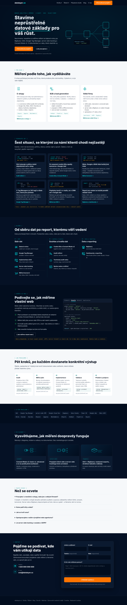
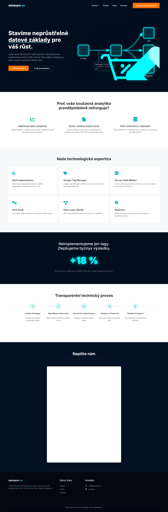
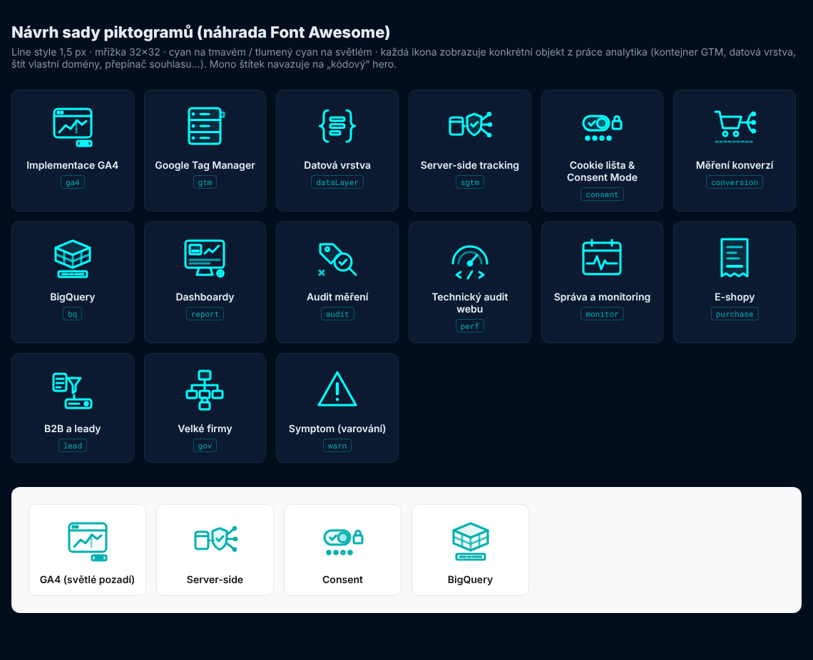

# Homepage datalayer.cz – UX audit a návrh

> Stav: návrh v1 (8. 10. 2026) · Podklady: screenshoty stagingu (`../data/screenshots/staging/`), `../07_audit-webu-klienta/audit-stagingu.md`, analýza konkurence a klíčových slov, `../03_landing-pages/00_architektura-webu.md`
> **Prototyp:** `prototyp/homepage-prototyp.html` (otevřít v prohlížeči) · screenshoty `prototyp/homepage-prototyp_desktop.png`, `_mobile.png`
> **Sada piktogramů:** `prototyp/piktogramy.html` (náhled), `prototyp/piktogramy-sprite.svg` (SVG sprite pro vývoj), `prototyp/piktogramy.png`

---

## 1. Shrnutí

**Co zachovat:** hero – tmavý design, H1, animovaný diagram `dataLayer.push → e-shop → GTM → GA4 / FB CAPI / BigQuery` a „kódové“ CTA v hranatých závorkách. Je to jediná část stránky, která je specifická pro obor a odlišuje datalayer.cz od konkurence.

**Co je problém (souhlas se zadáním klienta):** všechno pod hero je generické.
- **Piktogramy** jsou standardní Font Awesome ikony (graf, sušenka, databáze, štítek, server, ozubená kola, schéma, lupa s dolarem). Stejné ikony by mohla mít účetní firma nebo hosting. Navíc se kvůli nim načítá celý Font Awesome.
- **Texty** nepojmenovávají nic konkrétního („Nepřesná data a duplicity berou jistotu“, „funkcionální ekosystém“) a nepoužívají jazyk, kterým klienti hledají a popisují problém (podle analýzy klíčových slov: *nastavení GA4, měření konverzí, cookie lišta, consent mode v2, server side tracking, ga4 nesedí tržby, offline konverze*).
- **Struktura** je šablonová: 3 problémy → 6 stejných karet služeb → osamocené číslo „+18 %“ → 5 kroků → HubSpot formulář. Chybí segmenty (e-shop / B2B / velké firmy), důkazy, obsah a „živé“ prvky.

**Co navrhujeme:** homepage, která působí jako práce technika – **konkrétní symptomy ve formě „logů“, služby jako datová pipeline (navazuje na hero), vlastní technické piktogramy, důkaz místo čísla („podívejte se, jak měříme vlastní web“) a nativní formulář.** Viz prototyp.



---

## 2. Audit současné homepage (sekce po sekci)

| # | Sekce (staging) | Co tam je | Problém | Návrh |
|---|---|---|---|---|
| 0 | Navigace | „Služby ▾“ (3 položky), „Služby“, Blog, Kontakt, CTA | 2× Služby; dropdown obsahuje jen 3 ze 6 služeb; „Server-Side GTM“ vede na stránku GTM | Mega-menu podle architektury (Služby ▾ / Řešení ▾ / Případové studie / Blog / O nás / CTA) |
| 1 | Hero | H1, perex, 2 CTA, animovaný diagram | ✅ funguje. Drobnosti: velká ikona košíku překrývá popisky „FB CAPI“ a „BigQuery“; 2. CTA „[ Jak pracujeme ]“ vede na formulář; na mobilu přetéká (395 px) | Ponechat. Doplnit nadtitulek s klíčovými slovy, upravit podtitul, opravit cíl 2. CTA a přetékání; zmenšit/posunout košík |
| 2 | „Proč vaše současná analytika pravděpodobně nefunguje?“ | 3 ikony (graf, sušenka, databáze) + obecné věty | generické ikony; texty nepopisují symptom („Konec cookies třetích stran a specializovaná implementace GA4, GTM, Server-Side měření atd.“ – věta nedává smysl); nic neodkazuje dál | **„Poznáváte se?“ – 6 konkrétních symptomů ve stylu konzole** s odkazem na řešení |
| 3 | „Naše technologická expertíza“ | 6 stejných karet s FA ikonami | generické ikony, popisy o 1 větě, žádná hierarchie, chybí consent, konverze, dashboardy, B2B | **Služby jako pipeline ve 3 vrstvách** (Sběr → Souhlas a kvalita → Data a reporting), 11 služeb, vlastní piktogramy, 1 řádek výsledku |
| 4 | „Neimplementujeme jen tagy…“ + „+18 %“ | velké číslo bez kontextu | neověřitelné tvrzení; technický publikum ho nebere vážně | **„Podívejte se, jak měříme vlastní web“** – ověřitelný důkaz (consent, sGTM, `generate_lead` bez PII) + později případová studie s čísly |
| 5 | „Transparentní technický proces“ | 5 kroků, 1 věta | chybí výstup a délka kroku | 5 kroků s **výstupem** a **délkou** (`[DOPLNIT]`) + odkaz na /jak-pracujeme |
| 6 | „Napište nám“ (HubSpot) | iframe formulář | viz `../05_formulare/` | Nativní kontaktní blok |
| – | chybí | – | segmenty, platformy, obsah/blog, FAQ, důvěra | Nové sekce 2, 7, 8, 9 |



---

## 3. Principy redesignu („živější, méně generická“)

1. **Mluvit jazykem symptomů, ne slibů.** Klient nehledá „přesná data“, hledá důvod, proč *GA4 ukazuje o pětinu méně objednávek* nebo proč *po nasazení cookie lišty spadly konverze*. Každý symptom = přesný odkaz na službu.
2. **Navázat na hero.** Hero je diagram datového toku → zbytek stránky pokračuje stejným jazykem: monospace štítky, „log“ výpisy, tok dat ve 3 vrstvách, mockup DevTools.
3. **Konkrétní objekty místo symbolů.** Piktogram GTM je kontejner se šuplíky (tag / trigger / variable), ne štítek. Server-side je štít s vlastní doménou. Consent je přepínač se signály.
4. **Důkaz místo čísla.** Dokud nejsou případové studie, nabídnout ověřitelnou věc (vlastní web jako referenční implementace).
5. **Segmenty hned pod hero.** E-shop, B2B a velká firma mají jiný problém – návštěvník se musí do 5 vteřin najít.
6. **Klíčová slova přirozeně.** H2 a texty obsahují hlavní výrazy (webová analytika, implementace GA4, Google Tag Manager, server-side tracking, Consent Mode v2, měření konverzí, BigQuery, dashboardy, audit měření) – v kontextu, ne jako výčet.

---

## 4. Nová struktura (wireframe)

```
┌──────────────────────────────────────────────────────────────┐
│ NAV: logo · Služby▾ · Řešení▾ · Případové studie · Blog · O nás · [CTA] │
├──────────────────────────────────────────────────────────────┤
│ 1 HERO (beze změny vizuálu) – nadtitulek s KW, H1, podtitul,  │
│   2 CTA, mikrocopy · vpravo animovaný diagram                 │
├──────────────────────────────────────────────────────────────┤
│ 2 PRO KOHO (světlá) – 3 karty: E-shopy / B2B / Velké firmy     │
├──────────────────────────────────────────────────────────────┤
│ 3 POZNÁVÁTE SE? (tmavá) – 6 karet „log + symptom + řešení“    │
├──────────────────────────────────────────────────────────────┤
│ 4 SLUŽBY – pipeline 3 sloupce: Sběr │ Souhlas a kvalita │ Data │
├──────────────────────────────────────────────────────────────┤
│ 5 OVĚŘTE SI NÁS – checklist + mockup DevTools (consent, sGTM) │
├──────────────────────────────────────────────────────────────┤
│ 6 JAK PRACUJEME (světlá) – 5 kroků s výstupem a délkou        │
├──────────────────────────────────────────────────────────────┤
│ 7 S ČÍM PRACUJEME – štítky nástrojů a platforem               │
│   (+ později pás případových studií / log klientů)            │
├──────────────────────────────────────────────────────────────┤
│ 8 DO HLOUBKY – 3 pilířové články s mini-diagramem             │
├──────────────────────────────────────────────────────────────┤
│ 9 FAQ (světlá) – 5 otázek                                     │
├──────────────────────────────────────────────────────────────┤
│ 10 KONTAKT – nativní blok (napište / zavolejte / formulář)    │
├──────────────────────────────────────────────────────────────┤
│ PATIČKA – 4 sloupce + Nastavení cookies                       │
└──────────────────────────────────────────────────────────────┘
```

**Mobil (390 px):** všechny mřížky do 1 sloupce; v sekci 3 zobrazit 3 symptomy + tlačítko „Zobrazit další 3“; pipeline jako akordeon (3 vrstvy); sticky spodní lišta `Zavolat` / `Napsat`; diagram v hero pod textem, zmenšený, bez překryvu (opravit přetékání 395 px).

---

## 5. Obsah sekcí – finální texty a vizuály

### Sekce 1 – Hero (vizuál beze změny)
| Prvek | Text |
|---|---|
| Nadtitulek (nový, mono, malé písmo) | `Webová analytika a měření · e-shopy · B2B · velké firmy` |
| H1 (beze změny) | Stavíme neprůstřelné **datové základy** pro váš růst. |
| Podtitul (nový) | Navrhneme, nasadíme a ověříme měření od datové vrstvy po BigQuery: GA4, Google Tag Manager, server-side tracking a Consent Mode v2. S dokumentací a s daty, která vlastníte vy. |
| CTA 1 | `[ Konzultovat projekt ]` → `#kontakt` |
| CTA 2 | `[ Jak pracujeme ]` → `/jak-pracujeme` (dnes vede na formulář) |
| Mikrocopy pod CTA (nové) | Úvodní konzultace 30 minut zdarma · odpověď do 1 pracovního dne |

Vizuál: současná animace. Úpravy: (1) velký piktogram košíku zmenšit na max. 40 % výšky a posunout tak, aby nepřekrýval uzly a popisky „FB CAPI“/„BigQuery“; (2) popisek „FB CAPI“ → „Meta CAPI“ (Facebook Conversions API se dnes jmenuje Meta Conversions API); (3) na mobilu diagram pod text a `max-width:100%` – odstraní horizontální scroll; (4) `prefers-reduced-motion` → statický stav.

> Poznámka k H1: slovo „neprůstřelné“ je v pravidlech copywritingu (architektura, kap. 6) na seznamu frází, kterým se jinde vyhýbáme. Na homepage ho **ponecháváme** – klient hero schválil a v kombinaci s technickým vizuálem funguje jako claim. Klíčová slova nese nadtitulek a podtitul.

### Sekce 2 – Pro koho (světlé pozadí)
- Eyebrow `[ Pro koho ]` · **H2: Měření podle toho, jak vyděláváte**
- Lead: E-shop potřebuje jiná data než firma, která prodává přes obchodníky. Vyberte si, co je vám nejblíž.
- 3 klikací karty (celá karta = odkaz), každá: piktogram, H3, „bolest“ (1 věta), 3 odrážky, štítky platforem, odkaz.

| Karta | Piktogram | Bolest | Odrážky | Štítky | Odkaz |
|---|---|---|---|---|---|
| E-shopy | `pi-eshop` (účtenka) | GA4 ukazuje jiné tržby než administrace a reklamní systémy si přivlastňují stejné objednávky. | e-commerce měření podle GA4 schématu · Google Ads, Meta, Sklik i Heureka se stejnou hodnotou objednávky · marže a vratky v reportu | Shoptet, Upgates, WooCommerce, Shopify | Měření pro e-shopy → `/reseni/e-shopy` |
| B2B a lead generation | `pi-lead` (formulář → trychtýř → CRM) | Víte, kolik přišlo poptávek. Nevíte, které z nich se změnily v zakázku – a reklamy to neví taky. | měření formulářů a hovorů bez osobních údajů v analytice · propojení s CRM a offline konverze · cena za lead i za zakázku | HubSpot, Pipedrive, Raynet | Měření pro B2B → `/reseni/b2b-a-lead-generation` |
| Velké firmy | `pi-gov` (org. strom se zámkem) | Více domén, týmů a dodavatelů. Každý měří trochu jinak a nikdo nemá celkový obraz. | měřicí plán, názvosloví a verzování jako standard · server-side a BigQuery ve vašem Google Cloudu · spolupráce s IT, testy a SLA | governance, sGTM, BigQuery | Měření pro velké firmy → `/reseni/velke-firmy` |

Měření: `cta_click` (`cta_id: home_segment_eshop|b2b|enterprise`).

### Sekce 3 – Poznáváte se? (tmavé pozadí)
- Eyebrow `[ Poznáváte se? ]` · **H2: Šest situací, se kterými za námi klienti chodí nejčastěji**
- Lead: Každá z nich má technickou příčinu, kterou umíme najít a opravit. Žádná z nich se nevyřeší „lepším reportem“.
- **Vizuál:** karta = mini „konzole“ (mono písmo, tmavší pozadí `#020a17`) se 3 řádky dat + varovný řádek (amber `#ffb020` / červená `#ff6b6b`) → pod tím H3 symptomu, 1–2 věty příčiny, odkaz. Animace: řádky „dopisovat“ (typewriter, 600 ms) při scrollu do viewportu; při `prefers-reduced-motion` statické.

| # | Konzole (ilustrativní) | H3 symptom | Text | Odkaz |
|---|---|---|---|---|
| 1 | `GA4 purchase 812` / `e-shop objednávky 1 046` / `⚠ rozdíl −22 %` | GA4 ukazuje o pětinu méně objednávek než e-shop | Typicky chybí měření u některých plateb, souhlas se ukládá špatně nebo se nákup posílá dvakrát a GA4 ho zahodí. | Audit měření → |
| 2 | `consent default 'denied'` / `google_ads konverze −38 %` / `⚠ od nasazení lišty` | Po nasazení cookie lišty spadly konverze v Google Ads | Lišta blokuje tagy, ale Consent Mode v2 neposílá signály, takže Google nemá z čeho modelovat. | Cookie lišta a Consent Mode → |
| 3 | `meta Purchase 418` / `ga4 purchase 633` / `⚠ event_id chybí` | Meta, Google a Sklik hlásí každý jiná čísla | Rozdíly jsou zčásti normální (atribuce), zčásti chyby – chybějící Conversions API, deduplikace nebo jiná hodnota objednávky. | Měření konverzí → |
| 4 | `GTM tagy 146` / `aktivní 41 ?` / `verze v212 bez popisu` | V Tag Manageru je 140 tagů a nikdo neví, které jsou potřeba | Nánosy po agenturách zpomalují web a posílají data tam, kam nemají. Uklidíme a nastavíme pravidla, aby to vydrželo. | Google Tag Manager → |
| 5 | `form odesláno 94` / `CRM zakázky ?` / `⚠ gclid se neukládá` | Poptávky končí v e-mailu, ne v CRM ani v Google Ads | Reklama se pak optimalizuje na počet formulářů, ne na zakázky. Propojíme web, CRM a reklamní systémy. | Měření pro B2B → |
| 6 | `report zdroj Excel` / `aktualizace ručně, Po 8:00` / `GA4 vzorkování ano` | Report pro vedení se každé pondělí skládá ručně | Data z GA4, reklam a e-shopu spojíme v BigQuery a postavíme dashboard, který se aktualizuje sám a sedí s účetnictvím. | BigQuery a dashboardy → |

> Čísla v „konzolích“ jsou ilustrativní – označit malou poznámkou nebo nahradit anonymizovanými daty z reálných auditů (`[DOPLNIT]`). Klíčová slova v této sekci: *ga4 nesedí tržby, cookie lišta, consent mode v2, konverze google ads, meta conversions api, google tag manager, offline konverze, crm, bigquery, dashboard*.

Měření: `cta_click` (`cta_id: home_symptom_1…6`).

### Sekce 4 – Služby jako datová pipeline (tmavší pozadí `#051125`)
- Eyebrow `[ Služby ]` · **H2: Od sběru dat po report, kterému věří vedení**
- Lead: Data procházejí třemi vrstvami. Postavíme celou cestu, nebo jen tu část, která vám chybí.
- **Vizuál:** 3 sloupce oddělené přerušovanou cyan linkou (navazuje na spojnice v hero), nad každým mono štítek `01 / sběr`, `02 / souhlas a kvalita`, `03 / data a reporting`. Volitelně: při najetí na službu se zvýrazní odpovídající uzel v malé verzi hero diagramu nad sekcí (fáze 2).

| Vrstva | Služba (odkaz) | Piktogram | Řádek výsledku |
|---|---|---|---|
| 01 Sběr dat | Datová vrstva | `pi-datalayer` | zadání pro vývojáře, které funguje |
| | Google Tag Manager | `pi-gtm` | pořádek v tazích a verzích |
| | Implementace GA4 | `pi-ga4` | čísla, která sedí s tržbami |
| | Server-side tracking | `pi-serverside` | měření na vaší doméně |
| | Měření konverzí | `pi-conversion` | Ads, Meta, Sklik i Heureka vidí totéž |
| 02 Souhlas a kvalita | Cookie lišta a Consent Mode v2 | `pi-consent` | legálně a bez zbytečné ztráty dat |
| | Audit měření | `pi-audit` | zjistíme, kde data utíkají |
| | Technický audit webu | `pi-perf` | rychlost, tagy a technické SEO |
| | Správa webu a měření | `pi-monitor` | hlídáme, aby měření po releasu nespadlo |
| 03 Data a reporting | BigQuery | `pi-bigquery` | surová data bez limitů GA4 |
| | Dashboardy a reporting | `pi-dashboard` | Data Studio (dříve Looker Studio) i Power BI |

> **Pozor:** Google v dubnu 2026 přejmenoval Looker Studio zpět na **Data Studio** (release notes 16. 4. 2026, ověřeno 10/2026: https://docs.cloud.google.com/data-studio/release-notes). Na webu používat „Data Studio (dříve Looker Studio)“ – lidé stále hledají „looker studio“ (1 400/měs.).

### Sekce 5 – Ověřte si nás (nahrazuje „+18 %“)
- Eyebrow `[ Ověřte si nás ]` · **H2: Podívejte se, jak měříme vlastní web**
- Lead: Místo slibů nabízíme kontrolu. Otevřete na tomto webu vývojářské nástroje prohlížeče a uvidíte totéž, co nastavujeme klientům.
- Checklist (zelené ✓):
  1. Před souhlasem se neukládají žádné analytické ani reklamní cookies (Consent Mode v2, výchozí stav `denied`).
  2. Měření běží přes server-side GTM na naší vlastní subdoméně.
  3. Formulář posílá událost `generate_lead` – bez jména a e-mailu v čitelné podobě.
  4. Web nenačítá HubSpot ani jiné cizí formuláře.
- CTA `[ Jak měříme vlastní web ]` → `/jak-pracujeme#vlastni-web`
- **Vizuál:** stylizovaný mockup DevTools (záložka *Console* aktivní): `gtag('consent','default',{…denied})`, `dataLayer.push({event:'generate_lead', …, user_data:{sha256_email_address:'…'}})`, řádek `Network sgtm.datalayer.cz/g/collect 200`. Kód je text (kopírovatelný), ne obrázek.
- **Podmínka:** sekci zobrazit až po nasazení consent + sGTM + nativního formuláře na produkci. Do té doby nahradit případovou studií nebo vynechat.
- Fáze 2: pás 3 případových studií (Problém → Příčina → Oprava → Výsledek, číslo) – `[DOPLNIT]`.

### Sekce 6 – Jak pracujeme (světlé pozadí)
- Eyebrow `[ Jak pracujeme ]` · **H2: Pět kroků, po každém dostanete konkrétní výstup**
- Lead: Žádné „nastavíme to“. Každý krok končí dokumentem nebo ověřením, které můžete předat vlastnímu týmu.

| # | Krok | Text | Výstup (mono štítek) | Délka |
|---|---|---|---|---|
| 01 | Audit | Projdeme GA4, GTM, consent a reklamní systémy a porovnáme je s administrací. | report s prioritami A/B/C | obvykle `[DOPLNIT]` dní |
| 02 | Měřicí plán | Byznys cíle převedeme na události, parametry a pravidla pojmenování. | měřicí plán + specifikace dataLayer | `[DOPLNIT]` dní |
| 03 | Implementace | GTM na webu i serveru, Consent Mode v2, konverze do reklamních systémů. | verzované kontejnery | `[DOPLNIT]` týdnů |
| 04 | Validace | Testovací scénáře, kontrola každé události a porovnání čísel s e-shopem nebo CRM. | protokol testů | `[DOPLNIT]` dní |
| 05 | Předání a podpora | Dokumentace, školení týmu a hlídání, aby měření nespadlo po dalším releasu. | dokumentace + monitoring | průběžně |

Odkaz pod sekcí: „Celý postup a co od vás budeme potřebovat →“ `/jak-pracujeme`.

### Sekce 7 – S čím pracujeme
- Eyebrow `[ S čím pracujeme ]` – řada mono štítků (ne loga – bez rizika s ochrannými známkami a rychlejší): GA4 · Google Tag Manager · server-side GTM · Google Cloud Run · BigQuery · Data Studio · Power BI · Google Ads · Meta CAPI · Sklik / Seznam · Heureka · Shoptet · Upgates · WooCommerce · Shopify · HubSpot · Pipedrive · Raynet.
- Štítky platforem odkazují na příslušnou LP nebo záložku (např. Shoptet → `/reseni/e-shopy#shoptet`).
- Fáze 2: pás log klientů – **jen ti, u kterých datalayer.cz dělal měření**, se souhlasem.

### Sekce 8 – Do hloubky (obsah)
- Eyebrow `[ Do hloubky ]` · **H2: Vysvětlujeme, jak měření doopravdy funguje**
- Lead: Návody s diagramy, kódem a odkazy na dokumentaci. Bez marketingových zkratek.
- 3 karty pilířových článků (náhled = mini-diagram tématu v brand stylu, štítek clusteru, titulek, perex, čas čtení):
  1. *Consent Mode v2: basic vs. advanced a co se posílá před souhlasem* → `/blog/consent-mode-v2-pruvodce`
  2. *Propojení client-side a server-side trackingu krok za krokem* → `/blog/propojeni-client-side-a-server-side`
  3. *GA4 → BigQuery: nastavení exportu, struktura tabulek a náklady* → `/blog/ga4-bigquery-export`
- Po spuštění blogu nahradit dynamickým výběrem „nejčtenější z clusteru“.

### Sekce 9 – FAQ (světlé pozadí)
**H2: Než se ozvete** (5 otázek; `FAQPage` schema volitelně – Google od 7. 5. 2026 FAQ rich results nezobrazuje, ověřeno: https://developers.google.com/search/updates (záznamy 8. 5. 2026 a 15. 6. 2026) – otázky ale pomáhají uživatelům i AI odpovědím)

| Otázka | Odpověď |
|---|---|
| Pracujete i s menšími e-shopy, nebo jen s velkými firmami? | S obojím. U menších e-shopů obvykle začínáme auditem a opravou základního měření (GA4, consent, konverze). Server-side a BigQuery doporučujeme až tam, kde se vyplatí – a řekneme vám to rovnou. |
| Komu patří účty a data? | Vždy vám. GA4, Tag Manager, Google Cloud i reklamní účty běží pod vaší firmou, my dostáváme přístup. Po skončení spolupráce nic nemigrujete a dostanete dokumentaci, podle které může pokračovat kdokoli jiný. |
| Jak se tvoří cena? | Podle rozsahu: počet webů a domén, platforma e-shopu, kolik reklamních systémů napojujeme a jestli stavíme server-side nebo BigQuery. Po úvodní konzultaci dostanete nabídku s pevným rozsahem a výstupy. Provoz Google Cloudu platíte napřímo Googlu. |
| Spolupracujete s naším vývojářem nebo agenturou? | Ano, je to běžné. Vývojářům dodáme specifikaci datové vrstvy a testovací scénáře, s PPC agenturou se domluvíme na konverzích a jejich hodnotách. |
| Je server-side tracking v souladu s GDPR? | Server-side nemění nic na tom, kdy potřebujete souhlas. Nastavujeme ho tak, aby respektoval volbu v cookie liště a aby na servery třetích stran odcházelo jen to, co odcházet má. Právní posouzení konkrétního zpracování patří vašemu právníkovi. |

### Sekce 10 – Kontakt
Nativní blok podle `../05_formulare/specifikace-formularu.md` (`form_id: home`, bez předvybraného tématu). H2 **Pojďme se podívat, kde vám utíkají data**; lead „Napište nám, zavolejte, nebo vyplňte formulář. Na úvodní 30minutové konzultaci projdeme vaše měření a řekneme vám, co opravit jako první.“

### Patička
4 sloupce dle architektury kap. 2; e-mail jako `mailto:`, LinkedIn jako odkaz, telefon jako `tel:`; „O nás“ → `/o-nas` (dnes vede na `/`); „Quick links“ → „Rychlé odkazy“; odkaz **Nastavení cookies**.

---

## 6. Texty před a po (přehled)

| Místo | Dnes | Návrh |
|---|---|---|
| Podtitul hero | Jsme techničtí inženýři vaší analytiky. Specializovaná implementace GA4, GTM, Server-Side měření a BigQuery. Data, kterým konečně můžete věřit. | Navrhneme, nasadíme a ověříme měření od datové vrstvy po BigQuery: GA4, Google Tag Manager, server-side tracking a Consent Mode v2. S dokumentací a s daty, která vlastníte vy. |
| H2 problémů | Proč vaše současná analytika pravděpodobně nefunguje? | Šest situací, se kterými za námi klienti chodí nejčastěji |
| Problém 1 | Nepřesná data a duplicity berou jistotu. Nesprávná data generují mylná rozhodnutí. | GA4 ukazuje o pětinu méně objednávek než e-shop – typicky chybí měření u některých plateb, souhlas se ukládá špatně nebo se nákup posílá dvakrát. |
| Problém 2 | Konec cookies třetích stran a specializovaná implementace GA4, GTM, Server-Side měření atd. | Po nasazení cookie lišty spadly konverze v Google Ads – lišta blokuje tagy, ale Consent Mode v2 neposílá signály. |
| Problém 3 | Data zviditelníme v nástrojích pro vizualizaci, uvolníme je pro další použití. | Report pro vedení se každé pondělí skládá ručně – spojíme data v BigQuery a postavíme dashboard, který sedí s účetnictvím. |
| H2 služeb | Naše technologická expertíza | Od sběru dat po report, kterému věří vedení |
| GA4 | Technická implementace funkcionálního ekosystému, nastavení eventů a cílů. | Implementace GA4 – čísla, která sedí s tržbami |
| Server-side | Server-Side implementace měření pro přesnější data a obcházení blokátorů. | Server-side tracking – měření na vaší doméně (bez slibů o obcházení blokátorů) |
| Důkaz | +18 % Konverzní uplift po přidání Server-Side implementace. | Podívejte se, jak měříme vlastní web (ověřitelný checklist) / případová studie s metodikou |
| Proces | Hloubková analýza současného stavu. | Projdeme GA4, GTM, consent a reklamní systémy a porovnáme je s administrací. Výstup: report s prioritami A/B/C. |
| Kontakt | Napište nám / Máte dotaz k implementaci? Vyplňte formulář níže. | Pojďme se podívat, kde vám utíkají data / Napište nám, zavolejte, nebo vyplňte formulář. |

---

## 7. Piktogramy (náhrada Font Awesome)



- Soubor `prototyp/piktogramy-sprite.svg` – 15 symbolů (`pi-ga4`, `pi-gtm`, `pi-datalayer`, `pi-serverside`, `pi-consent`, `pi-conversion`, `pi-bigquery`, `pi-dashboard`, `pi-audit`, `pi-perf`, `pi-monitor`, `pi-eshop`, `pi-lead`, `pi-gov`, `pi-warn`).
- Použití: inline sprite v layoutu + `<svg class="pi" aria-hidden="true"><use href="#pi-ga4"/></svg>`; barva přes `currentColor` (cyan na tmavém, `#00a3a3` na světlém).
- Pravidla: tah 1,5 px, mřížka 32×32, zaoblené konce, akcentová výplň max. 10–25 % opacity, žádné gradienty; velikost 32–40 px v kartách, 64 px v hero/OG obrázcích.
- Prototypové SVG jsou funkční návrh – doporučujeme, aby je ilustrátor dočistil (optické vyvážení, pixel-snapping na 24/32/48 px) a doplnil animované varianty (např. přepínač consentu se přepne, štít se „rozsvítí“).
- Font Awesome odstranit z celého webu (`all.min.css` ~ desítky kB CSS + webfonty). Ikony e-mailu/LinkedIn v patičce nahradit inline SVG.

---

## 8. SEO homepage

| Prvek | Návrh |
|---|---|
| Title | Webová analytika a měření dat pro e-shopy a firmy \| datalayer.cz (61 zn. – případně zkrátit na „Webová analytika a měření pro e-shopy a firmy \| datalayer.cz“) |
| Meta description | Implementace GA4, Google Tag Manager, server-side tracking a Consent Mode v2. Měření, které sedí s tržbami – s dokumentací. Konzultace zdarma. (≈150 zn.) |
| H1 | beze změny (viz sekce 1) |
| H2 | 8× H2 z návrhu (obsahují: měření, služby, sběr dat, report, jak pracujeme…) |
| Hlavní KW | webová analytika (90), analytika webu (70), webová analytika agentura, datová analytika, implementace měření |
| Sekundární KW (přes odkazy a texty) | implementace GA4, Google Tag Manager, server-side tracking, consent mode v2, cookie lišta, měření konverzí, BigQuery, dashboard, audit měření |
| Strukturovaná data | `Organization` (name, url, logo, email, telephone, sameAs LinkedIn), `ProfessionalService` (areaServed CZ, knowsAbout: GA4, GTM, server-side tagging, Consent Mode, BigQuery), `WebSite`; FAQPage volitelně |
| OG obrázek | 1200×630, tmavé pozadí, výřez hero diagramu + text „Webová analytika a měření“ |
| Interní odkazy | 3 řešení + 11 služeb + /jak-pracujeme + 3 pilířové články (viz architektura kap. 3) |
| Výkon | odstranit HubSpot, Font Awesome, highlight.js (na homepage nepotřeba); fonty self-host |

---

## 9. Měření homepage (dataLayer)

| Událost | Kde | Parametry |
|---|---|---|
| `cta_click` | hero CTA, karty segmentů, odkazy symptomů, služby, articles | `cta_id` (např. `home_hero_primary`, `home_segment_b2b`, `home_symptom_2`, `home_service_serverside`), `section` |
| `contact_click` | telefon / e-mail v kontaktu a patičce | `channel`, `section` |
| `faq_open` | FAQ | `question` |
| `scroll_depth` | 50 / 90 % | `percent` |
| `lead_form_start`, `lead_form_error`, `generate_lead` | formulář | viz `../05_formulare/` (pozn.: `form_start` je automatická událost GA4 rozšířeného měření – vlastní událost pojmenovat `lead_form_start`) |

---

## 10. Co dodá klient
- Typické délky kroků procesu (sekce 6).
- Anonymizovaná data z auditů pro „konzole“ v sekci 3 (nebo souhlas s ilustrativními čísly s poznámkou).
- Rozhodnutí a termín nasazení consent + sGTM + nativního formuláře na vlastní web (podmínka sekce 5).
- Fotka a krátké bio Víta Novotného (kontaktní blok, O nás), telefon, odkaz na LinkedIn.
- Případové studie a loga klientů se souhlasem (fáze 2).

## 11. Akceptační checklist
- [ ] Hero beze změny vizuálu; nový nadtitulek a podtitul; 2. CTA vede na /jak-pracujeme; žádný horizontální scroll na 360–414 px.
- [ ] Žádná ikona z Font Awesome; všechny piktogramy ze sprite.
- [ ] Každý symptom i služba odkazuje na existující URL.
- [ ] Čísla v konzolích označená jako ilustrativní nebo nahrazená reálnými.
- [ ] Sekce „Ověřte si nás“ zobrazena jen při splnění podmínky.
- [ ] Kontrast textu min. 4,5 : 1 (zejména šedé texty na tmavém pozadí – dnešní podtitul kontaktu nevyhovuje).
- [ ] Title, meta description, strukturovaná data, OG obrázek.
- [ ] Události dle kap. 9 v GTM Preview.
- [ ] LCP < 2,5 s, CLS < 0,1, INP < 200 ms na mobilu (bez HubSpotu a Font Awesome).
