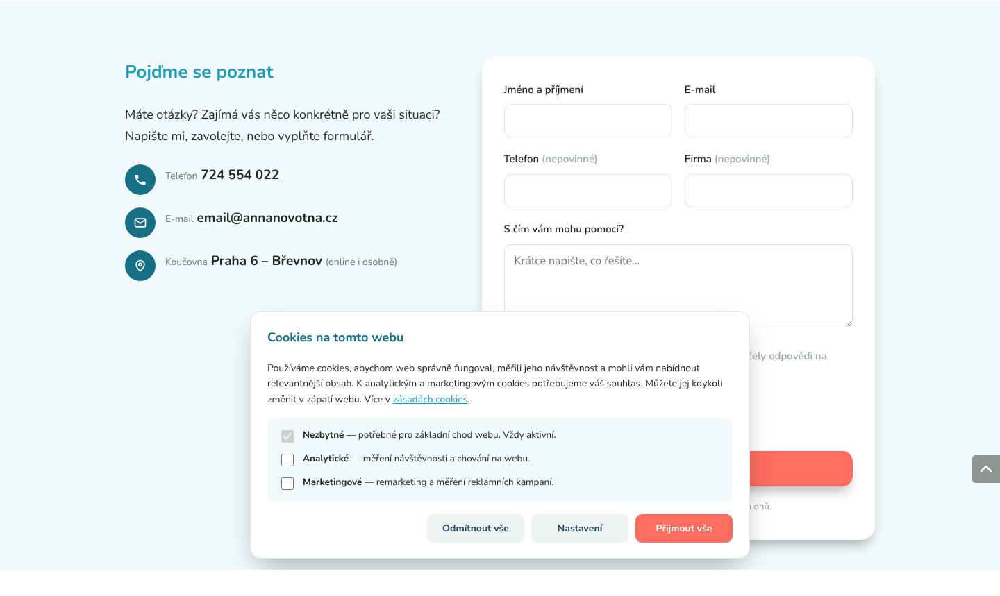
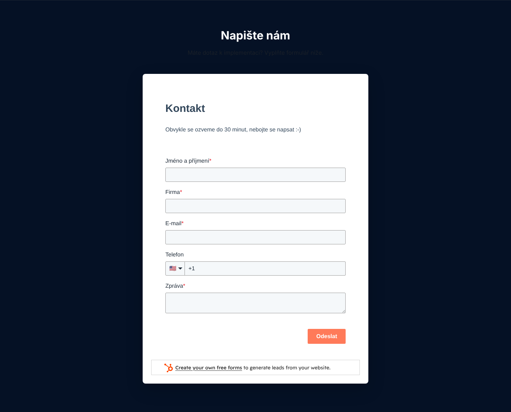
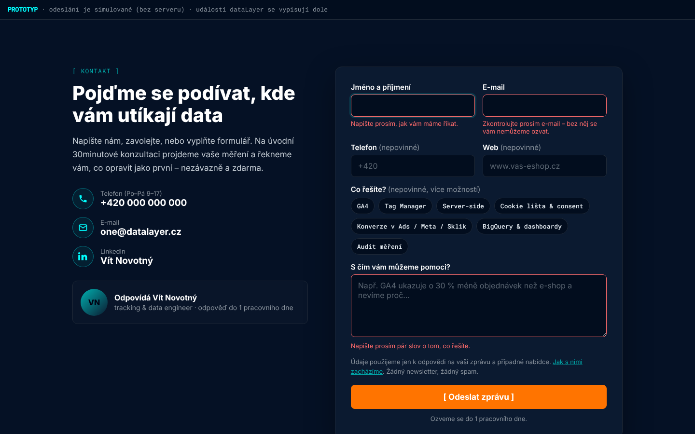
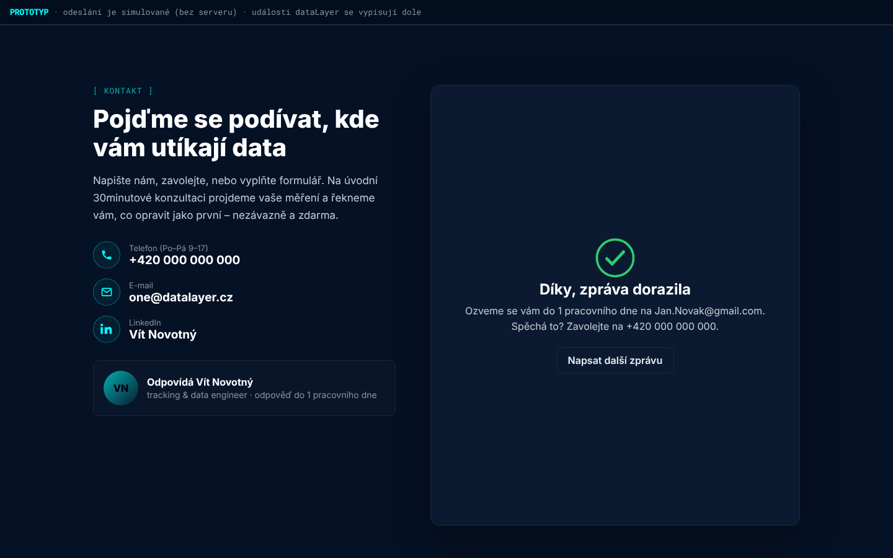

# Formuláře: náhrada HubSpotu nativním formulářem podle vzoru annanovotna.cz

**Výstupy v této složce**
| Soubor | Co to je |
|---|---|
| `specifikace-formularu.md` | Tento dokument – analýza vzoru, specifikace, texty pro jednotlivé stránky, tracking, backend |
| `prototyp/kontakt-blok-prototyp.html` | Funkční prototyp bloku (otevřít v prohlížeči; odeslání je simulované, dole se vypisuje `dataLayer`) |
| `prototyp/kontakt.css` | Styly bloku ve vizuálu datalayer.cz (barvy a fonty převzaté ze stagingu) |
| `prototyp/kontakt.js` | Klientská logika: validace, odeslání přes `fetch`, stavy, `dataLayer` (lead_form_start / lead_form_error / generate_lead + hash pro enhanced conversions) |
| `prototyp/api.kontakt.ts` | Serverová action pro React Router v7 (staging běží na React Router SSR / Cloud Run) |
| `prototyp/screen_*.png` | Screenshoty prototypu (prázdný, chyby, odesláno, mobil) |

---

## 1. Jak je to řešené na annanovotna.cz (vzor)



**Struktura bloku `.contact-form-block`** (stejný blok na každé stránce, jen jiné texty a `data-form` ID):

| Část | Řešení na annanovotna.cz | Proč to funguje |
|---|---|---|
| Layout | 2 sloupce (0.9fr / 1.1fr), na tabletu pod sebou | Výzva a lidský kontakt vlevo, formulář vpravo – uživatel si vybere kanál |
| Nadpis | Mění se podle stránky: „Pojďme se poznat“ (HP), „Napište mi“ (kontakt), „Řekněte mi, co potřebujete“ (pro CEO) | Navazuje na kontext stránky |
| Výzva | „Máte otázky? … **Napište mi, zavolejte, nebo vyplňte formulář.**“ | Explicitně nabízí 3 cesty – formulář není jediná možnost |
| Kanály | Kulaté ikony + popisek + velký tučný údaj: Telefon (`tel:` odkaz), E-mail, Místo (online i osobně) | Telefon/e-mail klikací, čitelné na mobilu |
| Pole | Jméno a příjmení*, E-mail* · Telefon (nepovinné), Firma (nepovinné) · „S čím vám mohu pomoci?“* (placeholder „Krátce napište, co řešíte…“) | Jen 3 povinná pole, žádná registrace |
| Souhlas | Checkbox „Souhlasím se zpracováním osobních údajů pro účely odpovědi na poptávku. Více“ | (viz doporučení níže – u datalayer.cz nahradit informační větou) |
| Anti-spam | Cloudflare Turnstile + honeypot pole `website` (skryté) | Bez otravné CAPTCHA |
| Tlačítko | „Odeslat zprávu“ přes celou šířku | Jasná akce |
| Poznámka | „Ozvu se vám obvykle do dvou pracovních dnů.“ | Očekávání odpovědi |
| Úspěch | Překryv přes formulář: zelená ikona ✓ (animace), „Zpráva odeslána“, text, tlačítko „Napsat další zprávu“ | Žádné přesměrování, jasné potvrzení |
| Odeslání | `fetch` na `/api/kontakt.php`, JSON odpověď `{ok, message}`; bez JS klasický POST | Progressive enhancement |
| Měření | Po úspěchu `dataLayer.push({event:'form_submit', form_id, form_location, user_data:{sha256_email_address, sha256_phone_number}})` | Enhanced conversions bez posílání plain-text PII |
| Cookie lišta | Vlastní lišta (Nezbytné / Analytické / Marketingové; Odmítnout vše / Nastavení / Přijmout vše) + Google Consent Mode v2 (`ad_user_data`, `ad_personalization`…) + událost `cookie_consent_update` do dataLayeru | Stejný vizuální jazyk jako web, žádná CMP třetí strany |

## 2. Současný stav na datalayer.vitnovotny.cz (HubSpot)



| Problém | Detail |
|---|---|
| Vizuálně cizí prvek | Bílá karta s fonty a tlačítkem HubSpotu (lososová barva) uprostřed tmavého webu; duplicitní nadpis „Napište nám“ + „Kontakt“ |
| Tření | **Firma je povinná**; telefon s výchozí vlajkou 🇺🇸 a předvolbou **+1** |
| Branding | Patička „Create your own free forms to generate leads…“ s logem HubSpotu – u B2B agentury působí levně |
| Chybí alternativy | Žádný telefon ani e-mail vedle formuláře (e-mail je jen v patičce a není klikací) |
| Slib „do 30 minut“ | Těžko udržitelné; když se nesplní, poškozuje důvěru |
| Kontrast | Podtitulek „Máte dotaz k implementaci? Vyplňte formulář níže.“ je téměř neviditelný |
| Výkon | iframe 776 px + 13 domén HubSpotu, ~25 požadavků navíc |
| Soukromí | HubSpot skripty se načítají **bez souhlasu** (web nemá cookie lištu) – na webu „datového“ experta působí špatně |
| Měření | Žádná `dataLayer` událost – web nemá ani GTM, takže konverze se neměří vůbec |

## 3. Specifikace nativního formuláře pro datalayer.cz

### 3.1 Princip
- **Jeden znovupoužitelný blok** (`<ContactBlock formId="…" defaultTopic="…" title="…" lead="…" />`) na homepage, na konci každé landing page, na stránce Kontakt a zkráceně pod články.
- **Žádná registrace, žádný účet, žádný HubSpot.** Poptávka jde e-mailem (+ volitelně webhook do CRM/Slacku).
- Vizuál: tmavá karta `#0b1a30` na sekci `#051125`, akcent `#00ffff`, CTA `#ff7400`, Inter + Roboto Mono, „kódové“ hranaté závorky v CTA (`[ Odeslat zprávu ]`) – navazuje na hero.



### 3.2 Levý sloupec – výzva ke kontaktu
| Prvek | Obsah |
|---|---|
| Eyebrow (mono) | `[ Kontakt ]` |
| H2 | Podle stránky – viz tabulka 3.5 |
| Lead | „Napište nám, zavolejte, nebo vyplňte formulář. Na úvodní 30minutové konzultaci projdeme vaše měření a řekneme vám, co opravit jako první – nezávazně a zdarma.“ |
| Kanál 1 | ☎ **Telefon** (Po–Pá 9–17) – `tel:` odkaz, velkým písmem. *Telefonní číslo je potřeba doplnit.* |
| Kanál 2 | ✉ **E-mail** – `mailto:one@datalayer.cz` |
| Kanál 3 | in **LinkedIn** – profil Víta Novotného (B2B klienti si osobu ověřují právě tam) |
| Karta osoby | Fotka + „Odpovídá Vít Novotný – tracking & data engineer · odpověď do 1 pracovního dne“ (nahrazuje anonymní „ozveme se do 30 minut“) |

### 3.3 Pravý sloupec – pole formuláře
| # | Pole | `name` | Typ | Povinné | Poznámka |
|---|---|---|---|---|---|
| 1 | Jméno a příjmení | `jmeno` | text, `autocomplete=name` | ✅ | |
| 2 | E-mail | `email` | email, `autocomplete=email` | ✅ | |
| 3 | Telefon | `telefon` | tel, placeholder `+420` | – | Bez výběru země, normalizace (9 číslic → +420) |
| 4 | Web | `web` | url, placeholder `www.vas-eshop.cz` | – | **Místo „Firma“** – pro analytickou agenturu užitečnější (hned se dá podívat na měření) a pro uživatele méně „korporátní“ |
| 5 | Co řešíte? | `tema[]` | checkbox „chips“ | – | GA4 · Tag Manager · Server-side · Cookie lišta & consent · Konverze v Ads / Meta / Sklik · BigQuery & dashboardy · Audit měření. **Předvybráno podle stránky** (`data-default-topic`). Kvalifikace leadu bez dalšího tření. |
| 6 | S čím vám můžeme pomoci? | `zprava` | textarea | ✅ | Placeholder s konkrétním symptomem (mění se podle LP – viz 3.5) |
| – | Honeypot | `website` | skrytý text | – | Mimo obrazovku, `tabindex=-1` |
| – | Turnstile | `cf-turnstile-response` | widget | – | `data-theme="dark"`; na serveru ověřit přes `siteverify` |
| – | ID formuláře | `form_id` | hidden | – | `home`, `lp-ga4`, `lp-server-side`, `kontakt`, `blog`… |

**Právní text místo checkboxu:** „Údaje použijeme jen k odpovědi na vaši zprávu a případné nabídce. *Jak s nimi zacházíme.* Žádný newsletter, žádný spam.“
> Proč ne checkbox: odpověď na poptávku je zpracování nutné k jednání o smlouvě (čl. 6 odst. 1 písm. b) GDPR), souhlas zde není vhodný právní titul a povinný checkbox jen přidává tření. Informační povinnost (čl. 13) splní odkaz na zásady. Checkbox souhlasu dává smysl jen pro newsletter/marketing – ten ve formuláři není. *(Pokud klient chce 1:1 shodu s annanovotna.cz, checkbox lze ponechat – funkčně to nevadí.)*

**Tlačítko:** `[ Odeslat zprávu ]` (oranžové, plná šířka). **Poznámka pod tlačítkem:** „Ozveme se do 1 pracovního dne.“

### 3.4 Stavy formuláře
| Stav | Chování |
|---|---|
| Výchozí | Témata předvybraná podle stránky |
| Validace | Při odeslání; chyby pod polem červeně (`aria-invalid`, `aria-describedby`), fokus na první chybné pole, chyba zmizí při psaní. Texty: „Napište prosím, jak vám máme říkat.“ / „Zkontrolujte prosím e-mail – bez něj se vám nemůžeme ozvat.“ / „Napište prosím pár slov o tom, co řešíte.“ |
| Odesílání | Tlačítko `disabled`, poznámka „Odesílám…“ |
| Úspěch | Překryv karty: ✓ (animace, respektuje `prefers-reduced-motion`), **„Díky, zpráva dorazila“**, „Ozveme se vám do 1 pracovního dne na {e-mail}. Spěchá to? Zavolejte na {telefon}.“, tlačítko „Napsat další zprávu“ |
| Chyba serveru | Červená poznámka „Zprávu se nepodařilo odeslat. Zkuste to prosím znovu, nebo nám napište e-mail.“ + reset Turnstile |
| Bez JS | Klasický POST → 303 na `/dekujeme` (samostatná děkovací stránka, `noindex`) |



### 3.5 Texty bloku podle stránky
| Stránka | `form_id` | Předvybrané téma | H2 | Placeholder zprávy |
|---|---|---|---|---|
| Homepage | `home` | – | Pojďme se podívat, kde vám utíkají data | Např. GA4 ukazuje o 30 % méně objednávek než e-shop a nevíme proč… |
| Implementace GA4 | `lp-ga4` | ga4 | Nastavíme GA4 tak, aby čísla seděla s tržbami | Např. máme GA4, ale e-commerce data nesedí s administrací e-shopu… |
| Google Tag Manager | `lp-gtm` | gtm | Uklidíme váš Tag Manager | Např. v GTM máme 120 tagů a nikdo neví, co dělají… |
| Server-side tracking | `lp-server-side` | server-side, konverze | Zjistěte, kolik konverzí vám chybí | Např. Meta hlásí o polovinu méně nákupů než e-shop… |
| Cookie lišta & Consent Mode | `lp-consent` | consent | Nastavíme souhlas tak, aby byl legální a data nezmizela | Např. po nasazení cookie lišty nám spadly konverze v Google Ads… |
| Datová vrstva | `lp-datalayer` | gtm, ga4 | Připravíme zadání datové vrstvy pro vaše vývojáře | Např. vyvíjíme nový e-shop a potřebujeme specifikaci dataLayer… |
| Audit měření | `lp-audit` | audit | Objednejte si audit měření | Např. nevěříme číslům v GA4 a chceme vědět, kde je chyba… |
| BigQuery & dashboardy | `lp-bigquery` | bigquery | Propojíme data do jednoho dashboardu | Např. chceme spojit GA4, Google Ads a data z ERP v Looker Studiu… |
| Měření konverzí (Ads/Meta/Sklik) | `lp-konverze` | konverze | Ať reklamní systémy vidí všechny konverze | Např. Sklik a Heureka ukazují jiné konverze než GA4… |
| Kontakt | `kontakt` | – | Napište nám, nebo rovnou zavolejte | Krátce napište, co řešíte… |
| Článek (zkrácený blok) | `blog` | dle kategorie článku | Řešíte totéž u sebe? | Napište, na čem jste se zasekli… |

*(Finální seznam LP a jejich URL je v `03_landing-pages/00_architektura-webu.md` – tabulku je potřeba držet v souladu.)*


### 3.6 Doplnění podle zadání landing pages (8. 10. 2026)
Zadání LP v `../03_landing-pages/` obsahují finální texty kontaktního bloku pro každou stránku (kap. 4 každého zadání) – **mají přednost před tabulkou 3.5**. Nové hodnoty, které je potřeba přidat do komponenty:

| Doplnit | Hodnoty |
|---|---|
| `form_id` | `lp-dashboardy`, `lp-tech-audit`, `lp-sprava`, `lp-eshopy`, `lp-b2b`, `lp-velke-firmy`, `jak-pracujeme`, `sluzby`, `o-nas`, `case-study`, `tool-consent` |
| Témata (chips) | `datalayer` (Datová vrstva), `leady-crm` (Leady & CRM), `tech-audit` (Technický audit webu), `sprava` (Správa webu a měření), `governance` (Governance / velké firmy) |
| Režimy | `quick_check` na LP Audit měření (rychlá kontrola zdarma – jen URL webu + e-mail; viz `09_audit-mereni.md`) |
| Předvyplnění zprávy | tlačítka na LP mohou předat text do pole zprávy (`?msg=` nebo `data-prefill`) – viz zadání LP |
| Parametr události | `lead_type` (např. `consultation`, `quick_check`, `audit`) u `generate_lead` |

## 4. Měření formuláře (dataLayer kontrakt)

Web analytické agentury je referenční implementace – doporučuji na webu i ukázat „takhle měříme náš formulář“.

```js
// 1) první interakce s formulářem
// (název lead_form_start, protože form_start a form_submit GA4 sbírá automaticky v rozšířeném měření)
{ event: 'lead_form_start', form_id: 'lp-server-side', form_location: '/sluzby/server-side-tracking' }

// 2) neúspěšná validace (analýza, na kterém poli lidé padají)
{ event: 'lead_form_error', form_id: 'lp-server-side', error_fields: 'email,zprava' }

// 3) úspěšné odeslání – GA4 doporučená událost
{
  event: 'generate_lead',
  form_id: 'lp-server-side',
  form_location: '/sluzby/server-side-tracking',
  lead_topics: 'server-side,konverze',
  lead_id: 'L-mg3k2-4f9a',               // ze serveru → deduplikace, import offline konverzí z CRM
  user_data: {                           // jen SHA-256 hash, nikdy plain-text PII
    sha256_email_address: '…',           // normalizace: trim, lowercase, gmail.com bez teček
    sha256_phone_number: '…'             // E.164 (+420…)
  }
}
```

> **Normalizace e-mailu:** dokumentace Googlu se liší v tom, zda u Gmailu odstraňovat i část za „+“. Zásadní je, aby web i export z CRM (offline konverze, Customer Match) používaly **stejnou** normalizační funkci – viz brief `../06_clanky/E2_rozsirene-konverze.md` a `E1_mereni-formularu-a-leadu.md`. Prototyp odstraňuje tečky u gmail.com/googlemail.com; před nasazením sjednotit s funkcí použitou pro CRM.

Prototyp byl otestován v Playwright/Chromium: `Jan.Novak@gmail.com` → normalizace `jannovak@gmail.com` → SHA-256 `005ed88a…d803` (ověřeno `sha256sum`), telefon `777 123 456` → `+420777123456`.

**GTM nastavení (doporučené):**
| Tag | Spouštěč | Poznámka |
|---|---|---|
| GA4 Event `generate_lead` (parametry `form_id`, `lead_topics`) | CE `generate_lead` | V GA4 označit jako klíčovou událost |
| GA4 Event `lead_form_start`, `lead_form_error` | CE | Pro trychtýř formuláře (rozšířené měření „Interakce s formuláři“ v GA4 vypnout, aby se nezdvojovalo) |
| Google Ads Conversion + enhanced conversions (User-provided data z `user_data`) | CE `generate_lead` | Respektuje `ad_user_data` z Consent Mode v2 |
| Meta CAPI přes server-side GTM (`Lead`, `event_id` = `lead_id`) | CE `generate_lead` | Deduplikace pixel ↔ CAPI přes `event_id` |
| LinkedIn Insight / CAPI (volitelně) | CE `generate_lead` | Pro B2B kampaně |

## 5. Backend (React Router v7 na Cloud Run)
- Route `app/routes/api.kontakt.ts` (viz prototyp): honeypot → validace → Turnstile `siteverify` → e-mail (Resend/SMTP) s `reply_to` na zájemce → volitelný webhook (CRM, Slack, Make) → JSON `{ ok, leadId, message }`.
- Tajemství v Secret Manageru (`TURNSTILE_SECRET`, `RESEND_API_KEY`).
- Rate limit (např. 5 odeslání / IP / 10 min) – Cloud Armor nebo jednoduchý čítač.
- Logovat jen `leadId` a stav, ne obsah zprávy.
- **CRM:** pokud chce klient leady dál vidět v HubSpot CRM, lze je ze serveru poslat přes HubSpot API – na webu ale nebude žádný HubSpot skript ani iframe.

## 6. Související: cookie lišta + Consent Mode v2 (stejný vzor jako annanovotna.cz)
- Vlastní lišta ve vizuálu webu: **Nezbytné** (vždy) · **Analytické** · **Marketingové**; tlačítka **Odmítnout vše** / **Nastavení** / **Přijmout vše** (rovnocenná – bez dark patterns).
- `gtag('consent','default',{…'denied'})` před GTM, po volbě `gtag('consent','update',…)` + `dataLayer` událost `cookie_consent_update`.
- Odkaz „Nastavení cookies“ v patičce pro změnu volby; cookie se souhlasem 180 dní.
- Detailní obsah pro LP a články o consentu: `03_landing-pages/` a `06_clanky/`.

## 7. Checklist implementace
- [ ] Odstranit HubSpot embed a skripty (`js-eu1.hsforms.net`, `hs-scripts`)
- [ ] Komponenta `ContactBlock` + `kontakt.css` + `kontakt.js` (nebo přepis do React `useFetcher`)
- [ ] Route `/api/kontakt` + `/dekujeme` (noindex)
- [ ] Doplnit telefon, fotku, LinkedIn URL
- [ ] Turnstile sitekey/secret
- [ ] GTM + Consent Mode v2 + tagy dle kap. 4
- [ ] Test: validace, úspěch, chyba serveru, bez JS, mobil 360–390 px, čtečka obrazovky, `dataLayer` v GTM Preview
