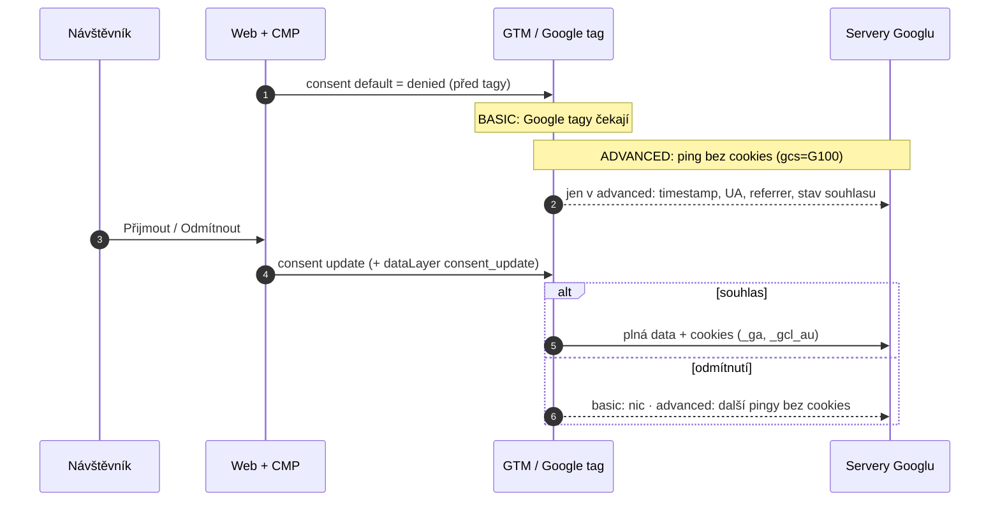
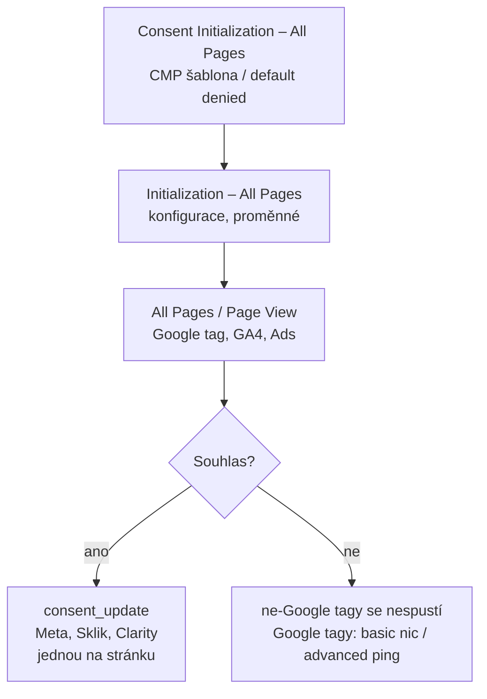

# A1: Consent Mode v2: kompletní průvodce (basic vs. advanced, co se posílá před souhlasem) – brief
> Cluster: A. Consent & legislativa (pilíř / hub) · URL: /blog/consent-mode-v2-pruvodce · Formát: pilíř – technický průvodce s kódem · Priorita: měsíc 1 · Cílová LP: /sluzby/cookie-lista-consent-mode · Rozsah finálního textu: 3 500–4 500 slov + kód + 2 diagramy + 4 tabulky

---

## 1. Meta

| Prvek | Návrh |
|---|---|
| H1 | Consent Mode v2: kompletní průvodce nastavením (2026) |
| SEO title (57 zn.) | Consent Mode v2: průvodce nastavením v GTM \| datalayer.cz |
| Meta description (149 zn.) | Basic, nebo advanced? Co posílají Google tagy před souhlasem, kdy funguje modelování konverzí a jak Consent Mode v2 nastavit a ověřit v GTM. S kódem. |
| URL | /blog/consent-mode-v2-pruvodce |
| Datum | publikace + „Revidováno: {datum}“ (revize každé 3 měsíce – téma se v roce 2026 mění) |

**Klíčová slova (Ahrefs CZ, `kw_mapovani_na_stranky.tsv`, topic `consent`):**
- Hlavní: `consent mode v2` (80, KD 28)
- Vedlejší: `google consent mode v2` (80, KD 31), `consent mode` (30), `google consent mode` (30, KD 19), `consent mode 2` (10), `cookies consent v2` (10), `google tag manager consent mode v2` (10), `shoptet consent mode v2` (20 – jen zmínka + odkaz na D4)
- Long-tail (0–10, ale vysoká intence): `consent mode v2 nastavení`, `jak nastavit consent mode`, `co je consent mode v2`, `consent mode basic vs advanced`, `how to check consent mode v2`, `is consent mode v2 mandatory`
- Otázky z PAA (`otazky_paa_vse.tsv`, `google_paa.tsv`): „What is consent mode V2?“, „Is Google consent mode V2 mandatory?“, „How do I turn on Google consent mode?“, „How do I turn off Google consent mode?“, „What does consent mode do in Google Tag Manager?“, „How do I enable consent mode in Google Ads?“, „Do I need Google consent mode v2?“

**Záměr hledání:** informační + implementační (návod). Část hledajících je těsně před nákupem implementace (signál: „nastavení“, „GTM“).

**Cílový čtenář:**
- **Primárně:** marketér / PPC specialista e-shopu nebo B2B firmy, který má lištu (často self-service CMP) a řeší, proč klesly konverze v Google Ads nebo co mu píše Google o souhlasech. Zná GTM na úrovni „umím přidat tag“.
- **Sekundárně:** vývojář, který má consent mode implementovat podle zadání; analytik ve velké firmě, který potřebuje argumenty pro volbu basic/advanced pro DPO.
- Segmenty: e-shop (Google Ads, modelování), B2B (lead-gen, enhanced conversions for leads), velká firma (region, governance, právní posouzení).

---

## 2. Analýza SERP a konkurence

**Google.cz 8. 10. 2026 (`data/serp/google_serp_organic.tsv`), AI přehled je zobrazen u všech tří dotazů:**

| Dotaz | Top 5 | Pozorování |
|---|---|---|
| consent mode v2 | 1 developers.google.com · 2 digitalniarchitekti.cz („Consent Mode 2.0 od července 2025“) · 3 impnet.cz · 4 advisio.cz (06/2024) · 5 simoahava.com | Česká konkurence je zastaralá nebo vychází z nepotvrzených zpráv (DA cituje LinkedIn post o vynucování od 21. 7. 2025). |
| consent mode v2 nastavení | 1 khoder.cz · 2 consentio.cz · 3 impnet.cz · 4 cookies-spravne.cz · 5 shean.cz | Produktové stránky CMP a freelancerů; návody bez ověřovací matice a bez kódu pro vlastní lištu. |
| consent mode basic vs advanced | 1 cookieyes.com · 2 developers.google.com · 3 support.google.com · 4–8 zahraniční blogy | Česky nikdo – příležitost na samostatnou H2 + featured snippet tabulkou. |

**Co konkurenci chybí (konkrétně):**
1. **Přesný výčet toho, co odchází bez souhlasu** – nikdo v ČR necituje Google dokumentaci (časové razítko, user agent, referrer, informace o reklamním prokliku v URL, boolean stavu souhlasu, náhodné číslo; u `ad_storage: denied` plná URL a zkrácená IP). Digitální architekti uvádějí i „zemi“ a „typ zařízení“ bez zdroje.
2. **Prahy modelování** (GA4: 1 000 událostí denně s `analytics_storage=denied` 7 dní + 1 000 denních uživatelů se souhlasem 7 z 28 dní; Google Ads: 700 prokliků za 7 dní na zemi a skupinu domén). Bez nich firmy nevědí, že malý e-shop modelování v GA4 často nedosáhne.
3. **Změna od 15. 6. 2026** (Google signals už neřídí reklamní data, jedinou kontrolou je Consent Mode) – v češtině ji zmiňuje jen gameplan.cz a nepřesně.
4. **Právní riziko režimu advanced** (cookieless ping je stále přístup k zařízení podle výkladu EDPB) – konkurence advanced bez výhrad doporučuje jako „GDPR compliant“ (consentio.cz).
5. **Chyby v obsahu konkurence, které vyvrátíme (bez jmenování):**
   - „Advanced = uživatel detailněji volí, jaká data sdílí“ (seoconsult.cz, 2024) – chybně; advanced = tagy se načtou a bez souhlasu posílají pingy bez cookies.
   - „Advanced zachová až 70 % dat“ (consentio.cz) – zkreslení: Google v roce 2021 uvedl, že modelování v průměru obnoví přes 70 % *ztracených cest proklik → konverze*, ne 70 % dat.
   - „Consent Mode v2 je od března 2024 povinný pro všechny weby v EU“ – zjednodušení; je to podmínka Googlu pro personalizaci reklam a měření u uživatelů z EHP, ne zákonná povinnost.
6. **Ne-Google tagy** (Meta, Sklik SEM, Clarity) a server-side – většina návodů končí u GA4.

**Čím je přeskočíme:** oficiální čísla a citace s datem ověření, kód pro CMP šablonu i vlastní lištu (GTM custom template + gtag), testovací matice 6 scénářů, tabulka chyb, sekce „co se změnilo v 2025–2026“, rozhodovací pravidla basic vs. advanced včetně právního pohledu, 2 vlastní diagramy.

---

## 3. Otázky, na které musí článek odpovědět

1. Co je Consent Mode v2 a čím se liší od cookie lišty?
2. Je Consent Mode v2 povinný? Pro koho a od kdy?
3. Jaké signály (consent types) existují a jak je namapovat na kategorie lišty?
4. Jaký je rozdíl mezi basic a advanced režimem?
5. Co přesně posílají Google tagy v advanced režimu, když návštěvník souhlas nedal?
6. Je advanced režim v souladu se zákonem o elektronických komunikacích?
7. Jak funguje modelování konverzí v Google Ads a behaviorální modelování v GA4 a jaké má prahy?
8. Co se změnilo 15. 6. 2026 (Google signals, ad_storage, ad_personalization)?
9. Jak Consent Mode v2 nastavit v GTM (Consent Initialization, default/update, wait_for_update, region)?
10. Jak zacházet s ne-Google tagy (Meta Pixel, Sklik, Clarity, Hotjar)?
11. Jak ověřit, že consent mode funguje (Tag Assistant, síťové požadavky, GA4, Google Ads)?
12. Jaké jsou nejčastější chyby a jak je opravit?
13. Jak vypnout consent mode? (PAA – odpověď: nevypínat, ale lze odebrat; důsledky)

---

## 4. Rychlá odpověď (hotový text, 56 slov)

> Consent Mode v2 je rozhraní Googlu, kterým web předává tagům stav souhlasu ve čtyřech hlavních signálech: `ad_storage`, `analytics_storage`, `ad_user_data` a `ad_personalization`. V režimu basic se Google tagy načtou až po souhlasu. V režimu advanced se načtou hned a bez souhlasu posílají pingy bez cookies, ze kterých Google modeluje konverze. Souhlas podle zákona tím nenahradíte.

---

## 5. Osnova s obsahem odpovědí

### H2 1: Co je Consent Mode v2 (a co není)
**Klíčové sdělení:** Consent Mode je API v Google tagu, ne cookie lišta a ne právní titul. Lišta (CMP) sbírá souhlas, Consent Mode ho předává tagům.

**Obsah odpovědi:**
- Definice podle Googlu: Consent Mode umožňuje „sdělit Googlu stav souhlasu uživatele s cookies nebo identifikátory aplikace“ (support.google.com/google-ads/answer/10000067).
- Tři vrstvy (vysvětlit na diagramu 1): **CMP** (lišta, uložení volby, důkaz) → **Consent Mode** (`gtag('consent', …)` / GTM Consent API) → **tagy** (mění chování podle stavu).
- „v2“ = Google přidal signály `ad_user_data` a `ad_personalization` a začal je vyžadovat pro uživatele z EHP v rámci posílení **EU User Consent Policy** (support.google.com/google-ads/answer/13695607). Bez nich GA4 od začátku března 2024 nezahrnuje uživatele z EHP do publik pro propojené reklamní systémy (support.google.com/analytics/answer/14275483).
- **Je povinný?** Zákon Consent Mode nezná. Povinný je **souhlas** podle § 89 odst. 3 ZEK (viz A2). Consent Mode v2 je **podmínka Googlu**: kdo chce u uživatelů z EHP používat personalizaci reklam, remarketing a měření, musí předávat souhlasy (13695607). Odborný tisk referoval o e-mailech Googlu, že od 21. 7. 2025 začal u nevyhovujících inzerentů omezovat konverze a remarketing (ppc.land, 30. 7. 2025) – oficiální stránka Googlu s tímto datem nebyla nalezena → formulovat jako „podle zpráv inzerentů“.
- Parametry `dma` a `dma_cps` v požadavcích (developers.google.com, consent-mode concepts) – jen zmínka, že Google signály souvisejí s nařízením o digitálních trzích; nepřeceňovat.

### H2 2: Signály Consent Mode a jak je namapovat na lištu
**Klíčové sdělení:** Google tagy řídí čtyři signály; další tři slouží hlavně pro vaše vlastní tagy v GTM.

**Obsah – tabulka (kompletní, viz kap. 6 Tabulka T1)**. Doplňující fakta:
- Popisy signálů podle developers.google.com/tag-platform/security/concepts/consent-mode (ověřeno 10/2026, stránka aktualizována 30. 7. 2026).
- GTM podporuje `ad_storage`, `ad_user_data`, `ad_personalization`, `analytics_storage` a vlastní typy CMP (support.google.com/tagmanager/answer/10718549); `functionality_storage`, `personalization_storage`, `security_storage` použijete v **dodatečných kontrolách souhlasu** u vlastních tagů (chat, A/B testy, personalizace).
- Doporučené mapování: Nezbytné → `security_storage` (vždy granted), Preferenční → `functionality_storage` + `personalization_storage`, Analytické → `analytics_storage`, Marketingové → `ad_storage` + `ad_user_data` + `ad_personalization`.
- Častá chyba: lišta s kategorií „Marketing“ nastavuje jen `ad_storage` → rozšířené konverze a remarketing nefungují, protože `ad_user_data`/`ad_personalization` zůstanou `denied` nebo chybí.
- Pozor na `ad_personalization`: od roku 2026 ho Google plánuje použít jako **jedinou** kontrolu personalizace propojených dat GA4 v Google Ads (viz H2 6).

### H2 3: Basic vs. advanced: rozdíl, výhody, rizika
**Klíčové sdělení:** Basic = nic neodchází do souhlasu. Advanced = tagy se načtou a do volby (a po odmítnutí) posílají pingy bez cookies; výsledkem je přesnější model, ale i vyšší právní riziko.

**Obsah:**
- Oficiální definice (developers.google.com concepts + support 10000067):
  - **Basic:** Google tagy jsou blokovány, dokud uživatel nezareaguje na lištu. Bez souhlasu se do Googlu neposílá nic, „ani stav souhlasu“. Modelování konverzí v Ads používá **obecný model**.
  - **Advanced:** tagy se načtou při otevření stránky, výchozí stav je `denied`, bez souhlasu odcházejí měření bez cookies (cookieless pings), po souhlasu plná data. Umožňuje **model specifický pro inzerenta**.
- Srovnávací tabulka T2 (kap. 6).
- **Právní pohled (opatrně):** I ping bez cookies vzniká tak, že JavaScript na zařízení uživatele sestaví a odešle požadavek. EDPB v Pokynech 2/2023 (verze 2.0, 7. 10. 2024) považuje za „získání přístupu“ podle čl. 5 odst. 3 ePrivacy i sběr údajů přes pixely a dynamicky skládané požadavky; ÚOOÚ v Q&A uvádí, že pravidla pro cookies platí i pro „technologie podobné cookies“ včetně fingerprintingu. Zda se na advanced pingy vztahuje výjimka, není v ČR autoritativně rozhodnuto → **rozhodnutí basic/advanced patří do dokumentace souladu a k posouzení právníkem/DPO**.
- **Rozhodovací pravidla (hotový text pro článek):**
  - Volte **basic**, pokud: jste regulovaný obor (zdraví, finance, veřejný sektor), DPO požaduje „nic před souhlasem“, nebo nedosáhnete prahů modelování (viz H2 5) a advanced by vám nic nepřinesl.
  - Zvažte **advanced**, pokud: Google Ads je hlavní zdroj tržeb, máte stovky prokliků denně, a máte to právně posouzené a zdokumentované; zapněte `ads_data_redaction`.
  - V obou případech: ne-Google tagy (Meta, Sklik, Clarity…) **až po souhlasu**.
- Postoj datalayer.cz (pro CTA): „Nastavíme režim, který obhájíte – a zdokumentujeme proč.“

### H2 4: Co přesně posílají tagy v advanced režimu bez souhlasu
**Klíčové sdělení:** Žádné cookies a žádné trvalé identifikátory, ale požadavek na servery Googlu odejde – s informacemi, které prohlížeč posílá vždy, a s údaji o stránce.

**Obsah – oficiální výčet (developers.google.com/tag-platform/security/concepts/consent-mode, ověřeno 10/2026):**
- **Funkční informace** (hlavičky, které prohlížeč přidává pasivně): časové razítko, user agent, referrer.
- **Agregované / neidentifikující informace:** zda aktuální nebo předchozí stránka v navigaci obsahovala v URL informaci o reklamním prokliku (např. GCLID, DCLID); boolean stav souhlasu; náhodné číslo generované při každém načtení stránky.
- **Při `ad_storage: denied`:** reklamní cookies se nezapisují ani nečtou; Google Ads **zkracuje IP adresy** při sběru; požadavky jdou přes jinou doménu; **plné URL stránky** se sbírají včetně reklamních parametrů v URL.
- **Při `analytics_storage: denied`:** do GA4 se posílají „měření bez cookies“ pro základní měření a modelování.
- **Při `ad_user_data: denied`:** vypnutý sběr osobních údajů pro reklamu, včetně hashovaných údajů rozšířených konverzí.
- **Při `ad_personalization: denied`:** remarketing v Google Ads, DV360 a SA360 nedostává data.
- **Volitelné doplňky:** `ads_data_redaction: true` – při `ad_storage: denied` se v požadavcích Google Ads/Floodlight redigují identifikátory prokliku; `url_passthrough: true` – předává `gclid`, `dclid`, `gclsrc`, `_gl`, `wbraid` v URL mezi stránkami webu, když cookies nejsou povoleny (developers.google.com/tag-platform/security/guides/consent).
- **Co uvidíte v DevTools (praktické, označit „z našeho testování – ověřte na svém webu“):** v požadavku na `/g/collect` parametr `gcs=G100` (první číslice po `G1` = ad_storage, druhá = analytics_storage; `1` souhlas, `0` nesouhlas), parametr `gcd` (podrobné kódování všech signálů; Google: posílá se vždy), název události a parametry stránky; chybí cookies `_ga`, `_gcl_*`. Význam hodnot `gcs` dokumentuje např. Cloudflare Zaraz; Google je oficiálně vysvětluje jen obecně. → **Klient dodá screenshot DevTools z vlastního webu** (`[DOPLNIT: screenshot síťového požadavku s gcs=G100]`).
- IP adresa: každý požadavek na server nese IP technicky. GA4 u uživatelů z EU **IP neloguje ani neukládá** a používá ji jen k hrubé geolokaci na serverech v EU (support.google.com/analytics/answer/12017362) – patří spíš do A3, zde jedna věta + odkaz.

### H2 5: Modelování konverzí (Google Ads) a behaviorální modelování (GA4)
**Klíčové sdělení:** Modelování je odhad, má prahy a malý web je často nesplní. Bez souhlasu nikdy nedostanete „data“, jen odhad agregátů.

**Obsah:**
- **Google Ads – modelování konverzí přes consent mode** (support.google.com/google-ads/answer/10548233):
  - podmínka: správně implementovaný consent mode (nebo IAB TCF),
  - práh: **700 prokliků z reklam za 7 dní na zemi a skupinu domén**,
  - modelované konverze se zobrazují přímo ve sloupci „Konverze“ (nejsou zvlášť),
  - Google uvádí, že uživatelé se souhlasem konvertují typicky **2–5× častěji** než bez souhlasu; příklad z nápovědy: při 50% míře souhlasu pokles konverzí o 19 % a dorovnání modelem o 18 % (je to ilustrace, ne garance),
  - basic → obecný model; advanced → model specifický pro inzerenta (10000067).
- **GA4 – behaviorální modelování** (support.google.com/analytics/answer/11161109):
  - consent mode na všech stránkách, tagy se musí načítat i bez souhlasu (advanced),
  - **≥ 1 000 událostí denně s `analytics_storage='denied'` alespoň 7 dní** a **≥ 1 000 denních uživatelů se souhlasem alespoň 7 z předchozích 28 dní**; splnění prahů nezaručuje způsobilost,
  - modelovaná data uvidíte jen při identitě přehledů **Blended** (Správce › Zobrazení dat › Identita pro přehledy),
  - modelování **neplatí** pro export do BigQuery, publika, průzkumník uživatelů, kohorty, segmenty se sekvencí; data nejsou zpětná (od data způsobilosti).
- **Mýtus „70 %“:** Google v dubnu 2021 uvedl, že modelování přes consent mode podle prvních výsledků obnoví v průměru **přes 70 % cest proklik → konverze ztracených kvůli volbě souhlasu** (blog.google, 15. 4. 2021). Neznamená to 70 % dat ani 70 % návštěvnosti; výsledek se liší podle míry souhlasu a implementace.
- **Praktický závěr (ukázkový příklad, označit):** e-shop s 600 denními uživateli a 55% mírou souhlasu práh GA4 (1 000 uživatelů se souhlasem denně) nesplní → advanced mu v GA4 nepřinese modelovaná data; v Google Ads může modelování fungovat, pokud má ≥ 700 prokliků týdně v ČR.

### H2 6: Co se změnilo v letech 2025–2026
**Klíčové sdělení:** Od 15. 6. 2026 je Consent Mode jedinou kontrolou reklamních dat z GA4 – Google signals už souhlas „nenahradí“.

**Obsah (support.google.com/analytics/answer/17016975 „Updates to Google Analytics Data Controls“, ověřeno 10/2026):**
- **Od 15. 6. 2026:** nastavení Google signals (i jeho API) řídí jen propojení dat GA4 s přihlášenými uživateli pro behaviorální přehledy. Sběr reklamních cookies a identifikátorů řídí **pouze Consent Mode** (dosud ho řídily Google signals i Consent Mode).
- **Později v roce 2026 (datum Google zatím neoznámil):** `ad_personalization` bude **výhradně** rozhodovat, zda se propojená data GA4 použijí pro personalizaci v Google Ads.
- **IP adresy:** IP sbírané Google tagem budou šifrovaně předávány do propojeného účtu Google Ads (datum oznámí Google) – pro článek: sledovat, aktualizovat při revizi.
- **Praktický dopad:** kdo měl vypnuté Google signals jako „pojistku soukromí“, už ji nemá; rozhoduje správné `update` při souhlasu i odmítnutí.
- **Vynucování EU UCP (07/2025):** viz H2 1 – jen jako zpráva z praxe, bez oficiálního data.
- Odkaz na A2 (Digital Omnibus – návrh změny pravidel pro cookies, zatím nic neplatí).

### H2 7: Nastavení v Google Tag Manageru krok za krokem
**Klíčové sdělení:** Výchozí stav musí být nastaven dřív než jakýkoli tag; aktualizace musí přijít hned po volbě i na každé další stránce.

**Postup (číslované kroky pro článek):**
1. **Rozhodněte režim** (H2 3) a **mapování kategorií** (T1).
2. **CMP se šablonou v galerii GTM** (Cookiebot, CookieYes, Usercentrics, Cookies správně…): tag šablony na spouštěč **Consent Initialization – All Pages**. Google: tento spouštěč „se vždy spustí před všemi ostatními tagy, včetně spouštěčů Initialization“ (support.google.com/tagmanager/answer/10718549). V šabloně nastavte výchozí stavy, `wait_for_update`, případně region.
3. **Vlastní lišta bez šablony:** buď výchozí snippet **v `<head>` před GTM snippetem** (Google: když nemůžete použít šablonu, default patří před GTM), nebo vlastní šablona tagu s API `setDefaultConsentState` / `updateConsentState` (Google nedoporučuje v šablonách nahrazovat `updateConsentState` voláním `gtag('consent','update')`, protože gtag příkazy se řadí do fronty a nemusí proběhnout před další událostí). Kód 1 a 2 níže.
4. **Nastavení souhlasu u tagů** (Upřesňující nastavení › Nastavení souhlasu):
   - Google tagy (Google tag, GA4 událost, Google Ads konverze/remarketing, Conversion Linker) mají **vestavěné kontroly**. V režimu advanced jim **nepřidávejte** „Vyžadovat dodatečný souhlas“ – jinak se nespustí a pingy neodejdou (= potichu basic).
   - V režimu basic jim přidejte dodatečnou kontrolu (`analytics_storage`, resp. `ad_storage`), pokud CMP tagy neblokuje sama.
   - Ne-Google tagy: vždy dodatečná kontrola + druhý spouštěč na událost aktualizace souhlasu (H2 8).
5. **Přehled souhlasů:** Správce › Nastavení kontejneru › Další nastavení › „Povolit přehled souhlasů“ – v seznamu tagů uvidíte „Souhlas není nakonfigurován“ vs. „nakonfigurován“ a můžete hromadně upravit kontroly.
6. **`wait_for_update`** (ms): jak dlouho tagy čekají na `update` před odesláním. Google uvádí příklad 500, doporučenou hodnotu nedává. Prakticky 500 ms; u asynchronně načítané CMP ověřte v Tag Assistant, že update přijde dřív.
7. **Region:** kódy ISO 3166-2; default bez regionu platí pro všechny ostatní; specifičtější region vyhrává. U českého webu doporučujeme `denied` pro všechny návštěvníky; regionální výjimky (např. `granted` mimo EHP) jen po posouzení právníkem.
8. **`ads_data_redaction` a `url_passthrough`:** volitelné; v GTM přes `gtagSet` v šabloně nebo „Pole k nastavení“ u Google tagu (`url_passthrough` = `true`, konzistentně u všech GA tagů).
9. **Publikovat a otestovat** (H2 9).

**Kód 1 – výchozí stav v `<head>` (vlastní lišta, bez šablony), funkční a komentovaný:**
```html
<!-- 1) MUSÍ být před GTM snippetem -->
<script>
  window.dataLayer = window.dataLayer || [];
  function gtag(){ dataLayer.push(arguments); }

  // Výchozí stav: vše mimo nezbytné zamítnuto (platí pro všechny regiony)
  gtag('consent', 'default', {
    ad_storage: 'denied',
    ad_user_data: 'denied',
    ad_personalization: 'denied',
    analytics_storage: 'denied',
    functionality_storage: 'denied',
    personalization_storage: 'denied',
    security_storage: 'granted',
    wait_for_update: 500          // ms – čekání na update z lišty
  });

  // Volitelné (jen advanced): redakce ID prokliku a předávání gclid v URL
  gtag('set', 'ads_data_redaction', true);
  gtag('set', 'url_passthrough', true);

  // Opakovaná návštěva: uloženou volbu aplikujeme hned, ještě před tagy
  (function () {
    var m = document.cookie.match(/(?:^|; )dl_consent=([^;]+)/);
    if (!m) return;
    try {
      var c = JSON.parse(decodeURIComponent(m[1]));
      gtag('consent', 'update', {
        analytics_storage: c.analytics ? 'granted' : 'denied',
        ad_storage: c.marketing ? 'granted' : 'denied',
        ad_user_data: c.marketing ? 'granted' : 'denied',
        ad_personalization: c.marketing ? 'granted' : 'denied',
        functionality_storage: c.preferences ? 'granted' : 'denied',
        personalization_storage: c.preferences ? 'granted' : 'denied'
      });
    } catch (e) { /* poškozená cookie = zůstává default denied */ }
  })();
</script>
<!-- 2) Teprve teď GTM snippet -->
```

**Kód 2 – aktualizace po kliknutí v liště (kód lišty na webu):**
```js
// Zavolá lišta po volbě: c = { analytics: bool, marketing: bool, preferences: bool }
function dlSaveConsent(c, method) {
  // 1) uložit volbu (ideálně i na server jako důkaz souhlasu – viz A4)
  document.cookie = 'dl_consent=' + encodeURIComponent(JSON.stringify({
    analytics: !!c.analytics, marketing: !!c.marketing,
    preferences: !!c.preferences, v: '2026-10', ts: Date.now()
  })) + ';path=/;max-age=' + (60*60*24*365) + ';samesite=Lax;secure';
  // Pozn.: Safari zkracuje cookies zapsané JavaScriptem na 7 dní – viz A7

  // 2) předat Googlu
  gtag('consent', 'update', {
    analytics_storage: c.analytics ? 'granted' : 'denied',
    ad_storage: c.marketing ? 'granted' : 'denied',
    ad_user_data: c.marketing ? 'granted' : 'denied',
    ad_personalization: c.marketing ? 'granted' : 'denied',
    functionality_storage: c.preferences ? 'granted' : 'denied',
    personalization_storage: c.preferences ? 'granted' : 'denied'
  });

  // 3) událost pro GTM (spouštěč ne-Google tagů + měření consent rate, viz A6)
  window.dataLayer.push({
    event: 'consent_update',
    consent_analytics: !!c.analytics,
    consent_marketing: !!c.marketing,
    consent_preferences: !!c.preferences,
    consent_method: method   // 'accept_all' | 'reject_all' | 'custom'
  });
}
```

**Kód 3 – vlastní šablona tagu v GTM (sandboxed JS) pro spouštěč Consent Initialization – All Pages:**
```js
const setDefaultConsentState = require('setDefaultConsentState');
const updateConsentState = require('updateConsentState');
const gtagSet = require('gtagSet');
const getCookieValues = require('getCookieValues');
const JSON = require('JSON');

setDefaultConsentState({
  ad_storage: 'denied',
  ad_user_data: 'denied',
  ad_personalization: 'denied',
  analytics_storage: 'denied',
  functionality_storage: 'denied',
  personalization_storage: 'denied',
  security_storage: 'granted',
  wait_for_update: 500
});

gtagSet({ ads_data_redaction: true, url_passthrough: true }); // jen pro advanced

const raw = getCookieValues('dl_consent')[0];   // hodnota je již dekódovaná
const c = raw ? JSON.parse(raw) : undefined;    // neplatný JSON -> undefined
if (c) {
  updateConsentState({
    analytics_storage: c.analytics ? 'granted' : 'denied',
    ad_storage: c.marketing ? 'granted' : 'denied',
    ad_user_data: c.marketing ? 'granted' : 'denied',
    ad_personalization: c.marketing ? 'granted' : 'denied',
    functionality_storage: c.preferences ? 'granted' : 'denied',
    personalization_storage: c.preferences ? 'granted' : 'denied'
  });
}
data.gtmOnSuccess();
// Oprávnění šablony: přístup ke stavu souhlasu (zápis uvedených typů),
// čtení cookie „dl_consent“ a oprávnění, která editor vyžádá pro gtagSet.
```

**Kód 4 – region (jen pro mezinárodní weby, po posouzení právníkem):**
```js
// EHP + CH + UK: zamítnuto
gtag('consent', 'default', {
  ad_storage: 'denied', ad_user_data: 'denied',
  ad_personalization: 'denied', analytics_storage: 'denied',
  region: ['AT','BE','BG','CY','CZ','DE','DK','EE','ES','FI','FR','GR','HR','HU',
           'IE','IS','IT','LI','LT','LU','LV','MT','NL','NO','PL','PT','RO','SE',
           'SI','SK','CH','GB']
});
// Ostatní regiony: výchozí stav podle vaší právní analýzy
gtag('consent', 'default', {
  ad_storage: 'granted', ad_user_data: 'granted',
  ad_personalization: 'granted', analytics_storage: 'granted'
});
```

### H2 8: Meta Pixel, Sklik a další tagy, které Consent Mode neznají
**Klíčové sdělení:** Consent Mode řídí jen tagy, které ho podporují. Ostatní musíte zablokovat sami.

**Obsah:**
- **Meta Pixel:** Meta má vlastní API `fbq('consent','revoke')` před `init` a `fbq('consent','grant')` po souhlasu; „revoke je potřeba volat na každé stránce“; Meta uvádí, že za soulad s GDPR odpovídá každá firma sama (developers.facebook.com/docs/meta-pixel/implementation/gdpr). Konzervativní doporučení: skript Meta **nenačítat** před souhlasem vůbec (už stažení skriptu z `connect.facebook.net` předá IP a user agent).
- **Sklik / Seznam Event Measurement (SEM):** `SEM('updateConsent', { consent_mode: { ad_storage, ad_user_data, ad_personalization, functionality_storage, analytics_storage } })` při načtení s výchozím stavem a znovu po volbě; pokud web používá IAB TCF, SEM čte TCF string automaticky a má přednost (napoveda.sklik.cz – SEM, Consent management). `ad_storage` je potřeba pro cookies `sid`/`udid`, `ad_user_data` pro hashované identifikátory, `ad_personalization` pro retargeting. Starší kódy Skliku musí od 1. 8. 2024 obsahovat parametr `consent` (1/0); u hodnoty 0 Seznam uvádí anonymní modelování konverzí (blog.seznam.cz, 07/2024) – formulace v blogu je nejednoznačná, viz A6. Podrobně B6.
- **GTM vzor pro ne-Google tagy (hotový text):** dodatečná kontrola souhlasu (`ad_storage` pro reklamu, `analytics_storage` pro Hotjar/Clarity) + **dva spouštěče**: „All Pages“ (pro opakované návštěvy se souhlasem) a „Vlastní událost `consent_update`“ s podmínkou `consent_marketing equals true` (pro první stránku, kde souhlas právě padl). Nastavení spouštění tagu „Jednou na stránku“, aby se při změně volby nespustil dvakrát. Tím odpadne známý problém „tag se spustí až po obnovení stránky“.
- **Microsoft Clarity / Hotjar / chat widgety / vložená videa:** vždy za souhlasem (analytické/marketingové), videa přes „klikni pro načtení“ nebo `youtube-nocookie.com` (i to načítá zdroje třetí strany – ponechat za souhlasem, viz A2).
- **Server-side:** pokud GA4 pingy v advanced režimu chodí do sGTM, ne-Google tagy na serveru (Meta CAPI…) se na ně **nesmí** spustit. Detail v A5.

### H2 9: Jak ověřit, že Consent Mode funguje
**Klíčové sdělení:** Testujte všechny scénáře, ne jen „Přijmout vše“.

**Obsah:**
1. **Tag Assistant** (tagassistant.google.com) – postup podle developers.google.com/tag-platform/security/guides/consent-debugging: v Summary vyberte nejstarší událost **Consent** → v „API Call“ ověřte, že byly nastaveny všechny 4 parametry; nebo u tagu Output › záložka **Consent** › sloupec **On-page Default**. Pak poslední událost Consent → **On-page Update**. U GTM v záložce Tags ověřte, zda se tag choval podle souhlasu. Prázdná záložka Consent = consent mode na stránce není.
2. **DevTools › Network**: filtr `collect`, kontrola `gcs` a `gcd`; Application › Cookies: před souhlasem žádné `_ga`, `_gcl_au`, `_fbp`, `sid`.
3. **GA4:** Správce › Shromažďování a úprava dat › **Nastavení souhlasu** – podíl provozu z EHP a stav signálů pro reklamu a behaviorální analytiku; po opravě trvá aktualizace 48–72 h (support.google.com/analytics/answer/14275483).
4. **Google Ads:** diagnostika konverzí – stav consent mode (support.google.com/google-ads/answer/13695607).
5. **Testovací matice** (tabulka T3 v kap. 6) – 6 scénářů × očekávaný výsledek; doporučit anonymní okno, simulaci lokace pro regionální defaulty.

### H2 10: Nejčastější chyby (tabulka T4 v kap. 6)
Úvodní věta: „Tyto chyby nacházíme při auditech nejčastěji [DOPLNIT: klient potvrdí/doplní pořadí z vlastních auditů – bez čísel, dokud nejsou podložená].“

### H2 11: Consent Mode a server-side tagging (krátce)
- Web posílá stav souhlasu v požadavku do server kontejneru; consent mode stačí nastavit ve webovém kontejneru; Google tagy na serveru se podle něj chovají (developers.google.com/tag-platform/tag-manager/server-side/consent-mode).
- Server-side **neodstraňuje** povinnost souhlasu → odkaz na A5.

### Závěr: checklist (10 bodů, hotový text)
1. Rozhodnutý a zdokumentovaný režim (basic/advanced). 2. Default `denied` před GTM / na Consent Initialization. 3. Všechny 4 hlavní signály v defaultu i update. 4. Update při souhlasu, odmítnutí i odvolání. 5. Uložená volba aplikovaná před prvním tagem. 6. Google tagy bez zbytečných dodatečných kontrol (advanced). 7. Ne-Google tagy za souhlasem + spouštěč `consent_update`. 8. Sklik SEM `updateConsent`. 9. Testovací matice prošla. 10. GA4 Nastavení souhlasu a diagnostika Google Ads bez varování.

---

## 6. Vizuály

### Diagram 1: Basic vs. advanced (sekvence) – umístit pod H2 3

**Finální SVG:** dvě paralelní „dráhy“ (horní BASIC, dolní ADVANCED) se 4 uzly (Prohlížeč → CMP → GTM → Google). Uzly = čtverce `#0b1a30` s glow `#00ffff`, spojnice přerušované s pohybem (CSS, respektovat `prefers-reduced-motion`). Pingy bez cookies jako malé tečky v tlumené cyan `#00b0b0`, plná data jako silná cyan linka. Monospace štítky (`consent default`, `gcs=G100`, `gcs=G111`). Na mobilu svisle, dráhy pod sebou. Alt: „Srovnání toku dat v režimu basic a advanced Consent Mode v2“.

### Diagram 2: Pořadí spouštění v GTM – umístit do H2 7

**Finální SVG:** svislá časová osa s 3 „patry“ spouštěčů (monospace názvy), vedle každého patra ikony tagů (piktogramy dle kap. 5 architektury). Větvení souhlasu jako přepínač ON/OFF (piktogram Consent). CTA oranžová nepoužívat.

### Tabulka T1: Signály a mapování (kompletní)
| Signál | Co řídí (Google) | Kategorie v liště | Výchozí stav (doporučení) | Kdo ho čte |
|---|---|---|---|---|
| `ad_storage` | ukládání (cookies, ID zařízení) pro reklamu | Marketingové | denied | Google Ads, Floodlight, Conversion Linker, SEM Sklik |
| `ad_user_data` | odesílání uživatelských dat Googlu pro reklamu (vč. rozšířených konverzí) | Marketingové | denied | Google Ads, GA4 (reklamní měření), SEM Sklik |
| `ad_personalization` | personalizovaná reklama, remarketing | Marketingové | denied | Google Ads, GA4 publika, SEM Sklik (retargeting) |
| `analytics_storage` | ukládání pro analytiku (např. délka návštěvy) | Analytické | denied | GA4, vlastní tagy (Hotjar, Clarity) |
| `functionality_storage` | funkce webu, např. jazyk | Preferenční | denied (granted jen pokud je skutečně nezbytné) | vlastní tagy v GTM |
| `personalization_storage` | personalizace, např. doporučení | Preferenční | denied | vlastní tagy v GTM |
| `security_storage` | bezpečnost, autentizace, prevence podvodů | Nezbytné | granted | vlastní tagy v GTM |

### Tabulka T2: Basic vs. advanced
| Kritérium | Basic | Advanced |
|---|---|---|
| Google tagy před volbou | nenačtou se | načtou se, default denied |
| Co odchází bez souhlasu | nic (ani stav souhlasu) | pingy bez cookies (časové razítko, UA, referrer, stav souhlasu, info o prokliku, náhodné číslo; plná URL) |
| Cookies bez souhlasu | žádné | žádné |
| Modelování v Google Ads | obecný model | model specifický pro inzerenta (práh 700 prokliků / 7 dní / země) |
| Behaviorální modelování GA4 | ne | ano, při splnění prahů (1 000 / 1 000) |
| Právní riziko (ZEK § 89/3, ePrivacy 5/3) | nízké | vyšší – posoudit a zdokumentovat |
| Náročnost | nižší | vyšší (pozor na ne-Google tagy a sGTM) |
| Vhodné pro | regulované obory, malé weby pod prahy | e-shopy a lead-gen s významným Google Ads, po právním posouzení |

### Tabulka T3: Testovací matice
| # | Scénář | Basic – očekávání | Advanced – očekávání |
|---|---|---|---|
| 1 | První načtení, bez interakce | žádný požadavek na Google; žádné `_ga`, `_gcl_*` | požadavky s `gcs=G100`; žádné cookies |
| 2 | Odmítnout vše | jako 1; po další navigaci stále nic | `gcs=G100`, žádné cookies; ne-Google tagy nespuštěny |
| 3 | Přijmout vše | GA4/Ads s `gcs=G111`; `_ga`, `_gcl_au`; Meta/Sklik spuštěny 1× | totéž |
| 4 | Jen analytické | GA4 `gcs=G101`; Ads/Meta/Sklik ne | totéž |
| 5 | Druhá stránka po souhlasu | update aplikován před prvním tagem (Tag Assistant: On-page Update) | totéž |
| 6 | Odvolání v patičce | další požadavky bez cookies / žádné; CMP maže `_ga`, `_fbp` (ověřit u své CMP) | `gcs=G100` |

### Tabulka T4: Nejčastější chyby
| Chyba | Projev | Oprava |
|---|---|---|
| Default nastaven po načtení GTM / asynchronně | Tag Assistant: default chybí nebo je pozdě | default před GTM nebo na Consent Initialization |
| Jen 2 signály (v1) | GA4 hlásí chybějící `ad_user_data`, publika bez EHP | doplnit `ad_user_data`, `ad_personalization` do default i update |
| Update jen při „Přijmout“ | odmítnutí se neprojeví; odvolání nefunguje | update ve všech větvích |
| Uložená volba se neaplikuje na další stránce | 2. stránka měří jako bez souhlasu | update z cookie před prvním tagem |
| „Advanced“ s CMP auto-blokováním Google tagů | žádné pingy, model se nespustí | výjimka pro Google tagy v CMP |
| GA4 tag s dodatečnou kontrolou v advanced | žádné pingy | odebrat dodatečnou kontrolu |
| Ne-Google tag jen na All Pages | spustí se až po reloadu | druhý spouštěč `consent_update` |
| Meta/Sklik bez kontroly | požadavky před souhlasem | dodatečná kontrola + spouštěč |
| Marketing mapován jen na `ad_storage` | rozšířené konverze a remarketing nefungují | mapovat všechny 3 reklamní signály |
| Region default `granted` pro CZ | data bez souhlasu | default denied pro všechny |
| Napevno vložený gtag + GTM zároveň | duplicitní události, nekonzistentní souhlas | jedna cesta (GTM) |
| sGTM spouští Meta CAPI na cookieless pingy | data do Meta bez souhlasu | podmínka na stav souhlasu v sGTM (A5) |

### Mockup: Tag Assistant – záložka Consent (H2 9)
Stylizovaný výřez (HTML/SVG, ne screenshot), fiktivní data: tabulka se sloupci *Consent type · On-page Default · On-page Update · Current State*, řádky `ad_storage denied → granted`, `analytics_storage denied → granted`, `ad_user_data denied → granted`, `ad_personalization denied → granted`. Zvýraznit cyan rámečkem sloupec Update. Na mobilu horizontálně scrollovatelný v kartě (ne celá stránka).

### Infografika (volitelná, LinkedIn 1080×1350): „Consent Mode v2 za 60 sekund“
5 bloků shora: (1) 4 signály jako 4 přepínače, (2) Basic vs. Advanced 2 sloupce, (3) co odchází bez souhlasu – 6 ikon (hodiny, prohlížeč, šipka referreru, klik, přepínač, kostka), (4) prahy modelování (700 / 1 000 / 1 000), (5) checklist 5 bodů. Pozadí `#020d1e`, karty `#0b1a30`, akcent `#00ffff`, Inter 800 nadpisy, Roboto Mono hodnoty.

---

## 7. Fakta a zdroje

| Tvrzení | Zdroj | Ověřeno | Riziko zastarání |
|---|---|---|---|
| 7 typů souhlasu a jejich popis; basic/advanced; výčet údajů v pingu; chování při denied | https://developers.google.com/tag-platform/security/concepts/consent-mode (akt. 30. 7. 2026) | 10/2026 | střední |
| Kód default/update, `wait_for_update` v ms, `region` ISO 3166-2, `ads_data_redaction`, `url_passthrough` (gclid, dclid, gclsrc, _gl, wbraid), pořadí kódu | https://developers.google.com/tag-platform/security/guides/consent | 10/2026 | střední |
| Basic: bez souhlasu se neposílá nic, ani stav; advanced: model specifický pro inzerenta | https://support.google.com/google-ads/answer/10000067 | 10/2026 | nízké |
| Práh 700 prokliků / 7 dní / země a skupina domén; 2–5×; příklad 50 % → −19 % / +18 % | https://support.google.com/google-ads/answer/10548233 | 10/2026 | střední |
| GA4 behaviorální modelování: 1 000 událostí denied/den 7 dní, 1 000 uživatelů granted 7 z 28 dní, Blended, bez BigQuery | https://support.google.com/analytics/answer/11161109 | 10/2026 | střední |
| „Přes 70 % cest proklik→konverze“ (rané výsledky, 15. 4. 2021) | https://blog.google/products/marketingplatform/360/conversion-modeling-through-consent-mode-google-ads/ | 10/2026 | nízké (historické) |
| EU UCP, nové parametry ad_user_data/ad_personalization, diagnostika konverzí | https://support.google.com/google-ads/answer/13695607 | 10/2026 | nízké |
| GA4 Nastavení souhlasu, publika bez EHP od začátku března 2024, aktualizace 48–72 h | https://support.google.com/analytics/answer/14275483 | 10/2026 | nízké |
| Od 15. 6. 2026 Consent Mode jedinou kontrolou; ad_personalization a IP později v 2026 | https://support.google.com/analytics/answer/17016975 | 10/2026 | **vysoké** – sledovat |
| Vynucování EU UCP od 21. 7. 2025 (e-maily inzerentům) | https://ppc.land/google-disables-conversion-tracking-for-non-compliant-eu-advertisers/ (sekundární) | 10/2026 | **nejisté – oficiální zdroj nenalezen** |
| Consent Initialization se spouští před všemi tagy; Přehled souhlasů; dodatečné kontroly | https://support.google.com/tagmanager/answer/10718549 | 10/2026 | nízké |
| Ověření v Tag Assistant (On-page Default/Update, prázdná záložka) | https://developers.google.com/tag-platform/security/guides/consent-debugging | 10/2026 | nízké |
| Význam hodnot `gcs` (G1 + ad + analytics) | https://developers.cloudflare.com/zaraz/advanced/google-consent-mode (neoficiální pro Google) | 10/2026 | střední |
| GA4 nezaznamenává IP uživatelů z EU | https://support.google.com/analytics/answer/12017362 | 10/2026 | nízké |
| sGTM: consent stačí nastavit ve webovém kontejneru; chování Google tagů na serveru | https://developers.google.com/tag-platform/tag-manager/server-side/consent-mode | 10/2026 | střední |
| Meta `fbq('consent','revoke'/'grant')`, revoke na každé stránce | https://developers.facebook.com/docs/meta-pixel/implementation/gdpr | 10/2026 | nízké |
| SEM `updateConsent`, priorita TCF, význam signálů pro Sklik | https://napoveda.sklik.cz/en/tracking-scripts/seznam-event-measurement-sem/configuration-sem/consent-management/ | 10/2026 | střední |
| Parametr `consent` v kódech Skliku od 1. 8. 2024 | https://blog.seznam.cz/en/2024/07/as-of-august-sklik-ad-codes-have-to-include-the-consent-parameter/ | 10/2026 | nízké |
| EDPB: pixel/JS sběr = „gaining access“ podle čl. 5(3) | https://edpb.europa.eu/system/files/2024-10/edpb_guidelines_202302_technical_scope_art_53_eprivacydirective_v2_en_0.pdf | 10/2026 | nízké |
| ÚOOÚ: pravidla platí i pro podobné technologie a fingerprinting | https://uoou.gov.cz/verejnost/qa-otazky-a-odpovedi/cookies | 10/2026 | nízké |

---

## 8. Interní odkazy a CTA

**Cílová LP:** /sluzby/cookie-lista-consent-mode

**CTA box (za H2 7 – po kódu, kde čtenář zjistí rozsah práce):**
- Nadpis: **Consent Mode v2 nastavíme a ověříme na všech scénářích**
- Text: Projdeme vaši lištu, tagy v GTM i server-side, zvolíme basic nebo advanced podle vašeho rizika a dodáme testovací protokol se 6 scénáři.
- Tlačítko: `[ Konzultovat nastavení consentu ]` → /sluzby/cookie-lista-consent-mode (`cta_id: blog_a1_box`)

**Sekundární CTA (H2 9):** odkaz na nástroj „Kontrola consentu“ v /nastroje `[DOPLNIT: až bude nástroj hotový]`.

**Související články:** A2 Cookies a zákon (/blog/cookies-zakon-gdpr-uoou) – v H2 1 a H2 3; A4 Jak vybrat cookie lištu (/blog/jak-vybrat-cookie-listu) – v H2 7; A5 Server-side a souhlas (/blog/server-side-tracking-a-souhlas) – H2 8, 11; A6 Co se stane po odmítnutí (/blog/odmitnuti-cookies-dopad-na-data) – H2 5; A3 Osobní údaje v analytice (/blog/osobni-udaje-v-analytice) – H2 4; E2 Rozšířené konverze (/blog/rozsirene-konverze) – T1; B6 Seznam Event Measurement (/blog/seznam-event-measurement-sklik) – H2 8; C3 GTM průvodce (/blog/google-tag-manager-pruvodce); D4 GA4 na e-shopových platformách (Shoptet) – zmínka.

**Slovník:** /slovnik/consent-mode, /slovnik/cookieless-ping, /slovnik/cmp, /slovnik/modelovani-konverzi, /slovnik/gclid-gbraid-wbraid, /slovnik/rozsirene-konverze.

**Další LP:** /sluzby/google-tag-manager, /sluzby/audit-mereni, /sluzby/server-side-tracking.

**Zkrácený kontaktní blok:** `form_id: blog`, předvybrané téma **Cookie lišta & consent**, H2 „Řešíte totéž u sebe?“, placeholder „Napište, na čem jste se zasekli… (např. Google Ads hlásí chybějící souhlasy)“.

---

## 9. FAQ pro schema (FAQPage)

**Je Consent Mode v2 povinný?**
Zákon Consent Mode nepředepisuje – povinný je předchozí souhlas s nenezbytnými cookies podle § 89 odst. 3 zákona o elektronických komunikacích. Consent Mode v2 je podmínka Googlu: pokud chcete u návštěvníků z EHP používat personalizaci reklam, remarketing a měření v Google Ads a GA4, musíte Googlu předávat signály souhlasu včetně ad_user_data a ad_personalization.

**Jaký je rozdíl mezi basic a advanced Consent Mode?**
V režimu basic se Google tagy načtou až po souhlasu a bez souhlasu do Googlu neodchází nic. V režimu advanced se tagy načtou hned a bez souhlasu posílají pingy bez cookies (časové razítko, user agent, referrer, stav souhlasu, informace o prokliku). Advanced umožňuje přesnější modelování konverzí, ale nese vyšší právní riziko.

**Posílá advanced Consent Mode osobní údaje bez souhlasu?**
Google uvádí, že pingy neobsahují cookies a obsahují jen funkční a agregované informace; Google Ads zkracuje IP adresy a GA4 IP uživatelů z EU neukládá. Požadavek ale z prohlížeče odchází, a proto je vhodné advanced režim posoudit s právníkem podle zákona o elektronických komunikacích a výkladu EDPB.

**Kdy začne fungovat modelování konverzí?**
V Google Ads je potřeba alespoň 700 prokliků z reklam za 7 dní na zemi a skupinu domén. Behaviorální modelování v GA4 vyžaduje advanced režim, alespoň 1 000 událostí denně bez souhlasu po 7 dní a alespoň 1 000 denních uživatelů se souhlasem v 7 z 28 dní. Splnění prahů nezaručuje způsobilost.

**Jak zjistím, že Consent Mode funguje?**
V Tag Assistant zkontrolujte záložku Consent: sloupec On-page Default musí ukazovat všechny čtyři signály jako denied a On-page Update změnu po volbě. V síťových požadacích sledujte parametr gcs (G100 bez souhlasu, G111 se souhlasem) a v GA4 stránku Nastavení souhlasu. Otestujte i odmítnutí a druhou stránku.

**Co se změnilo v Consent Mode v roce 2026?**
Od 15. 6. 2026 Google signals v GA4 už neřídí sběr reklamních cookies a identifikátorů – jedinou kontrolou je Consent Mode. Později v roce 2026 bude ad_personalization výhradně rozhodovat o použití propojených dat GA4 pro personalizaci v Google Ads. Přesná data Google teprve oznámí.

---

## 10. Poznámky pro autora

- **Právní formulace:** nikdy „advanced je GDPR compliant“ ani „basic je legální“. Používat: „podle výkladu…“, „doporučujeme posoudit s právníkem“. Disclaimer na konci: „Článek je technický průvodce, nejde o právní radu. Stav k {datum revize}.“
- **Nejmenovat konkurenty** u vyvracených mýtů (seoconsult, consentio, digitalniarchitekti) – formulovat „na českém webu se často uvádí…“.
- **Vysoké riziko zastarání:** H2 6 (změny 2026 – ad_personalization, IP), vynucování EU UCP, prahy modelování. Revize každé 3 měsíce; při revizi zkontrolovat stránky 17016975, 11161109, 10548233.
- **Nejisté (ověřit před publikací):** oficiální potvrzení vynucování od 21. 7. 2025; zda se v sandboxu GTM pro `gtagSet` vyžaduje konkrétní oprávnění (otestovat šablonu v GTM); chování cookieless pingů v síťovém požadavku (doložit vlastním screenshotem); zda Microsoft Clarity vyžaduje v EHP vlastní signál souhlasu (neověřeno – v článku jen „za souhlasem“).
- **Klient dodá:** screenshot DevTools (gcs=G100/G111) a Tag Assistant ze svého webu (datalayer.cz jako referenční implementace – viz audit stagingu, bod 4), případně anonymizovaný příklad z auditu (jaký podíl konverzí se vrátil po opravě) – `[DOPLNIT]`, jinak bez čísel.
- **Kód otestovat** v testovacím GTM kontejneru (vlastní šablona: náhled, oprávnění) a v prohlížeči před publikací.
- **Doporučený autor:** Vít Novotný; recenzent: právník se zaměřením na GDPR/ePrivacy `[DOPLNIT: jméno partnerského advokáta]` pro H2 3 a FAQ 3.
