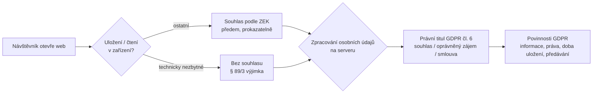

# A2: Cookies a zákon v ČR: § 89 ZEK, GDPR a doporučení ÚOOÚ v praxi – brief
> Cluster: A. Consent & legislativa (pilíř / hub) · URL: /blog/cookies-zakon-gdpr-uoou · Formát: pilíř – právně-technický výklad s infografikou · Priorita: měsíc 1 · Cílová LP: /sluzby/cookie-lista-consent-mode · Rozsah finálního textu: 3 500–4 200 slov + infografika + 4 tabulky

---

## 1. Meta

| Prvek | Návrh |
|---|---|
| H1 | Cookies a zákon v ČR: § 89 ZEK, GDPR a ÚOOÚ v praxi |
| SEO title (60 zn.) | Zákon o cookies: ZEK, GDPR a doporučení ÚOOÚ \| datalayer.cz |
| Meta description (148 zn.) | Kdy potřebujete souhlas s cookies, co je technicky nezbytné, jak dlouho souhlas platí a co kontroluje ÚOOÚ. § 89 ZEK a GDPR prakticky pro weby v ČR. |
| URL | /blog/cookies-zakon-gdpr-uoou |
| Datum | publikace + „Stav právní úpravy k {datum}“ (revize každých 6 měsíců + mimořádně při posunu Digital Omnibus) |

**Klíčová slova (Ahrefs CZ):**
- Hlavní: `zákon o cookies` (60)
- Vedlejší: `cookies zákon` (50), `gdpr cookies` (10), `cookies gdpr` (10), `eprivacy cookies` (10), `souhlas s cookies` (10), `gdpr cookies lišta` (10), `analytické cookies` (20), `marketingové cookies` (20)
- Long-tail (0, ale přesná intence): `cookie lišta gdpr`, `zákon o elektronických komunikacích cookies`, `cookies zákon o elektronických komunikacích`, `cookie lišta uoou`, `uoou cookie lišta`, `cookies souhlas gdpr`, `souhlas s cookies text`, `souhlas s cookies vzor`, `cookie lišta 2024/2022` (zastaralé dotazy – zachytit v textu „pravidla od 1. 1. 2022 platí i v roce 2026“)
- Otázky (PAA z `google_paa.tsv`): „Musím informovat o cookies?“, „Jsou cookies považovány za osobní údaje?“, „Jsou cookies povinné?“, „Co je zákon 127/2005 Sb.?“, „Co se stane, když odmítnu cookies?“ (→ A6), „Co musí obsahovat cookies (lišta)?“
- Související dotazy Google: „Zásady cookies vzor“, „Zákon o elektronických komunikacích“, „Úooú cookies“, „GDPR se nevztahuje na“

**Záměr:** informační s právní nejistotou („musím?“, „co hrozí?“). Část čtenářů hledá vzor textu lišty.

**Cílový čtenář:** majitel e-shopu / marketingový manažer / provozovatel firemního webu, který chce vědět, co je povinné a co riskuje; ve velkých firmách compliance / DPO, který potřebuje technický překlad zákona. Úroveň: laik v právu, mírně pokročilý v marketingu. Segmenty: všechny tři (u velké firmy důraz na dokumentaci a důkaz souhlasu).

---

## 2. Analýza SERP a konkurence

**Google.cz 8. 10. 2026:**

| Dotaz | Top výsledky | Pozorování |
|---|---|---|
| cookie lišta gdpr zákon | 1 uoou.gov.cz (Q&A Cookies) · 2 gdpr.cz („v roce 2025“) · 3 cookies-spravne.cz/je-cookie-lista-povinna · 4 tomasslezak.cz · 5 peytonlegal.cz · 6 consentio.cz · 7 cernovsky.cz · 8 cookieslista.cz · 9 webhunter.cz | AI přehled ano. Úřad je 1., zbytek kombinace advokátů a CMP. |
| zákon o elektronických komunikacích cookies souhlas | 1 uoou.gov.cz · 2 zakonyprolidi.cz (článek) · 3 peytonlegal.cz · 4 pravniprostor.cz · 5 portal.pohoda.cz · 6 uoou.gov.cz (novinka 2021) · 7 danovky.cz · 8 prkpartners.com · 9 akcisek.cz | Právní texty bez technického překladu (co je to „přístup k zařízení“ u GA4, pixelu, fingerprintingu). |
| cookie lišta | 1 cookieslista.cz · 2 cookie-lista.cz · 3 uoou.gov.cz · 4 cookies-spravne.cz · 5 remedio.cz · 6 getfound.cz · 7 designsystem.gov.cz … | Komerční + úřad (A4 cílí sem). |

**Nejlepší konkurent:** cookies-spravne.cz/je-cookie-lista-povinna – odpověď v perexu, tabulka typů cookies, 6 požadavků ÚOOÚ, 8 chyb z monitoringu 2022, reálné pokuty 2023, datace „stav k 21. 9. 2026“. Slabiny: krátké (≈940 slov), bez EDPB, bez Digital Omnibus, bez technického vysvětlení „podobných technologií“ (pixely, localStorage, fingerprinting, server-side), bez rozlišení dvou souhlasů (ZEK × GDPR), bez infografiky.

**Ostatní:** consentio.cz uvádí nepodložená čísla o pokutách a kontrolách (bez zdroje) a zjednodušuje, že souhlas s cookies plyne z GDPR; advokátní weby jsou přesné, ale netechnické.

**Čím přeskočíme:**
1. Citace § 89 odst. 3 ZEK doslovně + výklad pojmů pro techniky („ukládání“ vs. „získávání přístupu“ → cookies, localStorage, pixely, SDK, fingerprinting).
2. Jasné rozlišení: **souhlas podle ZEK** (uložení/čtení v zařízení) vs. **právní titul podle GDPR** (následné zpracování) – přímo z Q&A ÚOOÚ.
3. Infografika „Co smí běžet před souhlasem“ (sdílitelná, odkazovatelná).
4. EDPB: pokyny 05/2020, zpráva Cookie Banner Taskforce (2023), pokyny 2/2023 (2024).
5. Co se chystá v EU (Digital Omnibus, čl. 88a/88b) – s jasným „zatím nic neplatí“.
6. Pouze ověřená čísla o pokutách (ÚOOÚ 2023) + co úřad kontroloval.
7. České specifické chyby z praxe implementace (GA4 v šabloně, Sklik/Heureka/chat skripty, CMP v angličtině…).

---

## 3. Otázky, na které musí článek odpovědět

1. Který zákon upravuje cookies v ČR a co přesně říká?
2. Co se změnilo 1. 1. 2022 (novela 374/2021 Sb.)?
3. Jaký je vztah ZEK, ePrivacy směrnice a GDPR? Potřebuji dva souhlasy?
4. Jsou cookies osobní údaje?
5. Co je „technicky nezbytné“ a co už ne (GA4, chat, YouTube, reCAPTCHA, A/B testy)?
6. Týká se pravidlo jen cookies, nebo i localStorage, pixelů, fingerprintingu a server-side měření?
7. Jaké náležitosti musí mít platný souhlas a jak musí vypadat lišta?
8. Musím mít lištu, když mám jen Google Analytics? A když mám jen technické cookies?
9. Jak dlouho souhlas platí a kdy se smím zeptat znovu po odmítnutí?
10. Jak souhlas prokázat?
11. Co kontroluje ÚOOÚ, jaké pokuty uložil a co hrozí?
12. Co říká EDPB (Evropský sbor pro ochranu osobních údajů)?
13. Chystá EU změnu pravidel (Digital Omnibus)?
14. Jaké chyby dělají české weby nejčastěji?

---

## 4. Rychlá odpověď (hotový text, 58 slov)

> Podle § 89 odst. 3 zákona č. 127/2005 Sb. musíte od 1. 1. 2022 získat předchozí prokazatelný souhlas, než do zařízení návštěvníka uložíte nebo z něj přečtete údaje, které nejsou technicky nezbytné – typicky analytické a marketingové cookies. Následné zpracování osobních údajů se řídí GDPR. Dozor vykonává ÚOOÚ. Odmítnutí musí být stejně snadné jako souhlas.

---

## 5. Osnova s obsahem odpovědí

### H2 1: Co říká zákon: § 89 odst. 3 ZEK doslova a v lidské řeči
**Klíčové sdělení:** Zákon neříká „cookies“, ale „ukládání údajů a přístup k údajům v koncovém zařízení“. Proto se týká i dalších technologií.

**Obsah:**
- **Citace (zakonyprolidi.cz, aktuální znění k 1. 1. 2026, ověřeno 10/2026):** „Každý, kdo hodlá používat nebo používá sítě elektronických komunikací k ukládání údajů nebo k získávání přístupu k údajům uloženým v koncových zařízeních účastníků nebo uživatelů, získá od těchto účastníků nebo uživatelů předem prokazatelný souhlas s rozsahem a účelem jejich zpracování. Tato povinnost neplatí pro technické ukládání nebo přístup výhradně pro potřeby přenosu zprávy prostřednictvím sítě elektronických komunikací nebo je-li to nezbytné pro potřeby poskytování služby informační společnosti, která je výslovně vyžádána účastníkem nebo uživatelem.“
- **Překlad do praxe (hotový text):** povinnost má „každý“ – nezáleží na velikosti webu ani na tom, zda jde o e-shop, blog nebo aplikaci. Klíčová slova: *předem* (před uložením), *prokazatelný* (umíte doložit), *rozsah a účel* (návštěvník ví, k čemu souhlasí). Výjimky jsou dvě: přenos zprávy a služba výslovně vyžádaná uživatelem.
- **Novela č. 374/2021 Sb.** s účinností od **1. 1. 2022** změnila dřívější model „informovat a umožnit odmítnutí“ (opt-out) na **opt-in**. ÚOOÚ k tomu: „od ledna je výslovně požadován souhlas uživatele“, informace „můžete odmítnout v nastavení prohlížeče“ přestala stačit (uoou.gov.cz, 25. 11. 2021).
- § 87 ZEK: souhlas lze udělit i elektronicky (vyplněním formuláře na internetu).
- **Evropský základ:** čl. 5 odst. 3 směrnice 2002/58/ES (ePrivacy) ve znění směrnice 2009/136/ES. Návrh nařízení ePrivacy, který ji měl nahradit, Evropská komise v únoru 2025 v pracovním programu stáhla (uvést jako kontext, ověřit formulaci).

### H2 2: ZEK, ePrivacy a GDPR: dva různé „souhlasy“
**Klíčové sdělení:** ZEK řeší uložení a čtení v zařízení. GDPR řeší, co pak s osobními údaji děláte. V praxi se obojí sbírá jednou lištou.

**Obsah (vychází z Q&A ÚOOÚ, uoou.gov.cz/verejnost/qa-otazky-a-odpovedi/cookies):**
- ÚOOÚ: souhlas podle ZEK „umožňuje využití netechnických cookies, neřeší však zpracování osobních údajů“; pro zpracování je třeba právní titul podle GDPR (čl. 6). Titulem nemusí být souhlas – ÚOOÚ jako příklad oprávněného zájmu uvádí „analytiku první strany“. **Ale:** bez souhlasu podle ZEK se netechnické cookies vůbec nesmí použít, takže k následnému zpracování nedojde.
- Souhlasy lze získávat **zároveň** (jedna lišta), pokud splní požadavky GDPR.
- **Jsou cookies osobní údaje?** ÚOOÚ: používání cookies, kterými provozovatel sleduje chování návštěvníka, „zpravidla představuje zpracování osobních údajů“. GDPR recitál 30 zmiňuje online identifikátory (IP adresy, identifikátory cookies). Pro ZEK to ale nerozhoduje – § 89 odst. 3 platí pro jakékoli údaje v zařízení, osobní i neosobní.
- **Kdo je správce:** provozovatel webu. Dodavatel lišty nebo analytiky je obvykle zpracovatel; u některých nástrojů (sociální pluginy, pixely) může vzniknout společná správa – SDEU Fashion ID (C-40/17, 2019) (ověřit citaci před publikací).
- **Mini-tabulka T1** (kap. 6): ZEK × GDPR × kdo dozoruje × co řeší.

### H2 3: Co je „technicky nezbytné“ a co už ne
**Klíčové sdělení:** Nezbytné je to, bez čeho nefunguje služba, kterou si návštěvník vyžádal. Analytika a reklama mezi to nepatří, ani když jde o „vaše“ first-party cookies.

**Obsah:**
- ÚOOÚ: „Technické cookies mohou být bez souhlasu zpracovávány pouze pro účely nezbytné pro vlastní provoz stránek.“
- EDPB Cookie Banner Taskforce (17. 1. 2023, typ I): některé weby označují jako „nezbytné“ cookies, které nezbytné nejsou; posouzení musí být individuální a provozovatel musí „nezbytnost“ umět doložit.
- Pomocná kritéria (Pracovní skupina WP29, stanovisko 04/2012, WP194 – ověřit odkaz): vstupní data uživatele (košík), autentizace (přihlášení), bezpečnost iniciovaná uživatelem, přehrávač multimédií po dobu relace, rozložení zátěže, nastavení rozhraní (jazyk); analytika první strany výjimku **nemá**.
- **Tabulka T2 (kompletní, kap. 6)** – 18 typických technologií s verdiktem „bez souhlasu / se souhlasem / posoudit“.
- **Česká specifika:** ÚOOÚ (na rozdíl např. od francouzského CNIL) nemá zveřejněnou výjimku pro „měření návštěvnosti“ → u českého webu počítejte s tím, že i analytika potřebuje souhlas. *(Zmínku o CNIL formulovat obecně, nebo vypustit, pokud ji recenzent neschválí.)*

### H2 4: Nejen cookies: localStorage, pixely, SDK, fingerprinting a server-side
**Klíčové sdělení:** Pravidlo je technologicky neutrální. Změna technologie povinnost souhlasu neodstraní.

**Obsah:**
- ÚOOÚ (Q&A): podmínky „platí i pro další formy ukládání dat v technických zařízeních návštěvníků stránek (technologie podobné cookies jako objekty v místním úložišti, místně sdílené objekty aj.), včetně digitálních otisků prohlížečů (tzv. fingerprinting)“.
- EDPB Pokyny 2/2023 k technickému rozsahu čl. 5 odst. 3 ePrivacy (verze 2.0, přijato **7. 10. 2024**): případy užití **URL a pixel tracking, lokální zpracování, sledování pouze podle IP adresy, IoT reporting, unikátní identifikátory**. Pixel nebo dynamicky skládaný požadavek z JavaScriptu = „získání přístupu“; u IP adresy se čl. 5 odst. 3 uplatní, pokud IP pochází z koncového zařízení (statická IPv4 routeru, IPv6), ledaže to provozovatel vyloučí. EDPB zároveň připomíná, že použitelnost článku automaticky neznamená povinnost souhlasu – posuzují se výjimky.
- WP29 stanovisko 9/2014: fingerprinting spadá pod čl. 5 odst. 3.
- **Praktické důsledky (hotový text):** pixel v e-mailu, Meta Pixel, TikTok pixel, localStorage s ID, „cookieless“ analytika, která čte vlastnosti prohlížeče, i server-side měření, kterému data posílá JavaScript z prohlížeče – vše podléhá stejnému posouzení. Server-side = jiná cesta dat, ne jiná právní situace (odkaz A5).

### H2 5: Jak musí vypadat platný souhlas a cookie lišta
**Klíčové sdělení:** Souhlas je svobodný, konkrétní, informovaný a jednoznačný. Odmítnout musí jít stejně snadno jako přijmout.

**Obsah – náležitosti (GDPR čl. 4 bod 11, čl. 7, recitál 32; ÚOOÚ Q&A; EDPB 05/2020):**
1. **Svobodný:** bez nátlaku; tlačítka „Přijmout vše“ a „Odmítnout vše“ ve **stejné vrstvě**; jako dobrou praxi ÚOOÚ uvádí odmítnutí už **v první vrstvě**, „na roveň udělení souhlasu a ve srovnatelném vizuálním provedení“. „Souhlasím“ nemá být „výrazně větší či výrazně barevnější“.
2. **Bez cookie wall:** přístup k webu nesmí být podmíněn souhlasem (ÚOOÚ odkazuje na bod 39 pokynů EDPB 05/2020); lišta nesmí bránit interakci s webem; pokud je uprostřed obrazovky, musí jít zavřít bez volby (zavření = nesouhlas).
3. **Aktivní projev:** zavření lišty, scrollování, „setrváním souhlasíte“ ani nastavení prohlížeče **nejsou** souhlas.
4. **Žádná předzaškrtnutá políčka** (recitál 32; SDEU Planet49, C-673/17).
5. **Konkrétní a informovaný:** účely, správce, příjemci, doba uložení, předávání do třetích zemí; strukturovaně (vrstvy), **česky** u webu pro české návštěvníky; výpis jednotlivých cookies ÚOOÚ „určitě doporučuje“ (v liště po rozkliknutí nebo odkazem).
6. **Odvolání stejně snadné** jako udělení (odkaz/tlačítko v patičce; ne „jen telefonicky“).
7. **Prokazatelnost:** správce musí umět doložit, že a k čemu souhlas dostal (čl. 7 odst. 1 GDPR) → záznam souhlasu (co ukládat: viz A4).
8. **Informační povinnost i bez lišty:** pokud máte jen technické cookies, lištu nepotřebujete, ale informace o zpracování musí být na webu dostupné (ÚOOÚ).
- **Vzorový text první vrstvy lišty** (hotový, neutrální, k úpravě): „Používáme cookies a podobné technologie. Nezbytné zajišťují chod webu. Analytické nám pomáhají měřit návštěvnost, marketingové měří reklamu a umožňují ji přizpůsobit. Ty potřebují váš souhlas – můžete ho dát, odmítnout nebo upravit, a kdykoli změnit v patičce webu. [Odmítnout vše] [Nastavení] [Přijmout vše] · Zásady cookies“. *(Text jen jako ukázka – finální znění schvaluje právník klienta webu.)*

### H2 6: Jak dlouho souhlas platí a kdy se zeptat znovu
**Obsah (ÚOOÚ Q&A, ověřeno 10/2026):**
- Dobu stanoví správce s ohledem na účel a očekávání návštěvníků. ÚOOÚ: „Obecně lze za přiměřenou dobu… považovat 12 měsíců.“ Po odmítnutí by souhlas neměl být znovu vyžadován „alespoň 6 měsíců od posledního zobrazení cookie lišty“.
- Kratší lhůta je možná, pokud se **významně změnily okolnosti zpracování** (nové nastavení lišty/účelů, výrazné omezení počtu správců, změna zpracovatele a ukončení předávání mimo EU) nebo provozovatel **předchozí volbu nezná** (smazané cookies). Změna jednotlivých cookies významnou změnou není.
- Při významné změně je nutné požádat znovu i ty, kdo dříve souhlasili.
- **Technická poznámka:** Safari maže/zkracuje cookies zapsané JavaScriptem (7 dní) → volba lišty se u části návštěvníků „ztrácí“ a lišta se ukazuje znovu dřív, než by měla. Řešení: ukládat volbu cookie z HTTP hlavičky serveru (A4, A7).
- **Doba platnosti samotných cookies:** ÚOOÚ – nesmí být delší, než je nezbytné pro účel (zásada omezení uložení); „neúměrně dlouhá doba platnosti“ je mezi zjištěnými nedostatky.

### H2 7: Kontroly a pokuty ÚOOÚ: co úřad zjistil a co hrozí
**Klíčové sdělení:** ÚOOÚ nejdřív vyzývá k nápravě, pokutuje toho, kdo nenapraví. Uložené pokuty jsou v řádu statisíců korun.

**Obsah – pouze ověřená fakta:**
- **Monitoring 1. pololetí 2022** (uoou.gov.cz, 30. 6. 2022) – zjištěné nedostatky (9 bodů): netechnické cookies bez souhlasu; neúměrně dlouhá platnost; chybí volba nesouhlasu v první vrstvě; špatná kategorizace; chybí informace o konkrétních cookies; rozdíl ve viditelnosti tlačítek; nesprávná klasifikace; informace v cizím jazyce; lišta znesnadňuje čtení. Předseda úřadu: nejdřív výzva k nápravě, pak sankce „především finančního charakteru“.
- **Pokuty 2023** (uoou.gov.cz, 2. 8. 2023): od začátku roku 2023 pokuty za porušení GDPR v souvislosti s cookies v celkové výši **4 443 000 Kč**, z toho pravomocné **1 640 000 Kč**; nejvyšší pravomocná **898 000 Kč** (společnost z oboru elektronických komunikací, hlavně marketingové cookies bez souhlasu). Nejčastější porušení: cookies bez souhlasu; nedostatky souhlasu (informování); nedostatečná informační povinnost (klasifikace, jen angličtina); nemožnost nebo komplikované odvolání; souhlas a nesouhlas v různých vrstvách (klamavý designový vzor); lišta na volbu nereaguje.
- **Právní základ sankcí:** úřad postihuje jako porušení GDPR (zpracování bez právního titulu, porušení podmínek souhlasu). Horní hranice podle čl. 83 odst. 5 GDPR: 20 mil. EUR nebo 4 % celosvětového ročního obratu. ZEK sám za porušení § 89 odst. 3 samostatný přestupek nestanoví (v přestupkových ustanoveních ZEK je odkaz na § 89 odst. 1 a 4) → **ověřit s právníkem**, formulovat opatrně.
- **Novější souhrnná čísla** za cookies (2024–2026) úřad v tiskové zprávě nezveřejnil – v článku neuvádět žádné jiné částky; `[OVĚŘIT před publikací: výroční zprávy ÚOOÚ 2024 a 2025]`.
- **„Souhlas, nebo zaplať“:** ÚOOÚ vede řízení s vydavateli; Seznamu podle Lupa.cz (18. 11. 2024) předběžně zakázal sběr souhlasů modelem, kde je placení jedinou alternativou – jen krátká zmínka pro mediální weby, stav ověřit.
- **Další rizika mimo pokuty:** stížnosti návštěvníků, požadavky na výmaz, reputační riziko, odpovědnost vůči reklamním platformám (Google EU UCP – viz A1).

### H2 8: Co říká EDPB (evropský výklad, který ÚOOÚ následuje)
- **Pokyny 05/2020 k souhlasu** – definice svobodného souhlasu, cookie walls (bod 39), scrollování není souhlas.
- **Zpráva Cookie Banner Taskforce (17. 1. 2023)** – společné postoje dozorových úřadů k praktikám: A) chybí tlačítko odmítnout v 1. vrstvě; B) předzaškrtnutá políčka; C) klamavé odkazy místo tlačítek; D/E) klamavé barvy a kontrast tlačítek; H) „oprávněný zájem“ u účelů vyžadujících souhlas; I) nesprávně označené „nezbytné“ cookies; K) chybí ikona/odkaz pro odvolání.
- **Pokyny 2/2023 k technickému rozsahu čl. 5 odst. 3** (v2.0, 7. 10. 2024) – viz H2 4.
- (Volitelně) Stanovisko 08/2024 k modelům „consent or pay“ u velkých platforem – jen zmínka, ověřit.

### H2 9: Co se chystá: Digital Omnibus a „cookies v GDPR“
**Klíčové sdělení:** Jde o návrh. Do jeho přijetí a účinnosti platí § 89 odst. 3 ZEK beze změny.

**Obsah (stav k 10/2026 – před publikací znovu ověřit):**
- Evropská komise 19. 11. 2025 navrhla nařízení **Digital Omnibus** (COM(2025) 837), které má mimo jiné přesunout pravidla pro ukládání a přístup k údajům v zařízení u osobních údajů do GDPR (nový **čl. 88a**) a zavést strojově čitelné signály souhlasu/odmítnutí z prohlížeče (**čl. 88b**).
- Návrh čl. 88a (podle odborných shrnutí, např. Taylor Wessing): výjimky ze souhlasu pro přenos komunikace, výslovně vyžádanou službu, **agregované měření návštěvnosti prováděné provozovatelem výhradně pro vlastní službu** a bezpečnost; odmítnutí stejně snadné jako souhlas; po odmítnutí neptat se znovu na stejný účel alespoň **6 měsíců**.
- **Stav:** Rada EU v kompromisním textu z června 2026 podle zpráv odborného tisku čl. 88b vypustila, čl. 88a ponechala; Evropský parlament (výbory LIBE/ITRE) publikoval návrh zprávy v červnu 2026; trialogy k září 2026 nezačaly. Odborné odhady: přijetí nejdříve koncem 2026, čl. 88a by se uplatnil až s odstupem (návrh: 6 měsíců po účinnosti).
- **Co z toho plyne pro web v roce 2026:** nic neměnit kvůli návrhu; sledovat; lišta, která už dnes splňuje ÚOOÚ, bude pravděpodobně kompatibilní.

### H2 10: Nejčastější chyby českých webů (z praxe implementace)
**Obsah – tabulka T4 (kap. 6).** Úvod: „Většina chyb není právní, ale technická – lišta je nastavená správně, ale skripty běží jinudy.“

### H2 11: Checklist souladu (12 bodů, hotový text)
1. Inventura všech cookies, localStorage a skriptů třetích stran (sken + ruční kontrola GTM, šablony, pluginů). 2. Kategorizace s odůvodněním „nezbytnosti“. 3. Před souhlasem běží jen nezbytné (ověřeno v DevTools). 4. Přijmout/Odmítnout ve stejné vrstvě a srovnatelném provedení. 5. Žádné předzaškrtnuté kategorie. 6. Česky, s účely, správci, příjemci, dobou uložení. 7. Výpis cookies. 8. Odvolání v patičce. 9. Záznam souhlasu (ID, čas, verze lišty, volby). 10. Platnost 12 měsíců, po odmítnutí 6 měsíců. 11. Consent Mode/ostatní tagy reagují na volbu (A1). 12. Revize při každé změně nástrojů a min. 2× ročně.

### Disclaimer (povinný, na konci článku i pod H1 v boxu)
„Tento článek je technicko-právní přehled pro provozovatele webů. Není právní radou a nenahrazuje posouzení konkrétní situace advokátem. Stav právní úpravy a výkladu k {datum revize}.“

---

## 6. Vizuály

### Infografika: „Co smí běžet před souhlasem“ (hlavní vizuál, za H2 3)
**Formát:** 1080×1350 (LinkedIn/Instagram) + responzivní verze v článku (3 sloupce na desktopu, na mobilu 3 sbalitelné karty pod sebou). Pozadí `#020d1e`, karty `#0b1a30`, nadpisy Inter 800, technické názvy Roboto Mono. Barvy semaforu tlumené a v souladu s brandem: zelený akcent nahradit cyan `#00ffff` (smí), oranžová `#ff7400` jen pro „posoudit“, šedá/červená linka pro „jen se souhlasem“ – barva nesmí být jediný nositel významu (ikony ✓ / ! / zámek).

**Obsah (kompletní):**
- **Hlavička:** „Co smí běžet před souhlasem? · § 89 odst. 3 ZEK · stav 10/2026“
- **Sloupec 1 – Bez souhlasu (technicky nezbytné):** relace a přihlášení · košík · ochrana formulářů (CSRF) · uložení volby z cookie lišty · rozložení zátěže · jazyk, který si návštěvník zvolil · bezpečnost a ochrana proti podvodům (jen pokud je skutečně nezbytná).
- **Sloupec 2 – Jen se souhlasem:** Google Analytics 4 · Google Ads (konverze, remarketing) · Sklik / Seznam · Meta Pixel · TikTok, LinkedIn pixely · heatmapy a nahrávání (Hotjar, Clarity) · A/B testy · personalizace a doporučení · chat widgety třetích stran načítané předem · vložená videa a mapy (YouTube, Google Maps) · pixely v e-mailech.
- **Sloupec 3 – Posoudit s právníkem:** advanced Consent Mode (pingy bez cookies) · reCAPTCHA a další ochrany třetích stran · „cookieless“ analytika · server-side měření (jde-li o data z prohlížeče, pravidla platí stejně).
- **Pata:** „Fingerprinting = jen se souhlasem (ÚOOÚ). Odmítnout stejně snadno jako přijmout. Souhlas 12 měsíců, po odmítnutí 6 měsíců.“ + logo datalayer.cz + URL článku. Disclaimer drobně.

### Diagram 1: Dva souhlasy – ZEK a GDPR (H2 2)

**Finální SVG:** dvě „brány“ za sebou (brána 1 = zařízení / ZEK, brána 2 = server / GDPR), mezi nimi tok dat jako přerušovaná cyan čára; u brány 1 piktogram Consent (přepínač), u brány 2 piktogram zámku. Popisky monospace. Mobil: svisle.

### Tabulka T1: ZEK vs. GDPR
| | ZEK § 89 odst. 3 (ePrivacy čl. 5/3) | GDPR |
|---|---|---|
| Co řeší | uložení údajů do zařízení a přístup k nim | zpracování osobních údajů |
| Týká se | jakýchkoli údajů (i neosobních) | jen osobních údajů |
| Právní základ | souhlas, nebo výjimka (přenos zprávy / vyžádaná služba) | čl. 6: souhlas, oprávněný zájem, smlouva… |
| Kdy | před uložením/čtením | po celou dobu zpracování |
| Dozor v praxi | ÚOOÚ | ÚOOÚ |
| Sankce | v praxi přes GDPR (viz H2 7) | čl. 83 GDPR, zák. 110/2019 Sb. |

### Tabulka T2: Typické technologie a souhlas (kompletní)
| Technologie / nástroj | Bez souhlasu? | Poznámka |
|---|---|---|
| Relační cookie přihlášení / košíku | ano | služba vyžádaná uživatelem |
| Cookie s volbou lišty | ano | nutné k respektování volby |
| CSRF token, ochrana formuláře | ano | bezpečnost vyžádané služby |
| Load balancer (relační) | ano | přenos/provoz |
| Jazyk zvolený uživatelem | ano | jen pokud si ho uživatel aktivně vybral |
| GA4 (first-party cookies) | ne | analytika není nezbytná (ÚOOÚ) |
| Matomo / „cookieless“ analytika | posoudit | i bez cookies může jít o přístup k zařízení (EDPB 2/2023) |
| Advanced Consent Mode (ping bez cookies) | posoudit | viz A1 |
| Google Ads, Sklik, Meta, TikTok, LinkedIn | ne | marketing |
| Remarketing / retargeting | ne | marketing + personalizace |
| Hotjar, Microsoft Clarity | ne | analytika chování |
| A/B testování (Optimizely, VWO…) | ne | není nezbytné pro službu |
| Chat widget (Smartsupp, Tidio…) | posoudit | před otevřením chatu obvykle ne; po kliknutí na „chat“ lze argumentovat vyžádanou službou |
| YouTube / Vimeo / Google Maps embed | ne | načítat až po souhlasu nebo „kliknutím načíst“ |
| reCAPTCHA | posoudit | bezpečnost vs. předávání dat Googlu – rozhodnout s právníkem |
| Bot management CDN (např. Cloudflare) | spíše ano | bezpečnost; zdokumentovat |
| Pixel v e-mailu (otevření) | ne | EDPB 2/2023 – pixel tracking |
| Fingerprinting | ne | ÚOOÚ výslovně |

### Tabulka T3: Náležitosti souhlasu → jak to vypadá v liště
| Náležitost | Zdroj | V liště |
|---|---|---|
| Svobodný | GDPR čl. 4/11, 7; ÚOOÚ | Odmítnout vše ve stejné vrstvě, srovnatelné tlačítko; žádná cookie wall |
| Konkrétní | GDPR čl. 4/11 | souhlas po účelech (kategoriích) |
| Informovaný | GDPR čl. 13; ÚOOÚ | účely, správci, příjemci, doba, třetí země; česky; výpis cookies |
| Jednoznačný | GDPR recitál 32; Planet49 | aktivní klik; žádné předzaškrtnutí; zavření ≠ souhlas |
| Odvolatelný | GDPR čl. 7/3 | odkaz v patičce, stejně snadné |
| Prokazatelný | ZEK § 89/3; GDPR čl. 7/1 | záznam: ID, čas, verze, volby |

### Tabulka T4: Nejčastější chyby českých webů
| Chyba | Kde vzniká | Oprava |
|---|---|---|
| GA4 / Meta Pixel vložený napevno v šabloně nebo pluginu | WordPress šablony, staré integrace e-shopu | odstranit, řídit jen přes GTM a lištu |
| Retargeting/konverzní kód Skliku bez parametru `consent` | starší kódy | SEM nebo parametr consent (A1, B6) |
| Widgety (chat, recenze, srovnávače) nastavují cookies před souhlasem | vložené skripty | blokovat do souhlasu / načíst po kliknutí |
| Odmítnutí jen v „Nastavení“ | šablona CMP | Odmítnout vše do 1. vrstvy |
| Výrazné „Přijmout“, nenápadné „Odmítnout“ | design | srovnatelná velikost a kontrast |
| Lišta v angličtině | výchozí jazyk CMP | čeština jako výchozí |
| GA/Ads cookies v kategorii „nezbytné“ | automatický sken | ruční kontrola kategorií |
| Souhlas uložen na „navždy“ / lišta po odmítnutí při každé návštěvě | konfigurace | 12 / 6 měsíců |
| Volba se neprojeví (tagy běží dál) | GTM bez napojení na souhlas | Consent Mode + kontroly souhlasu (A1) |
| Chybí odkaz na změnu souhlasu | patička | „Nastavení cookies“ v patičce |
| „Oprávněný zájem“ zapnutý u reklamních účelů | TCF lišty | jen souhlas |
| Žádný záznam souhlasů | vlastní lišta | serverový log (A4) |

---

## 7. Fakta a zdroje

| Tvrzení | Zdroj | Ověřeno | Riziko zastarání |
|---|---|---|---|
| Doslovné znění § 89 odst. 3 ZEK (aktuální znění k 1. 1. 2026) | https://www.zakonyprolidi.cz/cs/2005-127 | 10/2026 | nízké (sledovat Omnibus) |
| Novela 374/2021 Sb., opt-in od 1. 1. 2022; prohlížeč nestačí | https://uoou.gov.cz/novinky/vse/cookies-od-zacatku-roku-2022-pouze-se-souhlasem | 10/2026 | nízké |
| Q&A ÚOOÚ: technické vs. netechnické, dva souhlasy, oprávněný zájem u analytiky první strany, tlačítka, cookie wall, zavření lišty, prohlížeč, 12/6 měsíců, fingerprinting | https://uoou.gov.cz/verejnost/qa-otazky-a-odpovedi/cookies | 10/2026 | střední |
| Monitoring 1. pol. 2022 – 9 nedostatků | https://uoou.gov.cz/cookies-listy-vykazuji-radu-nedostatku | 10/2026 | nízké |
| Pokuty 2023: 4 443 000 Kč / 1 640 000 Kč pravomocně / nejvyšší 898 000 Kč | https://uoou.gov.cz/udeleny-pokuty-ve-vysi-temer-45-mil-kc | 10/2026 | nízké (historické) |
| Novější souhrnná čísla pokut za cookies | nenalezeno | – | **ověřit ve výročních zprávách** |
| ePrivacy směrnice čl. 5 odst. 3 | https://eur-lex.europa.eu/legal-content/CS/ALL/?uri=CELEX:32002L0058 | 10/2026 | nízké |
| GDPR čl. 4/11, 6, 7, 13, 83, recitály 30, 32 | https://eur-lex.europa.eu/eli/reg/2016/679/oj | 10/2026 | nízké |
| SDEU Planet49 (C-673/17) – předzaškrtnutí není souhlas | https://curia.europa.eu/juris/liste.jsf?num=C-673/17 (citováno i v Q&A ÚOOÚ) | 10/2026 | nízké |
| SDEU Fashion ID (C-40/17) – společná správa | https://curia.europa.eu/juris/liste.jsf?num=C-40/17 | **ověřit** | nízké |
| EDPB Cookie Banner Taskforce report (17. 1. 2023), typy A, B, C, D/E, H, I, K | https://www.edpb.europa.eu/system/files/2023-01/edpb_20230118_report_cookie_banner_taskforce_en.pdf | 10/2026 | nízké |
| EDPB Pokyny 2/2023 v2.0 (7. 10. 2024): pixel, URL, IP, lokální zpracování, unikátní ID | https://edpb.europa.eu/system/files/2024-10/edpb_guidelines_202302_technical_scope_art_53_eprivacydirective_v2_en_0.pdf | 10/2026 | nízké |
| EDPB Pokyny 05/2020 k souhlasu (bod 39 cookie walls) | https://www.edpb.europa.eu/our-work-tools/our-documents/guidelines/guidelines-052020-consent-under-regulation-2016679_en | 10/2026 (citováno ÚOOÚ) | nízké |
| WP29 stanovisko 04/2012 (WP194) – výjimky ze souhlasu | https://ec.europa.eu/justice/article-29/documentation/opinion-recommendation/files/2012/wp194_en.pdf | **ověřit odkaz** | nízké |
| Digital Omnibus návrh 19. 11. 2025, čl. 88a/88b | https://www.europarl.europa.eu/legislative-train/theme-a-new-plan-for-europe-s-sustainable-prosperity-and-competitiveness/file-digital-package ; shrnutí https://www.taylorwessing.com/de/global-data-hub/2026/the-digital-omnibus-proposal/gdh---the-digital-omnibus---cookies | 10/2026 | **vysoké** |
| Rada vypustila čl. 88b (červen 2026), trialogy nezačaly (9/2026) | https://ppc.land/eu-council-drops-cookie-signal-after-google-lobbying-eur-40-50-bn-at-stake/ ; https://acompli.ie/news/digital-omnibus-gdpr-cookies-status-september-2026/ (sekundární) | 10/2026 | **vysoké – ověřit u Rady/EP** |
| Stažení návrhu nařízení ePrivacy (pracovní program Komise 2025) | sekundární zdroje (Hunton, 02/2025) | **ověřit na ec.europa.eu** | nízké |
| ÚOOÚ × Seznam „pay or ok“ předběžné opatření | https://www.lupa.cz/clanky/uoou-setri-ceske-vydavatele-kvuli-pay-or-ok-seznamu-sbirani-souhlasu-predbezne-zakazal/ (18. 11. 2024) | 10/2026 | **vysoké – stav řízení ověřit** |

---

## 8. Interní odkazy a CTA

**Cílová LP:** /sluzby/cookie-lista-consent-mode

**CTA box (za H2 5 – čtenář právě zjistil, co musí lišta splnit):**
- Nadpis: **Lišta podle ÚOOÚ, která opravdu řídí vaše tagy**
- Text: Zkontrolujeme, co na webu běží před souhlasem, nastavíme lištu a Consent Mode a předáme protokol, kterým soulad doložíte. Právní posouzení dodá váš advokát – my technickou část.
- Tlačítko: `[ Nechat zkontrolovat web ]` → /sluzby/cookie-lista-consent-mode (`cta_id: blog_a2_box`)

**Související články:** A1 Consent Mode v2 (H2 4, H2 10); A3 Osobní údaje v analytice (H2 2); A4 Jak vybrat cookie lištu (H2 5, záznam souhlasu); A5 Server-side a souhlas (H2 4); A6 Co se stane po odmítnutí (PAA otázka v úvodu); A7 Cookies třetích stran (H2 6 – Safari).

**Slovník:** /slovnik/cmp, /slovnik/first-party-cookie, /slovnik/third-party-cookie, /slovnik/consent-mode, /slovnik/cookieless-ping.

**Další LP:** /sluzby/audit-mereni (inventura skriptů), /sluzby/technicky-audit-webu.

**Zkrácený kontaktní blok:** `form_id: blog`, předvybrané téma **Cookie lišta & consent**, H2 „Řešíte totéž u sebe?“, placeholder „Napište, na čem jste se zasekli… (např. nevíme, co na webu běží před souhlasem)“.

---

## 9. FAQ pro schema (FAQPage)

**Je cookie lišta povinná?**
Je povinná, pokud web používá cookies nebo podobné technologie, které nejsou technicky nezbytné – typicky Google Analytics, reklamní a remarketingové kódy nebo heatmapy. Podle § 89 odst. 3 zákona o elektronických komunikacích k nim potřebujete předchozí prokazatelný souhlas. Pokud máte jen technické cookies, lištu mít nemusíte, informace o zpracování ale na webu být musí.

**Potřebuji souhlas, když používám jen Google Analytics?**
Ano. Analytické cookies nejsou podle ÚOOÚ nezbytné pro provoz webu, a proto je smíte uložit až po souhlasu. Platí to i pro first-party cookies GA4. Výjimku pro měření návštěvnosti český zákon ani ÚOOÚ nezavádí; evropský návrh Digital Omnibus o ní uvažuje, ale zatím nic nemění.

**Jsou cookies osobní údaje?**
Často ano. ÚOOÚ uvádí, že cookies, kterými provozovatel sleduje chování návštěvníka, zpravidla představují zpracování osobních údajů, a GDPR mezi online identifikátory výslovně řadí identifikátory cookies. Pro povinnost souhlasu podle zákona o elektronických komunikacích to ale nerozhoduje – ta platí pro jakékoli údaje ukládané do zařízení.

**Jak dlouho platí souhlas s cookies?**
Zákon lhůtu nestanoví. ÚOOÚ považuje za přiměřenou dobu 12 měsíců a po odmítnutí doporučuje neptat se znovu alespoň 6 měsíců. Dříve se můžete zeptat, pokud se významně změnilo zpracování (nové účely, jiní správci) nebo pokud předchozí volbu neznáte, protože si návštěvník smazal cookies.

**Jaké pokuty uložil ÚOOÚ za cookies?**
V roce 2023 úřad oznámil pokuty za porušení GDPR v souvislosti s cookies v celkové výši 4 443 000 Kč, z toho 1 640 000 Kč pravomocně; nejvyšší pravomocná pokuta činila 898 000 Kč. Úřad podle vlastních slov nejdřív vyzývá k nápravě a pokutuje, když náprava nepřijde. Horní hranici určuje GDPR.

**Platí pravidla i pro localStorage, pixely nebo fingerprinting?**
Ano. ÚOOÚ výslovně uvádí, že podmínky platí i pro technologie podobné cookies, místní úložiště a digitální otisky prohlížeče. Evropský sbor pro ochranu osobních údajů v pokynech 2/2023 řadí pod stejné pravidlo i sledovací pixely, sledovací URL a některé způsoby sledování podle IP adresy.

---

## 10. Poznámky pro autora

- **Recenze právníkem je povinná** před publikací (`[DOPLNIT: partnerský advokát / DPO]`), zejména H2 2 (oprávněný zájem), H2 3 (T2 – sloupec „posoudit“), H2 7 (sankční základ) a H2 9 (Omnibus).
- **Nepoužívat:** „zaručeně v souladu s GDPR“, „legální lišta“, nepodložená čísla o pokutách a kontrolách (na trhu kolují – nepřebírat).
- **Citace zákona** doslovně je v pořádku (úřední dílo); citace z Q&A ÚOOÚ krátké (do 15 slov) a s odkazem, jinak parafrázovat.
- **Vysoké riziko zastarání:** H2 9 (Digital Omnibus – kontrolovat Legislative Train EP a tiskové zprávy Rady před publikací a při každé revizi), stav řízení „pay or ok“, nové pokuty ÚOOÚ. Box „Stav k {datum}“ pod H1.
- **Nejisté:** přesný sankční mechanismus pro § 89 odst. 3 (ZEK vs. GDPR); formální stažení návrhu nařízení ePrivacy; odkaz WP194; Fashion ID; stanovisko EDPB 08/2024 – vše ověřit.
- **Vzorový text lišty** označit jako ukázku, ne jako právní vzor.
- **Klient dodá:** případně anonymizovaný příklad z auditu („co jsme našli na webu před souhlasem“) – bez jmen a čísel, dokud nejsou podložená; foto/bio autora.
- **Doporučený autor:** Vít Novotný (technická část) + spoluautor/recenzent advokát (uvést v bylině „Právně revidoval/a…“ – posiluje E-E-A-T).
