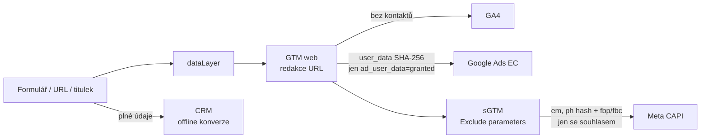

# A3: Osobní údaje v analytice: co smíte poslat do GA4, Google Ads a Meta (a co nikdy) – brief
> Cluster: A. Consent & legislativa · URL: /blog/osobni-udaje-v-analytice · Formát: průvodce s rozhodovací tabulkou a kódem · Priorita: měsíc 1 · Cílová LP: /sluzby/cookie-lista-consent-mode (sekundárně /sluzby/mereni-konverzi) · Rozsah finálního textu: 2 800–3 400 slov + velká tabulka + 2 diagramy + kód

---

## 1. Meta

| Prvek | Návrh |
|---|---|
| H1 | Osobní údaje v analytice: co smíte poslat do GA4, Ads a Meta |
| SEO title (58 zn.) | Google Analytics a GDPR: osobní údaje v GA4 \| datalayer.cz |
| Meta description (145 zn.) | Co je osobní údaj podle Googlu a podle GDPR, proč e-mail v URL porušuje podmínky GA4, kdy hashovat a jak je to s přenosem dat do USA v roce 2026. |
| URL | /blog/osobni-udaje-v-analytice |

**Klíčová slova (Ahrefs CZ):**
- Hlavní: `google analytics gdpr` (100)
- Vedlejší: `gdpr google analytics` (80), `gdpr analytics` (10), `facebook pixel gdpr` (10), `google analytics user id` (10), `enhanced conversions` (10), `enhanced conversions for leads` (10)
- Long-tail / bez objemu, strategické: `osobní údaje google analytics`, `pii google analytics`, `ip adresa ga4`, `ga4 anonymizace ip`, `hashování e-mailu gdpr`, `sha256 osobní údaj`, `data privacy framework google analytics`
- Otázky: „Osobní údaje v Google Analytics – co se smí posílat?“ (SERP dotaz), „Jsou cookies považovány za osobní údaje?“ (PAA), „Je GA4 nelegální?“ (téma v SERP – nk-online.cz), „Je hashovaný e-mail osobní údaj?“, „Musím v GA4 anonymizovat IP?“

**Záměr:** informační / řešení problému (často po upozornění Googlu na PII nebo po auditu).

**Cílový čtenář:** analytik nebo marketér, který nastavuje rozšířené konverze, Meta CAPI, user_id; vývojář, který píše dataLayer; DPO ve velké firmě. Segmenty: e-shop (objednávky, CAPI), B2B (formuláře, leady, CRM), velká firma (DPA, přenosy, záznamy o zpracování).

---

## 2. Analýza SERP a konkurence

**Google.cz 8. 10. 2026 – „osobní údaje v google analytics co se smí posílat“** (bez AI přehledu):
1 support.google.com (Zásady pro zveřejnění…) · 2 martindomes.cz · 3 nazakladedat.cz (uživatelé v GA) · 4 pravniprostor.cz · 5 support.google.com (Údaje o uživatelích) · 6 nk-online.cz („je GA4 nelegální?“) · 7 uplifter.cz · 8 wplama.cz · 9 dlubal.com.

**Pozorování:**
- Výsledky jsou buď Google nápověda (obecná), nebo starší právní články (UA, anonymizace IP, Privacy Shield) – **v ČR chybí** praktický text, který spojí podmínky Googlu, GDPR a implementaci (dataLayer, GTM, CAPI).
- Nikdo neodlišuje „PII podle Googlu“ (úzké: e-mail, telefon, jméno…) a „osobní údaj podle GDPR“ (široké: i client_id, IP, cookie ID) – zdroj častých omylů typu „GA4 je anonymní“.
- Nikdo neukazuje **typické úniky** (e-mail v URL potvrzení newsletteru, telefon v titulku děkovné stránky, hodnoty formulářových polí v událostech) a jejich technickou opravu.
- Téma hashování je na trhu zjednodušené („zahashujeme, takže to není osobní údaj“).
- Konkurenční mezera potvrzená analýzou (kap. 7 `00_analyza-konkurence.md`): „formulářová a uživatelská data: co se smí poslat do GA4/Ads/Meta“.

**Čím přeskočíme:** tabulka „smí / nesmí / jen se souhlasem / jen hashované“ pro 4 platformy × 17 typů údajů; kód redakce URL v GTM; normalizace a hashování pro Google vs. Meta (liší se formát telefonu); aktuální stav DPF k 10/2026; jasné stanovisko k hashování (pseudonymizace ≠ anonymizace).

---

## 3. Otázky, na které musí článek odpovědět

1. Co Google považuje za PII a proč to není totéž jako osobní údaj podle GDPR?
2. Co nikdy nesmí odejít do GA4 (ani omylem)?
3. Je client_id / cookie `_ga` osobní údaj?
4. Ukládá GA4 IP adresy? Musím je anonymizovat?
5. Jak správně nastavit user_id, aby nebylo PII?
6. Je SHA-256 hash e-mailu stále osobní údaj?
7. Co posíláte do Google Ads v rozšířených konverzích a za jakých podmínek?
8. Které parametry Meta CAPI se hashují a které ne?
9. Kudy nejčastěji unikají osobní údaje (URL, titulky, formuláře) a jak to opravit?
10. Co z formuláře smím měřit?
11. Je legální přenos dat do USA v roce 2026 (EU-US Data Privacy Framework)?
12. Jakou smlouvu o zpracování mám mít s Googlem a kde ji najdu?

---

## 4. Rychlá odpověď (hotový text, 59 slov)

> Do GA4 nikdy neposílejte e-mail, telefon, jméno ani jiné přímo identifikující údaje – zakazují to podmínky Googlu, a to i v URL a titulcích. Pseudonymní ID (client_id, interní user_id) jsou podle GDPR stále osobní údaje, proto je smíte použít až po souhlasu. Hashované kontakty patří jen do k tomu určených funkcí (rozšířené konverze, Meta CAPI) a jen se souhlasem.

---

## 5. Osnova s obsahem odpovědí

### H2 1: „PII“ podle Googlu vs. osobní údaj podle GDPR
**Klíčové sdělení:** Google zakazuje úzkou skupinu přímo identifikujících údajů. GDPR chrání mnohem víc – včetně ID v cookies. Splnit podmínky Googlu ještě neznamená splnit GDPR.

**Obsah:**
- **Google Analytics:** nesmí se předat nic, co by Google mohl použít nebo rozpoznat jako PII; příklady „e-mailové adresy, osobní mobilní čísla, rodná čísla (SSN)“; seznam není vyčerpávající; dále jména a identifikátory, které trvale identifikují zařízení (support.google.com/analytics/answer/6366371; zásady Measurement Protocol / SDK / User-ID: developers.google.com/analytics/devguides/collection/protocol/ga4/policy – „You must not upload any data that allows Google to personally identify an individual…“).
- **GDPR čl. 4 bod 1:** osobní údaj = informace o identifikované nebo identifikovatelné osobě, i přes online identifikátor; recitál 30 jmenuje IP adresy a identifikátory cookies; recitál 26: pseudonymizované údaje jsou stále osobní údaje.
- **Tabulka T1** (kap. 6) – srovnání dvou pojmů s příklady.
- **Důsledek pro praxi (hotový text):** „GA4 není anonymní nástroj. Neposíláte do něj e-maily, ale posíláte do něj pseudonymní identifikátory a chování – proto potřebujete souhlas (A2), smlouvu o zpracování a informace v zásadách ochrany OÚ.“

### H2 2: Google Analytics 4: co nesmí odejít a co je v pořádku
**Obsah:**
- **Nikdy:** e-mail, telefon, jméno, adresa, rodné číslo, číslo dokladu, přihlašovací jméno = e-mail, text zprávy z formuláře, zdravotní a jiné citlivé údaje (GDPR čl. 9), tokeny pro reset hesla. Ani v URL, titulku stránky, parametrech UTM, vlastních dimenzích, e-commerce položkách nebo `user_id`.
- **V pořádku (se souhlasem):** client_id (cookie `_ga`), interní pseudonymní user_id, číslo objednávky (pokud neobsahuje e-mail/jméno), hodnota objednávky, produkty, typ zákazníka (nový/vracející), segment B2B (obor, velikost firmy – ne IČO OSVČ, to je osobní údaj).
- **IP adresy:** v GA4 není potřeba anonymizace IP, protože GA4 IP adresy neloguje ani neukládá (support.google.com/analytics/answer/2763052). U uživatelů z EU, Švýcarska a UK probíhají vyhledání IP na serverech v EU a IP se zahodí před zalogováním; slouží jen k hrubé geolokaci (support.google.com/analytics/answer/12017362). IP **neposílejte** jako vlastní parametr.
- **Nastavení v GA4, která snižují rozsah dat** (support 12017362): **granulární údaje o poloze a zařízení** lze vypnout po regionech (pak se nesbírá město, zeměpisná šířka/délka města, user agent, značka a model zařízení, rozlišení) – sníží to objem modelovaných konverzí; **Google signals** po regionech; **redakce dat** (Správce › Datové proudy › web › Redakce dat): odstraňuje e-maily „na základě nejlepší snahy“ a zadané parametry URL, jen pro webové proudy (support 6366371); doba uchovávání dat (2 nebo 14 měsíců – uvést jako tip).
- **Výjimka: sběr údajů poskytnutých uživateli** (user-provided data collection, open beta): administrátor smí poslat do GA4 e-mail, telefon, adresu se souhlasem; na webu je lze hashovat SHA-256 sami, nebo je zahashuje funkce před odesláním; přes Measurement Protocol jen předem hashované; nutné potvrdit zásady a propojit GA4 s Google Ads; nedostupné pro kategorii „Zdraví“ (support.google.com/analytics/answer/14077171). **Doporučení:** zapínat jen s jasným účelem (Customer Match, rozšířené konverze přes GA4) a se souhlasem `ad_user_data`.
- **Od 15. 6. 2026** jsou reklamní data z GA4 řízena jen Consent Mode a IP adresy z Google tagu mají být šifrovaně předávány do propojeného Google Ads (termín Google oznámí) – support.google.com/analytics/answer/17016975 → odkaz A1, H2 6.

### H2 3: user_id a pseudonymizace bez chyb
**Klíčové sdělení:** user_id má být náhodné interní ID, ne e-mail ani hash e-mailu.

**Obsah:**
- Zásady GA (User-ID): nenahrávat údaje, které Googlu umožní identifikovat osobu (jména, e-maily, „podobná data“); dát uživatelům řádné informace a získat souhlas nebo umožnit odhlášení.
- **Správně:** interní ID zákazníka z databáze (např. `cust_48211`), nebo HMAC-SHA256 z interního ID s tajným klíčem uloženým jen na serveru. **Špatně:** e-mail, telefon, hash e-mailu (lze spárovat s e-mailem – Google ho může považovat za PII), ID, které je zároveň veřejné (číslo věrnostní karty vytištěné na účtence).
- Kód 1 (kap. níže) – user_id do dataLayer generuje server.
- Upozornit: user_id je stále osobní údaj (pseudonym) → souhlas `analytics_storage`, informace v zásadách, výmaz na žádost (GA4 umožňuje mazat data uživatele – UI průzkumníku uživatelů / User Deletion API, `[OVĚŘIT názvy v UI před publikací]`).

**Kód 1 – user_id ze serveru (PHP/Node pseudokód není nutný, stačí výstup v šabloně):**
```html
<script>
  window.dataLayer = window.dataLayer || [];
  // Server vloží pouze interní pseudonymní ID (nikdy e-mail ani jeho hash)
  dataLayer.push({
    event: 'user_data_ready',
    user_id: 'u_7f3c9a1e',       // HMAC(customer_id, SECRET) zkrácený, nebo interní ID
    customer_type: 'returning'   // agregovaný atribut, ne osobní údaj sám o sobě
  });
</script>
```

### H2 4: Hashování: SHA-256 není anonymizace
**Klíčové sdělení:** Hash e-mailu je pseudonym. Reklamní platformy ho hashují právě proto, aby ho spárovaly s účtem uživatele – pro ně je to osobní údaj.

**Obsah:**
- GDPR recitál 26 + čl. 4 bod 5: pseudonymizované údaje jsou osobní údaje, pokud je lze s dodatečnými informacemi přiřadit osobě. EDPB Pokyny 01/2025 k pseudonymizaci (přijaty v lednu 2025, veřejná konzultace) – pseudonymizace je bezpečnostní opatření, ne vyjmutí z GDPR (`[OVĚŘIT finální verzi pokynů]`).
- **SDEU C-413/23 P (EDPS v SRB, 4. 9. 2025):** pseudonymizované údaje nemusí být osobními údaji pro příjemce, který nemá rozumné prostředky k reidentifikaci. **Pro Google a Meta to neplatí** – párování hashů s jejich databází je smyslem funkce. (Formulovat opatrně, ověřit u právníka.)
- **Technicky:** SHA-256 e-mailu bez soli je deterministický – stejný e-mail = stejný hash; kdo má seznam e-mailů, hash „rozluští“ porovnáním. Ukázkový příklad (fiktivní): `jan.novak@example.com` → po normalizaci → stejný hash v Google, Meta i v uniklé databázi.
- **Kdy hashovat:** jen tam, kde to platforma vyžaduje (Google Ads rozšířené konverze, Customer Match, Meta Advanced Matching/CAPI, Seznam SEM) – a vždy **jen se souhlasem** (`ad_user_data`, marketing) a s informací v zásadách.
- **Kdy ne:** user_id do GA4, vlastní dimenze, BigQuery klíče pro marketing (tam raději interní ID).

### H2 5: Google Ads: rozšířené konverze a Customer Match
**Obsah (support.google.com/google-ads/answer/13258081, 10548233, 14546648):**
- Rozšířené konverze posílají normalizované a hashované (hex SHA-256) kontaktní údaje; můžete poslat nehashované a Google tag je normalizuje a zahashuje, nebo předem hashované.
- **Normalizace Google:** ořezat mezery, malá písmena; telefon ve formátu **E.164** (`+420777123456`); u `gmail.com` a `googlemail.com` odstranit tečky před zavináčem. Preferovaný je e-mail; adresa vyžaduje jméno, příjmení, PSČ a zemi.
- Před nastavením je nutné přijmout **podmínky pro zákaznická data**.
- **Souhlas:** `ad_user_data` řídí sběr osobních údajů pro reklamu včetně hashovaných údajů rozšířených konverzí (developers.google.com consent mode concepts). U Customer Match pro EHP musí být od března 2024 obě pole `ad_user_data` a `ad_personalization` = `GRANTED`, jinak se data nezpracují (support 14546648).
- Kód 2 – dataLayer podle specifikace formulářů klienta (`05_formulare/specifikace-formularu.md`): `generate_lead` s `user_data.sha256_email_address` a `sha256_phone_number`.
- Odkaz na E2 (podrobný návod rozšířených konverzí) a E3 (offline konverze s gclid).

**Kód 2 – hashování v prohlížeči (Web Crypto) a předání do dataLayer jen se souhlasem:**
```js
async function sha256Hex(value) {
  const buf = await crypto.subtle.digest('SHA-256', new TextEncoder().encode(value));
  return Array.from(new Uint8Array(buf)).map(b => b.toString(16).padStart(2, '0')).join('');
}
function normEmail(e) {
  e = e.trim().toLowerCase();
  const [local, domain] = e.split('@');
  if (!domain) return '';
  const l = (domain === 'gmail.com' || domain === 'googlemail.com') ? local.replace(/\./g, '') : local;
  return l + '@' + domain;
}
function normPhoneE164(p, cc = '420') {            // Google: E.164 s „+“
  let d = p.replace(/[^\d+]/g, '');
  if (d.startsWith('00')) d = '+' + d.slice(2);
  if (!d.startsWith('+')) d = '+' + cc + d.replace(/^0+/, '');
  return d;
}

async function pushLead(formId, email, phone, consent) {
  const evt = { event: 'generate_lead', form_id: formId, form_location: location.pathname };
  if (consent.marketing) {                          // ad_user_data = granted
    evt.user_data = {
      sha256_email_address: email ? await sha256Hex(normEmail(email)) : undefined,
      sha256_phone_number: phone ? await sha256Hex(normPhoneE164(phone)) : undefined
    };
  }
  window.dataLayer.push(evt);                        // hodnoty polí formuláře se NEposílají
}
```

### H2 6: Meta: Advanced Matching a Conversions API
**Obsah (developers.facebook.com):**
- **Advanced Matching v pixelu:** automatické (zapíná se v Events Manageru – pixel sám čte pole formulářů) nebo ruční (třetí parametr `fbq('init', id, {em: …})`); pixel hodnoty hashuje SHA-256 automaticky. Doporučení: automatické vypnout, pokud nemáte přehled, která pole čte; ruční jen se souhlasem.
- **CAPI – parametry zákazníka:** tabulka T2 (kap. 6) – povinně hashované `em, ph, fn, ln, db, ge, ct, st, zp, country`; doporučeně hashované `external_id`; **nehashovat** `client_ip_address`, `client_user_agent` (povinný pro webové události), `fbc`, `fbp` a další ID.
- **Normalizace Meta se liší:** telefon bez symbolů a úvodních nul **s kódem země** (např. `420777123456` – bez „+“), e-mail malými písmeny bez mezer → ukázat rozdíl proti Google (E.164 s „+“).
- **Souhlas:** pixel se načítá až po souhlasu; CAPI se pro uživatele bez souhlasu neposílá (právní titul pro předání údajů Metě je v praxi souhlas; Meta uvádí, že za soulad s GDPR odpovídá každá firma sama). Server-side neznamená výjimku (A5). Deduplikace a EMQ → B5.

### H2 7: Seznam (Sklik): hashované identifikátory jen s `ad_user_data`
- SEM: `ad_user_data` je „vyžadován pro zpracování hashovaných identifikátorů uživatele“, `ad_personalization` pro retargeting (napoveda.sklik.cz, SEM consent management). Detail v B6.

### H2 8: Kudy osobní údaje unikají nejčastěji – a jak to zastavit
**Klíčové sdělení:** Většina úniků není záměr, ale URL. Opravujte u zdroje, v GTM pojistěte.

**Obsah – typické úniky (ilustrativní příklady, fiktivní data):**
1. **Potvrzení newsletteru / registrace:** `/dekujeme?email=jan.novak%40example.com` → `page_location` v GA4, referrer pro další tagy.
2. **Formulář odeslaný metodou GET:** `/kontakt?jmeno=Jan&telefon=777123456`.
3. **Reset hesla / magické odkazy:** `?token=…&email=…`.
4. **Interní vyhledávání:** uživatel hledá svůj e-mail nebo číslo objednávky → `search_term`.
5. **Titulky stránek:** „Objednávka 2026-1042 – Jan Novák“.
6. **UTM z e-mailingu** s personalizací (`utm_content={{email}}`).
7. **dataLayer** s objektem `customer` (jméno, e-mail) – GTM ho pak „omylem“ pošle jako parametr.
8. **Vlastní události z formulářů** s hodnotou polí (`field_value`).
9. **Referrer** – plná URL s osobními údaji odchází i do skriptů třetích stran.

**Opravy (pořadí podle účinnosti):**
1. U zdroje: formuláře přes POST, děkovné stránky bez osobních údajů v URL, titulky bez jmen.
2. `Referrer-Policy: strict-origin-when-cross-origin` (výchozí v moderních prohlížečích, ale nastavit explicitně).
3. GTM: proměnná s redakcí URL (Kód 3) použitá pro `page_location`, `page_referrer` v Google tagu a pro ostatní tagy.
4. GA4 **Redakce dat** (e-maily + vybrané parametry) jako druhá pojistka.
5. sGTM **transformace „Exclude parameters“ / „Allow parameters“** – odstranění parametrů před odesláním do platforem (developers.google.com/tag-platform/tag-manager/server-side/transformations) → A5.
6. Pravidelný audit (BigQuery dotaz na `page_location` s `@` / `%40`) → F2.

**Kód 3 – GTM proměnná „Vlastní JavaScript – Page URL (redacted)“ (ES5 kompatibilní):**
```js
function () {
  var url = {{Page URL}};
  // 1) e-mailové adresy kdekoli v URL (i zakódované %40)
  url = url.replace(/[A-Z0-9._%+-]+(@|%40)[A-Z0-9.-]+\.[A-Z]{2,}/gi, 'REDACTED_EMAIL');
  // 2) citlivé parametry podle názvu
  var sensitive = ['email', 'e-mail', 'mail', 'phone', 'tel', 'telefon', 'jmeno',
                   'prijmeni', 'name', 'token', 'reset', 'heslo', 'password', 'adresa'];
  try {
    var u = new URL(url);
    for (var i = 0; i < sensitive.length; i++) {
      if (u.searchParams.has(sensitive[i])) u.searchParams.set(sensitive[i], 'REDACTED');
    }
    return u.toString();
  } catch (e) {
    return url;
  }
}
// Použití: Google tag › Nastavení konfigurace › page_location = {{Page URL (redacted)}}
// Obdobně proměnná pro {{Referrer}} → page_referrer
```

**Kód 4 – kontrolní SQL v BigQuery (GA4 export) – hledání e-mailů v URL za 30 dní:**
```sql
SELECT
  (SELECT value.string_value FROM UNNEST(event_params) WHERE key = 'page_location') AS page_location,
  COUNT(*) AS events
FROM `projekt.analytics_123456789.events_*`
WHERE _TABLE_SUFFIX BETWEEN FORMAT_DATE('%Y%m%d', DATE_SUB(CURRENT_DATE(), INTERVAL 30 DAY))
                        AND FORMAT_DATE('%Y%m%d', CURRENT_DATE())
  AND REGEXP_CONTAINS(
        (SELECT value.string_value FROM UNNEST(event_params) WHERE key = 'page_location'),
        r'(?i)[a-z0-9._%+-]+(@|%40)[a-z0-9.-]+\.[a-z]{2,}')
GROUP BY page_location
ORDER BY events DESC
LIMIT 100;
```

### H2 9: Formulářová data: co měřit a co ne
**Obsah (navázat na E1 a specifikaci formulářů klienta):**
- **Měřit:** `lead_form_start`, `lead_form_error` (názvy polí s chybou, ne hodnoty), `generate_lead` s `form_id`, `form_location`, `lead_topics` (zvolená témata – chips), hodnota leadu (odhad).
- **Neměřit:** jméno, e-mail, telefon, text zprávy, název souboru přílohy, hodnoty volných polí.
- **Pro reklamu:** hashované kontakty jen v `user_data` a jen se souhlasem (Kód 2); plné údaje patří do CRM, odkud se párují offline konverze (E3).
- B2B poznámka: IČO a e-mail podnikající fyzické osoby jsou osobní údaje.

### H2 10: Přenosy do USA a smlouvy s platformami (stav 10/2026)
**Klíčové sdělení:** Přenos do USA je dnes postaven na Data Privacy Framework; rámec platí, ale u Soudního dvora EU běží odvolání.

**Obsah:**
- **Rozhodnutí o odpovídající ochraně EU–USA (DPF)** z 10. 7. 2023 (prováděcí rozhodnutí Komise (EU) 2023/1795) – přenos k certifikovaným organizacím bez dalších nástrojů.
- **Tribunál** žalobu (Latombe v. Komise, T-553/23) zamítl **3. 9. 2025**; **odvolání k SDEU** (C-703/25 P) podáno koncem října 2025 a k 06/2026 probíhá (sekundární zdroj) → `[OVĚŘIT na curia.europa.eu před publikací]`.
- Ověřit, že Google LLC a Meta Platforms, Inc. jsou aktivní účastníci (dataprivacyframework.gov/list) – v článku formulovat „podle seznamu DPF k {datum}“.
- **Historický kontext (1 odstavec):** v letech 2022 několik evropských úřadů (např. rakouský, francouzský) shledalo přenosy dat z tehdejšího Google Analytics do USA nezákonnými – před DPF (`[OVĚŘIT odkazy na rozhodnutí]`).
- **Smlouva o zpracování s Googlem (GA4):** platí **Google Ads Data Processing Terms** (verze 8.0, 30. 5. 2024); u zákazníků z EHP jsou součástí smlouvy automaticky; kontrola v GA4: Správce › Podrobnosti o účtu › Dodatek o zpracování dat; vyplnit právnickou osobu, kontakt pro oznámení, DPO, zástupce v EHP (support.google.com/analytics/answer/3379636, business.safety.google/adsprocessorterms). Pro některé reklamní funkce vystupuje Google jako samostatný správce – podmínky „controller-controller“ `[OVĚŘIT: business.safety.google/adscontrollerterms]`.
- **Do dokumentace:** záznam o činnostech zpracování (čl. 30 GDPR), informace v zásadách (příjemci, třetí země), seznam zpracovatelů (Google, Meta, hosting sGTM), doby uchovávání.

### H2 11: Velká tabulka: smí / nesmí / jen se souhlasem / jen hashované
→ Tabulka T3 (kap. 6) + 3 věty výkladu legendy.

### Závěr: checklist 10 bodů (hotový text)
1. Žádné kontakty v URL, titulcích, parametrech. 2. Redakce URL v GTM + GA4. 3. user_id = interní pseudonym. 4. Hashované údaje jen v k tomu určených funkcích. 5. Jen se souhlasem (`ad_user_data`). 6. Normalizace podle platformy. 7. Formuláře: metadata, ne hodnoty. 8. GA4: granularita, signals, retence podle potřeby. 9. Smlouvy a záznamy o zpracování. 10. Čtvrtletní kontrola v BigQuery (Kód 4).

---

## 6. Vizuály

### Diagram 1: Kudy jdou osobní údaje (H2 8)

**Finální SVG:** vlevo zdroj (formulář s ikonou obálky a telefonu), uprostřed „filtr“ (trychtýř s mřížkou = redakce), vpravo 4 cíle s logy-tečkami. Čáry: plné údaje = tlumená bílá, hash = cyan přerušovaná se štítkem `sha256`, zakázaná cesta (formulář → GA4 s e-mailem) jako přeškrtnutá šedá linka se štítkem `PII ✕`. Mobil: svisle.

### Diagram 2: Normalizace a hash (H2 5/6) – mini-infografika
Tři řádky: vstup `  Jan.Novak@Gmail.com ` → normalizace Google `jannovak@gmail.com` / Meta `jan.novak@gmail.com` → `sha256: 3f…` (fiktivní zkrácený hash). Telefon `777 123 456` → Google `+420777123456`, Meta `420777123456`. Monospace, cyan šipky. Pozn.: Meta odstranění teček u Gmailu nevyžaduje (ověřit, jinak řádek Meta sjednotit s Googlem).

### Tabulka T1: PII (Google) vs. osobní údaj (GDPR)
| Údaj | PII podle podmínek GA | Osobní údaj podle GDPR |
|---|---|---|
| E-mail, telefon, jméno | ano – zakázáno | ano |
| Rodné číslo, číslo dokladu | ano – zakázáno | ano (zvlášť chráněné) |
| Trvalý nesmazatelný ID zařízení | ano – zakázáno | ano |
| client_id (cookie `_ga`) | ne | ano (online identifikátor) |
| Interní user_id | ne (pokud není e-mail apod.) | ano (pseudonym) |
| IP adresa | GA4 neukládá | ano (recitál 30) |
| Hash e-mailu (SHA-256) | v GA4 běžně ne; povoleno jen přes user-provided data | ano (pseudonym) |
| Hodnota objednávky, produkty | ne | jen ve spojení s identifikátorem |

### Tabulka T2: Meta CAPI – parametry zákazníka
| Parametr | Klíč | Hash | Poznámka k normalizaci |
|---|---|---|---|
| E-mail | `em` | povinně SHA-256 | trim, malá písmena |
| Telefon | `ph` | povinně | bez symbolů a úvodních nul, s kódem země |
| Jméno / příjmení | `fn` / `ln` | povinně | malá písmena, bez interpunkce, UTF-8 |
| Datum narození | `db` | povinně | YYYYMMDD |
| Pohlaví | `ge` | povinně | `f` / `m` |
| Město / stát / PSČ | `ct` / `st` / `zp` | povinně | malá písmena bez mezer |
| Země | `country` | povinně | ISO 3166-1 alpha-2 malými písmeny |
| Externí ID | `external_id` | doporučeně | stejné jako v ostatních kanálech |
| IP adresa | `client_ip_address` | **nehashovat** | IPv6 preferovat |
| User agent | `client_user_agent` | **nehashovat** | povinný pro webové události |
| Click ID | `fbc` | **nehashovat** | z cookie `_fbc` |
| Browser ID | `fbp` | **nehashovat** | z cookie `_fbp` |

### Tabulka T3: Smí / nesmí / jen se souhlasem / jen hashované (kompletní)
Legenda: **SOUHLAS** = jen po souhlasu (analytika/marketing) · **HASH+SOUHLAS** = jen normalizované SHA-256 a jen s `ad_user_data`/marketingem · **NE** = nikdy · **AUTO** = platforma sbírá sama, neposílat ručně · **–** = nepoužívá se.

| Údaj | GA4 | Google Ads | Meta (Pixel / CAPI) | Sklik (SEM) |
|---|---|---|---|---|
| client_id / `_ga` | SOUHLAS | – | – | – |
| Interní user_id (pseudonym) | SOUHLAS | – | `external_id`: HASH+SOUHLAS | – |
| E-mail čitelně | NE (výjimka: funkce user-provided data) | HASH+SOUHLAS (tag zahashuje) | Pixel AM: HASH+SOUHLAS (pixel hashuje) · CAPI: NE nehashovaný | HASH+SOUHLAS |
| E-mail SHA-256 | NE v běžných parametrech | HASH+SOUHLAS | HASH+SOUHLAS | HASH+SOUHLAS |
| Telefon | NE | HASH+SOUHLAS (E.164) | HASH+SOUHLAS | HASH+SOUHLAS |
| Jméno, příjmení | NE | HASH+SOUHLAS (s adresou) | HASH+SOUHLAS | – |
| Ulice | NE | HASH+SOUHLAS | – | – |
| PSČ, město, země | NE jako parametr (GA4 odvozuje polohu sám) | SOUHLAS – jen jako součást adresy v EC; podle našich znalostí se tato pole posílají nehashovaná (OVĚŘIT v dokumentaci EC před publikací) | HASH+SOUHLAS | – |
| IP adresa | AUTO (EU neukládá) – NE ručně | AUTO | CAPI: SOUHLAS, nehashovat | – |
| User agent | AUTO | AUTO | CAPI: SOUHLAS, nehashovat | – |
| gclid / wbraid / gbraid | AUTO (z URL) | SOUHLAS (`ad_storage`) | – | – |
| `fbp` / `fbc` | – | – | SOUHLAS, nehashovat | – |
| Číslo objednávky | SOUHLAS (bez e-mailu/jména) | SOUHLAS | SOUHLAS | SOUHLAS |
| Hodnota, produkty | SOUHLAS | SOUHLAS | SOUHLAS | SOUHLAS |
| Hodnoty polí formuláře, text zprávy | NE | NE | NE | NE |
| Citlivé údaje (zdraví, …) | NE | NE | NE | NE |
| URL s e-mailem / tokenem | NE (redigovat) | NE | NE | NE |

### Mockup (volitelný): GA4 Redakce dat
Stylizovaný výřez nastavení datového proudu: přepínače „Redigovat e-mail“ (ON) a „Redigovat parametry URL“ s chipy `email`, `phone`, `token`. Fiktivní data, brand barvy.

---

## 7. Fakta a zdroje

| Tvrzení | Zdroj | Ověřeno | Riziko zastarání |
|---|---|---|---|
| Zákaz PII v GA, příklady, URL a titulky, formuláře, UTM; redakce dat (e-mail best-effort, parametry, jen web) | https://support.google.com/analytics/answer/6366371 | 10/2026 | nízké |
| Zásady Measurement Protocol / SDK / User-ID (zákaz údajů identifikujících osobu a trvalých ID zařízení; informování a souhlas) | https://developers.google.com/analytics/devguides/collection/protocol/ga4/policy | 10/2026 | nízké |
| GA4 IP neloguje ani neukládá | https://support.google.com/analytics/answer/2763052 | 10/2026 | nízké |
| EU/CH/UK: IP lookup v EU, IP zahozena; granulární poloha a zařízení po regionech; Google signals po regionech | https://support.google.com/analytics/answer/12017362 | 10/2026 | střední |
| User-provided data collection (open beta, SHA-256, propojení s Ads, nedostupné pro Zdraví) | https://support.google.com/analytics/answer/14077171 | 10/2026 | **vysoké (beta)** |
| Změny 15. 6. 2026 a IP do Google Ads | https://support.google.com/analytics/answer/17016975 | 10/2026 | **vysoké** |
| Rozšířené konverze: normalizace, E.164, tečky u Gmailu, hex SHA-256, podmínky zákaznických dat | https://support.google.com/google-ads/answer/13258081 | 10/2026 | střední |
| `ad_user_data` zahrnuje hashovaná data rozšířených konverzí | https://developers.google.com/tag-platform/security/concepts/consent-mode | 10/2026 | nízké |
| Customer Match EHP: oba souhlasy GRANTED od 03/2024 | https://support.google.com/google-ads/answer/14546648 | 10/2026 | nízké |
| Meta CAPI parametry – hash / nehashovat | https://developers.facebook.com/docs/marketing-api/conversions-api/parameters/customer-information-parameters | 10/2026 | střední |
| Meta Advanced Matching – automatické/ruční, pixel hashuje SHA-256 | https://developers.facebook.com/docs/meta-pixel/advanced/advanced-matching | 10/2026 | nízké |
| SEM: `ad_user_data` pro hashované identifikátory | https://napoveda.sklik.cz/en/tracking-scripts/seznam-event-measurement-sem/configuration-sem/consent-management/ | 10/2026 | střední |
| sGTM transformace Allow / Augment / Exclude | https://developers.google.com/tag-platform/tag-manager/server-side/transformations | 10/2026 | nízké |
| GDPR čl. 4/1, 4/5, 9, 30; recitály 26, 30 | https://eur-lex.europa.eu/eli/reg/2016/679/oj | 10/2026 | nízké |
| EDPB Pokyny 01/2025 k pseudonymizaci | https://www.edpb.europa.eu (sekce Guidelines) | **ověřit finální verzi** | střední |
| SDEU C-413/23 P EDPS v SRB, 4. 9. 2025 | https://curia.europa.eu/juris/liste.jsf?num=C-413/23 | **ověřit znění** | nízké |
| DPF rozhodnutí 10. 7. 2023; Tribunál T-553/23 zamítl 3. 9. 2025; odvolání C-703/25 P probíhá | https://commission.europa.eu (adequacy decisions); sekundárně https://next-levels.de/en/wiki/eu-us-data-privacy-framework (akt. 8. 6. 2026) | 10/2026 | **vysoké – ověřit na curia.europa.eu** |
| Google LLC / Meta Platforms v seznamu DPF | https://www.dataprivacyframework.gov/list | **neověřeno (stránka vyžaduje JS)** | střední |
| Google Ads Data Processing Terms v8.0 (30. 5. 2024) pro GA; postup v Admin | https://business.safety.google/adsprocessorterms/ ; https://support.google.com/analytics/answer/3379636 | 10/2026 | nízké |
| Rozhodnutí DSB (AT) a CNIL (FR) 2022 k GA | rozhodnutí úřadů | **ověřit odkazy** | nízké (historické) |

---

## 8. Interní odkazy a CTA

**Cílová LP:** /sluzby/cookie-lista-consent-mode; sekundární /sluzby/mereni-konverzi (v H2 5–6).

**CTA box (za H2 8 – po seznamu úniků):**
- Nadpis: **Najdeme osobní údaje, které vám utíkají do analytiky**
- Text: Projdeme GA4 (i export v BigQuery), GTM a formuláře, najdeme e-maily v URL a parametrech a nastavíme redakci i rozšířené konverze tak, aby šly jen hashované údaje a jen se souhlasem.
- Tlačítko: `[ Chci kontrolu osobních údajů ]` → /sluzby/audit-mereni (`cta_id: blog_a3_box`) – *pozn.: audit je přirozený první krok; LP consent odkazovat z textu*.

**Související články:** A1 (Consent Mode – `ad_user_data`), A2 (souhlas a GDPR), A5 (server-side transformace), E1 Měření formulářů a leadů (/blog/mereni-formularu-a-leadu), E2 Rozšířené konverze (/blog/rozsirene-konverze), E3 Offline konverze z CRM (/blog/offline-konverze-z-crm), E4 First-party data (/blog/first-party-data), B5 Meta Conversions API (/blog/meta-conversions-api), D1 Nastavení GA4 (/blog/nastaveni-ga4-pruvodce), F2 SQL pro GA4 (/blog/ga4-bigquery-sql).

**Slovník:** /slovnik/user-id, /slovnik/client-id, /slovnik/rozsirene-konverze, /slovnik/conversions-api, /slovnik/gclid-gbraid-wbraid.

**Zkrácený kontaktní blok:** `form_id: blog`, předvybraná témata **Cookie lišta & consent** + **Audit měření**, H2 „Řešíte totéž u sebe?“, placeholder „Napište, na čem jste se zasekli… (např. Google nás upozornil na PII v GA4)“.

---

## 9. FAQ pro schema (FAQPage)

**Smím do Google Analytics 4 posílat e-mail zákazníka?**
Ne. Podmínky Google Analytics zakazují posílat údaje, které Google může rozpoznat jako osobně identifikující, například e-maily, telefonní čísla nebo jména – a to ani v URL nebo titulku stránky. Jedinou výjimkou je samostatná funkce sběru údajů poskytnutých uživateli, která vyžaduje souhlas, propojení s Google Ads a hashování SHA-256.

**Ukládá GA4 IP adresy?**
Podle Googlu GA4 IP adresy neloguje ani neukládá, a proto v něm není potřeba anonymizace IP. U uživatelů z EU probíhá zjištění polohy z IP na serverech v EU a IP adresa se poté zahodí. Od roku 2026 Google oznámil šifrované předávání IP z Google tagu do propojeného Google Ads – termín teprve upřesní.

**Je hashovaný e-mail stále osobní údaj?**
Pro reklamní platformy ano. SHA-256 je pseudonymizace, ne anonymizace: stejný e-mail dává vždy stejný hash a Google či Meta ho párují se svými uživateli. Hashované kontakty proto posílejte jen do funkcí, které je vyžadují (rozšířené konverze, Meta CAPI), a jen se souhlasem návštěvníka.

**Je client_id v GA4 osobní údaj?**
Podle GDPR obvykle ano – je to online identifikátor uložený v cookie, který rozlišuje prohlížeč. Podmínky Googlu ho za zakázané PII nepovažují, takže ho GA4 používat smí, ale jen po souhlasu s analytickými cookies a s informacemi v zásadách ochrany osobních údajů.

**Je přenos dat z GA4 do USA v roce 2026 legální?**
Přenosy k certifikovaným americkým firmám se opírají o rozhodnutí Komise o rámci EU–USA (Data Privacy Framework) z července 2023. Tribunál EU žalobu proti němu v září 2025 zamítl, u Soudního dvora však běží odvolání. Rámec tedy platí, ale jeho stav je potřeba sledovat.

**Jak zabránit tomu, aby e-maily z URL padaly do GA4?**
Nejlepší je opravit zdroj – formuláře odesílat metodou POST a nedávat osobní údaje do adres děkovných stránek. V Google Tag Manageru nastavte proměnnou, která e-maily a citlivé parametry z URL odstraní, a v GA4 zapněte redakci dat jako druhou pojistku. Pravidelně kontrolujte export v BigQuery.

---

## 10. Poznámky pro autora

- **Právní citlivost:** H2 4 (hashování, SRB), H2 10 (DPF) – formulovat „podle…“, nechat zkontrolovat advokátem; disclaimer „nejde o právní radu, stav k {datum}“.
- **Vysoké riziko zastarání:** DPF (odvolání C-703/25 P), změny GA4 2026 (IP do Ads, ad_personalization), user-provided data (beta). Revize každých 6 měsíců, DPF kontrolovat čtvrtletně.
- **Nejisté:** která adresní pole rozšířených konverzí Google hashuje (jméno, příjmení, ulice) a která posílá čitelně (město, region, PSČ, země) – ověřit v dokumentaci EC; finální verze EDPB pokynů 01/2025; zda Meta normalizuje e-maily Gmail stejně jako Google (v Diagramu 2 jinak sjednotit); seznam DPF; názvy UI pro mazání uživatele v GA4; historická rozhodnutí 2022 (odkazy).
- **Kód otestovat:** Kód 2 (Web Crypto vyžaduje HTTPS, async), Kód 3 v náhledu GTM (ES5), Kód 4 na reálném exportu (název datasetu nahradit).
- **Soulad se specifikací formulářů klienta:** klíče `sha256_email_address`, `sha256_phone_number` a normalizace Gmail jsou shodné s `05_formulare/specifikace-formularu.md` – zachovat.
- **Klient dodá:** anonymizovaný příklad nálezu z auditu (např. „e-mail v URL potvrzení newsletteru“) – bez názvu klienta; `[DOPLNIT]`.
- **Doporučený autor:** Vít Novotný; recenze: advokát/DPO `[DOPLNIT]`.
