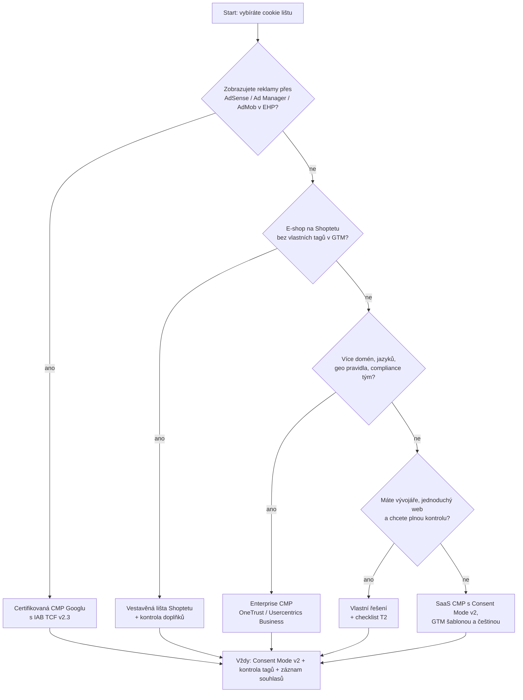

# A4: Jak vybrat cookie lištu: Cookiebot, české CMP, nebo vlastní řešení? – brief
> Cluster: A. Consent & legislativa · URL: /blog/jak-vybrat-cookie-listu · Formát: srovnání + rozhodovací strom · Priorita: měsíc 2 · Cílová LP: /sluzby/cookie-lista-consent-mode · Rozsah finálního textu: 2 800–3 300 slov + srovnávací tabulka + rozhodovací strom

---

## 1. Meta

| Prvek | Návrh |
|---|---|
| H1 | Jak vybrat cookie lištu: Cookiebot, české CMP, nebo vlastní? |
| SEO title (59 zn.) | Cookie lišta: jak vybrat CMP (srovnání 2026) \| datalayer.cz |
| Meta description (147 zn.) | Cookiebot, CookieYes, OneTrust, české CMP, nebo vlastní lišta? Srovnání podle Consent Mode v2, IAB TCF, záznamu souhlasů, češtiny a ceny (10/2026). |
| URL | /blog/jak-vybrat-cookie-listu |

**Klíčová slova (Ahrefs CZ):**
- Hlavní: `cookie lišta` (200, KD 17)
- Vedlejší: `cookiebot` (450, KD 1), `cookies lišta` (150, KD 16), `cookie lišta zdarma` (90, KD 7), `cookiebot pricing` (50), `shoptet cookie lišta` (40), `cookie banner` (40, KD 20), `cookie lišta shoptet` (20), `cookies banner` (20), `cmp cookies` (10), `cookiebot tag manager` / `cookiebot google tag manager` (10), `cookiebot vs complianz` (10), `cookiebot by usercentrics` (10), `lišta cookies` (10), `cookies lišta zdarma` (10)
- Zastaralé dotazy (zachytit větou v textu): `cookie lišta 2022` (40), `cookies lišta 2022` (20)
- Otázky (PAA / Ahrefs): „What is Cookiebot used for?“, „Is Cookiebot safe?“, „Can I use Cookiebot for free?“, „Is Cookiebot worth it?“, „Co je cookie lišta?“, „Co musí obsahovat cookies (lišta)?“, „Kde najdu nastavení cookies?“

**Záměr:** komerční vyšetřování (výběr nástroje) + transakční (zdarma, cena).

**Cílový čtenář:** majitel / marketér e-shopu nebo firemního webu, který vybírá CMP nebo řeší, zda je jeho současná lišta dostatečná; IT/compliance velké firmy, které hledá enterprise CMP. Segmenty: e-shop (Shoptet, WooCommerce), B2B web, velká firma (více domén, jazyků, governance).

---

## 2. Analýza SERP a konkurence

**Google.cz 8. 10. 2026 – „cookie lišta“** (bez AI přehledu): 1 cookieslista.cz · 2 cookie-lista.cz · 3 uoou.gov.cz · 4 cookies-spravne.cz · 5 remedio.cz · 6 getfound.cz · 7 designsystem.gov.cz · 8 webglobe.cz · 9 digitalniarchitekti.cz.
- SERP ovládají **prodejci lišt** a obecné poradny. Neutrální srovnání nástrojů česky chybí.
- Nejbližší konkurenční obsah: marketingppc.cz/google-analytics/vyber-cookie-listy-google/ (~2 850 slov, výběr CMP s certifikací Google); consentio.cz má srovnávací stránky „vs. Cookiebot/CookieYes/Complianz/Termly“ (pochopitelně ve svůj prospěch); cookies-spravne.cz srovnává sebe s Cookiebot a CookieYes.
- Na „consent mode basic vs advanced“ inzeruje Cookiebot (`google_serp_ads.tsv`) – značka má silnou poptávku (`cookiebot` 450).

**Co chybí:**
1. Nezávislé srovnání mezinárodních i českých CMP **a vlastního řešení** podle technických kritérií (ne podle marketingu).
2. Vysvětlení, **kdo opravdu potřebuje certifikovanou CMP a IAB TCF** (publisheři AdSense/Ad Manager/AdMob), a kdo ne (běžný e-shop jako inzerent).
3. Upozornění, že **každá CMP účtuje jinou jednotku** (podstránky, zobrazení, relace, souhlasy) → srovnání cen je zavádějící bez přepočtu.
4. Záznam souhlasů (čl. 7 odst. 1 GDPR) a **Safari** (uložená volba zapsaná JavaScriptem vydrží 7 dní).
5. Rozhodovací strom.

**Čím přeskočíme:** srovnávací tabulka 8 řešení s ověřenými údaji a datem, rozhodovací strom, checklist pro vlastní řešení, sekce mýtů, test „lišta v 15 minutách“.

---

## 3. Otázky, na které musí článek odpovědět

1. Co je cookie lišta / CMP a co musí umět kromě „okna se dvěma tlačítky“?
2. Musí být CMP certifikovaná Googlem? Potřebuji IAB TCF?
3. Jak se liší Cookiebot, CookieYes, Usercentrics, OneTrust a české Cookies správně a Consentio?
4. Stačí vestavěná lišta Shoptetu?
5. Je Cookiebot zdarma? Kolik stojí CMP a podle čeho se cena počítá?
6. Mohu si lištu naprogramovat sám? Co pak musím zajistit?
7. Jak CMP ukládá a dokládá souhlas?
8. Jak lišta ovlivní rychlost webu?
9. Jak CMP správně napojit na GTM a Consent Mode v2?
10. Jak ověřit, že vybraná lišta opravdu funguje?

---

## 4. Rychlá odpověď (hotový text, 57 slov)

> Vyberte CMP podle toho, co musí váš web splnit, ne podle ceny. Publisher s reklamou AdSense nebo Ad Manager potřebuje CMP certifikovanou Googlem s IAB TCF. Běžnému e-shopu stačí lišta s Consent Mode v2, šablonou pro GTM, češtinou a záznamem souhlasů. Vlastní řešení dává smysl u jednoduchých webů s vývojářem. Vždy ověřte, že tagy opravdu čekají na souhlas.

---

## 5. Osnova s obsahem odpovědí

### H2 1: Co je CMP a co musí umět (víc než dvě tlačítka)
**Klíčové sdělení:** Lišta je jen viditelná část. Podstatné je, jestli správně blokuje skripty, předává souhlas tagům a umí ho doložit.

**Obsah – 9 funkcí CMP (hotové krátké odstavce):**
1. **Zobrazení a volba** podle požadavků ÚOOÚ (Přijmout/Odmítnout ve stejné vrstvě, srovnatelné provedení, kategorie, česky) – A2.
2. **Blokování skriptů** do souhlasu – buď automatické (CMP přepisuje/blokuje skripty), nebo řízené přes GTM (doporučeno – víc kontroly).
3. **Consent Mode v2** – předání všech 4 hlavních signálů, default i update, bez nutnosti obnovit stránku (A1).
4. **Událost do dataLayer** po volbě (pro ne-Google tagy a měření consent rate – A6).
5. **Záznam souhlasu (důkaz):** GDPR čl. 7 odst. 1 – správce musí umět doložit souhlas. Typický záznam: anonymní ID souhlasu, čas, verze lišty/textů, zvolené kategorie, URL; bez nutnosti ukládat celou IP.
6. **Sken cookies a deklarace** (výpis cookies s účelem a dobou – ÚOOÚ doporučuje).
7. **Odvolání a opětovné zobrazení:** odkaz v patičce; platnost souhlasu 12 měsíců, po odmítnutí 6 měsíců (ÚOOÚ).
8. **Více jazyků, domén, geo pravidla** (velké firmy).
9. **Statistiky souhlasů** (consent rate) a export.

### H2 2: Certifikace Googlu a IAB TCF: kdo je opravdu potřebuje
**Klíčové sdělení:** Certifikovaná CMP s TCF je povinná pro publishery reklamních sítí Googlu, ne pro inzerenty.

**Obsah:**
- **Publisheři:** kdo používá **AdSense, Ad Manager nebo AdMob** a zobrazuje reklamy uživatelům z EHP a UK, musí od **16. 1. 2024** používat **CMP certifikovanou Googlem a integrovanou s IAB TCF**; pro Švýcarsko od 31. 7. 2024 (support.google.com/adsense/answer/13554116).
- **Inzerenti (e-shopy, B2B weby s Google Ads):** certifikovaná CMP není podmínkou; Google uvádí, že s certifikovanou CMP se Consent Mode aktualizuje automaticky u dodavatele, s vlastní lištou ho musíte implementovat sami (support.google.com/google-ads/answer/13695607).
- **Program Google CMP Partner** (cmppartnerprogram.withgoogle.com, ověřeno 10/2026): úrovně Gold / Silver / Bronze podle podpory a snadnosti integrace; mezi Gold mj. Cookiebot (Usercentrics), CookieYes, OneTrust, Usercentrics, Didomi, iubenda, CookieFirst, Cookie Script; Complianz Silver. **České CMP (Cookies správně, Consentio) v seznamu nejsou.**
- **IAB TCF** (aktuálně verze 2.3 – přechodné období končilo 28. 2. 2026, `[OVĚŘIT na iabeurope.eu]`): standard pro programatickou reklamu (vendor list). Pro běžný e-shop zbytečně složitý a pro návštěvníka nepřehledný. Výjimka v ČR: Seznam SEM čte TCF string přednostně, pokud je k dispozici (napoveda.sklik.cz) – ale funguje i s Google Consent Mode.
- **Hotový text (mýtus):** „Certifikace neznamená soulad se zákonem. Pokutu dostává provozovatel webu, ne dodavatel lišty – rozhoduje konfigurace a to, co na webu skutečně běží.“

### H2 3: Srovnání CMP (stav 10/2026)
**Obsah:** tabulka T1 (kap. 6) – 8 řešení × 10 kritérií. Pod tabulkou 4 poznámky:
1. **Cenové jednotky se liší:** Cookiebot – počet podstránek; CookieYes – zobrazení stránek; Usercentrics – relace; Cookies správně – souhlasy; Consentio – zobrazení banneru. Než porovnáte ceny, přepočtěte na svůj provoz.
2. **Ceny bez DPH, ověřeno ke dni {datum} – mění se často;** u Cookiebot web uvádí nekonzistentně USD/EUR.
3. **OneTrust** ceny nezveřejňuje (enterprise, „Contact Sales“).
4. **Shoptet:** vestavěná lišta má podle Shoptetu implementovaný Consent Mode v2 (`ad_user_data`, `ad_personalization` pod souhlasem s profilováním), režim (basic/advanced) neuvádí; externí CMP (např. Cookiebot) lze použít (blog.shoptet.cz/google-consent-mode-v2, akt. 6. 10. 2025). Vlastní tagy v GTM musíte na souhlas napojit sami.

### H2 4: Krátké profily (pro koho se hodí)
Pro každé řešení 3–4 věty: pro koho, silné stránky, na co si dát pozor. (Bez superlativů, neutrálně, fakta z T1.)
- **Cookiebot (Usercentrics):** rozšířený, Gold partner, free tarif pro malé weby (do 50 podstránek, 1 doména); TCF v Premium; pozor na automatické blokování v kombinaci s advanced Consent Mode a GTM.
- **CookieYes:** Gold partner, free do 5 000 zobrazení měsíčně, TCF od tarifu Pro; ceny v USD.
- **Usercentrics:** Gold partner, škálování od malých webů po Corporate; TCF od Pro; vhodné pro více domén.
- **OneTrust:** enterprise platforma (geo pravidla, databáze souhlasů), cena na vyžádání; pro velké firmy s compliance týmem.
- **Cookies správně (CRS a.s.):** česká lišta s telefonickou podporou, platba za souhlasy, oficiální GTM šablona, archiv souhlasů; certifikace Google CMP/TCF nezjištěna.
- **Consentio:** česká freemium lišta (od 6/2025), Advanced Consent Mode od tarifu Pro, TCF na roadmapě, bez certifikace Google.
- **Shoptet (vestavěná):** bez další instalace pro e-shopy na Shoptetu; kontrolovat vlastní kódy a doplňky.
- **Vlastní řešení:** viz H2 6.

### H2 5: Rozhodovací strom
→ Diagram 1 (kap. 6) + hotový text pod ním (5 větví, 1 věta na větev).

### H2 6: Vlastní cookie lišta: kdy dává smysl a co musí umět
**Klíčové sdělení:** Vlastní lišta je rychlá a plně pod kontrolou, ale povinnosti CMP (důkaz, deklarace, údržba) přecházejí na vás.

**Obsah:**
- **Kdy ano:** jednoduchý web nebo menší e-shop s GTM, 2–3 kategorie, vývojář v týmu, důraz na rychlost a design; žádná programatická reklama.
- **Kdy ne:** desítky nástrojů třetích stran, více jazyků/domén, publisher, chybí kapacita na údržbu.
- **Referenční implementace (ukázkový příklad):** lehká lišta bez závislostí (≈ 100 řádků JS) se třemi tlačítky (Odmítnout vše / Nastavení / Přijmout vše), kategoriemi Nezbytné / Analytické / Marketingové, uložením volby do first-party cookie, Consent Mode v2 default + update a událostmi do dataLayer (`cookie_consent_loaded`, `cookie_consent_update`) – tak jako na annanovotna.cz. `[DOPLNIT: pokud klient souhlasí, odkázat na annanovotna.cz nebo na vlastní lištu datalayer.cz jako „ověřte si v DevTools“]`.
- **Checklist vlastního řešení (12 bodů – tabulka T2 v kap. 6).** Zvlášť zdůraznit:
  1. **Záznam souhlasu na serveru** (nejen cookie v prohlížeči) – Kód 1.
  2. **Volbu ukládat cookie z HTTP hlavičky** (Set-Cookie ze serveru) – cookies zapsané JavaScriptem Safari omezuje na 7 dní (webkit.org/tracking-prevention) → lišta se vrací dřív, než ÚOOÚ doporučuje, a zkresluje consent rate (A6, A7).
  3. **Stejná vizuální váha** tlačítek Přijmout/Odmítnout (ÚOOÚ: souhlas nemá být výrazně větší ani barevnější).
  4. **Přístupnost:** `role="dialog"`, popisky, ovládání klávesnicí, lišta nesmí bránit v interakci se stránkou (ÚOOÚ).
  5. **Verze lišty** v záznamu (při změně účelů znovu požádat o souhlas).
  6. **Deklarace cookies** udržovaná ručně (při každé změně GTM).

**Kód 1 – minimální záznam souhlasu na server (vlastní lišta):**
```js
// Volá se po kliknutí v liště spolu s gtag('consent','update', …) – viz A1, Kód 2
function logConsent(choice) {
  var payload = {
    consent_id: getOrCreateConsentId(),   // náhodné UUID uložené v cookie lišty
    ts: new Date().toISOString(),
    banner_version: '2026-10',            // verze textů a účelů
    analytics: !!choice.analytics,
    marketing: !!choice.marketing,
    preferences: !!choice.preferences,
    url: location.origin + location.pathname   // bez query stringu
  };
  // sendBeacon přežije i odchod ze stránky; endpoint uloží záznam (např. 3 roky – dle vaší politiky)
  navigator.sendBeacon('/api/consent-log', JSON.stringify(payload));
}
function getOrCreateConsentId() {
  var m = document.cookie.match(/(?:^|; )dl_cid=([^;]+)/);
  if (m) return m[1];
  var id = crypto.randomUUID();
  // ideálně nastaví server v odpovědi /api/consent-log (Set-Cookie, HttpOnly ne – lišta ho čte)
  document.cookie = 'dl_cid=' + id + ';path=/;max-age=31536000;samesite=Lax;secure';
  return id;
}
```
*Poznámka pro autora: dobu uchování záznamů neuvádět jako pravidlo – je na správci a jeho právníkovi; text „např.“ ponechat.*

### H2 7: Výkon: kolik lišta stojí rychlosti
**Obsah:**
- Lišta se načítá na každé stránce a často před ostatními skripty → měřit LCP/INP před a po (Lighthouse, CrUX). Doporučení: načítat z CDN s HTTP/2, `async`/`defer` tam, kde to nerozbije default souhlasu (default musí být synchronní a první – A1), bez blokujících fontů, banner bez posunu layoutu (CLS).
- Tvrzení dodavatelů o rychlosti („< 50 ms“) neověřovat – doporučit vlastní měření. Odkaz na H3 (měřicí skripty a rychlost webu).
- `[DOPLNIT: pokud klient změří vlastní lištu – velikost skriptu v kB a vliv na LCP, uvést jako ukázkový příklad]`.

### H2 8: Nasazení a ověření v 7 krocích
1. Inventura skriptů a cookies (sken + GTM + šablona + pluginy). 2. Výběr CMP (strom). 3. Kategorie, texty, čeština, platnost 12/6 měsíců. 4. Napojení na GTM (šablona na Consent Initialization – All Pages) a Consent Mode v2. 5. Ne-Google tagy s kontrolou souhlasu + spouštěčem `consent_update`. 6. Test 6 scénářů (A1, T3) v DevTools a Tag Assistant. 7. Dokumentace (verze, záznamy, deklarace) a revize 2× ročně + monitoring consent rate (A6).

### H2 9: Mýty o cookie lištách (tabulka T3 v kap. 6)

---

## 6. Vizuály

### Tabulka T1: Srovnání CMP (kompletní, stav 10/2026 – údaje z webů dodavatelů a programu Google CMP Partner)
| Kritérium | Cookiebot (Usercentrics) | CookieYes | Usercentrics | OneTrust | Cookies správně | Consentio | Shoptet (vestavěná) | Vlastní řešení |
|---|---|---|---|---|---|---|---|---|
| Google CMP Partner | Gold | Gold | Gold | Gold | ne | ne | ne (součást platformy) | ne |
| IAB TCF | v2.3 v Premium | v2.3 od Pro | v2.3 od Pro | „industry frameworks“ – ověřit | nezjištěno | na roadmapě (2.2) | ne | ne |
| Consent Mode v2 | ano (i Free) | ano (všechny tarify) | ano | neuvedeno na produktové stránce – ověřit | ano | ano; Advanced od Pro | ano (režim neuveden) | ano – vlastní kód |
| GTM šablona | ano – ověřit v galerii | ano – ověřit | ano – ověřit | ověřit | ano (oficiální v galerii) | ano / „automaticky bez úprav GTM“ | – | vlastní šablona (A1) |
| Záznam souhlasů | Premium „Consent Record Keeping“ (až 12 měsíců) | consent log ve všech tarifech | proof of consent, 12 měsíců | databáze souhlasů | archiv souhlasů | logy souhlasů | ověřit | nutno doprogramovat |
| Čeština / česká podpora | čeština v liště; podpora mezinárodní | vícejazyčná od Basic | vícejazyčná | vícejazyčná, enterprise podpora | čeština + 6 jazyků; telefon Po–Pá 9–17 | čeština, 24 jazyků EU | čeština | podle implementace |
| Cenová jednotka | podstránky | zobrazení stránek | relace | individuálně | souhlasy | zobrazení banneru | – | vývoj + údržba |
| Cena (bez DPH, ověřeno 10/2026) | Free do 50 podstránek a 1 domény; Premium Lite od cca 7–8 EUR/USD měs. za doménu (web nekonzistentní v měně) | Free 5 000 zobr./měs.; Basic 10 USD, Pro 25 USD, Ultimate 55 USD měs./doména | Free < 1 000 relací; Essential 7 EUR, Plus 15 EUR, Pro 30 EUR, Business od 50 EUR měs. | na vyžádání | Pro 2 390 Kč/rok (239 Kč/měs.) do 50 000 souhlasů/měs.; Enterprise od 3 990 Kč/rok; nasazení na klíč 3 000 Kč | Free (5 000 zobr.); Solo 199 Kč/měs.; Pro 699 Kč/měs.; Agency 1 999 Kč/měs. (roční platba levnější) | součást platformy – ověřit | bez licence; cena = vývoj, testy, údržba |
| Pro koho | malé až střední weby, publisheři (Premium) | malé a střední weby | malé weby až korporace, více domén | velké firmy, compliance týmy | české weby a e-shopy, kdo chce českou podporu | malé weby, freemium | e-shopy na Shoptetu bez složitého GTM | jednoduché weby s vývojářem |
| Na co si dát pozor | auto-blokování × advanced CM a GTM | ceny v USD + DPH | TCF až od Pro | cena, složitost | certifikace Google/TCF nezjištěna | mladý produkt, TCF chybí, Advanced až od Pro | vlastní kódy a doplňky napojit ručně | důkaz souhlasu, Safari, údržba deklarace |

### Diagram 1: Rozhodovací strom (H2 5)

**Finální SVG:** strom zleva doprava na desktopu (otázky jako kosočtverce s cyan obrysem, výsledky jako karty `#0b1a30`), na mobilu svisle se sbalitelnými větvemi. Interaktivní varianta: kliknutí na odpověď zvýrazní cestu (`diagram_interaction`, `diagram_id: a4_strom`). Závěrečný uzel „Vždy:“ v oranžovém rámečku `#ff7400` (jediné místo s CTA barvou) + odkaz na službu.

### Tabulka T2: Checklist vlastního řešení
| # | Požadavek | Proč | Jak |
|---|---|---|---|
| 1 | Přijmout/Odmítnout ve stejné vrstvě, srovnatelné provedení | ÚOOÚ | stejná velikost, kontrast |
| 2 | Kategorie bez předzaškrtnutí | GDPR rec. 32, Planet49 | checkboxy výchozí off |
| 3 | Česky, účely, správci, doba, příjemci | ÚOOÚ, čl. 13 GDPR | 2. vrstva + zásady cookies |
| 4 | Default `denied` před GTM, update ve všech větvích | A1 | Kód 1–3 v A1 |
| 5 | Událost do dataLayer | ne-Google tagy, consent rate | `consent_update` |
| 6 | Záznam souhlasu na serveru | čl. 7/1 GDPR | Kód 1 |
| 7 | Uložení volby cookie z HTTP hlavičky | Safari 7 dní | Set-Cookie ze serveru |
| 8 | Platnost 12 měsíců, po odmítnutí 6 | ÚOOÚ | max-age + logika zobrazení |
| 9 | Verze lišty a znovuvyžádání při změně účelů | ÚOOÚ | `banner_version` |
| 10 | Odkaz v patičce pro změnu volby | odvolání stejně snadné | `data-cc-open` |
| 11 | Přístupnost, lišta neblokuje stránku | ÚOOÚ, přístupnost | role, aria, klávesnice |
| 12 | Deklarace cookies a revize | ÚOOÚ doporučuje výpis | při každé publikaci GTM |

### Tabulka T3: Mýty
| Mýtus | Skutečnost |
|---|---|
| „Google vyžaduje certifikovanou CMP.“ | Jen pro publishery AdSense/Ad Manager/AdMob (od 16. 1. 2024 EHP + UK). |
| „Certifikovaná CMP = soulad se zákonem.“ | Rozhoduje konfigurace a skutečné chování tagů; odpovídá provozovatel webu. |
| „Lišta zdarma nestačí.“ | Může stačit, pokud splňuje požadavky; hlídejte limity zobrazení a záznam souhlasů. |
| „Automatické blokování vyřeší všechno.“ | Může zablokovat Google tagy v advanced režimu, nebo nezachytit skripty vložené jinudy. |
| „Lišta Shoptetu = hotovo.“ | Pokrývá skripty, které řídí Shoptet; vlastní kódy v GTM/hlavičce napojte sami. |
| „Cookie lišta 2022 je zastaralá.“ | Pravidla platí od 1. 1. 2022 beze změny i v roce 2026; změnu by přinesl až Digital Omnibus (A2). |

### Mockup: „Lišta, která splňuje ÚOOÚ“ (H2 1)
Stylizovaná lišta dole na stránce v brand barvách (fiktivní text z A2): tři tlačítka stejné velikosti (`Odmítnout vše`, `Nastavení`, `Přijmout vše`), odkaz „Zásady cookies“; anotace (číslované štítky 1–5): stejná vrstva · srovnatelné tlačítko · čeština · odkaz na zásady · neblokuje obsah. Mobil: lišta přes celou šířku, tlačítka pod sebou ve stejné velikosti.

---

## 7. Fakta a zdroje

| Tvrzení | Zdroj | Ověřeno | Riziko zastarání |
|---|---|---|---|
| Certifikovaná CMP s TCF povinná pro AdSense/Ad Manager/AdMob od 16. 1. 2024 (EHP, UK), CH od 31. 7. 2024 | https://support.google.com/adsense/answer/13554116 | 10/2026 | nízké |
| S certifikovanou CMP se Consent Mode aktualizuje u dodavatele; vlastní lišta = vlastní implementace | https://support.google.com/google-ads/answer/13695607 | 10/2026 | nízké |
| Seznam Gold/Silver/Bronze CMP partnerů; české CMP chybí | https://cmppartnerprogram.withgoogle.com/ | 10/2026 | střední |
| Cookiebot tarify (Free do 50 podstránek, Premium Lite…), TCF 2.3 v Premium, Consent Record Keeping | https://www.cookiebot.com/en/pricing/ | 10/2026 | **vysoké** |
| CookieYes tarify a funkce | https://www.cookieyes.com/pricing/ | 10/2026 | **vysoké** |
| Usercentrics tarify (Free < 1 000 relací…), TCF od Pro, proof of consent 12 měsíců | https://usercentrics.com/pricing/ | 10/2026 | **vysoké** |
| OneTrust bez veřejné ceny, databáze souhlasů, geo pravidla | https://www.onetrust.com/products/cookie-consent/ | 10/2026 | střední |
| Cookies správně: ceny, GTM šablona, archiv souhlasů, podpora | https://cookies-spravne.cz/cenik (crawl 8. 10. 2026) | 10/2026 | **vysoké** |
| Consentio: tarify, Advanced od Pro, TCF na roadmapě, start 15. 6. 2025 | https://consentio.cz/pricing/ ; https://consentio.cz/about/ (crawl 8. 10. 2026) | 10/2026 | **vysoké** |
| Shoptet: Consent Mode v2 ve vestavěné liště, externí CMP možná | https://blog.shoptet.cz/google-consent-mode-v2/ (akt. 6. 10. 2025) | 10/2026 | střední |
| SEM čte TCF přednostně, jinak Google Consent Mode | https://napoveda.sklik.cz/en/tracking-scripts/seznam-event-measurement-sem/configuration-sem/consent-management/ | 10/2026 | střední |
| Safari: cookies vytvořené v JavaScriptu smazány po 7 dnech bez interakce | https://webkit.org/tracking-prevention/ | 10/2026 | střední |
| Požadavky ÚOOÚ na lištu, platnost 12/6 měsíců | https://uoou.gov.cz/verejnost/qa-otazky-a-odpovedi/cookies | 10/2026 | střední |
| IAB TCF v2.3, konec přechodu 28. 2. 2026 | https://iabeurope.eu/transparency-consent-framework/ | **ověřit** | střední |
| Vlastní lišta annanovotna.cz – funkce (3 tlačítka, cookie 180 dní, CM v2, dataLayer události) | https://annanovotna.cz/ (zdrojový kód, 8. 10. 2026) | 10/2026 | nízké |

---

## 8. Interní odkazy a CTA

**Cílová LP:** /sluzby/cookie-lista-consent-mode

**CTA box (za rozhodovacím stromem H2 5):**
- Nadpis: **Nevíte, která lišta sedí na váš web?**
- Text: Doporučíme CMP podle vašich nástrojů a rizika, nasadíme ji přes GTM s Consent Mode v2 a ověříme, že žádný tag neběží před souhlasem. Pracujeme s Cookiebotem, CookieYes, Usercentrics, českými lištami i s vlastním řešením.
- Tlačítko: `[ Pomozte mi vybrat lištu ]` → /sluzby/cookie-lista-consent-mode (`cta_id: blog_a4_box`)
- `[DOPLNIT: pokud vznikne partnerství s Cookies správně (viz 01_konkurence, kap. 8.3), uvést transparentně „jsme partnerem…“]`

**Související články:** A1 (nastavení Consent Mode – H2 8), A2 (požadavky zákona – H2 1), A6 (consent rate – H2 1/9), A7 (Safari – H2 6), H3 Měřicí skripty a rychlost webu (/blog/tagy-a-rychlost-webu – H2 7), D4 GA4 na e-shopových platformách (Shoptet – H2 3), C4 Audit GTM kontejneru (/blog/audit-gtm-kontejneru).

**Slovník:** /slovnik/cmp, /slovnik/consent-mode, /slovnik/first-party-cookie.

**Zkrácený kontaktní blok:** `form_id: blog`, předvybrané téma **Cookie lišta & consent**, H2 „Řešíte totéž u sebe?“, placeholder „Napište, na čem jste se zasekli… (např. vybíráme mezi Cookiebotem a českou lištou)“.

---

## 9. FAQ pro schema (FAQPage)

**Je Cookiebot zdarma?**
Cookiebot má k 10/2026 bezplatný tarif pro jednu doménu s nejvýše 50 podstránkami, který zahrnuje i Google Consent Mode. Větší weby a funkce jako IAB TCF nebo delší záznam souhlasů vyžadují placený tarif Premium, jehož cena se odvíjí od počtu podstránek. Aktuální podmínky ověřte na ceníku dodavatele.

**Potřebuji cookie lištu certifikovanou Googlem?**
Povinně jen tehdy, když na webu zobrazujete reklamy přes AdSense, Ad Manager nebo AdMob uživatelům z EHP a Spojeného království. Pak musíte používat certifikovanou CMP s IAB TCF. Pokud Google Ads používáte jen jako inzerent, certifikace povinná není – musíte ale správně předávat signály Consent Mode v2.

**Mohu si cookie lištu naprogramovat sám?**
Ano, u jednoduchých webů s vývojářem je to rozumná volba. Lišta ale musí splnit stejné požadavky jako komerční CMP: rovnocenné odmítnutí, kategorie bez předzaškrtnutí, Consent Mode v2, odvolání v patičce a hlavně doložitelný záznam souhlasu. Volbu ukládejte cookie nastavenou serverem, jinak ji Safari po 7 dnech zapomene.

**Stačí vestavěná cookie lišta Shoptetu?**
Pro skripty, které řídí Shoptet, ano – podle Shoptetu má implementovaný Consent Mode v2. Pokud ale přes Google Tag Manager nebo vlastní kód nasazujete další nástroje (Meta Pixel, Sklik, heatmapy), musíte je na souhlas napojit sami. Externí CMP, například Cookiebot, Shoptet umožňuje.

**Podle čeho porovnat ceny cookie lišt?**
Každá CMP počítá jinou jednotku: Cookiebot podstránky, CookieYes zobrazení stránek, Usercentrics relace, Cookies správně souhlasy a Consentio zobrazení banneru. Ceny proto přepočtěte na svůj provoz a přičtěte čas implementace a údržby. Rozhodující je, zda lišta splní vaše požadavky, ne nejnižší cena.

---

## 10. Poznámky pro autora

- **Neutralita:** srovnání bez superlativů a bez „nejlepší lišta“. Pokud datalayer.cz uzavře partnerství s některou CMP, uvést to v textu (transparentnost) – `[DOPLNIT]`.
- **Ceny CMP jsou nejrizikovější údaj** – před publikací znovu ověřit všech 6 ceníků, uvést „ověřeno {datum}“ přímo pod tabulkou; revize čtvrtletně. Klientova politika „neuvádět ceny“ se týká jeho služeb, ne cizích produktů – přesto zvážit, zda ceny CMP v tabulce ponechat (doporučujeme ano, s datem).
- **Ověřit před publikací:** existence a název GTM šablon (Cookiebot, CookieYes, Usercentrics, OneTrust) v galerii šablon; TCF a Consent Mode u OneTrust; záznam souhlasů u Shoptetu a Consentio; IAB TCF v2.3 termín; zda Cookiebot Free zahrnuje záznam souhlasů.
- **annanovotna.cz:** jako ukázka vlastního řešení jen se souhlasem klienta. Interní poznámka: na annanovotna.cz je tlačítko „Přijmout vše“ primární a „Odmítnout vše“ ve stylu „ghost“ – pro referenční lištu datalayer.cz doporučujeme stejnou vizuální váhu obou tlačítek (ÚOOÚ) a uložení volby přes Set-Cookie ze serveru (Safari).
- **Klient dodá:** screenshoty lišt (fiktivní web) nebo souhlas s jejich pořízením; případně vlastní měření výkonu lišty.
- **Doporučený autor:** Vít Novotný.
