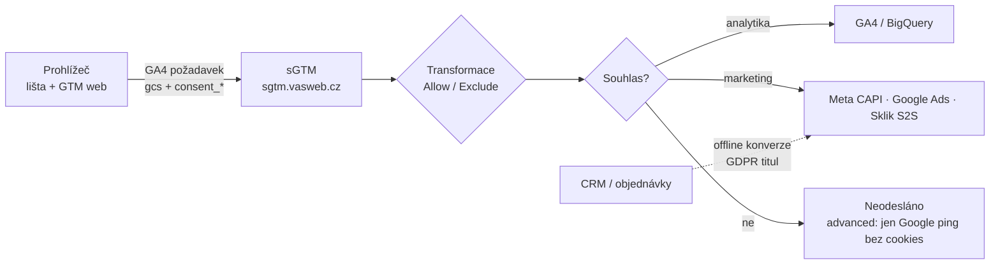
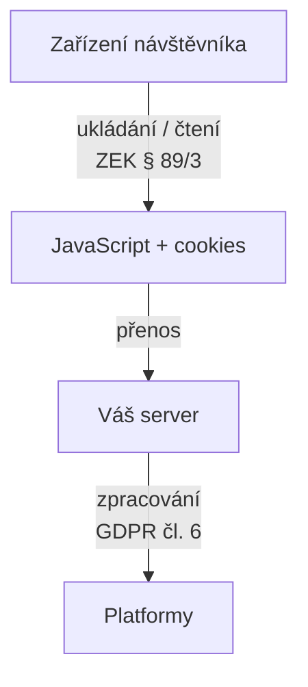

# A5: Je server-side tracking legální? Server-side a souhlas uživatele – brief
> Cluster: A. Consent & legislativa (most do clusteru B) · URL: /blog/server-side-tracking-a-souhlas · Formát: průvodce (právo + architektura + kód) · Priorita: měsíc 2 · Cílová LP: /sluzby/server-side-tracking · Rozsah finálního textu: 2 600–3 200 slov + 2 diagramy + 3 tabulky + kód

---

## 1. Meta

| Prvek | Návrh |
|---|---|
| H1 | Je server-side tracking legální? Server-side a souhlas |
| SEO title (58 zn.) | Server-side tracking a GDPR: je to legální? \| datalayer.cz |
| Meta description (150 zn.) | Server-side tracking nemění povinnost souhlasu. Jak předat consent do sGTM, proč nedělat fingerprinting a jak odstranit osobní údaje ještě na serveru. |
| URL | /blog/server-side-tracking-a-souhlas |

**Klíčová slova:**
- Hlavní (strategické, Ahrefs 0): `server side tracking gdpr`, `je server side tracking legální` (dotaz v SERP sadě: „je server side tracking legální gdpr“)
- Vedlejší: `server side tracking` (50 – hlavní KW pilíře B1, zde jen podpůrně), `first party data` (20), `cookieless tracking` / `cookieless conversion tracking` (30 – témata z `konverze-ads`), `fingerprinting`, `server side gtm consent`
- Otázky (PAA): „Is server-side tracking legal?“ (u „server side tracking“ i „server side gtm“), „What does server-side tracking do?“; obecné PAA k dotazu (Koho se GDPR týká? Kdo musí dodržovat GDPR?) – odpovědět jednou větou v H2 7.

**Záměr:** informační s rozhodovací složkou (firma zvažuje SST a slyšela, že „obejde lištu“ nebo „je GDPR-friendly“).

**Cílový čtenář:** marketingový/e-commerce manažer, který dostal nabídku server-side řešení; analytik, který sGTM implementuje; DPO / právník velké firmy, který posuzuje dodavatele. Segmenty: e-shop (Meta CAPI, Google Ads), B2B (CRM, offline konverze), velká firma (hosting v EU, smlouvy, záznamy o zpracování).

---

## 2. Analýza SERP a konkurence

**Google.cz 8. 10. 2026 – „je server side tracking legální gdpr“** (AI přehled ano): 1 datanostro.com (Je server-side tracking legální a GDPR-compliant?) · 2 taggrs.io · 3 iubenda.com · 4 khoder.cz · 5 stape.io · 6 reddit.com · 7 linkedin.com · 8 aimerce.ai · 9 petersutarik.com.

**Pozorování:**
- Česky rankují jen dva poskytovatelé SST (DataNostro, khoder.cz); zbytek jsou zahraniční vendoři. Vendoři mají přirozený zájem téma zjednodušit.
- Na českém trhu koexistují **správná** tvrzení („server-side neobchází souhlas“ – datanostro, blog gameplan.cz) i **rizikové** komunikace, které budeme (bez jmenování) vyvracet:
  - produktové stránky slibující, že server „blokovače ani zpřísněné cookies nezastaví“ bez zmínky o souhlasu;
  - FAQ server-side produktu, podle kterého se uživatel bez souhlasu identifikuje „parametry zařízení, rozlišením obrazovky a user agentem“, což „nejsou osobní údaje“ (= fingerprinting; ÚOOÚ výslovně řadí fingerprinting pod pravidla pro cookies);
  - blog tvrdící, že „pokud využijete jen statistická data, obejdete se bez souhlasu“;
  - tvrzení, že „ÚOOÚ potvrdil…“ bez odkazu.
- Nikdo česky neukazuje **jak technicky** předat souhlas do sGTM a zabránit tomu, aby se ne-Google tagy na serveru spouštěly na cookieless pingy z advanced Consent Mode.
- Chybí pohled „server jako filtr soukromí“ (transformace, minimalizace, logy) a povinnosti správce (čl. 28, 30 GDPR).

**Čím přeskočíme:** jasná odpověď + 3 právní vrstvy (ZEK, GDPR, podmínky platforem) + tabulka mýtů + kód pro sGTM + příklad „před/po“ transformace + šablona záznamu o zpracování.

---

## 3. Otázky, na které musí článek odpovědět

1. Je server-side tracking legální?
2. Potřebuji souhlas, když data jdou přes můj server a moji doménu?
3. Jsou first-party cookies nastavené serverem bez souhlasu v pořádku?
4. Může server-side měřit návštěvníky, kteří cookies odmítli?
5. Jak se v server-side GTM pozná, jestli návštěvník souhlasil?
6. Co se stane s cookieless pingy z advanced Consent Mode v sGTM?
7. Co je fingerprinting a proč ho nedělat?
8. Jak server-side pomáhá ochraně soukromí (co lze na serveru odstranit)?
9. Kdo je správce a kdo zpracovatel (hosting sGTM, Google, Meta)?
10. Jak vyřídit žádost o přístup nebo výmaz, když data tečou přes server?
11. Co zapsat do záznamu o činnostech zpracování?

---

## 4. Rychlá odpověď (hotový text, 57 slov)

> Server-side tracking je legální, ale nemění povinnost souhlasu. Data o návštěvníkovi stále sbírá JavaScript v jeho prohlížeči a cookies se ukládají do jeho zařízení – proto platí § 89 odst. 3 zákona o elektronických komunikacích i GDPR stejně jako u běžného měření. Výhoda serveru je jinde: kontrola nad tím, co a komu odejde.

---

## 5. Osnova s obsahem odpovědí

### H2 1: Co server-side tracking mění a co ne
**Klíčové sdělení:** Mění cestu dat, ne právní základ.

**Obsah:**
- Princip (1 odstavec + Diagram 1): prohlížeč → váš server (např. `sgtm.vasweb.cz`, server-side GTM) → GA4, Google Ads, Meta CAPI, Sklik. Proti klasickému měření jde z prohlížeče méně požadavků na cizí domény a server rozhoduje, co pošle dál (odkaz B1, B2).
- **Mění:** kdo vidí surová data (nejdřív vy), možnost data upravit a minimalizovat, odolnost proti ztrátám, kontrolu nad cookies (nastavené z HTTP hlavičky vaší domény).
- **Nemění:** že data vznikají v zařízení návštěvníka, že se tam ukládají identifikátory, že je předáváte třetím stranám → souhlas.
- Hotová věta: „Server-side je jako vlastní třídírna pošty. Dopisy pořád píše návštěvník – a bez jeho svolení je nesmíte otevírat, ať je třídíte kdekoli.“

### H2 2: Proč souhlas platí i pro server-side: tři vrstvy
**Obsah:**
1. **ZEK § 89 odst. 3 / ePrivacy čl. 5 odst. 3:** pravidlo se týká *ukládání* i *získávání přístupu* k údajům v koncovém zařízení. JavaScript, který na stránce sestaví událost a pošle ji na váš server, je podle EDPB (Pokyny 2/2023, v2.0, 7. 10. 2024) „získání přístupu“ – stejně jako pixel nebo dynamicky skládaný požadavek. Cookie nastavená ze serveru přes `Set-Cookie` se ukládá do zařízení stejně jako cookie z JavaScriptu. ÚOOÚ: pravidla platí i pro podobné technologie a fingerprinting (Q&A Cookies). Výjimka „technicky nezbytné“ se na analytiku a reklamu nevztahuje (A2).
2. **GDPR:** zpracování na serveru potřebuje právní titul (čl. 6) a předání údajů Metě či Googlu pro reklamu je v praxi založené na souhlasu; platí informační povinnost, minimalizace, doba uložení.
3. **Podmínky platforem:** Google EU User Consent Policy (signály souhlasu pro EHP – A1); Meta: odpovědnost za soulad s GDPR nese každá firma sama (developers.facebook.com/docs/meta-pixel/implementation/gdpr).
- **Server-to-server data (bez prohlížeče):** offline konverze z CRM, import objednávek – tady se ZEK obvykle neuplatní (nečte se zařízení), ale GDPR ano: právní titul, informování, souhlas pro reklamní účely podle podmínek platformy (odkaz E3). Formulovat opatrně.

### H2 3: Šest mýtů o server-side a souhlasu (tabulka T1 v kap. 6)

### H2 4: Jak předat stav souhlasu do server-side GTM
**Klíčové sdělení:** Google tagy na serveru souhlas respektují samy. Ostatní tagy musíte podmínit vy – a v advanced režimu to platí dvojnásob.

**Obsah:**
- **Oficiálně (developers.google.com/tag-platform/tag-manager/server-side/consent-mode):** Google tag přidává do HTTP požadavku na server kontejner parametry souhlasu; consent mode stačí nastavit ve webovém kontejneru; GA4 klient požadavek interpretuje. Google Ads konverze při `ad_storage: denied` nečte ani nezapisuje cookies (vyžaduje Conversion Linker na serveru); remarketing a Floodlight při `ad_storage: denied` blokují požadavky i cookies.
- **Scénář A – basic Consent Mode:** GA4 tag se bez souhlasu nespustí → do sGTM nic nepřijde → serverové tagy se spouštějí jen na událostech se souhlasem. Jednoduché, ale i tak doporučujeme explicitní podmínky (obrana proti chybě v budoucnu).
- **Scénář B – advanced Consent Mode:** do sGTM chodí i **cookieless pingy** (`gcs=G100`). Google tagy na serveru se zachovají správně, ale **Meta CAPI, Sklik S2S, TikTok, LinkedIn nebo vlastní zápis do BigQuery se spustí na všem, co přijde**, pokud jim nedáte podmínku → odešlou data lidí, kteří souhlas nedali. Nejčastější a nejzávažnější chyba v server-side implementacích, kterou nacházíme `[DOPLNIT: potvrdit z auditů]`.
- **Dva způsoby, jak souhlas na serveru poznat (Kód 1–2):**
  1. **Explicitní parametry** (doporučeno – čitelné, auditovatelné): webový GTM přidá do každé GA4 události `consent_analytics` a `consent_marketing` (hodnoty z dataLayer událostí lišty). Serverové spouštěče je kontrolují.
  2. **Čtení stavu z GA4 požadavku** (parametr `gcs` v event data) – vlastní proměnná v sGTM; název klíče ověřte v náhledu sGTM.
- **Vlastní endpointy / Data client:** stav souhlasu posílat v payloadu vždy; Seznam S2S: klíč `consent_string` (TCF, má přednost) nebo `consent_mode` v JSON (napoveda.sklik.cz – SEM consent management).
- **Deduplikace a `event_id`** u Meta (pixel + CAPI) – jen odkaz na B5; připomenout, že pixel i CAPI se pro uživatele bez souhlasu nespouštějí.

**Kód 1 – webový GTM: parametry souhlasu u GA4 událostí (nastavení Google tagu / GA4 Event)**
```text
Google tag (GA4) › Nastavení konfigurace › Parametry, které se odesílají se všemi událostmi:
  consent_analytics   =  {{DLV – consent_analytics}}     // true / false z dataLayer
  consent_marketing   =  {{DLV – consent_marketing}}     // true / false z dataLayer
  server_container_url = https://sgtm.vasweb.cz           // transport do sGTM

Proměnné typu „Proměnná vrstvy dat“ (verze 2) čtou poslední hodnotu z událostí
cookie_consent_loaded (opakovaná návštěva) a consent_update (nová volba) – viz A1, Kód 2.
Výchozí hodnota proměnné: false (chybí-li údaj, bereme jako nesouhlas).
```

**Kód 2 – server GTM: proměnná „Marketing consent“ (vlastní šablona proměnné, sandboxed JS)**
```js
const getEventData = require('getEventData');

// 1) Explicitní parametr z webového kontejneru (preferovaný)
const explicit = getEventData('consent_marketing');
if (explicit === true || explicit === 'true') return true;
if (explicit === false || explicit === 'false') return false;

// 2) Záloha: stav z GA4 požadavku (gcs = 'G1' + ad_storage + analytics_storage)
//    Název klíče v event data OVĚŘTE v náhledu sGTM (např. 'x-ga-gcs').
const gcs = getEventData('x-ga-gcs');
if (typeof gcs === 'string' && gcs.length >= 4) {
  return gcs.charAt(2) === '1';
}
return false;   // neznámý stav = nesouhlas
```
**Spouštěč v sGTM pro Meta CAPI:** Vlastní › Název klienta = GA4 **a** Název události = `purchase` (resp. `generate_lead`) **a** `{{Marketing consent}}` = `true`. Obdobně proměnná „Analytics consent“ pro zápis do BigQuery a ne-Google analytiku.

### H2 5: Fingerprinting: co to je a proč ho nedělat
**Klíčové sdělení:** Identifikace bez cookies podle vlastností zařízení není „anonymní měření“. Je to přístup k zařízení a obvykle zpracování osobních údajů – bez souhlasu ho nedělejte.

**Obsah:**
- **Definice (hotový text):** fingerprinting (digitální otisk) skládá identifikátor z vlastností prohlížeče a zařízení – user agent, rozlišení obrazovky, jazyk, časové pásmo, fonty, vykreslení canvas/WebGL, často v kombinaci s IP adresou. Výsledek funguje jako cookie, kterou návštěvník nemůže smazat.
- **Právo:**
  - ÚOOÚ (Q&A Cookies): podmínky pro cookies platí „včetně digitálních otisků prohlížečů (tzv. fingerprinting)“.
  - WP29 stanovisko 9/2014: fingerprinting spadá pod čl. 5 odst. 3 ePrivacy (připomíná EDPB v Pokynech 2/2023).
  - EDPB 2/2023: i sledování jen podle IP adresy může spadat pod čl. 5 odst. 3, pokud IP pochází ze zařízení uživatele.
  - GDPR recitál 30: online identifikátory umožňují vytvořit profil a identifikovat osobu → tvrzení „nejde o osobní údaje, protože nelze dohledat jméno“ neobstojí; identifikovatelnost nevyžaduje jméno.
- **Technika:** Safari 26 brání známým fingerprintingovým skriptům spolehlivě číst API odhalující vlastnosti zařízení a zakazuje jim dlouhodobé úložiště (webkit.org, WebKit Features in Safari 26.0); Firefox v režimu Standard blokuje „fingerprinters“ (support.mozilla.org). Fingerprint je tedy i nespolehlivý.
- **Google a fingerprinting:** Google od 16. 2. 2025 přestal ve svých zásadách pro reklamní platformy fingerprinting zakazovat; britský ICO to v prosinci 2024 označil za nezodpovědné a připomněl, že zákonné povinnosti trvají (ico.org.uk, 12/2024). Změna zásad Googlu nemění ZEK ani GDPR.
- **Hotová věta pro obchod:** „Pokud vám dodavatel slibuje měření ‚všech‘ návštěvníků bez souhlasu, zeptejte se, jak uživatele rozlišuje. Odpověď ‚podle zařízení a user agentu‘ znamená fingerprinting.“

### H2 6: Server jako filtr soukromí: co můžete odstranit dřív, než data odejdou
**Klíčové sdělení:** Tady je skutečný přínos server-side pro GDPR: minimalizace na jednom místě.

**Obsah:**
- **Transformace v sGTM** (developers.google.com/tag-platform/tag-manager/server-side/transformations): *Allow parameters* (pošle jen vyjmenované – ostatní zahodí), *Augment event* (upraví/přidá hodnoty), *Exclude parameters* (odstraní vyjmenované). Lze cílit na všechny tagy, typ tagu nebo konkrétní tag; pořadí Allow → Augment → Exclude. Google sám uvádí příklady: Allow pro zápis do BigQuery, aby se citlivé údaje nelogovaly; Exclude pro odstranění vlastních dimenzí při `analytics_storage: denied`.
- **Co typicky odstraňovat / upravovat (tabulka T2 v kap. 6):** e-maily a tokeny v URL; přesná IP pro nástroje, které ji nepotřebují (zkrátit nebo vynechat); detailní user agent; hashované kontakty u tagů bez souhlasu; vlastní parametry s interními údaji.
- **Ukázka před/po (Kód 3, fiktivní data).**
- **Logy serveru:** Cloud Run/hosting loguje požadavky včetně URL a IP → nastavit vyloučení nebo zkrácenou retenci logů (`[OVĚŘIT výchozí retenci Cloud Logging pro výchozí bucket]`), přístupová práva.
- **Lokalita:** hosting sGTM v EU (region Google Cloud v EU, nebo poskytovatel s EU hostingem a DPA).
- Pozn.: Meta CAPI potřebuje skutečnou IP a user agent pro párování (A3, T2) – rozhodnout podle účelu; minimalizace ≠ posílat vše všem.

**Kód 3 – příklad transformace (fiktivní data):**
```json
// Událost, která přišla do sGTM (GA4 klient)
{
  "event_name": "purchase",
  "page_location": "https://eshop.cz/dekujeme?order=1042&email=jan%40example.com",
  "ip_override": "203.0.113.57",
  "user_agent": "Mozilla/5.0 (iPhone; CPU iPhone OS 18_0 like Mac OS X) ...",
  "consent_marketing": true,
  "value": 1290, "currency": "CZK", "transaction_id": "1042",
  "user_data": { "sha256_email_address": "a1b2…(64 znaků)" }
}

// Po transformaci pro GA4 a BigQuery (Allow + Augment)
{
  "event_name": "purchase",
  "page_location": "https://eshop.cz/dekujeme?order=1042&email=REDACTED_EMAIL",
  "value": 1290, "currency": "CZK", "transaction_id": "1042"
}

// Pro Meta CAPI (jen protože consent_marketing = true)
{
  "event_name": "Purchase", "event_id": "1042",
  "user_data": { "em": ["a1b2…"], "client_ip_address": "203.0.113.57",
                 "client_user_agent": "Mozilla/5.0 ...", "fbp": "fb.1.1759…" },
  "custom_data": { "value": 1290, "currency": "CZK" }
}
```
*Názvy klíčů event data (`ip_override`, `user_agent`) ověřit v náhledu sGTM.*

### H2 7: Kdo je správce a kdo zpracovatel
**Obsah (opatrně, bez právních závěrů pro konkrétní případ):**
- **Vy (provozovatel webu):** správce – určujete účel a prostředky měření.
- **Hosting sGTM** (Google Cloud, Stape, DataNostro, jiný poskytovatel): typicky **zpracovatel** → smlouva o zpracování (čl. 28 GDPR), seznam subzpracovatelů, lokalita dat, bezpečnost.
- **Google (GA4):** zpracovatel podle Google Ads Data Processing Terms; u některých reklamních funkcí vystupuje jako samostatný správce (A3, ověřit).
- **Meta, Sklik, další reklamní platformy:** podle jejich podmínek často samostatní nebo společní správci (u vložených pluginů viz SDEU Fashion ID – ověřit).
- Odpověď na PAA: „GDPR se týká každého, kdo zpracovává osobní údaje osob v EU – i malého e-shopu s jednou analytickou službou.“

### H2 8: Práva subjektů údajů v server-side architektuře
**Obsah:**
- sGTM sám data obvykle neukládá (kromě logů) – data leží v cílových systémech: GA4, BigQuery, CRM, reklamní platformy.
- **Mapa dat** (tabulka T3 – kde je co a jak vyřídit přístup/výmaz): GA4 (mazání dat uživatele podle identifikátoru – `[OVĚŘIT postup v UI/API]`), BigQuery (`DELETE … WHERE user_id = …`), CRM, logy sGTM (retence), Meta/Google Ads (podle nástrojů platformy; proto minimalizovat před odesláním).
- Námitka / odvolání souhlasu: lišta pošle `update` → na serveru se další události nepředávají (Kód 2).
- Proces: kdo žádost přijímá, lhůta 1 měsíc (čl. 12 odst. 3 GDPR), identifikace žadatele (u pseudonymních ID často nelze spárovat – zdokumentovat).

### H2 9: Záznam o činnostech zpracování a dokumentace
**Obsah:**
- Čl. 30 GDPR – co zapsat pro měření přes server (Tabulka T4 – vzor, kompletní).
- Posouzení vlivu (DPIA, čl. 35) zvážit u rozsáhlého profilování nebo kombinace dat z více zdrojů (CRM + web + reklama) – rozhodne DPO.
- Dokumentace implementace: seznam tagů a podmínek souhlasu, transformace, hosting, verze kontejnerů (odkaz C4).

### H2 10: Checklist (12 bodů, hotový text)
1. Lišta a Consent Mode na webu fungují (A1). 2. Serverové tagy mají podmínku souhlasu (Kód 2). 3. Advanced pingy nespouštějí ne-Google tagy. 4. Žádný fingerprinting ani „identifikace podle zařízení“. 5. Transformace: redakce URL, minimalizace IP/UA. 6. Hashované údaje jen se souhlasem. 7. Hosting v EU + DPA. 8. Logy: retence a přístup. 9. Mapa dat pro žádosti subjektů. 10. Záznam o činnostech zpracování. 11. Informace v zásadách (příjemci, server, třetí země). 12. Test: odmítnutí → v náhledu sGTM žádný odchozí požadavek na Meta/Sklik.

---

## 6. Vizuály

### Diagram 1: Server-side s „branou souhlasu“ (H2 1 + H2 4)

**Finální SVG:** navazuje na hero (uzly s glow, přerušované animované spojnice, monospace štítky `gcs=G111`, `consent_marketing=true`). Brána souhlasu jako piktogram Consent (přepínač se zámkem) na serveru. Větev „ne“ končí šedým přeškrtnutým uzlem. Mobil: svisle. Alt: „Server-side měření s kontrolou souhlasu a transformacemi před odesláním do reklamních platforem“.

### Diagram 2: Kde vzniká povinnost (H2 2)

**Finální SVG:** tři vodorovné pásy (Zařízení / Server / Platformy) s popisky zákonů v monospace štítcích; zdůraznit, že první pás je stejný pro client-side i server-side (dvě šipky „client-side“ a „server-side“ vycházejí ze stejného zařízení).

### Tabulka T1: Mýty
| Mýtus | Realita | Zdroj |
|---|---|---|
| „Server-side obejde cookie lištu.“ | Data stále sbírá JavaScript v zařízení a ukládá cookies → souhlas podle ZEK. | ZEK § 89/3; EDPB 2/2023 |
| „First-party cookies ze serveru nepotřebují souhlas.“ | Rozhoduje účel, ne kdo cookie nastavil; analytika a reklama nejsou nezbytné. | ÚOOÚ Q&A |
| „Bez cookies = bez souhlasu.“ | Přístup k zařízení (pixel, JS, fingerprint) spadá pod stejné pravidlo. | ÚOOÚ Q&A; EDPB 2/2023 |
| „Identifikace podle zařízení a user agentu není osobní údaj.“ | Online identifikátor umožňující rozlišit osobu je osobní údaj; fingerprinting výslovně potřebuje souhlas. | GDPR rec. 30; ÚOOÚ |
| „Statistická data můžete server-side posílat bez souhlasu.“ | Ne, pokud vznikají přístupem k zařízení; výjimku pro měření návštěvnosti ZEK ani ÚOOÚ nezná (Omnibus je jen návrh). | ZEK; A2 |
| „Server-side je automaticky v souladu s GDPR.“ | Je to nástroj; soulad závisí na podmínkách souhlasu, minimalizaci, smlouvách a dokumentaci. | GDPR čl. 5, 24 |

### Tabulka T2: Co na serveru odstranit nebo upravit
| Údaj | Pro GA4 / BigQuery | Pro reklamní platformy | Poznámka |
|---|---|---|---|
| E-mail / token v URL | redigovat | redigovat | Kód 3, A3 |
| IP adresa | GA4 ji v EU neukládá; do BigQuery neukládat | Meta CAPI ji využívá k párování – jen se souhlasem | rozhodnout podle účelu |
| User agent | zkrátit / nelogovat | Meta CAPI povinný pro webové události | jen se souhlasem |
| Hashované kontakty | neposílat | jen se souhlasem `ad_user_data` | A3 |
| Interní parametry (marže, ID skladu) | podle potřeby | neposílat (nebo jen hodnotu zisku dle strategie) | business data |
| Události bez souhlasu (advanced pingy) | Google tagy řeší samy | **nespouštět** | Kód 2 |

### Tabulka T3: Mapa dat pro žádosti subjektů
| Systém | Identifikátor | Přístup / výmaz | Retence |
|---|---|---|---|
| GA4 | client_id, user_id | mazání dat uživatele (ověřit postup) | 2 / 14 měsíců (nastavení) |
| BigQuery (export GA4, vlastní tabulky) | user_pseudo_id, user_id | SQL dotaz / DELETE | dle politiky |
| sGTM logy (hosting) | IP, URL | retence logů | dle nastavení hostingu |
| CRM | e-mail, telefon | standardní proces | dle smlouvy/účelu |
| Meta / Google Ads | hash, fbp, gclid | nástroje platformy | dle podmínek platformy |

### Tabulka T4: Vzor záznamu o činnosti zpracování – „Měření webu a reklamy (server-side)“
| Položka čl. 30 | Vzorová hodnota (k úpravě) |
|---|---|
| Správce, kontakt, DPO | [název firmy], [kontakt], [DPO je-li] |
| Účel | měření návštěvnosti a konverzí; měření a optimalizace reklamy |
| Kategorie subjektů | návštěvníci webu, zákazníci |
| Kategorie údajů | online identifikátory (client_id, user_id, gclid, fbp), údaje o chování, údaje o objednávce, hashované kontaktní údaje (jen se souhlasem) |
| Příjemci | hosting sGTM [poskytovatel], Google (GA4, Ads), Meta, Seznam |
| Předání do třetích zemí | USA – EU-US Data Privacy Framework / SCC [ověřit u každého příjemce] |
| Lhůty pro výmaz | GA4 [2/14 měs.], BigQuery [X], logy [X dní], CRM [X] |
| Technická a organizační opatření | souhlas a Consent Mode, transformace a redakce, hosting v EU, řízení přístupů, šifrování přenosu, dokumentace kontejnerů |

---

## 7. Fakta a zdroje

| Tvrzení | Zdroj | Ověřeno | Riziko zastarání |
|---|---|---|---|
| § 89 odst. 3 ZEK – ukládání i přístup, výjimky | https://www.zakonyprolidi.cz/cs/2005-127 | 10/2026 | nízké |
| ÚOOÚ: pravidla i pro podobné technologie a fingerprinting; technické cookies jen pro provoz | https://uoou.gov.cz/verejnost/qa-otazky-a-odpovedi/cookies | 10/2026 | nízké |
| EDPB 2/2023 v2.0 – pixel/JS = „gaining access“; IP-only tracking; WP29 9/2014 fingerprinting | https://edpb.europa.eu/system/files/2024-10/edpb_guidelines_202302_technical_scope_art_53_eprivacydirective_v2_en_0.pdf | 10/2026 | nízké |
| sGTM: consent parametry v HTTP požadavku, stačí web kontejner; chování Google tagů | https://developers.google.com/tag-platform/tag-manager/server-side/consent-mode | 10/2026 | střední |
| sGTM transformace Allow/Augment/Exclude, pořadí, příklady | https://developers.google.com/tag-platform/tag-manager/server-side/transformations | 10/2026 | nízké |
| Advanced Consent Mode posílá cookieless pingy | https://developers.google.com/tag-platform/security/concepts/consent-mode | 10/2026 | střední |
| Seznam S2S: `consent_string` má přednost, alternativa `consent_mode` | https://napoveda.sklik.cz/en/tracking-scripts/seznam-event-measurement-sem/configuration-sem/consent-management/ | 10/2026 | střední |
| Meta: odpovědnost za GDPR nese firma | https://developers.facebook.com/docs/meta-pixel/implementation/gdpr | 10/2026 | nízké |
| Safari 26: omezení známých fingerprintingových skriptů | https://webkit.org/blog/17333/webkit-features-in-safari-26-0/ | 10/2026 | střední |
| Firefox Standard blokuje fingerprinters | https://support.mozilla.org/en-US/kb/enhanced-tracking-protection-firefox-desktop | 10/2026 | střední |
| ICO k změně zásad Googlu o fingerprintingu (12/2024); účinnost změny 16. 2. 2025 | https://ico.org.uk/about-the-ico/media-centre/news-and-blogs/2024/12/our-response-to-google-s-policy-change-on-fingerprinting | 10/2026 (URL nalezena, text neprocházen) | nízké |
| GDPR čl. 5, 6, 12, 28, 30, 35; recitál 30 | https://eur-lex.europa.eu/eli/reg/2016/679/oj | 10/2026 | nízké |
| Klíče event data v sGTM (`x-ga-gcs`, `ip_override`, `user_agent`) | náhled sGTM | **ověřit při implementaci** | střední |
| Výchozí retence Cloud Logging | cloud.google.com/logging | **ověřit** | střední |

---

## 8. Interní odkazy a CTA

**Cílová LP:** /sluzby/server-side-tracking

**CTA box (za H2 4 – po kódu):**
- Nadpis: **Server-side, který respektuje souhlas – a umíte to doložit**
- Text: Postavíme sGTM na vaší doméně a ve vašem Google Cloudu v EU, nastavíme podmínky souhlasu pro každý serverový tag a transformace, které odstraní osobní údaje dřív, než odejdou. Dostanete dokumentaci pro DPO.
- Tlačítko: `[ Konzultovat server-side ]` → /sluzby/server-side-tracking (`cta_id: blog_a5_box`)

**Související články:** B1 Server-side tracking – průvodce (/blog/server-side-tracking-pruvodce), B2 Propojení client-side a server-side (/blog/propojeni-client-side-a-server-side), B3 Kde provozovat sGTM (/blog/hosting-server-side-gtm), B5 Meta CAPI (/blog/meta-conversions-api), B6 Seznam Event Measurement (/blog/seznam-event-measurement-sklik), A1 Consent Mode v2, A2 Cookies a zákon, A3 Osobní údaje v analytice, A7 Cookies třetích stran, E3 Offline konverze z CRM.

**Slovník:** /slovnik/server-side-tagging, /slovnik/first-party-cookie, /slovnik/cookieless-ping, /slovnik/conversions-api, /slovnik/consent-mode.

**Další LP:** /sluzby/cookie-lista-consent-mode, /reseni/velke-firmy (governance).

**Zkrácený kontaktní blok:** `form_id: blog`, předvybraná témata **Server-side** + **Cookie lišta & consent**, H2 „Řešíte totéž u sebe?“, placeholder „Napište, na čem jste se zasekli… (např. dodavatel slibuje měření bez souhlasu)“.

---

## 9. FAQ pro schema (FAQPage)

**Je server-side tracking legální?**
Ano, server-side tracking je legální technika. Nemění ale povinnost získat souhlas: data o návštěvníkovi stále sbírá JavaScript v jeho prohlížeči a cookies se ukládají do jeho zařízení, takže platí § 89 odst. 3 zákona o elektronických komunikacích i GDPR. Server vám pomůže hlavně s kontrolou a minimalizací dat.

**Potřebuji cookie lištu, když měřím přes server-side GTM?**
Ano. Pokud měříte analytiku nebo reklamu, potřebujete souhlas bez ohledu na to, zda data jdou přímo do Googlu, nebo přes váš server. Lišta a Consent Mode musí na webu fungovat stejně jako u klasického měření a serverové tagy musí stav souhlasu respektovat.

**Může server-side měřit návštěvníky, kteří odmítli cookies?**
Ne tak, aby je identifikoval nebo předával jejich data reklamním platformám. V režimu advanced Consent Mode mohou Google tagy posílat pingy bez cookies pro modelování; ostatní serverové tagy, například Meta CAPI, se pro tyto návštěvníky spouštět nesmí. Identifikace podle vlastností zařízení je fingerprinting.

**Co je fingerprinting a je legální?**
Fingerprinting skládá identifikátor z vlastností prohlížeče a zařízení, jako je user agent, rozlišení nebo fonty. ÚOOÚ uvádí, že pravidla pro cookies platí i pro digitální otisky prohlížečů, takže bez souhlasu ho používat nelze. Safari i Firefox navíc známé fingerprintingové skripty omezují.

**Jak sGTM pozná, jestli návštěvník souhlasil?**
Google tag posílá stav souhlasu v požadavku do server kontejneru a Google tagy na serveru ho respektují automaticky. Pro ostatní tagy doporučujeme posílat z webového GTM explicitní parametry, například consent_marketing, a podle nich v sGTM podmínit spouštěče. Neznámý stav vyhodnocujte jako nesouhlas.

---

## 10. Poznámky pro autora

- **Nejmenovat konkurenty** ani produkty v sekci mýtů; formulovat obecně („na trhu se objevuje tvrzení…“). Riziko sporu – tvrzení o fingerprintingu opírat výhradně o ÚOOÚ, EDPB a GDPR.
- **Právní revize** (H2 2, H2 5, H2 7) – `[DOPLNIT: advokát/DPO]`; disclaimer na konci: „nejde o právní radu“.
- **Zakázané formulace:** „obcházení blokátorů“, „100 % dat“, „GDPR compliant zaručeně“. Používat „odolnější first-party měření, vždy v souladu se souhlasem“.
- **Ověřit při implementaci (a do článku dát jen ověřené):** klíče event data v sGTM (`x-ga-gcs`, `ip_override`, `user_agent`); retence logů Cloud Run/Cloud Logging; postup mazání uživatele v GA4.
- **Nejisté:** text stanoviska ICO (URL nalezena, obsah neprocházen); role Googlu jako správce u některých reklamních funkcí; Fashion ID.
- **Klient dodá:** reálný (anonymizovaný) příklad z auditu „Meta CAPI se spouštěla na cookieless pingy“ – jen pokud existuje; screenshot náhledu sGTM s podmínkou souhlasu (fiktivní data).
- **Doporučený autor:** Vít Novotný; recenze: advokát/DPO.
