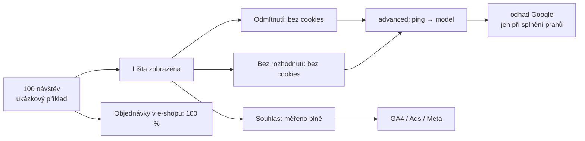

# A6: Co se stane s daty, když návštěvník odmítne cookies – brief
> Cluster: A. Consent & legislativa · URL: /blog/odmitnuti-cookies-dopad-na-data · Formát: vysvětlení + praktický návod (měření consent rate) · Priorita: měsíc 3 · Cílová LP: /sluzby/cookie-lista-consent-mode (sekundárně /sluzby/audit-mereni) · Rozsah finálního textu: 2 300–2 900 slov + matice + kód + SQL

---

## 1. Meta

| Prvek | Návrh |
|---|---|
| H1 | Co se stane s daty, když návštěvník odmítne cookies |
| SEO title (58 zn.) | Odmítnuté cookies: dopad na GA4, Ads a Meta \| datalayer.cz |
| Meta description (144 zn.) | Co uvidíte v GA4, Google Ads, Meta a Skliku, když návštěvník odmítne cookies. Jak měřit consent rate a jak číst propady dat bez zbytečné paniky. |
| URL | /blog/odmitnuti-cookies-dopad-na-data |

**Klíčová slova:**
- Hlavní (PAA otázka): `co se stane když odmítnu cookies` – v „Lidé se také ptají“ u dotazů *cookie lišta*, *cookie lišta gdpr zákon* a *cookies třetích stran konec* (`google_paa.tsv`)
- Vedlejší: `odmítnutí cookies` (0), `consent rate` (0), `cookies google analytics` (150), `google analytics cookies` (100, KD 83 – jen podpůrně), `analytické cookies` (20), `marketingové cookies` (20)
- Další otázky (PAA): „Should I accept cookies or not?“, „Jsou cookies povinné?“, „Co se stane, když smažu cookies?“ → krátký box pro návštěvníky.

**Záměr:** informační – dvě skupiny: (1) provozovatel webu, který vidí propad dat; (2) návštěvník, který se ptá, co odmítnutí znamená (zachytit krátkým boxem, protože PAA je formulováno z jeho pohledu).

**Cílový čtenář:** marketingový manažer / majitel e-shopu, kterému po nasazení lišty „zmizela“ část návštěv a konverzí; analytik, který má vysvětlit rozdíl GA4 vs. tržby vedení. Segmenty: e-shop (Google Ads, Meta), B2B (leady – menší objemy, prahy modelování), velká firma (reporting, consent rate jako KPI).

---

## 2. Analýza SERP a konkurence

- Dotaz není v SERP sadě jako samostatný; PAA otázka se ale opakuje u tří sledovaných dotazů → Google ji považuje za klíčovou pro téma cookies.
- Odpovědi v SERP (z pohledu návštěvníka) jsou obecné („web bude fungovat, reklamy nebudou personalizované“). **Z pohledu provozovatele** česky nikdo systematicky neukazuje, co se stane v jednotlivých nástrojích v režimu basic/advanced.
- Consent rate: digitalniarchitekti.cz má článek „Měření souhlasů prostřednictvím Consent Rate“ (metodika přes Measurement Protocol do samostatné GA4 property, výsledky jen v obrázcích, bez čísel); marketingppc.cz „Jak zvýšit míru souhlasu s cookies o 70 %?“ (marketingový slib); consentio.cz uvádí „consent rate v EU 30–50 %“ bez zdroje; mediaguru.cz (01/2023) publikoval průzkum (viz H2 3).
- **Co chybí:** matice nástroj × režim; ověřená čísla (Google: 2–5×, prahy modelování); upozornění, že consent rate **nelze spočítat v GA4** (vidíte jen souhlasící); metodika s kódem a SQL; diagnostika propadů.

**Čím přeskočíme:** matice 6 nástrojů × 3 stavy, definice metrik (consent rate, reject rate, no-decision rate), kód + SQL, tabulka „symptom → příčina → ověření“, box pro návštěvníky (PAA).

---

## 3. Otázky, na které musí článek odpovědět

1. Co se technicky stane, když návštěvník klikne na „Odmítnout vše“?
2. Uvidím takového návštěvníka v GA4? A v Google Ads, Meta a Skliku?
3. Jaký je rozdíl mezi basic a advanced Consent Mode z pohledu dat?
4. Co je modelování a kolik dat „vrátí“?
5. Kolik lidí v Česku cookies přijímá?
6. Jak správně měřit consent rate (a proč ne v GA4)?
7. Proč mi po nasazení lišty klesly konverze v Google Ads / Meta?
8. Jak poznat, jestli je propad „legitimní“ (odmítnutí) nebo chyba implementace?
9. Co dělat, aby rozhodování nestálo na neúplných datech?
10. (Návštěvník) Co se stane, když cookies odmítnu? Bude web fungovat?

---

## 4. Rychlá odpověď (hotový text, 58 slov)

> Když návštěvník odmítne cookies, analytické a reklamní nástroje ho nesmí sledovat: GA4, Meta ani Sklik o něm nedostanou běžná data a nevznikne remarketing. S Consent Mode v režimu advanced posílají Google tagy pingy bez cookies, ze kterých Google odhaduje chybějící konverze. Objednávky v e-shopu zůstávají úplné – rozdíl proti analytice je očekávaný a dá se měřit.

---

## 5. Osnova s obsahem odpovědí

### H2 1: Co se stane po kliknutí na „Odmítnout vše“ (technicky)
**Obsah (krok za krokem, hotový text):**
1. Lišta uloží volbu (cookie s rozhodnutím – technicky nezbytná) a pošle `gtag('consent','update', …denied)` + událost do dataLayer (A1, Kód 2).
2. Google tagy nečtou ani nezapisují analytické a reklamní cookies; v režimu basic se vůbec nenačtou, v advanced posílají pingy bez cookies.
3. Ne-Google tagy (Meta Pixel, Sklik, Clarity) se nespustí – pokud je GTM správně nastavený.
4. Server-side tagy pro tohoto návštěvníka nic nepředávají (A5).
5. Web funguje stejně (ÚOOÚ: přístup nesmí být podmíněn souhlasem). Lišta by se neměla znovu ptát dříve než za 6 měsíců (ÚOOÚ), pokud se zpracování výrazně nezmění nebo si návštěvník nesmaže cookies.

### H2 2: Co uvidíte v jednotlivých nástrojích (matice)
**Klíčové sdělení:** Každý nástroj reaguje jinak. Google modeluje, ostatní většinou ne.

**Obsah:** Tabulka T1 (kap. 6) + komentář:
- **GA4:** basic → o návštěvníkovi nic. Advanced → pingy bez cookies; v přehledech se odhad (behaviorální modelování) objeví jen při splnění prahů a identitě **Blended**: ≥ 1 000 událostí denně s `analytics_storage=denied` alespoň 7 dní a ≥ 1 000 denních uživatelů se souhlasem v 7 z 28 dní; modelování se nepromítá do exportu BigQuery, publik, průzkumníka uživatelů a některých průzkumů (support.google.com/analytics/answer/11161109). Export BigQuery obsahuje pole `privacy_info.analytics_storage`, `ads_storage`, `uses_transient_token` (support.google.com/analytics/answer/7029846) – zda a jak se v exportu objevují pingy bez souhlasu, ověřte na vlastních datech.
- **Google Ads:** konverze bez souhlasu nejsou pozorované; modelování konverzí při ≥ 700 proklicích za 7 dní na zemi a skupinu domén; basic = obecný model, advanced = model inzerenta; modelované konverze jsou přímo ve sloupci „Konverze“ (support.google.com/google-ads/answer/10548233, 10000067). Remarketingová publika neobsahují návštěvníky s `ad_personalization: denied`; rozšířené konverze se bez `ad_user_data` neposílají.
- **Meta:** pixel se nenačte (nebo je `revoke`), CAPI se pro návštěvníka nespouští → Meta událost nevidí. Veřejně dokumentovanou obdobu modelování z Consent Mode Meta pro tento případ nemá `[OVĚŘIT před publikací – neuvádět, že Meta „nic nemodeluje“, ale že pro nesouhlasící nedostává data]`.
- **Sklik / Seznam:** SEM – bez `ad_storage` nefungují cookies `sid`/`udid`, bez `ad_personalization` retargeting (napoveda.sklik.cz). U starších kódů s parametrem `consent=0` Seznam uvádí, že konverzní kódy použije anonymně k modelování konverzí; text zároveň říká, že kód bez hodnoty 1 se nezpracuje – formulace je nejednoznačná (blog.seznam.cz, 07/2024) → v článku uvést obě věty a doporučit SEM (B6).
- **Heatmapy a session recording** (Clarity, Hotjar): nic.
- **Administrace e-shopu / CRM:** objednávky a poptávky kompletní → **jediný úplný zdroj** pro tržby a počty konverzí (D2).

### H2 3: Kolik lidí v Česku cookies přijímá?
**Klíčové sdělení:** Spolehlivé veřejné měřené benchmarky pro ČR nejsou. Nejlepší číslo je to vaše.

**Obsah:**
- **Jediný ověřený veřejný zdroj pro ČR:** průzkum agentury Ressolution s Nielsen Admosphere pro MediaGuru.cz (online dotazování CAWI, 512 respondentů 15+, 13.–19. 12. 2022, publikováno 17. 1. 2023): podle **vlastního vyjádření** respondentů přijímá všechny cookies **asi 40 %**, všechny odmítá **23 %**, jen některé **27 %**; 63 % lidí lišty obtěžují. Jde o deklarované chování, ne o měření na webech – skutečná míra se liší podle designu lišty, oboru, zařízení a zdroje návštěvy.
- **Google (obecně, ne ČR):** uživatelé se souhlasem konvertují typicky **2–5× častěji** než bez souhlasu → podíl „ztracených“ konverzí je menší než podíl odmítnutí (10548233).
- **Vlastní data klienta:** `[DOPLNIT: medián a rozpětí consent rate z projektů datalayer.cz – podle typu webu (e-shop/B2B), zařízení a prohlížeče; uvést počet webů, období a definici metriky. Bez těchto dat sekci ponechat jen s průzkumem a výzvou „změřte si vlastní“.]`
- **Neuvádět** čísla typu „consent rate v EU 30–50 %“ nebo „+70 % souhlasů“ bez primárního zdroje.

### H2 4: Jak měřit consent rate správně
**Klíčové sdělení:** Consent rate nespočítáte v GA4 – GA4 vidí hlavně ty, kdo souhlasili. Potřebujete počítadlo mimo analytiku, bez identifikátorů.

**Definice metrik (hotový text + tabulka T2):**
- **Zobrazení lišty** – první zobrazení bez uložené volby.
- **Interaction rate** = rozhodnutí / zobrazení.
- **Consent rate (analytika)** = rozhodnutí s analytikou / zobrazení; obdobně **marketing**.
- **Reject rate** = „Odmítnout vše“ / zobrazení.
- **No-decision rate** = 1 − interaction rate (lidé, kteří odešli bez volby – i ti jsou „bez souhlasu“).
- Doporučení: reportovat podle zařízení a prohlížeče (Safari – opakované zobrazení kvůli 7denní cookie, A7).

**Tři způsoby měření:**
1. **Statistiky CMP** (Cookiebot, Usercentrics, Cookies správně, Consentio mají přehledy) – nejjednodušší; ověřte definici jmenovatele.
2. **Vlastní agregované počítadlo** (doporučeno pro vlastní lištu a velké firmy): lišta posílá na váš endpoint (nebo sGTM) dvě události – zobrazení a rozhodnutí – **bez identifikátorů, bez IP v úložišti**, jen datum, typ rozhodnutí, kategorie, typ zařízení a prohlížeče. Kód 1 + SQL (Kód 2).
3. **GA4 – jen jako doplněk:** událost `consent_update` v GA4 uvidíte převážně u souhlasících → nevhodné pro consent rate; samostatná GA4 property přes Measurement Protocol (metoda z českého trhu) vyžaduje stejnou právní úvahu jako jakékoli měření bez souhlasu → **konzultovat**.
- **Právní poznámka (opatrně):** počítání rozhodnutí bez identifikátorů úzce souvisí s povinností doložit souhlas (čl. 7 odst. 1 GDPR); i tak doporučujeme minimalizaci a posouzení DPO.

**Kód 1 – události lišty pro agregované počítadlo:**
```js
// Při zobrazení lišty (jen když návštěvník ještě nemá uloženou volbu)
function dlConsentStat(type, choice) {
  var ua = navigator.userAgent;
  var payload = {
    event: type,                                  // 'banner_view' | 'decision'
    method: choice ? choice.method : null,        // 'accept_all' | 'reject_all' | 'custom'
    analytics: choice ? !!choice.analytics : null,
    marketing: choice ? !!choice.marketing : null,
    device: /Mobi|Android/i.test(ua) ? 'mobile' : 'desktop',
    browser: /Safari/i.test(ua) && !/Chrome|Chromium|Edg/i.test(ua) ? 'safari'
           : /Firefox/i.test(ua) ? 'firefox' : 'chromium',
    banner_version: '2026-10'
  };                                              // žádné ID, žádná URL s parametry
  navigator.sendBeacon('/api/consent-stats', JSON.stringify(payload));
}
// banner: dlConsentStat('banner_view');
// po volbě: dlConsentStat('decision', { method: 'reject_all', analytics: false, marketing: false });
```
*Endpoint ukládá řádek s časovým razítkem serveru do BigQuery (tabulka `consent.consent_events`); IP adresu neukládá.*

**Kód 2 – denní consent rate v BigQuery:**
```sql
SELECT
  DATE(ts, 'Europe/Prague') AS den,
  device,
  COUNTIF(event = 'banner_view') AS zobrazeni,
  COUNTIF(event = 'decision') AS rozhodnuti,
  SAFE_DIVIDE(COUNTIF(event = 'decision'), COUNTIF(event = 'banner_view')) AS interaction_rate,
  SAFE_DIVIDE(COUNTIF(event = 'decision' AND analytics), COUNTIF(event = 'banner_view')) AS consent_rate_analytika,
  SAFE_DIVIDE(COUNTIF(event = 'decision' AND marketing), COUNTIF(event = 'banner_view')) AS consent_rate_marketing,
  SAFE_DIVIDE(COUNTIF(event = 'decision' AND method = 'reject_all'), COUNTIF(event = 'banner_view')) AS reject_rate
FROM `projekt.consent.consent_events`
WHERE ts >= TIMESTAMP_SUB(CURRENT_TIMESTAMP(), INTERVAL 90 DAY)
GROUP BY den, device
ORDER BY den, device;
```

**Doplňková metrika „podíl změřených objednávek“ (coverage):** počet `purchase` v GA4 / počet objednávek v e-shopu za stejný den, rozdělený podle zařízení a prohlížeče. Nejde o consent rate, ale o praktický ukazatel, kolik tržeb vidí analytika (D2, F4).

### H2 5: Jak číst propady dat bez paniky
**Klíčové sdělení:** Propad po nasazení lišty je očekávaný. Náhlý propad bez změny lišty je téměř vždy technická chyba.

**Obsah:** tabulka T3 „Symptom → možná příčina → jak ověřit“ (kap. 6). Hotové věty:
- „Porovnávejte stejné období a stejný kanál a vždy proti zdroji pravdy (administrace e-shopu, CRM).“
- „Sledujte trend consent rate – změna o několik procentních bodů po úpravě lišty je normální; skok bez změny lišty je signál chyby.“
- „V GA4 porovnejte identitu Blended a Observed – rozdíl ukazuje, kolik doplňuje model.“

### H2 6: Co dělat, aby rozhodování nestálo na neúplných datech
**Obsah (5 bodů):**
1. **Opravit implementaci** (A1 – testovací matice), než začnete optimalizovat lištu.
2. **Lišta srozumitelná a férová** – jasný účel, čeština, stejně snadné odmítnutí (ÚOOÚ); A/B test textů lišty jen v rámci pravidel (žádné klamavé vzory – EDPB Cookie Banner Taskforce).
3. **Zdroj pravdy mimo analytiku:** objednávky a leady z e-shopu/CRM do BigQuery (F4), offline konverze s gclid pro Google Ads (E3, se souhlasem).
4. **Rozšířené konverze / CAPI** zvyšují kvalitu párování u souhlasících (E2, B5) – ne u odmítnutých.
5. **Agregované metody** pro rozpočtová rozhodnutí: inkrementální testy, MMM (D6) – nevyžadují sledování jednotlivců.

### Box pro návštěvníky (PAA): „Co se stane, když cookies odmítnu?“
Hotový text (60–80 slov): Web musí fungovat stejně – provozovatel nesmí přístup podmínit souhlasem. Neuloží se analytické ani reklamní cookies, nebudete zařazeni do remarketingu a reklamy, které uvidíte, nebudou personalizované podle vašeho chování na tomto webu (reklamy jako takové ale zůstanou). Svou volbu můžete kdykoli změnit odkazem v patičce. Lišta se může znovu zobrazit po smazání cookies nebo nejdříve zhruba po 6 měsících.

---

## 6. Vizuály

### Tabulka T1: Matice „co zůstane po odmítnutí“ (kompletní)
| Nástroj | Bez souhlasu – basic / bez Consent Mode | Bez souhlasu – advanced Consent Mode | Se souhlasem |
|---|---|---|---|
| GA4 | žádná data | pingy bez cookies; modelovaný odhad v přehledech jen při splnění prahů (Blended) | plná data |
| Google Ads – konverze | nepozorované; obecný model při splnění prahu | nepozorované; model inzerenta (≥ 700 prokliků / 7 dní / země) | pozorované (+ rozšířené konverze s `ad_user_data`) |
| Google Ads – remarketing | ne | ne (`ad_personalization: denied`) | ano |
| Meta Pixel / CAPI | žádné události | žádné události (pixel `revoke` / nespuštěno) | události + Advanced Matching |
| Sklik (SEM) | bez cookies `sid`/`udid`, bez retargetingu | stejné; konverze podle nastavení SEM | ano |
| Sklik (starší kód, `consent=0`) | podle Seznamu anonymní modelování (formulace nejednoznačná) | – | `consent=1` měření i retargeting |
| Clarity / Hotjar | nic | nic | nahrávky, heatmapy |
| E-shop / CRM | kompletní | kompletní | kompletní |

### Diagram 1: Kam se „ztrácí“ návštěva (H2 2) – ilustrativní

**Finální SVG:** Sankey diagram (šířka toku = podíl) se **zástupnými čísly** z klientových dat `[DOPLNIT]`; dokud nejsou, použít neutrální šířky bez čísel a popisek „ilustrace“. Toky „souhlas“ cyan plné, „bez souhlasu“ tlumené šedé, „model“ cyan přerušované. Vpravo samostatný pruh „E-shop: všechny objednávky“ jako referenční čára. Mobil: svisle.

### Graf 1: Podíl změřených objednávek podle prohlížeče (H2 4)
Sloupcový graf (Chart.js nebo inline SVG): osa X = Chrome, Safari, Firefox, Edge, Samsung Internet; osa Y = GA4 purchase / objednávky e-shopu (%). **Data: `[DOPLNIT: klient – anonymizovaný projekt, 90 dní]`.** Dokud nejsou data, graf nepublikovat (nepoužívat vymyšlená čísla). Barvy: jedna série cyan, referenční čára 100 % tlumená bílá.

### Tabulka T2: Metriky souhlasu
| Metrika | Výpočet | K čemu |
|---|---|---|
| Zobrazení lišty | počet `banner_view` | jmenovatel |
| Interaction rate | rozhodnutí / zobrazení | kolik lidí se rozhodne |
| Consent rate – analytika | rozhodnutí s analytikou / zobrazení | očekávané pokrytí GA4 |
| Consent rate – marketing | rozhodnutí s marketingem / zobrazení | pokrytí Ads, Meta, Sklik |
| Reject rate | „Odmítnout vše“ / zobrazení | vliv designu a textu |
| No-decision rate | 1 − interaction rate | odchody bez volby |
| Coverage objednávek | GA4 purchase / objednávky e-shopu | kolik tržeb vidí analytika |

### Tabulka T3: Symptom → příčina → ověření
| Symptom | Možná příčina | Jak ověřit |
|---|---|---|
| Propad návštěv v GA4 v den publikace GTM | update souhlasu nefunguje, tag má navíc kontrolu souhlasu | Tag Assistant – On-page Update; testovací matice A1 |
| Propad jen v Safari / iOS | volba lišty (JS cookie) vyprší po 7 dnech → opakovaná lišta, více odmítnutí; ITP | consent rate podle prohlížeče; cookie lišty nastavit ze serveru (A7) |
| Pokles po redesignu nebo změně textu lišty | změna consent rate | statistiky CMP / Kód 2 před a po |
| Google Ads konverze klesly, GA4 ne | mapování marketingu jen na `ad_storage`; chybí `ad_user_data`; modelování ještě nenaběhlo | diagnostika Google Ads; GA4 Nastavení souhlasu; T1 v A1 |
| Meta klesla víc než Google | Meta nemá data o nesouhlasících, Google část modeluje | srovnání s e-shopem; B5 |
| Roste „Unassigned“ / přímá návštěvnost | gclid se neuloží bez `ad_storage`; chybí `url_passthrough` | D2; A1 H2 4 |
| Blended výrazně nad Observed | modelování aktivní | GA4 – identita pro přehledy |
| Skok po změně CMP | pořadí default/update, auto-blokování Google tagů | A1 – časté chyby (T4) |
| Postupný pokles bez změn | změna struktury návštěvnosti (zařízení, zdroje, země) | consent rate podle zdroje a zařízení |

---

## 7. Fakta a zdroje

| Tvrzení | Zdroj | Ověřeno | Riziko zastarání |
|---|---|---|---|
| GA4 behaviorální modelování – prahy, Blended, co nepodporuje | https://support.google.com/analytics/answer/11161109 | 10/2026 | střední |
| BigQuery export – pole `privacy_info.*` | https://support.google.com/analytics/answer/7029846 | 10/2026 | nízké |
| Google Ads modelování – 700 prokliků / 7 dní, 2–5×, příklad 50 % | https://support.google.com/google-ads/answer/10548233 | 10/2026 | střední |
| Basic = žádná data, advanced = model inzerenta | https://support.google.com/google-ads/answer/10000067 | 10/2026 | nízké |
| Chování tagů při `ad_storage`/`ad_user_data`/`ad_personalization: denied` | https://developers.google.com/tag-platform/security/concepts/consent-mode | 10/2026 | střední |
| Meta `fbq('consent','revoke')` pozastaví odesílání | https://developers.facebook.com/docs/meta-pixel/implementation/gdpr | 10/2026 | nízké |
| SEM – význam signálů pro Sklik | https://napoveda.sklik.cz/en/tracking-scripts/seznam-event-measurement-sem/configuration-sem/consent-management/ | 10/2026 | střední |
| Sklik `consent=0` → anonymní modelování (nejednoznačné) | https://blog.seznam.cz/en/2024/07/as-of-august-sklik-ad-codes-have-to-include-the-consent-parameter/ | 10/2026 | střední – **ověřit u Seznamu** |
| Průzkum CZ: 40 % / 23 % / 27 %, CAWI n=512, 12/2022 | https://mediaguru.cz/clanky/2023/01/souhlasy-se-vsemi-cookies-udeluje-jen-40-procent-cechu | 10/2026 | **vysoké (data z 2022, deklarovaná)** |
| ÚOOÚ: web bez podmínění souhlasem; 6 měsíců po odmítnutí | https://uoou.gov.cz/verejnost/qa-otazky-a-odpovedi/cookies | 10/2026 | nízké |
| Safari: JS cookies 7 dní | https://webkit.org/tracking-prevention/ | 10/2026 | střední |
| Modelování Meta pro nesouhlasící | – | **neověřeno – neuvádět** | – |

---

## 8. Interní odkazy a CTA

**Cílová LP:** /sluzby/cookie-lista-consent-mode; sekundárně /sluzby/audit-mereni (diagnostika propadu).

**CTA box (za H2 5 – tabulka symptomů):**
- Nadpis: **Propad dat po liště? Zjistíme, co je odmítnutí a co chyba**
- Text: Porovnáme GA4, Google Ads a Meta s objednávkami e-shopu, změříme consent rate podle zařízení a prohlížeče a opravíme implementaci tam, kde data neztrácíte kvůli souhlasu, ale kvůli nastavení.
- Tlačítko: `[ Chci diagnostiku propadu ]` → /sluzby/audit-mereni (`cta_id: blog_a6_box`)

**Související články:** A1 Consent Mode v2 (H2 2 – modelování; T3), A2 Cookies a zákon (box pro návštěvníky), A4 Jak vybrat cookie lištu (statistiky CMP), A7 Cookies třetích stran (Safari), D2 Proč nesedí čísla (/blog/proc-nesedi-data), D6 Atribuce (/blog/atribuce-ga4), E3 Offline konverze z CRM, F4 Propojení dat e-shopu a CRM s GA4 (/blog/propojeni-dat-eshop-crm-ga4), G3 Marketingový dashboard (consent rate jako KPI).

**Slovník:** /slovnik/modelovani-konverzi, /slovnik/consent-mode, /slovnik/cookieless-ping, /slovnik/thresholding.

**Zkrácený kontaktní blok:** `form_id: blog`, předvybraná témata **Cookie lišta & consent** + **Audit měření**, H2 „Řešíte totéž u sebe?“, placeholder „Napište, na čem jste se zasekli… (např. po nasazení lišty klesly konverze o třetinu)“.

---

## 9. FAQ pro schema (FAQPage)

**Co se stane, když návštěvník odmítne cookies?**
Analytické a reklamní nástroje ho nesmí sledovat: neuloží se jejich cookies, nevznikne remarketing a Meta ani Sklik nedostanou běžná data. S Consent Mode v režimu advanced posílají Google tagy pingy bez cookies, ze kterých Google odhaduje chybějící konverze. Web musí fungovat stejně a objednávky v e-shopu zůstávají úplné.

**Vidím v GA4 návštěvníky, kteří odmítli cookies?**
V režimu basic ne. V režimu advanced posílají Google tagy pingy bez cookies a GA4 může v přehledech zobrazit modelovaný odhad, ale jen při splnění prahů (mimo jiné 1 000 denních uživatelů se souhlasem) a s identitou Blended. Do exportu BigQuery a publik se modelovaná data nepromítají.

**Kolik lidí v Česku přijímá cookies?**
Veřejná měřená data pro Česko chybějí. Průzkum Ressolution a Nielsen Admosphere pro MediaGuru z prosince 2022 uvádí, že podle vlastního vyjádření přijímá všechny cookies asi 40 % lidí, všechny odmítá 23 % a část 27 %. Skutečná míra na konkrétním webu se liší – změřte si vlastní consent rate.

**Jak změřit consent rate?**
Počítejte zobrazení lišty a rozhodnutí mimo GA4, protože GA4 vidí hlavně ty, kdo souhlasili. Použijte statistiky své CMP nebo vlastní agregované počítadlo bez identifikátorů, které ukládá jen datum, typ rozhodnutí, kategorie a typ zařízení. Consent rate je pak počet souhlasů dělený počtem zobrazení lišty.

**Proč mi po nasazení cookie lišty klesly konverze v Google Ads?**
Část návštěvníků souhlas nedá a jejich konverze nejsou pozorované; Google je může částečně modelovat, pokud máte Consent Mode a alespoň 700 prokliků za 7 dní v dané zemi. Velký nebo náhlý propad ale často znamená chybu: chybí signál ad_user_data, update souhlasu nefunguje nebo jsou Google tagy blokované.

---

## 10. Poznámky pro autora

- **Čísla:** jen ověřená (Google, průzkum 2022 s uvedením metodiky). Žádné „30–50 %“, „+70 %“ ani odhady bez zdroje. Graf 1 a Sankey publikovat jen s daty klienta.
- **Klient dodá (klíčové pro hodnotu článku):** `[DOPLNIT]` agregovaný consent rate z vlastních projektů (n webů, období, definice), coverage objednávek podle prohlížeče z 1 anonymizovaného projektu. Pokud data nebudou, článek ponechat bez nich a přidat výzvu „změříme vám to“.
- **Nejisté:** chování Skliku u `consent=0`; přítomnost pingů bez souhlasu v BigQuery exportu; Meta a modelování – neuvádět bez zdroje.
- **Právně citlivé:** agregované počítadlo souhlasů – formulace „doporučujeme posoudit s DPO“; ne „nevyžaduje souhlas“.
- **Revize:** při změně prahů modelování (11161109, 10548233) a při změnách GA4 v 2026 (A1 H2 6).
- **Doporučený autor:** Vít Novotný.
