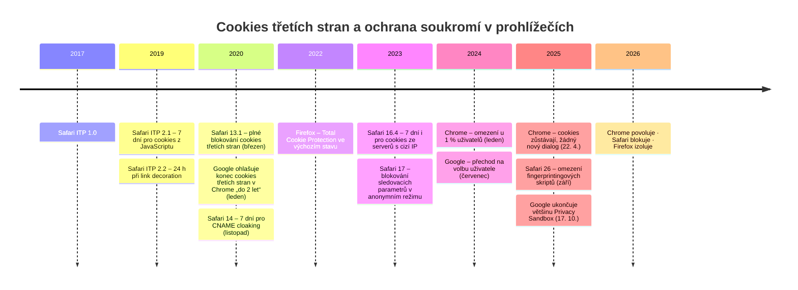
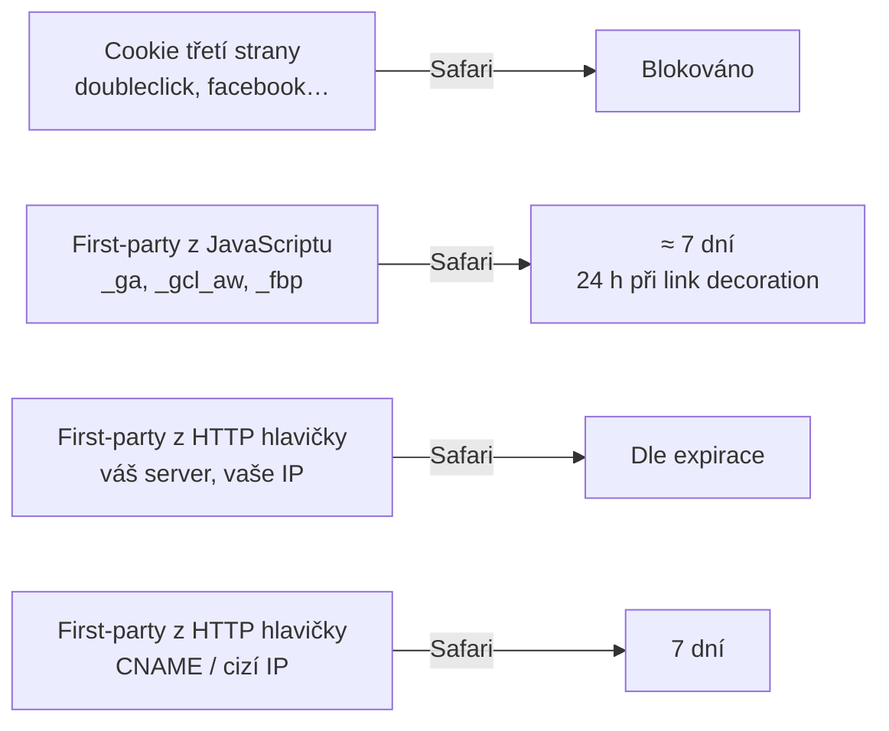

# A7: Cookies třetích stran, Chrome a Safari ITP v roce 2026: co se doopravdy změnilo – brief
> Cluster: A. Consent & legislativa (most do clusteru B) · URL: /blog/cookies-tretich-stran-2026 · Formát: vysvětlení + časová osa + doporučení · Priorita: měsíc 2 · Cílová LP: /sluzby/server-side-tracking · Rozsah finálního textu: 2 400–3 000 slov + časová osa + 2 tabulky + diagram

---

## 1. Meta

| Prvek | Návrh |
|---|---|
| H1 | Cookies třetích stran v roce 2026: Chrome, Safari a Firefox |
| SEO title (60 zn.) | Konec cookies třetích stran? Stav v roce 2026 \| datalayer.cz |
| Meta description (148 zn.) | Chrome cookies třetích stran nezrušil, Safari je blokuje od roku 2020 a zkracuje i first-party cookies. Dopad na remarketing a atribuci a co pomáhá. |
| URL | /blog/cookies-tretich-stran-2026 |
| Datum | „Stav k {datum}“ pod H1 – téma se mění, revize každé 3 měsíce |

**Klíčová slova (Ahrefs CZ):**
- Hlavní: `cookies třetích stran` (10)
- Vedlejší: `konec cookies třetích stran` (10, KD 0), `co jsou cookies třetích stran` (10), `third party cookies` (10), `tracking cookies` (10, KD 14), `cookieless attribution` (30), `cookieless conversion tracking` (30), `first party data` (20)
- Long-tail (0): `safari itp`, `itp safari`, `safari cookies 7 dní`, `privacy sandbox konec`, `chrome cookies třetích stran 2026`
- Otázky (PAA u „cookies třetích stran konec“): „Co se stane, když odmítnu cookies?“ (→ A6), „Co se stane, když smažu cookies?“, „Jak zrušit cookies?“, „Kde jsou uložené cookies?“

**Záměr:** informační – ověření „je konec cookies, nebo není?“ + co dělat. Mnoho hledajících má v hlavě zastaralý stav („konec 2024/2025“).

**Cílový čtenář:** marketingový ředitel / PPC specialista e-shopu, který slyší „cookies končí“ a dostává nabídky „cookieless“ řešení; analytik, který vysvětluje rozdíly v datech mezi prohlížeči. Segmenty: e-shop (remarketing, atribuce), B2B (dlouhé rozhodovací cykly – 7denní limit Safari je kritický), velká firma (strategie first-party dat).

---

## 2. Analýza SERP a konkurence

**Google.cz 8. 10. 2026 – „cookies třetích stran konec“** (AI přehled ano): 1 mediaguru.cz („Google končí s plánem na zrušení cookies třetích stran“) · 2 impnet.cz („Konec cookies třetích stran v Google Chrome“) · 3 o-seznam.cz · 4 blog.seznam.cz (08/2024) · 5 marketingppc.cz („Co znamená konec cookies“) · 6 optimweb.cz · 7 advisio.cz („Cookies třetích stran končí: proč je váš e-shop potřebuje?“) · 8 blog.shoptet.cz · 9 lesensky.cz („…odkládá zásadní změnu na rok 2025“).

**Pozorování:**
- Polovina výsledků je **zastaralá** nebo zavádějící (titulky „končí“, „rok 2025“); analýza konkurence to potvrzuje (advisio: „cookies 3. stran od 2024 nebudou fungovat“; gameplan: produktové stránky „po pádu cookies“).
- Texty řeší skoro výhradně **Chrome**, ačkoli pro reálná data českých webů je důležitější **Safari** (blokuje cookies třetích stran od roku 2020 a zkracuje i first-party cookies z JavaScriptu na 7 dní).
- Chybí: přehled stavu Privacy Sandbox po říjnu 2025, technická tabulka typů cookies × prohlížeč, dopad na konkrétní metriky (noví vs. vracející se uživatelé, atribuční okna, remarketing) a co pomáhá **v souladu se souhlasem**.

**Čím přeskočíme:** časová osa 2017–2026 s primárními zdroji, tabulka „typ cookie × Chrome/Safari/Firefox“, diagram životnosti cookies v Safari, tabulka mýtů, doporučení bez „obcházení“.

---

## 3. Otázky, na které musí článek odpovědět

1. Co jsou cookies třetích stran a čím se liší od first-party cookies?
2. Skončily cookies třetích stran v Chrome? Co Google oznámil v letech 2024 a 2025?
3. Co zbylo z Privacy Sandbox?
4. Co dělá Safari (ITP): blokování, 7 dní, 24 hodin, CNAME a IP cloaking, fingerprinting?
5. Co dělá Firefox (Enhanced Tracking Protection, Total Cookie Protection)?
6. Jak to ovlivňuje remarketing a atribuci?
7. Proč mám v GA4 v Safari víc „nových uživatelů“?
8. Pomůže server-side tracking? Za jakých podmínek?
9. Co skutečně pomáhá – a co je slepá ulička?
10. Co se stane, když návštěvník cookies smaže? (PAA)

---

## 4. Rychlá odpověď (hotový text, 59 slov)

> Chrome cookies třetích stran v roce 2026 stále povoluje: Google v dubnu 2025 oznámil, že je nezruší, a v říjnu 2025 ukončil většinu technologií Privacy Sandbox. Safari je naopak blokuje od roku 2020 a cookies zapsané JavaScriptem drží nejvýše 7 dní. Firefox je izoluje. Pomáhají first-party data, souhlas a cookies nastavené vaším serverem.

---

## 5. Osnova s obsahem odpovědí

### H2 1: Cookies první a třetí strany: rozdíl v jedné minutě
**Obsah:**
- **First-party:** nastaví doména, na které návštěvník je (`vasweb.cz`) – košík, přihlášení, ale i `_ga`, `_gcl_au`, `_fbp` (měřicí skripty je zapisují pod vaši doménu).
- **Third-party (cross-site):** nastaví jiná doména vložená do stránky (reklamní server, sociální síť) a může návštěvníka poznat napříč weby.
- **Dva způsoby zápisu:** JavaScriptem (`document.cookie`) vs. **HTTP hlavičkou** `Set-Cookie` ze serveru – v Safari je to zásadní rozdíl (H2 4).
- **Souhlas:** rozdělení první/třetí strana **nerozhoduje** o povinnosti souhlasu – rozhoduje účel (A2). Proto „přechod na first-party“ není náhrada lišty.
- PAA „Co se stane, když smažu cookies?“: web zapomene přihlášení, košík a volbu lišty; měřicí nástroje vás uvidí jako nového návštěvníka; lišta se zeptá znovu (ÚOOÚ to připouští, když provozovatel předchozí volbu nezná).

### H2 2: Chrome: cookies třetích stran zůstávají
**Klíčové sdělení:** „Konec cookies v Chrome“ se nekonal. Google v roce 2025 plán definitivně opustil.

**Obsah (privacysandbox.google.com, ověřeno 10/2026):**
- **22. 4. 2025** (Anthony Chavez, VP Privacy Sandbox): Google zachová současný přístup, kdy uživatel volí nastavení cookies třetích stran v Chrome; **nezavede nový samostatný dialog**; uživatelé mohou dál volit v Nastavení soukromí a zabezpečení. Anonymní režim (Incognito) blokuje cookies třetích stran ve výchozím stavu.
- **17. 10. 2025:** Google oznámil **ukončení** technologií Attribution Reporting API (Chrome i Android), IP Protection, On-Device Personalization, Private Aggregation (vč. Shared Storage), Protected Audience (Chrome i Android), Protected App Signals, Related Website Sets (vč. requestStorageAccessFor a Related Website Partition), SelectURL, SDK Runtime a **Topics**. Zachovává **CHIPS**, **FedCM** a **Private State Tokens**. Chrome „zachová současný přístup k volbě uživatele“.
- **Předchozí vývoj (stručně, 2–3 věty):** v lednu 2020 Google oznámil konec cookies třetích stran v Chrome „do dvou let“, termín několikrát posunul, v lednu 2024 je omezil u 1 % uživatelů a v červenci 2024 přešel na koncept volby uživatele `[OVĚŘIT data a odkazy před publikací – viz kap. 7]`.
- **Co to znamená v praxi (hotový text):** v Chrome remarketing a měření založené na cookies třetích stran dál fungují – pokud je dovolí uživatel a pokud dal souhlas na vašem webu. Chrome tedy není důvod k „cookieless“ projektu; Safari a Firefox ano.
- Stav k 10/2026: novější oznámení o změně politiky cookies v Chrome nebylo nalezeno `[OVĚŘIT těsně před publikací]`.

### H2 3: Co zbylo z Privacy Sandbox
- Tabulka T2 (kap. 6): technologie → stav (ukončeno / zachováno) → co to znamenalo pro marketing (Topics = zájmová reklama, Protected Audience = remarketing v prohlížeči, Attribution Reporting = měření konverzí bez cookies…).
- Hotová věta: „Pokud vám někdo v roce 2026 nabízí přípravu na Topics API nebo Protected Audience, je to slepá ulička – Google je ukončuje.“

### H2 4: Safari (ITP): proč je pro vaše data důležitější než Chrome
**Klíčové sdělení:** Safari blokuje cookies třetích stran a zkracuje životnost first-party cookies zapsaných JavaScriptem. Uživatel, který se vrátí po týdnu, je pro analytiku často nový.

**Obsah (webkit.org, ověřeno 10/2026):**
1. **Cookies třetích stran:** ITP je ve výchozím stavu blokuje všechny, bez výjimek; přístup jen přes Storage Access API (webkit.org/tracking-prevention). Plné blokování od **Safari 13.1 / iOS 13.4 (24. 3. 2020)** (webkit.org/blog/10218).
2. **7 dní pro cookies z JavaScriptu a skriptem zapisované úložiště:** ITP maže cookies vytvořené JavaScriptem a ostatní úložiště zapisované skriptem (localStorage, IndexedDB…) po 7 dnech bez interakce (webkit.org/tracking-prevention; Safari 13.1 pro úložiště). → `_ga`, `_gcl_au`, `_gcl_aw` (gclid), `_fbp` z klientského JavaScriptu v Safari dlouho nevydrží. `[OVĚŘIT přesnou formulaci „bez interakce“ vs. „limit expirace“ – v textu formulovat „nejvýše přibližně 7 dní“]`
3. **24 hodin při link decoration:** pokud ITP zjistí, že návštěvník přišel z domény klasifikované jako tracker s parametry v URL (query string, fragment), zkrátí cookies z JavaScriptu na cílové stránce na **24 hodin** (webkit.org/tracking-prevention). Které domény jsou klasifikované, Apple nezveřejňuje.
4. **CNAME a IP cloaking:** cookies nastavené v HTTP odpovědi ze serveru, který je ve skutečnosti třetí stranou schovanou za CNAME, mají od Safari 14 (12. 11. 2020) limit **7 dní** (webkit.org/blog/11338); stejný limit platí pro odpovědi ze serverů s „cizí“ IP adresou (webkit.org/tracking-prevention; WebKit bug 246477 „Cap cookie lifetimes to 7 days for responses from third party IP addresses“, podle komunity od Safari 16.4 – `[OVĚŘIT verzi]`).
5. **Sledovací parametry v odkazech:** Safari 17 v anonymním režimu blokuje známé sledovací parametry v odkazech (webkit.org/blog/14445). Rozšíření na běžné prohlížení v Safari 26 není z oficiálních poznámek potvrzené – neuvádět jako fakt.
6. **Fingerprinting:** Safari 26 brání známým fingerprintingovým skriptům v přístupu k API odhalujícím vlastnosti zařízení, v dlouhodobém úložišti a ve čtení stavu pro navigační sledování (webkit.org/blog/17333). Podle odborného tisku Apple rozšířil pokročilou ochranu proti fingerprintingu na veškeré prohlížení (ppc.land, 2025) `[OVĚŘIT u Apple]`.
- **Dopad (hotový text + Diagram 2):** v Safari vidíte víc „nových uživatelů“, kratší vracející se cesty, víc konverzí bez zdroje kampaně u delších rozhodovacích cyklů, menší remarketingová publika.
- **Podíl Safari na webu klienta:** `[DOPLNIT: z GA4 klienta / StatCounter CZ – ověřit, nepublikovat odhad]`.

### H2 5: Firefox: Enhanced Tracking Protection
**Obsah (support.mozilla.org, ověřeno 10/2026):**
- Výchozí režim **Standard**: blokuje sledovače sociálních sítí, **cross-site sledovací cookies** (ostatní cookies třetích stran izoluje), kryptominery a **fingerprintery**; sledovací obsah blokuje jen v anonymních oknech.
- **Total Cookie Protection** je zapnutá ve výchozím Standard režimu – každá cookie je omezena na web, který ji nastavil.
- Režim **Strict**: blokuje všechny cross-site cookies, sledovací obsah ve všech oknech, přidává Enhanced Cookie Clearing a Bounce Tracking Protection. „Copy Clean Link“ odstraňuje sledovací parametry z kopírovaných odkazů.

### H2 6: Dopad na remarketing a atribuci
**Klíčové sdělení:** Největší ztráty nevznikají „koncem cookies“, ale kombinací odmítnutého souhlasu (A6) a omezení Safari.

**Obsah – tabulka dopadů (hotové odrážky):**
- **Remarketing:** publika z návštěvníků Safari/Firefoxu jsou menší (cookies třetích stran blokované, first-party krátké); bez souhlasu `ad_personalization` se do publik nedostane nikdo (A1).
- **Atribuce:** gclid uložený JavaScriptem v `_gcl_aw` vydrží v Safari zhruba týden (případně 24 h) → konverze po delší době se nepřiřadí kampani nebo spadnou do „Direct/Unassigned“ (D2, D6). Kritické u B2B (rozhodování týdny).
- **Noví vs. vracející se uživatelé:** nadhodnocení nových uživatelů v Safari; zkreslené kohorty a LTV v GA4.
- **View-through konverze** (zhlédnutí reklamy bez prokliku) závisí na cookies třetích stran → v Safari/Firefoxu prakticky nefungují.
- **Meta:** `_fbp` z JavaScriptu krátce; Meta páruje i přes přihlášené uživatele a CAPI s hashovanými údaji (se souhlasem) → B5.
- **Sklik:** Seznam kvůli prohlížečovým omezením přešel na Seznam Event Measurement a S2S měření (B6).

### H2 7: Co skutečně pomáhá (a co ne)
**Klíčové sdělení:** Spolehlivější data získáte díky souhlasu, vlastním datům a infrastruktuře – ne trikem.

**Obsah – 6 doporučení (hotový text, každé 2–3 věty):**
1. **Souhlas správně** (A1, A2): bez souhlasu žádná technika data nevrátí; každý procentní bod consent rate je víc než jakákoli optimalizace cookies.
2. **First-party data:** přihlášení, věrnostní program, newsletter, CRM → rozšířené konverze a Meta CAPI s hashovanými kontakty (se souhlasem) párují konverze bez závislosti na cookies (E2, E4, B5).
3. **Server-side s cookies z HTTP hlavičky:** sGTM na vaší subdoméně, která běží na **vaší infrastruktuře / stejné IP adresní oblasti** jako web (nebo cestou přes váš CDN / reverzní proxy), nastaví first-party cookie (např. serverově spravované client ID) přes `Set-Cookie`; taková cookie nemá 7denní limit pro JavaScript. **Pozor:** subdoména namířená přes CNAME nebo A záznam na cizí servery (typicky hosting sGTM jinde než web) spadá pod limit 7 dní pro CNAME/IP cloaking. Vždy jen se souhlasem. Detaily B1, B2, B3; Google tag gateway (B4).
4. **Click ID do vlastních systémů:** při příchodu z reklamy uložit `gclid`/`gbraid`/`wbraid`/`fbclid` na serveru k relaci a k objednávce či leadu v CRM → offline konverze (E3), nezávislé na životnosti cookies (se souhlasem a informováním).
5. **Modelování a agregované měření:** Consent Mode modelování (A1), inkrementální testy a MMM pro rozpočtová rozhodnutí (D6).
6. **Měřte rozdíly podle prohlížeče:** coverage objednávek a consent rate podle Safari/Chrome (A6) – víte, kolik vám Safari „bere“.

**Slepé uličky (tabulka mýtů T3):** fingerprinting (nelegální bez souhlasu – A5, a Safari/Firefox ho omezují), CNAME triky (Safari je zkracuje), „cookieless řešení bez souhlasu“, příprava na Topics/Protected Audience.

---

## 6. Vizuály

### Časová osa (H2 2 – hlavní vizuál)

**Finální SVG:** vodorovná osa (desktop) / svislá (mobil) s třemi barevnými „drahami“ podle prohlížeče: Chrome (cyan `#00ffff`), Safari (tlumená cyan `#00b0b0`), Firefox (světle šedá `#e6edf3` 60 %); události jako tečky s monospace datem; poslední uzel „2026“ zvýrazněný. U položek označených v kap. 7 jako „ověřit“ nesmí být datum ve finále, dokud není potvrzeno. Interaktivně: hover/klik na událost zobrazí zdroj (`diagram_interaction`, `diagram_id: a7_timeline`). Respektovat `prefers-reduced-motion`.

### Diagram 2: Životnost cookies v Safari (H2 4)

**Finální SVG:** 4 řádky „cookie → přesýpací hodiny → výsledek“; délka pruhu = životnost (blokováno = 0, 24 h, 7 dní, expirace např. 400 dní – zobrazit jako „dle nastavení“, bez konkrétního čísla, pokud ho nepotvrdíme). Monospace názvy cookies. Mobil: řádky pod sebou.

### Tabulka T1: Typ cookie × prohlížeč (výchozí nastavení, stav 10/2026)
| Typ | Chrome | Safari | Firefox (Standard) |
|---|---|---|---|
| Cookies třetích stran | povoleny (uživatel může blokovat; v Incognitu blokovány) | blokovány všechny | sledovací blokovány, ostatní izolovány (Total Cookie Protection) |
| First-party z JavaScriptu | dle expirace | ≈ 7 dní; 24 h po příchodu z klasifikovaného trackeru s link decoration | dle expirace |
| First-party z HTTP hlavičky (váš server) | dle expirace | dle expirace | dle expirace |
| First-party z HTTP hlavičky přes CNAME / cizí IP | dle expirace | 7 dní | dle expirace |
| localStorage a jiné úložiště skriptu | trvalé | smazáno po 7 dnech bez interakce | trvalé |
| Známé fingerprintingové skripty | bez zvláštního omezení | omezené API a úložiště (Safari 26) | blokovány |
| Sledovací parametry v odkazech | ponechány | blokovány v anonymním režimu (Safari 17) | „Copy Clean Link“ u kopírovaných odkazů |

### Tabulka T2: Privacy Sandbox – stav k 10/2026
| Technologie | Stav | K čemu měla sloužit |
|---|---|---|
| Topics | ukončeno | zájmová reklama bez cookies třetích stran |
| Protected Audience | ukončeno | remarketing v prohlížeči |
| Attribution Reporting API | ukončeno | měření konverzí bez cookies třetích stran |
| Private Aggregation, Shared Storage | ukončeno | agregované reporty |
| IP Protection | ukončeno | skrytí IP před třetími stranami |
| Related Website Sets | ukončeno | sdílení cookies mezi „příbuznými“ doménami |
| SelectURL, On-Device Personalization, Protected App Signals, SDK Runtime | ukončeno | různé (web/Android) |
| CHIPS | zachováno | dělené (partitioned) cookies pro vložený obsah |
| FedCM | zachováno | přihlašování přes poskytovatele identity |
| Private State Tokens | zachováno | boj proti podvodům bez sledování |

### Tabulka T3: Mýty
| Mýtus | Realita |
|---|---|
| „Cookies třetích stran v Chrome skončily v roce 2024/2025.“ | Nekončí: Google v dubnu 2025 plán opustil. |
| „Na konec cookies se připravíme přes Topics API.“ | Topics a většinu Privacy Sandbox Google v říjnu 2025 ukončil. |
| „First-party cookie nepotřebuje souhlas.“ | O souhlasu rozhoduje účel, ne doména (A2). |
| „Server-side vrátí cookies třetích stran.“ | Ne. Umí nastavit first-party cookie z HTTP hlavičky – se souhlasem a jen na vaší infrastruktuře bez 7denního limitu. |
| „Safari maže všechny cookies po týdnu.“ | Omezuje cookies zapsané JavaScriptem a skriptové úložiště; cookies z vašeho serveru drží podle expirace (mimo CNAME/cizí IP). |
| „Fingerprinting je cookieless budoucnost.“ | Bez souhlasu protiprávní (ÚOOÚ) a Safari i Firefox ho omezují (A5). |

---

## 7. Fakta a zdroje

| Tvrzení | Zdroj | Ověřeno | Riziko zastarání |
|---|---|---|---|
| 22. 4. 2025: zachování volby uživatele, žádný samostatný dialog, Incognito blokuje 3P cookies, IP Protection plán Q3 2025 | https://privacysandbox.google.com/blog/privacy-sandbox-next-steps | 10/2026 | **vysoké – sledovat** |
| 17. 10. 2025: ukončení Topics, Protected Audience, ARA, IP Protection…; zachování CHIPS, FedCM, PST | https://privacysandbox.google.com/blog/update-on-plans-for-privacy-sandbox-technologies | 10/2026 | **vysoké** |
| Leden 2020 oznámení „do 2 let“; leden 2024 test u 1 %; červenec 2024 „nový přístup“ | blog.chromium.org (2020/01), privacysandbox.com/news (2024) | **ověřit URL a data** | nízké (historie) |
| ITP: blokace všech 3P cookies; 7 dní pro JS cookies a skriptové úložiště; 24 h link decoration; 7 dní CNAME/IP cloaking | https://webkit.org/tracking-prevention/ (stránka z 2020, upravena 27. 4. 2023) | 10/2026 | střední |
| Safari 13.1 (24. 3. 2020): plné blokování 3P cookies, 7 dní skriptové úložiště | https://webkit.org/blog/10218/full-third-party-cookie-blocking-and-more/ | 10/2026 | nízké |
| Safari 14 (12. 11. 2020): CNAME cloaking 7 dní | https://webkit.org/blog/11338/cname-cloaking-and-bounce-tracking-defense/ | 10/2026 | nízké |
| Cookies z odpovědí s cizí IP – 7 dní (bug 246477) | https://bugs.webkit.org/show_bug.cgi?id=247865 (odkazuje na 246477) | 10/2026 – **verze Safari ověřit** | nízké |
| ITP 2.1 (7 dní, 2019), ITP 2.2 (24 h, 2019) | https://webkit.org/blog/8613/ ; https://webkit.org/blog/8828/ | **ověřit** | nízké |
| Safari 17: blokování známých sledovacích parametrů v anonymním režimu | https://webkit.org/blog/14445/webkit-features-in-safari-17-0/ | 10/2026 | nízké |
| Safari 26: omezení fingerprintingových skriptů | https://webkit.org/blog/17333/webkit-features-in-safari-26-0/ | 10/2026 | střední |
| AFP pro veškeré prohlížení v Safari 26 | https://ppc.land/safari-26-tracking-changes-to-impact-marketing-measurement/ (sekundární) | **ověřit u Apple** | střední |
| Firefox Standard: co blokuje, Total Cookie Protection výchozí, Strict, Copy Clean Link | https://support.mozilla.org/en-US/kb/enhanced-tracking-protection-firefox-desktop | 10/2026 | střední |
| Firefox TCP výchozí pro všechny (2022) | blog.mozilla.org (06/2022) | **ověřit** | nízké |
| Google tag gateway (first-party cesta pro Google tag) | https://support.google.com/google-ads/answer/16061406 | 10/2026 (existence stránky) | střední |
| Podíl Safari v ČR | – | **DOPLNIT z dat klienta / StatCounter** | – |

---

## 8. Interní odkazy a CTA

**Cílová LP:** /sluzby/server-side-tracking

**CTA box (za H2 7 – doporučení):**
- Nadpis: **Kolik dat vám bere Safari? Spočítáme to**
- Text: Porovnáme objednávky a konverze podle prohlížeče, ověříme, jak dlouho u vás vydrží měřicí cookies, a navrhneme server-side řešení na vaší infrastruktuře – vždy v souladu se souhlasem návštěvníků.
- Tlačítko: `[ Konzultovat server-side ]` → /sluzby/server-side-tracking (`cta_id: blog_a7_box`)

**Související články:** B1 Server-side tracking – průvodce (H2 7), B2 Propojení client-side a server-side, B3 Kde provozovat sGTM (IP/CNAME), B4 Google Tag Gateway (/blog/google-tag-gateway), B5 Meta CAPI, B6 Seznam Event Measurement, A1 Consent Mode v2, A2 Cookies a zákon, A5 Server-side a souhlas (fingerprinting), A6 Odmítnutí cookies, D2 Proč nesedí čísla, D6 Atribuce, E2 Rozšířené konverze, E3 Offline konverze, E4 First-party data.

**Slovník:** /slovnik/third-party-cookie, /slovnik/first-party-cookie, /slovnik/itp, /slovnik/server-side-tagging, /slovnik/gclid-gbraid-wbraid, /slovnik/google-tag-gateway.

**Zkrácený kontaktní blok:** `form_id: blog`, předvybrané téma **Server-side**, H2 „Řešíte totéž u sebe?“, placeholder „Napište, na čem jste se zasekli… (např. v Safari máme o polovinu méně vracejících se uživatelů)“.

---

## 9. FAQ pro schema (FAQPage)

**Skončily cookies třetích stran v Chrome?**
Ne. Google 22. dubna 2025 oznámil, že v Chrome zachová současný přístup, kdy o cookies třetích stran rozhoduje uživatel v nastavení, a nezavede nový dialog. V říjnu 2025 pak ukončil většinu technologií Privacy Sandbox. Cookies třetích stran Chrome ve výchozím stavu blokuje jen v anonymním režimu.

**Blokuje Safari cookies?**
Safari blokuje všechny cookies třetích stran od verze 13.1 z března 2020. Navíc omezuje first-party cookies zapsané JavaScriptem – například _ga nebo _fbp – zhruba na 7 dní a v některých případech na 24 hodin. Cookies nastavené vaším serverem přes HTTP hlavičku drží podle expirace, pokud server není schovaný za CNAME nebo cizí IP.

**Co je Safari ITP?**
Intelligent Tracking Prevention je soubor ochran v Safari proti sledování napříč weby. Blokuje cookies třetích stran, zkracuje životnost cookies a úložiště zapisovaných skripty, omezuje cookies ze skrytých třetích stran přes CNAME nebo cizí IP a od Safari 26 brání známým fingerprintingovým skriptům v přístupu k vlastnostem zařízení.

**Pomůže server-side tracking proti omezením Safari?**
Částečně. Server-side GTM na vaší infrastruktuře může nastavit first-party cookie přes HTTP hlavičku, na kterou se 7denní limit pro JavaScript nevztahuje. Pokud ale sGTM běží na cizí IP adrese nebo za CNAME, Safari i takovou cookie omezí na 7 dní. Souhlas návštěvníka je potřeba vždy.

**Co se stane, když návštěvník smaže cookies?**
Web zapomene přihlášení, obsah košíku a uloženou volbu z cookie lišty. Analytické a reklamní nástroje ho při další návštěvě uvidí jako nového uživatele a lišta se ho znovu zeptá na souhlas – to ÚOOÚ připouští, protože provozovatel předchozí volbu nezná.

**Jak se připravit na omezování cookies?**
Postavte měření na souhlasu a vlastních datech: správně nastavený Consent Mode, rozšířené konverze a Meta CAPI s hashovanými údaji od souhlasících zákazníků, ukládání click ID do CRM pro offline konverze a server-side měření na vlastní infrastruktuře. Rozdíly v datech sledujte podle prohlížeče.

---

## 10. Poznámky pro autora

- **Nejrizikovější článek z hlediska zastarání.** Před publikací znovu zkontrolovat privacysandbox.google.com/blog (nová oznámení), webkit.org/blog (nová verze Safari), support.mozilla.org. Box „Stav k {datum}“ pod H1; revize každé 3 měsíce.
- **Ověřit (neuvádět, dokud není potvrzeno):** data 2020/2024 v historii Chrome; verze Safari pro limit cizí IP (16.4); přesná sémantika 7denního limitu (od posledního zápisu vs. bez interakce); AFP ve veškerém prohlížení v Safari 26; Firefox TCP 2022; podíl Safari v ČR.
- **Zakázané formulace:** „obcházení ITP/blokátorů“, „prodloužení cookies“ jako cíl sám o sobě. Používat: „first-party cookie nastavená vaším serverem“, „odolnější měření v souladu se souhlasem“.
- **Server-side a IP:** v textu nedávat konkrétní návod „jak oklamat Safari“; popsat princip (stejná infrastruktura / reverzní proxy) a odkázat na B1–B4 pro architekturu.
- **Klient dodá:** podíl prohlížečů a coverage objednávek podle prohlížeče z anonymizovaného projektu `[DOPLNIT]`; případně ukázku „noví uživatelé v Safari vs. Chrome“ (jen reálná data).
- **Doporučený autor:** Vít Novotný.
