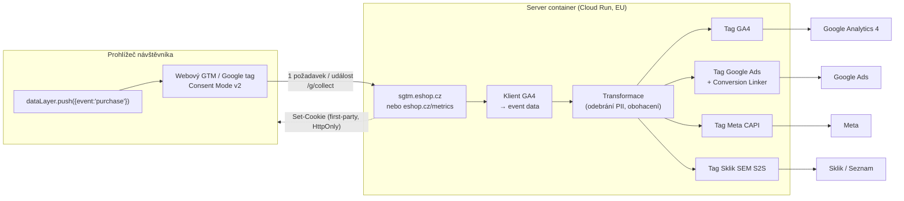
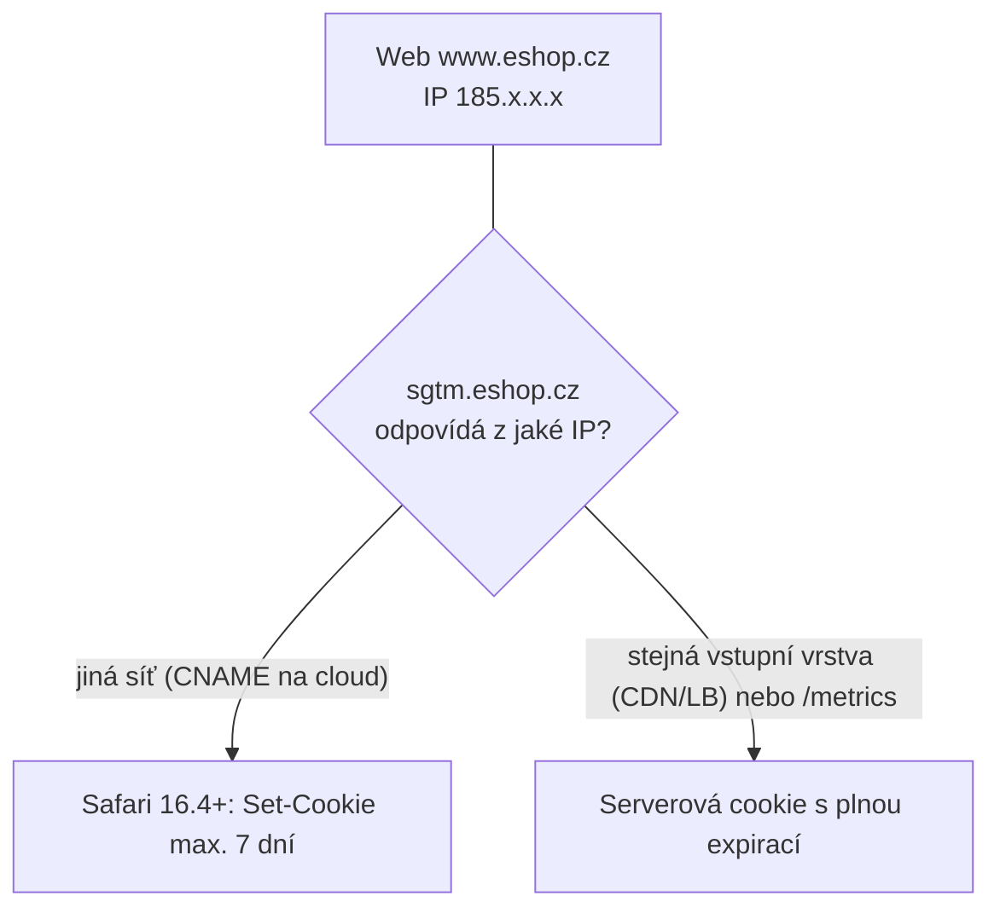

# B1: Server-side tracking – průvodce pro e-shopy i firmy – brief
> Cluster: B. Server-side & architektura (pilíř) · URL: /blog/server-side-tracking-pruvodce · Formát: pilíř · Priorita: měsíc 1 · Cílová LP: /sluzby/server-side-tracking · Rozsah finálního článku: 3 000–3 800 slov + diagramy, tabulky, kód

**Pozor:** článek nahrazuje stávající `/blog/server-side-gtm-uvod` (79 slov, 15. 1. 2025) – nastavit 301 dle `03_landing-pages/00_architektura-webu.md`, kap. 1.1.

---

## 1. Meta

| Prvek | Návrh |
|---|---|
| H1 | Server-side tracking: průvodce pro e-shopy i firmy |
| SEO title (59 zn.) | Server-side tracking: průvodce, náklady 2026 \| datalayer.cz |
| Meta description (150 zn.) | Jak funguje server-side tracking (sGTM): architektura, first-party cookies a Safari ITP, náklady na Cloud Run, limity a souhlas. Průvodce s diagramem. |
| URL | /blog/server-side-tracking-pruvodce |
| Schema | `BlogPosting` (author `Person` Vít Novotný, `dateModified`), `FAQPage`, `BreadcrumbList` |

**Klíčová slova** (Ahrefs CZ, `kw_mapovani_na_stranky.tsv`, topic `server-side`):
- Hlavní: **server side tracking (50)**
- Vedlejší: server side gtm (30), server side (20), server side měření (20), server side events (20), server-side tracking (10), server side tagging (10), gtm server side (10), ga4 server side (10), server side tracking gtm (10), google tag manager server side tracking (10)
- Long-tail (0–10, strategické): server side gtm cost, gtm server side cloud run, server side gtm benefits, server side tracking cookies, server side tracking gdpr, server side tracking diagram, ga4 first party cookies, server side tracking google ads
- Otázky (Google PAA, `google_paa.tsv`): *What does server-side tracking do?* · *Is server-side tracking legal?* · *What is server-side tracking in Google Tag Manager?* · *What does "server-side GTM" mean?* · *Can I use Google Tag Manager for server-side tagging?* · *How to setup server-side GTM?*

**Záměr:** informační → komerční (čtenář zjišťuje, co to je, jestli to potřebuje a kolik to stojí).
**Čtenář:** (1) majitel/marketingový ředitel e-shopu s výdaji na reklamu v řádu statisíců Kč měsíčně, který vidí rozdíl mezi tržbami v administraci a v reklamních systémech; (2) marketér / PPC specialista B2B firmy; (3) IT/analytik velké firmy, který řeší vlastnictví dat a provoz v Google Cloudu. Úroveň: mírně pokročilá – zná GTM a GA4, nezná architekturu serverového kontejneru.

---

## 2. Analýza SERP a konkurence

**Google.cz 8. 10. 2026** (AI přehled zobrazen u všech tří dotazů):

| Dotaz | Kdo rankuje (TOP 8) | Co chybí |
|---|---|---|
| server side tracking | webglobe.cz (poradna), digitalniarchitekti.cz (článek „proč ve 4. čtvrtletí“), datamind.cz (EN), cm.com, stape.io, napoveda.wpjshop.cz, matomo.org, developers.google.com | Většina textů je definiční nebo sezónní (DA: Q4/Black Friday). Chybí architektura krok za krokem, rozdíl subdoména vs. same-origin, náklady s výpočtem. |
| server-side měření | digitalniarchitekti.cz, roistory.cz, wpj.cz, houseofrezac.com, gameplan.cz, advisio.cz (04/2024), webglobe.cz, foxy.cz, khoder.cz | Advisio a DA mají zastaralé pasáže (2023/24). Khoder má dobrou sekci „kdy SST nepomůže“, ale bez nákladů a bez ITP detailu. |
| server side gtm | developers.google.com, marketingmakers.net, stape.io, simoahava.com, ui42.com, support.google.com, reddit | Česky téměř nic technického; vyhrává Google dokumentace a Simo Ahava (EN). |

**Konkurenční profily:** datanostro.com (nejvíc českého obsahu o SST, ale krátké články; tvrdí, že Google Cloud stojí „nižší stovky korun měsíčně“, a uvádí App Engine – obojí v rozporu s dokumentací Googlu), nextanalytica.cz (dobrý diagram client vs. server, čísla bez metodiky), khoder.cz (nejlepší struktura „kdy SST nepomůže“, bez nákladů a ITP), advisio.cz (black-box DataPlus, obsah z 2024), datimo.ai (glosář „pořádný setup, ne jen proxy“), digitalniarchitekti.cz (sezónní článek, TL;DR + FAQ + zdroje).

**Čím je přeskočíme (konkrétně):**
1. **Jediný český text, který vysvětlí rozdíl mezi cookie z JavaScriptu a cookie z HTTP hlavičky** včetně omezení Safari 16.4+ pro servery na „cizí“ IP adrese → proč na umístění sGTM (subdoména vs. stejný origin) záleží.
2. **Výpočet nákladů z ceníku Cloud Run** (vCPU-sekundy, GiB-sekundy, free tier, minimální instance, load balancer, logování) místo „pár stovek měsíčně“.
3. **Aktuální stav 2026**: automatické zřízení z GTM je jen testovací a jen v `us-central1`; App Engine je legacy; Google Tag Gateway jako levnější alternativa pro „jen Google“.
4. **Sekce „Kdy server-side nedává smysl“** a **monitoring** (nikdo z konkurence nepopisuje health check, billing alert, aktualizace image).
5. Diagram v brand stylu + tabulka client vs. server + funkční ukázky (gtag, gcloud).

---

## 3. Otázky, na které musí článek odpovědět

1. Co je server-side tracking a jak se liší od server-side taggingu?
2. Jak putují data z prohlížeče přes server do GA4, Google Ads, Mety a Skliku?
3. Proč musí server běžet na vlastní (sub)doméně a co je „same-origin“?
4. Jaký je rozdíl mezi cookie nastavenou JavaScriptem a cookie z HTTP odpovědi serveru? Co s tím dělá Safari (ITP)?
5. Co server-side přinese (kvalita dat, rychlost webu, kontrola nad daty) a co ne?
6. Nahrazuje server-side cookie lištu nebo souhlas? (Ne.)
7. Kolik stojí provoz v Google Cloud Run a na čem cena závisí?
8. Stačí automatické zřízení serveru z GTM? (Jen pro testy.)
9. Kdy server-side nedává smysl?
10. Jak dlouho trvá implementace a co je potřeba od vývojářů?
11. Jak poznám, že server-side měření funguje (monitoring)?
12. Čím se server-side GTM liší od Google Tag Gateway?
13. Potřebuji kvůli server-side měnit datovou vrstvu?

---

## 4. Rychlá odpověď (hotový text, 52 slov)

> **Server-side tracking** posílá měřicí data z webu nejdřív na váš vlastní server (server-side Google Tag Manager na vaší doméně) a teprve odtud do GA4, Google Ads, Mety nebo Skliku. Získáte kontrolu nad tím, co komu posíláte, odolnější first-party cookies a méně skriptů v prohlížeči. Souhlas uživatele ani dobrou datovou vrstvu ale nenahrazuje.

---

## 5. Osnova s obsahem odpovědí

### H2 1: Co je server-side tracking (a proč se mu správně říká server-side tagging)
**Klíčové sdělení:** Prohlížeč neposílá data deseti dodavatelům, ale jednomu serveru, který vlastníte. Ten data zkontroluje, upraví a rozešle.

**Obsah odpovědi:**
- Google používá termín *server-side tagging*: „server container“ běží ve vašem projektu Google Cloud nebo v jiném prostředí, které si zvolíte, a **neběží v prohlížeči uživatele** (developers.google.com/tag-platform/tag-manager/server-side/intro, aktualizováno 30. 7. 2026).
- „Tracking“ je obecnější pojem (sběr dat), „tagging“ popisuje, že na serveru běží *tagy* stejně jako ve webovém GTM. V článku používat oba pojmy, vysvětlit jednou větou (tooltip ve slovníku).
- Server-side **není náhrada webového GTM** – ve většině nasazení zůstává webový kontejner, jen místo mnoha požadavků posílá jeden proud událostí na server (hybridní model → odkaz na B2).
- Ukázkový příklad (označit): e-shop měl v prohlížeči GA4, Google Ads, Meta Pixel, Sklik a Heureku = 5 knihoven a 5 sad požadavků; po přechodu webový GTM posílá jeden GA4 požadavek na `sgtm.eshop.cz` a server ho rozdělí do 4 platforem.

### H2 2: Jak to funguje – architektura v pěti krocích
**Klíčové sdělení:** Web → vaše doména → server container → klienti a tagy → platformy. Každý krok má jednoho „vlastníka“ a dá se testovat zvlášť.

**Obsah odpovědi (podle diagramu D1):**
1. **Web container / Google tag v prohlížeči** – čte `dataLayer`, respektuje Consent Mode, posílá události. Na serverový kontejner se přesměruje parametrem `server_container_url` v nastavení Google tagu (GTM: proměnná typu *Google tag: Configuration settings*, spouštěč *Initialization – All Pages*). Starší implementace používaly `transport_url` (zmínit jako legacy, Meta dokumentace ho stále uvádí).
2. **Transport na vlastní (sub)doménu** – např. `https://sgtm.eshop.cz` nebo `https://www.eshop.cz/metrics`. Google doporučuje nasadit server na first-party doménu ještě před produkčním provozem. GA4 tag volí nejlepší způsob doručení (image pixel, Fetch API, XHR, service worker v iframu ze serverové domény) → nutné povolit doménu v CSP (`img-src`, `connect-src`, `frame-src`).
3. **Server container: klienti** – *klient* je adaptér, který „převezme“ příchozí HTTP požadavek, převede ho na události a spustí kontejner. Výchozí klienti: Google Analytics (GA4) a Measurement Protocol. Další klienti z galerie šablon (např. pro webhooky).
4. **Tagy, spouštěče, proměnné** – fungují jako ve webovém GTM, ale nad „event data“. Tagy běží v sandboxovaném JavaScriptu s oprávněními (vidíte, kam smí tag posílat data). Typické tagy: GA4, Google Ads Conversion Tracking + Conversion Linker, Meta Conversions API, Floodlight, vlastní HTTP tag (např. Seznam S2S).
5. **Platformy** – server odešle požadavky na `google-analytics.com`, `googleadservices.com`, `graph.facebook.com`, `sem.seznam.cz` atd. Před odesláním lze data **upravit** (odebrat parametry pomocí *Transformations*, doplnit marži z Firestore, zahashovat e-mail).

**Kód 1 – gtag.js (web bez GTM):**
```html
<!-- Google tag (gtag.js) – data jdou na váš serverový kontejner -->
<script async src="https://sgtm.eshop.cz/gtag/js?id=G-XXXXXXX"></script>
<script>
  window.dataLayer = window.dataLayer || [];
  function gtag(){dataLayer.push(arguments);}
  // Výchozí stav souhlasu MUSÍ být nastaven před configem (viz A1 Consent Mode v2)
  gtag('consent', 'default', {
    ad_storage: 'denied', ad_user_data: 'denied',
    ad_personalization: 'denied', analytics_storage: 'denied',
    wait_for_update: 500
  });
  gtag('js', new Date());
  gtag('config', 'G-XXXXXXX', {
    server_container_url: 'https://sgtm.eshop.cz'   // URL vašeho tagging serveru
  });
</script>
```
*Poznámka pro autora:* načítání `gtag/js` přes vlastní doménu vyžaduje v serverovém kontejneru klienta, který skripty obsluhuje (od 30. 6. 2025 Google doporučuje *Web Container* klienta; GA4 klient už „dependency serving“ nepodporuje pro nová nastavení – GTM release notes). Alternativa: Google Tag Gateway (B4).

**Kód 2 – GTM (web container), slovně + mockup:** Proměnná *Google tag: Configuration settings* → řádek `server_container_url` = `https://sgtm.eshop.cz` → vybrat v Google tagu → spouštěč *Initialization – All Pages* → publikovat.

### H2 3: First-party cookies: proč na doméně serveru záleží
**Klíčové sdělení:** Hlavní technický přínos není „server“, ale **kdo a jak nastavuje cookies**. Cookie z HTTP hlavičky vašeho serveru vydrží v Safari déle než cookie z JavaScriptu – pokud server běží „u vás“, i pokud jde o IP adresu.

#### H3 3.1 Cookie z JavaScriptu vs. cookie z HTTP hlavičky
- **JS cookie** = `document.cookie` (např. `_ga` z gtag.js, `_fbp` z Meta Pixelu). Safari ITP: úložiště zapisované skriptem se maže **po 7 dnech bez interakce** s webem; pokud uživatel přišel z odkazu s „dekorací“ (click ID v URL), JS cookies na vstupní stránce mají **max. 24 hodin** (webkit.org/tracking-prevention).
- **Serverová cookie** = hlavička `Set-Cookie` v odpovědi vašeho serveru (např. `FPID` v režimu „server managed“ GA4 klienta, `HttpOnly`, nečitelná pro skripty třetích stran – podrobnosti ověřit v aktuální verzi GA4 klienta).
- Google: server na výchozí doméně `*.run.app` „běží v kontextu třetí strany“ a může nastavovat **jen JavaScriptové cookies**; subdoména i same-origin mají plný přístup k výhodám serverových cookies (developers.google.com/…/server-side/custom-domain).

#### H3 3.2 Safari a server na „cizí“ IP adrese: 7 dní i pro serverové cookies
- Od **Safari 16.4 (březen 2023)** WebKit omezuje na **7 dní** i cookies nastavené v HTTP odpovědi, pokud server odpovídá z IP adresy, která se výrazně liší od IP adresy webu (WebKit bug 246477 „Cap cookie lifetimes to 7 days for responses from third party IP addresses“, RESOLVED FIXED). Podle dokumentace Addingwell/Stape se porovnává **prvních 16 bitů IPv4** – WebKit přesné pravidlo nepublikuje → formulovat opatrně.
- **Praktický dopad:** web na hostingu v Praze + `sgtm.eshop.cz` jako CNAME na Cloud Run (Google IP) = jiná IP → serverové cookies v Safari zase jen 7 dní.
- **Řešení:** obsluhovat web i sGTM přes **stejnou vstupní vrstvu** (CDN/load balancer – např. Cloudflare proxy, Google Cloud Load Balancer) nebo **same-origin cestou** `www.eshop.cz/metrics`. Google označuje same-origin za „best practice“.

#### H3 3.3 Subdoména, nebo stejný origin? (Tabulka T2)

**Co neříkat:** „server-side obejde ITP/adblock“. Říkat: „odolnější first-party měření, vždy v souladu se souhlasem“ (pravidla copywritingu, kap. 6).

### H2 4: Co server-side přinese – a co ne
**Klíčové sdělení:** Přínosy jsou reálné, ale podmíněné kvalitou vstupu. Server neopraví špatnou datovou vrstvu ani chybějící souhlas.

**Přínosy (zdroj: support.google.com/tagmanager/answer/13387731 + praxe):**
1. **Výkon webu** – méně JavaScriptu a HTTP požadavků v prohlížeči; skripty lze načítat z vlastní domény.
2. **Kontrola nad daty** – odstraníte osobní údaje dřív, než opustí váš server („full control over the data that is distributed to third parties“); *Transformations* umí vyloučit parametry pro konkrétní tagy.
3. **Odolnější cookies** v first-party kontextu (H2 3).
4. **Kvalita dat** – validace a oprava událostí na jednom místě (měna, formát hodnoty, duplicitní `transaction_id`).
5. **Obohacení** – marže, kategorie zákazníka, stav skladu z interní databáze (Firestore, API) bez toho, aby byly vidět v `dataLayer`.
6. **Jeden proud událostí → více platforem** (GA4, Ads, Meta CAPI, Sklik SEM S2S, Heureka) se stejným `transaction_id` a hodnotou → menší rozdíly mezi systémy (odkaz D2 Proč nesedí čísla).

**Limity (musí v textu být):**
- Většina událostí pořád vzniká v prohlížeči – bez souhlasu nebo při zablokovaném webovém GTM nic nepřijde. Plně serverové jsou jen události z backendu (objednávka, CRM, offline konverze → E3).
- Část blokátorů filtruje i first-party endpointy (podle známých cest jako `/g/collect`). Netvrdit procenta bez vlastních dat.
- **Provoz a odpovědnost**: server je infrastruktura – výpadky, aktualizace, náklady, logy.
- **Složitější ladění**: dva kontejnery, dva náhledy (preview).
- Cross-domain měření s „server managed“ identifikátory funguje jen, když obě domény posílají do stejného serverového kontejneru (GTM release notes 12. 8. 2021; support.google.com/tagmanager/answer/13387731).
- Ne každá platforma má serverový tag nebo API (ověřit u každé platformy zvlášť).

### H2 5: Client-side vs. server-side v jedné tabulce
Tabulka T1 (kompletní obsah v kap. 6). Pod tabulkou věta: „V praxi nejde o volbu buď–anebo; standardem je hybrid – viz [Propojení client-side a server-side](/blog/propojeni-client-side-a-server-side).“

### H2 6: Kolik stojí provoz server-side GTM
**Klíčové sdělení:** U Google Cloud Run platíte hlavně za **běžící instance**, ne za počet událostí. Google doporučuje minimálně 2 instance → 2 × ~45–50 USD ≈ **90–100 USD měsíčně**; s load balancerem (~18 USD) a logy realisticky **cca 110–150 USD měsíčně** za infrastrukturu malého až středního webu (ceník Google Cloud, ověřeno 10/2026; `europe-west3` je Tier 2 = dražší). SaaS hosting platí podle počtu požadavků (detail v B3).

**Obsah odpovědi:**
- Google: v doporučené konfiguraci stojí **každý server cca 45 USD/měsíc** (Cloud Run, 1 vCPU, 0,5 GB RAM, CPU vždy alokované), doporučuje **minimálně 2 instance** kvůli riziku ztráty dat; **2–10 instancí zvládne 35–350 požadavků/s** (cloud-run-setup-guide, akt. 12. 5. 2026). Kurz „SST fundamentals“ uvádí ~50 USD → v textu rozpětí 45–50 USD.
- **Ceník Cloud Run** (instance-based, Tier 1 vč. `europe-west1` a `europe-west4`): 0,000018 USD/vCPU-s, 0,000002 USD/GiB-s; free tier 240 000 vCPU-s a 450 000 GiB-s měsíčně na billing účet. Frankfurt (`europe-west3`) a Varšava (`europe-central2`) jsou Tier 2 = dražší. Výpočet v tabulce T3.
- **Skryté položky:** load balancer pro vlastní doménu/same-origin (forwarding rule 0,025 USD/h ≈ 18 USD/měs. + data); Cloud Logging (50 GiB/projekt zdarma, pak 0,50 USD/GiB – Google doporučuje nad ~1 mil. požadavků/měs. vypnout request logging); odchozí data; **čas lidí**.
- **Automatické zřízení z GTM** = Cloud Run v **`us-central1`** s testovací konfigurací („should only be used for testing“). **Mapování domény přímo v Cloud Run** je *Preview*, ne production-ready → Google doporučuje globální externí Application Load Balancer.
- Kdo platí: u datalayer.cz hradí Google Cloud **klient napřímo** (vlastní billing = vlastnictví dat i infrastruktury). Srovnání se SaaS: [Kde provozovat server-side GTM](/blog/hosting-server-side-gtm).

**Kód 3 – produkční nasazení v EU (Cloud Shell, komentované; vychází z návodu Google):**
```bash
# 1) Preview server – stačí 0–1 instance (používá se jen při ladění)
gcloud run deploy server-side-tagging-preview \
  --region europe-west1 \
  --image gcr.io/cloud-tagging-10302018/gtm-cloud-image:stable \
  --platform managed --ingress all \
  --min-instances 0 --max-instances 1 \
  --timeout 60 --allow-unauthenticated --no-cpu-throttling \
  --update-env-vars RUN_AS_PREVIEW_SERVER=true,CONTAINER_CONFIG="VAS_CONTAINER_CONFIG"

# 2) Tagging server – produkce: min. 2 instance (doporučení Google), strop 10
gcloud run deploy server-side-tagging \
  --region europe-west1 \
  --image gcr.io/cloud-tagging-10302018/gtm-cloud-image:stable \
  --platform managed --ingress all \
  --cpu 1 --memory 512Mi \
  --min-instances 2 --max-instances 10 \
  --timeout 60 --allow-unauthenticated --no-cpu-throttling \
  --update-env-vars PREVIEW_SERVER_URL="$(gcloud run services describe server-side-tagging-preview \
      --region europe-west1 --format='value(status.url)')",CONTAINER_CONFIG="VAS_CONTAINER_CONFIG"

# 3) Kontrola: tagging server musí na /healthy vrátit "ok"
curl -s https://sgtm.eshop.cz/healthy
```
*Poznámka:* `CONTAINER_CONFIG` = řetězec z GTM (Admin → Container Settings serverového kontejneru). Před publikací ověřit parametry proti aktuální dokumentaci.

### H2 7: Kdy server-side nedává smysl
**Klíčové sdělení:** Server-side je druhý krok, ne první. Buduje důvěru, když to řekneme nahlas.

**Rozhodovací pravidla (seznam s piktogramy „✕“):**
1. **Nemáte vyřešený souhlas a Consent Mode v2** → nejdřív A1/A2. Server-side bez souhlasu nic „nezachrání“.
2. **Datová vrstva je chybná** (duplicitní nákupy, chybějící `transaction_id`, hodnota s DPH jednou a bez DPH podruhé) → nejdřív C1/C2. Server chybu jen zkopíruje do více systémů.
3. **Malý web s nízkým rozpočtem na reklamu** (orientačně jednotky tisíc Kč měsíčně) – 2 instance Cloud Run + čas správy se nevrátí; alternativou je levný SaaS hosting nebo Google Tag Gateway.
4. **Měříte jen Google (GA4 + Ads)** a nepotřebujete upravovat data → často stačí **Google Tag Gateway** (B4).
5. **Nikdo se o server nebude starat** (monitoring, aktualizace, billing) → buď SaaS se SLA, nebo správa (LP Správa webu a měření).

**Kdy naopak ano:** e-shop s výraznými výdaji na Ads/Meta/Sklik, velký podíl Safari/iOS návštěvnosti, potřeba posílat marži nebo data z CRM, požadavky na kontrolu osobních údajů (velké firmy, regulované obory), více platforem se stejnými konverzemi.

### H2 8: Souhlas a právo: server-side není obejití souhlasu
**Klíčové sdělení:** Pravidla pro cookies se neřídí tím, odkud se data odesílají, ale tím, že se ukládá nebo čte informace v zařízení uživatele.

**Obsah odpovědi:**
- § 89 odst. 3 zákona č. 127/2005 Sb. (ve znění účinném od 1. 1. 2022) – k ukládání a čtení nenezbytných cookies je potřeba předchozí souhlas; serverová cookie na vaší doméně je pořád cookie v zařízení uživatele. Odkaz na A2 a A5, disclaimer „nejde o právní radu“.
- **Consent Mode se nastavuje jen ve webovém kontejneru**; Google tagy v serverovém kontejneru stav souhlasu převezmou z požadavku (GA4 v basic režimu blokován, v advanced režimu posílá data bez cookies; Google Ads Remarketing a Floodlight při `ad_storage=denied` neposílají požadavky ani nečtou cookies) – developers.google.com/tag-platform/tag-manager/server-side/consent-mode.
- **Ne-Google tagy (Meta CAPI, Sklik S2S, Heureka) souhlas automaticky neřeší** → spouštěč v serverovém kontejneru musí kontrolovat stav souhlasu (postup v B2). Častá chyba: v advanced režimu přicházejí do sGTM i „cookieless pingy“ a Meta CAPI se spustí i bez souhlasu.
- Server-side naopak **pomáhá s minimalizací dat** (odstranění IP, PII, URL parametrů dřív, než opustí váš server) → argument pro DPO velkých firem.

### H2 9: Implementace krok za krokem (a jak dlouho trvá)
**Klíčové sdělení:** Typicky 2–4 týdny včetně paralelního běhu; nejvíc času zabere audit a testování, ne samotný server. *(Délku potvrdí klient: [DOPLNIT: typická délka projektu SST u datalayer.cz].)*

| # | Krok | Výstup | Kdo |
|---|---|---|---|
| 1 | Audit současného měření a souhlasu | seznam chyb, rozhodnutí „SST ano/ne“ | analytik |
| 2 | Měřicí plán + datová vrstva (`event_id`, `transaction_id`, user_data) | specifikace pro vývojáře (C1) | analytik + vývojář |
| 3 | Serverový kontejner v GTM + Google Cloud projekt na klienta | Cloud Run v EU, min. 2 instance, billing alert | analytik/DevOps |
| 4 | Doména: subdoména přes LB/CDN nebo same-origin cesta | `sgtm.eshop.cz` / `eshop.cz/metrics`, TLS | IT klienta (DNS) |
| 5 | Webový GTM: `server_container_url`, načítání skriptů z vlastní domény | publikovaná verze | analytik |
| 6 | Serverové tagy: GA4, Ads + Conversion Linker, Meta CAPI, Sklik SEM, consent gating | publikovaná verze | analytik |
| 7 | Testování: preview obou kontejnerů, Tag Assistant, Meta Test Events, Sklik Sandbox | testovací protokol | analytik |
| 8 | Paralelní běh 7–14 dní, porovnání s administrací e-shopu | report rozdílů | analytik |
| 9 | Přepnutí, úklid starých tagů, dokumentace, monitoring | dokumentace + alerty | analytik |

### H2 10: Monitoring a údržba: jak poznat, že měření běží
**Klíčové sdělení:** Server, který spadne v pátek večer, si nikdo nevšimne do pondělí. Monitoring je součást dodávky.

**Checklist:**
- **Health check**: `https://sgtm.eshop.cz/healthy` → `ok` (Google); Cloud Monitoring *uptime check* každých 1–5 min + e-mail/SMS alert.
- **Billing alert** na rozpočet projektu (Google sám doporučuje kvůli neočekávaným nákladům); pozor: nastavení „při dosažení rozpočtu vypnout billing“ zastaví i měření.
- **Logy**: chyby tagů (HTTP 4xx/5xx z Meta, Seznamu), vypnutý request logging při vysokém objemu.
- **Aktualizace image** `gtm-cloud-image:stable` – nová revize Cloud Run alespoň jednou za čtvrtletí / při oznámení v release notes.
- **Datová kontrola**: týdenní porovnání počtu nákupů a tržeb: administrace e-shopu vs. GA4 vs. Ads vs. Meta vs. Sklik (tolerance dohodnout, např. ±5 % – ukázkové číslo). Odkaz na D3 Checklist kvality dat.
- **Meta Events Manager**: Event Match Quality a míra deduplikace (B5).

### H2 11: FAQ (viz kap. 9) + zkrácený kontaktní blok

---

## 6. Vizuály

### D1 – Diagram architektury (hlavní vizuál článku, pod H2 2)

**Finální SVG:** tmavé pozadí `#020d1e`, sekce prohlížeče a serveru jako karty `#0b1a30` s jemným rámečkem `#00b0b0`; uzly = čtverce s glow `#00ffff`, popisky Roboto Mono 12 px; spojnice přerušované s animovaným posunem (CSS `stroke-dashoffset`, vypnout při `prefers-reduced-motion`). Doména `sgtm.eshop.cz` jako „štít“ (navazuje na piktogram server-side z architektury, kap. 5). Zpětná šipka `Set-Cookie` oranžová `#ff7400` s popiskem „cookie z hlavičky = delší životnost“. Na mobilu svisle (prohlížeč nahoře, platformy dole). Interaktivita: hover nad uzlem zobrazí 1větné vysvětlení + `dataLayer` event `diagram_interaction` (`diagram_id: b1-architektura`, `node`).

### D2 – Mini-diagram cookies a IP (pod H3 3.2)

**SVG:** dvě větve, levá červeně tlumená (`#ff7400` 60 %), pravá cyan; nad nimi ikonka Safari (obecný kompas, ne logo).

### T1 – Tabulka client-side vs. server-side (pod H2 5)
| Kritérium | Client-side (jen webový GTM) | Server-side (web + serverový GTM) |
|---|---|---|
| Kde běží tagy | v prohlížeči návštěvníka | na vašem serveru (Cloud Run / hosting) |
| Počet skriptů a požadavků v prohlížeči | každá platforma vlastní knihovnu a požadavky | jeden proud událostí na vaši doménu |
| Kdo vidí data jako první | dodavatelé (Google, Meta, Seznam…) | vy – rozhodnete, co pošlete dál |
| Úprava dat před odesláním | omezená (v prohlížeči, viditelná) | plná: odstranění PII, validace, obohacení (marže) |
| Cookies | nastavuje JavaScript → Safari ITP max. 7 dní (24 h po prokliku s click ID) | může nastavit server hlavičkou `Set-Cookie`; delší životnost jen při stejné doméně a IP vrstvě |
| Odolnost vůči blokování | nízká – známé domény třetích stran | vyšší – first-party doména; některé blokátory filtrují i ji |
| Souhlas (ZEK, Consent Mode) | nutný | nutný – beze změny |
| Rychlost webu | více JS na stránce | méně JS; skripty lze servírovat z vlastní domény |
| Náklady | 0 Kč infrastruktura | Cloud Run: 2 instance ≈ 90–100 USD/měs., s load balancerem (~18 USD) a logy cca 110–150 USD/měs.; nebo SaaS od stovek Kč/měs. + správa |
| Náročnost | nízká | střední až vysoká (2 kontejnery, DevOps, monitoring) |
| Typické použití | menší weby, začátek | e-shopy s většími výdaji na reklamu, B2B s CRM, velké firmy |

### T2 – Kde hostovat tagging server (pod H3 3.3; podle Googlu)
| Varianta | Příklad URL | Serverové cookies | Složitost nastavení | Doporučení |
|---|---|---|---|---|
| Stejný origin (best practice) | `https://www.eshop.cz/metrics` | plný přístup k výhodám | CDN nebo load balancer přeposílá cestu; případně DNS | nejlepší pro Safari a bezpečnost |
| Subdoména | `https://sgtm.eshop.cz` | plný přístup – ale v Safari 16.4+ jen při stejné IP vrstvě | úprava DNS | nejčastější; řešit IP (proxy přes CDN/LB) |
| Výchozí doména | `https://xyz.run.app` | žádné – jen JavaScriptové cookies | žádná | jen testy |

### T3 – Modelový výpočet Cloud Run (pod H2 6, „ukázkový příklad“)
Předpoklady: region `europe-west1` (Tier 1), 1 vCPU + 0,5 GiB na instanci, CPU vždy alokované, 730 h/měsíc, ceny ověřené 8. 10. 2026, bez DPH, bez kurzu.

| Položka | 1 instance | 2 instance (doporučené minimum) | 3 instance |
|---|---|---|---|
| CPU: 2 628 000 vCPU-s × 0,000018 USD | 47,30 USD | 94,61 USD | 141,91 USD |
| RAM: 1 314 000 GiB-s × 0,000002 USD | 2,63 USD | 5,26 USD | 7,88 USD |
| Free tier (240 000 vCPU-s + 450 000 GiB-s) | −5,22 USD | −5,22 USD | −5,22 USD |
| **Tagging server celkem** | **≈ 44,7 USD** | **≈ 94,6 USD** | **≈ 144,6 USD** |
| Preview server (0–1 instance, jen při ladění) | jednotky USD | jednotky USD | jednotky USD |
| Load balancer (forwarding rule 0,025 USD/h) | +18,25 USD + data | +18,25 USD + data | +18,25 USD + data |
| Cloud Logging nad 50 GiB | 0,50 USD/GiB (vypnout request logging) | dtto | dtto |

Poznámka pod tabulkou: Free tier se počítá jednou na billing účet (pokud tam běží i jiné služby, sleva se „rozdělí“). Přesná čísla vždy v Google Cloud Pricing Calculatoru – Google nabízí předvyplněný odhad pro sGTM.

### I1 – Infografika „Server-side: ano, nebo ještě ne?“ (1080×1350 pro LinkedIn + responzivní verze pod H2 7)
Dva sloupce po 5 kartách: „Nejdřív vyřešte“ (souhlas, datová vrstva, rozpočet, jen Google → Tag Gateway, správa) s ✕ a „Dává smysl, když…“ (Ads/Meta/Sklik ve velkém, hodně Safari/iOS, marže/CRM, kontrola PII, více platforem) s ✓; dole `[ Konzultovat server-side ]`. Brand barvy, Inter 800 + Roboto Mono.

### M1 – Mockup náhledu serverového kontejneru (pod H2 9)
Stylizovaný výřez (HTML/SVG): příchozí `/g/collect?en=purchase`, záložky *Request / Tags / Event Data*, stav „Fired“ u GA4, Google Ads, Meta CAPI a „Not fired“ u Sklik (consent `denied`). Fiktivní data `transaction_id: OBJ-2026-10481`, `value: 3545.45`, `currency: CZK`. Alternativa: [DOPLNIT: reálný screenshot bez osobních údajů].

---

## 7. Fakta a zdroje

| Tvrzení | Zdroj | Ověřeno | Riziko zastarání |
|---|---|---|---|
| Server container běží ve vašem GCP projektu nebo jiném prostředí, ne v prohlížeči; výchozí klienti GA4 a Measurement Protocol; doporučení nasadit na first-party doménu | https://developers.google.com/tag-platform/tag-manager/server-side/intro | 10/2026 (stránka akt. 30. 7. 2026) | nízké |
| `server_container_url` v proměnné *Google tag: Configuration settings*, spouštěč Initialization – All Pages; CSP `img-src`, `connect-src`, `frame-src` | https://developers.google.com/tag-platform/tag-manager/server-side/send-data | 10/2026 | střední |
| Same-origin = best practice; výchozí doména jen JS cookies | https://developers.google.com/tag-platform/tag-manager/server-side/custom-domain | 10/2026 | nízké |
| ~45 USD/server/měsíc, 1 vCPU + 0,5 GB, min. 2 instance, 2–10 instancí = 35–350 req/s; logování > 1 mil. požadavků; App Engine jen „migrace“ | https://developers.google.com/tag-platform/tag-manager/server-side/cloud-run-setup-guide | 10/2026 (akt. 12. 5. 2026) | střední |
| ~50 USD/instanci; automatické zřízení `us-central1`, testovací konfigurace | https://developers.google.com/tag-platform/learn/sst-fundamentals/7-planning-infrastructure ; …/4-sst-setup-container | 10/2026 | střední |
| Ceny Cloud Run: 0,000018 USD/vCPU-s, 0,000002 USD/GiB-s; free tier 240 000 vCPU-s, 450 000 GiB-s | https://cloud.google.com/run/pricing | 10/2026 | **vysoké** |
| Tier 1/Tier 2 regiony (europe-west1/4 Tier 1, europe-west3 a central2 Tier 2) | https://cloud.google.com/run/docs/locations | 10/2026 | střední |
| Forwarding rule 0,025 USD/h (do 5 pravidel) | https://cloud.google.com/load-balancing/pricing | 10/2026 | střední |
| Cloud Logging 0,50 USD/GiB, 50 GiB/projekt zdarma | https://cloud.google.com/stackdriver/pricing | 10/2026 | střední |
| Mapování domény v Cloud Run = Preview, ne production-ready; doporučen globální ALB | https://docs.cloud.google.com/run/docs/mapping-custom-domains | 10/2026 | střední |
| SLA Cloud Run 99,95 % | https://cloud.google.com/run/sla | 10/2026 | nízké |
| ITP: JS úložiště smazáno po 7 dnech bez interakce, 24 h při link decoration, 7 dní pro cookies z CNAME cloaking odpovědí | https://webkit.org/tracking-prevention/ | 10/2026 | střední |
| Safari 16.4+: cookies z odpovědí z „third party IP“ max. 7 dní | https://bugs.webkit.org/show_bug.cgi?id=246477 ; pravidlo 16 bitů: https://docs.addingwell.com/safari-resilience/safari-itp-update-2023-explained (sekundární) | 10/2026 | střední |
| Přínosy server-side (výkon, kontrola dat, cookies, kvalita dat) | https://support.google.com/tagmanager/answer/13387731 | 10/2026 | nízké |
| Consent Mode jen ve webovém kontejneru; chování Google tagů v sGTM | https://developers.google.com/tag-platform/tag-manager/server-side/consent-mode | 10/2026 (akt. 30. 7. 2026) | střední |
| Web Container klient pro všechny skripty (30. 6. 2025); GA4 klient bez dependency serving; Floodlight posílá neodsouhlasené požadavky S2S (28. 7. 2025) | https://support.google.com/tagmanager/answer/4620708 (release notes) | 10/2026 | střední |
| § 89 odst. 3 ZEK – souhlas s ukládáním/čtením informací v zařízení (od 1. 1. 2022) | https://www.zakonyprolidi.cz/cs/2005-127 (stránka 8. 10. 2026 nedostupná pro automatické ověření – ověřit ručně) | ověřit | nízké |
| Docker image `gcr.io/cloud-tagging-10302018/gtm-cloud-image:stable`, `RUN_AS_PREVIEW_SERVER`, `CONTAINER_CONFIG`, `PREVIEW_SERVER_URL` | https://developers.google.com/tag-platform/tag-manager/server-side/manual-setup-guide | 10/2026 | střední |

---

## 8. Interní odkazy a CTA

**Cílová LP:** `/sluzby/server-side-tracking`

**CTA box (za H2 6 „Kolik stojí provoz“):**
- Nadpis: **Server-side na vaší doméně a vašem Google Cloudu**
- Text: Navrhneme architekturu (subdoména, nebo same-origin), nasadíme serverový kontejner v EU, napojíme GA4, Google Ads, Metu i Sklik a předáme dokumentaci s monitoringem. Infrastrukturu platíte napřímo Googlu – žádný lock-in.
- Tlačítko: `[ Konzultovat server-side ]` → `/sluzby/server-side-tracking#kontakt`
- Druhý menší CTA box za H2 7: „Nevíte, jestli je server-side pro vás? Začněte auditem měření.“ → `/sluzby/audit-mereni`.

**Související články:** B2 [Propojení client-side a server-side](/blog/propojeni-client-side-a-server-side) · B3 [Kde provozovat server-side GTM](/blog/hosting-server-side-gtm) · B4 [Google Tag Gateway](/blog/google-tag-gateway) · B5 [Meta Conversions API](/blog/meta-conversions-api) · B6 [Seznam Event Measurement](/blog/seznam-event-measurement-sklik) · A1 [Consent Mode v2](/blog/consent-mode-v2-pruvodce) · A5 [Je server-side tracking legální?](/blog/server-side-tracking-a-souhlas) · A7 [Cookies třetích stran a ITP 2026](/blog/cookies-tretich-stran-2026) · C1 [Datová vrstva – specifikace](/blog/datova-vrstva-specifikace) · D2 [Proč nesedí čísla](/blog/proc-nesedi-data) · H3 [Měřicí skripty a rychlost webu](/blog/tagy-a-rychlost-webu)

**Slovník:** Server-side tagging (sGTM) · First-party cookie · ITP · Consent Mode · Measurement Protocol · Kontejner GTM · Conversions API (CAPI) · Google Tag Gateway

**Zkrácený kontaktní blok (konec článku):** `form_id: blog`, předvybraná témata `server-side`, `konverze`; H2 „Řešíte totéž u sebe?“; placeholder zprávy „Např. Meta hlásí o polovinu méně nákupů než e-shop…“.

---

## 9. FAQ pro schema

**Je server-side tracking legální?**
Ano, pokud dodržíte stejná pravidla jako u měření v prohlížeči. Server-side mění cestu dat, ne povinnost získat souhlas: podle § 89 odst. 3 zákona o elektronických komunikacích potřebujete souhlas k ukládání a čtení nenezbytných cookies, i když je nastavuje váš server. Server-side naopak pomáhá s minimalizací dat – osobní údaje můžete odstranit dřív, než je pošlete dál. Nejde o právní radu.

**Kolik stojí provoz server-side GTM?**
V Google Cloud Run platíte hlavně za běžící instance. Google uvádí zhruba 45–50 USD měsíčně za instanci a doporučuje minimálně dvě, takže 2 instance vycházejí zhruba na 90–100 USD měsíčně; s load balancerem (~18 USD) a logy realisticky cca 110–150 USD měsíčně (ceník Google Cloud, ověřeno 10/2026). Managed hosting (Stape, DataNostro aj.) účtuje podle počtu požadavků od stovek korun měsíčně.

**Stačí server zřízený automaticky z Google Tag Manageru?**
Pro testování ano, pro produkci ne. Automatické zřízení vytvoří Cloud Run v americkém regionu us-central1 s testovací konfigurací, kterou Google výslovně označuje za nevhodnou pro produkční provoz. Pro ostrý web nastavte ručně evropský region, minimálně dvě instance, vlastní doménu přes load balancer nebo CDN a billing alert.

**Proč musí server běžet na mé doméně?**
Protože jen tak může nastavovat cookies v first-party kontextu hlavičkou HTTP odpovědi. Na výchozí doméně cloudu (run.app) může sGTM nastavovat jen JavaScriptové cookies. Ideální je stejný origin (např. eshop.cz/metrics), protože Safari od verze 16.4 zkracuje na 7 dní i serverové cookies, pokud server odpovídá z jiné IP adresy než web.

**Nahradí server-side měření v prohlížeči?**
Většinou ne. Standardem je hybrid: webový GTM v prohlížeči sbírá události a souhlas, serverový kontejner je zpracuje a rozešle. Čistě serverové jsou jen události, které vznikají ve vašem systému – potvrzená objednávka, změna stavu v CRM, offline konverze.

**Čím se server-side GTM liší od Google Tag Gateway?**
Google Tag Gateway jen přesměruje načítání Google tagů a jejich požadavky přes vaši doménu (CDN nebo load balancer) – data neupravuje a týká se jen Google. Server-side GTM je plnohodnotný server: data můžete čistit, obohacovat a posílat i do Mety nebo Skliku. Obojí lze kombinovat.

---

## 10. Poznámky pro autora

- **Právní rizika:** Sekce 8 – formulovat opatrně, odkazovat na A2/A5, disclaimer „nejsme advokátní kancelář“. Nikdy netvrdit, že server-side „řeší GDPR“ nebo „obchází souhlas/blokátory“.
- **Zastarávání (vysoké):** ceny Cloud Run, doporučení počtu instancí, stav mapování domén (Preview), Web Container klient, ITP. **Revize každých 6 měsíců** (duben 2027), vyznačit „Aktualizováno“.
- **Čísla bez metodiky nepoužívat** (konkurence uvádí 15–40 % „ztracených dat“). Pokud klient dodá vlastní měření: [DOPLNIT: případová studie – podíl zachycených nákupů před/po, s metodikou a obdobím].
- **Od klienta:** [DOPLNIT: typická délka projektu SST] · [DOPLNIT: screenshot GTM preview serverového kontejneru bez osobních údajů] · [DOPLNIT: zda datalayer.cz preferuje same-origin přes Cloudflare/LB jako standard].
- **Kód:** gcloud příkazy před publikací spustit na testovacím projektu; uvést „ověřeno s verzí image k datu“.
- **FPID/server-managed cookies GA4 klienta:** popis vychází ze zkušeností a sekundárních zdrojů (Simo Ahava) – ověřit v aktuálním UI klienta GA4 před publikací.
- **Doporučený autor:** Vít Novotný; technická recenze: druhý analytik nebo DevOps (Cloud Run, LB); právní recenze sekce 8.
