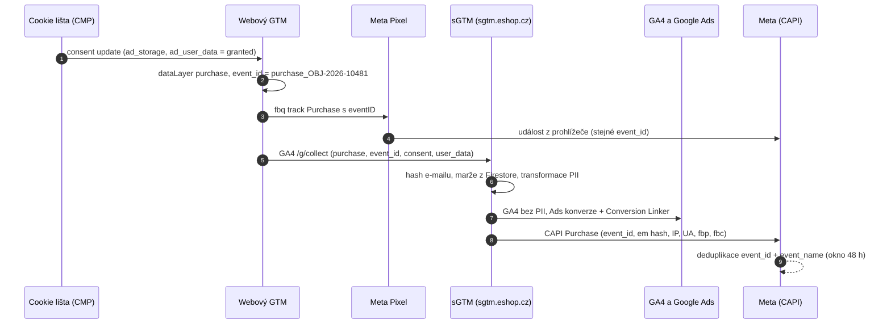
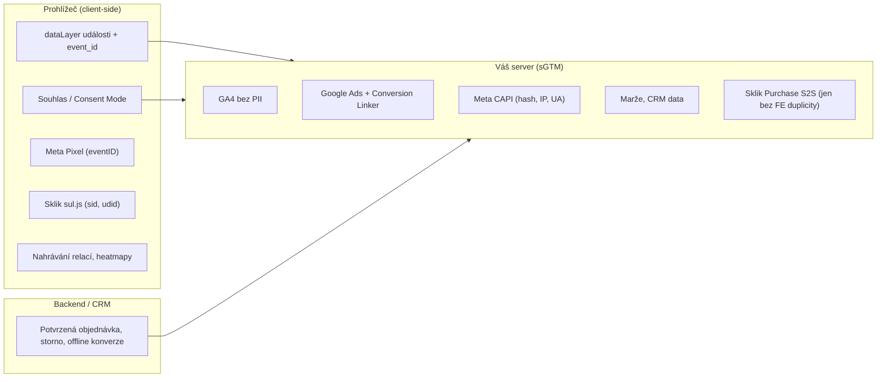

# B2: Propojení client-side a server-side trackingu: hybridní architektura krok za krokem – brief
> Cluster: B. Server-side & architektura · URL: /blog/propojeni-client-side-a-server-side · Formát: technický návod · Priorita: měsíc 1 · Cílová LP: /sluzby/server-side-tracking · Rozsah finálního článku: 3 200–4 000 slov (hodně kódu a tabulek)

**Strategický význam:** téma, které klient výslovně chce vysvětlovat („propojení server-side a front-end trackingu“). V českém SERP neexistuje článek, který by hybrid ukázal **v kódu** (dataLayer → web GTM → sGTM → platformy) včetně deduplikace, souhlasu a testování.

---

## 1. Meta

| Prvek | Návrh |
|---|---|
| H1 | Propojení client-side a server-side trackingu krok za krokem |
| SEO title (56 zn.) | Client-side + server-side tracking: návod \| datalayer.cz |
| Meta description (145 zn.) | Hybridní měření krok za krokem: web GTM → server GTM, event_id pro deduplikaci, předání souhlasu, obohacení o marži a testování. S ukázkami kódu. |
| URL | /blog/propojeni-client-side-a-server-side |
| Schema | `BlogPosting` + `HowTo` (kroky 1–8) + `FAQPage` + `BreadcrumbList` |

**Klíčová slova** (`kw_mapovani_na_stranky.tsv`, topic `server-side`, `konverze-ads`):
- Hlavní (strategické, nulový objem v Ahrefs): **propojení client side a server side tracking**, client-side vs. server-side
- Vedlejší: server side tracking (50), server side gtm (30), server side events (20), gtm server side (10), ga4 server side (10), server side tracking gtm (10), meta pixel capi (10), conversions api (10)
- Long-tail (0): facebook capi gtm server side, server side tracking google ads, ga4 server side events, google tag manager server side facebook, facebook pixel server side tracking, ga4 first party cookies
- Otázky: *How to setup server-side GTM?* (PAA) · *What is server-side tracking in Google Tag Manager?* (PAA) · *Is conversion API worth it?* (Ahrefs PAA, „facebook conversion api“) · z praxe: „Proč mám po nasazení CAPI dvojnásobek nákupů?“, „Musím nechat Meta Pixel v prohlížeči?“

**Záměr:** informační/návodový. **Čtenář:** technicky zdatný marketér, interní analytik, vývojář e-shopu nebo agenturní specialista, který už má webový GTM a chce přidat serverový kontejner. Segmenty: e-shop (hlavně), B2B (lead events), velká firma (governance, PII).

---

## 2. Analýza SERP a konkurence

**Dotaz „propojení client side a server side tracking“ (Google.cz, 8. 10. 2026, AI přehled ano):**

| Pozice | URL | Co nabízí | Co chybí |
|---|---|---|---|
| 1 | khoder.cz/server-side-tracking | definice, „co se kdy hodí“, kdy SST nepomůže | žádný postup, kód ani deduplikace |
| 2 | digitalniarchitekti.cz – server-side vs. client-side | srovnání přístupů | obecné, bez implementace |
| 3 | stape.io helpdesk – Why use both | argument pro hybrid (EN) | vázané na Stape |
| 4 | advisio.cz (04/2024) | pojmy client-side, server-side, server-side tagging | zastaralé, bez techniky |
| 5–8 | easyinsights.ai, mareklecian.cz, reddit, lead.box | obecná srovnání | – |

**Konkurenční profily:** nextanalytica.cz (diagram 2 sloupců, mockup EMQ), datanostro.com (Meta CAPI LP, krátké články), datimo.ai („proč kombinovat client-side a server-side“ – 4 odrážky), advisio.cz (článek o CAPI přes GTM – bez deduplikace a souhlasu).

**Čím je přeskočíme:**
1. **Kompletní tok dat v kódu**: `dataLayer.push` s `event_id` → Google tag s `server_container_url` → Meta Pixel s `eventID` → serverové tagy → platformy.
2. **Předání souhlasu do sGTM** a „consent gating“ ne-Google tagů (chyba, kterou nikdo nepopisuje: CAPI se spouští na cookieless pingy).
3. **Obohacení na serveru** (marže z Firestore, hash e-mailu) s funkčními šablonami sandboxed JS.
4. **Tabulka „co posílat client-side a co server-side“** pro GA4, Ads, Meta, Sklik, Heureku, nahrávání relací.
5. **Časté chyby ve formátu symptom → příčina → oprava** a **testovací protokol** se dvěma náhledy.

---

## 3. Otázky, na které musí článek odpovědět

1. Proč se v praxi kombinuje client-side a server-side (hybrid) místo čistého server-side?
2. Jak nasměrovat Google tag na serverový kontejner (`server_container_url` vs. starší `transport_url`)?
3. Jak vytvořit `event_id`, aby se nákup v Metě nepočítal dvakrát?
4. Musí Meta Pixel zůstat v prohlížeči, když posílám Conversions API?
5. Jak předat stav souhlasu do serverového kontejneru a jak zabránit, aby se Meta/Sklik tagy spustily bez souhlasu?
6. Jak doplnit marži nebo data z CRM, aniž by byla vidět v `dataLayer`?
7. Kde a jak hashovat e-mail – a proč ne jednou pro všechny platformy?
8. Co patří do prohlížeče a co na server (tabulka)?
9. Proč se po nasazení ztrácí gclid / konverze v Google Ads?
10. Proč mám v GA4 nebo v Metě dvojnásobek nákupů?
11. Jak testovat oba kontejnery najednou?
12. Jak ověřit, že na server dorazila správná IP adresa a user agent?

---

## 4. Rychlá odpověď (hotový text, 48 slov)

> **Hybridní měření** znamená, že prohlížeč dál sbírá události a souhlas (webový GTM, Meta Pixel), ale data posílá na váš serverový GTM. Ten je ověří, obohatí (marže, hash e-mailu) a rozešle do GA4, Google Ads, Mety a Skliku. Klíčem je společné `event_id` pro deduplikaci a předání souhlasu do serveru.

---

## 5. Osnova s obsahem odpovědí

### H2 1: Proč hybrid, a ne „všechno na server“
**Klíčové sdělení:** Prohlížeč je jediné místo, kde vzniká souhlas, kontext stránky a cookies platforem. Server je místo, kde data kontrolujete. Potřebujete obojí.

**Obsah:**
- Co umí jen prohlížeč: cookie lišta a Consent Mode, čtení `_fbp`/`_fbc`, Sklik `sid`/`udid` (vytváří je `sul.js`), nahrávání relací, scroll/kliky.
- Co umí jen server: data z backendu (marže, stav objednávky, CRM), tajné tokeny (Meta access token nesmí být v prohlížeči), hashování a odstraňování PII, jeden proud událostí do více platforem.
- Meta sama doporučuje „redundant setup“ = Pixel + Conversions API se stejnými událostmi a deduplikací (developers.facebook.com/documentation/ads-commerce/conversions-api/deduplicate-pixel-and-server-events).
- Seznam: `sul.js` je **povinný i pro S2S** (napoveda.sklik.cz … /server-to-server-s2s-mereni/).
- Google jde stejným směrem: v roce 2026 oznámil, že serverová data spojuje s „paralelními signály z prohlížeče“ – u sGTM a Google Ads propojených s GA4 (release notes 1. 5. 2026) a u server-to-server konverzí Floodlight s gclid (22. 6. 2026). Prohlížečová vrstva tedy dál nese hodnotu i pro Google.
- Odkaz na pilíř B1 (architektura, cookies, náklady).

### H2 2: Architektura hybridu v jednom diagramu
Diagram D1 (sekvenční) + D2 (rozdělení odpovědností). Text: 6 kroků slovy (souhlas → událost → pixel → GA4 požadavek na server → transformace → platformy + deduplikace).

### H2 3: Krok 1 – Datová vrstva s `event_id` a stabilním `transaction_id`
**Klíčové sdělení:** Deduplikace se rozhoduje v datové vrstvě. Bez stabilního ID události ji žádný server nezachrání.

**Pravidla:**
- `transaction_id` = číslo objednávky z backendu (stejné v administraci, GA4, Ads, Metě, Skliku).
- `event_id` pro nákup odvodit deterministicky z objednávky (`purchase_OBJ-2026-10481`) – Meta výslovně uvádí číslo objednávky jako vhodné `event_id`.
- Pro ostatní události (AddToCart, Lead) generovat UUID **jednou na událost** a použít ho pro všechny tagy této události.
- Hodnotu posílat jako číslo s desetinnou tečkou, měnu vždy; v měřicím plánu určit, zda je `value` s DPH, nebo bez (Sklik SEM vyžaduje bez DPH – B6).
- `user_data` jen se souhlasem, jen na serverovou cestu (krok 6) – nikdy marži, nákupní cenu ani interní data.

**Kód 1 – děkovací stránka (renderuje backend, jen jednou na objednávku):**
```js
window.dataLayer = window.dataLayer || [];
dataLayer.push({ ecommerce: null });           // vyčistí předchozí ecommerce objekt
dataLayer.push({
  event: 'purchase',
  event_id: 'purchase_OBJ-2026-10481',         // stejné ID pro GA4→sGTM, Meta Pixel i CAPI
  ecommerce: {
    transaction_id: 'OBJ-2026-10481',          // = číslo objednávky v administraci
    value: 3545.45,                            // bez DPH (dle měřicího plánu)
    tax: 744.55,
    shipping: 99,
    currency: 'CZK',
    items: [{
      item_id: 'SKU-123',
      item_name: 'Trekové boty Alpina',
      item_category: 'Obuv',
      price: 3545.45,
      quantity: 1
    }]
  },
  user_data: {                                 // plaintext jen přes HTTPS na VÁŠ server
    email: 'jan.novak@example.cz',             // hash až v sGTM – pro každou platformu podle jejích pravidel
    phone_number: '+420601234567'
  }
});
```
*Poznámka pro backend:* push renderovat jen při prvním zobrazení děkovací stránky (příznak v DB), jinak reload = druhý nákup.

**Kód 2 – GTM proměnná „JS – event_id“ (Custom JavaScript, pro události bez vlastního ID):**
```js
function () {
  // Pokud web poslal event_id v dataLayer, použijeme ho (nákupy).
  var fromDL = {{DLV - event_id}};
  if (fromDL) return fromDL;
  // Jinak 1 ID na 1 událost dataLayeru – sdílené všemi tagy, které tato událost spustí.
  var uid = {{DLV - gtm.uniqueEventId}};
  window.__dlEventIds = window.__dlEventIds || {};
  if (!window.__dlEventIds[uid]) {
    window.__dlEventIds[uid] = (window.crypto && window.crypto.randomUUID)
      ? window.crypto.randomUUID()
      : Date.now() + '.' + Math.random().toString(36).slice(2, 10);
  }
  return window.__dlEventIds[uid];
}
```
(`DLV - gtm.uniqueEventId` = proměnná datové vrstvy s názvem `gtm.uniqueEventId`.)

### H2 4: Krok 2 – Nasměrování Google tagu na serverový kontejner
**Klíčové sdělení:** Jeden parametr v nastavení Google tagu přepne odesílání z `google-analytics.com` na vaši doménu.

**Postup (GTM web):**
1. Proměnná typu **Google tag: Configuration settings** → parametr `server_container_url` = `https://sgtm.eshop.cz` (nebo `https://www.eshop.cz/metrics` při same-origin).
2. Totéž nastavení použít v Google tagu; spouštěč **Initialization – All Pages**.
3. Proměnná **Google tag: Event settings** (sdílená všemi GA4 event tagy) s parametry: `event_id` = `{{JS - event_id}}`, `consent_ad_storage` = `{{Consent - ad_storage}}`, `consent_ad_user_data` = `{{Consent - ad_user_data}}`, `x-fb-ck-fbp` = `{{Cookie - _fbp}}`, `x-fb-ck-fbc` = `{{Cookie - _fbc}}`.
4. Pro rozšířené konverze a CAPI: konfigurační parametr `user_data` v Google tagu (proměnná *User-Provided Data*) – Google: developers.google.com/tag-platform/tag-manager/server-side/ads-setup.
- **`transport_url`**: starší název parametru (GA4 Configuration tag, Meta ho v návodu pro sGTM stále uvádí spolu s `first_party_collection: true`). U nových implementací používat `server_container_url`; pokud najdete `transport_url`, sjednotit.
- **CSP**: povolit doménu serveru v `img-src`, `connect-src`, `frame-src` (Google send-data).

**Kód 3 – stejné nastavení v gtag.js (weby bez GTM):**
```js
gtag('config', 'G-XXXXXXX', {
  server_container_url: 'https://sgtm.eshop.cz'
});
gtag('event', 'purchase', {
  event_id: 'purchase_OBJ-2026-10481',
  transaction_id: 'OBJ-2026-10481',
  value: 3545.45,
  currency: 'CZK',
  items: [{ item_id: 'SKU-123', price: 3545.45, quantity: 1 }]
});
```

### H2 5: Krok 3 – Meta Pixel v prohlížeči se stejným `eventID`
**Klíčové sdělení:** Pixel zůstává (redundant setup). Deduplikace funguje jen tehdy, když se shoduje `eventID` (pixel) s `event_id` (CAPI) **a** název události.

**Fakta (Meta):** shoda `event_id` + `event_name` u stejného Pixel ID; okno **48 hodin** od první události; pokud dorazí obě do **5 minut**, Meta upřednostní událost z prohlížeče; `eventID` je 4. argument `fbq`. Alternativa `fbp`/`external_id` funguje jen pro pořadí „nejdřív prohlížeč, pak server“ (developers.facebook.com/…/server-event + deduplicate…).

**Kód 4 – GTM Custom HTML „Meta – Purchase“ (spouštěč CE `purchase`, consent: vyžaduje `ad_storage`):**
```html
<script>
  fbq('track', 'Purchase', {
    value: {{DLV - ecommerce.value}},
    currency: {{DLV - ecommerce.currency}},
    content_ids: {{JS - item_ids}},          // ['SKU-123']
    content_type: 'product'
  }, {
    eventID: {{JS - event_id}}               // MUSÍ být stejné jako event_id v CAPI
  });
</script>
```
- Souhlas v Pixelu: `fbq('consent', 'revoke')` před `init`, `fbq('consent', 'grant')` po souhlasu (developers.facebook.com/docs/meta-pixel/implementation/gdpr). V GTM obvykle řešeno spouštěním tagů jen se souhlasem.

### H2 6: Krok 4 – Předání souhlasu do serverového kontejneru
**Klíčové sdělení:** Consent Mode nastavujete jen ve webu; Google tagy na serveru ho převezmou samy. Ostatní tagy na serveru musíte „zamknout“ podle souhlasu vy.

**Obsah:**
- Google: „you only need to set up consent mode in the web container“; GA4 v basic režimu bez souhlasu nic nepošle, v advanced režimu posílá data bez cookies; Ads Remarketing a Floodlight při `ad_storage=denied` neposílají požadavky (developers.google.com/…/server-side/consent-mode).
- **Past advanced režimu:** sGTM přijímá i požadavky bez souhlasu → serverový tag Meta CAPI nebo Sklik S2S se spustí, pokud ho nezablokujete spouštěčem.
- Doporučené řešení: explicitní parametr `consent_ad_storage` (a `consent_ad_user_data`) v každé události (krok 2, bod 3) + podmínka ve spouštěči na serveru. Alternativa: parametr stavu souhlasu, který Google tag posílá sám (v sGTM bývá v event data jako `x-ga-gcs`) – formát ověřit v náhledu před použitím.

**Kód 5 – šablona proměnné ve webovém GTM „Consent state“ (Custom Template; oprávnění *Accesses consent state* → čtení `ad_storage`, `ad_user_data`):**
```js
// Pole šablony: consentType (text), např. "ad_storage"
const isConsentGranted = require('isConsentGranted');
return isConsentGranted(data.consentType) ? 'granted' : 'denied';
```
**Spouštěč v sGTM „CE – purchase + ad consent“:** Custom Event `purchase` AND `{{ED - consent_ad_storage}}` equals `granted` AND `{{ED - consent_ad_user_data}}` equals `granted`.

### H2 7: Krok 5 – Serverový kontejner: klient, proměnné, tagy
**Klíčové sdělení:** Na serveru stačí jeden klient (GA4) a sada „Event Data“ proměnných; tagy pak čtou stejná data.

**Konfigurace (tabulka T2 v kap. 6):**
- **Klienti:** Google Analytics: GA4 (výchozí, poslouchá `/g/collect`); Web Container klient, pokud servírujete `gtm.js`/`gtag.js` z vlastní domény (od 6/2025 doporučená cesta pro skripty).
- **Proměnné (typ Event Data):** `event_id`, `transaction_id`, `value`, `currency`, `items`, `consent_ad_storage`, `consent_ad_user_data`, `user_data.email_address`, `user_data.phone_number`, `page_location`, `ip_override`, `user_agent`, `x-fb-ck-fbp`, `x-fb-ck-fbc`.
- **Tagy:**
  1. *Google Analytics: GA4* – všechny události; transformace vyloučí `user_data`, `x-fb-*`, `consent_*` (kód 8).
  2. *Conversion Linker* – všechny stránky („in most cases“ doporučené, Google ads-setup).
  3. *Google Ads Conversion Tracking* – CE `purchase`; hodnotu lze nahradit proměnnou (marže, kód 7); rozšířené konverze přes `user_data` (Google: předzahashované klíče s prefixem `sha256_`).
  4. *Conversions API Tag* (šablona Meta „facebookincubator“ z Community Template Gallery) – Pixel ID, access token, `action_source = website`; spouštěč s consent podmínkou. Alternativně šablona Stape. Detail parametrů v B5.
  5. *Sklik SEM S2S* – jen pokud Purchase **neposíláte** zároveň z prohlížeče (Seznam zatím nededuplikuje, B6).

### H2 8: Krok 6 – Obohacení a úprava dat na serveru
**Klíčové sdělení:** Data, která nesmí do prohlížeče (marže, nákupní ceny, segment zákazníka), přidejte až na serveru. Osobní údaje hashujte zvlášť pro každou platformu.

#### H3 8.1 Hash e-mailu podle pravidel platformy
- Meta: SHA-256 z e-mailu po ořezání mezer a převodu na malá písmena; telefon jen číslice s předvolbou, bez úvodních nul (`420601234567`); `client_ip_address`, `client_user_agent`, `fbc`, `fbp` **nehashovat** (Meta customer information parameters).
- Google rozšířené konverze mají vlastní normalizaci (u adres gmail.com/googlemail.com navíc odstranění teček před doménou – **ověřit v aktuální dokumentaci Google Ads**) → proto neposílat jeden „univerzální“ hash z webu, ale hashovat na serveru zvlášť.
- Seznam S2S: SHA-256 hex, telefon ve formátu E.164 (`+420…`), `review_email` se **nehashuje** (B6).

**Kód 6 – šablona proměnné v sGTM „SHA-256 e-mail (Meta)“ (oprávnění: Reads event data → `user_data.email_address`):**
```js
const getEventData = require('getEventData');
const sha256Sync = require('sha256Sync');
const makeString = require('makeString');

const raw = getEventData('user_data.email_address');
if (!raw) return undefined;                        // bez e-mailu nic neposíláme
const normalized = makeString(raw).trim().toLowerCase();
return sha256Sync(normalized, { outputEncoding: 'hex' });   // 64 znaků hex
```

#### H3 8.2 Marže z Firestore (bez zveřejnění v dataLayer)
- sGTM má Firestore API a proměnnou *Firestore Lookup* (GTM release notes 24. 3. 2022). Produktová marže se synchronizuje z ERP do kolekce `products` (dokument = `item_id`).
- Výsledek použít jako hodnotu konverze v Google Ads (optimalizace na zisk / POAS) nebo jako parametr `margin` do GA4 (vlastní metrika) – rozhodnutí v měřicím plánu. Odkaz F4 Propojení dat e-shopu a CRM.

**Kód 7 – šablona proměnné v sGTM „Marže objednávky“ (oprávnění: Reads event data → `items`; Access Firestore → read `products/*`, projekt dle pole `gcpProjectId`):**
```js
const Firestore = require('Firestore');
const Promise = require('Promise');
const getEventData = require('getEventData');
const makeNumber = require('makeNumber');

const items = getEventData('items') || [];
if (!items.length) return 0;

return Promise.all(items.map((item) => {
  return Firestore.read('products/' + item.item_id, { projectId: data.gcpProjectId })
    .then(
      (doc) => makeNumber(doc.data.margin_unit) * makeNumber(item.quantity || 1),
      () => 0                                       // produkt nenalezen → 0, objednávka se neztratí
    );
})).then((margins) => {
  let total = 0;
  margins.forEach((m) => { total += m; });
  return total;
});
```
*Poznámka:* ověřit na testovacím kontejneru; u velkého objemu zvážit cache (`templateDataStorage`) kvůli počtu čtení Firestore.

#### H3 8.3 Transformace: co nesmí do GA4
- *Transformations* v sGTM: typy Allow / Augment / Exclude parameters; lze je omezit na konkrétní tagy (GTM release notes 7. 6. 2023, 24. 8. 2023).
- **Kód 8 – nastavení (slovně pro mockup):** Transformace „Exclude – PII pro GA4“: typ *Exclude parameters*, parametry `user_data`, `x-fb-ck-fbp`, `x-fb-ck-fbc`, `consent_ad_storage`, `consent_ad_user_data`; *Affected tags*: Google Analytics: GA4. Transformace „Augment – marže“: typ *Augment event*, parametr `margin` = `{{Marže objednávky}}`, podmínka `event_name equals purchase`.

### H2 9: Co posílat client-side a co server-side
Tabulka T1 (kap. 6) + krátký komentář ke každé platformě.

### H2 10: Časté chyby (symptom → příčina → oprava)
Tabulka T3 (kap. 6). Pod tabulkou zvýraznit 3 nejdražší chyby: dvojité nákupy v Metě, CAPI bez souhlasu, IP adresa CDN místo uživatele.

### H2 11: Testování: dva náhledy, jeden protokol
**Klíčové sdělení:** Spusťte náhled webového i serverového kontejneru současně a projděte scénáře souhlasu. Bez protokolu se chyby najdou až v reklamním účtu.

**Postup:**
1. **Web GTM → Preview** (Tag Assistant): ověřit, že Google tag posílá požadavky na `sgtm.eshop.cz` (Summary → Output → Hits sent), že `event_id` je u pixelu i GA4 stejné.
2. **Server GTM → Preview** v druhé kartě (Meta: oba náhledy lze spustit zároveň; po změně konfigurace náhled restartovat). Kontrolovat záložky *Request* (příchozí `/g/collect`), *Event Data* (`event_id`, `consent_ad_storage`, `user_data`, `ip_override`, `user_agent`), *Tags* (fired/not fired), *Outgoing HTTP requests* (status 200 z `graph.facebook.com`, `google-analytics.com`).
3. **Meta Events Manager → Test Events:** `test_event_code` vložit do CAPI tagu (před publikací odstranit); u události musí být vidět zdroj Prohlížeč i Server a deduplikace. Data v přehledu se objeví do 20 minut (Meta verifying setup).
4. **GA4 DebugView** (režim náhledu) – události bez `user_data`.
5. **Google Ads** – diagnostika konverzní akce, stav „Recording conversions“ za 24–48 h (ukázkové okno, ověřit).
6. **Scénáře souhlasu:** (a) odmítnout vše → v sGTM přichází jen cookieless GA4 požadavek, Meta/Sklik tagy *Not fired*; (b) přijmout vše → všechny tagy *Fired*; (c) přijmout jen analytiku.
7. **Safari:** Web Inspector → Storage → Cookies: doména a expirace serverových cookies (ověření same-origin/IP, B1).
8. **Paralelní běh 7–14 dní:** porovnat počty nákupů a tržby (administrace vs. GA4 vs. Ads vs. Meta) – tabulka v reportu.

### H2 12: Shrnutí a checklist (10 bodů ke stažení – lead magnet)
`event_id` v dataLayer ✓ · `server_container_url` ✓ · Pixel `eventID` ✓ · consent parametry ✓ · consent spouštěče na serveru ✓ · transformace PII ✓ · Conversion Linker ✓ · CAPI test events ✓ · IP/UA na serveru ✓ · paralelní běh ✓.

---

## 6. Vizuály

### D1 – Sekvenční diagram hybridního toku (hlavní vizuál, pod H2 2)

**Finální SVG/animace:** 6 svislých „drah“ (CMP, Web GTM, Pixel, sGTM, Google, Meta) na pozadí `#020d1e`; zprávy jako přerušované šipky s animovaným tokem (cyan `#00ffff`), krok s hashováním na sGTM zvýraznit oranžově `#ff7400` („data upravujete vy“), deduplikace jako ikona dvou kapek splývajících v jednu. Popisky Roboto Mono 11–12 px. Mobil: přepnout na vertikální stepper (1–9) s rozbalovacími kartami. Respektovat `prefers-reduced-motion`. Interaktivní kroky → `diagram_interaction` (`diagram_id: b2-hybrid`).

### D2 – Rozdělení odpovědností (pod H2 9)

**SVG:** tři sloupce-karty, šipky z prohlížeče a backendu do serveru, server rozbočuje do platforem (log-tečky dle piktogramu „Konverze“ z architektury). Na mobilu karty pod sebou.

### T1 – Co posílat client-side a co server-side
| Platforma / úloha | Client-side (prohlížeč) | Server-side (sGTM / backend) | Poznámka |
|---|---|---|---|
| Souhlas (CMP, Consent Mode v2) | ✅ jediné místo vzniku | ⬅️ jen přebírá stav | výchozí `denied` před načtením tagů (A1) |
| GA4 | ⬆️ Google tag posílá na server | ✅ tag GA4 v sGTM | transformací odstranit PII |
| Google Ads konverze | ❌ (jedna cesta, ne obě) | ✅ Ads tag + Conversion Linker | marži jako hodnotu lze přidat jen na serveru |
| Google Ads remarketing | ❌ / ✅ dle nastavení | ✅ serverový tag existuje | respektuje `ad_storage` |
| Meta | ✅ Pixel se `eventID` | ✅ CAPI se `event_id` | Meta doporučuje obojí + deduplikaci |
| Sklik / Seznam (SEM) | ✅ `sul.js` povinný (PageView, ViewContent…, cookies sid/udid) | ✅ S2S volitelně | stejnou událost neposílat FE i S2S (zatím bez deduplikace) |
| Heureka Ověřeno zákazníky | dle Heureky (měřicí kód) | backend / API objednávky | ověřit aktuální dokumentaci Heureky |
| Nahrávání relací (Clarity, Hotjar) | ✅ jen v prohlížeči | ❌ | potřebuje DOM |
| Marže, nákupní ceny, segment zákazníka | ❌ nikdy v dataLayer | ✅ Firestore / API | konkurence by je přečetla v DevTools |
| Hashování PII | ❌ (jen výjimečně) | ✅ zvlášť pro každou platformu | rozdílné normalizace |
| Storna, vratky, offline konverze | ❌ | ✅ backend → API | E3 Offline konverze z CRM |

### T2 – Konfigurace serverového kontejneru (checklist pro mockup)
| Typ | Název | Nastavení | Spouštěč |
|---|---|---|---|
| Klient | Google Analytics: GA4 | výchozí | – |
| Klient | Web Container | servírování gtm.js/gtag.js | – |
| Proměnná | ED - event_id | Event Data `event_id` | – |
| Proměnná | ED - consent_ad_storage | Event Data `consent_ad_storage` | – |
| Proměnná | SHA256 - email (Meta) | šablona, kód 6 | – |
| Proměnná | Marže objednávky | šablona, kód 7 | – |
| Transformace | Exclude – PII pro GA4 | Exclude `user_data`, `x-fb-*`, `consent_*` | tag GA4 |
| Tag | GA4 – všechny události | Measurement ID z události | All events (klient GA4) |
| Tag | Conversion Linker | výchozí | All pages |
| Tag | Google Ads – Nákup | Conversion ID/Label, hodnota = marže (volitelně) | CE purchase |
| Tag | Meta CAPI | Pixel ID, token, action_source website | CE purchase/add_to_cart/… + consent granted |

### T3 – Časté chyby
| Symptom | Příčina | Oprava |
|---|---|---|
| GA4 má 2× víc událostí | zůstal starý GA4 tag/gtag posílající přímo na Google + nový přes server; nebo dva Google tagy se stejným ID | jedna cesta; audit tagů (C4) |
| Meta hlásí 2× víc nákupů | `eventID` v Pixelu chybí, nebo Pixel a CAPI generují vlastní ID; jiný název události | jedno `event_id` z dataLayer; v Test Events ověřit deduplikaci |
| Nákup 2× po obnovení děkovací stránky | push se renderuje při každém zobrazení | příznak „odesláno“ v DB/session |
| CAPI posílá data i bez souhlasu | v advanced Consent Mode chodí na server cookieless pingy, spouštěč nekontroluje souhlas | consent parametr + podmínka ve spouštěči |
| Nízké Event Match Quality, špatná geolokace | CDN/proxy před sGTM nepředává skutečnou IP (`X-Forwarded-For`) → všechny události s IP proxy | předávat IP klienta, ověřit `ip_override` v náhledu |
| Chybí `client_user_agent` / `event_source_url` v CAPI | upravený klient, chybějící `page_location` | ověřit Event Data; Meta je vyžaduje u webových událostí |
| Konverze v Google Ads klesly po přechodu | chybí Conversion Linker v serverovém kontejneru; přesměrování ořezává `gclid`; platební brána jako referral | Conversion Linker (All pages), test URL s `gclid`, vyloučení odkazujících domén |
| Hodnota 0 nebo NaN | `value` jako text „3 545,45“ | číslo s desetinnou tečkou |
| Events Manager: „Server“ bez „Prohlížeč“ | Pixel blokuje CSP/consent | povolit domény, ověřit consent |
| sGTM preview ukazuje událost, GA4 nic | tag GA4 v sGTM chybí nebo má špatný spouštěč | tag GA4 na všechny události klienta GA4 |
| Požadavky na server selhávají | CSP blokuje doménu serveru | `img-src`, `connect-src`, `frame-src` |

### M1 – Mockup sGTM Preview (pod H2 11)
Stylizovaný výřez: záložka *Event Data* s řádky `event_name: purchase`, `event_id: purchase_OBJ-2026-10481`, `consent_ad_storage: granted`, `user_data.email_address: ••••@example.cz` (rozmazáno), `ip_override: 203.0.113.24`; vedle *Outgoing HTTP Requests*: `POST graph.facebook.com/v25.0/…/events → 200`, `POST region1.google-analytics.com/g/collect → 204`. Fiktivní data, brand barvy.

### M2 – Mockup Meta Test Events (pod H2 11)
Řádek „Purchase · Prohlížeč a server · Deduplikováno“, `event_id` shodné, zelený štítek. Fiktivní data.

### Infografika I1 – „Checklist hybridního měření“ (1080×1350 + PDF lead magnet)
10 bodů z H2 12 ve 2 sloupcích, ikony podle piktogramového systému (`dataLayer`, `sgtm`, `consent`, `conversion`), dole CTA `[ Konzultovat server-side ]`. PDF jako výměna za e-mail až ve fázi 2 (nyní volně ke stažení).

---

## 7. Fakta a zdroje

| Tvrzení | Zdroj | Ověřeno | Riziko zastarání |
|---|---|---|---|
| `server_container_url` v *Google tag: Configuration settings*, spouštěč Initialization – All Pages; CSP direktivy | https://developers.google.com/tag-platform/tag-manager/server-side/send-data?option=GTM | 10/2026 | střední |
| Meta návod pro sGTM: `transport_url`, `first_party_collection`, `x-fb-ck-fbp`/`x-fb-ck-fbc`, oba náhledy současně, Test Events | https://developers.facebook.com/documentation/ads-commerce/conversions-api/guides/gtm-server-side | 10/2026 | střední |
| Deduplikace `event_id` + `event_name`, 48 h, 5 min preference prohlížeče, `eventID` jako 4. argument fbq | https://developers.facebook.com/documentation/ads-commerce/conversions-api/deduplicate-pixel-and-server-events ; …/parameters/server-event | 10/2026 | nízké |
| Hashování Meta, IP/UA/fbc/fbp nehashovat, telefon s předvolbou | https://developers.facebook.com/documentation/ads-commerce/conversions-api/parameters/customer-information-parameters | 10/2026 | nízké |
| `fbq('consent','revoke'/'grant')` | https://developers.facebook.com/docs/meta-pixel/implementation/gdpr | 10/2026 | nízké |
| Consent Mode jen ve webovém kontejneru; chování GA4/Ads/Floodlight na serveru | https://developers.google.com/tag-platform/tag-manager/server-side/consent-mode | 10/2026 | střední |
| Conversion Linker v sGTM, Ads tag, `user_data`, prefix `sha256_` | https://developers.google.com/tag-platform/tag-manager/server-side/ads-setup | 10/2026 | střední |
| Transformations (6/2023, tag types 8/2023), Firestore API (3/2022), Web Container klient (6/2025) | https://support.google.com/tagmanager/answer/4620708 | 10/2026 | střední |
| Sklik: `sul.js` povinný i pro S2S; S2S a FE neposílat současně (deduplikace v přípravě) | https://napoveda.sklik.cz/merici-skripty/seznam-event-measurement/implementace-sem/server-to-server-s2s-mereni/ ; …/zaciname-se-sem/co-je-dobre-vedet/ | 10/2026 | **vysoké** |
| Google normalizace gmail adres (tečky) | dokumentace Google Ads – rozšířené konverze | **neověřeno – ověřit před publikací** | střední |
| API sandboxu sGTM: `sha256Sync`, `Firestore.read`, `Promise.all`, `getEventData` | https://developers.google.com/tag-platform/tag-manager/server-side/api | ověřit při testu šablon | nízké |
| `isConsentGranted` v šablonách webového GTM | https://developers.google.com/tag-platform/tag-manager/templates/api | ověřit při testu šablon | nízké |

---

## 8. Interní odkazy a CTA

**Cílová LP:** `/sluzby/server-side-tracking`

**CTA box (za H2 8 – obohacení):**
- Nadpis: **Hybridní měření bez dvojitých konverzí**
- Text: Navrhneme datovou vrstvu s `event_id`, propojíme webový a serverový GTM, nastavíme deduplikaci s Metou, předání souhlasu a obohacení o marži. Dostanete testovací protokol a dokumentaci obou kontejnerů.
- Tlačítko: `[ Chci hybridní měření ]` → `/sluzby/server-side-tracking#kontakt`

**Související články:** B1 [Server-side tracking – průvodce](/blog/server-side-tracking-pruvodce) · B5 [Meta Conversions API](/blog/meta-conversions-api) · B6 [Seznam Event Measurement](/blog/seznam-event-measurement-sklik) · B3 [Kde provozovat sGTM](/blog/hosting-server-side-gtm) · C1 [Datová vrstva – specifikace](/blog/datova-vrstva-specifikace) · C2 [GA4 e-commerce dataLayer](/blog/ga4-ecommerce-datalayer) · A1 [Consent Mode v2](/blog/consent-mode-v2-pruvodce) · E2 [Rozšířené konverze](/blog/rozsirene-konverze) · F4 [Propojení dat e-shopu a CRM s GA4](/blog/propojeni-dat-eshop-crm-ga4) · D2 [Proč nesedí čísla](/blog/proc-nesedi-data)

**Navazující LP:** `/sluzby/mereni-konverzi`, `/sluzby/datova-vrstva`

**Slovník:** Deduplikace (event_id) · Conversions API · Server-side tagging · Consent Mode · GCLID / gbraid / wbraid · Datová vrstva · Measurement Protocol

**Zkrácený kontaktní blok:** `form_id: blog`, předvybraná témata `server-side`, `konverze`; H2 „Řešíte totéž u sebe?“; placeholder „Např. po nasazení CAPI vidíme v Metě dvojnásobek nákupů…“.

---

## 9. FAQ pro schema

**Musím po nasazení Conversions API vypnout Meta Pixel?**
Ne. Meta doporučuje takzvaný redundantní setup: stejné události posílat z prohlížeče přes Pixel i ze serveru přes Conversions API. Aby se nákupy nepočítaly dvakrát, musí obě události mít stejný název a stejné event_id. Meta pak událost, která dorazí později v okně 48 hodin, zahodí. Pixel navíc poskytuje kontext prohlížeče, který server sám nemá.

**Jak vytvořit event_id pro deduplikaci?**
U nákupu odvoďte event_id z čísla objednávky, například purchase_OBJ-2026-10481. U ostatních událostí vygenerujte jedno UUID na událost v dataLayer a použijte ho pro všechny tagy, které tato událost spustí – Meta Pixel jako eventID i GA4 požadavek na server jako parametr event_id. Serverový tag ho pak předá do Conversions API.

**Jak předat souhlas uživatele do server-side GTM?**
Consent Mode nastavujete jen ve webovém kontejneru a Google tagy na serveru stav souhlasu převezmou z požadavku. Ostatní serverové tagy, například Meta CAPI nebo Sklik S2S, ale souhlas samy nekontrolují. Posílejte proto v každé události parametr se stavem ad_storage a ve spouštěči serverového tagu nastavte podmínku, že musí být granted.

**Proč po přechodu na server-side ubyly konverze v Google Ads?**
Nejčastěji chybí tag Conversion Linker v serverovém kontejneru, takže se neukládá informace o prokliku (gclid). Další příčiny: přesměrování, které ořízne parametry z URL, platební brána započtená jako nový zdroj návštěvy nebo chybějící souhlas. Ověřte to v náhledu serverového kontejneru s testovací URL obsahující gclid.

**Kde hashovat e-mail – v prohlížeči, nebo na serveru?**
Na serveru. Každá platforma má trochu jiná pravidla normalizace (Meta, Google, Seznam), takže jeden hash vytvořený v prohlížeči nemusí sedět všem. Na vlastní server posílejte data přes HTTPS a hashujte je v serverovém kontejneru zvlášť pro každou platformu. Do GA4 osobní údaje nepouštějte vůbec – odstraňte je transformací.

---

## 10. Poznámky pro autora

- **Kód testovat** na demo e-shopu (fiktivní data) a ke každé šabloně uvést „otestováno [datum]“. Kód 7 (Firestore) a kód 5 (isConsentGranted) vyžadují správně nastavená oprávnění šablon – v článku popsat.
- **Parametr stavu souhlasu z Google tagu (`x-ga-gcs`)** – neuvádět jako hlavní řešení, formát se může měnit; ověřit v náhledu.
- **Normalizace e-mailu pro Google** (gmail tečky) – před publikací ověřit v dokumentaci Google Ads; pokud se nepotvrdí, formulovat obecně „Google má vlastní pravidla normalizace“.
- **Seznam S2S deduplikace** – stav „v přípravě“ ověřit před publikací i při každé revizi.
- **Zastarávání:** střední až vysoké (GTM UI, Meta API verze v25.0 v ukázkách, Seznam). Revize 6 měsíců.
- **Od klienta:** [DOPLNIT: anonymizovaný příklad z praxe – např. podíl deduplikovaných nákupů nebo zlepšení EMQ po úpravě, s obdobím] · [DOPLNIT: screenshot Test Events bez citlivých dat].
- **Doporučený autor:** Vít Novotný; recenze: vývojář e-shopu (část dataLayer/backend).
