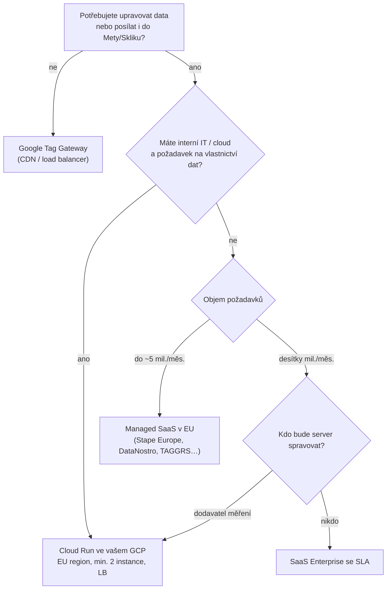

# B3: Kde provozovat server-side GTM: Stape, Google Cloud Run, nebo český hosting? – brief
> Cluster: B. Server-side & architektura · URL: /blog/hosting-server-side-gtm · Formát: srovnání + modelový výpočet · Priorita: měsíc 2 · Cílová LP: /sluzby/server-side-tracking · Rozsah finálního článku: 2 500–3 200 slov

**Pozor na ceny:** všechny ceny v článku uvádět **s datem ověření (8. 10. 2026)**, bez DPH, v měně ceníku. Kurz neuvádět natvrdo – buď „≈ Kč při kurzu ČNB k [DOPLNIT datum publikace]“, nebo jen originální měna. Klient vlastní ceny neuvádí (rozhodnutí klienta) – článek srovnává jen **infrastrukturu**, ne cenu implementace.

---

## 1. Meta

| Prvek | Návrh |
|---|---|
| H1 | Kde provozovat server-side GTM: Stape, Cloud Run, nebo jinde? |
| SEO title (59 zn.) | Hosting server-side GTM: Stape vs. Cloud Run \| datalayer.cz |
| Meta description (147 zn.) | Stape, Google Cloud Run, DataNostro, Addingwell, nebo TAGGRS? Srovnání cen podle požadavků, umístění dat v EU, SLA a lock-inu s modelovými výpočty. |
| URL | /blog/hosting-server-side-gtm |
| Schema | `BlogPosting`, `FAQPage`, `BreadcrumbList`; srovnávací tabulka jako HTML `<table>` (ne obrázek) |

**Klíčová slova** (`kw_mapovani_na_stranky.tsv`, topic `server-side`):
- Hlavní: **stape (80)** – navigační, ale srovnání „Stape vs. …“ pokryje informační část
- Vedlejší: stape pricing (10), stape io (10), server side gtm (30), server side tracking (50)
- Long-tail (0): server side gtm cost, gtm server side cloud run, stape server gtm, stape ga4, server-side gtm hosting
- SERP dotazy: „stape server side cena“, „implementace server side tracking cena“
- Otázky z praxe: Kolik stojí Stape? Je Stape v EU? Je levnější Google Cloud, nebo Stape? Co je custom loader? Můžu později přejít jinam?

**Záměr:** komerčně-informační (výběr dodavatele). **Čtenář:** marketingový/e-commerce manažer nebo analytik, který se rozhodl pro sGTM a řeší, kde ho provozovat; IT/DPO velké firmy (umístění dat, smlouvy). Segment: e-shopy (hlavně), velké firmy.

---

## 2. Analýza SERP a konkurence

| Dotaz (8. 10. 2026) | TOP výsledky | Pozorování |
|---|---|---|
| stape server side cena | stape.io/price, stape.io/price-gateway, stape.io/blog „Why Stape is cheaper than Google Cloud“, stape.io/price-meta-signals-gateway, stape.io, scaleway.com (marketplace), apps.shopify.com, **datanostro.com – Kolik stojí server-side tracking**, ecom-tools.de | SERP ovládá Stape vlastním obsahem (srovnání psané dodavatelem). Česky jen DataNostro (taky dodavatel). |
| implementace server side tracking cena | datimo.ai/cz/cenik, datanostro.com/cs/pricing, ads-agency.cz, nextanalytica.cz/server-side-tracking, khoder.cz, datanostro (blog), mirandamedia.cz, digitalniarchitekti.cz (SGTM), reddit | Ceníky implementace a SaaS, žádné nezávislé srovnání hostingů. |

**Profily:** datanostro.com (vlastní srovnání „Stape vs Addingwell vs Google Cloud vs DataNostro 2026“, tvrdí −10–13 % vs. Stape a ~−60 % vs. Google Cloud; cena GCP v jejich článku „nižší stovky korun“), nextanalytica.cz (SST od 1 390 Kč/měs., Azure), advisio.cz (DataPlus od 800 Kč/měs., black-box), datimo.ai (modul SST 1 299 Kč/měs.).

**Čím je přeskočíme:**
1. **Nezávislost** – datalayer.cz hosting neprodává; srovnání podle kritérií, ne podle provize (pokud klient vstoupí do partnerského programu, uvést to v textu – viz poznámky).
2. **Správný výpočet Google Cloud** z ceníku (vCPU-s, GiB-s, min. instance, LB, logy) – konkurence ho podhodnocuje.
3. **Aktuální stav Google**: automatické zřízení jen `us-central1` a test; App Engine návod v dokumentaci už není; mapování domény v Cloud Run je Preview.
4. **Lock-in a vlastnictví** jako samostatné kritérium (power-upy, DNS, smlouvy, kdo platí účet).
5. Modelové výpočty pro **3 typy webů** a rozhodovací strom.

---

## 3. Otázky, na které musí článek odpovědět

1. Jaké jsou možnosti provozu sGTM (vlastní Google Cloud, Docker jinde, managed SaaS)?
2. Jak se liší cenový model „za instance“ (Cloud Run) a „za požadavky“ (SaaS)?
3. Kolik stojí Stape, DataNostro, Addingwell, TAGGRS a Cloud Run pro malý, střední a velký web?
4. Co se počítá jako „request“ a jak odhadnout svůj objem?
5. Kde fyzicky běží server a kdo je zpracovatel osobních údajů?
6. Funguje ještě App Engine?
7. Co je „custom loader“ a potřebuji ho?
8. Podporuje hosting vlastní doménu i same-origin (kvůli Safari)?
9. Jaké SLA dodavatelé garantují?
10. Jak snadno se dá přejít jinam (lock-in)?
11. Kdo má platit účet za hosting – agentura, nebo klient?

---

## 4. Rychlá odpověď (hotový text, 54 slov)

> **Server-side GTM** můžete provozovat ve vlastním Google Cloud Run (platíte za běžící instance: 2 instance × ~45–50 USD ≈ 90–100 USD měsíčně, s load balancerem a logy realisticky cca 110–150 USD) nebo u managed hostingu jako Stape, DataNostro, Addingwell či TAGGRS (platíte podle počtu požadavků, od stovek korun měsíčně). Rozhoduje objem dat, umístění v EU, SLA, kdo infrastrukturu vlastní a jak snadno odejdete.

---

## 5. Osnova s obsahem odpovědí

### H2 1: Tři cesty, jak provozovat serverový kontejner
**Klíčové sdělení:** Kontejner (konfigurace tagů) je vždy v Google Tag Manageru. Liší se jen to, **kde běží server**, který kontejner vykonává.

1. **Vlastní Google Cloud (Cloud Run)** – automaticky z GTM, nebo ručně (konzole / Cloud Shell). Google: automatické zřízení vytvoří službu s „preview and a single tagging server“, region **vždy `us-central1`**, testovací konfigurace, „should only be used for testing“. Ruční nasazení dává kontrolu nad regionem a škálováním (developers.google.com/tag-platform/learn/sst-fundamentals/4-sst-setup-container, akt. 30. 7. 2026).
2. **Vlastní Docker kdekoli** (AWS, Azure, Kubernetes, on-premise) – Google poskytuje image `gcr.io/cloud-tagging-10302018/gtm-cloud-image:stable`; nutné zvlášť provozovat preview server a tagging cluster. Google upozorňuje, že **provozovatel prostředí může mít přístup k vašim datům** (manual-setup-guide).
3. **Managed hosting (SaaS)** – Stape, DataNostro, Addingwell, TAGGRS a další: nasadí stejný typ kontejneru, přidají vlastní rozhraní, monitoring a „power-upy“ (custom loader, obnova cookies, filtrování botů).
- **App Engine:** návod Googlu pro App Engine už v dokumentaci není (URL `…/server-side/app-engine-setup-guide` vrací 404, ověřeno 8. 10. 2026); Cloud Run návod obsahuje jen sekci „Migrating from App Engine“ a doporučuje vypnout App Engine aplikaci, která už nepřijímá provoz. Formulace: „App Engine je pro sGTM legacy cesta, nové nasazení dělejte na Cloud Run.“ (Formální oznámení „deprecated“ jsme nenašli – neuvádět datum konce.)

### H2 2: Dva cenové modely: instance vs. požadavky
**Klíčové sdělení:** U Cloud Run platíte za čas běžících serverů (skoro fixní částka), u SaaS za počet příchozích požadavků (roste s návštěvností).

- **Cloud Run:** cena = vCPU-sekundy + GiB-sekundy (+ load balancer, logy, odchozí data). Google: ~45 USD/server/měsíc, doporučeno **min. 2 instance**, 2–10 instancí zvládne 35–350 požadavků/s (cloud-run-setup-guide). Ceník Tier 1 (vč. `europe-west1`, `europe-west4`): 0,000018 USD/vCPU-s, 0,000002 USD/GiB-s; free tier 240 000 vCPU-s a 450 000 GiB-s měsíčně na billing účet (cloud.google.com/run/pricing). Výpočet: viz B1 tabulka T3 → 2 instance ≈ 94,6 USD/měs.
- **SaaS:** cena podle „requests“ = **příchozí** požadavky na server (Stape i Addingwell počítají jen příchozí; Addingwell počítá i stahování skriptů gtm.js/gtag.js; u Stape se mohou započítat i náhledy a boti).
- **Jak odhadnout svůj objem (vzorec):** požadavky/měsíc ≈ relace × zobrazení stránek na relaci × (události odeslané na server na stránku + načtení skriptů přes server). Data z GA4 (Relace, Zobrazení, Počet událostí) – ukázat na screenshotu GA4 přehledu.

### H2 3: Srovnání poskytovatelů (tabulka T1)
Úvodní věta: „Tabulka srovnává veřejné ceníky k 8. 10. 2026. Nejde o doporučení konkrétního dodavatele – každý se hodí pro jinou situaci.“ Pod tabulkou poznámky k nejasnostem (Addingwell simulátor vs. tabulka; TAGGRS čtyři nepopsané ceny; DataNostro neplátce DPH).

### H2 4: Kritéria výběru
**Klíčové sdělení:** Cena za server je nejmenší položka. Rozhoduje, kde jsou data, kdo za výpadek odpovídá a jak snadno odejdete.

#### H3 4.1 Umístění dat v EU a smluvní role
- Hostingová firma je pro osobní údaje (IP adresa, identifikátory) typicky **zpracovatel** → potřebujete smlouvu o zpracování (DPA), seznam subzpracovatelů, informaci o předávání mimo EU. Nejde o právní radu – odkaz A3/A5.
- **Google Cloud Run:** „Customer data associated with the Cloud Run resource is stored in the selected region“ (cloud.google.com/run/docs/locations) → zvolit EU region; automatické zřízení (`us-central1`) pro produkci nepoužívat.
- **Stape:** nabídka „Stape Europe“ – podle Stape „100% European company“, hosting u evropského poskytovatele Scaleway, zóny EU South (Itálie), EU North (Nizozemsko), EU East (Polsko), EU Center (Francie) (stape.io/eu-hosting). Ověřit, zda konkrétní tarif/účet běží v EU variantě.
- **DataNostro:** „EU servery (Německo)“ (ceník); profil konkurence uvádí Hetzner – ceník poskytovatele nejmenuje → ověřit v Trust Center/DPA.
- **TAGGRS:** „European independent infrastructure with UpCloud“ (taggrs.io/pricing); konkrétní země neuvedena.
- **Addingwell:** ceník lokalitu neuvádí; nabízí příplatek za další region (+20 €/měs.) → **ověřit před publikací**.

#### H3 4.2 Vlastní doména a same-origin
- Všichni nabízejí vlastní subdoménu (`sgtm.eshop.cz`). Pro Safari 16.4+ je důležité, aby server odpovídal ze stejné IP vrstvy jako web, nebo běžel na cestě `eshop.cz/metrics` (B1, H3 3.2).
- **Cloud Run:** mapování domény přímo v Cloud Run je *Preview* a „not production-ready“; Google doporučuje globální externí Application Load Balancer (~18 USD/měs. za forwarding rule + data) – docs.cloud.google.com/run/docs/mapping-custom-domains.
- U SaaS ověřit podporu same-origin (proxy přes vlastní CDN/Cloudflare) – v ceníkách to není jednoznačně uvedeno.

#### H3 4.3 Custom loader a „power-upy“
- **Custom loader** = načítání `gtm.js`/`gtag.js` z vaší domény pod vlastní cestou (Stape: od Free; DataNostro: od Starter; TAGGRS: „Enhanced Tracking Script“ ve všech tarifech). Oficiální cesta Googlu: *Web Container* klient v sGTM nebo **Google Tag Gateway** (B4).
- Další power-upy: obnova/prodloužení cookies (Cookie Keeper), filtrování botů, anonymizace, obnova click ID, POAS feed. Přínos mohou mít, ale **zvyšují lock-in** (proprietární funkce, které při přechodu nahradíte jinak).
- Formulace podle pravidel: účelem je spolehlivé first-party měření v souladu se souhlasem, ne obcházení volby uživatele.

#### H3 4.4 SLA, podpora, monitoring
- **Cloud Run SLA 99,95 %** měsíční dostupnosti (kredit 10–50 % účtu) – cloud.google.com/run/sla; podporu a monitoring si ale řešíte sami (nebo dodavatel implementace).
- **Stape:** ceník uvádí SLA reakce helpdesku (Pro: do 3 pracovních dnů, Business: do 2, Enterprise: do 1) – ne SLA dostupnosti; Multi-zone od Business.
- **DataNostro:** SLA 99,9 % s automatickým dobropisem v tarifu Business; Enterprise individuální.
- **TAGGRS:** SLA jen v Enterprise (individuálně); 24/7 monitoring a stavová stránka.
- **Addingwell:** SLA na ceníku neuvedeno.

#### H3 4.5 Lock-in a vlastnictví
- **Přenositelné:** konfigurace serverového kontejneru je v GTM (export/import JSON) – hosting jen spouští image.
- **Nepřenositelné:** proprietární power-upy, cesty custom loaderu v kódu webu, logy u dodavatele, DNS záznamy, fakturace přes agenturu.
- **Doporučení datalayer.cz:** účet u hostingu nebo projekt Google Cloud **na jméno klienta**, klient platí napřímo, agentura má jen přístup. U Cloud Run je to výchozí stav (FAQ LP „Jak se tvoří cena“).
- Migrace: paralelní nasazení nového serveru + přepnutí DNS (stejný postup popisují i dodavatelé); počítat s ověřením cookies a náhledu.

### H2 5: Modelové výpočty pro tři typy webů
Tabulka T2 (kompletní obsah níže) + komentář:
- **Malý B2B web** – SaaS je výrazně levnější než 2 instance Cloud Run; Cloud Run dává smysl jen u firem s vlastním GCP a požadavkem na vlastnictví dat, nebo s jednou instancí (ne doporučená konfigurace).
- **Střední e-shop** – ceny se sbližují (Stape Business ~83 USD vs. Cloud Run ~90–100 USD + LB ~18 USD a logy); rozhodují kritéria z H2 4.
- **Velký e-shop / firma** – Cloud Run je díky modelu „za instance“ často levnější než SaaS za požadavky; navíc plné vlastnictví a SLA Google; nutná vlastní správa.
- Do ceny vždy připočíst **práci**: implementace, aktualizace, monitoring, řešení výpadků – [DOPLNIT: jak datalayer.cz tuto správu nabízí (LP Správa webu a měření)].

### H2 6: Rozhodovací strom: co vybrat
Diagram D1 + 5 vět s pravidly:
1. Potřebujete jen Google (GA4 + Ads) bez úprav dat → zvažte **Google Tag Gateway** (B4) místo sGTM.
2. Velká firma, regulovaný obor, interní IT a cloud → **Cloud Run ve vašem GCP** (nebo vlastní Kubernetes).
3. E-shop bez DevOps, chcete česky fakturu a podporu → český SaaS (DataNostro) nebo Stape Europe.
4. Agentura / více webů → tarify s více doménami a white-labelem.
5. Ať zvolíte cokoli: EU region, DPA, vlastní doména (ideálně same-origin), monitoring, účet na klienta.

### H2 7: Jak přejít z jednoho hostingu na jiný (krátký návod)
1. Export kontejneru (GTM → Admin → Export) a seznam používaných power-upů.
2. Nový server + vlastní doména (jiná subdoména pro test), náhled.
3. Paralelní běh: část provozu nebo testovací prostředí; porovnat požadavky a výstupy (Meta Test Events, GA4 DebugView).
4. Přepnutí DNS / `server_container_url` / cesty loaderu; sledovat 48 h.
5. Zrušení starého hostingu až po ověření; aktualizovat DPA a záznamy o činnostech zpracování.

### FAQ (kap. 9) + zkrácený kontaktní blok

---

## 6. Vizuály

### T1 – Srovnání poskytovatelů (ceny k 8. 10. 2026, bez DPH)
| | Google Cloud Run (vlastní) | Stape | DataNostro | Addingwell | TAGGRS |
|---|---|---|---|---|---|
| Model | instance (vCPU-s + GiB-s) | požadavky / měsíc | požadavky / měsíc | požadavky / měsíc + přečerpání | požadavky / měsíc |
| Zdarma | free tier ~5 USD/měs. na billing účet | Free do 10 000 req | FREE do 10 000 req | do 100 000 req | do 10 000 req |
| Vstupní tarif | ~45–50 USD/instance; doporučené min. 2 ≈ 90–100 USD (s LB a logy cca 110–150 USD) | Pro 17 USD (500k) | STARTER 349 Kč (500k) | 90 € (1 mil.) | Basic 22–26 € (750k)* |
| Střední tarif | 2–3 instance ≈ 90–150 USD + LB (~18 USD) a logy | Business 83 USD (5 mil., až 20 domén) | PRO 1 690 Kč (5 mil., 5 domén) | 120 € (5 mil.)** | Pro 57–68 € (3 mil.)* |
| Vyšší tarif | škáluje automaticky (max-instances) | Enterprise 167 USD (20 mil., 50 domén); Custom | BUSINESS 3 490 Kč (20 mil.); ENTERPRISE od 6 990 Kč | 210 € (12 mil.) … 1 190 € (100 mil.) | Ultimate 127–152 € (10 mil.)*; Enterprise individuálně |
| Roční sleva | Committed use discounts (Cloud Run CUD) | „20 % off“ (ročně) | −17 % | – | ~13 % |
| Umístění | vámi zvolený region (EU dostupné) | Stape Europe: Scaleway (IT, NL, PL, FR) | EU (Německo) | neuvedeno – ověřit | EU infrastruktura UpCloud (země neuvedena) |
| Vlastní doména | ano (LB doporučen; domain mapping Preview) | ano | ano | ano (+10 €/doména navíc) | ano |
| Custom loader / skripty z vlastní domény | Web Container klient nebo Google Tag Gateway | Custom Loader (od Free) | Custom Loader (od STARTER) | CDN pro JS (detail ověřit) | Enhanced Tracking Script |
| SLA | 99,95 % dostupnost (Google) | SLA odezvy helpdesku 1–3 prac. dny dle tarifu | 99,9 % (BUSINESS) | neuvedeno | Enterprise individuálně |
| Lock-in | nízký (standardní image, váš projekt) | střední (power-upy) | střední (power-upy) | střední | střední |
| Fakturace | Google Cloud (USD/CZK dle účtu) | USD | CZK (neplátce DPH) | EUR | EUR (USD ikony na webu) |

\* TAGGRS uvádí u každého tarifu 4 ceny bez jasného popisu (pravděpodobně ročně/měsíčně × web/e-shop) – ověřit na checkoutu.
\** Addingwell: simulátor na stejné stránce ukazuje 70 € za 5 mil., tabulka 120 € – ověřit u dodavatele.

### T2 – Modelové výpočty (ukázkový příklad; ceny k 8. 10. 2026, bez DPH, bez práce)
Předpoklady objemu: požadavky = relace × zobrazení/relace × 3 (2 události + 1 načtení skriptu na stránku).

| Scénář | Objem | Cloud Run (europe-west1) | Stape | DataNostro | Addingwell | TAGGRS |
|---|---|---|---|---|---|---|
| **A: malý B2B web** – 20 000 relací × 2,5 str. | ~150 000 req/měs. | 1 instance ≈ 45 USD (nedoporučeno); 2 instance ≈ 90–100 USD; + LB ≈ 18 USD | Pro 17 USD | STARTER 349 Kč | 90 € (free 100k nestačí) | Basic 22–26 € |
| **B: střední e-shop** – 300 000 relací × 4 str. | ~3,6 mil. req/měs. | 2 instance ≈ 90–100 USD + LB ≈ 18 USD + logy (realisticky cca 110–150 USD) | Business 83 USD | PRO 1 690 Kč | 120 € (5 mil.) | Ultimate 127–152 € (Pro = 3 mil. nestačí) |
| **C: velký e-shop** – 2 000 000 relací × 5 str. | ~30 mil. req/měs. (průměr ~11 req/s, špičky odhadem 50–60 req/s) | 2–4 instance ≈ 90–200 USD + LB + logy | Custom (Enterprise končí na 20 mil.) | ENTERPRISE od 6 990 Kč (ověřit pásmo 20–50 mil.) | 360 € + 5 mil. × 1,55 €/100k ≈ 438 € | Enterprise individuálně |

Pod tabulkou: „Čísla jsou ilustrativní. Váš objem spočítáte z GA4 (Reporty → Zapojení → Události) a náhledu serverového kontejneru; Cloud Run odhadněte v Google Cloud Pricing Calculatoru, který Google pro sGTM nabízí předvyplněný.“

### D1 – Rozhodovací strom (pod H2 6)

**SVG:** uzly jako karty `#0b1a30`, rozhodovací uzly kosočtverce s cyan rámem, koncové uzly s oranžovým akcentem `#ff7400`; na mobilu svislý tok, popisky Inter 14 px.

### G1 – Graf „cena vs. objem“ (pod H2 5, inline SVG / Chart.js jen na této stránce)
Osa X: požadavky/měsíc (0,1 mil.; 0,5; 1; 3; 5; 10; 20; 30 mil. – log škála), osa Y: USD/měsíc (EUR a Kč přepočítat stejným kurzem uvedeným pod grafem). Řady: Cloud Run 2 instance (vodorovná čára ~95 USD do ~5 mil., pak schod na 3 instance – ilustrativně), Stape (schody 0 / 17 / 83 / 167), Addingwell (90 / 120 / 210 / 360), DataNostro (přepočet). Popisek „ilustrativní, ceny k 8. 10. 2026“. Barvy: cyan pro Cloud Run, odstíny šedé/cyan pro SaaS, žádné logo dodavatelů. Přístupnost: tabulka T2 slouží jako textová alternativa.

### Mockup M1 – GA4 report pro odhad objemu
Stylizovaný výřez GA4 (Reporty → Zapojení → Přehled) s fiktivními čísly: Relace 300 000, Zobrazení 1 200 000, Počet událostí 4 100 000 + šipka „≈ požadavky na sGTM“.

---

## 7. Fakta a zdroje

| Tvrzení | Zdroj | Ověřeno | Riziko zastarání |
|---|---|---|---|
| Automatické zřízení: preview + 1 tagging server, `us-central1`, testovací konfigurace; ruční = kontrola regionu a škálování; Docker kdekoli | https://developers.google.com/tag-platform/learn/sst-fundamentals/4-sst-setup-container | 10/2026 (akt. 30. 7. 2026) | střední |
| ~45 USD/server, 1 vCPU, 0,5 GB, min. 2 instance, 2–10 instancí = 35–350 req/s; sekce „Migrating from App Engine“ | https://developers.google.com/tag-platform/tag-manager/server-side/cloud-run-setup-guide | 10/2026 (akt. 12. 5. 2026) | střední |
| App Engine setup guide vrací 404 | https://developers.google.com/tag-platform/tag-manager/server-side/app-engine-setup-guide | 8. 10. 2026 | střední |
| Provozovatel prostředí může mít přístup k datům; Docker image | https://developers.google.com/tag-platform/tag-manager/server-side/manual-setup-guide | 10/2026 | nízké |
| Ceny Cloud Run, free tier | https://cloud.google.com/run/pricing | 10/2026 | **vysoké** |
| Data uložena ve zvoleném regionu; Tier 1/2 | https://cloud.google.com/run/docs/locations | 10/2026 | střední |
| SLA Cloud Run 99,95 % | https://cloud.google.com/run/sla | 10/2026 | nízké |
| Domain mapping Preview, ALB doporučen | https://docs.cloud.google.com/run/docs/mapping-custom-domains | 10/2026 | střední |
| LB forwarding rule 0,025 USD/h | https://cloud.google.com/load-balancing/pricing | 10/2026 | střední |
| Stape tarify Free/Pro 17/Business 83/Enterprise 167 USD, limity, funkce, počítání požadavků | https://stape.io/price | 10/2026 | **vysoké** |
| Stape Europe: Scaleway, zóny IT/NL/PL/FR | https://stape.io/eu-hosting | 10/2026 | střední |
| DataNostro tarify 0/349/1 690/3 490/od 6 990 Kč, EU (DE), neplátce DPH, SLA 99,9 % Business, Care od 19 900 Kč | https://datanostro.com/cs/pricing/ | 10/2026 | **vysoké** |
| Addingwell 90/120/210/360/640/1 190 €, přečerpání, free 100k, add-ony, počítání požadavků vč. skriptů | https://www.addingwell.com/pricing | 10/2026 | **vysoké** |
| TAGGRS Free 10k, Basic 750k, Pro 3M, Ultimate 10M, UpCloud | https://taggrs.io/prices/ ; https://taggrs.io/pricing/ | 10/2026 | **vysoké** |
| Web Container klient (6/2025) | https://support.google.com/tagmanager/answer/4620708 | 10/2026 | střední |

---

## 8. Interní odkazy a CTA

**Cílová LP:** `/sluzby/server-side-tracking`

**CTA box (za H2 5 – modelové výpočty):**
- Nadpis: **Nevíte, který hosting se vám vyplatí?**
- Text: Spočítáme váš skutečný objem požadavků z GA4, porovnáme Cloud Run a SaaS pro váš web a navrhneme architekturu, kterou budete vlastnit – včetně EU regionu, smlouvy o zpracování a monitoringu.
- Tlačítko: `[ Spočítat můj server-side ]` → `/sluzby/server-side-tracking#kontakt`

**Související články:** B1 [Server-side tracking – průvodce](/blog/server-side-tracking-pruvodce) · B4 [Google Tag Gateway](/blog/google-tag-gateway) · B2 [Propojení client-side a server-side](/blog/propojeni-client-side-a-server-side) · A5 [Je server-side tracking legální?](/blog/server-side-tracking-a-souhlas) · A3 [Osobní údaje v analytice](/blog/osobni-udaje-v-analytice) · F5 [Kolik stojí BigQuery](/blog/bigquery-cena) · H1 [Jak vybrat dodavatele měření](/blog/jak-vybrat-dodavatele-mereni)

**Navazující LP:** `/sluzby/sprava-webu-a-mereni` (monitoring a aktualizace serveru), `/reseni/velke-firmy`

**Slovník:** Server-side tagging · Kontejner GTM · First-party cookie · Google Tag Gateway

**Zkrácený kontaktní blok:** `form_id: blog`, předvybrané téma `server-side`; H2 „Řešíte totéž u sebe?“; placeholder „Např. máme 3 mil. požadavků měsíčně a řešíme Stape vs. vlastní Google Cloud…“.

---

## 9. FAQ pro schema

**Kolik stojí Stape?**
Podle ceníku k 8. 10. 2026 má Stape bezplatný tarif do 10 000 požadavků měsíčně, Pro za 17 USD (500 000 požadavků), Business za 83 USD (5 milionů) a Enterprise za 167 USD (20 milionů); vyšší objemy individuálně. Při roční platbě nabízí slevu. Počítají se příchozí požadavky na server a jeden kontejner odpovídá jednomu webu. Ceny bez DPH, ověřte aktuální ceník.

**Je levnější Google Cloud Run, nebo managed hosting?**
Záleží na objemu. Cloud Run účtuje běžící instance – Google doporučuje minimálně dvě, což vychází zhruba na 90–100 USD měsíčně bez ohledu na to, jestli máte sto tisíc, nebo pět milionů požadavků; s load balancerem (~18 USD) a logy realisticky cca 110–150 USD měsíčně (ceník Google Cloud, ověřeno 10/2026). U malého webu je proto levnější SaaS, u velkého objemu bývá levnější Cloud Run. K ceně serveru vždy připočtěte práci se správou.

**Můžu ještě provozovat server-side GTM na App Engine?**
Pro nové nasazení to nedoporučujeme. Návod pro App Engine už Google v dokumentaci server-side taggingu neuvádí a návod pro Cloud Run obsahuje jen postup migrace z App Engine. Stávající instance na App Engine je rozumné naplánovat k přechodu na Cloud Run v evropském regionu.

**Stačí server, který vytvoří Google Tag Manager automaticky?**
Pro testování ano, pro ostrý provoz ne. Automatické zřízení vytvoří Cloud Run vždy v americkém regionu us-central1 s testovací konfigurací a jedním serverem. Pro produkci nastavte ručně evropský region, minimálně dvě instance, vlastní doménu a billing alert.

**Jak snadno se dá přejít k jinému hostingu?**
Konfigurace serverového kontejneru je uložená v Google Tag Manageru, takže ji přenesete exportem. Složitější jsou proprietární funkce dodavatele (custom loader, obnova cookies, filtrování botů), DNS záznamy a smlouvy. Přechod dělejte paralelně – nový server otestujte na jiné subdoméně a teprve pak přepněte.

---

## 10. Poznámky pro autora

- **Nezávislost:** pokud datalayer.cz vstoupí do partnerského/provizního programu některého hostingu (DataNostro nabízí 20 % provizi agenturám, Stape má partnerský program), **uvést to v článku** (transparentnost, E-E-A-T). [DOPLNIT: partnerství klienta s hostingy ano/ne]
- **Ceny = nejvyšší riziko zastarání.** Před publikací znovu ověřit všechny ceníky; revize **každé 3 měsíce** (častěji než ostatní články). V textu „Ceny ověřeny k [datum]“ nad tabulkou.
- **Nejasnosti k ověření:** Addingwell (umístění serverů, rozpor simulátor/tabulka), TAGGRS (mapování 4 cen, země), DataNostro (pásmo 20–50 mil., poskytovatel datacentra), Stape (zda je účet v EU variantě, uptime SLA).
- **Kurz:** neuvádět pevný kurz v textu; přepočet jen v grafu s datem kurzu ČNB.
- **Nedělat** negativní tvrzení o konkurentech bez zdroje (např. kvalita podpory). Hodnotit jen podle veřejných informací.
- **Od klienta:** [DOPLNIT: preferovaný hosting datalayer.cz pro různé segmenty a proč] · [DOPLNIT: zkušenost s migrací (anonymně)].
- **Doporučený autor:** Vít Novotný; recenze DevOps (Cloud Run, LB).
