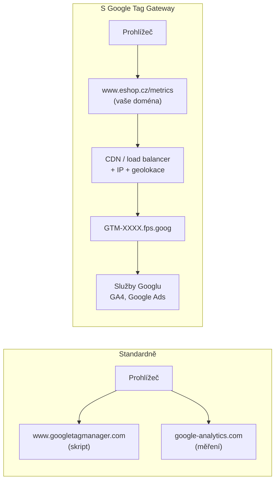
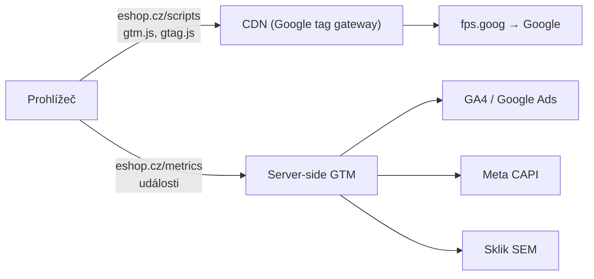

# B4: Google Tag Gateway a first-party mode: co to je a čím se liší od server-side GTM – brief
> Cluster: B. Server-side & architektura · URL: /blog/google-tag-gateway · Formát: vysvětlení + návod · Priorita: měsíc 1 · Cílová LP: /sluzby/server-side-tracking · Rozsah finálního článku: 2 200–2 800 slov

**Stav ověřen k 8. 10. 2026** v dokumentaci Googlu (developers.google.com/tag-platform/tag-manager/gateway, aktualizováno 3. 9. 2026), v nápovědě Google Ads a v release notes Tag Manageru. Téma se mění rychle (nové CDN integrace každých pár měsíců) → v článku box „Co je nového“ s datem.

---

## 1. Meta

| Prvek | Návrh |
|---|---|
| H1 | Google Tag Gateway: co to je a čím se liší od sGTM |
| SEO title (53 zn.) | Google Tag Gateway vs. server-side GTM \| datalayer.cz |
| Meta description (145 zn.) | Google Tag Gateway (dříve first-party mode) servíruje Google tagy z vaší domény přes CDN. Jak funguje, kdy stačí místo sGTM, omezení a nastavení. |
| URL | /blog/google-tag-gateway |
| Schema | `BlogPosting`, `FAQPage`, `HowTo` (nastavení přes Cloudflare / vlastní CDN), `BreadcrumbList` |

**Klíčová slova** (`kw_mapovani_na_stranky.tsv`):
- Hlavní: **google tag gateway (80)** (topic `gtm`, mapováno na LP server-side)
- Vedlejší: google tag gateway cloudflare (10), google tag manager first party mode (0), google tag gateway vs server side (0, informační)
- Související: server side gtm (30), server side tracking (50), cloudflare
- Otázky: *Co je Google Tag Gateway?* (Ahrefs PAA u dotazu „google tag manager co to je“) · z praxe: Je to totéž co server-side? Stačí to místo sGTM? Kolik to stojí? Potřebuju Cloudflare? Řeší to Safari/ITP? Mění se něco na souhlasu?

**Záměr:** informační (novinka, srovnání). **Čtenář:** marketér/PPC specialista, který v Google tagu vidí doporučení „Your tag data may be restricted“ nebo nabídku gateway; majitel e-shopu na Cloudflare; analytik rozhodující mezi GTG a sGTM. Segment: e-shopy a B2B weby s měřením hlavně v Google ekosystému.

---

## 2. Analýza SERP a konkurence

- **SERP pro „google tag gateway“ nebyl ve sběru 8. 10. 2026** (soubor `google_serp_organic.tsv` dotaz neobsahuje) → před psaním ručně zkontrolovat Google.cz. Odhad podle příbuzných dat: dokumentace Googlu (EN), Cloudflare docs, stape.io, ppc.land (EN zprávy), česky téměř nic.
- **datimo.ai**: v glosáři „Server-side tracking“ kritizuje GTG jako „jen proxy vrstvu“; jejich článek `/cz/blog/google-tag-gateway-cloudflare` vrací „Článek nenalezen“ (profil, 10/2026) → v češtině mezera.
- **Konkurence obecně** (DataNostro, NextAnalytica, Advisio) GTG nezmiňuje nebo ho staví proti sGTM. Nikdo nevysvětluje, že Google sám doporučuje **kombinaci GTG + sGTM**.

**Čím přeskočíme:**
1. Přesná, datovaná historie (first-party mode → Google tag gateway for advertisers, 8. 5. 2025) a aktuální integrace (Cloudflare, Google Cloud LB, Akamai, Fastly, Amazon CloudFront).
2. Technický popis: cesta měření, `*.fps.goog`, hlavičky geolokace a IP, změna snippetu GTM.
3. Poctivé srovnání GTG vs. sGTM vs. obojí + rozhodovací pravidla.
4. Omezení, o kterých se nemluví: jen Google, žádná úprava dat, geolokace, `noscript`, cookies (co dokumentace neříká).

---

## 3. Otázky, na které musí článek odpovědět

1. Co je Google Tag Gateway for advertisers a co byl „first-party mode“?
2. Jak technicky funguje (CDN/load balancer → `fps.goog` → Google)?
3. Jaké jsou možnosti nastavení (Cloudflare, Google Cloud, Akamai, Fastly, CloudFront, vlastní CDN)?
4. Kolik to stojí?
5. Čím se liší od server-side GTM?
6. Kdy GTG stačí a kdy potřebuji sGTM?
7. Mění GTG něco na souhlasu a Consent Mode?
8. Pomáhá GTG proti omezením Safari (ITP)?
9. Proč musím CDN nakonfigurovat hlavičky s geolokací a IP?
10. Jak ověřím, že gateway funguje?
11. Lze GTG kombinovat se server-side GTM?

---

## 4. Rychlá odpověď (hotový text, 53 slov)

> **Google Tag Gateway for advertisers** (dříve „first-party mode“) načítá Google tag nebo GTM kontejner z vaší domény a posílá měření přes vaši doménu – CDN nebo load balancer požadavky přepošle Googlu. Je zdarma a rychle nastavitelný, ale týká se jen Google tagů a data neupravuje. Server-side GTM umí víc; Google doporučuje obojí kombinovat.

---

## 5. Osnova s obsahem odpovědí

### H2 1: Co je Google Tag Gateway (a co byl first-party mode)
**Klíčové sdělení:** Je to oficiální způsob Googlu, jak Google tagy provozovat „z vaší domény“ bez vlastního tagovacího serveru.

**Obsah:**
- Definice (Google Ads Help 16816376): umožňuje nasadit Google tag nebo GTM kontejner „using your own domain“; tag se načte z vaší domény a měřicí události jdou na vaši doménu, odkud se přepošlou Googlu.
- Dokumentace pro vývojáře: infrastruktura „sedí mezi vaším webem a službami Googlu“; nastavíte ji na **existující CDN, load balanceru nebo webovém serveru**; Google ji doporučuje „for the most durable tag configuration“. Pozor na formulaci „**some** measurement requests will be sent to Google using your first-party domain“ – ne nutně všechny.
- **Časová osa (box „Vývoj“, GTM release notes):**
  - 9. 10. 2024 – first-party mode pro Google tag přes Cloudflare
  - 10. 12. 2024 – automatické nastavení s Cloudflare v Tag Manageru
  - 19. 3. 2025 – first-party mode v Google tagu a GTM (beta)
  - 4. 4. 2025 – diagnostika „Your tag data may be restricted“, když web běží na podporované CDN bez first-party mode
  - **8. 5. 2025 – přejmenování na Google tag gateway for advertisers**, dostupné všem, pro klientské i serverové tagy
  - 30. 9. 2025 – GTM zobrazuje stav gateway bez ohledu na způsob nastavení
  - 5. 1. 2026 – Google Cloud (Global external Application Load Balancer) beta; 1. 6. 2026 obecná dostupnost
  - 29. 1. 2026 – Akamai; 14. 5. 2026 – zjednodušená integrace Akamai a Fastly (automatická detekce zón)
  - 3. 6. 2026 – Amazon CloudFront přes Tag Assistant
- Google Ads Help zmiňuje, že tagy „brzy“ dostanou *confidential computing* jako výchozí – uvádět jako ohlášené, ne hotové.

### H2 2: Jak to funguje technicky
**Klíčové sdělení:** Na vaší doméně vyhradíte cestu (např. `/metrics`). CDN všechno na této cestě přepošle na `G-XXXX.fps.goog` (nebo `gtm-xxxx.fps.goog`) a doplní IP a geolokaci návštěvníka.

**Obsah (diagram D1):**
1. Prohlížeč načte `https://www.eshop.cz/metrics/?id=GTM-XXXX` místo `www.googletagmanager.com`.
2. CDN/LB podle pravidla cesty přepošle požadavek na origin `GTM-XXXX.fps.goog`, přepíše hlavičku `Host`, předá všechny cookies a query parametry.
3. CDN přidá **skutečnou IP** (`X-Forwarded-For` – nesmí být maskovaná) a **geolokaci**: preferovaně `X-Forwarded-CountryRegion` (ISO 3166-2, např. `CZ-10`), alternativně `X-Forwarded-Country` + `X-Forwarded-Region`; volitelně `X-Forwarded-Geolocation` (lat/long, město). Bez nich Google vidí IP CDN a neurčí region → horší reporty a **nesprávné regionální výchozí hodnoty Consent Mode** (Google Ads Help 17141867).
4. Google tag pak posílá (část) měřicích požadavků na `https://www.eshop.cz/metrics/...`.
- **Pravidla cesty:** nesmí být už použitá, nesmí být `/`, max. 100 znaků; jedna cesta na každý GTM kontejner nebo samostatný Google tag; pro GTM stačí ID kontejneru – pokryje všechny Google tagy v něm.
- **Cookies:** Google zpracovává jen své first-party cookies; ostatní cookies, které CDN přepošle, zahodí (Google Ads Help 16960855). **Dokumentace neuvádí, že by GTG nastavoval cookies hlavičkou serveru** – předpokládat, že cookies Google tagu dál nastavuje JavaScript, a tedy platí limity Safari ITP (B1, H2 3). → formulovat jako „dokumentace to neslibuje; ověřte v Safari Web Inspectoru“.

### H2 3: Možnosti nastavení
**Klíčové sdělení:** Pokud máte Cloudflare, Google Cloud LB, Akamai, Fastly nebo CloudFront, jde to „na pár kliků“ z Google tagu. Jinak ručně na jakékoli CDN, která umí směrovat podle cesty.

**Tabulka T2 (kap. 6)** + rozhodovací postup podle Googlu (Google Ads Help 16968707): (1) používáte sGTM → zapnout gateway v serverovém kontejneru; (2) web za Google Cloud LB → nastavení v Google Cloud; (3) web na Webflow → speciální postup; (4) CDN (Akamai, Cloudflare, Fastly) s přístupem do účtu → integrace (jeden tag/kontejner) nebo self-service (více kontejnerů); bez přístupu do CDN „nelze gateway použít“.

**Požadavky Google Cloud integrace:** Google Cloud projekt s rolí *Google Tag Gateway Admin*, oprávnění k publikaci GTM, provoz domény přes **Global external Application Load Balancer** – klasický Application Load Balancer podporovaný není.

**Kód 1 – Cloudflare Snippet (self-service; Cloudflare Snippets jsou oficiálně dostupné od tarifu Pro). Upraveno podle dokumentace Google, komentáře doplněny:**
```js
// Snippet pro cestu /metrics/ – přeposílá Google tagy přes vaši doménu
export default {
  async fetch(request) {
    const newRequest = new Request(request);
    const url = new URL(request.url);
    url.hostname = 'fps.goog';                                   // cíl gateway
    newRequest.headers.set('X-Gtg-Implementation', 'Snippet');
    newRequest.headers.set('X-Gtg-Tag-Id', 'GTM-XXXXXXX');       // ID kontejneru / tagu
    // skutečná IP návštěvníka (nesmí se maskovat)
    newRequest.headers.append('X-Forwarded-For', request.headers.get('CF-Connecting-IP'));
    // geolokace pro reporty a regionální výchozí hodnoty Consent Mode
    newRequest.headers.set('X-Forwarded-Country', request.cf.country);
    newRequest.headers.set('X-Forwarded-Region', request.cf.regionCode);
    newRequest.headers.set('X-Forwarded-Geolocation',
      `latlong=${request.cf.latitude},${request.cf.longitude};city=${request.cf.city}`);
    return await fetch(url, newRequest);
  },
};
// Pravidlo snippetu (Custom filter expression):
// (starts_with(http.request.uri.path, "/metrics/"))
```
*Poznámka:* v Cloudflare existuje i přepínač „Google Tag Gateway“ v dashboardu (zadáte ID tagu a cestu); Cloudflare uvádí, že je zdarma a nastavení platí pro celou zónu včetně subdomén (developers.cloudflare.com/google-tag-gateway).

**Kód 2 – úprava snippetu GTM na webu (po nastavení cesty):**
```html
<!-- Google Tag Manager – načítání přes vaši doménu (Google tag gateway) -->
<script>(function(w,d,s,l,i){w[l]=w[l]||[];w[l].push({'gtm.start':
new Date().getTime(),event:'gtm.js'});var f=d.getElementsByTagName(s)[0],
j=d.createElement(s),dl=l!='dataLayer'?'&l='+l:'';j.async=true;j.src=
'/metrics/?id='+i+dl;f.parentNode.insertBefore(j,f);
})(window,document,'script','dataLayer','GTM-XXXXXXX');</script>
<!-- noscript varianta gateway nepodporuje – ponechte standardní <noscript> s googletagmanager.com -->
```
Pro gtag.js: `<script async src="/metrics/"></script>` místo `//www.googletagmanager.com/gtag/js?id=G-…`.

**Kód 3 – ověření:**
```bash
curl -s https://www.eshop.cz/metrics/healthy                  # očekáváno: ok
curl -s "https://www.eshop.cz/metrics/?validate_geo=healthy"  # očekáváno: ok (geolokace dorazila)
```
Pak Tag Assistant → Summary → Output → Hits Sent: požadavky musí jít na `/metrics`.

### H2 4: Kolik to stojí
- Google Ads Help: integrace je **zdarma**; platíte běžné využití Google Cloud Load Balanceru (u GCP varianty), dodatečné zpracování hradí Google Ads.
- Cloudflare: „free to use“, požadavky přes gateway se nezapočítávají do účtování CDN/WAF/Bot Management.
- Ostatní CDN: podle ceníku dané CDN (požadavky/přenos) – zanedbatelné u běžného webu, ověřit u poskytovatele.
- Srovnání: sGTM v Cloud Run: 2 instance × ~45–50 USD ≈ 90–100 USD měsíčně; s load balancerem (~18 USD) a logy realisticky cca 110–150 USD měsíčně (ceník Google Cloud, ověřeno 10/2026; B1, B3).

### H2 5: Google Tag Gateway vs. server-side GTM
**Klíčové sdělení:** GTG je „first-party doručovací cesta“ pro Google. sGTM je „váš server“ pro všechny platformy. Nejsou to konkurenti.

Tabulka T1 (kap. 6). Doplňující text:
- Google (developers.google.com/tag-platform/tag-manager/gateway/sgtm-and-cdn): tři varianty – GTG s CDN; GTG se sGTM (sGTM servíruje skripty i sbírá data); **GTG s CDN + sGTM = doporučená** („most robust and controlled“): CDN servíruje skripty z vaší domény (nižší náklady, menší zátěž sGTM), sGTM sbírá, obohacuje a kontroluje data.
- **Kombinace vyžaduje same-origin** (např. `eshop.cz/scripts` pro GTG a `eshop.cz/metrics` pro sGTM) – **dvě různé cesty**.
- Argument „GTG je jen proxy“ (konkurence) je technicky pravdivý – ale pro mnoho webů je to přesně to, co potřebují.

### H2 6: Kdy Google Tag Gateway stačí
**Rozhodovací pravidla:**
- ✅ Měříte hlavně **GA4 + Google Ads** (případně Floodlight), web běží za podporovanou CDN/LB, nepotřebujete měnit data → GTG stačí jako první krok.
- ✅ Menší e-shop / B2B web, který nechce provozovat server.
- ❌ Potřebujete **Meta Conversions API, Sklik S2S, Heureku** ze serveru → sGTM (nebo nativní integrace platforem).
- ❌ Potřebujete **odstraňovat PII, obohacovat o marži, sjednotit data pro více platforem** → sGTM.
- ❌ Nemáte přístup do CDN/LB (sdílený hosting bez CDN) → GTG nelze nasadit (Google).
- ➕ Máte sGTM → přidejte GTG pro servírování skriptů (doporučená architektura Googlu).

### H2 7: Omezení a rizika
1. **Jen Google** – Meta, Seznam, Heureka, TikTok gateway nevyužijí.
2. **Žádná úprava dat** – nic neodstraníte ani nedoplníte (na rozdíl od sGTM transformací).
3. **Souhlas se nemění** – Consent Mode v2 a cookie lišta zůstávají povinné; GTG je jen jiná síťová cesta (A1, A2). Formulace: „GTG neobchází souhlas ani blokátory; pomáhá, aby se data s udělenými souhlasy spolehlivě doručila.“
4. **Geolokace a IP** – chybná konfigurace hlaviček = chybný region v GA4 a regionální výchozí hodnoty souhlasu.
5. **Konfigurace pro celou zónu** (Cloudflare) – nelze zapnout jen pro jednu subdoménu; řešit spouštěči GTM (Page Hostname).
6. **`<noscript>` není podporován.**
7. **Více kontejnerů = více cest**; reservovaná cesta „přebije“ obsah webu – zvolit nepoužívanou.
8. **Cookies a Safari** – dokumentace nepotvrzuje serverové nastavování cookies → přínos pro ITP neslibovat.
9. **Závislost na CDN** – změna CDN/DNS = nové nastavení gateway.
10. **Čísla „uplift“** z marketingu Googlu/CDN se týkají signálů (načtení tagů), ne konverzí – nepřebírat bez vlastních dat.

### H2 8: Nastavení krok za krokem (souhrn)
1. Zjistit infrastrukturu (CDN/LB, přístup) → rozhodovací postup Google.
2. Vybrat nepoužitou cestu (`/metrics`, `/xg7q2`), jednu na kontejner.
3. In-UI: Google tag / GTM → Admin → Google tag gateway → vybrat CDN/LB → kontrola kompatibility → doména a cesta → *Complete setup*.
   Self-service: pravidlo cesty → origin `ID.fps.goog` → hlavička Host → IP a geolokace.
4. Upravit snippet GTM / gtag na webu (kód 2).
5. Ověřit `/healthy` a `?validate_geo=healthy` (kód 3), Tag Assistant.
6. Zkontrolovat Consent Mode (výchozí stavy podle regionu) a GA4 geografii po 48 h.
7. Dokumentovat (cesta, CDN pravidlo, kdo má přístup).

### FAQ (kap. 9) + kontaktní blok

---

## 6. Vizuály

### D1 – Tok požadavků s gateway vs. bez ní (hlavní vizuál, pod H2 2)

**SVG:** dva panely vedle sebe (na mobilu pod sebou). Levý tlumený (šedé šipky na domény Googlu), pravý v brand stylu: štít s doménou `eshop.cz/metrics` (piktogram server-side), u CDN dvě malé značky `IP` a `CZ-10` (geolokace). Animace toku jen v pravém panelu, `prefers-reduced-motion` respektovat.

### D2 – Doporučená architektura Googlu: GTG + sGTM (pod H2 5)

**SVG:** dvě cesty z prohlížeče odlišené barvou (skripty = tlumená cyan, události = plná cyan), popisek „dvě různé cesty na stejném originu“.

### T1 – Google Tag Gateway vs. server-side GTM vs. obojí
| Kritérium | Google Tag Gateway | Server-side GTM | GTG + sGTM (doporučeno Googlem) |
|---|---|---|---|
| Co to je | přeposílání Google tagů a měření přes vaši doménu (CDN/LB) | vlastní tagovací server s kontejnerem | CDN servíruje skripty, sGTM zpracuje data |
| Platformy | jen Google (GA4, Ads, Floodlight) | libovolné (Google, Meta, Seznam, Heureka, webhooky) | libovolné |
| Úprava dat (PII, marže, validace) | ne | ano (transformace, šablony) | ano |
| Infrastruktura | existující CDN / load balancer / web server | server (Cloud Run, SaaS, Docker) | CDN + server |
| Náklady | zdarma (+ využití LB/CDN) | Cloud Run ≈ 90–100 USD/měs. (2 instance), s LB a logy cca 110–150 USD/měs., nebo SaaS | součet, sGTM méně zatížený |
| Náročnost nastavení | nízká (in-UI) až střední (self-service) | střední až vysoká | vysoká |
| Údržba | minimální | monitoring, aktualizace, billing | obojí |
| Souhlas / Consent Mode | beze změny – nutný | beze změny – nutný; ne-Google tagy hlídat ručně | beze změny |
| Cookies | dokumentace neslibuje serverové cookies | serverové cookies z vaší domény (při správném originu/IP) | dtto sGTM |
| Vhodné pro | web měřící hlavně Google, bez vlastního serveru | e-shopy a firmy s více platformami a nároky na data | větší e-shopy a firmy |

### T2 – Možnosti nastavení GTG (stav 10/2026)
| Infrastruktura | Způsob | Specifika |
|---|---|---|
| Cloudflare | in-UI integrace z Google tagu/GTM; přepínač v Cloudflare dashboardu; self-service přes Snippets | Snippets od tarifu Pro; nastavení pro celou zónu; starší Enterprise postup (Origin Rules) je „legacy“ |
| Google Cloud (Global external ALB) | in-UI („one-click“), GA od 1. 6. 2026 | role Google Tag Gateway Admin; classic ALB nepodporován |
| Akamai | in-UI (od 29. 1. 2026, zjednodušeno 14. 5. 2026) nebo ruční pravidlo v Property Manageru | geolokace přes EdgeScape |
| Fastly | in-UI (od 14. 5. 2026) nebo ručně (Condition, Host, 2 VCL snippety) | hlavičky v `vcl_miss` i `vcl_pass` |
| Amazon CloudFront | průvodce v Tag Assistant (od 3. 6. 2026) nebo ručně (origin, behavior) | cache policy CachingDisabled, AllViewerExceptHostHeader |
| Jiná CDN / web server | self-service: origin `ID.fps.goog`, Host header, cookies + query, geo hlavičky, prioritní pravidlo cesty | geolokaci nutno doplnit ručně |
| Server-side GTM | zapnout gateway v serverovém kontejneru | první krok rozhodovacího postupu Googlu |
| Webflow | speciální postup | – |

### Mockup M1 – Google tag → Admin → Google tag gateway (pod H2 8)
Stylizovaná obrazovka: krok „Choose your setup“ (karty Cloudflare / Google Cloud / Akamai / Fastly / Other), pole „Measurement path: /metrics“, stav „Active“ zelený štítek. Fiktivní data, žádné logo Googlu (jen obecné UI).

### Infografika I1 – „GTG, nebo sGTM?“ (1080×1080 pro LinkedIn)
Dvě karty proti sobě s 5 řádky ✓/✕ (platformy, úprava dat, náklady, údržba, náročnost) + spodní pruh „Nejlépe obojí: skripty přes CDN, data přes server“.

---

## 7. Fakta a zdroje

| Tvrzení | Zdroj | Ověřeno | Riziko zastarání |
|---|---|---|---|
| Definice GTG, CDN/LB/web server, „most durable“, „some measurement requests“ | https://developers.google.com/tag-platform/tag-manager/gateway/setup-guide | 10/2026 (akt. 3. 9. 2026) | střední |
| Pravidla cesty (nepoužitá, ne `/`, max. 100 zn.), origin `ID.fps.goog`, hlavičky, Cloudflare Snippet, Akamai, CloudFront, Fastly, „Other“, `/healthy`, `?validate_geo=healthy`, `noscript` nepodporován | https://developers.google.com/tag-platform/tag-manager/gateway/setup-guide?setup=manual | 10/2026 | střední |
| Zdarma, platí se LB, Google Ads hradí dodatečné zpracování; požadavky (role, GTM publish, Global external ALB, classic ALB nepodporován); confidential computing „soon“ | https://support.google.com/google-ads/answer/16816376 | 10/2026 | střední |
| Rozhodovací postup (sGTM → GCP → Webflow → CDN) | https://support.google.com/google-ads/answer/16968707 | 10/2026 | střední |
| Geolokační hlavičky, IP nesmí být maskovaná, dopad na Consent Mode | https://support.google.com/google-ads/answer/17141867 | 10/2026 | nízké |
| Jen Google first-party cookies, ostatní zahozeny | https://support.google.com/google-ads/answer/16960855 | 10/2026 | střední |
| GTG + CDN + sGTM doporučeno; same-origin, dvě různé cesty | https://developers.google.com/tag-platform/tag-manager/gateway/sgtm-and-cdn | 10/2026 | střední |
| Legacy Cloudflare Enterprise postup | https://developers.google.com/tag-platform/tag-manager/gateway/legacy-setups | 10/2026 | nízké |
| Časová osa 2024–2026 | https://support.google.com/tagmanager/answer/4620708 (release notes) | 10/2026 | **vysoké** (přibývají integrace) |
| Cloudflare: zdarma, nezapočítává se do účtování, zónové nastavení | https://developers.cloudflare.com/google-tag-gateway/ | 10/2026 | střední |
| Čísla „signal uplift“ (11 %, 14 %) | 11 %: https://support.google.com/google-ads/answer/16214371 (vlastní metrika Googlu – načtení Google tagu, medián 9.–16. 4. 2025) – použít jen s touto výhradou; 14 % neověřeno (jen ppc.land) – **nepoužívat** | 10/2026 (11 %) | – |

---

## 8. Interní odkazy a CTA

**Cílová LP:** `/sluzby/server-side-tracking`

**CTA box (za H2 6 – Kdy GTG stačí):**
- Nadpis: **Gateway, server-side, nebo obojí?**
- Text: Projdeme vaše platformy, CDN a nároky na data a doporučíme nejjednodušší architekturu, která bude fungovat. Gateway nastavíme za hodiny, server-side za dny – a obojí zdokumentujeme.
- Tlačítko: `[ Konzultovat architekturu ]` → `/sluzby/server-side-tracking#kontakt`

**Související články:** B1 [Server-side tracking – průvodce](/blog/server-side-tracking-pruvodce) · B3 [Kde provozovat sGTM](/blog/hosting-server-side-gtm) · B2 [Propojení client-side a server-side](/blog/propojeni-client-side-a-server-side) · A1 [Consent Mode v2](/blog/consent-mode-v2-pruvodce) · A7 [Cookies třetích stran a ITP 2026](/blog/cookies-tretich-stran-2026) · C3 [Google Tag Manager – průvodce](/blog/google-tag-manager-pruvodce) · H3 [Měřicí skripty a rychlost webu](/blog/tagy-a-rychlost-webu)

**Slovník:** Google Tag Gateway · Server-side tagging · First-party cookie · Consent Mode · Kontejner GTM

**Zkrácený kontaktní blok:** `form_id: blog`, předvybrané téma `server-side`; H2 „Řešíte totéž u sebe?“; placeholder „Např. máme web na Cloudflare a Google nám nabízí Tag Gateway…“.

---

## 9. FAQ pro schema

**Co je Google Tag Gateway?**
Google Tag Gateway for advertisers je funkce Googlu, která načítá Google tag nebo kontejner Google Tag Manageru z vaší domény a posílá měřicí požadavky přes vaši doménu. Vaše CDN nebo load balancer je pak přepošle Googlu. Do května 2025 se funkce jmenovala first-party mode. Je zdarma a nastavuje se přímo v Google tagu nebo v GTM.

**Je Google Tag Gateway totéž co server-side GTM?**
Ne. Gateway jen přesměruje načítání Google tagů a jejich požadavky přes vaši doménu – data neupravuje a funguje jen pro služby Googlu. Server-side GTM je vlastní tagovací server, ve kterém data čistíte, obohacujete a posíláte i do Mety, Skliku nebo dalších platforem. Google doporučuje obojí kombinovat.

**Potřebuji pro Google Tag Gateway Cloudflare?**
Ne nutně. Google nabízí integrace s Cloudflare, Google Cloud Load Balancerem, Akamai, Fastly a Amazon CloudFront a návod pro jakoukoli CDN nebo webový server, který umí přeposílat požadavky podle cesty a doplnit IP a geolokaci návštěvníka. Bez přístupu ke CDN nebo load balanceru ale gateway nasadit nelze.

**Musím kvůli Google Tag Gateway měnit cookie lištu?**
Ne, ale ani ji nemůžete vynechat. Gateway mění jen síťovou cestu, pravidla souhlasu zůstávají stejná: Consent Mode v2 a cookie lišta jsou dál potřeba. Důležité je, aby CDN předávala geolokaci návštěvníka – podle ní se uplatní regionální výchozí nastavení souhlasu.

**Pomáhá Google Tag Gateway proti omezením Safari?**
Dokumentace Googlu neslibuje, že by gateway nastavovala cookies hlavičkou serveru, která má v Safari delší životnost. Pomáhá tím, že skripty a požadavky jdou přes vaši doménu. Pokud potřebujete serverově nastavené first-party cookies, je spolehlivější server-side GTM na stejném originu jako web.

---

## 10. Poznámky pro autora

- **Před psaním zkontrolovat SERP** „google tag gateway“ (není ve sběru) a znovu release notes GTM – mohly přibýt integrace.
- **Nepoužívat čísla „signal uplift“** bez primárního zdroje; pokud Google publikuje oficiální studii, citovat s metodikou.
- **Cookies a ITP:** nepsat, že GTG „řeší ITP“. Pokud klient otestuje v Safari a zjistí jinak, aktualizovat: [DOPLNIT: výsledek testu cookies v Safari na webu s GTG].
- **Kód Cloudflare Snippetu** vychází z ukázky Google (licence Apache 2.0) – uvést zdroj pod kódem.
- **Revize každé 3–4 měsíce** (rychle se měnící téma).
- **Od klienta:** [DOPLNIT: zda datalayer.cz GTG nasazuje jako samostatnou službu a jak ho kombinuje se sGTM].
- **Doporučený autor:** Vít Novotný.
