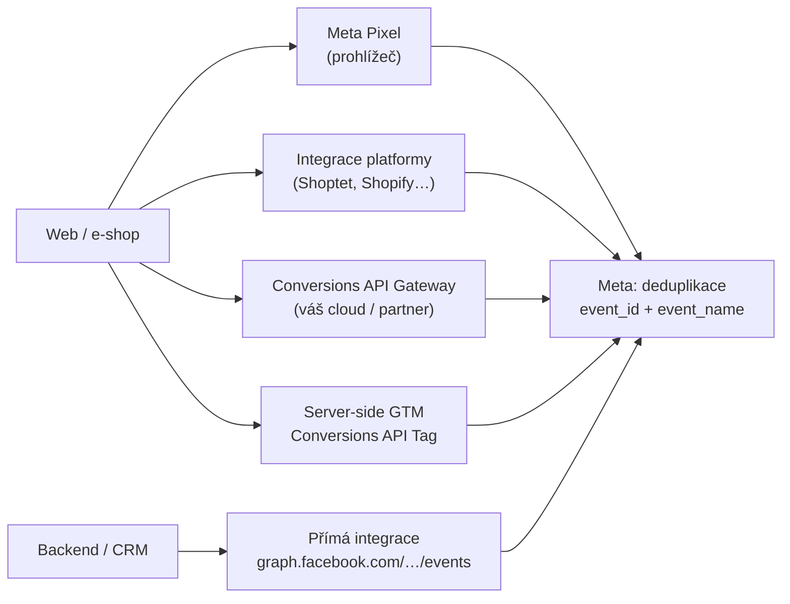
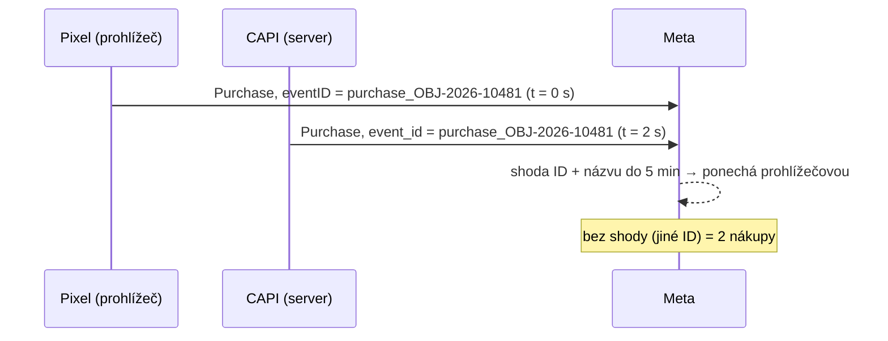

# B5: Meta Conversions API: nastavení, deduplikace event_id a Event Match Quality – brief
> Cluster: B. Server-side & architektura · URL: /blog/meta-conversions-api · Formát: technický návod · Priorita: měsíc 1 · Cílová LP: /sluzby/mereni-konverzi (sekundárně /sluzby/server-side-tracking) · Rozsah finálního článku: 2 800–3 400 slov

**Zdroje Meta:** dokumentace se v roce 2026 přesunula z `developers.facebook.com/docs/marketing-api/conversions-api` na **`developers.facebook.com/documentation/ads-commerce/conversions-api`** (staré URL přesměrovávají). V článku odkazovat na nové URL. Nápověda Meta Business (facebook.com/business/help) blokuje automatické čtení → tvrzení z ní ověřit ručně.

---

## 1. Meta

| Prvek | Návrh |
|---|---|
| H1 | Meta Conversions API: nastavení, deduplikace a EMQ |
| SEO title (60 zn.) | Meta Conversions API: nastavení a deduplikace \| datalayer.cz |
| Meta description (147 zn.) | Jak nastavit Meta Conversions API přes server-side GTM, Gateway nebo e-shopovou platformu: povinné parametry, event_id, hashování, EMQ a testování. |
| URL | /blog/meta-conversions-api |
| Schema | `BlogPosting`, `HowTo` (nastavení přes sGTM), `FAQPage`, `BreadcrumbList` |

**Klíčová slova** (`kw_mapovani_na_stranky.tsv`, topic `konverze-ads`):
- Hlavní: **meta conversions api (10)** + varianty: conversion api (20, KD 39), facebook conversion api (10, KD 28), fb conversion api (10), meta conversion api (10), conversions api (10), meta pixel capi (10)
- Související s objemem: facebook pixel (250), meta pixel (100), meta pixel helper (60), facebook pixel e-shop (60), shoptet facebook pixel (40), facebook pixel code (40)
- Long-tail (0): facebook capi gtm server side, facebook pixel server side tracking, google tag manager server side facebook, facebook gtm server side, meta pixel events
- SERP dotaz: „meta conversions api nastavení“
- Otázky (Ahrefs PAA): *Is Meta conversion API free?* · *How to set conversion API on Facebook?* · *Is Facebook API free?* · *Is conversion API worth it?* · u „meta pixel“: *Is Meta pixel needed?* · *Is pixel tracking illegal?*

**Záměr:** návodový + komerční. **Čtenář:** e-shop (Shoptet, Shopify, WooCommerce, vlastní řešení) s kampaněmi na Facebooku/Instagramu; PPC specialista; B2B firma s lead kampaněmi (Lead, CRM události). Úroveň: zná Pixel a Events Manager, CAPI zná povrchně.

---

## 2. Analýza SERP a konkurence

**„meta conversions api nastavení“ (Google.cz, 8. 10. 2026, AI přehled):**
| Poz. | URL | Poznámka |
|---|---|---|
| 1 | cs-cz.facebook.com/business/help/1861378164396295 – Jak nastavit Conversions API s podporou společnosti Meta | nová varianta „Set up with Meta“ (hostuje Meta) |
| 2 | cs-cz.facebook.com/business/help/433493041367251 – Srovnání možností nastavení | oficiální srovnání variant |
| 3 | cernovsky.cz – 4 možnosti nastavení | přehled bez technického detailu |
| 4 | help.eshop-rychle.cz – nastavení CAPI | platformní návod |
| 5 | reddit – „Pixel je nastavený, potřebuju CAPI?“ | |
| 6 | prevedshop.cz – Meta CAPI | |
| 7 | zlesamilos.cz – „Meta CAPI na jeden klik“ (26. 4. 2026) | popis „Set up with Meta“ (oznámeno 15. 4. 2026, postupné zpřístupnění) |
| 8 | blog.shoptet.cz (2022, upraveno 2025) | návod: token do Propojení → Sociální sítě → Facebook |

**Konkurenční profily:** datanostro.com/cs/meta-capi (produktová LP, 3 kroky, FAQ), nextanalytica.cz (mockup Events Manageru s EMQ 8,7–9,4 – bez metodiky; blog o CAPI ~490 slov), advisio.cz („Jak nastavit Conversion API přes GTM“ – 3 cesty, bez deduplikace a souhlasu), khoder.cz (zmiňuje deduplikaci a mockup Events Manageru s `event_id`).

**Mezera:** nikdo česky nepopisuje (1) povinné parametry podle typu události a „neplatné kombinace“ user_data, (2) normalizaci českých údajů (telefon 420…, jména s diakritikou, PSČ, město), (3) consent gating na serveru, (4) proč EMQ klesá za CDN (IP), (5) testovací protokol s `test_event_code` a záložkou Event Deduplication, (6) aktuální varianty 2026 (Gateway, Signals Gateway, „Set up with Meta“).

---

## 3. Otázky, na které musí článek odpovědět

1. Co je Conversions API a proč ji Meta doporučuje vedle Pixelu?
2. Je Conversions API zdarma? (API ano; platíte infrastrukturu nebo partnera.)
3. Jaké jsou varianty nasazení a pro koho se hodí (platforma, Gateway, sGTM, přímá integrace, „Set up with Meta“)?
4. Které parametry jsou povinné a které doporučené?
5. Jak funguje deduplikace s Pixelem (event_id + event_name)?
6. Co je Event Match Quality a jaké skóre je dobré?
7. Jak správně hashovat e-mail, telefon a další údaje (české formáty)?
8. Co jsou `fbc` a `fbp` a odkud je vzít?
9. Jak řešit souhlas – má Meta něco jako Consent Mode?
10. Jak otestovat nastavení v Events Manageru?
11. Jaké jsou nejčastější chyby?
12. Stačí nativní integrace Shoptetu/Shopify, nebo potřebuji sGTM?

---

## 4. Rychlá odpověď (hotový text, 49 slov)

> **Meta Conversions API (CAPI)** posílá konverze z vašeho serveru přímo do Mety. Meta doporučuje používat ji spolu s Pixelem a stejné události deduplikovat přes shodné `event_id` a název události. Povinné jsou `event_name`, `event_time`, `action_source` a `user_data`; u webu i `event_source_url` a user agent. Kvalitu párování ukazuje Event Match Quality.

---

## 5. Osnova s obsahem odpovědí

### H2 1: Co je Conversions API a proč ji Meta chce vedle Pixelu
**Klíčové sdělení:** Pixel měří v prohlížeči, CAPI ze serveru. Meta doporučuje obojí („redundant setup“) – CAPI doplní události, které Pixel ztratí kvůli síti nebo chybám načtení, a umí i události mimo web.

**Obsah:**
- Meta: CAPI propojuje marketingová data (web, aplikace, zprávy, offline) ze serveru, platformy nebo CRM; serverové události jsou svázané s ID datové sady (Pixel ID) a zpracované podobně jako události Pixelu (conversions-api overview).
- Redundant setup: „Use the Conversions API in addition to the Meta Pixel, and share the same events using both tools“ (best practices).
- Pro web i server **stejné Pixel ID** (get-started).
- **Cena:** samotné API je bez poplatku; náklady = server (sGTM, Gateway v cloudu) nebo partner. Odpověď na PAA „Is Meta conversion API free?“.
- **Kdy to (zatím) neřešit:** malý rozpočet na Meta Ads a nativní integrace platformy funguje → stačí ji zapnout a zkontrolovat deduplikaci.

### H2 2: Varianty nasazení (tabulka T1)
**Klíčové sdělení:** Vyberte podle toho, kolik kontroly nad daty potřebujete, ne podle toho, co je nejrychlejší.

- **Integrace e-shopové platformy** – Shoptet: přístupový token z Events Manageru vložit v administraci *Propojení → Sociální sítě → Facebook* (blog.shoptet.cz; ověřit aktuální rozhraní); Shopify, WooCommerce, Eshop-rychle mají vlastní integrace. Rychlé, ale omezená kontrola nad parametry a souhlasem.
- **„Set up with Meta“ (Meta-hosted CAPI)** – nastavení jedním klikem v Events Manageru, infrastrukturu hostuje Meta; podle sekundárních zdrojů oznámeno v dubnu 2026 a zpřístupňováno postupně; méně transparentní, co přesně odesílá. **Ověřit v Events Manageru** (nápověda Meta 1861378164396295).
- **Conversions API Gateway** – self-serve konfigurace z Events Manageru; běží v cloudovém účtu firmy (AWS EKS, AWS ECS Express nebo GCP) nebo u partnera; `event_id` pro deduplikaci se generuje a předává automaticky; admin rozhraní `https://<gateway>/hub/capig`; výchozí kapacita 1 000 req/s (AWS EKS), 100 req/s (App Runner, GKE). Jen pro Metu (developers.facebook.com/documentation/ads-commerce/gateway-products/…).
- **Signals Gateway** – obecnější varianta Gateway s „pipelines“ (zdroje → cíle, včetně vlastních destinací); pro firmy, které chtějí jeden first-party sběr pro více cílů.
- **Server-side GTM** – šablona **Conversions API Tag** (Meta / „facebookincubator“, Community Template Gallery) nebo šablona Stape; data z GA4 klienta; plná kontrola, jeden proud událostí pro Google, Metu i Sklik (B2).
- **Přímá integrace z backendu** – `POST https://graph.facebook.com/{API_VERSION}/{PIXEL_ID}/events`, Business SDK (Python, Node, PHP, Java, Ruby – hashování automaticky). Pro CRM/offline události (Lead → kvalifikovaný lead → zakázka, E3).

### H2 3: Povinné a doporučené parametry (tabulka T2)
**Klíčové sdělení:** Bez `action_source`, `event_source_url` a `client_user_agent` Meta webovou událost nepřijme jako plnohodnotnou; bez identifikátorů ji nespáruje.

**Doplňující fakta:**
- `event_time` = Unix timestamp **v sekundách** (GMT), max. **7 dní** zpět – jinak Meta odmítne celý požadavek.
- Dávka max. **1 000 událostí**; **jedna neplatná událost = odmítnutá celá dávka**; posílat ideálně v reálném čase, nejpozději do hodiny (using the API).
- `action_source` musí odpovídat skutečnosti (`website`, `app`, `phone_call`, `chat`, `physical_store`, `system_generated`, `business_messaging`, `email`, `other`) – odesláním to potvrzujete.
- **Neplatné kombinace user_data** (od Graph API v13): událost jen s `ct+country+st+zp+ge+client_user_agent`, `db+client_user_agent`, `fn+ge`, `ln+ge` (nebo jejich podmnožinou) je neplatná.
- Pro nákup: `currency` povinná (ISO 4217, `CZK`), `value` číslo; `contents` (id, quantity, item_price), `order_id`; `net_revenue` = marže konverze (standard parameters) – obohacení na serveru (B2).
- Volitelně nové `customer_segmentation` (nový × stávající zákazník) – zmínit jako možnost.
- `data_processing_options` (LDU) je určeno pro USA (`data_processing_options_country: 1`) – v ČR se neřeší; souhlas viz H2 8.

### H2 4: Hashování a normalizace českých údajů
**Klíčové sdělení:** Meta páruje jen správně normalizované a zahashované údaje (SHA-256). Chyba v normalizaci = nulový přínos, i když hash „vypadá dobře“.

Tabulka T3 (kap. 6) s českými příklady. **Kód 1 – normalizace a hash (Node.js, backend nebo Cloud Function):**
```js
const crypto = require('crypto');
const sha256 = (v) => crypto.createHash('sha256').update(v, 'utf8').digest('hex');

function normalizeEmail(email) {
  return email.trim().toLowerCase();                       // " Jan.Novak@Seznam.cz " → "jan.novak@seznam.cz"
}
function normalizePhoneCz(phone) {
  let d = phone.replace(/\D/g, '').replace(/^0+/, '');     // jen číslice, bez úvodních nul (00420 → 420…)
  if (d.length === 9) d = '420' + d;                       // české číslo bez předvolby
  return d;                                                // "+420 601 234 567" → "420601234567"
}
function normalizeName(name) {
  return name.trim().toLowerCase().replace(/[\s.\-']/g, ''); // UTF-8, diakritika zůstává ("Šťastná" → "šťastná")
}
function normalizeZip(zip) {
  return zip.replace(/\s/g, '');                           // "110 00" → "11000"
}

const userData = {
  em: [sha256(normalizeEmail(' Jan.Novak@Seznam.cz '))],
  ph: [sha256(normalizePhoneCz('+420 601 234 567'))],
  fn: [sha256(normalizeName('Jan'))],
  ln: [sha256(normalizeName('Šťastný'))],
  zp: [sha256(normalizeZip('110 00'))],
  country: [sha256('cz')],
  external_id: [sha256('CUST-48213')],   // ID zákazníka z e-shopu – hash doporučen, stejný jako v Pixelu
  // client_ip_address, client_user_agent, fbc, fbp se NEHASHUJÍ
};
```
*Poznámka:* u jmen Meta uvádí jako příklad zachování diakritiky (`Valéry` → `valéry`) a zároveň „doporučuje“ znaky a–z; u měst „bez speciálních znaků a mezer“ (`praha`, `hradeckralove`) – zvolit jednotné pravidlo a držet ho v Pixelu i CAPI. **Ověřit na CSV s ukázkami, které Meta poskytuje.**

### H2 5: Deduplikace s Pixelem
**Klíčové sdělení:** Shodné `event_id` + shodný název události + stejné Pixel ID = Meta započte jednu konverzi.

**Fakta (Meta):**
- Pixel: `fbq('track', 'Purchase', {...}, {eventID: 'purchase_OBJ-2026-10481'})` – `eventID` je 4. argument; u image pixelu parametr `eid`.
- Okno **48 hodin** od první události s daným `event_id`; pokud dorazí serverová i prohlížečová do **5 minut**, Meta upřednostní prohlížečovou.
- `event_id` = číslo objednávky je ideální (Meta to sama doporučuje); pro události bez ID náhodné ID sdílené prohlížečem i serverem (B2, kód 2).
- Alternativa `fbp`/`external_id`: funguje jen pro pořadí prohlížeč → server; serverová událost se nezahodí, pokud v posledních 48 h nepřišla prohlížečová. Nededuplikuje dvě události ze stejného zdroje.
- Kontrola: Events Manager → událost → *Event Details* → záložka **Event Deduplication** (*Rate of Events Deduplicated*, *Rate of Deduplication Key Usage*, *Overlap*); nízký overlap = jeden zdroj posílá nejednotné klíče.
- Pozor: **Conversions API Gateway generuje `event_id` sama** – nekombinovat s druhou CAPI cestou (sGTM) pro stejné události.

### H2 6: Event Match Quality (EMQ)
**Klíčové sdělení:** EMQ (1–10) říká, jak dobře lze serverové události spárovat s účty na Facebooku/Instagramu. Meta doporučuje mířit na **6,0 a víc**.

**Obsah:**
- Zobrazuje se u každé serverové události v Events Manageru (Overview), případně přes Dataset Quality API (verifying setup).
- Nespárované události nejdou použít pro atribuci ani optimalizaci, jen pro základní měření (best practices).
- Co EMQ zvyšuje: Meta v best practices řadí mezi kvalitní parametry e-mail, IP adresu, jméno a telefon; návod pro sGTM uvádí prioritu: e-mail a click ID (`fbc`) – vysoká; telefon, `external_id`, `fbp`, země, kraj, pohlaví, datum narození – střední; jméno, příjmení, město, PSČ – nízká.
- **Typický důvod nízkého EMQ v sGTM:** server dostává IP adresu proxy/CDN místo návštěvníka, chybí `fbc` (nečte se `_fbc`/`fbclid`), e-mail jen u nákupu, ne u AddToCart.
- Nevydávat EMQ za „kvalitu kampaně“; nepřebírat skóre z konkurenčních mockupů (8,7–9,4) bez kontextu.

### H2 7: `fbc` a `fbp`: click ID a ID prohlížeče
- `fbp` = cookie `_fbp` z Pixelu, formát `fb.1.<čas v ms>.<náhodné číslo>`; `fbc` = `fb.1.<čas v ms>.<fbclid>`; subdomainIndex 1 pro `eshop.cz`; **fbclid je case-sensitive** – neměnit velikost písmen.
- Pokud Pixel neběží (např. bez souhlasu se nesmí spustit), lze `fbc` sestavit z parametru `fbclid` v URL – jen pokud je to v souladu se souhlasem.
- Meta doporučuje uložit `_fbc` jako **HTTP cookie v odpovědi serveru s expirací 90 dní** (nebo na backendu) a hodnoty pravidelně obnovovat (fbp-and-fbc).
- V sGTM: s first-party doménou serveru se `_fbp`/`_fbc` předají automaticky; jinak přes parametry `x-fb-ck-fbp`/`x-fb-ck-fbc` z webového GTM (Meta návod pro sGTM).

### H2 8: Souhlas: Meta nemá Consent Mode
**Klíčové sdělení:** Za souhlas odpovídáte vy. Pixel i CAPI se smí spustit jen se souhlasem pro marketing/reklamu – server-side na tom nic nemění.

**Obsah:**
- Pixel: `fbq('consent', 'revoke')` před `init`, po souhlasu `fbq('consent', 'grant')`; revoke volat na každé stránce (Meta GDPR doc). V GTM: tagy Pixelu spouštět jen se souhlasem (consent settings).
- **CAPI v sGTM:** spouštěč s podmínkou na stav souhlasu (parametr `consent_ad_storage` z webu, B2) – jinak se při advanced Consent Mode spustí i na cookieless pingy.
- **Backend/CRM události:** posílat jen pro zákazníky se souhlasem pro reklamní účely / s právním titulem – konzultovat s právníkem (A3, A5). Disclaimer.
- Meta v Overview ukazuje, kolik událostí bylo „discarded due to consent controls and other policies“ – užitečná kontrola.

### H2 9: Nastavení přes server-side GTM krok za krokem (HowTo)
1. Events Manager → datová sada (Pixel) → *Settings* → *Conversions API* → **Generate access token** (vidí jen uživatelé s vývojářskými právy; automaticky vznikne CAPI app a systémový uživatel, bez App Review).
2. Webový GTM: Google tag se `server_container_url`; GA4 event tagy s `event_id`, `user_data`; Pixel s `eventID` (B2).
3. Serverový GTM: šablona *Conversions API Tag* (facebookincubator) → Pixel ID, access token, `action_source: website`; spouštěč na události + souhlas.
4. Mapování názvů: GA4 `purchase` → `Purchase`, `add_to_cart` → `AddToCart`, `begin_checkout` → `InitiateCheckout`, `view_item` → `ViewContent`, `generate_lead` → `Lead`, `sign_up` → `CompleteRegistration`, `add_payment_info` → `AddPaymentInfo`, `search` → `Search`, `page_view` → `PageView` (Meta návod pro sGTM; tabulka T4).
5. Test (H2 10), publikace, odstranění `test_event_code`.
6. Po 7 dnech: EMQ, deduplikace, freshness; porovnání nákupů Meta vs. administrace.

### H2 10: Ukázka payloadu a test v Events Manageru
**Kód 2 – Purchase z backendu (ukázkový příklad, fiktivní data):**
```bash
curl -X POST "https://graph.facebook.com/v25.0/PIXEL_ID/events?access_token=ACCESS_TOKEN" \
  -H "Content-Type: application/json" \
  -d '{
  "data": [{
    "event_name": "Purchase",
    "event_time": 1791446400,
    "event_id": "purchase_OBJ-2026-10481",
    "action_source": "website",
    "event_source_url": "https://www.eshop.cz/objednavka/dekujeme",
    "user_data": {
      "em": ["<sha256 z jan.novak@seznam.cz>"],
      "ph": ["<sha256 z 420601234567>"],
      "external_id": ["<sha256 z CUST-48213>"],
      "client_ip_address": "203.0.113.24",
      "client_user_agent": "Mozilla/5.0 (iPhone; CPU iPhone OS 18_6 like Mac OS X) ...",
      "fbc": "fb.1.1791446100123.IwAR2F4-dbP0l7Mn1IawQQGCINEz7PYXQvwjNwB_qa2ofrHyiLjcbCRxTDMgk",
      "fbp": "fb.1.1788854400456.1098115397"
    },
    "custom_data": {
      "currency": "CZK",
      "value": 3545.45,
      "order_id": "OBJ-2026-10481",
      "content_type": "product",
      "contents": [{ "id": "SKU-123", "quantity": 1, "item_price": 3545.45 }]
    }
  }],
  "test_event_code": "TEST12345"
}'
```
Poznámky pod kódem: verze `v25.0` odpovídá ukázkám v dokumentaci k 10/2026 (každá verze Graph API podporována min. 2 roky); `test_event_code` odstranit z produkce; access token nikdy do prohlížeče; `event_time` v sekundách.

**Test Events (postup):** Events Manager → *Data Sources* → Pixel → *Test Events* → zkopírovat test ID → vložit jako `test_event_code` (do CAPI tagu v sGTM nebo do payloadu) → provést nákup s **vlastními** údaji (testovací události se nespárovaným účtem Meta může zahodit) → ověřit: událost z prohlížeče i serveru, stav deduplikace, parametry. Data v Overview do ~20 minut; záložky *Event Freshness* a *Event Deduplication*. Payload Helper pro kontrolu struktury.

### H2 11: Časté chyby (tabulka T5)

### H2 12: Shoptet, Shopify a spol.: stačí nativní integrace?
- **Stačí, když:** jedna platforma, standardní události, souhlas řeší lišta platformy a deduplikace v Test Events funguje.
- **Nestačí, když:** chcete posílat marži (`net_revenue`), stavy objednávek z ERP, leady z CRM; potřebujete jednotný `event_id` napříč Google/Meta/Sklik; máte vlastní cookie lištu a potřebujete přesné consent gating; nativní integrace a Pixel z GTM se navzájem duplikují (častý problém: Pixel vložený platformou i GTM).
- Doporučení: zkontrolovat, kolik Pixelů a cest na webu běží (Meta Pixel Helper – KW 60), než přidáte další.

### FAQ (kap. 9) + kontaktní blok

---

## 6. Vizuály

### D1 – Varianty CAPI na jedné mapě (pod H2 2)

**SVG:** Meta jako cílový uzel vpravo (neutrální ikona, ne logo), 5 cest barevně odlišených podle „míry kontroly“ (škála od šedé po cyan), legenda „kontrola nad daty: nízká → vysoká“. Mobil: svisle.

### D2 – Deduplikace v čase (pod H2 5)

**SVG:** časová osa 0–48 h, značky „5 min“ a „48 h“; dvě kapky splývají v jednu.

### T1 – Varianty nasazení
| Varianta | Kdo ji nastaví | Náklady | Kontrola nad daty | Deduplikace | Hodí se pro |
|---|---|---|---|---|---|
| Integrace platformy (Shoptet, Shopify, WooCommerce) | marketér v administraci | v ceně platformy | nízká | řeší platforma (ověřit) | menší e-shopy |
| „Set up with Meta“ (hostuje Meta) | marketér v Events Manageru | bez nákladů na server | nízká, méně transparentní | řeší Meta (ověřit) | rychlý start bez techniky |
| Conversions API Gateway | marketér s technickým základem / partner | cloud (AWS/GCP) nebo poplatek partnerovi | střední | automatické `event_id` | firmy, které chtějí jen Metu |
| Signals Gateway | technik / partner | cloud | střední | dle konfigurace | sběr pro více cílů |
| Server-side GTM | analytik | sGTM hosting (B3) | vysoká | `event_id` z dataLayer | e-shopy s více platformami |
| Přímá integrace (backend, SDK) | vývojář | vývoj + provoz | nejvyšší | `event_id` z backendu | CRM, offline, vlastní systémy |

### T2 – Parametry Conversions API (web)
| Parametr | Kde | Povinnost (web) | Poznámka |
|---|---|---|---|
| `event_name` | server event | povinné | standardní (Purchase, Lead…) nebo vlastní; klíč deduplikace |
| `event_time` | server event | povinné | Unix s (GMT), max. 7 dní zpět |
| `action_source` | server event | povinné | `website` |
| `event_source_url` | server event | povinné pro web | URL, kde událost nastala (ověřená doména) |
| `user_data` | server event | povinné | min. 1 platný identifikátor, ne „neplatné kombinace“ |
| `client_user_agent` | user_data | povinné pro web | nehashovat |
| `client_ip_address` | user_data | silně doporučené | nehashovat; IPv6 přednost |
| `em`, `ph` | user_data | doporučené (vysoký přínos) | SHA-256 po normalizaci |
| `fn`, `ln`, `ct`, `zp`, `country`, `db`, `ge` | user_data | volitelné | SHA-256 po normalizaci |
| `external_id` | user_data | doporučené | hash doporučen, shodně s Pixelem |
| `fbc`, `fbp` | user_data | doporučené | nehashovat; obnovovat |
| `event_id` | server event | doporučené (nutné pro deduplikaci) | shodné s `eventID` Pixelu |
| `custom_data.currency` + `value` | custom data | `currency` povinná u Purchase | CZK, číslo |
| `contents`, `content_ids`, `content_type`, `order_id`, `num_items` | custom data | doporučené pro e-commerce | katalog, DPA kampaně |
| `net_revenue` | custom data | volitelné | marže konverze (obohatit na serveru) |
| `opt_out` | server event | volitelné | `true` = jen atribuce, ne optimalizace |
| `test_event_code` | tělo požadavku | jen při testu | odstranit z produkce |

### T3 – Normalizace českých údajů (před SHA-256)
| Údaj | Vstup | Normalizováno | Hash? |
|---|---|---|---|
| E-mail `em` | ` Jan.Novak@Seznam.cz ` | `jan.novak@seznam.cz` | ano |
| Telefon `ph` | `+420 601 234 567` / `601234567` | `420601234567` | ano |
| Jméno `fn` | `Jan` | `jan` | ano |
| Příjmení `ln` | `Šťastný` | `šťastný` (UTF-8; jednotné pravidlo k diakritice) | ano |
| Město `ct` | `Hradec Králové` | `hradeckralove` nebo `hradeckrálové` – zvolit jednotně, ověřit | ano |
| PSČ `zp` | `110 00` | `11000` | ano |
| Země `country` | `Česká republika` | `cz` | ano |
| Datum narození `db` | `16. 2. 1997` | `19970216` | ano |
| Pohlaví `ge` | žena | `f` | ano |
| ID zákazníka `external_id` | `CUST-48213` | beze změny (stejně jako v Pixelu) | doporučeno |
| IP, user agent, `fbc`, `fbp` | – | beze změny | **ne** |

### T4 – Mapování GA4 → Meta (podle Meta návodu pro sGTM)
| GA4 událost | Meta událost |
|---|---|
| page_view | PageView |
| view_item | ViewContent |
| add_to_cart | AddToCart |
| add_to_wishlist | AddToWishlist |
| begin_checkout | InitiateCheckout |
| add_payment_info | AddPaymentInfo |
| purchase | Purchase |
| search | Search |
| generate_lead | Lead |
| sign_up | CompleteRegistration |

### T5 – Časté chyby
| Symptom | Příčina | Oprava |
|---|---|---|
| 2× víc nákupů v Ads Manageru | chybí/neshoduje se `event_id`; jiný název (`purchase` vs. `Purchase`); dvě CAPI cesty (platforma + sGTM, Gateway + sGTM) | jedna CAPI cesta, `event_id` z dataLayer, kontrola v Test Events |
| Celá dávka odmítnuta | jedna událost s `event_time` > 7 dní nebo neplatným formátem | validace před odesláním, menší dávky |
| EMQ pod 6 | IP adresa proxy/CDN; chybí `fbc`, `em`; hash bez normalizace | předat IP klienta, číst `_fbc`, normalizovat |
| „Neplatné user_data“ | jen `ct+country+zp+ge+UA` apod. | přidat `em`/`ph`/`fbp`/`external_id`/IP |
| Události bez souhlasu | CAPI tag bez consent podmínky (cookieless pingy) | consent gating ve spouštěči |
| Hodnota 0 / chyba měny | `value` jako text, chybí `currency` | číslo + `CZK` |
| Test events nic neukazují | chybí `test_event_code`, jiný Pixel ID, požadavek neodešel (sGTM preview → Outgoing requests) | zkontrolovat ID a odpověď API |
| Testovací nákup zmizel | testovací údaje nespárované s účtem Meta | testovat s vlastním e-mailem/telefonem |
| Token přestal fungovat | token vázaný na uživatele, který odešel z firmy | token přes Events Manager / systémového uživatele, dokumentovat vlastníka |
| `fbc` nefunguje | upravená velikost písmen `fbclid`, špatný formát | zachovat přesně, formát `fb.1.<ms>.<fbclid>` |

### Mockup M1 – Events Manager (pod H2 6 a H2 10)
Stylizovaný přehled: řádek „Purchase“ – *Přijato: Prohlížeč, Server* · *Event Match Quality: 7,4 (Dobré)* · záložka *Event Deduplication* s grafem „Rate of Events Deduplicated 92 %“ (fiktivní data, označit „ukázka“). Druhý stav „Test Events“ se zeleným štítkem „Deduplikováno“.

### Infografika I1 – „7 kroků k funkční CAPI“ (1080×1350)
Token → event_id → Pixel s eventID → serverový tag → hashování → souhlas → Test Events; každý krok s mono štítkem (`event_id`, `sha256`, `test_event_code`).

---

## 7. Fakta a zdroje

| Tvrzení | Zdroj | Ověřeno | Riziko zastarání |
|---|---|---|---|
| Přesun dokumentace na /documentation/ads-commerce/ | https://developers.facebook.com/documentation/ads-commerce/conversions-api | 10/2026 | střední |
| Pixel ID stejné pro web i server; token z Events Manageru, bez App Review | https://developers.facebook.com/documentation/ads-commerce/conversions-api/get-started | 10/2026 | nízké |
| Povinné/doporučené parametry, `event_time` 7 dní, `action_source` hodnoty, `event_id` = číslo objednávky | https://developers.facebook.com/documentation/ads-commerce/conversions-api/parameters/server-event | 10/2026 | nízké |
| Hashování a normalizace, nehashovat IP/UA/fbc/fbp | https://developers.facebook.com/documentation/ads-commerce/conversions-api/parameters/customer-information-parameters | 10/2026 | nízké |
| Redundant setup, povinné parametry pro web, neplatné kombinace, Test Events | https://developers.facebook.com/documentation/ads-commerce/conversions-api/best-practices | 10/2026 | nízké |
| Deduplikace 48 h, 5 min, fbp/external_id omezení | https://developers.facebook.com/documentation/ads-commerce/conversions-api/deduplicate-pixel-and-server-events | 10/2026 | nízké |
| EMQ 1–10, cíl ≥ 6,0; ověření do 20 min; Event Deduplication/Freshness | https://developers.facebook.com/documentation/ads-commerce/conversions-api/verifying-setup | 10/2026 | střední |
| Dávka 1 000 událostí, neplatná událost = odmítnutá dávka; v25.0 v ukázce; verze min. 2 roky | https://developers.facebook.com/documentation/ads-commerce/conversions-api/using-the-api | 10/2026 | střední (verze API) |
| `fbc`/`fbp` formát, `_fbc` HTTP cookie 90 dní, case-sensitive | https://developers.facebook.com/documentation/ads-commerce/conversions-api/parameters/fbp-and-fbc | 10/2026 | nízké |
| `currency` povinná u nákupu, `order_id`, `net_revenue`, `contents` pole | https://developers.facebook.com/documentation/ads-commerce/conversions-api/parameters/custom-data | 10/2026 | nízké |
| `external_id` hash doporučen, konzistentní napříč kanály | https://developers.facebook.com/documentation/ads-commerce/conversions-api/parameters/external-id | 10/2026 | nízké |
| sGTM: Conversions API Tag (facebookincubator), mapování GA4→Meta, `x-fb-ck-*`, priorita parametrů pro EMQ | https://developers.facebook.com/documentation/ads-commerce/conversions-api/guides/gtm-server-side | 10/2026 | střední |
| Conversions API Gateway: cloud (AWS EKS/ECS Express, GCP), auto `event_id`, `/hub/capig`, kapacity | https://developers.facebook.com/documentation/ads-commerce/gateway-products/conversions-api-gateway ; …/gateway-products/configuration | 10/2026 | střední |
| Signals Gateway – pipelines | https://developers.facebook.com/documentation/ads-commerce/gateway-products/signals-gateway | 10/2026 | střední |
| `fbq('consent','revoke'/'grant')` | https://developers.facebook.com/docs/meta-pixel/implementation/gdpr | 10/2026 | nízké |
| Shoptet: token v Propojení → Sociální sítě → Facebook | https://blog.shoptet.cz/facebook-conversion-api/ (2022, upraveno 8/2025) | 10/2026 | střední |
| „Set up with Meta“ (Meta-hosted, 4/2026) | sekundárně https://www.zlesamilos.cz/blog/meta-capi-conversions-api/ ; primární nápověda Meta 1861378164396295 nečitelná automaticky | **ověřit ručně** | vysoké |

---

## 8. Interní odkazy a CTA

**Cílová LP:** `/sluzby/mereni-konverzi`

**CTA box (za H2 6 – EMQ):**
- Nadpis: **Meta vidí jiné nákupy než váš e-shop?**
- Text: Zkontrolujeme Pixel, Conversions API, deduplikaci a Event Match Quality. Nastavíme CAPI přes server-side GTM se stejným `event_id` jako Google a Sklik – a předáme testovací protokol z Events Manageru.
- Tlačítko: `[ Zkontrolovat Meta měření ]` → `/sluzby/mereni-konverzi#kontakt`

**Související články:** B2 [Propojení client-side a server-side](/blog/propojeni-client-side-a-server-side) · B1 [Server-side tracking – průvodce](/blog/server-side-tracking-pruvodce) · B6 [Seznam Event Measurement](/blog/seznam-event-measurement-sklik) · E2 [Rozšířené konverze](/blog/rozsirene-konverze) · E3 [Offline konverze z CRM](/blog/offline-konverze-z-crm) · A3 [Osobní údaje v analytice](/blog/osobni-udaje-v-analytice) · D2 [Proč nesedí čísla](/blog/proc-nesedi-data) · D4 [GA4 na e-shopových platformách](/blog/ga4-pro-eshopove-platformy)

**Navazující LP:** `/sluzby/server-side-tracking`, `/reseni/e-shopy`

**Slovník:** Meta Pixel · Conversions API (CAPI) · Event Match Quality · Deduplikace (event_id) · First-party cookie

**Zkrácený kontaktní blok:** `form_id: blog`, předvybrané téma `konverze`; H2 „Řešíte totéž u sebe?“; placeholder „Např. Meta hlásí o polovinu méně nákupů než e-shop…“.

---

## 9. FAQ pro schema

**Je Meta Conversions API zdarma?**
Samotné rozhraní Meta nezpoplatňuje. Platíte ale za to, odkud data posíláte: server-side GTM (Google Cloud nebo managed hosting), cloud pro Conversions API Gateway, případně partnera nebo vývoj vlastní integrace. U e-shopových platforem bývá integrace součástí služby. Náklady na provoz serveru se obvykle pohybují od stovek korun měsíčně výš podle objemu.

**Potřebuji Conversions API, když mám Meta Pixel?**
Meta doporučuje používat obojí. Pixel měří v prohlížeči a může přijít o část událostí kvůli síti, chybám načtení nebo nastavení prohlížeče. Conversions API posílá stejné události ze serveru a umí i události, které na webu nenastanou, například potvrzené objednávky nebo leady z CRM. Obě cesty musí být deduplikované.

**Jak funguje deduplikace Pixelu a Conversions API?**
Meta porovná název události a ID události: eventID z Pixelu musí odpovídat event_id ze serveru a obě události musí jít do stejného Pixelu. Pokud najde shodu do 48 hodin, započte jen jednu. Když přijdou obě do pěti minut, upřednostní událost z prohlížeče. Jako event_id je pro nákup ideální číslo objednávky.

**Co je Event Match Quality a jaké skóre je dobré?**
Event Match Quality je skóre od 1 do 10, které ukazuje, jak dobře Meta dokáže spárovat serverové události s účty uživatelů podle údajů, které posíláte. Meta doporučuje mířit na 6,0 a víc. Skóre zvýšíte hlavně e-mailem, telefonem, click ID (fbc), external_id a správnou IP adresou návštěvníka.

**Musím e-mail před odesláním do Conversions API hashovat?**
Ano. E-mail, telefon, jméno, město, PSČ a další kontaktní údaje se před odesláním normalizují (například malá písmena, telefon jen číslice s předvolbou 420) a zahashují algoritmem SHA-256. Nehashuje se IP adresa, user agent ani hodnoty fbc a fbp. Business SDK od Mety hashování provede automaticky.

**Řeší Conversions API souhlas s cookies?**
Ne. Meta nemá obdobu Google Consent Mode, takže za to, že Pixel i serverové události posíláte jen se souhlasem, odpovídáte vy. V server-side GTM to zajistíte podmínkou ve spouštěči, která kontroluje stav souhlasu předaný z webu. Nejde o právní radu – nastavení konzultujte s právníkem.

---

## 10. Poznámky pro autora

- **Ověřit ručně v Events Manageru** (nápověda Meta nejde číst automaticky): „Set up with Meta“ – dostupnost v ČR, jak řeší deduplikaci a souhlas; aktuální názvy záložek v češtině.
- **Verze Graph API** (`v25.0`) v ukázce aktualizovat při revizi; uvést „verze platná k datu“.
- **Normalizace diakritiky** u jmen a měst – ověřit na CSV s ukázkami od Mety a popsat jedno pravidlo.
- **Nepoužívat konkrétní EMQ skóre ani „% navíc“** bez vlastních dat: [DOPLNIT: anonymizovaný příklad – EMQ před/po úpravě IP a fbc, s obdobím].
- **Právní věty** (H2 8) – disclaimer, odkaz A3/A5.
- **Zastarávání:** střední (Meta mění UI a varianty Gateway). Revize 6 měsíců.
- **Doporučený autor:** Vít Novotný; recenze: PPC specialista na Meta Ads (praktická část Events Manageru).
