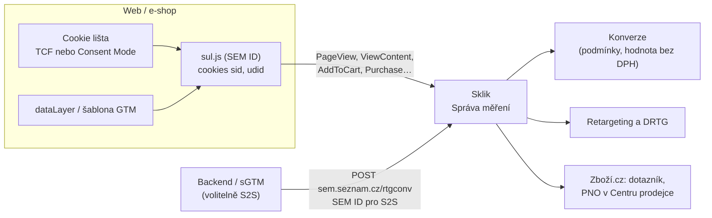
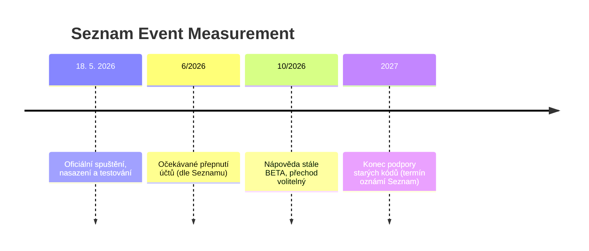

# B6: Seznam Event Measurement: konverze Skliku po novu – brief
> Cluster: B. Server-side & architektura · URL: /blog/seznam-event-measurement-sklik · Formát: technický návod · Priorita: měsíc 1 · Cílová LP: /sluzby/mereni-konverzi · Rozsah finálního článku: 2 600–3 200 slov

**Stav k 8. 10. 2026 (ověřeno v napoveda.sklik.cz, blog.seznam.cz, o-seznam.cz):** SEM spuštěn 18. 5. 2026, v navigaci nápovědy stále označen **„BETA“**, přechod je zatím **volitelný**, podpora starých konverzních a retargetingových kódů má skončit **„v průběhu roku 2027“** (přesný termín Seznam oznámí). Téma se bude rychle měnit → box „Aktualizováno [datum]“ a revize každé 3 měsíce.

---

## 1. Meta

| Prvek | Návrh |
|---|---|
| H1 | Seznam Event Measurement: konverze Skliku po novu |
| SEO title (55 zn.) | Seznam Event Measurement (SEM) pro Sklik \| datalayer.cz |
| Meta description (154 zn.) | Co je Seznam Event Measurement, čím nahrazuje konverzní a retargetingový kód Skliku, jak nastavit souhlas, GTM šablonu, S2S měření a Zboží.cz. Návod 2026. |
| URL | /blog/seznam-event-measurement-sklik |
| Schema | `BlogPosting`, `HowTo` (migrace), `FAQPage`, `BreadcrumbList` |

**Klíčová slova** (`kw_mapovani_na_stranky.tsv`, topic `server-side`, `konverze-ads`):
- Hlavní: **seznam event measurement (20)**
- Vedlejší: sklik konverze (20), sklik konverzní kód (10), konverze sklik (0), sklik měření konverzí (0), měření konverzí sklik (0), zbozi.cz měření konverzí (0), měření konverzí zbozi.cz (0), zboží konverze (0), sklik měření konverzí prestashop (0)
- Související hledání (Google related): „SEM Sklik“, „Konverzní kód Sklik“, „Sklik retargeting kod“
- Otázky (z praxe a nápovědy): Musím přejít na SEM? Kdy přestanou fungovat staré kódy? Jak funguje souhlas? Jde SEM přes GTM? Co je S2S a potřebuji ho? Jak to bude se Zboží.cz a recenzemi? Kolik to stojí?

**Záměr:** návodový, časově citlivý. **Čtenář:** PPC specialista a majitel e-shopu inzerující na Skliku a Zboží.cz; analytik spravující GTM; vývojář vlastního e-shopu. Segment: hlavně české e-shopy, sekundárně B2B (Lead).

---

## 2. Analýza SERP a konkurence

| Dotaz (8. 10. 2026) | TOP výsledky | Pozorování |
|---|---|---|
| seznam event measurement sklik | napoveda.sklik.cz (SEM), blog.seznam.cz (představení 18. 5. 2026), napoveda.sklik.cz (WebAreal – aktivace SEM), blog.seznam.cz (N. Dvorščáková, 3. 6. 2026), vojtechaudy.cz, sunlight.cz (5/2026), napoveda (Měřicí skripty) | Dominuje Seznam. Nezávislé texty: vojtechaudy.cz, sunlight.cz (platforma). |
| sklik konverzní kód | napoveda.sklik.cz (konverzní kód, Seznam Nákupy, konverze, consent – konverzní kód, Shopify), sklikakademie.cz, podpora.shoptet.cz, blog.webareal.cz, webmium.cz | Uživatelé hledají starý kód → příležitost vysvětlit přechod. |

**Konkurence:**
- **datanostro.com** (/cs/sklik-konverze/ + článek „SEM: server-side konverze pro Sklik a Zboží.cz“): jediný komerční hráč s hlubším obsahem; prezentuje S2S jako **doplněk**, který „doplní data“ ztracená v prohlížeči, a posílá „stejný purchase“ do SEM. **Nápověda Seznamu ale výslovně varuje: „Neposílejte S2S události současně s jejich frontend podobou, jinak se vám budou události duplikovat. Deduplikace událostí je v přípravě.“** → náš článek to musí říct jasně (bez jmenování konkurence).
- **khoder.cz**: zmiňuje „Sklik po roce 2027“ a SEM jako novinku na LP analytiky.
- **nazakladedat.cz** (profil): 25 návodů k Ads/Sklik/Zboží – ověřit, zda mají SEM.

**Čím přeskočíme:**
1. Aktuální stav (BETA, volitelnost, konec starých kódů 2027, nevratnost přepnutí) s daty a zdroji.
2. **Správná architektura FE vs. S2S** (kdy S2S, kdy ne, riziko duplicit).
3. Souhlas: TCF vs. Consent Mode, proč bez `ad_storage` nevzniknou `sid`/`udid`, co se děje bez souhlasu.
4. Zboží.cz: kombinované SEM ID provozovny, `review_email`, hodnota bez DPH.
5. Ukázky kódu: základní skript, GTM (šablona i Custom HTML), S2S payload, šablona pro server-side GTM.

---

## 3. Otázky, na které musí článek odpovědět

1. Co je Seznam Event Measurement a od kdy funguje?
2. Čím se liší od starého konverzního a retargetingového kódu (`rc.js`)?
3. Musím přejít a kdy přestanou fungovat staré kódy?
4. Kolik SEM stojí? (Zdarma.)
5. Jak SEM pracuje se souhlasem (IAB TCF, Google Consent Mode)?
6. Jaké jsou možnosti nasazení (skript, GTM, platforma, S2S) a jak dlouho trvají?
7. Jak nasadit SEM přes Google Tag Manager?
8. Co je S2S měření, kdy dává smysl a proč nesmím posílat stejnou událost dvakrát?
9. Jak na Zboží.cz (Seznam Nákupy) a dotazníky spokojenosti?
10. Jak otestovat implementaci (Sandbox, Diagnostika měření)?
11. Co se stane po přepnutí účtu (nevratnost, Maximalizace konverzí)?
12. Jaká má SEM omezení?

---

## 4. Rychlá odpověď (hotový text, 49 slov)

> **Seznam Event Measurement (SEM)** je nové měření Skliku a Zboží.cz, které jedním skriptem `sul.js` nahrazuje konverzní i retargetingový kód. Měří události (PageView, ViewContent, AddToCart, Purchase, Lead…), souhlas přebírá z IAB TCF nebo Google Consent Mode a umí i server-to-server. Je zdarma; staré kódy mají skončit v průběhu roku 2027.

---

## 5. Osnova s obsahem odpovědí

### H2 1: Co je SEM a od kdy funguje
**Klíčové sdělení:** Seznam přechází z „jeden kód = jedna konverze“ na měření událostí, podobné Meta Pixelu + CAPI.

**Fakta:**
- Seznam: „nový systém měření událostí, který nahrazuje staré retargetingové a konverzní kódy“ a sjednocuje sběr dat pro kampaně, retargeting i optimalizaci (napoveda.sklik.cz/merici-skripty/seznam-event-measurement/).
- **18. 5. 2026** – oficiální představení na blogu Seznamu; tehdy bylo možné SEM nasadit a testovat, „finální přepnutí účtu“ ohlášeno na **červen 2026** (blog.seznam.cz). Nápověda dnes popisuje přepnutí ve *Správě měření* („Začít používat SEM“) → **ověřit, zda je dostupné pro všechny účty**.
- K čemu slouží: měření konverzí, retargeting, dynamický retargeting (DRTG), optimalizace kampaní, hodnocení obchodu zákazníky (dotazníky spokojenosti).
- **Cena:** „Seznam Event Measurement je plně zdarma“ (o-seznam.cz FAQ).
- **Konec starých kódů:** „Podpora původních konverzních a retargetingových kódů však bude ukončena v průběhu roku 2027. O přesném termínu vás budeme s předstihem informovat.“ (nápověda, Časté dotazy).
- Partner Seznamu (vývojář modulu PSModuly) na o-seznam.cz přirovnává SEM technicky k Meta Pixelu s CAPI – vhodný most pro čtenáře, kteří znají Metu (B5).

### H2 2: Co se mění oproti starému kódu
**Klíčové sdělení:** Méně skriptů, více událostí a konverze definované v rozhraní Skliku, ne v kódu.

Tabulka T1 (kap. 6). Doplnit, jak vypadal starý stav:
- Starý konverzní kód: `https://c.seznam.cz/js/rc.js` + `window.rc.conversionHit({id, value, orderId, zboziType, zboziId, consent})`; identita přes `window.sznIVA.IS.updateIdentities({eid, aid, tid})`; parametr **`consent` povinný** (1 = souhlas, 0 = bez souhlasu → hit zpracován anonymizovaně a použit pro modelování části konverzí); ochrana proti reloadu – další konverze se započte až **po 3 minutách**; hodnota doporučeně bez DPH (napoveda.sklik.cz/merici-skripty/konverzni-kod/).
- SEM: jeden `sul.js`, události, konverze nastavené ve *Správě měření* s podmínkami (URL, `content_type`, kategorie, ID produktu, hodnota, pohlaví, město…), automatický retargetingový seznam ke každé konverzi, Maximalizace konverzí na zvolenou SEM konverzi.

### H2 3: Jak SEM funguje: skript, SEM ID, události
**Klíčové sdělení:** `sul.js` s vaším SEM ID → volání `SEM('track', 'Událost', data)` → Sklik. Konverze z událostí „vyrobíte“ v rozhraní.

**Obsah:**
- **SEM ID**: Sklik → *Nastavení účtu*; jeden na účet; každá provozovna Zboží.cz má **vlastní kombinované SEM ID**; pro S2S existuje **samostatné „SEM ID pro S2S“** (přepínač *Zobrazit pokročilé nastavení*) – tabulka T2.
- **Metody skriptu:** `SEM('track', …)`, `SEM('updateConsent', …)`, `SEM('updateUserData', …)`, `SEM('config', …)` (globální `sem_id`; `sem_id` v `track` má přednost – více účtů na jedné stránce).
- **Cookies `sid` a `udid`** vytvoří `sul.js` až po souhlasu `ad_storage: 'granted'`.
- **Uživatelská data** (`em`, `ph`, `fn`, `ln`, `ge`, `db`, `ct`, `zp`, `sr`, `country`, `region`, `subscription_id`): ve frontendu v čitelné podobě – skript je normalizuje a zahashuje SHA-256 v prohlížeči; klíčový je e-mail.
- **Pravidla dat:** měna **vždy CZK**; `value` **bez DPH**; `unit_price`, `delivery_price`, `other_costs` **s DPH**; `value`+`currency` a `contents`+`content_type` vždy v párech.
- **Události:** tabulka T3 (PageView, ViewContent, AddToCart, AddToWishlist, InitiateCheckout, AddPaymentInfo, Purchase, Search, Lead, CompleteRegistration, Subscribe, StartTrial, Contact, Schedule, Donate, CustomizeProduct, SubmitApplication).

**Kód 1 – základní skript (do `<head>` na každou stránku; podle nápovědy Skliku):**
```html
<script src="https://l.seznam.cz/sul.js?id=VASE_SEM_ID"></script>
<script>
if (typeof window.SEM === "function") {
  // 1) Souhlas – jen pokud web NEPOUŽÍVÁ IAB TCF (ten SEM čte automaticky)
  SEM('updateConsent', {
    consent_mode: {
      ad_storage: 'denied', ad_user_data: 'denied', ad_personalization: 'denied',
      functionality_storage: 'denied', analytics_storage: 'denied'
    }
  });
  // 2) Uživatelská data – jen pokud je znáte (přihlášení, objednávka); hashuje skript
  // SEM('updateUserData', { em: 'jan.novak@email.cz' });
  // 3) Zobrazení stránky
  SEM('track', 'PageView');
}
</script>
```
**Kód 2 – nákup na děkovací stránce:**
```js
SEM('track', 'Purchase', {
  order_id: 'OBJ-2026-10481',            // povinné, slouží i k deduplikaci
  currency: 'CZK',                       // povinné, jen CZK
  value: 3545.45,                        // povinné, bez DPH
  value_tax: 744.55,                     // DPH (obrat a PNO v Centru prodejce)
  content_type: 'product',
  review_email: 'zakaznik@email.cz',     // NEHASHOVAT – dotazník Zboží.cz; jen pokud zákazník nevyjádřil nesouhlas
  delivery_type: 'CESKA_POSTA',          // dle DELIVERY_ID z XML feedu
  delivery_price: 99,                    // s DPH
  payment_type: 'karta',
  contents: [{ id: 'SKU-123', quantity: 1, unit_price: 4290,     // s DPH
               content_name: 'Trekové boty Alpina', content_category: 'Obuv | Treková obuv' }]
});
```
- **CSP:** `script-src l.seznam.cz; connect-src https://*.seznam.cz;`
- **SPA:** `PageView` volat při každé změně routy.

### H2 4: Souhlas: TCF, nebo Google Consent Mode
**Klíčové sdělení:** SEM upřednostní IAB TCF; pokud ho nemáte, posílejte souhlas ve formátu Google Consent Mode – vždy **před** `PageView`.

**Obsah:**
- **IAB TCF v2:** SEM čte consent string automaticky z TCF API, nic dalšího není třeba.
- **Bez TCF:** `SEM('updateConsent', {consent_mode: {...}})` – při načtení s výchozím stavem (obvykle `denied`) a po interakci s lištou s aktualizovaným stavem.
- **Pět klíčů** (Consent Mode v2): `ad_storage` – nutný pro cookies `sid` a `udid`; `ad_user_data` – nutný pro zpracování hashovaných identifikátorů; `ad_personalization` – nutný pro retargeting; `functionality_storage`, `analytics_storage` – pro SEM volitelné.
- **Pořadí:** souhlas před `PageView`, jinak `sid` nemusí existovat (zásadní pro S2S).
- **GTM:** šablona má volbu „Používám Consent Mode v2“ – přečte stav automaticky; jinak ručně.
- **S2S:** `consent_string` (TCF, upřednostněn) nebo `consent_mode` v payloadu.
- **Starý kód:** parametr `consent` 0/1; bez souhlasu anonymizované zpracování a modelování konverzí (Sklik má sloupec Modelované konverze).
- **Právní poznámka:** Seznam v FAQ uvádí, že aktualizace cookie lišty a GDPR dokumentů „není nutná“, jen informace v obchodních podmínkách o datech posílaných do Skliku. Doporučení: ověřit s právníkem, zda zásady zpracování OÚ uvádějí Seznam.cz jako příjemce a zda souhlas pokrývá i předávání e-mailu (stará nápověda k EID to výslovně doporučovala). Disclaimer, odkaz A2/A3.

### H2 5: Čtyři způsoby nasazení
**Klíčové sdělení:** Všechny čtyři metody jsou podle Seznamu „rovnocenné z pohledu nasbíraných dat“ – liší se náročností.

Tabulka T4 (kap. 6) + časy podle Seznamu: modul platformy „pár kliknutí“, GTM šablona „jednotky hodin“, vlastní implementace „1–2 dny“ (o-seznam.cz FAQ).

#### H3 5.1 Google Tag Manager: šablona Pavla Šabatky
- Seznam dokumentaci staví na **GTM šabloně Pavla Šabatky** (Community Template Gallery, GitHub; dokumentace sabatka.net). Vyhledat „Seznam SEM“ nebo „Sabatka“.
- PageView tag (pole *Seznam ID*, *Název události* = PageView, spouštěč All Pages, volba Consent Mode v2), e-commerce tagy čtou `dataLayer` ve formátu **GA4 ecommerce nebo Shoptet** → existující GA4 implementace lze použít beze změn (odkaz C2).
- `review_email` předávat **mimo** user objekt (jinak se zahashuje a dotazník nefunguje).
- **Alternativa Custom HTML:** 3 typy tagů (base `sul.js`, PageView, události); **sekvence spouštění** „Spustit značku před spuštěním této značky“ = base, protože `sul.js` se načítá asynchronně – priorita tagů nestačí.

**Tabulka T5 – doporučená sada tagů v GTM** (kap. 6).

#### H3 5.2 E-commerce platformy
- Seznam vede aktuální přehled platforem s nativním modulem na o-seznam.cz/reklama/seznam-event-measurement/ (seznam se mění – odkazovat, nekopírovat).
- Doložené z primárních zdrojů Seznamu: **Eshop-rychle** (aktivace jedním kliknutím), **WebAreal** (návod v nápovědě Skliku), **BSShop** (základní i S2S varianta), **PrestaShop** (modul PSModuly). Shoptet, Upgates, Shopify: podle Seznamu SEM vyvíjejí (o-seznam.cz, 10/2026); WooCommerce – **ověřit před publikací**.
- Postup: administrace → měření/marketing → modul SEM → vložit SEM ID (u Zboží.cz kombinované ID provozovny) → zapnout → uložit.

#### H3 5.3 Server-to-Server (S2S)
**Klíčové sdělení:** S2S posílá události z vašeho serveru na `https://sem.seznam.cz/rtgconv`. Neruší `sul.js` – bez něj nejsou cookies `sid`/`udid` a Seznam nespáruje uživatele.

**Fakta (nápověda S2S):**
- Předpoklady: `sul.js` na všech stránkách; čtení `sid`/`udid` ze serveru (předat z frontendu); SHA-256 osobních dat na serveru (`em, ph, fn, ln, ge, db, ct, zp, sr, country`; `review_email` ne); **SEM ID pro S2S** (jiné než pro skript).
- Payload `schema_version: "v2"`, `event_type: "rtgconv"`, `event_time` v **milisekundách** UTC, `event_source` `web`/`app`, `event_id` doporučený (ideálně UUID-7), `user_ids.user_data`, `event_data` (+ `sem_id`, `sznaiid`), `consent_string`/`consent_mode`, `s2s_headers` (IP, user agent).
- `sznaiid` = prokliková ID ze Skliku v URL; podle Seznamu slouží k anonymnímu modelování a „lze ji bezpečně uložit na serveru i bez souhlasu uživatele“ (tvrzení Seznamu – právně ověřit).
- Hlavičky `X-Client-Id`, `X-Client-Version` doporučené (debug).
- Chyby: 400 neopakovat, 401/403 zkontrolovat SEM ID pro S2S, 5xx opakovat s backoffem 1 s → 2 s → 4 s (max. 3 pokusy); timeout 3–5 s; odesílat asynchronně (fronta), nezdržovat objednávku.
- Použití: mobilní aplikace, offline konverze, „maximální přesnost bez závislosti na cookies třetích stran“.
- **Omezení (důležité):** „Neposílejte S2S události současně s jejich frontend podobou, jinak se vám budou události (např. Nákup v konverzích) duplikovat. Deduplikace událostí je v přípravě.“ (*Co je dobré vědět*).

**Doporučená architektura (náš názor, označit):**
- `sul.js` ve frontendu pro PageView, ViewContent, AddToCart, InitiateCheckout (retargeting, DRTG).
- **Purchase buď frontend, nebo S2S – ne obojí**, dokud Seznam nespustí deduplikaci. S2S z **backendu** (po potvrzení objednávky, s `sid`/`udid` uloženými k objednávce) je odolnější než S2S ze sGTM, které stejně vzniká z prohlížečové události.
- Po spuštění deduplikace Seznamem: přejít na redundantní model jako u Mety (stejné `event_id`/`order_id`).

**Kód 3 – S2S payload (podle nápovědy, zkráceno):**
```json
{
  "schema_version": "v2",
  "event_source": "web",
  "event_name": "Purchase",
  "event_type": "rtgconv",
  "event_time": 1791446400000,
  "event_id": "018e4f2a-1234-7abc-9def-0123456789ab",
  "event_url": "https://www.eshop.cz/objednavka/dekujeme",
  "user_ids": { "user_data": {
    "sid": "<hodnota cookie sid – nehashovat>",
    "udid": "<hodnota cookie udid – nehashovat>",
    "em": "<sha256 hex normalizovaného e-mailu>"
  }},
  "consent_mode": { "ad_storage": "granted", "ad_user_data": "granted", "ad_personalization": "granted",
                    "functionality_storage": "denied", "analytics_storage": "denied" },
  "s2s_headers": { "client_ip_address": "203.0.113.24", "user_agent": "Mozilla/5.0 ..." },
  "event_data": {
    "sem_id": "VASE_SEM_ID_PRO_S2S",
    "sznaiid": "2627214859780792651",
    "order_id": "OBJ-2026-10481",
    "content_type": "product",
    "currency": "CZK",
    "value": 3545.45,
    "value_tax": 744.55,
    "contents": [{ "id": "SKU-123", "quantity": 1, "unit_price": 4290 }]
  }
}
```

**Kód 4 – šablona tagu pro server-side GTM „Seznam SEM – S2S Purchase“ (ukázka, ne hotová šablona; oprávnění: Reads event data, Sends HTTP requests na `https://sem.seznam.cz/*`):**
```js
const sendHttpRequest = require('sendHttpRequest');
const JSON = require('JSON');
const getEventData = require('getEventData');
const getTimestampMillis = require('getTimestampMillis');
const sha256Sync = require('sha256Sync');
const makeString = require('makeString');
const makeNumber = require('makeNumber');

const hash = (v) => v ? sha256Sync(makeString(v).trim().toLowerCase(), { outputEncoding: 'hex' }) : undefined;
const items = getEventData('items') || [];

const payload = {
  schema_version: 'v2',
  event_source: 'web',
  event_name: 'Purchase',
  event_type: 'rtgconv',
  event_time: getTimestampMillis(),                       // milisekundy
  event_id: getEventData('event_id'),
  event_url: getEventData('page_location'),
  user_ids: { user_data: {
    sid: getEventData('sem_sid'),                         // z webového GTM (1st-party cookie "sid")
    udid: getEventData('sem_udid'),                       // z webového GTM (1st-party cookie "udid")
    em: hash(getEventData('user_data.email_address')),
    ph: hash(getEventData('user_data.phone_number'))      // E.164: +420…
  }},
  consent_mode: {
    ad_storage: getEventData('consent_ad_storage'),
    ad_user_data: getEventData('consent_ad_user_data'),
    ad_personalization: getEventData('consent_ad_personalization')
  },
  s2s_headers: { client_ip_address: getEventData('ip_override'), user_agent: getEventData('user_agent') },
  event_data: {
    sem_id: data.semIdS2S,                                // pole šablony: SEM ID pro S2S
    sznaiid: getEventData('sznaiid'),
    order_id: makeString(getEventData('transaction_id')),
    currency: 'CZK',
    value: makeNumber(getEventData('value_net')),         // BEZ DPH – samostatný parametr z dataLayer
    value_tax: makeNumber(getEventData('tax')),
    content_type: 'product',
    contents: items.map((i) => ({
      id: makeString(i.item_id),
      quantity: makeNumber(i.quantity || 1),
      unit_price: makeNumber(i.price_gross),              // S DPH – doplnit do items v dataLayer
      content_name: i.item_name,
      content_category: i.item_category
    }))
  }
};

sendHttpRequest('https://sem.seznam.cz/rtgconv', {
  method: 'POST',
  timeout: 5000,
  headers: { 'Content-Type': 'application/json', 'X-Client-Id': 'eshop-sgtm', 'X-Client-Version': '1.0.0' }
}, JSON.stringify(payload)).then((res) => {
  if (res.statusCode >= 200 && res.statusCode < 300) { data.gtmOnSuccess(); } else { data.gtmOnFailure(); }
}, () => data.gtmOnFailure());
```
Poznámky pod kódem: spouštět jen při `consent_ad_storage = granted` (B2); **nepoužívat současně s frontendovým Purchase**; sGTM nemá frontu pro opakování (retry s backoffem řešit v backendové integraci); oficiální serverovou šablonu Seznam k 10/2026 nepublikoval – ověřit v Template Gallery.

### H2 6: Zboží.cz (Seznam Nákupy) a dotazníky spokojenosti
**Klíčové sdělení:** E-shop napojený na Zboží.cz používá pro všechny události **kombinované SEM ID provozovny** a v Purchase posílá nehashovaný `review_email`.

**Fakta:**
- Kombinované SEM ID obsahuje účet i provozovnu; „samostatné SEM ID účtu v takovém případě neimplementujte“. Při přesunu provozovny do jiného účtu kombinované ID zaniká (Sklik upozorní) → aktualizovat implementaci.
- Měření konverzí Seznam Nákupy zajistí **buď frontendový, nebo backendový (S2S) SEM** – ne povinně oba (dříve se musel spojit FE a BE kód přes `orderId`); podle Seznamu nezávislé na účasti v programu „Data objednávek“.
- `review_email` – nehashovat, posílat jen pokud zákazník nevyjádřil nesouhlas se zasíláním dotazníků; `delivery_type` podle `DELIVERY_ID` z XML feedu; `value_tax` pro výpočet obratu a PNO v Centru prodejce.
- Starý kód: `zboziId`, `zboziType` (`standard` / `limited` / `sandbox`), `orderId` shodné ve FE a BE.
- Terminologie: nápověda používá „Zboží.cz“, „Seznam Nákupy“ i „Inzerce Nákupy“ – v článku sjednotit a vysvětlit jednou větou (ověřit aktuální oficiální název).

### H2 7: Migrace ze starých kódů krok za krokem (HowTo)
Podle *Nasazení a přechod na SEM* (8 kroků):
1. Nasadit SEM (skript / GTM / modul / S2S) – staré kódy zatím ponechat, běží souběžně „bez výpadku dat“.
2. **Migrace konverzí** ve *Správě měření* – většina 1:1, duplicity a nepodporované typy ručně; konverze, které nechcete, ponechat v přechodném stavu nebo smazat.
3. (Volitelně) nové konverzní SEM události (mikrokonverze).
4. **Diagnostika měření** – kvalita hitů.
5. **Sandbox** (doporučeno).
6. **Zapnutí SEM** – *Začít používat SEM*; u kampaní s Maximalizací konverzí vybrat SEM konverzi. **Přepnutí nelze vrátit** – staré kódy se přestanou zpracovávat.
7. (Volitelně) nové RTG události/publika.
8. Úklid webu – odstranit staré kódy (ponechání nezpůsobí chybu, jen zátěž).

### H2 8: Testování: Sandbox a Diagnostika měření
- **Sandbox** (Správa měření → Sandbox, `sklik.cz/event-management/sandbox`): webové testování (otevře web v relaci, která posílá jen testovací hity) nebo S2S testování (testovací token do parametru `sandbox` v requestu); tabulka událostí se stavem *Zpracováno*/chyba a detailem parametrů; **relace platí 24 hodin**; testovací hity se nezapočítají do statistik. U účtu s provozovnou je zdroj testování předvybraný.
- **Diagnostika měření**: agregace za **30 dní** (do půlnoci předchozího dne): celkem hitů, hity podle `event_name`, **podíl hitů se souhlasem**, **podíl hitů s identitou** (SID, hashovaný e-mail), podíl zpracovaných hitů (souhlas + identita), validační chyby. Nízký podíl souhlasů = problém CMP; chybějící identita = horší párování.
- **DevTools:** Network → filtr `seznam.cz` (požadavky na `l.seznam.cz`/`sem.seznam.cz`), kontrola pořadí consent → PageView; Application → Cookies `sid`, `udid` po souhlasu.
- **GTM Preview:** pořadí tagů (base před eventy), hodnoty bez DPH, CZK.

### H2 9: Omezení SEM (k 10/2026)
- Sklik konektor pro Google Data Studio (Looker Studio) zatím neumí rozpad na konverze a typy konverzí (termín neznámý) – odkaz G1.
- **API Drak SEM nepodporuje a podporovat nebude** → API Fénix.
- **S2S + FE stejné události = duplicity** (deduplikace v přípravě).
- Po přechodu nelze sbírat retargetingová publika na profilu Firmy.cz.
- Více SEM ID na stránce: zatím nutné načíst `sul.js` vícekrát a u každé události uvádět `sem_id`.
- Pouze měna CZK.
- Status BETA v nápovědě.

### H2 10: Časté chyby (tabulka T6)

### FAQ (kap. 9) + kontaktní blok

---

## 6. Vizuály

### D1 – Jak SEM funguje (hlavní diagram, pod H2 3)

**SVG:** levý blok web (karta `#0b1a30`), uprostřed Sklik jako uzel s glow, vpravo tři výstupy (konverze, retargeting, Zboží). Spojnice S2S z backendu přerušovaná oranžová `#ff7400` se štítkem „jen bez duplicity s FE“. Popisky mono. Mobil svisle.

### D2 – Časová osa (pod H2 1)

*Pozn.: Seznam uvádí, že spuštění předcházely „měsíce intenzivního testování“ (blog 18. 5. 2026) – začátek testování neuvádět, není doložen.*

### T1 – Starý kód vs. SEM (podle nápovědy Skliku, doplněno)
| Funkce | Dosavadní měření (`rc.js`) | SEM (`sul.js`) |
|---|---|---|
| Počet skriptů | retargetingový + konverzní kód zvlášť | jeden skript pro všechny události |
| Konverze | jeden typ konverze na jeden kód | více konverzních i mikrokonverzních událostí, podrobnější reporting, Maximalizace konverzí na vybranou konverzi |
| Kde se konverze definuje | v kódu (ID konverze) | ve Správě měření (událost + podmínky + hodnota) |
| Retargetingové seznamy | ručně v záložce Retargeting | automaticky ke každé konverzi + pokročilé podmínky |
| Podmínky retargetingu | omezené (URL…) | URL, kategorie, hodnota, ID produktu, město, pohlaví, košík… |
| Souhlas | parametr `consent` 0/1 (vlastní řešení) | automaticky z IAB TCF nebo Google Consent Mode |
| Hodnota | doporučeně bez DPH | `value` povinně bez DPH, jen CZK |
| Zboží.cz | spojení FE a BE kódu přes `orderId`, `zboziId`, `zboziType` | FE **nebo** BE (S2S) SEM, kombinované SEM ID provozovny |
| Server-to-Server | nepodporováno | podporováno (`sem.seznam.cz`) |
| Ochrana proti reloadu | další konverze až po 3 minutách | `order_id` slouží k deduplikaci nákupu |
| Konec podpory | v průběhu roku 2027 | – |

### T2 – Identifikátory
| Identifikátor | Kde najdete | Kde použijete |
|---|---|---|
| SEM ID | Nastavení účtu → SEM – správa měření | přímý skript, GTM šablona, modul platformy |
| SEM ID provozovny (kombinované) | Nastavení účtu → SEM – správa měření | totéž, pokud je napojená provozovna Zboží.cz (místo SEM ID účtu) |
| SEM ID pro S2S | Správa měření → přepínač „Zobrazit pokročilé nastavení“ | S2S – parametr `sem_id` v payloadu |
| `sid`, `udid` | cookies vytvořené `sul.js` (po `ad_storage` granted) | `user_ids.user_data` v S2S |
| `sznaiid` | URL parametr po prokliku z reklamy Skliku | `event_data` v S2S (modelování) |

### T3 – Události SEM a parametry
| Událost | Povinné | Doporučené |
|---|---|---|
| PageView | – | – |
| ViewContent | – | `content_type` (product / product_group / page), `currency`, `value`, `contents` |
| AddToCart, AddToWishlist | – | `currency`, `value`, `contents`, `content_type` |
| InitiateCheckout, AddPaymentInfo | – | `currency`, `value`, `contents` |
| Purchase | `order_id`, `currency`, `value` | `value_tax`, `content_type`, `contents`, `review_email`, `delivery_type`, `delivery_price`; volitelně `payment_type`, `other_costs` |
| Search | – | `search_string` |
| Lead | – | `currency`, `value` |
| CompleteRegistration | – | `status`, `currency`, `value` |
| Subscribe, StartTrial | – | `currency`, `value`, `predicted_ltv` |
| Contact, Schedule, Donate, CustomizeProduct, SubmitApplication | – | – |

### T4 – Způsoby nasazení (podle Seznamu)
| Metoda | Kdo | Přístup ke kódu | Náročnost | Orientační čas (Seznam) |
|---|---|---|---|---|
| Přímý základní skript | vývojář | ano | střední – kód na každou stránku | 1–2 dny (vlastní implementace) |
| Google Tag Manager | marketér / analytik | ne (jen GTM) | nízká – šablona | jednotky hodin |
| Modul e-commerce platformy | provozovatel e-shopu | ne | velmi nízká – SEM ID | pár kliknutí |
| Server-to-Server | vývojář s backendem | ano (BE + FE) | vysoká | dle projektu |

### T5 – Sada tagů v GTM (podle nápovědy)
| Stránka / akce | Událost | Spouštěč (doporučený název) |
|---|---|---|
| Všechny stránky | PageView | All Pages |
| Detail produktu | ViewContent (`product`) | CE `seznam_view_content` (nebo GA4 `view_item`) |
| Kategorie | ViewContent (`product_group`) | CE `seznam_view_category` (nebo `view_item_list`) |
| Přidání do košíku | AddToCart | CE `seznam_add_to_cart` (nebo `add_to_cart`) |
| Zahájení objednávky | InitiateCheckout | CE `seznam_initiate_checkout` (nebo `begin_checkout`) |
| Potvrzení objednávky | Purchase | CE `seznam_purchase` (nebo `purchase`) |
| Vyhledávání | Search | CE `seznam_search` (nebo `search`) |
| Odeslání formuláře | Lead | CE / Form Submit (nebo `generate_lead`) |

### T6 – Časté chyby
| Symptom | Příčina | Oprava |
|---|---|---|
| Nákupy v Skliku 2× | Purchase odesílán frontendem i S2S | jen jedna cesta, dokud Seznam nespustí deduplikaci |
| Nízký podíl hitů s identitou (SID) | `updateConsent` voláno po `PageView` / CMP nepředává souhlas | souhlas před PageView; ověřit TCF/Consent Mode |
| Události se neodešlou z GTM | eventy se spustí dřív, než se načte `sul.js` | sekvence spouštění: base tag před event tagy |
| Dotazníky Zboží.cz nechodí | `review_email` zahashovaný (v user objektu) nebo použito SEM ID účtu místo provozovny | `review_email` mimo user objekt, kombinované SEM ID |
| PNO a obrat nesedí | `value` s DPH, jiná měna | `value` bez DPH, `value_tax`, jen CZK |
| S2S vrací 401/403 | použité běžné SEM ID místo SEM ID pro S2S | SEM ID pro S2S z pokročilého nastavení |
| S2S 400 | chybí povinné pole, `event_time` v sekundách | `schema_version v2`, čas v ms, validace |
| CSP chyba v konzoli | chybí `l.seznam.cz`, `*.seznam.cz` | doplnit CSP |
| Po přepnutí nefunguje Maximalizace konverzí | nebyla vybrána SEM konverze pro kampaň | nastavit u každé kampaně |
| RTG publikum na Firmy.cz se nenaplňuje | známé omezení SEM | počkat na podporu / ponechat jiný postup |

### Mockup M1 – Sandbox (pod H2 8)
Stylizovaná tabulka: řádky `PageView · Zpracováno · /`, `ViewContent · Zpracováno · /boty/alpina`, `Purchase · Chyba: chybí order_id · /dekujeme` (červený štítek), detail parametrů vpravo. Fiktivní data.

### Mockup M2 – Diagnostika měření (pod H2 8)
4 KPI dlaždice (fiktivní): Hity 128 400 · Se souhlasem 71 % · S identitou (SID) 66 % · Zpracované 64 % + mini graf validačních chyb. Označit „ukázka“.

---

## 7. Fakta a zdroje

| Tvrzení | Zdroj | Ověřeno | Riziko zastarání |
|---|---|---|---|
| SEM nahrazuje retargetingové a konverzní kódy; srovnávací tabulka; S2S endpoint | https://napoveda.sklik.cz/merici-skripty/seznam-event-measurement/ | 10/2026 | **vysoké** |
| Spuštění 18. 5. 2026, přepnutí účtu očekáváno v červnu 2026, přechod volitelný | https://blog.seznam.cz/2026/05/predstavujeme-seznam-event-measurement-novy-standard-mereni-vasich-kampani/ | 10/2026 | vysoké |
| Konec podpory starých kódů v průběhu roku 2027 | https://napoveda.sklik.cz/merici-skripty/seznam-event-measurement/zaciname-se-sem/caste-dotazy/ | 10/2026 | **vysoké** |
| Omezení: Data Studio konektor, API Drak/Fénix, S2S+FE duplicity (deduplikace v přípravě), Firmy.cz | https://napoveda.sklik.cz/merici-skripty/seznam-event-measurement/zaciname-se-sem/co-je-dobre-vedet/ | 10/2026 | **vysoké** |
| SEM ID, kombinované ID provozovny, SEM ID pro S2S | https://napoveda.sklik.cz/merici-skripty/seznam-event-measurement/zaciname-se-sem/kde-najdu-sem-id/ | 10/2026 | střední |
| 4 metody, 8 kroků migrace, nevratnost přepnutí | https://napoveda.sklik.cz/merici-skripty/seznam-event-measurement/zaciname-se-sem/nasazeni-a-prechod-na-sem/ | 10/2026 | střední |
| Základní skript, `updateConsent`, `updateUserData`, automatický hash, CSP, SPA, více SEM ID | https://napoveda.sklik.cz/merici-skripty/seznam-event-measurement/implementace-sem/zakladni-skript/ | 10/2026 | střední |
| GTM šablona P. Šabatky, formát GA4/Shoptet, Custom HTML se sekvencí | https://napoveda.sklik.cz/merici-skripty/seznam-event-measurement/implementace-sem/google-tag-manager/ | 10/2026 | střední |
| S2S: předpoklady, payload v2, ms, hlavičky, chyby, retry, timeout | https://napoveda.sklik.cz/merici-skripty/seznam-event-measurement/implementace-sem/server-to-server-s2s-mereni/ | 10/2026 | vysoké |
| Consent: TCF přednost, 5 klíčů, dopady na sid/udid | https://napoveda.sklik.cz/merici-skripty/seznam-event-measurement/konfigurace-sem/consent-a-sprava-souhlasu/ | 10/2026 | střední |
| Uživatelská data, normalizace pro S2S (E.164) | https://napoveda.sklik.cz/merici-skripty/seznam-event-measurement/konfigurace-sem/uzivatelska-data/ | 10/2026 | střední |
| Události a parametry, CZK, hodnoty s/bez DPH, `review_email` | https://napoveda.sklik.cz/merici-skripty/seznam-event-measurement/reference-udalosti/ | 10/2026 | střední |
| Správa konverzí, podmínky, kombinované ID | https://napoveda.sklik.cz/merici-skripty/seznam-event-measurement/konfigurace-sem/sprava-konverzi/ | 10/2026 | střední |
| Sandbox 24 h, S2S token, Diagnostika 30 dní | …/zaciname-se-sem/testovani-sandbox/ ; …/zaciname-se-sem/diagnostika-mereni/ | 10/2026 | střední |
| Zdarma; časy implementace; platformy; „aktualizace lišty není nutná“ | https://o-seznam.cz/reklama/seznam-event-measurement/ | 10/2026 | vysoké |
| Starý kód: `rc.js`, `conversionHit`, `consent` 0/1, 3 minuty, `zboziType`, EID doporučení | https://napoveda.sklik.cz/merici-skripty/konverzni-kod/ | 10/2026 | nízké (dobíhá) |
| Přednáška N. Dvorščákové (SEM v praxi) | https://blog.seznam.cz/2026/06/nikola-dvorscakova-seznam-event-measurement-v-praxi/ | 10/2026 | nízké |
| sGTM API (`sendHttpRequest`, `sha256Sync`, `getTimestampMillis`) | https://developers.google.com/tag-platform/tag-manager/server-side/api | ověřit při testu šablony | nízké |

---

## 8. Interní odkazy a CTA

**Cílová LP:** `/sluzby/mereni-konverzi`

**CTA box (za H2 5 – způsoby nasazení):**
- Nadpis: **Přechod na SEM bez výpadku konverzí**
- Text: Nasadíme SEM přes GTM nebo server, napojíme souhlas z vaší cookie lišty, převedeme konverze, otestujeme v Sandboxu a pohlídáme, aby se nákupy v Skliku ani Zboží.cz nepočítaly dvakrát.
- Tlačítko: `[ Chci přejít na SEM ]` → `/sluzby/mereni-konverzi#kontakt`

**Související články:** B5 [Meta Conversions API](/blog/meta-conversions-api) · B2 [Propojení client-side a server-side](/blog/propojeni-client-side-a-server-side) · B1 [Server-side tracking – průvodce](/blog/server-side-tracking-pruvodce) · C2 [GA4 e-commerce dataLayer](/blog/ga4-ecommerce-datalayer) · A1 [Consent Mode v2](/blog/consent-mode-v2-pruvodce) · A4 [Jak vybrat cookie lištu](/blog/jak-vybrat-cookie-listu) · D2 [Proč nesedí čísla](/blog/proc-nesedi-data) · D4 [GA4 na e-shopových platformách](/blog/ga4-pro-eshopove-platformy) · G1 [Looker Studio pro marketing](/blog/looker-studio-pruvodce)

**Navazující LP:** `/reseni/e-shopy`, `/sluzby/server-side-tracking`

**Slovník:** Seznam Event Measurement · Consent Mode · CMP · Deduplikace (event_id) · Konverze (klíčová událost)

**Zkrácený kontaktní blok:** `form_id: blog`, předvybrané téma `konverze`; H2 „Řešíte totéž u sebe?“; placeholder „Např. Sklik a Heureka ukazují jiné konverze než GA4…“.

---

## 9. FAQ pro schema

**Co je Seznam Event Measurement?**
Seznam Event Measurement (SEM) je nový systém měření Skliku a Zboží.cz, který jedním skriptem sul.js nahrazuje dosavadní konverzní a retargetingové kódy. Měří události na webu, jako je zobrazení produktu, přidání do košíku nebo nákup, a z nich si v rozhraní Skliku nastavíte konverze i retargetingová publika. Seznam ho spustil 18. května 2026 a je zdarma.

**Musím přejít na SEM a kdy přestanou fungovat staré kódy?**
Přechod je zatím volitelný, ale Seznam uvádí, že podporu původních konverzních a retargetingových kódů ukončí v průběhu roku 2027 a přesný termín oznámí předem. Doporučujeme SEM nasadit souběžně se starými kódy, otestovat ho v Sandboxu a účet přepnout s předstihem. Samotné přepnutí je nevratné.

**Jak SEM pracuje se souhlasem s cookies?**
Pokud web používá cookie lištu kompatibilní s IAB TCF, SEM si souhlas přečte automaticky. Jinak mu stav souhlasu předáte metodou updateConsent ve formátu Google Consent Mode, a to vždy před událostí PageView. Bez souhlasu ad_storage nevzniknou cookies sid a udid, takže Seznam nedokáže události spárovat s uživatelem.

**Jde SEM nasadit přes Google Tag Manager?**
Ano. Seznam v nápovědě vychází z GTM šablony Pavla Šabatky, kterou najdete v galerii šablon. Šablona načte skript, zahashuje uživatelská data a umí převzít stav Consent Mode. Data čte z datové vrstvy ve formátu GA4 e-commerce nebo Shoptet. Alternativou jsou tagy Vlastní HTML se správně nastavenou sekvencí spouštění.

**Co je server-to-server měření a potřebuji ho?**
S2S znamená, že události posíláte ze svého serveru přímo na endpoint Seznamu. Hodí se pro objednávky potvrzené v backendu, mobilní aplikace nebo offline konverze. Skript sul.js na webu ale zůstává povinný. Pozor: stejnou událost zatím neposílejte zároveň z prohlížeče i ze serveru – Seznam deduplikaci teprve připravuje a nákupy by se zdvojily.

**Jak SEM funguje se Zboží.cz?**
E-shop napojený na Zboží.cz použije pro všechny události kombinované SEM ID své provozovny místo SEM ID účtu. V události Purchase posílá číslo objednávky, hodnotu bez DPH v korunách a nehashovaný review_email, aby mohl Seznam zákazníkovi poslat dotazník spokojenosti. Měření konverzí zajistí frontendový nebo serverový SEM.

---

## 10. Poznámky pro autora

- **Nejvyšší riziko zastarání ze všech briefů B:** BETA status, termín konce starých kódů, deduplikace S2S, seznam platforem, omezení. Před publikací vše znovu ověřit v nápovědě; revize **každé 3 měsíce** a při každém oznámení Seznamu (blog.seznam.cz).
- **Ověřit ručně:** dostupnost přepnutí „Začít používat SEM“ pro všechny účty; aktuální seznam platforem (Shoptet, Upgates, Shopify: podle Seznamu SEM vyvíjejí – o-seznam.cz, 10/2026, ověřit stav k datu publikace; WooCommerce); existence oficiální serverové šablony; oficiální název „Zboží.cz / Seznam Nákupy“.
- **Neopakovat tvrzení konkurence** o „doplnění dat“ přes S2S souběžně s FE – je v rozporu s nápovědou Seznamu.
- **Právní věty** (H2 4, `sznaiid` bez souhlasu, „lištu není nutné upravovat“) uvádět jako tvrzení Seznamu + doporučení konzultace s právníkem.
- **Kód 4** otestovat na demo kontejneru se Sandboxem (S2S token v parametru `sandbox`) a uvést datum testu.
- **Od klienta:** [DOPLNIT: zkušenost z migrace na SEM u klientů datalayer.cz – anonymně, např. podíl hitů se souhlasem/identitou v Diagnostice] · [DOPLNIT: zda datalayer.cz používá šablonu Šabatky, nebo vlastní řešení].
- **Doporučený autor:** Vít Novotný; recenze: Sklik specialista (PPC) – praktická část Správy měření.
