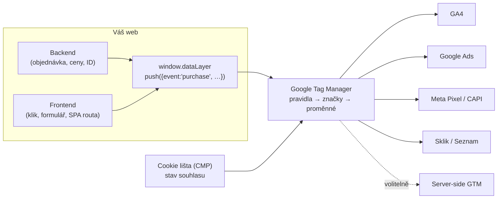
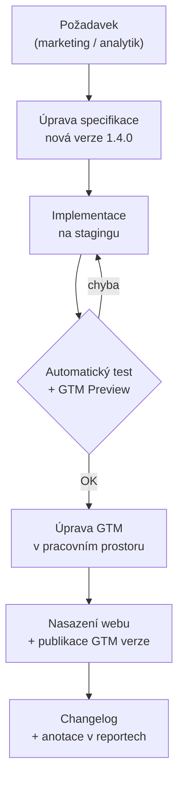

# C1: Datová vrstva (dataLayer): co to je a jak napsat specifikaci pro vývojáře (+ šablona) – brief
> Cluster: C. Datová vrstva & GTM · URL: /blog/datova-vrstva-specifikace · Formát: pilíř (hub clusteru C) · Priorita: měsíc 1 · Cílová LP: /sluzby/datova-vrstva · Rozsah: 2 800–3 500 slov + kód, tabulky a šablona ke stažení

---

## 1. Meta

| Prvek | Návrh |
|---|---|
| H1 | Datová vrstva (dataLayer): co to je a jak napsat specifikaci (60 zn.) |
| SEO title | DataLayer – specifikace datové vrstvy \| datalayer.cz (52 zn.) |
| Meta description | Co je dataLayer, proč nečíst data z HTML a jak napsat specifikaci pro vývojáře: události, parametry, typy hodnot, verze a testy. Šablona ke stažení. (148 zn.) |
| URL | /blog/datova-vrstva-specifikace |
| Schema | `BlogPosting` (author `Person` Vít Novotný, `dateModified`), `FAQPage`, `BreadcrumbList`, `HowTo` jen pro sekci testování (volitelně) |

**Klíčová slova** (Ahrefs CZ, `kw_mapovani_na_stranky.tsv`, topic `datalayer`):

| Typ | Klíčové slovo | Objem/měs. | KD |
|---|---|---|---|
| Hlavní | datalayer | 30 | 8 |
| Vedlejší | data layer | 20 | 12 |
| Vedlejší | datalayer push | 10 | 60 |
| Vedlejší | datalayer checker | 10 | – |
| Vedlejší | google-tag-manager datalayer | 10 | – |
| Vedlejší | unified data layer | 10 | – |
| Česká varianta | datová vrstva, datová vrstva gtm, gtm datová vrstva | 0 (nové/strategické) | – |
| Long-tail (EN, 0) | what is a data layer in gtm, how to create data layer, how to test gtm datalayer, datalayer push example, datalayer is not defined, how to check datalayer in console, datalayer structure, datalayer push on form submit | 0 | – |
| Odlišit | datová vrstva informačního systému (0) – jiný význam, krátce vysvětlit rozdíl | 0 | – |

Objemy jsou malé, ale téma nese název domény i autoritu celého clusteru C.

**Záměr hledání:** informační → komerčně-investigativní („potřebujeme zadání pro vývojáře“).
**Cíloví čtenáři:**
1. *Product owner / head of e-commerce* před redesignem nebo migrací – co objednat a jak to převzít.
2. *Vedoucí vývoje / frontend vývojář* – jednoznačné zadání místo „pošlete tam nákup“.
3. *Marketingový analytik / PPC specialista* – dnes čte data z HTML, hledá argumenty pro IT.
Segmenty: e-shop (primárně), B2B (formuláře), velká firma (governance, testy v CI). Úroveň: kód čtou, nemusí ho psát.

---

## 2. Analýza SERP a konkurence

Dotaz „datová vrstva datalayer“ (Google.cz, 8. 10. 2026, `google_serp_organic.tsv`):

| Poz. | Doména | Co nabízí | Slabina |
|---|---|---|---|
| 1 | nezzazvoni.cz | slovníkové heslo | jen definice |
| 2 | opinest.com | slovník (slovensky) | jen definice |
| 3 | nazakladedat.cz – „Co je dataLayer“ | 885 slov, screenshoty GTM, `dataLayer.push` | publikováno 6/2022; ukázka e-commerce ve formátu Universal Analytics (`ecommerce.purchase.actionField.id`) – **zastaralé**; chybí specifikace, typy hodnot, testy |
| 4–7 | zatkovic.cz, ehub.cz, cf.agency, jiri.online | krátké vysvětlení / slovník | žádná šablona, žádný kód pro GA4 |
| 8 | marketingppc.cz | glosář | krátké |
| 9 | 6clickz.com | proměnné v GTM | bez specifikace |

Další: digitalniarchitekti.cz `/produkty/datova-vrstva/` (≈830 slov, produktová stránka, gated „Zadání datové vrstvy + GTM kontejner“ je aktuálně vyprodané), `/clanek/datova-vrstva-vyznam/`.

**Čím je přeskočíme (konkrétně):**
1. Jediný český článek se **šablonou specifikace** (tabulky + JSON Schema) ke stažení.
2. **Aktuální GA4 formát** podle dokumentace Google (2026), ne UA.
3. Vysvětlení **proč** (`ecommerce: null`, rekurzivní slučování, inicializace nad GTM) – citovatelné pro AI přehled.
4. **Verzování a automatické testy v CI** (otestovaný kód) – v češtině chybí úplně.
5. Diagram toku dat ve stylu hero, mockup GTM Preview, odkaz na nástroj `/nastroje`.

---

## 3. Otázky, na které musí článek odpovědět

1. Co je datová vrstva (dataLayer) a čím se liší od „datové vrstvy“ v architektuře IS?
2. Proč nečíst data přímo z HTML (scraping DOM, CSS selektory)?
3. Kam v kódu patří `window.dataLayer = window.dataLayer || []` a proč nad kód GTM?
4. Kdy data poslat při načtení stránky a kdy až po akci (`dataLayer.push`)?
5. Proč se před každou e-commerce událostí posílá `{ ecommerce: null }`?
6. Jak pojmenovávat události a parametry a jaké limity má GA4?
7. Jaké datové typy používat (číslo vs. text, boolean, null)?
8. Co má obsahovat specifikace datové vrstvy pro vývojáře?
9. Jak specifikaci verzovat a kdo schvaluje změny?
10. Jak dataLayer otestovat ručně a automaticky v CI?
11. Smí datová vrstva obsahovat e-mail nebo telefon?
12. Jak řešit SPA (React, Vue, Next.js) a proč „push nefunguje“?

---

## 4. Rychlá odpověď (hotový text pod H1)

> **Datová vrstva (dataLayer)** je JavaScriptové pole na webu, do kterého aplikace zapisuje události a data – například nákup s číslem objednávky, hodnotou a produkty – v předem dohodnutém formátu. Google Tag Manager z něj data čte a posílá je do GA4, Google Ads, Meta či Skliku. Specifikace pro vývojáře popisuje každou událost, parametry, datové typy, okamžik volání a ukázkový kód.

(56 slov)

---

## 5. Osnova s obsahem odpovědí

### H2 1: Co je datová vrstva a proč ji web potřebuje
**Klíčové sdělení:** Datová vrstva odděluje web od měřicích nástrojů. Web jednou popíše, *co se stalo*; GTM rozhodne, *komu to poslat*.

**Obsah odpovědi:**
- Technicky jde o globální pole `window.dataLayer`, které používá Google Tag Manager i Google tag (gtag.js). Záznamy se zpracovávají v pořadí přidání (FIFO).
- Na stránce smí být **jen jedna** datová vrstva; Google varuje před jejím přepsáním (`window.dataLayer = []` po načtení GTM) – tagy se nespustí. Název rozlišuje velikost písmen.
- Přínos: jedna hodnota objednávky → stejné číslo v GA4, Google Ads, Meta i Skliku; nové nástroje bez zásahu vývojářů; méně „nesedících čísel“ (D2).
- **Odlišení pojmu:** v architektuře IS je „datová vrstva“ část aplikace pracující s databází. Zde jde o dataLayer – kontrakt mezi webem a tag managementem.

**Vizuál:** Diagram 1 (viz kap. 6).

### H2 2: Proč nečíst data z HTML (scraping DOM)
**Klíčové sdělení:** Čtení hodnot z HTML je rychlé na nasazení, ale křehké. První redesign nebo A/B test ho rozbije a nikdo si toho nevšimne.

**Obsah odpovědi – srovnávací tabulka (kompletní):**

| Kritérium | Scraping DOM (CSS selektory, text stránky) | Datová vrstva |
|---|---|---|
| Stabilita | rozbije ho změna třídy, šablony, překladu, A/B test | kontrakt nezávislý na vzhledu |
| Přesnost hodnot | text „1 239,00 Kč“ je nutné parsovat; slevy a DPH nejsou vidět | číslo `1239.00` přímo z backendu |
| Data, která na stránce nejsou | nedostupná (marže, ID objednávky, typ zákazníka, ID varianty) | dostupná, pokud je backend předá |
| Okamžik události | klik ≠ úspěch (formulář může selhat) | push až po potvrzení serveru |
| Testovatelnost | obtížná, závisí na vzhledu | automatické testy proti schématu |
| Odpovědnost | „to je v GTM“ – nikdo nevlastní | vlastník = vývoj + analytik, verzováno |
| Náklady | nízké na začátku, vysoké na údržbu | vyšší na začátku, nízké dlouhodobě |

- **Kdy je scraping přijatelný:** dočasně (prototyp) nebo u systémů třetích stran bez přístupu do kódu – vždy s monitoringem a termínem náhrady.
- *Ukázkový příklad (ilustrativní):* redesign přejmenoval třídu `.price-final` na `.price--final`; proměnná v GTM vracela `undefined` a GA4 tři týdny hlásilo nákupy s nulovou hodnotou, podle nichž optimalizoval smart bidding.

### H2 3: Osm pravidel dobré datové vrstvy
**Klíčové sdělení:** Dobrá datová vrstva popisuje byznys, ne nástroje. Je stabilní, typově přesná a testovatelná.

1. **Jedna pravda.** Hodnoty (cena, DPH, sleva, číslo objednávky) počítá backend, ne GTM. Všechny nástroje dostanou totéž číslo.
2. **Stabilní názvy.** `snake_case`, anglicky. Kde existuje doporučená událost GA4 (`purchase`, `generate_lead`, `sign_up`, `login`, `search`, `view_item`…), použijte její název i parametry. Názvy rozlišují velikost písmen.
   - Limity GA4 (sběr): název události max. 40 znaků, název parametru max. 40 znaků, hodnota parametru max. 100 znaků (výjimky `page_title` 300, `page_referrer` 420, `page_location` 1 000), max. 25 parametrů na událost.
   - Rezervované: např. názvy `page_view`, `session_start`, `first_visit`, `form_start`, `form_submit` nelze použít pro vlastní události; parametry nesmí začínat `_`, `firebase_`, `ga_`, `google_`, `gtag.`. (Seznam není úplný – odkaz na zdroj.)
3. **Správné datové typy.** Čísla jako `number` s desetinnou tečkou (`1239.5`), ne text s mezerou a měnou. Identifikátory jako `string` (`"0042"` se jinak změní na `42`). Ano/ne jako `boolean`. Měna ve formátu ISO 4217 (`"CZK"`). Datum ISO 8601. Chybějící hodnota: dohodnout `null`, nebo klíč vynechat – a dodržovat jednotně.
4. **Událost = dokončená akce.** `generate_lead` až po úspěšné odpovědi serveru, `purchase` až po vytvoření objednávky, ne po kliknutí na tlačítko.
5. **Kontext stránky zvlášť.** Údaje o stránce a uživateli (`page_type`, `page_language`, `user_logged_in`) posílat jako samostatný push na začátku stránky (např. událost `page_data`), ne opakovat v každé události.
6. **Reset e-commerce objektu.** Před každou e-commerce událostí poslat `{ ecommerce: null }`. *Proč:* GTM si drží interní datový model, do kterého **rekurzivně slučuje** objekty i pole. Princip popisuje knihovna Google Data Layer Helper: pokud model obsahuje `five: [1, 2]` a přijde `five: [3]`, výsledkem je `[3, 2]` – nová položka přepíše jen index 0. U e-commerce by tak v `items` zůstaly produkty z předchozí události. Všechny ukázky v dokumentaci GA4 začínají právě `dataLayer.push({ ecommerce: null })`.
7. **Inicializace nad GTM.** `window.dataLayer = window.dataLayer || [];` jako první skript v `<head>`; data, která mají být dostupná už při načtení stránky (Page View), musí být pushnuta **před** kódem kontejneru.
8. **Žádné osobní údaje v čitelné podobě.** E-mail ani telefon nepatří do datové vrstvy jako text. Pro rozšířené konverze se posílají jen normalizované a zahashované (SHA-256) údaje a jen v souladu se souhlasem – odkaz na A3 a E2. `user_id` = interní ID zákazníka, nikdy e-mail.

**Kód (funkční, komentovaný):**
```html
<head>
  <script>
    // 1) Inicializace – vždy první, nikdy nepřepisovat existující pole
    window.dataLayer = window.dataLayer || [];

    // 2) Kontext stránky – vyrenderuje backend (hodnoty jsou ukázkové)
    window.dataLayer.push({
      event: 'page_data',          // vlastní událost: „kontext stránky je připravený“
      dl_version: '1.3.0',         // verze specifikace → snadné ladění
      page_type: 'product',        // home | category | product | cart | checkout | purchase | content | other
      page_language: 'cs',
      user_logged_in: false,       // boolean, ne text 'false'
      user_id: null                // interní ID jen po přihlášení; nikdy e-mail
    });
  </script>
  <!-- 3) Až teď kód kontejneru Google Tag Manager (GTM-XXXXXXX) -->
</head>
```
```js
// 4) Událost po dokončené akci – formulář odeslán a server vrátil úspěch
async function onLeadSubmit(formData) {
  const res = await fetch('/api/kontakt', { method: 'POST', body: formData });
  if (!res.ok) return;                         // chyba → žádná konverze
  const { leadId } = await res.json();         // ID ze serveru: deduplikace, import z CRM
  window.dataLayer.push({
    event: 'generate_lead',                    // doporučená událost GA4
    form_id: 'kontakt',
    lead_id: leadId                            // např. 'L-2026-000123'
  });
}
```

### H2 4: Co obsahuje specifikace datové vrstvy (šablona)
**Klíčové sdělení:** Specifikace je technický kontrakt: vývojář z ní musí implementovat bez doplňujících otázek a tester podle ní musí umět rozhodnout „hotovo / nehotovo“.

**Kapitoly specifikace (osnova dokumentu):**
1. Účel, rozsah (weby, domény, aplikace), verze, vlastník, kontakty.
2. Globální konvence: pojmenování, datové typy, měna, DPH (s DPH / bez DPH – rozhodnutí zapsat!), doprava, zaokrouhlení, konvence `item_id`, práce s `null`.
3. Kontext stránky (`page_data`) – tabulka parametrů podle typu stránky.
4. Katalog událostí – tabulka událost × kdy se volá × parametry × příklad (níže).
5. Sdílené objekty (`items`, `user_data`) – tabulka parametrů.
6. Akceptační kritéria a testovací scénáře.
7. Changelog (verze, datum, změna, dopad na GTM).

**Tabulka A – katalog událostí (ukázka pro e-shop s registrací a kontaktním formulářem):**

| ID | Událost | Kdy se volá (přesně) | Kde | Povinné parametry | Volitelné | Akceptační kritérium |
|---|---|---|---|---|---|---|
| E01 | `page_data` | při renderu každé stránky, před GTM | všechny šablony | `page_type`, `page_language`, `user_logged_in`, `dl_version` | `user_id` | přesně 1× na stránku (u SPA při každé změně routy) |
| E02 | `view_item_list` | zobrazení výpisu produktů (kategorie, vyhledávání, doporučené) | výpis, vyhledávání | `ecommerce.item_list_id`, `item_list_name`, `items[]` | `currency`, `value` | `items` ve stejném pořadí jako na stránce, max. 200 položek |
| E03 | `select_item` | klik na produkt ve výpisu (před přechodem) | výpis | `item_list_id`, `items[0]` s `index` | – | `index` odpovídá pozici |
| E04 | `view_item` | zobrazení detailu produktu / změna varianty | detail | `currency`, `value`, `items[1]` | – | `item_id` = ID varianty |
| E05 | `add_to_cart` | po úspěšném přidání do košíku (odpověď API) | detail, výpis, košík | `currency`, `value`, `items[]` | – | nevolat při chybě skladu |
| E06 | `begin_checkout` | vstup do 1. kroku pokladny | pokladna | `currency`, `value`, `items[]` | `coupon` | 1× na vstup do pokladny |
| E07 | `purchase` | po vytvoření objednávky, na děkovné stránce | děkovná stránka | `transaction_id`, `currency`, `value`, `tax`, `shipping`, `items[]` | `coupon`, `customer_type` | 1× na objednávku i po reloadu |
| E08 | `sign_up` | po úspěšné registraci | registrace | `method` | – | ne při chybě validace |
| E09 | `login` | po úspěšném přihlášení | login | `method` | – | – |
| E10 | `search` | odeslání vyhledávání | hlavička | `search_term` | – | bez osobních údajů |
| E11 | `generate_lead` | po úspěšném odeslání formuláře (odpověď serveru) | kontakt | `form_id`, `lead_id` | `lead_source` | `lead_id` jedinečné |

(E-commerce detaily všech událostí → článek C2.)

**Tabulka B – parametry (výřez, formát pro celou specifikaci):**

| Parametr | Typ | Povinný v | Příklad | Pravidlo / zdroj hodnoty |
|---|---|---|---|---|
| `page_type` | string (enum) | E01 | `"product"` | jedna z 8 hodnot; určuje šablona |
| `dl_version` | string | E01 | `"1.3.0"` | verze specifikace, mění vývoj při nasazení |
| `user_id` | string \| null | E01 | `"C-58211"` | interní ID zákazníka, nikdy e-mail |
| `value` | number | E04–E07 | `1446.28` | součet `price × quantity`, bez dopravy a DPH (dle konvence v kap. 2) |
| `transaction_id` | string | E07 | `"OBJ-2026-10457"` | číslo objednávky; nikdy prázdný řetězec |
| `items[].item_id` | string | E02–E07 | `"SKU-1001-M-BLU"` | ID varianty shodné s produktovým feedem |
| `lead_id` | string | E11 | `"L-2026-000123"` | generuje server |

**Lead magnet:** šablona specifikace ke stažení (Google Sheets + XLSX + JSON Schema). Listy: *Konvence*, *Události*, *Parametry*, *Items*, *Testy*, *Changelog*. `[DOPLNIT: klient rozhodne, zda ke stažení volně, nebo za e-mail; kdo šablonu připraví]`.

> **CTA box (uprostřed článku, za H2 4):** viz kap. 8.

### H2 5: Verzování specifikace a změnové řízení
**Klíčové sdělení:** Specifikace se mění s webem. Bez verzí nevíte, která podoba dat platila v jakém období – a v GA4 ani BigQuery to zpětně nezjistíte.

**Obsah odpovědi:**
- **Sémantické verzování** (MAJOR.MINOR.PATCH):
  - MAJOR – změna, která rozbije GTM nebo reporty: přejmenování události/parametru, změna typu, odstranění (např. `2.0.0`).
  - MINOR – přidání události nebo volitelného parametru (`1.3.0`).
  - PATCH – oprava popisu, příkladu, překlep (`1.3.1`).
- Verzi posílat v `page_data` jako `dl_version` → v GTM Preview i v BigQuery je vidět, která implementace data vytvořila.
- **Kde specifikaci držet:** malý web – sdílený Sheet s listem Changelog; větší tým – Git repozitář (Markdown + JSON Schema), změny přes pull request s revizí analytika i vývojáře.
- **Proces změny:** viz Diagram 2. Název verze GTM obsahuje verzi specifikace (např. „dl 1.3.0 – add_shipping_info“).
- U MAJOR změn plánovat **přechodné období**, kdy GTM umí obě podoby (nebo nasadit web a GTM ve stejný den).

**Vizuál:** Diagram 2 – životní cyklus změny.

### H2 6: Jak datovou vrstvu otestovat
**Klíčové sdělení:** Ruční kontrola ověří, že to funguje dnes. Automatický test ověří, že to bude fungovat i po příštím nasazení.

**Ruční kontrola (4 nástroje):**
1. **Konzole prohlížeče:** `dataLayer` (výpis pole), `copy(dataLayer)` zkopíruje obsah do schránky (Chrome DevTools).
2. **GTM Preview / Tag Assistant:** záložka *Data Layer* u každé události ukazuje stav modelu po pushi; vidíte i, které tagy se spustily.
3. **Rozšíření Datalayer Checker** (Chrome) – přehled pushů bez otevření GTM; vhodné pro testery mimo analytický tým.
4. **GA4 DebugView** – co skutečně dorazilo do GA4 (po mapování v GTM).

**Automatický test v CI (otestovaný kód – Playwright + Ajv + JSON Schema):**
Schéma specifikace (`datalayer.schema.json`, výřez):
```json
{
  "$schema": "http://json-schema.org/draft-07/schema#",
  "$id": "https://vas-web.cz/datalayer/1.3.0",
  "definitions": {
    "item": {
      "type": "object",
      "required": ["item_id", "item_name", "price", "quantity"],
      "properties": {
        "item_id":  { "type": "string", "minLength": 1, "maxLength": 100 },
        "price":    { "type": "number", "minimum": 0 },
        "quantity": { "type": "integer", "minimum": 1 }
      }
    },
    "ecommerce": {
      "type": "object",
      "required": ["currency", "value", "items"],
      "properties": {
        "currency": { "type": "string", "pattern": "^[A-Z]{3}$" },
        "value":    { "type": "number", "minimum": 0 },
        "items":    { "type": "array", "minItems": 1, "maxItems": 200, "items": { "$ref": "#/definitions/item" } }
      }
    },
    "events": {
      "page_data": {
        "type": "object",
        "required": ["event", "page_type", "page_language", "user_logged_in"],
        "properties": {
          "event": { "const": "page_data" },
          "page_type": { "enum": ["home", "category", "product", "cart", "checkout", "purchase", "content", "other"] },
          "page_language": { "type": "string", "pattern": "^[a-z]{2}$" },
          "user_logged_in": { "type": "boolean" }
        }
      },
      "add_to_cart": {
        "type": "object",
        "required": ["event", "ecommerce"],
        "properties": { "event": { "const": "add_to_cart" }, "ecommerce": { "$ref": "#/definitions/ecommerce" } }
      }
    }
  }
}
```
Test (`tests/datalayer.spec.js`, spouští se v CI po každém nasazení na staging):
```js
// npm i -D @playwright/test ajv  →  BASE_URL=https://staging.vas-eshop.cz npx playwright test
const { test, expect } = require('@playwright/test');
const Ajv = require('ajv');
const spec = require('../datalayer.schema.json');

const ajv = new Ajv({ allErrors: true, strict: false });
ajv.addSchema(spec, 'spec');                                   // celé schéma pod klíčem "spec"
const BASE_URL = process.env.BASE_URL;
const EMAIL_RE = /[^\s@"]+@[^\s@"]+\.[a-z]{2,}/i;               // e-mail v čitelné podobě = chyba

const readDataLayer = (page) => page.evaluate(() => JSON.parse(JSON.stringify(window.dataLayer || [])));

function validateEntry(entry) {                                // vrací seznam chyb (prázdný = OK)
  const v = ajv.getSchema('spec#/definitions/events/' + entry.event);
  if (!v) return ['Událost "' + entry.event + '" není ve specifikaci'];
  return v(entry) ? [] : v.errors.map(e => entry.event + (e.instancePath || '') + ': ' + e.message);
}

test('detail produktu odpovídá specifikaci', async ({ page }) => {
  await page.goto(BASE_URL + '/produkt/bezecka-bunda-aero');
  const dl = await readDataLayer(page);
  const events = dl.filter(e => e.event && !String(e.event).startsWith('gtm.'));   // bez interních událostí GTM

  expect(events.map(e => e.event)).toEqual(expect.arrayContaining(['page_data', 'view_item']));
  const errors = events.flatMap(validateEntry);
  expect(errors, errors.join('\n')).toEqual([]);

  dl.forEach((entry, i) => {                                    // před každou e-commerce událostí reset
    if (entry.event && entry.ecommerce) expect(dl[i - 1]).toEqual({ ecommerce: null });
  });
  expect(EMAIL_RE.test(JSON.stringify(dl))).toBe(false);       // žádné PII
});

test('Do košíku pošle právě jedno add_to_cart', async ({ page }) => {
  await page.goto(BASE_URL + '/produkt/bezecka-bunda-aero');
  await page.click('[data-testid="add-to-cart"]');
  const adds = (await readDataLayer(page)).filter(e => e.event === 'add_to_cart');
  expect(adds).toHaveLength(1);
  expect(validateEntry(adds[0])).toEqual([]);
});
```
*Poznámka pro autora:* kód byl otestován 8. 10. 2026 (Playwright 1.56, Ajv 8, Chromium) na testovací stránce; schválně rozbitá data (cena jako text, `user_logged_in: 'false'`) test správně odhalil: „price: must be number“, „user_logged_in: must be boolean“. Selektory a URL v ukázce jsou ilustrativní.

**Monitoring v provozu:** denní porovnání počtu `purchase` v GA4/BigQuery s administrací a alert při výpadku (D3, F1).

**Akceptační checklist (tabulka do článku):**

| # | Kontrola | Jak ověřit |
|---|---|---|
| 1 | `dataLayer` inicializován před GTM, jen jednou | zdroj stránky, konzole |
| 2 | `page_data` 1× na stránku/routu | Preview, test |
| 3 | názvy událostí a parametrů přesně dle specifikace | test proti schématu |
| 4 | čísla jsou `number`, ID `string` | test proti schématu |
| 5 | `{ ecommerce: null }` před každou e-commerce událostí | test |
| 6 | události až po úspěchu akce | ruční test chybových stavů |
| 7 | `purchase` 1× i po reloadu děkovné stránky | ruční test |
| 8 | žádný e-mail/telefon v čitelné podobě | test (regex) |
| 9 | hodnoty sedí s administrací (vzorek 10 objednávek) | porovnání |
| 10 | `dl_version` odpovídá nasazené verzi | Preview |

### H2 7: Jak specifikaci předat IT, aby se implementovala správně
**Klíčové sdělení:** Nejčastější důvod nepovedené implementace není technický, ale organizační: chybí vlastník, akceptační kritéria a testovací prostředí.

**Obsah odpovědi:**
- Každá událost = **samostatný ticket** (ID z katalogu, např. E07) s příkladem JSON a akceptačním kritériem. Analytik dodá sdílený odkaz na GTM Preview a testovací scénáře, vývojář přístup na staging.
- **RACI (tabulka do článku):**

| Činnost | Analytik / datalayer.cz | Vývoj | Product owner | Marketing |
|---|---|---|---|---|
| Měřicí plán (proč, KPI) | R | C | A | C |
| Specifikace dataLayer | R | C | A | I |
| Implementace na webu | C | R | A | I |
| GTM a nástroje | R | I | A | C |
| Testy a akceptace | R | R | A | I |
| Změny a changelog | R | R | A | C |

(R = provádí, A = schvaluje, C = konzultuje, I = je informován.)
- **SPA (React, Vue, Next.js):** po změně routy znovu `page_data` a virtuální zobrazení stránky; pozor na dvojité odeslání při hydrataci. GTM spouštěč „Změna historie“ jen jako záloha.
- **Hotové platformy (Shoptet, Shopify, WooCommerce):** nativní datová vrstva má omezený obsah a vlastní formát → transformace v GTM nebo doplněk; detail v C2 a D4.
- **Délka:** `[DOPLNIT: klient – typická délka tvorby specifikace (dny), implementace a testů podle velikosti webu]`. Nejistotu snížit popisem kroků (konzultace → měřicí plán → specifikace → implementace vývojem → testy → GTM → předání dokumentace).

### H2 8: Nejčastější chyby (tabulka)

| Chyba | Dopad | Oprava |
|---|---|---|
| `dataLayer = []` nebo `window.dataLayer = [...]` po načtení GTM | GTM přestane naslouchat, tagy se nespustí | vždy `window.dataLayer = window.dataLayer \|\| []` + `push` |
| `datalayer.push` (malé l) | push se ztratí | `dataLayer` – rozlišuje velikost písmen |
| data pro Page View pushnutá až za GTM | proměnné při Page View prázdné | push nad kód GTM, nebo tag spouštět na vlastní událost (`page_data`) |
| cena jako text `"1 239 Kč"` | GA4 tržby 0 nebo chybné | `number` s tečkou |
| chybí `{ ecommerce: null }` | produkty z předchozí události v `items` | reset před každou e-commerce událostí |
| `purchase` při každém zobrazení děkovné stránky | duplicitní tržby | příznak „odesláno“ na serveru + `transaction_id` (C2) |
| `visitorType` na jedné stránce, `visitor_type` na druhé | proměnná v GTM vrací `undefined` | jeden slovník názvů ve specifikaci |
| e-mail v dataLayeru | riziko porušení pravidel Google a GDPR | hash jen se souhlasem, raději server-side (A3, E2) |
| událost na klik, ne po úspěchu | nadhodnocené konverze | push po odpovědi serveru |

---

## 6. Vizuály

### Diagram 1 – tok dat přes datovou vrstvu (sekce H2 1)

**Finální SVG:** styl hero (uzly = čtverce `#0b1a30` s cyan glow `#00ffff`, spojnice přerušované s animovaným pohybem „paketu“, popisky Roboto Mono). Uzel `dataLayer` zvýraznit (větší, akcent `#00ffff`, uvnitř monospace ukázka `{"event":"purchase","value":1446.28}`). CMP jako vstup zboku s ikonou přepínače. Animace: paket putuje backend → dataLayer → GTM → rozdělí se do 4 cílů; `prefers-reduced-motion` = statické. Mobil: svisle (web nahoře, cíle dole ve 2×2 mřížce). Alt: „Schéma: web zapisuje události do datové vrstvy, GTM je podle souhlasu posílá do GA4, Google Ads, Meta a Skliku.“

### Diagram 2 – životní cyklus změny specifikace (sekce H2 5)

**Finální SVG:** svislá časová osa se 7 kroky, každý krok s piktogramem (dokument, `</>`, ✓, kontejner `v42`, raketa, deník). Rozhodovací uzel „test“ jako kosočtverec s červenou zpětnou šipkou (`#ff7400` jen pro „chyba“). Na desktopu vodorovně, na mobilu svisle.

### Mockup – GTM Preview, záložka Data Layer (sekce H2 6)
Stylizovaný výřez Tag Assistant (ne screenshot): vlevo seznam událostí (`Container Loaded`, `page_data`, `view_item`, **`add_to_cart`** zvýrazněno), vpravo záložky *Tags · Variables · Data Layer · Errors*, aktivní *Data Layer* s JSON:
`{ event: "add_to_cart", ecommerce: { currency: "CZK", value: 1115.70, items: [{ item_id: "SKU-1001-M-BLU", … }] } }`. Fiktivní data, brand barvy, monospace. Popisek: „Takto vypadá správně pushnutá událost v režimu náhledu.“

### Infografika „8 pravidel datové vrstvy“
1080×1350 (LinkedIn) + responzivní verze (mřížka 2×4, mobil 1 sloupec). Každé pravidlo: piktogram 32×32, číslo `01–08` v Roboto Mono, titulek do 4 slov, jedna věta (pořadí podle H2 3). Patička `datalayer.cz` + piktogram `{ }`.

### Tabulky
Kompletní obsah: srovnání DOM vs. dataLayer (H2 2), Tabulka A a B (H2 4), akceptační checklist (H2 6), RACI (H2 7), chyby (H2 8).

---

## 7. Fakta a zdroje

| Tvrzení | Zdroj | Ověřeno | Riziko zastarání |
|---|---|---|---|
| Inicializace `window.dataLayer = window.dataLayer \|\| []` nad kódem kontejneru; nepřepisovat; jen jedna datová vrstva na stránku; název rozlišuje velikost písmen; konzistentní názvy | https://developers.google.com/tag-platform/tag-manager/datalayer (aktualizováno 22. 7. 2026) | 10/2026 | nízké |
| Ukázky GA4 e-commerce začínají `dataLayer.push({ ecommerce: null })` | https://developers.google.com/analytics/devguides/collection/ga4/ecommerce?client_type=gtm (19. 8. 2026) | 10/2026 | nízké |
| Rekurzivní slučování objektů a polí v datovém modelu (příklad `[1,2]` + `[3]` → `[3,2]`) | https://github.com/google/data-layer-helper (README) | 10/2026 | nízké |
| Proměnná datové vrstvy v GTM: verze 2 interpretuje tečky jako vnoření | https://support.google.com/tagmanager/answer/7683362 | 10/2026 | nízké |
| Limity sběru GA4: 40 znaků název události/parametru, 100 znaků hodnota (výjimky), 25 parametrů na událost, 25 uživatelských vlastností | https://support.google.com/analytics/answer/9267744 | 10/2026 | střední |
| Pravidla pojmenování a rezervované názvy/prefixy | https://support.google.com/analytics/answer/13316687 | 10/2026 | střední |
| Doporučené události (`generate_lead`, `sign_up`, `login`, `search`, e-commerce) | https://developers.google.com/analytics/devguides/collection/ga4/reference/events?client_type=gtm (16. 9. 2026) | 10/2026 | střední |
| Až 200 položek v `items`, až 27 vlastních parametrů položky | https://developers.google.com/analytics/devguides/collection/ga4/ecommerce?client_type=gtm | 10/2026 | střední |
| Preview režim propojený s Tag Assistant, sdílení náhledu | https://support.google.com/tagmanager/answer/6107056 | 10/2026 | střední |
| Rozšíření Datalayer Checker existuje v Chrome Web Store | https://chrome.google.com/webstore/detail/datalayer-checker/ffljdddodmkedhkcjhpmdajhjdbkogke | 10/2026 | střední (třetí strana) |
| Shoptet poskytuje vlastní objekt `shoptet` v dataLayeru | https://developers.shoptet.cz/data-layer/ | 10/2026 | střední |
| Playwright + Ajv test – funkční (vlastní test) | interní test 8. 10. 2026 | 10/2026 | nízké |

---

## 8. Interní odkazy a CTA

**Cílová LP:** /sluzby/datova-vrstva

**CTA box (za H2 4, komponenta box služby):**
- Nadpis: **Připravíme specifikaci datové vrstvy pro vaše vývojáře**
- Text: Dostanete katalog událostí, parametry s datovými typy, ukázky kódu, akceptační testy a pomoc při implementaci až po kontrolu v GTM Preview.
- Tlačítko: `[ Konzultovat specifikaci ]` → /sluzby/datova-vrstva#kontakt

**Druhý, menší odkaz (za H2 6):** „Vyzkoušejte si dataLayer validátor“ → /nastroje (`[DOPLNIT: až bude nástroj hotový]`).

**Související články:** C2 GA4 e-commerce dataLayer (/blog/ga4-ecommerce-datalayer) · C3 Google Tag Manager – průvodce (/blog/google-tag-manager-pruvodce) · C5 Měřicí plán (/blog/merici-plan) · C4 Audit GTM kontejneru (/blog/audit-gtm-kontejneru) · E1 Měření formulářů a leadů (/blog/mereni-formularu-a-leadu) · A3 Osobní údaje v analytice (/blog/osobni-udaje-v-analytice) · D3 Checklist kvality dat (/blog/ga4-checklist-kvality-dat) · D4 GA4 na e-shopových platformách (/blog/ga4-pro-eshopove-platformy).
**Navazující LP:** /sluzby/google-tag-manager · /sluzby/implementace-ga4 · /reseni/velke-firmy (governance).
**Slovník:** Datová vrstva (dataLayer) · Událost (event) · Google Tag Manager · Proměnná · Spouštěč (trigger) · Klíčová událost (navrhované slugy `/slovnik/datova-vrstva`, `/slovnik/udalost`…).

**Zkrácený kontaktní blok (konec článku):** `form_id: blog` · předvybraná témata: `Tag Manager`, `GA4` · H2: „Řešíte totéž u sebe?“ · placeholder: „Např. vyvíjíme nový e-shop a potřebujeme specifikaci dataLayer…“

---

## 9. FAQ pro schema

**Co je dataLayer jednoduše?**
DataLayer je JavaScriptové pole na webu, do kterého web zapisuje, co se stalo a s jakými daty – například že zákazník dokončil objednávku za 1 446 Kč se dvěma produkty. Google Tag Manager tato data čte a posílá je do GA4, Google Ads nebo Meta. Díky tomu nemusí každý nástroj data hledat v HTML stránky.

**Musí datovou vrstvu programovat vývojář?**
Ano, alespoň její jádro. Hodnoty jako číslo objednávky, cena bez DPH nebo ID varianty zná jen backend e-shopu. Analytik připraví specifikaci, vývojář ji implementuje a analytik výsledek ověří v GTM Preview a automatickými testy. U hotových platforem (Shoptet, Shopify) se pracuje s jejich nativními daty a doplňuje se chybějící.

**Proč se posílá dataLayer.push({ ecommerce: null })?**
GTM si drží interní datový model, do kterého nové pushe rekurzivně slučuje. Bez resetu by v poli items mohly zůstat produkty z předchozí události a GA4 by dostalo chybná data. Proto Google ve všech ukázkách e-commerce nejdřív posílá { ecommerce: null } a teprve potom samotnou událost.

**Smí být v dataLayeru e-mail zákazníka?**
V čitelné podobě ne. Datovou vrstvu vidí každý skript na stránce. Pro rozšířené konverze Google Ads se posílá jen normalizovaný a zahashovaný údaj (SHA-256) a jen v souladu se souhlasem; bezpečnější je řešit to na serveru. Nejde o právní radu – nastavení posuďte s právníkem.

**Jak zjistím, co je v dataLayeru na mém webu?**
Otevřete vývojářské nástroje prohlížeče (F12), záložku Konzole, a napište dataLayer. Přehledněji to ukáže režim náhledu Google Tag Manageru (Tag Assistant), záložka Data Layer, nebo rozšíření Datalayer Checker. Pro trvalou kontrolu nastavte automatický test proti specifikaci.

---

## 10. Poznámky pro autora

- **Zastaralé zdroje:** většina českých článků ukazuje formát Universal Analytics (`ecommerce.purchase.actionField`, `addToCart`). Používat jen formát GA4.
- **Právní věty** (osobní údaje, hash) formulovat opatrně, s odkazem na A3 a disclaimerem „nejsme advokátní kancelář“.
- **Kód:** test a schéma ověřeny (H2 6); před publikací spustit znovu s aktuálními verzemi. Pro vlastní JavaScript proměnné v GTM psát konzervativně (ES5) – podporu novější syntaxe ověřit.
- **Co dodá klient:** délky prací `[DOPLNIT]`, rozhodnutí o lead magnetu `[DOPLNIT]`, anonymizovaná ukázka reálné specifikace (se souhlasem) `[DOPLNIT]`, ukázka z vlastního webu („takhle měříme náš formulář“, `05_formulare/specifikace-formularu.md`, kap. 4).
- **Aktualizace:** revize každých 6 měsíců (limity GA4, dokumentace datové vrstvy). **Recenzent:** frontend vývojář – srozumitelnost pro IT.
