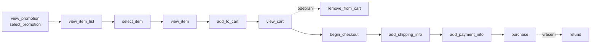

# C2: GA4 e-commerce dataLayer: události od view_item po purchase s ukázkami kódu – brief
> Cluster: C. Datová vrstva & GTM · URL: /blog/ga4-ecommerce-datalayer · Formát: technický návod · Priorita: měsíc 2 · Cílová LP: /sluzby/datova-vrstva (sekundárně /reseni/e-shopy) · Rozsah: 2 800–3 500 slov + kód

---

## 1. Meta

| Prvek | Návrh |
|---|---|
| H1 | GA4 e-commerce dataLayer: od view_item po purchase (50 zn.) |
| SEO title | GA4 e-commerce dataLayer: události a kód \| datalayer.cz (55 zn.) |
| Meta description | Všechny e-commerce události GA4 s kódem pro dataLayer: měna, DPH, slevy, item_id, duplicitní purchase a specifika Shoptetu, WooCommerce a Shopify. (146 zn.) |
| URL | /blog/ga4-ecommerce-datalayer |
| Schema | `BlogPosting`, `TechArticle` (volitelně), `FAQPage`, `BreadcrumbList` |

**Klíčová slova** (Ahrefs CZ, `kw_mapovani_na_stranky.tsv`):

| Typ | Klíčové slovo | Objem/měs. |
|---|---|---|
| Hlavní (EN long-tail) | ga4 ecommerce datalayer, ecommerce data layer ga4, google analytics 4 ecommerce datalayer, datalayer push purchase, gtm ecommerce datalayer | 0 (strategické) |
| Vedlejší | google analytics ecommerce | 40 |
| Vedlejší | google analytics e-commerce | 30 |
| Vedlejší | ga4 ecommerce | 20 |
| Vedlejší | ga4 ecommerce events, enhanced ecommerce gtm, google-tag-manager ecommerce tracking | 10 |
| Platformy | shoptet google analytics (150 → D4), shoptet ga4 (20), woocommerce google analytics (10), shopify gtm (350, navigační), shoptet datalayer / woocommerce datalayer / shopify datalayer (0) | – |
| Česky (SERP) | ga4 e-commerce měření (dotaz z `google_serp_organic.tsv`) | – |

**Záměr:** technický návod („jak to přesně napsat“). **Čtenář:** vývojář e-shopu a analytik/PPC specialista, který zadává implementaci; vedoucí e-commerce jako kontrolor („proč nám nesedí tržby“). Segment: e-shopy (vlastní řešení i Shoptet, WooCommerce, Shopify). Úroveň: pokročilá.

---

## 2. Analýza SERP a konkurence

Dotaz „ga4 e-commerce měření“ (Google.cz, 8. 10. 2026): 1. support.google.com „[GA4] Elektronický obchod“, 2. biztools.cz (GA4 na Shoptetu 2026), 3. janpospisil.cz (GA4 pro e-shop), 4. webglobe.cz (obecný GA4 návod), 5. support.google.com „Nastavení událostí elektronického obchodu“, 6. upgates.cz, 7. khoder.cz (služba, mockupy), 8. mariemullerova.cz, 9. dexfinity.com (slovník). Anglické long-tail dotazy vyhrává dokumentace Google a zahraniční blogy.

**Co chybí:** žádný český zdroj nedává **kompletní sadu dataLayer pushů** pro všechny e-commerce události včetně refundace a propagací, **konvence hodnot pro český trh** (DPH, doprava, CZK/EUR, slevy) a **ověřená specifika platforem** (co Shoptet, WooCommerce a Shopify v dataLayeru skutečně mají). Konkurence často míchá formát UA a GA4.

**Čím je přeskočíme:** (1) kompletní, otestovaný kód; (2) tabulka „konvence hodnot“ k převzetí do specifikace; (3) pravidla deduplikace `purchase` přímo z nápovědy Google; (4) tabulka platforem ověřená v dokumentaci k 10/2026; (5) diagram trychtýře s událostmi a mockup DebugView.

---

## 3. Otázky, na které musí článek odpovědět

1. Jaké e-commerce události GA4 existují a kdy se která odesílá?
2. Které parametry jsou povinné (`currency`, `value`, `items`, `transaction_id`)?
3. Jaké parametry má položka (`items`) a kolik vlastních parametrů lze přidat?
4. Má být hodnota s DPH, nebo bez DPH? Patří do ní doprava?
5. Jak správně zapsat slevu a kupon?
6. Co dát do `item_id` – kód produktu, varianty, nebo ID z databáze?
7. Jak zabránit duplicitním nákupům v GA4?
8. Jak posílat refundaci (celou i částečnou)?
9. Jak měřit propagace (bannery) a seznamy produktů?
10. Jak událost nastavit v GTM (proměnné, pravidla, značka GA4)?
11. Co nativně posílá Shoptet, WooCommerce a Shopify a co je potřeba doplnit?
12. Jak ověřit, že data v GA4 sedí s administrací?

---

## 4. Rychlá odpověď (hotový text)

> E-commerce v GA4 se měří doporučenými událostmi – od `view_item_list` a `view_item` přes `add_to_cart` a `begin_checkout` po `purchase` a `refund`. Web je posílá do dataLayeru v objektu `ecommerce` s polem `items`; před každou událostí se objekt vynuluje (`ecommerce: null`). Nákup musí mít jedinečné `transaction_id`, `value` a `currency`.

(54 slov)

---

## 5. Osnova s obsahem odpovědí

### H2 1: Jak e-commerce měření v GA4 funguje
**Klíčové sdělení:** Web popíše nákupní cestu událostmi v dataLayeru, GTM je předá značkou GA4 a GA4 z nich sestaví reporty Monetizace (nákupy, nákupní cesta, propagace).
- Každá událost má objekt `ecommerce` s parametry události a polem `items` (produkty).
- V GTM lze v značce *Google Analytics: Událost GA4* použít volbu **„Odesílat data elektronického obchodu“ (Send Ecommerce data)** se zdrojem *Data Layer* – GTM vezme objekt `ecommerce` celý. Alternativa: ruční mapování proměnnými (`ecommerce.items`, `ecommerce.value`…), které ukazuje dokumentace Google.
- Diagram 1 (trychtýř událostí) – kap. 6.

### H2 2: Přehled e-commerce událostí (tabulka)
**Klíčové sdělení:** 13 událostí pokrývá celou cestu; pro začátek stačí 6 (view_item, add_to_cart, view_cart, begin_checkout, purchase, refund), ale seznamy a propagace odpoví na otázku „co prodává výpis a banner“.

| Událost | Kdy ji poslat | Parametry události (kromě `items`) | Poznámka |
|---|---|---|---|
| `view_item_list` | zobrazení výpisu (kategorie, vyhledávání, doporučené) | `item_list_id`, `item_list_name` | reference Google uvádí i `currency` |
| `select_item` | klik na produkt ve výpisu | `item_list_id`, `item_list_name` | položka s `index` |
| `view_item` | zobrazení detailu, změna varianty | `currency`*, `value`* | hodnota u view_item se nezapočítává do tržeb |
| `add_to_cart` | úspěšné přidání do košíku | `currency`*, `value`* | i z výpisu a košíku (+1 ks) |
| `remove_from_cart` | odebrání z košíku | `currency`*, `value`* | i snížení množství |
| `view_cart` | zobrazení košíku | `currency`*, `value`* | – |
| `begin_checkout` | vstup do pokladny | `currency`*, `value`*, `coupon` | 1× za vstup |
| `add_shipping_info` | potvrzení dopravy | `currency`*, `value`*, `coupon`, `shipping_tier` | např. „Zásilkovna – výdejní místo“ |
| `add_payment_info` | potvrzení platby | `currency`*, `value`*, `coupon`, `payment_type` | např. „karta“, „převod“ |
| `purchase` | vytvořená objednávka | `transaction_id` (povinné), `currency`*, `value`*, `tax`, `shipping`, `coupon`, `customer_type` | viz H2 6 |
| `refund` | vrácení peněz | `transaction_id` (povinné), `currency`*, `value`*, `tax`, `shipping`, `coupon` | `items` volitelné, ale doporučené |
| `view_promotion` | zobrazení banneru/promo | `creative_name`, `creative_slot`, `promotion_id`, `promotion_name` | `items` povinné |
| `select_promotion` | klik na promo | totéž | bez `items` chybí v reportu propagací |

\* *„Povinné podmíněně“ – `value` je pro smysluplné reporty potřeba; pokud se pošle `value`, je povinná `currency`.* (`add_to_wishlist` zmínit jednou větou.)

### H2 3: Objekt `items` a konvence `item_id`
**Klíčové sdělení:** Položka musí mít `item_id` **nebo** `item_name`; v praxi posílejte obojí plus `price` a `quantity`. ID je nejdůležitější rozhodnutí celé implementace.

| Parametr | Typ | Pravidlo |
|---|---|---|
| `item_id` / `item_name` | string | aspoň jeden povinný |
| `price` | number | jednotková cena **po slevě** |
| `discount` | number | jednotková sleva (částka, ne procenta) |
| `quantity` | number | výchozí 1 |
| `item_brand`, `item_variant` | string | – |
| `item_category` … `item_category5` | string | hierarchie kategorií |
| `item_list_id`, `item_list_name` | string | položka má přednost před úrovní události |
| `index` | number | pozice ve výpisu |
| `coupon` | string | nezávislé na kuponu objednávky |
| `affiliation`, `location_id` | string | jen na úrovni položky |
| `promotion_id`, `promotion_name`, `creative_name`, `creative_slot` | string | položka má přednost před událostí |

- **Limity:** až 200 položek v `items`; až 27 vlastních parametrů položky; z nich lze registrovat 10 vlastních dimenzí s rozsahem položky (25 v GA4 360).
- **Konvence `item_id` (rozhodovací pravidlo):** použijte **stejné ID jako v produktovém feedu** (Google Merchant Center, Sklik/Zboží, Heureka) – jinak nebude fungovat dynamický remarketing a párování s náklady. Pokud feed obsahuje varianty, posílejte ID **varianty**; ID produktu (rodiče) lze přidat jako vlastní parametr (např. `item_group_id`). Vždy jako text (`"0042"`, ne `42`).
- `item_variant` = čitelný popis („M / modrá“); `item_name` bez varianty („Běžecká bunda Aero“).

### H2 4: Kód pro jednotlivé události
**Klíčové sdělení:** Jedna pomocná funkce zajistí reset objektu, správné typy a zaokrouhlení; jednotlivé události se pak liší jen názvem a parametry.

**Pomocné funkce (otestováno v Node 22, 8. 10. 2026):**
```js
/* Konvence (zapsat do specifikace): price = jednotková cena PO slevě, BEZ DPH; discount = jednotková sleva bez DPH;
   value = Σ price × quantity bez dopravy a DPH; item_id = ID varianty shodné s produktovým feedem */
window.dataLayer = window.dataLayer || [];

function round2(n) { return Math.round((Number(n) + Number.EPSILON) * 100) / 100; }

function toGa4Item(p, extra) {                       // p = produkt z backendu/šablony
  var item = Object.assign({
    item_id: String(p.sku),                          // vždy text – "0042" se nesmí změnit na 42
    item_name: p.name,
    item_brand: p.brand,
    item_category: p.categories && p.categories[0],
    item_category2: p.categories && p.categories[1],
    item_variant: p.variant,
    price: round2(p.unitPriceNet - (p.unitDiscountNet || 0)),   // cena po slevě bez DPH
    discount: p.unitDiscountNet ? round2(p.unitDiscountNet) : undefined,
    quantity: Math.max(1, parseInt(p.quantity || 1, 10))
  }, extra);
  Object.keys(item).forEach(function (k) { if (item[k] == null || item[k] === '') delete item[k]; }); // bez prázdných klíčů
  return item;
}

function sumValue(items) {
  return round2(items.reduce(function (s, i) { return s + i.price * i.quantity; }, 0));
}

function pushEcommerce(eventName, ecommerce) {
  window.dataLayer.push({ ecommerce: null });        // reset – jinak se slučuje s předchozí událostí
  window.dataLayer.push({ event: eventName, ecommerce: ecommerce });
}
```

**Výpis a klik (view_item_list, select_item):**
```js
var listItems = products.map(function (p, i) {      // products = produkty zobrazené ve výpisu, v pořadí
  return toGa4Item(p, { index: i, item_list_id: 'kategorie_bundy', item_list_name: 'Kategorie: Bundy' });
});
pushEcommerce('view_item_list', { item_list_id: 'kategorie_bundy', item_list_name: 'Kategorie: Bundy', items: listItems.slice(0, 200) });

// po kliknutí na produkt (před přechodem na detail)
pushEcommerce('select_item', { item_list_id: 'kategorie_bundy', item_list_name: 'Kategorie: Bundy', items: [listItems[3]] });
```

**Detail, košík, pokladna:**
```js
var item = toGa4Item(product);                      // product = aktuálně vybraná varianta
pushEcommerce('view_item',   { currency: 'CZK', value: sumValue([item]), items: [item] });

// po úspěšné odpovědi API košíku (ne při kliknutí)
pushEcommerce('add_to_cart', { currency: 'CZK', value: sumValue([item]), items: [item] });
pushEcommerce('remove_from_cart', { currency: 'CZK', value: sumValue([removed]), items: [removed] }); // removed = odebraná položka a odebrané množství

var cartItems = cart.lines.map(function (l) { return toGa4Item(l); });
pushEcommerce('view_cart',      { currency: 'CZK', value: sumValue(cartItems), items: cartItems });
pushEcommerce('begin_checkout', { currency: 'CZK', value: sumValue(cartItems), coupon: cart.coupon, items: cartItems });
pushEcommerce('add_shipping_info', { currency: 'CZK', value: sumValue(cartItems), shipping_tier: 'Zásilkovna – výdejní místo', items: cartItems });
pushEcommerce('add_payment_info',  { currency: 'CZK', value: sumValue(cartItems), payment_type: 'karta', items: cartItems });
```

**Nákup (děkovná stránka) – data vyrenderuje backend:**
```js
// Ukázková objednávka: zboží 1 446,28 Kč bez DPH, doprava 82,64 Kč bez DPH, DPH 21 % = 321,07 Kč, celkem 1 849,99 Kč
pushEcommerce('purchase', {
  transaction_id: 'OBJ-2026-10457',   // číslo objednávky – jedinečné, nikdy prázdný řetězec
  currency: 'CZK',
  value: 1446.28,                     // Σ price × quantity, bez dopravy a DPH
  tax: 321.07,                        // DPH celé objednávky
  shipping: 82.64,                    // doprava bez DPH
  coupon: 'PODZIM10',
  customer_type: 'new',               // 'new' | 'returning'; při nejistotě (host) neposílat
  items: [
    { item_id: 'SKU-1001-M-BLU', item_name: 'Běžecká bunda Aero', item_brand: 'Aero', item_category: 'Oblečení',
      item_category2: 'Bundy', item_variant: 'M / modrá', price: 1115.70, discount: 123.97, quantity: 1 },
    { item_id: '0042', item_name: 'Běžecké ponožky', item_category: 'Doplňky', price: 165.29, quantity: 2 }
  ]
});
```

**Refundace:**
```js
// Celá objednávka: stačí transaction_id (+ hodnota). Částečná: jen vracené položky a množství.
pushEcommerce('refund', {
  transaction_id: 'OBJ-2026-10457',
  currency: 'CZK',
  value: 165.29,                      // vrácená částka bez DPH (dle konvence)
  items: [{ item_id: '0042', item_name: 'Běžecké ponožky', price: 165.29, quantity: 1 }]
});
```
Refundace obvykle vzniká v administraci, ne v prohlížeči zákazníka → v praxi ji posílat ze serveru (Measurement Protocol nebo server-side GTM) – odkaz na B2 a F4.

**Propagace:**
```js
pushEcommerce('view_promotion', {
  creative_name: 'podzim_hero_1200x400', creative_slot: 'homepage_hero',
  promotion_id: 'PROMO_PODZIM_2026', promotion_name: 'Podzimní výprodej',
  items: [{ item_id: 'SKU-1001-M-BLU', item_name: 'Běžecká bunda Aero' }]   // bez items chybí v reportu Propagace
});
// select_promotion: stejný objekt při kliknutí na banner
```

### H2 5: Měna, DPH, doprava, slevy a varianty – konvence hodnot
**Klíčové sdělení:** GA4 nerozhoduje, zda posíláte ceny s DPH, nebo bez DPH. Rozhoduje dokumentace Google pro `value` (bez dopravy a daně) a vaše konzistence napříč nástroji.

| Téma | Pravidlo z dokumentace Google | Doporučení pro specifikaci |
|---|---|---|
| `value` | součet `price × quantity` všech položek, **bez dopravy a daně** | aby platilo `value = Σ price × quantity`, posílejte `price` **bez DPH**; DPH do `tax`, dopravu do `shipping` |
| Měna | ISO 4217, povinná při `value` | `currency` vždy z košíku (CZK/EUR); GA4 převádí na měnu vlastnosti kurzem předchozího dne; v BigQuery exportu zůstávají hodnoty v místní měně |
| Sleva | `price` = cena po slevě, `discount` = jednotková sleva v penězích; GA4 slevu sám neodečte | slevy na objednávku rozpočítat na položky (backend) |
| Kupon | `coupon` na objednávce i položce – nezávislé | kód kuponu, ne název akce |
| Varianty | `item_variant` | `item_id` = varianta (shoda s feedem) |
| Doprava zdarma | – | `shipping: 0`, ne vynechat |
| Zaokrouhlení | – | 2 desetinná místa, tečka, číslo |

**Rozhodnutí „s DPH, nebo bez“ (do článku jako box):** bez DPH = sedí s maržovými reporty a s pravidlem Google pro `value`; s DPH = sedí s „tržbami“ v administraci, ale porušuje vztah `value` × `tax`. Ať zvolíte cokoli, **zapište to do specifikace** a nastavte stejně Google Ads, Meta i Sklik (jinak nesedí ROAS mezi systémy – odkaz D2). Konkrétní doporučení reklamních systémů řeší B5, B6 a E2.

Metriky: *Tržby z nákupů* = součet `value` u `purchase` mínus refundace; *Tržby z položek* = `price × quantity` bez daně a dopravy. Pokud `value` ≠ Σ `price × quantity`, reporty se rozcházejí.

### H2 6: Nákup bez duplicit: `transaction_id` a ochrana proti reloadu
**Klíčové sdělení:** Duplicitní nákup je nejčastější chyba e-commerce měření. GA4 část duplicit odfiltruje, ale jen když dostane jedinečné `transaction_id`.

- GA4 **deduplikuje nákupy se stejným `transaction_id`** – jen u webových streamů, ne u aplikací. Stejné ID nesmí mít různí uživatelé.
- **Nikdy prázdný řetězec:** GA4 deduplikuje všechny nákupy s `transaction_id=""` – přijdete o tržby.
- ID nesmí obsahovat údaje identifikující zákazníka (e-mail, jméno).
- Deduplikace GA4 neřeší ostatní nástroje (Google Ads, Meta, Sklik) → **ochrana musí být už na webu**:
  1. **Server:** u objednávky příznak „měření odesláno“; děkovná stránka vyrenderuje push jen poprvé (nejspolehlivější).
  2. **Prohlížeč (záloha):** seznam odeslaných ID v `localStorage`.
- `customer_type`: `new` / `returning` (Google doporučuje okno 540 dní); u nákupu bez registrace neposílat.

```js
// Záloha v prohlížeči – otestováno: druhé volání se stejným transaction_id vrátí false a nic nepošle
function pushPurchaseOnce(ecommerce) {
  var key = 'dl_purchase_sent', sent = [];
  try { sent = JSON.parse(localStorage.getItem(key) || '[]'); } catch (e) {}
  if (!ecommerce.transaction_id || sent.indexOf(ecommerce.transaction_id) !== -1) return false;
  pushEcommerce('purchase', ecommerce);
  try { localStorage.setItem(key, JSON.stringify(sent.concat(ecommerce.transaction_id).slice(-20))); } catch (e) {}
  return true;
}
```

### H2 7: Nastavení v GTM
**Klíčové sdělení:** Jedna značka GA4 pro všechny e-commerce události stačí, pokud je datová vrstva čistá.

| Prvek GTM | Nastavení |
|---|---|
| Pravidlo (vlastní událost) | Název události (regulární výraz): `^(view_item_list\|select_item\|view_item\|add_to_cart\|remove_from_cart\|view_cart\|begin_checkout\|add_shipping_info\|add_payment_info\|purchase\|refund\|view_promotion\|select_promotion)$` |
| Značka | *Google Analytics: Událost GA4*, Measurement ID (nebo Google tag v kontejneru), Název události `{{Event}}`, **Odesílat data elektronického obchodu** = zapnuto, zdroj *Data Layer* |
| Souhlas | GA4 má vestavěné kontroly souhlasu (Consent Mode) – viz A1 |
| Reklamní značky | samostatně: Google Ads konverze (`purchase`), Meta, Sklik – hodnoty z proměnných `ecommerce.value`, `ecommerce.transaction_id` (Data Layer Variable, verze 2) |
| Ověření | Preview → událost → záložka *Data Layer* a *Tags*; GA4 DebugView |

### H2 8: Shoptet, WooCommerce a Shopify: co je v dataLayeru nativně
**Klíčové sdělení:** Žádná z platforem neposílá do dataLayeru kompletní GA4 e-commerce sadu „z krabice“ ve formátu, který by šel bez úprav použít v GTM. Vždy ověřte v GTM Preview na svém obchodě.

| | Shoptet | WooCommerce | Shopify |
|---|---|---|---|
| Nativní dataLayer | ano – objekt `shoptet` (`pageType`, `currency`, `language`, `projectId`, `cart`, na detailu `product`, na děkovné stránce `order`) | v jádru ne (ověřit pro vaši verzi) | ne – „stateful“ dataLayer neexistuje; data jen přes Customer Events (Web Pixels API) |
| Objednávka | `shoptet.order`: `orderNo`, `total`, `netto`, `tax`, `shipping`, `shippingTax`, `currencyCode`, `content[]` (`sku`, `name`, `variant`, `price` jako text, `quantity`, `category`); druhý záznam ve formátu UA (`transactionId`, `transactionProducts`) | – | událost `checkout_completed` (`order.id`, `currencyCode`, `subtotalPrice`, `totalTax`, `shippingLine`, `lineItems[]`) |
| GA4 integrace | integrované měření GA4 přes gtag (události mj. `view_item_list`, `view_item`, `add_to_cart`, `view_cart`, `begin_checkout`, `add_shipping_info`, `add_payment_info`, `purchase`); podle Shoptetu nejsou v dataLayeru (stav 11/2023) | oficiální „Google Analytics for WooCommerce“ přes gtag; plugin GTM4WP (v. 2.0.5) pushuje GA4 události do dataLayeru (mj. `select_item`, `add_to_cart`, `remove_from_cart`, `view_cart`, `begin_checkout`, `add_shipping_info`, `add_payment_info`, `purchase`), bez propagací a refundací | aplikace Google & YouTube; vlastní pixel s GTM v sandboxu |
| Na co pozor | DPH: `content.price` odpovídá `netto` (bez DPH – z příkladu v dokumentaci, ověřit); události košíku sledovat přes JS událost `ShoptetDataLayerUpdated` | duplicity při souběhu pluginů; nastavení stavů objednávky pro `purchase` | sandbox: Tag Assistant s vlastním pixelem nefunguje, DOM obchodu není dostupný; 26. 8. 2026 skončil termín přechodu děkovné stránky (neupgradované obchody převedeny automaticky) – nekompatibilní skripty („Additional scripts“) je nutné nahradit pixelem nebo aplikací |

**Shoptet – převod položek objednávky na GA4 (GTM → Vlastní JavaScript, otestováno):**
```js
// Proměnná: CJS - Shoptet order items → GA4 items  (ES5 kvůli GTM)
function() {
  var content = {{DLV - shoptet.order.content}};      // Data Layer Variable, verze 2
  if (!content || !content.length) { return undefined; }
  var items = [];
  for (var i = 0; i < content.length; i++) {
    var p = content[i], cats = (p.category || '').split('|');   // "Pro domov | Do kuchyně"
    var item = { item_id: String(p.sku), item_name: p.name,
                 price: Math.round(parseFloat(p.price) * 100) / 100,   // Shoptet posílá text "366.94"
                 quantity: parseInt(p.quantity, 10) || 1, index: i };
    if (p.variant) { item.item_variant = p.variant; }
    for (var c = 0; c < cats.length && c < 5; c++) {
      var n = cats[c].replace(/^\s+|\s+$/g, '');
      if (n) { item[c === 0 ? 'item_category' : 'item_category' + (c + 1)] = n; }
    }
    items.push(item);
  }
  return items;
}
```
Použití: značka GA4 `purchase` na pravidle „Page View, `{{DLV - shoptet.pageType}}` = `thankYou`“, `transaction_id` = `shoptet.order.orderNo`, `value` = `shoptet.order.netto` (ověřit, zda neobsahuje dopravu), `tax` = `shoptet.order.tax`, `items` = proměnná výše. **Nekombinovat** s integrovaným GA4 Shoptetu pro stejnou službu (duplicity) – detail v D4.

**Shopify – vlastní pixel (Nastavení → Události zákazníků), výřez, otestováno na mock datech:**
```js
// Sandbox: žádný přístup k DOM obchodu; data jen z událostí Shopify. GTM-XXXXXXX nahraďte svým ID.
window.dataLayer = window.dataLayer || [];
(function (w, d, s, l, i) { w[l] = w[l] || []; w[l].push({ 'gtm.start': new Date().getTime(), event: 'gtm.js' });
  var f = d.getElementsByTagName(s)[0], j = d.createElement(s); j.async = true;
  j.src = 'https://www.googletagmanager.com/gtm.js?id=' + i; f.parentNode.insertBefore(j, f);
})(window, document, 'script', 'dataLayer', 'GTM-XXXXXXX');

function toItem(line, index) {
  var v = line.variant || line.merchandise || {};
  return { item_id: v.sku || String(v.id), item_name: v.product && v.product.title, item_brand: v.product && v.product.vendor,
           item_category: v.product && v.product.type, item_variant: v.title,
           price: v.price && v.price.amount, quantity: line.quantity || 1, index: index };
}

analytics.subscribe('checkout_completed', function (event) {
  var c = event.data.checkout;
  window.dataLayer.push({ ecommerce: null });
  window.dataLayer.push({ event: 'purchase', ecommerce: {
    transaction_id: String(c.order.id), currency: c.currencyCode,
    value: c.subtotalPrice.amount,                 // ověřit vůči konvenci DPH a slevám obchodu
    tax: c.totalTax.amount, shipping: c.shippingLine && c.shippingLine.price.amount,
    items: c.lineItems.map(toItem) } });
});
// obdobně product_viewed → view_item, product_added_to_cart → add_to_cart, checkout_started → begin_checkout
```
Souhlas: nastavit oprávnění pixelu (Customer privacy) a Consent Mode podle CMP – ověřit v administraci konkrétního obchodu.

### H2 9: Nejčastější chyby (tabulka)

| Chyba | Projev v GA4 | Oprava |
|---|---|---|
| `purchase` při každém zobrazení děkovné stránky | víc transakcí než objednávek; duplicity v Ads/Meta | příznak na serveru + `transaction_id` |
| chybí nebo je prázdné `transaction_id` | tržby chybí, nákupy „slité“ | číslo objednávky jako string |
| `value` s DPH, `price` bez DPH (nebo naopak) | tržby z nákupů ≠ tržby z položek | jednotná konvence (H2 5) |
| `value` jako text `"1 446,28"` | tržby 0 | `number` s tečkou |
| chybí `currency` | tržby se nespočítají správně | ISO kód vždy |
| chybí `{ ecommerce: null }` | cizí produkty v `items` | reset před každou událostí |
| `item_id` jiné než ve feedu | nefunguje dynamický remarketing, párování nákladů | ID varianty z feedu |
| formát UA (`ecommerce.purchase.actionField`) | GA4 nic nezpracuje | převést na GA4 formát |
| souběh integrace platformy a GTM | dvojité události | jedna cesta na nástroj |
| `add_to_cart` na klik | nadhodnocený trychtýř | push po odpovědi API |

### H2 10: Jak ověřit, že data sedí
1. GTM Preview: každá událost má správný `ecommerce` objekt (záložka Data Layer).
2. GA4 DebugView: parametry a položky dorazily (mockup v kap. 6).
3. Druhý den: report *Nákupy v elektronickém obchodu* a *Nákupní cesta* – trychtýř bez „děr“ (např. `begin_checkout` > `view_cart` signalizuje chybu).
4. Týdně: počet a hodnota `purchase` vs. administrace (bez zrušených objednávek); tolerance dohodnout `[DOPLNIT: klient – praxe tolerance]`.
5. BigQuery: kontrola duplicitních `transaction_id` (odkaz F1/F2).

> **CTA box (za H2 6):** viz kap. 8.

---

## 6. Vizuály

### Diagram 1 – trychtýř e-commerce událostí

**Finální SVG:** vodorovný trychtýř (zužující se pás `#0b1a30` s cyan obrysem), nad každým krokem monospace štítek s názvem události, pod ním česky „Výpis → Klik → Detail → Košík → Pokladna → Doprava → Platba → Nákup“. Propagace jako boční vstup, `refund` jako šipka zpět (oranžová `#ff7400`). Animace: tečka-produkt putuje trychtýřem; `prefers-reduced-motion` statické. Mobil: svisle.

### Infografika „Anatomie události purchase“
1080×1350 + verze v článku. Vlevo JSON `purchase` (Roboto Mono), vpravo popisky šipkami: `transaction_id` („jedinečné, nikdy prázdné“), `value` („bez dopravy a DPH“), `tax`, `shipping`, `currency` („ISO, povinná s value“), `items[].price` („po slevě“), `discount` („Kč, ne %“). Dole rovnice: `value = Σ price × quantity`.

### Mockup – GA4 DebugView
Stylizovaný výřez (fiktivní data): časová osa událostí `page_view → view_item → add_to_cart → begin_checkout → purchase`, rozbalený `purchase` s parametry `transaction_id: OBJ-2026-10457`, `value: 1446.28`, `currency: CZK`, záložka *Items* se 2 položkami. Popisek: „Takto ověříte, že nákup dorazil se všemi parametry.“

### Tabulky
Kompletní: přehled událostí (H2 2), parametry položky (H2 3), konvence hodnot (H2 5), GTM nastavení (H2 7), platformy (H2 8), chyby (H2 9).

---

## 7. Fakta a zdroje

| Tvrzení | Zdroj | Ověřeno | Riziko |
|---|---|---|---|
| Seznam e-commerce událostí, ukázky s `ecommerce: null`, až 200 položek, až 27 vlastních parametrů položky, volba „Send Ecommerce data“ | https://developers.google.com/analytics/devguides/collection/ga4/ecommerce?client_type=gtm (19. 8. 2026) | 10/2026 | střední |
| Parametry událostí: `value` = Σ price × quantity bez dopravy a daně; `currency` povinná s `value`; `customer_type` new/returning (okno 540 dní), u nejistoty neposílat; `transaction_id` povinné u purchase/refund; `items` u refund volitelné; precedence `item_list_*` a promo parametrů | https://developers.google.com/analytics/devguides/collection/ga4/reference/events?client_type=gtm (16. 9. 2026) | 10/2026 | střední |
| Sleva: `price` po slevě, `discount` jednotková částka, ne procenta; GA4 slevu neodečítá | https://developers.google.com/analytics/devguides/collection/ga4/apply-discount | 10/2026 | nízké |
| 10 item-scoped vlastních dimenzí (25 v 360) | https://developers.google.com/analytics/devguides/collection/ga4/item-scoped-ecommerce | 10/2026 | střední |
| Deduplikace `purchase` podle `transaction_id` jen u web streamů; prázdný řetězec deduplikuje vše | https://support.google.com/analytics/answer/12313109 | 10/2026 | střední |
| Převod měn kurzem předchozího dne; BigQuery v místní měně | https://support.google.com/analytics/answer/9796179 | 10/2026 | nízké |
| Definice Tržby z nákupů / Tržby z položek | https://support.google.com/analytics/answer/9143382 | 10/2026 | nízké |
| Shoptet dataLayer (`shoptet`, `order`, `content`, `ShoptetDataLayerUpdated`) | https://developers.shoptet.cz/data-layer/ | 10/2026 | **vysoké** (ověřit na živém e-shopu) |
| Shoptet integrované GA4 přes gtag, parametry nejsou v dataLayeru | https://blog.shoptet.cz/google-analytics-4/ (11/2023, upraveno 10/2025) | 10/2026 | **vysoké** |
| Shoptet: GTM ID v Propojení → Google, volba Data Layer Helper | https://podpora.shoptet.cz/google-tag-manager/ | 10/2026 | střední |
| WooCommerce oficiální rozšíření přes gtag, WP Consent API | https://woocommerce.com/document/google-analytics-integration/ | 10/2026 | střední |
| GTM4WP 2.0.5, GA4 e-commerce události, bez propagací a refundací | https://wordpress.org/plugins/duracelltomi-google-tag-manager/ | 10/2026 | vysoké |
| Shopify: bez nativního dataLayeru, sandbox, Tag Assistant nekompatibilní | https://help.shopify.com/en/manual/promoting-marketing/pixels/custom-pixels/gtm-tutorial | 10/2026 | střední |
| Shopify standardní události a pole `checkout_completed` | https://shopify.dev/docs/api/web-pixels-api/standard-events/checkout_completed | 10/2026 | střední |
| Shopify: 26. 8. 2026 termín přechodu děkovné stránky, poté automatický upgrade | https://help.shopify.com/en/manual/checkout-settings/customize-checkout-configurations/upgrade-thank-you-order-status | 10/2026 | nízké |

---

## 8. Interní odkazy a CTA

**Cílová LP:** /sluzby/datova-vrstva · sekundárně /reseni/e-shopy

**CTA box (za H2 6):**
- Nadpis: **Nesedí vám tržby v GA4 s administrací?**
- Text: Projdeme datovou vrstvu vašeho e-shopu, připravíme specifikaci e-commerce událostí a ověříme, že GA4, Google Ads i Meta dostávají stejné hodnoty.
- Tlačítko: `[ Konzultovat e-commerce měření ]` → /sluzby/datova-vrstva#kontakt

**Související články:** C1 Datová vrstva – specifikace (/blog/datova-vrstva-specifikace) · D4 GA4 na e-shopových platformách (/blog/ga4-pro-eshopove-platformy) · D2 Proč nesedí čísla (/blog/proc-nesedi-data) · D3 Checklist kvality dat (/blog/ga4-checklist-kvality-dat) · B5 Meta CAPI (/blog/meta-conversions-api) · E2 Rozšířené konverze (/blog/rozsirene-konverze) · F1 GA4 → BigQuery (/blog/ga4-bigquery-export) · F4 Propojení dat e-shopu a CRM (/blog/propojeni-dat-eshop-crm-ga4) · A1 Consent Mode v2 (/blog/consent-mode-v2-pruvodce).
**Slovník:** Datová vrstva · Událost (event) · Klíčová událost · Measurement Protocol · Deduplikace.

**Zkrácený kontaktní blok:** `form_id: blog` · témata `GA4`, `Tag Manager` · H2 „Řešíte totéž u sebe?“ · placeholder „Např. GA4 ukazuje víc nákupů než administrace Shoptetu…“

---

## 9. FAQ pro schema

**Má být hodnota nákupu v GA4 s DPH, nebo bez DPH?**
Dokumentace Google říká, že `value` je součet cen položek krát množství bez dopravy a daně; DPH patří do `tax` a doprava do `shipping`. Logické je proto posílat ceny bez DPH. Pokud chcete srovnávat s tržbami s DPH, jde to také – hlavně volbu zapište do specifikace a použijte ji stejně v Google Ads, Meta i Skliku.

**Proč GA4 ukazuje víc nákupů než e-shop?**
Nejčastěji kvůli opakovanému odeslání `purchase` při obnovení děkovné stránky nebo návratu z platební brány, případně kvůli souběhu integrace platformy a GTM. GA4 deduplikuje nákupy se stejným `transaction_id` jen ve webových streamech a nepomůže reklamním systémům. Ochranu proto nastavte na webu – nejlépe příznakem na serveru.

**Co dát do item_id?**
Stejné ID, jaké má produkt v produktovém feedu pro Google Merchant Center, Sklik nebo Heureku – u variant ID varianty. Jen tak funguje dynamický remarketing a párování s náklady. ID posílejte vždy jako text, aby se z „0042“ nestalo číslo 42.

**Musím posílat všechny e-commerce události?**
Ne. Minimum pro smysluplné reporty je `view_item`, `add_to_cart`, `begin_checkout` a `purchase`, ideálně i `view_cart` a `refund`. Výpisy (`view_item_list`, `select_item`) a propagace přidejte, když chcete vědět, které kategorie, pozice a bannery prodávají.

**Funguje GA4 e-commerce na Shoptetu bez GTM?**
Ano, Shoptet má integrované měření GA4, které posílá hlavní e-commerce události přes gtag. Podle Shoptetu ale tyto parametry nejsou v dataLayeru, takže je nelze jednoduše použít pro další nástroje v GTM. Při kombinaci integrace a vlastního GTM hrozí duplicity – zvolte jednu cestu pro každý nástroj.

---

## 10. Poznámky pro autora

- **Vysoké riziko zastarání:** platformy (Shoptet, GTM4WP, Shopify Customer Events) se mění rychle. Před publikací ověřit na testovacím obchodě v GTM Preview a uvést „stav k 10/2026“. Shoptet: ověřit, zda `netto` obsahuje dopravu a zda už nepushuje GA4 události do dataLayeru (dokumentace obsahuje nekonzistence – popis `netto` jako „Weight of the consignment“).
- **Kód:** pomocné funkce, Shoptet proměnná a Shopify pixel otestovány v Node 22 na ukázkových datech 8. 10. 2026; nejde o test na živé platformě. Shopify pixel: ověřit `price` vůči nastavení „ceny s daní“ obchodu.
- **DPH a reklamní systémy:** konkrétní doporučení Skliku/Heureky/Meta neuvádět bez ověření – odkázat na B5, B6, E2.
- **Co dodá klient:** tolerance porovnání s administrací z praxe `[DOPLNIT]`, ukázkové (anonymizované) nálezy z auditů typu „duplicitní purchase“ `[DOPLNIT]`.
- **Recenzent:** vývojář e-shopu; **revize** každých 6 měsíců.
