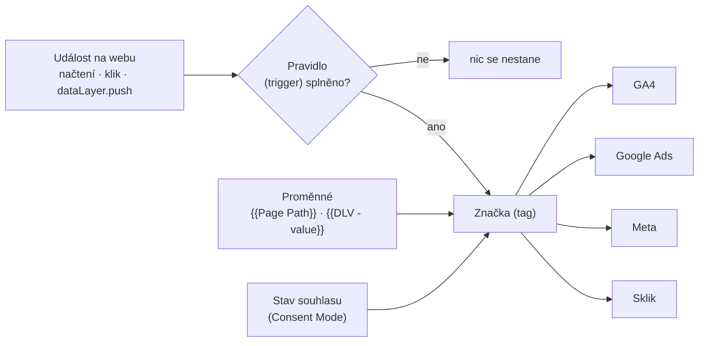
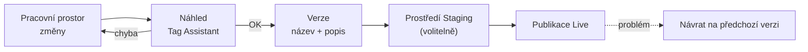

# C3: Google Tag Manager: průvodce pro marketéry (kontejner, tagy, spouštěče, proměnné) – brief
> Cluster: C. Datová vrstva & GTM · URL: /blog/google-tag-manager-pruvodce · Formát: pilíř (nejhledanější téma clusteru) · Priorita: měsíc 1 · Cílová LP: /sluzby/google-tag-manager · Rozsah: 3 000–3 500 slov

---

## 1. Meta

| Prvek | Návrh |
|---|---|
| H1 | Google Tag Manager: průvodce pro marketéry (42 zn.) |
| SEO title | Google Tag Manager: co to je a jak nastavit \| datalayer.cz (58 zn.) |
| Meta description | Co je Google Tag Manager a jak funguje: kontejner, značky, spouštěče, proměnné, verze. První nastavení, Preview, oprávnění, consent a kdy GTM nestačí. (150 zn.) |
| URL | /blog/google-tag-manager-pruvodce |
| Schema | `BlogPosting`, `HowTo` (sekce „První nastavení“), `FAQPage`, `BreadcrumbList` |

**Klíčová slova** (Ahrefs CZ, topic `gtm`; součet clusteru 3 730):

| Typ | Klíčové slovo | Objem/měs. | KD |
|---|---|---|---|
| Hlavní | google tag manager | 2 400 | 81 |
| Vedlejší | gtm | 900 | 2 (nejednoznačné – gymnázium, nářadí) |
| Vedlejší | tag manager | 500 | 60 |
| Vedlejší | google analytics google tag manager · tag manager google | 150 · 150 | – |
| Otázky | co je google tag manager · google tag manager co to je · co to je google tag manager · co je gtm | 150 · 150 · 70 · 30 | – |
| Návodové | google tag manager návod (+ „navod“) | 100 + 20 | – |
| Návodové | nastavení gtm · jak nastavit google tag manager | 60 · 10 | – |
| Ostatní | google analytics gtm (90), gtm preview mode (10), gtm template gallery (10), ověření gtm (10), školení google tag manager (20) | – | – |
| Nejasné | návrh google tag manager (250) – pravděpodobně chybný překlad/autocomplete; nevyužívat v textu, sledovat v GSC | 250 | – |

**Záměr:** smíšený – navigační (část hledajících chce jen tagmanager.google.com), informační („co to je“) a návodový („jak nastavit“). Článek cílí na informační + návodovou část.
**Čtenář:** marketingový manažer, PPC specialista, majitel e-shopu nebo B2B firmy; zná GA4 a reklamní systémy, nepíše kód. Sekundárně junior analytik. Segmenty: všechny tři (e-shop, B2B, velká firma – oprávnění a governance).

---

## 2. Analýza SERP a konkurence

**„google tag manager“** (Ahrefs SERP CZ): AI přehled → tagmanager.google.com → marketingplatform.google.com → developers.google.com → tagassistant.google.com → **digitalniarchitekti.cz** „Co je Google Tag Manager, jak ho nastavit a jak funguje?“ (≈2 600 slov, poz. 7) → cs.wikipedia.org (poz. 8). U „gtm“ dále marketingppc.cz (glosář), strafelda.cz, fragile.cz, remedio.cz, nazakladedat.cz (poz. 30), podpora.shoptet.cz, vzhurudolu.cz (pro vývojáře).

**„google tag manager nastavení“** (Google.cz, 8. 10. 2026): 1. marketingppc.cz (≈1 850 slov: co je GTM, vložení GA4, náhled, Tag Assistant), 2. digitalniarchitekti.cz, 3. fragile.cz, 4. support.google.com, 5. lubocodes.cz („návod 2026“), 6. puxdesign.cz, 7. advis-marketing.cz, 8. ads-agency.cz.
**Lidé se také ptají:** Jak založit GTM? Jak funguje GTM? Jak propojit e-shop s GTM? · (EN) What does GTM do? Is GTM a tracker? Should you block GTM? · Co znamená GTM? Co je GTM v marketingu? Kde najdu GTM?

**Co konkurenci chybí:**
- Aktuálnost: Google tag v GTM (od 9/2023), automatické načítání Google tagu (od 4/2025), nové vestavěné proměnné (12/2025), změny 2026 (omezení kontejnerů podle ID, AI návrh popisu verze) – nikdo je nezmiňuje.
- Pracovní postup (pracovní prostory, verze, prostředí), **oprávnění a bezpečnost**, šablony vs. vlastní HTML, consent v GTM, výkon – konkurence končí u „vložte GA4 tag a publikujte“.
- Odpověď „kdy GTM nestačí“ (server-side, Google tag gateway).
- Diagram, srovnávací tabulka Google tag vs. GTM, české názvy z rozhraní vedle anglických.

**Jak je přeskočit:** úplný, aktuální a strukturovaný pilíř s rychlou odpovědí, diagramy, tabulkou pojmů (CZ/EN rozhraní) a návodem jako `HowTo`; z pilíře vedou odkazy do C1, C2, C4, A1, B1, B4.

---

## 3. Otázky, na které musí článek odpovědět

1. Co je Google Tag Manager a k čemu ho marketér potřebuje?
2. Je GTM zdarma? Čím se liší GTM 360?
3. Jak GTM funguje – co je kontejner, značka, spouštěč, proměnná a datová vrstva?
4. Jaký je rozdíl mezi GTM a Google Analytics?
5. Kdy stačí Google tag (gtag.js) a kdy použít GTM?
6. Jak GTM nainstalovat a co nastavit jako první?
7. Jak ověřit, že značky fungují (Preview, Tag Assistant)?
8. Co jsou pracovní prostory, verze a prostředí?
9. Jaká oprávnění dát agentuře a kolegům?
10. Jsou šablony z galerie bezpečné? Kdy použít vlastní HTML?
11. Jak GTM pracuje se souhlasem s cookies (Consent Mode)?
12. Zpomaluje GTM web?
13. Je GTM „tracker“ a dá se zablokovat?
14. Kdy GTM nestačí a je potřeba server-side?

---

## 4. Rychlá odpověď (hotový text)

> **Google Tag Manager (GTM)** je bezplatný nástroj Googlu pro správu měřicích a marketingových kódů (značek) na webu. Do webu se vloží jednou, a pak se v jeho rozhraní nastavují značky pro GA4, Google Ads, Meta či Sklik, pravidla jejich spouštění a proměnné – bez úprav kódu webu, s verzemi, náhledem a oprávněními.

(54 slov)

---

## 5. Osnova s obsahem odpovědí

### H2 1: Co je Google Tag Manager
**Klíčové sdělení:** GTM je „řídicí panel“ pro kódy třetích stran na webu. Sám nic neměří – rozhoduje, které kódy, kdy a s jakými daty se spustí.
- V češtině se rozhraní jmenuje **Správce značek Google**; „značka“ = tag.
- Kontejner se vloží do webu dvěma úryvky kódu; další změny se dělají v rozhraní tagmanager.google.com.
- **Zdarma.** GTM 360 je placená verze v rámci Google Marketing Platform: neomezené pracovní prostory, schvalovací proces, zóny (načítání dalších kontejnerů), správa uživatelů přes organizaci.
- GTM ≠ Google Analytics: GA4 data ukládá a vyhodnocuje, GTM do GA4 (a dalších nástrojů) data posílá.
- Typy kontejnerů: Web, iOS, Android, AMP, Server (server-side tagging).
- Google doporučuje **jeden účet na organizaci** a **jeden kontejner na web/aplikaci**.

### H2 2: Jak GTM funguje: kontejner, značky, spouštěče, proměnné
**Klíčové sdělení:** Na každou událost na webu (načtení stránky, klik, odeslání formuláře, push do datové vrstvy) se GTM zeptá: „Splňuje ji některé pravidlo?“ Pokud ano, spustí navázané značky a dosadí do nich hodnoty proměnných.

**Tabulka pojmů (kompletní; české názvy podle rozhraní/nápovědy):**

| Pojem (EN) | V českém rozhraní | Co to je | Příklad |
|---|---|---|---|
| Account | Účet | nejvyšší úroveň, obvykle firma | „Firma s.r.o.“ |
| Container | Kontejner | sada značek, pravidel a proměnných pro jeden web | `GTM-ABC1234` pro www.vas-eshop.cz |
| Tag | Značka | kód, který posílá data do nástroje | GA4 událost `purchase`, Google Ads konverze, Meta Pixel |
| Trigger | Pravidlo (marketéři říkají „spouštěč“) | podmínka, kdy se značka spustí | „Vlastní událost = purchase“ |
| Variable | Proměnná | hodnota dosazená do značky nebo pravidla | `{{Page Path}}`, `{{DLV - ecommerce.value}}` |
| Data layer | Datová vrstva | pole `dataLayer`, kterým web předává data GTM | `dataLayer.push({event:'generate_lead'})` |
| Workspace | Pracovní prostor | rozpracovaná sada změn | „Meta CAPI – říjen“ |
| Version | Verze | uložený snímek kontejneru, lze se k ní vrátit | „v42 – GA4 e-commerce“ |
| Environment | Prostředí | publikace do testu/stagingu | Live, Staging |
| Folder | Složka | organizace prvků | „GA4“, „Meta“ |
| Template | Šablona | předpřipravený typ značky/proměnné s oprávněními | šablona CMP z galerie |

- **Datová vrstva** je doporučený zdroj dat (stabilní, nezávislý na vzhledu webu) – detail v C1.
- **Diagram 1** – kap. 6.

### H2 3: Pracovní prostory, verze a prostředí: jak se v GTM pracuje bezpečně
**Klíčové sdělení:** Každá změna vzniká v pracovním prostoru, ověří se v náhledu a publikuje jako pojmenovaná verze. Díky tomu jde každou chybu vrátit během minuty.
- Každý kontejner má výchozí pracovní prostor; běžný účet může mít **až 3 souběžné** (výchozí + 2 vlastní), GTM 360 neomezeně. Při publikaci jiného prostoru se ostatní musí aktualizovat a případně vyřešit konflikty.
- **Verze** = snímek konfigurace; vytvořit ji může uživatel s oprávněním *Schvalování* a vyšším. Publikace vytvoří verzi automaticky; historie ukazuje, kdo a kdy publikoval.
- Google doporučuje popisný název a popis verze (např. „GA4 – e-commerce události“ + co a proč). Od 17. 9. 2026 GTM na stránce odeslání **navrhuje název a popis verze pomocí AI** – návrh vždy zkontrolovat.
- **Prostředí:** výchozí *Live*; vlastní (Dev, Staging) mají vlastní úryvek kódu nebo sdílený odkaz na náhled. Na produkci patří standardní úryvek.
- **Diagram 2** (workflow) – kap. 6.

### H2 4: Google tag, nebo Google Tag Manager?
**Klíčové sdělení:** Google tag (gtag.js) stačí pro jednoduchý web s jedním nástrojem Googlu. Jakmile měříte víc nástrojů, události nebo pracujete v týmu, Google sám doporučuje GTM.

| Kritérium | Google tag (gtag.js) | Google Tag Manager |
|---|---|---|
| Instalace | úryvek kódu v šabloně | 2 úryvky kódu, pak rozhraní |
| Nástroje | GA4, Google Ads, Floodlight | Google i třetí strany (Meta, Sklik, TikTok, LinkedIn…) |
| Změny | úprava kódu webu | v rozhraní, bez vývojáře (pokud jsou data v datové vrstvě) |
| Verze, náhled, vrácení | ne | ano |
| Oprávnění a týmová práce | ne | ano (účet/kontejner, pracovní prostory) |
| Vhodné pro | jednoduchý web, jeden produkt Googlu | e-shop, B2B s více nástroji, firmy |

- **Google tag uvnitř GTM:** od 9/2023 se konfigurační značka GA4 změnila na *Google tag*; doporučené pravidlo je *Inicializace – všechny stránky*. Od 10. 4. 2025 kontejnery se značkami Google Ads a Floodlight **automaticky načítají Google tag**, i když ho v kontejneru nemáte – Google doporučuje přidat ho explicitně, abyste chování měli pod kontrolou.
- Nastavení Google tagu (rozšířené konverze, cross-domain, automatické události) se spravuje v nastavení Google tagu a platí i pro události z GTM.

### H2 5: První nastavení krok za krokem (HowTo)
**Klíčové sdělení:** Základ zabere hodinu; čas stojí příprava dat a ověření.

1. **Účet a kontejner:** tagmanager.google.com → Vytvořit účet → název firmy, země → kontejner typu *Web* (název = doména).
2. **Instalace kódu:** první úryvek co nejvýš do `<head>`, druhý (`noscript`) hned za otevírací `<body>`. Na Shoptetu, WordPressu a Shopify přes integraci platformy (Shopify: vlastní pixel – viz C2).
```html
<head>
  <script>window.dataLayer = window.dataLayer || [];</script>  <!-- datová vrstva před GTM (C1) -->
  <!-- Google Tag Manager -->
  <script>(function(w,d,s,l,i){w[l]=w[l]||[];w[l].push({'gtm.start':
  new Date().getTime(),event:'gtm.js'});var f=d.getElementsByTagName(s)[0],
  j=d.createElement(s),dl=l!='dataLayer'?'&l='+l:'';j.async=true;j.src=
  'https://www.googletagmanager.com/gtm.js?id='+i+dl;f.parentNode.insertBefore(j,f);
  })(window,document,'script','dataLayer','GTM-XXXXXXX');</script>
  <!-- End Google Tag Manager -->
</head>
<body>
  <!-- Google Tag Manager (noscript) -->
  <noscript><iframe src="https://www.googletagmanager.com/ns.html?id=GTM-XXXXXXX"
  height="0" width="0" style="display:none;visibility:hidden"></iframe></noscript>
  <!-- End Google Tag Manager (noscript) -->
```
3. **Souhlas:** šablona vaší CMP (cookie lišty) z galerie na pravidle *Inicializace souhlasu – všechny stránky*; výchozí stav souhlasu pro Consent Mode (A1).
4. **Google tag:** značka *Google tag* s ID měření GA4 (`G-…`) na *Inicializace – všechny stránky*.
5. **První událost:** např. `generate_lead` z datové vrstvy: pravidlo *Vlastní událost* `generate_lead` → značka *Google Analytics: Událost GA4*.
6. **Náhled:** tlačítko Náhled → Tag Assistant → projít cestu uživatele (H2 6).
7. **Publikace:** Odeslat → *Publikovat a vytvořit verzi* → název a popis.
8. **Přístupy:** min. 2 administrátoři z vaší firmy, agentura jen s oprávněním, které potřebuje (H2 8).

### H2 6: Náhled a Tag Assistant: jak ověřit, že měření funguje
**Klíčové sdělení:** Nic se nepublikuje bez náhledu. Náhled ukáže, které značky se spustily, proč, a s jakými daty.
- Náhled otevře Tag Assistant a web v režimu ladění; zobrazení vidí jen prohlížeč, který náhled spustil (nebo kdo dostal sdílený odkaz). Návštěvníci nic nevidí.
- U každé události vlevo (Container Loaded, `page_data`, Click…) vpravo záložky: *Tags* (spuštěné / nespuštěné), *Variables* (hodnoty), *Data Layer* (stav datové vrstvy), *Errors*.
- Pokud web s ladicím parametrem v URL nefunguje, lze volbu *Include debug signal in the URL* vypnout. Rozšíření Tag Assistant Companion otevře web v nové záložce místo okna.
- Ladicí relace lze **exportovat a importovat** (od 10/2023) – užitečné pro předání vývojáři.
- Kontrolu doplnit v cílovém nástroji: GA4 DebugView, Meta Events Manager (test events), Google Ads diagnostika.
- **Mockup** – kap. 6.

### H2 7: Spouštěče a proměnné v praxi
**Klíčové sdělení:** Nejspolehlivější spouštěč je vlastní událost z datové vrstvy; kliky a viditelnost prvků používejte tam, kde web data nedodá.

| Typ pravidla | Kdy použít | Riziko |
|---|---|---|
| Inicializace souhlasu | jen CMP a výchozí souhlas | žádné jiné značky |
| Inicializace | Google tag, nastavení před ostatními | – |
| Zobrazení stránky / DOM připraven / Okno načteno | značky na všech nebo vybraných stránkách | „All Pages“ jen pro to, co tam opravdu patří |
| Vlastní událost | události z `dataLayer` (`purchase`, `generate_lead`) | názvy musí sedět se specifikací |
| Kliknutí (všechny prvky / jen odkazy) | odchozí odkazy, `tel:`, `mailto:` | křehké vůči změně HTML |
| Odeslání formuláře | jednoduché formuláře | měří odeslání, ne úspěch |
| Viditelnost prvku, Hloubka posouvání, Video YouTube, Změna historie, Časovač, Chyba JS | specifické případy, SPA | výkon, přesnost |
| Skupina pravidel | „obě podmínky splněny“ (např. událost + souhlas) | – |

- **Možnosti spouštění značky:** jednou za událost / jednou za stránku / neomezeně; priorita; **sekvence značek** (setup/cleanup) pro závislosti.
- **Proměnné:** vestavěné (Page URL, Page Path, Click URL, Event…); od 12/2025 nové vestavěné **Client ID, Session ID a Session Number** a uživatelský typ *Analytics Storage*. Uživatelské: Proměnná datové vrstvy, Konstanta, Vyhledávací tabulka, Tabulka regulárních výrazů, Vlastní JavaScript, nastavení Google tagu a událostí GA4 (opakovaně použitelné parametry).

### H2 8: Oprávnění a bezpečnost
**Klíčové sdělení:** Přes GTM lze na web vložit libovolný JavaScript. Přístupy jsou proto bezpečnostní otázka, ne administrativa.

| Úroveň | Oprávnění (CZ / EN) | Co smí | Komu |
|---|---|---|---|
| Účet | Administrátor / Administrator | vytvářet kontejnery, spravovat uživatele | 2+ lidé z vaší firmy |
| Účet | Uživatel / User | vidět základní údaje účtu | ostatní |
| Kontejner | Bez přístupu / No access | kontejner nevidí | – |
| Kontejner | Čtení / Read | prohlížet | auditoři, management |
| Kontejner | Úpravy / Edit | pracovní prostory a úpravy, bez verzí a publikace | junior, externista |
| Kontejner | Schvalování / Approve | + vytvářet verze | analytik |
| Kontejner | Publikování / Publish | vše včetně publikace | odpovědný analytik/agentura |

- Google doporučuje **alespoň dva administrátory** a správu účtu někým z vaší organizace, ne externí agenturou. Když účet ztratí posledního administrátora, kontejner se po čase smaže a podpora přístup obnovit neumí.
- **Dvoufázové ověření:** administrátor může vyžadovat 2FA pro úpravy vlastních JavaScript proměnných, vlastních HTML značek a uživatelských nastavení (Správce → Nastavení účtu).
- Pokročilé: `gtm.allowlist` / `gtm.blocklist` v datové vrstvě omezí typy značek (Google ale doporučuje spíše vlastní šablony a jejich zásady).
- Od 9. 7. 2026: kontejner načtený s ID `G-…`/`AW-…` (místo `GTM-…`) spustí jen značky a proměnné Googlu – instalace vždy přes oficiální úryvek s `GTM-`.

### H2 9: Šablony z galerie, nebo vlastní HTML?
**Klíčové sdělení:** Šablona má deklarovaná oprávnění (kam smí posílat data, co číst) a aktualizace; vlastní HTML je černá skříňka.
- Galerie komunitních šablon (tagmanager.google.com/gallery) – šablony tvoří třetí strany, Google neručí za kvalitu. Před přidáním zkontrolovat **oprávnění**, autora a repozitář na GitHubu.
- GTM upozorní na aktualizaci šablony; upravená šablona se už neaktualizuje.
- Vlastní HTML jen tam, kde šablona neexistuje; s vlastníkem, komentářem a 2FA (C4).

### H2 10: Souhlas s cookies v GTM
**Klíčové sdělení:** GTM má tři nástroje pro consent: pravidlo Inicializace souhlasu, nastavení souhlasu u každé značky a Přehled souhlasu.
- *Inicializace souhlasu – všechny stránky* se spouští před všemi ostatními pravidly; jen pro CMP a výchozí souhlas.
- U značky: **vestavěné kontroly** (značky Googlu samy upraví chování podle Consent Mode) + **další kontroly** (*Nenastaveno* / *Není vyžadován další souhlas* / *Pro spuštění vyžadovat další souhlas* – např. `ad_storage`).
- Typy souhlasu: `ad_storage`, `ad_user_data`, `ad_personalization`, `analytics_storage` (+ `functionality_storage`, `personalization_storage`, `security_storage`).
- **Přehled souhlasu** (zapnout v Nastavení kontejneru) – hromadná úprava značek.
- Detail, právo a rozdíl basic/advanced → A1, A2 (disclaimer: nejde o právní radu).

### H2 11: Zpomaluje GTM web?
**Klíčové sdělení:** Samotný kontejner se načítá asynchronně; web zpomalují značky v něm – hlavně vlastní HTML, chaty, heatmapy a duplicitní pixely.
- GTM ukazuje u verzí **indikátor velikosti**; nad 70 % Google doporučuje optimalizovat: slučovat podobné značky přes vyhledávací tabulky, mazat nepoužívané prvky, minimalizovat vlastní HTML a JavaScript, rozdělit kontejner, zvážit server-side.
- *Tag Diagnostics* v nastavení Google tagu upozorní např. na značku příliš nízko na stránce nebo jediného administrátora.
- Detail a měření dopadu na Core Web Vitals → H3.

### H2 12: Kdy GTM nestačí
**Klíčové sdělení:** Webový GTM běží v prohlížeči – podléhá blokátorům, omezením cookies (ITP) a každý pixel stahuje kód třetí strany. Další krok je server-side.
- **Server-side GTM** (serverový kontejner na vaší doméně): méně kódu v prohlížeči, kontrola nad daty před odesláním dodavatelům, odolnější first-party cookies; vyžaduje hosting a správu → B1, B2, B3.
- **Google tag gateway for advertisers:** servírování značek Googlu přes vlastní doménu/CDN (Cloudflare, Akamai, Fastly, Amazon CloudFront, Google Cloud) – menší krok než sGTM → B4.
- Vždy v souladu se souhlasem – žádné „obcházení blokátorů“.

### H2 13: Co je v GTM nového (box, aktualizovat při revizi)
| Datum | Novinka |
|---|---|
| 17. 9. 2026 | AI návrh názvu a popisu verze při odeslání |
| 9. 7. 2026 | chování kontejneru určuje ID (`GTM-` bez omezení; `G-`/`AW-` jen značky Googlu) |
| 1. 7. 2026 | nová stránka Přehled |
| 2026 | Google tag gateway: GCP (GA 6/2026), Akamai, Fastly, Amazon CloudFront |
| 11. 12. 2025 | vestavěné proměnné Client ID, Session ID, Session Number |
| 10. 4. 2025 | automatické načítání Google tagu u značek Google Ads a Floodlight |

> **CTA box (za H2 8):** viz kap. 8.

---

## 6. Vizuály

### Diagram 1 – jak GTM funguje

**Finální SVG:** vizuál kontejneru podle piktogramu GTM (krabice se třemi „zásuvkami“ Pravidla / Značky / Proměnné, na boku `v42`). Vlevo vstupují události (monospace štítky), uvnitř se rozsvítí pravidlo (cyan), proměnné „dosednou“ do značky, vpravo odcházejí šipky do nástrojů. Souhlas jako přepínač ON/OFF na vstupu do značky. Animace postupného rozsvícení; `prefers-reduced-motion` statické. Mobil svisle. Alt: „GTM při každé události zkontroluje pravidla, doplní proměnné a podle souhlasu spustí značky pro GA4, Google Ads, Meta a Sklik.“

### Diagram 2 – bezpečný pracovní postup

**Finální SVG:** vodorovná osa s ikonami (tužka, oko, štítek `v43`, testovací zkumavka, raketa), zpětná šipka „návrat“ oranžově. Mobil svisle.

### Mockup – Tag Assistant (náhled)
Stylizovaný výřez (fiktivní data, brand barvy): vlevo seznam událostí (`Consent Initialization`, `Initialization`, `Container Loaded`, `page_data`, **`generate_lead`**), vpravo záložka *Tags*: „Fired: GA4 – Event – generate_lead; Google Ads – Conversion – Lead“, „Not fired: Meta – Lead (čeká na ad_storage)“. Popisek: „Náhled ukáže, co se spustilo a proč ne.“

### Infografika „GTM v jednom obrázku“
1080×1350: tři vrstvy shora dolů – Web (dataLayer), Kontejner (Pravidla → Značky ← Proměnné), Nástroje (loga jako neutrální tečky s popisky). Boční pruh „Pracovní prostor → Náhled → Verze → Publikace“. Monospace štítky, piktogramy dle architektury kap. 5.

### Tabulky
Kompletní: pojmy (H2 2), Google tag vs. GTM (H2 4), typy pravidel (H2 7), oprávnění (H2 8), novinky (H2 13).

---

## 7. Fakta a zdroje

| Tvrzení | Zdroj | Ověřeno | Riziko |
|---|---|---|---|
| Úvod do GTM, kontejner, 2 úryvky kódu, jeden účet na organizaci | https://support.google.com/tagmanager/answer/6102821 | 10/2026 | nízké |
| Vytvoření účtu a kontejneru, typy kontejnerů | https://support.google.com/tagmanager/answer/6103696 | 10/2026 | nízké |
| Umístění úryvků (co nejvýš v `<head>`, `noscript` za `<body>`) | https://support.google.com/tagmanager/answer/14847097 | 10/2026 | nízké |
| GTM jako první volba, Google tag pro jednoduché weby | https://developers.google.com/tag-platform/devguides/prerequisites | 10/2026 | nízké |
| Pracovní prostory: 3 souběžné (360 neomezeně), konflikty | https://support.google.com/tagmanager/answer/7059647 | 10/2026 | nízké |
| Publikace, verze (Schvalování+), schvalování jen v 360 | https://support.google.com/tagmanager/answer/6107163 | 10/2026 | nízké |
| Prostředí (Live výchozí, vlastní úryvky, sdílený náhled) | https://support.google.com/tagmanager/answer/6311518 | 10/2026 | nízké |
| Náhled a Tag Assistant, sdílení, debug parametr | https://support.google.com/tagmanager/answer/6107056 | 10/2026 | střední |
| Oprávnění účtu a kontejneru, ≥ 2 administrátoři, organizace ne agentura, smazání bez admina | https://support.google.com/tagmanager/answer/6107011 (CZ: ?hl=cs) | 10/2026 | nízké |
| 2FA pro vlastní JS proměnné, HTML značky, uživatele | https://support.google.com/tagmanager/answer/4525539 | 10/2026 | nízké |
| `gtm.allowlist` / `gtm.blocklist`, doporučení šablon | https://developers.google.com/tag-platform/tag-manager/restrict | 10/2026 | nízké |
| Galerie šablon – třetí strany, oprávnění, aktualizace | https://support.google.com/tagmanager/answer/9454109 | 10/2026 | nízké |
| Consent: Inicializace souhlasu, kontroly souhlasu, typy, Přehled souhlasu | https://support.google.com/tagmanager/answer/10718549 | 10/2026 | střední |
| Sekvence značek | https://support.google.com/tagmanager/answer/6238868 | 10/2026 | nízké |
| Indikátor velikosti > 70 %, doporučení optimalizace | https://support.google.com/tagmanager/answer/2772488 | 10/2026 | nízké |
| Novinky 2023–2026 (Google tag v GTM 9/2023, auto Google tag 4/2025, proměnné 12/2025, ID kontejneru 7/2026, AI popis verze 9/2026, Tag Diagnostics, Google tag gateway) | https://support.google.com/tagmanager/answer/4620708 | 10/2026 | **vysoké** |
| Server-side vs. client-side | https://support.google.com/tagmanager/answer/13387731 | 10/2026 | střední |

---

## 8. Interní odkazy a CTA

**Cílová LP:** /sluzby/google-tag-manager

**CTA box (za H2 8):**
- Nadpis: **Máte v GTM desítky značek a nikdo neví, co dělají?**
- Text: Uděláme audit kontejneru, uklidíme nepoužívané a duplicitní značky, nastavíme oprávnění, názvosloví a consent a předáme dokumentaci.
- Tlačítko: `[ Konzultovat Tag Manager ]` → /sluzby/google-tag-manager#kontakt

**Související články:** C1 Datová vrstva (/blog/datova-vrstva-specifikace) · C2 GA4 e-commerce dataLayer (/blog/ga4-ecommerce-datalayer) · C4 Audit GTM kontejneru (/blog/audit-gtm-kontejneru) · C5 Měřicí plán (/blog/merici-plan) · D1 Nastavení GA4 (/blog/nastaveni-ga4-pruvodce) · A1 Consent Mode v2 (/blog/consent-mode-v2-pruvodce) · B1 Server-side tracking (/blog/server-side-tracking-pruvodce) · B4 Google Tag Gateway (/blog/google-tag-gateway) · E1 Měření formulářů (/blog/mereni-formularu-a-leadu) · H3 Měřicí skripty a rychlost webu (/blog/tagy-a-rychlost-webu).
**Slovník:** Google Tag Manager · Tag · Spouštěč (trigger) · Proměnná · Kontejner GTM · Datová vrstva · Consent Mode · Server-side tagging · Google Tag Gateway.

**Zkrácený kontaktní blok:** `form_id: blog` · téma `Tag Manager` · H2 „Řešíte totéž u sebe?“ · placeholder „Např. v GTM máme 120 tagů a nikdo neví, co dělají…“

---

## 9. FAQ pro schema

**Co je Google Tag Manager jednoduše?**
Google Tag Manager je bezplatný nástroj, přes který spravujete měřicí a reklamní kódy na webu z jednoho rozhraní. Do webu se vloží jednou a další značky pro GA4, Google Ads, Meta nebo Sklik přidáváte, upravujete a vracíte bez zásahu do kódu webu – s náhledem, verzemi a oprávněními.

**Je Google Tag Manager zdarma?**
Ano, standardní GTM je zdarma bez omezení počtu značek. Placená verze GTM 360 je součástí Google Marketing Platform a přidává neomezené pracovní prostory, schvalování změn, zóny a správu uživatelů přes organizaci. Pro většinu e-shopů a B2B firem stačí bezplatná verze.

**Jaký je rozdíl mezi Google Tag Managerem a Google Analytics?**
Google Analytics 4 data ukládá a vyhodnocuje v reportech. Google Tag Manager data neukládá – rozhoduje, které kódy se na webu spustí a co pošlou do GA4 a dalších nástrojů. GTM je tedy „doručovatel“, GA4 „příjemce a analytik“.

**Je Google Tag Manager tracker? Dá se zablokovat?**
Samotný GTM je nástroj pro načítání značek; sledování provádějí značky v něm (GA4, pixely). Blokátory reklam GTM často blokují. Správně nastavený kontejner respektuje souhlas návštěvníka – značky bez souhlasu se nespustí nebo pracují v omezeném režimu Consent Mode. Obcházet volbu návštěvníka nedoporučujeme.

**Potřebuji pro GTM programátora?**
Na instalaci a základní značky ne – stačí přístup do šablony webu nebo integrace platformy. Pro spolehlivé měření nákupů, formulářů a hodnot ale potřebujete datovou vrstvu, kterou připravuje vývojář podle specifikace. Bez ní se data čtou z HTML a při změně webu přestanou fungovat.

**Zpomaluje Google Tag Manager web?**
Kontejner se načítá asynchronně a sám web výrazně nezpomaluje. Zpomalují ho značky uvnitř – vlastní HTML, chaty, heatmapy, duplicitní pixely. GTM ukazuje indikátor velikosti kontejneru; nad 70 % Google doporučuje úklid. Pravidelný audit drží kontejner štíhlý.

---

## 10. Poznámky pro autora

- **Nejrychleji zastarávající část** je H2 13 a zmínky o novinkách (release notes GTM) – revize každé 3–4 měsíce, ne až za 6.
- **Terminologie:** české rozhraní používá „Správce značek“, „značka“, „pravidlo“ (trigger). V textu používat „spouštěč (pravidlo)“ při prvním výskytu, dál „spouštěč“, protože tak hledají a mluví marketéři; v tabulce uvádět oba názvy. Názvy typů pravidel v češtině ověřit v aktuálním rozhraní (UI se mění).
- **„návrh google tag manager“ (250/měs.)** – neznámý záměr, nepoužívat; sledovat v Search Console.
- **Velikost kontejneru:** Google v nápovědě uvádí jen indikátor a hranici 70 %; absolutní limit (komunita uvádí 200 KB) neuvádět jako fakt.
- **Consent/právo:** jen základní mechanika, právní výklad odkázat na A1/A2 + disclaimer.
- **Co dodá klient:** případně vlastní screenshoty z demo kontejneru (fiktivní data) `[DOPLNIT]`, informace o školení GTM, pokud ho bude nabízet `[DOPLNIT]`.
- **Recenzent:** Vít Novotný (věcná správnost), marketér bez technického zázemí (srozumitelnost).
