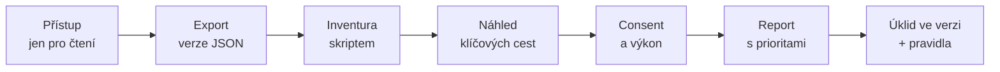

# C4: Audit GTM kontejneru: nejčastější chyby a jak udržet pořádek (názvy, verze, přístupy) – brief
> Cluster: C. Datová vrstva & GTM · URL: /blog/audit-gtm-kontejneru · Formát: checklist + šablona + skript · Priorita: měsíc 2 · Cílová LP: /sluzby/google-tag-manager (sekundárně /sluzby/audit-mereni) · Rozsah: 2 500–3 200 slov + tabulky a kód

---

## 1. Meta

| Prvek | Návrh |
|---|---|
| H1 | Audit GTM kontejneru: checklist chyb a jak udržet pořádek (57 zn.) |
| SEO title | Audit GTM kontejneru: checklist a názvosloví \| datalayer.cz (59 zn.) |
| Meta description | Checklist auditu Google Tag Manageru: nepoužívané a duplicitní tagy, Custom HTML, consent, oprávnění, verze a výkon. Se šablonou názvosloví a skriptem. (151 zn.) |
| URL | /blog/audit-gtm-kontejneru |
| Schema | `BlogPosting`, `HowTo` (postup auditu), `FAQPage`, `BreadcrumbList` |

**Klíčová slova** (Ahrefs CZ, `lp_keyword_inputs.json` lp-gtm):

| Typ | Klíčové slovo | Objem/měs. |
|---|---|---|
| Hlavní | gtm audit | 10 |
| Vedlejší | audit gtm · google tag manager audit · audit google tag manager · gtm audity · gtm analýza | 10 · 10 · 10 · 10 · 10 |
| Související | ověření gtm (10), gtm ověření (10), zhodnocení gtm (0), google tag manager přezkoumávání (0) | – |
| Strategické (0) | názvosloví gtm, gtm naming convention, gtm governance, nepoužité tagy gtm | 0 |

**Pozor:** v anglickém SERP „gtm audit“ dominuje význam **go-to-market** (gtm-audit.com, artemisgtm.ai, LinkedIn). V titulku a H1 proto vždy „GTM kontejner“ / „Google Tag Manager“.

**Záměr:** problémový/checklistový („mám v GTM nepořádek – co zkontrolovat“) + komerční („kdo to udělá“). **Čtenář:** marketingový manažer nebo vedoucí e-commerce, který převzal kontejner po agentuře; analytik, který chce postup; ve velké firmě vlastník martech stacku (governance). Segmenty: e-shop, B2B, velká firma (přístupy, procesy).

---

## 2. Analýza SERP a konkurence

„gtm audit“ (Google.cz, 8. 10. 2026):

| Poz. | Doména | Obsah | Slabina |
|---|---|---|---|
| 1 | magnas.cz – „Nejčastější chyby v GTM a rychlý test“ (3/2026, ≈1 300 slov) | 8 chyb, 2minutový self-test, co obsahuje audit, proces (kickoff 30 min, 3–5 dní, prezentace 60 min) | obecné, bez návodu „jak to zkontrolovat“; perex zkopírovaný z článku o cookie liště; bez CTA |
| 2 | stepaneklukas.cz – „GA4/GTM audit za 45 minut“ | 4 oblasti | ≈300 slov |
| 3 | stape.io (EN) | audit setupu | anglicky, sGTM zaměření |
| 4–7 | gtm-audit.com, artemisgtm.ai, tc9.ai, linkedin.com | go-to-market | jiný význam |
| 8 | measureu.com (EN) | AI skill na audit | anglicky |

Další: nazakladedat.cz „Checklist pro kontrolu GTM“ (1/2025, ≈640 slov, 6 bodů: přístupy, umístění kódu, dataLayer, proměnné, značky, consent) – dobrý základ, ale bez názvosloví, duplicit, výkonu, verzí a governance.

**Čím je přeskočíme:**
1. **Checklist 40 kontrol v 10 oblastech** s konkrétním „jak ověřit“ a závažností – ne jen seznam chyb.
2. **Skript na inventuru exportu** (JSON) – najde nepoužité proměnné/pravidla, duplicity, značky na All Pages, vlastní HTML a značky bez nastavení souhlasu (otestováno).
3. **Šablona názvosloví** ke zkopírování.
4. **Governance** – jak pořádek udržet (role, proces změn, kontrolní kalendář).
5. Aktuální fakta 2025–2026 (automatický Google tag, omezení kontejnerů podle ID, AI popis verze).

---

## 3. Otázky, na které musí článek odpovědět

1. Kdy je čas na audit GTM a podle čeho poznám, že kontejner má problém?
2. Co všechno audit GTM kontroluje?
3. Jak najít nepoužívané značky, pravidla a proměnné?
4. Jak poznat duplicitní značky a dvojí měření?
5. Proč jsou vlastní HTML značky riziko a čím je nahradit?
6. Které značky smí běžet na všech stránkách?
7. Jak zkontrolovat pořadí spouštění a sekvence?
8. Jak ověřit, že značky respektují souhlas s cookies?
9. Kdo má mít k GTM přístup a s jakým oprávněním?
10. Jak pojmenovávat značky, pravidla, proměnné a verze?
11. Jak GTM ovlivňuje rychlost webu a jak to změřit?
12. Jak udržet pořádek dlouhodobě (governance)?
13. Jak dlouho audit trvá a co je jeho výstupem?

---

## 4. Rychlá odpověď (hotový text)

> **Audit GTM kontejneru** je systematická kontrola všech značek, pravidel, proměnných, verzí a přístupů v Google Tag Manageru. Odhalí nepoužívané a duplicitní značky, rizikový vlastní kód, značky bez nastavení souhlasu, chybné pořadí spouštění a zbytečnou zátěž webu. Výstupem je seznam nálezů s prioritou, plán úklidu a pravidla, jak pořádek udržet.

(55 slov)

---

## 5. Osnova s obsahem odpovědí

### H2 1: Kdy je čas na audit (signály)
**Klíčové sdělení:** Kontejner stárne s každou kampaní. Audit dává smysl při převzetí po agentuře, před redesignem či migrací, po zavedení cookie lišty a pravidelně jednou ročně.
Signály (seznam s piktogramy):
- čísla v GA4, Google Ads a Meta se rozcházejí s administrací (D2);
- v kontejneru je víc značek, než kolik nástrojů používáte; názvy typu „Test 1“, „kopie“;
- nikdo neví, kdo má přístup a kdo naposledy publikoval;
- web po načtení GTM zpomalil, v konzoli jsou chyby JavaScriptu;
- bojíte se cokoli změnit, protože „něco se rozbije“.

### H2 2: Jak audit probíhá (postup)
**Klíčové sdělení:** Audit se dělá z exportu a z náhledu, ne „proklikáním“ rozhraní. Bez zásahu do živého kontejneru.

1. **Přístup jen pro čtení** ke kontejneru (+ GA4, Google Ads, CMP) – audit nic nemění.
2. **Export verze** (Správce → Exportovat kontejner → JSON) – stav k datu, podklad pro skript a porovnání.
3. **Inventura** skriptem (H2 4) – počty, nepoužité prvky, duplicity, rizika.
4. **Průchod klíčových cest v náhledu** (Tag Assistant): vstup na web, odmítnutí a přijetí cookies, detail produktu, košík, nákup / formulář. Ověřit, co se spustilo, s jakými hodnotami a za jakého souhlasu.
5. **Kontrola v cílových nástrojích** (GA4 DebugView, Google Ads diagnostika, Meta Events Manager).
6. **Výkon:** PageSpeed Insights / Lighthouse s kontejnerem a bez (blokování `googletagmanager.com` v DevTools) – H3.
7. **Report:** nálezy s prioritou (kritické / důležité / vylepšení), dopad, oprava, odhad práce.
8. **Úklid** v samostatném pracovním prostoru → náhled → verze s popisem → publikace; předchozí verze jako záloha.

`[DOPLNIT: klient – typická délka auditu a podoba výstupu (ukázka reportu), navázat na H2 „Co obsahuje audit měření“]`

### H2 3: Checklist auditu GTM (tabulka – jádro článku)
**Klíčové sdělení:** 40 kontrol v 10 oblastech. U každé víte, jak ji ověřit a jak je vážná.

Závažnost: 🔴 kritické (chybná data, právní/bezpečnostní riziko) · 🟠 důležité (údržba, výkon) · 🟢 vylepšení. *(V designu nahradit barevnými štítky, ne emoji.)*

| # | Oblast | Kontrola | Jak ověřit | Záv. |
|---|---|---|---|---|
| 1 | Instalace | úryvek GTM co nejvýš v `<head>`, `noscript` za `<body>`, na všech šablonách | zdroj stránky, Tag Assistant | 🔴 |
| 2 | Instalace | kontejner načtený s ID `GTM-…` (od 7/2026 se při `G-`/`AW-` spustí jen značky Googlu) | zdroj stránky, síť | 🔴 |
| 3 | Instalace | žádné duplicitní instalace (GTM 2×, gtag v šabloně + GA4 v GTM, integrace platformy + GTM) | síť: počet `collect` požadavků na 1 page view | 🔴 |
| 4 | Instalace | `dataLayer` inicializován před GTM, nepřepisuje se | zdroj, konzole | 🔴 |
| 5 | Názvosloví | značky, pravidla, proměnné odpovídají konvenci (H2 5) | skript – „Název neodpovídá konvenci“ | 🟢 |
| 6 | Názvosloví | prvky ve složkách podle nástroje | skript – „mimo složku“ | 🟢 |
| 7 | Názvosloví | žádné „Test“, „kopie“, „nová značka (2)“ | skript, ruční | 🟠 |
| 8 | Nepoužívané | pozastavené značky (smazat, nebo zdokumentovat) | skript | 🟠 |
| 9 | Nepoužívané | značky bez spouštěcího pravidla | skript | 🟠 |
| 10 | Nepoužívané | nepoužitá pravidla a proměnné | skript | 🟠 |
| 11 | Nepoužívané | značky ukončených nástrojů a kampaní (staré pixely, UA, A/B testy) | ruční – seznam aktivních nástrojů od marketingu | 🟠 |
| 12 | Duplicity | stejná GA4 událost 2× na stejném pravidle | skript, náhled | 🔴 |
| 13 | Duplicity | stejná konverze z GTM i z integrace platformy/pluginu | náhled + síť | 🔴 |
| 14 | Duplicity | `purchase` při reloadu děkovné stránky | ruční test (C2) | 🔴 |
| 15 | Duplicity | podobné značky, které jde sloučit (vyhledávací tabulka) | skript, ruční | 🟢 |
| 16 | Vlastní HTML | seznam všech vlastních HTML značek, vlastník a účel | skript | 🟠 |
| 17 | Vlastní HTML | existuje šablona z galerie nebo vestavěný typ? → nahradit | galerie šablon | 🟠 |
| 18 | Vlastní HTML | rizikový kód: `document.write`, `eval`, `http://`, neznámé domény, čtení formulářových polí | skript – „rizikové“, ruční | 🔴 |
| 19 | Vlastní HTML | vyžadováno 2FA pro vlastní HTML a JS proměnné | Správce → Nastavení účtu | 🟠 |
| 20 | All Pages | na All Pages jen to, co tam patří (Google tag na Inicializaci, CMP na Inicializaci souhlasu) | skript – „Značky na All Pages“ | 🟠 |
| 21 | All Pages | konverzní značky nikdy na All Pages | skript, ruční | 🔴 |
| 22 | Pořadí | CMP a výchozí souhlas na *Inicializace souhlasu*; Google tag na *Inicializace* | náhled – pořadí událostí | 🔴 |
| 23 | Pořadí | značky čekající na data používají vlastní událost, ne Page View | náhled – proměnné `undefined` | 🔴 |
| 24 | Pořadí | sekvence značek a priority zdokumentované a nutné | ruční | 🟢 |
| 25 | Consent | každá značka třetí strany má *Další kontroly souhlasu* nastavené (ne *Nenastaveno*) | Přehled souhlasu, skript | 🔴 |
| 26 | Consent | po odmítnutí se neukládají reklamní cookies a nespouští se pixely třetích stran | náhled + DevTools → Application → Cookies | 🔴 |
| 27 | Consent | Consent Mode v2: všechny 4 signály v default i update | náhled, záložka Consent (A1) | 🔴 |
| 28 | Consent | Přehled souhlasu zapnutý v nastavení kontejneru | Správce → Nastavení kontejneru | 🟢 |
| 29 | Verze | každá verze má název a popis (co, proč, kdo) | Verze; skript – poslední verze | 🟠 |
| 30 | Verze | pracovní prostory: žádné opuštěné rozpracované změny | Pracovní prostory | 🟠 |
| 31 | Verze | testovací prostředí/sdílený náhled pro staging | Správce → Prostředí | 🟢 |
| 32 | Přístupy | ≥ 2 administrátoři účtu z vaší organizace | Správce → Správa uživatelů | 🔴 |
| 33 | Přístupy | bývalí zaměstnanci a agentury odebráni | Správa uživatelů | 🔴 |
| 34 | Přístupy | publikovat smí jen odpovědné osoby; ostatní Úpravy/Čtení | Správa uživatelů | 🟠 |
| 35 | Přístupy | účet vlastní firma, ne agentura (osobní Gmail) | Správa uživatelů | 🔴 |
| 36 | Výkon | indikátor velikosti kontejneru < 70 % | Verze | 🟠 |
| 37 | Výkon | těžké skripty (chat, heatmapy, video) spouštět jen tam, kde jsou potřeba | náhled, Lighthouse | 🟠 |
| 38 | Výkon | žádné chyby JavaScriptu z GTM v konzoli | DevTools → Console | 🟠 |
| 39 | Data | hodnoty konverzí stejné pro GA4, Ads, Meta, Sklik (z jedné proměnné) | náhled → Variables | 🔴 |
| 40 | Data | proměnné čtou z datové vrstvy, ne z HTML; vlastní JS proměnné zdokumentované | skript – „Vlastní JavaScript proměnné“ | 🟠 |

**Lead magnet:** checklist jako Google Sheet / PDF ke stažení `[DOPLNIT: rozhodnutí klienta – volně, nebo za e-mail]`.

### H2 4: Inventura exportu skriptem (otestováno)
**Klíčové sdělení:** U kontejneru se stovkou prvků ruční kontrola nestačí. Export JSON a krátký skript najdou kandidáty na úklid za minutu; rozhodnutí dělá člověk.

- Export: Správce → Exportovat kontejner → vybrat verzi → Stáhnout. Export lze uložit do Gitu a porovnávat verze (Google to zmiňuje jako jeden z účelů exportu).
- Skript (Python 3, bez knihoven) vypíše nálezy po sekcích. Otestováno 8. 10. 2026 na syntetickém exportu (formát `exportFormatVersion: 2`); názvy polí ověřit na reálném exportu.

```python
#!/usr/bin/env python3
"""gtm_audit.py – inventura exportu GTM kontejneru. Použití: python3 gtm_audit.py export.json
Skript nic nemění, jen vypíše kandidáty na kontrolu."""
import json, re, sys
from collections import Counter, defaultdict

ALL_PAGES_ID = "2147479553"   # vestavěné pravidlo All Pages / Všechny stránky
NAME_RE = re.compile(r"^(GA4|Google tag|GAds|Meta|Sklik|Heureka|TikTok|LinkedIn|CMP|HTML|Util) [-–] .+")  # vaše konvence
GOOGLE_TYPES = {"googtag", "gaawe", "awct", "sp", "gclidw", "flc", "fls"}  # značky Googlu s vestavěnými kontrolami souhlasu

def walk(o):                                   # projde vnořené dict/list
    if isinstance(o, dict):
        yield o
        for v in o.values(): yield from walk(v)
    elif isinstance(o, list):
        for v in o: yield from walk(v)

def param(tag, key):
    return next((p.get("value") for p in tag.get("parameter", []) if p.get("key") == key), None)

cv = json.load(open(sys.argv[1], encoding="utf-8"))["containerVersion"]
tags, triggers, variables = cv.get("tag", []), cv.get("trigger", []), cv.get("variable", [])
report, used_triggers, signature = defaultdict(list), set(), defaultdict(list)
print(f"Verze {cv.get('containerVersionId')} „{cv.get('name', '')}“ · značky: {len(tags)} · "
      f"pravidla: {len(triggers)} · proměnné: {len(variables)}")
if not cv.get("name") or not cv.get("description"):
    report["Verze bez názvu nebo popisu"].append(cv.get("containerVersionId"))

for t in tags:
    name, ttype, fire = t.get("name", ""), t.get("type", ""), set(t.get("firingTriggerId", []))
    used_triggers |= fire | set(t.get("blockingTriggerId", []))
    if t.get("paused"): report["Pozastavené značky"].append(name)
    if not NAME_RE.match(name): report["Název neodpovídá konvenci"].append(name)
    if "parentFolderId" not in t: report["Značka mimo složku"].append(name)
    if not fire: report["Značka bez spouštěcího pravidla"].append(name)
    if ALL_PAGES_ID in fire: report["Značky na All Pages"].append(f"{name} [{ttype}]")
    if t.get("consentSettings", {}).get("consentStatus", "NOT_SET") == "NOT_SET" and ttype not in GOOGLE_TYPES:
        report["Značka třetí strany bez nastavení souhlasu"].append(name)
    if ttype == "html":
        html = param(t, "html") or ""
        domains = sorted(set(re.findall(r"https?://([^/'\"\s]+)", html)))
        risky = [w for w in ("document.write", "eval(", "innerHTML", "http://") if w in html]
        report["Vlastní HTML"].append(f"{name} · domény: {', '.join(domains) or '–'}"
                                      + (f" · rizikové: {', '.join(risky)}" if risky else ""))
    signature[json.dumps([ttype, sorted(json.dumps(p, sort_keys=True) for p in t.get("parameter", [])), sorted(fire)])].append(name)
    if ttype == "gaawe":                                  # stejná GA4 událost na stejném pravidle
        signature[f"ga4:{param(t, 'eventName')}:{sorted(fire)}"].append(name)
for names in signature.values():
    if len(names) > 1: report["Možné duplicity"].append(" = ".join(names))

for trg in triggers:                                      # odkazy ze skupin pravidel
    used_triggers |= {d.get("value") for d in walk(trg.get("parameter", [])) if d.get("type") == "TRIGGER_REFERENCE"}
for trg in triggers:
    if trg.get("triggerId") not in used_triggers: report["Nepoužitá pravidla"].append(trg.get("name"))

refs = Counter(re.findall(r"\{\{([^}]+)\}\}", json.dumps({"t": tags, "r": triggers}, ensure_ascii=False)))
for v in variables:                                       # proměnné se mohou odkazovat na sebe navzájem
    refs.update(re.findall(r"\{\{([^}]+)\}\}", json.dumps([x for x in variables if x is not v], ensure_ascii=False)))
for v in variables:
    if refs[v.get("name")] == 0: report["Nepoužité proměnné"].append(v.get("name"))
    if v.get("type") == "jsm": report["Vlastní JavaScript proměnné"].append(v.get("name"))

for section, items in report.items():
    print(f"\n## {section} ({len(items)})"); [print("  -", i) for i in items]
```
Ukázka výstupu (syntetický export, zkráceno – do článku jako stylizovaný terminál):
```
Verze 42 „“ · značky: 5 · pravidla: 4 · proměnné: 4
## Verze bez názvu nebo popisu (1) - 42
## Pozastavené značky (1)          - Test 1
## Značky na All Pages (1)         - Test 1 [html]
## Vlastní HTML (1)                - Test 1 · domény: cdn.example-chat.com · rizikové: document.write, http://
## Možné duplicity (1)             - GA4 - Event - purchase = purchase kopie
## Nepoužitá pravidla (1)          - Click - staré tlačítko
## Nepoužité proměnné (1)          - CJS - stará cena
```
Omezení (napsat do článku): proměnná použitá jen nepoužitou proměnnou se hlásí jako použitá; ID vestavěného pravidla All Pages ověřit v exportu; značky z vlastních šablon (`cvt_…`) mohou mít souhlas řešený v šabloně.

> **CTA box (za H2 4):** viz kap. 8.

### H2 5: Šablona názvosloví (ke zkopírování)
**Klíčové sdělení:** Název má odpovědět na tři otázky: *jaký nástroj, co dělá, kdy*. Formát `Nástroj - Typ - Detail`.

| Prvek | Formát | Příklady |
|---|---|---|
| Značka | `Nástroj - Typ - Detail` | `GA4 - Event - purchase` · `GAds - Conversion - Nákup` · `Meta - Event - Lead` · `Sklik - Retargeting - všechny stránky` · `CMP - Cookiebot - init` · `HTML - Chat - kontakt` |
| Pravidlo (spouštěč) | `Typ - Podmínka` | `CE - purchase` (vlastní událost) · `PV - děkovná stránka` · `Click - tel odkaz` · `TG - purchase + ad_storage` (skupina) · `Init - All Pages` |
| Proměnná | `Typ - Název/cesta` | `DLV - ecommerce.value` · `DLV - shoptet.order.orderNo` · `Const - GA4 Measurement ID` · `LT - jazyk → GA4 ID` (lookup) · `RegEx - typ stránky` · `CJS - items → Meta contents` · `URL - utm_source` · `Cookie - _fbp` |
| Složka | podle nástroje | `GA4` · `Google Ads` · `Meta` · `Seznam` · `Consent` · `Utility` · `_K odstranění` |
| Verze | `[datum] oblast – změna (dl verze)` | `2026-10-08 GA4 – add_shipping_info (dl 1.4.0)` |
| Pracovní prostor | `oblast – úkol – osoba` | `Meta – CAPI dedup – VN` |

Pravidla: jazyk názvů jednotný (anglické typy, české detaily jsou v pořádku); žádná diakritika v ID a cestách; zkratky typů zdokumentovat v README kontejneru (popis verze 1 nebo sdílený dokument).

### H2 6: Jak pořádek udržet (governance)
**Klíčové sdělení:** Audit bez pravidel vydrží do příští kampaně. Pořádek drží role, proces změn a kontrolní kalendář.

**Role a oprávnění (RACI, kompletní):**

| Činnost | Vlastník měření (firma) | Analytik / datalayer.cz | Agentura PPC/sociální sítě | Vývoj |
|---|---|---|---|---|
| Správa účtu a uživatelů | A/R | C | I | I |
| Návrh změny (nová značka) | A | R | R (požadavek) | C |
| Úprava v pracovním prostoru | I | R | R (oprávnění Úpravy) | C |
| Náhled a test | I | R | C | C |
| Publikace verze | A | R | – | I |
| Čtvrtletní kontrola | A | R | C | I |

**Proces změny (6 kroků):** požadavek s účelem a vlastníkem → vlastní pracovní prostor → náhled + kontrola consentu → verze s názvem dle konvence → publikace odpovědnou osobou → záznam v changelogu (a ve specifikaci dataLayer, pokud se mění data – C1).

**Kontrolní kalendář:**

| Kdy | Co |
|---|---|
| Každá publikace | náhled klíčových cest, popis verze |
| Měsíčně | Tag Diagnostics (Google tag), chyby v konzoli, porovnání konverzí s administrací |
| Čtvrtletně | uživatelé a přístupy, pozastavené a nepoužité prvky (skript), Přehled souhlasu |
| Ročně / před redesignem | plný audit podle checklistu |
| Při odchodu agentury/zaměstnance | odebrat přístupy, převzít dokumentaci |

**Pro velké firmy:** oddělené kontejnery podle webů/týmů, GTM 360 (schvalování, zóny, neomezené pracovní prostory), export verzí do Gitu, testovací prostředí a automatické testy datové vrstvy (C1) – odkaz na /reseni/velke-firmy.

### H2 7: Výstup auditu a nejčastější nálezy
**Klíčové sdělení:** Dobrý audit končí seznamem rozhodnutí, ne seznamem problémů.
- Struktura reportu: shrnutí pro management (5 bodů), tabulka nálezů (oblast, nález, dopad, priorita, oprava, odhad), plán úklidu po verzích, doporučené názvosloví a proces, příloha export „před“ a „po“.
- *Nejčastější nálezy (ilustrativní, bez čísel):* duplicitní GA4 konfigurace (gtag v šabloně + GTM), konverze Google Ads na All Pages, pixely třetích stran bez kontroly souhlasu, 3+ roky staré značky po ukončených nástrojích, jediný administrátor z agentury.
- `[DOPLNIT: klient – agregovaná statistika z vlastních auditů, např. „X z Y kontejnerů mělo…“, jen pokud je doložitelná]`.

---

## 6. Vizuály

### Diagram – postup auditu

**Finální SVG:** 7 kroků na vodorovné ose, piktogram „lupa nad tagem s ✕ a ✓“ (audit) u kroku Report; pod osou časové štítky `[DOPLNIT: délky kroků]`. Mobil svisle.

### Infografika „10 oblastí auditu GTM“
1080×1350 + verze v článku: kruh rozdělený na 10 výsečí (Instalace, Názvosloví, Nepoužívané, Duplicity, Vlastní HTML, All Pages, Pořadí, Consent, Verze a přístupy, Výkon); u každé 1 kontrolní otázka. Barva výseče podle nejvyšší závažnosti (kritické = `#ff7400` obrys, ostatní cyan).

### Mockup – výstup skriptu
Stylizovaný terminál (tmavé pozadí `#020d1e`, Roboto Mono, sekce v cyan, nálezy kritické oranžově) s ukázkou výstupu z H2 4.

### Mockup – před/po
Dvě karty vedle sebe: „Před“ – seznam značek „Test 1“, „purchase kopie“, „Nová značka (2)“, „FB pixel stary“; „Po“ – složky GA4/Google Ads/Meta/Consent s názvy dle konvence. Fiktivní data.

### Tabulky
Kompletní: checklist 40 kontrol (H2 3), názvosloví (H2 5), RACI a kalendář (H2 6).

---

## 7. Fakta a zdroje

| Tvrzení | Zdroj | Ověřeno | Riziko |
|---|---|---|---|
| Úrovně oprávnění, ≥ 2 administrátoři, účet spravovaný organizací, smazání bez administrátora (30 dní na export) | https://support.google.com/tagmanager/answer/6107011 | 10/2026 | nízké |
| 2FA pro vlastní JS proměnné, vlastní HTML a uživatele | https://support.google.com/tagmanager/answer/4525539 | 10/2026 | nízké |
| Export/import kontejneru do JSON, verzování v Gitu | https://support.google.com/tagmanager/answer/6106997 | 10/2026 | nízké |
| Indikátor velikosti > 70 %; slučování značek, mazání nepoužitých, minimalizace vlastního kódu, server-side | https://support.google.com/tagmanager/answer/2772488 | 10/2026 | nízké |
| Pracovní prostory (3 / neomezeně v 360), doporučení pojmenování verzí | https://support.google.com/tagmanager/answer/7059647 | 10/2026 | nízké |
| Publikace a verze, schvalování v 360 | https://support.google.com/tagmanager/answer/6107163 | 10/2026 | nízké |
| Consent: Inicializace souhlasu, kontroly souhlasu, Přehled souhlasu | https://support.google.com/tagmanager/answer/10718549 | 10/2026 | střední |
| Galerie šablon – třetí strany, oprávnění | https://support.google.com/tagmanager/answer/9454109 | 10/2026 | nízké |
| Omezení kontejneru podle ID (9. 7. 2026), automatický Google tag (10. 4. 2025), Tag Diagnostics, AI popis verze (17. 9. 2026) | https://support.google.com/tagmanager/answer/4620708 | 10/2026 | vysoké |
| `gtm.allowlist`/`gtm.blocklist`, doporučení šablon a zásad | https://developers.google.com/tag-platform/tag-manager/restrict | 10/2026 | nízké |
| Skript – funkční na syntetickém exportu (vlastní test) | interní test 8. 10. 2026 | 10/2026 | střední (formát exportu) |

---

## 8. Interní odkazy a CTA

**Cílová LP:** /sluzby/google-tag-manager · sekundárně /sluzby/audit-mereni

**CTA box (za H2 4):**
- Nadpis: **Uklidíme váš Tag Manager**
- Text: Projdeme kontejner podle 40 kontrol, odstraníme duplicity a nepoužívané značky, nastavíme consent, oprávnění a názvosloví – a předáme pravidla, jak pořádek udržet.
- Tlačítko: `[ Objednat audit GTM ]` → /sluzby/google-tag-manager#kontakt

**Související články:** C3 Google Tag Manager – průvodce (/blog/google-tag-manager-pruvodce) · C1 Datová vrstva (/blog/datova-vrstva-specifikace) · C5 Měřicí plán (/blog/merici-plan) · H2 Co obsahuje audit měření (/blog/co-obsahuje-audit-mereni) · D3 Checklist kvality dat GA4 (/blog/ga4-checklist-kvality-dat) · A1 Consent Mode v2 (/blog/consent-mode-v2-pruvodce) · H3 Měřicí skripty a rychlost webu (/blog/tagy-a-rychlost-webu) · D2 Proč nesedí čísla (/blog/proc-nesedi-data).
**Navazující LP:** /sluzby/sprava-webu-a-mereni (pravidelná kontrola) · /reseni/velke-firmy (governance).
**Slovník:** Kontejner GTM · Tag · Spouštěč · Proměnná · Consent Mode · CMP.

**Zkrácený kontaktní blok:** `form_id: blog` · témata `Tag Manager`, `Audit měření` · H2 „Řešíte totéž u sebe?“ · placeholder „Např. jsme převzali GTM po agentuře a nevíme, co v něm běží…“

---

## 9. FAQ pro schema

**Co je audit GTM?**
Audit GTM je systematická kontrola kontejneru Google Tag Manageru: instalace, značek, pravidel, proměnných, nastavení souhlasu, verzí, přístupů a dopadu na rychlost webu. Výstupem je seznam nálezů s prioritou, plán úklidu a pravidla pro další správu, aby kontejner zůstal přehledný a data spolehlivá.

**Jak často dělat audit Google Tag Manageru?**
Plný audit jednou ročně a vždy před redesignem, migrací platformy, po nasazení cookie lišty nebo při převzetí kontejneru po agentuře. Mezi audity stačí čtvrtletní kontrola přístupů, nepoužívaných prvků a nastavení souhlasu a měsíční porovnání konverzí s administrací.

**Jak najít nepoužívané značky a proměnné v GTM?**
Exportujte verzi kontejneru do JSON (Správce → Exportovat kontejner) a projděte ji skriptem, který hledá značky bez pravidel, pozastavené značky, pravidla bez značek a proměnné, na které nic neodkazuje. Výsledek berte jako seznam kandidátů – před smazáním ověřte v náhledu a u vlastníka nástroje.

**Kdo má mít přístup ke Google Tag Manageru?**
Alespoň dva administrátoři z vaší firmy, ne jen agentura. Publikovat by měli jen odpovědní analytici; ostatní stačí oprávnění Úpravy nebo Čtení. Při odchodu zaměstnance či agentury přístupy hned odeberte a zapněte dvoufázové ověření pro vlastní HTML a JavaScript.

**Proč jsou vlastní HTML značky v GTM rizikové?**
Vlastní HTML může spustit libovolný JavaScript – číst formuláře, posílat data na cizí domény nebo zpomalit web – a GTM o jeho chování nic neví. Šablony z galerie mají deklarovaná oprávnění a aktualizace. Vlastní HTML proto používejte jen tam, kde šablona neexistuje, s vlastníkem, popisem a 2FA.

---

## 10. Poznámky pro autora

- **Disambiguace:** v textu i v titulku vždy „Google Tag Manager“ / „GTM kontejner“, ne samotné „GTM audit“ (go-to-market).
- **Skript:** testován na syntetickém exportu; před publikací spustit na reálném exportu (např. demo kontejner klienta) a doplnit případné rozdíly v názvech polí. Volitelně nabídnout skript i jako stažitelný soubor / GitHub Gist `[DOPLNIT: klient]`.
- **Emoji v tabulce** nahradit v designu barevnými štítky (brand bez emoji).
- **Nevymýšlet statistiky** z auditů – jen doložitelná čísla klienta `[DOPLNIT]`.
- **Aktualizace:** při každé revizi projít release notes GTM (body 2, 22, 29); revize každých 6 měsíců.
- **Recenzent:** Vít Novotný; ideálně ověřit checklist na 2–3 reálných kontejnerech a doplnit „co jsme našli“ (anonymizovaně, se souhlasem).
