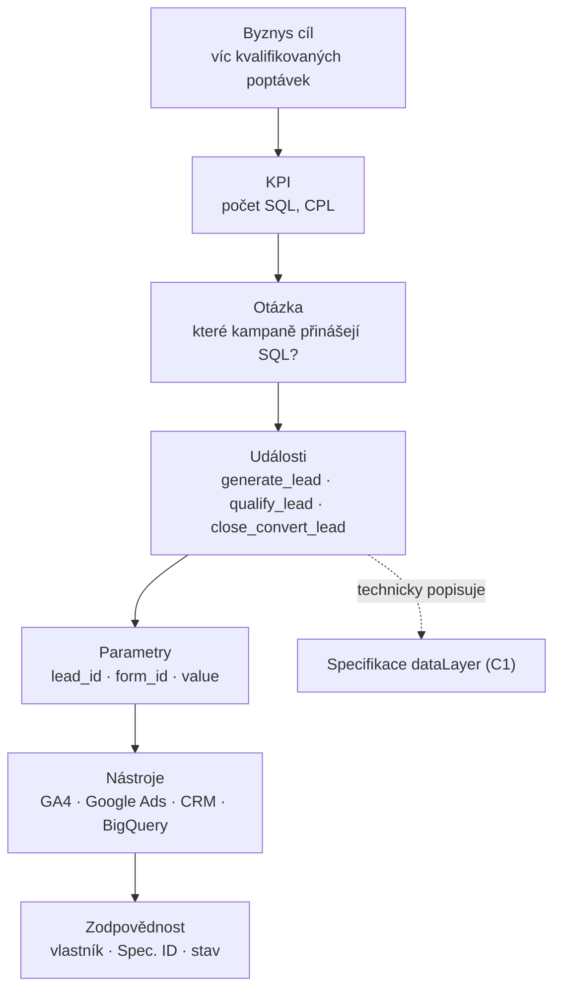

# C5: Měřicí plán: jak naplánovat měření dřív, než se napíše první tag (+ šablona) – brief
> Cluster: C. Datová vrstva & GTM · URL: /blog/merici-plan · Formát: šablona + průvodce · Priorita: měsíc 2 · Cílová LP: /sluzby/implementace-ga4 (sekundárně /jak-pracujeme, /sluzby/datova-vrstva) · Rozsah: 2 500–3 200 slov + šablony

---

## 1. Meta

| Prvek | Návrh |
|---|---|
| H1 | Měřicí plán: jak naplánovat měření před prvním tagem (52 zn.) |
| SEO title | Měřicí plán (tracking plan) + šablona \| datalayer.cz (52 zn.) |
| Meta description | Jak sestavit měřicí plán: byznys cíle → KPI → události → parametry → nástroje → zodpovědnosti. Šablona pro e-shop i B2B a vazba na specifikaci dataLayer. (153 zn.) |
| URL | /blog/merici-plan |
| Schema | `BlogPosting`, `HowTo` (postup tvorby), `FAQPage`, `BreadcrumbList` |

**Klíčová slova:** téma je **strategické** – v Ahrefs CZ nemá měřitelný objem.

| Typ | Klíčové slovo | Objem/měs. | Poznámka |
|---|---|---|---|
| Hlavní | měřicí plán | 0 | česká terminologie (pozor: „měřící“ je častý překlep – zmínit v textu přirozeně jednou) |
| Vedlejší | tracking plan, measurement plan, plán měření | 0 | EN termíny používají agentury i nástroje |
| Otázky (Ahrefs, 0) | what is a tracking plan, how to write a tracking plan | 0 | – |
| Související | kpi google analytics (20), kpi reporting (20), marketing kpi dashboard (10) | – | vazba na G3 |

**Záměr:** informační/šablonový („jak to udělat, chci vzor“). **Čtenář:** marketingový ředitel, head of e-commerce, B2B marketing manager, product owner; ve velké firmě vlastník dat/martechu. Úroveň: středně pokročilá, nepotřebuje kód. Segmenty: e-shop i B2B (dvě šablony), velká firma (vlastnictví, verze).

Proč psát bez objemu: měřicí plán je první krok každé implementace (vstup do `/jak-pracujeme`), odlišuje datalayer.cz od „nastavíme GA4“ konkurence a slouží jako lead magnet (šablona).

---

## 2. Analýza SERP a konkurence

„měřicí plán tracking plan“ (Google.cz, 8. 10. 2026): výhradně anglické a slovenské zdroje – trackingplan.com (FAQ), amplitude.com (průvodce), dna-marketing.sk (slovník „Plán merania“), twilio.com (Segment), avo.app (docs), ikaros.io, freshpaint.io (5 šablon). Související hledání: *Amplitude tracking plan template*, *Mixpanel tracking plan*, *Data tracking examples*.

**Co z toho plyne:**
- V češtině **neexistuje** konkurenční článek – šance na první pozici i citaci v AI přehledu.
- Zahraniční zdroje jsou psané pro produktovou analytiku (Amplitude, Segment, Mixpanel) – chybí pohled GA4 + reklamní systémy + Consent Mode + český trh (Sklik, Heureka).
- Digitální architekti mají „šablonu měřicí strategie“ jako lead magnet (profil konkurence) – bez veřejného článku.

**Čím je přeskočíme:** (1) jasné odlišení měřicí plán × specifikace dataLayer × konfigurace GTM; (2) dvě kompletní šablony (e-shop, B2B) s reálnými názvy událostí GA4; (3) limity GA4, které plán musí respektovat; (4) vlastnictví a aktualizace (RACI, verze); (5) diagram kaskády cíle → KPI → události.

---

## 3. Otázky, na které musí článek odpovědět

1. Co je měřicí plán a čím se liší od specifikace datové vrstvy?
2. Proč ho dělat před implementací, a ne až po ní?
3. Z čeho se měřicí plán skládá?
4. Jak převést byznys cíle na KPI a KPI na události?
5. Kolik událostí a parametrů měřit (a jaké limity má GA4)?
6. Jak vypadá měřicí plán pro e-shop?
7. Jak vypadá měřicí plán pro B2B / lead generation (včetně CRM)?
8. Kam do plánu patří souhlas s cookies a osobní údaje?
9. Kdo měřicí plán vlastní a kdo ho schvaluje?
10. Jak často a při jakých změnách ho aktualizovat?
11. V jakém nástroji plán vést (Sheet, Notion, Git, specializované nástroje)?
12. Jaké jsou nejčastější chyby?

---

## 4. Rychlá odpověď (hotový text)

> **Měřicí plán** je dokument, který před nasazením měření propojí byznys cíle s konkrétními daty: cíle → KPI → otázky → události → parametry → nástroje → zodpovědnosti. Říká, *co a proč* měřit. Na něj navazuje specifikace datové vrstvy pro vývojáře (*jak*) a konfigurace GTM a GA4. Plán vlastní firma a aktualizuje ho při každé změně webu nebo cílů.

(58 slov)

---

## 5. Osnova s obsahem odpovědí

### H2 1: Co je měřicí plán (a co není)
**Klíčové sdělení:** Měřicí plán je překlad byznysu do dat. Není to seznam tagů ani technická specifikace.

**Tabulka – tři dokumenty, tři otázky (kompletní):**

| Dokument | Odpovídá na | Pro koho | Výstup | Kdo píše |
|---|---|---|---|---|
| Měřicí plán (tracking/measurement plan) | *Co a proč měříme?* | vedení, marketing, obchod | cíle, KPI, události, parametry, nástroje, vlastníci | analytik s byznysem |
| Specifikace datové vrstvy | *Jak to web předá?* | vývojáři, testeři | katalog událostí, typy, příklady kódu, testy (C1) | analytik s vývojem |
| Konfigurace GTM / GA4 / reklamních systémů | *Kam a jak se to pošle?* | analytik, PPC | značky, pravidla, vlastní dimenze, klíčové události (C3) | analytik |

- Google v dokumentaci Tag Platform doporučuje začít **měřicími cíli** – co chce byznys vědět (např. kolik návštěv vede k pokladně, které kanály přinášejí konverze) – a i „negativní cíle“ (které kanály nefungují). Cíle se mají pravidelně přehodnocovat.

### H2 2: Proč plánovat před implementací
**Klíčové sdělení:** Co se nezměří od začátku, nejde doměřit zpětně. A GA4 má limity, které nedovolí „měřit všechno“.
- **Zpětně nic nedoplníte:** události a parametry, které nebyly odeslány, v GA4 ani v BigQuery nebudou.
- **Limity GA4 (standardní vlastnost):** 30 klíčových událostí, 50 vlastních dimenzí s rozsahem události, 25 s rozsahem uživatele, 10 s rozsahem položky, 50 vlastních metrik; 25 parametrů na událost; uchování dat v GA4 max. 14 měsíců (proto BigQuery – F1). Plán rozhoduje, na co limity „utratit“.
- **Jedna pravda:** bez plánu má každý nástroj jinou definici konverze (lead v GA4 ≠ lead v Ads ≠ lead v CRM) → nesedící čísla (D2).
- **Levnější vývoj:** vývojář implementuje datovou vrstvu jednou, podle specifikace odvozené z plánu, místo opakovaných „ještě doplňte“.

### H2 3: Z čeho se měřicí plán skládá (kaskáda)
**Klíčové sdělení:** Každý řádek plánu musí jít „nahoru“ k byznys cíli. Událost, která nevede k žádné otázce, do plánu nepatří.

1. **Byznys cíle** (3–5): např. „zvýšit online tržby při udržení PNO“, „získat víc kvalifikovaných poptávek z kampaní“.
2. **KPI** s definicí, zdrojem a cílovou hodnotou: tržby, konverzní poměr, AOV, PNO/ROAS, CPL, podíl SQL.
3. **Byznysové otázky:** „Na kterém kroku pokladny odcházejí lidé z mobilu?“, „Které kampaně přinášejí leady, ze kterých vznikne zakázka?“
4. **Události** (název podle GA4, kde existuje doporučená) a **kdy** se spouštějí.
5. **Parametry a dimenze** (co potřebujeme rozlišit) + **registrace** v GA4 (vlastní dimenze).
6. **Nástroje a cíle dat:** GA4, Google Ads, Meta, Sklik, Heureka, CRM, BigQuery.
7. **Souhlas a soukromí:** pod jakým souhlasem událost běží, zda obsahuje osobní údaje (A3).
8. **Zodpovědnosti a stav:** vlastník řádku, ID ve specifikaci dataLayer, stav (návrh / implementováno / ověřeno), verze.

**Diagram 1** – kap. 6.

### H2 4: Postup tvorby (workshop → dokument)
**Klíčové sdělení:** Měřicí plán vzniká na 1–2 workshopech s byznysem, ne u stolu analytika.

| Krok | Co se děje | Kdo | Výstup |
|---|---|---|---|
| 1. Vstupy | obchodní model, cíle, současné reporty, nástroje, CRM | marketing, obchod, analytik | seznam cílů a otázek |
| 2. Workshop KPI | definice KPI (vzorec, zdroj, četnost) | vedení, marketing, analytik | slovník KPI |
| 3. Mapování cesty | kroky zákazníka (web, telefon, CRM, offline) | marketing, obchod, UX | mapa cesty |
| 4. Události a parametry | návrh podle doporučených událostí GA4 + vlastní | analytik | tabulka plánu (H2 5/6) |
| 5. Nástroje a consent | kam která událost jde, pod jakým souhlasem | analytik, DPO/právník | sloupce nástroje + consent |
| 6. Revize limitů | klíčové události, vlastní dimenze, kardinalita | analytik | upravený plán |
| 7. Schválení a verze | podpis vlastníka, verze 1.0 | vlastník měření | schválený plán → specifikace (C1) |

`[DOPLNIT: klient – jak tento krok probíhá u datalayer.cz (délka workshopu, výstupy), navázat na /jak-pracujeme]`

### H2 5: Šablona měřicího plánu pro e-shop (ukázkový příklad)
**Klíčové sdělení:** U e-shopu tvoří páteř e-commerce události GA4; plán k nim přidává byznys otázky, nástroje a souhlas.

**Cíl:** Zvýšit online tržby o X % při PNO do Y % *(ukázkový příklad – hodnoty doplní klient)*.

| ID | KPI / otázka | Událost | Klíčové parametry | Vlastní dimenze GA4 | Nástroje | Souhlas | Vlastník | Spec. ID |
|---|---|---|---|---|---|---|---|---|
| P01 | Tržby, AOV, PNO | `purchase` | `transaction_id`, `value`, `tax`, `shipping`, `currency`, `coupon`, `customer_type`, `items` | – (standard) | GA4, Google Ads, Meta, Sklik, Heureka | analytika / reklama (Consent Mode) | e-commerce manažer | E07 |
| P02 | Kde odpadají lidé v pokladně? | `begin_checkout`, `add_shipping_info`, `add_payment_info` | `shipping_tier`, `payment_type` | `shipping_tier`, `payment_type` | GA4 | analytika | e-commerce manažer | E06, E06a, E06b |
| P03 | Které produkty se prohlížejí, ale nekupují? | `view_item`, `add_to_cart` | `items` (ID varianty) | – | GA4, Google Ads (remarketing), Meta | analytika / reklama | category manažer | E04, E05 |
| P04 | Které výpisy a pozice prodávají? | `view_item_list`, `select_item` | `item_list_id`, `index` | – | GA4 | analytika | merchandising | E02, E03 |
| P05 | Fungují bannery? | `view_promotion`, `select_promotion` | `promotion_id`, `creative_slot` | – | GA4 | analytika | marketing | E12, E13 |
| P06 | Hledají lidé, co nemáme? | `search` (+ počet výsledků) | `search_term`, `search_results` | `search_results` (metrika) | GA4 | analytika | category manažer | E10 |
| P07 | Noví vs. vracející se zákazníci | `purchase`, `login` | `customer_type`, `user_id` | User-ID | GA4, Google Ads | analytika / reklama | CRM manažer | E07, E09 |
| P08 | Skutečné tržby po vratkách | `refund` (ze serveru) | `transaction_id`, `value`, `items` | – | GA4, BigQuery | – (server) | finance | E14 |
| P09 | Marže a zisk z kampaní | – (data import / BigQuery) | `item_id` → nákupní cena | – | BigQuery, dashboard | – | controlling | F4 |

*Sloupec Spec. ID navazuje na ukázkový katalog událostí v C1 (E01–E11) a rozšiřuje ho (E06a/b, E12+); v reálném projektu se ID přidělují ve specifikaci.*

Pod tabulku: **slovník KPI** (KPI · vzorec · zdroj pravdy · četnost) – např. *Tržby = Σ `value` u `purchase` bez DPH a dopravy, zdroj pravdy: ERP; GA4 jen pro trend a atribuci* (G3).

### H2 6: Šablona měřicího plánu pro B2B / lead generation (ukázkový příklad)
**Klíčové sdělení:** U B2B nekončí měření odesláním formuláře. Plán musí dovést lead až do CRM a zpět do reklamních systémů.

**Cíl:** Víc kvalifikovaných poptávek (SQL) z online kanálů při CPL do X Kč *(ukázkový příklad)*.

| ID | KPI / otázka | Událost | Klíčové parametry | Vlastní dimenze GA4 | Nástroje | Souhlas | Vlastník | Spec. ID |
|---|---|---|---|---|---|---|---|---|
| L01 | Počet a CPL leadů podle kanálu | `generate_lead` | `form_id`, `lead_id`, `lead_source`, `value` (odhad) | `form_id` | GA4, Google Ads, Meta, LinkedIn, Sklik | analytika / reklama | marketing manažer | E11 |
| L02 | Kde lidé formulář opouštějí? | `lead_form_start`, `lead_form_error` *(vlastní názvy – `form_start` je v GA4 rezervovaný pro rozšířené měření, viz pozn.)* | `form_id`, `error_fields` | `error_fields` | GA4 | analytika | UX / web | E15, E16 |
| L03 | Telefonáty a e-maily z webu | `contact_click` | `channel` (phone/email), `section` | `channel` | GA4, Google Ads | analytika / reklama | marketing | E17 |
| L04 | Kolik leadů je kvalifikovaných? | `qualify_lead` / `disqualify_lead` (z CRM) | `lead_id`, `disqualified_lead_reason` | `disqualified_lead_reason` | CRM → GA4 (MP), Google Ads (offline konverze) | – (server) | obchod | E18 |
| L05 | Kolik leadů se změní v zakázku a za kolik? | `close_convert_lead` (z CRM) | `lead_id`, `value`, `currency` | – | CRM → Google Ads, Meta CAPI, BigQuery | – (server) | obchodní ředitel | E19 |
| L06 | Které obsahy pomáhají? | `file_download`, `video_progress`, `scroll` (rozšířené měření) | `file_name`, `percent` | – | GA4 | analytika | content | – |
| L07 | Kvalita leadů podle kampaně | (BigQuery: GA4 × CRM přes `lead_id`) | `lead_id`, `gclid`/`gbraid` | – | BigQuery, dashboard | – | marketing ops | F4, G3 |

Pozn.: GA4 má doporučené lead události (`generate_lead` s `lead_source`, `qualify_lead`, `disqualify_lead`, `working_lead`, `close_convert_lead`, `close_unconvert_lead`). Názvy rezervované pro automatické/rozšířené měření (`form_start`, `form_submit`) nelze použít pro vlastní události – v plánu je přejmenovat (např. `lead_form_start`) a sjednotit se specifikací formulářů (`05_formulare/specifikace-formularu.md`). Offline konverze a CRM → E1, E3.

### H2 7: Vazba měřicího plánu na specifikaci dataLayer
**Klíčové sdělení:** Každý řádek plánu má ID, které se objeví ve specifikaci, v GTM i v changelogu. Tak dohledáte, proč událost existuje a kdo ji potřebuje.
- Plán (P01) → specifikace (E07) → GTM značky (`GA4 - Event - purchase`, `GAds - Conversion - Nákup`) → report/dashboard. Opačným směrem: každá značka v GTM má v popisu ID řádku plánu → audit (C4) snadno najde „sirotky“.
- **Tabulka sledovatelnosti** (do článku): Plán ID · Specifikace ID · GTM značky · GA4 klíčová událost (ano/ne) · Dashboard.
- **Plán jako kód (volitelně, pro větší týmy):** řádky plánu v YAML/JSON v Gitu vedle JSON Schema specifikace (C1); pull request mění plán i specifikaci zároveň.
```yaml
# tracking-plan.yaml – jeden řádek měřicího plánu (ukázka)
- id: P02
  kpi: "Odchody v pokladně podle dopravy a platby"
  owner: "e-commerce manažer"
  events: [begin_checkout, add_shipping_info, add_payment_info]   # názvy podle doporučených událostí GA4
  params: { shipping_tier: string, payment_type: string }
  ga4_custom_dimensions: [shipping_tier, payment_type]             # počítá se do limitu 50 (rozsah události)
  destinations: [GA4]
  consent: analytics_storage
  spec_ids: [E06, E06a, E06b]                                      # odkaz do specifikace dataLayer (C1)
  status: verified                                                 # proposed | implemented | verified
  since_version: "1.4.0"
```

### H2 8: Kdo plán vlastní a jak se aktualizuje
**Klíčové sdělení:** Měřicí plán vlastní firma (vlastník měření), ne agentura. Analytik ho udržuje, byznys schvaluje.

**RACI (kompletní):**

| Činnost | Vlastník měření (firma) | Analytik / datalayer.cz | Marketing / PPC | Obchod / CRM | Vývoj | DPO / právník |
|---|---|---|---|---|---|---|
| Cíle a KPI | A | R | C | C | I | I |
| Události a parametry | A | R | C | C | C | I |
| Nástroje a consent | A | R | C | I | I | C |
| Specifikace dataLayer | I | R | I | I | C | I |
| Schválení verze plánu | A/R | C | I | I | I | I |
| Čtvrtletní revize | A | R | C | C | I | I |

**Kdy plán aktualizovat (spouštěče):** nový cíl nebo KPI; redesign, nová pokladna či formulář; nový reklamní systém nebo CRM; změna cookie lišty či legislativy; dosažení limitů GA4; nesoulad čísel zjištěný v reportech. Jinak **čtvrtletní revize**.
**Verzování:** stejné jako specifikace (1.0 → 1.1 při přidání události, 2.0 při změně definice KPI); changelog s datem a důvodem; anotace v reportech (G3).
**Kde ho vést:** Google Sheets/Excel (malý tým; listy *Cíle a KPI*, *Plán*, *Slovník KPI*, *Changelog*), Notion/Confluence (dokumentace), Git (plán jako kód), specializované nástroje typu Avo nebo Trackingplan (velké produktové týmy). Rozhodující je **jedno místo pravdy**.

### H2 9: Nejčastější chyby

| Chyba | Důsledek | Jak se jí vyhnout |
|---|---|---|
| Začít seznamem tagů místo cílů | měří se, co jde, ne co je potřeba | kaskáda cíle → KPI → otázky |
| „Měřme všechno“ | vyčerpané limity GA4, nečitelné reporty | každá událost musí odpovídat na otázku |
| Různé definice konverze v nástrojích | čísla nesedí, spory o rozpočty | slovník KPI + jeden zdroj hodnot |
| Plán bez vlastníka | zastará po prvním redesignu | vlastník na straně firmy, čtvrtletní revize |
| Bez consentu a osobních údajů | právní riziko, ztráta dat | sloupce Souhlas a PII v plánu (A1, A3) |
| B2B končí u formuláře | optimalizace na počet, ne na kvalitu leadů | `lead_id` a CRM události (E1, E3) |
| Plán oddělený od specifikace | vývoj implementuje něco jiného | ID řádků a tabulka sledovatelnosti |

> **CTA box (za H2 6):** viz kap. 8.

---

## 6. Vizuály

### Diagram 1 – kaskáda měřicího plánu

**Finální SVG:** svislá „kaskáda“ 7 úrovní jako schody (každá úroveň karta `#0b1a30`, nadpis Inter 600, příklad v Roboto Mono). Vpravo boční panel „Specifikace dataLayer“ s propojením na úroveň Události (přerušovaná cyan čára). Dvě varianty příkladů přepínatelné záložkou E-shop / B2B (interakce volitelná; bez JS zobrazit E-shop). Mobil: kaskáda svisle, panel pod ní.

### Diagram 2 – tři dokumenty
Tři karty vedle sebe: *Měřicí plán (proč a co)* → *Specifikace dataLayer (jak)* → *Konfigurace GTM/GA4 (kam)*; pod každou „kdo píše / kdo čte“. Šipky zleva doprava, nad nimi „ID řádku prochází všemi dokumenty“.

### Infografika „Měřicí plán na jedné stránce“
1080×1350: nahoře cíl a 3 KPI, uprostřed tabulka 5 řádků (ID, otázka, událost, nástroj, vlastník), dole pruh „limity GA4: 30 klíčových událostí · 50 vlastních dimenzí · 25 parametrů na událost“.

### Šablona ke stažení (lead magnet)
Google Sheets + XLSX: listy *Cíle a KPI*, *Slovník KPI*, *Plán – e-shop*, *Plán – B2B*, *Sledovatelnost*, *Changelog*; rozbalovací seznamy (stav, souhlas, nástroje), podmíněné formátování „chybí vlastník / chybí Spec. ID“. `[DOPLNIT: klient – volně, nebo za e-mail; kdo šablonu připraví]`.

### Tabulky
Kompletní: tři dokumenty (H2 1), postup (H2 4), šablona e-shop (H2 5), šablona B2B (H2 6), RACI (H2 8), chyby (H2 9).

---

## 7. Fakta a zdroje

| Tvrzení | Zdroj | Ověřeno | Riziko |
|---|---|---|---|
| Začít měřicími cíli (včetně negativních), pravidelně přehodnocovat; GTM jako první volba | https://developers.google.com/tag-platform/devguides/prerequisites | 10/2026 | nízké |
| Limity konfigurace GA4: 30 klíčových událostí, 50 event-scoped a 25 user-scoped vlastních dimenzí, 50 vlastních metrik, uchování max. 14 měsíců | https://support.google.com/analytics/answer/12229528 | 10/2026 | střední |
| 10 item-scoped vlastních dimenzí (25 v 360) | https://developers.google.com/analytics/devguides/collection/ga4/item-scoped-ecommerce | 10/2026 | střední |
| 25 parametrů na událost, délky názvů a hodnot | https://support.google.com/analytics/answer/9267744 | 10/2026 | střední |
| Rezervované názvy událostí (`form_start`, `form_submit`, `page_view`…) a parametrů | https://support.google.com/analytics/answer/13316687 | 10/2026 | střední |
| Doporučené lead události (`generate_lead` + `lead_source`, `qualify_lead`, `disqualify_lead` + důvod, `close_convert_lead`…) a e-commerce události | https://developers.google.com/analytics/devguides/collection/ga4/reference/events?client_type=gtm | 10/2026 | střední |
| Typy souhlasu v GTM (`ad_storage`, `ad_user_data`, `ad_personalization`, `analytics_storage`) | https://support.google.com/tagmanager/answer/10718549 | 10/2026 | střední |

---

## 8. Interní odkazy a CTA

**Cílová LP:** /sluzby/implementace-ga4 · sekundárně /jak-pracujeme (proces) a /sluzby/datova-vrstva

**CTA box (za H2 6):**
- Nadpis: **Sestavíme s vámi měřicí plán**
- Text: Na workshopu převedeme vaše cíle na KPI, události a parametry, rozhodneme, kam data posílat a pod jakým souhlasem – a navážeme specifikací pro vývojáře.
- Tlačítko: `[ Naplánovat měření ]` → /sluzby/implementace-ga4#kontakt

**Související články:** C1 Datová vrstva – specifikace (/blog/datova-vrstva-specifikace) · C3 GTM průvodce (/blog/google-tag-manager-pruvodce) · D1 Nastavení GA4 (/blog/nastaveni-ga4-pruvodce) · G3 Marketingový dashboard a KPI (/blog/marketingovy-dashboard) · E1 Měření formulářů a leadů (/blog/mereni-formularu-a-leadu) · E3 Offline konverze z CRM (/blog/offline-konverze-z-crm) · F1 GA4 → BigQuery (/blog/ga4-bigquery-export) · F4 Propojení dat e-shopu a CRM (/blog/propojeni-dat-eshop-crm-ga4) · A3 Osobní údaje v analytice (/blog/osobni-udaje-v-analytice) · D2 Proč nesedí čísla (/blog/proc-nesedi-data).
**Navazující LP:** /reseni/e-shopy · /reseni/b2b-a-lead-generation · /reseni/velke-firmy.
**Slovník:** Událost (event) · Klíčová událost (konverze) · Datová vrstva · User-ID · Offline konverze.

**Zkrácený kontaktní blok:** `form_id: blog` · témata `GA4`, `Audit měření` · H2 „Řešíte totéž u sebe?“ · placeholder „Např. připravujeme nový web a chceme měření navrhnout od začátku…“

---

## 9. FAQ pro schema

**Co je měřicí plán?**
Měřicí plán je dokument, který propojuje byznys cíle s daty: pro každý cíl určuje KPI, otázky, události, parametry, nástroje a odpovědné osoby. Vzniká před nasazením měření a slouží jako zadání pro specifikaci datové vrstvy i pro nastavení GA4, GTM a reklamních systémů.

**Jaký je rozdíl mezi měřicím plánem a specifikací dataLayer?**
Měřicí plán říká, co a proč měřit – pro vedení a marketing. Specifikace datové vrstvy říká, jak to web technicky předá – pro vývojáře: názvy událostí, parametry, datové typy, okamžik volání a ukázky kódu. Plán je vstupem specifikace a oba dokumenty spojují stejná ID řádků.

**Kdo má měřicí plán vlastnit?**
Firma, ne agentura. Vlastník měření (např. marketingový nebo e-commerce ředitel) plán schvaluje, analytik ho udržuje a vývoj se podle něj řídí. Pokud plán vlastní jen dodavatel, při změně dodavatele zmizí znalost, proč která událost existuje.

**Jak často měřicí plán aktualizovat?**
Při každé změně, která mění cíle nebo měřené akce: redesign, nová pokladna či formulář, nový reklamní systém nebo CRM, změna cookie lišty. Bez změn stačí čtvrtletní revize. Každou úpravu zapište jako novou verzi s datem a důvodem.

**Kolik událostí má měřicí plán obsahovat?**
Tolik, kolik odpovídá na byznysové otázky – obvykle desítky, ne stovky. GA4 má limity: 30 klíčových událostí, 50 vlastních dimenzí s rozsahem události a 25 parametrů na událost. Každá událost v plánu musí mít vlastníka a otázku, na kterou odpovídá.

---

## 10. Poznámky pro autora

- **Terminologie:** správně „měřicí plán“ (měřicí = určený k měření). Překlep „měřící plán“ je běžný – jednou přirozeně zmínit („někdy též měřící plán“) kvůli vyhledávání, jinak nepoužívat.
- **Ukázkové hodnoty** v šablonách (X %, Y %, CPL) nechat jako proměnné – klient doplní reálný příklad jen se souhlasem klienta `[DOPLNIT]`.
- **Konzistence s webem klienta:** názvy událostí formuláře sjednotit se `05_formulare/specifikace-formularu.md` (tam `lead_form_start`, `lead_form_error` jako dataLayer události – v GA4 je `form_start` rezervovaný pro rozšířené měření; doporučit přejmenování v GA4 značce, např. `lead_form_start`, nebo ověřit chování při kolizi s rozšířeným měřením).
- **Limity GA4** se mění (např. pro 360) – při revizi zkontrolovat stránku Configuration limits.
- **Co dodá klient:** popis workshopu a délek v procesu `/jak-pracujeme` `[DOPLNIT]`, rozhodnutí o lead magnetu `[DOPLNIT]`.
- **Recenzent:** marketingový ředitel klienta / B2B klient (srozumitelnost pro byznys).
