# D1: Nastavení GA4 krok za krokem: průvodce 2026 – brief
> Cluster: D. GA4 & kvalita dat (pilíř) · URL: /blog/nastaveni-ga4-pruvodce · Formát: pilíř / návod · Priorita: měsíc 1 · Cílová LP: /sluzby/implementace-ga4 · Rozsah článku: 4 000–5 000 slov (hloubka nastavení, ne délka)

## 1. Meta
- **H1:** Nastavení GA4 krok za krokem: průvodce pro rok 2026
- **SEO title (57 zn.):** Nastavení GA4 krok za krokem (2026) – průvodce | datalayer.cz
- **Meta description (152 zn.):** 15 kroků nastavení Google Analytics 4: retence dat, interní návštěvnost, platební brány, consent mode, propojení s Ads a BigQuery. S doporučením a důvodem.
- **URL:** /blog/nastaveni-ga4-pruvodce
- **Klíčová slova (Ahrefs CZ, `kw_mapovani_na_stranky.tsv`):**
  - hlavní: *nastavení ga4* (50), *nastavení google analytics* (100), *google analytics nastavení* (50)
  - vedlejší: *jak nastavit ga4* (40), *jak nastavit google analytics* (40), *založení ga4* (20), *nastavení google analytics 4* (10), *implementace ga4* (10), *ga4 nastavení* (10), *ga4 jak nastavit* (10)
  - široké (jen podpora): *google analytics 4* (300), *ga4* (700), *google analytics návod* (200)
  - long-tail EN (0, ale jasný záměr): *data retention ga4*, *ga4 cross-domain tracking*, *enable google signals ga4*, *google analytics 4 user id*, *ga4 key events*
  - otázky (PAA „nastavení ga4“): „Co je to GA4?“, „Jak nastavit Google Tag Manager?“, „Jak založit Google Tag Manager?“; z praxe: „Jak dlouho GA4 uchovává data?“, „Jak vyloučit vlastní návštěvy?“
- **Záměr:** informační-transakční (návod → část čtenářů zvolí službu).
- **Cílový čtenář:** marketingový manažer, majitel e-shopu nebo PPC specialista s „nějak nasazeným“ GA4, středně pokročilý; sekundárně vývojář. Segmenty: e-shop (hlavní), B2B (User-ID, formuláře), velká firma (role, filtry, BigQuery).

## 2. Analýza SERP a konkurence
*nastavení ga4* / *nastavení google analytics 4* (SERP 8. 10. 2026): marketingppc.cz (~5 700 slov), support.google.com (9304153), anycoders.cz, digitalniarchitekti.cz, janpospisil.cz, sovanet.cz, evisions.cz, jirifranek.cz, freelo.io; AI přehled.

**Co chybí konkurenci (texty v `data/raw/konkurence/`):** marketingppc.cz má nastavení jen jako jednu kapitolu (bez cross-domain, User-ID, identity pro přehledy, BigQuery limitů, Merchant Center; novinky 2025 bez zdrojů); nazakladedat.cz má checklist bez „proč“; janpospisil.cz a DA jsou přehledové. Nikdo nepokrývá změny 2026 (filtry hostname, Task Assistant, kanál AI Assistant, vlastní konverzní okna, konverze vs. klíčové události).

**Čím je přeskočíme:** (1) každý krok = **doporučená hodnota + důvod + kde v rozhraní + kdy postupovat jinak**; (2) **hlavní tabulka nastavení** jako stažitelný checklist (napojení na D3); (3) aktuálnost 10/2026 se zdroji a datem revize; (4) česká specifika (platební brány GoPay/Comgate/ThePay, Seznam, Shoptet); (5) diagram „pořadí kroků“; (6) kód consentu a User-ID.

## 3. Otázky, na které musí článek odpovědět
1. Jaký je rozdíl mezi účtem, službou (vlastností) a datovým streamem a kolik jich potřebuji?
2. Nasadit GA4 přes GTM, přímo kódem, nebo integrací e-shopové platformy?
3. Které události vylepšeného měření nechat zapnuté a které vypnout?
4. Na kolik nastavit uchovávání dat a co to ovlivní?
5. Jak vyloučit vlastní a vývojářskou návštěvnost (a proč filtr nemazat bez testu)?
6. Proč se platební brána objevuje jako zdroj objednávek a jak to opravit?
7. Kdy potřebuji cross-domain měření?
8. Vyplatí se User-ID a co do něj nesmím posílat?
9. Zapnout Google signály? Co se změnilo v roce 2024?
10. Jaký je rozdíl mezi klíčovou událostí a konverzí v GA4 (2026)?
11. Co propojit (Google Ads, Search Console, BigQuery, Merchant Center) a s jakými limity?
12. Jak nastavit Consent Mode v2, aby GA4 modelovalo data?
13. Jakou zvolit identitu pro přehledy?
14. Jak ověřím, že je všechno nastavené správně?

## 4. Rychlá odpověď (hotový text, 58 slov)
> Nastavení GA4 má 15 kroků: služba s časovým pásmem a měnou, webový stream a značka přes GTM, vylepšené měření, retence 14 měsíců, filtry interní a vývojářské návštěvnosti, vyloučení platebních bran, cross-domain, User-ID, Google signály, klíčové události, propojení s Ads, Search Console, BigQuery a Merchant Center, Consent Mode v2 a identita pro přehledy. Každé nastavení má dopad na data.

## 5. Osnova s obsahem odpovědí

### H2 Než začnete: měřicí plán a struktura účtu
- **Sdělení:** Nejdřív rozhodněte, co měřit (měřicí plán, odkaz C5), pak klikejte.
- **Obsah:** hierarchie *Účet → Služba (property) → Datový stream*. Pravidla: 1 firma = 1 účet; 1 web/aplikace pro stejné publikum = 1 služba; jazykové mutace na stejné doméně = 1 služba + dimenze (hostname/jazyk); oddělené značky s jiným byznysem = samostatné služby. Testovací/stagingový web: **samostatná testovací služba**, ne filtr v produkci.
- **Přístupy:** role Administrátor, Editor, Marketér, Analytik, Divák + omezení dat „bez metrik nákladů / tržeb“ (support 9305587). Doporučení: min. 2 administrátoři na firemních účtech, agentury jako Editor/Marketér, nikdy sdílené heslo.

### H2 Krok 1: Služba – časové pásmo, měna, odvětví
- **Doporučení:** časové pásmo *(GMT+01:00) Praha*, měna **CZK** (nebo hlavní účetní měna), odvětví podle skutečnosti.
- **Proč:** časové pásmo určuje hranici dne v přehledech (srovnání s administrací a Google Ads – viz D2). **Pozor:** změna měny služby se podle Googlu propisuje **i do historických dat** („Changes to the global currency type will affect future as well as historical data“, support 9796179). Události v jiné měně GA4 převádí kurzem **předchozího dne**.

### H2 Krok 2: Webový datový stream a instalace značky
- **Varianty (tabulka 6.3):** GTM (doporučeno pro většinu webů), přímý gtag.js (malé weby bez dalších tagů), nativní integrace platformy (Shoptet/Upgates/Shopify – viz D4).
- **Pravidla:** značka Google v GTM na spouštěči **Initialization – All Pages** (jinak hrozí chybějící `session_start` → `(not set)`, support 13504892); nikdy kombinace „integrace platformy + GTM tag GA4“ (Shoptet to výslovně varuje); ID měření `G-…` jen jedno na produkční web.
- **Kód:** viz 6.4 (pořadí consent default → GTM).

### H2 Krok 3: Vylepšené měření – co nechat a co vypnout
- **Doporučení (tabulka 6.2):** `page_view` (nelze vypnout; u SPA nechte „změny historie prohlížeče“), `scroll` (jen 90 %), odchozí kliknutí, vyhledávání na webu (doplňte vlastní parametr, výchozí jsou `q, s, search, query, keyword`), video (jen YouTube s JS API), stažení souborů. **Interakce s formulářem** (`form_start`, `form_submit`) typicky **vypnout** a měřit odeslání formuláře vlastní událostí přes dataLayer (spolehlivé „odesláno = uloženo“), viz E1.
- **Proč:** automatické `form_submit` se spouští i při neúspěšné validaci; data pak nesedí s CRM. *(z praxe, doložit ukázkou)*

### H2 Krok 4: Uchovávání dat
- **Doporučení:** **14 měsíců** (standardní služba: 2 nebo 14 měsíců; GA4 360 až 50 měsíců) + „Resetovat uživatelská data při nové aktivitě“ zapnout.
- **Proč:** nastavení ovlivňuje **jen průzkumy (explorations) a trychtýře**, ne standardní agregované přehledy. Věk, pohlaví a zájmy se drží vždy 2 měsíce (support 7667196). Pro delší historii a vlastní modely → **BigQuery export** (krok 12, F1).

### H2 Krok 5: Interní a vývojářská návštěvnost, filtry dat
- **Postup:** (1) v streamu *Konfigurace značky → Definovat interní provoz* pravidlo IP (rovná se / začíná / CIDR / regex; podmínky jsou OR) → parametr `traffic_type=internal`; (2) *Filtry dat* → filtr „Interní provoz“ nejdřív ve stavu **Testování**, ověřit dimenzí „Název testovacího filtru dat“, pak **Aktivní**; (3) filtr **Vývojářský provoz** (události s `debug_mode`) aktivní; (4) **nově 2026:** filtr **hostname** (červen 2026 vylučující, září 2026 i *include* = whitelist povolených domén; pozor, include blokuje i události s prázdným hostname; Measurement Protocol se nefiltruje).
- **Fakta:** max. **10 filtrů dat** na službu; filtry **nejsou zpětné** a vyloučení je **trvalé** (data nebudou ani v BigQuery) – support 10108813, 10104470.
- **Tip:** home office/dynamické IP → `traffic_type` přes GTM podle cookie.

### H2 Krok 6: Nevyžádaná doporučení (platební brány)
- **Doporučení:** do *Seznam nevyžádaných doporučení* přidat domény bran a 3-D Secure (tabulka 6.5). Max. **50 podmínek** na stream; GA4 přidá `ignore_referrer=true` (support 10327750).
- **Pozor:** uživatel, jehož první relace přišla z brány před nastavením, může zůstat připsaný bráně (atribuce poslední nepřímé interakce). Nenastavovat `ignore_referrer` ručně na všech stránkách.
- **Postřeh pro článek:** `checkout.stripe.com` a `stripe.com` jsou v seznamu zdrojů GA4 vedené jako **SOURCE_CATEGORY_SHOPPING** → bez vyloučení by objednávky padaly do „Organic Shopping“ (seznam zdrojů GA4 stažen 8. 10. 2026).

### H2 Krok 7: Cross-domain měření
- **Kdy:** web + samostatná doména rezervace/košíku/platby pod vaší správou (např. `firma.cz` → `objednavky-firma.cz`). Subdomény stejné domény cross-domain nepotřebují.
- **Postup:** stream → *Konfigurace domén* → přidat domény (OR). Všechny domény musí mít **stejné ID značky**. Funguje přes parametr `_gl` v URL u odkazů a formulářů.
- **Limity:** přesměrování, které zahodí parametry; navigace spuštěná JavaScriptem; skripty se `stopPropagation()` (support 10071811). Test: proklik → v URL `_gl=1*…` → v DebugView stejné `client_id`.

### H2 Krok 8: Relace a zapojení
- **Doporučení:** ponechat timeout **30 min** (max. 7 h 55 min) a časovač zapojené relace **10 s**, pokud nemáte důvod. Obsahové weby s dlouhým čtením mohou timeout prodloužit.
- **Proč:** změna rozbije srovnatelnost metrik v čase; GA4 na rozdíl od UA **nerestartuje relaci o půlnoci ani při nové kampani** (support 11986666).
- Pozn. pro autora: rozsah časovače 10–60 s ověřit v rozhraní (Google stránka hodnotu neuvádí).

### H2 Krok 9: User-ID
- **Kdy:** e-shop s přihlašováním, B2B portál, SaaS. Ne pro web bez loginu.
- **Pravidla (support 9213390):** vlastní interní ID (ne e-mail, ne telefon, nic, z čeho lze identifikovat osobu), max. **256 znaků**, po odhlášení `null` (ne prázdný řetězec, ne text „null“), zmínka v zásadách ochrany OÚ. Identita pro přehledy musí zahrnovat User-ID (Blended/Observed).
- **Kód:** 6.4 (dataLayer + parametr `user_id` v konfiguraci značky Google).

### H2 Krok 10: Google signály a personalizace reklam
- **Fakta:** od **poloviny února 2024** nejsou signály součástí identity pro přehledy (→ méně prahování); dál je potřebují demografické dimenze a publika pro Ads; sběr lze vypnout po regionech; do BigQuery se neexportují (support 9445345, 9383630).
- **Doporučení:** zapnout jen s remarketingem z GA4 a Consent Mode v2 (`ad_personalization`); jinak lze nechat vypnuté.

### H2 Krok 11: Události, klíčové události a konverze
- **Sdělení:** Klíčová událost = důležitá akce pro byznys v GA4. Konverze (od 2024/2025) = akce pro kampaně Google Ads, spravuje se v sekci **Inzerce → Správa konverzí**.
- **Fakta:** tok *událost → klíčová událost → konverze* (support 13965727); konverze Google Ads se **nezobrazují ve standardních přehledech** GA4. Limit **30 klíčových událostí**, 50 vlastních dimenzí na úrovni události, 25 na úrovni uživatele (support 12229528). Limity sběru: název události 40 znaků, 25 parametrů na událost, hodnota parametru 100 znaků (`page_location` 1 000) – support 9267744.
- **Doporučení:** klíčové události jen pro obchodní cíle (`purchase`, `generate_lead`, `sign_up`, odeslání poptávky), ne `scroll`. Metoda počítání: nákup „každá“, lead „jednou za relaci“. Doporučené názvy událostí Googlu (`purchase`, `generate_lead`), vlastní parametry zaregistrovat jako vlastní dimenze.
- **Novinky 2026:** atribuční nastavení pro každou webovou konverzi zvlášť (beta, 16. 1. 2026), vlastní okna – kliknutí 1–90 dní, engaged-view 1–30 dní (11. 8. 2026).
- Odkaz: C2 (e-commerce dataLayer), E1 (formuláře).

### H2 Krok 12: Propojení s Google Ads, Search Console, BigQuery a Merchant Center
- **Obsah:** tabulka 6.6 (co propojení přinese, limity) + u každého 2–3 věty postupu. Klíčové: Google Ads jen se zapnutým auto-taggingem (import do Ads až 24 h); Search Console přehledy je nutné **publikovat v Knihovně**; BigQuery denní export má u standardní služby limit **1 mil. událostí/den** a nezačíná zpětně (ověřit formulaci) → F1; Merchant Center = kanál Organic Shopping. Volitelně Google Business Profile (od 8. 6. 2026).

### H2 Krok 13: Consent Mode v2
- **Sdělení:** Bez Consent Mode v2 v EHP přicházíte o remarketing a modelování; bez souhlasu nesmíte ukládat analytické cookies.
- **Fakta:** 4 parametry `ad_storage`, `analytics_storage`, `ad_user_data`, `ad_personalization` (developers consent). Basic = značky čekají na souhlas, bez souhlasu se nic neodesílá; Advanced = značky se načtou a bez souhlasu posílají měření bez cookies, modelování „advertiser-specific“. **Behaviorální modelování v GA4:** min. 1 000 událostí/den s `analytics_storage='denied'` po 7 dní **a** min. 1 000 uživatelů/den se souhlasem alespoň 7 z posledních 28 dní, advanced implementace, identita Blended (support 11161109).
- **Právní věta:** volba basic/advanced je i právní rozhodnutí (odeslání pingů bez souhlasu) – odkaz na A1, A2, disclaimer „nejde o právní radu“.

### H2 Krok 14: Identita pro přehledy
- Blended (User-ID → device ID → modelování), Observed (User-ID → device ID), Device-based (jen device ID) – support 10976610.
- **Doporučení:** Blended, pokud chcete modelovaná data z consent mode; Device-based, pokud potřebujete čísla co nejbližší BigQuery exportu (BigQuery modelování neobsahuje). Změna se projevuje zpětně v přehledech (nemění sběr) – *ověřit formulaci v nápovědě*.

### H2 Krok 15: Atribuce, kanály a další užitečná nastavení
- **Atribuce:** data-driven nebo „placené a organické poslední kliknutí“; okna 30 dní (akviziční) / 90 dní (ostatní) – detail D6.
- **Vlastní seskupení kanálů:** srovnávače (Heureka, Zboží nejsou v seznamu nákupních zdrojů GA4 → Paid Other/Unassigned), offline, Sklik obsahová síť – detail D5.
- **Redakce dat:** e-maily u nových služeb zapnuté; parametry URL (`email`, `phone`, `token`) přidat ručně.
- Poznámky v přehledech, **Task Assistant** (4/2026), **Dashboardy** (9/2026).

### H2 Jak ověřit, že je GA4 nastavené správně
- GTM náhled + Tag Assistant, DebugView, reálný čas, testovací objednávka (transaction_id, hodnota, měna), `traffic_type`, při odmítnutí souhlasu nevzniká cookie `_ga`. Po 7 dnech: Unassigned/(not set), hostname, duplicity → **D3 checklist** (CTA na PDF).

### H2 FAQ (viz kap. 9)

## 6. Vizuály

### 6.1 Diagram „15 kroků v pořadí“ (hero článku)

```mermaid
flowchart LR
  A[Měřicí plán] --> B[Služba: čas. pásmo, CZK]
  B --> C[Stream + značka přes GTM]
  C --> D[Consent Mode v2]
  D --> E[Vylepšené měření]
  E --> F[Retence 14 m]
  F --> G[Filtry: interní, vývoj, hostname]
  G --> H[Brány + cross-domain]
  H --> I[Události a klíčové události]
  I --> J[User-ID, signály, identita]
  J --> K[Propojení: Ads, GSC, BigQuery, MC]
  K --> L[Ověření: DebugView, test objednávky]
```

**Finální SVG:** horizontální „pipeline“ na tmavém pozadí `#020d1e`, uzly = čtverce `#0b1a30` s cyan glow `#00ffff`, popisky Inter 14 px, číslo kroku v Roboto Mono `01`–`15`. Spojnice přerušovaná s pohybem (CSS, `prefers-reduced-motion` = statická). Skupiny podbarvit: *Základ* (1–3), *Kvalita dat* (4–8), *Identita a události* (9–11), *Propojení* (12), *Soukromí* (13–14), *Ověření*. Mobil: svislá osa, uzly pod sebou. Klik na uzel = kotva na H2 (`diagram_interaction`, `node`).

### 6.2 Tabulka „Hlavní nastavení GA4: doporučení a důvod“ (stažitelná, napojení na D3)
| Nastavení | Kde (Admin) | Výchozí stav | Doporučení | Důvod |
|---|---|---|---|---|
| Časové pásmo | Služba → Podrobnosti | podle průvodce | Praha | hranice dne shodná s administrací a Ads |
| Měna | Služba → Podrobnosti | USD | CZK | změna se propisuje i do historie |
| Vylepšené měření – formuláře | Stream → Vylepšené měření | zapnuto | vypnout, měřit vlastní událostí | nespolehlivé `form_submit` |
| Vyhledávání na webu | Stream → Vylepšené měření | q, s, search, query, keyword | doplnit vlastní parametr | jinak se vyhledávání nezměří |
| Uchovávání dat | Shromažďování dat → Uchovávání | 2 měsíce | 14 měsíců + reset při aktivitě | meziroční průzkumy |
| Interní provoz | Stream → Konfigurace značky | nedefinováno | IP pravidla + filtr Aktivní | čisté konverzní poměry |
| Vývojářský provoz | Filtry dat | – | filtr Aktivní | testy v DebugView nezkreslí data |
| Filtr hostname | Filtry dat | – | include produkčních domén (ověřit dopad) | kopie webu, scrapery, staging |
| Nevyžádaná doporučení | Stream → Konfigurace značky | prázdné | platební brány, 3-D Secure | zdroj objednávky ≠ brána |
| Cross-domain | Stream → Konfigurace domén | prázdné | jen při více doménách | 1 uživatel = 1 uživatel |
| Timeout relace | Stream → Konfigurace značky | 30 min | ponechat | srovnatelnost |
| User-ID | dataLayer + značka | – | při loginu interní ID | cross-device, B2B |
| Google signály | Shromažďování dat | vypnuto | zapnout jen s remarketingem a souhlasem | publika, demografie |
| Klíčové události | Události | `purchase` | jen obchodní cíle (≤ 30) | čisté přehledy, import do Ads |
| Identita pro přehledy | Zobrazení dat | Blended | Blended (modelování) / Device-based (shoda s BQ) | vědomá volba |
| Atribuce | Atribuční nastavení | data-driven, 30/90 dní | ponechat nebo last click – jednotně | D6 |
| Redakce dat | Stream → Redigovat data | e-mail zapnut (nové služby) | + parametry URL s OÚ | prevence OÚ v GA4 |
| BigQuery | Propojení služeb | – | denní export (+ streaming dle potřeby) | historie, surová data |

### 6.3 Tabulka „Jak nasadit značku“
| Způsob | Pro koho | Výhody | Rizika |
|---|---|---|---|
| Google Tag Manager | většina webů a e-shopů | verze, náhled, consent na jednom místě, další tagy | nutná disciplína (C4) |
| Přímý gtag.js | malý web bez dalších tagů | nejjednodušší | každá změna = vývojář |
| Integrace platformy | Shoptet, Upgates, Shopify… | rychlé, e-commerce „z krabice“ | omezená kontrola, riziko duplicity s GTM (D4) |
| Server-side (sGTM) | vyšší objemy, více platforem | kontrola dat, first-party doména | náklady na hosting, odbornost (B1) |

### 6.4 Kód (do článku, komentovaný)
```html
<!-- 1) Výchozí stav souhlasu – PŘED kontejnerem GTM -->
<script>
  window.dataLayer = window.dataLayer || [];
  function gtag(){ dataLayer.push(arguments); }
  gtag('consent', 'default', {
    ad_storage: 'denied',
    ad_user_data: 'denied',
    ad_personalization: 'denied',
    analytics_storage: 'denied',
    wait_for_update: 500          // ms, než CMP načte uložené volby
  });
</script>
<!-- 2) Kontejner GTM (standardní kód GTM-XXXXXXX) -->

<script>
  // 3) Po volbě v cookie liště (volá CMP)
  gtag('consent', 'update', {
    analytics_storage: 'granted',
    ad_storage: 'denied',
    ad_user_data: 'denied',
    ad_personalization: 'denied'
  });

  // 4) User-ID: interní ID zákazníka, nikdy e-mail
  dataLayer.push({
    event: 'user_data_ready',
    user_id: 'C-102938'           // po odhlášení: user_id: null
  });
</script>
```
V GTM: značka Google (G-…) na **Initialization – All Pages**, v nastavení konfigurace parametr `user_id` = proměnná dataLayer `user_id`.

### 6.5 Tabulka „Domény k vyloučení (ukázkový seznam – ověřit podle bran klienta)“
| Brána / služba | Domény (podmínka „obsahuje“) |
|---|---|
| GoPay | gopay.cz, gopay.com |
| Comgate | comgate.cz |
| ThePay | thepay.cz |
| GP webpay | gpwebpay.com |
| ČSOB platební brána | csob.cz *(ověřit konkrétní subdoménu)* |
| PayPal | paypal.com |
| Stripe | stripe.com |
| Odložené platby | twisto.cz, skippay.cz *(ověřit aktuální domény)* |
| 3-D Secure banky | *[DOPLNIT podle referral přehledu klienta – domény ACS bank]* |
Poznámka pro autora: seznam je ukázkový; finální domény vytáhnout z přehledu *Akvizice návštěvnosti → Relace: zdroj* klienta / testovací objednávkou.

### 6.6 Tabulka „Propojení: co přinese, limity“
| Propojení | Co získáte | Limity a pozor |
|---|---|---|
| Google Ads | import klíčových událostí jako konverzí, publika, data Ads v GA4 | auto-tagging nutný; gclid nesmí zahodit přesměrování; data do 48 h |
| Search Console | dotazy a vstupní stránky v GA4 | 1:1 stream–GSC; 48 h zpoždění; publikovat v Knihovně |
| BigQuery | surová data, historie bez retence | 1 mil. událostí/den (denní export standard); streaming placený; nezpětné |
| Merchant Center | Organic Shopping, nákupy do MC | auto-tagging; víc účtů MC lze |
| Business Profile | volání, trasy, rezervace (6 měsíců zpět) | novinka 6/2026 |

### 6.7 Mockup
Stylizovaný výřez **Admin → Datové streamy → Konfigurace značky** (HTML/SVG): položky s fajfkou (Konfigurace domén, Interní provoz, Nevyžádaná doporučení, Timeout 30 min), fiktivní ID `G-DL2026XYZ`, u kroků 5–7.

## 7. Fakta a zdroje
| Tvrzení | Zdroj | Ověřeno | Riziko zastarání |
|---|---|---|---|
| Retence 2/14 m (360 až 50), jen průzkumy; demografie 2 m | support.google.com/analytics/answer/7667196 | 10/2026 | nízké |
| Vylepšené měření (parametry vyhledávání, scroll 90 %) | support.google.com/analytics/answer/9216061 | 10/2026 | nízké |
| Max. 10 filtrů dat, nezpětné a trvalé | support.google.com/analytics/answer/10108813, /10104470 | 10/2026 | nízké |
| Filtry hostname (11. 6. 2026), include filtry (21. 9. 2026), Task Assistant (29. 4. 2026), AI Assistant kanál (13. 5. 2026), vlastní okna (11. 8. 2026), Dashboardy (9. 9. 2026), Business Profile (8. 6. 2026), per-konverze atribuce (16. 1. 2026) | support.google.com/analytics/answer/9164320 (Co je nového) | 10/2026 | vysoké |
| Nevyžádaná doporučení: max. 50/stream, `ignore_referrer=true` | support.google.com/analytics/answer/10327750 | 10/2026 | nízké |
| Stripe v seznamu zdrojů jako Shopping | seznam zdrojů GA4 (odkaz ze support 9756891), stažen 8. 10. 2026 | 10/2026 | střední |
| Cross-domain: stejné ID, `_gl`, limity přesměrování a JS navigace | support.google.com/analytics/answer/10071811 | 10/2026 | nízké |
| Timeout 30 min, max. 7 h 55 min; zapojená relace >10 s | support.google.com/analytics/answer/12798876; developers…/ga4/sessions | 10/2026 | nízké |
| Relace se nerestartuje o půlnoci ani při nové kampani | support.google.com/analytics/answer/11986666 | 10/2026 | nízké |
| User-ID max. 256 znaků, bez OÚ, `null` po odhlášení | support.google.com/analytics/answer/9213390 | 10/2026 | nízké |
| Signály odstraněny z identity pro přehledy (polovina 2/2024) | lovesdata.com/blog/google-signals-will-be-removed (sekundární) | 10/2026 | nízké – ověřit primárně |
| Signály: regiony, data se neexportují do BQ | support.google.com/analytics/answer/9445345, /9383630 | 10/2026 | nízké |
| Událost → klíčová událost → konverze; konverze v sekci Inzerce | support.google.com/analytics/answer/13965727 | 10/2026 | střední |
| 30 klíčových událostí, 50/25 vlastních dimenzí, 100 publik | support.google.com/analytics/answer/12229528 | 10/2026 | střední |
| Limity událostí (40 zn., 25 parametrů, 100 zn., page_location 1 000) | support.google.com/analytics/answer/9267744 | 10/2026 | nízké |
| Propojení Ads: až 400, data do 48 h, publika vyžadují signály nebo UPD | support.google.com/analytics/answer/9379420 | 10/2026 | střední |
| Search Console 1:1, 48 h, nepublikované přehledy | support.google.com/analytics/answer/10737381 | 10/2026 | nízké |
| BigQuery 1 mil. událostí/den, streaming 0,05 USD/GB | support.google.com/analytics/answer/9358801 | 10/2026 | střední (ceny) |
| Merchant Center link – Organic Shopping | support.google.com/analytics/answer/11479699 | 10/2026 | nízké |
| Consent typy, basic vs. advanced | developers.google.com/tag-platform/security/concepts/consent-mode | 10/2026 | střední |
| Modelování: 1 000 událostí denied/7 dní + 1 000 uživatelů granted 7 z 28 dní, Blended | support.google.com/analytics/answer/11161109 | 10/2026 | střední |
| Identita pro přehledy Blended/Observed/Device-based | support.google.com/analytics/answer/10976610 | 10/2026 | nízké |
| Měna: kurz předchozího dne, změna zpětně | support.google.com/analytics/answer/9796179 | 10/2026 | nízké |
| Redakce dat (e-mail výchozí u nových služeb) | support.google.com/analytics/answer/13544947 | 10/2026 | nízké |
| Role a omezení dat | support.google.com/analytics/answer/9305587 | 10/2026 | nízké |
| `(not set)` při chybějícím `session_start` / Initialization | support.google.com/analytics/answer/13504892 | 10/2026 | nízké |
| Atribuční okna 30/7 a 90/30/60 dní | support.google.com/analytics/answer/10597962 | 10/2026 | střední |

## 8. Interní odkazy a CTA
- **Cílová LP:** /sluzby/implementace-ga4. **CTA box** (za krokem 5 – tam, kde čtenář vidí rozsah práce): nadpis „Nastavíme GA4 tak, aby čísla seděla s tržbami“ · text „Projdeme všech 15 kroků, nastavíme e-commerce přes datovou vrstvu a předáme dokumentaci. Vy dostanete data, kterým můžete věřit.“ · tlačítko `[ Konzultovat nastavení GA4 ]` (`cta_click`, `cta_id: d1_box_ga4`).
- **Druhé CTA** (sekce Ověření): „Chcete jen kontrolu? → `[ Stáhnout checklist 25 kontrol ]`“ (D3).
- **Související články:** C5 Měřicí plán, C3 GTM průvodce, C2 GA4 e-commerce dataLayer, A1 Consent Mode v2, D2 Proč nesedí čísla, D3 Checklist, D4 Platformy, D5 UTM, D6 Atribuce, F1 GA4 → BigQuery, E1 Měření formulářů.
- **Slovník:** GA4, Klíčová událost, Událost, User-ID, Client ID, Cross-domain měření, Interní návštěvnost, Consent Mode, Thresholding, Measurement Protocol.
- **Kontaktní blok:** `form_id: blog`, předvybrané téma `ga4`, H2 „Řešíte totéž u sebe?“, placeholder „Např. GA4 máme, ale nevíme, jestli je nastavené správně…“.

## 9. FAQ pro schema
1. **Jak dlouho trvá nastavení GA4?** Základní konfigurace služby (kroky 1–8) zabere zkušenému analytikovi hodinu až dvě. Nejvíc času stojí měření událostí a e-commerce přes datovou vrstvu, consent a testování – u e-shopu typicky dny až týdny podle toho, jak rychle vývojář doplní dataLayer. Bez testu objednávky a kontroly po 7 dnech nastavení nepovažujte za hotové.
2. **Nastavit GA4 přes Google Tag Manager, nebo přímo?** Pro většinu webů GTM: všechny tagy, consent a verze máte na jednom místě a změny lze testovat v náhledu. Přímý kód dává smysl jen u malého webu bez dalších měřicích nástrojů. Nativní integraci e-shopové platformy nekombinujte s vlastním tagem GA4 – vznikají duplicity.
3. **Jakou retenci dat nastavit?** U standardní služby 14 měsíců, což je maximum. Nastavení ovlivňuje jen průzkumy a trychtýře, standardní přehledy ne. Věk, pohlaví a zájmy GA4 drží vždy jen 2 měsíce. Pokud potřebujete delší historii nebo vlastní analýzy, zapněte export do BigQuery.
4. **Musím zapnout Google signály?** Ne. Od února 2024 se signály nepoužívají v identitě pro přehledy, takže na čísla v reportech vliv nemají. Potřebujete je pro demografické dimenze a remarketingová publika do Google Ads – a to jen se souhlasem návštěvníka a nastaveným Consent Mode v2.
5. **Jaký je rozdíl mezi klíčovou událostí a konverzí?** Klíčová událost je v GA4 akce důležitá pro váš byznys a zobrazuje se ve standardních přehledech. Konverze je akce, kterou používají kampaně Google Ads; vytváří se z klíčové události v sekci Inzerce a ve standardních přehledech GA4 ji neuvidíte.
6. **Proč se mi v GA4 zobrazuje platební brána jako zdroj objednávek?** Zákazník se z brány vrací na děkovací stránku a GA4 bránu vyhodnotí jako odkazující web. Přidejte domény bran do seznamu nevyžádaných doporučení ve webovém streamu. Oprava platí jen pro nová data.

## 10. Poznámky pro autora
- **Zastarávání:** vysoké (novinky GA4 každý měsíc). Revize každé 3 měsíce (ne 6); v článku box „Co se změnilo v roce 2026“ s daty z *Co je nového*. Zkontrolovat české popisky rozhraní (Google je mění) – `[DOPLNIT: screenshoty CZ rozhraní z testovací služby klienta]`.
- **Nejistá fakta k ověření před publikací:** rozsah časovače zapojené relace (10–60 s); přesné datum přejmenování konverzí na klíčové události (2024) a zavedení konverzí v sekci Inzerce; zda je BigQuery export zpětný (předpoklad: není); české názvy položek Admin.
- **Právo:** consent a User-ID formulovat opatrně, odkaz na A1/A2/A3, disclaimer „nejde o právní radu“.
- **Neuvádět** čísla o klientovi; případová studie jen jako placeholder `[DOPLNIT: mini-case „po nastavení filtrů a bran klesl podíl brán ve zdrojích z X % na Y %“]`.
- **Autor:** Vít Novotný; recenze druhým analytikem (kontrola kroků v aktuálním rozhraní).
- Neopisovat marketingppc.cz (struktura kroků je obecná, formulace vlastní).
