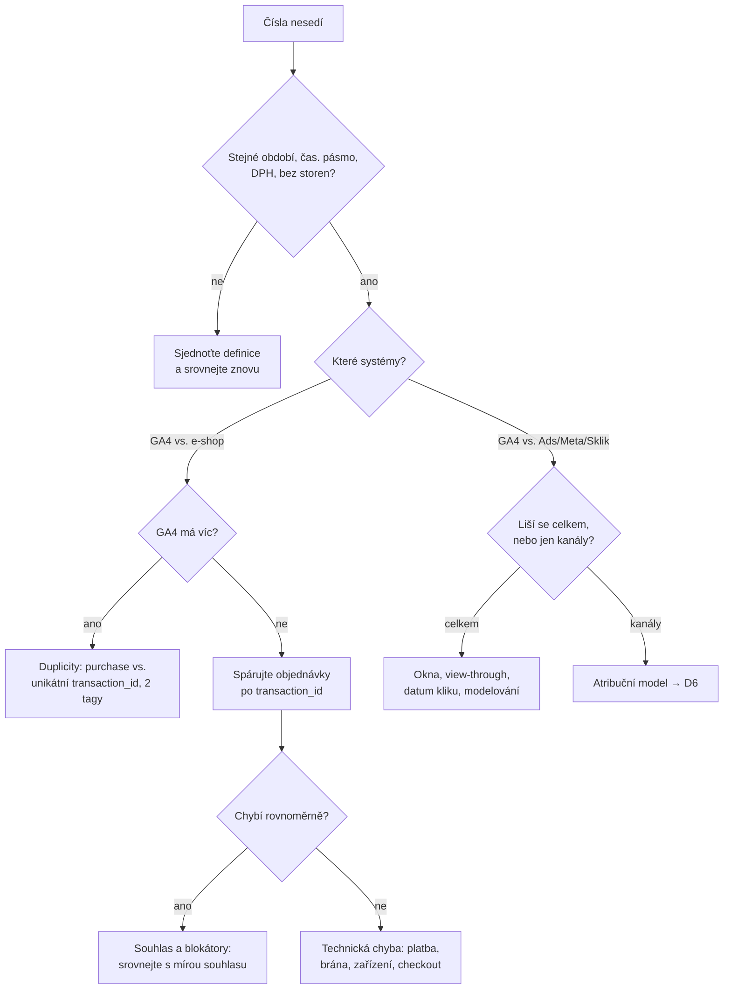
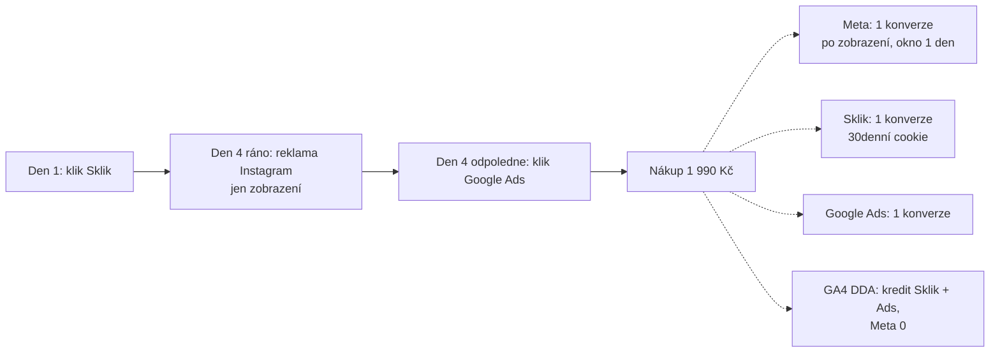

# D2: Proč nesedí čísla: GA4 vs. Google Ads vs. Meta vs. Sklik vs. administrace e-shopu – brief
> Cluster: D. GA4 & kvalita dat · URL: /blog/proc-nesedi-data · Formát: problémový článek + diagnostický postup · Priorita: měsíc 1 · Cílová LP: /sluzby/audit-mereni (sekundárně /sluzby/mereni-konverzi) · Rozsah článku: 3 000–3 800 slov

## 1. Meta
- **H1:** Proč nesedí čísla v GA4, Google Ads, Meta a v e-shopu
- **SEO title (58 zn.):** Proč nesedí data v GA4, Ads a e-shopu – 20 příčin | datalayer.cz
- **Meta description (151 zn.):** GA4 ukazuje jiné tržby než e-shop a Meta víc nákupů než GA4? 20 příčin rozdílů, rozhodovací postup diagnostiky a kdy je rozdíl normální. S SQL a kódem.
- **URL:** /blog/proc-nesedi-data
- **Klíčová slova:**
  - hlavní (problémové, nízký objem, vysoká hodnota): *ga4 nesedí tržby e-shop* (0, SERP existuje), *proč se liší data v ga4 a google ads* (0), *proč vám nesedí data v google analytics* (10)
  - vedlejší: *not provided google analytics* (80 – jen okrajově, vysvětlit, že v GA4 jde o „(not set)“), *google analytics shopify conversion tracking*, *data discrepancies in ga4 and looker studio* (0)
  - long-tail: „GA4 ukazuje méně objednávek než e-shop“, „Meta hlásí víc nákupů než GA4“, „Google Ads konverze nesedí s GA4“, „unassigned GA4“, „(not set) GA4“, „thresholding GA4“
  - PAA pro „proč se liší data v ga4 a google ads“ jsou irelevantní (o Ads obecně) → prostor pro vlastní FAQ.
- **Záměr:** problémový / diagnostický. Čtenář má konkrétní rozdíl v číslech a chce vědět, jestli je chyba v měření.
- **Čtenář:** majitel nebo e-commerce manažer e-shopu (hlavní), PPC specialista, finanční ředitel, který „nevěří marketingu“. B2B varianta: leady v CRM vs. GA4 (krátká sekce + odkaz E1/E3).

## 2. Analýza SERP a konkurence
- *ga4 nesedí tržby e-shop*: 1. lamapixel.com (2. 9. 2026, ~2 000 slov, 6 příčin, bez Meta/Sklik, bez kódu), 2. ludekskop.cz (31. 8. 2026, ~2 300 slov, pásma „normálnosti“ 5–30 % z jednoho Shoptet e-shopu + zahraničních studií, bez rozhodovacího diagramu a kódu), 3. gameplan.cz (7 chyb), 4. webglobe, 5. support.google.com (úrovně e-commerce), 6. khoder.cz, 7. blog.newlogic.cz (13 důvodů), 8. marketingasap.cz, 9. unikum.cz.
- *proč se liší data v ga4 a google ads*: marketingasap.cz, lukasuhlir.cz, mindverve.ai, support Google Ads, reddit, tmrw.marketing, fastcentrik.cz, conviu.com.
- **Mezera:** nikdo nesrovnává **všech pět systémů najednou** (GA4, Google Ads, Meta, Sklik, administrace) v jedné tabulce pravidel; nikdo nemá **aktuální změny Meta 2026** (nová definice kliknutí, engage-through, odstranění 7d/28d view z API); nikdo nedává **párování po transaction_id** (SQL) jako hlavní diagnostický nástroj; Sklik a jeho modelované konverze chybí úplně.
- **Čím přeskočíme:** (1) srovnávací rámec „co který systém počítá“; (2) tabulka 20 příčin se směrem odchylky a postupem; (3) rozhodovací diagram; (4) SQL párování objednávek a kód proti duplicitám; (5) poctivá sekce „kdy je rozdíl normální“ – metodika výpočtu vlastního očekávání místo vymyšlených benchmarků.

## 3. Otázky, na které musí článek odpovědět
1. Proč GA4 ukazuje méně objednávek a tržeb než administrace e-shopu?
2. Proč může GA4 ukázat **víc** objednávek než e-shop?
3. Proč Google Ads hlásí jiný počet konverzí než GA4, i když je import z GA4?
4. Proč Meta hlásí víc nákupů než GA4 i než e-shop?
5. Proč se Sklik neshoduje s GA4 (a co jsou modelované konverze Skliku)?
6. Proč je součet konverzí ze všech reklamních systémů vyšší než počet objednávek?
7. Jak velký rozdíl je normální?
8. Jak zjistit, které objednávky v GA4 chybějí?
9. Co znamená „(not set)“ a „Unassigned“ a proč tam padají objednávky?
10. Co je prahování (thresholding) a vzorkování a jak zkreslují čísla?
11. Jak ovlivňuje rozdíly DPH, doprava, měna a časové pásmo?
12. Kterému číslu tedy věřit při reportingu?

## 4. Rychlá odpověď (hotový text, 59 slov)
> Čísla se liší, protože každý systém počítá něco jiného: e-shop všechny objednávky, GA4 jen nákupy změřené v prohlížeči se souhlasem, reklamní systémy konverze připsané své reklamě podle vlastních oken a modelů – Google Ads ke dni kliknutí, Meta ke dni zobrazení. Rozdíl je chyba, až když nejde vysvětlit souhlasem, atribucí a definicí metrik.

## 5. Osnova s obsahem odpovědí

### H2 Nejdřív srovnávejte srovnatelné
- **Sdělení:** Polovina „chyb“ zmizí, když srovnáte stejnou metriku, období, časové pásmo a definici tržby.
- **Obsah:** tabulka 6.1 „Co počítá který systém“. Pravidla srovnání: stejné období ve stejném časovém pásmu; tržby bez DPH vs. bez DPH (Shoptet do GA4 posílá **hodnotu objednávky bez DPH, bez dopravy a platby**, dopravu včetně DPH zvlášť – podpora.shoptet.cz); jen webové objednávky (bez telefonu, B2B portálu, marketplace); storna a neuhrazené objednávky odděleně; počkat 48 h (zpracování GA4 24–48 h, import do Ads až 24 h, DDA může konverzi přeatribuovat až 7 dní).
- **B2B odbočka:** leady v GA4 (`generate_lead`) vs. CRM: duplicitní odeslání, spam, telefonické poptávky, sloučené kontakty → E1, E3.

### H2 20 nejčastějších příčin rozdílů
- **Obsah:** hlavní tabulka 6.2 (kompletní). V textu rozvést 6 nejdůležitějších skupin po 80–120 slovech: **souhlas a blokátory**, **atribuce a okna**, **datum konverze vs. kliknutí/zobrazení**, **definice tržby (DPH, doprava, storna, měna)**, **technické chyby (duplicity, chybějící děkovací stránka)**, **reportovací omezení GA4 (prahování, vzorkování, (not set), zpoždění)**.
- **Klíčová fakta do textu:**
  - Google Ads vykazuje konverze **k datu a času kliknutí**, GA4 k datu konverze; cookies Google Ads platí 90 dní od kliku, cookies Analytics až 2 roky (support Google Ads 2375435). Google Ads má sloupce „Konverze (podle času konverze)“ (support 9549009) – používat při srovnání s GA4.
  - Okna Google Ads: kliknutí 1–90 dní (výchozí 30), engaged-view výchozí 3 dny, view-through výchozí 1 den (support 3123169).
  - Meta (2026): výchozí 7 dní po kliknutí + 1 den po „engage-through“ + 1 den po zobrazení; od **března 2026** se kliknutím rozumí jen klik na odkaz reklamy, ostatní interakce spadají do engage-through (jonloomer.com, 2026 – ověřit v Meta Business Help); okna `7d_view` a `28d_view` přestala být **12. 1. 2026** dostupná v Ads Insights API (developers.facebook.com); API standardně vykazuje akce k času zobrazení (`action_report_time=impression`).
  - Sklik: identifikace přes cookie s platností **30 dní**, konverze se započítá „v den měření“ (napoveda.sklik.cz/en/conversion); **modelované konverze** jsou od 19. 4. 2022 součástí všech přehledů, na úrovni jednotlivých reklam a cílení ale ne → součty řádků ≠ celkový řádek (napoveda.sklik.cz, modelled conversions).
  - GA4 behaviorální modelování jen při splnění prahů (1 000 událostí/den bez souhlasu 7 dní + 1 000 uživatelů/den se souhlasem 7 z 28 dní) a identitě Blended; Google Ads modeluje konverze až od **700 kliknutí za 7 dní na zemi a skupinu domén** (support Ads 10548233).
  - GA4 deduplikuje `purchase` se stejným `transaction_id` **jen u webových streamů**; prázdné `transaction_id=""` vede ke sloučení všech takových nákupů (support 12313109).
  - Měny: GA4 převádí kurzem předchozího dne; změna měny služby přepočítá i historii (support 9796179).
  - Prahování: skryté řádky u demografie a dotazů z vyhledávání, indikátor kvality dat v přehledu (support 9383630); vzorkování v průzkumech nad **10 mil. událostí na dotaz** u standardní služby (support 12229528).
  - `(not set)`/Unassigned: chybějící `session_start` (značka mimo Initialization, chybné použití `consent default`), neúplné UTM, nepropojený Google Ads (support 13504892).

### H2 Proč si každá platforma připisuje „své“ konverze
- **Sdělení:** Součet konverzí z Ads + Meta + Sklik je téměř vždy vyšší než počet objednávek – nejde o chybu, ale o to, že každá platforma vidí jen své body kontaktu.
- **Obsah:** ukázkový příklad (ilustrativní): zákazník klikl na Sklik, o 3 dny později ráno uviděl reklamu na Instagramu (bez kliknutí) a odpoledne klikl na Google Ads a koupil → 1 objednávka, 3 připsané konverze (Sklik v 30denním okně, Meta po zobrazení v 1denním okně, Google Ads po kliknutí); GA4 (data-driven) rozdělí kredit mezi Sklik a Google Ads, Meta v GA4 nedostane nic, protože zobrazení bez prokliku GA4 nevidí. Diagram 6.4. Detail atribuce → D6.

### H2 Diagnostika krok za krokem (rozhodovací diagram)
- **Obsah:** diagram 6.3 + 7 kroků:
  1. **Sjednoťte definice** (tabulka 6.1, období, časové pásmo, DPH).
  2. **Je GA4 > administrace?** → vždy hledejte duplicity: počet `purchase` vs. unikátní `transaction_id` (Průzkum nebo SQL 6.5), dva tagy GA4 (integrace platformy + GTM), reload děkovací stránky, návrat z brány na děkovací stránku dvakrát.
  3. **Spárujte objednávky po ID** (SQL 6.5 nebo export z GA4 průzkumu „ID transakce“ + export z administrace): které objednávky chybí? Seskupte podle **platební metody, dopravy, zařízení/prohlížeče, zdroje**.
  4. **Chybí rovnoměrně?** → souhlas a blokátory. Porovnejte s mírou souhlasu z CMP (Shoptet má statistiky souhlasů, Upgates je neukládá).
  5. **Chybí nerovnoměrně?** → technická chyba: platba převodem bez děkovací stránky, konkrétní brána nevrací zákazníka, iOS/Safari, nový checkout, chyba JS.
  6. **Liší se tržba při stejném počtu?** → DPH, doprava, slevové kupóny, měna, `value` ≠ součet položek.
  7. **Liší se reklamní systém?** → přepněte Google Ads na sloupce podle času konverze, srovnejte stejná okna (Meta 7d click bez view), modelované konverze Skliku/Ads, teprve pak atribuce (D6).
- **Kód:** 6.5 (SQL párování), 6.6 (purchase jen jednou).

### H2 Kdy je rozdíl normální
- **Sdělení:** Univerzální „normální procento“ neexistuje; spočítejte si vlastní očekávání a sledujte trend.
- **Obsah:**
  - Doložené: Shoptet uvádí, že před novými cookie lištami (do 1. 1. 2022) se GA a e-shop „zpravidla rozcházely maximálně o 10 %“ a po zavedení může být rozdíl vyšší (podpora.shoptet.cz/nastaveni-google-analytics – tvrzení platformy, ne nezávislá studie).
  - **Metodika vlastního očekávání:** očekávané pokrytí GA4 ≈ podíl nakupujících s analytickým souhlasem (z CMP; nakupující souhlasí často jinak než průměrný návštěvník – ověřte) − podíl blokátorů/technických ztrát + modelování (pokud běží). Pak rozdíl vůči očekávání sledujte týdně; skok o několik p. b. bez změny lišty = chyba.
  - **Orientační pásma – z praxe, neověřeno, ověřte vlastními daty** (v článku označit boxem „Z naší praxe“ a doplnit vlastní data klienta `[DOPLNIT: medián rozdílu z auditů datalayer.cz]`): GA4 vs. zaplacené webové objednávky do ~10 % = velmi dobrý stav; ~10–25 % = běžné u opt-in lišty; nad ~25–30 % nebo náhlá změna = hledat chybu; **GA4 víc než administrace = vždy chyba** (po odečtení storen).
  - Reklamní systémy vs. GA4: pásmo neuvádět; platformy obvykle hlásí víc (view-through, cross-device, jiná okna). Sledovat **poměr** platforma/GA4 v čase.
- Pozn.: konkurence (ludekskop.cz) uvádí pásma 5–30 % z jednoho e-shopu a zahraničních studií – necitovat jako fakt.

### H2 Kterému číslu věřit při reportingu
- **Obsah:** pravidlo tří vrstev: **tržby a objednávky** = administrace/ERP (zdroj pravdy pro finance); **podíl kanálů a chování** = GA4 (jedním modelem, konzistentně); **optimalizace kampaní** = data platforem (nikdy nesčítat). Doplnit MER (tržby / celkové náklady na marketing) jako metriku nezávislou na atribuci → G3, D6. Technické zlepšení pokrytí: consent (A1), server-side a CAPI (B1, B5), rozšířené konverze (E2), import storen do Ads (Shoptet Premium má CSV storen – D4).

### H2 FAQ (kap. 9)

## 6. Vizuály

### 6.1 Tabulka „Co počítá který systém“ (kompletní obsah)
| Systém | Co počítá | Ke kterému dni | Atribuce | Okno (výchozí) | Modelování | Hodnota |
|---|---|---|---|---|---|---|
| Administrace / ERP | všechny vytvořené objednávky (vč. neuhrazených, telefonních) | vytvoření objednávky | žádná | – | ne | dle nastavení (s/bez DPH) |
| GA4 | nákupy změřené v prohlížeči (souhlas, bez blokace) | den nákupu, čas. pásmo služby | akvizice: poslední nepřímé kliknutí (relace); Inzerce: model služby | 90 dní (ostatní klíčové události) | behaviorální, jen při splnění prahů a identitě Blended | `value` z implementace (Shoptet bez DPH a dopravy) |
| Google Ads | konverze po kliknutí/zhlédnutí reklamy Google | den kliknutí (sloupce „podle času konverze“ volitelně) | data-driven / last click v rámci Google | klik 30 dní (1–90), engaged-view 3 dny, zobrazení 1 den | konverzní modelování (od 700 kliků/7 dní/země) | z tagu / importu |
| Meta | konverze po kliku na odkaz, interakci, zobrazení | den zobrazení reklamy (API výchozí) | vlastní (standardní / inkrementální) | 7 dní klik + 1 den engage-through + 1 den zobrazení | ano (modelované události) | z pixelu / CAPI |
| Sklik | konverze po kliknutí na Sklik | den měření konverze | v rámci Skliku | cookie 30 dní | modelované konverze v součtech (od 4/2022) | z konverzního kódu |

### 6.2 Tabulka „20 příčin rozdílů“ (kompletní obsah)
| # | Příčina | Týká se | Typický směr | Jak poznat | Co s tím |
|---|---|---|---|---|---|
| 1 | Odmítnutý souhlas | GA4, Ads, Meta, Sklik | GA4 < e-shop | rozdíl rovnoměrný napříč platbami/zařízeními; koreluje s mírou souhlasu | správný Consent Mode v2 (advanced dle právního posouzení), modelování; A1 |
| 2 | Blokátory reklam, ITP | GA4, pixely | GA4 < e-shop | vyšší ztráta u Safari/Firefox, technicky zdatného publika | first-party měření, sGTM (vždy se souhlasem); B1 |
| 3 | Atribuční model | GA4 vs. platformy | rozdělení kanálů | celkový počet sedí, kanály ne | jeden model pro reporting; D6 |
| 4 | Atribuční okna | Ads, Meta, Sklik | platformy > GA4 | změna okna mění čísla | srovnávat stejná okna |
| 5 | View-through / engage-through | Meta, Ads (video, display) | platformy > GA4 | konverze bez kliknutí | v reportingu oddělit „po kliknutí“ |
| 6 | Datum kliknutí/zobrazení vs. konverze | Ads, Meta | rozdíl po dnech, sedí za delší období | rozdíly mizí za 30–90 dní | Ads sloupce „podle času konverze“; srovnávat měsíce se zpožděním |
| 7 | Cross-device | Ads, Meta | platformy > GA4 | přihlášení uživatelé, mobil → desktop | User-ID v GA4; akceptovat |
| 8 | Modelované konverze | Ads, Sklik, Meta, GA4 | platformy > GA4 | modelované konverze v součtech | nesčítat napříč platformami |
| 9 | Storna, vratky, neuhrazené | e-shop vs. vše | e-shop ≠ GA4 | rozdíl v tržbách, ne v počtu nákupů | `refund` do GA4, storna do Ads (Shoptet Premium CSV); F4 |
| 10 | DPH, doprava, platba | GA4 vs. e-shop | tržby ≠ | počet sedí, hodnota ne | definovat `value` v měřicím plánu; C5 |
| 11 | Měna | GA4 | tržby ≠ | vícměnový e-shop, chybí `currency` | `currency` u každé události s hodnotou |
| 12 | Duplicitní transakce | GA4, pixely | GA4 > e-shop | `purchase` > unikátní `transaction_id` | odeslat jen jednou (6.6); jeden tag |
| 13 | Chybějící děkovací stránka | GA4, pixely | GA4 < e-shop | chybí u převodu, dobírky, konkrétní brány | purchase z backendu (MP / sGTM); B2 |
| 14 | Platební brána jako zdroj | GA4 | kanály ≠ | gopay/comgate v Relace: zdroj | nevyžádaná doporučení; D1 |
| 15 | Prahování (thresholding) | GA4 | skryté řádky | indikátor kvality dat v přehledu | delší období, méně dimenzí, BigQuery |
| 16 | Vzorkování v průzkumech | GA4 | odhad místo přesného čísla | ikona vzorkování; >10 mil. událostí | standardní přehledy, BigQuery |
| 17 | (not set) / Unassigned | GA4 | kanály ≠ | vysoký podíl Unassigned | značka na Initialization, UTM, propojení Ads; D5 |
| 18 | Časová pásma | GA4, Ads, e-shop | rozdíly na hranách dne | různé pásmo služby/účtu | sjednotit na Praha |
| 19 | Zpoždění zpracování | GA4, Ads | „včerejšek“ nesedí | data se mění 24–48 h, DDA až 7 dní | reportovat s odstupem |
| 20 | Filtry, testovací a interní objednávky | GA4, e-shop | obojí | interní IP, testy, staging | filtry dat, označit testy v administraci |

### 6.3 Rozhodovací diagram diagnostiky

**Finální SVG:** svislý rozhodovací strom, kosočtverce = otázky (obrys cyan `#00ffff`), obdélníky = závěry (`#0b1a30`, pravý okraj oranžový `#ff7400` u „chyba“, cyan u „normální jev“). Legenda: „chyba v měření“ vs. „vlastnost systému“. Mobil: zúžit na jednu větev s rozbalovacími uzly (akordeon). Interaktivní verze: klik na uzel = vysvětlení + odkaz na řádek tabulky 6.2 (`diagram_interaction`).

### 6.4 Diagram „1 objednávka, 3 připsané konverze“ (ukázkový příklad)

SVG: časová osa vlevo, vpravo čtyři „účtenky“ se stejnou objednávkou; součet „3 konverze / 1 objednávka“ velkým číslem. Animace: konverze „se rozmnoží“ ve 3 kopie (respektovat reduced motion).

### 6.5 SQL – párování objednávek (BigQuery, komentované)
```sql
-- 1) Kolik purchase událostí vs. unikátních transakcí po dnech (duplicity)
SELECT
  PARSE_DATE('%Y%m%d', event_date) AS den,          -- event_date je v čas. pásmu služby
  COUNT(*) AS purchase_udalosti,
  COUNT(DISTINCT ecommerce.transaction_id) AS unikatni_transakce,
  ROUND(SUM(ecommerce.purchase_revenue), 0) AS trzby_ga4
FROM `projekt.analytics_123456789.events_*`
WHERE event_name = 'purchase'
  AND _TABLE_SUFFIX BETWEEN '20260901' AND '20260930'
GROUP BY den
ORDER BY den;

-- 2) Které objednávky z e-shopu v GA4 chybí (tabulka orders = export z administrace)
WITH ga4 AS (
  SELECT DISTINCT ecommerce.transaction_id AS order_id
  FROM `projekt.analytics_123456789.events_*`
  WHERE event_name = 'purchase'
    AND _TABLE_SUFFIX BETWEEN '20260901' AND '20261002'  -- +2 dny rezerva
)
SELECT o.payment_method, o.device, COUNT(*) AS chybi_v_ga4
FROM `projekt.eshop.orders` AS o
LEFT JOIN ga4 AS g ON g.order_id = o.order_id
WHERE DATE(o.created_at, 'Europe/Prague') BETWEEN '2026-09-01' AND '2026-09-30'
  AND o.channel = 'web' AND o.status != 'cancelled'
  AND g.order_id IS NULL
GROUP BY 1, 2
ORDER BY chybi_v_ga4 DESC;
```
Poznámka: názvy tabulky `orders` a sloupců jsou ukázkové. Bez BigQuery: průzkum GA4 s dimenzí „ID transakce“ → export CSV → VLOOKUP s exportem objednávek.

### 6.6 Kód – purchase jen jednou (děkovací stránka)
```html
<script>
  // Nejlepší řešení: backend vykreslí purchase jen při prvním zobrazení
  // (příznak "tracking_sent" u objednávky). Pojistka v prohlížeči:
  (function () {
    var orderId = '2026001234';                 // z backendu, nikdy prázdné
    var key = 'dl_purchase_' + orderId;
    try { if (localStorage.getItem(key)) return; } catch (e) {}
    window.dataLayer = window.dataLayer || [];
    dataLayer.push({ ecommerce: null });        // vyčistit předchozí objekt
    dataLayer.push({
      event: 'purchase',
      ecommerce: {
        transaction_id: orderId,
        value: 1644.63,          // bez DPH, bez dopravy – dle měřicího plánu
        tax: 345.37, shipping: 82.64, currency: 'CZK',
        items: [{ item_id: 'SKU-123', item_name: 'Ukázkový produkt', price: 1644.63, quantity: 1 }]
      }
    });
    try { localStorage.setItem(key, '1'); } catch (e) {}
  })();
</script>
```

### 6.7 Infografika (LinkedIn 1080×1350 + responzivní verze)
„Proč má vaše 1 objednávka 4 různá čísla“: 5 sloupců (E-shop / GA4 / Google Ads / Meta / Sklik), u každého ikona, „počítá“, „ke dni“, „okno“. Dole lišta „Zdroj pravdy pro tržby = e-shop; pro kanály = GA4; pro optimalizaci = platformy“. Brand: tmavé pozadí, čísla Roboto Mono, oranžové zvýraznění rozdílů.

## 7. Fakta a zdroje
| Tvrzení | Zdroj | Ověřeno | Riziko zastarání |
|---|---|---|---|
| Ads vykazuje k datu kliknutí, GA4 k datu konverze; cookies Ads 90 dní, GA až 2 roky; import do Ads až 24 h | support.google.com/google-ads/answer/2375435 | 10/2026 | nízké |
| Sloupce „Konverze (podle času konverze)“ | support.google.com/google-ads/answer/9549009 | 10/2026 | nízké |
| Okna Ads: klik 1–90 (30), engaged-view 3, view-through 1 den | support.google.com/google-ads/answer/3123169 | 10/2026 | střední |
| Modelování Ads od 700 kliknutí / 7 dní / země a skupina domén | support.google.com/google-ads/answer/10548233 | 10/2026 | střední |
| Meta výchozí 7d klik + 1d engage-through + 1d zobrazení; nová definice kliku 3/2026; inkrementální model | jonloomer.com/meta-ads-attribution-2026 (sekundární) – ověřit ve facebook.com/business/help | 10/2026 | vysoké |
| `7d_view`, `28d_view` v Ads Insights API ukončeny 12. 1. 2026 | developers.facebook.com/blog/post/2025/10/16/ads-insights-api-metric-availability-updates | 10/2026 | nízké |
| API `action_report_time` výchozí `impression` | developers.facebook.com/docs/marketing-api/insights/parameters | 10/2026 | střední |
| Sklik: cookie 30 dní, konverze v den měření | napoveda.sklik.cz/en/conversion | 10/2026 | střední |
| Sklik modelované konverze od 19. 4. 2022, ne na úrovni reklam | napoveda.sklik.cz/en/performance-evaluation/conversion/modelled-conversions | 10/2026 | střední |
| Modelování GA4: prahy, advanced, Blended | support.google.com/analytics/answer/11161109 | 10/2026 | střední |
| Deduplikace transaction_id jen web; `""` se slučuje | support.google.com/analytics/answer/12313109 | 10/2026 | nízké |
| Měna: kurz předchozího dne; změna zpětně | support.google.com/analytics/answer/9796179 | 10/2026 | nízké |
| Prahování | support.google.com/analytics/answer/9383630 | 10/2026 | nízké |
| Vzorkování 10 mil. událostí/dotaz | support.google.com/analytics/answer/12229528 | 10/2026 | střední |
| (not set)/Unassigned příčiny | support.google.com/analytics/answer/13504892 | 10/2026 | nízké |
| Zpracování 24–48 h | support.google.com/analytics/answer/11198161 | 10/2026 | nízké |
| DDA přeatribuce až 7 dní, přímá návštěvnost bez kreditu | support.google.com/analytics/answer/10596866 | 10/2026 | nízké |
| Shoptet: hodnota bez DPH, dopravy a platby; „max. 10 %“ před 2022 | podpora.shoptet.cz/nastaveni-google-analytics | 10/2026 | střední |

## 8. Interní odkazy a CTA
- **Cílová LP:** /sluzby/audit-mereni. **CTA box** (za diagnostickým postupem): nadpis „Spárujeme objednávky a najdeme, kde data utíkají“ · text „V auditu porovnáme GA4, reklamní systémy a administraci po jednotlivých objednávkách a dostanete seznam příčin seřazený podle dopadu.“ · tlačítko `[ Objednat audit měření ]`.
- **Sekundární CTA** (sekce Reporting): /sluzby/mereni-konverzi – „Ať Ads, Meta i Sklik vidí stejné objednávky“.
- **Související:** D1, D3 (checklist), D4 (platformy), D5 (UTM), D6 (atribuce), A1, A6 (odmítnutí cookies), B1, B5 (CAPI), B6 (Seznam EM), C2, E2, E3, F1, F4 (marže a vratky), G3, H2.
- **Slovník:** Atribuční model, Thresholding, (not set)/Unassigned, Modelování konverzí, Deduplikace, GCLID, Consent Mode.
- **Kontaktní blok:** `form_id: blog`, téma `audit`, H2 „Řešíte totéž u sebe?“, placeholder „Např. GA4 ukazuje o 30 % méně objednávek než e-shop a nevíme proč…“.

## 9. FAQ pro schema
1. **Proč GA4 ukazuje méně objednávek než e-shop?** GA4 změří jen nákupy, u kterých prohlížeč načetl měřicí kód a návštěvník udělil souhlas. Část zákazníků cookies odmítne, část používá blokátory a některé platby se nevrací na děkovací stránku. Spárujte objednávky po ID transakce: pokud chybí rovnoměrně, jde o souhlas; pokud u jedné platby nebo zařízení, je to technická chyba.
2. **Proč může mít GA4 víc objednávek než e-shop?** Téměř vždy jde o duplicity: dvě instalace GA4 (integrace platformy a GTM), opakované načtení děkovací stránky nebo návrat z platební brány. Porovnejte počet událostí purchase s počtem unikátních ID transakcí. GA4 deduplikuje stejné ID jen u webových streamů, a jen když ID není prázdné.
3. **Proč se liší konverze v Google Ads a GA4?** Google Ads připisuje konverzi ke dni kliknutí, GA4 ke dni nákupu. Ads navíc počítá jen body kontaktu s reklamami Google, používá vlastní okna a může zahrnovat konverze po zhlédnutí a modelované konverze. Pro srovnání použijte v Ads sloupce podle času konverze a stejné období.
4. **Proč Meta hlásí víc nákupů než GA4?** Meta připisuje konverze i po zobrazení a interakci s reklamou, ne jen po kliknutí, vykazuje je ke dni zobrazení a dokáže propojit zařízení přihlášeného uživatele. GA4 naopak Meta připíše nákup jen tehdy, když návštěva přišla z prokliku s UTM parametry.
5. **Jaký rozdíl mezi GA4 a e-shopem je normální?** Univerzální číslo neexistuje, záleží hlavně na míře souhlasu s cookies. Spočítejte si očekávané pokrytí z dat cookie lišty a sledujte, jestli se rozdíl mění. GA4 s více objednávkami než e-shop je vždy chyba; náhlá změna rozdílu bez změny lišty také.
6. **Kterému číslu mám věřit?** Pro tržby a počet objednávek administraci e-shopu nebo ERP. Pro podíl kanálů a chování návštěvníků GA4 s jedním atribučním modelem. Čísla reklamních systémů používejte k optimalizaci kampaní, ale nikdy je nesčítejte.

## 10. Poznámky pro autora
- **Meta fakta (2026) ověřit přímo v Meta Business Help** – WebFetch na facebook.com je blokován; citovat oficiální stránky „About attribution settings“, „About click-through attribution“ po ručním ověření. Pokud se liší, upravit tabulku 6.1 a FAQ 4.
- **Pásma „normálního rozdílu“** jsou z praxe a neověřená; v článku je dát do boxu „Z naší praxe“ a nahradit vlastními daty `[DOPLNIT: anonymizovaný medián rozdílu GA4 vs. administrace z auditů klienta + počet auditů]`. Bez dat raději jen metodiku.
- Shoptetovo tvrzení „max. 10 %“ uvádět s atribucí („podle nápovědy Shoptetu“).
- SQL ověřit na testovacím exportu (pole `ecommerce.transaction_id`, `ecommerce.purchase_revenue`).
- Nepoužívat „100 % dat“; u server-side zmínit, že funguje jen v rámci souhlasu.
- Revize: 6 měsíců (Meta a Ads mění okna často). Autor: Vít Novotný; recenze PPC specialistou (Meta/Sklik pohled).
