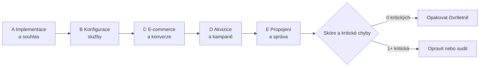

# D3: Checklist kvality dat v GA4: 25 kontrol – brief
> Cluster: D. GA4 & kvalita dat · URL: /blog/ga4-checklist-kvality-dat · Formát: checklist + lead magnet (PDF a Google Sheet) · Priorita: měsíc 1 · Cílová LP: /sluzby/audit-mereni · Rozsah článku: 2 200–2 800 slov (jádro = tabulka)

## 1. Meta
- **H1:** Checklist kvality dat v GA4: 25 kontrol, které odhalí chyby
- **SEO title (56 zn.):** GA4 checklist: 25 kontrol kvality dat (PDF) | datalayer.cz
- **Meta description (150 zn.):** 25 kontrol GA4 s postupem „jak zkontrolovat“ a „jak opravit“: consent, duplicity, platební brány, Unassigned, Google Ads. Ke stažení jako PDF i tabulka.
- **URL:** /blog/ga4-checklist-kvality-dat
- **Klíčová slova:** hlavní *ga4 checklist* / *checklist ga4* (0, strategické); vedlejší *audit google analytics* (10), *google analytics audit* (10), *ga4 audit* (0, SERP existuje, related „GA4 audit checklist“), *audit google analytics 4* (0), *free google analytics audit* (0), *jak zkontrolovat google analytics* (10, obsahový plán); podpůrné pro LP *audit webové analytiky* (70). PAA „ga4 audit“ jsou anglické a obecné („What does GA4 mean?“) → vlastní FAQ.
- **Záměr:** informační s komerčním přesahem (self-audit → zjištění, že oprava potřebuje odborníka).
- **Čtenář:** marketingový manažer / e-commerce manažer / PPC specialista s přístupem Editor do GA4; agentura převzala klienta; velká firma před redesignem. Segmenty: e-shop (kontroly 15–19), B2B (kontrola 20), velká firma (24–25).

## 2. Analýza SERP a konkurence
- *ga4 audit*: ga4auditor.com (nástroj), vidi-corp.com (12bodový checklist EN), visibility.cz (LP), rajtmajer.cz (LP), Workspace Marketplace (doplněk), LinkedIn, mirandamedia.cz (health check), ga4-auditor.dev, trackingplan.com. *audit google analytics*: visibility, rajtmajer, vidi-corp, trackingauditor, ga4auditor, causalfunnel, roardigital, analytify.
- **Český obsah:** nazakladedat.cz/checklist-spravneho-nastaveni-ga4 (~1 700 slov, 30 otázek ve 3 blocích; bez sloupce „jak opravit“, bez závažnosti, bez stažení, bez novinek 2026).
- **Mezera:** česky neexistuje checklist s **postupem kontroly i opravy, závažností a stažitelnou tabulkou**; zahraniční nástroje kontrolují konfiguraci, ne **soulad s administrací** ani consent podle českých pravidel.
- **Čím přeskočíme:** 25 kontrol v 5 oblastech, každá s „kde přesně kliknout“, „jak opravit“, závažností a odkazem na hloubkový článek; PDF + Google Sheet se skóre; aktualizace 2026 (filtry hostname, konverze vs. klíčové události, diagnostika GBRAID/gad_); jasná hranice „kdy checklist nestačí“.

## 3. Otázky, na které musí článek odpovědět
1. Jak zjistím, jestli GA4 měří správně?
2. Kolik času kontrola zabere a jaký přístup potřebuji?
3. Které chyby jsou kritické (zkreslují rozhodování nebo bidding) a které kosmetické?
4. Jak zkontroluji, že GA4 respektuje cookie lištu?
5. Jak najdu duplicitní transakce?
6. Proč mám vysoký podíl Unassigned?
7. Jak ověřím propojení s Google Ads a že se neztrácí gclid?
8. Jak často kontrolu opakovat?
9. Co dělat, když najdu víc kritických chyb?
10. Kdy je lepší objednat audit měření?

## 4. Rychlá odpověď (hotový text, 55 slov)
> Kvalitu dat v GA4 ověříte 25 kontrolami v pěti oblastech: implementace a souhlas, konfigurace služby, e-commerce a konverze, akvizice a kampaně, propojení a správa. Nejdřív opravte kritické chyby – duplicitní měření, consent, transakce bez ID a rozdíl proti administraci. Kontrola zabere zhruba hodinu; opakujte ji po každé změně webu.

## 5. Osnova s obsahem odpovědí

### H2 Jak checklist používat
- Potřebujete roli **Editor** v GA4 (filtry, streamy), přístup do GTM (náhled), Google Ads (auto-tagging) a export objednávek za 30 dní.
- Postup: projděte kontroly v pořadí (implementace → konfigurace → data), u každé zapište stav **OK / Chyba / Neověřeno / Netýká se**.
- **Závažnost:** *Kritická* = data nebo bidding jsou špatně, případně právní riziko; *Vysoká* = systematické zkreslení; *Střední* = omezuje analýzu; *Nízká* = kosmetika.
- Čas: ~60 min pro e-shop, ~40 min pro web bez e-commerce *(odhad z praxe)*.

### H2 A. Implementace a souhlas (kontroly 1–6)
Sdělení: Když nesedí základ, nemá smysl řešit reporty. Text ke každé kontrole 40–80 slov (vychází z tabulky 6.1), u kontroly 4 mini-návod s DevTools (6.4).

### H2 B. Konfigurace služby (7–14)
Sdělení: nastavení, které GA4 nedělá samo a které se nedá opravit zpětně (filtry, retence, měna). Odkaz na D1 u každé kontroly.

### H2 C. E-commerce a konverze (15–20)
Sdělení: nejdražší chyby – ovlivňují bidding Google Ads a důvěru vedení. Kontroly 16–17 odkazují na D2 (SQL párování). Kontrola 20 pro B2B (leady vs. CRM, E1).

### H2 D. Akvizice a kampaně (21–23)
Sdělení: bez čistých zdrojů nefunguje atribuce. Odkaz D5 (UTM), D6.

### H2 E. Propojení a správa (24–25)
Sdělení: data, která nejsou propojená nebo spravovaná, časem zastarají.

### H2 Jak výsledky vyhodnotit a co opravit nejdřív
- Skóre = počet OK / (25 − „netýká se“). Pořadí oprav: (1) kritické, které ovlivňují **purchase a consent** (1, 3, 4, 6, 15, 16, 17, 23); (2) vysoké, které ovlivňují **zdroje** (9, 10, 11, 21); (3) zbytek.
- Opakování: po každém nasazení webu/checkoutu, změně cookie lišty, změně platební brány; jinak čtvrtletně. Tip: anomálie a vlastní upozornění v GA4 na pokles `purchase`.

### H2 Kdy checklist nestačí
- Checklist ověří konfiguraci a symptomy. Nestačí, když: rozdíl proti administraci > očekávání a nevíte proč; měříte více platforem (Ads, Meta CAPI, Sklik, Heureka); řešíte server-side nebo dataLayer od nuly; potřebujete dokumentaci pro vývojáře. → CTA audit (H2 článek „co obsahuje audit“).

### H2 Stáhněte si checklist (PDF a Google Sheet)
- Blok ke stažení (spec. 6.5) dvakrát: pod rychlou odpovědí a na konci.

## 6. Vizuály

### 6.1 Hlavní tabulka „25 kontrol“ (kompletní obsah – i podklad pro PDF a Sheet)
| # | Kontrola | Jak zkontrolovat | Jak opravit | Závažnost |
|---|---|---|---|---|
| **A** | **Implementace a souhlas** | | | |
| 1 | GA4 je na webu právě jednou | GTM náhled / Tag Assistant: jeden požadavek `collect` s vaším `G-` na zobrazení stránky; ve zdrojovém kódu není gtag vedle GTM ani integrace platformy | ponechat jediný způsob nasazení (GTM, nebo integrace – D4) | Kritická |
| 2 | Značka Google se spouští na Initialization | GTM: spouštěč značky Google; GA4: podíl relací se zdrojem `(not set)` | spouštěč *Initialization – All Pages*, události až po konfiguraci | Vysoká |
| 3 | Consent Mode v2 posílá výchozí stav i aktualizaci | Tag Assistant → Consent: `default` před první značkou, `update` po volbě; přítomné `ad_user_data` a `ad_personalization` | CMP s podporou Consent Mode v2 nebo šablona v GTM (A1) | Kritická |
| 4 | Bez souhlasu nevznikají analytické cookies | anonymní okno → odmítnout vše → DevTools → Cookies: žádné `_ga`, `_ga_*`, `_gcl_*` | opravit CMP / nastavení consentu v GTM; právní posouzení varianty | Kritická |
| 5 | Měří se jen produkční domény | Průzkum: dimenze *Název hostitele* za 90 dní (staging, localhost, cizí domény) | filtr hostname (2026), oddělená testovací služba | Vysoká |
| 6 | V datech nejsou osobní údaje | Průzkum: *Umístění stránky* obsahuje `@`, `email=`, `tel=`, `token=`; parametry formulářů; `user_id` není e-mail | redakce dat (e-mail + parametry URL), opravit dataLayer (A3) | Kritická |
| **B** | **Konfigurace služby** | | | |
| 7 | Časové pásmo, měna a identita pro přehledy | Admin → Podrobnosti služby; Zobrazení dat → Identita pro přehledy | Praha, CZK (změna měny se propíše zpětně), vědomá volba Blended / Device-based | Střední |
| 8 | Retence 14 měsíců | Admin → Shromažďování dat → Uchovávání dat | 14 měsíců + reset při nové aktivitě; dlouhodobě BigQuery | Střední |
| 9 | Interní a vývojářský provoz je odfiltrovaný | Admin → Filtry dat: stav **Aktivní** (ne Testování); IP pravidla aktuální | aktivovat filtry, aktualizovat IP, `traffic_type` přes GTM pro home office | Vysoká |
| 10 | Platební brány nejsou zdrojem | Akvizice návštěvnosti → *Relace – zdroj*: gopay, comgate, thepay, paypal, stripe, banky | seznam nevyžádaných doporučení (D1, tab. 6.5) | Vysoká |
| 11 | Cross-domain (při více doménách) | vlastní druhá doména jako zdroj; chybí `_gl` v URL po prokliku | Konfigurace domén, stejné ID značky | Vysoká |
| 12 | Vylepšené měření dává smysl | `form_submit` vs. skutečně odeslané formuláře; vyhledávání na webu se měří | vypnout interakce s formuláři, doplnit parametr vyhledávání | Nízká |
| 13 | Klíčové události = obchodní cíle | Admin → Klíčové události: žádné `page_view`, `scroll`; metoda počítání; Inzerce → Správa konverzí odpovídá Ads | ponechat jen cíle (≤ 30), lead „jednou za relaci“ | Vysoká |
| 14 | Parametry používané v reportech jsou registrované | Admin → Vlastní definice vs. parametry v dataLayer | zaregistrovat (50 událostních, 25 uživatelských dimenzí) | Střední |
| **C** | **E-commerce a konverze** | | | |
| 15 | `purchase` má `transaction_id`, `value`, `currency`, `items` | DebugView při testovací objednávce; průzkum: nákupy s prázdným ID | opravit dataLayer (C2) | Kritická |
| 16 | Žádné duplicitní transakce | průzkum *ID transakce* × počet událostí `purchase` > 1; SQL v D2 | odeslat purchase jen jednou (D2, kód 6.6), jediný tag | Kritická |
| 17 | Nákupy a tržby odpovídají administraci | 30 dní, stejné definice (DPH, doprava, storna, čas. pásmo); trend rozdílu | diagnostika D2; výsledek zapsat jako „baseline“ | Kritická |
| 18 | Produktová data jsou konzistentní | `item_id` = ID ve feedu Merchant Center; součet tržeb položek vs. tržby nákupů; vyplněná kategorie | sjednotit ID s feedem, doplnit parametry položek | Vysoká |
| 19 | Nákupní trychtýř je úplný | průzkum trychtýře: `view_item` → `add_to_cart` → `begin_checkout` → `add_payment_info` → `purchase`; krok s nulou nebo vyšší než předchozí | doplnit události, `ecommerce: null` před každým push | Střední |
| 20 | Leady odpovídají CRM (B2B) | `generate_lead` za 30 dní vs. poptávky v CRM; událost až po úspěšném odeslání | měřit potvrzené odeslání přes dataLayer (E1) | Vysoká |
| **D** | **Akvizice a kampaně** | | | |
| 21 | Nízký podíl Unassigned a (not set) | Akvizice návštěvnosti → výchozí seskupení kanálů; rozpad na zdroj/médium | Initialization, správné UTM, oprava consent `default` (D5) | Vysoká |
| 22 | UTM a kanály jsou konzistentní | varianty `Facebook`/`facebook`, srovnávače v Unassigned, UTM na interních odkazech | konvence UTM (D5), vlastní seskupení kanálů | Střední |
| 23 | Google Ads je propojený a gclid se neztrácí | Admin → Propojení Google Ads; v Ads auto-tagging; proklik reklamy s `gclid` přes přesměrování; diagnostika GBRAID/gad_ v GA4 | opravit přesměrování, zapnout auto-tagging | Kritická (při Ads) |
| **E** | **Propojení a správa** | | | |
| 24 | Search Console, Merchant Center a BigQuery propojené | Admin → Propojení služeb; přehledy GSC publikované; v BigQuery přibývají denní tabulky | propojit; hlídat limit 1 mil. událostí/den | Střední |
| 25 | Přístupy a správa změn | Admin → Správa přístupu: ≥ 2 administrátoři, žádné účty bývalých lidí; Historie změn; poznámky v přehledech | upravit role, zavést log změn a poznámky | Střední |

**Mobil:** tabulka jako karty (kontrola = karta s rozbalením „Jak zkontrolovat / Jak opravit“), štítek závažnosti barevně + textem (Kritická oranžová `#ff7400`, Vysoká cyan `#00ffff`, Střední `#00b0b0`, Nízká šedá) – barva nikdy jako jediný nositel informace.

### 6.2 Diagram „Pořadí kontroly“

SVG: 5 bloků jako „vrstvy“ (zdola nahoru: implementace je základ), u každého počet kontrol a ikona (piktogram `audit`). Mobil: svisle.

### 6.3 Interaktivní verze v článku (volitelné)
Zaškrtávací seznam 25 kontrol se stavem a ukazatelem „X/25, kritických chyb: Y“. Stav jen v prohlížeči (`localStorage`, obalit try/catch, stránka funguje i bez něj). Události: `tool_use` (`tool: 'ga4_checklist'`, `action: 'check'`/`'complete'`).

### 6.4 Mini-návod ke kontrole 4 (do textu)
1. Anonymní okno → otevřít web → **Odmítnout vše**. 2. DevTools → *Application* → *Cookies*: nesmí být `_ga`, `_ga_<ID>`, `_gcl_au`. 3. *Network* → filtr `collect`: v advanced režimu odcházejí požadavky bez cookies s parametrem stavu souhlasu `gcs` (např. `G100` = reklamní i analytické úložiště odmítnuto – *formát ověřit v dokumentaci*); v basic režimu neodchází nic. 4. Přijmout analytické → `_ga` vznikne, `gcs` se změní.

### 6.5 Lead magnet: PDF a Google Sheet (specifikace)
- **Rozhodnutí:** stažení **bez e-mailu** (ungated). Důvody: web nemá newsletter ani marketingový souhlas ve formulářích (`05_formulare/`), checklist má budovat důvěru a odkazy/citace; konverzi nese CTA na audit. Alternativa do budoucna: „pošleme aktualizaci checklistu“ s výslovným souhlasem.
- **PDF** (`datalayer-ga4-checklist-2026-10.pdf`): A4 na výšku, **světlá tisková varianta** (bílé pozadí, akcent `#00b0b0`, nadpisy Inter 800, kód Roboto Mono). Strana 1: titul, jak používat, legenda závažnosti, pole „Web / Datum / Kontroloval“. Strany 2–3: tabulka 6.1 se sloupcem ☐ OK / ☐ Chyba / ☐ N/A. Strana 4: vyhodnocení (skóre, pořadí oprav), QR na článek, CTA „Chcete kontrolu od nás? datalayer.cz/sluzby/audit-mereni“. Zápatí: verze, datum revize. Odkazy v PDF s UTM (`utm_source=checklist-pdf&utm_medium=referral&utm_campaign=lead-magnet_ga4-checklist`).
- **Google Sheet** (odkaz `/copy`): sloupce ID, Oblast, Kontrola, Jak zkontrolovat, Jak opravit, Závažnost, **Stav** (rozbalovací: OK / Chyba / Neověřeno / Netýká se), Poznámka, Odkaz na článek. Souhrn nahoře: `=COUNTIF(G:G;"OK")/(25-COUNTIF(G:G;"Netýká se"))`, počet kritických chyb `=COUNTIFS(F:F;"Kritická";G:G;"Chyba")`, podmíněné formátování řádků.
- **Měření:** `file_download` (vylepšené měření) + vlastní `lead_magnet_download` (`asset: 'ga4-checklist'`, `format: 'pdf' | 'sheet'`); klik na kopii Sheetu jako odchozí kliknutí.
- **Blok ke stažení (UI):** karta `#0b1a30`, náhled první strany PDF (mockup), dvě tlačítka `[ Stáhnout PDF ]` (oranžové) a `[ Kopie v Google Sheets ]` (obrys cyan), pod tím „Aktualizováno 10/2026 · 25 kontrol · 4 strany“.

## 7. Fakta a zdroje
| Tvrzení | Zdroj | Ověřeno | Riziko zastarání |
|---|---|---|---|
| Filtry dat max. 10, nezpětné; filtry hostname (6/2026, 9/2026) | support.google.com/analytics/answer/10108813; /9164320 | 10/2026 | střední |
| Interní provoz, `traffic_type` | support.google.com/analytics/answer/10104470 | 10/2026 | nízké |
| Nevyžádaná doporučení max. 50/stream | support.google.com/analytics/answer/10327750 | 10/2026 | nízké |
| Retence 2/14 měsíců | support.google.com/analytics/answer/7667196 | 10/2026 | nízké |
| Měna: změna se propíše zpětně | support.google.com/analytics/answer/9796179 | 10/2026 | nízké |
| Limity 30 klíčových událostí, 50/25 vlastních dimenzí | support.google.com/analytics/answer/12229528 | 10/2026 | střední |
| Událost → klíčová událost → konverze, Správa konverzí | support.google.com/analytics/answer/13965727 | 10/2026 | střední |
| Deduplikace `transaction_id` (web, prázdné ID) | support.google.com/analytics/answer/12313109 | 10/2026 | nízké |
| Příčiny `(not set)` / Unassigned | support.google.com/analytics/answer/13504892 | 10/2026 | nízké |
| Redakce dat | support.google.com/analytics/answer/13544947 | 10/2026 | nízké |
| Consent typy a basic/advanced | developers.google.com/tag-platform/security/concepts/consent-mode | 10/2026 | střední |
| Diagnostika chybějících GBRAID/gad_ (30. 7. 2026) | support.google.com/analytics/answer/9164320 | 10/2026 | vysoké |
| BigQuery 1 mil. událostí/den | support.google.com/analytics/answer/9358801 | 10/2026 | střední |
| Role a omezení dat | support.google.com/analytics/answer/9305587 | 10/2026 | nízké |
| Search Console – přehledy nepublikované ve výchozím stavu | support.google.com/analytics/answer/10737381 | 10/2026 | nízké |
| Formát parametru `gcs` (G100/G111) | **neověřeno** – ověřit v dokumentaci Google / testem | – | střední |

## 8. Interní odkazy a CTA
- **Cílová LP:** /sluzby/audit-mereni. **CTA box** (za sekcí C): nadpis „Našli jste kritickou chybu? Projdeme to s vámi“ · text „V auditu měření zkontrolujeme těchto 25 bodů a navíc reklamní systémy, datovou vrstvu a párování objednávek. Dostanete seznam oprav seřazený podle dopadu.“ · `[ Objednat audit měření ]`.
- **Související:** D1 (nastavení), D2 (proč nesedí), D4 (platformy), D5 (UTM), A1 (Consent Mode v2), A3 (osobní údaje), C2 (e-commerce dataLayer), C4 (audit GTM), E1 (formuláře), F1 (BigQuery), H2 (co obsahuje audit).
- **Slovník:** Interní návštěvnost, Thresholding, (not set)/Unassigned, Klíčová událost, Cross-domain měření, Consent Mode, GCLID.
- **Kontaktní blok:** `form_id: blog`, téma `audit`, H2 „Řešíte totéž u sebe?“, placeholder „Např. v checklistu nám vyšly 3 kritické chyby a nevíme, kde začít…“.

## 9. FAQ pro schema
1. **Jak často kontrolovat kvalitu dat v GA4?** Po každé změně, která se dotkne měření: nasazení nové verze webu nebo checkoutu, změna cookie lišty, nová platební brána nebo platforma. Bez změn stačí jednou za čtvrtletí. Mezi kontrolami pomůže vlastní upozornění v GA4 na neobvyklý pokles nákupů nebo leadů.
2. **Jaký přístup potřebuji ke kontrole GA4?** Pro většinu kontrol stačí role Analytik, pro filtry dat, streamy a propojení potřebujete Editora. Dále se hodí přístup do Google Tag Manageru kvůli náhledu, do Google Ads kvůli automatickému značkování a export objednávek z administrace za posledních 30 dní.
3. **Které chyby v GA4 jsou nejzávažnější?** Ty, které zkreslují nákupy a souhlas: duplicitní instalace, chybějící nebo duplicitní ID transakce, consent, který neblokuje cookies, osobní údaje v datech a ztracený gclid z Google Ads. Ovlivňují rozhodování, optimalizaci kampaní a právní riziko, proto je opravte jako první.
4. **Jak poznám, že GA4 respektuje cookie lištu?** V anonymním okně odmítněte všechny cookies a ve vývojářských nástrojích prohlížeče zkontrolujte, že nevznikly cookies _ga ani _gcl. Pak souhlas udělte a ověřte, že se cookies vytvořily. V Tag Assistantu zkontrolujte, že se výchozí stav souhlasu odešle před první značkou.
5. **Mohu checklist použít i pro web bez e-shopu?** Ano. Kontroly 15 až 19 se týkají e-commerce, u webu bez e-shopu je označte „Netýká se“. Pro B2B a lead-gen je klíčová kontrola 20 – srovnání leadů v GA4 s poptávkami v CRM – a kontrola 6, protože formuláře často posílají osobní údaje do URL.

## 10. Poznámky pro autora
- PDF a Sheet připraví designér podle 6.5; obsah = tabulka 6.1 (jediný zdroj, při revizi měnit na jednom místě).
- **Ověřit před publikací:** formát `gcs`; české názvy položek rozhraní (Průzkum, Název hostitele, Vlastní definice) – `[DOPLNIT: screenshoty CZ rozhraní]`; odhad času kontroly doplnit vlastní zkušeností.
- Neuvádět statistiky typu „X % webů má chybu“, pokud klient nedodá vlastní data z auditů `[DOPLNIT: podíl auditů s duplicitními transakcemi / chybným consentem]` – byl by to silný diferenciátor (konkurence marketingppc.cz to dělá u consentu).
- Právní kontrola 4 a 6: formulovat jako technickou kontrolu, ne právní posouzení; disclaimer.
- Revize: každých 6 měsíců + při změnách GA4 (Co je nového). Autor Vít Novotný.
