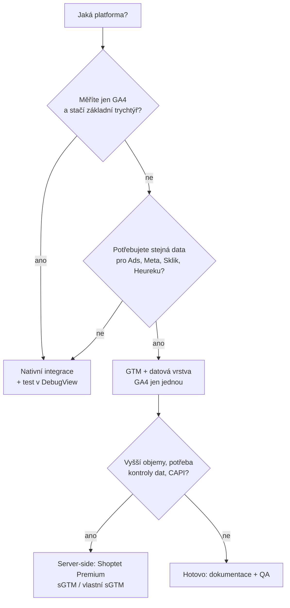
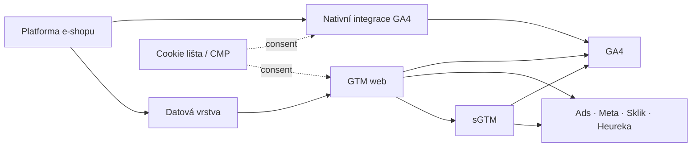

# D4: GA4 na Shoptetu, Upgates, WooCommerce a Shopify – brief
> Cluster: D. GA4 & kvalita dat · URL: /blog/ga4-pro-eshopove-platformy · Formát: srovnání + praktický návod · Priorita: měsíc 1 · Cílová LP: /reseni/e-shopy (sekundárně /sluzby/implementace-ga4) · Rozsah článku: 3 200–4 000 slov · Fáze 2: z kapitol vzniknou podstránky /reseni/e-shopy/shoptet, /upgates, /woocommerce, /shopify

## 1. Meta
- **H1:** GA4 na Shoptetu, Upgates, WooCommerce a Shopify: co platforma změří sama
- **SEO title (58 zn.):** GA4 na Shoptetu, Upgates, WooCommerce a Shopify | datalayer.cz
- **Meta description (153 zn.):** Co změří nativní integrace GA4 na Shoptetu, Upgates, WooCommerce, Shopify a PrestaShopu, jak řešit consent a server-side a co musíte doplnit. Srovnání 2026.
- **URL:** /blog/ga4-pro-eshopove-platformy
- **Klíčová slova:** hlavní *shoptet google analytics* (150); vedlejší *ga4 shopify* (350), *shopify gtm* (350), *google analytics shopify* (80), *shoptet ga4* (20), *shoptet consent mode v2* (20), *shoptet cookie lišta* (40), *shoptet facebook pixel* (40), *nastavení google analytics shoptet* (10), *woocommerce google analytics* (10), *google tag manager shopify* (10), *jak propojit e-shop s google analytics 4?* (10), *heureka měření konverzí woocommerce* (20); long-tail EN 0: *gtm4wp ga4 ecommerce*, *shopify ga4 ecommerce tracking*, *woocommerce ecommerce tracking ga4*. Σ clusteru ~950.
- **Záměr:** informační-komerční (rozhodnutí „stačí nativní integrace, nebo potřebuji GTM/sGTM?“).
- **Čtenář:** majitel / e-commerce manažer e-shopu na SaaS platformě nebo WordPressu; PPC agentura klienta; vývojář vlastního e-shopu. Segment: e-shopy (malé až střední), u vlastních řešení i velké.

## 2. Analýza SERP a konkurence
- *ga4 e-commerce měření*: support Google, biztools.cz (GA4 na Shoptetu 2026), janpospisil.cz (GA4 pro e-shop), webglobe, upgates.cz (článek 6/2024, data z 3/2023), khoder.cz (Shoptet), mariemullerova.cz. *implementace ga4*: blog.shoptet.cz (novinky v integraci GA4, 2023). Na *ga4* se objevuje podpora.shoptet.cz/google-tag-manager.
- **Konkurence:** každý píše o **jedné** platformě; nikdo nesrovnává, co přesně posílá nativní integrace (události, DPH, consent, server-side) napříč platformami; dokumentace platforem je roztroušená a místy zastaralá (Upgates uvádí UA kód, Shoptet blog uvádí UA-událost `checkout_progress`).
- **Čím přeskočíme:** jedna srovnávací tabulka s **ověřenými údaji z dokumentace platforem (10/2026)** a viditelným označením „neověřeno“; rozhodovací diagram „nativně vs. GTM vs. server-side“; kód mapování dataLayer pro Shoptet a Shopify custom pixel; typické chyby (duplicitní měření).

## 3. Otázky, na které musí článek odpovědět
1. Stačí mi nativní integrace GA4 v mé platformě?
2. Jaké e-commerce události posílá nativní integrace a co chybí?
3. Posílá platforma tržby s DPH, nebo bez? Včetně dopravy?
4. Můžu mít nativní GA4 a zároveň GTM?
5. Jak platforma řeší cookie lištu a Consent Mode v2?
6. Umí platforma server-side měření?
7. Co je datová vrstva platformy a je ve formátu GA4?
8. Proč na Shopify nejde GTM do checkoutu a co jsou custom pixely?
9. Jaký plugin použít na WooCommerce?
10. Co dělat u PrestaShopu a vlastního e-shopu?
11. Jak propojit stejná data do Google Ads, Meta, Skliku a Heureky?

## 4. Rychlá odpověď (hotový text, 57 slov)
> Nativní integrace GA4 na Shoptetu, Upgates, Shopify i v pluginech WooCommerce změří základní nákupní trychtýř a nákup, ale liší se v událostech, definici tržby, consentu a server-side. Pro konzistentní data do GA4, Ads, Meta a Skliku obvykle potřebujete GTM s datovou vrstvou. Nikdy nekombinujte nativní GA4 s vlastním tagem GA4.

## 5. Osnova s obsahem odpovědí

### H2 Čtyři vrstvy, podle kterých platformy srovnáváme
- **Obsah:** (1) **nativní GA4 integrace** (zadáte ID, platforma posílá události), (2) **datová vrstva pro GTM** (formát, úplnost), (3) **consent** (vlastní lišta, Consent Mode v2, napojení CMP), (4) **server-side** (přesměrování do sGTM, webhooky, CAPI). Diagram 6.4.

### H2 Srovnání v jedné tabulce
- Tabulky 6.1 a 6.2 (kompletní obsah). Legenda: ✅ ověřeno v dokumentaci platformy 10/2026 · ⚠️ ověřeno částečně / starší zdroj · ❓ neověřeno.

### H2 Shoptet
- **Nativně:** propojení přes *Propojení → Google → Analytics* (přihlášení Google účtem, výběr služby); jen na vlastní doméně (ne `123456.myshoptet.com`). Podle blogu Shoptetu (30. 11. 2023, upraveno 6. 10. 2025) posílá `view_item_list`, `view_item`, `add_to_cart`, `view_cart`, `begin_checkout`, `add_shipping_info`, `add_payment_info`, `purchase`, `generate_lead` (newsletter), `sign_up`, `login`; zrušil `view_promotion`/`select_promotion`; přidal příznak interní návštěvy, `transaction_type` (B2B/B2C), `payment_type`, `shipping_tier`. Blog zmiňuje i `checkout_progress` (název z éry UA) → **seznam ověřit v DebugView**.
- **Hodnota:** plátci DPH posílají *revenue* **bez DPH, bez dopravy a platby**; doprava a platba jdou zvlášť **včetně DPH**; daň z celé objednávky; cena položky bez DPH (podpora.shoptet.cz). → Srovnání s administrací musí počítat s touto definicí (D2).
- **Rozšířené konverze:** zaškrtávací volba + zapnout „Shromažďování údajů poskytnutých uživateli“ v GA4.
- **GTM a dataLayer:** pole pro `GTM-…` + volba „Použít Google Data Layer Helper“. DataLayer je **vlastní objekt `shoptet`** (`pageType`, `cart`, `product`, `order` s `orderNo`, `total`, `netto`, `tax`, `shipping`, `content[]`) a na děkovací stránce starší pole `transactionId`, `transactionProducts`; událost `ShoptetDataLayerUpdated` při změně košíku (developers.shoptet.cz/data-layer). **Není ve formátu GA4 e-commerce** → pro GA4 přes GTM je nutné mapování (kód 6.5). Nové parametry jsou podle Shoptetu „zatím výsadou integrovaného měření“.
- **Consent:** vlastní lišta („Zákonné znění“ blokuje analytické a marketingové kódy do souhlasu), tlačítko „Odmítnout vše“, souhlas uložen 6 měsíců, statistiky a export souhlasů; do GTM předává `consent default` a `update` přes gtag → v GTM stačí zapnout přehled souhlasu a nastavit u tagů požadovaný souhlas.
- **Server-side:** **jen Shoptet Premium** – „Přesměrovat měření na SGTM“ s `server_container_url`. Meta Conversions API nativně (doporučeno „po získání souhlasu“). Storna do Google Ads přes CSV (Premium).
- **Limity a doplnit:** duplicita při GA4 v integraci + GTM/HTML (Shoptet varuje); vratky (`refund`) do GA4 nativně nezjištěny ❓; Sklik, Heureka, Zboží mají vlastní integrace – sjednotit hodnoty.

### H2 Upgates
- **Nativně:** *Doplňky → Google → Global site tag → Google Analytics 4* (ID měření); „propojení je řešené přes javascript, nejedná se o server-side“. Podporované události: `view_item`, `add_to_cart`, `view_cart`, `begin_checkout`, `add_shipping_info`, `add_payment_info`, `purchase` (upgates.cz/a/pruvodce-propojeni-google). Chybí `view_item_list`, `select_item`, `remove_from_cart` v GA4 ❓ (nejsou v seznamu).
- **Hodnota (DPH, doprava):** v dokumentaci neuvedeno ❓ → ověřit testovací objednávkou.
- **GTM:** ID pro každou jazykovou mutaci; systémový dataLayer (detail produktu, přidání/odebrání z košíku, dokončení objednávky) **jen při vyplněném ID GTM**; vlastní parametry přes *Vlastní konverzní kódy* (riziko kolize). Upgates upozorňuje na duplikaci konverzí při souběhu GTM a Global site tag.
- **Google Ads:** rozšířené konverze volitelně (e-mail, telefon, jméno, adresa z objednávky).
- **Consent:** vlastní lišta, výchozí stav „zakázání cookies“, platnost souhlasu **30 dní**, statistiky souhlasů se neukládají (upgates.cz/a/princip-a-zobrazeni-cookies). Článek „Nová funkce: Google Consent v2“ (26. 2. 2024) – obsah se nepodařilo načíst ❓ → ověřit, zda posílá `ad_user_data`/`ad_personalization`.
- **Server-side:** nativně ne; Meta pixel (ViewContent, AddToCart, Purchase) + Conversions API dostupné.

### H2 WooCommerce (WordPress)
- **Dvě cesty:** (a) oficiální **Google Analytics for WooCommerce** (zdarma, verze 2.4.2, 100 000+ instalací): nákupy (brána musí přesměrovat na stránku „order received“), přidání/odebrání z košíku, zobrazení a kliknutí v seznamech, detail produktu, zahájení pokladny, chyby 404; Consent Mode od 3/2024 přes **WP Consent API** (potřebuje samostatnou CMP), výchozí stav lze upravit filtrem `woocommerce_ga_gtag_consent_modes`, od 2.4.2 posílá explicitní „denied“ nerozhodnutým návštěvníkům na opt-in webech; přihlášení admini se neměří. (b) **GTM4WP** (verze 2.0.5, 700 000+ instalací): GA4 e-commerce dataLayer včetně blokového košíku a pokladny (`view_cart`, `begin_checkout`, `add_to_cart`, `remove_from_cart`, `select_item`, `add_shipping_info`, `add_payment_info`, `purchase`; bez promocí a refundů), Consent Mode v2 (`default`), integrace Cookiebot/Axeptio/CookieYes, načtení gtm.js z vlastní domény se server-side kontejnerem.
- **Doporučení:** GTM4WP + GTM, pokud měříte víc systémů; oficiální plugin pro jednoduchý obchod jen s GA4. Nekombinovat oba pro GA4.
- **Hodnota:** závisí na nastavení cen s/bez DPH ve WooCommerce a pluginu ❓ → ověřit testem.
- **Limity:** pluginy třetích stran (Google for WooCommerce pro Ads/Merchant Center) mohou přidat vlastní gtag ❓ → hlídat duplicity; aktualizace pluginů mění chování.

### H2 Shopify
- **Nativně:** aplikace **Google & YouTube** nasadí značku Google a posílá část e-commerce událostí automaticky (Shopify je nevyjmenovává; Stape uvádí mezi nimi `add_to_cart`, `begin_checkout`, `purchase`) ⚠️ → seznam ověřit v DebugView. Další události doplníte vlastní implementací.
- **Checkout:** `checkout.liquid` skončil pro stránky informace/doprava/platba **13. 8. 2024**; děkovací a stavové stránky u Plus **28. 8. 2025**; „additional scripts“ a script tagy nahradit do 28. 8. 2025 (Plus); u ostatních plánů Shopify termín 26. 8. 2026, poté automatický upgrade (help.shopify.com). → GTM v šabloně do checkoutu nevidí; měření checkoutu jen přes **pixely** (Web Pixels API).
- **Custom pixel s GTM:** běží v sandboxu *Lax*, odebírá standardní události (`page_viewed`, `product_viewed`, `collection_viewed`, `search_submitted`, `product_added_to_cart`, `product_removed_from_cart`, `cart_viewed`, `checkout_started`, `checkout_contact_info_submitted`, `checkout_address_info_submitted`, `checkout_shipping_info_submitted`, `payment_info_submitted`, `checkout_completed`, `alert_displayed`, `ui_extension_errored`) a posílá je do dataLayer (kód 6.6). Omezení: URL stránky obsahuje informace sandboxu (posílat vlastní `page_location`), odchozí kliky nejdou automaticky, Tag Assistant „Troubleshoot“ nefunguje, vlastní pixely Shopify **nepodporuje** (odpovědnost obchodníka).
- **Consent:** **Customer Privacy API** – signály *analytics, marketing, preferences, sale_of_data*; CMP musí být s API propojená; u custom pixelu nastavit požadovaná oprávnění ❓ (ověřit v administraci) a Consent Mode v2 v kódu GTM.
- **Server-side:** nativní přesměrování do sGTM v dokumentaci nenalezeno ❓; řešení přes custom pixel → sGTM a webhooky pro nákupy/refundy (Stape, 9/2026).

### H2 PrestaShop a další platformy
- **PrestaShop:** oficiální modul `ps_googleanalytics` používá GA4 (GitHub), seznam událostí ani consent v README nejsou ❓; kompatibilita uvedena PS 8.2+ (jinde 1.7.7+). Prakticky: GTM + modul s GA4 dataLayer nebo úprava šablony vývojářem; vždy test v DebugView.
- **Další české platformy** (FastCentrik, Eshop-rychle.cz, ShopSys): krátká zmínka, že mají vlastní integrace měřicích kódů ❓ – mimo rozsah, nabídnout konzultaci.

### H2 Vlastní e-shop
- Nejvíc kontroly i odpovědnosti: specifikace datové vrstvy (C1, C2), GTM, consent (A1), `purchase` ideálně potvrzený z backendu (Measurement Protocol nebo od 7. 5. 2026 Data Manager API pro server-to-server události – support 9164320), server-side (B1, B2).

### H2 Jak se rozhodnout: nativně, GTM, nebo server-side
- Rozhodovací diagram 6.3 + pravidla: (1) jen GA4 a malý obchod → nativní integrace, ověřit události a hodnoty; (2) GA4 + Ads + Meta + Sklik + Heureka se stejnými hodnotami → GTM s datovou vrstvou (nativní GA4 vypnout, nebo GA4 nechat nativně a GTM jen pro ostatní – nikdy obojí pro GA4); (3) vyšší obraty, více reklamních systémů, potřeba kontroly dat → server-side (Shoptet Premium, sGTM pro ostatní).
- Typické chyby (box): dvojí GA4; jiná definice tržby v GA4 a v Ads; Meta pixel z platformy + Meta tag v GTM bez deduplikace (`event_id`, B5); test na zkušební doméně.

### H2 FAQ (kap. 9)

## 6. Vizuály

### 6.1 Tabulka A „GA4 a datová vrstva“
| Platforma | Nativní GA4 | E-commerce události nativně | Hodnota `purchase` | DataLayer pro GTM |
|---|---|---|---|---|
| Shoptet | ✅ OAuth propojení (vlastní doména) | ⚠️ seznam viz text (blog 2023/2025) | ✅ bez DPH, dopravy a platby | ✅ vlastní objekt `shoptet`, ne GA4 formát |
| Upgates | ✅ ID v Global site tag (JS) | ✅ 7 událostí (bez seznamů a odebrání) | ❓ neuvedeno | ✅ systémový dataLayer jen s GTM ID (detail, košík, nákup) |
| WooCommerce | ✅ plugin GA for WooCommerce | ✅ seznamy, detail, košík, checkout, nákup | ❓ dle nastavení DPH | ✅ GTM4WP: GA4 formát vč. blokového checkoutu |
| Shopify | ✅ aplikace Google & YouTube | ⚠️ část automaticky, neúplně dokumentováno | ❓ dle mapování | ⚠️ jen custom pixel (sandbox), 15 standardních událostí |
| PrestaShop | ⚠️ modul `ps_googleanalytics` (GA4) | ❓ nedokumentováno | ❓ | ❓ moduly třetích stran |
| Vlastní | – | dle specifikace | dle měřicího plánu | ✅ plná kontrola (C1, C2) |

### 6.2 Tabulka B „Consent, server-side, reklamní systémy“
| Platforma | Cookie lišta / Consent Mode | Server-side | Ostatní nativně | Co obvykle doplnit |
|---|---|---|---|---|
| Shoptet | ✅ vlastní lišta, `default`/`update` do GTM, souhlas 6 měs., statistiky | ✅ sGTM jen Premium | Meta CAPI, storna do Ads (Premium), rozšířené konverze | mapování dataLayer, refundy, sjednocení hodnot pro Sklik/Heureku |
| Upgates | ⚠️ vlastní lišta, souhlas 30 dní; detaily CMv2 ❓ | ❌ nativně ne | Meta pixel + CAPI, rozšířené konverze Ads | `view_item_list`, ověření hodnot, CMv2 signály |
| WooCommerce | ✅ přes WP Consent API / CMP pluginy | ⚠️ GTM4WP + vlastní sGTM | dle pluginů | CMP, výběr jednoho pluginu, sGTM |
| Shopify | ✅ Customer Privacy API + CMP aplikace | ❓ nativně nenalezeno; pixel/webhooky → sGTM | Google & YouTube, Meta aplikace | custom pixel pro úplný trychtýř, consent v pixelu |
| PrestaShop | ❓ dle modulu CMP | ❓ | dle modulů | audit modulů, GTM |
| Vlastní | dle CMP | ✅ libovolně | – | vše, ale s dokumentací |

### 6.3 Rozhodovací diagram

SVG: vlevo „platformní“ ikony (bez log – textové štítky `shoptet`, `upgates`, `woo`, `shopify` v Roboto Mono kvůli ochranným známkám), větve barevně; varovný štítek u uzlu T „nikdy GA4 dvakrát“. Mobil svisle.

### 6.4 Diagram „4 vrstvy měření e-shopu“

SVG ve stylu hero (uzly s glow, přerušované spojnice), u nativní cesty a GTM cesty do GA4 výstražný symbol „vyberte jednu“.

### 6.5 Kód – Shoptet: mapování `shoptet.order` na GA4 `purchase` (GTM, vlastní JS proměnná)
```js
// Proměnná typu "Vlastní JavaScript" – vrací objekt ecommerce pro GA4 purchase.
// Použít jen pokud GA4 NENÍ zároveň propojené nativně v administraci Shoptetu.
function () {
  var first = window.dataLayer && window.dataLayer[0];
  var sh = first && first.shoptet;
  if (!sh || sh.pageType !== 'thankYou' || !sh.order) return undefined;
  var o = sh.order;
  return {
    transaction_id: String(o.orderNo),
    value: o.netto,                 // OVĚŘIT: zda netto zahrnuje dopravu a platbu
    tax: o.tax,
    shipping: o.shipping,           // OVĚŘIT: s/bez DPH (viz shippingTax)
    currency: o.currencyCode,
    items: (o.content || []).map(function (i) {
      return { item_id: i.sku, item_name: i.name, item_variant: i.variant,
               item_category: i.category, price: i.price, quantity: i.quantity };
    })
  };
}
```
Spouštěč: *Vlastní událost* `gtm.dom` + podmínka `pageType = thankYou`; ochrana proti duplicitě viz D2 (6.6).

### 6.6 Kód – Shopify custom pixel: `checkout_completed` → dataLayer
```js
// Shopify Admin → Nastavení → Zákaznické události → Vlastní pixel.
// Nahoře kód GTM bez <script> značek (dle návodu Shopify), pak:
analytics.subscribe('checkout_completed', (event) => {
  const c = event.data.checkout;               // názvy polí ověřit v shopify.dev
  window.dataLayer = window.dataLayer || [];
  window.dataLayer.push({ ecommerce: null });
  window.dataLayer.push({
    event: 'purchase',
    page_location: event.context.window.location.href, // ne URL sandboxu
    ecommerce: {
      transaction_id: c.order?.id,
      value: c.subtotalPrice?.amount,           // definice dle měřicího plánu
      tax: c.totalTax?.amount,
      shipping: c.shippingLine?.price?.amount,
      currency: c.currencyCode,
      items: (c.lineItems || []).map((li) => ({
        item_id: li.variant?.sku || li.variant?.id,
        item_name: li.title,
        price: li.variant?.price?.amount,
        quantity: li.quantity
      }))
    }
  });
});
```

### 6.7 Mockup
Stylizované výřezy administrací (bez log a bez kopírování UI 1:1, s fiktivními daty): Shoptet „Propojení → Google → Analytics“ se zaškrtnutím „Přesměrovat měření na SGTM“; Shopify „Zákaznické události → Vlastní pixel“. Kvůli ochranným známkám jen schematicky, popisky česky.

## 7. Fakta a zdroje
| Tvrzení | Zdroj | Ověřeno | Riziko zastarání |
|---|---|---|---|
| Shoptet: propojení GA4, hodnoty bez DPH/dopravy, rozšířené konverze, sGTM jen Premium, varování před duplicitou | podpora.shoptet.cz/nastaveni-google-analytics | 10/2026 | střední |
| Shoptet: seznam událostí, B2B/B2C, interní návštěva | blog.shoptet.cz/google-analytics-4 (30. 11. 2023, upraveno 6. 10. 2025) | 10/2026 | vysoké |
| Shoptet: dataLayer objekt `shoptet` | developers.shoptet.cz/data-layer | 10/2026 | střední |
| Shoptet: GTM + Data Layer Helper | podpora.shoptet.cz/google-tag-manager | 10/2026 | nízké |
| Shoptet: lišta, `default`/`update`, souhlas 6 měsíců, CAPI | podpora.shoptet.cz/cookies | 10/2026 | střední |
| Shoptet: storna do Google Ads (Premium) | podpora.shoptet.cz/google-ads-stornovani-konverzi | 10/2026 | nízké |
| Upgates: GA4 přes JS, 7 událostí, rozšířené konverze | upgates.cz/a/pruvodce-propojeni-google | 10/2026 | střední |
| Upgates: GTM, systémový dataLayer | upgates.cz/a/propojeni-s-google-tag-managerem | 10/2026 | střední |
| Upgates: lišta, souhlas 30 dní, bez statistik | upgates.cz/a/princip-a-zobrazeni-cookies | 10/2026 | střední |
| Upgates: Consent v2 (26. 2. 2024) – obsah neověřen | upgates.cz/a/nova-funkce-google-consent-v2 | – | – |
| WooCommerce: GA for WooCommerce funkce, WP Consent API | woocommerce.com/document/google-analytics-integration; wordpress.org/plugins/woocommerce-google-analytics-integration (v2.4.2) | 10/2026 | vysoké |
| GTM4WP: události, CMv2, vlastní doména gtm.js | wordpress.org/plugins/duracelltomi-google-tag-manager (v2.0.5) | 10/2026 | vysoké |
| Shopify: konec checkout.liquid 13. 8. 2024 / 28. 8. 2025 | help.shopify.com/en/manual/checkout-settings/checkout-extensibility/checkout-upgrade | 10/2026 | nízké |
| Shopify: custom pixel Lax sandbox, nepodporováno | help.shopify.com/en/manual/promoting-marketing/pixels/custom-pixels | 10/2026 | střední |
| Shopify: GTM v custom pixelu, page_location, Tag Assistant | help.shopify.com/…/custom-pixels/gtm-tutorial | 10/2026 | střední |
| Shopify: 15 standardních událostí | shopify.dev/docs/api/web-pixels-api/standard-events | 10/2026 | střední |
| Shopify: Customer Privacy API (4 signály) | shopify.dev/docs/api/customer-privacy | 10/2026 | střední |
| Shopify: Google & YouTube – část událostí (add_to_cart, begin_checkout, purchase) | stape.io/blog/shopify-google-analytics-4-tracking (sekundární, 17. 9. 2026) | 10/2026 | vysoké |
| PrestaShop: `ps_googleanalytics` používá GA4 | github.com/PrestaShop/ps_googleanalytics | 10/2026 | střední |
| Data Manager API pro server-to-server (7. 5. 2026) | support.google.com/analytics/answer/9164320 | 10/2026 | vysoké |

## 8. Interní odkazy a CTA
- **Cílová LP:** /reseni/e-shopy. **CTA box** (za tabulkami): nadpis „Měříte e-shop na Shoptetu, Upgates, WooCommerce nebo Shopify?“ · text „Ověříme, co vaše platforma skutečně posílá, a nastavíme jednu datovou vrstvu pro GA4, Google Ads, Meta, Sklik i Heureku.“ · `[ Konzultovat měření e-shopu ]`.
- **Další LP:** /sluzby/implementace-ga4, /sluzby/server-side-tracking (u Shoptet Premium a Shopify), /sluzby/cookie-lista-consent-mode.
- **Související:** D1, D2, D3, C1, C2, A1, A4 (výběr cookie lišty), B1, B5 (Meta CAPI), B6 (Seznam EM).
- **Slovník:** Datová vrstva, Server-side tagging, Consent Mode, Deduplikace (event_id), Rozšířené konverze.
- **Kontaktní blok:** `form_id: blog`, témata `ga4`, `gtm`, H2 „Řešíte totéž u sebe?“, placeholder „Např. máme Shoptet a GA4 ukazuje jiné tržby než administrace…“.

## 9. FAQ pro schema
1. **Stačí na Shoptetu nativní propojení s GA4?** Pro základní přehled nákupního chování ano: Shoptet posílá hlavní e-commerce události i nákup. Pokud ale potřebujete stejná data i pro Google Ads, Meta, Sklik nebo Heureku, nastavíte navíc GTM s datovou vrstvou. GA4 pak nesmí být nasazené dvakrát – v integraci i v GTM.
2. **Posílá Shoptet do GA4 tržby s DPH?** Podle nápovědy Shoptetu posílá u plátců DPH hodnotu objednávky bez DPH a bez dopravy a platby. Doprava a platba jdou zvlášť včetně DPH a daň se počítá z celé objednávky. Při srovnání s administrací proto porovnávejte tržby bez DPH a bez dopravy.
3. **Proč na Shopify nefunguje Google Tag Manager v pokladně?** Shopify ukončil úpravy pokladny přes checkout.liquid a dodatečné skripty. Do pokladny se měření dostane jen přes pixely – aplikace nebo vlastní pixel, který běží v izolovaném prostředí a odebírá standardní události, například checkout_completed. GTM lze vložit do vlastního pixelu, má ale omezení.
4. **Jaký plugin použít pro GA4 na WooCommerce?** Pro jednoduchý obchod, který měří jen GA4, stačí oficiální Google Analytics for WooCommerce. Pokud měříte více systémů, je praktičtější GTM4WP, který vytvoří datovou vrstvu ve formátu GA4 i pro blokový košík a pokladnu. Pro GA4 používejte jen jeden z nich.
5. **Umí e-shopové platformy server-side měření?** Shoptet nabízí přesměrování měření do server-side GTM v tarifu Premium. Upgates podle své dokumentace měří GA4 v prohlížeči. U WooCommerce a Shopify se server-side řeší vlastním kontejnerem, například přes GTM4WP nebo vlastní pixel a webhooky. Server-side vždy musí respektovat souhlas.

## 10. Poznámky pro autora
- **Nejvíc zastarává** (vysoké riziko): seznamy událostí, verze pluginů, Shopify pixely. Revize **každé 3 měsíce**; v článku tabulka „stav k datu“.
- **Před publikací ověřit testem na reálných obchodech** `[DOPLNIT: přístup do testovacích obchodů / klientských instalací Shoptet, Upgates, Woo, Shopify]`: seznam událostí v DebugView, hodnoty `value` (DPH, doprava), CMv2 signály (Upgates), oprávnění custom pixelu (Shopify), význam `netto` a `shipping` v dataLayer Shoptetu.
- **Neověřeno a v článku označit ❓:** Upgates hodnoty a CMv2; WooCommerce hodnoty; Shopify nativní sGTM a úplný seznam událostí Google & YouTube; PrestaShop události a consent; FastCentrik/Eshop-rychle/ShopSys.
- Loga platforem nepoužívat bez svolení; jen textové názvy. Nepsat „partner Shoptetu“, pokud to klient není `[DOPLNIT: partnerství klienta s platformami]`.
- Kód 6.5 a 6.6 je ukázkový – v článku označit „ukázka, otestujte v náhledu GTM“.
- Autor Vít Novotný; recenze vývojářem, který zná WooCommerce/Shopify.
