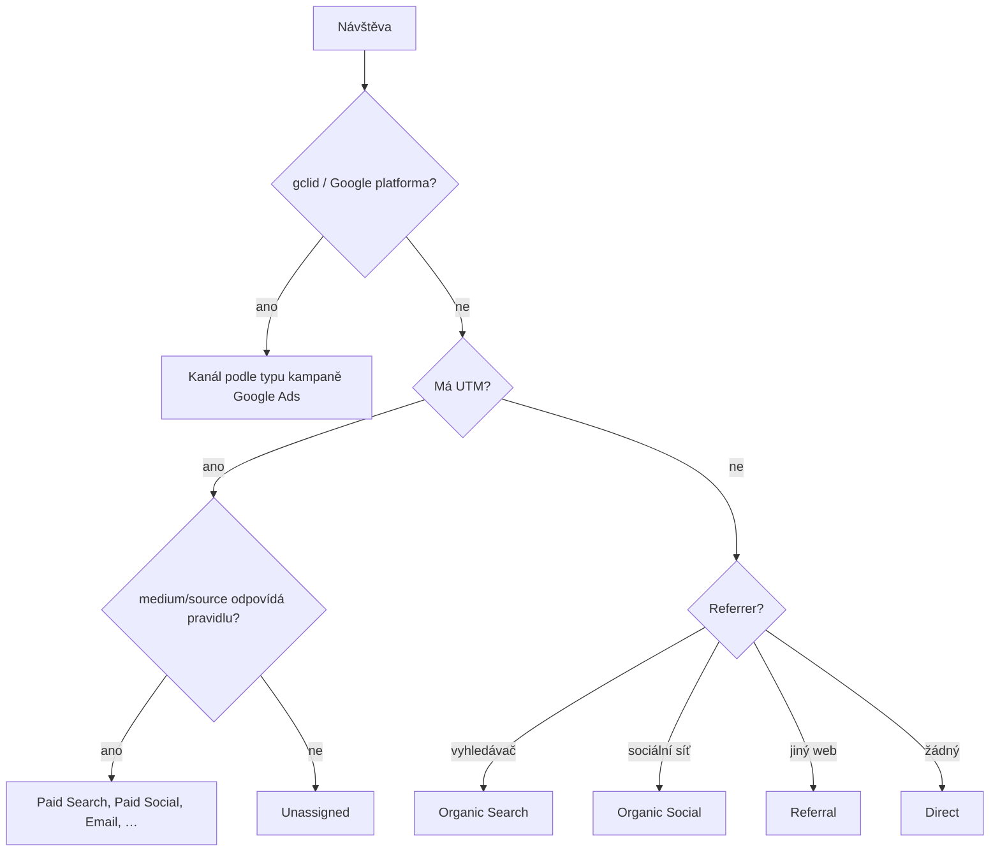

# D5: UTM parametry: pravidla pojmenování (+ UTM builder) – brief
> Cluster: D. GA4 & kvalita dat · URL: /blog/utm-parametry · Nástroj: /nastroje/utm-builder · Formát: návod + nástroj · Priorita: měsíc 1 · Cílová LP: /sluzby/implementace-ga4 · Rozsah článku: 2 500–3 200 slov; stránka nástroje 400–700 slov + nástroj

## 1. Meta
- **H1 článku:** UTM parametry: pravidla, slovník pro český trh a UTM builder
- **SEO title (57 zn.):** UTM parametry: pravidla a slovník pro GA4 (2026) | datalayer.cz
- **Meta description (154 zn.):** Co jsou UTM parametry, které GA4 opravdu čte, jak je pojmenovat pro Sklik, Zboží, Heureku a newslettery a proč nepatří na interní odkazy. S UTM builderem zdarma.
- **Stránka nástroje:** H1 „UTM builder – generátor UTM parametrů“, title „UTM builder zdarma: generátor UTM odkazů pro GA4 | datalayer.cz“ (60 zn.), description „Vytvořte UTM odkaz s kontrolou chyb a náhledem kanálu v GA4. Předvolby pro Sklik, Zboží, Heureku, Meta i newsletter. Zdarma, bez registrace.“ (139 zn.)
- **Klíčová slova:** článek: *utm parametry* (150), *utm* (600 – smíšený záměr, virtualizační software UTM), *utm google analytics* (80), *google analytics utm* (80), *utm parameters* (50), *utm parametr* (40), *co je utm* (20), *utm source* (20), *utm tagging* (20), *utm medium/campaign* (10). Nástroj: *utm builder* (1 100, KD 77), *utm generator* (100), *google utm builder* (30), *utm tag builder* (20), *utm maker* (20), *utm creator* (20), *utm link builder* (10). Σ ~2 050.
- **PAA:** „Co je to UTM?“, „Jaký je generátor UTM parametrů?“, „What is an UTM builder?“, „Is there a free UTM builder?“, „Is UTM tracking free?“, „What does UTM stand for?“.
- **Záměr:** článek informační (pravidla), nástroj transakční-nástrojový.
- **Čtenář:** marketér, který spouští kampaně mimo Google Ads (Sklik, Meta, newsletter, srovnávače, influenceři, tisk); PPC/e-mail specialista; tým ve větší firmě, kde UTM tvoří více lidí.

## 2. Analýza SERP a konkurence
- *utm parametry*: AI přehled, digitalniarchitekti.cz (článek), **utm-builder.cz**, marketingppc.cz (glosář), **utmgenerator.cz**, support Google (10917952), webglobe, smartemailing nápověda, vitousladislav.cz, samba.ai.
- *utm builder*: ga-dev-tools.google (Campaign URL Builder), utmbuilder.net, kontentino.com, utmbuilder.com, tilda, Chrome Web Store, utm.io, livechat; pozice 10 support Google. Česky marketingppc.cz/utm-builder (pozice 7 na *utm*), DA má UTM builder (146 slov).
- **Co chybí:** české buildery jsou jen formulář; nikdo neukazuje **do kterého kanálu GA4 odkaz spadne**, nemá **české předvolby** (Sklik, Zboží, Heureka, Ecomail) ani **validaci chyb** (velká písmena, diakritika, UTM u Google Ads, osobní údaje). Články neznají, že GA4 nečte `utm_creative_format` a `utm_marketing_tactic`, že `email.seznam.cz` je v seznamu zdrojů GA4 vedený jako vyhledávač a že Heureka/Zboží v seznamu nákupních zdrojů nejsou.
- **Čím přeskočíme:** slovník zdrojů/médií pro ČR s výsledným kanálem GA4, nástroj s náhledem kanálu, šablony pro tým, hromadné generování a QR.

## 3. Otázky, na které musí článek odpovědět
1. Co jsou UTM parametry a co znamená zkratka UTM (Urchin Tracking Module)?
2. Které parametry jsou povinné a které GA4 skutečně zobrazí?
3. Jak pojmenovat source, medium a campaign, aby byla data čistá?
4. Jak GA4 z UTM určí kanál (Paid Search, Paid Social, Email…)?
5. Jak označit Sklik, Zboží, Heureku, Meta Ads a newslettery?
6. Mám dávat UTM do Google Ads? (auto-tagging vs. UTM)
7. Proč nepoužívat UTM na interních odkazech?
8. Proč mám návštěvy v Unassigned?
9. Jsou UTM parametry zdarma a funguje UTM tracking bez cookies?
10. Jak zařídit, aby UTM v týmu tvořili všichni stejně?

## 4. Rychlá odpověď (hotový text, 56 slov)
> UTM parametry jsou značky v URL, podle kterých GA4 pozná, odkud návštěva přišla. Vždy vyplňte utm_source, utm_medium a utm_campaign, malými písmeny a bez diakritiky. Medium volte podle pravidel kanálů GA4, jinak skončíte v Unassigned. Google Ads značkujte automaticky přes gclid a UTM nikdy nedávejte na odkazy uvnitř vlastního webu.

## 5. Osnova s obsahem odpovědí

### H2 Co jsou UTM parametry a jak je GA4 čte
- **Obsah:** definice (dvojice `klíč=hodnota` za `?` v URL, oddělené `&`), příklad, tabulka 6.1 (parametr → dimenze GA4). Fakta: GA4 podporuje 9 parametrů; vždy používat source, medium, campaign – chybějící parametry vedou k `(not set)`; **`utm_creative_format` a `utm_marketing_tactic` se v GA4 nereportují**; UTM se nezobrazují v dimenzích „Vstupní stránka + řetězec dotazu“, jen v „Umístění stránky“ (support 10917952). Od 11. 6. 2026 GA4 přidal dimenzi **Source Group** (slučuje varianty jako Facebook/Instagram) a upravil hodnoty Source Platform (support 9164320).
- UTM jsou zdarma; samy o sobě nic neukládají – GA4 je přečte při načtení stránky a v rámci consentu (bez souhlasu v advanced režimu jen pingy bez cookies).

### H2 Pravidla pojmenování (konvence)
- **Pravidla:** (1) jen **malá písmena** – GA4 rozlišuje velikost (`google` ≠ `Google`); (2) bez diakritiky a mezer, slova spojovat `-`, segmenty v kampani `_`; (3) source = **platforma/odesílatel**, ne varianta domény (`facebook`, ne `m.facebook.com`); (4) medium jen z **řízeného slovníku** (tabulka 6.2); (5) campaign podle šablony `{rrrr-mm}_{cíl}_{název}[_{trh}]`, např. `2026-11_prodej_black-friday_cz`; (6) `utm_content` pro variantu kreativy/odkazu (`banner-300x250_a`, `cta-hero`); (7) `utm_id` pro import nákladů (od 28. 7. 2026 import vyžaduje pole měny); (8) **žádné osobní údaje** (e-mail, ID zákazníka v čitelné podobě); (9) jedna tabulka konvence pro celý tým (Google Sheet / UTM builder se šablonami); (10) **v názvu kampaně nepoužívejte `shop`, `eshop`, `shopping`** – pravidlo kanálů `^(.*(([^a-df-z]|^)shop|shopping).*)$` zachytí i „eshop“, takže kampaň s placeným médiem spadne do Paid Shopping a třeba newsletter `eshop-novinky` do **Organic Shopping** místo Email (Organic Shopping se vyhodnocuje před Email) – odvozeno z pravidel support 9756891, *ověřit testem*.

### H2 Slovník zdrojů a médií pro český trh
- Tabulka 6.2 (kompletní) s výsledným výchozím kanálem GA4.
- **Klíčová zjištění (ověřeno v seznamu zdrojů GA4 staženém 8. 10. 2026 a v nápovědě Skliku):**
  - Sklik auto-tagging přidává `utm_source=seznam` a `utm_medium=cpc` (nebo `cpt`), `utm_campaign={campaign}`; tyto dva parametry nelze vypnout; `utm_content` a `utm_term` volitelně (napoveda.sklik.cz/en/performance-evaluation/statistics/auto-tagging). `seznam` je v GA4 vyhledávač → **Paid Search**, i pro obsahovou síť Skliku.
  - Seznam pro Zboží.cz uvádí příklad `utm_source=zbozi.cz&utm_medium=product` → v GA4 **Unassigned** (médium `product` neodpovídá žádnému pravidlu, `zbozi.cz` není v seznamu nákupních zdrojů).
  - `heureka`/`heureka.cz` a `glami` v seznamu nákupních zdrojů GA4 **nejsou** → s `cpc` skončí v **Paid Other**.
  - `email.seznam.cz` je v seznamu GA4 vedený jako **vyhledávač** → neoznačené newslettery čtené v Seznam Emailu padají do **Organic Search**.
  - `checkout.stripe.com`, `stripe.com` jsou vedené jako nákupní zdroj → bez vyloučení referralu (D1) zkreslí Organic Shopping.

### H2 Jak GA4 přiřazuje kanály (a proč skončíte v Unassigned)
- Diagram 6.3 + tabulka 6.4 s pravidly (regex médií pro placené kanály `^(.*cp.*|ppc|retargeting|paid.*)$`, Display = `display|banner|expandable|interstitial|cpm`, Organic Social média `social|social-network|social-media|sm|…`, Email, Affiliates = `affiliate`, Referral = `referral|app|link`, SMS, Push, **AI Assistant** = medium `ai-assistant` – nový kanál od 13. 5. 2026). Pravidla nerozlišují velikost písmen (support 9756891).
- **Vlastní seskupení kanálů** pro ČR (tabulka 6.5): Srovnávače, Offline, oprava `email.seznam.cz` → Email, Sklik obsah (podle názvu kampaně). Pořadí pravidel rozhoduje. *Ověřit: zda se vlastní seskupení aplikuje zpětně a limit počtu skupin u standardní služby.*

### H2 Auto-tagging (gclid) vs. UTM
- Google Ads: zapnout automatické značkování; při současném použití UTM **vyhrávají hodnoty auto-taggingu** pro zdroj, médium a další dimenze, ruční `utm_term`/`utm_content` se ukládají do „Manual term/Manual ad content“; Google doporučuje auto-tagging, budoucí funkce jen s ním (support 10723328).
- Neodstraňovat `gclid`, `gbraid`, `wbraid`, `gad_source` při přesměrování; GA4 od 30. 7. 2026 upozorňuje diagnostikou na URL bez GBRAID a `gad_`.
- Sklik: auto-tagging přes UTM (výše). Meta: `fbclid` GA4 pro atribuci nevyužije → UTM nutné (dynamické makra Meta, např. `{{campaign.name}}`, `{{site_source_name}}` – *ověřit aktuální seznam v Meta Business Help*; hodnoty `an`, `msg` nejsou v seznamu sociálních zdrojů GA4 → Paid Other).

### H2 Nejčastější chyby (tabulka 6.6)
- UTM na interních bannerech a odkazech: GA4 při nové kampani **nezakládá novou relaci** (support 11986666), ale kampaň se propíše do dalších událostí a v atribuci klíčových událostí může převzít kredit původního zdroje (*ověřit testem a v článku popsat jako riziko*). Místo UTM: `view_promotion`/`select_promotion` nebo vlastní parametr.
- Další: velká písmena, mezery a diakritika (`%C4%8D` v reportu), chybějící medium → `(not set)`, UTM na Google Ads, ztráta parametrů při přesměrování/zkracovači, e-mail v `utm_content`, QR bez UTM, různé varianty názvů v týmu, příliš dlouhé URL (GA4 ořízne `page_location` nad 1 000 znaků – support 9267744).

### H2 UTM builder datalayer.cz (představení nástroje)
- Krátká sekce s embedem nástroje (nebo screenshotem a odkazem na /nastroje/utm-builder), 3 věty o funkcích, CTA „Otevřít UTM builder“.

### H2 FAQ (kap. 9)

## 6. Vizuály

### 6.1 Tabulka „UTM parametry v GA4“
| Parametr | Vyplnit | Co popisuje | Kde ho uvidíte v GA4 | Příklad |
|---|---|---|---|---|
| `utm_source` | vždy | odkud návštěva přišla (platforma, odesílatel) | Relace – zdroj | `seznam`, `facebook`, `ecomail` |
| `utm_medium` | vždy | typ kanálu (určuje výchozí kanál) | Relace – médium | `cpc`, `paid-social`, `email` |
| `utm_campaign` | vždy | název kampaně | Relace – kampaň | `2026-11_prodej_black-friday_cz` |
| `utm_id` | doporučeno | ID kampaně (párování s importem nákladů) | Relace – ID kampaně | `bf2026` |
| `utm_term` | volitelně | klíčové slovo / cílení | Relace – ruční výraz | `remarketing-30d` |
| `utm_content` | volitelně | varianta kreativy nebo odkazu | Relace – ruční obsah reklamy | `banner-300x250_a` |
| `utm_source_platform` | výjimečně | platforma nákupu provozu (SA360, DV360) | Relace – platforma zdroje | `dv360` |
| `utm_creative_format` | nepoužívat pro GA4 | formát kreativy | **v GA4 se nereportuje** | – |
| `utm_marketing_tactic` | nepoužívat pro GA4 | cílení | **v GA4 se nereportuje** | – |
*(České názvy dimenzí ověřit v rozhraní.)*

### 6.2 Slovník zdrojů a médií pro ČR (kompletní; „výchozí kanál“ = výsledek pravidel GA4 k 10/2026)
| Kanál | utm_source | utm_medium | Výchozí kanál GA4 | Poznámka |
|---|---|---|---|---|
| Google Ads | – (auto-tagging) | – | Paid Search / Shopping / Video / Display / Cross-network | UTM nepřidávat |
| Sklik vyhledávání | `seznam` (auto) | `cpc` (auto) | Paid Search | auto-tagging Skliku |
| Sklik obsahová síť | `seznam` (auto) | `cpc` / `cpt` | Paid Search | odlišit názvem kampaně + vlastní kanál |
| Zboží.cz | `zbozi.cz` | `cpc` (doporučujeme místo `product`) | Paid Other | s `product` = Unassigned; vlastní kanál Srovnávače |
| Heureka | `heureka.cz` | `cpc` | Paid Other | vlastní kanál Srovnávače |
| Glami, Pricemania | `glami`, `pricemania` | `cpc` | Paid Other | vlastní kanál Srovnávače |
| Meta Ads | `facebook` / `instagram` | `paid-social` | Paid Social | dynamické makro jen s ověřením hodnot |
| LinkedIn Ads | `linkedin` | `paid-social` | Paid Social | |
| TikTok Ads | `tiktok` | `paid-social` | Paid Social | |
| Microsoft Ads | `bing` | `cpc` | Paid Search | |
| Organické příspěvky | `facebook`, `linkedin`… | `social` | Organic Social | |
| Newsletter | `ecomail` / `smartemailing` / `newsletter` | `email` | Email | jednu variantu source zvolit napořád |
| Transakční e-maily | `transakcni-email` | `email` | Email | |
| Affiliate | `ehub`, `dognet` | `affiliate` | Affiliates | |
| PR, partner | doména partnera | `referral` | Referral | |
| SMS | `sms` | `sms` | SMS | |
| Web push | název nástroje | `push` | Mobile Push Notifications | |
| QR, tisk, veletrh | `letak-2026-11`, `veletrh-xy` | `offline` | Unassigned | vlastní kanál Offline |
| Seznam Email bez UTM | `email.seznam.cz` (referrer) | `referral` | **Organic Search** | proto newslettery vždy značkovat |

### 6.3 Diagram „Jak GA4 určí kanál“

SVG: strom zleva doprava, listy jako „štítky kanálů“ s barvou; Unassigned zvýrazněn oranžovým obrysem. Mobil: svisle.

### 6.4 Tabulka „Pravidla výchozích kanálů GA4“ (výběr, pravidla nerozlišují velikost písmen)
| Kanál | Podmínka |
|---|---|
| Direct | source `(direct)` a medium `(not set)` / `(none)` |
| Cross-network | kampaň obsahuje `cross-network` |
| Paid Shopping | nákupní zdroj nebo kampaň `…shop…`/`shopping`, a medium `^(.*cp.*\|ppc\|retargeting\|paid.*)$` |
| Paid Search | vyhledávač (seznam, google, bing, centrum.cz, firmy.cz…) a placené medium |
| Paid Social | sociální síť a placené medium |
| Paid Video | video web a placené medium |
| Display | medium `display`, `banner`, `expandable`, `interstitial`, `cpm` |
| Paid Other | placené medium bez rozpoznaného zdroje |
| Organic Search / Social / Video / Shopping | zdroj ze seznamu nebo medium `organic` / `social`… / `video` |
| Email | source nebo medium `email`, `e-mail`, `e_mail`, `e mail` |
| Affiliates | medium `affiliate` |
| Referral | medium `referral`, `app`, `link` |
| SMS / Mobile Push | `sms` / medium končí `push`, obsahuje `mobile`, `notification` |
| AI Assistant | medium `ai-assistant` (rozpoznaní asistenti automaticky, od 5/2026) |
| Unassigned | nic z výše |

### 6.5 Vlastní seskupení kanálů „CZ e-commerce“ (ukázka, pravidla nad výchozími)
| Kanál | Podmínky |
|---|---|
| Srovnávače | source odpovídá regexu `^(heureka\|zbozi\|glami\|pricemania\|srovname)(\.cz)?$` |
| E-mail (oprava) | source přesně `email.seznam.cz` |
| Sklik obsah | source `seznam` a kampaň obsahuje `_obsah` (vyžaduje konvenci názvů) |
| Offline | medium přesně `offline` |
| … dále výchozí kanály | (zkopírovat výchozí definice) |

### 6.6 Tabulka „Chyby a opravy“
| Chyba | Důsledek | Oprava |
|---|---|---|
| UTM na interních odkazech | zkreslená atribuce, falešné kampaně | `select_promotion` / vlastní parametr |
| `Facebook` vs. `facebook` | dva řádky v reportech | jen malá písmena, validace v builderu |
| Chybí `utm_medium` | `(not set)` / Unassigned | povinné source + medium + campaign |
| UTM na Google Ads | nic nepřidá, riziko chyb | auto-tagging |
| Přesměrování ořízne parametry | Direct / Unassigned | test prokliku, zachovat query string |
| Osobní údaje v UTM | porušení pravidel Google, GDPR riziko | redakce dat, nikdy e-mail v URL |
| Medium mimo slovník (`product`, `qr`) | Unassigned | slovník 6.2, vlastní kanál |
| „eshop“ / „shop“ v názvu kampaně | newsletter nebo banner v (Organic/Paid) Shopping | kampaně pojmenovat bez „shop“ (`prodej`, `obchod`) |

### 6.7 Specifikace nástroje UTM builder (/nastroje/utm-builder)
**Funkce (v1, bez přihlášení):**
1. Pole: cílová URL*, source*, medium*, campaign*, id, term, content (+ rozbalovací „další parametry“: source_platform). Výsledná URL v monospace boxu s barevně odlišenými parametry, tlačítka `[ Kopírovat ]`, `[ QR kód ]` (PNG/SVG generované v prohlížeči), `[ Uložit jako šablonu ]`.
2. **Předvolby (chips):** Sklik, Zboží.cz, Heureka, Meta Ads, LinkedIn Ads, Newsletter, Organic social, Affiliate, QR/tisk – předvyplní source/medium podle tabulky 6.2.
3. **Náhled kanálu GA4:** „Tento odkaz GA4 zařadí do kanálu: **Paid Social**“ – logika podle pravidel 6.4 a podmnožiny seznamu zdrojů GA4 (seznam, google, bing, centrum.cz, firmy.cz, email.seznam.cz, facebook, fb, instagram, ig, linkedin, tiktok, pinterest, youtube…) s poznámkou „orientační, podle pravidel Googlu k 10/2026“.
4. **Validace a varování:** automaticky lowercase, odstranění diakritiky (NFD), mezery → `-`, povolené znaky `[a-z0-9._-]`; chyba při chybějícím source/medium/campaign; varování: medium vede do Unassigned; `google` + `cpc` → „Použijte auto-tagging“; detekce e-mailu/telefonu (`[^@\s]+@[^@\s]+\.[a-z]{2,}`, `\+?\d[\d\s]{8,}`) → blokace; URL už obsahuje `utm_` → nahradit; `#` v URL → parametry vložit před fragment; název kampaně obsahuje `shop`/`eshop` → varování „GA4 zařadí do Shopping“; výsledná URL > 1 000 znaků → varování (GA4 ořízne `page_location`); zaškrtávátko „odkaz povede z mého webu“ → chyba „UTM na interní odkazy nepatří“.
5. **Šablony a historie:** uložení v prohlížeči (`localStorage`, obalené try/catch; nástroj funguje i bez něj), **export/import JSON** konvence pro sdílení v týmu, posledních 20 odkazů.
6. **Hromadný režim:** vložení CSV (url;source;medium;campaign;content) → tabulka výsledků → stažení CSV.
**v2 (po ověření zájmu):** sdílený týmový prostor se šablonami (vyžaduje backend a přihlášení).
**UI:** desktop 2 sloupce (formulář vlevo, výsledek vpravo sticky), mobil pod sebou; tmavý brand, akcent cyan, CTA oranžové; pod nástrojem 400–700 slov návodu + odkaz na článek D5 + FAQ (PAA).
**Měření:** `tool_use` s `tool: 'utm_builder'`, `action: 'generate' | 'copy' | 'qr' | 'save_template' | 'bulk_export'`, `channel_preview` (např. `paid_social`). **Hodnoty UTM ani URL do GA4 neposílat** (mohou obsahovat interní informace).
**SEO:** `WebApplication` schema (`applicationCategory: BusinessApplication`, `isAccessibleForFree: true`), FAQPage, interní odkazy z D5, D1, D3, LP GA4; článek a nástroj si navzájem neberou dotazy (článek = *utm parametry*, nástroj = *utm builder*).

### 6.8 Kód – jádro normalizace a náhledu kanálu (pro vývojáře nástroje)
```js
// Normalizace hodnoty UTM
function normalize(v) {
  return v.normalize('NFD').replace(/[\u0300-\u036f]/g, '')  // bez diakritiky
          .toLowerCase().trim()
          .replace(/\s+/g, '-')                                // mezery → pomlčka
          .replace(/[^a-z0-9._-]/g, '')                        // jen povolené znaky
          .replace(/-{2,}/g, '-');
}
const PAID = /^(.*cp.*|ppc|retargeting|paid.*)$/;
const SHOP_CAMP = /^(.*(([^a-df-z]|^)shop|shopping).*)$/;   // zachytí i "eshop"
const SEARCH = ['google','bing','seznam','seznam.cz','centrum.cz','firmy.cz','email.seznam.cz','duckduckgo','yahoo'];
const SOCIAL = ['facebook','fb','instagram','ig','linkedin','tiktok','pinterest','twitter','t.co','reddit','messenger'];
const SOCIAL_MED = ['social','social-network','social-media','sm','social network','social media'];
const EMAIL = /^(email|e-mail|e_mail|e mail)$/;
// Orientační náhled kanálu podle pravidel GA4 (zkrácené, pořadí dle Googlu)
function channel(src, med, camp) {
  if (camp.includes('cross-network')) return 'Cross-network';
  if (SHOP_CAMP.test(camp) && PAID.test(med)) return 'Paid Shopping';
  if (SEARCH.includes(src) && PAID.test(med)) return 'Paid Search';
  if (SOCIAL.includes(src) && PAID.test(med)) return 'Paid Social';
  if (['display','banner','expandable','interstitial','cpm'].includes(med)) return 'Display';
  if (PAID.test(med)) return 'Paid Other';
  if (SHOP_CAMP.test(camp)) return 'Organic Shopping';
  if (SOCIAL.includes(src) || SOCIAL_MED.includes(med)) return 'Organic Social';
  if (SEARCH.includes(src) || med === 'organic') return 'Organic Search';
  if (['referral','app','link'].includes(med)) return 'Referral';
  if (EMAIL.test(src) || EMAIL.test(med)) return 'Email';
  if (med === 'affiliate') return 'Affiliates';
  if (src === 'sms' || med === 'sms') return 'SMS';
  if (/push$/.test(med) || /mobile|notification/.test(med)) return 'Mobile Push Notifications';
  if (med === 'ai-assistant') return 'AI Assistant';
  return 'Unassigned';
}
```
Pozn.: zkrácená logika bez seznamů nákupních a video zdrojů a bez úplných seznamů vyhledávačů a sítí – v produkci doplnit podle seznamu zdrojů Googlu a pravidelně aktualizovat.

## 7. Fakta a zdroje
| Tvrzení | Zdroj | Ověřeno | Riziko zastarání |
|---|---|---|---|
| 9 UTM parametrů, `utm_creative_format`/`utm_marketing_tactic` se nereportují, rozlišení velikosti písmen, `(not set)` při chybějících | support.google.com/analytics/answer/10917952 | 10/2026 | střední |
| Pravidla výchozích kanálů (regexy), case-insensitive | support.google.com/analytics/answer/9756891 | 10/2026 | střední |
| Seznam zdrojů: seznam, seznam.cz, centrum.cz, firmy.cz, email.seznam.cz = search; stripe = shopping; heureka, zbozi, glami chybí | PDF „GA4 Source Categories“ (odkaz ze support 9756891), staženo 8. 10. 2026 | 10/2026 | střední |
| AI Assistant kanál (13. 5. 2026), Source Group (11. 6. 2026), diagnostika GBRAID/gad_ (30. 7. 2026), import nákladů s měnou (28. 7. 2026) | support.google.com/analytics/answer/9164320 | 10/2026 | vysoké |
| Auto-tagging přebíjí ruční UTM (kromě manual term/content) | support.google.com/analytics/answer/10723328 | 10/2026 | nízké |
| Sklik auto-tagging `seznam` / `cpc` nebo `cpt`, 2 povinné parametry | napoveda.sklik.cz/en/performance-evaluation/statistics/auto-tagging | 10/2026 | střední |
| Zboží.cz příklady UTM (`zbozi.cz`/`product`, `seznam`/`cpc`) | napoveda.sklik.cz/en/shopping-ads/basic-settings/url-tagging-utm-parameters | 10/2026 | střední |
| Relace se nerestartuje při nové kampani | support.google.com/analytics/answer/11986666 | 10/2026 | nízké |
| `page_location` max. 1 000 znaků | support.google.com/analytics/answer/9267744 | 10/2026 | nízké |
| Makra Meta (`{{campaign.name}}`, `{{site_source_name}}`) | **neověřeno** (facebook.com nedostupný pro ověření) | – | střední |

## 8. Interní odkazy a CTA
- **Cílová LP:** /sluzby/implementace-ga4. **CTA box** (za sekcí kanálů): nadpis „Chcete čisté kanály v GA4?“ · text „Navrhneme konvenci UTM pro celý tým, vlastní seskupení kanálů pro srovnávače a Sklik a zkontrolujeme, kde vám návštěvy padají do Unassigned.“ · `[ Konzultovat nastavení GA4 ]`.
- **Nástroj:** výrazné tlačítko `[ Otevřít UTM builder ]` pod rychlou odpovědí a v sekci builderu.
- **Související:** D1 (nastavení, platební brány), D2 (Unassigned), D3 (kontroly 21–23), D6 (atribuce), B6 (Seznam EM), C5 (měřicí plán), G3 (dashboard).
- **Slovník:** UTM parametry, GCLID/gbraid/wbraid, (not set)/Unassigned, Atribuční model.
- **Kontaktní blok:** `form_id: blog`, téma `ga4`, H2 „Řešíte totéž u sebe?“, placeholder „Např. třetina návštěv nám v GA4 padá do Unassigned…“.

## 9. FAQ pro schema
1. **Co znamená zkratka UTM?** Urchin Tracking Module. Název pochází od firmy Urchin, kterou Google koupil a z jejíhož nástroje vzniklo Google Analytics. Parametry s předponou utm_ se přidávají za adresu odkazu a GA4 z nich čte zdroj, médium a kampaň návštěvy.
2. **Které UTM parametry jsou povinné?** Formálně žádný, ale Google doporučuje vždy vyplnit utm_source, utm_medium a utm_campaign. Bez nich se v přehledech objeví hodnoty (not set) a návštěva nemusí spadnout do správného kanálu. Parametry utm_term a utm_content jsou volitelné, utm_id se hodí pro import nákladů.
3. **Mám přidávat UTM parametry do Google Ads?** Ne. Zapněte automatické značkování, které do odkazu přidá gclid. Pokud jsou na odkazu zároveň UTM parametry, GA4 pro zdroj a médium stejně použije hodnoty z automatického značkování a ruční UTM se uloží jen do dimenzí ručního výrazu a obsahu.
4. **Proč nepoužívat UTM na interních odkazech?** Interní UTM přepíší informaci o kampani u dalších akcí návštěvníka, takže nákup se může připsat vašemu banneru místo reklamy, která zákazníka přivedla. Pro měření interních bannerů použijte události view_promotion a select_promotion nebo vlastní parametr.
5. **Proč mám v GA4 návštěvy v kanálu Unassigned?** Nejčastěji kvůli UTM s médiem, které neodpovídá pravidlům kanálů GA4, například product nebo qr, kvůli chybějícímu médiu nebo technické chybě, kdy relaci chybí událost session_start. Upravte médium podle slovníku, nebo vytvořte vlastní seskupení kanálů.
6. **Je UTM builder zdarma?** Ano, UTM builder na datalayer.cz je zdarma a bez registrace. Kromě vytvoření odkazu ukáže, do kterého kanálu GA4 odkaz zařadí, upozorní na chyby v pojmenování a umožní uložit šablony pro tým nebo vytvořit QR kód.

## 10. Poznámky pro autora
- **Ověřit před publikací:** české názvy dimenzí; zda se vlastní seskupení kanálů aplikují zpětně a jejich limit; makra Meta a jejich hodnoty; zda Heureka sama přidává UTM k proklikům `[DOPLNIT: zkušenost klienta / nápověda Heureky]`; chování interních UTM v GA4 (otestovat na testovací službě a výsledek popsat přesně).
- Seznam zdrojů GA4 se mění – v nástroji i článku uvádět „k datu“ a revidovat čtvrtletně.
- Nástroj: zadání pro vývoj = sekce 6.7–6.8; před spuštěním testy na 30 vzorových odkazech (Sklik, Zboží, Meta, newsletter…).
- Nekopírovat texty utm-builder.cz / utmgenerator.cz / marketingppc.cz.
- Autor Vít Novotný; recenze PPC specialistou (Sklik, Zboží, Heureka).
