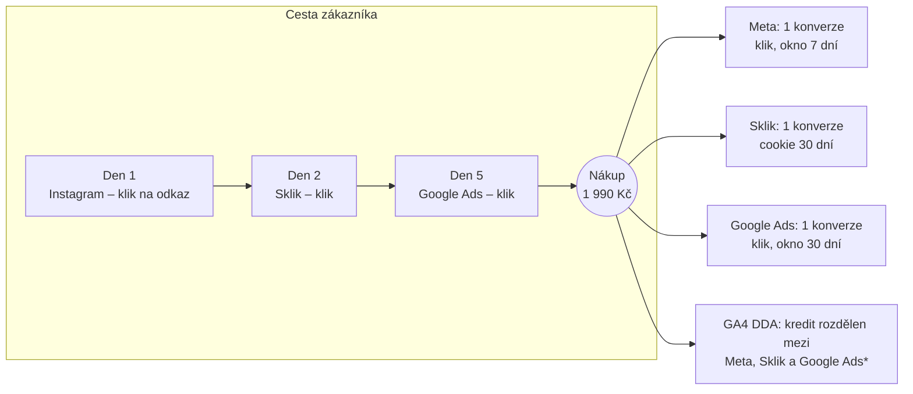

# D6: Atribuce v GA4 a reklamních systémech – brief
> Cluster: D. GA4 & kvalita dat · URL: /blog/atribuce-ga4 · Formát: vysvětlení + doporučení pro reporting · Priorita: měsíc 3 · Cílová LP: /sluzby/dashboardy-a-reporting (sekundárně /sluzby/bigquery) · Rozsah článku: 2 800–3 500 slov

## 1. Meta
- **H1:** Atribuce v marketingu: GA4, Google Ads a Meta v roce 2026
- **SEO title (59 zn.):** Atribuční model v GA4, Google Ads a Meta (2026) | datalayer.cz
- **Meta description (152 zn.):** Jak funguje atribuce v GA4, Google Ads a Meta, proč si všechny platformy připisují stejný nákup a kdy použít MMM a testy inkrementality. Aktuální stav 2026.
- **URL:** /blog/atribuce-ga4
- **Klíčová slova:** hlavní *atribuční model* (30 dle plánu; SERP existuje), *atribuce v marketingu* / *marketing atribuce* (0); vedlejší *atribuce* (150 – **SERP ovládá psychologie** (Wikipedie, kauzální atribuce) → v title a H1 vždy „v marketingu / GA4“), *data driven atribuce* (20), *ga4 atribuce* (10), *co je atribuce* (10), *attribution modeling in google analytics* (10), *jak nastavit atribuční model v google analytics* (0), *marketing mix modeling* (50), *cookieless attribution* (30). Necílit: *kauzální atribuce* (70, psychologie).
- **Záměr:** informační (pochopit) → rozhodovací (jak reportovat).
- **Čtenář:** marketingový ředitel / majitel e-shopu, který dostává od agentur čísla, jež dohromady dávají víc objednávek, než prodal; head of performance; finanční ředitel. Segmenty: e-shop (hlavní), B2B (dlouhý cyklus, offline konverze), velká firma (MMM, inkrementalita).

## 2. Analýza SERP a konkurence
- *atribuční model*: optimal-marketing.cz, ecomail.cz, fanl.cz, strafelda.cz, neogy.cz (slovníkové definice), support Campaign Manager 360, janpospisil.cz (průvodce atribucí v GA4, ~1 400 slov), vojtechbruk.cz. *atribuce*: psychologie.
- **Problém konkurence:** slovníky popisují modely lineární, časový rozpad, podle pozice jako dostupné, i když je Google v GA4 i Ads **v roce 2023 odstranil**; nikdo nepopisuje Meta 2026 (engage-through, nová definice kliku, inkrementální atribuce), rozdíl „atribuce relace vs. atribuce klíčové události“ v GA4, ani kdy sáhnout po MMM a testech inkrementality.
- **Čím přeskočíme:** stav k 10/2026 se zdroji; srovnávací tabulka GA4 × Google Ads × Meta × Sklik; diagram „1 nákup, 3 konverze“; praktický model reportingu (zdroj pravdy podle otázky, MER, poměr platforma/GA4); rozhodovací tabulka last click × DDA × MMM × inkrementalita.

## 3. Otázky, na které musí článek odpovědět
1. Co je atribuce a atribuční model v marketingu?
2. Jaké atribuční modely jsou v GA4 v roce 2026 a co Google odstranil?
3. Proč GA4 ukazuje v různých přehledech různé zdroje téhož nákupu?
4. Co je data-driven atribuce a potřebuje minimum dat?
5. Jak funguje atribuce v Google Ads a proč se liší od GA4?
6. Jak připisuje konverze Meta (okna, view-through, engage-through)?
7. Proč si všechny platformy připisují stejnou konverzi?
8. Last click, nebo data-driven?
9. Co je MMM a test inkrementality a kdy dávají smysl?
10. Jak reportovat výkon kanálů vedení, aby čísla dávala smysl?

## 4. Rychlá odpověď (hotový text, 58 slov)
> Atribuce rozhoduje, kterému kanálu se připíše konverze. GA4 v roce 2026 nabízí data-driven a dva modely posledního kliknutí; první kliknutí, lineární a časové modely Google v roce 2023 zrušil. Google Ads a Meta vidí jen své reklamy a mají vlastní okna, proto si připisují stejné nákupy. Pro rozpočty kombinujte GA4, MER a testy inkrementality.

## 5. Osnova s obsahem odpovědí

### H2 Co je atribuce a atribuční model
- **Obsah:** bod kontaktu (touchpoint), cesta ke konverzi, kredit, **atribuční okno** (jak daleko zpět), **pravidlový vs. datový model**, rozdíl atribuce (rozdělení kreditu mezi měřené body) a **inkrementality** (co by se stalo bez reklamy). Ukázkový příklad cesty (Instagram → Sklik → Google Ads → nákup).

### H2 Atribuce v GA4 (stav 2026)
- **Modely (support 10596866):** *Data-driven* (kredit podle dat konverzních i nekonverzních cest dané služby a klíčové události), *Placené a organické poslední kliknutí* (100 % poslednímu nepřímému kanálu), *Google placené kanály poslední kliknutí* (poslední klik na Google Ads; bez něj se vrací k předchozímu modelu). **Přímá návštěvnost kredit nedostane**, pokud cesta není celá přímá. DDA může konverzi **přeatribuovat až 7 dní** po konverzi.
- **Odstraněno:** první kliknutí, lineární, časový rozpad, podle pozice – v GA4 nedostupné od **listopadu 2023**; v Google Ads výběr ukončen **v červnu 2023**, zbylé konverzní akce převedeny na data-driven **v září 2023** (support 10597962, Ads 13427716).
- **Okna:** akviziční klíčové události (`first_visit`, `first_open`) výchozí 30 dní (alt. 7), ostatní výchozí **90 dní** (alt. 30, 60) – support 10597962.
- **Tři „vrstvy“ atribuce v rozhraní (proč nákup vidíte pod různými zdroji):** (1) *Získávání uživatelů* = první zdroj uživatele; (2) *Akvizice návštěvnosti* = zdroj relace (poslední nepřímé kliknutí na úrovni relace, support 9191807); (3) *Inzerce → Atribuce* (porovnání modelů, konverzní cesty) = model služby na úrovni klíčové události. Tabulka 6.2.
- **Novinky 2026:** konverze Google Ads spravované v GA4 mají **atribuční nastavení pro každou konverzi zvlášť** (beta, 16. 1. 2026) a **vlastní okna** – kliknutí 1–90 dní, engaged-view 1–30 dní (11. 8. 2026); nový přehled **Conversion attribution analysis** s pohledy „asistované konverze (last click)“ a „refined funnel analysis (DDA)“ (beta, 16. 1. 2026) – support 9164320.
- **Nastavení:** Admin → Atribuční nastavení; vyžaduje roli Marketér+. *Ověřit: zda se změna modelu promítá i do historických dat.*

### H2 Atribuce v Google Ads
- Data-driven je výchozí pro většinu konverzních akcí, alternativou je poslední kliknutí (support 6259715). Okna: kliknutí 1–90 dní (výchozí 30), engaged-view 1–30 (výchozí 3), view-through 1–30 (výchozí 1 den) – support 3123169. Konverze se vykazují **ke dni kliknutí**; sloupce „podle času konverze“ existují (support 9549009, 2375435).
- Google Ads s vlastní značkou konverzí vidí **jen interakce s reklamami Google**. Při importu klíčových událostí z GA4 záleží, zda je atribuce nastavena na „Google placené kanály“, nebo „placené a organické kanály“ (support 2375435) – v druhém případě může kredit dostat i Sklik nebo e-mail a Ads ukáže méně.
- Testy inkrementality (Conversion Lift) – podle ppc.land Google v roce 2025 snížil minimální rozpočet na 5 000 USD; samoobslužně pro Video, Discovery a Demand Gen, ostatní přes obchodního zástupce (sekundární zdroj – **ověřit v nápovědě Google Ads**).

### H2 Atribuce v Meta Ads
- **Výchozí nastavení (2026):** 7 dní po kliknutí + 1 den po „engage-through“ + 1 den po zobrazení; volby: kliknutí 7/1 den, engage-through 1 den/žádné, zobrazení 1 den/žádné; model **Standardní** nebo **Inkrementální** (od 2025, předpovídá, zda konverzi způsobila reklama); počítání „všechny“ nebo „první konverze“. Od **března 2026** se za kliknutí považuje jen klik na odkaz reklamy, ostatní interakce (reakce, komentáře, sdílení, uložení, zhlédnutí videa 5 s+) spadají do engage-through; 28denní okno po kliknutí není volbou optimalizace (jonloomer.com, 2026 – **ověřit v Meta Business Help**).
- **API:** okna `7d_view` a `28d_view` přestala být **12. 1. 2026** vracena v Ads Insights API (developers.facebook.com, 16. 10. 2025); API standardně vykazuje akce k času zobrazení (`action_report_time=impression`).
- Meta propojí zařízení přihlášených uživatelů a modeluje část konverzí → typicky víc konverzí než GA4.

### H2 Sklik a české systémy (krátce)
- Sklik identifikuje návštěvníka cookie s platností 30 dní a konverzi započte v den měření; modelované konverze jsou od 19. 4. 2022 v součtech (napoveda.sklik.cz). Atribuční model Skliku v dokumentaci explicitně nenalezen ❓. Heureka a Zboží mají vlastní měření konverzí – další „vlastní pravda“.

### H2 Proč si všechny platformy připisují stejnou konverzi
- **Sdělení:** Každá platforma vidí jen své body kontaktu, používá vlastní okna (včetně zobrazení), vlastní identitu (přihlášení) a modelování. Nikdo mezi platformami neprovádí deduplikaci.
- Diagram 6.3 + tabulka 6.1. Ukázkový výpočet (ilustrativní): 100 objednávek v e-shopu, Google Ads 70, Meta 55, Sklik 30 → 155 připsaných konverzí; GA4 (DDA) rozdělí 85 změřených objednávek mezi kanály.
- Důsledek: **nesčítat** konverze z platforem; ROAS platforem je horní odhad.

### H2 Last click, data-driven, MMM, nebo test inkrementality?
- Rozhodovací tabulka 6.4.
- **MMM:** statistický model vztahu výdajů po kanálech (týdně) a tržeb s ohledem na sezónu, ceny a promo; nepotřebuje cookies. **Google Meridian** – open-source MMM, podporuje data na úrovni regionů a modelování dosahu a frekvence (developers.google.com/meridian); Meta má open-source **Robyn** (*ověřit*). Požadavky na data: typicky 2+ roky týdenních dat po kanálech *(z praxe – ověřit v dokumentaci Meridian „Amount of data needed“)*.
- **Inkrementalita:** geo-experimenty (regiony ČR, Meridian GeoX), Conversion Lift v Google Ads a Meta, holdout (vypnutí brandového vyhledávání v části regionů), on/off testy. Měří kauzální přínos, ne podíl na kreditu.
- **Kdy co:** malý e-shop s 2–3 kanály → GA4 (jeden model) + MER; střední s více placenými kanály → DDA + srovnání modelů + občasné testy; velká firma s offline médii → MMM kalibrovaný testy.

### H2 Praktická doporučení pro reporting
1. **Zdroj pravdy podle otázky:** tržby a objednávky = administrace/ERP; rozdělení mezi kanály = GA4 jedním modelem; optimalizace kampaní = platformy.
2. **MER** (tržby / celkové náklady na marketing) jako nezávislá kontrola – nezávisí na atribuci.
3. Platformy reportovat **vedle GA4 s poměrem** platforma/GA4, ne v součtu.
4. Model a okna **nastavit jednou a nepřepínat**; každou změnu zapsat do poznámek v GA4.
5. Jednou za čtvrtletí porovnat DDA vs. last click (Porovnání modelů) → které kanály „asistují“.
6. B2B: atribuovat **kvalifikované leady a obchody z CRM** (offline konverze, E3), ne odeslané formuláře.
7. Pro největší kanál jednou ročně test inkrementality.
8. Šablona reportu 6.5 → dashboard (G3, LP Dashboardy).

### H2 FAQ (kap. 9)

## 6. Vizuály

### 6.1 Tabulka „Atribuce v systémech (10/2026)“
| | GA4 | Google Ads | Meta Ads | Sklik |
|---|---|---|---|---|
| Vidí | všechny kanály (s UTM/referrerem) | jen reklamy Google | jen reklamy Meta | jen Sklik |
| Modely | DDA, placené a organické last click, Google placené last click | DDA (výchozí), last click | standardní / inkrementální | v dokumentaci neuvedeno ❓ |
| Výchozí okno | 90 dní (akviziční 30) | klik 30, engaged-view 3, zobrazení 1 den | klik 7 + engage-through 1 + zobrazení 1 den | cookie 30 dní |
| Konverze po zobrazení | ne | ano (YouTube, Display) | ano | ne |
| Datum konverze | den konverze | den kliknutí (volitelně čas konverze) | den zobrazení (API výchozí) | den měření |
| Modelování | behaviorální (při splnění prahů) | konverzní modelování | ano | modelované konverze |
| Přímá návštěvnost | bez kreditu | – | – | – |

### 6.2 Tabulka „Kde v GA4 uvidíte který zdroj nákupu“
| Přehled | Úroveň | Logika | Typické použití |
|---|---|---|---|
| Získávání uživatelů | uživatel | první zdroj uživatele | odkud přicházejí noví zákazníci |
| Akvizice návštěvnosti | relace | poslední nepřímé kliknutí relace | výkon kanálů v návštěvách |
| Inzerce → Atribuce (porovnání modelů, konverzní cesty) | klíčová událost | model služby (DDA / last click), okno 90 dní | rozdělení kreditu, asistence |
| Inzerce → Conversion attribution analysis (beta 2026) | konverze Google Ads | last click / DDA | asistované konverze, trychtýř |

### 6.3 Diagram „Jeden nákup, tři připsané konverze“

*Popisek: GA4 vidí všechny tři prokliky (s UTM / auto-taggingem) a rozdělí jednu konverzi; v modelu last click by celý kredit dostal Google Ads. Varianta pro interaktivní přepínač: kdyby uživatel reklamu na Instagramu jen viděl (bez kliku) 4 dny před nákupem, byl by mimo 1denní okno po zobrazení a Meta by si konverzi nepřipsala.* Diagram je **ukázkový příklad**, procenta DDA neuvádět.
**Finální SVG:** časová osa dnů nahoře (Roboto Mono), body kontaktu jako ikony platforem (textové štítky), pod nimi „okna“ jako barevné pruhy (Meta 7 dní po kliku / 1 den po zobrazení, Sklik 30 dní, Google Ads 30 dní), nákup jako oranžový bod; vpravo karty platforem s „+1“. Interaktivně: přepínač „Instagram – jen zobrazení“ (den 1) změní výsledek: Meta konverzi ztratí, GA4 rozdělí kredit jen mezi Sklik a Google Ads (`diagram_interaction`). Mobil: svislá osa.

### 6.4 Rozhodovací tabulka „Kterou metodu kdy“
| Metoda | Odpovídá na otázku | Potřebuje | Silné stránky | Slabiny | Pro koho |
|---|---|---|---|---|---|
| Last click (GA4) | který kanál nákup „uzavřel“ | čisté UTM, consent | jednoduché, stabilní | podceňuje horní část trychtýře | malé e-shopy, srovnání v čase |
| Data-driven (GA4) | jak se kanály podílí na cestě | dostatek konverzí, jedna služba | využívá i nekonverzní cesty | černá skříňka, jen měřené body, mění se až 7 dní | většina e-shopů a lead-gen |
| Platformní atribuce | jak optimalizovat kampaň v platformě | pixel/CAPI, souhlas | vstup pro bidding | nadhodnocuje, nesčítatelné | specialisté na kampaně |
| MMM (Meridian, Robyn) | kolik přináší každý kanál a kam přesunout rozpočet | roky týdenních dat, výdaje po kanálech | bez cookies, i offline média | náročné, hrubší granularita | vyšší rozpočty, více kanálů |
| Test inkrementality | způsobila reklama prodej navíc? | test/kontrolní skupina, rozpočet | kauzální odpověď | čas, ušlé tržby v kontrolní skupině | největší kanály, kalibrace MMM |

### 6.5 Šablona reportu (ukázkový příklad, fiktivní čísla)
| Kanál | Náklady | Tržby GA4 (DDA, bez DPH) | ROAS GA4 | Konverze v platformě | Poměr platforma / GA4 |
|---|---|---|---|---|---|
| Google Ads | 120 000 Kč | 610 000 Kč | 5,1 | 410 | 1,3 |
| Meta Ads | 80 000 Kč | 190 000 Kč | 2,4 | 260 | 2,1 |
| Sklik | 40 000 Kč | 170 000 Kč | 4,3 | 150 | 1,2 |
| **Celkem (e-shop)** | **240 000 Kč** | **tržby z administrace 1 450 000 Kč** | **MER 6,0** | *nesčítat* | – |
Vizuál: tabulka + malý sloupcový graf „poměr platforma/GA4“ v čase (Chart.js jen na této stránce, nebo inline SVG). Barvy: GA4 cyan, platformy šedě, MER oranžově.

### 6.6 SQL – první zdroj uživatele vs. zdroj relace u nákupů (BigQuery)
```sql
-- Porovná "kdo zákazníka přivedl poprvé" a "z čeho přišel při nákupu".
-- Pole session_traffic_source_last_click ověřit v aktuálním schématu exportu.
SELECT
  CONCAT(traffic_source.source, ' / ', traffic_source.medium) AS prvni_zdroj_uzivatele,
  CONCAT(session_traffic_source_last_click.cross_channel_campaign.source, ' / ',
         session_traffic_source_last_click.cross_channel_campaign.medium) AS zdroj_relace_nakupu,
  COUNT(DISTINCT ecommerce.transaction_id) AS nakupy,
  ROUND(SUM(ecommerce.purchase_revenue)) AS trzby
FROM `projekt.analytics_123456789.events_*`
WHERE event_name = 'purchase'
  AND _TABLE_SUFFIX BETWEEN '20260901' AND '20260930'
GROUP BY 1, 2
ORDER BY trzby DESC;
```

### 6.7 Infografika (LinkedIn 1080×1350)
„Co Google v roce 2023 zrušil a co zůstalo“: vlevo přeškrtnuté modely (první kliknutí, lineární, časový rozpad, podle pozice) s daty 6/2023, 9/2023, 11/2023; vpravo dostupné modely 2026; dole lišta „Meta 2026: klik = jen klik na odkaz“. Brand barvy, datumy Roboto Mono.

## 7. Fakta a zdroje
| Tvrzení | Zdroj | Ověřeno | Riziko zastarání |
|---|---|---|---|
| Modely GA4 (DDA, 2× last click), přímá návštěvnost bez kreditu, přeatribuce 7 dní | support.google.com/analytics/answer/10596866 | 10/2026 | střední |
| Odstranění modelů v GA4 do 11/2023; okna 30/7 a 90/30/60 dní | support.google.com/analytics/answer/10597962 | 10/2026 | nízké |
| Google Ads: výběr modelů ukončen 6/2023, převod na DDA 9/2023 | support.google.com/google-ads/answer/13427716 | 10/2026 | nízké |
| Google Ads: DDA výchozí, last click dostupný | support.google.com/google-ads/answer/6259715 | 10/2026 | nízké |
| Okna Google Ads 30/3/1 den | support.google.com/google-ads/answer/3123169 | 10/2026 | střední |
| Ads ke dni kliknutí; atribuce importu Google placené vs. placené a organické | support.google.com/google-ads/answer/2375435 | 10/2026 | nízké |
| Sloupce podle času konverze | support.google.com/google-ads/answer/9549009 | 10/2026 | nízké |
| Atribuce relace = poslední nepřímé kliknutí | support.google.com/analytics/answer/9191807 | 10/2026 | nízké |
| Per-konverze atribuce, Conversion attribution analysis (16. 1. 2026), vlastní okna (11. 8. 2026) | support.google.com/analytics/answer/9164320 | 10/2026 | vysoké |
| Meta: výchozí okna, engage-through, nová definice kliku 3/2026, inkrementální model | jonloomer.com/meta-ads-attribution-2026 (sekundární) | 10/2026 | vysoké – ověřit v Meta Business Help |
| Meta API: konec `7d_view`, `28d_view` 12. 1. 2026 | developers.facebook.com/blog/post/2025/10/16/ads-insights-api-metric-availability-updates | 10/2026 | nízké |
| Meta API `action_report_time` výchozí `impression` | developers.facebook.com/docs/marketing-api/insights/parameters | 10/2026 | střední |
| Sklik: cookie 30 dní, den měření; modelované konverze od 19. 4. 2022 | napoveda.sklik.cz/en/conversion; …/modelled-conversions | 10/2026 | střední |
| Google Meridian: open-source MMM, geo data, reach & frequency, GeoX | developers.google.com/meridian | 10/2026 | střední |
| Conversion Lift od 5 000 USD (2025) | ppc.land (sekundární, 13. 11. 2025) – ověřit v nápovědě Google Ads | 10/2026 | vysoké |
| Meta Robyn (open-source MMM) | **neověřeno v této rešerši** – github.com/facebookexperimental/Robyn | – | střední |
| Role Marketér pro atribuční nastavení | support.google.com/analytics/answer/9305587 | 10/2026 | nízké |

## 8. Interní odkazy a CTA
- **Cílová LP:** /sluzby/dashboardy-a-reporting. **CTA box** (za doporučeními pro reporting): nadpis „Report, kterému věří vedení i marketing“ · text „Postavíme dashboard, který spojí tržby z e-shopu, GA4 a data reklamních systémů – s jasným zdrojem pravdy pro každé číslo a MER místo součtu konverzí.“ · `[ Konzultovat reporting ]`.
- **Sekundární:** /sluzby/bigquery (u SQL a MMM – „data pro MMM připravíme v BigQuery“).
- **Související:** D2 (proč nesedí), D5 (UTM a kanály), D1 (atribuční nastavení), E3 (offline konverze), F1, F4 (marže, LTV), G1, G3 (dashboard a KPI), B5 (Meta CAPI).
- **Slovník:** Atribuční model, Data-driven atribuce, Modelování konverzí, UTM parametry, Inkrementalita *(nové heslo – doplnit do slovníku)*, MMM *(nové heslo)*.
- **Kontaktní blok:** `form_id: blog`, téma `bigquery` (BigQuery & dashboardy), H2 „Řešíte totéž u sebe?“, placeholder „Např. agentury nám reportují víc objednávek, než jsme prodali…“.

## 9. FAQ pro schema
1. **Jaké atribuční modely jsou v GA4?** V roce 2026 tři: data-driven, placené a organické poslední kliknutí a Google placené kanály poslední kliknutí. Modely první kliknutí, lineární, časový rozpad a podle pozice Google v roce 2023 odstranil z GA4 i z Google Ads. Přímé návštěvy kredit nedostávají, pokud se cesta neskládá jen z nich.
2. **Proč si Google Ads, Meta a Sklik připisují stejnou objednávku?** Každá platforma vidí jen interakce se svými reklamami a používá vlastní okna, včetně konverzí po zobrazení. Mezi platformami nikdo neprovádí deduplikaci, takže jedna objednávka může být třikrát. Součet konverzí z platforem proto bývá vyšší než počet objednávek a nedá se sčítat.
3. **Je lepší data-driven, nebo last click?** Data-driven lépe ukáže kanály, které zákazníka přivedou dřív, než nakoupí, ale jeho výpočet nevidíte a výsledek se může ještě několik dní měnit. Last click je jednodušší a stabilnější pro srovnání v čase. Důležitější než volba je používat jeden model konzistentně.
4. **Co je MMM a kdy se vyplatí?** Marketing mix modeling statisticky odhaduje, kolik tržeb přinášejí jednotlivé kanály, z týdenních výdajů a tržeb za delší období. Nepotřebuje cookies a zahrne i offline média. Vyplatí se při vyšších rozpočtech a více kanálech; Google nabízí open-source nástroj Meridian.
5. **Jaké atribuční okno používá Meta?** Výchozí nastavení v roce 2026 je 7 dní po kliknutí, 1 den po interakci s reklamou a 1 den po zobrazení. Od března 2026 se za kliknutí počítá jen klik na odkaz reklamy, ostatní interakce spadají do takzvaného engage-through. Okna 7 a 28 dní po zobrazení už API nevrací.
6. **Jak reportovat výkon kanálů vedení?** Tržby berte z e-shopu nebo ERP, rozdělení mezi kanály z GA4 jedním modelem a čísla platforem uvádějte vedle s poměrem k GA4. Jako kontrolu nezávislou na atribuci sledujte MER, tedy tržby dělené celkovými náklady na marketing.

## 10. Poznámky pro autora
- **Meta údaje 2026 ověřit v oficiální nápovědě** (facebook.com/business/help – při rešerši nedostupné pro automatické ověření); stejně Conversion Lift minimum (Google Ads) a Robyn.
- Diagram 6.3 – rozdělení kreditu DDA je ilustrativní; v textu výslovně „ukázkový příklad“. Tabulka 6.5 jsou fiktivní čísla.
- Necitovat zastaralé slovníky konkurence; v článku krátký box „Pozor na staré návody: lineární a časové modely už v GA4 nejsou“.
- Ověřit: zda změna atribučního modelu v GA4 platí zpětně; dostupnost pole `session_traffic_source_last_click` v BigQuery exportu; existenci atribučního modelu v dokumentaci Skliku.
- Revize: 6 měsíců (Meta a Google mění atribuci každý rok). Autor Vít Novotný; recenze PPC/performance specialistou.
- Případová studie: `[DOPLNIT: příklad klienta – poměr platforma/GA4 nebo výsledek testu inkrementality, anonymizovaně]`.
