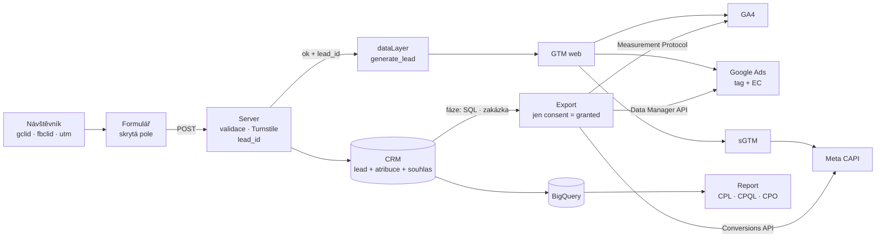
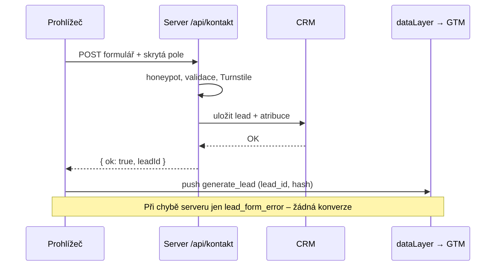

# E1: Měření formulářů a leadů: od formuláře po zakázku v CRM – brief
> Cluster: E. Formuláře, leady & uživatelská data (pilíř) · URL: /blog/mereni-formularu-a-leadu · Formát: pilíř + technický návod s kompletním kódem · Priorita: měsíc 1 · Cílová LP: /reseni/b2b-a-lead-generation (sekundárně /sluzby/mereni-konverzi) · Rozsah: 4 000–5 000 slov (+ kód)

---

## 1. Meta

| Prvek | Návrh |
|---|---|
| H1 | Měření formulářů a leadů: od formuláře po zakázku v CRM |
| SEO title (55 zn.) | Měření formulářů a leadů: GA4, GTM a CRM \| datalayer.cz |
| Meta description (147 zn.) | Jak měřit formuláře spolehlivě: dataLayer po úspěšném odeslání, generate_lead, ID leadu, gclid do CRM a offline konverze. Kompletní kód a diagramy. |
| URL | /blog/mereni-formularu-a-leadu |
| Schema | `BlogPosting` (author `Person` Vít Novotný, `datePublished`, `dateModified`) + `FAQPage` + `BreadcrumbList`; u bloků kódu nic dalšího |
| OG obrázek | piktogram `lead` (formulář → trychtýř → karta „deal“) + H1 na tmavém pozadí `#020d1e`, 1200×630 |

**Klíčová slova** (Ahrefs CZ, zdroj `02_klicova-slova/data/kw_mapovani_na_stranky.tsv`; objemy jsou malé – téma je strategické, poptávka se projevuje hlavně v SERP a v AI přehledech):

| Typ | Slovo | Objem/měs. | Poznámka |
|---|---|---|---|
| hlavní (SERP) | měření formulářů ga4 | – (SERP 8. 10. 2026) | dotaz sledovaný v `data/serp/` |
| hlavní (SERP) | jak měřit formuláře v google tag manager | – (SERP) | PAA jen obecné („Jak používat GTM?“) |
| vedlejší | jak nastavit formular jako cil v google analytics | 20 | jediné české slovo s objemem |
| vedlejší | crm integrace | 50 | mapováno na `lp-b2b` |
| vedlejší | enhanced conversions for leads | 10 | detail v E2 |
| vedlejší | offline conversion tracking | 10 | detail v E3 |
| long-tail (EN, 0) | ga4 form submit, google tag manager form submission, datalayer push form submit, track hubspot form submissions in ga4, kpi for lead generation, google analytics lead generation | 0 | pokrýt H3 a FAQ |
| otázky | jak měřit odeslání formuláře, co je generate_lead, jak dostat gclid do CRM, jak měřit kvalitu leadů, co je CPL | – | z praxe + PAA |

**Záměr hledání:** informační → transakční. Čtenář má formulář a „nějak“ měří odeslání, ale čísla nesedí s CRM a reklamní systémy optimalizují na spam a nekvalitní poptávky.

**Cílový čtenář:**
- Primárně **marketingový manažer / head of performance v B2B firmě** (výroba, IT služby, SaaS, finance, reality) – rozumí kampaním, ne kódu. Potřebuje pochopit princip a mít zadání pro vývojáře.
- Sekundárně **vývojář / webový integrátor**, kterému manažer článek pošle – potřebuje funkční kód.
- Segment: **B2B / lead-gen** (primárně), velké firmy (sekundárně – víc formulářů, CRM, schvalování).

---

## 2. Analýza SERP a konkurence

**„měření formulářů ga4“ (Google.cz, 8. 10. 2026):** 1. support.google.com (ID měření – nerelevantní), 2. webotvurci.cz, 3. maxiorel.cz (měření kliknutí na tlačítko), 4. wepromo.cz, 5. reservanto.cz (kroky rezervace), 6. mariemullerova.cz, 7. miliweb.eu, 8. digitalniarchitekti.cz (produkt Nastavení GA4), 9. blog.shoptet.cz.

**„jak měřit formuláře v google tag manager“:** 1. marketingmakers.net (12/2019, hook na Contact Form 7 + Element Visibility), 2. cognito.cz, 3. tmrw.marketing („Měření formulářů přes GTM“ – **click trigger**), 4. vlákno v support.google.com, 5. michalblazek.cz (Google Forms), 6. fragile.cz, 7. marketingppc.cz (GTM události), 8. cf.agency (Contact Form 7).

**„offline konverze google ads crm“:** support.google.com ×2, tmrw.marketing ×2 (2. 5. 2026, ~450 slov, bez techniky), reklamix.sk, attributer.io, reddit, YouTube, shopify.com.

**Co jim chybí (ověřeno čtením top výsledků):**
1. Nikdo nedoporučuje **událost až po potvrzení serveru** – návody stojí na kliknutí na tlačítko, GTM triggeru „Odeslání formuláře“ nebo viditelnosti děkovné hlášky (křehké, falešné konverze při chybě serveru).
2. **ID leadu** (deduplikace, propojení GA4 ↔ CRM ↔ Ads ↔ Meta) nezmiňuje nikdo.
3. **Skrytá pole s gclid/gbraid/wbraid/fbclid/UTM** a souhlas jako součást záznamu v CRM – chybí.
4. Navazující **fáze v CRM → konverze** (kvalifikace, nabídka, zakázka) a **reporting CPL/CPQL/CPO** – v českém SERP jen obecně (tmrw, 400 slov).
5. Aktuální stav Google Ads (rozšířené konverze: data z tagu, Data Manageru i API současně od 4/2026, jeden přepínač pro web i leady od 6/2026; konec nových importů přes Google Ads API od 15. 6. 2026) – nikdo.
6. Souhlas (Consent Mode, `ad_user_data`) a GDPR u formulářových dat – maximálně jedna věta.

**Čím je přeskočíme:** jediný český zdroj, který pokryje celý řetězec *formulář → server → dataLayer → GTM → GA4/Ads/Meta → CRM → offline konverze → reporting*, s **kompletním funkčním kódem** (attribution skript, skrytá pole, klientský push, serverová akce, Measurement Protocol, SQL), s diagramy a s ukázkou na vlastním webu datalayer.cz („takhle měříme náš formulář“ – ověřitelné v DevTools).

---

## 3. Otázky, na které musí článek odpovědět

1. Proč nestačí měřit „odeslání formuláře“ jako konverzi?
2. Jaké jsou způsoby měření formuláře a který je nejspolehlivější?
3. Proč je GTM trigger „Odeslání formuláře“ nebo kliknutí na tlačítko problém?
4. Co je událost `generate_lead` a jaké parametry má mít?
5. K čemu je ID leadu a kdo ho má vytvořit?
6. Jak dostat gclid, UTM a zdroj návštěvy do CRM?
7. Smím ukládat gclid/UTM bez souhlasu s cookies?
8. Jak poslat hashovaný e-mail pro rozšířené konverze a co znamená „normalizace“?
9. Jak měřit kvalitu leadů (spam, duplicity, kvalifikace)?
10. Jak se fáze v CRM promítnou do GA4, Google Ads a Meta?
11. Co jsou CPL, CPQL a CPO a jak je spočítat?
12. Jak ověřím, že měření formuláře funguje?
13. Co se v roce 2026 změnilo v Google Ads pro leady a offline konverze?
14. Jak to celé vypadá na konkrétním webu?

---

## 4. Rychlá odpověď (hotový text, 58 slov)

> Formulář měřte událostí `generate_lead`, kterou web pošle do dataLayeru **až po potvrzení serveru**, že poptávka dorazila – s ID leadu, typem formuláře a hashovaným e-mailem. K leadu v CRM uložte gclid, fbclid, UTM a stav souhlasu. Když lead postoupí (kvalifikace, nabídka, zakázka), pošlete tyto fáze zpět do GA4, Google Ads a Meta jako offline konverze.

---

## 5. Osnova s obsahem odpovědí

### H2 1: Proč „odeslaný formulář“ není konverze, na kterou se dá spolehnout
**Klíčové sdělení:** Odeslání formuláře je teprve začátek obchodního případu. Kampaně optimalizované jen na odeslání se naučí přivádět lidi, kteří formuláře rádi vyplňují – ne ty, kteří nakoupí.

**Obsah odpovědi:**
- Tři problémy klasického měření: (1) **falešné konverze** – spam, testy, dvojklik, chyba serveru, (2) **chybějící kontext** – reklamní systém neví, který lead byl dobrý, (3) **rozpad identity** – GA4 zná `client_id`, CRM zná e-mail, Google Ads zná `gclid`; bez společného klíče se data nedají spojit.
- **Ukázkový příklad (ilustrativní čísla, označit):** 100 odeslaných formulářů → 72 relevantních (bez spamu a duplicit) → 30 kvalifikovaných → 11 nabídek → 4 zakázky. Kampaň A má nejnižší cenu za formulář, ale 0 zakázek; kampaň B má o 60 % dražší formulář a 3 zakázky. Optimalizace na „formulář“ by B vypnula.
- Cíl článku: aby reklamní systémy i reporting viděly **celý trychtýř**, ne jen první krok.

**Vizuál:** infografika „Trychtýř leadu“ (viz kap. 6).

### H2 2: Sedm způsobů, jak měřit formulář – a proč vyhrává dataLayer po úspěšném odeslání
**Klíčové sdělení:** Spolehlivý je jen signál, který vznikne **po potvrzení serveru** a nese ID leadu. Všechno ostatní měří pokus o odeslání nebo vzhled stránky.

**Obsah odpovědi – srovnávací tabulka (kompletní obsah):**

| Metoda | Jak funguje | Falešné konverze | Ztracené konverze | Odolnost vůči redesignu | ID leadu | Doporučení |
|---|---|---|---|---|---|---|
| Klik na tlačítko (GTM Click trigger) | spustí se při kliknutí na „Odeslat“ | **vysoké** – klik i při chybě validace, dvojklik | odeslání Enterem se nezachytí | nízká (CSS selektor) | ne | nepoužívat |
| GTM trigger „Odeslání formuláře“ (submit listener) | naslouchá události `submit` | střední – „Check Validation“ hlídá jen pokus, ne výsledek na serveru | AJAX/React formuláře často `submit` nevyvolají nebo ho zruší | střední | ne | jen jako nouzové řešení |
| Viditelnost děkovné hlášky (Element Visibility) | spustí se, když se objeví prvek s textem „Děkujeme“ | nízké | když se změní třída/text, měření tiše přestane fungovat | **nízká** | ne | dočasně u cizích pluginů |
| Děkovací stránka (URL `/dekujeme`) | page_view na děkovací URL | střední – reload, záložka, přímý přístup | nízké | vysoká | jen v URL (riziko úniku do reportů) | jako fallback bez JS |
| GA4 rozšířené měření `form_submit` | automatická událost GA4 | střední | závisí na implementaci formuláře | – | ne | vypnout, pokud máte vlastní `generate_lead` (jinak duplicita) |
| **`dataLayer.push` po odpovědi serveru** | web pošle událost až po `{ ok: true, leadId }` | **minimální** | jen při chybě sítě po odeslání | **vysoká** (nezávislé na vzhledu) | **ano** | **doporučeno** |
| Serverová událost (backend → sGTM / Measurement Protocol) | backend pošle událost sám | minimální | žádné kvůli JS chybám | vysoká | ano | doplněk u velkých firem; pozor na souhlas a `client_id` |

**H3: Proč ne submit listener a klik na tlačítko (konkrétně):**
- GTM volba *Check Validation* podle Googlu spouští trigger „jen pokud je formulář úspěšně odeslán“ – ve skutečnosti jde o odeslání z pohledu prohlížeče, ne o zpracování na serveru (zdroj: GTM nápověda – Form submission trigger).
- Moderní formuláře odesílají přes `fetch` a volají `preventDefault()` – submit listener pak buď nic nevidí, nebo vidí každý pokus.
- Klik na tlačítko měří i kliknutí, po kterém validace zobrazí chybu.
- Děkovná hláška závisí na CSS třídě – po redesignu měření zmizí a nikdo si toho nevšimne (typický nález auditu → odkaz na H2 audit).

**H3: Co z toho plyne pro vývojáře:** jedna věta zadání: *„Po úspěšné odpovědi serveru zavolej `dataLayer.push({event:'generate_lead', …})` s ID leadu z odpovědi.“*

**Vizuál:** sekvenční diagram „Odeslání formuláře“ (viz kap. 6, diagram 2) + tabulka výše.

### H2 3: Datový kontrakt formuláře: události a parametry
**Klíčové sdělení:** Tři události stačí: `lead_form_start` (zájem), `lead_form_error` (kde lidé padají), `generate_lead` (úspěch). Názvy a parametry se dohodnou předem a zapíšou do měřicího plánu. Prefix `lead_` je nutný: `form_start` a `form_submit` sbírá GA4 automaticky v rozšířeném měření.

**Obsah odpovědi:**
- `generate_lead` je **doporučená událost GA4** pro odeslání formuláře nebo informací offline; k ní Google definuje navazující události trychtýře: `qualify_lead`, `disqualify_lead`, `working_lead`, `close_convert_lead`, `close_unconvert_lead` (support.google.com/analytics/answer/9267735). Tyto události plní reporty *Lead acquisition* a *Lead disqualification and loss* (answer/16374727).
- Parametry doporučené Googlem: `currency`, `value`, u `generate_lead` navíc `lead_source`; u `disqualify_lead` `disqualified_lead_reason`, u `close_unconvert_lead` `unconvert_lead_reason`, u `working_lead` `lead_status` (podle dokumentace událostí; ověřit při psaní).
- Vlastní parametry: `form_id`, `form_location`, `lead_topics`, `lead_id`.

**Tabulka kontraktu (kompletní):**

| Událost | Kdy | Parametr | Příklad | Poznámka |
|---|---|---|---|---|
| `lead_form_start` | první interakce (focus) s formulářem, 1× na formulář a stránku | `form_id` | `lp-b2b` | trychtýř formuláře |
| | | `form_location` | `/reseni/b2b-a-lead-generation` | |
| `lead_form_error` | neúspěšná validace nebo chyba serveru | `form_id` | `kontakt` | |
| | | `error_fields` | `email,zprava` / `server` | nikdy neposílat obsah polí |
| `generate_lead` | **po odpovědi serveru `ok: true`** | `lead_id` | `L-mg3k2-4f9a` | z odpovědi serveru |
| | | `form_id`, `form_location` | | |
| | | `lead_topics` | `ga4,server-side` | z „chips“ ve formuláři |
| | | `lead_source` | `web_formular` | doporučený parametr GA4 |
| | | `value`, `currency` | `5000`, `CZK` | očekávaná hodnota leadu (volitelné, viz H2 9) |
| | | `user_data.sha256_email_address` | 64 hex znaků | jen pro Google Ads/Meta tagy, **ne** jako parametr GA4 |
| | | `user_data.sha256_phone_number` | 64 hex znaků | E.164 před hashováním |

- **Pozor na kardinalitu:** `lead_id` registrovat v GA4 jako vlastní dimenzi jen tehdy, když ho potřebujete v explorations; každá hodnota je unikátní. Spolehlivě se s ním pracuje v **exportu do BigQuery** (odkaz F1).
- **Nikdy do GA4:** jméno, e-mail, telefon, text zprávy – ani v URL děkovací stránky (zásady GA4 o PII).
- Na webu datalayer.cz je kontrakt už navržený – odkázat na `05_formulare/specifikace-formularu.md` kap. 4 jako ukázku (v článku: „takhle to máme my“).

### H2 4: Kompletní implementace krok za krokem (kód)
**Klíčové sdělení:** Pět kousků: (1) zachycení zdroje návštěvy, (2) skrytá pole, (3) klientský skript s `generate_lead`, (4) serverová akce s ID leadu a zápisem do CRM, (5) GTM. Kód je funkční a vychází z prototypu formuláře datalayer.cz.

> Pro autora: kód vložit jako rozbalovací bloky s tlačítkem „Kopírovat“; nad každým blokem 1 věta „co dělá“ a pod ním „na co si dát pozor“. Celý balík dát i ke stažení (GitHub Gist / ZIP) – lead magnet bez nutnosti e-mailu.

#### H3 4.1 Zachycení zdroje návštěvy (`attribution.js`)
**Co dělá:** přečte z URL `gclid`, `gbraid`, `wbraid`, `fbclid` a `utm_*`, se souhlasem `ad_storage` je uloží na 90 dní do `localStorage` (první a poslední dotek) a těsně před odesláním vyplní skrytá pole. GA4 `client_id` a `session_id` čte oficiálním příkazem `gtag('get', …)` jen při analytickém souhlasu.

```js
/* attribution.js – zdroj návštěvy pro formuláře (datalayer.cz, referenční implementace)
   1) přečte click ID a UTM z URL (gclid, gbraid, wbraid, fbclid, utm_*)
   2) uloží je do localStorage na 90 dní – JEN pokud je udělen souhlas ad_storage
   3) před odesláním vyplní skrytá pole ve formulářích [data-contact-form]
   Souhlas čte z window.dlConsent, který nastavuje vlastní cookie lišta
   ({ ad_storage, ad_user_data, ad_personalization, analytics_storage }: 'granted'|'denied'). */
(function () {
  'use strict';
  var KEY = 'dl_attr';
  var TTL = 90 * 24 * 3600 * 1000;           // 90 dní = jak dlouho Google Ads přijme konverzi ke GCLID
  var IDS = ['gclid', 'gbraid', 'wbraid', 'fbclid'];
  var UTM = ['utm_source', 'utm_medium', 'utm_campaign', 'utm_content', 'utm_term'];

  function consent(type) {
    var c = window.dlConsent || {};
    return c[type] === 'granted';
  }

  // Hodnoty z aktuální URL. Click ID se NIJAK neupravují (rozlišují velká a malá písmena).
  function fromUrl() {
    var q = new URLSearchParams(location.search), t = {};
    IDS.concat(UTM).forEach(function (k) {
      var v = q.get(k);
      if (v) t[k] = v.slice(0, 512);
    });
    if (!Object.keys(t).length) return null;  // přímá návštěva / interní proklik → nic nepřepisujeme
    t.landing_page = location.pathname;
    t.referrer = document.referrer ? new URL(document.referrer).hostname : '';
    t.touch_ts = Date.now();
    if (t.fbclid) t.fbc = 'fb.1.' + t.touch_ts + '.' + t.fbclid;   // formát fbc dle Meta
    return t;
  }

  function load() {
    try {
      var s = JSON.parse(localStorage.getItem(KEY) || 'null');
      if (s && s.exp > Date.now()) return s;
      localStorage.removeItem(KEY);
    } catch (e) {}
    return null;
  }

  function save(last) {
    if (!consent('ad_storage')) return;       // bez souhlasu nic neukládáme do zařízení
    try {
      var s = load() || { first: last };      // první známý dotek zůstává, poslední se přepisuje
      s.last = last;
      s.exp = Date.now() + TTL;
      localStorage.setItem(KEY, JSON.stringify(s));
    } catch (e) {}
  }

  var current = fromUrl();
  if (current) save(current);

  // Po změně souhlasu (událost z cookie lišty) uložíme dotek, který jsme zatím drželi jen v paměti
  window.addEventListener('dl:consent', function () {
    if (current) save(current);
    if (!consent('ad_storage')) { try { localStorage.removeItem(KEY); } catch (e) {} }
  });

  function setField(form, name, value) {
    var i = form.querySelector('input[type="hidden"][name="' + name + '"]');
    if (i) i.value = value == null ? '' : String(value);
  }

  // GA4 client_id a session_id přes oficiální gtag('get') – použijí se jen při analytickém souhlasu
  var GA4_ID = 'G-XXXXXXXXXX';               // [DOPLNIT: measurement ID]
  var ga = {};
  if (typeof window.gtag === 'function') {
    window.gtag('get', GA4_ID, 'client_id', function (v) { ga.client_id = v; });
    window.gtag('get', GA4_ID, 'session_id', function (v) { ga.session_id = v; });
  }

  function fill(form) {
    var stored = load();
    var last = current || (stored && stored.last) || {};
    var first = (stored && stored.first) || last;
    IDS.concat(UTM, ['fbc', 'landing_page', 'referrer', 'touch_ts']).forEach(function (k) {
      setField(form, k, last[k]);
    });
    setField(form, 'first_source', [first.utm_source, first.utm_medium].filter(Boolean).join(' / '));
    setField(form, 'consent_ad_user_data', consent('ad_user_data') ? 'granted' : 'denied');
    setField(form, 'consent_ad_personalization', consent('ad_personalization') ? 'granted' : 'denied');
    var analytics = consent('analytics_storage');
    setField(form, 'ga_client_id', analytics ? ga.client_id : '');
    setField(form, 'ga_session_id', analytics ? ga.session_id : '');
  }

  // Vyplníme těsně před odesláním (capture fáze → proběhne dřív než handler v kontakt.js)
  document.addEventListener('submit', function (e) {
    var f = e.target;
    if (f && f.matches && f.matches('[data-contact-form]')) fill(f);
  }, true);
})();
```

**Na co si dát pozor (do textu):**
- **Souhlas:** ukládání do zařízení (cookie, `localStorage`) pro reklamní účely podléhá podle § 89 odst. 3 zákona č. 127/2005 Sb. souhlasu. Skript proto bez souhlasu nic neukládá; hodnoty z aktuální URL jen předá do skrytých polí **spolu se stavem souhlasu** a o použití pro reklamu rozhoduje až export z CRM (kap. H2 8). Konkrétní nastavení má posoudit právník – nejde o právní radu (odkaz A2, A3).
- **Click ID neupravovat:** GCLID i fbclid rozlišují velikost písmen (Google Ads nápověda; Meta dokumentace fbc).
- **Model doteku:** ukládá se *poslední placený/označený dotek*; přímá návštěva ho nepřepíše. První dotek zůstává pro reporting (`first_source`).
- `gtag('get')` funguje, jen když je na stránce Google tag (přímo nebo přes GTM) a definovaná funkce `gtag`; jinak pole zůstane prázdné – to je v pořádku.
- Pokud web používá **server-side GTM s vlastní doménou**, lze `gclid` a `fbclid` číst a ukládat i na serveru (first-party cookie) – stejná pravidla souhlasu (odkaz B1, B2).

#### H3 4.2 Skrytá pole ve formuláři
```html
<!-- doplnit do <form data-contact-form …> ze specifikace formuláře datalayer.cz -->
<input type="hidden" name="form_id" value="lp-b2b">
<input type="hidden" name="gclid">
<input type="hidden" name="gbraid">
<input type="hidden" name="wbraid">
<input type="hidden" name="fbclid">
<input type="hidden" name="fbc">
<input type="hidden" name="utm_source">
<input type="hidden" name="utm_medium">
<input type="hidden" name="utm_campaign">
<input type="hidden" name="utm_content">
<input type="hidden" name="utm_term">
<input type="hidden" name="first_source">
<input type="hidden" name="landing_page">
<input type="hidden" name="referrer">
<input type="hidden" name="touch_ts">
<input type="hidden" name="ga_client_id">
<input type="hidden" name="ga_session_id">
<input type="hidden" name="consent_ad_user_data">
<input type="hidden" name="consent_ad_personalization">
```
- Skrytá pole **nejsou bezpečnostní prvek** – uživatel je může změnit. Server je musí validovat (délka, povolené znaky) a nikdy jim nevěřit pro účely fakturace či provizí.
- U formulářů třetích stran (HubSpot, Pipedrive Web Forms, Raynet) se skrytá pole zakládají v administraci formuláře a skript je vyplní stejně (pokud formulář není v iframe z cizí domény – tam to bez API nejde; to je další důvod pro nativní formulář, viz audit stagingu datalayer.cz).

#### H3 4.3 Klientský skript: `generate_lead` až po úspěchu
Změny proti prototypu `05_formulare/prototyp/kontakt.js` (v článku ukázat jako „diff“ – jen relevantní části):

```js
// 1) Normalizace e-mailu – sjednocená s exportem z CRM (stejná funkce na webu i na serveru!)
function normalizeEmail(v) {
  var e = (v || '').replace(/\s+/g, '').toLowerCase();
  var at = e.lastIndexOf('@');
  if (at < 1) return e;
  var local = e.slice(0, at), domain = e.slice(at + 1);
  if (domain === 'gmail.com' || domain === 'googlemail.com') {
    local = local.split('+')[0].replace(/\./g, '');   // tečky a „+přípona“ jen u Gmailu
  }
  return local + '@' + domain;
}

// 2) Po odpovědi serveru { ok: true, leadId } – teprve teď je lead skutečný
if (d && d.ok) {
  Promise.all([sha256Hex(normalizeEmail(email)), sha256Hex(normalizePhone(phone))]).then(function (h) {
    window.dataLayer.push({ user_data: null });   // vyčistí user_data z předchozího leadu (SPA, „Napsat další zprávu“)
    window.dataLayer.push({
      event: 'generate_lead',
      lead_id: d.leadId,                          // ID ze serveru: deduplikace + spojení s CRM
      form_id: formId(form),
      form_location: location.pathname,
      lead_topics: leadTopics.join(','),
      lead_source: 'web_formular',
      value: 5000,                                // [DOPLNIT] očekávaná hodnota leadu, nebo vynechat
      currency: 'CZK',
      user_data: {                                // jen SHA-256, nikdy plain text
        sha256_email_address: h[0] || undefined,
        sha256_phone_number: h[1] || undefined    // E.164, např. +420777123456
      }
    });
  });
  form.reset();
  showSuccess(email.trim());
}
```
- Proč `normalizeEmail` „víc“ než prototyp: Data Manager API (a dokumentace Google Ads API pro rozšířené konverze) u gmail.com/googlemail.com odstraňuje i část za `+`; nápověda Google tagu zmiňuje jen tečky. **Hash na webu a hash v exportu z CRM musí vzniknout stejnou funkcí** – jinak se rozšířené konverze pro leady nespárují (detail v E2).
- Test: `Jan.Novak@gmail.com` → `jannovak@gmail.com` → SHA-256 `005ed88a…d803` (ověřeno v prototypu i v Node.js); `jan.novak+web@GoogleMail.com` → `jannovak@googlemail.com`; telefon `777 123 456` → `+420777123456`.
- Proč `value`: umožní Google Ads/Meta pracovat s hodnotou už u leadu; hodnota = průměrná zakázka × konverzní poměr lead→zakázka (ukázkový výpočet v H2 9). Pokud ji nemáte, vynechte – raději žádná než vymyšlená.

#### H3 4.4 Server: ID leadu, validace a zápis do CRM
Rozšíření prototypu `api.kontakt.ts` (React Router v7). Ukázat jen přidané části:

```ts
// app/routes/api.kontakt.ts – doplněk: atribuce a souhlas k leadu
const CLICK_ID = /^[A-Za-z0-9_\-.~]{10,512}$/;        // gclid/gbraid/wbraid/fbclid – jen bezpečné znaky
const UTM_VAL  = /^[\p{L}\p{N} _\-.:/+|()]{1,200}$/u;

function pick(fd: FormData, key: string, re: RegExp): string | null {
  const v = String(fd.get(key) ?? "").trim();
  return v && re.test(v) ? v : null;                  // nevalidní hodnotu zahodíme, lead ale přijmeme
}

// …po validaci a Turnstile:
const leadId = `L-${Date.now().toString(36)}-${crypto.randomUUID().slice(0, 4)}`;
const attribution = {
  gclid: pick(fd, "gclid", CLICK_ID),
  gbraid: pick(fd, "gbraid", CLICK_ID),
  wbraid: pick(fd, "wbraid", CLICK_ID),
  fbclid: pick(fd, "fbclid", CLICK_ID),
  fbc: pick(fd, "fbc", /^fb\.1\.\d{10,13}\.[A-Za-z0-9_\-.~]{10,512}$/),
  utm_source: pick(fd, "utm_source", UTM_VAL),
  utm_medium: pick(fd, "utm_medium", UTM_VAL),
  utm_campaign: pick(fd, "utm_campaign", UTM_VAL),
  utm_content: pick(fd, "utm_content", UTM_VAL),
  utm_term: pick(fd, "utm_term", UTM_VAL),
  first_source: pick(fd, "first_source", UTM_VAL),
  landing_page: pick(fd, "landing_page", /^\/[\w\-./]{0,300}$/),
  ga_client_id: pick(fd, "ga_client_id", /^\d{6,12}\.\d{9,11}$/),
  ga_session_id: pick(fd, "ga_session_id", /^\d{9,11}$/),
  consent_ad_user_data: get("consent_ad_user_data") === "granted" ? "granted" : "denied",
  consent_ad_personalization: get("consent_ad_personalization") === "granted" ? "granted" : "denied",
  created_at: new Date().toISOString(),
};

// Zápis do CRM (webhook / API) – lead + atribuce v jednom záznamu
await fetch(process.env.LEAD_WEBHOOK_URL!, {
  method: "POST",
  headers: { "Content-Type": "application/json" },
  body: JSON.stringify({ leadId, formId, jmeno, email, telefon, web, temata, zprava, ...attribution }),
});

return json({ ok: true, leadId, message: "Děkujeme, ozveme se do 1 pracovního dne." });
```
- **ID leadu vzniká na serveru** – jen server ví, že lead byl uložen. Klient ho dostane v odpovědi a pošle do dataLayeru. Stejné ID je v CRM, v GA4 (BigQuery), jako `transaction_id` v Google Ads a jako `event_id` pro Meta.
- Regulární výrazy jsou ochrana proti nesmyslům, ne přesná specifikace formátu click ID (Google formát gclid nedokumentuje jako stabilní – proto volná pravidla).
- **Logovat jen `leadId` a stav**, ne obsah zprávy (specifikace formuláře, kap. 5).

#### H3 4.5 GTM: proměnné, spouštěče, tagy
**Tabulka (kompletní obsah):**

| Typ | Název | Nastavení | Poznámka |
|---|---|---|---|
| Proměnná | `DLV - lead_id` | Data Layer Variable `lead_id` | |
| Proměnná | `DLV - form_id`, `DLV - lead_topics`, `DLV - value`, `DLV - currency` | Data Layer Variable | |
| Proměnná | `UPD - lead` | User-Provided Data → Code → `DLV - user_data` (objekt se `sha256_email_address`, `sha256_phone_number`) | pro rozšířené konverze |
| Spouštěč | `CE - generate_lead` | Custom Event `generate_lead` | jediný spouštěč konverze |
| Spouštěč | `CE - lead_form_start`, `CE - lead_form_error` | Custom Event | trychtýř formuláře |
| Tag | `GA4 - generate_lead` | GA4 Event, parametry `lead_id`, `form_id`, `lead_topics`, `lead_source`, `value`, `currency` | v GA4 označit jako klíčovou událost |
| Tag | `GA4 - lead_form_start / lead_form_error` | GA4 Event | **vypnout** `form_start`/`form_submit` v rozšířeném měření GA4 (duplicita) |
| Tag | `Ads - Lead (web)` | Google Ads Conversion Tracking, **Transaction ID = `DLV - lead_id`**, User-provided data = `UPD - lead` | ID transakce brání dvojímu započtení |
| Tag | `Conversion Linker` | All Pages | ukládá gclid do first-party cookie (respektuje Consent Mode) |
| Tag | `Meta - Lead` | Meta Pixel `Lead`, **eventID = `DLV - lead_id`** | deduplikace s CAPI (odkaz B5) |
| Tag (sGTM) | `Meta CAPI - Lead`, `LinkedIn CAPI` | ze serverového kontejneru, `event_id` = `lead_id` | volitelné, B2B kampaně |

- Consent Mode v2: tagy Google respektují signály automaticky; tagy třetích stran spouštět s kontrolou souhlasu (GTM Consent Settings). Detail v A1.

#### H3 4.6 Jak ověřit, že to funguje (testovací scénáře)
Checklist (v článku jako zaškrtávací seznam):
1. **GTM Preview / Tag Assistant:** po odeslání je v časové ose `generate_lead` s `lead_id`; tag `Ads - Lead` má vyplněný Transaction ID a user-provided data.
2. **Chyba validace:** prázdný e-mail → jen `lead_form_error`, žádný `generate_lead`.
3. **Chyba serveru** (simulovat 502): `lead_form_error` s `error_fields: server`, žádná konverze.
4. **Dvojklik / „Napsat další zprávu“:** dva leady = dvě různá `lead_id`; stejný lead nikdy dvakrát.
5. **GA4 DebugView:** `generate_lead` s parametry; žádné PII v parametrech.
6. **Síťový požadavek Google Ads** (DevTools → Network → `googleadservices.com/pagead/conversion` nebo `google.com/pagead/1p-conversion`): v payloadu parametr `em` začínající `tv.1~em` a hashem (postup dle nápovědy Google Ads).
7. **CRM:** záznam má `leadId`, `gclid` (při příchodu z reklamy), UTM, `consent_ad_user_data`.
8. **Odmítnutý souhlas:** v `localStorage` není `dl_attr`; v CRM `consent_ad_user_data = denied`.
9. **Bez JS:** POST → `/dekujeme` (noindex); konverze se neodešle (známé omezení, je to v pořádku).

**Mockup:** stylizovaný výřez GTM Preview (viz kap. 6).

### H2 5: ID leadu: páteř, která spojí GA4, CRM a reklamní systémy
**Klíčové sdělení:** Jedno ID na jeden lead, vytvořené serverem, použité všude stejně. Bez něj se data spojují přes e-mail (osobní údaj) nebo vůbec.

**Obsah odpovědi – tabulka „kde se ID leadu použije“:**

| Systém | Pole | K čemu |
|---|---|---|
| CRM | `lead_id` (vlastní pole) | primární klíč pro export konverzí |
| GA4 / BigQuery | parametr události `lead_id` | spojení webového chování s výsledkem obchodu (odkaz F4) |
| Google Ads (tag) | Transaction ID | deduplikace webové konverze |
| Google Ads (import) | `transactionId` v Data Manager API / Order ID | jednoznačná identifikace offline konverze |
| Meta (Pixel + CAPI) | `eventID` / `event_id` | deduplikace prohlížeč ↔ server |
| E-mail notifikace | předmět „Nová poptávka L-…“ | dohledatelnost při reklamaci leadu |

- Formát: krátký, bez osobních údajů, neodhadnutelný (`L-` + čas v base36 + náhodná část). Nepoužívat e-mail ani pořadové číslo (prozradí počet poptávek).

### H2 6: Jak dostat gclid, UTM a zdroj do CRM
**Klíčové sdělení:** Atribuce patří k leadu v okamžiku vzniku. Dodatečně ji z GA4 do CRM nedostanete spolehlivě.

**Obsah odpovědi:**
- Mapování polí do CRM (tabulka – kompletní, s obecnými názvy; konkrétní CRM se liší):

| Pole z formuláře | Vlastní pole v CRM (návrh) | Typ | Použití |
|---|---|---|---|
| `gclid` / `gbraid` / `wbraid` | Google click ID / GBRAID / WBRAID | text | import offline konverzí (E3) |
| `fbclid` / `fbc` | Meta click ID | text | Conversions API (E3) |
| `utm_source` / `utm_medium` / `utm_campaign` / `utm_content` / `utm_term` | Zdroj / Médium / Kampaň / Obsah / Klíčové slovo | text | reporting CPL/CPO podle kampaní |
| `first_source` | První zdroj | text | atribuce prvního doteku |
| `landing_page` | Vstupní stránka | text | obsahový reporting |
| `ga_client_id` | GA4 client ID | text | Measurement Protocol (H2 8), BigQuery |
| `consent_ad_user_data` | Souhlas – reklamní data | výběr granted/denied | filtr exportu do reklamních systémů |
| `lead_id` | ID leadu | text, unikátní | deduplikace |

- **HubSpot:** vlastní vlastnosti (properties) kontaktu/dealu; HubSpot má i vlastní sledování zdroje a nativní propojení s Google Ads a Meta (synchronizace fází životního cyklu) – ověřit aktuální funkce a tarif. Nativní formulář datalayer.cz může leady posílat přes HubSpot API bez skriptu HubSpotu na webu (specifikace formuláře, kap. 5).
- **Pipedrive:** vlastní pole na Lead/Deal, zápis přes API nebo integrační nástroj (Make, Zapier, n8n).
- **Raynet (český CRM):** vlastní pole a REST API – ověřit u dodavatele dostupnost polí na entitě Lead/Obchodní případ.
- **Pravidlo:** atributy se při dalším kontaktu **nepřepisují** – zachovat původní zdroj leadu, nový dotek uložit jako aktivitu.

**Vizuál:** mockup karty leadu v CRM s blokem „Zdroj“ (viz kap. 6).

### H2 7: Kvalita leadů: spam, duplicity, kvalifikace
**Klíčové sdělení:** Kvalitu leadu určuje obchod, ne web. Web ale musí odfiltrovat technický odpad a CRM musí stav leadu zapisovat strukturovaně.

**Obsah odpovědi:**
- **Technická vrstva (web/server):** honeypot + Cloudflare Turnstile (prototyp datalayer.cz), rate limit, validace e-mailu; boti dostanou `ok: true` bez `leadId` → žádná konverze.
- **Duplicity:** stejný e-mail do 24 h = aktualizace existujícího leadu, ne nový (rozhodnout pravidlo s obchodem).
- **Kvalifikace (jednoduchý rámec pro B2B):** relevantní služba, firma/IČO, rozpočet/velikost, rozhodovací role, časový horizont. Lead scoring zmínit jako další krok (odkaz na blogy konkurence nedávat).
- **Důvody diskvalifikace – číselník (kompletní, použít jako `disqualified_lead_reason`):** `spam` · `duplicita` · `mimo_segment` · `mimo_region` · `nizky_rozpocet` · `student_uchazec` · `dodavatel_nabidka` · `nedostupny_kontakt` · `jine`.
- **Důvody ztráty (`unconvert_lead_reason`):** `cena` · `konkurence` · `odlozeno` · `bez_reakce` · `interni_reseni` · `jine`.
- Proč číselník: GA4 report *Lead disqualification and loss* zobrazuje právě tyto důvody; text „ve volném poli“ se nedá reportovat.

### H2 8: Stavy v CRM → konverze v GA4, Google Ads a Meta
**Klíčové sdělení:** Každá důležitá fáze v CRM má svůj protějšek v reklamních systémech. Optimalizujte na fázi, která je dost blízko penězům a zároveň dost častá.

**Obsah odpovědi – mapovací tabulka (kompletní, ukázkové hodnoty označit):**

| Fáze v CRM | GA4 (Measurement Protocol) | Google Ads – konverzní akce | Meta – událost | Hodnota (ukázkový příklad) | Primární pro bidding? |
|---|---|---|---|---|---|
| Nový lead (web) | `generate_lead` (z webu) | Lead (web) – tag | `Lead` (Pixel + CAPI) | 5 000 Kč | na začátku ano, později sekundární |
| Kontaktován | `working_lead` (`lead_status`) | – | – | – | – |
| Kvalifikovaný (SQL) | `qualify_lead` | Kvalifikovaný lead – import | vlastní `QualifiedLead` (CAPI) | 15 000 Kč | **ano**, jakmile má objem (orientačně desítky měsíčně – ověřit doporučení Googlu) |
| Nabídka odeslána | – (volitelně vlastní) | Nabídka – import | – | 40 000 Kč | sekundární |
| Vyhráno | `close_convert_lead` | Zakázka – import (skutečná hodnota) | vlastní `Won` (CAPI) | skutečná | sekundární / hodnotové strategie |
| Diskvalifikován | `disqualify_lead` (`disqualified_lead_reason`) | – (případně úprava/odvolání konverze) | – | – | – |
| Prohráno | `close_unconvert_lead` (`unconvert_lead_reason`) | – | – | – | – |

- **Časová okna (shrnutí, detail v E3):** Google Ads přijme konverzi s GCLID do **90 dní** od kliknutí, s rozšířenými konverzemi pro leady do **63 dní**; úpravy hodnot/odvolání do **55 dní** od zaznamenání. GA4 Measurement Protocol přijme událost zpětně max. **72 hodin**. Meta CAPI: `event_time` max. **7 dní** před odesláním.
- **Od 15. 6. 2026** Google Ads API nepřijímá nové importy offline konverzí ani rozšířených konverzí pro leady od vývojářských tokenů bez předchozího použití – nové integrace patří do **Data Manageru / Data Manager API** (detail E3).
- **GA4: fáze přes Measurement Protocol** (kód):

```ts
// CRM webhook „lead změnil fázi“ → GA4 Measurement Protocol
const GA4_ID = process.env.GA4_MEASUREMENT_ID!;      // G-XXXXXXXXXX
const GA4_SECRET = process.env.GA4_API_SECRET!;      // Admin → Datové streamy → Measurement Protocol

const EVENT_BY_STAGE: Record<string, string> = {
  kvalifikovany: "qualify_lead",
  vyhrano: "close_convert_lead",
  diskvalifikovany: "disqualify_lead",
  prohrano: "close_unconvert_lead",
};

export async function sendStageToGa4(lead: {
  id: string; stage: string; ga_client_id: string | null;
  value?: number; reason?: string;
}) {
  const name = EVENT_BY_STAGE[lead.stage];
  if (!name || !lead.ga_client_id) return;           // bez client_id (bez analytického souhlasu) neposíláme
  const params: Record<string, unknown> = { lead_id: lead.id, currency: "CZK" };
  if (lead.value) params.value = lead.value;
  if (name === "disqualify_lead") params.disqualified_lead_reason = lead.reason;
  if (name === "close_unconvert_lead") params.unconvert_lead_reason = lead.reason;

  await fetch(
    `https://www.google-analytics.com/mp/collect?measurement_id=${GA4_ID}&api_secret=${GA4_SECRET}`,
    { method: "POST", body: JSON.stringify({ client_id: lead.ga_client_id, events: [{ name, params }] }) }
  );
}
```
- Poznámky: událost se v GA4 objeví s časem odeslání (zpětně max. 72 h), připíše se uživateli podle `client_id` – ne původní relaci. Pro analýzu „kampaň → zakázka“ je spolehlivější BigQuery + CRM (odkaz F4). Ladit přes validační endpoint `/debug/mp/collect`.
- **Google Ads a Meta:** export z CRM jen pro leady se `consent_ad_user_data = granted`; v importu vyplnit pole `consent` (Google uvádí, že bez něj nemusí být konverze přiřaditelné). Celý postup + JSON payloady → E3.

**Vizuál:** diagram 1 (celý tok), tabulka výše.

### H2 9: Reporting: CPL, CPQL, CPO a hodnota leadu
**Klíčové sdělení:** Cena za lead je vstupní metrika. Rozhoduje cena za kvalifikovaný lead a cena za zakázku – a ty spočítáte jen se spojenými daty z reklam a CRM.

**Obsah odpovědi – tabulka metrik (kompletní, s ukázkovým příkladem – označit „ukázkový příklad“):**

| Metrika | Vzorec | Zdroj dat | Ukázkový příklad (Q3) |
|---|---|---|---|
| Náklady | součet nákladů kampaní | Google Ads, Meta, Sklik, LinkedIn | 120 000 Kč |
| Leady | počet `generate_lead` bez spamu/duplicit | CRM (zdroj pravdy) | 150 |
| **CPL** (cost per lead) | náklady / leady | | 800 Kč |
| Kvalifikované leady | počet leadů ve fázi ≥ SQL | CRM | 45 |
| **CPQL** | náklady / kvalifikované leady | | 2 667 Kč |
| Zakázky | vyhrané obchody | CRM | 5 |
| **CPO** (cost per order / zakázku) | náklady / zakázky | | 24 000 Kč |
| Lead → zakázka | zakázky / leady | | 3,3 % |
| Tržby ze zakázek | součet hodnot vyhraných obchodů | CRM | 900 000 Kč |
| ROAS (na zakázkách) | tržby / náklady | | 7,5 |
| Doba do uzavření | medián dní lead → vyhráno | CRM | 38 dní |
| Očekávaná hodnota leadu | průměrná zakázka × (zakázky / leady) | | 180 000 × 3,3 % ≈ 6 000 Kč |

- **Kohorta vs. období:** leady z července se uzavírají v září. Reportovat po **kohortách podle data vzniku leadu**, jinak CPO skáče podle toho, kdy obchod zrovna uzavřel.
- **SQL (BigQuery) – CPL, CPQL, CPO podle kampaně:**

```sql
-- Ukázka: CPL, CPQL, CPO a ROAS podle kampaně (kohorta leadů vytvořených v Q3 2026)
WITH leady AS (
  SELECT
    COALESCE(utm_campaign, '(bez kampaně)')                  AS kampan,
    COUNT(*)                                                  AS leady,
    COUNTIF(faze IN ('kvalifikovany', 'nabidka', 'vyhrano'))  AS kvalifikovane,
    COUNTIF(faze = 'vyhrano')                                 AS zakazky,
    SUM(IF(faze = 'vyhrano', hodnota_zakazky, 0))             AS trzby
  FROM `projekt.crm.leady`
  WHERE DATE(vytvoreno) BETWEEN '2026-07-01' AND '2026-09-30'
    AND diskvalifikace_duvod IS DISTINCT FROM 'spam'
  GROUP BY kampan
),
naklady AS (
  SELECT kampan, SUM(naklady_czk) AS naklady
  FROM `projekt.reklama.naklady_kampani`          -- Google Ads + Meta + Sklik sjednocené
  WHERE datum BETWEEN '2026-07-01' AND '2026-09-30'
  GROUP BY kampan
)
SELECT
  n.kampan, n.naklady, l.leady, l.kvalifikovane, l.zakazky, l.trzby,
  SAFE_DIVIDE(n.naklady, l.leady)         AS cpl,
  SAFE_DIVIDE(n.naklady, l.kvalifikovane) AS cpql,
  SAFE_DIVIDE(n.naklady, l.zakazky)       AS cpo,
  SAFE_DIVIDE(l.trzby, n.naklady)         AS roas
FROM naklady AS n
LEFT JOIN leady AS l USING (kampan)
ORDER BY n.naklady DESC;
```
- Kde zobrazit: Data Studio (dříve Looker Studio) / Power BI dashboard (odkaz G3, F4); mockup dashboardu viz kap. 6.

### H2 10: Souhlas a osobní údaje u formulářů (opatrně)
**Klíčové sdělení:** Zpracování údajů z poptávky kvůli odpovědi je jiný účel než jejich použití pro reklamu. Na každý účel je potřeba vlastní právní titul a transparentní informace.

**Obsah odpovědi:**
- Odpověď na poptávku: typicky čl. 6 odst. 1 písm. b) GDPR (jednání o smlouvě na žádost subjektu) – proto formulář datalayer.cz nemá checkbox souhlasu, jen informační větu (specifikace formuláře, kap. 3.3). Informační povinnost čl. 13 GDPR.
- Předání hashovaného e-mailu/telefonu do Google Ads/Meta: hashování je **pseudonymizace**, ne anonymizace – údaje zůstávají osobními (recitál 26 GDPR). Google pro tato data vyžaduje souhlas podle zásad EU (signál `ad_user_data`); když je `denied`, Google tag hashovaná data pro rozšířené konverze neposílá (dokumentace Consent Mode). Google Ads navíc vyžaduje přijetí podmínek pro zákaznická data.
- Ukládání click ID do zařízení: souhlas podle § 89 odst. 3 ZEK (viz H2 4.1).
- Disclaimer: „Nejsme advokátní kancelář; text popisuje technické nastavení, právní posouzení zajistí váš právník.“ Odkaz A2, A3.

### H2 11: Nejčastější chyby (checklist)
1. Konverze na klik tlačítka / submit listener → falešné konverze.
2. Dvě konverze z jednoho leadu (GA4 import + Google Ads tag obojí primární).
3. GA4 rozšířené měření `form_submit` + vlastní `generate_lead` → duplicita.
4. E-mail nebo jméno v URL děkovací stránky → PII v GA4.
5. Bez ID leadu → nelze deduplikovat ani spojit s CRM.
6. Gclid se neukládá k leadu → offline konverze nejdou importovat.
7. Atribuce v CRM se přepisuje při každém kontaktu → zdroj leadu zmizí.
8. Jiná normalizace e-mailu na webu a v exportu z CRM → nespárované rozšířené konverze.
9. Formulář v iframe cizí domény (HubSpot embed) → bez API nejsou skrytá pole ani `generate_lead` po úspěchu (na stagingu datalayer.cz 13 hostů HubSpotu, žádná událost).
10. Optimalizace na „Lead“ i po roce, když už je dost kvalifikovaných leadů.
11. Volný text místo číselníku důvodů diskvalifikace.

### H2 12: Jak měříme vlastní formulář na datalayer.cz
**Klíčové sdělení:** Referenční implementace, kterou si čtenář ověří v DevTools.
- Nativní formulář (bez HubSpotu), `lead_form_start` / `lead_form_error` / `generate_lead` s `lead_id` a SHA-256 hashem, Consent Mode v2, server-side GTM na vlastní subdoméně (plán – ověřit stav při publikaci).
- Výzva: „Otevřete DevTools → Console → `dataLayer` a odešlete testovací zprávu s textem TEST.“ → **[DOPLNIT: klient potvrdí, že testovací zprávy bude filtrovat]**.
- Screenshoty: **[DOPLNIT: screenshot GTM Preview a GA4 DebugView z produkce po spuštění]**.

---

## 6. Vizuály

### Diagram 1: Od formuláře po zakázku (hlavní, umístit pod H2 4)

**Finální SVG:** styl hero (uzly = tmavé čtverce `#0b1a30` s cyan glow `#00ffff`, spojnice přerušované s animovaným pohybem „paketu“). Dvě barevné větve: horní (webová, real-time) cyan, dolní (CRM, zpětná) oranžová `#ff7400` – zdůrazní „zpětnou smyčku“. Popisky Roboto Mono 11 px. Na mobilu svisle: Návštěvník → Formulář → Server → (rozdvojení) dataLayer/CRM → systémy; zpětná smyčka jako oranžová šipka vlevo nahoru. Animace jen při `prefers-reduced-motion: no-preference`. Interaktivita: najetí na uzel zobrazí 1větný popis (`diagram_interaction` do dataLayeru).

### Diagram 2: Sekvence odeslání (pod H2 2)

**Finální SVG:** 4 svislé „dráhy“, časová osa shora dolů; zelená fajfka u `ok: true`, červený křížek u alternativní větve „502 → lead_form_error“. Mobil: zjednodušený seznam kroků 1–6.

### Infografika: Trychtýř leadu (pod H2 1, i pro LinkedIn 1080×1350)
- 5 vodorovných pruhů zužujících se dolů (cyan → oranžová): **100 formulářů → 72 relevantních → 30 kvalifikovaných → 11 nabídek → 4 zakázky**; vpravo u každého pruhu metrika (CPL 800 Kč · … · CPO 24 000 Kč – stejná ukázková čísla jako tabulka H2 9). Štítek „Ukázkový příklad“ vlevo nahoře. Pod trychtýřem 2 karty „Kampaň A: levný lead, 0 zakázek“ vs. „Kampaň B: o 60 % dražší lead, 3 zakázky“. LinkedIn verze: navíc logo datalayer.cz a URL článku.

### Tabulky (kompletní obsah v kap. 5)
- Srovnání 7 metod měření (H2 2) · Datový kontrakt (H2 3) · GTM (H2 4.5) · Kde se použije ID leadu (H2 5) · Mapování polí do CRM (H2 6) · Fáze CRM → konverze (H2 8) · Metriky (H2 9).

### Mockupy (HTML/SVG, fiktivní data)
1. **GTM Preview** (pod H2 4.6): levý panel s událostmi `Container Loaded`, `lead_form_start`, `generate_lead` (zvýrazněno); vpravo „Tags Fired“: `GA4 - generate_lead`, `Ads - Lead (web)`, `Meta - Lead`; dole záložka Data Layer s objektem `{event:'generate_lead', lead_id:'L-mg3k2-4f9a', form_id:'lp-b2b', …}` – hashe zkrácené `005ed88a…d803`.
2. **Karta leadu v CRM** (pod H2 6): jméno „Jana Ukázková“, firma „Ukázka s.r.o.“, blok „Zdroj“: Google Ads / cpc / kampaň `b2b-search-mereni`, gclid `Cj0KCQ…` (zkrácený), vstupní stránka, souhlas reklamní data ✓; fáze „Kvalifikovaný“.
3. **Dashboard** (pod H2 9): 4 KPI dlaždice (CPL, CPQL, CPO, ROAS) + tabulka kampaní z SQL výše; brand barvy.

---

## 7. Fakta a zdroje

| Tvrzení | Zdroj | Ověřeno | Riziko zastarání |
|---|---|---|---|
| `generate_lead`, `qualify_lead`, `disqualify_lead`, `working_lead`, `close_convert_lead`, `close_unconvert_lead` jsou doporučené události GA4 pro trychtýř leadů a plní report Lead acquisition | https://support.google.com/analytics/answer/9267735 | 10/2026 | střední |
| Report Lead disqualification and loss používá `disqualified_lead_reason` a `unconvert_lead_reason` | https://support.google.com/analytics/answer/16374727 | 10/2026 | střední |
| Parametry lead událostí (`currency`, `value`, `lead_source`, `lead_status`…) | https://developers.google.com/analytics/devguides/collection/ga4/reference/events (sekundárně stape.io/news/ga4-new-recommended-events-lead-generation) | 10/2026 – při psaní ověřit v referenci | střední |
| Rozšířené měření GA4: `form_start`, `form_submit` a jejich parametry | https://support.google.com/analytics/answer/9216061 | 10/2026 | nízké |
| GTM Form submission trigger: „Wait for tags“, „Check validation“ | https://support.google.com/tagmanager/answer/7679217 | 10/2026 | nízké |
| GCLID: skryté pole, uložení k leadu, rozlišuje velikost písmen, nutné automatické značkování | https://support.google.com/google-ads/answer/7012522 | 10/2026 | střední |
| Konverze s GCLID do 90 dní, s uživatelskými daty do 63 dní; úpravy do 55 dní | https://support.google.com/google-ads/answer/10029210 ; https://support.google.com/google-ads/answer/15081888 | 10/2026 | střední |
| Od 4/2026 Google Ads přijímá uživatelská data z tagu, Data Manageru i API současně, od 6/2026 jeden přepínač rozšířených konverzí pro web i leady; 15. 6. 2026 přesun importů do Data Manager API | https://support.google.com/google-ads/answer/16884284 ; https://support.google.com/google-ads/answer/15713840 | 10/2026 | **vysoké** |
| Normalizace e-mailu (Gmail: tečky a `+přípona`), telefon E.164, SHA-256 | https://developers.google.com/data-manager/api/devguides/concepts/formatting ; https://support.google.com/google-ads/answer/13258081 | 10/2026 | střední |
| `ad_user_data` denied → nesbírají se hashovaná data pro rozšířené konverze | https://developers.google.com/tag-platform/security/concepts/consent-mode | 10/2026 | střední |
| Ověření `em` parametru `tv.1~em` v síťovém požadavku | https://support.google.com/google-ads/answer/13258081 | 10/2026 | střední |
| Measurement Protocol: `client_id`, max. 25 událostí, zpětně max. 72 h | https://developers.google.com/analytics/devguides/collection/protocol/ga4/sending-events | 10/2026 | nízké |
| Meta: `event_id` deduplikace, `event_time` max. 7 dní zpět | https://developers.facebook.com/docs/marketing-api/conversions-api/parameters/server-event | 10/2026 | střední |
| Meta `fbc` formát `fb.1.<čas ms>.<fbclid>`, fbclid neupravovat | https://developers.facebook.com/documentation/ads-commerce/conversions-api/parameters/fbp-and-fbc | 10/2026 | nízké |
| GA4 User-ID nesmí obsahovat údaje, podle kterých třetí strana určí identitu | https://support.google.com/analytics/answer/9213390 | 10/2026 | nízké |
| Souhlas k ukládání do zařízení: § 89 odst. 3 zákona č. 127/2005 Sb. | https://www.zakonyprolidi.cz/cs/2005-127 | 10/2026 | nízké |
| GDPR čl. 6, 13, recitál 26 (pseudonymizované údaje = osobní údaje) | https://eur-lex.europa.eu/legal-content/CS/TXT/?uri=CELEX:32016R0679 | 10/2026 | nízké |

---

## 8. Interní odkazy a CTA

**Cílová LP:** `/reseni/b2b-a-lead-generation` (hlavní), `/sluzby/mereni-konverzi` (sekundární).

**Kontextový CTA box** (za H2 4.6 – po kódu, kdy čtenář vidí rozsah práce):
- Nadpis: **Chcete leady měřit až do zakázky?**
- Text: „Navrhneme datový kontrakt formulářů, propojíme web s CRM a nastavíme import kvalifikovaných leadů a zakázek do Google Ads a Meta. Dostanete dokumentaci a testovací scénáře.“
- Tlačítko: `[ Měření pro B2B a leady ]` → /reseni/b2b-a-lead-generation
- (2. menší box za H2 9): „Report CPL → CPO na jednom místě“ → `/sluzby/dashboardy-a-reporting`.

**Související články:** C1 Datová vrstva – specifikace (/blog/datova-vrstva-specifikace) · E2 Rozšířené konverze (/blog/rozsirene-konverze) · E3 Offline konverze z CRM (/blog/offline-konverze-z-crm) · E4 First-party data (/blog/first-party-data) · E5 Měření telefonátů (/blog/mereni-telefonatu) · B5 Meta Conversions API (/blog/meta-conversions-api) · A1 Consent Mode v2 (/blog/consent-mode-v2-pruvodce) · A3 Osobní údaje v analytice (/blog/osobni-udaje-v-analytice) · D5 UTM parametry (/blog/utm-parametry) · F4 Propojení dat e-shopu a CRM s GA4 (/blog/propojeni-dat-eshop-crm-ga4) · G3 Marketingový dashboard (/blog/marketingovy-dashboard) · C5 Měřicí plán (/blog/merici-plan).

**Slovník:** Událost · Klíčová událost · Datová vrstva · GCLID / gbraid / wbraid · Offline konverze · Rozšířené konverze · Deduplikace (event_id) · Measurement Protocol · UTM parametry · Conversions API.

**Zkrácený kontaktní blok (konec článku):** `form_id: blog` · předvybrané téma `konverze` · H2 „Řešíte totéž u sebe?“ · placeholder zprávy „Např. leady z Google Ads nesedí s CRM a nevíme, které kampaně přinášejí zakázky…“

---

## 9. FAQ pro schema

**Jak správně měřit odeslání formuláře v GA4?**
Nejspolehlivější je, když web po úspěšné odpovědi serveru pošle do dataLayeru událost `generate_lead` s ID leadu a typem formuláře. V GTM na ni navážete tag GA4 a označíte ji jako klíčovou událost. Kliknutí na tlačítko nebo obecný trigger „Odeslání formuláře“ měří i neúspěšné pokusy a po redesignu webu často přestanou fungovat.

**Proč ukládat gclid do CRM?**
Gclid je identifikátor kliknutí na reklamu Google. Když ho uložíte k leadu, můžete později do Google Ads poslat, že se lead stal kvalifikovaným nebo zakázkou. Kampaně se pak optimalizují na výsledek obchodu, ne na počet formulářů. Konverzi s gclid Google přijme do 90 dní od kliknutí.

**Co je ID leadu a kdo ho má vytvořit?**
Je to jedinečný identifikátor poptávky, který vytvoří server ve chvíli, kdy lead úspěšně uloží. Stejné ID se pošle do dataLayeru, uloží do CRM a použije jako ID transakce v Google Ads a event_id v Meta. Díky němu nevznikají duplicitní konverze a data z webu se dají spojit s výsledkem obchodu.

**Smím do Google Ads posílat e-maily z formuláře?**
Jen hashované (SHA-256) a jen v souladu se souhlasem a podmínkami Googlu. Google tag hashovaná data pro rozšířené konverze neodešle, pokud je signál ad_user_data zamítnutý. Hashování je pseudonymizace, takže údaje zůstávají osobními údaji. Konkrétní nastavení a texty pro návštěvníky by měl posoudit právník.

**Co je CPL, CPQL a CPO?**
CPL je cena za lead (náklady děleno počtem leadů), CPQL cena za kvalifikovaný lead a CPO cena za zakázku. CPL ukazuje efektivitu formuláře, ale o výsledku rozhodují CPQL a CPO. Spočítat je jde jen tehdy, když jsou náklady z reklamních systémů spojené s fázemi leadů v CRM, ideálně po kohortách podle data vzniku leadu.

**Jak ověřím, že měření formuláře funguje?**
V náhledu GTM odešlete testovací formulář a zkontrolujte událost generate_lead s ID leadu a spuštěné tagy. V GA4 DebugView ověřte parametry bez osobních údajů a v síťovém požadavku Google Ads parametr em s hashem. Pak zkuste chybu validace a chybu serveru – konverze se odeslat nesmí. Nakonec zkontrolujte záznam v CRM.

---

## 10. Poznámky pro autora

- **Právní rizika:** formulace o souhlasu (ZEK § 89/3, GDPR čl. 6, 13) psát podmiňovacím způsobem s odkazem na zdroj a disclaimerem. Netvrdit, že řešení je „GDPR compliant“. Nepoužívat „obcházení“, „100 % dat“.
- **Nejrychleji zastará:** Google Ads (sjednocení rozšířených konverzí, Data Manager API, 15. 6. 2026), Meta atribuční okna, GA4 lead reporty. **Revize každých 6 měsíců**, `dateModified` v schema.
- **Kód:** před publikací otestovat na stagingu (Playwright – stejně jako prototyp formuláře), ověřit, že `gtag('get')` vrací hodnoty s GTM implementací klienta. Kód zveřejnit pod licencí MIT (rozhodnutí klienta).
- **Od klienta:** **[DOPLNIT: GA4 measurement ID a stav nasazení Consent Mode/sGTM na produkci]**, **[DOPLNIT: screenshoty GTM Preview a GA4 DebugView z vlastního webu]**, **[DOPLNIT: anonymizovaná mini-případovka z B2B projektu – problém → oprava → dopad, pokud existuje; jinak vynechat]**, **[DOPLNIT: rozhodnutí o hodnotě leadu ve vlastním `generate_lead`]**.
- **Ukázková čísla** (trychtýř, CPL…) vždy se štítkem „Ukázkový příklad“.
- **Recenzent:** Vít Novotný (technicky), u kapitoly H2 10 externí právník/partnerská AK (doporučeno).
- Článek je pilíř clusteru E – E2, E3, E4, E5 na něj odkazují v úvodu („Celý tok od formuláře po CRM popisujeme v …“).
