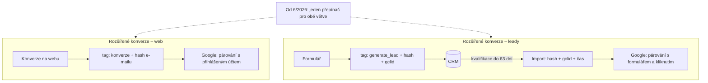

# E2: Rozšířené konverze (enhanced conversions) pro web i leady – brief
> Cluster: E. Formuláře, leady & uživatelská data · URL: /blog/rozsirene-konverze · Formát: technický návod · Priorita: měsíc 1 · Cílová LP: /sluzby/mereni-konverzi · Rozsah: 2 800–3 300 slov (+ kód)

---

## 1. Meta

| Prvek | Návrh |
|---|---|
| H1 | Rozšířené konverze Google Ads v roce 2026: web i leady |
| SEO title (60 zn.) | Rozšířené konverze Google Ads 2026: nastavení \| datalayer.cz |
| Meta description (140 zn.) | Co jsou rozšířené konverze, co se od 4/2026 změnilo, jak normalizovat a hashovat e-mail a telefon, jak je nastavit přes GTM a jak je ověřit. |
| URL | /blog/rozsirene-konverze |
| Schema | `BlogPosting` + `FAQPage` + `BreadcrumbList`; `HowTo` nepoužívat (Google ho v SERP už nezobrazuje – ověřit) |

**Klíčová slova:**

| Typ | Slovo | Objem/měs. (Ahrefs CZ) | Poznámka |
|---|---|---|---|
| hlavní | rozšířené konverze google ads | – (SERP 8. 10. 2026) | top 10 = 3× support.google.com, shoptet, marketingppc |
| hlavní (EN) | enhanced conversions | 10 | mapováno na `lp-konverze` |
| vedlejší (EN) | enhanced conversions for leads | 10 | PAA: „What are enhanced Conversions for leads?“, „Why might an advertiser use enhanced Conversions for leads?“ |
| vedlejší | google ads konverze | 30 | z `lp-konverze` |
| vedlejší | google ads conversion tracking | 10 | |
| long-tail | rozšířené konverze gtm, rozšířené konverze pro potenciální zákazníky, user-provided data gtm, sha256 email google ads | 0 | H3 a FAQ |

**Záměr:** informační/technický („jak nastavit“), částečně problémový („proč diagnostika hlásí chybu“).

**Cílový čtenář:** PPC specialista nebo marketingový manažer, který má Google Ads konverze nastavené a slyšel, že rozšířené konverze „zvýší počet konverzí“; vývojář, který má dodat hash. Segment: e-shopy i B2B (leady), velké firmy (governance, souhlas).

---

## 2. Analýza SERP a konkurence

**„rozšířené konverze google ads“ (8. 10. 2026):** 1. support.google.com (Rozšířené konverze – nápověda), 2. support.google.com (Doporučené postupy), 3. blog.shoptet.cz, 4. marketingppc.cz (~2 200 slov dle profilu), 5. integritty.cz, 6. support.google.com (rozšířené konverze na úrovni účtu), 7. remedio.cz, 8. hanakobzova.cz (nastavení přes GTM), 9. business.google.com.
**„enhanced conversions for leads“:** 3× Google (support, business.google), customerlabs, websiteinsights.net, reddit, Adobe, LinkedIn.

**Co chybí:**
1. **Stav po dubnu 2026** – sjednocení „pro web“ a „pro leady“ do jednoho přepínače, zrušení výběru metody v rozhraní, Data Manager API od 15. 6. 2026. Česká konkurence (dle profilů) popisuje starší stav – ověřit u marketingppc.cz a shoptetu datum aktualizace.
2. **Normalizace v detailu** a rozdíl Google vs. Meta (telefon s `+` vs. bez), Gmail tečky a `+přípona`, proč musí web a CRM hashovat stejně.
3. **Souhlas** (`ad_user_data`, podmínky pro zákaznická data) jen okrajově, často chybí vysvětlení, že hash ≠ anonymizace.
4. **Diagnostika** (parametr `em`, report diagnostiky, typické chyby) – v češtině skoro nikde.

**Čím je přeskočíme:** aktuální časová osa 2025–2026 z primárních zdrojů, srovnání metod nasazení v tabulce, funkční normalizační funkce (JS + SQL pro export z CRM), tabulka chyb diagnostiky a jejich oprav, diagram „web vs. leady“.

---

## 3. Otázky, na které musí článek odpovědět

1. Co jsou rozšířené konverze a co řeší?
2. Jaký je rozdíl mezi rozšířenými konverzemi pro web a pro leady – a platí ještě?
3. Co se v Google Ads změnilo v roce 2026?
4. Jaká data se posílají a v jaké podobě?
5. Jak správně normalizovat e-mail, telefon, jméno a adresu?
6. Musí hashovat web, nebo to udělá Google tag?
7. Potřebuji souhlas návštěvníka? Co dělá `ad_user_data`?
8. Jak rozšířené konverze nastavit přes Google tag, GTM, server-side a Data Manager?
9. Jak ověřit, že fungují, a co znamenají hlášky diagnostiky?
10. Jaké jsou nejčastější chyby?
11. Kolik konverzí navíc to přinese?
12. Jak to souvisí s Meta (advanced matching / CAPI) a GA4 (user-provided data)?

---

## 4. Rychlá odpověď (hotový text, 59 slov)

> Rozšířené konverze doplňují konverzní tag Google Ads o hashovaný e-mail, telefon nebo adresu zákazníka. Google je spáruje s přihlášenými účty a přiřadí konverze, které by bez cookies chyběly. Od června 2026 je to jeden přepínač pro web i leady. Data musí být normalizovaná, hashovaná SHA-256 a odeslaná jen se souhlasem `ad_user_data`.

---

## 5. Osnova s obsahem odpovědí

### H2 1: Co jsou rozšířené konverze (a co nejsou)
**Klíčové sdělení:** Rozšířené konverze zpřesňují *přiřazení* konverze ke kliknutí na reklamu. Nejsou remarketing, neobcházejí souhlas a nevyrobí konverze, které se nestaly.

**Obsah odpovědi:**
- Princip: v okamžiku konverze (nákup, odeslání formuláře) tag pošle kromě běžných údajů i **hash uživatelských údajů** (user-provided data). Google ho porovná s hashovanými údaji přihlášených uživatelů, kteří viděli nebo klikli na reklamu, a konverzi přiřadí i tehdy, když chybí cookie nebo proběhla na jiném zařízení.
- **Pro web:** doplnění online konverze v reálném čase.
- **Pro leady:** hash z formuláře se uloží u Googlu; když lead později konvertuje v CRM, importujete konverzi se stejným hashem (a gclid, pokud ho máte) – Google ji spáruje s původním kliknutím. Google je popisuje jako „vylepšenou verzi importu offline konverzí“ (answer/15713840).
- Co nejsou: nejde o sdílení e-mailu v čitelné podobě; nejde o cílení (to je Customer Match – E4); nejde o náhradu Consent Mode.
- Přínos: Google uvádí přesnější reporting a lepší podklady pro automatické bidding strategie, u leadů i cross-device a engaged-view konverze. **Konkrétní procento nárůstu neuvádět** bez vlastních dat → **[DOPLNIT: čísla z projektu klienta, pokud budou]**.

### H2 2: Co se změnilo v roce 2026: jeden přepínač pro web i leady
**Klíčové sdělení:** Od dubna 2026 Google přijímá uživatelská data současně z tagu, Data Manageru i API a od června 2026 mají rozšířené konverze pro web i leady jeden přepínač. Nové importy přes Google Ads API od 15. 6. 2026 končí – nastupuje Data Manager API.

**Obsah odpovědi – časová osa (tabulka, kompletní):**

| Datum | Změna | Zdroj |
|---|---|---|
| 9. 12. 2025 | Spuštění Data Manager API (REST/gRPC) pro offline konverze, rozšířené konverze pro leady a Customer Match | ppc.land (sekundární) – ověřit v Google Ads Developer Blogu |
| 2. 2. 2026 | Google Ads API přestává přijímat nové uživatele „session attributes“ a IP adres v importu konverzí | ppc.land (sekundární) – ověřit |
| duben 2026 | Google Ads přijímá uživatelská data z tagů, Data Manageru a API zároveň; stávající uživatelé převedeni automaticky (pokud přijali podmínky) | support.google.com/google-ads/answer/16884284 |
| červen 2026 | V účtu zmizí výběr metody (tag vs. API) | answer/16884284; Search Engine Land 10. 4. 2026 |
| **15. 6. 2026** | Importy offline konverzí a rozšířených konverzí pro leady přes Google Ads API zablokovány pro vývojářské tokeny bez nahrávání offline konverzí v období 17. 12. 2025 – 15. 6. 2026; náhrada = Data Manager API | answer/16884284; answer/15713840; developers.google.com/google-ads/api/docs/conversions/upload-offline; developers.google.com/google-ads/api/docs/deprecations |

- **Kde to zapnout dnes:** Cíle → Nastavení → *Customer data use* → „Turn on enhanced conversions“ → souhlas s podmínkami (lze i na úrovni konverzní akce; odhlášení na úrovni akce zůstává). Uvést přesné české popisky z rozhraní – **[DOPLNIT: screenshot z účtu klienta v češtině]**.
- **Co to znamená pro vás:** (1) kdo měl rozšířené konverze zapnuté, nemusí nic dělat, (2) kdo importuje offline konverze vlastním skriptem přes Google Ads API, musí ověřit, zda je jeho token na allowlistu, a naplánovat přechod na Data Manager API (E3), (3) výběr „metody“ už neřešíte v rozhraní – řešíte kvalitu a konzistenci dat ze všech zdrojů.

**Vizuál:** horizontální časová osa (viz kap. 6).

### H2 3: Jak to funguje: web vs. leady v jednom obrázku
**Klíčové sdělení:** U webu se hash posílá s konverzí. U leadů se hash posílá dvakrát – při odeslání formuláře (tagem) a při importu konverze z CRM. Oba hashe musí být stejné.

**Obsah odpovědi:**
- Krok za krokem (leady): formulář → tag pošle `generate_lead` + hash e-mailu + gclid (cookie) → lead v CRM → po kvalifikaci export: hash e-mailu (+ gclid) + čas + konverzní akce → Google spáruje s formulářovou událostí a kliknutím.
- Pravidla: GCLID je povinný, pokud *nepoužíváte tag* ke sběru uživatelských dat; i s tagem Google doporučuje gclid přikládat, kdykoli ho máte (answer/15713840).
- Časové okno: konverze s uživatelskými daty nahrajte **do 63 dní** od kliknutí (s GCLID do 90 dní) – answer/10029210.

**Vizuál:** diagram 1 (kap. 6).

### H2 4: Jaká data se posílají a jak je normalizovat
**Klíčové sdělení:** Úspěšnost párování stojí na normalizaci. Stejný e-mail napsaný dvakrát jinak = dva různé hashe.

**Obsah odpovědi – tabulka polí (kompletní):**

| Údaj | Klíč v Google tagu (nehashované / hashované) | Normalizace před SHA-256 | Hashovat? | Meta CAPI (pro srovnání) |
|---|---|---|---|---|
| E-mail | `email` / `sha256_email_address` | ořezat mezery, malá písmena; **gmail.com, googlemail.com**: odstranit tečky v části před `@` a `+` vč. všeho za ním | ano | `em`: ořezat, malá písmena |
| Telefon | `phone_number` / `sha256_phone_number` | **E.164 s `+`** a kódem země (`+420777123456`) | ano | `ph`: **jen číslice** s kódem země, bez `+` a úvodních nul (`420777123456`) |
| Jméno | `address.first_name` / `address.sha256_first_name` | malá písmena, bez titulů a mezer na okrajích | ano | `fn` |
| Příjmení | `address.last_name` / `address.sha256_last_name` | malá písmena, bez přípon | ano | `ln` |
| Ulice | `address.street` | malá písmena | ano (Google Ads API) | – |
| Město | `address.city` | malá písmena | **ne** | `ct` (Meta hashuje) |
| Kraj | `address.region` | | **ne** | `st` |
| PSČ | `address.postal_code` | bez mezer (CZ: `11000`) | **ne** | `zp` (Meta hashuje) |
| Země | `address.country` | ISO 3166-1 alpha-2 (`CZ`) | **ne** | `country` (Meta hashuje) |

- Google tag přijme až 3 e-maily a 3 telefony a 2 adresy v polích; všechny hodnoty jako string; prázdná pole vynechat (answer/13258081).
- Formát hashe: SHA-256, hex (malá písmena), 64 znaků. Data Manager API přijímá hex i Base64 (u Base64 záleží na velikosti písmen).
- **Rozpor v dokumentaci (uvést férově):** nápověda Google tagu u Gmailu zmiňuje jen odstranění teček; dokumentace Data Manager API a Google Ads API i odstranění `+přípony`. Doporučení: používat pravidla Data Manager API **na webu i v exportu z CRM** – jen tak vzniknou stejné hashe. Ověřit před publikací, zda Google texty nesjednotil.
- **Kód – normalizace a hash v prohlížeči** (vychází z prototypu formuláře datalayer.cz):

```js
// Normalizace podle Google (Data Manager API) – stejná funkce musí běžet i v exportu z CRM
function normalizeEmail(v) {
  var e = (v || '').replace(/\s+/g, '').toLowerCase();
  var at = e.lastIndexOf('@');
  if (at < 1) return e;
  var local = e.slice(0, at), domain = e.slice(at + 1);
  if (domain === 'gmail.com' || domain === 'googlemail.com') {
    local = local.split('+')[0].replace(/\./g, '');
  }
  return local + '@' + domain;
}

// E.164 pro Google (s „+“); pro Meta stačí výsledek bez „+“
function normalizePhoneE164(v, defaultCc) {
  if (!v) return '';
  var s = String(v).trim(), d = s.replace(/\D/g, '');
  if (s.charAt(0) === '+') return '+' + d;
  if (d.slice(0, 2) === '00') return '+' + d.slice(2);
  if (d.length === 9) return '+' + (defaultCc || '420') + d;   // české číslo bez předvolby
  return d ? '+' + d : '';
}

async function sha256Hex(str) {
  if (!str) return '';
  var buf = await crypto.subtle.digest('SHA-256', new TextEncoder().encode(str));
  return Array.from(new Uint8Array(buf)).map(function (b) { return b.toString(16).padStart(2, '0'); }).join('');
}
// Test: Jan.Novak@gmail.com → jannovak@gmail.com → 005ed88a887dbd4c32e8d7ca3665981df82512b3a7fbf451328ef0a46835d803
```

- **Kód – stejná normalizace v BigQuery pro export z CRM:**

```sql
-- Normalizace a hash e-mailu a telefonu v BigQuery (stejná pravidla jako na webu)
CREATE TEMP FUNCTION clean(e STRING) AS (LOWER(REGEXP_REPLACE(e, r'\s', '')));
CREATE TEMP FUNCTION norm_email(e STRING) AS (
  IF(
    REGEXP_EXTRACT(clean(e), r'@([^@]*)$') IN ('gmail.com', 'googlemail.com'),
    CONCAT(
      REPLACE(SPLIT(REGEXP_EXTRACT(clean(e), r'^(.*)@[^@]*$'), '+')[SAFE_OFFSET(0)], '.', ''),
      '@', REGEXP_EXTRACT(clean(e), r'@([^@]*)$')),
    clean(e)
  )
);
CREATE TEMP FUNCTION digits(p STRING) AS (REGEXP_REPLACE(p, r'\D', ''));
CREATE TEMP FUNCTION norm_phone_cz(p STRING) AS (
  CASE
    WHEN p IS NULL OR digits(p) = ''          THEN NULL
    WHEN STARTS_WITH(TRIM(p), '+')            THEN CONCAT('+', digits(p))
    WHEN STARTS_WITH(digits(p), '00')         THEN CONCAT('+', SUBSTR(digits(p), 3))
    WHEN LENGTH(digits(p)) = 9                THEN CONCAT('+420', digits(p))
    ELSE CONCAT('+', digits(p))
  END
);

SELECT
  lead_id,
  TO_HEX(SHA256(norm_email(email)))     AS sha256_email,
  TO_HEX(SHA256(norm_phone_cz(telefon))) AS sha256_phone
FROM `projekt.crm.leady`
WHERE faze = 'kvalifikovany' AND souhlas_ad_user_data = 'granted';
```
> Pro autora: SQL před publikací spustit v BigQuery na 3 testovacích hodnotách a porovnat s JS (stejné hashe).

### H2 5: Souhlas: `ad_user_data`, podmínky Googlu a GDPR (opatrně)
**Klíčové sdělení:** Bez souhlasu `ad_user_data` Google tag hashovaná data pro rozšířené konverze nepošle. Hash je pseudonymizace – údaje zůstávají osobními údaji.

**Obsah odpovědi:**
- Consent Mode v2 – 4 signály; `ad_user_data` = „souhlas s odesláním uživatelských dat Googlu pro online reklamu“. Při `denied` je podle dokumentace Googlu vypnut sběr mj. „Enhanced conversions: hashed first party data“ a `user_id` (developers.google.com/tag-platform/security/concepts/consent-mode).
- Při importu (leady): vyplnit pole `consent` (`adUserData`, `adPersonalization`) – Google uvádí, že bez něj nemusí být konverze přiřaditelné. Exportovat jen leady, u kterých máte souhlas zaznamenaný (E1: pole `consent_ad_user_data` v CRM).
- Podmínky: zapnutí vyžaduje přijetí *Customer data terms* / Data Processing Terms (answer/16884284).
- GDPR: recitál 26 – pseudonymizované údaje, které lze přiřadit osobě pomocí dalších informací, jsou osobní údaje. Informovat v zásadách zpracování OÚ (předání Googlu jako příjemci), právní titul posoudit s právníkem.
- Automatický sběr a sběr přes CSS selektory podle nápovědy Googlu používají reklamní cookie – podléhají `ad_storage` (answer/13258081).
- Disclaimer „nejde o právní radu“ + odkaz A1, A3.

### H2 6: Nastavení: Google tag, GTM, server-side a Data Manager
**Klíčové sdělení:** Metod je víc a od 2026 je lze kombinovat. Pro web s vlastním formulářem doporučujeme hash z dataLayeru (kód) přes GTM; automatická detekce je pohodlná, ale méně předvídatelná.

**Obsah odpovědi – srovnávací tabulka (kompletní):**

| Metoda | Jak | Výhody | Rizika | Kdy použít |
|---|---|---|---|---|
| Google tag – automatická detekce | tag hledá na stránce řetězce podobné e-mailu/telefonu | bez vývojáře | může zachytit špatný údaj (e-mail v patičce), závisí na DOM | rychlý start, malé weby |
| Google tag – CSS selektory / JS proměnné | ukážete na prvek nebo proměnnou | bez zásahu do kódu webu | křehké po redesignu | weby bez dataLayeru |
| Google tag – kód (`gtag('set','user_data',…)`) | vývojář nastaví data před konverzí | přesné, „code snippet data is always prioritized“ | vyžaduje vývojáře | vlastní weby, e-shopy |
| **GTM – proměnná User-Provided Data (Code) z dataLayeru** | hash v `user_data` z dataLayeru → proměnná → konverzní tag | přesné, kontrolované, sdílené s Meta | správná normalizace na webu | **doporučeno** (datalayer.cz) |
| Server-side GTM | stejná data posílá server | méně JS v prohlížeči, kontrola dat | nutnost sGTM, stejná pravidla souhlasu | weby se sGTM (B1) |
| Data Manager (UI) / Data Manager API | import konverzí z CRM/BigQuery se hashem | jediná cesta pro leady po 15. 6. 2026 (nové integrace) | správa OAuth, mapování polí | leady, offline (E3) |

- **Kód – Google tag s předhashovanými daty:**

```js
// Na stránce konverze, před odesláním konverze (gtag.js)
gtag('set', 'user_data', {
  sha256_email_address: '005ed88a887dbd4c32e8d7ca3665981df82512b3a7fbf451328ef0a46835d803',
  sha256_phone_number: '…64 hex znaků…',
  address: {                               // volitelně
    sha256_first_name: '…',
    sha256_last_name: '…',
    postal_code: '11000',                  // nehashovat
    country: 'CZ'                          // nehashovat
  }
});
gtag('event', 'conversion', {
  send_to: 'AW-XXXXXXXXX/YYYYYYYYYYY',     // [DOPLNIT]
  transaction_id: 'L-mg3k2-4f9a'           // ID leadu / objednávky – deduplikace
});
```
- **GTM krok za krokem (s očíslovanými screenshoty – [DOPLNIT: screenshoty z testovacího kontejneru]):**
  1. Proměnná *Data Layer Variable* `user_data` (verze 2).
  2. Proměnná *User-Provided Data* → typ *Code* → vybrat `DLV - user_data`.
  3. Tag *Google Ads Conversion Tracking* → zaškrtnout „Include user-provided data from your website“ → vybrat proměnnou z kroku 2; *Transaction ID* = `lead_id`/`transaction_id`.
  4. *Conversion Linker* na všech stránkách.
  5. Náhled → ověřit (H2 7).
- Pozor u SPA a opakovaných formulářů: před novým pushem vyčistit `user_data` (`dataLayer.push({ user_data: null })`), jinak se může poslat hash předchozího leadu.
- GA4 alternativa: *user-provided data collection* v GA4 (open beta) – data lze hashovat sami nebo je nechat hashovat; slouží i pro rozšířené konverze v propojeném Google Ads (answer/14077171). Uvést jako možnost, ne jako hlavní cestu.

### H2 7: Diagnostika a ověření
**Klíčové sdělení:** Ověřit jde hned v prohlížeči a po ~72 hodinách v diagnostice Google Ads. Dopad na konverze se ukáže zhruba po 30 dnech.

**Obsah odpovědi:**
- **V prohlížeči:** DevTools → Network → požadavek na `googleadservices.com/pagead/conversion/` nebo `google.com/pagead/1p-conversion/` → Payload → parametr `em` začínající `tv.1~em` následovaný hashem. Samotné `tv.1~em` bez hashe = data nebyla v okamžiku konverze k dispozici (answer/13258081).
- **V Google Ads:** Cíle → Souhrn → konverzní akce → Diagnostika – report je k dispozici zhruba 72 hodin po nasazení; výsledky dopadu přibližně po 30 dnech.
- **U leadů:** *Offline data diagnostics* po importu + checklist implementace (answer/14274408).
- **Tabulka typických hlášek a oprav (kompletní, formulace hlášek ověřit v rozhraní):**

| Příznak / hláška | Pravděpodobná příčina | Oprava |
|---|---|---|
| Nízké pokrytí (málo konverzí s uživatelskými daty) | data chybí v okamžiku konverze; formulář bez e-mailu | push `user_data` před konverzí; e-mail jako povinné pole |
| Chybně formátovaná data | telefon bez `+420`, hash velkými písmeny / Base64, nehashovaný e-mail v `sha256_` poli | normalizační funkce z H2 4 |
| `tv.1~em` bez hashe | `user_data` nastaveno po odeslání konverze | pořadí: nejdřív data, pak konverze |
| Konverze s uživatelskými daty jen u části návštěvníků | `ad_user_data = denied` | očekávané chování – neopravovat obcházením |
| Leady se nespárují při importu | jiná normalizace v CRM než na webu; import po 63 dnech | sdílená funkce (JS/SQL); denní export |
| Duplicitní konverze | chybí transaction ID; dvě primární akce | `transaction_id` = ID leadu; jedna primární akce |

**Vizuál:** mockup DevTools Network s payloadem (kap. 6).

### H2 8: Nejčastější chyby
1. Posílání **nehashovaného** e-mailu do pole `sha256_email_address` (nebo naopak hash do `email` → Google ho zahashuje podruhé).
2. Telefon bez kódu země; pro Meta s `+`, pro Google bez `+` (obráceně, než má být).
3. Různé normalizace na webu a v CRM.
4. Hash e-mailu jako parametr GA4 události nebo v URL.
5. Automatická detekce zachytí e-mail z patičky / chatu.
6. Rozšířené konverze zapnuté, ale chybí přijetí podmínek → data se nesbírají.
7. Nový import přes vlastní skript Google Ads API po 15. 6. 2026 bez allowlistu → tiché selhání (`CUSTOMER_NOT_ALLOWLISTED_FOR_THIS_FEATURE`, zdroj: developers.google.com/google-ads/api/docs/deprecations).
8. Očekávání, že rozšířené konverze „vrátí“ konverze lidí, kteří odmítli souhlas.

### H2 9: Meta, GA4 a další platformy
**Klíčové sdělení:** Stejný hash z dataLayeru využijete i pro Meta (advanced matching / CAPI), jen s jinou normalizací telefonu.
- Meta: `em`, `ph`, `fn`, `ln`, `external_id`…; telefon jen číslice s kódem země; `client_ip_address`, `fbc`, `fbp` se nehashují (developers.facebook.com – customer information parameters). Detail v B5.
- GA4: user-provided data collection (open beta) – E4.
- Sklik: rozšířené konverze v tomto smyslu Sklik k 10/2026 nemá (ověřit) – měření konverzí přes Seznam Event Measurement (B6).

---

## 6. Vizuály

### Diagram 1: Web vs. leady (pod H2 3)

**Finální SVG:** dva sloupce vedle sebe (desktop), pod sebou (mobil). Levý „web“ = 3 kroky v cyan, pravý „leady“ = 5 kroků, zpětná šipka z CRM oranžová s popiskem „do 63 dní“. Nad oběma pruh „1 přepínač od 4/2026“ s ikonou přepínače (piktogram `consent` styl). Hashe zobrazit monospace zkráceně `005ed88a…d803`.

### Časová osa 2025–2026 (pod H2 2)
- Vodorovná osa (mobil svisle): 9. 12. 2025 Data Manager API · 2. 2. 2026 session attributes · 4/2026 data z více zdrojů · 6/2026 jeden přepínač · **15. 6. 2026 Google Ads API → Data Manager API** (zvýraznit oranžovou). U každého bodu 1 řádek textu a odkaz na zdroj. Data z H2 2 tabulky.

### Infografika „Normalizace v 5 krocích“ (pod H2 4; i 1080×1350 pro LinkedIn)
- Pás 5 bloků: `" Jan.Novak+web@Gmail.com "` → ořez → malá písmena → Gmail pravidla → `jannovak@gmail.com` → SHA-256 `005ed88a…d803`. Druhý řádek pro telefon: `777 123 456` → `+420777123456` (Google) / `420777123456` (Meta). Brand barvy, mono písmo.

### Tabulky (kompletní obsah v kap. 5)
Časová osa (H2 2) · Pole a normalizace (H2 4) · Metody nasazení (H2 6) · Diagnostika (H2 7).

### Mockupy
1. **DevTools Network** (H2 7): seznam požadavků, vybraný `1p-conversion/…`, záložka Payload s řádkem `em: tv.1~em~005ed88a…` (stylizované, fiktivní hodnoty).
2. **Google Ads → Diagnostika rozšířených konverzí** (H2 7): stavová karta „Funguje správně“ / „Vyžaduje pozornost“ – **[DOPLNIT: reálný screenshot z účtu klienta, anonymizovaný]**; do té doby stylizovaný mockup bez loga Google.

---

## 7. Fakta a zdroje

| Tvrzení | Zdroj | Ověřeno | Riziko zastarání |
|---|---|---|---|
| Rozšířené konverze pro leady = vylepšený import offline konverzí s uživatelskými daty; GCLID povinný bez tagu, jinak doporučený | https://support.google.com/google-ads/answer/15713840 | 10/2026 | vysoké |
| Od 4/2026 data z tagů, Data Manageru a API současně; od 6/2026 jeden přepínač pro web i leady (zmizí výběr metody); 15. 6. 2026 přesun do Data Manager API | https://support.google.com/google-ads/answer/16884284 ; https://searchengineland.com/google-ads-simplifies-enhanced-conversions-into-a-single-switch-474101 | 10/2026 | **vysoké** |
| Data Manager API spuštěno 9. 12. 2025; session attributes stop pro nové uživatele 2. 2. 2026 | https://ppc.land/google-blocks-new-offline-conversion-imports-via-ads-api-from-june-15/ (sekundární – ověřit v Google Ads Developer Blogu) | 10/2026 | vysoké |
| Chybový kód allowlistu `CUSTOMER_NOT_ALLOWLISTED_FOR_THIS_FEATURE` (tokeny bez nahrávání offline konverzí 17. 12. 2025 – 15. 6. 2026) | https://developers.google.com/google-ads/api/docs/deprecations | 10/2026 | vysoké |
| Klíče `sha256_email_address`, `sha256_phone_number`, `address.*`; max. 3 e-maily/telefony, 2 adresy; ověření `tv.1~em`; diagnostika ~72 h; dopad ~30 dní | https://support.google.com/google-ads/answer/13258081 | 10/2026 | střední |
| Normalizace (Gmail tečky + `+přípona`, E.164, nehashovat zemi/PSČ), hex/Base64 | https://developers.google.com/data-manager/api/devguides/concepts/formatting ; https://developers.google.com/google-ads/api/docs/conversions/enhanced-conversions/web | 10/2026 | střední |
| Okno 63 dní (uživatelská data) a 90 dní (GCLID) | https://support.google.com/google-ads/answer/10029210 ; https://support.google.com/google-ads/answer/15081888 | 10/2026 | střední |
| `ad_user_data` denied → vypnuty hashované first-party údaje pro rozšířené konverze | https://developers.google.com/tag-platform/security/concepts/consent-mode | 10/2026 | střední |
| Pole `consent` při importu „highly recommended“ | https://developers.google.com/google-ads/api/docs/conversions/upload-offline | 10/2026 | střední |
| Postup přechodu na rozšířené konverze pro leady (primární/sekundární akce po 1–2 cyklech nebo 4 týdnech) | https://support.google.com/google-ads/answer/14274408 | 10/2026 | střední |
| GA4 user-provided data collection (open beta) | https://support.google.com/analytics/answer/14077171 | 10/2026 | vysoké |
| Meta: normalizace `em`, `ph` (číslice s kódem země), nehashované `fbc`, `fbp`, IP | https://developers.facebook.com/docs/marketing-api/conversions-api/parameters/customer-information-parameters | 10/2026 | nízké |
| Pseudonymizované údaje = osobní údaje (recitál 26 GDPR) | https://eur-lex.europa.eu/legal-content/CS/TXT/?uri=CELEX:32016R0679 | 10/2026 | nízké |

---

## 8. Interní odkazy a CTA

**Cílová LP:** `/sluzby/mereni-konverzi`.

**Kontextový CTA box** (za H2 6):
- Nadpis: **Rozšířené konverze bez chyb v normalizaci**
- Text: „Nastavíme rozšířené konverze přes GTM nebo server-side, sjednotíme hashování na webu a v CRM a ověříme výsledek v diagnostice Google Ads – v souladu s Consent Mode.“
- Tlačítko: `[ Měření konverzí ]` → /sluzby/mereni-konverzi

**Související články:** E1 Měření formulářů a leadů (pilíř) · E3 Offline konverze z CRM · E4 First-party data · A1 Consent Mode v2 · A3 Osobní údaje v analytice · B5 Meta Conversions API · B1 Server-side tracking – průvodce · C3 Google Tag Manager – průvodce · D2 Proč nesedí čísla.

**Slovník:** Rozšířené konverze · Consent Mode · Offline konverze · GCLID / gbraid / wbraid · Conversions API · Event Match Quality · Datová vrstva.

**Zkrácený kontaktní blok:** `form_id: blog` · téma `konverze` · H2 „Řešíte totéž u sebe?“ · placeholder „Např. diagnostika rozšířených konverzí hlásí chybně formátovaná data…“

---

## 9. FAQ pro schema

**Co jsou rozšířené konverze v Google Ads?**
Jsou to doplňková data ke konverznímu tagu: hashovaný e-mail, telefon nebo adresa zákazníka. Google je spáruje s přihlášenými uživateli, kteří viděli nebo klikli na reklamu, a přiřadí konverze, které by bez cookies nebo při změně zařízení chyběly. Nejde o cílení reklamy ani o posílání údajů v čitelné podobě.

**Jaký je rozdíl mezi rozšířenými konverzemi pro web a pro leady?**
U webu se hash posílá spolu s online konverzí. U leadů se hash zachytí při odeslání formuláře a znovu se pošle při importu konverze z CRM, například po kvalifikaci. Od června 2026 je Google zapíná jedním přepínačem do jednoho nastavení, princip párování ale zůstává.

**Musím e-mail hashovat sám?**
Nemusíte. Google tag a GTM umí nehashované údaje zahashovat samy. Pokud ale stejná data importujete i z CRM, doporučujeme hashovat na webu i v exportu stejnou funkcí, aby vznikly identické hashe. Používejte SHA-256 v hex formátu a normalizaci podle dokumentace Googlu.

**Potřebuji k rozšířeným konverzím souhlas návštěvníka?**
V EU ano, v praxi se to řídí signálem ad_user_data v Consent Mode: když je zamítnutý, Google tag hashovaná data pro rozšířené konverze neposílá. Google navíc vyžaduje přijetí podmínek pro zákaznická data. Hash je pseudonymizace, takže jde stále o osobní údaje. Nastavení konzultujte s právníkem.

**Jak poznám, že rozšířené konverze fungují?**
V DevTools v požadavku konverze Google Ads hledejte parametr em s hodnotou začínající tv.1~em a hashem. Zhruba po 72 hodinách se v Google Ads zobrazí diagnostika konverzní akce s pokrytím a případnými chybami formátu. Dopad na počet konverzí Google vyhodnocuje přibližně po 30 dnech.

---

## 10. Poznámky pro autora

- **Nejvyšší riziko zastarání v celém clusteru** – Google mění rozhraní i API v roce 2026 průběžně. Před publikací znovu ověřit answer/16884284 a answer/15713840 (data, názvy tlačítek), revize **každé 3 měsíce** do konce 2026.
- Sekundární zdroje (ppc.land, Search Engine Land) jen pro datum oznámení; v textu citovat primárně support.google.com / developers.google.com.
- Rozpor v pravidlech Gmail (`+přípona`) výslovně uvést jako „ověřit“ – nepsat kategoricky.
- Neuvádět procenta nárůstu konverzí bez vlastních dat. **[DOPLNIT: anonymizovaný údaj klienta „pokrytí rozšířených konverzí X % před/po opravě normalizace“, pokud existuje]**.
- **[DOPLNIT: screenshoty z Google Ads v češtině – nastavení Customer data use, diagnostika]**, **[DOPLNIT: screenshoty GTM proměnné User-Provided Data]**.
- Prototyp formuláře datalayer.cz (`kontakt.js`) aktualizovat podle normalizační funkce v H2 4 (doplnit odstranění `+přípony` u Gmailu) – jinak článek a vlastní web nebudou konzistentní.
- Recenzent: Vít Novotný; právní část H2 5 – externí právník.
