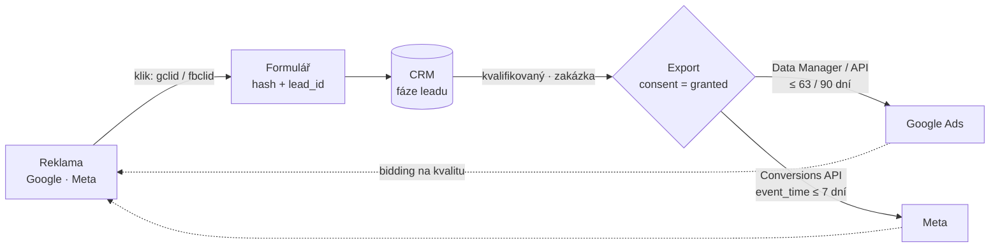
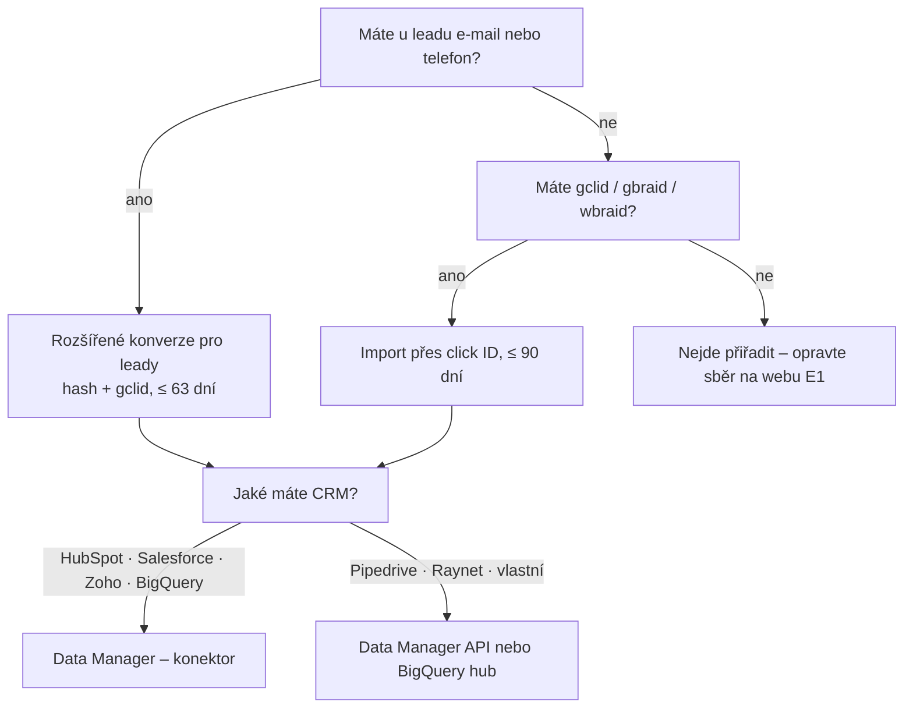
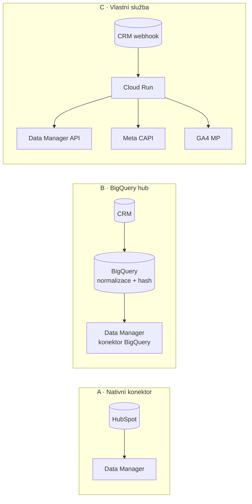

# E3: Offline konverze z CRM do Google Ads a Meta – brief
> Cluster: E. Formuláře, leady & uživatelská data · URL: /blog/offline-konverze-z-crm · Formát: technický návod + rozhodovací průvodce · Priorita: měsíc 1 · Cílová LP: /reseni/b2b-a-lead-generation · Rozsah: 3 000–3 500 slov (+ kód)

---

## 1. Meta

| Prvek | Návrh |
|---|---|
| H1 | Offline konverze z CRM do Google Ads a Meta (stav 2026) |
| SEO title (58 zn.) | Offline konverze z CRM do Google Ads a Meta \| datalayer.cz |
| Meta description (155 zn.) | Jak posílat kvalifikované leady a zakázky z CRM do Google Ads a Meta: GCLID, rozšířené konverze pro leady, Data Manager API, Conversions API a časová okna. |
| URL | /blog/offline-konverze-z-crm |
| Schema | `BlogPosting` + `FAQPage` + `BreadcrumbList` |

**Klíčová slova:**

| Typ | Slovo | Objem/měs. (Ahrefs CZ) | Poznámka |
|---|---|---|---|
| hlavní (SERP) | offline konverze google ads crm | – (SERP 8. 10. 2026) | „B2B mezera“ dle analýzy konkurence |
| vedlejší | crm integrace | 50 | `lp-b2b` |
| vedlejší (EN) | offline conversion tracking | 10 | `lp-konverze` |
| vedlejší (EN) | meta conversions api / conversions api / fb conversion api | 10 / 10 / 10 | B5 je pilíř CAPI – zde jen CRM část |
| long-tail (0) | crm google ads, zoho crm google ads, hubspot google ads offline konverze, import offline konverzí, gclid import, conversions api crm | 0 | H3 a FAQ |
| otázky | jak importovat offline konverze, jak dlouho po kliknutí lze nahrát konverzi, co je gbraid a wbraid, jak poslat kvalifikovaný lead do Meta | – | z praxe |

**Záměr:** technický/rozhodovací – „jak to propojit s naším CRM a kterou cestou“.

**Cílový čtenář:** head of marketing / PPC lead v B2B firmě s CRM (HubSpot, Pipedrive, Raynet, Salesforce), sales ops / CRM administrátor, vývojář integrace. Segment: B2B / lead-gen, velké firmy.

---

## 2. Analýza SERP a konkurence

**„offline konverze google ads crm“ (8. 10. 2026):** 1. support.google.com (Časté dotazy k importům offline konverzí), 2. tmrw.marketing (Offline konverze v Google Ads – Google Sheets/Zapier/CRM), 3. support.google.com (Nastavení pomocí GCLID), 4. reklamix.sk (Měření poptávek: Google Ads, CRM a offline konverze), 5. attributer.io, 6. tmrw.marketing (2. 5. 2026, ~450 slov, bez techniky), 7. reddit r/PPC, 8. YouTube, 9. shopify.com.

**Co chybí:**
1. **Změny 2026:** sjednocené rozšířené konverze (4/2026), blok nových importů přes Google Ads API od **15. 6. 2026**, Data Manager a Data Manager API jako nová hlavní cesta – nikdo z českých výsledků.
2. **Meta:** konec starší Offline Conversions API (od Graph API v17.0 nepřijímá offline události), Conversions API pro CRM jen pro Lead Ads, co dělat s webovými leady – nikde.
3. **Mapování fází CRM**, hodnoty, časová okna v jedné tabulce – nikde.
4. Konkrétní **integrace s českými CRM** (Raynet) a s Pipedrive – nikde; HubSpot jen obecně.
5. Kód / payloady – jen v anglických zdrojích.

**Čím je přeskočíme:** aktuální rozhodovací strom metod (Google i Meta), tabulka časových oken, ukázkové JSON payloady pro Data Manager API a Meta CAPI ověřené proti referenci, 3 architektury integrace (nativní konektor / BigQuery hub / vlastní služba), tabulka CRM.

---

## 3. Otázky, na které musí článek odpovědět

1. Co jsou offline konverze a proč je posílat zpátky do reklamních systémů?
2. Jaké metody importu má Google Ads k 10/2026 a kterou zvolit?
3. Co znamená změna z 15. 6. 2026 pro můj skript nebo integraci?
4. Co je GCLID, gbraid a wbraid a co když gclid nemám?
5. Jak dlouho po kliknutí můžu konverzi nahrát?
6. Jak posílat offline konverze do Meta po konci Offline Conversions API?
7. Funguje Meta Conversions API pro CRM i pro leady z webu?
8. Které fáze CRM posílat a na kterou optimalizovat?
9. Jakou hodnotu konverzím přiřadit?
10. Jak to napojit na HubSpot, Pipedrive nebo Raynet?
11. Jak ověřím, že import funguje?
12. Jak řešit souhlas u offline konverzí?

---

## 4. Rychlá odpověď (hotový text, 60 slov)

> Offline konverze jsou fáze leadu z CRM (kvalifikace, zakázka), které pošlete zpět do reklamních systémů. Pro Google Ads použijte rozšířené konverze pro leady – hash e-mailu nebo telefonu plus gclid – přes Data Manager nebo Data Manager API, do 63 dní od kliknutí. Pro Meta posílejte fáze přes Conversions API; optimalizace „Conversion Leads“ funguje jen pro Lead Ads.

---

## 5. Osnova s obsahem odpovědí

### H2 1: Proč posílat výsledky z CRM zpět do reklam
**Klíčové sdělení:** Reklamní systém optimalizuje na to, co mu pošlete. Když dostane jen „formulář“, hledá lidi, kteří vyplňují formuláře. Když dostane „zakázku za 180 000 Kč“, hledá podobné zákazníky.

**Obsah odpovědi:**
- Tři přínosy: (1) **bidding** na kvalitu (kvalifikovaný lead, zakázka, hodnota), (2) **reporting** v rozhraní Google Ads/Meta odpovídá CRM, (3) **rozpočty** mezi kampaněmi podle CPO, ne CPL.
- Navazuje na E1 (sběr gclid, hash, lead_id, souhlas) – v úvodu odkázat: „Bez dat z formuláře offline import nefunguje – postup sběru je v článku Měření formulářů a leadů.“
- Ukázkový příklad (označit): kampaň „obecná klíčová slova“ CPL 600 Kč, 0 zakázek za čtvrtletí; kampaň „brand + konkurence“ CPL 1 100 Kč, 3 zakázky. Po importu fáze „Kvalifikovaný lead“ jako primární konverze Smart Bidding přesouvá rozpočet – **[DOPLNIT: reálný anonymizovaný případ klienta, pokud bude; jinak jen ilustrace bez čísel výsledku]**.

### H2 2: Co musíte mít připravené (checklist před importem)
**Obsah odpovědi (zaškrtávací seznam):**
- [ ] Automatické značkování (auto-tagging) v Google Ads zapnuté.
- [ ] U každého leadu v CRM: `gclid` / `gbraid` / `wbraid` (pokud přišel z Google Ads), `fbclid`/`fbc` (Meta), **hash e-mailu a telefonu** (nebo čitelný údaj, který zahashuje export), `lead_id`, **čas vzniku**, **stav souhlasu** `ad_user_data` (E1, H2 4 a 6).
- [ ] Na webu Google tag s rozšířenými konverzemi pro leady – sbírá hash při odeslání formuláře (E2).
- [ ] Definované fáze v CRM s jasnými kritérii (kdo a kdy označí „kvalifikovaný“).
- [ ] Hodnota pro každou fázi (H2 6).
- [ ] Vlastník procesu (sales ops / marketing) a monitoring (H2 9).

### H2 3: Google Ads k 10/2026: metody importu a kterou zvolit
**Klíčové sdělení:** Pro nové integrace Google doporučuje rozšířené konverze pro leady. Klasický import přes GCLID dál funguje, ale Google radí ho „upgradovat“. Kanálem je Data Manager (UI s konektory) nebo Data Manager API; Google Ads API pro nové importy od 15. 6. 2026 ne.

**Obsah odpovědi – tabulka „co posíláte“ (identifikátory):**

| Metoda | Identifikátor | Okno pro nahrání | Stav k 10/2026 | Kdy |
|---|---|---|---|---|
| **Rozšířené konverze pro leady** | hash e-mailu / telefonu / adresy **+ gclid, pokud je** | **63 dní** od posledního kliknutí | doporučeno Googlem pro nové i stávající uživatele | výchozí volba |
| Import přes GCLID | gclid (rozlišuje velikost písmen) | **90 dní** od kliknutí | funguje; Google doporučuje upgrade na rozšířené konverze pro leady | když nemáte e-mail/telefon nebo už máte funkční proces |
| gbraid / wbraid | identifikátory kliknutí z iOS (web → aplikace / aplikace → web) | jako GCLID | podporováno; nelze kombinovat s vlastními proměnnými konverze | pokud gclid chybí u iOS provozu |

**Tabulka „jak to posíláte“ (kanály):**

| Kanál | Jak funguje | Pro koho | Poznámka |
|---|---|---|---|
| **Data Manager (UI)** – přímé konektory | plánovaný import z HubSpot, Salesforce, Zoho CRM, ActiveCampaign, Klaviyo, BigQuery, Google Sheets, Google Drive, Cloud Storage, Amazon S3, Redshift, Snowflake, MySQL, PostgreSQL, Oracle, SFTP, HTTPS | firmy bez vývojáře / s BigQuery | seznam dle Googlu k 10/2026; Pipedrive a Raynet v něm nejsou |
| **Data Manager API** | REST/gRPC, OAuth scope `datamanager`, max. 2 000 událostí v jednom požadavku | vlastní integrace, CRM bez konektoru | **cesta pro nové API integrace po 15. 6. 2026** |
| Google Ads API (`UploadClickConversions`) | přímý upload | jen tokeny na allowlistu (s nahráváním offline konverzí 17. 12. 2025 – 15. 6. 2026) | nové integrace sem nepatří |
| Ruční nahrání souboru | šablona CSV/Excel (5 sloupců) | jednorázové testy | Google ho vede jako „legacy“; pro trvalý provoz nevhodné |
| Zapier, nativní integrace CRM (HubSpot) | hotové konektory | malé firmy | ověřit, zda konektor podporuje hash i consent |

**Rozhodovací strom** (mermaid v kap. 6, diagram 2).

#### H3 Časová okna a pravidla (tabulka – kompletní)

| Pravidlo | Hodnota | Zdroj |
|---|---|---|
| Nahrání konverze s GCLID | do 90 dní od kliknutí | answer/10029210, answer/15081888 |
| Nahrání konverze s uživatelskými daty (rozšířené konverze pro leady) | do 63 dní od posledního kliknutí | answer/10029210, answer/15081888 |
| Úprava hodnoty / odvolání konverze | do 55 dní od zaznamenání; odvolání je nevratné | answer/10029210 |
| Po vytvoření konverzní akce | počkat 4–6 h před prvním nahráním | answer/7012522 |
| Kdy se data objeví | cca 3 h po importu | answer/15081888 |
| Data Manager – Cloud Storage, S3, HTTP, SFTP, Sheets | každý běh importuje konverze za posledních 90 dní | answer/7012522 |
| Data Manager – HubSpot, Salesforce | první běh 14 dní zpět, pak změny od posledního běhu | answer/7012522 |
| Data Manager – BigQuery, Redshift, Snowflake, MySQL, PostgreSQL | každý běh posledních 14 dní | answer/7012522 |
| Frekvence | aspoň denně; pro cílové ROAS počkat ~6 týdnů na hodnoty | answer/10029210 |
| Duplicita | stejný identifikátor + název konverze + čas = duplicita; víc konverzí k jednomu kliknutí jen s různým časem a počítáním „každá“ | answer/15081888 |

#### H3 Nastavení konverzních akcí
- Pro každou fázi samostatná akce „Konverze offline“ (Cíle → Souhrn → + Vytvořit konverzní akci → Konverze offline).
- Kategorie: *Kvalifikovaný potenciální zákazník* / *Převedený potenciální zákazník* (přesné české názvy ověřit v rozhraní); počítání **jedna** (jeden lead = jedna konverze dané fáze).
- Okno konverze po kliknutí nastavit podle délky obchodního cyklu (max. 90 dní – ověřit v rozhraní).
- **Primární vs. sekundární:** na začátku primární „Lead (web)“, offline fáze sekundární; po ověření dat („delší z 1–2 konverzních cyklů nebo 4 týdny“ – answer/14274408) přepnout kvalifikovaný lead na primární.

#### H3 Data Manager API: ukázkový požadavek
```http
POST https://datamanager.googleapis.com/v1/events:ingest
Authorization: Bearer <OAuth 2.0 token se scope https://www.googleapis.com/auth/datamanager>
Content-Type: application/json
```
```json
{
  "destinations": [{
    "operatingAccount": { "accountType": "GOOGLE_ADS", "accountId": "1234567890" },
    "loginAccount":     { "accountType": "GOOGLE_ADS", "accountId": "9876543210" },
    "productDestinationId": "555666777"
  }],
  "encoding": "HEX",
  "validateOnly": true,
  "events": [{
    "transactionId": "L-mg3k2-4f9a-sql",
    "eventTimestamp": "2026-10-06T14:05:00+02:00",
    "eventSource": "OTHER",
    "adIdentifiers": { "gclid": "Cj0KCQjw-ukazka" },
    "userData": {
      "userIdentifiers": [
        { "emailAddress": "005ed88a887dbd4c32e8d7ca3665981df82512b3a7fbf451328ef0a46835d803" },
        { "phoneNumber": "6811b420ac917d5dab549e876930df22fe99a52af2d4ba0fe1b8bd0819f067b9" }
      ]
    },
    "consent": { "adUserData": "CONSENT_GRANTED", "adPersonalization": "CONSENT_DENIED" },
    "conversionValue": 15000,
    "currency": "CZK"
  }]
}
```
Komentář pod kódem (do článku):
- `productDestinationId` = ID konverzní akce v Google Ads; `loginAccount` jen při přístupu přes MCC.
- `transactionId` = ID leadu + fáze (každá fáze je jiná konverze).
- `phoneNumber` = SHA-256 z `+420777123456` (E.164 s `+`); `emailAddress` = hash z `jannovak@gmail.com`.
- `eventSource`: hodnoty `WEB`, `APP`, `IN_STORE`, `PHONE`, `MESSAGE`, `OTHER` – pro fázi v CRM volíme `OTHER`, pro telefonát `PHONE` (**ověřit doporučení Googlu pro leady**).
- `validateOnly: true` na test; v provozu odstranit.
- Pole odpovídají referenci `events.ingest` a mapování z Google Ads API (developers.google.com) – **při psaní znovu ověřit; API je nové a mění se**.

#### H3 Úpravy, odvolání, vrácené zakázky
- Zakázka zrušena / lead se ukázal jako podvod → odvolání (retract) do 55 dní; změna hodnoty (restate) do 55 dní. Kanál pro úpravy v Data Manageru ověřit při psaní.

### H2 4: Meta k 10/2026: Conversions API místo Offline Conversions API
**Klíčové sdělení:** Meta starší Offline Conversions API už nepodporuje (od Graph API v17.0 nepřijímá offline události, dokumentace ji vede jako legacy); offline a CRM události se posílají přes Conversions API do datasetu. Optimalizace na kvalitu leadu (Conversion Leads) funguje jen pro Lead Ads (instant forms).

**Obsah odpovědi:**

#### H3 Lead Ads (instant forms) → Conversions API pro CRM
- Podmínky (Meta dokumentace): aspoň **200 leadů měsíčně**, nahrávání **aspoň 1× denně**, optimalizovaná fáze nastane **do 28 dní** od vzniku leadu, konverzní poměr fáze **1–40 %**; ukládat Meta Lead ID (15–17 číslic) z webhooku.
- Povinné: `action_source: "system_generated"`, `custom_data.event_source: "crm"`, `custom_data.lead_event_source` (název CRM), `event_time` max. 7 dní zpět a po čase vzniku leadu.
```json
{
  "data": [{
    "event_name": "Kvalifikovany",
    "event_time": 1791288300,
    "action_source": "system_generated",
    "user_data": { "lead_id": 1234567890123456 },
    "custom_data": { "event_source": "crm", "lead_event_source": "Pipedrive" }
  }]
}
```
- Odesílá se na `POST https://graph.facebook.com/v<verze>/<DATASET_ID>/events` (aktuální verzi Graph API ověřit). Implementační doba podle Meta: ~1 den nastavení, 1–2 dny ověření dat, 2–4 týdny učení.

#### H3 Leady z webu → Lead (Pixel + CAPI) a navazující fáze přes CAPI
- Při odeslání formuláře: `Lead` z Pixelu i ze serveru se **stejným `event_id` = `lead_id`** (deduplikace; detail B5).
- Navazující fáze z CRM (kvalifikace, zakázka) lze poslat jako vlastní události přes CAPI do stejného datasetu: `em`, `ph` (hash, telefon jen číslice s kódem země), `fbc` (z formuláře, E1), `external_id` (hash interního ID). **Ne** pole `lead_id` – to je vyhrazené pro Lead Ads.
- Omezení, která říct otevřeně: (1) `event_time` smí být max. 7 dní před odesláním → fázi posílejte hned po změně v CRM, (2) pro optimalizaci platí atribuční okno reklamní sestavy – podle sekundárních zdrojů k 2026 nejvýš 7 dní po kliknutí (ověřit v Meta Business Help), takže zakázky uzavřené po týdnech Meta pro optimalizaci nevyužije; použijte je pro měření a vlastní konverze, (3) volbu `action_source` pro navazující fáze webových leadů Meta výslovně nedokumentuje – **ověřit před publikací** (kandidáti `system_generated` / `other`).
```json
{
  "data": [{
    "event_name": "QualifiedLead",
    "event_time": 1791288300,
    "event_id": "L-mg3k2-4f9a-sql",
    "action_source": "system_generated",
    "user_data": {
      "em": ["005ed88a887dbd4c32e8d7ca3665981df82512b3a7fbf451328ef0a46835d803"],
      "ph": ["99b5ae346504c63eb2594d0c5687fa3c61f3229a3055ef57b4a7027b3609d289"],
      "fbc": "fb.1.1790933400000.IwAR-ukazka",
      "external_id": ["<sha256 interního ID kontaktu>"]
    },
    "custom_data": { "value": 15000, "currency": "CZK" }
  }]
}
```
(`ph` = SHA-256 z `420777123456` – bez `+`, na rozdíl od Googlu.)
- Offline nákupy na prodejně (`action_source: physical_store`, nahrát do 62 dní) se B2B leadů obvykle netýkají – zmínit jednou větou.

### H2 5: Mapování fází CRM na konverze
**Klíčové sdělení:** Optimalizujte na fázi, která je dost blízko penězům, nastává dost často a dost rychle po kliknutí.

**Tabulka (kompletní; hodnoty = ukázkový příklad):**

| Fáze CRM | Kdo ji nastaví | Google Ads akce | Počítání | Primární? | Meta | GA4 | Hodnota (ukázka) |
|---|---|---|---|---|---|---|---|
| Nový lead | web (automaticky) | Lead (web) – tag | jedna | zpočátku ano | `Lead` (Pixel + CAPI) | `generate_lead` | 5 000 Kč |
| Kvalifikovaný (SQL) | obchodník do 2 prac. dnů | Kvalifikovaný lead – import | jedna | **ano** po ověření | `QualifiedLead` / Lead Ads stage | `qualify_lead` | 15 000 Kč |
| Schůzka / demo | obchodník | Schůzka – import | jedna | sekundární | vlastní | – | 25 000 Kč |
| Nabídka | obchodník | Nabídka – import | jedna | sekundární | – | – | 40 000 Kč |
| Vyhráno | obchodník / ERP | Zakázka – import, skutečná hodnota | jedna | sekundární (hodnotové strategie) | vlastní `Won` | `close_convert_lead` | skutečná |
| Diskvalifikováno / spam | obchodník | (odvolat konverzi „Lead“ při spamu) | – | – | – | `disqualify_lead` | – |

- **Pravidlo pro volbu optimalizační fáze:** (1) nastává v čase, kdy ji systém ještě umí přiřadit (Google 63/90 dní; Meta Lead Ads 28 dní), (2) má dost případů za měsíc (Meta pro Conversion Leads ≥ 200 leadů/měs.; pro Google konkrétní minimum neuvádět bez zdroje – „čím víc, tím stabilnější učení“), (3) definice se nemění.
- Na fázi „Vyhráno“ samotnou se u B2B s dlouhým cyklem optimalizovat nedá – slouží k reportingu a hodnotám.

### H2 6: Hodnoty konverzí
**Klíčové sdělení:** Hodnota má odrážet očekávaný přínos fáze, ne přání. Nejjednodušší je průměrná zakázka × pravděpodobnost uzavření z dané fáze.
- Vzorec: `hodnota fáze = průměrná marže (nebo obrat) zakázky × P(vyhráno | fáze)`.
- Ukázkový příklad (označit): průměrná zakázka 180 000 Kč; z SQL se vyhraje 1/12 → 15 000 Kč; z nabídky 2/9 → 40 000 Kč.
- Měna `CZK`; přepočet a aktualizace hodnot 1× za čtvrtletí podle CRM.
- Marže místo obratu: lepší pro optimalizaci, ale citlivý údaj – rozhodnutí klienta.

### H2 7: Integrace: HubSpot, Pipedrive, Raynet (obecně)
**Klíčové sdělení:** Buď nativní konektor, nebo datový sklad jako „hub“, nebo malá vlastní služba. Volba závisí na CRM, objemu a na tom, kdo bude integraci udržovat.

**Tři architektury (diagram 3):**
- **A. Nativní konektor** (HubSpot, Salesforce, Zoho CRM → Data Manager): nejrychlejší; omezení = co konektor umí (hash, consent, hodnoty).
- **B. BigQuery jako hub:** CRM → (export/ETL) → BigQuery → normalizace + hash (SQL z E2) + filtr souhlasu → konektor BigQuery v Data Manageru; Meta přes plánovanou službu. Výhoda: jeden zdroj pravdy, reporting CPO (E1 H2 9, F4).
- **C. Vlastní služba (Cloud Run / funkce):** webhook z CRM při změně fáze → Data Manager API + Meta CAPI + GA4 Measurement Protocol. Výhoda: real-time (důležité pro Meta 7 dní); nevýhoda: údržba OAuth, logování, opakování.

**Tabulka CRM (kompletní, k 10/2026; funkce CRM ověřit u dodavatele):**

| CRM | Google Ads – Data Manager | Meta | Doporučená architektura | Poznámka |
|---|---|---|---|---|
| HubSpot | přímý konektor (offline konverze i Customer Match) | HubSpot nabízí vlastní napojení na Meta (ověřit funkce a tarif) | A, u složitějších B | ověřit, zda konektor posílá consent |
| Salesforce | přímý konektor (offline konverze; Customer Match ne) | partnerská integrace / C | A | |
| Zoho CRM | přímý konektor | C | A | |
| Pipedrive | **není** v seznamu přímých konektorů | C (webhooky Pipedrive při změně fáze) | B nebo C | integrační nástroje (Make, Zapier, n8n) – ověřit podporu Data Manager API |
| Raynet | **není** v seznamu | C | B nebo C | REST API a vlastní pole – ověřit u Raynetu |
| Vlastní CRM / ERP | přes BigQuery, SFTP, HTTPS nebo API | C | B | |

### H2 8: LinkedIn a Sklik
- **LinkedIn Conversions API** podporuje online i offline konverze ze serveru (learn.microsoft.com/linkedin/marketing/conversions) – pro B2B relevantní; identifikátory a okna ověřit v dokumentaci.
- **Sklik:** veřejnou dokumentaci importu offline konverzí z CRM jsme k 10/2026 nenašli – **ověřit u Seznamu** před publikací; zmínit Seznam Event Measurement (B6) pro webové konverze.

### H2 9: Kontrola kvality a monitoring
**Obsah odpovědi:**
- **Denní rekonciliace:** počet leadů ve fázi X v CRM vs. počet nahraných vs. počet přijatých (Google: sloupec „Všechny konv. (podle času konv.)“ a výsledky importu; Meta: Events Manager → dataset → přehled událostí).
- **Diagnostika:** Google Ads – diagnostika offline dat a rozšířených konverzí; Data Manager API vrací stav požadavku; Meta – Event Match Quality.
- **Alerting:** 0 nahraných událostí za 48 h, chybovost > 5 % (prahy jsou ukázkové), vypršený OAuth token.
- **Log:** ukládat `transactionId`, čas, stav – ne osobní údaje.

### H2 10: Souhlas u offline konverzí (opatrně)
- Exportovat jen leady se zaznamenaným `ad_user_data = granted` (E1) a vyplnit pole `consent` (Google: bez něj nemusí být konverze přiřaditelné).
- Hashování ≠ anonymizace (recitál 26 GDPR); informovat v zásadách zpracování OÚ o předání Googlu/Meta; smlouvy/podmínky zpracování dat obou platforem.
- Disclaimer „nejde o právní radu“ + A3.

### H2 11: Nejčastější chyby
1. Nová integrace přes Google Ads API po 15. 6. 2026 bez allowlistu → tiché selhání.
2. Gclid upravený (lowercase) nebo oříznutý.
3. Import po 63/90 dnech → zahozeno.
4. Stejný `transactionId` pro různé fáze → duplicita/odmítnutí.
5. Časová zóna chybí → posunuté konverze (Google vyžaduje časovou zónu).
6. Lead ID z vlastního CRM v poli Meta `lead_id`.
7. Telefon pro Meta s `+` / pro Google bez `+`.
8. Primární jsou zároveň „Lead (web)“ i „Kvalifikovaný lead“ → dvojí počítání v biddingu.
9. Nahrávání jednou týdně → Meta události starší 7 dní odmítne celý požadavek.
10. Bez monitoringu – integrace přestane fungovat a nikdo to 2 měsíce neví.

---

## 6. Vizuály

### Diagram 1: Zpětná smyčka CRM → reklamy (pod H2 1)

**Finální SVG:** kruhová smyčka (reklama → web → CRM → export → reklama), zpětná část oranžová, popisky časových oken v mono štítcích. Mobil: svislý seznam se šipkou zpět.

### Diagram 2: Rozhodovací strom – Google Ads (pod H2 3)

**Finální SVG:** stromové uzly jako karty `#0b1a30`, odpovědi „ano/ne“ cyan, koncové uzly s piktogramem; dole poznámka „Google Ads API pro nové importy od 15. 6. 2026 ne“.

### Diagram 3: Tři architektury integrace (pod H2 7)

**Finální SVG:** tři sloupce s hodnocením pod každým (rychlost nasazení / kontrola dat / údržba) jako 1–3 tečky; mobil = karty pod sebou.

### Tabulky (kompletní obsah v kap. 5)
Identifikátory (H2 3) · Kanály (H2 3) · Časová okna (H2 3) · Mapování fází (H2 5) · CRM (H2 7).

### Infografika „Časová okna na jednom místě“ (i 1080×1350)
Vodorovná osa 0–90 dní od kliknutí: značky 7 dní (Meta `event_time` zpět), 28 dní (Meta Lead Ads fáze), 55 dní (Google úpravy), 62 dní (Meta offline prodejna), 63 dní (Google rozšířené konverze pro leady), 90 dní (Google GCLID). Barva Google cyan, Meta oranžová. Pod osou poznámka „GA4 Measurement Protocol: max. 72 h zpětně“. Štítek „stav k 10/2026“.

### Mockup
**Google Ads → Konverze → offline akce „Kvalifikovaný lead“** s fiktivními čísly (nahráno 45, přijato 43, 2 odmítnuto „po 63 dnech“) – stylizovaně; **[DOPLNIT: reálný screenshot po nasazení u klienta]**.

---

## 7. Fakta a zdroje

| Tvrzení | Zdroj | Ověřeno | Riziko zastarání |
|---|---|---|---|
| Google doporučuje novým uživatelům rozšířené konverze pro leady místo importu offline konverzí; GCLID skryté pole, auto-tagging, okna importu konektorů | https://support.google.com/google-ads/answer/7012522 | 10/2026 | vysoké |
| 90 dní (GCLID), 63 dní (uživatelská data), úpravy 55 dní, nahrávat denně, tROAS 6 týdnů | https://support.google.com/google-ads/answer/10029210 ; https://support.google.com/google-ads/answer/15081888 | 10/2026 | střední |
| Sjednocení rozšířených konverzí 4/2026; 15. 6. 2026 blok nových importů přes Google Ads API; allowlist tokenů | https://support.google.com/google-ads/answer/16884284 ; https://support.google.com/google-ads/answer/15713840 | 10/2026 | **vysoké** |
| Postup upgradu, přepnutí primární akce po 1–2 cyklech / 4 týdnech | https://support.google.com/google-ads/answer/14274408 | 10/2026 | střední |
| Seznam přímých konektorů Data Manageru | https://support.google.com/google-ads-data-manager/table/13860693 | 10/2026 | vysoké |
| Data Manager API: `events.ingest`, max. 2 000 událostí, scope `datamanager`, `eventSource` hodnoty | https://developers.google.com/data-manager/api/reference/rest/v1/events/ingest | 10/2026 | vysoké |
| Mapování polí Google Ads API → Data Manager API (`adIdentifiers.gclid`, `transactionId`, `userData.userIdentifiers`, `consent`) | https://developers.google.com/data-manager/api/devguides/events/google-ads/offline/upgrade/field-mappings | 10/2026 | vysoké |
| Enumy `CONSENT_GRANTED/DENIED`, `HEX/BASE64`, `GOOGLE_ADS`, `productDestinationId` | https://developers.google.com/data-manager/api/reference/rpc/google.ads.datamanager.v1 | 10/2026 | střední |
| gclid + gbraid lze někdy kombinovat; vlastní proměnné nejsou podporované s gbraid/wbraid; `consent` „highly recommended“; formát času s časovou zónou | https://developers.google.com/google-ads/api/docs/conversions/upload-offline | 10/2026 | střední |
| Data Manager API spuštěno 9. 12. 2025 | https://ppc.land/google-blocks-new-offline-conversion-imports-via-ads-api-from-june-15/ (sekundární) | 10/2026 | vysoké |
| Chybový kód allowlistu `CUSTOMER_NOT_ALLOWLISTED_FOR_THIS_FEATURE` (tokeny bez nahrávání offline konverzí 17. 12. 2025 – 15. 6. 2026) | https://developers.google.com/google-ads/api/docs/deprecations | 10/2026 | vysoké |
| Meta: starší Offline Conversions API od Graph API v17.0 nepřijímá offline události (dokumentace ji vede jako legacy); náhrada Conversions API | https://developers.facebook.com/docs/graph-api/changelog/version17.0/ ; https://developers.facebook.com/docs/marketing-api/conversions-api/offline-events | 10/2026 | nízké |
| Conversions API pro CRM: jen Lead Ads, 200 leadů/měs., denní upload, 28 dní, 1–40 % | https://developers.facebook.com/documentation/ads-commerce/conversions-api/conversion-leads-integration | 10/2026 | střední |
| Payload CRM: `system_generated`, `event_source: crm`, `lead_event_source`, `lead_id` | https://developers.facebook.com/documentation/ads-commerce/conversions-api/conversion-leads-integration/payload-specification | 10/2026 | střední |
| `event_time` max. 7 dní zpět; hodnoty `action_source` | https://developers.facebook.com/docs/marketing-api/conversions-api/parameters/server-event | 10/2026 | střední |
| Offline události: `physical_store`, nahrát do 62 dní, deduplikace 7 dní | https://developers.facebook.com/docs/marketing-api/conversions-api/offline-events | 10/2026 | střední |
| Atribuční okna Meta 2026 (max. 7 dní po kliknutí pro optimalizaci) | https://www.jonloomer.com/meta-ads-attribution-2026/ (sekundární – ověřit v Meta Business Help) | 10/2026 | vysoké |
| Normalizace `ph` pro Meta (číslice s kódem země) | https://developers.facebook.com/docs/marketing-api/conversions-api/parameters/customer-information-parameters | 10/2026 | nízké |
| LinkedIn Conversions API – online i offline konverze | https://learn.microsoft.com/en-us/linkedin/marketing/conversions/conversions-overview | 10/2026 | střední |
| GA4 Measurement Protocol – 72 h zpětně | https://developers.google.com/analytics/devguides/collection/protocol/ga4/sending-events | 10/2026 | nízké |

---

## 8. Interní odkazy a CTA

**Cílová LP:** `/reseni/b2b-a-lead-generation`.

**Kontextový CTA box** (za H2 7):
- Nadpis: **Propojíme vaše CRM s Google Ads a Meta**
- Text: „Vybereme architekturu podle vašeho CRM, nastavíme fáze, hodnoty a souhlas, napojíme Data Manager nebo Conversions API a postavíme monitoring, aby import tiše nepřestal fungovat.“
- Tlačítko: `[ Měření pro B2B a leady ]` → /reseni/b2b-a-lead-generation

**Související články:** E1 Měření formulářů a leadů (pilíř) · E2 Rozšířené konverze · E5 Měření telefonátů · B5 Meta Conversions API · F4 Propojení dat e-shopu a CRM s GA4 · F3 Zpracování dat v BigQuery · G3 Marketingový dashboard · D6 Atribuce v GA4 · A3 Osobní údaje v analytice.

**Slovník:** Offline konverze · GCLID / gbraid / wbraid · Rozšířené konverze · Conversions API · Deduplikace (event_id) · Measurement Protocol · Atribuční model.

**Zkrácený kontaktní blok:** `form_id: blog` · téma `konverze` · H2 „Řešíte totéž u sebe?“ · placeholder „Např. máme Pipedrive a chceme do Google Ads posílat kvalifikované leady…“

---

## 9. FAQ pro schema

**Co jsou offline konverze v Google Ads?**
Jsou to konverze, které nenastaly na webu, ale později v CRM nebo v obchodě – třeba kvalifikace leadu, podepsaná nabídka nebo zakázka. Importujete je do Google Ads s identifikátorem kliknutí (gclid) nebo s hashovaným e-mailem či telefonem. Google je přiřadí ke kliknutí na reklamu a může na ně optimalizovat bidding.

**Jak dlouho po kliknutí můžu offline konverzi nahrát?**
Konverzi s gclid Google Ads přijme do 90 dní od kliknutí. U rozšířených konverzí pro leady, kde se páruje hashovaný e-mail nebo telefon, je okno 63 dní od posledního kliknutí. Úpravy hodnoty nebo odvolání konverze jsou možné do 55 dní od jejího zaznamenání. Nahrávejte ideálně denně.

**Co se změnilo 15. června 2026?**
Google Ads API od tohoto data nepřijímá nové importy offline konverzí a rozšířených konverzí pro leady od vývojářských tokenů, které je v první polovině roku 2026 nepoužívaly. Nové integrace mají používat Data Manager nebo Data Manager API. Stávající integrace na allowlistu fungují dál, ale je vhodné naplánovat přechod.

**Jak poslat kvalifikované leady do Meta?**
U leadů z Lead Ads použijte Conversions API pro CRM s Meta Lead ID a action_source system_generated; Meta pak umí optimalizovat na kvalitu leadu, pokud máte aspoň 200 leadů měsíčně. U leadů z webu pošlete Lead z Pixelu i serveru se stejným event_id a navazující fáze přes Conversions API do sedmi dnů od změny.

**Musím mít pro offline konverze souhlas uživatele?**
V EU Google u importu očekává informaci o souhlasu v poli consent a bez ní nemusí být konverze přiřaditelné. Exportujte proto jen leady, u kterých máte zaznamenaný souhlas s předáním reklamních dat. Hashované údaje jsou stále osobní údaje, takže o předání informujte v zásadách zpracování. Detaily konzultujte s právníkem.

---

## 10. Poznámky pro autora

- **Nejrychleji zastará:** Data Manager (konektory, API pole), allowlist Google Ads API, Meta atribuční okna a `action_source` pro CRM. Revize **každé 3 měsíce**; data a seznamy brát vždy z odkazovaných stránek.
- JSON příklady ověřit proti referenci v den psaní (`validateOnly: true` na testovacím účtu) – **[DOPLNIT: testovací Google Ads účet / MCC klienta]**.
- Meta: otázka `action_source` pro navazující fáze webových leadů je nejistá – napsat jako „ověřte v Events Manageru“; nespekulovat.
- Neuvádět ceny konektorů ani integračních nástrojů.
- **[DOPLNIT: který CRM používá datalayer.cz / jeho typičtí klienti – podle toho pořadí v tabulce H2 7]**, **[DOPLNIT: anonymizovaná případovka B2B, pokud bude]**.
- Sekundární zdroje (ppc.land, jonloomer.com) v textu jen jako doplněk; tvrzení formulovat podle primárních.
- Recenzent: Vít Novotný; H2 10 právník.
