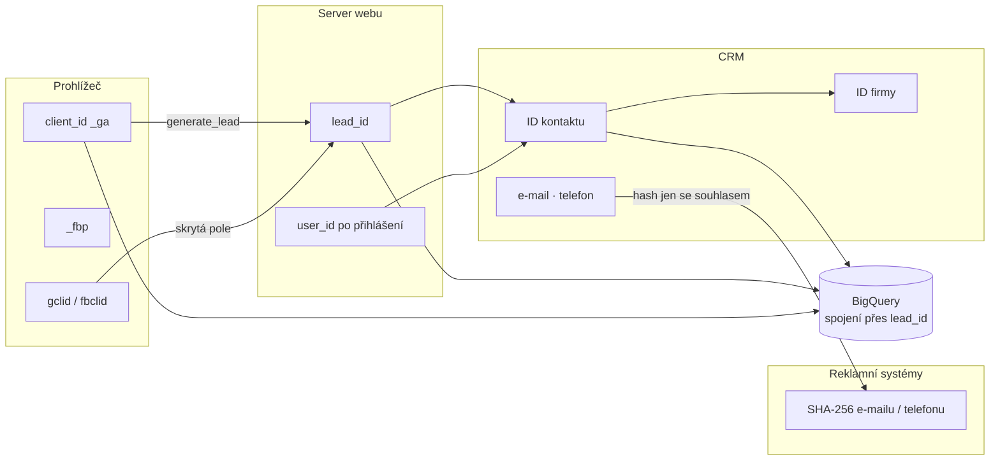
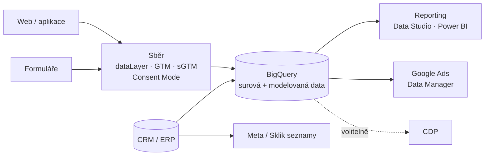

# E4: Sběr uživatelských dat (first-party data): co sbírat, jak je spojit a bezpečně využít – brief
> Cluster: E. Formuláře, leady & uživatelská data · URL: /blog/first-party-data · Formát: průvodce (strategie + technika) · Priorita: měsíc 2 · Cílová LP: /sluzby/bigquery (sekundárně /reseni/velke-firmy) · Rozsah: 2 800–3 300 slov

---

## 1. Meta

| Prvek | Návrh |
|---|---|
| H1 | First-party data: co sbírat, jak je spojit a bezpečně využít |
| SEO title (57 zn.) | First-party data: sběr, identita a využití \| datalayer.cz |
| Meta description (147 zn.) | Co jsou first-party a zero-party data, co sbírat a co ne, jak spojit identitu (user_id, CRM, hash e-mailu) a jak data bezpečně využít se souhlasem. |
| URL | /blog/first-party-data |
| Schema | `BlogPosting` + `FAQPage` + `BreadcrumbList`; definice v úvodu označit pro slovník (`DefinedTerm` na /slovnik/first-party-data) |

**Klíčová slova** (Ahrefs CZ):

| Typ | Slovo | Objem/měs. | Poznámka |
|---|---|---|---|
| hlavní | first party data | 20 | mapováno na `lp-server-side` – článek ho přebírá |
| vedlejší | first-party data | 10 | |
| vedlejší | first party data strategy / first-party data strategy | 10 / 10 | „strategie“ = H2 9 roadmapa |
| vedlejší | google analytics user id / user id | 10 / 10 | H2 4 identita |
| SERP dotaz | first party data měření | – (SERP 8. 10. 2026) | slovníková hesla konkurence |
| long-tail (0) | zero party data, customer match podmínky, cdp vs crm, hash e-mailu gdpr, first party data b2b | 0 | H3/FAQ |

**Záměr:** informační („co to je“) → strategický („co s tím u nás“).

**Cílový čtenář:** marketingový ředitel / CMO, product owner dat, IT/BI manažer ve **velké firmě** nebo rostoucím **e-shopu** a **B2B** firmě; úroveň středně pokročilá. Chce vědět, co má smysl sbírat a jak to provozovat bez právního a bezpečnostního rizika.

---

## 2. Analýza SERP a konkurence

**„first party data měření“ (8. 10. 2026):** 1. leadhub.co (slovník – e-shop), 2. unikum.cz (slovník), 3. forum-media.cz (marketing + GDPR), 4. o-seznam.cz (Reklama na Seznamu – základní pojmy cookieless), 5. advertising-media.cz, 6. galandr.com (segmentace, CLV), 7. datimo.ai (pojem), 8. leadhub.co (e-mailing/SMS), 9. jiri.online (slovník). Gameplan.cz má článek „first-party data pro e-shop“ (6/2026, ~2 min čtení – dle profilu).

**Co chybí:**
1. Převažují **definice a marketingové sliby** („nejcennější aktivum“) – chybí **technická stránka**: identifikátory, propojení GA4 ↔ CRM, BigQuery, hashování.
2. **Co nesbírat** a minimalizace – nikdo.
3. **Právní titul a souhlas** po účelech (analytika, rozšířené konverze, Customer Match, newsletter) – maximálně obecně.
4. **Podmínky Customer Match** (USD 50 000, 90 dní, EHP) a Sklik vlastní seznamy – nikdo.
5. **Bezpečnost** (přístupy, retence, hash ≠ anonymizace) – nikdo.
6. B2B pohled (lead, CRM, účet/firma) – chybí; konkurence píše pro e-shopy.

**Čím je přeskočíme:** tabulka typů dat s příklady pro e-shop i B2B, „sběrový plán“ (šablona), identitní diagram s konkrétními ID, srovnání CRM vs. BigQuery vs. CDP, aktivace s ověřenými podmínkami platforem, bezpečnostní checklist a 90denní plán.

---

## 3. Otázky, na které musí článek odpovědět

1. Co jsou first-party data a čím se liší od zero-, second- a third-party dat?
2. Proč na nich v roce 2026 záleží (a co je mýtus)?
3. Jaká data sbírat v e-shopu a v B2B – a jaká ne?
4. Jak poznat, že jde o stejného člověka (user_id, client_id, CRM ID, hash e-mailu)?
5. Je hashovaný e-mail anonymní?
6. Jaký právní titul a souhlas potřebuji pro jednotlivá využití?
7. Kam data uložit – CRM, BigQuery, nebo CDP?
8. Jak je využít v Google Ads, Meta a Skliku (Customer Match, publika)?
9. Jaké podmínky má Customer Match?
10. Jak data zabezpečit a jak dlouho je držet?
11. Kde začít – jak vypadá plán na 90 dní?

---

## 4. Rychlá odpověď (hotový text, 57 slov)

> First-party data jsou údaje, které sbíráte přímo od svých návštěvníků a zákazníků – chování na webu, formuláře, objednávky, data z CRM. Sbírejte jen to, co má jasný účel a právní titul. Propojte je přes vlastní ID (user_id, ID leadu), ukládejte v CRM a BigQuery a do reklam posílejte jen hashované a se souhlasem.

---

## 5. Osnova s obsahem odpovědí

### H2 1: Co jsou first-party data (a čím se liší od ostatních)
**Klíčové sdělení:** Rozhoduje, **kdo data sbírá a od koho** – ne technologie. First-party = vy přímo od svých uživatelů.

**Tabulka (kompletní):**

| Typ | Definice | E-shop (příklad) | B2B (příklad) | Poznámka |
|---|---|---|---|---|
| **Zero-party** | údaje, které vám člověk vědomě a aktivně sdělí (preference, záměr) | velikost oblečení v profilu, zájmy v newsletteru | „Co řešíte?“ – témata ve formuláři (chips na datalayer.cz), rozpočet, termín | podmnožina first-party; termín popularizovala analytická firma Forrester (ověřit citaci) |
| **First-party** | údaje, které sbíráte přímo vy na svých kanálech | události na webu, objednávky, vratky, věrnostní program | formuláře, fáze v CRM, schůzky, využití SaaS produktu | základ měření i aktivace |
| **Second-party** | first-party data jiné firmy, která vám je předá na základě dohody | data partnera v co-marketingu | data distributora / partnera | vyžaduje smlouvu a právní titul na obou stranách |
| **Third-party** | data agregovaná od jiných subjektů, typicky přes cookies třetích stran a datové brokery | publika „zájem o sport“ od datového poskytovatele | firmografické databáze | nejvíc omezovaná prohlížeči a regulací |

- Důležité upřesnění: „first-party cookie“ (technicky cookie vaší domény) ≠ „first-party data“ (vztah ke zdroji). Cookie na vaší doméně nastavená skriptem třetí strany je technicky first-party cookie, ale data může zpracovávat třetí strana.

### H2 2: Proč na nich v roce 2026 záleží (a co je mýtus)
**Klíčové sdělení:** Důvodem není „konec cookies“, ale ztráta signálu: souhlas, omezení prohlížečů a blokátory snižují, co reklamní systémy vidí. Vlastní data z CRM a formulářů tuto mezeru zmenšují.

**Obsah odpovědi:**
- Faktory ztráty signálu: odmítnutý souhlas (Consent Mode – A1, A6), Safari ITP a Firefox ETP (omezení cookies), blokátory, přechody mezi zařízeními.
- **Mýtus „Chrome v roce 2024 vypnul cookies třetích stran“:** Google od plošného vypnutí ustoupil (detail a aktuální stav v A7 – **ověřit při psaní**). Neopakovat zastaralá tvrzení konkurence (analýza konkurence kap. 7).
- Co vlastní data umožní: přesnější konverze (rozšířené konverze – E2), optimalizaci na kvalitu (offline konverze – E3), reporting až do tržeb/marže (F4), publika a vyloučení (Customer Match), personalizaci.
- Co neumožní: obejít odmítnutý souhlas. Vlastní data podléhají stejným pravidlům.

### H2 3: Co sbírat (a co ne)
**Klíčové sdělení:** Sbírejte k účelu, ne „pro jistotu“. Každý datový bod musí mít účel, právní titul, místo uložení, retenci a vlastníka.

**Tabulka „Co sbírat“ (kompletní):**

| Oblast | E-shop | B2B / lead-gen | Účel |
|---|---|---|---|
| Chování na webu | `view_item`, `add_to_cart`, `begin_checkout`, `purchase` | `lead_form_start`, `generate_lead`, stažení materiálů, `contact_click` | měření, optimalizace webu |
| Identita | `user_id` (po přihlášení), ID objednávky | `lead_id`, ID kontaktu v CRM, ID firmy | propojení zdrojů |
| Transakce / obchod | hodnota, marže, vratky | fáze leadu, hodnota zakázky, důvod ztráty | reporting, bidding na hodnotu |
| Zero-party | preference, zájmy | témata, rozpočet, termín, role | kvalifikace, personalizace |
| Kontakt | e-mail, telefon (pro doručení) | e-mail, telefon (pro odpověď) | komunikace; hash pro reklamy jen se souhlasem |
| Atribuce | UTM, click ID (se souhlasem) | UTM, gclid, fbclid (se souhlasem) | vyhodnocení kanálů (E1) |

**Tabulka „Co nesbírat / kam to nepatří“ (kompletní):**

| Co | Proč ne | Místo toho |
|---|---|---|
| E-mail, jméno, telefon v GA4 (parametry, URL, User-ID) | zásady GA4 zakazují údaje identifikující osobu | interní ID; hash jen přes funkce k tomu určené (UPDC, rozšířené konverze) |
| Text zprávy z formuláře v analytice | obsahuje cokoli včetně citlivých údajů | jen kategorie (`lead_topics`) |
| Zvláštní kategorie údajů (zdraví, náboženství…, čl. 9 GDPR) | vysoké riziko, zvláštní režim | nesbírat pro marketing |
| „Všechno, co jde“ | rozpor se zásadou minimalizace (čl. 5 odst. 1 písm. c) GDPR) | sběrový plán s účelem |
| Přesná geolokace, otisk zařízení (fingerprinting) | souhlas a transparentnost; právní riziko | nesbírat |
| Click ID a UTM bez souhlasu do trvalého úložiště | § 89 odst. 3 ZEK | ukládat se souhlasem (E1) |

**Šablona „sběrový plán“ (kompletní ukázka 4 řádků – v článku jako stažitelná tabulka):**

| Datový bod | Účel | Právní titul (návrh – ověří právník) | Uložení | Retence | Přístup | Aktivace |
|---|---|---|---|---|---|---|
| `generate_lead` + `lead_id` | měření poptávek | souhlas (analytické cookies) + GDPR dle posouzení | GA4, BigQuery | 14 měsíců GA4 / dle politiky v BQ | marketing, analytik | reporting |
| E-mail z poptávky | odpověď na poptávku | čl. 6 odst. 1 písm. b) | CRM | do ukončení jednání + lhůta dle politiky | obchod | – |
| Hash e-mailu → Google Ads | rozšířené konverze | souhlas (`ad_user_data`) | Google Ads | dle Googlu | – | bidding |
| Témata poptávky (zero-party) | kvalifikace | čl. 6 odst. 1 písm. b) | CRM, BigQuery | jako lead | obchod, marketing | segmentace |

### H2 4: Identita: jak spojit data o jednom člověku
**Klíčové sdělení:** Každý systém zná člověka pod jiným ID. Propojení stavte na **vlastních interních ID** (lead, kontakt, objednávka); hash e-mailu používejte jen tam, kde ho platforma vyžaduje.

**Tabulka identifikátorů (kompletní):**

| ID | Kdo ho vytváří | Kde žije | Úroveň | Osobní údaj? | Použití |
|---|---|---|---|---|---|
| GA4 `client_id` (`user_pseudo_id` v BigQuery) | Google tag | cookie `_ga` | prohlížeč/zařízení | ano (online identifikátor) | analytika, Measurement Protocol |
| GA4 `user_id` | váš web po přihlášení | GA4 | člověk (účet) | pseudonym; nesmí z něj jít určit identitu | cross-device v GA4 |
| ID leadu | váš server | CRM, GA4 param, Ads `transactionId`, Meta `event_id` | poptávka | pseudonym | deduplikace, spojení web ↔ CRM |
| ID kontaktu / firmy v CRM | CRM | CRM, BigQuery | člověk / účet | ano (v CRM s kontaktem) | reporting, ABM |
| SHA-256 e-mailu / telefonu | váš web / export | Google Ads, Meta, Sklik seznamy | člověk | **ano – pseudonymizace** | rozšířené konverze, Customer Match |
| `gclid`, `gbraid`, `wbraid`, `fbclid` / `fbc` | reklamní systém | URL → cookie / CRM | kliknutí | ano (v kombinaci) | offline konverze |
| `_fbp` | Meta Pixel | cookie | prohlížeč | ano | Meta CAPI |

- **Pravidla pro `user_id` v GA4:** max. 256 znaků, jedinečné a trvalé, nesmí obsahovat informace, podle kterých by třetí strana určila identitu; při odhlášení nastavit `null` (support.google.com/analytics/answer/9213390).
- **GA4 user-provided data collection:** umožňuje poslat hashované e-maily/telefony do GA4 (open beta); vyžaduje souhlas uživatele včetně spojení přihlášené a nepřihlášené aktivity – nezávisle na `ad_storage` (answer/12150158, answer/14077171).
- **Hash e-mailu není anonymní:** SHA-256 je deterministický – kdo má seznam e-mailů, hash „rozluští“ porovnáním. Recitál 26 GDPR: pseudonymizované údaje jsou osobní údaje. Pro **interní** pseudonymizaci (např. v BigQuery pro analytiky) použít HMAC s tajným klíčem, ne holý SHA-256.
- **SQL – propojení GA4 exportu s CRM přes ID leadu:**

```sql
-- GA4 export (BigQuery) + CRM: který zdroj přinesl leady a jak dopadly
WITH ga_leady AS (
  SELECT
    (SELECT value.string_value FROM UNNEST(event_params) WHERE key = 'lead_id') AS lead_id,
    user_pseudo_id,
    session_traffic_source_last_click.cross_channel_campaign.source        AS zdroj,
    session_traffic_source_last_click.cross_channel_campaign.medium        AS medium,
    session_traffic_source_last_click.cross_channel_campaign.campaign_name AS kampan,
    TIMESTAMP_MICROS(event_timestamp)                                       AS cas_leadu
  FROM `projekt.analytics_123456789.events_*`
  WHERE _TABLE_SUFFIX BETWEEN '20260701' AND '20260930'
    AND event_name = 'generate_lead'
)
SELECT
  g.zdroj, g.medium, g.kampan,
  COUNT(*)                               AS leady,
  COUNTIF(c.faze = 'vyhrano')            AS zakazky,
  SUM(IF(c.faze = 'vyhrano', c.hodnota_zakazky, 0)) AS trzby
FROM ga_leady AS g
JOIN `projekt.crm.leady` AS c USING (lead_id)
GROUP BY 1, 2, 3
ORDER BY trzby DESC;
```
> Pro autora: názvy polí `session_traffic_source_last_click.*` ověřit ve schématu exportu GA4 (F1); leady bez analytického souhlasu v GA4 chybí – celkové počty brát z CRM.

**Vizuál:** identitní diagram (kap. 6, diagram 1).

### H2 5: Souhlas a právní titul po účelech (opatrně)
**Klíčové sdělení:** Jeden údaj může mít víc účelů a každý účel vlastní titul. Souhlas s cookies (ZEK) a právní titul zpracování (GDPR) jsou dvě různé otázky.

**Tabulka (kompletní; formulovat jako „typicky / zvažte“, ne jako závazný výklad):**

| Využití | Ukládání do zařízení (§ 89 odst. 3 ZEK) | Právní titul zpracování (GDPR) – typicky | Signál Consent Mode | Poznámka |
|---|---|---|---|---|
| Odpověď na poptávku | – | čl. 6 odst. 1 písm. b) | – | informační povinnost čl. 13 |
| Webová analytika s cookies | souhlas | dle posouzení (často souhlas) | `analytics_storage` | A2, A3 |
| Rozšířené konverze / offline konverze | souhlas pro cookies | dle posouzení; Google vyžaduje souhlas dle EU User Consent Policy | `ad_user_data` | E2, E3 |
| Customer Match / publika | – (seznam z CRM) | dle posouzení; Google požaduje souhlas tam, kde to vyžaduje zákon nebo jeho zásady | `ad_personalization`, `ad_user_data` | H2 7 |
| Newsletter / obchodní sdělení | – | souhlas, u stávajících zákazníků výjimka (zákon č. 480/2004 Sb., § 7 – ověřit) | – | |
| Lead scoring / profilování | dle nástroje | oprávněný zájem s testem proporcionality, nebo souhlas | – | čl. 21, 22 GDPR – posoudit |

- Disclaimer: „Nejsme advokátní kancelář; tabulka ukazuje, na co se ptát právníka.“ Odkaz A2, A3.

### H2 6: Kde data uložit: CRM, BigQuery, nebo CDP?
**Klíčové sdělení:** CRM je systém pro práci s lidmi, BigQuery pro analýzu a spojování, CDP pro aktivaci segmentů v reálném čase. Většina firem potřebuje první dva; CDP až s více kanály aktivace.

**Tabulka (kompletní):**

| Kritérium | CRM (HubSpot, Pipedrive, Raynet, Salesforce) | BigQuery (datový sklad) | CDP (např. Meiro, Bloomreach – příklady, ne doporučení) |
|---|---|---|---|
| Primární účel | obchodní proces, komunikace | analýza, spojení zdrojů, reporting | sjednocený profil a aktivace |
| Data z webu | omezeně (formuláře, tracking CRM) | GA4 export – události do detailu | vlastní sběr / SDK |
| Spojování zdrojů | ruční / integrace | SQL – libovolně | identitní graf v produktu |
| Aktivace do reklam | nativní integrace (část CRM) | Data Manager konektor BigQuery | silná stránka |
| Kdo s tím pracuje | obchod, marketing | analytik, BI | marketing, CRM tým |
| Nákladové faktory | licence na uživatele | úložiště + dotazy (F5) | licence, implementace |
| Kdy | vždy u B2B | jakmile chcete spojit GA4 + CRM + náklady | více kanálů, real-time personalizace |

**Vizuál:** architektura „zdroje → sběr → úložiště → aktivace“ (diagram 2).

### H2 7: Aktivace: publika, Customer Match a další využití
**Klíčové sdělení:** Data mají hodnotu, až když je použijete – v biddingu, publikách, personalizaci a reportingu. U každé aktivace platí podmínky platformy.

**Obsah odpovědi:**
- **Google Customer Match (k 10/2026):**
  - Všichni inzerenti s dobrou historií plnění zásad a plateb mohou použít seznamy pro **pozorování a vyloučení**.
  - Pro **cílení** (Targeting) a ruční úpravy nabídek: **90 dní historie v Google Ads a celková útrata přes 50 000 USD** (u jiných měn přepočet průměrným měsíčním kurzem) – support.google.com/adspolicy/answer/6299717.
  - Data musí být first-party; zásady ochrany soukromí musí uvádět sdílení s třetími stranami; souhlas dle EU User Consent Policy; v EHP, UK a Švýcarsku se nepoužívá párování přes IP a časové razítko.
  - Členství vyprší po **540 dnech**; nahrávat průběžně (aspoň 100 členů v tomto okně).
  - Nahrávání přes **Data Manager / Data Manager API**; Google nedoporučuje Google Ads API pro nové integrace Customer Match (answer/6379332).
- **Meta Custom Audiences** z hashovaných seznamů – podmínky ověřit v Meta Business Help (odkaz B5).
- **Sklik – vlastní seznamy e-mailů:** napojení přes partnery (např. Meiro, Leadhub, Ecomail, SmartEmailing, Bloomreach, Tealium) – napoveda.sklik.cz.
- **GA4 publika** → Google Ads (vyžaduje propojení a reklamní funkce; souhlas).
- **Bidding na hodnotu:** offline konverze s hodnotou (E3), marže pro e-shopy (F4).
- **Personalizace webu a sales enablement:** zero-party témata → obsah, lead scoring → priorita obchodu.
- **Vyloučení:** stávající zákazníci z akvizičních kampaní – často nejrychlejší úspora.

### H2 8: Bezpečnost a governance
**Klíčové sdělení:** Čím víc dat spojíte, tím větší je dopad úniku. Přístupy, retence a dokumentace jsou součást projektu, ne dodatek.

**Checklist (kompletní):**
- [ ] **Vlastnictví:** GA4 property, GTM kontejner, Google Cloud projekt, reklamní účty na organizaci klienta – ne na dodavateli.
- [ ] **Nejnižší nutná oprávnění** (role v GA4, IAM v Google Cloud, role v CRM); pravidelná revize přístupů (čtvrtletně).
- [ ] **Oddělení identit:** kontaktní údaje jen v CRM; v BigQuery pro analytiky pseudonymizované (HMAC) – citlivé sloupce chránit (column-level security / policy tags v BigQuery).
- [ ] **Retence:** GA4 – uživatelská a událostní data 2 nebo 14 měsíců (360: až 50), týká se explorací a trychtýřů, ne standardních reportů (answer/7667196); BigQuery – expirace partitions podle politiky; CRM – mazání po účelu.
- [ ] **Zpracovatelské smlouvy** (čl. 28 GDPR) s dodavateli (agentura, hosting sGTM, CDP), záznamy o činnostech zpracování (čl. 30), posouzení vlivu (DPIA, čl. 35) u rozsáhlého profilování – dle posouzení.
- [ ] **Práva subjektů:** výmaz musí projít CRM → BigQuery → seznamy Customer Match / Meta.
- [ ] **Incidenty:** postup pro ohlášení porušení zabezpečení ÚOOÚ do 72 hodin (čl. 33 GDPR).
- [ ] **Dokumentace:** sběrový plán, datový slovník, schéma toků (diagram 2).

### H2 9: Plán na 90 dní
**Tabulka (kompletní, ilustrativní – rozsah se liší podle firmy):**

| Týdny | Krok | Výstup |
|---|---|---|
| 1–2 | Inventura dat a cílů, rozhovory s obchodem/IT | sběrový plán v1, mapa systémů |
| 3–4 | Souhlas a sběr: Consent Mode v2, datová vrstva, formuláře (E1) | specifikace dataLayer, nasazení |
| 5–6 | Identita: `lead_id`, `user_id`, CRM pole, skrytá pole | propojené záznamy web ↔ CRM |
| 7–9 | BigQuery: GA4 export, import CRM a nákladů | tabulky + první SQL report (F1, F3) |
| 10–11 | Aktivace: rozšířené konverze, offline konverze, vyloučení zákazníků | konverzní akce, seznamy |
| 12–13 | Dashboard a governance | report CPL→CPO / marže, revize přístupů, dokumentace |

### H2 10: Nejčastější chyby
1. „Sbíráme všechno, něco se hodí“ – bez účelu a retence.
2. E-mail jako `user_id` nebo v URL → PII v GA4.
3. Hash e-mailu považovaný za anonymní údaj.
4. Účty a projekty na dodavateli → lock-in a ztráta historie.
5. Customer Match nahraný jednou a nikdy neaktualizovaný (expirace 540 dní).
6. Výmaz kontaktu jen v CRM, ne v BigQuery a reklamních seznamech.
7. CDP koupená dřív, než existuje sběrový plán a spolehlivý sběr.

---

## 6. Vizuály

### Diagram 1: Identitní mapa (pod H2 4)

**Finální SVG:** 4 sloupce (Prohlížeč · Web · CRM · Reklama), uprostřed „uzel“ `lead_id` zvýrazněný cyan glow jako klíč spojení; osobní údaje (e-mail, telefon) v CRM sloupci s ikonou zámku; šipka do reklam oranžová s popiskem „hash + ad_user_data“. Mobil: svisle, `lead_id` jako střed.

### Diagram 2: Architektura first-party dat (pod H2 6)

**Finální SVG:** styl hero (dataLayer → GTM → GA4/CAPI/BigQuery) rozšířený o CRM a aktivaci; 4 vrstvy zleva doprava se štítky `sources` · `collect` · `store` · `activate` (mono). Mobil svisle.

### Infografika „Zero → First → Second → Third“ (pod H2 1; LinkedIn 1080×1350)
Čtyři soustředné kruhy (zero uprostřed) s 1 větou a 1 příkladem pro e-shop a B2B; vedle stupnice „kontrola nad daty / spolehlivost“ (vysoká → nízká). Barvy cyan → šedá.

### Tabulky (kompletní obsah v kap. 5)
Typy dat (H2 1) · Co sbírat (H2 3) · Co nesbírat (H2 3) · Sběrový plán (H2 3) · Identifikátory (H2 4) · Souhlas po účelech (H2 5) · CRM vs. BigQuery vs. CDP (H2 6) · 90denní plán (H2 9).

### Lead magnet
Šablona „Sběrový plán“ (Google Sheets / XLSX) se sloupci z H2 3 – ke stažení bez e-mailu (konzistentní s tónem „žádný spam“); `tool_use` událost při stažení.

---

## 7. Fakta a zdroje

| Tvrzení | Zdroj | Ověřeno | Riziko zastarání |
|---|---|---|---|
| GA4 User-ID: max. 256 znaků, nesmí umožnit třetí straně určit identitu, `null` při odhlášení | https://support.google.com/analytics/answer/9213390 | 10/2026 | nízké |
| GA4 user-provided data collection (open beta), hashování, souhlas | https://support.google.com/analytics/answer/14077171 ; https://support.google.com/analytics/answer/12150158 | 10/2026 | vysoké |
| Customer Match: zásady, 90 dní + 50 000 USD pro cílení, EHP bez IP/timestamp párování | https://support.google.com/adspolicy/answer/6299717 | 10/2026 | střední |
| Customer Match: 540 dní, Data Manager doporučen, Google Ads API ne pro nové integrace | https://support.google.com/google-ads/answer/6379332 | 10/2026 | střední |
| Data Manager konektory pro Customer Match | https://support.google.com/google-ads-data-manager/table/13860693 | 10/2026 | vysoké |
| Sklik – vlastní seznamy e-mailů přes partnery | https://napoveda.sklik.cz/en/display-network/types-of-targeting/your-own-custom-email-lists/third-party-integrations/ | 10/2026 | střední |
| Consent Mode – 4 signály, `ad_user_data` | https://developers.google.com/tag-platform/security/concepts/consent-mode | 10/2026 | střední |
| GA4 retence dat 2/14 měsíců (360 až 50), týká se explorací | https://support.google.com/analytics/answer/7667196 | 10/2026 | nízké |
| GDPR: čl. 5, 6, 9, 13, 21, 22, 28, 30, 33, 35; recitál 26 | https://eur-lex.europa.eu/legal-content/CS/TXT/?uri=CELEX:32016R0679 | 10/2026 | nízké |
| § 89 odst. 3 ZEK – souhlas s ukládáním do zařízení | https://www.zakonyprolidi.cz/cs/2005-127 | 10/2026 | nízké |
| § 7 zákona č. 480/2004 Sb. – obchodní sdělení | https://www.zakonyprolidi.cz/cs/2004-480 | **ověřit** | nízké |
| Stav cookies třetích stran v Chrome (ústup od plošného vypnutí) | odkaz na A7 + privacysandbox.google.com / blog Google | **ověřit při psaní** | vysoké |
| EDPB Guidelines 01/2025 k pseudonymizaci (stav přijetí) | https://www.edpb.europa.eu (nepodařilo se načíst 10/2026) | **ověřit** | střední |

---

## 8. Interní odkazy a CTA

**Cílová LP:** `/sluzby/bigquery` (sekundárně `/reseni/velke-firmy`).

**Kontextový CTA box** (za H2 6):
- Nadpis: **Spojte web, CRM a náklady na jednom místě**
- Text: „Postavíme datový sklad v BigQuery na vašem Google Cloudu, propojíme GA4, CRM a reklamní systémy přes vlastní ID a nastavíme přístupy a retenci. Data i projekt zůstávají vaše.“
- Tlačítko: `[ BigQuery pro marketing ]` → /sluzby/bigquery

**Související články:** E1 Měření formulářů a leadů · E2 Rozšířené konverze · E3 Offline konverze z CRM · A3 Osobní údaje v analytice · A7 Cookies třetích stran a ITP 2026 · F1 GA4 → BigQuery export · F3 Zpracování dat v BigQuery · F4 Propojení dat e-shopu a CRM s GA4 · C5 Měřicí plán · B1 Server-side tracking.

**Slovník:** First-party cookie · Third-party cookie · User-ID · Client ID · Rozšířené konverze · BigQuery · Datový sklad · Consent Mode · ITP.

**Zkrácený kontaktní blok:** `form_id: blog` · téma `bigquery` · H2 „Řešíte totéž u sebe?“ · placeholder „Např. chceme spojit GA4, CRM a náklady na reklamu a nevíme, kde začít…“

---

## 9. FAQ pro schema

**Co jsou first-party data?**
First-party data jsou údaje, které firma sbírá přímo od svých návštěvníků a zákazníků na vlastních kanálech: chování na webu, formuláře, objednávky, fáze obchodu v CRM nebo využití produktu. Na rozdíl od dat třetích stran víte, odkud pocházejí a k čemu je smíte použít, a máte nad nimi kontrolu.

**Jaký je rozdíl mezi zero-party a first-party daty?**
Zero-party data jsou podmnožinou first-party dat: údaje, které vám člověk sdělí vědomě a aktivně, například zájmy v profilu, témata ve formuláři nebo rozpočet. First-party data zahrnují i údaje, které vznikají při používání webu nebo služby, například zobrazené produkty či fáze leadu v CRM.

**Je hashovaný e-mail anonymní údaj?**
Není. SHA-256 je deterministický, takže kdo má seznam e-mailů, dokáže hash přiřadit. Podle GDPR jsou pseudonymizované údaje, které lze s dalšími informacemi přiřadit osobě, stále osobními údaji. Hash proto posílejte do reklamních systémů jen se souhlasem a pro interní analýzu použijte raději HMAC s tajným klíčem.

**Jaké podmínky má Google Customer Match?**
Seznamy pro pozorování a vyloučení může použít inzerent s dobrou historií plnění zásad a plateb. Pro cílení Google vyžaduje 90 dní historie v Google Ads a celkovou útratu přes 50 000 USD. Data musí být first-party, se souhlasem podle zásad EU; členství vyprší po 540 dnech. Nahrávat se doporučuje přes Data Manager.

**Potřebuji CDP, nebo stačí CRM a BigQuery?**
Většině firem stačí CRM pro obchodní proces a BigQuery pro spojení GA4, CRM a nákladů a pro reporting. CDP dává smysl, když aktivujete segmenty do více kanálů v reálném čase a máte spolehlivý sběr dat i sběrový plán. Bez nich CDP jen zrcadlí nepořádek v datech.

---

## 10. Poznámky pro autora

- **Právně citlivé:** tabulka H2 5 formulovat jako orientační („typicky“, „dle posouzení“), s disclaimerem; ideálně revize právníkem. Neuvádět „GDPR compliant“.
- **Ověřit při psaní:** stav cookies třetích stran v Chrome (A7), EDPB Guidelines 01/2025 (pseudonymizace), § 7 zákona č. 480/2004 Sb., původ termínu zero-party (Forrester).
- CDP uvádět jen jako příklady (Meiro a Bloomreach jsou v seznamu partnerů Skliku) – bez hodnocení.
- **[DOPLNIT: šablona sběrového plánu jako soubor ke stažení]**, **[DOPLNIT: anonymizovaný příklad z projektu – např. vyloučení stávajících zákazníků z kampaní, pokud existuje]**.
- Revize každých 6 měsíců (Customer Match, UPDC beta).
- Recenzent: Vít Novotný; H2 5 a H2 8 právník / DPO.
