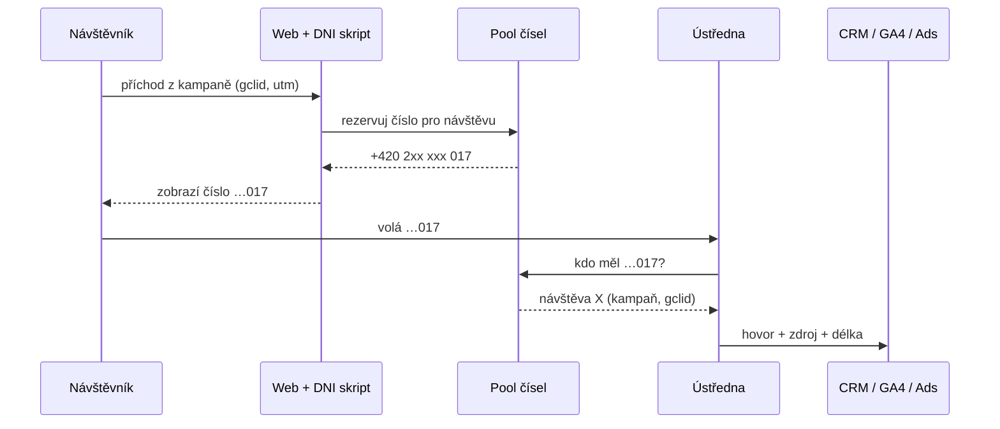

# E5: Měření telefonátů a call tracking v ČR – brief
> Cluster: E. Formuláře, leady & uživatelská data · URL: /blog/mereni-telefonatu · Formát: vysvětlení + rozhodovací průvodce · Priorita: měsíc 3 · Cílová LP: /reseni/b2b-a-lead-generation · Rozsah: 2 400–2 900 slov

---

## 1. Meta

| Prvek | Návrh |
|---|---|
| H1 | Měření telefonátů a call tracking v ČR: jak na to |
| SEO title (53 zn.) | Call tracking a měření telefonátů v ČR \| datalayer.cz |
| Meta description (149 zn.) | Jak měřit telefonáty z webu a reklam: klik na číslo, statická a dynamická čísla, hovory v Google Ads, propojení s CRM a co hlídat u GDPR a nahrávání. |
| URL | /blog/mereni-telefonatu |
| Schema | `BlogPosting` + `FAQPage` + `BreadcrumbList` |

**Klíčová slova:** české dotazy nemají v Ahrefs měřitelný objem; anglické varianty jsou v `kw_mapovani_na_stranky.tsv` (topic `crm-leady`, ~200 variant „call tracking …“, vše 0/měs.). Článek je **strategický** (B2B a služby, kde telefon tvoří významnou část poptávek) a pro AI přehledy.

| Typ | Slovo | Objem/měs. | Poznámka |
|---|---|---|---|
| hlavní (CZ, odhad) | call tracking, měření telefonátů, měření hovorů z reklamy | 0 (Ahrefs) | Ahrefs CZ podhodnocuje nová/specifická témata |
| vedlejší (EN, 0) | google call tracking, google ads call tracking, dynamic number call tracking, call tracking dni, call tracking crm | 0 | H3 a FAQ |
| otázky (EN, 0) | how does call tracking work, why use call tracking, how does google call tracking work, why does call tracking need a disclaimer | 0 | odpovědět v H2 2, 5, 8 |

**Záměr:** informační/rozhodovací – „má pro nás call tracking smysl a jaký“.

**Cílový čtenář:** majitel / marketingový manažer B2B firmy nebo služby (stavebnictví, výroba, reality, finance, zdravotnictví, IT služby), kde část poptávek přichází telefonem; PPC specialista, který chce hovory v Google Ads. Segment: B2B / lead-gen, menší i velké firmy s call centrem.

---

## 2. Analýza SERP a konkurence

- Pro české dotazy nemáme SERP data (dotaz nebyl ve sběru 8. 10. 2026) – **[DOPLNIT: ruční kontrola SERP „call tracking“ a „měření telefonátů“ před psaním]**.
- Z profilů konkurence: **nextanalytica.cz** zmiňuje v lead-gen reportingu napojení ústředen (Daktela) – jen jako logo/integrace, bez návodu. Specializovaní implementátoři (DA, khoder, marketingppc) call tracking jako téma nepokrývají (analýza konkurence kap. 4 – „B2B/CRM/offline“ prakticky prázdné).
- Anglický SERP ovládají dodavatelé SaaS (CallRail, CallTrackingMetrics apod.) – prodejní texty bez českého kontextu (dostupnost čísel, Google forwarding numbers v ČR, GDPR u nahrávání).

**Čím je přeskočíme:** nezávislé srovnání 4 úrovní měření v tabulce, ověřená dostupnost Google forwarding numbers v ČR, napojení na CRM a offline konverze (navázání na E1/E3), střízlivá a opatrná kapitola o GDPR a nahrávání, checklist výběru dodavatele bez reklamy na konkrétní značku.

---

## 3. Otázky, na které musí článek odpovědět

1. Proč měřit telefonáty, když máme formulář?
2. Jaký je rozdíl mezi měřením kliknutí na číslo a měřením hovoru?
3. Co je statické a dynamické číslo (DNI) a kdy které použít?
4. Kolik čísel potřebuji pro dynamický call tracking?
5. Funguje měření hovorů v Google Ads v Česku?
6. Jaké typy konverzí z hovorů Google Ads nabízí?
7. Jak hovory propojit s CRM a poslat kvalifikované hovory zpět do reklam?
8. Jak poznat kvalitní hovor?
9. Smím hovory nahrávat a co musím volajícímu říct?
10. Potřebuje call tracking souhlas s cookies?
11. Podle čeho vybrat call tracking řešení?
12. Neuškodí dynamická čísla SEO a důvěryhodnosti?

---

## 4. Rychlá odpověď (hotový text, 58 slov)

> Telefonáty měřte ve třech úrovních: klik na číslo na webu (událost v GA4), hovory z reklam a webu přes Google forwarding numbers (v ČR dostupné) a dynamická čísla call trackingu, která přiřadí hovor ke konkrétní návštěvě. Hovor zapište do CRM jako lead a kvalifikované hovory pošlete zpět do Google Ads jako offline konverze.

---

## 5. Osnova s obsahem odpovědí

### H2 1: Proč měřit telefonáty
**Klíčové sdělení:** Když měříte jen formuláře, kampaně, které přivádějí telefonáty, vypadají neúspěšně – a vypnete je.
- U B2B a služeb volá často rozhodovatel, který formulář nevyplní; telefonický lead bývá dál v rozhodování.
- Bez měření: Google Ads/Meta optimalizují jen na formuláře; reporting podhodnocuje kanály s vysokým podílem hovorů (lokální vyhledávání, mobil, brand).
- **[DOPLNIT: podíl telefonických poptávek u klienta nebo typického projektu – jen pokud jsou data; jinak bez čísla]**.

### H2 2: Čtyři úrovně měření telefonátů
**Klíčové sdělení:** Začněte jednoduše (klik na číslo), pokračujte hovory v Google Ads, dynamický call tracking nasaďte, až když hovory tvoří významnou část poptávek.

**Srovnávací tabulka (kompletní):**

| Úroveň | Co změříte | Co nezměříte | Náročnost | Souhlas / soukromí | Kdy |
|---|---|---|---|---|---|
| 1. **Klik na číslo** (`tel:`) | kliknutí na mobilu (a na desktopu, pokud má aplikaci) | zda hovor proběhl, délku, výsledek | nízká (GTM) | jako ostatní analytika | vždy |
| 2. **Statická čísla podle kanálu** | hovory podle kanálu (tisk, rádio, Google Business Profile, web) | konkrétní kampaň/klíčové slovo na webu | nízká (u operátora / ústředny) | číslo volajícího = osobní údaj | offline kanály, GBP |
| 3. **Google Ads – hovory** (Google forwarding numbers) | hovory z reklam a z webu po kliknutí na reklamu, délka, čas | hovory z jiných kanálů než Google Ads | nízká–střední | čísla spravuje Google; podmínky Google Ads | máte Google Ads a hovory |
| 4. **Dynamický call tracking (DNI)** | hovor ↔ návštěva ↔ zdroj/kampaň (všechny kanály), propojení s CRM | nic zásadního, ale ne u lidí, kteří číslo opíší jinde | střední–vysoká (dodavatel, čísla, integrace) | skript ukládá identifikátor návštěvy → souhlas; zpracovatelská smlouva | hovory = velká část poptávek, víc kanálů |

**Vizuál:** „schodiště“ 4 úrovní (kap. 6).

### H2 3: Úroveň 1 – klik na číslo (click-to-call)
**Klíčové sdělení:** Rychlé a levné, ale je to signál zájmu, ne hovor.
- Kód (pro web datalayer.cz odpovídá události `contact_click` z architektury webu, kap. 8):

```js
// Klik na telefon / e-mail → dataLayer (bez osobních údajů volajícího)
document.addEventListener('click', function (e) {
  var a = e.target.closest ? e.target.closest('a[href^="tel:"], a[href^="mailto:"]') : null;
  if (!a) return;
  var sec = a.closest('[data-section]');
  window.dataLayer = window.dataLayer || [];
  window.dataLayer.push({
    event: 'contact_click',
    channel: a.getAttribute('href').indexOf('tel:') === 0 ? 'phone' : 'email',
    section: sec ? sec.getAttribute('data-section') : 'unknown'   // např. hero, kontakt, paticka
  });
}, true);
```
- GTM: Custom Event `contact_click` → GA4 událost; v Google Ads lze použít typ „Kliknutí na číslo na mobilním webu“ (Google: měří jen kliknutí, ne hovor).
- Nepovažovat za lead; v reportingu oddělit „klik“ od „hovoru“.

### H2 4: Úroveň 2 a 4 – statická a dynamická čísla
**Klíčové sdělení:** Statické číslo = jedno číslo na jeden kanál. Dynamické = skript na webu ukáže každé návštěvě z vybraných zdrojů číslo z „poolu“ a hovor na něj přiřadí k té návštěvě.

**Jak funguje DNI (krok za krokem, diagram 1):**
1. Návštěvník přijde z kampaně (gclid / UTM).
2. Skript dodavatele vybere volné číslo z poolu, zobrazí ho místo výchozího a „rezervuje“ ho pro návštěvu (typicky desítky minut po poslední aktivitě – nastavení dodavatele).
3. Volající vytočí číslo → ústředna přepojí na vaši linku → dodavatel spáruje hovor s návštěvou (zdroj, kampaň, stránka, gclid, GA4 client_id).
4. Dodavatel pošle událost do GA4/Google Ads a hovor do CRM (webhook/API).

**Kolik čísel (ilustrační výpočet – označit):**
`počet čísel ≈ návštěvy ze sledovaných zdrojů ve špičkové hodině × doba rezervace čísla (min) / 60 × 1,2 (rezerva)`
Např. 60 návštěv/h × 20 min / 60 × 1,2 = **24 čísel**. Málo čísel = stejné číslo dvěma návštěvám = chybné přiřazení. Dodavatelé mívají vlastní kalkulačku.

**Praktické zásady:**
- **Výchozí číslo v HTML ponechat** (pro uživatele bez JS, vyhledávače, Google Business Profile – konzistence kontaktu NAP). DNI mění číslo jen pro sledované návštěvy.
- **Vlastnictví čísel:** čísla patří obvykle dodavateli → riziko lock-inu; ověřit přenositelnost a co se stane po ukončení smlouvy (odkaz H1 – red flags).
- **Typ čísla:** číslo, které vypadá jako běžné firemní (geografické / dle nabídky dodavatele) – důvěra volajících; dostupnost českých čísel ověřit u dodavatele.
- **Souhlas:** DNI skript typicky ukládá identifikátor návštěvy (cookie/storage) – podle § 89 odst. 3 ZEK zvažte souhlas; bez souhlasu lze ukázat statické číslo podle kanálu (bez vazby na návštěvu) – konkrétní řešení posoudit s právníkem.

### H2 5: Úroveň 3 – hovory v Google Ads (stav v ČR)
**Klíčové sdělení:** Google forwarding numbers a call reporting jsou v Česku dostupné. Google Ads umí měřit hovory z reklam, hovory z webu po kliknutí na reklamu i importované hovory.

**Obsah odpovědi – tabulka typů konverzí z hovorů (kompletní):**

| Typ | Jak funguje | Potřebuje Google forwarding number | Poznámka |
|---|---|---|---|
| Hovory z reklam | hovory z call assetů / call-only reklam | ano (call reporting) | nastavíte minimální délku hovoru |
| Hovory na číslo na webu | Google forwarding number dynamicky nahradí číslo na webu **jen u lidí, kteří klikli na reklamu** | ano | Google tag + fragment konverze hovoru z webu |
| Kliknutí na číslo na mobilním webu | měří klik na `tel:` | ne | jen klik, ne hovor |
| Kliknutí na call reklamy a assety | odhad Googlu, zda proběhl smysluplný hovor | ne | odhad, ne potvrzený hovor |
| Importované hovory | hovory z jiného systému (CRM) importujete s číslem volajícího a časem začátku | ano | jen hovory přes Google forwarding numbers; importy nelze smazat |

- Dostupnost: Česká republika je v seznamu zemí pro call reporting a Google forwarding numbers (support.google.com/google-ads/answer/2454052, answer/2382961) – **znovu ověřit při publikaci**.
- Call reporting poskytuje mj. délku hovoru, čas začátku a zda byl hovor spojen (answer/2454052 – detail polí ověřit).
- Fragment pro hovory z webu (ukázka – přesný kód zkopírovat z rozhraní Google Ads):

```js
// Hovory na číslo na webu (Google forwarding number) – ilustrace, kód vzít z Google Ads
gtag('config', 'AW-XXXXXXXXX/YYYYYYYYYYY', {
  phone_conversion_number: '+420 222 333 444'   // číslo zobrazené na webu, které se má nahrazovat
});
```
- Omezení: měří jen Google Ads; čísla spravuje Google; hovory z organiky, Meta, Skliku tu nevidíte → proto úroveň 4 (DNI) u firem s více kanály.

### H2 6: Propojení s CRM a offline konverze
**Klíčové sdělení:** Hovor je lead jako formulář. Musí mít záznam v CRM, zdroj, výsledek – a kvalifikované hovory se vrací do reklam stejně jako formulářové leady (E3).

**Tabulka mapování (kompletní):**

| Data o hovoru | Odkud | Pole v CRM | Použití |
|---|---|---|---|
| Číslo volajícího | ústředna / call tracking | telefon kontaktu | párování s existujícím kontaktem; hash pro rozšířené konverze (se souhlasem – viz H2 8) |
| Čas a délka | ústředna / call tracking | aktivita „hovor“ | filtr kvality (minimální délka) |
| Zdroj, kampaň, vstupní stránka | DNI | atribuce leadu (stejná pole jako u formuláře, E1 H2 6) | reporting CPL/CPO |
| gclid / GA4 client_id | DNI | atribuce | offline konverze Google Ads, GA4 MP |
| Výsledek hovoru | obchodník | fáze leadu / štítek | kvalifikovaný hovor → konverze |
| ID leadu | CRM | `lead_id` | deduplikace |

- **Cesty do Google Ads:** (a) hovory přes Google forwarding numbers → import hovorů (číslo volajícího + čas začátku); (b) DNI s gclid → offline konverze přes Data Manager / Data Manager API (`eventSource: PHONE`, `adIdentifiers.gclid`, případně hash telefonu) – detail v E3; okna 90/63 dní.
- **Meta:** `action_source: "phone_call"` přes Conversions API, `event_time` max. 7 dní zpět (developers.facebook.com – server event parameters).
- **GA4:** hovor jako `generate_lead` s `lead_source: telefon` přes Measurement Protocol (jen s `client_id` z DNI a při analytickém souhlasu).
- **Pozor na duplicitu:** jeden člověk zavolá i vyplní formulář → jeden lead v CRM (pravidlo deduplikace podle telefonu/e-mailu), jedna konverze dané fáze.

### H2 7: Kvalita hovorů
**Klíčové sdělení:** Ne každý hovor je lead. Kvalitu určí kombinace délky, výsledku a toho, zda volá nový kontakt.
- Minimální délka hovoru jako první filtr (Google ji nastavujete u konverzní akce – vhodnou hodnotu určit z dat, např. medián délky kvalifikovaných hovorů; **neuvádět univerzální číslo**).
- Štítky výsledku (číselník – kompletní): `nova_poptavka` · `stavajici_zakaznik` · `servis_podpora` · `dodavatel_nabidka` · `omyl` · `zmeskany` · `jine`.
- **Zmeškané hovory** = obchodní metrika (míra zvednutí): kampaně běží, ale nikdo nebere telefon – častý nález.
- Automatický přepis a hodnocení hovorů (AI): další zpracování osobních údajů → posoudit (H2 8).

### H2 8: GDPR, nahrávání hovorů a souhlas (opatrně)
**Klíčové sdělení:** Měření hovoru (kdo, kdy, odkud) a nahrávání hovoru (obsah) jsou dvě různé věci s jinou mírou rizika. Nahrávání nechte vypnuté, dokud nemáte právní posouzení a informování volajících.

**Obsah odpovědi (formulovat jako „na co se zeptat právníka“):**
- **Číslo volajícího, čas, délka** jsou osobní údaje (GDPR čl. 4 odst. 1); potřebujete právní titul (čl. 6) a informování (čl. 13) – typicky v zásadách zpracování OÚ.
- **DNI skript** ukládá identifikátor návštěvy v prohlížeči → souhlas podle § 89 odst. 3 ZEK (viz H2 4).
- **Nahrávání:** informovat volajícího **na začátku hovoru** (hlasová zpráva) o nahrávání, účelu a kde najde podrobnosti; účel (kvalita, důkaz o objednávce, školení) určuje právní titul – oprávněný zájem s balančním testem, plnění smlouvy, nebo souhlas; doba uchování přiměřená účelu; přístup omezit. Zohlednit i ochranu soukromí podle občanského zákoníku (§ 86 a násl. – ověřit) a zaměstnance, jejichž hovory se nahrávají.
- **Dodavatel call trackingu = zpracovatel:** zpracovatelská smlouva (čl. 28), umístění dat (EU vs. předání mimo EU – kap. V GDPR), subdodavatelé.
- **AI přepis/hodnocení:** nový účel → posoudit, případně DPIA (čl. 35).
- Disclaimer: „Nejsme advokátní kancelář; postup konzultujte s právníkem / pověřencem.“ Odkaz A2, A3.

### H2 9: Jak vybrat call tracking řešení (checklist)
**Kompletní checklist (12 bodů):**
1. Dostupnost **českých čísel** a jejich typ; cena za číslo a za minuty (model účtování).
2. **Vlastnictví a přenositelnost čísel** po ukončení smlouvy.
3. DNI na úrovni **návštěvy** (ne jen zdroje) a nastavitelná doba rezervace.
4. Integrace: **GA4** (události / client_id), **Google Ads** (gclid → offline konverze), **Meta CAPI**, **CRM** (webhook / API), export do **BigQuery**.
5. Podpora **Consent Mode / CMP** – skript se načte až se souhlasem, fallback na statické číslo.
6. **Umístění dat v EU**, zpracovatelská smlouva, seznam subdodavatelů.
7. **Nahrávání** volitelné a ve výchozím stavu vypnuté; hlasová zpráva na začátku hovoru.
8. Přepojení na stávající ústřednu / mobilní čísla obchodníků, směrování, záznam zmeškaných hovorů.
9. Uživatelská práva a audit log.
10. Výkon skriptu (velikost, asynchronní načtení – odkaz H3).
11. API pro export dat a jejich smazání (práva subjektů).
12. Česká podpora / SLA.

### H2 10: Reporting hovorů
- Metriky: hovory podle zdroje, míra zvednutí, podíl kvalifikovaných hovorů, **cena za kvalifikovaný hovor**, **kombinovaný CPL** (formuláře + hovory), CPO (E1 H2 9).
- Dashboard: dlaždice „Leady celkem = formuláře + hovory“ (mockup v kap. 6).

---

## 6. Vizuály

### Diagram 1: Jak funguje dynamický call tracking (pod H2 4)

**Finální SVG:** 5 drah, „pool“ jako mřížka čísel s jedním zvýrazněným; mobil = 6 číslovaných kroků s piktogramy (telefon, štít s číslem, CRM karta). Animace „zvonění“ jen bez `prefers-reduced-motion`.

### Schodiště 4 úrovní (pod H2 2)
4 stupně zleva doprava: Klik na číslo → Statická čísla → Google Ads hovory → Dynamický call tracking; na každém stupni 2 řádky „co změříte“ a ikona náročnosti (1–3 tečky). Barva od cyan po oranžovou. Mobil svisle.

### Tabulky (kompletní obsah v kap. 5)
4 úrovně (H2 2) · Typy konverzí z hovorů Google Ads (H2 5) · Mapování do CRM (H2 6) · Checklist výběru (H2 9).

### Mockup
Dashboard dlaždice (pod H2 10): „Leady celkem 182 = formuláře 120 + hovory 62“, „Míra zvednutí 87 %“, „Cena za kvalifikovaný hovor 1 450 Kč“ – štítek „Ukázkový příklad“, fiktivní čísla.

---

## 7. Fakta a zdroje

| Tvrzení | Zdroj | Ověřeno | Riziko zastarání |
|---|---|---|---|
| Call reporting a Google forwarding numbers dostupné mj. v České republice | https://support.google.com/google-ads/answer/2454052 ; https://support.google.com/google-ads/answer/2382961 | 10/2026 | střední |
| Typy konverzí z hovorů (z reklam, z webu, kliknutí na mobilu, kliknutí na call assety – odhad, import) a nutnost forwarding numbers | https://support.google.com/google-ads/answer/6100664 | 10/2026 | střední |
| Import hovorů: číslo volajícího, čas začátku, název konverze; počkat 4 h; importy nelze smazat; jen forwarding numbers | https://support.google.com/google-ads/answer/6275629 | 10/2026 | střední |
| Fragment `phone_conversion_number` pro hovory z webu | rozhraní Google Ads / https://support.google.com/google-ads/answer/6100664 | **ověřit přesný kód** | střední |
| Data Manager API `eventSource: PHONE`, offline konverze s gclid | https://developers.google.com/data-manager/api/reference/rest/v1/events/ingest | 10/2026 | vysoké |
| Okna 90/63 dní a přesun do Data Manager API (15. 6. 2026) | https://support.google.com/google-ads/answer/10029210 ; https://support.google.com/google-ads/answer/16884284 | 10/2026 | vysoké |
| Meta `action_source: phone_call`, `event_time` max. 7 dní | https://developers.facebook.com/docs/marketing-api/conversions-api/parameters/server-event | 10/2026 | střední |
| GDPR čl. 4, 6, 13, 28, 35, kap. V | https://eur-lex.europa.eu/legal-content/CS/TXT/?uri=CELEX:32016R0679 | 10/2026 | nízké |
| § 89 odst. 3 ZEK | https://www.zakonyprolidi.cz/cs/2005-127 | 10/2026 | nízké |
| Občanský zákoník § 86 a násl. (soukromí, záznamy) | https://www.zakonyprolidi.cz/cs/2012-89 (stránka 10/2026 nedostupná) | **ověřit** | nízké |

---

## 8. Interní odkazy a CTA

**Cílová LP:** `/reseni/b2b-a-lead-generation`.

**Kontextový CTA box** (za H2 6):
- Nadpis: **Hovory i formuláře v jednom reportu**
- Text: „Nastavíme měření hovorů od kliknutí po kvalifikaci v CRM, napojíme Google Ads a ostatní kanály a připravíme report, kde uvidíte formuláře a hovory dohromady.“
- Tlačítko: `[ Měření pro B2B a leady ]` → /reseni/b2b-a-lead-generation

**Související články:** E1 Měření formulářů a leadů (pilíř) · E3 Offline konverze z CRM · E2 Rozšířené konverze · A2 Cookies a zákon v ČR · A3 Osobní údaje v analytice · G3 Marketingový dashboard · H3 Měřicí skripty a rychlost webu.

**Slovník:** Offline konverze · GCLID / gbraid / wbraid · Událost · Consent Mode · Atribuční model.

**Zkrácený kontaktní blok:** `form_id: blog` · téma `konverze` · H2 „Řešíte totéž u sebe?“ · placeholder „Např. většina poptávek nám chodí telefonem a nevíme, z jaké kampaně…“

---

## 9. FAQ pro schema

**Jak funguje call tracking?**
Call tracking zobrazí návštěvníkům webu jiné telefonní číslo podle zdroje nebo konkrétní návštěvy. Když člověk na číslo zavolá, systém hovor přepojí na vaši linku a přiřadí mu zdroj, kampaň a vstupní stránku. Data pak pošle do analytiky, reklamních systémů a CRM, kde hovor vyhodnotíte jako lead.

**Funguje měření hovorů v Google Ads v Česku?**
Ano. Česká republika je k říjnu 2026 v seznamu zemí, kde Google nabízí call reporting a Google forwarding numbers. Můžete měřit hovory z reklam, hovory na číslo na webu po kliknutí na reklamu i importovat hovory z vlastního systému. Hovory z jiných kanálů než Google Ads tím ale nezměříte.

**Je kliknutí na telefonní číslo konverze?**
Je to užitečný signál zájmu, ale ne potvrzený hovor. Kliknutí na odkaz tel: měřte jako událost v GA4 a v Google Ads ho oddělte od skutečných hovorů. Za lead považujte až hovor, který proběhl a obchodník ho vyhodnotil jako novou poptávku.

**Smím telefonáty nahrávat?**
Nahrávání je zpracování osobních údajů a vyžaduje právní titul a informování volajícího na začátku hovoru, včetně účelu a doby uchování. Účel, jako je kvalita služeb nebo důkaz objednávky, určuje vhodný titul. Doporučujeme mít nahrávání vypnuté, dokud postup neposoudí právník nebo pověřenec.

**Potřebuje dynamický call tracking souhlas s cookies?**
Skript dynamického call trackingu si obvykle ukládá identifikátor návštěvy, aby hovor přiřadil ke zdroji. Ukládání do zařízení pro marketingové účely podle českého zákona o elektronických komunikacích zpravidla vyžaduje souhlas. Bez souhlasu lze zobrazit statické číslo podle kanálu. Konkrétní řešení posuďte s právníkem.

---

## 10. Poznámky pro autora

- **Právně nejcitlivější článek clusteru E** (nahrávání, zaměstnanci) – formulace podmiňovacím způsobem, disclaimer, revize právníkem doporučena; nepsat, že něco je „povinné“ nebo „zakázané“ bez zdroje.
- Nejmenovat konkrétní dodavatele call trackingu jako doporučení (neověřeno); pokud ano, jen jako příklady s „ověřte nabídku“.
- Před publikací ověřit seznam zemí Google forwarding numbers a přesný fragment `phone_conversion_number` v rozhraní.
- **[DOPLNIT: zkušenost klienta s call trackingem – použitý nástroj, podíl hovorů, typické nálezy (např. zmeškané hovory)]**.
- Priorita měsíc 3 – článek lze zkrátit na ~2 000 slov, pokud kapacita nestačí (H2 9 a H2 10 sloučit).
- Recenzent: Vít Novotný; H2 8 právník / pověřenec.
