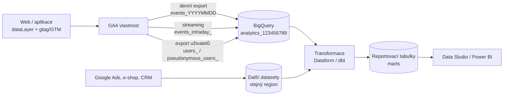
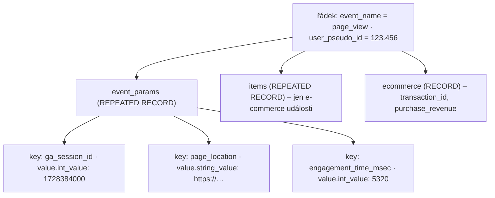

# F1: GA4 → BigQuery export: nastavení, struktura tabulek, limity a cena – brief
> Cluster: F – BigQuery & zpracování dat (pilíř) · URL: /blog/ga4-bigquery-export (stávající URL na stagingu – obsah nahradit, URL ponechat) · Formát: pilíř / technický průvodce · Priorita: měsíc 1 · Cílová LP: /sluzby/bigquery · Rozsah: 3 200–3 800 slov

---

## 1. Meta

| Prvek | Návrh |
|---|---|
| H1 | GA4 a BigQuery: export dat krok za krokem (2026) |
| SEO title | GA4 BigQuery export: nastavení, schéma, cena \| datalayer.cz (59 zn.) |
| Meta description | Jak propojit GA4 s BigQuery, který export zvolit, co je v tabulkách events_, jaké má export limity a kolik stojí. Ověřeno na dokumentaci Google 10/2026. (152 zn.) |
| URL | /blog/ga4-bigquery-export |
| Datum | publikace + „poslední revize“ (revize každých 6 měsíců – schéma exportu se mění) |
| Autor | Vít Novotný (Person schema) |

**Klíčová slova** (Ahrefs CZ, `kw_mapovani_na_stranky.tsv`; nuly = nová/EN long-tail témata, SERP pro ně existuje):

| Typ | Klíčové slovo | Objem/měs. |
|---|---|---|
| Hlavní | ga4 bigquery | 0 (SERP ověřen 8. 10. 2026) |
| Vedlejší | bigquery | 150 |
| Vedlejší | big query | 70 |
| Vedlejší | google bigquery | 20 |
| Vedlejší | bigquery sandbox | 10 |
| Long-tail | bigquery export google analytics · ga4 bigquery export jak na to · ga4 to bigquery export · connect ga4 with bigquery · ga4 bigquery schema · ga4 bigquery session id · ga4 historical data to bigquery · backfill ga4 data in bigquery · ga4 vs bigquery · google analytics 4 data retention bigquery cena | 0 |
| Otázky (PAA) | What is BigQuery used for? · Is Google BigQuery free? · Can I use BigQuery for free? · Is BigQuery SQL? · What is the difference between GCP and BigQuery? | – |
| Otázky (Ahrefs) | is bigquery free to use · is bigquery a data warehouse · bigquery co to · how does bigquery work | 0 |

**Záměr hledání:** informační + návodový („jak nastavit“), s komerčním podtónem (kdo to umí udělat a dotáhnout do reportů).

**Cílový čtenář:**
- *Primárně:* marketingový / e-commerce manažer nebo analytik středního e-shopu či B2B firmy, který ví, co je GA4, ale nedělal v Google Cloudu. Chce vědět, jestli export zapnout, co to stojí a co s daty dál.
- *Sekundárně:* vývojář / datový analytik ve větší firmě, který hledá přesné schéma, limity a bezpečnostní nastavení.
- Segmenty: e-shop (tržby, položky, marže) · B2B (leady, propojení s CRM) · velká firma (region dat, IAM, audit, VPC-SC).

---

## 2. Analýza SERP a konkurence

**Dotaz „ga4 bigquery“ (Google.cz, 8. 10. 2026):** 1. docs.cloud.google.com – *Load Google Analytics 4 data into BigQuery* (konektor Data Transfer Service, ne nativní export!) · 2. ga4bigquery.com · 3. digitalniarchitekti.cz – video ukázka · 4. reddit · 5. cloud.google.com use cases · 6. support.google.com – schéma exportu · 7. ga4bigquery.com · 8. optimizesmart.com.
**„bigquery export google analytics“:** developers.google.com (přehled), cloud.google.com, docs.cloud (DTS konektor), pmg.com, support.google.com (nastavení, BigQuery Export), reddit (backfill), zastaralý článek pro UA, developers.google.com (BigQuery vs. UI).
**„ga4 bigquery export jak na to“:** support.google.com (schéma, nastavení – česky), digitalniarchitekti.cz, **nazakladedat.cz** (návod nastavení), **flowstack.cz** (export pro e-commerce), freshegg, reddit, pmg.
**„google analytics 4 data retention bigquery cena“:** cloud.google.com/bigquery/pricing, mightandmetrics.io, cypressnorth, discuss.google.dev, kalkulačka surowiecki.org, embertribe, support.google.com, posthog, seresa.io.

**Co chybí (příležitost):**
1. Česky existují jen **návody „jak to zapnout“** (nazakladedat, DA video). Nikdo nevysvětluje *rozhodnutí*: region, typ exportu, limity, náklady, bezpečnost.
2. **Zastaralé nebo chybné informace v CZ:** datimo.ai tvrdí, že streamovaný export je jen pro GA4 360 – podle dokumentace je dostupný i pro standardní vlastnosti (placený poplatkem za streaming). Na stagingu klienta je tip „Export je zdarma v rámci sandbox limitů“ – v sandboxu ale tabulky **po 60 dnech mizí** a streaming nefunguje (musíme opravit i vlastní text).
3. Nikdo česky nepopisuje změny 2024–2026: pole `session_traffic_source_last_click` (včetně `cross_channel_campaign`), export uživatelských dat (`users_` / `pseudonymous_users_`), **Fresh Daily** pro 360, nová **vestavěná identita** propojení (místo `firebase-measurement@…`), **konektor GA4 v BigQuery Data Transfer Service** pro dotažení historie.
4. Chybí přehledná tabulka **„proč čísla v BigQuery nesedí s GA4“** v češtině (Google ji má jen anglicky).

**Čím je přeskočíme:** kompletní pilíř s diagramem toku dat, vizuálem vnořeného schématu, rozhodovací tabulkou typů exportu, tabulkou čtyř „zdrojů návštěvnosti“ v exportu, tabulkou rozdílů UI vs. BigQuery, bezpečnostním checklistem a odkazy na navazující články F2–F5 a G1. Každé tvrzení se zdrojem a datem ověření.

---

## 3. Otázky, na které musí článek odpovědět

1. Co je BigQuery export z GA4 a proč ho zapnout co nejdřív?
2. Je export zdarma? Co se platí a kolik to typicky stojí?
3. Můžu použít BigQuery sandbox bez platební karty? Jaké má omezení?
4. Co potřebuji (oprávnění, Google Cloud projekt, fakturace) a jak export nastavit krok za krokem?
5. Jaký region dat zvolit a dá se později změnit?
6. Denní, streamovaný, nebo Fresh Daily export – čím se liší a který potřebuji?
7. Jaké tabulky export vytvoří a co je v nich (events_, events_intraday_, users_, pseudonymous_users_)?
8. Proč jsou parametry událostí „vnořené“ a jak se k nim dostanu (UNNEST)?
9. Kde v exportu najdu zdroj/médium relace? Proč jsou tam čtyři různé „zdroje návštěvnosti“?
10. Jaký je denní limit exportu pro standardní GA4 a co se stane po překročení?
11. Dostanu do BigQuery i data z doby před propojením?
12. Proč se čísla v BigQuery liší od rozhraní GA4?
13. Jsou v exportu data od uživatelů, kteří odmítli cookies?
14. Jak export zabezpečit (přístupová práva, region, doba uchování, mazání)?
15. Je BigQuery SQL databáze? (PAA „Is BigQuery SQL?“)

---

## 4. Rychlá odpověď (hotový text, 56 slov)

> BigQuery export z GA4 je nativní funkce, která každý den (nebo průběžně) kopíruje surové, nevzorkované události z GA4 do vašeho projektu v Google Cloudu. Zapíná se v Administraci GA4 v sekci Propojení se službami → BigQuery. Export sám je zdarma; platíte úložiště a dotazy v BigQuery. Data se exportují až od okamžiku propojení, ne zpětně.

---

## 5. Osnova s obsahem odpovědí

### H2 1: Proč BigQuery export zapnout hned – i když data zatím nepoužijete
**Klíčové sdělení:** Export funguje jen dopředu. Každý den bez exportu je den, který později nedopočítáte na úrovni jednotlivých událostí.

**Obsah odpovědi:**
- **Surová data bez vzorkování.** Export obsahuje nevzorkované události; v rozhraní GA4 se vzorkování uplatní, když dotaz (typicky průzkum/exploration) překročí kvótu **10 milionů událostí** u standardní vlastnosti (360: až 1 miliarda) – zdroj support 13331292.
- **Žádná retence 14 měsíců.** Nastavení uchování dat v GA4 (2 nebo 14 měsíců u standardní vlastnosti, 26/38/50 měsíců jen 360) omezuje průzkumy a trychtýře. Data v BigQuery zůstávají, dokud je nesmažete vy.
- **Žádné „(other)“ a prahování** – řádky s vysokou kardinalitou se v exportu neslučují, prahování (thresholding) z Google signálů se exportu netýká.
- **Propojení s dalšími daty** – objednávky a marže z e-shopu, CRM, náklady z reklam (→ F3, F4).
- **Vlastnictví dat:** „Data, která exportujete, jsou vaše“ (Google, support 9358801); přístup řídíte přes IAM v BigQuery.
- **Co export NEumí:** zpětně doplnit historii („Once you export data … you cannot re-export it“) – data tečou od propojení. Pro **agregovanou** historii lze použít konektor **GA4 v BigQuery Data Transfer Service** (načte reporty přes Data API, backfill až do hranice retence GA4, max. 9 dimenzí a 10 metrik na vlastní report, bez vlastních dimenzí) – to není náhrada surových událostí, ale pomůže s meziročním srovnáním.

**Příklad z praxe (ilustrativní, označit):** *E-shop zapnul export v březnu, analýzu Black Friday chtěl dělat v listopadu za dva roky zpět – na úrovni událostí měl jen 8 měsíců.*

### H2 2: Co budete potřebovat (5 minut kontroly před nastavením)
**Klíčové sdělení:** Bez platebního účtu v Google Cloudu a správných rolí propojení buď nevznikne, nebo se data po čase přestanou plnit.

**Checklist (tabulka v článku):**

| Co | Proč | Kdo to obvykle má |
|---|---|---|
| Google Cloud projekt | Do něj se vytvoří dataset `analytics_<ID vlastnosti>` | IT / vy |
| Zapnuté BigQuery API | Bez něj propojení neuvidí projekt | vlastník projektu |
| Platební účet (billing) připojený k projektu | Bez platební metody export neproběhne; sandbox má omezení (viz níže) | finance / IT |
| Role **Editor** (nebo vyšší) ve vlastnosti GA4 | Pro vytvoření propojení | správce GA4 |
| Role **Owner** v projektu Google Cloud (nebo ekvivalent oprávnění `resourcemanager.projects.get/getIamPolicy/setIamPolicy`, `serviceusage.services.enable/get`) | GA4 přidává do projektu servisní identitu | správce Google Cloud |
| Kontrola **organizačních politik** (např. omezení sdílení na vlastní doménu) | Podle Google mohou politiky způsobit, že se tabulky nevytvoří, nebo se vytvoří a do cca 30 minut smažou | správce Google Workspace / Cloud |

**Sandbox:** export do BigQuery sandboxu je zdarma, ale: úložiště 10 GiB (doživotní limit, smazáním se nevrací), tabulky a oddíly **vyprší po 60 dnech**, sandbox nepodporuje streaming, DML ani Data Transfer Service. → Pro produkční použití sandbox nedoporučujeme; je to „zkušební režim“, ne levná varianta. (Opravit i tip na stagingu.)

### H2 3: Nastavení krok za krokem
**Klíčové sdělení:** Samotné propojení zabere 15 minut; důležitá jsou tři rozhodnutí – region, typ exportu a filtrování událostí.

**Kroky (číslovaný seznam + mockup obrazovky u kroků 4–8):**
1. V Google Cloud Console vytvořte nebo vyberte projekt (doporučení: samostatný projekt pro analytiku, např. `firma-analytics-prod`, oddělený od vývojového).
2. *APIs & Services → Library → BigQuery API → Enable.*
3. Připojte platební účet; nastavte rozpočet a upozornění (→ F5).
4. V GA4: *Administrace → Propojení se službami (Product links) → Propojení se službou BigQuery → Propojit.*
5. Zvolte projekt (pokud používáte Firebase, Google doporučuje stejný projekt jako Firebase – vlastnost a Firebase projekt navíc nesmí exportovat do různých projektů).
6. **Vyberte umístění dat (region).** Nelze změnit, pokud už dataset pro vlastnost v projektu existuje. Změna později = smazat propojení, zálohovat, přesunout dataset, znovu propojit (s rizikem mezery v datech) nebo využít replikaci datasetu mezi regiony.
7. Vyberte datové streamy a **vyloučené události** (lze i události, které ještě nesbíráte). U aplikací volitelně „zahrnout reklamní identifikátory“.
8. Zvolte **typ exportu**: Denní, Streamování, nebo obojí (u 360 navíc Fresh Daily). Volitelně **denní export uživatelských dat**.
9. Odešlete. Data začnou téct do 24 hodin; denní tabulka za předchozí den vzniká obvykle odpoledne v časovém pásmu vlastnosti (může se zpozdit i na další den).

**Rozhodovací pravidlo pro region (tabulka v článku):**

| Volba | Kdy | Cena dotazů on-demand (USD/TiB, ověřeno 8. 10. 2026) | Poznámka |
|---|---|---|---|
| **EU (multiregion)** | výchozí doporučení pro české firmy | 6,25 | data v EU; stejná cena jako US |
| europe-west3 (Frankfurt) / europe-central2 (Varšava) | když potřebujete konkrétní zemi/region (interní politika) | 8,125 | dražší dotazy i úložiště |
| US (multiregion) | jen pokud máte ostatní data v US | 6,25 | spojování datasetů napříč regiony v jednom dotazu nejde |

> Tip pro autora: zdůraznit, že **všechny datasety, které chcete spojovat (GA4, Google Ads, e-shop), musí být ve stejném umístění** – jinak je nespojíte jedním dotazem.

**Servisní identita:** Nová propojení používají „vestavěnou identitu prostředku“ (zobrazenou v detailu propojení) s rolí `roles/bigquery.user`; starší propojení používají `firebase-measurement@system.gserviceaccount.com` a dál fungují. Upgrade na vestavěnou identitu je podmínkou pro Fresh Daily (360) a pro VPC Service Controls. **Nesmažte ji** – bez ní se export zastaví.

### H2 4: Denní, streamovaný, nebo Fresh Daily export?
**Klíčové sdělení:** Pro reporting stačí denní export. Streaming je doplněk pro „dnešní“ data a pro velké weby nad limitem; Fresh Daily je jen pro GA4 360.

**Tabulka (kompletní obsah):**

| | Denní (Daily) | Streamovaný (Streaming) | Fresh Daily |
|---|---|---|---|
| Dostupnost | standard i 360 | standard i 360 | jen 360 (vlastnosti „Normal“ a „Large“) |
| Tabulka | `events_YYYYMMDD` | `events_intraday_YYYYMMDD` (po dokončení denní tabulky se smaže) | `events_YYYYMMDD` (stejné schéma jako denní) |
| Kdy jsou data | 1× denně za předchozí den, typicky odpoledne v časovém pásmu vlastnosti | během minut | typicky do 5:00, dávkové aktualizace obvykle do 60 min |
| Úplnost | kompletní; tabulka se může aktualizovat ještě až 72 h (zpožděné události) | best effort, bez SLO – možné mezery | kompletní, signál „export complete“ v Cloud Logging |
| Zdroj návštěvnosti nových uživatelů | ano (atribuce uživatele může mít zpoždění až 24 h) | `traffic_source.*` u nových uživatelů chybí | ano |
| Limit objemu (standard) | **1 milion událostí denně** | bez limitu | 360: až 20 mld. denně |
| Cena navíc | – | **0,05 USD za GB** (≈ 600 000 událostí na 1 GB, dle velikosti událostí) | vyžaduje billing |
| Sandbox | ano (tabulky vyprší po 60 dnech) | ne | ne |

**Rozhodovací pravidla:**
- Reporting, dashboardy, atribuce → **Denní**.
- Potřebujete vidět dnešek (kampaně, výprodeje, monitoring chyb měření) → **Denní + Streaming** (reportovat ale vždy z denní tabulky).
- Standardní vlastnost se blíží 1 mil. událostí/den → zapněte Streaming (nemá limit) a/nebo vylučte zbytné události; trvale velký web → zvažte GA4 360.

### H2 5: Co export vytvoří: dataset a tabulky
**Klíčové sdělení:** Jeden dataset na vlastnost, jedna tabulka na den; uživatelská data jsou volitelná.

- Dataset: `analytics_<property_id>` (např. `analytics_123456789`).
- `events_YYYYMMDD` – denní tabulka událostí (tzv. *date-sharded*, ne partitionovaná – v SQL se dotazuje přes `events_*` a `_TABLE_SUFFIX`, → F2).
- `events_intraday_YYYYMMDD` – jen se streamingem; průběžná, neúplná, po dokončení dne se smaže.
- **Export uživatelských dat** (volitelný, denní): `pseudonymous_users_YYYYMMDD` (řádek za každý pseudonymní identifikátor; data uživatelů bez souhlasu se sem **neexportují**) a `users_YYYYMMDD` (řádek za každé User-ID; může obsahovat i uživatele bez souhlasu, pokud mají User-ID). Obsahuje jen uživatele, **jejichž data se ten den změnila** – není to úplný snímek. Pole mj. `user_info.*` (poslední aktivita, první návštěva, datum prvního nákupu), `audiences`, `user_ltv` (tržby, relace, čas zapojení, nákupy), `predictions` (pravděpodobnost nákupu/odchodu, předpověď tržeb), `privacy_info`. Pozor: v pseudonymní tabulce se ID jmenuje `pseudo_user_id`, v tabulce událostí `user_pseudo_id`.

### H2 6: Struktura tabulky events: jeden řádek = jedna událost
**Klíčové sdělení:** Tabulka není „report“, ale deník událostí. Parametry jsou vnořené (REPEATED RECORD), proto běžný `SELECT` nestačí.

**H3 6.1 Hlavní skupiny polí (tabulka – kompletní obsah):**

| Skupina | Klíčová pole | K čemu |
|---|---|---|
| Událost | `event_date` (STRING `YYYYMMDD`, časové pásmo vlastnosti), `event_timestamp` (INTEGER, mikrosekundy UTC), `event_name`, `event_value_in_usd`, `event_previous_timestamp`, `event_bundle_sequence_id`, `event_server_timestamp_offset`, `batch_event_index`, `batch_page_id`, `batch_ordering_id` | čas a pořadí událostí |
| Parametry události | `event_params` – REPEATED RECORD: `key` + `value.string_value` / `value.int_value` / `value.double_value` / `value.float_value` (nepoužívá se) | `ga_session_id`, `ga_session_number`, `page_location`, `page_title`, `page_referrer`, `engagement_time_msec`, `session_engaged`, vlastní parametry |
| Uživatel | `user_pseudo_id` (cookie/instance aplikace), `user_id` (vaše User-ID), `user_first_touch_timestamp`, `is_active_user` (jen v denní tabulce), `user_ltv.revenue`, `user_ltv.currency` | identita, noví vs. vracející |
| Vlastnosti uživatele | `user_properties` – REPEATED RECORD (`key`, `value.*`, `value.set_timestamp_micros`) | segmentace (např. typ zákazníka) |
| Souhlas | `privacy_info.analytics_storage`, `privacy_info.ads_storage`, `privacy_info.uses_transient_token` (hodnoty Yes / No / Unset) | podíl událostí bez souhlasu (→ F2, dotaz 11) |
| Zařízení a místo | `device.category`, `device.operating_system`, `device.web_info.browser`, `device.web_info.hostname`, `device.language`, `geo.country`, `geo.region`, `geo.city` | segmentace |
| Zdroje návštěvnosti | `traffic_source.*`, `collected_traffic_source.*`, `session_traffic_source_last_click.*` (viz 6.2) | atribuce |
| E-commerce | `ecommerce.transaction_id`, `ecommerce.purchase_revenue`, `ecommerce.refund_value`, `ecommerce.shipping_value`, `ecommerce.tax_value`, `ecommerce.total_item_quantity`, `ecommerce.unique_items` (+ varianty `_in_usd`) | objednávky |
| Položky | `items` – REPEATED RECORD: `item_id`, `item_name`, `item_brand`, `item_variant`, `item_category`–`item_category5`, `price`, `quantity`, `item_revenue`, `item_refund`, `coupon`, `item_list_name`, `promotion_name`, `item_params` (vlastní parametry položky) | produkty |
| Ostatní | `stream_id`, `platform`, `app_info.*`, `publisher.*` (příjmy z reklam v aplikacích, early access) | aplikace |

**H3 6.2 Čtyři „zdroje návštěvnosti“ – který použít (tabulka):**

| Pole | Rozsah | Od kdy v exportu | Kdy použít |
|---|---|---|---|
| `traffic_source.source / medium / name` | **uživatel** – zdroj první návštěvy | od začátku exportu (2019) | akvizice uživatelů („first user source“) |
| `event_params` klíče `source`, `medium`, `campaign`, `term`, `gclid` | událost | od začátku | historická data, ruční rekonstrukce |
| `collected_traffic_source.manual_source / manual_medium / manual_campaign_name / gclid / dclid / srsltid …` | událost – surové hodnoty z URL/referreru | od května 2023 (na `session_start` od listopadu 2023) | vlastní atribuční logika |
| `session_traffic_source_last_click.manual_campaign.*`, `.google_ads_campaign.*`, `.cross_channel_campaign.*` (+ sa360/cm360/dv360) | **relace** – last non-direct click, napodobuje relační zdroj v UI | manual + Google Ads od poloviny července 2024; cross-channel a SA360/CM360/DV360 od poloviny října 2024 (zdroj: Adswerve, ověřit) | reporty podle zdroje/média relace a kampaně Google Ads (název kampaně, ad group) |

> Poznámka: Google uvádí, že relační atribuční model GA4 v exportu není a nelze ho z exportu plně přepočítat; `session_traffic_source_last_click` se mu blíží, ale 1:1 shodu negarantuje. U dat starších než 7/2024 je nutná rekonstrukce z `collected_traffic_source` / `event_params`.
> Identifikátory **wbraid/gbraid** se do exportu neexportují; chybějící zdroje u Google Ads lze doplnit podle `gclid` přes Google Ads API nebo Data Transfer Service pro Google Ads (Google, support 9358801).

**H3 6.3 Kód – první dotaz (ukázka „jak se dostat k parametru“):**

```sql
-- Kolik zobrazení stránek a relací měl web včera?
-- Nahraďte projekt a ID vlastnosti. Dotaz čte jen 3 sloupce a 1 denní tabulku = levný.
SELECT
  COUNTIF(event_name = 'page_view') AS zobrazeni_stranek,
  COUNT(DISTINCT CONCAT(
    user_pseudo_id, '.',
    CAST((SELECT value.int_value FROM UNNEST(event_params) WHERE key = 'ga_session_id') AS STRING)
  )) AS relace
FROM `vas-projekt.analytics_123456789.events_*`
WHERE _TABLE_SUFFIX = FORMAT_DATE('%Y%m%d', DATE_SUB(CURRENT_DATE('Europe/Prague'), INTERVAL 1 DAY));
```
Vysvětlit: `UNNEST(event_params)` rozbalí pole parametrů; relace = kombinace `user_pseudo_id` + `ga_session_id` (Google: počítat unikátní kombinace za celé období, ne sčítat po dnech). Odkaz na F2 (12 dalších dotazů).

### H2 7: Limity exportu, na které narazíte
**Klíčové sdělení:** Pro standardní vlastnost je klíčový limit 1 milion událostí denně u denního exportu.

- **1 mil. událostí/den (standard, denní export).** Při opakovaném překročení Google denní export **pozastaví** a předchozí dny znovu nezpracuje; editoři a správci dostanou e-mail při každém překročení; při výrazném překročení může export zastavit okamžitě. Řešení: vyloučit zbytné události, vybrat jen potřebné streamy, zapnout Streaming (bez limitu), u trvale velkých webů GA4 360 (až 20 mld./den).
- **Zpožděná data:** denní tabulka se může aktualizovat až 72 hodin (Measurement Protocol, offline události z aplikací) → při porovnávání s UI používejte data starší než 3 dny a v modelech přepočítávejte poslední 3 dny (→ F3).
- **Streaming je best effort** – možné mezery; u nových uživatelů chybí `traffic_source`.
- **Žádná modelovaná data** (modelování konverzí/chování z Consent Mode) – export je „last click observed, no modeling“.
- **Co se neexportuje:** data produktů propojených s GA4 (např. reklamní data přidaná propojením), wbraid/gbraid; Google signály.
- **Změna časového pásma vlastnosti** posune exportní okno → jeden den s neobvyklými počty.
- **Export nelze zopakovat** pro stejné období.

### H2 8: Proč čísla v BigQuery nesedí s rozhraním GA4
**Klíčové sdělení:** Rozdíly jsou normální a vysvětlitelné. Důležité je vědět, která čísla používáte k čemu.

**Tabulka (podle Google, developers blog „BigQuery vs. UI“, aktualizováno 6/2026):**

| Důvod | Co se děje | Co s tím |
|---|---|---|
| Vzorkování v UI | průzkumy nad kvótou jsou vzorkované | porovnávejte nevzorkované reporty |
| Aktivní vs. všichni uživatelé | UI ukazuje „aktivní uživatele“ | v SQL filtrujte `is_active_user = TRUE` |
| HyperLogLog++ | UI počty uživatelů/relací odhaduje (u relací cca ±1,63 % při 95% spolehlivosti) | malé rozdíly ignorujte |
| Zpožděná data | denní tabulka se aktualizuje až 72 h | porovnávejte data starší 72 h |
| Řádek „(other)“ | UI slučuje vzácné hodnoty | v BigQuery k tomu nedochází |
| Google signály / prahování | UI deduplikuje napříč zařízeními, skrývá malé hodnoty | v exportu není → víc `user_pseudo_id` |
| Consent Mode a modelování | UI dopočítává chování a konverze | export modelovaná data neobsahuje |
| Atribuce | relační atribuční model UI v exportu není | `session_traffic_source_last_click` jako nejbližší náhrada |
| Filtry a limity exportu | vyloučené události/streamy, překročený limit | zkontrolujte nastavení propojení |
| Časová pásma | `event_date` = pásmo vlastnosti, `event_timestamp` = UTC | převádějte čas do pásma vlastnosti |

Odkaz na D2 „Proč nesedí čísla“ (GA4 vs. Ads vs. Meta vs. e-shop).

### H2 9: Jsou v exportu data uživatelů, kteří odmítli cookies?
**Klíčové sdělení:** Záleží na režimu Consent Mode. Při *advanced* režimu ano – jako „cookieless pingy“ bez identifikátoru uživatele.

- Google: při implementaci Consent Mode se do exportu dostávají **cookieless pingy** a také data, která posíláte sami (např. `user_id`, vlastní dimenze) – support 9358801.
- Prakticky: u událostí bez souhlasu chybí `user_pseudo_id` (je NULL), `privacy_info.analytics_storage = 'No'`; události nelze spolehlivě spojit do relací ani uživatelů. **Ověřit na vlastních datech** (chování se může lišit podle implementace).
- Při *basic* režimu se bez souhlasu neodesílá nic, v exportu tato data nejsou.
- Důsledek: v BigQuery můžete vidět **více nákupů než v UI** (nákupy bez souhlasu), ale nelze je přiřadit ke zdroji relace. Měření podílu → F2 (dotaz 11). Právní rámec → A1, A6.
- Disclaimer: „Nejde o právní radu; nastavení souhlasu konzultujte s právníkem.“

### H2 10: Kolik export stojí (stručně, detail v F5)
**Klíčové sdělení:** Export je zdarma; platíte úložiště, dotazy a případně streaming. Malý web se typicky vejde do bezplatné úrovně, střední web platí jednotky USD měsíčně – pokud dashboardy nečtou surová data.

- Bezplatná úroveň: **1 TiB dotazů/měsíc** a **10 GiB úložiště/měsíc** (ověřeno 8. 10. 2026).
- EU multiregion: dotazy **6,25 USD/TiB**; úložiště logické aktivní **0,02 USD/GiB/měsíc**, dlouhodobé (90 dní beze změny) **0,01 USD/GiB/měsíc**.
- Streaming exportu GA4: **0,05 USD/GB**.
- Orientační tabulka 3 scénářů (převzít z F5): malý web (≈5 000 událostí/den) ≈ 0 USD; střední e-shop (≈100 000/den) ≈ 1–2 USD/měsíc za úložiště po 2 letech; velký e-shop (≈800 000/den) ≈ 10–15 USD/měsíc za úložiště + dotazy podle architektury.
- Nejdražší chyba: dashboard v Data Studiu (dříve Looker Studio) napojený přímo na `events_*` – dotazy přes zástupné tabulky se nekešují a platí se pokaždé (→ F5, G1).

### H2 11: Zabezpečení a ochrana osobních údajů
**Klíčové sdělení:** Export je kopie dat o chování lidí. Nastavte přístup, region a dobu uchování stejně pečlivě jako u CRM.

**Checklist (tabulka „Nastavení · Proč · Jak“):**
1. **Region EU** (viz H2 3).
2. **Nejmenší nutná oprávnění:** analytici `roles/bigquery.dataViewer` na datasetech + `roles/bigquery.jobUser` v projektu; nikdo kromě správců nemá Owner/Editor na projektu.
3. **Oddělte surová data od reportovacích:** surový dataset jen pro datový tým; reporty čtou z datasetu s agregacemi (autorizované pohledy / tabulky marts).
4. **Doba uchování:** nastavte expiraci tabulek/oddílů v souladu se zásadami zpracování OÚ (např. surové události 26 měsíců, agregace déle). [DOPLNIT: politika klienta]
5. **Mazání na žádost subjektu údajů:** požadavky na smazání v GA4 (Admin API `SubmitUserDeletion`) se dokumentace exportu netýká – data už exportovaná do BigQuery spravujete sami (`DELETE … WHERE user_pseudo_id = …`). *Ověřit před publikací, uvést jako doporučený postup, ne jako tvrzení Google.*
6. **Kontrola PII:** e-maily nebo telefony v `page_location` (formuláře s GET), v parametrech událostí → audit dotazem (F2, dotaz 12) a oprava v měření (→ A3).
7. **Audit logy** (Cloud Audit Logs – kdo co četl), u velkých firem **VPC Service Controls** a **CMEK** (vyžaduje vestavěnou identitu propojení).
8. **Kontrola, že export běží:** upozornění, když denní tabulka nedorazí (→ F3 orchestrace).

### H2 12: Co dál: od exportu k reportům
**Klíčové sdělení:** Export je surovina. Hodnota vzniká až v modelech (relace, objednávky, náklady) a reportech.
- Krátký „plán prvních 30 dní“ (infografika): den 1 propojení → týden 1 kontrola dat a nákladů (F2 dotazy 1, 11, 12) → týden 2 staging a relace (F3) → týden 3 propojení s e-shopem/CRM (F4) → týden 4 dashboard (G1, G3).
- Box služby (CTA) – viz kap. 8.

---

## 6. Vizuály

### 6.1 Diagram toku dat (hlavní vizuál pod rychlou odpovědí)

**Finální SVG:** styl hero (uzly = tmavé karty `#0b1a30` s cyan glow `#00ffff`, spojnice přerušované s animovaným pohybem „paketů“, popisky Roboto Mono 12 px). Hrana „denní export“ plná, „streaming“ tečkovaná (jiný rytmus animace). Uzel BigQuery s piktogramem `bq` (tabulka nad řádkem `SELECT`). Na mobilu svisle. `prefers-reduced-motion` → bez animace. Alt: „Schéma: GA4 posílá denní a streamovaný export do BigQuery, kde se spojí s daty z Google Ads, e-shopu a CRM a přes transformace vzniknou tabulky pro dashboardy.“

### 6.2 Vizuál vnořeného schématu (H2 6)
Ilustrace „jeden řádek = jedna událost“: vodorovný řádek tabulky (`event_date | event_name | user_pseudo_id | event_params ▸ | items ▸ | ecommerce ▸`), z buňky `event_params` se „vysune“ vnořená mini-tabulka se 4 řádky (`ga_session_id → int_value 1728384000`, `page_location → string_value https://…`, `engagement_time_msec → int_value 5320`, `session_engaged → string_value "1"`). Barvy: hlavní řádek text `#e6edf3`, vnořená tabulka cyan rámeček, typy hodnot v Roboto Mono `#00b0b0`. Pod tím šipka „UNNEST()“ → zploštělý výsledek. Fiktivní data.



### 6.3 Mockup nastavení propojení (H2 3)
Stylizovaný (ne screenshot) výřez obrazovky GA4 „Propojení se službou BigQuery“ – kroky: projekt `firma-analytics-prod`, umístění `EU`, „Datové streamy a události: 1 stream, vyloučeno 2 události“, Frekvence: ☑ Denně ☑ Streamování, ☐ Export uživatelských dat. Číslované odznaky 1–4 v oranžové `#ff7400` u rozhodnutí. [DOPLNIT: klient může dodat reálný screenshot z vlastní vlastnosti s anonymizací]

### 6.4 Tabulky
- Předpoklady (H2 2), region (H2 3), typy exportu (H2 4), hlavní pole (H2 6.1), čtyři zdroje návštěvnosti (H2 6.2), UI vs. BigQuery (H2 8), bezpečnostní checklist (H2 11) – obsah výše.

### 6.5 Infografika „Plán prvních 30 dní“ (H2 12)
Formát 1080×1350 (LinkedIn) + responzivní verze v článku. 4 bloky na časové ose (Den 1 · Týden 1 · Týden 2–3 · Týden 4), každý s piktogramem a 2 odrážkami; spodní pruh „Náklady: obvykle v bezplatné úrovni – ověřte rozpočtovým upozorněním“.

---

## 7. Fakta a zdroje

| Tvrzení | Zdroj | Ověřeno | Riziko zastarání |
|---|---|---|---|
| Postup nastavení, role, oprávnění, nutnost platební metody, region nelze měnit, vyloučení událostí, servisní identita | https://support.google.com/analytics/answer/9823238 | 8. 10. 2026 | střední |
| Limit 1 mil. událostí/den (standard), 20 mld. (360), pozastavení exportu, streaming bez limitu, 0,05 USD/GB streaming (≈600 000 událostí/GB) | https://support.google.com/analytics/answer/9358801 | 8. 10. 2026 | střední |
| Fresh Daily jen 360 (Normal/Large), typicky do 5:00, aktualizace do 60 min, signál „export complete“ | https://support.google.com/analytics/answer/9358801 | 8. 10. 2026 | střední |
| Denní tabulka se aktualizuje až 72 h / 3 dny; intraday se maže; sandbox bez intraday | https://support.google.com/analytics/answer/7029846, https://developers.google.com/analytics/blog/2023/bigquery-vs-ui | 8. 10. 2026 | nízké |
| Schéma polí (event_params, privacy_info Yes/No/Unset, session_traffic_source_last_click vč. cross_channel_campaign, collected_traffic_source vč. srsltid, items, ecommerce) | https://support.google.com/analytics/answer/7029846 | 8. 10. 2026 | **vysoké** (Google pole přidává) |
| Data od kdy u zdrojů návštěvnosti (7/2024, 10/2024, 5/2023, 11/2023) | https://adswerve.com/technical-insights/four-different-ga4-traffic-flavors-in-the-bigquery-export (sekundární) | 8. 10. 2026 | nízké – ověřit v release notes GA4 |
| Export uživatelských dat: tabulky users_/pseudonymous_users_, jen změnění uživatelé, bez dat neconsentovaných v pseudo tabulce | https://support.google.com/analytics/answer/12769371, https://developers.google.com/analytics/bigquery/user-data-queries | 8. 10. 2026 | střední |
| Cookieless pingy jsou v exportu; export nelze zopakovat; wbraid/gbraid se neexportují | https://support.google.com/analytics/answer/9358801 | 8. 10. 2026 | střední |
| Rozdíly UI vs. BigQuery (10 důvodů, HLL++ ±1,63 %) | https://developers.google.com/analytics/blog/2023/bigquery-vs-ui | 8. 10. 2026 | nízké |
| Vzorkování: 10 mil. událostí (standard), 1 mld. (360) | https://support.google.com/analytics/answer/13331292 | 8. 10. 2026 | střední |
| Retence GA4 2/14 měsíců, 26/38/50 jen 360, týká se průzkumů a trychtýřů | https://support.google.com/analytics/answer/7667196 | 8. 10. 2026 | nízké |
| Sandbox: 10 GiB, 1 TiB dotazů/měs., expirace 60 dní, bez streamingu/DML/DTS | https://docs.cloud.google.com/bigquery/docs/sandbox | 8. 10. 2026 | nízké |
| Ceny EU/US/Frankfurt (6,25 / 8,125 USD/TiB; 0,02/0,01 USD/GiB EU) | https://cloud.google.com/bigquery/pricing | 8. 10. 2026 | **vysoké** |
| Konektor GA4 v Data Transfer Service (Data API, backfill do retence, 9 dimenzí/10 metrik, bez vlastních dimenzí, zdarma) | https://docs.cloud.google.com/bigquery/docs/google-analytics-4-transfer | 8. 10. 2026 | střední |
| Legacy User Deletion API ukončeno → Admin API SubmitUserDeletion | https://developers.google.com/analytics/devguides/config/userdeletion/v3 | 8. 10. 2026 | nízké |
| BigQuery používá GoogleSQL – ANSI kompatibilní dialekt SQL | https://docs.cloud.google.com/bigquery/docs/introduction-sql | 8. 10. 2026 | nízké |

---

## 8. Interní odkazy a CTA

**Cílová LP:** /sluzby/bigquery

**Kontextový CTA box** (umístit za H2 7 „Limity“ – čtenář právě zjistil, že je to složitější):
- Nadpis: **Export zapneme a dotáhneme až do reportů**
- Text: Nastavíme propojení GA4 s BigQuery ve správném regionu, ohlídáme limity a náklady a z exportu postavíme tabulky, které sedí s tržbami. Dostanete dokumentaci a přístup ke všemu.
- Tlačítko: `[ Konzultovat BigQuery ]` → /sluzby/bigquery#kontakt

**Související články:** F2 SQL pro GA4 (/blog/ga4-bigquery-sql) · F3 Zpracování dat (/blog/zpracovani-dat-v-bigquery) · F4 Propojení e-shopu a CRM (/blog/propojeni-dat-eshop-crm-ga4) · F5 Kolik stojí BigQuery (/blog/bigquery-cena) · G1 Looker Studio / Data Studio (/blog/looker-studio-pruvodce) · D1 Nastavení GA4 (/blog/nastaveni-ga4-pruvodce) · D2 Proč nesedí čísla (/blog/proc-nesedi-data) · A1 Consent Mode v2 (/blog/consent-mode-v2-pruvodce) · A3 Osobní údaje v analytice (/blog/osobni-udaje-v-analytice).
**Slovník:** BigQuery · Datový sklad · Client ID · User-ID · Consent Mode · Thresholding · Measurement Protocol · (not set) / Unassigned.
**Související LP:** /sluzby/implementace-ga4 · /sluzby/dashboardy-a-reporting · /reseni/velke-firmy.

**Zkrácený kontaktní blok:** `form_id: blog` · předvybrané téma: `BigQuery & dashboardy` · H2: „Řešíte totéž u sebe?“ · placeholder: „Např. máme GA4 a chceme data v BigQuery, ale nevíme, jak začít a kolik to bude stát…“

---

## 9. FAQ pro schema (FAQPage)

**Je export GA4 do BigQuery zdarma?**
Samotný export je funkce GA4 bez poplatku. Platíte za úložiště a dotazy v BigQuery a u streamovaného exportu 0,05 USD za GB. Každý měsíc je zdarma 1 TiB zpracovaných dotazů a 10 GiB úložiště, takže menší weby často neplatí nic. Ceny ověřujte na cloud.google.com/bigquery/pricing.

**Můžu použít BigQuery sandbox bez platební karty?**
Ano, ale jen na vyzkoušení. Sandbox má limit 10 GiB úložiště, tabulky a oddíly v něm po 60 dnech vyprší a nepodporuje streaming ani Data Transfer Service. Pro trvalé ukládání dat z GA4 je potřeba připojit platební účet a upravit výchozí expiraci tabulek.

**Dostanu do BigQuery i starší data z GA4?**
Surové události ne – export běží až od okamžiku propojení a zpětně ho spustit nelze. Agregovaná historická data (reporty) lze načíst konektorem GA4 v BigQuery Data Transfer Service, a to do hranice uchování dat ve vaší vlastnosti. Proto se vyplatí export zapnout co nejdřív.

**Jaký je limit exportu u standardní GA4?**
Denní export standardní vlastnosti je omezen na 1 milion událostí denně. Při opakovaném překročení Google denní export pozastaví. Streamovaný export limit nemá, ale platí se za objem dat. Řešením je vyloučit zbytné události, exportovat jen potřebné streamy, nebo přejít na GA4 360.

**Proč se počty uživatelů v BigQuery liší od GA4?**
Rozhraní GA4 počty uživatelů a relací odhaduje algoritmem HyperLogLog++, zobrazuje aktivní uživatele, deduplikuje přes Google signály a dopočítává data z Consent Mode. Export obsahuje jen pozorovaná data bez modelování. Rozdíl v jednotkách procent je proto běžný a neznamená chybu.

**Je BigQuery SQL databáze?**
BigQuery je bezserverový datový sklad v Google Cloudu, se kterým pracujete jazykem SQL (dialekt GoogleSQL). Na rozdíl od klasické databáze je stavěný na analýzu velkých objemů dat a účtuje se podle zpracovaných dat a úložiště, ne podle běžícího serveru.

---

## 10. Poznámky pro autora

- **Oprava vlastního obsahu:** současný text na stagingu („Export je zdarma v rámci sandbox limitů“) je zavádějící – nahradit. URL zůstává, žádné přesměrování není potřeba.
- **Název produktu:** Looker Studio Google v dubnu 2026 přejmenoval zpět na **Data Studio** – v textu psát „Data Studio (dříve Looker Studio)“, viz G1.
- **Rychle zastarávající části:** schéma exportu (Google přidává pole – naposledy `session_traffic_source_last_click`), ceny BigQuery, limity exportu, UI názvy v Administraci GA4. Revize každých 6 měsíců; v článku uvést „Ověřeno k [datum]“.
- **Neověřené / ověřit před publikací:** přesné chování `ga_session_id` u událostí bez souhlasu (doporučeno otestovat na vlastních datech klienta); data zavedení polí zdrojů návštěvnosti (sekundární zdroj Adswerve); formulace o mazání dat v BigQuery při žádosti subjektu údajů.
- **Co dodá klient:** [DOPLNIT: screenshot propojení z vlastní vlastnosti datalayer.cz (anonymizovaný)], [DOPLNIT: případovka – např. „export zapnutý X měsíců před analýzou“ s reálnými čísly], [DOPLNIT: politika uchování dat, kterou klientům doporučujete].
- **Právní věty:** sekce o souhlasu a mazání s disclaimerem „nejde o právní radu“.
- **Doporučený recenzent:** Vít Novotný (technická správnost), ideálně ověřit dotazy na vlastním exportu webu datalayer.cz (referenční implementace dle auditu stagingu).
- **Schema:** `BlogPosting` (author `Person`, `dateModified`), `FAQPage`, `BreadcrumbList`; volitelně `HowTo` pro H2 3.
