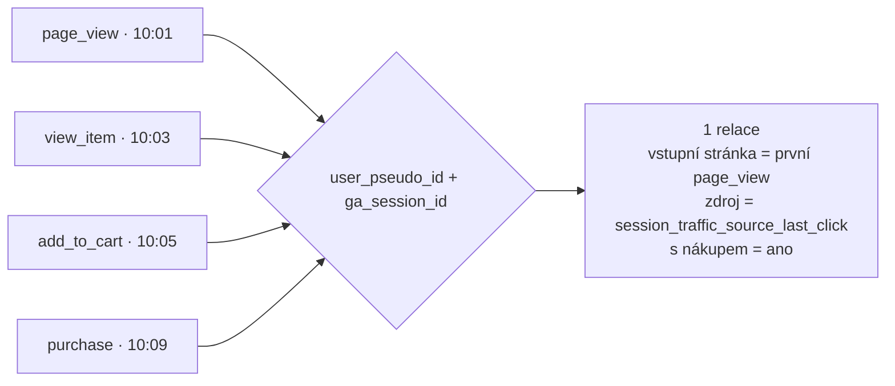

# F2: SQL pro GA4 v BigQuery: 12 dotazů pro marketéra – brief
> Cluster: F – BigQuery & zpracování dat · URL: /blog/ga4-bigquery-sql · Formát: technický návod (kuchařka) · Priorita: měsíc 2 · Cílová LP: /sluzby/bigquery · Rozsah: 2 800–3 400 slov textu + kód

---

## 1. Meta

| Prvek | Návrh |
|---|---|
| H1 | SQL pro GA4 v BigQuery: 12 dotazů pro marketéra |
| SEO title | SQL pro GA4 v BigQuery: 12 hotových dotazů \| datalayer.cz (57 zn.) |
| Meta description | 12 funkčních SQL dotazů nad exportem GA4: relace, zdroje, vstupní stránky, trychtýř, kohorty, duplicity i consent. S komentáři a tipy, jak šetřit náklady. (154 zn.) |
| URL | /blog/ga4-bigquery-sql |
| Autor | Vít Novotný · revize každých 6 měsíců (schéma exportu) |

**Klíčová slova** (Ahrefs CZ; téma je v ČR nové, objemy 0 – cílíme na long-tail a citovatelnost v AI přehledech):

| Typ | Klíčové slovo | Objem |
|---|---|---|
| Hlavní | ga4 bigquery sql / bigquery sql ga4 | 0 |
| Vedlejší | ga4 bigquery sessions · ga4 bigquery session id · channel grouping ga4 bigquery · ga4 bigquery cookbook · how to query bigquery · bigquery (150) · big query (70) | 0–150 |
| Otázky | Is BigQuery SQL? · Is BigQuery SQL or NoSQL? · how to query bigquery · how to use google bigquery | 0 |

**Záměr:** návodový / „copy-paste“ – čtenář chce hotový dotaz a pochopit, proč funguje.
**Čtenář:** analytik nebo technicky zdatný marketér (umí základy SQL nebo Excel), datový analytik e-shopu; vývojář, který dostal úkol „vytáhni z GA4 do reportu…“. Segmenty: e-shop (dotazy 5, 6, 9, 10), B2B (2–4, 8 s `generate_lead`), velká firma (11, 12 – governance).

---

## 2. Analýza SERP a konkurence

- Dotaz „ga4 bigquery“ ovládá **ga4bigquery.com** (placená kuchařka, EN), dokumentace Google (*Basic/Advanced event queries* – jen pár ukázek), optimizesmart.com (mapping tutorial, částečně za paywallem). Česky: DA (video ukázka bez SQL), flowstack.cz (popis use-cases bez dotazů), datimo.ai (vysvětluje, že UNNEST je potřeba, ale kód neukazuje).
- **Mezera:** česky neexistuje sada funkčních, komentovaných dotazů nad *aktuálním* schématem (2024+: `session_traffic_source_last_click`, `privacy_info`, `collected_traffic_source`). Většina veřejných EN dotazů počítá zdroj relace složitou rekonstrukcí z `event_params` (platí jen pro data před 7/2024) nebo sčítá relace po dnech (Google to výslovně nedoporučuje).
- **Čím přeskočíme:** 12 dotazů ověřených proti dokumentaci schématu, jednotná struktura (CTE `ev` → `relace` → výstup), české komentáře, u každého „co z toho vyčtete“ a „na co si dát pozor“, blok o nákladech a tabulka „který dotaz pro jakou otázku“. Kód ke stažení (GitHub Gist / .sql soubor).

---

## 3. Otázky, na které musí článek odpovědět

1. Proč nejde parametry GA4 vybrat obyčejným `SELECT` a co dělá `UNNEST`?
2. Jak spočítat relace stejně jako GA4 (`user_pseudo_id` + `ga_session_id`)?
3. Kde najdu zdroj/médium relace a proč nepoužívat `traffic_source`?
4. Jak zjistit vstupní stránky a jejich konverzní poměr?
5. Jak postavit e-commerce trychtýř (otevřený vs. uzavřený)?
6. Jak vytáhnout tržby a kusy podle produktů?
7. Jak rozlišit nové a vracející se uživatele?
8. Jak spočítat konverzní poměr (relace vs. uživatelé)?
9. Jak udělat kohortní analýzu nákupů?
10. Jak najít a odstranit duplicitní transakce?
11. Kolik událostí a nákupů je bez souhlasu s cookies (consent)?
12. Jak denně automaticky kontrolovat kvalitu dat?
13. Kolik dotazy stojí a jak je zlevnit (`_TABLE_SUFFIX`, výběr sloupců, dry run)?
14. Je BigQuery SQL, nebo NoSQL?

---

## 4. Rychlá odpověď (hotový text, 55 slov)

> Data GA4 v BigQuery jsou uložená po událostech a parametry jsou vnořené, proto je čtete funkcí `UNNEST(event_params)`. Relaci určuje kombinace `user_pseudo_id` a `ga_session_id`, zdroj relace pole `session_traffic_source_last_click`. Dotazujte vždy jen potřebné sloupce a dny přes `_TABLE_SUFFIX` – platíte za objem přečtených dat.

---

## 5. Osnova s obsahem odpovědí

### H2 1: Než začnete: jak export GA4 vypadá a jak psát levné dotazy
**Klíčové sdělení:** Tři pravidla – jeden řádek je jedna událost; parametry jsou pole (UNNEST); platí se za přečtené sloupce a dny.

- **Tabulky:** `events_YYYYMMDD` (jedna na den), dotazuje se přes zástupný znak `events_*` a pseudosloupec `_TABLE_SUFFIX` (→ F1). Pozor: `events_*` zahrnuje i `events_intraday_*` – filtr `BETWEEN '20260901' AND '20260930'` je vyloučí (sufix `intraday_…` do rozsahu nespadá).
- **UNNEST vzor:** `(SELECT value.string_value FROM UNNEST(event_params) WHERE key = 'page_location')` vrátí jednu hodnotu na řádek; `CROSS JOIN UNNEST(event_params)` řádky namnoží (použít jen pro inventuru parametrů).
- **Typy hodnot:** každý parametr je v jednom z polí `string_value`, `int_value`, `double_value` (`float_value` se nepoužívá). Stejný parametr může přijít v různých typech (např. `value` jako int i double) → dotaz 1a ukáže, jak to máte vy.
- **Náklady (box „Než stisknete Spustit“):**
  1. Nikdy `SELECT *` – BigQuery účtuje přečtené **sloupce**, `LIMIT` cenu nesnižuje.
  2. Vždy filtr `_TABLE_SUFFIX` s konstantou (literál nebo výraz s `CURRENT_DATE()`); filtr přes poddotaz počet čtených tabulek **neomezí** (Google, querying wildcard tables).
  3. Před spuštěním se podívejte na odhad v editoru („This query will process X GB“) = dry run.
  4. Dotazy nad zástupnými tabulkami se **nekešují** – opakované spuštění se platí znovu (→ G1: nenapojujte Data Studio přímo na `events_*`).
  5. On-demand cena v EU multiregionu 6,25 USD/TiB, první 1 TiB měsíčně zdarma (ověřeno 8. 10. 2026, → F5).
- **Kde zkoušet zdarma:** veřejný dataset `bigquery-public-data.ga4_obfuscated_sample_ecommerce.events_*` (Google Merchandise Store, data 1. 11. 2020 – 31. 1. 2021). Pozor: má starší schéma – chybí např. `session_traffic_source_last_click` a `collected_traffic_source`, takže dotazy 3, 10b a 12a na něm upravte (zdroj vezměte z `traffic_source` nebo `event_params`).
- **Jednotná struktura dotazů:** CTE `ev` (vytažení parametrů) → CTE `relace` (agregace na relaci) → výstup. Čtenář se naučí jeden vzor a ostatní dotazy jsou jeho variace.
- Konvence v ukázkách: projekt `vas-projekt`, dataset `analytics_123456789`, období září 2026. **Nahraďte vlastními hodnotami.**

**Tabulka „Který dotaz pro jakou otázku“ (kompletní):**

| # | Otázka | Úroveň | Segment |
|---|---|---|---|
| 1 | Jaké parametry posíláme? Které stránky se čtou? | událost | všichni |
| 2 | Kolik je relací a jak jsou zapojené? | relace | všichni |
| 3 | Odkud relace přicházejí a které kanály prodávají? | relace | všichni |
| 4 | Které vstupní stránky fungují? | relace | všichni |
| 5 | Kde zákazníci odpadají v nákupním procesu? | relace | e-shop |
| 6 | Které produkty vydělávají? | položka | e-shop |
| 7 | Jak se chovají noví vs. vracející se? | relace | všichni |
| 8 | Jaký je konverzní poměr v čase? | relace/uživatel | všichni |
| 9 | Jak nakupují kohorty nových uživatelů? | uživatel | e-shop |
| 10 | Máme duplicitní objednávky? | transakce | e-shop |
| 11 | Kolik dat je bez souhlasu? | událost | všichni |
| 12 | Je měření včera v pořádku? | kontrola | všichni |

### H2 2 (dotaz 1): Rozbalení parametrů – inventura a nejčtenější stránky
**Klíčové sdělení:** Než začnete reportovat, zjistěte, jaké parametry vůbec posíláte a v jakém typu.

```sql
-- 1a) Inventura parametrů: jaké klíče event_params posíláte a v jakém typu
SELECT
  ep.key AS parametr,
  COUNT(*) AS vyskyty,
  COUNTIF(ep.value.string_value IS NOT NULL) AS jako_string,
  COUNTIF(ep.value.int_value IS NOT NULL) AS jako_int,
  COUNTIF(ep.value.double_value IS NOT NULL) AS jako_double
FROM `vas-projekt.analytics_123456789.events_*`,
  UNNEST(event_params) AS ep
WHERE _TABLE_SUFFIX = '20260930'
GROUP BY parametr
ORDER BY vyskyty DESC;
```

```sql
-- 1b) Nejčtenější stránky: zobrazení a uživatelé
SELECT
  (SELECT value.string_value FROM UNNEST(event_params) WHERE key = 'page_location') AS page_location,
  COUNT(*) AS zobrazeni,
  COUNT(DISTINCT user_pseudo_id) AS uzivatele
FROM `vas-projekt.analytics_123456789.events_*`
WHERE _TABLE_SUFFIX BETWEEN '20260901' AND '20260930'
  AND event_name = 'page_view'
GROUP BY page_location
ORDER BY zobrazeni DESC
LIMIT 100;
```
**Co z toho vyčtete:** seznam parametrů (i překlepy typu `item_lsit_name`, osobní údaje v parametrech), parametry posílané ve dvou typech. Druhý dotaz = obdoba reportu Stránky.
**Pozor:** `page_location` obsahuje query string → stejná stránka s UTM se rozpadne do více řádků (řešení v dotazu 4). Inventuru spouštějte na 1 den – je levná.

### H2 3 (dotaz 2): Relace podle ga_session_id
**Klíčové sdělení:** Relace = unikátní kombinace `user_pseudo_id` a `ga_session_id` za celé období – nesčítejte relace po dnech (relace přes půlnoc by se započítaly dvakrát; doporučení Google).

```sql
-- 2) Relace podle ga_session_id: počet, zapojené relace, průměrný čas zapojení
WITH ev AS (
  SELECT
    user_pseudo_id,
    (SELECT value.int_value FROM UNNEST(event_params) WHERE key = 'ga_session_id') AS ga_session_id,
    (SELECT COALESCE(value.string_value, CAST(value.int_value AS STRING))
       FROM UNNEST(event_params) WHERE key = 'session_engaged') AS session_engaged,
    (SELECT value.int_value FROM UNNEST(event_params) WHERE key = 'engagement_time_msec') AS engagement_time_msec
  FROM `vas-projekt.analytics_123456789.events_*`
  WHERE _TABLE_SUFFIX BETWEEN '20260901' AND '20260930'
),
relace AS (
  SELECT
    CONCAT(user_pseudo_id, '.', CAST(ga_session_id AS STRING)) AS session_key,
    LOGICAL_OR(session_engaged = '1') AS zapojena,
    SUM(COALESCE(engagement_time_msec, 0)) / 1000 AS cas_zapojeni_s
  FROM ev
  WHERE user_pseudo_id IS NOT NULL
    AND ga_session_id IS NOT NULL
  GROUP BY session_key
)
SELECT
  COUNT(*) AS relace,
  COUNTIF(zapojena) AS zapojene_relace,
  ROUND(SAFE_DIVIDE(COUNTIF(zapojena), COUNT(*)), 4) AS mira_zapojeni,
  ROUND(AVG(cas_zapojeni_s), 1) AS prumerny_cas_zapojeni_s
FROM relace;
```
**Co z toho vyčtete:** počet relací, zapojené relace (`session_engaged = '1'`), míra zapojení, průměrný čas zapojení.
**Pozor:** události bez souhlasu (advanced Consent Mode) nemají `user_pseudo_id` → do relací se nepočítají (UI je dopočítává modelem). Rozdíl proti UI v jednotkách % je normální (HyperLogLog++ v UI, → F1 H2 8). Parametr `session_engaged` může přijít jako text i číslo – proto `COALESCE`.

### H2 4 (dotaz 3): Zdroj a médium relace
**Klíčové sdělení:** Pro data od poloviny 2024 použijte `session_traffic_source_last_click` – je to nejbližší obdoba „zdroje/média relace“ v GA4. `traffic_source` je zdroj **první návštěvy uživatele**, ne relace.

```sql
-- 3) Zdroj / médium relace (last non-direct click podle GA4) + nákupy
WITH ev AS (
  SELECT
    user_pseudo_id,
    event_name,
    event_timestamp,
    (SELECT value.int_value FROM UNNEST(event_params) WHERE key = 'ga_session_id') AS ga_session_id,
    session_traffic_source_last_click.cross_channel_campaign.source AS zdroj,
    session_traffic_source_last_click.cross_channel_campaign.medium AS medium,
    session_traffic_source_last_click.cross_channel_campaign.campaign_name AS kampan,
    ecommerce.purchase_revenue AS trzba
  FROM `vas-projekt.analytics_123456789.events_*`
  WHERE _TABLE_SUFFIX BETWEEN '20260901' AND '20260930'
),
relace AS (
  SELECT
    CONCAT(user_pseudo_id, '.', CAST(ga_session_id AS STRING)) AS session_key,
    -- zdroj je stejný pro celou relaci; bereme první neprázdnou hodnotu
    ARRAY_AGG(zdroj IGNORE NULLS ORDER BY event_timestamp LIMIT 1)[SAFE_OFFSET(0)] AS zdroj,
    ARRAY_AGG(medium IGNORE NULLS ORDER BY event_timestamp LIMIT 1)[SAFE_OFFSET(0)] AS medium,
    ARRAY_AGG(kampan IGNORE NULLS ORDER BY event_timestamp LIMIT 1)[SAFE_OFFSET(0)] AS kampan,
    COUNTIF(event_name = 'purchase') AS nakupy,
    SUM(IF(event_name = 'purchase', trzba, 0)) AS trzby
  FROM ev
  WHERE user_pseudo_id IS NOT NULL
    AND ga_session_id IS NOT NULL
  GROUP BY session_key
)
SELECT
  COALESCE(zdroj, '(not set)') AS zdroj,
  COALESCE(medium, '(not set)') AS medium,
  COUNT(*) AS relace,
  SUM(nakupy) AS nakupy,
  ROUND(SUM(trzby), 2) AS trzby,
  ROUND(SAFE_DIVIDE(COUNTIF(nakupy > 0), COUNT(*)), 4) AS konverzni_pomer
FROM relace
GROUP BY 1, 2
ORDER BY relace DESC;
```
**Co z toho vyčtete:** relace, nákupy, tržby a konverzní poměr podle zdroje/média.
**Varianty (popsat textem + krátký snippet):**
- Kampaně Google Ads s názvem sestavy: `session_traffic_source_last_click.google_ads_campaign.campaign_name`, `.ad_group_name`.
- Data před 7/2024 (resp. cross-channel před 10/2024): zdroj z `collected_traffic_source.manual_source/manual_medium` první události relace, nebo z `event_params` (`source`, `medium`) – s vlastní logikou „last non-direct“ (→ F3).
- Seskupení kanálů (Default Channel Group) v exportu není jako pole – vlastní `CASE` podle pravidel Google (→ F3, příloha s pravidly).
**Pozor:** Google uvádí, že relační atribuční model UI nelze z exportu plně přepočítat – drobné rozdíly jsou normální.

### H2 5 (dotaz 4): Vstupní stránky a jejich výkon
```sql
-- 4) Vstupní stránky: relace, míra zapojení, konverzní poměr, tržby
WITH ev AS (
  SELECT
    user_pseudo_id,
    event_name,
    event_timestamp,
    (SELECT value.int_value FROM UNNEST(event_params) WHERE key = 'ga_session_id') AS ga_session_id,
    (SELECT value.string_value FROM UNNEST(event_params) WHERE key = 'page_location') AS page_location,
    (SELECT COALESCE(value.string_value, CAST(value.int_value AS STRING))
       FROM UNNEST(event_params) WHERE key = 'session_engaged') AS session_engaged,
    ecommerce.purchase_revenue AS trzba
  FROM `vas-projekt.analytics_123456789.events_*`
  WHERE _TABLE_SUFFIX BETWEEN '20260901' AND '20260930'
),
relace AS (
  SELECT
    CONCAT(user_pseudo_id, '.', CAST(ga_session_id AS STRING)) AS session_key,
    -- první page_view relace = vstupní stránka
    ARRAY_AGG(IF(event_name = 'page_view', page_location, NULL) IGNORE NULLS
              ORDER BY event_timestamp LIMIT 1)[SAFE_OFFSET(0)] AS vstupni_url,
    LOGICAL_OR(session_engaged = '1') AS zapojena,
    LOGICAL_OR(event_name = 'purchase') AS s_nakupem,
    SUM(IF(event_name = 'purchase', trzba, 0)) AS trzby
  FROM ev
  WHERE user_pseudo_id IS NOT NULL
    AND ga_session_id IS NOT NULL
  GROUP BY session_key
)
SELECT
  -- odstraní query string (UTM, gclid) a kotvu, aby se stejná stránka nesčítala zvlášť
  REGEXP_REPLACE(COALESCE(vstupni_url, '(bez page_view)'), r'[?#].*$', '') AS vstupni_stranka,
  COUNT(*) AS relace,
  ROUND(SAFE_DIVIDE(COUNTIF(zapojena), COUNT(*)), 4) AS mira_zapojeni,
  ROUND(SAFE_DIVIDE(COUNTIF(s_nakupem), COUNT(*)), 4) AS konverzni_pomer,
  ROUND(SUM(trzby), 2) AS trzby
FROM relace
GROUP BY vstupni_stranka
HAVING COUNT(*) >= 50
ORDER BY relace DESC;
```
**Co z toho vyčtete:** které vstupní stránky přivádějí zapojené relace a nákupy; podklad pro SEO a landing pages kampaní.
**Pozor:** `HAVING COUNT(*) >= 50` odfiltruje šum; relace bez `page_view` (např. jen `session_start` z aplikace nebo Measurement Protocol) se zobrazí jako „(bez page_view)“. Normalizaci URL (lomítka na konci, velká písmena) přizpůsobte webu.

### H2 6 (dotaz 5): E-commerce trychtýř
**Klíčové sdělení:** Uzavřený trychtýř počítá jen relace, které prošly kroky v pořadí; otevřený (prostý počet relací s krokem) je v posledním sloupci pro srovnání.

```sql
-- 5) E-commerce trychtýř po relacích (uzavřený: každý krok musí následovat po předchozím)
WITH ev AS (
  SELECT
    CONCAT(user_pseudo_id, '.',
      CAST((SELECT value.int_value FROM UNNEST(event_params) WHERE key = 'ga_session_id') AS STRING)) AS session_key,
    event_name,
    event_timestamp
  FROM `vas-projekt.analytics_123456789.events_*`
  WHERE _TABLE_SUFFIX BETWEEN '20260901' AND '20260930'
    AND event_name IN ('view_item', 'add_to_cart', 'begin_checkout', 'add_payment_info', 'purchase')
    AND user_pseudo_id IS NOT NULL
),
kroky AS (
  SELECT
    session_key,
    MIN(IF(event_name = 'view_item', event_timestamp, NULL)) AS t1_view_item,
    MIN(IF(event_name = 'add_to_cart', event_timestamp, NULL)) AS t2_add_to_cart,
    MIN(IF(event_name = 'begin_checkout', event_timestamp, NULL)) AS t3_begin_checkout,
    MIN(IF(event_name = 'add_payment_info', event_timestamp, NULL)) AS t4_add_payment_info,
    MIN(IF(event_name = 'purchase', event_timestamp, NULL)) AS t5_purchase
  FROM ev
  WHERE session_key IS NOT NULL
  GROUP BY session_key
),
trychtyr AS (
  SELECT
    COUNTIF(t1_view_item IS NOT NULL) AS k1_zobrazeni_produktu,
    COUNTIF(t2_add_to_cart > t1_view_item) AS k2_pridani_do_kosiku,
    COUNTIF(t3_begin_checkout > t2_add_to_cart AND t2_add_to_cart > t1_view_item) AS k3_zahajeni_pokladny,
    COUNTIF(t4_add_payment_info > t3_begin_checkout AND t3_begin_checkout > t2_add_to_cart
            AND t2_add_to_cart > t1_view_item) AS k4_platebni_udaje,
    COUNTIF(t5_purchase > t4_add_payment_info AND t4_add_payment_info > t3_begin_checkout
            AND t3_begin_checkout > t2_add_to_cart AND t2_add_to_cart > t1_view_item) AS k5_nakup,
    COUNTIF(t5_purchase IS NOT NULL) AS vsechny_relace_s_nakupem
  FROM kroky
)
SELECT
  *,
  ROUND(SAFE_DIVIDE(k2_pridani_do_kosiku, k1_zobrazeni_produktu), 4) AS prechod_1_2,
  ROUND(SAFE_DIVIDE(k3_zahajeni_pokladny, k2_pridani_do_kosiku), 4) AS prechod_2_3,
  ROUND(SAFE_DIVIDE(k4_platebni_udaje, k3_zahajeni_pokladny), 4) AS prechod_3_4,
  ROUND(SAFE_DIVIDE(k5_nakup, k4_platebni_udaje), 4) AS prechod_4_5
FROM trychtyr;
```
**Co z toho vyčtete:** procentní přechody mezi kroky a největší „díru“.
**Pozor:** zákazníci, kteří přidávají do košíku přímo z výpisu kategorie (bez `view_item`), v uzavřeném trychtýři vypadnou → porovnejte s `vsechny_relace_s_nakupem`. Kroky upravte podle své implementace (např. `add_shipping_info`), seznam událostí podle C2. Velký rozdíl mezi `k5_nakup` a `vsechny_relace_s_nakupem` často prozradí chybu v datové vrstvě (chybějící `begin_checkout`).

### H2 7 (dotaz 6): Nákupy a položky
```sql
-- 6) Nákupy a položky: tržby a kusy podle produktu
SELECT
  i.item_id,
  ANY_VALUE(i.item_name) AS nazev,
  ANY_VALUE(i.item_category) AS kategorie,
  COUNT(DISTINCT ecommerce.transaction_id) AS objednavky,
  SUM(i.quantity) AS kusy,
  ROUND(SUM(i.item_revenue), 2) AS trzby_polozky,
  ROUND(SAFE_DIVIDE(SUM(i.item_revenue), SUM(i.quantity)), 2) AS prumerna_cena
FROM `vas-projekt.analytics_123456789.events_*`,
  UNNEST(items) AS i
WHERE _TABLE_SUFFIX BETWEEN '20260901' AND '20260930'
  AND event_name = 'purchase'
GROUP BY i.item_id
ORDER BY trzby_polozky DESC;
```
**Co z toho vyčtete:** nejprodávanější produkty podle tržeb a kusů.
**Pozor:** `item_revenue` počítá GA4 z ceny a množství položky; u více měn ověřte, v jaké měně hodnoty jsou (dokumentace uvádí „local currency“, jednotná měna je v polích `*_in_usd`). Marže v GA4 není – přidáte ji spojením s daty e-shopu (→ F4). Duplicitní nákupy zkreslují i položky → nejdřív dotaz 10.

### H2 8 (dotaz 7): Noví vs. vracející se
```sql
-- 7) Noví vs. vracející se: relace, uživatelé, konverze a tržby
WITH ev AS (
  SELECT
    user_pseudo_id,
    event_name,
    (SELECT value.int_value FROM UNNEST(event_params) WHERE key = 'ga_session_id') AS ga_session_id,
    (SELECT value.int_value FROM UNNEST(event_params) WHERE key = 'ga_session_number') AS ga_session_number,
    ecommerce.purchase_revenue AS trzba
  FROM `vas-projekt.analytics_123456789.events_*`
  WHERE _TABLE_SUFFIX BETWEEN '20260901' AND '20260930'
),
relace AS (
  SELECT
    user_pseudo_id,
    ga_session_id,
    MAX(ga_session_number) AS ga_session_number,
    LOGICAL_OR(event_name = 'purchase') AS s_nakupem,
    SUM(IF(event_name = 'purchase', trzba, 0)) AS trzby
  FROM ev
  WHERE user_pseudo_id IS NOT NULL
    AND ga_session_id IS NOT NULL
  GROUP BY user_pseudo_id, ga_session_id
)
SELECT
  IF(ga_session_number = 1, 'nový', 'vracející se') AS typ,
  COUNT(*) AS relace,
  COUNT(DISTINCT user_pseudo_id) AS uzivatele,
  COUNTIF(s_nakupem) AS relace_s_nakupem,
  ROUND(SAFE_DIVIDE(COUNTIF(s_nakupem), COUNT(*)), 4) AS konverzni_pomer,
  ROUND(SUM(trzby), 2) AS trzby
FROM relace
GROUP BY typ;
```
**Co z toho vyčtete:** podíl a konverze nových a vracejících se relací.
**Pozor:** „nový“ = první relace v daném **prohlížeči/zařízení** (`ga_session_number = 1`), ne nový zákazník. Nového zákazníka určíte jen z e-shopu/CRM (→ F4, G3). Google pro počet nových uživatelů používá události `first_visit` / `first_open`.

### H2 9 (dotaz 8): Konverzní poměr v čase
```sql
-- 8) Konverzní poměr po dnech: relace -> relace s nákupem; uživatelé -> kupující
WITH ev AS (
  SELECT
    event_date,
    user_pseudo_id,
    event_name,
    (SELECT value.int_value FROM UNNEST(event_params) WHERE key = 'ga_session_id') AS ga_session_id
  FROM `vas-projekt.analytics_123456789.events_*`
  WHERE _TABLE_SUFFIX BETWEEN '20260901' AND '20260930'
),
relace AS (
  SELECT
    user_pseudo_id,
    ga_session_id,
    PARSE_DATE('%Y%m%d', MIN(event_date)) AS den,   -- den začátku relace
    LOGICAL_OR(event_name = 'purchase') AS s_nakupem
  FROM ev
  WHERE user_pseudo_id IS NOT NULL
    AND ga_session_id IS NOT NULL
  GROUP BY user_pseudo_id, ga_session_id
)
SELECT
  den,
  COUNT(*) AS relace,
  COUNTIF(s_nakupem) AS relace_s_nakupem,
  ROUND(SAFE_DIVIDE(COUNTIF(s_nakupem), COUNT(*)), 4) AS konverzni_pomer_relaci,
  COUNT(DISTINCT user_pseudo_id) AS uzivatele,
  COUNT(DISTINCT IF(s_nakupem, user_pseudo_id, NULL)) AS kupujici,
  ROUND(SAFE_DIVIDE(COUNT(DISTINCT IF(s_nakupem, user_pseudo_id, NULL)),
                    COUNT(DISTINCT user_pseudo_id)), 4) AS konverzni_pomer_uzivatelu
FROM relace
GROUP BY den
ORDER BY den;
```
**Co z toho vyčtete:** konverzní poměr relací (GA4 „míra klíčových událostí relace“ pro nákup) a uživatelů po dnech.
**Varianta B2B:** nahradit `'purchase'` událostí `generate_lead` (nebo seznamem klíčových událostí) – stejná logika.
**Pozor:** konverzní poměr relací a uživatelů se liší – v reportu vždy uvést, který používáte (→ G3 definice KPI).

### H2 10 (dotaz 9): Kohorty nových uživatelů
```sql
-- 9) Kohorty: uživatelé podle týdne první návštěvy a jejich nákupy v dalších týdnech
WITH prvni_navsteva AS (
  SELECT
    user_pseudo_id,
    DATE_TRUNC(DATE(TIMESTAMP_MICROS(MIN(user_first_touch_timestamp)), 'Europe/Prague'),
               WEEK(MONDAY)) AS kohorta_tyden
  FROM `vas-projekt.analytics_123456789.events_*`
  WHERE _TABLE_SUFFIX BETWEEN '20260105' AND '20260930'
    AND user_pseudo_id IS NOT NULL
  GROUP BY user_pseudo_id
),
velikost_kohort AS (
  SELECT kohorta_tyden, COUNT(*) AS uzivatele_v_kohorte
  FROM prvni_navsteva
  WHERE kohorta_tyden >= DATE '2026-01-05'     -- jen kohorty, které celé spadají do období
  GROUP BY kohorta_tyden
),
nakupy AS (
  SELECT
    user_pseudo_id,
    DATE(TIMESTAMP_MICROS(event_timestamp), 'Europe/Prague') AS den_nakupu,
    ecommerce.transaction_id,
    ecommerce.purchase_revenue
  FROM `vas-projekt.analytics_123456789.events_*`
  WHERE _TABLE_SUFFIX BETWEEN '20260105' AND '20260930'
    AND event_name = 'purchase'
    AND user_pseudo_id IS NOT NULL
)
SELECT
  p.kohorta_tyden,
  v.uzivatele_v_kohorte,
  DATE_DIFF(n.den_nakupu, p.kohorta_tyden, WEEK(MONDAY)) AS tyden_od_prvni_navstevy,
  COUNT(DISTINCT n.user_pseudo_id) AS kupujici,
  ROUND(SAFE_DIVIDE(COUNT(DISTINCT n.user_pseudo_id), v.uzivatele_v_kohorte), 4) AS podil_kupujicich,
  COUNT(DISTINCT n.transaction_id) AS objednavky,
  ROUND(SUM(n.purchase_revenue), 2) AS trzby
FROM prvni_navsteva AS p
JOIN velikost_kohort AS v USING (kohorta_tyden)
JOIN nakupy AS n USING (user_pseudo_id)
GROUP BY 1, 2, 3
ORDER BY 1, 3;
```
**Co z toho vyčtete:** jaký podíl uživatelů z dané týdenní kohorty nakoupil v týdnu 0, 1, 2…; tržby kohort.
**Pozor:** kohorta podle `user_pseudo_id` = prohlížeč, ne člověk (nákup z mobilu a pak z počítače = dva „uživatelé“). Pro zákaznické kohorty a LTV použijte data e-shopu (→ F4). Dotaz čte víc měsíců – vybírá ale jen 5 sloupců; před spuštěním zkontrolujte odhad objemu.

### H2 11 (dotaz 10): Duplicitní transakce – najít a odstranit
**Klíčové sdělení:** Opakované načtení děkovací stránky posílá `purchase` znovu. GA4 v rozhraní nákupy se stejným `transaction_id` deduplikuje (jen webové streamy), **export ale obsahuje všechny události**.

```sql
-- 10a) Kontrola duplicitních transakcí
SELECT
  ecommerce.transaction_id,
  COUNT(*) AS purchase_udalosti,
  COUNT(DISTINCT user_pseudo_id) AS ruzni_uzivatele,
  MIN(TIMESTAMP_MICROS(event_timestamp)) AS prvni_vyskyt,
  MAX(TIMESTAMP_MICROS(event_timestamp)) AS posledni_vyskyt,
  MIN(ecommerce.purchase_revenue) AS min_trzba,
  MAX(ecommerce.purchase_revenue) AS max_trzba
FROM `vas-projekt.analytics_123456789.events_*`
WHERE _TABLE_SUFFIX BETWEEN '20260901' AND '20260930'
  AND event_name = 'purchase'
GROUP BY ecommerce.transaction_id
HAVING COUNT(*) > 1
ORDER BY purchase_udalosti DESC;
```

```sql
-- 10b) Deduplikované nákupy: jeden řádek na transaction_id (první výskyt)
SELECT
  PARSE_DATE('%Y%m%d', event_date) AS den,
  TIMESTAMP_MICROS(event_timestamp) AS cas,
  user_pseudo_id,
  user_id,
  ecommerce.transaction_id AS transaction_id,
  ecommerce.purchase_revenue AS trzba,
  ecommerce.shipping_value AS doprava,
  ecommerce.tax_value AS dan,
  session_traffic_source_last_click.cross_channel_campaign.source AS zdroj,
  session_traffic_source_last_click.cross_channel_campaign.medium AS medium
FROM `vas-projekt.analytics_123456789.events_*`
WHERE _TABLE_SUFFIX BETWEEN '20260901' AND '20260930'
  AND event_name = 'purchase'
  AND ecommerce.transaction_id IS NOT NULL
  AND ecommerce.transaction_id NOT IN ('', '(not set)')
QUALIFY ROW_NUMBER() OVER (PARTITION BY ecommerce.transaction_id ORDER BY event_timestamp) = 1;
```
**Co z toho vyčtete:** kolik nákupů je duplicitních a jak velký je rozdíl v tržbách; dotaz 10b je základ tabulky `int_purchases` (→ F3).
**Pozor:** prázdné `transaction_id` GA4 v UI deduplikuje všechny dohromady (Google varuje: neposílejte prázdný řetězec) – v exportu je vyřaďte a opravte měření. Duplicity hledejte v celém období (návrat na děkovací stránku druhý den), v inkrementálních modelech kontrolujte aspoň posledních 30 dní. Více uživatelů u jednoho `transaction_id` = chyba v generování ID.

### H2 12 (dotaz 11): Kolik dat je bez souhlasu (Consent Mode)
**Klíčové sdělení:** Pokud používáte *advanced* Consent Mode, export obsahuje i „cookieless“ události. Dotaz ukáže jejich podíl. Při *basic* režimu tato data neexistují a dotaz vrátí nuly.

```sql
-- 11) Consent: podíl událostí a nákupů bez souhlasu s analytickými cookies (jen při advanced Consent Mode)
SELECT
  PARSE_DATE('%Y%m%d', event_date) AS den,
  COUNT(*) AS udalosti,
  COUNTIF(privacy_info.analytics_storage = 'No') AS udalosti_bez_souhlasu,
  ROUND(SAFE_DIVIDE(COUNTIF(privacy_info.analytics_storage = 'No'), COUNT(*)), 4) AS podil_bez_souhlasu,
  COUNTIF(privacy_info.analytics_storage IS NULL
          OR privacy_info.analytics_storage = 'Unset') AS udalosti_stav_nenastaven,
  COUNTIF(user_pseudo_id IS NULL) AS udalosti_bez_user_pseudo_id,
  COUNTIF(event_name = 'page_view') AS page_view,
  COUNTIF(event_name = 'page_view' AND privacy_info.analytics_storage = 'No') AS page_view_bez_souhlasu,
  COUNTIF(event_name = 'purchase') AS nakupy,
  COUNTIF(event_name = 'purchase' AND privacy_info.analytics_storage = 'No') AS nakupy_bez_souhlasu,
  COUNTIF(privacy_info.ads_storage = 'No') AS udalosti_bez_souhlasu_ads
FROM `vas-projekt.analytics_123456789.events_*`
WHERE _TABLE_SUFFIX BETWEEN '20260901' AND '20260930'
GROUP BY den
ORDER BY den;
```
**Co z toho vyčtete:** podíl událostí, zobrazení stránek a nákupů bez souhlasu s analytickými (a reklamními) cookies, trend po změně cookie lišty.
**Pozor (důležité pro interpretaci):**
- Podíl **událostí** bez souhlasu ≠ podíl **lidí**, kteří souhlas odmítli (počet událostí na člověka se liší a bez identifikátoru je nelze spojit).
- U událostí bez souhlasu chybí `user_pseudo_id` → nelze je přiřadit k relaci ani zdroji.
- Vysoký počet `Unset` = consent se nenastavuje před odesláním tagu (chyba implementace, → A1).
- Nejde o právní posouzení; výklad souhlasu viz A2, A6.

### H2 13 (dotaz 12): Denní kontrola kvality dat
**Klíčové sdělení:** Dva levné dotazy, které stojí za to naplánovat každý den (plánovaný dotaz nebo Dataform assertion, → F3) a poslat výsledek e-mailem/do Slacku.

```sql
-- 12a) Denní kontrola kvality dat (včerejší tabulka)
WITH ev AS (
  SELECT
    event_name,
    user_pseudo_id,
    ecommerce.transaction_id AS transaction_id,
    ecommerce.purchase_revenue AS trzba,
    ARRAY_LENGTH(items) AS pocet_polozek,
    (SELECT value.string_value FROM UNNEST(event_params) WHERE key = 'currency') AS mena,
    (SELECT value.int_value FROM UNNEST(event_params) WHERE key = 'ga_session_id') AS ga_session_id,
    (SELECT value.string_value FROM UNNEST(event_params) WHERE key = 'page_location') AS page_location,
    session_traffic_source_last_click.cross_channel_campaign.source AS zdroj_relace
  FROM `vas-projekt.analytics_123456789.events_*`
  WHERE _TABLE_SUFFIX = FORMAT_DATE('%Y%m%d', DATE_SUB(CURRENT_DATE('Europe/Prague'), INTERVAL 1 DAY))
)
SELECT 'nákup bez transaction_id' AS kontrola,
       COUNTIF(event_name = 'purchase' AND COALESCE(transaction_id, '') IN ('', '(not set)')) AS pocet
FROM ev
UNION ALL
SELECT 'nákup s nulovou nebo prázdnou tržbou',
       COUNTIF(event_name = 'purchase' AND COALESCE(trzba, 0) = 0)
FROM ev
UNION ALL
SELECT 'nákup bez položek (items)',
       COUNTIF(event_name = 'purchase' AND COALESCE(pocet_polozek, 0) = 0)
FROM ev
UNION ALL
SELECT 'nákup bez měny (currency)',
       COUNTIF(event_name = 'purchase' AND mena IS NULL)
FROM ev
UNION ALL
SELECT 'duplicitní transaction_id',
       (SELECT COUNT(*) FROM (
          SELECT transaction_id FROM ev
          WHERE event_name = 'purchase' AND transaction_id IS NOT NULL
          GROUP BY transaction_id HAVING COUNT(*) > 1))
UNION ALL
SELECT 'události se souhlasem bez ga_session_id',
       COUNTIF(user_pseudo_id IS NOT NULL AND ga_session_id IS NULL)
FROM ev
UNION ALL
SELECT 'page_view s e-mailem v URL (osobní údaj!)',
       COUNTIF(event_name = 'page_view'
               AND REGEXP_CONTAINS(page_location, r'[A-Za-z0-9._%+-]+(@|%40)[A-Za-z0-9.-]+\.[A-Za-z]{2,}'))
FROM ev
UNION ALL
SELECT 'nákupy bez zdroje relace',
       COUNTIF(event_name = 'purchase' AND user_pseudo_id IS NOT NULL AND zdroj_relace IS NULL)
FROM ev;
```

```sql
-- 12b) Objem událostí: včerejšek proti průměru 7 předchozích dní (detekce výpadku měření)
WITH denni AS (
  SELECT
    PARSE_DATE('%Y%m%d', event_date) AS den,
    event_name,
    COUNT(*) AS udalosti
  FROM `vas-projekt.analytics_123456789.events_*`
  WHERE _TABLE_SUFFIX BETWEEN FORMAT_DATE('%Y%m%d', DATE_SUB(CURRENT_DATE('Europe/Prague'), INTERVAL 8 DAY))
                          AND FORMAT_DATE('%Y%m%d', DATE_SUB(CURRENT_DATE('Europe/Prague'), INTERVAL 1 DAY))
    AND event_name IN ('page_view', 'add_to_cart', 'begin_checkout', 'purchase', 'generate_lead')
  GROUP BY den, event_name
)
SELECT
  event_name,
  SUM(IF(den = DATE_SUB(CURRENT_DATE('Europe/Prague'), INTERVAL 1 DAY), udalosti, 0)) AS vcera,
  ROUND(AVG(IF(den < DATE_SUB(CURRENT_DATE('Europe/Prague'), INTERVAL 1 DAY), udalosti, NULL)), 0) AS prumer_7_dni,
  ROUND(SAFE_DIVIDE(
    SUM(IF(den = DATE_SUB(CURRENT_DATE('Europe/Prague'), INTERVAL 1 DAY), udalosti, 0)),
    AVG(IF(den < DATE_SUB(CURRENT_DATE('Europe/Prague'), INTERVAL 1 DAY), udalosti, NULL))) - 1, 3) AS zmena
FROM denni
GROUP BY event_name
ORDER BY event_name;
```
**Co z toho vyčtete:** chyby v nákupech (bez ID, bez tržby, bez položek, bez měny), duplicity, události bez `ga_session_id`, **osobní údaje v URL** (e-mail v `page_location` – typicky formulář odeslaný metodou GET; → A3), nákupy bez zdroje; propad objemu událostí proti týdennímu průměru (např. po nasazení nové verze webu).
**Pozor:** prahy upozornění nastavte podle webu (např. `zmena < -0,3` u `purchase`). Dotaz 12b čte 8 denních tabulek, ale jen sloupce `event_date` a `event_name` – stojí zlomky centu.

### H2 14: Jak dotazy zlevnit a zrychlit, když je pouštíte pravidelně
**Klíčové sdělení:** Pro jednorázovou analýzu stačí dotazy výše. Pro dashboardy a denní reporting z nich udělejte tabulky (relace, nákupy) a reportujte z nich.

- Materializovat: `int_sessions` (z dotazů 2–4, 7), `int_purchases` (10b), `mart_channel_daily` (3 + náklady) – partitionované podle data, clusterované (→ F3).
- Data Studio / Power BI připojit na tyto tabulky, ne na `events_*` (→ G1, F5).
- Kontrola útraty: `INFORMATION_SCHEMA.JOBS` (dotaz v F5), vlastní kvóty a `maximum bytes billed`.
- Pomocná dočasná funkce pro čitelnější kód (ukázka z dokumentace Google): `CREATE TEMP FUNCTION GetParamValue(params ANY TYPE, target_key STRING) AS ((SELECT value FROM UNNEST(params) WHERE key = target_key LIMIT 1));` → pak `GetParamValue(event_params, 'ga_session_id').int_value`.

### H2 15: Je BigQuery SQL, nebo NoSQL? (krátká sekce pro PAA)
BigQuery je analytický (sloupcový) datový sklad, se kterým pracujete jazykem SQL – dialektem **GoogleSQL** (ANSI kompatibilní, s rozšířeními pro vnořená a opakovaná pole jako `STRUCT` a `ARRAY`). Proto v něm jde pracovat s vnořenými daty z GA4 i s klasickými tabulkami z e-shopu. Není to NoSQL databáze ani transakční databáze pro provoz webu.

---

## 6. Vizuály

### 6.1 Diagram „Jak se z událostí stane relace“ (pod H2 3)

**Finální SVG:** vlevo svislá „páska“ 4 událostí (karty `#0b1a30`, název události v Roboto Mono cyan, čas šedě), uprostřed „klíč“ (ikona klíče + `user_pseudo_id.ga_session_id` v mono), vpravo karta relace se 3 odvozenými atributy; animace: události „sjedou“ do klíče. Mobil: svisle.

### 6.2 Vizuál „Co stojí peníze“ (H2 1, box o nákladech)
Dvě tabulky vedle sebe jako „sloupce“: vlevo `SELECT *` přes 12 měsíců (zvýrazněné všechny sloupce, cena v oranžové), vpravo 4 vybrané sloupce za 30 dní (zvýrazněné jen 4 sloupce, cena v cyan). Popisek: „Platíte za přečtené sloupce × dny. LIMIT cenu nesnižuje.“ Čísla jen ilustrativní (označit).

### 6.3 Tabulka „Který dotaz pro jakou otázku“ – viz H2 1 (kompletní).

### 6.4 Mockup konzole BigQuery (H2 1)
Stylizovaný výřez editoru: dotaz 2, vpravo nahoře zelený odznak „This query will process 412 MB when run.“ (fiktivní), dole tabulka výsledku se 4 sloupci. Šipka s popiskem „odhad = dry run, zkontrolujte před spuštěním“.

### 6.5 Ke stažení
Všech 12 dotazů jako `.sql` soubor (GitHub Gist nebo `/nastroje`) – CTA „Stáhnout dotazy“ (měřit `tool_use` / `file_download`).

---

## 7. Fakta a zdroje

| Tvrzení | Zdroj | Ověřeno | Riziko zastarání |
|---|---|---|---|
| Schéma: `event_params` (key, string/int/double/float_value), `privacy_info` Yes/No/Unset, `session_traffic_source_last_click.cross_channel_campaign/manual_campaign/google_ads_campaign`, `ecommerce.*`, `items.*`, `is_active_user` | https://support.google.com/analytics/answer/7029846 | 8. 10. 2026 | vysoké |
| Relace = unikátní `user_pseudo_id`/`user_id` + `ga_session_id` za období, nesčítat po dnech; `is_active_user` pro aktivní uživatele | https://developers.google.com/analytics/blog/2023/bigquery-vs-ui | 8. 10. 2026 | nízké |
| Ukázky Google (GetParamValue, ga_session_number, veřejný dataset `ga4_obfuscated_sample_ecommerce`) | https://developers.google.com/analytics/bigquery/advanced-queries | 8. 10. 2026 | nízké |
| Filtr `_TABLE_SUFFIX` musí být konstantní výraz; dotazy přes zástupné tabulky se nekešují a platí pokaždé | https://docs.cloud.google.com/bigquery/docs/querying-wildcard-tables | 8. 10. 2026 | nízké |
| GA4 deduplikuje nákupy se stejným `transaction_id` jen u webových streamů; neposílat prázdný řetězec | https://support.google.com/analytics/answer/12313109 | 8. 10. 2026 | nízké |
| Cookieless pingy jsou v exportu; relační atribuční model UI v exportu není | https://support.google.com/analytics/answer/9358801, https://developers.google.com/analytics/blog/2023/bigquery-vs-ui | 8. 10. 2026 | střední |
| On-demand 6,25 USD/TiB (EU multiregion), 1 TiB měsíčně zdarma, min. 10 MB na tabulku | https://cloud.google.com/bigquery/pricing | 8. 10. 2026 | vysoké |
| Pole zdrojů od 7/2024 a 10/2024 | https://adswerve.com/technical-insights/four-different-ga4-traffic-flavors-in-the-bigquery-export | 8. 10. 2026 | nízké |
| BigQuery používá GoogleSQL (ANSI kompatibilní) | https://docs.cloud.google.com/bigquery/docs/introduction-sql | 8. 10. 2026 | nízké |
| Syntaxe dotazů zkontrolována parserem (sqlglot, dialekt BigQuery); **spuštění na reálném exportu – ověřit před publikací** | interní | 8. 10. 2026 | – |

---

## 8. Interní odkazy a CTA

**Cílová LP:** /sluzby/bigquery

**Kontextový CTA box** (za dotazem 5 – trychtýř, kde čtenář vidí složitost):
- Nadpis: **Nechcete psát SQL pro každý report?**
- Text: Z exportu GA4 postavíme hotové tabulky relací, objednávek a kanálů, které sedí s tržbami e-shopu, a napojíme je na váš dashboard. Dotazy pak píšete jen tehdy, když chcete.
- Tlačítko: `[ Konzultovat BigQuery ]` → /sluzby/bigquery#kontakt

**Související články:** F1 Export GA4 do BigQuery · F3 Zpracování dat v BigQuery · F4 Propojení e-shopu a CRM · F5 Kolik stojí BigQuery · C2 GA4 e-commerce dataLayer (/blog/ga4-ecommerce-datalayer) · D3 Checklist kvality dat (/blog/ga4-checklist-kvality-dat) · A1 Consent Mode v2 · A3 Osobní údaje v analytice · D6 Atribuce (/blog/atribuce-ga4).
**Slovník:** BigQuery · Událost (event) · Client ID · Consent Mode · Cookieless ping · Atribuční model.

**Zkrácený kontaktní blok:** `form_id: blog` · téma `BigQuery & dashboardy` · H2 „Řešíte totéž u sebe?“ · placeholder „Např. v BigQuery máme export GA4, ale relace a tržby nám nesedí s GA4 ani s e-shopem…“

---

## 9. FAQ pro schema

**Proč musím v BigQuery používat UNNEST?**
Export GA4 ukládá parametry každé události jako pole záznamů (REPEATED RECORD) se dvojicemi klíč–hodnota. Obyčejný SELECT vrátí celé pole. Funkce UNNEST ho rozbalí, takže můžete vybrat konkrétní parametr, například page_location nebo ga_session_id, a pracovat s ním jako s běžným sloupcem.

**Jak v BigQuery spočítat relace stejně jako GA4?**
Relaci určuje kombinace user_pseudo_id (nebo user_id) a parametru ga_session_id. Počítejte unikátní kombinace za celé sledované období, nesčítejte denní počty – relace přes půlnoc by se započítala dvakrát. Malý rozdíl proti GA4 je normální, protože rozhraní relace odhaduje.

**Které pole použít pro zdroj a médium relace?**
Pro data od poloviny roku 2024 pole session_traffic_source_last_click, nejlépe jeho část cross_channel_campaign nebo manual_campaign. Pole traffic_source obsahuje zdroj první návštěvy uživatele, ne aktuální relace. Pro starší data je nutné zdroj rekonstruovat z collected_traffic_source nebo event_params.

**Kolik stojí spuštění SQL dotazu nad GA4?**
V režimu on-demand platíte za objem přečtených dat, v EU multiregionu 6,25 USD za TiB, přičemž první 1 TiB měsíčně je zdarma. Dotaz, který čte pár sloupců za jeden měsíc středního webu, stojí zlomky centu. Drahé jsou SELECT * přes dlouhá období a dashboardy napojené přímo na surová data.

**Proč mám v BigQuery víc nákupů než v GA4?**
Nejčastěji kvůli duplicitním událostem purchase (opakované načtení děkovací stránky), které GA4 v rozhraní deduplikuje podle transaction_id, ale export je obsahuje. Dalším důvodem jsou nákupy bez souhlasu s cookies v advanced Consent Mode. Deduplikujte podle transaction_id a podíl bez souhlasu změřte zvlášť.

---

## 10. Poznámky pro autora

- **SQL ověřit spuštěním** na exportu webu datalayer.cz nebo klientském exportu (syntaxe zkontrolována parserem, sémantika podle dokumentace). Zejména: typ `session_engaged` (string vs. int), chování `ga_session_id` u událostí bez souhlasu, naplnění `cross_channel_campaign` u přímé návštěvnosti (může být `(direct)` nebo NULL).
- **Formát kódu:** zvýrazňování syntaxe, tlačítko „Kopírovat“, komentáře česky (dotazy používají české aliasy bez diakritiky, aby fungovaly bez uvozovek).
- **Zastarávání:** při změně schématu (nová pole zdrojů, změny `privacy_info`) aktualizovat dotazy 3, 10b, 11, 12a. Revize 2× ročně.
- **Co dodá klient:** [DOPLNIT: reálné výstupy (anonymizované) z dotazů 10 a 11 – „u e-shopu X bylo 3,1 % duplicitních nákupů“ jako mini-případovka], [DOPLNIT: GitHub/Gist účet pro soubory ke stažení].
- **Právní věty:** u dotazu 11 a 12 (osobní údaje v URL) disclaimer a odkaz na A3.
- Recenzent: Vít Novotný; ideálně druhý analytik (code review).
