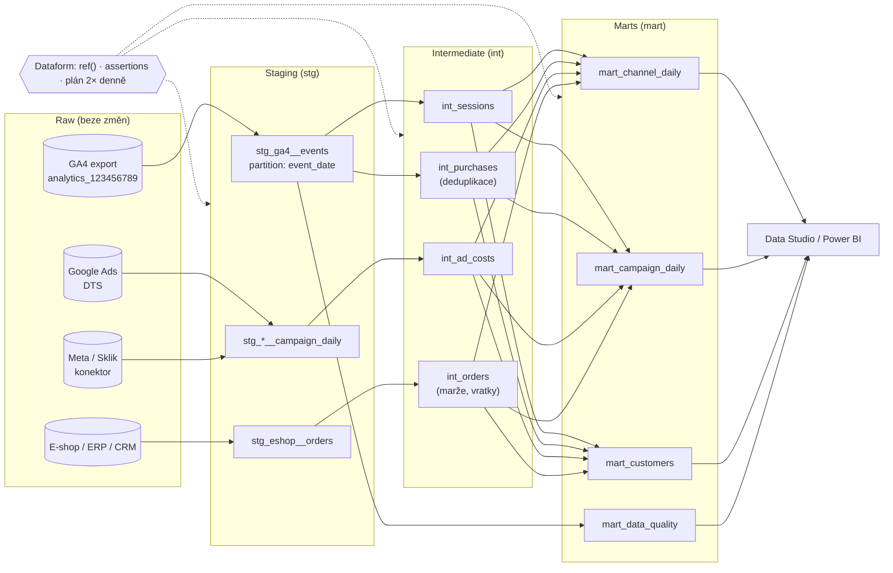

# F3: Zpracování dat v BigQuery: od surových eventů k reportovacím tabulkám – brief
> Cluster: F – BigQuery & zpracování dat · URL: /blog/zpracovani-dat-v-bigquery · Formát: průvodce (architektura + postup) · Priorita: měsíc 2 · Cílová LP: /sluzby/bigquery · Rozsah: 3 200–3 800 slov + kód

> **Klíčové téma klienta** („zpracování dat v BigQuery“). Článek má ukázat, že datalayer.cz neumí jen „zapnout export“, ale postavit udržovatelný marketingový datový sklad – s vrstvami, testy, dokumentací a hlídáním nákladů.

---

## 1. Meta

| Prvek | Návrh |
|---|---|
| H1 | Zpracování dat v BigQuery: od surových eventů k reportům |
| SEO title | Zpracování dat v BigQuery: vrstvy a modely \| datalayer.cz (57 zn.) |
| Meta description | Jak z exportu GA4, Google Ads a dat e-shopu postavit datový sklad pro marketing: vrstvy, relace, atribuce, Dataform vs. dbt, testy a hlídání nákladů. (149 zn.) |
| URL | /blog/zpracovani-dat-v-bigquery |
| Autor | Vít Novotný · revize 6 měsíců |

**Klíčová slova** (Ahrefs CZ):

| Typ | Klíčové slovo | Objem |
|---|---|---|
| Hlavní | zpracování dat bigquery | 0 (strategické téma klienta) |
| Vedlejší | datový sklad | 150 |
| Vedlejší | data warehouse | 200 |
| Vedlejší | data warehouse design | 700 (EN, informační) |
| Vedlejší | datový sklad architektura · řešení pro datový sklad · centrální datový sklad | 10 · 10 · 20 |
| Long-tail | data mart vs data warehouse · data warehouse architecture · dataform · dbt bigquery · ga4 bigquery sessions · channel grouping ga4 bigquery | 0–10 |
| Otázky | What is a data warehouse? (100) · co je datový sklad · is bigquery a data warehouse · what is semantic layer in data warehouse | 0–100 |

**Záměr:** informační/řešení – „jak to postavit správně“, porovnání nástrojů; komerční přesah (dodavatel).
**Čtenář:** Head of e-commerce / marketingu, který má export GA4 a chce „jedno číslo pro všechny“; datový analytik, který staví první sklad; IT ve velké firmě, které posuzuje architekturu. Segmenty: e-shop (náklady + tržby + marže), B2B (leady + CRM), velká firma (governance, orchestrace, dokumentace).

---

## 2. Analýza SERP a konkurence

- **„datový sklad“** (Google.cz): AI přehled, datovysklad.plzensky-kraj.cz, cs.wikipedia, sap.com, nli.gov.cz, azure.microsoft.com, gist.cz (MS SQL / Fabric na míru), krajské weby. → Obecné definice a veřejná správa, **nic o marketingových datech**.
- **„data warehouse design“ (700, EN):** obecné články (Kimball, schémata hvězdy).
- **Konkurence CZ:** digitalniarchitekti.cz (LP „Zpracování a transformace dat“ ~370 slov – Keboola, BigQuery, dbt; bez architektury), datimo.ai (LP „Datové sklady“ ~620 slov, programové stránky „X → BigQuery“, blog „Google Cloud vs. Keboola“, „Pohoda v BigQuery“), revolt.bi a datamind.cz (enterprise DWH, Snowflake/Azure, ne webová analytika), anycoders.cz (ETL služba).
- **Mezera:** česky nikdo nepopisuje **konkrétní architekturu marketingového skladu nad GA4** (vrstvy, sessionizace, přepočet posledních 72 h, náklady z Ads/Meta/Sklik, testy, orchestrace po příchodu exportu, kontrola útraty). Revolt/Data Mind píšou pro datové inženýry v enterprise, Datimo prodává hotový produkt.
- **Čím přeskočíme:** diagram vrstev, tabulka zdrojů „jak dostat data do BigQuery“ (vč. českých Sklik/Heureka/Shoptet/Pohoda), srovnání Dataform vs. dbt vs. plánované dotazy, funkční ukázky SQLX a SQL, checklist testů kvality, hlídání nákladů, tabulka „co postavit pro e-shop / B2B / velkou firmu“.

---

## 3. Otázky, na které musí článek odpovědět

1. Proč nestačí dashboard napojit přímo na export GA4?
2. Co je datový sklad a jak se liší od exportu GA4? (PAA „What is a data warehouse?“)
3. Jaké vrstvy (raw → staging → intermediate → marts) dávají smysl a co v nich je?
4. Jak z událostí postavit relace (sessionizace) a co dělat s daty, která dorazí pozdě?
5. Jak řešit atribuci, když export obsahuje jen last-click zdroj relace?
6. Jak do BigQuery dostat náklady z Google Ads, Meta, Skliku a data z e-shopu/CRM?
7. Dataform, dbt, nebo plánované dotazy – co vybrat?
8. Co jsou inkrementální modely a proč přepočítávat poslední 3 dny?
9. Jak využít partitioning a clustering?
10. Jak testovat kvalitu dat automaticky?
11. Jak spouštět transformace, když export GA4 nechodí v pevný čas?
12. Jak model dokumentovat, aby mu rozuměl i nástupce?
13. Jak hlídat, aby sklad nezačal stát stovky dolarů měsíčně?
14. Co konkrétně postavit pro e-shop, B2B firmu a velkou firmu?

---

## 4. Rychlá odpověď (hotový text, 58 slov)

> Zpracování dat v BigQuery znamená převést surová data (export GA4, náklady z reklam, objednávky, CRM) přes několik vrstev na tabulky, ze kterých se dá přímo reportovat: relace, objednávky, kanály, zákazníci. Transformace píšete v SQL a řídíte nástrojem jako Dataform nebo dbt – s testy, dokumentací a inkrementálním zpracováním, které drží náklady nízko.

---

## 5. Osnova s obsahem odpovědí

### H2 1: Proč surový export nestačí
**Klíčové sdělení:** Export GA4 je deník událostí, ne report. Každý, kdo nad ním počítá „relace“ nebo „tržby z Google Ads“ vlastním dotazem, dostane trochu jiné číslo – a zaplatí za to.

- Vnořené schéma (UNNEST u každého dotazu, → F2), zrnitost = událost.
- **Nekonzistentní definice:** pět analytiků = pět definic relace, kanálu, konverze.
- **Cena a rychlost:** dashboard nad `events_*` čte gigabajty při každém zobrazení (dotazy přes zástupné tabulky se nekešují, → F5).
- **Chybí kontext:** marže, vratky, náklady, kvalita leadů → jiné zdroje.
- **Datový sklad** = místo, kde jsou data z více zdrojů očištěná, propojená a popsaná jednou definicí. BigQuery je technologie skladu; sklad vzniká až architekturou a modely.

### H2 2: Architektura ve čtyřech vrstvách
**Klíčové sdělení:** Každá vrstva má jednu odpovědnost. Surová data se nepřepisují, logika je na jednom místě, reporty čtou jen hotové tabulky.

**Tabulka vrstev (kompletní):**

| Vrstva | Dataset (příklad) | Co obsahuje | Pravidla | Kdo čte |
|---|---|---|---|---|
| Raw (surová) | `analytics_123456789`, `raw_google_ads`, `raw_meta_ads`, `raw_sklik`, `raw_eshop`, `raw_crm` | data přesně tak, jak je zapsal zdroj | nikdy neupravovat; řízené jen konektory | jen datový tým |
| Staging (`stg`) | `stg` | 1:1 se zdrojem, ale zploštělé (UNNEST), přejmenované, správné typy, časová pásma, měny; **partitionované** | žádná byznys logika; jeden model = jeden zdroj | datový tým |
| Intermediate (`int`) | `int` | byznys logika: relace, deduplikované nákupy, sjednocené náklady, mapa identit, objednávky s marží | testované; znovupoužitelné | datový tým, analytici |
| Marts (`mart`) | `mart` | tabulky pro reporty: `mart_channel_daily`, `mart_campaign_daily`, `mart_orders`, `mart_customers`, `mart_funnel_daily`, `mart_data_quality` | malé, agregované, popsané; stabilní názvy sloupců | Data Studio, Power BI, management |
| Sandbox | `sandbox_<jmeno>` | pokusy analytiků | výchozí expirace tabulek (např. 30 dní) | autor |

**Pravidla, která zmínit:**
- Všechny datasety ve **stejném umístění** (např. EU) – dotaz nespojí tabulky z různých regionů (→ F1).
- Prod a dev odděleně (samostatné projekty nebo datasety s prefixem), aby vývoj nezničil reporty.
- Názvosloví: `stg_<zdroj>__<entita>`, `int_<entita>`, `mart_<oblast>_<zrnitost>` (konvence, ne povinnost).

### H2 3: Odkud data přitéct: zdroje a konektory
**Klíčové sdělení:** Google zdroje jdou do BigQuery nativně a zdarma; ostatní přes placené konektory nebo vlastní skript. České zdroje (Sklik, Heureka, Shoptet, Pohoda) je potřeba řešit individuálně.

**Tabulka zdrojů (kompletní):**

| Zdroj | Jak do BigQuery | Cena přenosu (ověřeno 8. 10. 2026) | Poznámka |
|---|---|---|---|
| GA4 události | nativní export (→ F1) | zdarma (platí se úložiště/dotazy, streaming 0,05 USD/GB) | základ skladu |
| GA4 agregované reporty | BigQuery Data Transfer Service (DTS) – konektor GA4 | orchestrace zdarma | jen agregace z Data API; vhodné pro historii před exportem |
| Google Ads | DTS – Google Ads | orchestrace zdarma | tabulky/pohledy `ads_CampaignBasicStats_<customer_id>` aj., náklady v `metrics_cost_micros` |
| Search Ads 360, Campaign Manager 360, DV360, Merchant Center, YouTube | DTS | orchestrace zdarma | podle potřeby |
| Search Console | nativní hromadný export do BigQuery | [OVĚŘIT cenu/podmínky] | SEO data na úrovni dotazů a URL |
| Meta Ads | DTS – konektor Facebook Ads (GA, placený podle slot-hodin) nebo nástroje třetích stran (Supermetrics, Funnel, Fivetran, Airbyte, Dataddo, Keboola…) | DTS: 0,06 USD/slot-hodina (us-central1), odhad až 20 slot-hodin na hodinu běhu ≈ 1,20 USD/h | srovnat cenu a spolehlivost |
| Sklik | API Skliku (Seznam doporučuje API Fénix; starší API Drak nepodporuje rozpady konverzí Seznam Event Measurement) → konektor třetí strany (např. Keboola, Dataddo – **ověřit aktuální nabídku**) nebo vlastní skript (Cloud Run + Cloud Scheduler) | podle nástroje | DTS konektor neexistuje; Sklik konektor pro Data Studio zatím bez rozpadu konverzí |
| Heureka, Zboží.cz | exporty/API nebo konektory třetích stran [OVĚŘIT] | podle nástroje | často jen CSV/XML |
| E-shop (Shoptet, Upgates, WooCommerce, Shopify, vlastní) | API/exporty → Cloud Run skript nebo konektor; databáze MySQL/PostgreSQL přes DTS (placené konektory) nebo replikaci | DTS MySQL/PostgreSQL placené | Shopify má DTS konektor [OVĚŘIT stav a cenu] |
| ERP/účetnictví (Pohoda, Money S3, ABRA, Helios) | export (SQL/XML/CSV) → Cloud Storage → načtení (batch load zdarma) | zdarma (batch load) | marže, nákupní ceny, vratky |
| CRM (HubSpot, Salesforce, Pipedrive, Raynet) | DTS: Salesforce (GA, placený), HubSpot (preview); ostatní přes API/konektory třetích stran | dle konektoru; preview konektory se zatím neúčtují | leady, obchodní případy |

> Zdroj pro DTS: seznam konektorů v dokumentaci BigQuery a sekce „Data Transfer Service pricing“ na cloud.google.com/bigquery/pricing (zdarma: Google Ads, GA4, Campaign Manager, Merchant Center, SA360, YouTube, DV360, Ad Manager, Cloud Storage…; placené GA: Salesforce, ServiceNow, SFMC, Facebook Ads, MySQL, PostgreSQL, Oracle; preview: Stripe, PayPal, HubSpot, Klaviyo, SQL Server).

### H2 4: Staging: zploštění exportu a partitioning
**Klíčové sdělení:** První model, který postavíte, je partitionovaná kopie událostí s vytaženými parametry. Všechny další modely pak čtou levně a rychle.

- Export je *date-sharded* (`events_YYYYMMDD`); Google doporučuje **partitionované tabulky** místo shardovaných (lepší výkon, méně metadat).
- Partition podle `event_date` (DATE), cluster podle `event_name`, `session_key` (max. 4 sloupce pro clustering).
- Vytáhnout jen parametry, které skutečně používáte (seznam z inventury, F2 dotaz 1a); `items` ponechat jako ARRAY pro e-commerce modely.
- Pozdní data: denní tabulka se může měnit až 72 h → **každý běh přepočítá poslední 3 dny** (smazat a znovu vložit).

**Kód – Dataform (SQLX), soubor `definitions/staging/stg_ga4__events.sqlx`:**
```sqlx
config {
  type: "incremental",
  schema: "stg",
  description: "Zploštělé události GA4. 1 řádek = 1 událost. Poslední 3 dny se při každém běhu přepočítají (pozdní data až 72 h).",
  bigquery: {
    partitionBy: "event_date",
    clusterBy: ["event_name", "session_key"]
  },
  columns: {
    session_key: "user_pseudo_id + '.' + ga_session_id; NULL u událostí bez souhlasu",
    consent_analytics: "privacy_info.analytics_storage (Yes/No/Unset)"
  }
}

pre_operations {
  ${when(incremental(),
    `DELETE FROM ${self()} WHERE event_date >= DATE_SUB(CURRENT_DATE('Europe/Prague'), INTERVAL 3 DAY)`)}
}

SELECT
  PARSE_DATE('%Y%m%d', event_date) AS event_date,
  TIMESTAMP_MICROS(event_timestamp) AS event_ts,
  event_name,
  user_pseudo_id,
  user_id,
  (SELECT value.int_value FROM UNNEST(event_params) WHERE key = 'ga_session_id') AS ga_session_id,
  CONCAT(user_pseudo_id, '.',
    CAST((SELECT value.int_value FROM UNNEST(event_params) WHERE key = 'ga_session_id') AS STRING)) AS session_key,
  (SELECT value.int_value FROM UNNEST(event_params) WHERE key = 'ga_session_number') AS ga_session_number,
  (SELECT value.string_value FROM UNNEST(event_params) WHERE key = 'page_location') AS page_location,
  (SELECT COALESCE(value.string_value, CAST(value.int_value AS STRING))
     FROM UNNEST(event_params) WHERE key = 'session_engaged') AS session_engaged,
  (SELECT value.int_value FROM UNNEST(event_params) WHERE key = 'engagement_time_msec') AS engagement_time_msec,
  privacy_info.analytics_storage AS consent_analytics,
  session_traffic_source_last_click.cross_channel_campaign.source AS session_source,
  session_traffic_source_last_click.cross_channel_campaign.medium AS session_medium,
  session_traffic_source_last_click.cross_channel_campaign.campaign_name AS session_campaign,
  session_traffic_source_last_click.google_ads_campaign.campaign_id AS google_ads_campaign_id,
  collected_traffic_source.gclid AS gclid,
  device.category AS device_category,
  geo.country AS country,
  ecommerce.transaction_id AS transaction_id,
  ecommerce.purchase_revenue AS purchase_revenue,
  items
FROM ${ref("events_*")}
WHERE _TABLE_SUFFIX BETWEEN
  ${when(incremental(),
    "FORMAT_DATE('%Y%m%d', DATE_SUB(CURRENT_DATE('Europe/Prague'), INTERVAL 3 DAY))",
    "'20240801'")}
  AND FORMAT_DATE('%Y%m%d', CURRENT_DATE('Europe/Prague'))
```
Doplnit vysvětlení: deklarace zdroje (`type: "declaration"`, `schema: "analytics_123456789"`, `name: "events_*"`), časové pásmo `Europe/Prague` = pásmo vlastnosti GA4 (ověřit v administraci), datum startu `20240801` = od kdy je k dispozici `session_traffic_source_last_click` (u starších dat jiná logika zdroje).

**Totéž v dbt (výňatek, pro srovnání):**
```sql
{{ config(
    materialized = 'incremental',
    incremental_strategy = 'insert_overwrite',
    partition_by = {'field': 'event_date', 'data_type': 'date'},
    cluster_by = ['event_name', 'session_key']
) }}
select
  parse_date('%Y%m%d', event_date) as event_date,
  event_name,
  user_pseudo_id
  -- … stejné sloupce jako výše
from {{ source('ga4', 'events') }}  -- v sources.yml: identifier: 'events_*'
where _table_suffix between
  
    format_date('%Y%m%d', date_sub(current_date('Europe/Prague'), interval 3 day))
  
    '20240801'
  
  and format_date('%Y%m%d', current_date('Europe/Prague'))
```

### H2 5: Sessionizace: model relací
**Klíčové sdělení:** Tabulka relací je „srdce“ marketingového skladu – z ní se počítají kanály, vstupní stránky, konverzní poměry i atribuce.

**Sloupce `int_sessions` (tabulka v článku):** `session_key`, `session_date` (den první události), `session_start_ts`, `session_end_ts`, `user_pseudo_id`, `user_id`, `ga_session_number` (nový/vracející), `landing_page` (první `page_view`, bez query stringu), `session_source`, `session_medium`, `session_campaign`, `google_ads_campaign_id`, `channel_group` (vlastní pravidla), `device_category`, `country`, `is_engaged`, `engagement_time_s`, `page_views`, `purchases`, `revenue`, `has_lead`.

**Kód (SQL jádro modelu):**
```sql
-- int_sessions: 1 řádek = 1 relace (z partitionované stagingové tabulky)
SELECT
  session_key,
  MIN(event_date) AS session_date,
  MIN(event_ts) AS session_start_ts,
  MAX(event_ts) AS session_end_ts,
  ANY_VALUE(user_pseudo_id) AS user_pseudo_id,
  MAX(user_id) AS user_id,
  MAX(ga_session_number) AS ga_session_number,
  ARRAY_AGG(IF(event_name = 'page_view', REGEXP_REPLACE(page_location, r'[?#].*$', ''), NULL)
            IGNORE NULLS ORDER BY event_ts LIMIT 1)[SAFE_OFFSET(0)] AS landing_page,
  ARRAY_AGG(session_source IGNORE NULLS ORDER BY event_ts LIMIT 1)[SAFE_OFFSET(0)] AS session_source,
  ARRAY_AGG(session_medium IGNORE NULLS ORDER BY event_ts LIMIT 1)[SAFE_OFFSET(0)] AS session_medium,
  ARRAY_AGG(session_campaign IGNORE NULLS ORDER BY event_ts LIMIT 1)[SAFE_OFFSET(0)] AS session_campaign,
  ARRAY_AGG(google_ads_campaign_id IGNORE NULLS ORDER BY event_ts LIMIT 1)[SAFE_OFFSET(0)] AS google_ads_campaign_id,
  ANY_VALUE(device_category) AS device_category,
  ANY_VALUE(country) AS country,
  LOGICAL_OR(session_engaged = '1') AS is_engaged,
  SUM(COALESCE(engagement_time_msec, 0)) / 1000 AS engagement_time_s,
  COUNTIF(event_name = 'page_view') AS page_views,
  COUNT(DISTINCT IF(event_name = 'purchase', transaction_id, NULL)) AS purchases,
  SUM(IF(event_name = 'purchase', purchase_revenue, 0)) AS revenue,
  LOGICAL_OR(event_name = 'generate_lead') AS has_lead
FROM `vas-projekt.stg.stg_ga4__events`
WHERE event_date >= DATE_SUB(CURRENT_DATE('Europe/Prague'), INTERVAL 4 DAY)  -- inkrementální okno
  AND session_key IS NOT NULL
GROUP BY session_key
```
**Na co upozornit:** relace přes půlnoc (session_date = den první události; při přepočtu okna brát o den víc), události bez souhlasu nemají `session_key` → do relací nepatří, ale do denních součtů nákupů ano (model `int_purchases` z F2 dotazu 10b počítá i je), `revenue` v relaci je ještě bez deduplikace přes dny → pro tržby používat `int_purchases`.

**Seskupení kanálů (zjednodušená ukázka – vlastní pravidla s českými zdroji):**
```sql
CASE
  WHEN session_source = '(direct)' AND session_medium IN ('(none)', '(not set)') THEN 'Direct'
  WHEN REGEXP_CONTAINS(LOWER(session_medium), r'^(.*cp.*|ppc|retargeting|paid.*)$')
       AND REGEXP_CONTAINS(LOWER(session_source), r'google|bing|seznam|sklik') THEN 'Paid Search'
  WHEN REGEXP_CONTAINS(LOWER(session_source), r'heureka|zbozi') THEN 'Srovnávače'
  WHEN REGEXP_CONTAINS(LOWER(session_medium), r'^(.*cp.*|ppc|paid.*)$')
       AND REGEXP_CONTAINS(LOWER(session_source), r'facebook|instagram|meta|tiktok|linkedin') THEN 'Paid Social'
  WHEN LOWER(session_medium) = 'organic' THEN 'Organic Search'
  WHEN REGEXP_CONTAINS(LOWER(session_source), r'facebook|instagram|linkedin|tiktok|youtube') THEN 'Organic Social'
  WHEN REGEXP_CONTAINS(LOWER(session_medium), r'e[-_ ]?mail|newsletter') THEN 'Email'
  WHEN LOWER(session_medium) IN ('display', 'banner', 'cpm') THEN 'Display'
  WHEN LOWER(session_medium) = 'referral' THEN 'Referral'
  ELSE 'Ostatní / Unassigned'
END AS channel_group
```
Upozornit: GA4 používá vlastní seznamy zdrojů a pravidla (support.google.com/analytics/answer/9756891 – **ověřit aktuální verzi**); vlastní seskupení se nebude shodovat 1:1, ale bude odpovídat vašim UTM pravidlům (→ D5). Výhodou je, že „Srovnávače“ nebo „Sklik“ můžete mít jako samostatný kanál.

### H2 6: Atribuce: co z exportu jde a co ne
**Klíčové sdělení:** Export dává zdroj relace (last non-direct click). Vlastní multi-touch modely jsou možné, ale omezené souhlasem, prohlížeči a zařízeními – vždy je prezentujte jako *jeden z pohledů*, ne pravdu.

- **Co máte:** zdroj relace (`session_traffic_source_last_click`), zdroj první návštěvy (`traffic_source`), surové kliky (`collected_traffic_source`, `gclid`).
- **Co jde postavit:** first-click / last-click / lineární / pozičně vážený model nad cestami **v rámci jednoho `user_pseudo_id`** (nebo `user_id` u přihlášených), lookback např. 30 dní.
- **Omezení:** uživatelé bez souhlasu nemají identifikátor; ITP/smazání cookies cesty trhá; přechod mezi zařízeními bez přihlášení nevidíte; data-driven atribuci GA4 z exportu nepřepočítáte.
- **Doporučení:** v reportu ukazovat (a) GA4 last non-direct, (b) konverze hlášené platformami (Ads, Meta, Sklik), (c) pro rozpočtová rozhodnutí přírůstkové testy / MMM u větších rozpočtů. Detail v D6.

**Kód – cesty ke konverzi (zjednodušený lineární model):**
```sql
-- Lineární atribuce: tržba nákupu se rozdělí rovným dílem mezi kanály relací uživatele v posledních 30 dnech
WITH nakupy AS (
  SELECT user_pseudo_id, transaction_id, MIN(event_ts) AS cas_nakupu, MAX(purchase_revenue) AS trzba
  FROM `vas-projekt.stg.stg_ga4__events`
  WHERE event_name = 'purchase' AND user_pseudo_id IS NOT NULL
    AND event_date BETWEEN DATE '2026-09-01' AND DATE '2026-09-30'
  GROUP BY user_pseudo_id, transaction_id
),
dotyky AS (
  SELECT n.transaction_id, n.trzba, s.channel_group
  FROM nakupy AS n
  JOIN `vas-projekt.int.int_sessions` AS s
    ON s.user_pseudo_id = n.user_pseudo_id
   AND s.session_start_ts BETWEEN TIMESTAMP_SUB(n.cas_nakupu, INTERVAL 30 DAY) AND n.cas_nakupu
  WHERE s.session_date BETWEEN DATE '2026-08-01' AND DATE '2026-09-30'
)
SELECT
  channel_group,
  ROUND(SUM(trzba / pocet_dotyku), 2) AS trzby_linearne
FROM (
  SELECT *, COUNT(*) OVER (PARTITION BY transaction_id) AS pocet_dotyku
  FROM dotyky
)
GROUP BY channel_group
ORDER BY trzby_linearne DESC
```

### H2 7: Náklady z reklam v jedné tabulce
**Klíčové sdělení:** Bez nákladů neuvidíte PNO, ROAS ani CAC. Sjednoťte náklady všech platforem do jedné tabulky se stejnými sloupci.

- `stg_google_ads__campaign_daily` z DTS (`metrics_cost_micros / 1e6`, `metrics_clicks`, `metrics_impressions`, `segments_date`, `campaign_id`), názvy kampaní z `ads_Campaign_<customer_id>`.
- `stg_meta_ads__campaign_daily`, `stg_sklik__campaign_daily` z konektorů.
- `int_ad_costs` = `UNION ALL` se sloupci: `date`, `platform`, `account_id`, `campaign_id`, `campaign_name`, `cost`, `currency`, `clicks`, `impressions` (+ převod měn, DPH: náklady v reklamních systémech jsou bez DPH – tržby sjednotit na bez DPH).
- **Párování s GA4:** Google Ads přes `google_ads_campaign_id` v relaci (autotagging); ostatní platformy přes `utm_campaign` = název/ID kampaně → nutná disciplína v UTM (→ D5).

**Kód – kampaně Google Ads: náklady + relace + tržby (mart):**
```sql
WITH naklady AS (
  SELECT
    segments_date AS den,
    CAST(campaign_id AS STRING) AS campaign_id,
    SUM(metrics_cost_micros) / 1e6 AS naklady,
    SUM(metrics_clicks) AS kliky
  FROM `vas-projekt.raw_google_ads.ads_CampaignBasicStats_1234567890`
  WHERE segments_date BETWEEN DATE '2026-09-01' AND DATE '2026-09-30'
  GROUP BY 1, 2
),
ga4 AS (
  SELECT
    session_date AS den,
    google_ads_campaign_id AS campaign_id,
    COUNT(*) AS relace,
    SUM(purchases) AS nakupy,
    SUM(revenue) AS trzby
  FROM `vas-projekt.int.int_sessions`
  WHERE session_date BETWEEN DATE '2026-09-01' AND DATE '2026-09-30'
    AND google_ads_campaign_id IS NOT NULL
  GROUP BY 1, 2
)
SELECT
  COALESCE(n.den, g.den) AS den,
  COALESCE(n.campaign_id, g.campaign_id) AS campaign_id,
  n.naklady,
  n.kliky,
  g.relace,
  g.nakupy,
  g.trzby,
  ROUND(SAFE_DIVIDE(g.trzby, n.naklady), 2) AS roas,
  ROUND(SAFE_DIVIDE(n.naklady, g.trzby), 4) AS pno
FROM naklady AS n
FULL OUTER JOIN ga4 AS g
  ON n.den = g.den AND n.campaign_id = g.campaign_id
```
Upozornit: tržby z GA4 ≠ tržby z e-shopu (souhlas, blokátory) → v manažerském reportu používat tržby z e-shopu a GA4 jen pro rozpad podle kanálů (→ F4, G3).

### H2 8: Dataform, dbt, nebo plánované dotazy?
**Klíčové sdělení:** Pro marketingový sklad v Google Cloudu je výchozí volba Dataform (zdarma, přímo v BigQuery). dbt dává smysl, když už ho firma používá nebo potřebuje víc skladů. Plánované dotazy stačí na 2–3 jednoduché tabulky.

**Srovnávací tabulka (kompletní, ověřeno 8. 10. 2026):**

| | Plánované dotazy (BigQuery) | Dataform | dbt |
|---|---|---|---|
| Cena nástroje | zdarma (platí se dotazy) | **zdarma** – platí se dotazy v BigQuery, Cloud Logging a případně Cloud Scheduler/Workflows | dbt Core open source; dbt platforma: Developer zdarma (1 vývojář), Starter 100 USD/uživatel/měsíc, Enterprise na dotaz |
| Kde běží | BigQuery | Google Cloud (BigQuery Studio) | lokálně / CI (Core) nebo dbt platforma |
| Jazyk | SQL | SQLX (SQL + config + JavaScript) | SQL + Jinja + YAML |
| Závislosti mezi tabulkami | ruční (časy spuštění) | automatické (`ref()`) | automatické (`ref()`) |
| Verzování | ne | Git (GitHub, GitLab, Azure DevOps, Bitbucket) | Git |
| Testy kvality | ručně | assertions (unikátnost, nenulovost, vlastní podmínky) | testy (generické i vlastní), balíčky |
| Inkrementální modely | ručně (MERGE) | ano | ano |
| Dokumentace | ne | popisy tabulek a sloupců se propisují do BigQuery; synchronizace metadat do katalogu | dbt docs, lineage |
| Plánování | vestavěné | workflow configurations (cron), Workflows/Composer | dbt platforma nebo vlastní orchestrátor |
| Ekosystém | – | menší, Google-only | velký (balíčky, komunita), více skladů |
| Vhodné pro | 1–3 jednoduché tabulky, rychlý start | marketingový sklad na BigQuery (většina klientů) | firmy s dbt / více sklady / velký datový tým |

Poznámka: dbt Labs a Fivetran se sloučily (banner na getdbt.com/pricing) – **ověřit dopad na licence a ceny před publikací**.

### H2 9: Inkrementální modely a přepočet pozdních dat
**Klíčové sdělení:** Inkrementální model zpracuje jen nové dny místo celé historie – je rychlejší a levnější. U GA4 vždy přepočítávejte poslední 3 dny.

- Princip: první běh = celá historie; další běhy = jen okno (např. posledních 3–4 dny), staré oddíly se nemění.
- Strategie: *delete + insert* oddílů (ukázka v H2 4), *MERGE* podle unikátního klíče (Dataform `uniqueKey`, dbt `unique_key`), *insert_overwrite* oddílů (dbt).
- Proč 3 dny: Google uvádí, že denní tabulky se aktualizují až 72 h po dni události (zpožděné události, Measurement Protocol).
- Plný přepočet („full refresh“) při změně logiky – naplánovat mimo špičku a odhadnout cenu dry runem.
- **Ilustrativní výpočet (označit):** střední e-shop, 5 GB exportu měsíčně: plný přepočet 12 měsíců denně ≈ 60 GB × 30 = 1,8 TB/měsíc (~5 USD nad free tier); inkrementálně ≈ 0,5 GB denně ≈ 15 GB/měsíc (zdarma).

### H2 10: Partitioning a clustering v praxi
- **Partitioning** (dělení tabulky podle data): dotaz s filtrem na datum čte jen potřebné oddíly → nižší cena, předem známý odhad. Typy: podle sloupce DATE/TIMESTAMP, podle času načtení, podle celočíselného rozsahu.
- **Clustering** (řazení uvnitř oddílů podle až 4 sloupců): méně přečtených bloků při filtru na tyto sloupce; odhad ceny před spuštěním je u clusterovaných tabulek jen horní mez; BigQuery přeclusterovává automaticky.
- Google: u malých oddílů (cca pod 10 GB) zvážit spíš clustering; neclusterované tabulky nad 64 MB z clusteringu typicky profitují.
- Volitelně `require_partition_filter = TRUE` – dotaz bez filtru na datum skončí chybou (ochrana proti drahým dotazům).

**Kód (DDL):**
```sql
CREATE TABLE IF NOT EXISTS `vas-projekt.mart.mart_channel_daily`
(
  den DATE,
  channel_group STRING,
  relace INT64,
  nakupy INT64,
  trzby NUMERIC,
  naklady NUMERIC
)
PARTITION BY den
CLUSTER BY channel_group
OPTIONS (
  require_partition_filter = TRUE,
  description = 'Denní výkon kanálů: relace a nákupy z GA4, náklady z reklamních systémů.'
);
```

### H2 11: Testy kvality dat
**Klíčové sdělení:** Data, kterým nikdo nevěří, nikdo nepoužívá. Testy běží s každou transformací a při chybě zastaví publikaci do reportů nebo pošlou upozornění.

**Tabulka testů (kompletní):**

| Test | Příklad | Úroveň | Při selhání |
|---|---|---|---|
| Unikátnost | `transaction_id` v `int_purchases`, `session_key` v `int_sessions` | int | zastavit |
| Nenulovost | `session_date`, `transaction_id`, `cost` | stg/int | zastavit |
| Čerstvost | včerejší tabulka exportu existuje do 18:00 | raw | upozornit |
| Objem | počet `purchase` včera vs. průměr 7 dní (±30 %) | stg | upozornit |
| Shoda se zdrojem pravdy | tržby GA4 vs. e-shop za den (podíl spárovaných objednávek) | int | upozornit |
| Referenční integrita | každá kampaň v nákladech má název | int | upozornit |
| Rozsah hodnot | `purchase_revenue` > 0, měna v seznamu | stg | upozornit |
| Osobní údaje | žádný e-mail v `page_location` | stg | upozornit + opravit měření |

**Kód – Dataform assertion (vlastní podmínka, soubor `definitions/assertions/assert_purchases_volume.sqlx`):**
```sqlx
config {
  type: "assertion",
  description: "Včerejší počet nákupů se neodchyluje o víc než 30 % od průměru předchozích 7 dní."
}

WITH denni AS (
  SELECT event_date, COUNT(DISTINCT transaction_id) AS nakupy
  FROM ${ref("stg_ga4__events")}
  WHERE event_name = 'purchase'
    AND event_date BETWEEN DATE_SUB(CURRENT_DATE('Europe/Prague'), INTERVAL 8 DAY)
                       AND DATE_SUB(CURRENT_DATE('Europe/Prague'), INTERVAL 1 DAY)
  GROUP BY event_date
)
SELECT *
FROM (
  SELECT
    MAX(IF(event_date = DATE_SUB(CURRENT_DATE('Europe/Prague'), INTERVAL 1 DAY), nakupy, NULL)) AS vcera,
    AVG(IF(event_date < DATE_SUB(CURRENT_DATE('Europe/Prague'), INTERVAL 1 DAY), nakupy, NULL)) AS prumer
  FROM denni
)
WHERE vcera IS NULL OR ABS(SAFE_DIVIDE(vcera, prumer) - 1) > 0.3
```
(Assertion selže, pokud dotaz vrátí řádky. Jednoduché testy jdou přímo v configu modelu: `assertions: { uniqueKey: ["transaction_id"], nonNull: ["transaction_id"] }`.)

### H2 12: Orchestrace: kdy transformace spouštět
**Klíčové sdělení:** Denní export GA4 nemá pevný čas (typicky odpoledne, někdy až další den). Plánujte s rezervou a s kontrolou čerstvosti, ne „v 6:00 a doufat“.

- **Jednoduše:** Dataform workflow configuration 2× denně (např. 7:00 a 17:00 v pásmu vlastnosti) + okno posledních 3 dnů → co nestihlo dopoledne, dožene odpoledne. Pozor: pokud předchozí běh neskončil, další naplánovaný se přeskočí.
- **Pokročile (velké firmy):** spouštět transformaci událostí – Cloud Logging sink na dokončení zápisu do `events_YYYYMMDD` → Pub/Sub → Workflows/Cloud Functions → spuštění Dataformu. GA4 360 nabízí signál „export complete“ v Cloud Logging (jen 360).
- **Cloud Composer (Airflow):** jen pokud firma orchestruje víc systémů; pro samotný marketingový sklad zbytečně drahý.
- Notifikace: selhání běhu a selhané assertions → e-mail / Slack / Google Chat.

### H2 13: Dokumentace a governance
**Klíčové sdělení:** Model, kterému rozumí jen autor, je technický dluh. Dokumentujte tam, kde se kód píše.

- Popisy tabulek a sloupců v configu (Dataform `description`, `columns`) → propisují se do BigQuery; Dataform synchronizuje metadata do katalogu Google Cloud.
- **Slovník metrik** (tabulka: metrika · definice · vzorec · zdrojová tabulka · vlastník), např. „Tržby = součet `purchase_revenue` deduplikovaných nákupů bez DPH“ (→ G3).
- README v repozitáři: architektura, jak spustit, jak přidat zdroj.
- Přístupová práva po vrstvách (raw jen datový tým, marts pro reporty), servisní účty pro Data Studio/Power BI.
- Změnové řízení: změna definice = pull request + review + záznam v changelogu.

### H2 14: Řízení nákladů
**Klíčové sdělení:** Většina „drahých“ skladů nemá drahá data, ale drahé dotazy: dashboard nad surovými daty, plný přepočet každý den, `SELECT *`.

**Checklist:** inkrementální modely · partition + cluster · reporty jen z marts · v Data Studiu vyšší „čerstvost dat“ (výchozí u BigQuery 12 h) · extrakty · vlastní kvóty (`QueryUsagePerDay` – výchozí 200 TiB/den na projekt; nastavit nižší, např. 1 TiB) a `QueryUsagePerUserPerDay` · maximální účtované bajty u plánovaných dotazů · rozpočtová upozornění v Cloud Billing · štítky (labels) na úlohách · měsíční přehled útraty dotazem nad `INFORMATION_SCHEMA.JOBS`:

```sql
-- Kdo a co utrácí: posledních 30 dní, odhad bez odečtu bezplatného 1 TiB
SELECT
  DATE(creation_time, 'Europe/Prague') AS den,
  user_email,
  COUNT(*) AS dotazy,
  ROUND(SUM(total_bytes_billed) / POW(1024, 4), 3) AS tib_uctovano,
  ROUND(SUM(total_bytes_billed) / POW(1024, 4) * 6.25, 2) AS odhad_usd
FROM `region-eu`.INFORMATION_SCHEMA.JOBS_BY_PROJECT
WHERE creation_time >= TIMESTAMP_SUB(CURRENT_TIMESTAMP(), INTERVAL 30 DAY)
  AND job_type = 'QUERY'
  AND state = 'DONE'
GROUP BY den, user_email
ORDER BY tib_uctovano DESC
```
(Dotazy z Data Studia s pověřením vlastníka se objeví pod e-mailem vlastníka zdroje dat / servisního účtu → snadno poznáte drahý dashboard. Detail a ceny → F5.)

### H2 15: Co postavit pro e-shop, B2B a velkou firmu
**Tabulka (kompletní):**

| | E-shop | B2B / lead-gen | Velká firma |
|---|---|---|---|
| Zdroje | GA4, Google Ads, Meta, Sklik, srovnávače, e-shop (objednávky, položky), ERP (nákupní ceny, vratky) | GA4, Google Ads, LinkedIn/Meta, CRM (leady, obchodní případy), call tracking | vše + více domén/vlastností GA4, více zemí a měn, DWH firmy |
| Klíčové modely | `int_sessions`, `int_purchases`, `int_orders` (s marží), `int_ad_costs`, `mart_channel_daily`, `mart_products`, `mart_customers` | `int_sessions`, `int_leads` (lead_id ↔ CRM), `int_deals`, `mart_funnel_b2b`, `mart_campaign_pipeline` | totéž + `int_identity_map`, multi-property sjednocení, měnové kurzy, governance tabulky |
| KPI | tržby, marže, PNO/ROAS/POAS, CR, AOV, noví vs. vracející zákazníci, LTV | leady, MQL/SQL, CPL, cena za obchodní případ, pipeline, lead-to-deal, délka cyklu | stejné po zemích/značkách + SLA dat |
| Orchestrace | Dataform 2× denně | Dataform 1–2× denně + sync CRM | event-driven, monitoring, oddělené prostředí dev/prod |
| Typická délka zavedení | [DOPLNIT: klient – týdny] | [DOPLNIT] | [DOPLNIT] |

### H2 16: Nejčastější chyby
1. Dashboard přímo na `events_*` (cena, rychlost). 2. Relace počítané po dnech. 3. Bez přepočtu posledních 72 h. 4. Datasety v různých regionech. 5. Tržby z GA4 v manažerském reportu místo tržeb z e-shopu. 6. Žádné testy – chyba měření se objeví až v reportu za měsíc. 7. Logika rozsypaná v Data Studiu (vypočítaná pole) místo v SQL. 8. Jeden člověk, žádná dokumentace.

---

## 6. Vizuály

### 6.1 Diagram architektury (hlavní vizuál pod rychlou odpovědí)

**Finální SVG:** 4 svislé „pruhy“ vrstev zleva doprava (Raw → Staging → Intermediate → Marts), každý s monospace štítkem (`raw`, `stg`, `int`, `mart`) a jemně odlišným odstínem pozadí (`#051125` → `#0b1a30`); uzly = karty s názvem tabulky v Roboto Mono; nad pruhy lišta „Dataform: ref() · testy · plán“ s ikonou ozubeného kola nahrazenou piktogramem `bq`; vpravo obrazovka dashboardu (piktogram `report`). Animace: „datový paket“ putuje zleva doprava, u `int_purchases` se zdvojený paket sloučí v jeden (deduplikace). Mobil: vrstvy pod sebou. Alt text popisuje 4 vrstvy a toky.

### 6.2 Infografika „Inkrementální model“ (H2 9)
Kalendářová lišta 10 dnů; dny 1–6 šedé („hotovo, nemění se“), dny 7–9 cyan („přepočítat – pozdní data až 72 h“), den 10 oranžový („nový den“). Pod tím srovnání „plný přepočet: 12 měsíců čtení denně“ vs. „inkrement: 3–4 dny“ s ilustrativními objemy (označit).

### 6.3 Tabulky
Vrstvy (H2 2), zdroje a konektory (H2 3), Dataform vs. dbt vs. plánované dotazy (H2 8), testy (H2 11), e-shop/B2B/velká firma (H2 15) – kompletní obsah výše.

### 6.4 Mockup Dataformu (H2 8)
Stylizovaný výřez BigQuery Studio → Dataform: vlevo strom `definitions/staging`, `intermediate`, `marts`, `assertions`; uprostřed SQLX `int_sessions`; vpravo graf závislostí (DAG) s 8 uzly, jeden assertion červeně „failed: assert_purchases_volume“. Fiktivní názvy.

---

## 7. Fakta a zdroje

| Tvrzení | Zdroj | Ověřeno | Riziko zastarání |
|---|---|---|---|
| Dataform: SQLX, ref(), assertions, inkrementální tabulky, workflow configurations, Git (GitHub, GitLab, Azure DevOps, Bitbucket), přeskočení běhu, metadata sync | https://docs.cloud.google.com/dataform/docs/overview | 8. 10. 2026 | střední |
| Dataform je zdarma; platí se BigQuery, Cloud Logging, Scheduler/Workflows/Composer | https://cloud.google.com/dataform/pricing | 8. 10. 2026 | nízké |
| dbt ceny: Developer zdarma, Starter 100 USD/uživatel/měs., Enterprise custom; sloučení s Fivetranem | https://www.getdbt.com/pricing | 8. 10. 2026 | **vysoké** |
| Partitioning doporučen před shardingem; typy partition; clustering max. 4 sloupce, >64 MB, ~10 GB oddíly | https://docs.cloud.google.com/bigquery/docs/partitioned-tables, https://docs.cloud.google.com/bigquery/docs/clustered-tables | 8. 10. 2026 | nízké |
| Denní tabulka GA4 se mění až 72 h | https://support.google.com/analytics/answer/9358801, https://developers.google.com/analytics/blog/2023/bigquery-vs-ui | 8. 10. 2026 | nízké |
| DTS konektory a cenové kategorie (zdarma/placené/preview; Facebook Ads 0,06 USD/slot-h; ~20 slot-h/h ≈ 1,20 USD) | https://cloud.google.com/bigquery/pricing (sekce Data Transfer Service), https://docs.cloud.google.com/bigquery/docs/google-analytics-4-transfer (seznam zdrojů v navigaci) | 8. 10. 2026 | **vysoké** |
| Google Ads DTS: tabulky `ads_CampaignBasicStats_`, `p_ads_…`, pole `metrics_cost_micros`, `segments_date` | https://docs.cloud.google.com/bigquery/docs/google-ads-transformation | 8. 10. 2026 | střední |
| Vlastní kvóty: QueryUsagePerDay výchozí 200 TiB/den/projekt, QueryUsagePerUserPerDay | https://docs.cloud.google.com/bigquery/docs/custom-quotas | 8. 10. 2026 | střední |
| Zástupné tabulky se nekešují | https://docs.cloud.google.com/bigquery/docs/querying-wildcard-tables | 8. 10. 2026 | nízké |
| Signál „export complete“ jen 360 | https://support.google.com/analytics/answer/9358801 | 8. 10. 2026 | střední |
| Výchozí seskupení kanálů GA4 – pravidla | https://support.google.com/analytics/answer/9756891 | **ověřit před publikací** | střední |
| Search Console hromadný export do BigQuery – podmínky | dokumentace Search Console | **ověřit před publikací** | střední |
| Sklik API Fénix vs. Drak (rozpady SEM), Sklik konektor pro Data Studio bez rozpadu konverzí | https://napoveda.sklik.cz/merici-skripty/seznam-event-measurement/zaciname-se-sem/co-je-dobre-vedet/ | 8. 10. 2026 | vysoké |
| Sklik / Heureka konektory třetích stran (Keboola, Dataddo…) | weby dodavatelů | **ověřit před publikací** | vysoké |

---

## 8. Interní odkazy a CTA

**Cílová LP:** /sluzby/bigquery

**Kontextový CTA box** (za H2 8 – po srovnání nástrojů):
- Nadpis: **Postavíme vám marketingový datový sklad, který přežije i změnu týmu**
- Text: Navrhneme vrstvy, napíšeme modely v Dataformu s testy a dokumentací a nastavíme hlídání nákladů. Kód je ve vašem Gitu a v Google Cloudu – bez závislosti na nás.
- Tlačítko: `[ Konzultovat datový sklad ]` → /sluzby/bigquery#kontakt

**Související články:** F1 Export GA4 do BigQuery · F2 SQL pro GA4 · F4 Propojení e-shopu a CRM s GA4 · F5 Kolik stojí BigQuery · G1 Data Studio (Looker Studio) · G3 Marketingový dashboard · D5 UTM parametry (/blog/utm-parametry) · D6 Atribuce · E3 Offline konverze z CRM (/blog/offline-konverze-z-crm).
**Slovník:** Datový sklad · BigQuery · Atribuční model · Data-driven atribuce · UTM parametry.
**Související LP:** /sluzby/dashboardy-a-reporting · /reseni/velke-firmy · /reseni/e-shopy.

**Zkrácený kontaktní blok:** `form_id: blog` · téma `BigQuery & dashboardy` · H2 „Řešíte totéž u sebe?“ · placeholder „Např. máme export GA4 a náklady z Ads, ale každý report počítá jiné číslo…“

---

## 9. FAQ pro schema

**Co je datový sklad pro marketing?**
Je to databáze, ve které jsou na jednom místě data z analytiky, reklamních systémů, e-shopu a CRM – očištěná, propojená a popsaná jednotnými definicemi. Reporty z něj čtou hotové tabulky, takže všechna oddělení vidí stejná čísla. V Google Cloudu se pro to typicky používá BigQuery.

**Potřebuji Dataform, nebo stačí plánované dotazy?**
Pro dvě tři jednoduché tabulky plánované dotazy stačí. Jakmile máte závislosti mezi tabulkami, více zdrojů nebo více lidí, vyplatí se Dataform: hlídá pořadí výpočtů, verzuje kód v Gitu, spouští testy a dokumentuje sloupce. Dataform je zdarma, platíte jen dotazy v BigQuery.

**Proč přepočítávat poslední tři dny dat z GA4?**
Google uvádí, že denní tabulky exportu se mohou aktualizovat až 72 hodin po dni události, například kvůli zpožděným událostem z aplikací nebo Measurement Protocolu. Pokud byste zpracovali každý den jen jednou, chyběla by vám část dat. Přepočet krátkého okna je levný a problém řeší.

**Jak do BigQuery dostat náklady ze Skliku nebo Mety?**
Náklady z Google Ads načte Data Transfer Service zdarma. Pro Metu existuje placený konektor DTS nebo nástroje třetích stran. Sklik nativní konektor v BigQuery nemá – data se načítají přes API Skliku vlastním skriptem nebo přes konektor třetí strany. Vše pak sjednotíte do jedné tabulky nákladů.

**Kolik stojí provoz marketingového datového skladu v BigQuery?**
U malých a středních webů se náklady na BigQuery často vejdou do bezplatné úrovně nebo jednotek dolarů měsíčně, pokud modely běží inkrementálně a dashboardy čtou agregované tabulky. Drahé jsou plné přepočty celé historie a reporty napojené na surová data. Modelové výpočty najdete v článku o ceně BigQuery.

---

## 10. Poznámky pro autora

- **Kód:** SQL části zkontrolovány parserem (BigQuery dialekt); SQLX syntaxe podle dokumentace Dataform – **spustit na testovacím projektu** (deklarace `events_*`, `when(incremental())`, `${self()}`). V dbt ukázce ověřit konfiguraci source s `identifier: 'events_*'`.
- **Kanálová pravidla** jsou zjednodušená a záměrně „česká“ (srovnávače, Sklik) – v textu jasně říct, že nejde o kopii pravidel GA4.
- **Rychle zastarává:** ceny a stav konektorů DTS (preview → GA = začnou se účtovat), dbt licence po sloučení s Fivetranem, Dataform funkce (Gemini, MCP).
- **Co dodá klient:** [DOPLNIT: typické délky projektů pro e-shop/B2B/velkou firmu], [DOPLNIT: anonymizovaný screenshot DAG z reálného projektu], [DOPLNIT: mini-případovka – např. „po přechodu na inkrementální modely klesly náklady z X na Y USD měsíčně“], [DOPLNIT: preferovaný nástroj (Dataform/dbt) a proč].
- **Tón:** nepodceňovat Revolt/Data Mind – jsme „marketingový sklad nad kvalitním sběrem dat“, ne enterprise BI. Možný partnerský odkaz neuvádět bez souhlasu klienta.
- Recenzent: Vít Novotný + ideálně datový inženýr.
